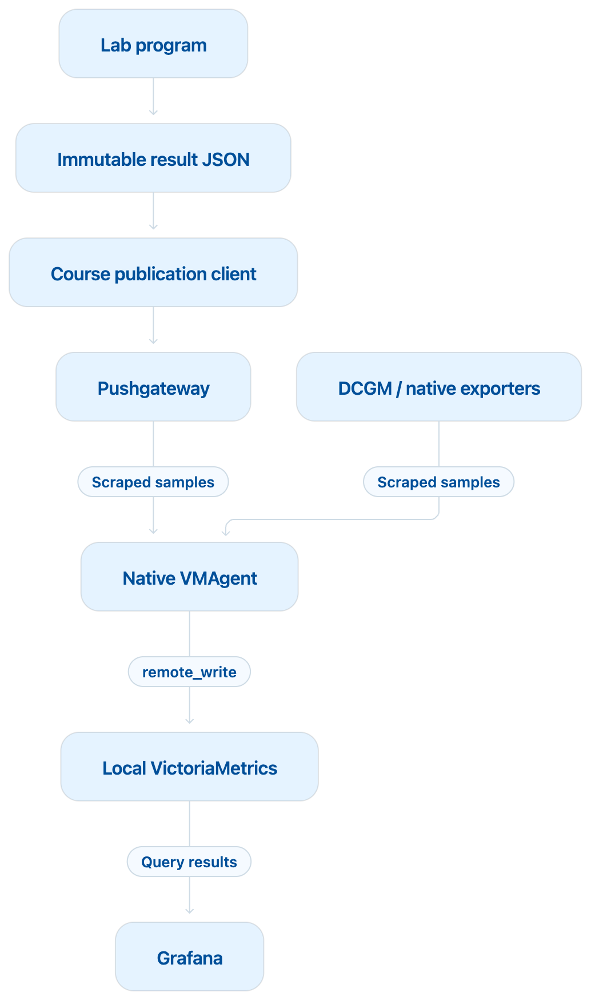

# Performance Engineering Courses

Start with [Soperator](soperator/index.html), then [GPU Fundamentals](gpu-fundamentals/index.html)
and [GPU Performance Optimization](gpu-optimizations/index.html). Continue with
[LLM Training](llm-training/index.html), [LLM Inference](llm-inference/index.html),
or [Custom CUDA Kernels](custom-cuda-kernels/index.html); these specializations
are independent. [Advanced GPU Communication](advanced-gpu-communication/index.html)
owns the multi-GPU, multi-node experiments.

Every course ends with one Where to Go Next, one A–Z Glossary, and then
Official references. Lessons and performance-tool guides share these course-wide
sections; optional lesson References follow Mental model and come last.

[Browse the catalog](index.html) · [Read this guide online](https://nebius.github.io/nebius-ps-services/courses/lab-guide.html) ·
[Course maintainer guide](docs/maintaining-courses.md)

Each practical course offers one combined Grafana dashboards, Small and Large
results ZIP for comparison, plus a link to this lab setup guide. Use
`sync-labs.sh` to copy the original lab scripts and runtime files to the cluster;
no lab-kit ZIP is needed. `./build-courses.sh` rebuilds and checks course HTML
and the combined results archives.

The seven courses share one reading format: numbered references, bulleted next
steps and a separate glossary. Use each lesson’s Objective and Practice to
follow its learning route.

## How to set up the lab

Prepare the shared cluster and monitoring once, then each course runtime you need.
**Workstation** means your local computer; **Login node** means after SSH.
Workloads run on GPU workers through Slurm.

### Prerequisites and hardware

The five ordinary GPU courses use one full H100 per allocation. Prepare two workers
with one H100 each, or reuse the advanced cluster with one-GPU allocations.
Advanced communication requires two eight-H100 SXM workers, local NVLink/NVSwitch
and active InfiniBand. TCP/IP connectivity alone does not qualify that route.

**Workstation:** install [nebius-cxcli](https://github.com/nebius/nebius-ps-services/tree/main/services/nebius-cxcli),
authenticate the Nebius CLI, and have kubectl, Python 3, Git, Bash, SSH and rsync.
The login account needs SSH-key access, rsync and storage shared at the same path
with workers. Check quota and regional hardware availability before provisioning.

```bash
git clone https://github.com/nebius/nebius-ps-services.git
cd nebius-ps-services/courses
export COURSES_ROOT="$PWD"
```

### Create and deploy Soperator

Soperator runs Slurm on Kubernetes. Select the required workers in the wizard,
retain local monitoring, and configure persistent `/data` storage for reports.
Use the configuration path and exact target printed by the wizard:

```bash
nebius-cxcli soperator create ./deployments
export CLUSTER_CONFIG='<absolute path to the created config.yaml>'
export CLUSTER_TARGET='<exact Soperator target name>'
nebius-cxcli render "$CLUSTER_CONFIG"
nebius-cxcli deploy "$CLUSTER_CONFIG"
export KUBECONFIG='<absolute path to this cluster kubeconfig>'
nebius mk8s cluster get-credentials --id '<cluster_ID>' --external --kubeconfig "$KUBECONFIG"
export CLUSTER_CONTEXT='<context for this cluster in that kubeconfig>'
```

Use this deployment's cluster ID, following the [Nebius Kubernetes connection guide](https://docs.nebius.com/kubernetes/connect).
For an already prepared cluster, reuse its accepted configuration and target.

### Install profiling tools and viewers

**Workstation:** after deployment, install shared Nsight Systems, Nsight Compute
and their private browser viewers. First-time setup uses masked credential prompts:

```bash
nebius-cxcli soperator profiling install "$CLUSTER_CONFIG" --target "$CLUSTER_TARGET" --interactive
```

With valid existing viewer credentials, use
`nebius-cxcli soperator profiling install <config.yaml> --target <target>`.
Keep the two forwarding commands printed by the installer. Install profiling
before monitoring changes and dashboard imports: installation requires an accepted
deployment with matching configuration and rendered state.

cxcli owns the paired tool/viewer versions. Already-open login shells load them
with `source /etc/profile.d/99-nsight.sh`. Check `nsys --version` and `ncu --version`;
actual worker/container captures are verified in environment readiness below.

### How measurements reach Grafana

Each lab saves its benchmark measurements in an immutable JSON result file.
The course publication client sends selected baseline and candidate measurements,
such as execution time and throughput, to Pushgateway. Separately, DCGM and native
exporters expose GPU and cluster telemetry.

VMAgent scrapes both sources and writes the samples to local VictoriaMetrics.
Grafana queries VictoriaMetrics to display the measurements and comparisons in
course dashboards. Precise benchmark timings come from the lab results; GPU
telemetry is sampled over time. The original JSON files remain the authoritative
results.



Arrows show data flow. VMAgent initiates scrapes; Grafana initiates queries.

### Install Grafana on the cluster

**Workstation:** cxcli installs Grafana and Pushgateway and configures the native
VMAgent results scrape. Substitute the deployment configuration and exact target:

```bash
nebius-cxcli grafana install --config ./config.yaml --target CLUSTER_TARGET --pushgateway
```

Keep metrics storage **local** in the installer; **both** also supports course
readback. Remote-only metrics do not support this course setup. Reuse the accepted
private installation when already configured. The installer owns these services;
the course helper only discovers connections and verifies their identities.

After installation, prepare a persistent learner identifier and a fresh private
output directory. Use the same explicit kubeconfig and context selected above:

```bash
cd "$COURSES_ROOT/gpu-fundamentals"
export COURSE_WORKSPACE='<persistent lowercase learner identifier>'
export COURSE_SETUP_DIR="$(dirname "$CLUSTER_CONFIG")/course-monitoring/$CLUSTER_TARGET"
python3 -m venv "$HOME/.gpu-course-tools"
"$HOME/.gpu-course-tools/bin/pip" install -r tools/profiling-requirements.txt
"$HOME/.gpu-course-tools/bin/python" tools/course_setup.py \
  --config "$CLUSTER_CONFIG" --target "$CLUSTER_TARGET" \
  --kubeconfig "$KUBECONFIG" --context "$CLUSTER_CONTEXT" \
  --workspace "$COURSE_WORKSPACE" --output-dir "$COURSE_SETUP_DIR"
source "$COURSE_SETUP_DIR/laptop-environment.sh"
```

Keep deployment and connection files private. If the installation changes, rerun
discovery into a fresh directory and replace the copied course environment file.

### Import course dashboards

Start the Grafana connection in [Browsing Grafana and Nsight Profilers](#browsing-grafana-and-nsight-profilers).
In Grafana select or create `course-gpu-fundamentals` using
**Dashboards → New → New folder**. Copy its UID from `/dashboards/f/<uid>/...`
in the address bar; its name is not its UID.

**Workstation:** import every dashboard for the selected course, including
Environment readiness. Repeat for each course you will use with its own
`course-<course-name>` folder and observed UID:

```bash
export COURSE='gpu-fundamentals'
export COURSE_GRAFANA_FOLDER_UID='<observed course folder UID>'
cd "$COURSES_ROOT/$COURSE"
nebius-cxcli grafana import ./reference/grafana --recursive \
  --config "$CLUSTER_CONFIG" --target "$CLUSTER_TARGET" \
  --folder-uid "$COURSE_GRAFANA_FOLDER_UID" \
  --datasource-map "course-soperator-metrics=$COURSE_DATASOURCE_UID"
nebius-cxcli grafana validate ./reference/grafana --recursive \
  --config "$CLUSTER_CONFIG" --target "$CLUSTER_TARGET" \
  --datasource-map "course-soperator-metrics=$COURSE_DATASOURCE_UID"
```

Imports take effect immediately. Add `--overwrite` only when intentionally updating
those dashboards. Validation checks JSON and bindings; inspect the rendered
contents separately. Individual labs reuse their prepared dashboards.

### Prepare course runtimes

**Workstation, from `courses/` in your Git clone:**

```bash
./sync-labs.sh '<slurm-login-ip-address>'
```

This copies the courses and opens SSH in `~/courses`. A bare address uses `root`;
use `user@<slurm-login-ip-address>` for another account. Rerun after local changes
before submitting jobs; remote-only results remain in place. See `--help` for
SSH identity, port and sync-only options.

The script transfers source; prepare dependencies below once on the login node.
From a separate workstation terminal, copy the private monitoring environment to
that same account (match any custom SSH port/key):

```bash
scp "$COURSE_SETUP_DIR/environment.sh" '<user>@<slurm-login-ip-address>:courses/.course-environment.sh'
```

**Login node:** select the course and prepare shared publishing dependencies once:

```bash
umask 077
export COURSE='gpu-fundamentals'
cd "$HOME/courses/$COURSE"
source "$HOME/courses/.course-environment.sh"
source /etc/profile.d/99-nsight.sh
export COURSE_TOOLS="$HOME/courses/.profiling-tools"
python3 -m venv "$COURSE_TOOLS/venv"
"$COURSE_TOOLS/venv/bin/pip" install -r tools/profiling-requirements.txt
export COURSE_PUBLISH_PYTHON="$COURSE_TOOLS/venv/bin/python"
mkdir -p "$HOME/courses/.runtime"
```

**Python courses:** create an isolated environment per course. Fundamentals,
Optimizations, Training and Advanced Communication use `requirements.txt`;
Inference uses `requirements-mechanics.txt` for its local mechanics labs.
For Custom CUDA Kernels, skip this Python block and use Lab 13 below.

```bash
requirements='requirements.txt'
if [ "$COURSE" = llm-inference ]; then requirements='requirements-mechanics.txt'; fi
python3 -m venv "$HOME/courses/.venvs/$COURSE"
export COURSE_PYTHON="$HOME/courses/.venvs/$COURSE/bin/python"
"$COURSE_PYTHON" -m pip install -r "$requirements"
export COURSE_TORCHRUN="$HOME/courses/.venvs/$COURSE/bin/torchrun"
export COURSE_CUDNN_LIB="$("$COURSE_PYTHON" -c 'import importlib.util; print(next(iter(importlib.util.find_spec("nvidia.cudnn").submodule_search_locations)) + "/lib")')"
test -f "$COURSE_CUDNN_LIB/libcudnn.so.9"
export LD_LIBRARY_PATH="$COURSE_CUDNN_LIB${LD_LIBRARY_PATH:+:$LD_LIBRARY_PATH}"
declare -p COURSE_TOOLS COURSE_PUBLISH_PYTHON COURSE_PYTHON COURSE_TORCHRUN COURSE_CUDNN_LIB \
  > "$HOME/courses/.runtime/$COURSE.sh"
```

For specialized runtimes, continue in the owning guide:

- [Inference serving](llm-inference/README.md#serving-runtime-preparation): container images and the separate serving client.
- [CUDA Lab 13](custom-cuda-kernels/reference/labs/13_h100_preflight.md): CUDA image, CUTLASS and the course build.
- [Training Lab 22](llm-training/reference/labs/22_transformer_engine_fp8.md): compatible Transformer Engine, CUDA headers and runtime compiler.
- [Advanced runtime preparation](advanced-gpu-communication/README.md#runtime-preparation): fabric tools and vendor environments.

### Verify environment readiness

**Workstation, selected course directory:** require exactly one healthy results
scrape and fresh telemetry for all GPUs on both workers:

```bash
"$HOME/.gpu-course-tools/bin/python" tools/verify_monitoring.py \
  --receipt "$COURSE_SETUP_DIR/monitoring.json" \
  --kubeconfig "$KUBECONFIG" --context "$CLUSTER_CONTEXT"
```

**Login node, selected course directory:** verify both workers in the actual runtime:

```bash
srun --nodes=2 --ntasks=2 --ntasks-per-node=1 --gpus-per-task=1 \
  "$COURSE_PYTHON" tools/readiness.py
```

For CUDA, replace the Python invocation with
`"$COURSE_CONTAINER_RUNNER" "$CUDA_IMAGE_DIGEST" python3 tools/readiness.py --workload cuda`.
For inference containers, use the runner with `"$VLLM_IMAGE_DIGEST" python3 tools/readiness.py --workload torch`
and export `COURSE_RUNTIME_ID` as that digest. For CUDA export
`COURSE_RUNTIME_ID="$CUDA_IMAGE_DIGEST"` before the check. Repeat for each execution runtime.
Publish the two printed JSON paths from the same runtime:

```bash
"$COURSE_PUBLISH_PYTHON" tools/publish_results.py --lab environment_readiness \
  --baseline "${WORKER_ONE_RESULT:?first worker JSON path}" \
  --candidate "${WORKER_TWO_RESULT:?second worker JSON path}" --expected-generation 0
```

For later selections use the reviewed current generation. Open **Environment
readiness** in the course Grafana folder, then inspect both workers' reports using
the viewing steps below. Require matching canary kernels, NVTX, Compute counters
and publication generation.

## How to run the labs

Reconnect with `./sync-labs.sh '<slurm-login-ip-address>'` from your workstation.
For a downloaded lab kit, extract it on a prepared login node and enter its
course directory; synchronization requires a Git clone.

### Select a course and run a lab

**Login node:** restore the prepared runtime. Follow the syllabus; lab numbers
identify files rather than a universal execution order.

```bash
umask 077
export COURSE='gpu-fundamentals'
cd "$HOME/courses/$COURSE"
source "$HOME/courses/.course-environment.sh"
source "$HOME/courses/.runtime/$COURSE.sh"
source /etc/profile.d/99-nsight.sh
if [ -n "${COURSE_CUDNN_LIB:-}" ]; then
  export LD_LIBRARY_PATH="$COURSE_CUDNN_LIB${LD_LIBRARY_PATH:+:$LD_LIBRARY_PATH}"
fi
python3 tools/submit_lab.py --lab 01_cpu_gpu_crossover \
  slurm/single_gpu.sbatch labs/01_cpu_gpu_crossover.py --profile small
```

Use each lab's own command and runtime prerequisites for other courses.
`small` and `large` select workload presets, independently of GPU model or the baseline/candidate choice. Some qualification, modeling and fixed server experiments use identical parameters in both profiles. Compare the effective configuration recorded by each lab, and keep the same profile within a comparison.

The submitter prints its job ID and private log directory. Slurm writes
`results/<lab>/logs/<job>.out` and `.err` in the remote course directory.
After completion inspect the job and authoritative JSON results:

```bash
sacct -j '<job-id>' --format=JobID,State,ExitCode
"$COURSE_PUBLISH_PYTHON" tools/inspect_results.py --lab 01_cpu_gpu_crossover --job '<job-id>'
```

### Capture a profile

Submit separate diagnostic runs; instrumentation changes timing. Systems shows
CUDA activity and dependencies; Compute examines one selected kernel's counters.

```bash
python3 tools/submit_lab.py --lab 01_cpu_gpu_crossover \
  --export=ALL,COURSE_PROFILE_TOOL=nsys \
  slurm/single_gpu.sbatch labs/01_cpu_gpu_crossover.py --profile small
```

Identify the measured kernel in Systems, then capture it with Compute:

```bash
export COURSE_PROFILE_KERNEL='<regular expression matching the measured kernel>'
python3 tools/submit_lab.py --lab 01_cpu_gpu_crossover \
  --export=ALL,COURSE_PROFILE_TOOL=ncu \
  slurm/single_gpu.sbatch labs/01_cpu_gpu_crossover.py --profile small
```

Use each lab's declared capture recipe; distributed, server and CPU-only labs
have specific applicability limits. A nonempty report alone does not establish
that it captured the experiment.

Kernel expressions match full demangled names, with name simplification
disabled. This includes template arguments: a GEMM may appear as `Kernel2` in
the short-name view while its full name identifies the matrix operation.

### Compare results in Grafana

Choose two successful, equivalent, unprofiled runs and follow the lab's allowed
comparison. From the login node publish their printed JSON paths:

```bash
"$COURSE_PUBLISH_PYTHON" tools/publish_results.py --lab 01_cpu_gpu_crossover \
  --baseline "${BASELINE_RESULT:?baseline JSON path}" \
  --candidate "${CANDIDATE_RESULT:?candidate JSON path}" \
  --expected-generation "${COMPARISON_GENERATION:?0 initially; otherwise reviewed generation}"
```

Inspect the selected comparison using the [Grafana browsing steps](#browsing-grafana-and-nsight-profilers).

### Optional agent-assisted runs

From the workstation's `courses/` directory install the project-scoped skill:

```bash
npx --yes skills add ./skills/run-labs -a codex --yes
```

The first `--yes` skips npm confirmation; the last skips the skill wizard and
optional extra-skill offer. Do not add `--global`. Use `-a claude-code` for Claude.
On a prepared environment, `$run-labs run --course gpu-fundamentals` runs both
workload profiles and collects verified results. See the [run-labs skill](skills/run-labs/SKILL.md)
for selection, resume and evidence details.
For qualification labs without numeric metrics, the evidence crop must show
the selected generation and both correctness values after the panels render.
The skill independently rechecks the prepared monitoring runtime before jobs.
Resuming alone does not repeat setup or issue new connection files; missing
runtime prerequisites still block execution. Existing local-only metrics routing
must remain local-only.
The campaign may fully recover its identified Grafana service, Nsight
Systems/Compute viewers and streamers, `nsys`/`ncu` runtimes, browser sessions and
owned forwards as often as needed, without a fixed recovery count or repeated
approval within existing target authority. It restores exact-target loopback
connections for all three services, retaining Nsight HTTP/TURN mappings, and
checks visible browser responses. If reconnection is insufficient, it may restart
the affected authorized deployment/service while preserving configuration,
persistent storage, originals and unrelated work. Exited prior-session forwards
reuse existing access authorization; local reconnection does not need remote
service-restart approval.
A terminal profiler-tool failure is recovered through a fresh campaign for only
the affected lab/profile after diagnosis, repair and normal claim release. That
unit runs its complete unchanged recipe; unaffected completed units and failed
evidence are preserved. Viewer-only recovery resumes capture without GPU replay.
See [recovery details](skills/run-labs/references/tool-recovery.md).
For transfer-only labs such as Fundamentals Lab 03, run-labs verifies the
declared memory copies and their actual Systems views. A CUDA kernel is not
required to demonstrate a host-to-device transfer.

Inference Lab 10 retains the guide's in-process diagnostic mode and requests
256 GiB of host memory only for Compute replay. The runner freezes this request
on that stage; clean timing retains its normal engine mode and allocation.
Compute selects a matrix kernel in measured generation; verify its role in
Systems before interpreting counters for that individual launch.

Inference Lab 30 runs two fresh qualification jobs per protocol in each profile.
It publishes OpenAI and Triton pairs separately; the bounded requests qualify
their APIs without establishing an engine speedup or latency distribution.
Before submitting container jobs, verify that the prepared runner admits the
newly synchronized campaign workspace and can import its required packages; see the
[prepared environment checks](skills/run-labs/references/environment.md).

Inference Lab 35 repeats each CUDA, CPU and one-token CPU configuration for
separate equivalent publications. Only its CUDA configuration has a Systems
capture; both profile labels retain the same fixed bigram exercise.

Inference Lab 32 and Training Lab 31 each run two independent three-trial
capstone groups. Retain all six originals and both aggregates; publish
corresponding children with matching seeds and variant orders. Training Lab 32
repeats each device configuration separately and profiles only CUDA. Inference
Lab 36 publishes five one-control policy comparisons; its computed costs are
model outputs, not measured storage or serving latency.

## Browsing Grafana and Nsight Profilers

### Connect from your workstation

Run **one forwarding command per terminal** and keep all three running.
In each terminal restore this cluster's `KUBECONFIG`, `CLUSTER_CONTEXT` and
`COURSE_SETUP_DIR`, then run `source "$COURSE_SETUP_DIR/laptop-environment.sh"`.
For Nsight, replace the namespace and service placeholders with the values in
the profiling installer's output. The examples use its default HTTP/TURN ports;
retain the installed mappings if customized. See the
[kubectl port-forward reference](https://kubernetes.io/docs/reference/kubectl/generated/kubectl_port-forward/).

**Terminal 1 — Grafana:**

```bash
kubectl --kubeconfig "$KUBECONFIG" --context "$CLUSTER_CONTEXT" \
  -n "$COURSE_GRAFANA_NAMESPACE" port-forward --address 127.0.0.1 \
  "service/$COURSE_GRAFANA_SERVICE" "3000:$COURSE_GRAFANA_PORT"
```

**Terminal 2 — Nsight Compute:**

```bash
kubectl --kubeconfig "$KUBECONFIG" --context "$CLUSTER_CONTEXT" \
  -n '<Compute viewer namespace>' port-forward --address 127.0.0.1 \
  'service/<Compute viewer service>' 30081:30081 30479:30479
```

**Terminal 3 — Nsight Systems:**

```bash
kubectl --kubeconfig "$KUBECONFIG" --context "$CLUSTER_CONTEXT" \
  -n '<Systems viewer namespace>' port-forward --address 127.0.0.1 \
  'service/<Systems viewer service>' 30080:30080 30478:30478
```

Both port mappings are required for each Nsight viewer. If a forward exits,
restart that command before reconnecting.

| Dashboard | Browser URL | What to inspect |
| --- | --- | --- |
| Grafana | `http://127.0.0.1:3000` | Lab measurements and sampled GPU telemetry |
| Nsight Compute | `http://127.0.0.1:30081` | A selected kernel's counters and bottlenecks |
| Nsight Systems | `http://127.0.0.1:30080` | CUDA activity, NVTX ranges and CPU/GPU dependencies |

### Browse Grafana

Sign in with the Grafana credentials from your private Kubernetes secret viewer.
During first-time setup, create the course folder and [import its dashboards](#import-course-dashboards).
For completed runs, open **Dashboards**, choose `course-<course-name>`, and open
the lab's dashboard or **Environment readiness**.

Select workspace and profile, verify both
correctness slots and the publication generation, then set the telemetry window
to the experiment interval. Select GPU worker and local GPU index together.
Sampled telemetry provides context; unprofiled measurements determine performance.

### Browse Nsight Compute and Systems

**Login node:** the helper prints the private report path. Copy only a selected
completed native report into the installed report submount. These copies are
readable by viewer users; original results and logs remain private.

```bash
(
set -eu
report='<absolute path to the selected completed report>'
if [ ! -f "$report" ] || [ -L "$report" ] || [ ! -s "$report" ]; then
  printf 'Select a nonempty regular report file.\n' >&2
  exit 1
fi
case "$report" in *.nsys-rep|*.ncu-rep) ;; *) exit 1 ;; esac
viewer_dir="$(mktemp -d /data/nsight-reports/course-view-XXXXXXXX)"
chmod 755 "$viewer_dir"
install -m 644 "$report" "$viewer_dir/$(basename "$report")"
sha256sum "$report" "$viewer_dir/$(basename "$report")"
printf 'Viewer directory: /mnt/reports/%s\n' "$(basename "$viewer_dir")"
)
```

Require identical hashes. `/data/nsight-reports` is the default producer root;
use the actual submount selected by installation. The viewer exposes it at
`/mnt/reports`. Finish report processing before opening its read-only copy.

Sign in to each Nsight URL with its installer-configured viewer credentials.
In Compute, open the copied `.ncu-rep` under `/mnt/reports/<viewer-directory>`
and inspect the kernel and counters specified by the lab. In Systems, open the
copied `.nsys-rep`, expand the process tree, CUDA streams and NVTX rows, and zoom
to the measured interval. Follow the lab's inspection steps; initialization-only
activity does not establish that the experiment was captured.

© 2026 Nebius B.V. Free educational material under [Apache License 2.0](../LICENSE).

The build requires Python 3 and Git. Each practical course downloads one
`reference/<slug>-lab-results.zip` containing dashboards and Small/Large results.
The build checks the complete repository publication candidate against a
104,857,600-byte per-file cap and a conservative 1,000,000,000-byte site cap
before replacing outputs, and reports remaining capacity. See
`docs/course-builder.md` for inventory and failure behavior.
