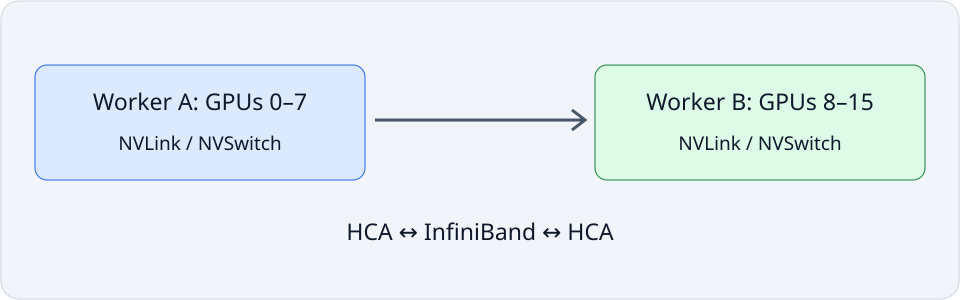

# Lab 01: Verify the GPU fabric and rank placement

A rank is one participating process, and its local rank chooses a GPU on its own node. In this experiment you will measure a baseline, inspect the evidence, and change one control while keeping useful work fixed. The goal is a defensible explanation backed by correctness checks and repeated observations; a candidate is allowed to be slower.

## Before you start

Complete the [Lab Guide](../../../README.md#how-to-set-up-the-lab) before starting.

**Advanced fabric route:** use the separate Soperator cluster with two eight-H100 workers (16 GPUs), healthy intra-node NVLink/NVSwitch and active inter-node InfiniBand. The base two one-GPU TCP workers are useful for local labs but cannot establish this fabric’s performance.

Keep model, software, clocks and other workload activity fixed; preserve private artifacts for both runs.

**Login node, from `~/courses/advanced-gpu-communication`:**

The owner supplies CUDA/NCCL/MPI development libraries, `nvcc`, CMake 3.20+, C and C++17 compilers, Git, make, autotools, pkg-config, libibverbs/libibumad/librdmacm, NUMA, and PCI development headers and libraries.

The pinned perftest build needs `pci/pci.h` and `libpci`: these are supplied by `libpci-dev` on Debian/Ubuntu or `pciutils-devel` on RPM systems. The installer checks that they compile and link before creating a build directory; owner-supplied `CC`, `CPPFLAGS`, `CFLAGS`, `LDFLAGS`, and `LIBS` apply to that check.

The pinned nvbandwidth build fetches its pinned argparse dependency through CMake. Drivers, NVSwitch/Fabric Manager, InfiniBand and DMA-BUF or nvidia-peermem must already be qualified. `install_fabric_tools.py` checks build prerequisites, builds pinned nvbandwidth and perftest tools, and writes their shared environment file. Build these user-space tools once in shared storage:

```bash
export COURSE_TOOLS="$HOME/courses/.profiling-tools"
python3.12 tools/install_fabric_tools.py --prefix "$COURSE_TOOLS"
source "$COURSE_TOOLS/fabric/environment.sh"
declare -p COURSE_TOOLS >> "$HOME/courses/.runtime/$COURSE.sh"
```

Source the fabric environment in each submission shell. It preserves existing library paths and adds the installed perftest library directory so CUDA data validation can load `libperftest_kernels.so`. A successful build alone does not make that plugin discoverable.

Before experiments, verify both workers and all eight GPUs per worker.
`fabric_guard.py` checks visible full GPUs, NVLink topology and active InfiniBand,
then prints evidence. It does not run a throughput benchmark:

```bash
srun --nodes=2 --ntasks=2 --ntasks-per-node=1 --gpus-per-task=8 \
  "$COURSE_PYTHON" tools/fabric_guard.py
```

## Concepts and code path

A rank is one participating process, and its local rank chooses a GPU on its own node. Sixteen ranks must occupy sixteen distinct GPUs, with local ranks 0–7 on each worker. The known all-reduce adds rank values 1 through 16, so every element must become 136. Eight ranks on one node sum to 36. The launcher checks eight full H100s, seven NVLink peer paths per GPU and active InfiniBand ports before starting. The source writes a completed result only after its correctness checks pass. Measurement and publication run separately, so exporting evidence cannot distort the timed operation.



## Practice

`labs/01_fabric_topology.py` checks that every rank owns a distinct GPU in the expected node layout, runs the fabric guard, and verifies an exact all-reduce sum. It writes topology counts, collective timings, and correctness results.

Run from this course directory on the login node after the one-time Lab Guide setup. Save the job number; the completed job prints its result paths.

```bash
sbatch --export=ALL,COURSE_PROFILE_TOOL=none,COURSE_CAPTURE=0 \
  --chdir="$PWD" \
  --output="$PWD/results/01_fabric_topology/logs/%j.out" \
  --error="$PWD/results/01_fabric_topology/logs/%j.err" \
  slurm/fabric.sbatch \
  labs/01_fabric_topology.py --profile small
```

## Check your results

Inspect the baseline now. After running the variation in Investigate, return here to check and publish the equivalent baseline/candidate pair.

Wait for both jobs to complete successfully. Inspect the measured fields and correctness status; a failed check must be resolved before comparing performance.

Record each successful submission's job number. For each job, require `COMPLETED` and exit code `0:0`, then open its own logs and printed result path:

```bash
export LAB_JOB_ID='<job number printed by this lab submission>'
sacct -j "$LAB_JOB_ID" --format=JobID,State,ExitCode
cat "results/01_fabric_topology/logs/$LAB_JOB_ID.out"
cat "results/01_fabric_topology/logs/$LAB_JOB_ID.err"
export RESULT_JSON='<exact result path printed by the completed run>'
cat "$RESULT_JSON"
```

Reading JSON is inspection, not validation. Check `lab_id`, `experiment.slurm_job_id`, `correctness` and instrumentation fields; retain every original/aggregate required by this lab.

| Dashboard panel | Field under `measurements` | Display unit |
| --- | --- | --- |
| Participating ranks | `ranks` | none |
| NVLink peers per GPU | `nvlink_peers_per_gpu` | none |
| Minimum active IB ports per node | `active_ib_ports_per_node_min` | none |
| Collective duration | `all_reduce.median_ms` | s |

Select the two unprofiled result artifacts. The publisher checks equivalent parameters and allows only the named change. Repeated qualification uses no changed parameter.

`publish_results.py` validates the selected pair, publishes its metrics and confirms the selection generation. Prepare publishing once using the Lab Guide before running it.

```bash
"$COURSE_PUBLISH_PYTHON" tools/publish_results.py --lab 01_fabric_topology \
  --baseline "${BASELINE_RESULT:?baseline JSON}" --candidate "${CANDIDATE_RESULT:?candidate JSON}" \
  --expected-generation "${COMPARISON_GENERATION:?0 initially; otherwise reviewed generation}"
```

In Grafana, select the workspace and profile. Require **Correctness of selected results** to equal 1 and **Selected comparison generation** to match publication confirmation. Set the time picker from **Experiment start** to **Experiment end**, then select the allocated workers with **GPU worker**, then choose their local indices with **GPU index on selected workers** for telemetry. Summary panels show the selected pair; telemetry describes its actual job window.

## Investigate the behavior

### Workload variations

On the login node, submit the baseline and candidate below. Save both job numbers and printed result paths.

```bash
sbatch --export=ALL,COURSE_PROFILE_TOOL=none,COURSE_CAPTURE=0 --chdir="$PWD" \
  --output="$PWD/results/01_fabric_topology/logs/%j.out" \
  --error="$PWD/results/01_fabric_topology/logs/%j.err" slurm/fabric.sbatch labs/01_fabric_topology.py --profile small
sbatch --export=ALL,COURSE_PROFILE_TOOL=none,COURSE_CAPTURE=0 --chdir="$PWD" \
  --output="$PWD/results/01_fabric_topology/logs/%j.out" \
  --error="$PWD/results/01_fabric_topology/logs/%j.err" slurm/fabric.sbatch labs/01_fabric_topology.py --profile small
```

Slurm writes job logs under `results/01_fabric_topology/logs/<job>.out` and `.err`. A submitted job is not a completed result.

Inspect ranks, NVLink peers and active IB ports in Grafana, then the exact collective sum in JSON. Require the cluster owner to check Fabric Manager and NVSwitch health separately: NVLink labels alone do not prove switch health or GPUDirect RDMA. Repeat qualification before and after an owner-approved repair; readiness is a pass/fail result, not a speedup.

Capture a separate diagnostic run:

```bash
srun --nodes=2 --ntasks=2 --ntasks-per-node=1 --gpus-per-task=8 --cpus-per-task=32 --time=00:15:00 --kill-on-bad-exit=1 \
  --chdir="$PWD" --output="results/01_fabric_topology/logs/capture-%J-%t.out" \
  --error="results/01_fabric_topology/logs/capture-%J-%t.err" \
  bash slurm/capture_ranks.sh 8 \
  env -u DEBUGINFOD_URLS COURSE_CAPTURE=1 COURSE_PROFILE_TOOL=nsys \
  nsys profile --trace=cuda,nvtx,osrt,nccl \
  --cuda-trace-scope=process-tree --sample=none --cpuctxsw=none \
  --discard-environment=true --force-overwrite=false \
  --duration=300 --kill=none --wait=all \
  --output "results/01_fabric_topology/profiles/nsys-%q{SLURM_JOB_ID}-%q{SLURM_STEP_ID}-%q{RANK}-%p" \
  "${COURSE_PYTHON:?source the course runtime}" labs/01_fabric_topology.py --profile small
```

**Nsight Systems evidence:** Capture inside each participating GPU rank, retaining separate reports for cross-rank correlation. Open all rank reports. Expand CUDA streams and the course_measure NVTX range; confirm the tiny all-reduce appears on every participating rank. This is a readiness trace, not a bandwidth benchmark. Reports are diagnostic; publish the separate unprofiled baseline and candidate. The capture must contain the exercise itself, not only initialization. If it does not, treat it as incomplete.

## If something goes wrong

A missing required full GPU (H100 or H200), peer path, InfiniBand port, rank or result is a failed prerequisite. Stop and inspect the per-lab job log. Do not force a transport or change cluster configuration to disguise a failed check. The owner must repair the supported runtime before another trial.

Publication failure is distinct from benchmark failure. Retain valid JSON and republish using the reviewed generation. Missing metrics remain unknown; failed ingestion does not mean the workload failed. A candidate need not be faster to teach a useful result.

## Takeaways and next step

Explain which measured observation supports your hypothesis, which alternative explanation remains, and whether the one-variable change should be kept. Repeat enough clean runs to expose variation, and report topology and workload limits with the conclusion.
