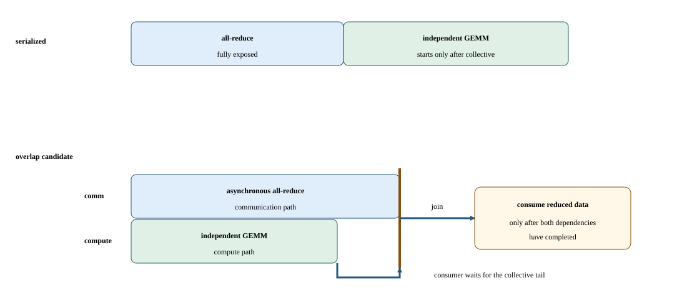

# Lab 13: Test whether communication can overlap independent compute

Communication is not automatically hidden just because an API is asynchronous. This lab compares serialized compute-plus-all-reduce with a schedule that permits the two independent tasks to overlap across two H100 nodes. You will measure elapsed time until both computation and the collective complete and use a timeline to determine whether any observed improvement really comes from concurrent execution.

## Before you start

Complete the [Lab Guide](../../../README.md#how-to-set-up-the-lab) before starting.

**Advanced fabric route:** use the separate Soperator cluster with two eight-H100 workers (16 GPUs), healthy intra-node NVLink/NVSwitch and active inter-node InfiniBand. The base two one-GPU TCP workers are useful for local labs but cannot establish this fabric’s performance.

Pass the two-node preflight and keep the topology fixed. The matrix work and collective are deliberately independent. This is a mechanics example, not a production backward bucket implementation.

Two one-H100 nodes teach one-rank-per-node communication and overlap. They do not establish intra-node NVLink/NVSwitch performance or production scaling; network/RDMA capability remains site-specific evidence.

## Concepts and code path

The serialized path completes work in sequence. The overlap path submits collective and compute work with explicit completion handling, then joins before timing ends. Per-iteration rank times are reduced to the slowest rank. Known collective contents support an exact sum check, while the GEMM receives only a finite-output check.

Given 20 milliseconds of backward work and a 6-millisecond all-reduce launched only at the end, exposed communication is 6 milliseconds. Change bucket readiness so 4 milliseconds overlaps independent backward work. Expected observation: collective duration can remain 6 while exposed cost falls near 2; a timeline and final dependency, not the API flag, prove the overlap.

This is a backward-pass scheduling example; the supplied lab uses independent matrix work and all-reduce, not gradient buckets.



Construct a critical-path timeline: the asynchronous path needs profiler evidence before any overlap claim.

## Practice

`labs/13_collective_overlap.py` runs matrix multiplication and all-reduce serially, then overlaps their independent work using separate streams. It checks exact collective output and finite compute output and writes both median step times and their ratio.

Run from this course directory on the login node after the one-time Lab Guide setup. Save the job number; the completed job prints its result paths.

```bash
sbatch --export=ALL,COURSE_PROFILE_TOOL=none,COURSE_CAPTURE=0 \
  --chdir="$PWD" \
  --output="$PWD/results/13_collective_overlap/logs/%j.out" \
  --error="$PWD/results/13_collective_overlap/logs/%j.err" \
  slurm/two_node.sbatch \
  labs/13_collective_overlap.py --profile small
```

## Check your results

Inspect the baseline now. After running the variation in Investigate, return here to check and publish the equivalent baseline/candidate pair.

Record the job number printed by this lab's successful submission. Require `COMPLETED` and exit code `0:0`, then read that job's logs and open its printed JSON path. Never select a result from an older job.

```bash
export LAB_JOB_ID='<job number printed by this lab submission>'
sacct -j "$LAB_JOB_ID" --format=JobID,State,ExitCode
cat "results/13_collective_overlap/logs/$LAB_JOB_ID.out"
cat "results/13_collective_overlap/logs/$LAB_JOB_ID.err"
export RESULT_JSON='<exact result path printed by the completed run>'
cat "$RESULT_JSON"
```

Reading JSON is inspection, not validation. Check `lab_id`, `experiment.slurm_job_id`, `correctness` and instrumentation fields; retain every original/aggregate required by this lab.

Require `all_reduce_exact`, `compute_is_finite`, and a finite ratio. Compare `serialized_median_ms`, `overlapped_median_ms`, and the slowest-rank timing scope. Finite GEMM output does not prove reference equivalence for an edited compute path.

For the fixed-work scaling comparison in [Lab 08](12_distributed_scaling.md), retain per-rank step time, collective ranges, overlap, message size, imbalance and scaling efficiency. Strong-scaling efficiency usually decreases as local compute shrinks relative to latency and communication.

The dashboard reads these completed artifact fields. Each row retains its case and selected slot; the original JSON retains configurations and distributions.

| Dashboard panel | Field under `measurements` | Display unit |
| --- | --- | --- |
| Serialized median (seconds) | `serialized_median_ms` | `s` |
| Overlapped median (seconds) | `overlapped_median_ms` | `s` |
| Serialized to overlap ratio | `serialized_to_overlap_ratio` | `none` |

`publish_results.py` validates the selected pair, publishes its metrics and confirms the selection generation. Prepare publishing once using the Lab Guide before running it. Select two successful, equivalent, unprofiled runs in the same profile. For programs that measure several implementations in one run, compare those cases within each slot. Use this lab's declared baseline/candidate pairing: change only one permitted control, or keep all controls fixed for repeated qualification. On the login node, set the paths to the printed result files and review the current generation (use `0` for the first selection):

```bash
"$COURSE_PUBLISH_PYTHON" tools/publish_results.py --lab 13_collective_overlap \
  --baseline "${BASELINE_RESULT:?printed baseline JSON path}" \
  --candidate "${CANDIDATE_RESULT:?printed candidate JSON path}" \
  --expected-generation "${COMPARISON_GENERATION:?0 initially; otherwise reviewed generation}"
```

In Grafana, select your workspace and profile. Require **Correctness of selected results** to be `1` for both slots and **Selected comparison generation** to match the publisher's confirmation. Summary panels always show the currently published pair. Set the time picker to **Experiment start** through **Experiment end** for telemetry, then select the allocated GPU worker and its local GPU indices. GPU activity, framebuffer memory, power, temperature, and node panels provide context; they cannot time individual short kernels or establish exclusive attribution.

## Investigate the behavior

### Workload variations

Run the paired paths together using the two-node launcher. Repeat the larger profile only after both ranks pass correctness; preserve its changed matrix and message sizes as a separate workload.

```bash
sbatch --export=ALL,COURSE_PROFILE_TOOL=none,COURSE_CAPTURE=0 --chdir="$PWD" \
  --output="$PWD/results/13_collective_overlap/logs/%j.out" \
  --error="$PWD/results/13_collective_overlap/logs/%j.err" slurm/two_node.sbatch labs/13_collective_overlap.py --profile small
sbatch --export=ALL,COURSE_PROFILE_TOOL=none,COURSE_CAPTURE=0 --chdir="$PWD" \
  --output="$PWD/results/13_collective_overlap/logs/%j.out" \
  --error="$PWD/results/13_collective_overlap/logs/%j.err" slurm/two_node.sbatch labs/13_collective_overlap.py --profile large
```

Keep a fixed profile for a comparison. If both profiles appear, treat them as separate workload campaigns. Repeat the baseline command to check variation.

Draw compute and communication intervals plus the final join. Compare the ideal `max(compute, communication)` intuition with measured completion, remembering shared resources and launch overhead. Use a profiler before asserting that simultaneous execution occurred.

Communication can be hidden only behind independent compute, often while competing for memory or interconnect resources. Bucket tuning consumes memory and changes scheduling. A locally faster kernel can increase rank skew and leave global time unchanged.

Capture a separate diagnostic run:

```bash
srun --nodes=2 --ntasks=2 --ntasks-per-node=1 --gpus-per-task=8 --cpus-per-task=32 --time=00:15:00 --kill-on-bad-exit=1 \
  --chdir="$PWD" --output="results/13_collective_overlap/logs/capture-%J-%t.out" \
  --error="results/13_collective_overlap/logs/capture-%J-%t.err" \
  bash slurm/capture_ranks.sh 1 \
  env -u DEBUGINFOD_URLS COURSE_CAPTURE=1 COURSE_PROFILE_TOOL=nsys \
  nsys profile --trace=cuda,nvtx,osrt,nccl \
  --cuda-trace-scope=process-tree --sample=none --cpuctxsw=none \
  --discard-environment=true --force-overwrite=false \
  --duration=300 --kill=none --wait=all \
  --output "results/13_collective_overlap/profiles/nsys-%q{SLURM_JOB_ID}-%q{SLURM_STEP_ID}-%q{RANK}-%p" \
  "${COURSE_PYTHON:?source the course runtime}" labs/13_collective_overlap.py --profile small
```

Check exported statistics for every rank, then open representative reports from each worker in Systems. Load large reports in small groups and close them between comparisons. Expand NVTX, CUDA, and NCCL kernel rows. Align step/collective boundaries and compare each rank’s arrival, waiting, and compute intervals. A rank-local trace alone cannot establish communication overlap across the job. Compute replay is inapplicable to the live collective; isolate a local kernel before inspecting counters.

Guided comparison: Compare serialized communication plus compute with asynchronous overlap at fixed payload and matrix size. Independently inspect both ranks and identify the final dependency join before choosing overlap.

**Nsight Systems evidence:** Capture inside each participating GPU rank, retaining separate reports for cross-rank correlation. Check exported statistics for every rank, then open representative rank .nsys-rep reports from each worker. Load large reports in small groups and close them between comparisons. Expand CUDA streams, NCCL activity and available NVTX ranges; align collective boundaries and compare arrival, waiting and compute intervals across hosts. Use clock correlation before claiming cross-node overlap. Reports are diagnostic; publish the separate unprofiled baseline and candidate. The capture must contain the exercise itself, not only initialization. If it does not, treat it as incomplete.

## If something goes wrong

An unrealistically short overlap time may exclude a required wait. Incorrect sums may indicate reused buffers before completion. Restore dependencies and correctness before investigating performance; do not use instrumented durations as acceptance timing.

For the fixed-work scaling comparison in [Lab 08](12_distributed_scaling.md), avoid dividing single-rank time by rank count without holding total work fixed.

Publication failure is separate from benchmark failure. Retain the JSON files and retry the same pair using the generation printed by the failed publisher. A stale-generation rejection means another selection won; review it before replacing it. Missing metrics remain unknown. Counter permission errors or an empty capture require readiness repair before a profiling claim.

## Takeaways and next step

Overlap requires independence, timely submission, available resources, and an honest joined boundary. Lab 19 applies related ideas to gradients becoming ready during backward, where the dependency graph is more constrained.

Report fixed-work scaling, exposed communication, and the slowest-rank path.

Identify which portion of a collective actually extends the step.
