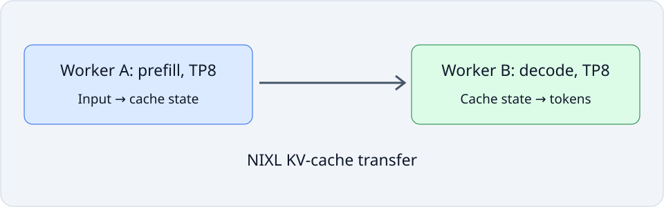

# Lab 32: Compare aggregated and disaggregated Dynamo serving

Prefill processes input tokens and creates the key/value cache; decode repeatedly generates new tokens using that cache. NVIDIA Dynamo can place these phases on different workers and transfer cache data through NIXL. Compare two aggregated eight-GPU replicas against one eight-GPU prefill worker plus one eight-GPU decode worker, holding the total allocation and request corpus fixed.

## Before you start

Use the [Lab Guide](../../../lab-guide.html#lab-preparation-scripts) once to prepare this course and lab number before submitting jobs.

Use the dedicated two-worker, sixteen-H100 cluster prepared in shared environment setup. Verify local NVLink/NVSwitch and inter-node InfiniBand readiness. Keep driver, software, allocation and other workloads fixed; the two one-GPU TCP workers cannot establish this fabric's performance. The `small` and `large` names select workload sizes, not optimization or profiling modes.

The selected preparation from the Lab Guide provides this lab's isolated vendor runtime. The native launcher restores its recorded paths automatically.

The job owns a private etcd process on the first worker. Worker hostnames must
resolve to reachable IPv4 addresses; etcd binds that address and advertises the
hostname. Readiness failure stops the experiment before request traffic.

The setup command caches Qwen/Qwen3-8B at revision
`b968826d9c46dd6066d109eabc6255188de91218`, including the complete Hugging Face
repository metadata. The launcher supplies its private `COURSE_MODEL_DIR`
automatically. Labs 32–34 use that same snapshot and offline tokenizer lookup.

## Concepts and code path

The runner owns private job-scoped discovery, two vLLM workers and a loopback frontend. Both layouts use the same pinned Qwen3-8B BF16 weights, TP8 per worker and deterministic requests. The disaggregated path uses NixlConnector. Fixed output counts and complete streams establish delivery validity; identical output signatures are required for comparison. This is not a model-quality evaluation. TTFT includes queueing and transfer effects, not only GPU prefill.



Both workers enable `VLLM_BATCH_INVARIANT=1`, select FlashAttention 2 with `attention_config.flash_attn_version=2`, and set `custom_ops=["+rms_norm"]` and `pass_config.fuse_allreduce_rms=false` in the compilation configuration. Explicit RMSNorm selection preserves its batch-invariant CUDA implementation when compilation would otherwise select the native implementation. The pinned runtime can still select nondeterministic Hopper FlashAttention 3 and fused tensor-parallel all-reduce/RMSNorm paths under batch invariance. These explicit settings avoid those paths; compilation and CUDA graphs stay enabled. Keep these settings fixed across layouts, routing policies and concurrency levels, and require the output-equivalence check to pass before comparing performance. This reproducibility mode can change throughput relative to default vLLM execution. Seeded requests alone do not guarantee identical outputs across different batch shapes.

## Practice

`labs/32_dynamo_disaggregation.py` runs fixed-length streaming requests against aggregated TP8 replicas or separate TP8 prefill/decode pools. It checks complete streams and output-token counts and writes client measurements; profiled runs retain diagnostic artifacts separately.

Run from this course directory on the login node after the one-time Lab Guide setup. Save the job number; the completed job prints its result paths.

```bash
sbatch --chdir="$PWD" \
  --output="$PWD/results/32_dynamo_disaggregation/logs/%j.out" \
  --error="$PWD/results/32_dynamo_disaggregation/logs/%j.err" \
  slurm/32_dynamo_disaggregation.sbatch --workload small --layout aggregated
```

## Check your results

Each new job owns `results/32_dynamo_disaggregation/jobs/JOB_ID/`: `results/` contains measurements, `profiles/` native captures, `logs/` process logs and `artifacts/` auxiliary output. Scheduler logs remain in `results/32_dynamo_disaggregation/logs/`. Use the ID returned by this submission.

Inspect the baseline now. After running the variation in Investigate, return here to check and publish the equivalent baseline/candidate pair.

For pair publication, confirm both completed job states and inspect the actual JSON paths. Set `BASELINE_RESULT` and `CANDIDATE_RESULT` to those artifacts, never to stdout or profiler reports.

```bash
export LAB_JOB_ID='<job number printed by this lab submission>'
sacct -j "$LAB_JOB_ID" --format=JobID,State,ExitCode
cat "results/32_dynamo_disaggregation/logs/$LAB_JOB_ID.out"
cat "results/32_dynamo_disaggregation/logs/$LAB_JOB_ID.err"
export RESULT_JSON='<exact result path printed by the completed run>'
cat "$RESULT_JSON"
```

Require `COMPLETED` and exit code `0:0` for each job. Reading JSON is inspection,
not validation: check `lab_id`, `experiment.slurm_job_id`, correctness and
instrumentation fields. Retain every original/aggregate required by this lab.

`publish_results.py` validates the selected pair, publishes its metrics and confirms the selection generation. Prepare publishing once using the Lab Guide before running it.

```bash
source tools/course_env.sh 32_dynamo_disaggregation --lab
"$COURSE_PUBLISH_PYTHON" tools/publish_results.py --lab 32_dynamo_disaggregation \
  --baseline "${BASELINE_RESULT:?baseline JSON}" --candidate "${CANDIDATE_RESULT:?candidate JSON}" \
  --expected-generation "${COMPARISON_GENERATION:?0 initially; reviewed current generation otherwise}"
```

| Dashboard panel | Measurement path | Display unit |
| --- | --- | --- |
| P99 time to first content | `ttft_p99_ms` | s |
| Generated tokens per second | `tokens_per_second` | tokens/s |
| P99 streamed chunk gap | `chunk_gap_p99_ms` | s |

Select workspace and profile in Grafana. Require **Correctness of selected results** to equal 1 and **Selected comparison generation** to match confirmation. Set the time picker to **Experiment start** through **Experiment end** and select the allocated workers with **GPU worker**, then choose their local indices with **GPU index on selected workers**. Sampled utilization is context, not a per-kernel explanation or proof of transport selection.

## Investigate the behavior

### Workload variations

Submit the two unprofiled jobs from the login node, one after the other after completion, and retain their printed job numbers.

```bash
sbatch --chdir="$PWD" \
  --output="$PWD/results/32_dynamo_disaggregation/logs/%j.out" \
  --error="$PWD/results/32_dynamo_disaggregation/logs/%j.err" slurm/32_dynamo_disaggregation.sbatch --workload small --layout aggregated
sbatch --chdir="$PWD" \
  --output="$PWD/results/32_dynamo_disaggregation/logs/%j.out" \
  --error="$PWD/results/32_dynamo_disaggregation/logs/%j.err" slurm/32_dynamo_disaggregation.sbatch --workload small --layout disaggregated
```

Logs stay under `results/32_dynamo_disaggregation/logs/`. A submission receipt is not a measurement; wait for successful completion before selecting artifacts.

Capture both aggregated and disaggregated layouts in separate diagnostic jobs. Inspect NIXL cache-transfer activity in the disaggregated capture; aggregated replicas do not perform that cross-worker cache transfer. Wait for each capture to finish before submitting the next.

Capture the actual GPU servers with --capture systems in a separate run. Inspect prefill, decode, NCCL and transfer activity in the two server reports, alongside client request timestamps. A chunk can contain several tokens; chunk-gap p99 is not token-gap p99. Independently repeat the fixed-layout comparison at another concurrency in a new matched campaign; explain the cache-transfer break-even point.

Use the private `requests.json` fields `request_start_unix_ns` and
`request_end_unix_ns`, and `measurement-window.json` for the measured cohort's
bounds after warmup. Check clock alignment between the client and both workers
before comparing epoch timestamps with the server traces. Client latency uses
a monotonic clock; a clock offset must not be interpreted as a transfer delay.

This coordinated diagnostic uses the native `sbatch` launcher to reserve both nodes and keep the coordinator on a worker. The lifecycle driver launches the visible `nsys profile` prefix on each GPU worker through `srun`; it also manages rendezvous, readiness and cleanup. `{report}` becomes a private per-rank path. Repeat with `--layout disaggregated` to capture the candidate. Put `--worker-prefix` last. Inspect the printed worker reports, then repeat the clean baseline for acceptance measurements.

```bash
sbatch --chdir="$PWD" \
  --output="$PWD/results/32_dynamo_disaggregation/logs/%j.out" \
  --error="$PWD/results/32_dynamo_disaggregation/logs/%j.err" slurm/32_dynamo_disaggregation.nsys.sbatch --workload small --layout aggregated --capture systems
```

The native Systems command is in `slurm/32_dynamo_disaggregation.nsys.sbatch`. The [GPU Performance Tools reference](../../../gpu-performance-tools/index.html) explains its flags.

Keep diagnostic captures separate from acceptance timings. For distributed work, retain each rank's report and placement record; compare the same application phase across ranks. Nsight Compute replay is inappropriate for live collectives: investigate a separately isolated local kernel when kernel-level evidence is needed.

**Nsight Systems evidence:** Capture the owned GPU server and its worker descendants while the client supplies requests. Open the server .nsys-rep and expand the GPU worker process tree, CUDA streams and runtime NVTX rows. Inspect the request interval after readiness; client-only activity or startup-only kernels are not sufficient. Compare launch gaps and prefill/decode activity against the clean client latency panels. Reports are diagnostic; publish the separate unprofiled baseline and candidate. The capture must contain the exercise itself, not only initialization. If it does not, treat it as incomplete.

The lab starts CUDA collection through both workers after readiness and stops
collection before shutting down the engines. Both control responses must confirm
success. It waits up to 180 seconds for both reports before stopping the servers.
Missing or empty reports fail the job; inspect request-phase GPU activity and
profiler warnings in both reports before accepting the capture.

## If something goes wrong

A missing worker, vendor field, transport, completed request or correctness check is missing evidence, never zero performance. Read the lab's private job logs and fix the failing prerequisite before another trial. Do not change drivers, network configuration or registration modules inside an experiment.

Publication failure is separate from benchmark failure. Retain successful JSON artifacts and republish with the reviewed generation after ingestion is repaired. Vendor versions are qualification candidates until the designated runtime and sixteen-GPU live checks pass.

## Takeaways and next step

Explain what changed, which observation supports the mechanism, and which alternative explanation remains. Repeat matched unprofiled runs and describe variation; retain a slower candidate when it disproves the initial hypothesis. Finish with the independent investigation above and a bounded decision for this workload and topology.
