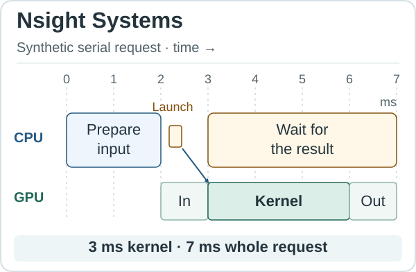
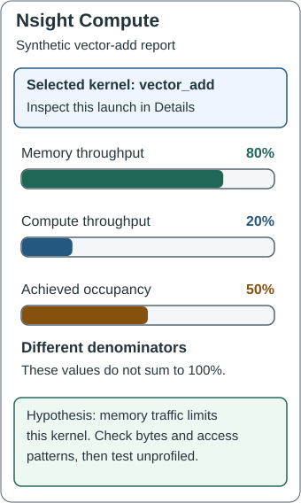
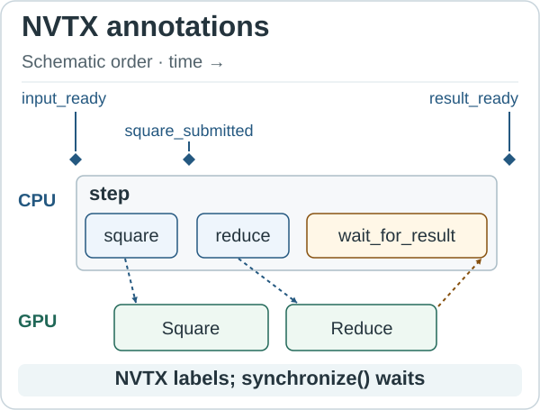
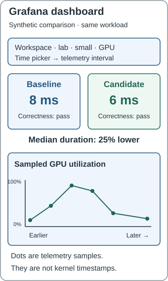

# Using GPU performance tools

## Objective

Choose the right tool for a performance question, read a timeline and kernel report, and connect them to a checked benchmark result. Explain how NVTX labels application work without making GPU execution synchronous.

## How it works

A profiler records evidence about a program while it runs. A dashboard presents measurements collected elsewhere. Start with a correct, unprofiled result, then use the tools below to investigate one possible cause of its performance. The diagrams are simplified teaching views, not screenshots or measurements from a lab run. All example values are synthetic.

### Nsight Systems: follow the whole request

**Nsight Systems** records a timeline: CPU activity, CUDA calls, memory copies, GPU kernels and communication. Each row represents one kind of activity; its position along the time axis tells you when it happened. CUDA is the software interface the CPU uses to submit GPU work. A kernel is a function that executes on the GPU. NVTX supplies application labels, explained below.

Consider one request that prepares input on the CPU, copies it to the GPU, runs a kernel and brings the answer back. In the example, the CPU prepares data from 0 to 2 milliseconds (ms). The input copy occupies 2–3 ms, the kernel 3–6 ms and the output copy 6–7 ms. The kernel takes 3 ms, while the whole request takes 7 ms. Making the kernel twice as fast would reduce this modeled request to 5.5 ms if all other costs stayed unchanged; it would not halve the request's total time.



Read this compact diagram downward; an actual Systems timeline normally reads left to right. Boxes show activity on the CPU or GPU lane; the diagonal connector links the host submission to GPU execution. A host launch is a short submission, not the whole GPU execution. In Systems, select the request interval, expand the CUDA API and GPU rows, and follow the launch's correlation to its kernel. A long CPU interval may be executing, submitting work or waiting: inspect its calls before assigning a cause. Overlapping GPU activities can establish concurrency; their dependencies and the end-to-end result determine whether the overlap helps. The GPU operations in this example are deliberately serialized: the copies and kernel do not overlap.

### Nsight Compute: inspect one kernel

**Nsight Compute** gathers hardware counters for selected GPU kernels. A counter describes work done by hardware, such as bytes moved or instructions executed. The tool often replays a kernel to collect groups of counters, so its capture is a diagnostic experiment with additional overhead.

Suppose Systems identifies a vector-add kernel as the main GPU cost. Open its Compute report and inspect **Speed Of Light** for throughput relative to the device's supported peak rates, **Memory Workload Analysis** for memory traffic and cache behavior, and **Occupancy** for resident warps. A warp is a group of GPU threads; occupancy is the fraction of the SM's supported resident warps that are active. An SM is the hardware unit that schedules those warps.



The synthetic report shows memory throughput at 80% of peak, compute throughput at 20%, and achieved occupancy at 50%. These are three different ratios; they do not add to 100%. The first two suggest investigating memory traffic before adding arithmetic parallelism. Check the actual bytes, access pattern and workload size before declaring a memory bottleneck. Occupancy alone does not establish performance: increasing it may leave memory traffic unchanged. Change one relevant control and repeat the unprofiled benchmark to test the prediction. Missing counter permission means evidence is unavailable, not that a counter is zero. Use the lab's supported single-kernel capture; never replay a whole distributed collective or live serving workload as an ordinary kernel experiment.

### NVTX: give the trace meaningful names

**NVTX (NVIDIA Tools Extension Library)** is NVIDIA's annotation API: function calls that attach your own names to application activity. A **marker** labels one instant, such as “input ready.” A **range** labels an interval between a beginning and an end, such as “submit the forward pass.” Nested ranges show that smaller operations belong to a larger step. Nsight Systems displays these annotations alongside CUDA activity; Nsight Compute can use a named range to select kernels launched inside it. NVTX supplies context to these tools, rather than collecting GPU counters itself.

This short example uses PyTorch's NVTX interface, already used in the course labs. It requires a CUDA-enabled PyTorch runtime and GPU. It is an illustrative diagnostic snippet, not a benchmark or a new lab command. The input is already in GPU memory before the annotated calculation begins.

```python
import torch
from torch.cuda import nvtx

x = torch.randn(1024, 1024, device="cuda")
torch.cuda.synchronize()  # Finish input creation before this example.
nvtx.mark("input_ready")

with nvtx.range("step"):
    with nvtx.range("square"):
        y = x * x
    nvtx.mark("square_submitted")
    with nvtx.range("reduce"):
        total = y.sum()
    with nvtx.range("wait_for_result"):
        torch.cuda.synchronize()

nvtx.mark("result_ready")
```

The `with` blocks open and close ranges, including when Python raises an exception. `nvtx.mark(...)` records a point without opening a range. The `square` and `reduce` ranges surround CPU calls that submit GPU work. They can end before their kernels finish. The explicit `torch.cuda.synchronize()` in `wait_for_result` makes the CPU wait; NVTX itself does not. The final marker therefore follows GPU completion in a successful run. The scalar `total` still lives in GPU memory: waiting has not copied it to the CPU.



Here are the practical capabilities illustrated by those names:

- **Find an event:** search for `input_ready` or `result_ready` in Systems to locate a request boundary. A marker has no duration; it is not a timer.
- **Group work:** expand `step` to see its nested `square`, `reduce` and `wait_for_result` ranges. This connects a high-level operation to the code that submitted it.
- **Explain waiting:** compare `square_submitted` with the correlated GPU kernel and `wait_for_result`. A short submission range followed by a long wait shows why a quick Python call does not prove a quick GPU result.
- **Focus a capture:** use `square` as the NVTX range for a Compute capture to select the multiplication kernels launched there and exclude the `reduce` launches. For these push/pop ranges, the Compute selector is `--nvtx --nvtx-include 'square/'`; the trailing slash denotes a push/pop range. Combine it with the lab's kernel-name and launch-count controls when a range launches multiple kernels. The selector filters profiling; it does not change the calculation.

A range's CPU duration is not automatically its GPU execution time. Use the correlated GPU activity or CUDA events for device timing. The supplied course capture path also labels phases such as `course_warmup`, `course_measure` and the complete `lab_workload`; Fundamentals Lab 01 adds `h2d_inputs`, `gpu_expression` and `d2h_output` for its transfer-inclusive diagnostic run. Shared course annotations are enabled for capture, keeping their wrappers out of clean acceptance timings.

### Grafana: compare outcomes with device conditions

**Grafana** queries a data source and arranges the results into panels, such as a number, table or time-series graph. In these courses, completed benchmark summaries and sampled GPU/node telemetry reach the metrics data source by different paths. The result JSON file remains the authoritative experiment record. Grafana helps you compare the selected results and inspect the conditions around them.

Select the course and lab dashboard, persistent workspace, workload profile, GPU identifier and experiment time interval. Keep `small` and `large` as separate workloads. In this synthetic example, baseline and candidate both pass correctness and use equivalent inputs; their median durations are 8 ms and 6 ms. The candidate's duration is 25% lower: `(8 - 6) / 8`. Repeated unprofiled runs and their variation determine whether that difference is dependable.



The upper panels show the selected completed pair. The lower graph shows GPU utilization sampled over time; its dots are observations, not individual kernels. A brief kernel may run between samples, so an empty or low-utilization interval cannot replace the benchmark timer or the Systems trace. Summary panels retain the selected pair independently of the time picker; changing the interval changes the telemetry view, not which results occupy the baseline and candidate slots. Those slots change only when a new validated pair is explicitly published. Activity on a shared GPU is correlation until you establish which workload caused it.

Instrumentation adds overhead. Use a separate diagnostic run to explain behavior, then repeat without profiling to judge performance. Compare the same profile, inputs, seed and runtime; a larger profile is not an optimization. Distributed captures produce one report per rank; align their collective and step boundaries rather than summing overlapping rank times. Serving captures wrap the GPU server while the client records request latency.

## Practice

Complete the setup checks once, then follow the first experiment's local commands. Save an unprofiled baseline, inspect a bounded capture, predict the effect of one change, and repeat without instrumentation. Publish the two validated artifacts and explain both the measured outcome and its limits. An unsuccessful optimization with a sound explanation is a valid result.

Before opening a report, predict the answers: does `square_submitted` mean the GPU has finished? Which tool would show a gap before a kernel, and which would reveal its memory traffic? Can changing Grafana's time range select a new benchmark candidate?

Check your reasoning: the marker records submission only; Systems locates the gap, Compute inspects the selected kernel, and Grafana's time picker changes the telemetry interval. On the next lab, name one meaningful region from its source and explain what observation would distinguish CPU waiting from GPU computation.

## Mental model

Think of the tools as steps in one investigation. Start with a correct benchmark measured without profiling. In a separate diagnostic run, use **NVTX** to name important moments with markers and phases with ranges, such as “input ready” and “forward pass.” **Nsight Systems** places those labels beside CPU activity, transfers and GPU kernels, helping you connect your code to where time is spent. If a GPU kernel accounts for much of the delay, use **Nsight Compute** to examine its hardware behavior, such as memory traffic. An NVTX range can help select the kernels belonging to that phase for the Compute capture; the annotation itself does not wait for GPU completion.

Then change one thing and repeat the same benchmark without profiling. Use **Grafana** to compare the selected baseline and candidate results alongside sampled device conditions, such as GPU utilization. The tools connect the application's named phases to the timeline, the relevant kernel's behavior and the measured outcome. Keep the change only when correctness still passes and repeated unprofiled measurements support the improvement; a promising trace or dashboard alone is not enough.
