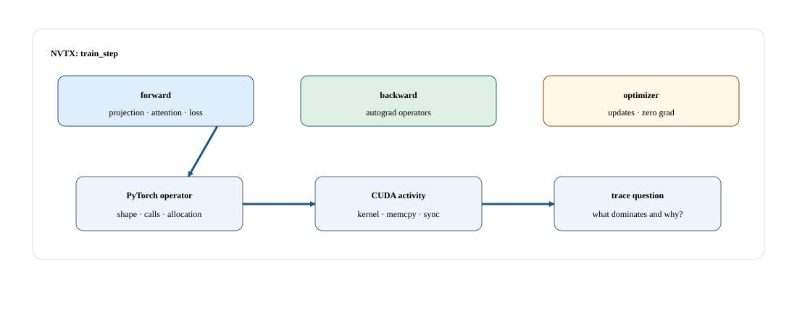
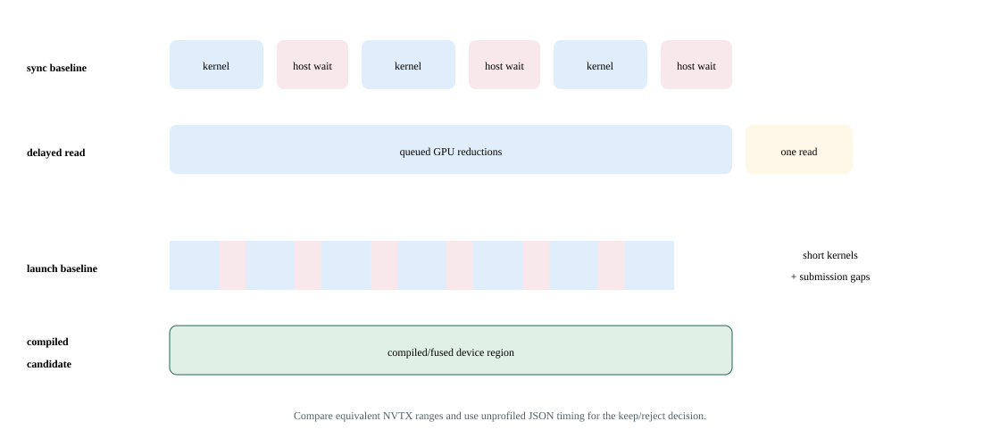

# Lab 07: Build a readable profiler map of a workload

A useful profile connects application regions to GPU activity so that you can explain a delay, not merely collect a large report. This lab provides labeled PyTorch and NVTX regions around a small tensor workload. You will choose either the internal PyTorch profiler or an external NVIDIA profiler and keep instrumented evidence separate from benchmark timing.

## Before you start

Complete the [Lab Guide](../../../README.md#how-to-set-up-the-lab) before starting.

Complete the [diagnostic tooling setup](../../../README.md#how-to-set-up-the-lab) on the compute node. Use one H100. Trace files may contain paths or environment details and must remain private until reviewed.

Discover installed section sets and permissions on the target rather than hard-coding another Nsight version. Use NVTX to select a stable semantic phase and profile the exact SM90 kernel chosen for the real shape.

## Concepts and code path

The source generates tensors and executes projection, activation, and reduction work inside named ranges. The literal `train_step` range is only a label: there is no backward pass or optimizer update. Internal profiling aggregates CUDA operators and optionally exports a trace. External-only mode leaves NVTX ranges available without nesting PyTorch Profiler inside the NVIDIA tool.



Given a slow `aten::linear` region in PyTorch Profiler, inspect a Systems trace and find a 400-microsecond CPU gap before one 80-microsecond GEMM. Change the hypothesis from “inefficient GEMM” to “host launch delay.” Expected observation: Nsight Compute is unnecessary until a control removes the gap and the GEMM itself remains limiting; a privileged-counter error is recorded as a blocker, not bypassed.

## Practice

`labs/07_profile_workload.py` executes labeled matrix projection, activation, and reduction regions. It writes a bounded CUDA operator summary, checks finite output, and can export a PyTorch trace or disable its internal profiler for Nsight capture.

Run from this course directory on the login node after the one-time Lab Guide setup. Save the job number; the completed job prints its result paths.

```bash
sbatch --export=ALL,COURSE_PROFILE_TOOL=none,COURSE_CAPTURE=0 \
  --chdir="$PWD" \
  --output="$PWD/results/07_profile_workload/logs/%j.out" \
  --error="$PWD/results/07_profile_workload/logs/%j.err" \
  slurm/single_gpu.sbatch \
  labs/07_profile_workload.py --profile small --export-trace
```

## Check your results

Inspect the baseline now. After running the variation in Investigate, return here to check and publish the equivalent baseline/candidate pair.

Record the job number printed by this lab's successful submission. Require `COMPLETED` and exit code `0:0`, then read that job's logs and open its printed JSON path. Never select a result from an older job.

```bash
export LAB_JOB_ID='<job number printed by this lab submission>'
sacct -j "$LAB_JOB_ID" --format=JobID,State,ExitCode
cat "results/07_profile_workload/logs/$LAB_JOB_ID.out"
cat "results/07_profile_workload/logs/$LAB_JOB_ID.err"
export RESULT_JSON='<exact result path printed by the completed run>'
cat "$RESULT_JSON"
```

Reading JSON is inspection, not validation. Check `lab_id`, `experiment.slurm_job_id`, `correctness` and instrumentation fields; retain every original/aggregate required by this lab.

Confirm finite output and inspect `trace_exported` and the available CUDA table for the chosen mode. Default execution alone does not export a Chrome trace. A captured range is not proof that its human-readable name describes a complete training step.

Retain the minimal trace range, operator/kernel names, timing, and relevant counters.

A profiler is evidence collection, not an automatic recommendation engine.

The dashboard reads these completed artifact fields. Each row retains its case and selected slot; the original JSON retains configurations and distributions.

| Dashboard panel | Field under `measurements` | Display unit |
| --- | --- | --- |
| Correctness of selected results | `correctness` | Boolean pass |

Select two successful, equivalent diagnostic runs in the same profile. For programs that measure several implementations in one run, compare those cases within each slot; the two slots are independent diagnostic repetitions. Their instrumented durations are not acceptance timings. On the login node, set the paths to the printed result files and review the current generation (use `0` for the first selection):

`publish_results.py` validates the selected pair, publishes its metrics and confirms the selection generation. Prepare publishing once using the Lab Guide before running it.

```bash
"$COURSE_PUBLISH_PYTHON" tools/publish_results.py --lab 07_profile_workload \
  --baseline "${BASELINE_RESULT:?printed baseline JSON path}" \
  --candidate "${CANDIDATE_RESULT:?printed candidate JSON path}" \
  --expected-generation "${COMPARISON_GENERATION:?0 initially; otherwise reviewed generation}"
```

In Grafana, select your workspace and profile. Require **Correctness of selected results** to be `1` for both slots and **Selected comparison generation** to match the publisher's confirmation. Summary panels always show the currently published pair. Set the time picker to **Experiment start** through **Experiment end** for telemetry, then select the allocated GPU worker and its local GPU indices. GPU activity, framebuffer memory, power, temperature, and node panels provide context; they cannot time individual short kernels or establish exclusive attribution.

## Investigate the behavior

### Workload variations

Choose one profiler route per run. The first command requests an exported PyTorch trace; the second collects an external system timeline with internal profiling disabled.

```bash
sbatch --export=ALL,COURSE_PROFILE_TOOL=none,COURSE_CAPTURE=0 --chdir="$PWD" \
  --output="$PWD/results/07_profile_workload/logs/%j.out" \
  --error="$PWD/results/07_profile_workload/logs/%j.err" slurm/single_gpu.sbatch labs/07_profile_workload.py --profile small --export-trace
sbatch --export=ALL,COURSE_PROFILE_TOOL=none,COURSE_CAPTURE=0 --chdir="$PWD" \
  --output="$PWD/results/07_profile_workload/logs/%j.out" \
  --error="$PWD/results/07_profile_workload/logs/%j.err" slurm/nsys_single_gpu.sbatch labs/07_profile_workload.py --profile small --external-only
```

Keep a fixed profile for a comparison. If both profiles appear, treat them as separate workload campaigns. Repeat the baseline command to check variation.

Follow one application range into its operator and kernel activity. Identify whether time lies in large kernels, many small launches, or idle gaps. Explain what further evidence would distinguish CPU starvation from device saturation.



Higher-detail tools add overhead, serialization, replay, storage, and analysis cost. Stop escalation as soon as the current hypothesis is confirmed or disproved; then remeasure the candidate without the profiler.

Capture a separate diagnostic run:

```bash
srun --nodes=1 --ntasks=1 --gpus-per-task=1 --cpus-per-task=8 --time=00:15:00 --kill-on-bad-exit=1 \
  --chdir="$PWD" --output="results/07_profile_workload/logs/capture-%J-%t.out" \
  --error="results/07_profile_workload/logs/capture-%J-%t.err" \
  env -u DEBUGINFOD_URLS COURSE_CAPTURE=1 COURSE_PROFILE_TOOL=nsys \
  nsys profile --trace=cuda,nvtx,osrt \
  --cuda-trace-scope=process-tree --sample=none --cpuctxsw=none \
  --discard-environment=true --force-overwrite=false \
  --duration=300 --kill=none --wait=all \
  --output "results/07_profile_workload/profiles/nsys-%q{SLURM_JOB_ID}-%q{SLURM_STEP_ID}-%q{SLURM_PROCID}-%p" \
  "${COURSE_PYTHON:?source the course runtime}" labs/07_profile_workload.py --profile small --external-only
```

Open the printed `.nsys-rep` in Systems. Expand NVTX and CUDA rows, select `lab_workload`, then inspect CUDA API calls, copies, kernel launches, and idle gaps within that interval. Follow a launch to GPU execution before attributing a CPU range to device work.

For one kernel, use the same fixed workload in a separate Compute capture. The command selects `projection`, the named range around `x @ weight`, so tensor initialization falls outside the filter. The Compute command captures the first matching projection kernel, which belongs to warmup with the default arguments. Its launch-count limit applies after the range and kernel-name filters. Match the selected GEMM and `projection` range to the Systems trace before interpreting its counters; this diagnostic does not measure a complete step or steady-state application latency. To investigate a different kernel, select its named range with `--nvtx-include RANGE/` and its regular expression with `COURSE_PROFILE_KERNEL`.

```bash
srun --nodes=1 --ntasks=1 --gpus-per-task=1 --cpus-per-task=8 --time=00:15:00 --kill-on-bad-exit=1 \
  --chdir="$PWD" --output="results/07_profile_workload/logs/capture-%J-%t.out" \
  --error="results/07_profile_workload/logs/capture-%J-%t.err" \
  env -u DEBUGINFOD_URLS COURSE_CAPTURE=1 COURSE_PROFILE_TOOL=ncu \
  ncu --target-processes all --nvtx --nvtx-include projection/ \
  --kernel-name-base demangled --rename-kernels off \
  --kernel-name "regex:${COURSE_PROFILE_KERNEL:?select the measured kernel from Systems}" \
  --launch-count 1 --set basic --section SpeedOfLight \
  --section MemoryWorkloadAnalysis --section Occupancy --clock-control none \
  --export "results/07_profile_workload/profiles/ncu-%q{SLURM_JOB_ID}-%q{SLURM_STEP_ID}-%q{SLURM_PROCID}-%p" \
  "${COURSE_PYTHON:?source the course runtime}" labs/07_profile_workload.py --profile small --external-only
```

Open `.ncu-rep` → **Details → Speed Of Light**, **Memory Workload Analysis**, and **Occupancy**. Record kernel duration, memory throughput/traffic, and the limiting resource. Counters are diagnostic evidence; replay duration is not end-to-end application latency. Annotate a smaller phase with `annotated_operation(operation, "phase_name")` in Python, or `CaptureRange region("phase_name")` around a CUDA launch, then select `--nvtx-include phase_name/` in the native Compute command. Keep annotations opt-in and outside clean timing paths.

Guided comparison: Follow one named phase into CUDA launches and GPU activity. Independently choose a suspected kernel for Compute and state which counter result would falsify the hypothesis.

**Nsight Systems evidence:** Capture the executable inside the Slurm GPU worker/container; submission and result publication remain outside capture. Open the worker .nsys-rep. Expand NVTX, CUDA API and CUDA GPU rows; locate lab_workload and follow host submissions into the GPU streams. Inspect launch gaps, kernels and copies relevant to this lab, then test its named tuning control with another unprofiled run. Reports are diagnostic; publish the separate equivalent internal-profiler repetitions. Their durations remain diagnostic even when no external NVIDIA capture is enabled. The capture must contain the exercise itself, not only initialization. If it does not, treat it as incomplete.

## If something goes wrong

Do not combine `--export-trace` and `--external-only`; they request incompatible profiling paths. Missing permissions or profiler binaries block that evidence lane, not the unprofiled workload itself.

Collecting every counter for every kernel creates overhead and obscures the causal path.

Publication failure is separate from benchmark failure. Retain the JSON files and retry the same pair using the generation printed by the failed publisher. A stale-generation rejection means another selection won; review it before replacing it. Missing metrics remain unknown. Counter permission errors or an empty capture require readiness repair before a profiling claim.

## Takeaways and next step

Well-scoped ranges make profiles interpretable. Next, use Lab 14's controlled bottleneck cases to test one causal hypothesis and return to unprofiled measurements before accepting an improvement.

Start broad, isolate the dominant path, and collect detailed counters only for a specific hypothesis.

Choose one tool for launch gaps, one for framework attribution, and one for a memory-transaction question.
