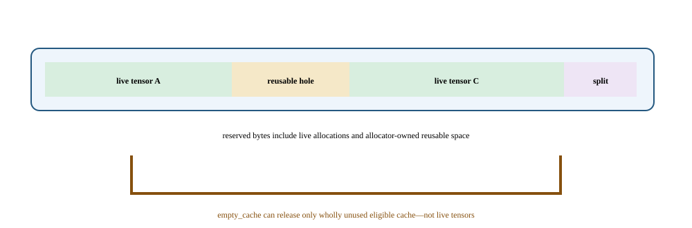

# Lab 12: Follow live, cached, and released GPU memory

Deleting a tensor does not necessarily return its memory reservation to the driver, and emptying the cache cannot free a live tensor. This lab makes those distinctions observable through a short allocation lifecycle. You will learn to read allocator counters before diagnosing a leak or adding cache-clearing calls to a performance-sensitive loop.

## Before you start

Complete the [Lab Guide](../../../README.md#how-to-set-up-the-lab) before starting.

Use one H100 in a fresh lab process with sufficient free memory. This is an allocation-state exercise, not a speed benchmark. Do not run it inside an important application whose allocator behavior you intend to preserve.

Compare the measured device capacity and site-visible MIG state with the declared full-H100 assumption. Leave safety headroom for libraries, collectives, graph capture, and transient peaks.

## Concepts and code path

The script snapshots a baseline, allocates three tensors, deletes the middle allocation, and introduces a smaller replacement. It then deletes selected tensors, empties the cache while the first tensor remains live, deletes that final tensor, and empties the cache again. Snapshots distinguish live allocated bytes, allocator-reserved bytes, inactive split bytes, retries, and OOM counts.



Given a 12-GiB activation live through backward and a 10-GiB optimizer temporary created before it dies, peak live memory is at least 22 GiB plus other state. Change the schedule so the activation’s last use precedes the temporary. Expected observation: peak falls even if `memory_reserved` remains high, showing why allocator reserve and live capacity require separate interpretation.

## Practice

`labs/12_allocator_lifetime.py` allocates, deletes, reuses, and releases CUDA tensors while recording allocated and reserved memory. It checks that deletion and cache release preserve live tensors and release the lab's allocations.

Run from this course directory on the login node after the one-time Lab Guide setup. Save the job number; the completed job prints its result paths.

```bash
sbatch --chdir="$PWD" \
  --output="$PWD/results/12_allocator_lifetime/logs/%j.out" \
  --error="$PWD/results/12_allocator_lifetime/logs/%j.err" \
  slurm/12_allocator_lifetime.sbatch --workload small
```

## Check your results

Each new job owns `results/12_allocator_lifetime/jobs/JOB_ID/`: `results/` contains measurements, `profiles/` native captures, `logs/` process logs and `artifacts/` auxiliary output. Scheduler logs remain in `results/12_allocator_lifetime/logs/`. Use the ID returned by this submission.

Inspect the baseline now. After running the variation in Investigate, return here to check and publish the equivalent baseline/candidate pair.

Record the job number printed by this lab's successful submission. Require `COMPLETED` and exit code `0:0`, then read that job's logs and open its printed JSON path. Never select a result from an older job.

```bash
export LAB_JOB_ID='<job number printed by this lab submission>'
sacct -j "$LAB_JOB_ID" --format=JobID,State,ExitCode
cat "results/12_allocator_lifetime/logs/$LAB_JOB_ID.out"
cat "results/12_allocator_lifetime/logs/$LAB_JOB_ID.err"
export RESULT_JSON='<exact result path printed by the completed run>'
cat "$RESULT_JSON"
```

Reading JSON is inspection, not validation. Check `lab_id`, `experiment.slurm_job_id`, `correctness` and instrumentation fields; retain every original/aggregate required by this lab.

Require the lifecycle invariants, including falling allocated bytes after deletion and preservation of the live allocation during `empty_cache`. Compare snapshots by event name. Reserved bytes need not equal allocated bytes at every step.

Record allocated/reserved peaks, snapshots, tensor lifetimes, retries, and out-of-memory context.

Optimize live-state and temporary peaks before tuning allocator knobs.

The dashboard reads these completed artifact fields. Each row retains its case and selected slot; the original JSON retains configurations and distributions.

| Dashboard panel | Field under `measurements` | Display unit |
| --- | --- | --- |
| Baseline / allocated bytes | `baseline.allocated_bytes` | `bytes` |
| After three allocations / allocated bytes | `after_three_allocations.allocated_bytes` | `bytes` |
| After final empty cache / reserved bytes | `after_final_empty_cache.reserved_bytes` | `bytes` |

Select two successful, equivalent diagnostic runs in the same workload preset. For programs that measure several implementations in one run, compare those cases within each slot; the two slots are independent diagnostic repetitions. Their instrumented durations are not acceptance timings. On the login node, set the paths to the printed result files and review the current generation (use `0` for the first selection):

`publish_results.py` validates the selected pair, publishes its metrics and confirms the selection generation. Prepare publishing once using the Lab Guide before running it.

```bash
"$COURSE_PUBLISH_PYTHON" tools/publish_results.py --lab 12_allocator_lifetime \
  --baseline "${BASELINE_RESULT:?printed baseline JSON path}" \
  --candidate "${CANDIDATE_RESULT:?printed candidate JSON path}" \
  --expected-generation "${COMPARISON_GENERATION:?0 initially; otherwise reviewed generation}"
```

In Grafana, select your workspace and profile. Require **Correctness of selected results** to be `1` for both slots and **Selected comparison generation** to match the publisher's confirmation. Summary panels always show the currently published pair. Set the time picker to **Experiment start** through **Experiment end** for telemetry, then select the allocated GPU worker and its local GPU indices. GPU activity, framebuffer memory, power, temperature, and node panels provide context; they cannot time individual short kernels or establish exclusive attribution.

## Investigate the behavior

### Workload variations

Use small first; the larger profile scales allocation sizes. Both runs intentionally manipulate only the allocations and cache of their own process, not cluster configuration.

```bash
sbatch --chdir="$PWD" \
  --output="$PWD/results/12_allocator_lifetime/logs/%j.out" \
  --error="$PWD/results/12_allocator_lifetime/logs/%j.err" slurm/12_allocator_lifetime.sbatch --workload small
sbatch --chdir="$PWD" \
  --output="$PWD/results/12_allocator_lifetime/logs/%j.out" \
  --error="$PWD/results/12_allocator_lifetime/logs/%j.err" slurm/12_allocator_lifetime.sbatch --workload large
```

Keep the workload size fixed for a comparison. If both sizes appear, treat them as separate workload campaigns. Repeat the baseline command to check variation.

Draw each tensor's lifetime across the snapshots. Which bytes can be reused within the process? Which remain live? Why can a cache-clearing operation lower reservation without reducing the memory needed by the application?

Aggressive reuse and in-place updates complicate correctness. Strategies that reduce fragmentation can increase synchronization or reduce caching efficiency. Recomputing state saves capacity by spending compute; sharding saves per-rank state by spending communication.

Capture a separate diagnostic run:

```bash
sbatch --chdir="$PWD" \
  --output="$PWD/results/12_allocator_lifetime/logs/%j.out" \
  --error="$PWD/results/12_allocator_lifetime/logs/%j.err" slurm/12_allocator_lifetime.nsys.sbatch --workload small
```

The native Systems command is in `slurm/12_allocator_lifetime.nsys.sbatch`. The [GPU Performance Tools reference](../../../gpu-performance-tools/index.html) explains its flags.

Open the printed `.nsys-rep` in Systems. Expand NVTX and CUDA rows, select `lab_workload`, then inspect CUDA API calls, copies, kernel launches, and idle gaps within that interval. Follow a launch to GPU execution before attributing a CPU range to device work.

Guided comparison: Compare live allocation with reserved allocator capacity through the existing lifetime sequence. Independently identify the first dead tensor whose earlier release could reduce peak memory; reservation alone is not a leak or a speedup.

**Nsight Systems evidence:** Capture the executable inside the Slurm GPU worker/container; submission and result publication remain outside capture. Open the worker .nsys-rep. Expand NVTX, CUDA API and CUDA GPU rows; locate lab_workload and follow host submissions into the GPU streams. Inspect launch gaps, kernels and copies relevant to this lab, then test its named tuning control with another unprofiled run. Reports are diagnostic; publish the separate unprofiled baseline and candidate. The capture must contain the exercise itself, not only initialization. If it does not, treat it as incomplete.

## If something goes wrong

Unexpected live bytes can indicate a remaining reference or changed allocator behavior. Inspect the controlled lifecycle first. Missing or different allocator counters require an environment-specific explanation, not an invented zero.

Avoid using `empty_cache()` to mask an oversized live working set.

Publication failure is separate from benchmark failure. Retain the JSON files and retry the same pair using the generation printed by the failed publisher. A stale-generation rejection means another selection won; review it before replacing it. Missing metrics remain unknown. Counter permission errors or an empty capture require readiness repair before a profiling claim.

## Takeaways and next step

Separate ownership from reservation before diagnosing memory problems. Extend the lab with a deliberately retained tensor reference, predict which invariant changes, and remove that reference explicitly; do not present routine cache clearing as a leak fix.

Prove the owning lifetime, reduce or reschedule the allocation, then remeasure fragmentation.

Explain why reserved minus allocated is not automatically leaked memory.
