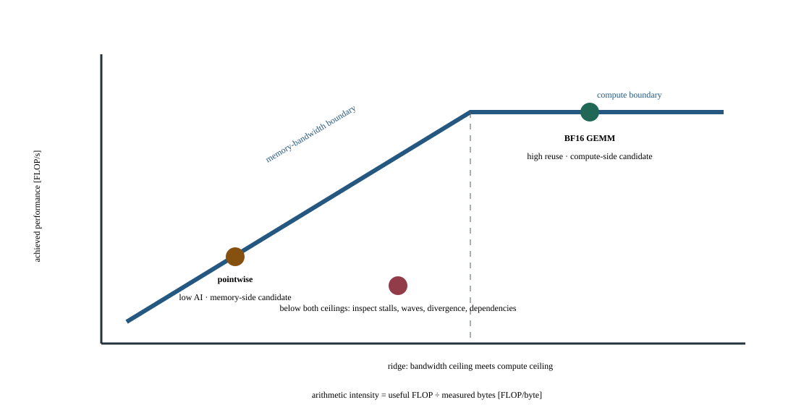

# Lab 14: Diagnose synchronization, launch, memory, and compute limits

This workshop supplies controlled examples of four bottleneck classes so you can practice choosing the right evidence. Instead of opening a profiler and guessing, you will select one case, compare baseline and candidate, and explain the causal change. Each case has a different mechanism; a single metric such as utilization cannot diagnose all four.

## Before you start

Use the [Lab Guide](../../../lab-guide.html#lab-preparation-scripts) once to prepare this course and lab number before submitting jobs.

Use an allocated H100 with the course environment and the profiler available through the supplied launcher. Confirm supported Nsight sets/sections on that compute node. Keep reports private and use one profiler per run.

At the first profiler lesson, use the synchronization case and recognize the
other bottleneck patterns without adopting their interventions yet. Return to
launch, memory and compute cases after the corresponding local-optimization
lessons; use the complete casebook before the capstone.

## Concepts and code path

The script selects `sync`, `launch`, `memory`, or `compute`, then constructs the chosen baseline or optimized callable and its reference. It warms execution, records unprofiled timing, exposes the `profile_region` NVTX range, then checks numerical equivalence before writing a result. Reject the collected timing if that check fails. The compute candidate changes precision under a declared error gate; the pointwise memory case has no portable algorithmic FLOP count. The synchronization case deliberately reuses Lab 02's immediate-versus-deferred scalar retrieval as a known control; the new task is locating host waits in an NVTX-scoped trace. The memory case reuses Lab 03's pointwise expression; Lab 03 teaches compilation cost, while this workshop asks whether a selected kernel's measured traffic supports a memory-bound diagnosis. Do not count rerunning these controls as discovering two new optimizations.

## Practice

`labs/14_profiler_bottlenecks.py` runs one selected synchronization, launch, memory, or compute case in baseline or optimized mode. It checks numerical equivalence and writes timing and case-specific evidence for investigation.

Run from this course directory on the login node after the one-time Lab Guide setup. Save the job number; the completed job prints its result paths.

```bash
sbatch --chdir="$PWD" \
  --output="$PWD/results/14_profiler_bottlenecks/logs/%j.out" \
  --error="$PWD/results/14_profiler_bottlenecks/logs/%j.err" \
  slurm/14_profiler_bottlenecks.sbatch --workload small --case sync --mode baseline
```

## Check your results

Each new job owns `results/14_profiler_bottlenecks/jobs/JOB_ID/`: `results/` contains measurements, `profiles/` native captures, `logs/` process logs and `artifacts/` auxiliary output. Scheduler logs remain in `results/14_profiler_bottlenecks/logs/`. Use the ID returned by this submission.

Inspect the baseline now. After running the variation in Investigate, return here to check and publish the equivalent baseline/candidate pair.

The compute case keeps the same matrix width, scaled inputs and useful operation
count while `--mode optimized` changes FP32 to BF16. Its dtype and logical minimum
I/O bytes therefore change with mode; repeated runs of the same mode must retain
both. Require the declared elementwise error gate before comparing timings.

Record the job number printed by this lab's successful submission. Require `COMPLETED` and exit code `0:0`, then read that job's logs and open its printed JSON path. Never select a result from an older job.

```bash
export LAB_JOB_ID='<job number printed by this lab submission>'
sacct -j "$LAB_JOB_ID" --format=JobID,State,ExitCode
cat "results/14_profiler_bottlenecks/logs/$LAB_JOB_ID.out"
cat "results/14_profiler_bottlenecks/logs/$LAB_JOB_ID.err"
export RESULT_JSON='<exact result path printed by the completed run>'
cat "$RESULT_JSON"
```

Reading JSON is inspection, not validation. Check `lab_id`, `experiment.slurm_job_id`, `correctness` and instrumentation fields; retain every original/aggregate required by this lab.

Require `numerically_equivalent` and `finite_output`. Inspect `case`, `mode`, timing, workload details, and the selected range. A profile from another case cannot explain this pair's result.

The dashboard reads these completed artifact fields. Each row retains its case and selected slot; the original JSON retains configurations and distributions.

| Dashboard panel | Field under `measurements` | Display unit |
| --- | --- | --- |
| Timing / median (seconds) | `timing.median_ms` | `s` |
| Checksum | `checksum` | `none` |

`publish_results.py` validates the selected pair, publishes its metrics and confirms the selection generation. Prepare publishing once using the Lab Guide before running it. Select two successful, equivalent, unprofiled runs in the same workload preset. For programs that measure several implementations in one run, compare those cases within each slot. Use this lab's declared baseline/candidate pairing: change only one permitted control, or keep all controls fixed for repeated qualification. On the login node, set the paths to the printed result files and review the current generation (use `0` for the first selection):

```bash
source tools/course_env.sh 14_profiler_bottlenecks --lab
"$COURSE_PUBLISH_PYTHON" tools/publish_results.py --lab 14_profiler_bottlenecks \
  --baseline "${BASELINE_RESULT:?printed baseline JSON path}" \
  --candidate "${CANDIDATE_RESULT:?printed candidate JSON path}" \
  --expected-generation "${COMPARISON_GENERATION:?0 initially; otherwise reviewed generation}"
```

In Grafana, select your workspace and profile. Require **Correctness of selected results** to be `1` for both slots and **Selected comparison generation** to match the publisher's confirmation. Summary panels always show the currently published pair. Set the time picker to **Experiment start** through **Experiment end** for telemetry, then select the allocated GPU worker and its local GPU indices. GPU activity, framebuffer memory, power, temperature, and node panels provide context; they cannot time individual short kernels or establish exclusive attribution.

## Investigate the behavior

### Workload variations

Compare the synchronization baseline and candidate, then capture a separate baseline timeline. Keep diagnostic profiling separate from the uninstrumented timing comparison.

```bash
sbatch --chdir="$PWD" \
  --output="$PWD/results/14_profiler_bottlenecks/logs/%j.out" \
  --error="$PWD/results/14_profiler_bottlenecks/logs/%j.err" slurm/14_profiler_bottlenecks.sbatch --workload small --case sync --mode baseline
sbatch --chdir="$PWD" \
  --output="$PWD/results/14_profiler_bottlenecks/logs/%j.out" \
  --error="$PWD/results/14_profiler_bottlenecks/logs/%j.err" slurm/14_profiler_bottlenecks.sbatch --workload small --case sync --mode optimized
sbatch --chdir="$PWD" \
  --output="$PWD/results/14_profiler_bottlenecks/logs/%j.out" \
  --error="$PWD/results/14_profiler_bottlenecks/logs/%j.err" slurm/14_profiler_bottlenecks.nsys.sbatch --workload small --case sync --mode baseline
```

Keep the workload size fixed for a comparison. If both sizes appear, treat them as separate workload campaigns. Repeat the baseline command to check variation.

For synchronization, locate host waits; for launches, kernel spacing; for memory, traffic and access efficiency; for compute, the selected arithmetic path. Distinguish logical byte estimates from measured transactions and compare the exact selected kernel.

Capture a separate diagnostic run:

```bash
sbatch --chdir="$PWD" \
  --output="$PWD/results/14_profiler_bottlenecks/logs/%j.out" \
  --error="$PWD/results/14_profiler_bottlenecks/logs/%j.err" slurm/14_profiler_bottlenecks.nsys.sbatch --workload small --case sync --mode baseline
```

The native Systems command is in `slurm/14_profiler_bottlenecks.nsys.sbatch`. The [GPU Performance Tools reference](../../../gpu-performance-tools/index.html) explains its flags.

Open the printed `.nsys-rep` in Systems. Expand NVTX and CUDA rows, select `profile_region`, then inspect CUDA API calls, copies, kernel launches, and idle gaps within that interval. Follow a launch to GPU execution before attributing a CPU range to device work.

For one kernel, use the same fixed workload in a separate Compute capture. The launcher selects one matching kernel inside `profile_region`, the configured NVTX range for this lab. Its launch-count limit applies after the range and kernel-name filters. In Systems, identify a kernel that performs the operation this lab investigates. Set `COURSE_PROFILE_KERNEL` to a regular expression matching that kernel and repeat the Compute capture. Verify the selected kernel and NVTX range before interpreting its counters; initialization-only evidence does not explain the lab's measured work.

```bash
sbatch --chdir="$PWD" \
  --output="$PWD/results/14_profiler_bottlenecks/logs/%j.out" \
  --error="$PWD/results/14_profiler_bottlenecks/logs/%j.err" slurm/14_profiler_bottlenecks.ncu.sbatch --workload small --case sync --mode baseline
```

The native Compute command is in `slurm/14_profiler_bottlenecks.ncu.sbatch`. The [GPU Performance Tools reference](../../../gpu-performance-tools/index.html) explains its flags.

Open `.ncu-rep` → **Details → Speed Of Light**, **Memory Workload Analysis**, and **Occupancy**. Record kernel duration, memory throughput/traffic, and the limiting resource. Counters are diagnostic evidence; replay duration is not end-to-end application latency. Annotate a smaller phase with `annotated_operation(operation, "phase_name")` in Python, or `CaptureRange region("phase_name")` around a CUDA launch, then select `--nvtx-include phase_name/` in the native Compute command. Keep annotations opt-in and outside clean timing paths.



Guided comparison: Compare `baseline` and `optimized` with the same `--case` and workload. Predict the timing and timeline differences, verify correctness, and inspect the named report views. Independently select another existing case and repeat both modes unprofiled; explain why its bottleneck needs a different repair.

**Nsight Systems evidence:** Capture the executable inside the Slurm GPU worker/container; submission and result publication remain outside capture. Open the worker .nsys-rep. Expand NVTX, CUDA API and CUDA GPU rows; locate profile_region and follow host submissions into the GPU streams. Inspect launch gaps, kernels and copies relevant to this lab, then test its named tuning control with another unprofiled run. Reports are diagnostic; publish the separate unprofiled baseline and candidate. The capture must contain the exercise itself, not only initialization. If it does not, treat it as incomplete.

## If something goes wrong

Unsupported profiler sections or permissions are missing evidence, not zero stalls. Compilation and correctness failures disqualify the candidate. Avoid nesting profilers or using their perturbed timings to manufacture an apparent improvement.

Publication failure is separate from benchmark failure. Retain the JSON files and retry the same pair using the generation printed by the failed publisher. A stale-generation rejection means another selection won; review it before replacing it. Missing metrics remain unknown. Counter permission errors or an empty capture require readiness repair before a profiling claim.

## Takeaways and next step

Write one hypothesis, one observed mechanism, and one bounded conclusion per case. Apply the same sequence to a real hotspot only after establishing its workload and correctness contract.
