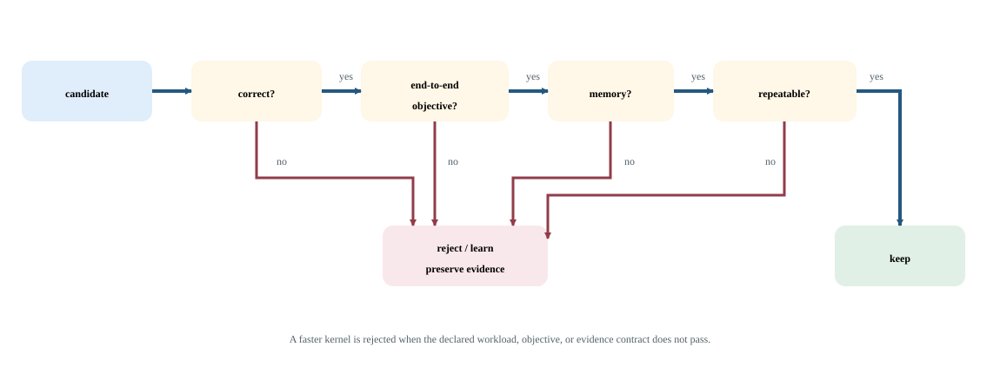

# Lab 16: Custom kernel decision making

Before maintaining custom GPU code, check whether a supported framework or library primitive already expresses the computation efficiently. This lab compares a composed matrix expression with a maintained PyTorch primitive. You will use the result to write an escalation decision based on a measured remaining problem rather than on the assumption that lower-level code must be faster.

## Before you start

Complete the [Lab Guide](../../../README.md#how-to-set-up-the-lab) before starting.

Use one H100 and complete the measurement and correctness lessons. Prepare a decision record containing required semantics, supported shapes/dtypes, end-to-end importance, and the maintenance cost you are willing to accept.

Prefer paths already tuned for SM90 and the pinned CUDA/library stack. Architecture-specific SM90a mechanisms require explicit gates and reduce forward compatibility.

## Concepts and code path

ReLU (rectified linear unit) computes `max(0, x)`, replacing negative values with zero while preserving nonnegative values. The source evaluates a matmul-plus-bias-and-ReLU composition and a path using `addmm` for the matrix/bias portion. Both operate on the same resident BF16 inputs. ReLU remains a separate framework operation; this is not proof that the entire expression is fused into one kernel.

The composition rounds its matrix product to BF16 before adding bias. `addmm` can add bias before that final rounding, so the two valid outputs need not pass a direct elementwise comparison. For example, `1.125 * 3.625 - 4` is exactly `0.078125`, but rounding the product to BF16 first gives `0.0625` after subtraction. Near cancellation, the relative difference is large even though the intermediate rounding error is small. PyTorch's [numerical accuracy guidance](https://docs.pytorch.org/docs/2.14/notes/numerical_accuracy.html) explains why equivalent expressions can produce different floating-point results.

FP64 is a 64-bit floating-point format with more precision than FP32 or BF16. Here it provides a higher-precision reference, not exact real arithmetic. Unit roundoff bounds the relative error of one rounding-to-nearest step in the normal range; for BF16 it is `2^-8`. That single-step bound does not by itself bound all errors in a matrix reduction.

The lab instead converts the original BF16 inputs to FP64 and computes `P = X @ W` and `R = relu(P + bias)` independently of either measured output. Each BF16 path must satisfy this elementwise error budget:

```text
abs(output - R) <= 0.01 + 0.01 * abs(R) + u * (1 + u) * abs(P)
u = 2^-8  (BF16 unit roundoff)
```

The extra term bounds the composition's intermediate product rounding and its propagation through final BF16 rounding. ReLU cannot amplify absolute error. The existing `atol=0.01` and `rtol=0.01` provide the residual acceptance budget; the latter also exceeds BF16's final relative rounding error. This is the acceptance policy for this lab, not an error guarantee for arbitrary inputs or reduction algorithms. Both paths use the same budget, derived from the independent reference rather than from their disagreement. Reference construction and checks run outside the timed region, and their temporary tensors are released before timing.

Given a request where GEMM plus bias/ReLU consumes 35 percent of latency and separate epilogue traffic is proven limiting, compare framework compile, cuBLAS plus epilogue, and CUTLASS fusion. Change to handwritten GEMM only if maintained paths cannot express the semantics. Expected observation: a fused library epilogue can capture the missing traffic reduction while retaining library GEMM quality and a clear fallback.

Collect at least three separate job runs before accepting an optimization; repeated samples within one process do not provide independent-process evidence.

## Practice

`labs/16_library_first_decision.py` compares matrix multiplication plus bias with `torch.addmm`, followed by ReLU. It checks both BF16 paths against an FP64 reference with a rounding allowance and writes timing and numerical-error evidence.

Run from this course directory on the login node after the one-time Lab Guide setup. Save the job number; the completed job prints its result paths.

```bash
sbatch --chdir="$PWD" \
  --output="$PWD/results/16_library_first_decision/logs/%j.out" \
  --error="$PWD/results/16_library_first_decision/logs/%j.err" \
  slurm/16_library_first_decision.sbatch --workload small
```

## Check your results

Each new job owns `results/16_library_first_decision/jobs/JOB_ID/`: `results/` contains measurements, `profiles/` native captures, `logs/` process logs and `artifacts/` auxiliary output. Scheduler logs remain in `results/16_library_first_decision/logs/`. Use the ID returned by this submission.

Inspect the baseline now. After running the variation in Investigate, return here to check and publish the equivalent baseline/candidate pair.

Record the job number printed by this lab's successful submission. Require `COMPLETED` and exit code `0:0`, then read that job's logs and open its printed JSON path. Never select a result from an older job.

```bash
export LAB_JOB_ID='<job number printed by this lab submission>'
sacct -j "$LAB_JOB_ID" --format=JobID,State,ExitCode
cat "results/16_library_first_decision/logs/$LAB_JOB_ID.out"
cat "results/16_library_first_decision/logs/$LAB_JOB_ID.err"
export RESULT_JSON='<exact result path printed by the completed run>'
cat "$RESULT_JSON"
```

Reading JSON is inspection, not validation. Check `lab_id`, `experiment.slurm_job_id`, `correctness` and instrumentation fields; retain every original/aggregate required by this lab.

Require both `composed_matches_reference` and `library_addmm_matches_reference`, then inspect `shape`, `timing`, and `decision_order`. In `numerics`, inspect the FP64 reference dtype, tolerances, BF16 unit roundoff, maximum intermediate rounding allowance and each path's `max_abs_error` and `max_error_budget_fraction`. The fraction is the maximum of the elementwise error-to-budget ratios and must not exceed one. Both paths must independently pass their reference checks.

Outputs must also have the expected shape and BF16 dtype, contain only finite values and satisfy ReLU's nonnegative-output contract. An invalid reference, budget or output stops the run before either timing or JSON publication. Use a profiler before describing the selected implementation or fusion boundary.

Retain hotspot share, existing-library trials, correctness, end-to-end impact, portability, and maintenance cost.

A custom kernel is justified only when the unmet requirement is important and narrower alternatives fail with evidence.



The dashboard reads these completed artifact fields. Each row retains its case and selected slot; the original JSON retains configurations and distributions.

| Dashboard panel | Field under `measurements` | Display unit |
| --- | --- | --- |
| Timing / composed / median (seconds) | `timing.composed.median_ms` | `s` |
| Timing / library addmm / median (seconds) | `timing.library_addmm.median_ms` | `s` |

`publish_results.py` validates the selected pair, publishes its metrics and confirms the selection generation. Prepare publishing once using the Lab Guide before running it. Select two successful, equivalent, unprofiled runs in the same workload preset. For programs that measure several implementations in one run, compare those cases within each slot. Use this lab's declared baseline/candidate pairing: change only one permitted control, or keep all controls fixed for repeated qualification. On the login node, set the paths to the printed result files and review the current generation (use `0` for the first selection):

```bash
"$COURSE_PUBLISH_PYTHON" tools/publish_results.py --lab 16_library_first_decision \
  --baseline "${BASELINE_RESULT:?printed baseline JSON path}" \
  --candidate "${CANDIDATE_RESULT:?printed candidate JSON path}" \
  --expected-generation "${COMPARISON_GENERATION:?0 initially; otherwise reviewed generation}"
```

In Grafana, select your workspace and profile. Require **Correctness of selected results** to be `1` for both slots and **Selected comparison generation** to match the publisher's confirmation. Summary panels always show the currently published pair. Set the time picker to **Experiment start** through **Experiment end** for telemetry, then select the allocated GPU worker and its local GPU indices. GPU activity, framebuffer memory, power, temperature, and node panels provide context; they cannot time individual short kernels or establish exclusive attribution.

## Investigate the behavior

### Workload variations

Run the paired implementations and retain both timings regardless of which wins. The larger profile is another workload point, not evidence that one path is universally preferable.

```bash
sbatch --chdir="$PWD" \
  --output="$PWD/results/16_library_first_decision/logs/%j.out" \
  --error="$PWD/results/16_library_first_decision/logs/%j.err" slurm/16_library_first_decision.sbatch --workload small
sbatch --chdir="$PWD" \
  --output="$PWD/results/16_library_first_decision/logs/%j.out" \
  --error="$PWD/results/16_library_first_decision/logs/%j.err" slurm/16_library_first_decision.sbatch --workload large
```

Keep the workload size fixed for a comparison. If both sizes appear, treat them as separate workload campaigns. Repeat the baseline command to check variation.

What fraction of an actual application does this expression consume? Could compilation or a maintained primitive remove the hotspot? Explain why a substantial microbenchmark improvement can have little end-to-end effect when the hotspot is small.

Higher-level solutions may leave some performance unused but have wider coverage and lower maintenance. Lower-level control can specialize aggressively but moves correctness, safety, and future qualification onto the team.

Capture a separate diagnostic run:

```bash
sbatch --chdir="$PWD" \
  --output="$PWD/results/16_library_first_decision/logs/%j.out" \
  --error="$PWD/results/16_library_first_decision/logs/%j.err" slurm/16_library_first_decision.nsys.sbatch --workload small
```

The native Systems command is in `slurm/16_library_first_decision.nsys.sbatch`. The [GPU Performance Tools reference](../../../gpu-performance-tools/index.html) explains its flags.

Open the printed `.nsys-rep` in Systems. Expand NVTX and CUDA rows, select `course_measure`, then inspect CUDA API calls, copies, kernel launches, and idle gaps within that interval. Follow a launch to GPU execution before attributing a CPU range to device work.

For one kernel, use the same fixed workload in a separate Compute capture. The launcher selects one matching kernel inside `course_measure`, the configured NVTX range for this lab. Its launch-count limit applies after the range and kernel-name filters. In Systems, identify a kernel that performs the operation this lab investigates. Set `COURSE_PROFILE_KERNEL` to a regular expression matching that kernel and repeat the Compute capture. Verify the selected kernel and NVTX range before interpreting its counters; initialization-only evidence does not explain the lab's measured work.

```bash
sbatch --chdir="$PWD" \
  --output="$PWD/results/16_library_first_decision/logs/%j.out" \
  --error="$PWD/results/16_library_first_decision/logs/%j.err" slurm/16_library_first_decision.ncu.sbatch --workload small
```

The native Compute command is in `slurm/16_library_first_decision.ncu.sbatch`. The [GPU Performance Tools reference](../../../gpu-performance-tools/index.html) explains its flags.

Open `.ncu-rep` → **Details → Speed Of Light**, **Memory Workload Analysis**, and **Occupancy**. Record kernel duration, memory throughput/traffic, and the limiting resource. Counters are diagnostic evidence; replay duration is not end-to-end application latency. Annotate a smaller phase with `annotated_operation(operation, "phase_name")` in Python, or `CaptureRange region("phase_name")` around a CUDA launch, then select `--nvtx-include phase_name/` in the native Compute command. Keep annotations opt-in and outside clean timing paths.

Guided comparison: Compare composed matmul-plus-add with library addmm at the same shape and tolerance. Independently apply Amdahl's law to a chosen application hotspot fraction before choosing custom work.

**Nsight Systems evidence:** Capture the executable inside the Slurm GPU worker/container; submission and result publication remain outside capture. Open the worker .nsys-rep. Expand NVTX, CUDA API and CUDA GPU rows; locate course_measure and follow host submissions into the GPU streams. Inspect launch gaps, kernels and copies relevant to this lab, then test its named tuning control with another unprofiled run. Reports are diagnostic; publish the separate unprofiled baseline and candidate. The capture must contain the exercise itself, not only initialization. If it does not, treat it as incomplete.

## If something goes wrong

Exceeding the declared reference budget invalidates substitution even if the candidate is faster. Inspect the recorded inputs, dtype and reduction settings before changing an acceptance rule; a pairwise BF16 mismatch alone does not establish a defect. If timing differences are smaller than run variation, record an inconclusive result. Do not escalate to custom code without a concrete unmet requirement.

Avoid optimizing a visually complex kernel that contributes little end-to-end time.

Publication failure is separate from benchmark failure. Retain the JSON files and retry the same pair using the generation printed by the failed publisher. A stale-generation rejection means another selection won; review it before replacing it. Missing metrics remain unknown. Counter permission errors or an empty capture require readiness repair before a profiling claim.

## Takeaways and next step

Your deliverable is a justified choice among framework composition, library primitive, compilation, and custom implementation. If custom work remains warranted, carry the exact semantics, baseline, and acceptance criteria into the Custom CUDA Kernels capstone.

Use framework configuration first, then compilation or specialized libraries, and custom CUDA only for a proven residual gap.

State the evidence that would make you reject your own custom-kernel proposal.
