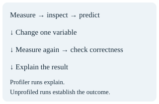
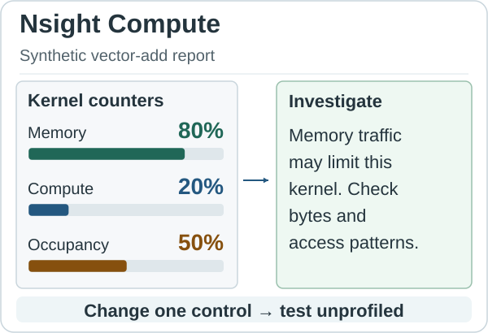
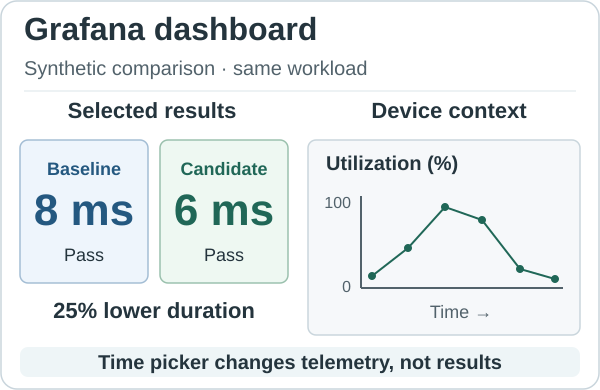
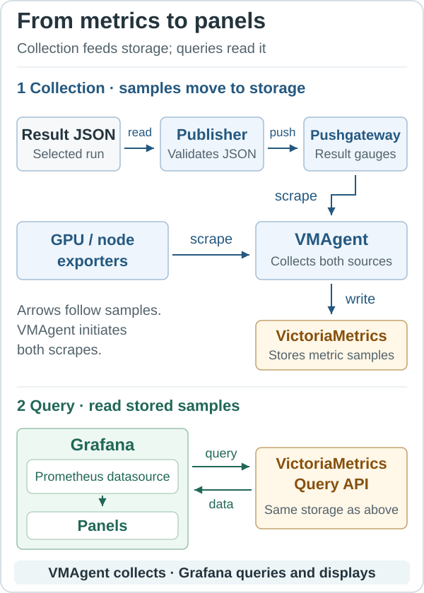

# GPU Performance Tools

GPU Performance Tools introduces the native commands and evidence used by the
practical GPU courses. Learn how to read Slurm jobs, select a profiler and
interpret timelines, kernel counters, operator summaries and dashboard metrics.

Read this course after Soperator and before GPU Fundamentals or any practical
labs. Basic Linux knowledge and the ability to read small Python examples are
sufficient; GPU Fundamentals is not a prerequisite. Return here for command and
flag explanations while following the practical courses.

This reference course has no labs or exercises and needs no running cluster to
read. Use the practical courses for lab-specific commands and the
[Lab Guide](../lab-guide.html#lab-preparation-scripts) for environment preparation. The figures use synthetic values to explain concepts;
they are not recorded measurements.

## 1. Choose evidence and read native jobs

### Objective

Separate workload size, profiling and performance measurement; explain the native Slurm process flow.

### How it works

A profiler records application activity while a workload runs. Instrumentation and kernel replay can change execution time. Establish a correct, unprofiled baseline first. Use a separate capture to investigate a particular question, then repeat the original unprofiled measurement to judge a change.



`--workload small|large` selects problem size. It does not turn profiling on. The normal `.sbatch` job runs the workload; the `.nsys.sbatch` and supported `.ncu.sbatch` jobs show the native diagnostic commands. PyTorch profiler labs are explicitly diagnostic even when no external tool is attached.

`sbatch` submits a job and requests an allocation. The `#SBATCH` lines at the top of the file describe its resources. `srun` starts a job step using that allocation. One `srun python labs/example.py ...` starts one Python program per task, not all Python files mentioned by the surrounding documentation. Separate `srun` commands create separate steps; use sequential commands or explicit concurrent steps when an experiment needs several programs.

| Slurm or shell option | Meaning in these courses |
| --- | --- |
| `--chdir="$PWD"` | Start the job in the directory from which you submit; relative lab and result paths resolve there. |
| `--nodes`, `--ntasks`, `--ntasks-per-node` | Allocate nodes and processes; distributed jobs state their layout explicitly. |
| `--gpus-per-node` | Allocate that many GPUs on each node for the job. |
| `--gpus-per-task` | Assign GPUs to each launched task; a partition name alone does not allocate a GPU. |
| `--cpus-per-task`, `--mem`, `--time` | CPU, memory and wall-clock limits for the job or step. |
| `--kill-on-bad-exit=1` | End sibling tasks when one task fails. |
| `--no-requeue` | Do not restart the same job automatically; a retry needs a fresh job ID. |
| `--output`, `--error` | Scheduler stdout/stderr files. `%j` expands to the job ID; `%J` includes the step and `%t` identifies the task. Parent directories must exist before submission. |
| `--parsable` | Return the job ID in a machine-readable form for campaign orchestration. |
| `--` | End a command's options when that command supports the convention. It does not mean “run another script.” Everything following belongs to that command's positional arguments. |
| `"$@"` | Forward the current script's remaining arguments as separate, quoted arguments. |

Job requests and step requests have different scopes. A simple one-task step can inherit task counts, but explicit `srun --ntasks=1 --gpus-per-task=1` states exactly what that step launches and how its GPU is assigned. Multi-step jobs need that distinction. Shell variables in `#SBATCH` directives are not expanded; use submission options for values such as `$PWD`.

New output is `results/LAB/jobs/JOB_ID/{results,profiles,logs,artifacts}`. Scheduler logs remain `results/LAB/logs/JOB_ID.out` and `.err`. The shared setup prepares the parent directories; the job creates its own private directory exclusively. Existing files are never selected by “newest file” rules.

Diagnostic commands use `timeout --signal=TERM --kill-after=15s 900s`: send TERM after 900 seconds, then KILL after 15 more seconds if needed. This bounds the process lifetime. The profiler's capture duration controls collection, not the whole application's lifetime. Keep the Slurm wall limit as an additional bound.

### Mental model

A normal job measures an outcome; a diagnostic job helps explain it. Each job owns its evidence.

## 2. Nsight Systems and NVTX regions

### Objective

Read a timeline and understand named regions, capture boundaries and each Systems flag.

### How it works

**Nsight Systems** records a timeline: CPU activity, CUDA calls, memory copies, GPU kernels and communication. Each row represents one kind of activity; its position along the time axis tells you when it happened. CUDA is the software interface the CPU uses to submit GPU work. A kernel is a function that executes on the GPU. NVTX supplies application labels, explained below.

Consider one request that prepares input on the CPU, copies it to the GPU, runs a kernel and brings the answer back. In the example, the CPU prepares data from 0 to 2 milliseconds (ms). The input copy occupies 2–3 ms, the kernel 3–6 ms and the output copy 6–7 ms. The kernel takes 3 ms, while the whole request takes 7 ms. Making the kernel twice as fast would reduce this modeled request to 5.5 ms if all other costs stayed unchanged; it would not halve the request's total time.


Read the timeline from left to right, following the millisecond scale. The upper row shows CPU activity; the lower row shows GPU kernels and copies (`In` for the input copy and `Out` for the output copy). Each box spans its activity's interval. The diagonal arrow links the brief host launch to the kernel it submits; the arrow is a relationship, not a duration. The CPU can submit the kernel while the input copy is still running, but the kernel shown here waits for that copy to finish. A host launch is a short submission, not the whole GPU execution. In Systems, select the request interval, expand the CUDA API and GPU rows, and follow the launch's correlation to its kernel. A long CPU interval may be executing, submitting work or waiting: inspect its calls before assigning a cause. Overlapping GPU activities can establish concurrency; their dependencies and the end-to-end result determine whether the overlap helps. The GPU operations in this example are deliberately serialized: the copies and kernel do not overlap.

The Systems job contains a command shaped like this; its actual application, report path and resource request are lab-specific:

```bash
nsys profile --trace=cuda,nvtx,osrt \
  --cuda-trace-scope=process-tree --sample=none --cpuctxsw=none \
  --discard-environment=true --force-overwrite=false \
  --duration=300 --kill=none --wait=all \
  --output "$REPORT_PREFIX" python labs/example.py --workload small
```

| Systems option | Meaning and selected behavior |
| --- | --- |
| `profile` | Launch the application and collect a report. |
| `--trace=cuda,nvtx,osrt` | Collect CUDA activity, application annotations and OS-runtime calls. Selected communication jobs also enable `nccl` or `ucx` to inspect those libraries. |
| `--cuda-trace-scope=process-tree` | Include CUDA activity from the launched process tree. |
| `--sample=none` | Disable CPU instruction-pointer sampling; CUDA and NVTX tracing remain enabled. |
| `--cpuctxsw=none` | Disable CPU context-switch tracing to reduce unrelated data and overhead. |
| `--discard-environment=true` | Exclude environment variables from the report; it does not clear the application's environment. |
| `--force-overwrite=false` | Refuse to overwrite an existing report. |
| `--duration=300` | Bound trace collection to 300 seconds. A report may be incomplete if the interesting work occurs later. |
| `--kill=none` | Do not kill the application just because collection ends. |
| `--wait=all` | Wait for the application and its children, including reparented children. |
| `--wait=primary` | Used only by controlled long-lived server experiments; wait for the primary launched process while the coordinator owns service cleanup. |
| `--output` | Report prefix; Systems appends `.nsys-rep`. `%p` expands to the process ID and `%q{NAME}` to an environment variable, isolating jobs, steps and workers. |
| `--trace-fork-before-exec=true` | Include activity between fork and exec in the server process tree. |
| `--cuda-graph-trace=node` | Trace individual CUDA Graph nodes; this adds detail and overhead. |
| `--capture-range=cudaProfilerApi` | Begin capture when the application calls the CUDA profiler API. |
| `--capture-range-end=stop` | Stop collection when that API-controlled range ends. |
| `--flush-on-cudaprofilerstop=false` | Server-specific control: defer flushing until the controlled shutdown rather than flushing at each stop call. |

`env -u DEBUGINFOD_URLS` removes the remote debug-symbol server setting for this command, avoiding external symbol-download waits. The native server jobs use acknowledged `POST /start_profile` and `/stop_profile` requests. vLLM's `--profiler-config.profiler cuda` selects CUDA profiler API control; it is an application option, not an Nsight option. The job checks for a nonempty native report after shutdown.

Open the `.nsys-rep` in Nsight Systems and correlate NVTX, CUDA API, kernel, copy and communication rows. `nsys stats REPORT.nsys-rep` prints native summaries; summaries alone do not establish where host work overlaps GPU execution.

A **measurement region** is the part of the application chosen for observation. NVIDIA's NVTX ranges provide explicit names for such regions, but naming a range does not automatically start a timer or limit every capture. Systems can display it; Compute can select kernels launched within it. Place `course_measure` after warmup and use completion-aware timing separately.

**NVTX (NVIDIA Tools Extension Library)** is NVIDIA's annotation API: function calls that attach your own names to application activity. A **marker** labels one instant, such as “input ready.” A **range** labels an interval between a beginning and an end, such as “submit the forward pass.” Nested ranges show that smaller operations belong to a larger step. Nsight Systems displays these annotations alongside CUDA activity; Nsight Compute can use a named range to select kernels launched inside it. NVTX supplies context to these tools, rather than collecting GPU counters itself.

This short example uses PyTorch's NVTX interface, already used in the course labs. It requires a CUDA-enabled PyTorch runtime and GPU. It is an illustrative diagnostic snippet, not a benchmark or a new lab command. The input is already in GPU memory before the annotated calculation begins.

```python
import torch
from torch.cuda import nvtx

x = torch.randn(1024, 1024, device="cuda")
torch.cuda.synchronize()  # Finish input creation before this example.
nvtx.mark("input_ready")

with nvtx.range("step"):
    with nvtx.range("square"):
        y = x * x
    nvtx.mark("square_submitted")
    with nvtx.range("reduce"):
        total = y.sum()
    with nvtx.range("wait_for_result"):
        torch.cuda.synchronize()

nvtx.mark("result_ready")
```

The `with` blocks open and close ranges, including when Python raises an exception. `nvtx.mark(...)` records a point without opening a range. The `square` and `reduce` ranges surround CPU calls that submit GPU work. They can end before their kernels finish. The explicit `torch.cuda.synchronize()` in `wait_for_result` makes the CPU wait; NVTX itself does not. The final marker therefore follows GPU completion in a successful run. The scalar `total` still lives in GPU memory: waiting has not copied it to the CPU.


Read this schematic from left to right. Diamonds mark instants, while boxes span intervals; their widths show relative order, not measured durations. The upper row contains the CPU's `step` range and its nested ranges; the lower row shows the submitted GPU kernels. The blue dashed arrows connect submission to execution. The amber dashed arrow connects GPU completion to the explicit wait returning. The `square_submitted` marker appears before the square kernel finishes, while `result_ready` follows the wait and the end of `step`.

Here are the practical capabilities illustrated by those names:

- **Find an event:** search for `input_ready` or `result_ready` in Systems to locate a request boundary. A marker has no duration; it is not a timer.
- **Group work:** expand `step` to see its nested `square`, `reduce` and `wait_for_result` ranges. This connects a high-level operation to the code that submitted it.
- **Explain waiting:** compare `square_submitted` with the correlated GPU kernel and `wait_for_result`. A short submission range followed by a long wait shows why a quick Python call does not prove a quick GPU result.
- **Focus a capture:** use `square` as the NVTX range for a Compute capture to select the multiplication kernels launched there and exclude the `reduce` launches. For these push/pop ranges, the Compute selector is `--nvtx --nvtx-include 'square/'`; the trailing slash denotes a push/pop range. Combine it with the lab's kernel-name and launch-count controls when a range launches multiple kernels. The selector filters profiling; it does not change the calculation.

A range's CPU duration is not automatically its GPU execution time. Use the correlated GPU activity or CUDA events for device timing. The supplied course capture path also labels phases such as `course_warmup`, `course_measure` and the complete `lab_workload`; Fundamentals Lab 01 adds `h2d_inputs`, `gpu_expression` and `d2h_output` for its transfer-inclusive diagnostic run. Shared course annotations are enabled for capture, keeping their wrappers out of clean acceptance timings.

### Mental model

NVTX gives application context. Systems shows time and relationships; annotation alone does not synchronize CUDA.

## 3. Nsight Compute kernel analysis

### Objective

Select a representative measured kernel and understand replay, counter sections and each Compute flag.

### How it works

**Nsight Compute** gathers hardware counters for selected GPU kernels. A counter describes work done by hardware, such as bytes moved or instructions executed. The tool often replays a kernel to collect groups of counters, so its capture is a diagnostic experiment with additional overhead.

Suppose Systems identifies a vector-add kernel as the main GPU cost. Open its Compute report and inspect **Speed Of Light** for throughput relative to the device's supported peak rates, **Memory Workload Analysis** for memory traffic and cache behavior, and **Occupancy** for resident warps. A warp is a group of GPU threads; occupancy is the fraction of the SM's supported resident warps that are active. An SM (streaming multiprocessor) is the hardware unit that schedules those warps.



Read from the counters on the left to the investigation on the right. The synthetic report shows memory throughput at 80% of peak, compute throughput at 20%, and achieved occupancy at 50%. These are three different ratios; they do not add to 100%. The arrow means that the counters inform a hypothesis. The first two suggest investigating memory traffic before adding arithmetic parallelism. Check the actual bytes, access pattern and workload size before declaring a memory bottleneck. Occupancy alone does not establish performance: increasing it may leave memory traffic unchanged. Change one relevant control and repeat the unprofiled benchmark to test the prediction. Missing counter permission means evidence is unavailable, not that a counter is zero. Use the lab's supported single-kernel capture; never replay a whole distributed collective or live serving workload as an ordinary kernel experiment.

| Compute option | Meaning and selected behavior |
| --- | --- |
| `--target-processes all` | Include supported child processes of the launched workload. |
| `--nvtx` | Enable NVTX-based filtering. |
| `--nvtx-include course_measure/` | Select kernels launched inside this push/pop range; the trailing slash denotes a push/pop range. |
| `--kernel-name-base demangled` | Match readable C++ kernel names. |
| `--rename-kernels off` | Keep the recorded kernel names rather than applying rename rules. |
| `--kernel-name "regex:PATTERN"` | Select the measured kernel identified in Systems. Set `COURSE_PROFILE_KERNEL` to that pattern before submitting the Compute job. |
| `--launch-count 1` | Collect one matching launch, reducing replay cost. Warmup belongs outside the selected range. |
| `--set basic` | Start with the basic collection set. |
| `--section SpeedOfLight` | Add throughput relative to hardware limits. |
| `--section MemoryWorkloadAnalysis` | Add memory traffic and cache evidence. |
| `--section Occupancy` | Add warp-residency and limiting-resource evidence. |
| `--clock-control none` | Do not ask Compute to lock GPU clocks; record the actual run conditions. |
| `--force-overwrite false` | Refuse to overwrite existing reports. |
| `--export` | Save the `.ncu-rep` report with a unique job/step/process prefix. |
| `--config-file off` | The local distributed-lab companion ignores user configuration files for reproducible selection. |
| `--nvtx-push-pop-scope process` | Interpret the companion's push/pop range in process scope. |
| `--replay-mode kernel` | Replay the selected kernel to gather required counter groups. |
| `--kill no` | Do not terminate the application merely after collecting the selected launches. |
| `--import` | Read an existing report without running the workload again. |

Open `.ncu-rep` in Nsight Compute, or use `ncu --import REPORT.ncu-rep`. Collection can require several passes and alter cache/device state. Kernel timings in the report and application wall time during replay do not replace an unprofiled benchmark. The course does not replay distributed collectives or a live server; the supported distributed example uses a separate single-process companion.

### Mental model

Counters test a kernel hypothesis. Validate its performance impact in a separate unprofiled run.

## 4. PyTorch operator profiling

### Objective

Relate framework operators to device work while keeping profiler overhead out of timing claims.

### How it works

**PyTorch profiler** connects framework operators to CPU activity and CUDA work. Use it when a question starts at the tensor/operator level: which operation launches work, which shapes matter, and which operators account for device activity? Systems supplies the wider process timeline; Compute supplies selected kernel counters.

```python
with torch.profiler.profile(
    activities=[torch.profiler.ProfilerActivity.CPU,
                torch.profiler.ProfilerActivity.CUDA],
    record_shapes=True,
) as profiler:
    for _ in range(measured_steps):
        output = model(inputs)
        profiler.step()
print(profiler.key_averages().table(sort_by="self_cuda_time_total", row_limit=10))
```

This is an explanatory fragment: create inputs and perform warmup before entering the context. Fundamentals Lab 08 supplies the complete runnable program.

| PyTorch setting or method | Meaning |
| --- | --- |
| `activities` | Select CPU operator events and CUDA activity. CUDA collection requires a supported CUDA runtime. |
| `record_shapes=True` | Record input shapes for operator analysis; adds overhead and can affect tensor lifetimes. |
| `step()` | Advance the profiler's logical step, including any configured schedule. |
| `key_averages()` | Aggregate repeated operator events. Aggregation loses the ordering visible in a timeline. |
| `table(sort_by=..., row_limit=10)` | Sort the summary and show ten rows; a self-time column excludes nested child time. |
| `export_chrome_trace(PATH)` | Export a trace for a compatible timeline viewer; choose a new job-owned path. |

Lab 08's normal job is a PyTorch diagnostic. Its external Systems/Compute jobs pass `--external-only`, disabling the embedded profiler so two profilers do not contend. All three produce diagnostic evidence. Use a separate normal timing lab for performance comparisons; an aggregated operator table is not an end-to-end latency measurement.

### Mental model

An operator summary explains framework work; a timeline preserves order, and neither removes profiling overhead.

## 5. Grafana and VictoriaMetrics

### Objective

Trace metrics from collection to query and interpret benchmark values alongside sampled telemetry.

### How it works

**Grafana** queries a data source and arranges the results into panels, such as a number, table or time-series graph. In these courses, completed benchmark summaries and sampled GPU/node telemetry reach the metrics data source by different paths. The result JSON file remains the authoritative experiment record. Grafana helps you compare the selected results and inspect the conditions around them.

Select the course and lab dashboard, persistent workspace, workload size, GPU identifier and experiment time interval. Keep `small` and `large` as separate workloads. In this synthetic example, baseline and candidate both pass correctness and use equivalent inputs; their median durations are 8 ms and 6 ms. The candidate's duration is 25% lower: `(8 - 6) / 8`. Repeated unprofiled runs and their variation determine whether that difference is dependable.



The panels on the left show the selected completed pair; both pass correctness. The graph on the right shows GPU utilization sampled over time, with earlier samples on the left and later samples on the right. Its dots are observations, not individual kernels. Placing the views side by side helps compare outcomes with device conditions; it does not establish that one caused the other. A brief kernel may run between samples, so an empty or low-utilization interval cannot replace the benchmark timer or the Systems trace. Summary panels retain the selected pair independently of the time picker; changing the interval changes the telemetry view, not which results occupy the baseline and candidate slots. Those slots change only when a new validated pair is explicitly published. Activity on a shared GPU is correlation until you establish which workload caused it.

The deployment's collection and query paths have different jobs. NVIDIA Data Center GPU Manager (DCGM) and node exporters expose sampled GPU/node telemetry. The course publisher validates selected result JSON and exposes benchmark gauges through Pushgateway. VMAgent scrapes those endpoints and writes the samples to VictoriaMetrics. Grafana uses its datasource to query the stored samples and displays the returned data in panels.



In the collection path, blue arrows follow the samples; VMAgent initiates both scrapes. In the query path, green arrows distinguish the query request from the returned data. Both VictoriaMetrics boxes refer to the same storage system. Grafana does not scrape the GPUs or collect those results itself.

The existing Grafana datasource uses the Prometheus type and points at VictoriaMetrics' Prometheus-compatible API. The dashboard's symbolic `course-soperator-metrics` datasource is mapped during import to the discovered datasource. Keep its backend URL and credentials in the deployment's protected configuration. The shared Lab Guide owns discovery and setup; this lesson does not install or modify infrastructure.

In Grafana Explore, select that datasource, choose the exact workspace and workload, and query a published result:

```promql
course_lab_resident_duration_seconds{
  course="gpu-fundamentals", lab="01_cpu_gpu_crossover",
  workspace="YOUR_WORKSPACE", profile="small", slot="baseline"
} @ now()
```

`profile` is the existing stored workload label; the runnable CLI is `--workload`. Result schemas and metric labels remain unchanged. `slot` selects the explicitly published baseline or candidate, not whichever job finished most recently. Inspect `case` labels when a lab contains several tensor sizes. Duration gauges use seconds, even when source JSON reports milliseconds.

For sampled utilization, use the discovered GPU label names and exact worker/GPU identity in the course dashboard:

```promql
DCGM_FI_DEV_GPU_UTIL{Hostname="YOUR_WORKER",gpu="0"}
```

This metric is a percentage. Select the experiment's UTC start/end interval, check scrape resolution, and verify which workload owned the device. Missing samples are unknown, not zero. A datasource connection alone does not prove that the correct exporter, job, labels or result generation reached storage.

### Mental model

Exporters and publishers produce observations; VMAgent forwards them, VictoriaMetrics stores them, and Grafana queries them.
