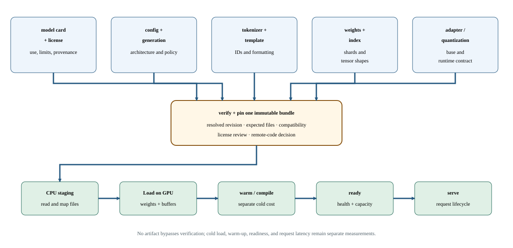

# Lab 16: Audit model, tokenizer, configuration, and license identity

A model name alone does not fully identify an inference workload. Weights, tokenizer, configuration, generation settings, and code-loading policy can all affect behavior. This lab inspects a pinned public model revision before inference, helping you establish reproducible artifact identity and identify compatibility or licensing questions before allocating time to performance experiments.

## Before you start

Use the [Lab Guide](../../../lab-guide.html#lab-preparation-scripts) once to prepare this course and lab number before submitting jobs.

Use one H100 and the approved mechanics environment with access to the selected public artifact. Review its license separately; reading license metadata is not legal approval. Never place credentials in commands or reports.

The artifact must include a supported dtype and architecture path for SM90. Heavyweight engines may transform or compile weights into engine-specific artifacts that need their own pinned identity and validation.

## Concepts and code path

The script resolves the immutable revision, inspects artifact listings, loads configuration/tokenizer metadata without remote custom code, and checks expected safe weight artifacts. It records model dimensions, head counts, positional settings, vocabulary sizes, chat-template presence, and generation metadata. It does not perform a model-quality evaluation or prove engine compatibility merely from configuration fields.

Given identical prompt text tokenizing to 1,024 IDs under revision A and 1,088 under revision B, input-token count and ideal KV bytes increase by 6.25 percent before any engine change. Prefill work is not a single linear quantity: projections scale approximately with token count while dense attention has a quadratic sequence term (the squared ratio is about 1.1289). Real allocation rounds blocks and latency requires measurement. Change only the tokenizer revision while keeping weights named identically. Expected observation: output IDs, TTFT, and memory can change, so the artifact audit rejects the comparison until tokenizer, template, generation config, and revision are fixed.

Build a manifest for the pinned model revision. Metadata agreement establishes artifact identity, not runtime compatibility or output quality.



The artifact list and immutable revision are queried through the Hub API. Run this lab with `HF_HUB_OFFLINE=0` and `TRANSFORMERS_OFFLINE=0`, even if the model files are cached. It fetches metadata and configuration/tokenizer artifacts, not model weights; a cache alone cannot answer `HfApi.model_info`. Keep other offline lab environments unchanged.

## Practice

`labs/16_model_artifact_audit.py` inspects a pinned model's files, configuration, tokenizer, and license metadata without enabling remote model code. It checks revision and required artifacts, then records the artifact contract in JSON.

Run from this course directory on the login node after the one-time Lab Guide setup. Save the job number; the completed job prints its result paths.

```bash
sbatch --chdir="$PWD" \
  --output="$PWD/results/16_model_artifact_audit/logs/%j.out" \
  --error="$PWD/results/16_model_artifact_audit/logs/%j.err" \
  slurm/16_model_artifact_audit.sbatch --workload small
```

## Check your results

Each new job owns `results/16_model_artifact_audit/jobs/JOB_ID/`: `results/` contains measurements, `profiles/` native captures, `logs/` process logs and `artifacts/` auxiliary output. Scheduler logs remain in `results/16_model_artifact_audit/logs/`. Use the ID returned by this submission.

Inspect the baseline now. After running the variation in Investigate, return here to check and publish the equivalent baseline/candidate pair.

Record the job number printed by this lab's successful submission. Require `COMPLETED` and exit code `0:0`, then read that job's logs and open its printed JSON path. Never select a result from an older job.

```bash
export LAB_JOB_ID='<job number printed by this lab submission>'
sacct -j "$LAB_JOB_ID" --format=JobID,State,ExitCode
cat "results/16_model_artifact_audit/logs/$LAB_JOB_ID.out"
cat "results/16_model_artifact_audit/logs/$LAB_JOB_ID.err"
export RESULT_JSON='<exact result path printed by the completed run>'
cat "$RESULT_JSON"
```

Reading JSON is inspection, not validation. Check `lab_id`, `experiment.slurm_job_id`, `correctness` and instrumentation fields; retain every original/aggregate required by this lab.

Require matching pinned/resolved revision, expected artifacts, safetensors weights, and the standard-code loading policy. Inspect tokenizer/model vocabulary and KV-head metadata. License inspection and successful parsing do not imply permission for every intended use.

Retain public artifact IDs, immutable revisions, file hashes, tokenizer settings, license, and code-execution policy.

Artifact identity is part of correctness, security, capacity, and performance evidence.

The dashboard reads these completed artifact fields. Each row retains its case and selected slot; the original JSON retains configurations and distributions.

| Dashboard panel | Field under `measurements` | Display unit |
| --- | --- | --- |
| Hidden size | `hidden_size` | `none` |
| Layers | `layers` | `none` |
| Attention heads | `attention_heads` | `none` |
| Key value heads | `key_value_heads` | `none` |
| Maximum positions | `maximum_positions` | `none` |

`publish_results.py` validates the selected pair, publishes its metrics and confirms the selection generation. Prepare publishing once using the Lab Guide before running it. Select two successful, equivalent, unprofiled runs in the same workload preset. For programs that measure several implementations in one run, compare those cases within each slot. Use this lab's declared baseline/candidate pairing: change only one permitted control, or keep all controls fixed for repeated qualification. On the login node, set the paths to the printed result files and review the current generation (use `0` for the first selection):

```bash
source tools/course_env.sh 16_model_artifact_audit --lab
"$COURSE_PUBLISH_PYTHON" tools/publish_results.py --lab 16_model_artifact_audit \
  --baseline "${BASELINE_RESULT:?printed baseline JSON path}" \
  --candidate "${CANDIDATE_RESULT:?printed candidate JSON path}" \
  --expected-generation "${COMPARISON_GENERATION:?0 initially; otherwise reviewed generation}"
```

In Grafana, select the workspace and profile. Require **Correctness of selected results** to equal 1 and **Selected comparison generation** to match publication confirmation. Compare the selected artifact fields and experiment timestamps. This dashboard omits GPU telemetry because this recipe cannot attribute device activity to its result.

## Investigate the behavior

### Workload variations

Inspect the model/revision options and run the pinned default. Any replacement must use a matching immutable commit rather than a moving branch such as a default repository head.

```bash
"$COURSE_PYTHON" labs/16_model_artifact_audit.py --help
sbatch --chdir="$PWD" \
  --output="$PWD/results/16_model_artifact_audit/logs/%j.out" \
  --error="$PWD/results/16_model_artifact_audit/logs/%j.err" slurm/16_model_artifact_audit.sbatch --workload small
```

Keep the workload size fixed for a comparison. If both sizes appear, treat them as separate workload campaigns. Repeat the baseline command to check variation.

Which fields affect memory capacity, attention layout, and tokenization? Explain why identical prompt text with a different tokenizer or chat template is not necessarily identical model input.

Immutable pinning reduces surprise but increases release and storage management. Remote code can enable model-specific behavior while expanding the security and compatibility surface. Prebuilt engines improve startup consistency only after their exact build/runtime contract is qualified.

**Nsight Systems: not applicable.** This CPU-side artifact audit examines configuration and tensor metadata without running model inference. Inspect the measured or modeled fields in this lab's dashboard; retain the artifact and its stated scope.

## If something goes wrong

A revision mismatch or remote-code requirement blocks the declared artifact contract. If expected weight files are missing, investigate rather than guessing a loader format. Keep access errors private and never bypass the no-remote-code policy casually.

Loading mutable latest revisions makes later results impossible to reproduce.

Publication failure is separate from benchmark failure. Retain the JSON files and retry the same pair using the generation printed by the failed publisher. A stale-generation rejection means another selection won; review it before replacing it. Missing metrics remain unknown. Counter permission errors or an empty capture require readiness repair before a profiling claim.

## Takeaways and next step

Artifact identity is part of the experiment, not administrative trivia. Carry this manifest into generation and engine qualification, then confirm actual startup and request behavior before benchmarking the selected model.

Pin every artifact and review executable model code before loading model weights or executing that code.

List the artifacts that can change token IDs or kernel selection.
