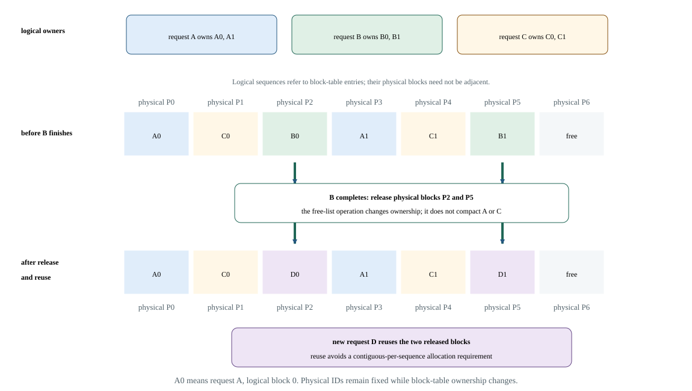

# Lab 27: Follow paged-cache allocation, growth, and recycling

Paged KV storage gives each request a logical block table that points to physical cache pages. This lab implements that ownership lifecycle in a deterministic Python model, including failed growth and page reuse. You will learn why capacity failure must leave state unchanged and why counting pages alone cannot demonstrate a correct allocator.

## Before you start

Use the [Lab Guide](../../../lab-guide.html#lab-preparation-scripts) once to prepare this course and lab number before submitting jobs.

The course wrapper checks the H100 environment, but allocator operations run on the CPU and create no live KV tensors. Use at least four physical blocks for the fixture.

Block size interacts with attention kernels, graph buckets, allocator behavior, and HBM capacity. Use engine-supported values rather than treating block size as a generic PyTorch allocation knob.

## Concepts and code path

`PagedKVPool` owns a free-page list, request tables, and logical lengths. Admission reserves pages; growth reserves any extra pages before changing state; completion returns pages. Invariant checks detect duplicated, lost, or out-of-range physical IDs. A separate static demand worksheet checks capacity arithmetic without replacing the stateful lifecycle proof.

Given block size 16 and active sequence lengths 17, 31, and 48, requests allocate 2, 2, and 3 blocks. Change the 31-token request to finish. Expected observation: its two physical blocks return immediately and can serve a new request, while the 17-token request still wastes 15 token slots in its final block.

The diagram is a separate ownership schematic: request B releases physical pages P2 and P5, which request D then reuses. Its letters and page numbers illustrate the same rule as the executable fixture below; they are not that fixture's output.



With 16-token blocks and at least four blocks, A's table grows from [0] to [0,3] as it crosses a page boundary; B retains [1,2]. Oversized growth is rejected without changing any table or token length. Completing A lets C reuse the exact physical IDs [0,3]. This dynamic lifecycle is distinct from a static storage-demand calculation.

## Practice

`labs/27_paged_kv.py` simulates physical KV-block allocation, growth, release, and reuse. It checks allocator invariants and records lifecycle events, capacity, and internal waste; it does not execute live attention or benchmark an engine.

Run from this course directory on the login node after the one-time Lab Guide setup. Save the job number; the completed job prints its result paths.

```bash
sbatch --chdir="$PWD" \
  --output="$PWD/results/27_paged_kv/logs/%j.out" \
  --error="$PWD/results/27_paged_kv/logs/%j.err" \
  slurm/27_paged_kv.sbatch --workload small --block-tokens 16 --total-blocks 4
```

## Check your results

Each new job owns `results/27_paged_kv/jobs/JOB_ID/`: `results/` contains measurements, `profiles/` native captures, `logs/` process logs and `artifacts/` auxiliary output. Scheduler logs remain in `results/27_paged_kv/logs/`. Use the ID returned by this submission.

Inspect the baseline now. After running the variation in Investigate, return here to check and publish the equivalent baseline/candidate pair.

Record the job number printed by this lab's successful submission. Require `COMPLETED` and exit code `0:0`, then read that job's logs and open its printed JSON path. Never select a result from an older job.

```bash
export LAB_JOB_ID='<job number printed by this lab submission>'
sacct -j "$LAB_JOB_ID" --format=JobID,State,ExitCode
cat "results/27_paged_kv/logs/$LAB_JOB_ID.out"
cat "results/27_paged_kv/logs/$LAB_JOB_ID.err"
export RESULT_JSON='<exact result path printed by the completed run>'
cat "$RESULT_JSON"
```

Reading JSON is inspection, not validation. Check `lab_id`, `experiment.slurm_job_id`, `correctness` and instrumentation fields; retain every original/aggregate required by this lab.

Follow A from `[0]` to `[0,3]`, while B retains `[1,2]`. After A completes, C must reuse `[0,3]`. Require atomic capacity failure, mapping preservation, recycling, and all pool invariants. Inspect `lifecycle_events` alongside the demand worksheet.

Record block size, allocated/useful tokens, internal waste, free physical IDs, logical block tables, rejected growth, and concurrency after every event. Verify that used and free IDs partition the pool and that a failed reservation leaves state unchanged. The model runs in Python and does not measure engine allocation latency, actual HBM consumption, prefix sharing, or eviction performance.

Paging improves flexible utilization but does not eliminate block rounding or total capacity limits.

The dashboard reads these completed artifact fields. Each row retains its case and selected slot; the original JSON retains configurations and distributions.

| Dashboard panel | Field under `measurements` | Display unit |
| --- | --- | --- |
| Demand worksheet / required blocks | `demand_worksheet.required_blocks` | `none` |
| Demand worksheet / free blocks | `demand_worksheet.free_blocks` | `none` |
| Demand worksheet / shortfall blocks | `demand_worksheet.shortfall_blocks` | `none` |
| Demand worksheet / internal waste tokens | `demand_worksheet.internal_waste_tokens` | `none` |

`publish_results.py` validates the selected pair, publishes its metrics and confirms the selection generation. Prepare publishing once using the Lab Guide before running it. Select two successful, equivalent, unprofiled runs in the same workload preset. For programs that measure several implementations in one run, compare those cases within each slot. Use this lab's declared baseline/candidate pairing: change only one permitted control, or keep all controls fixed for repeated qualification. On the login node, set the paths to the printed result files and review the current generation (use `0` for the first selection):

```bash
source tools/course_env.sh 27_paged_kv --lab
"$COURSE_PUBLISH_PYTHON" tools/publish_results.py --lab 27_paged_kv \
  --baseline "${BASELINE_RESULT:?printed baseline JSON path}" \
  --candidate "${CANDIDATE_RESULT:?printed candidate JSON path}" \
  --expected-generation "${COMPARISON_GENERATION:?0 initially; otherwise reviewed generation}"
```

In Grafana, select the workspace and profile. Require **Correctness of selected results** to equal 1 and **Selected comparison generation** to match publication confirmation. Compare the selected artifact fields and experiment timestamps. This dashboard omits GPU telemetry because this recipe cannot attribute device activity to its result.

## Investigate the behavior

### Workload variations

Run a small four-block pool so the physical IDs are easy to trace. The example deliberately attempts oversized growth and checks rejection without partial mutation.

```bash
sbatch --chdir="$PWD" \
  --output="$PWD/results/27_paged_kv/logs/%j.out" \
  --error="$PWD/results/27_paged_kv/logs/%j.err" slurm/27_paged_kv.sbatch --workload small --block-tokens 16 --total-blocks 4
```

Keep the workload size fixed for a comparison. If both sizes appear, treat them as separate workload campaigns. Repeat the baseline command to check variation.

Why can a request's logical pages map to nonadjacent physical IDs? Calculate unused slots in the final page. Explain why growth must reserve capacity before updating the request length.

Smaller blocks reduce internal fragmentation but increase metadata and scheduling overhead; larger blocks do the opposite. A large cache pool supports concurrency while reducing workspace and graph headroom.

**Nsight Systems: not applicable.** This CPU page-allocation simulation measures model state, not GPU memory traffic. Inspect the measured or modeled fields in this lab's dashboard; retain the artifact and its stated scope.

## If something goes wrong

A duplicate physical ID is an ownership error, not harmless fragmentation. A failed growth that changes any table invalidates the allocator. Do not infer live engine memory behavior from this CPU model's execution time.

Avoid treating a logical block table as proof that physical memory use matches ideal KV bytes.

Publication failure is separate from benchmark failure. Retain the JSON files and retry the same pair using the generation printed by the failed publisher. A stale-generation rejection means another selection won; review it before replacing it. Missing metrics remain unknown. Counter permission errors or an empty capture require readiness repair before a profiling claim.

## Takeaways and next step

Correct paging requires lifecycle invariants as well as capacity math. Prefix sharing, eviction, swapping, and tensor storage are explicit extensions; each needs additional ownership and correctness rules before performance can be evaluated.

Measure block and allocator overhead and keep headroom for engine temporaries.

Show how block size changes metadata, waste, and allocation frequency.
