# PyTorch for GPU Performance Engineering

Read PyTorch code and recognize the work it asks the GPU to do: calculate,
move data, use memory or wait. This foundation prepares you for
[GPU Fundamentals](../gpu-fundamentals/index.html) and later performance labs.

**Before you begin:** basic Python is enough. Reading needs no machine-learning
background, GPU or setup. Examples use small invented inputs; their outputs
illustrate calculations, not measured performance. Blocks marked **CUDA example**
need an NVIDIA GPU and compatible PyTorch environment only if you run them.

**Reading route:** lessons 1–7 cover tensors; 8–11 cover execution and models;
12–18 connect them to performance. Scan the definition, diagram and commented
example, then read the brief performance connection. Allow about three guided
hours; there are no labs or exercises. Experienced readers can start with the
final example if they can already explain shapes, shared storage, gradient
modes and GPU completion.

**Notation:** bold monospace marks PyTorch APIs such as **`shape`**. Ordinary
monospace marks example values and variables, such as `[2, 3]` and `x`.
Axis meanings such as sample and feature come from the application.

## 1. A tensor is data with a description

### Objective

Read a tensor's **`shape`**, **`dtype`**, **`device`** and element count.

### How it works

PyTorch is a library for computing with tensors. A tensor is a collection of
values arranged along dimensions, also called axes. A matrix has two axes:
rows and columns.

A tensor also has metadata: information describing its values. **`shape`**
lists the axis sizes, **`dtype`** describes how each value is stored, and
**`device`** tells you where the values live. The cards below describe the same
two-row, three-column tensor.

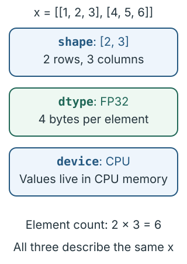

```python
import torch  # Load the PyTorch library.

x = torch.tensor([[1., 2., 3.], [4., 5., 6.]])  # Create a tensor with two rows and three columns.
print(x.shape)  # Show the number of rows and columns.
print(x.dtype)  # Show the number format used for each value.
print(x.device)  # Show where the tensor is stored.
print(x.numel())  # Print the total number of elements in the tensor.
```

FP32 means 32-bit floating point, represented by **`torch.float32`**.
The CPU (central processing unit) runs Python. A GPU (graphics processing unit)
can run tensor calculations in parallel.

These examples use PyTorch's ordinary defaults: decimal values become FP32
tensors on the CPU. Integer sequences use **`torch.int64`**, a 64-bit integer
format. **`torch.ones`** and **`torch.zeros`** fill a requested shape with ones
or zeros; **`torch.arange`** creates an integer sequence, as lesson 2 shows.

#### Shape and random values

**`torch.rand`** and **`torch.randn`** both take axis sizes. They differ in how
they choose values:

- **`torch.rand`** samples uniformly from 0 up to, but excluding, 1.
- **`torch.randn`** samples a standard normal distribution: a bell-shaped
  distribution centered at 0, with standard deviation 1 (a measure of spread).
  Values can be negative or greater than 1.

The curves show where sampled values are more likely to fall. Both calls
still create the same number of rows and columns.

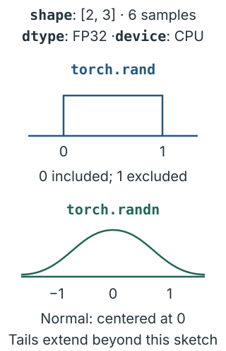

```python
# Create two rows of three random values from 0 up to, but not including, 1.
uniform = torch.rand(2, 3)
# Create the same shape with random values from a standard normal distribution.
normal = torch.randn(2, 3)
```

A small random sample need not average to zero. Later examples use fixed
values when the exact result matters.

**Performance connection:** element count and bytes per element tell you how
much data a tensor contains. Its device tells you where computation happens.

### Mental model

Read the tensor's sizes, stored number format and location before its operations.

## 2. Dimensions are indexed axes with sizes

### Objective

Use grid, row and column indices to select values, and explain the shapes produced by slicing and reshaping.

### How it works

An axis is a dimension used to organize values. Its size counts the entries
along it. A **`shape`** lists these sizes in order. Here, `[2, 3, 4]` describes
two grids, each with three rows and four columns: `2 * 3 * 4 = 24` values.

An index is an integer that chooses an entry along an axis. The plural of
index is indices. Counting starts at zero, so index `0` chooses the first entry
and index `1` chooses the second. A grid is a table of values; a grid index is
the number used to choose one of those tables.

| Axis number | What its index chooses | Size | Available indices |
| --- | --- | --- | --- |
| 0 | A grid | 2 | `0`, `1` |
| 1 | A row in that grid | 3 | `0`, `1`, `2` |
| 2 | A column in that row | 4 | `0`, `1`, `2`, `3` |

Read the indices from left to right: grid, row, column. The highlighted cell
below contains the value `23`.

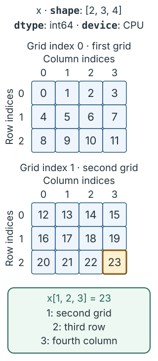

```python
import torch  # Load the PyTorch library.

# Arrange 0 through 23 into two grids of three rows and four columns.
x = torch.arange(24).reshape(2, 3, 4)
print(x.ndim)  # Count and print the axes: grid, row and column.
print(x[1, 2, 3])  # Select and print the second grid, third row, fourth column.
```

#### Selecting a grid, a row or one value

Each index narrows the selection. These examples continue with the same `x`:

| Expression | Selected result | Result shape |
| --- | --- | --- |
| `x[0]` | First grid: three rows of four values | `[3, 4]` |
| `x[0, 1]` | Second row of the first grid: `[4, 5, 6, 7]` | `[4]` |
| `x[0, 1, 2]` | Third value in that row: `6` | `[]` |

A matrix has two axes, a vector has one, and a scalar tensor holds one value
with zero axes. Their shapes above are `[3, 4]`, `[4]` and `[]`. A one-element
vector has **`shape`** `[1]`: one axis containing one value.

#### Keeping a group with a slice

A slice selects a range of entries and keeps their axis. `0:1` means start at
index `0` and stop just before index `1`, so it selects the first grid.

```python
print(x[0].shape)  # Select the first grid; show its row and column sizes.
print(x[0:1].shape)  # Select a group of one grid; keep and show all three axes.
```

Both results contain the first grid's twelve values. The arrows show how
indexing removes the grid axis while slicing keeps it.

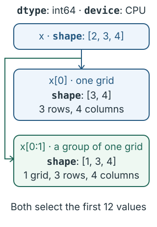

A colon `:` on its own selects every entry on that axis:

```python
print(x[:, :, 0])  # Select and print the first column from every row in every grid.
```

#### Giving the same values a new shape

**`reshape`** arranges the same values into new axis sizes while preserving
their reading order:

```python
flat = x.reshape(6, 4)  # Rearrange the same values into six rows of four columns.
print(flat.shape)  # Show the new row and column sizes.
```

Both shapes contain 24 values. Our application supplies the axis meanings: for
sensor data, `[2, 3, 4]` could mean two sensors, three readings per sensor and
four measurements per reading.

**Performance connection:** grouping the same values into a different shape
changes how later operations work with them. Reshaping keeps the element count.

### Mental model

Shape lists sizes. An index chooses an entry; a slice keeps a range; reshaping gives the same values a new arrangement.

## 3. Broadcasting reuses values across axes

### Objective

Explain how one bias row is added to every row of a matrix.

### How it works

Broadcasting allows compatible tensors with different shapes to participate
in element-wise operations without explicitly copying repeated values. An
element-wise operation acts on corresponding entries. Compare sizes from the
right: each pair must match, or one size must be 1. A missing leading dimension
behaves like size 1.

Adding a `[3]` bias to a `[2, 3]` matrix reuses the same three values for both
rows. A bias is simply an offset added to a value. The diagram shows each
column receiving its matching bias value.

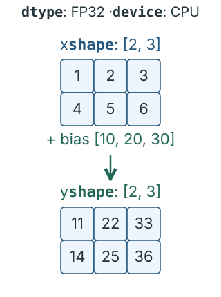

```python
import torch  # Load the PyTorch library.

x = torch.tensor([[1., 2., 3.], [4., 5., 6.]])  # Create two rows of three values.
bias = torch.tensor([10., 20., 30.])  # Create one offset for each column.
y = x + bias  # Add the same column offsets to each row.
print(y)  # Show the two rows after adding the offsets.
```

**Performance connection:** broadcasting reuses the bias without storing an
extra bias row. The addition still computes and stores all six output values.

### Mental model

Match sizes from the right, then reuse values along the missing or size-one axes.

## 4. Element-wise work and matrix multiplication differ

### Objective

Distinguish element-wise multiplication (`*`) from matrix multiplication (`@`).

### How it works

An element-wise operation acts on corresponding entries. For multiplication,
`*` multiplies each entry by its partner. Matrix multiplication, written `@`,
combines a row with a column: multiply matching entries, then add the products.

The diagram follows the first output value in each calculation. Only the
matrix product adds several products together.

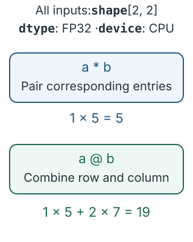

```python
import torch  # Load the PyTorch library.

a = torch.tensor([[1., 2.], [3., 4.]])  # Create the first two-by-two matrix.
b = torch.tensor([[5., 6.], [7., 8.]])  # Create the second two-by-two matrix.
print(a * b)  # Multiply matching entries and print the result.
print(a @ b)  # Multiply rows by columns, sum the products, and print the result.
```

For two matrices, the left column count must equal the right row count.
A `[2, 3]` matrix multiplied by a `[3, 4]` matrix produces `[2, 4]`: two
output rows and four output columns.

**Performance connection:** matrix multiplication combines many input values
per output and can reuse them. Element-wise multiplication does less arithmetic
per value read. These differences help explain the work you later profile.

### Mental model

`*` pairs entries. `@` combines rows and columns.

## 5. Reductions remove information and axes

### Objective

Calculate one mean per row and explain what **`keepdim`** changes.

### How it works

A reduction combines multiple values into fewer values. Sum, mean and maximum
are examples.

- **`dim`**: Specifies which dimension to reduce.
- **`mean()`**: Calculates averages, reducing multiple values into fewer values.
- **`keepdim=True`**: Keeps the reduced dimension with size 1 instead of removing it.

In this matrix, dimension 0 is rows and dimension 1 is columns; `-1` means the
last dimension. The arrows show each row becoming its mean.

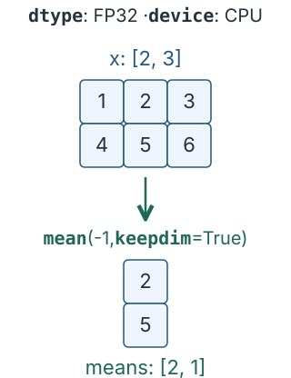

```python
import torch  # Load the PyTorch library.

x = torch.tensor([[1., 2., 3.], [4., 5., 6.]])  # Create two rows of three values.
print(x.mean(dim=1))  # Average across columns (dim 1); remove that axis.
means = x.mean(dim=1, keepdim=True)  # Average across columns; keep that axis with size 1.
print(x - means)  # Subtract each row's mean from every value in that row and print.
```

Without a **`dim`** argument, **`mean()`** combines every value into one scalar
tensor with shape `[]`.

**Performance connection:** a reduction can involve processing a large amount
of GPU data even when the output contains only one value. It can be an
expensive operation.

### Mental model

A reduction combines values. **`keepdim`** keeps the reduced axis in place for later broadcasting.

## 6. Views change interpretation; copies move values

### Objective

Explain how a transpose shares storage and when arranging values requires a copy.

### How it works

A view is a tensor that shares stored values with another tensor. A stride
says how many stored elements to step over when moving one position along an
axis. For a `[2, 3]` matrix stored row by row, strides `(3, 1)` mean three
elements to the next row and one to the next column.

**`transpose`** swaps two axes. It changes the shape and strides while sharing
the original values. The arrows below connect both tensors to that storage.

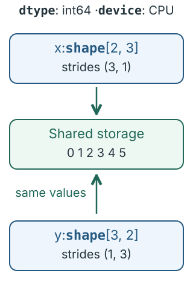

```python
import torch  # Load the PyTorch library.

x = torch.arange(6).reshape(2, 3)  # Arrange 0 through 5 into two rows of three columns.
y = x.transpose(0, 1)  # Swap rows and columns while sharing the stored values.
print(x.stride())  # Show storage steps for moving to the next row or column.
print(y.stride())  # Show the swapped storage steps after transposing.
```

Changing a value through `y` also changes the corresponding value in `x`.

Contiguous means values follow the tensor's logical order in the selected
memory layout. In the row-by-row layout used here, the transposed `y` is not
contiguous. **`contiguous`** makes a copy when needed:

```python
z = y.contiguous()  # Copy the transposed values into row-by-row storage.
print(z.stride())  # Show the storage steps for the new row-by-row layout.
```

**`reshape`** regroups values in their reading order; **`transpose`** swaps
axes. For example, `x.reshape(3, -1)` gives shape `[3, 2]`: `-1` asks PyTorch
to calculate the missing size from the six values. A reshape shares storage
when possible and copies otherwise.

**Performance connection:** creating a view avoids copying values. A copy
requires extra reads, writes and storage, so add one only when it serves the
following computation.

### Mental model

Shape describes the axes; strides map them to storage. Different views can share the same values.

## 7. Dtype changes storage and numerical behavior

### Objective

Compare tensor byte counts and explain why a smaller **`dtype`** can change values.

### How it works

A **`dtype`** specifies how each tensor element is stored. Floating-point
formats represent numbers approximately. FP32 uses four bytes per value;
FP16 (16-bit floating point) and BF16 (bfloat16) each use two.

Range is how large or small a nonzero number the format can represent.
Precision is how much detail it can retain. BF16 covers a wider range than
FP16 but keeps less detail. Equal byte counts do not mean equal number formats.

For a dense tensor, logical bytes equal element count times bytes per element.
The bars compare storage for the same six values; they do not show speed.

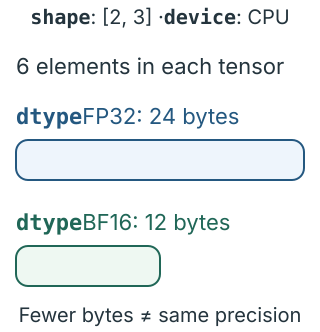

```python
import torch  # Load the PyTorch library.

x32 = torch.ones(2, 3, dtype=torch.float32)  # Create two rows of three ones in FP32.
x16 = x32.to(dtype=torch.bfloat16)  # Convert the values to BF16 in new storage.
# Count values, multiply by bytes per value, and print FP32 bytes.
print(x32.numel() * x32.element_size())
print(x16.numel() * x16.element_size())  # Calculate and print the bytes used by the BF16 values.
```

**`element_size`** returns bytes per element. **`to`** with a different dtype
converts values into new storage, which can round away detail. For example,
FP32 can distinguish `1.0001` from `1.0`; BF16 rounds both to `1.0`. Converting
back to FP32 cannot recover the lost difference.

**Performance connection:** fewer bytes can reduce storage and data movement.
Check that the changed numerical results are acceptable before measuring speed.

### Mental model

A smaller number format saves bytes but can lose detail.

## 8. Device placement selects where work happens

### Objective

Follow a tensor from CPU to GPU and identify when Python needs a completed result.

### How it works

The CPU runs Python; the GPU runs tensor calculations. CUDA is NVIDIA's GPU
computing platform. A tensor on a CUDA **`device`** uses the GPU for supported
operations. **`to`** with `"cuda"` copies a CPU tensor to the GPU and returns it.

CUDA work is usually asynchronous: Python can continue before the GPU finishes.
A kernel is a function executed on the GPU. One PyTorch operation may use one
or several kernels. The arrows show submission and result flow, not duration.

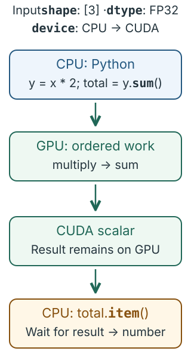

**CUDA example:**

```python
import torch  # Load the PyTorch library.

cpu_x = torch.tensor([1., 2., 3.])  # Create three values in CPU memory.
x = cpu_x.to("cuda")  # Copy the values to GPU memory and keep the returned tensor.
y = x * 2  # Double each value on the GPU.
total = y.sum()  # Add all values into one tensor on the GPU.
print(total.item())  # Wait for the GPU result, extract a Python number, and print it.
```

A stream is an ordered queue of GPU operations. In the same stream, the sum
follows the multiplication automatically. **`item`** extracts a scalar tensor's
value as a Python number, waiting for the GPU result when necessary.

Keep operands on compatible devices. Reading **`shape`** or **`dtype`** uses
metadata on the CPU; reading or printing CUDA values can require a wait.

**Performance connection:** repeated **`item`** calls can make the CPU wait
instead of submitting more work for the GPU.

### Mental model

Python submits GPU work. Getting its result on the CPU requires completion.

## 9. A model is a sequence of tensor operations

### Objective

Follow shapes through a linear layer and an activation.

### How it works

A model transforms input tensors into output tensors. An **`nn.Module`** groups
that computation and its state. Parameters are tensors the model can learn,
such as weights and biases. The forward pass is the calculation that produces
outputs from inputs.

A sample is one input example; a batch is a group of samples. A feature is one
numeric component of an input or output. Here `[2, 3, 4]` means two samples,
three positions per sample and four features per position.

An **`nn.Linear`** layer with input size 4 and output size 2 turns each group
of four features into two. Each output
feature is a weighted sum of the four inputs plus a learned bias. The last
axis changes from 4 to 2; the others stay the same. Its weights have shape
`[2, 4]` and its bias has shape `[2]`.

ReLU (rectified linear unit) replaces negative values with zero and keeps
positive values. **`nn.ReLU`** provides it as a module. **`nn.Sequential`**
passes each module's output to the next, as the arrows show.

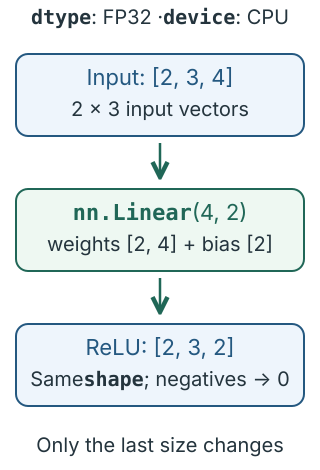

```python
import torch  # Load the PyTorch library.
from torch import nn  # Load the neural-network building blocks.

# Build a four-input, two-output linear layer followed by ReLU.
model = nn.Sequential(nn.Linear(4, 2), nn.ReLU())
x = torch.ones(2, 3, 4)  # Create two samples, each with three positions and four features.
y = model(x)  # Apply the linear layer, then ReLU, at every position.
print(y.shape)  # Show the output sizes: samples, positions and output features.
```

The same linear layer processes all six positions. Its input's last size must
be 4. The output values depend on the initially random weights and biases.

**Performance connection:** more input vectors or more features mean more
matrix work and output storage. Read these sizes to understand a model's cost.

### Mental model

Follow the operations in order. A linear layer changes the feature axis; ReLU keeps its shape.

## 10. Training saves information for a backward pass

### Objective

Explain the forward, loss, backward and parameter-update steps of training.

### How it works

Training adjusts parameters to reduce a loss: a number that measures prediction
error. A gradient tells us how a small parameter change affects that loss.
Autograd (automatic differentiation) records calculations and uses them to
compute gradients during **`backward`**.

An optimizer updates parameters using those gradients. Stochastic gradient
descent (SGD) subtracts the gradient multiplied by a learning rate, the update's
scale. The diagram follows one weight from prediction to update.

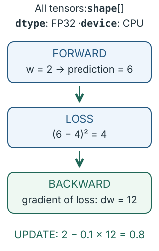

```python
import torch  # Load the PyTorch library.

w = torch.tensor(2.0, requires_grad=True)  # Create a learnable weight and track its gradient.
optimizer = torch.optim.SGD([w], lr=0.1)  # Use SGD to update the weight with learning rate 0.1.
optimizer.zero_grad()  # Clear gradients left by any previous training step.
prediction = w * 3  # Multiply the weight by the input to make a prediction.
loss = (prediction - 4) ** 2  # Square the difference between the prediction and target.
loss.backward()  # Calculate the loss gradient and store it in w.grad.
optimizer.step()  # Subtract the gradient times the learning rate from the weight.
```

Here the gradient is `2 * (6 - 4) * 3 = 12`, so the updated weight is
`2 - 0.1 * 12 = 0.8`. Clear old gradients before each step because
**`backward`** adds to any gradients already present.

Activations are intermediate values from the forward pass. Autograd saves
some of them because the backward calculation needs them.

**Performance connection:** training adds backward computation and memory for
saved activations and gradients.

### Mental model

Forward predicts; loss measures error; backward computes gradients; the optimizer updates parameters.

## 11. Evaluation mode and gradient mode are separate

### Objective

Explain why inference uses both evaluation mode and disabled gradient recording.

### How it works

Inference uses a model to produce outputs without training it. **`eval`**
selects evaluation behavior. For example, **`nn.Dropout`** randomly zeros some
values during training and rescales the rest; during evaluation it passes
values through unchanged. **`eval`** leaves gradient recording enabled.

**`torch.inference_mode`** disables gradient recording and some related
tracking. Use it when outputs will not be used in later gradient-tracked
calculations. The diagram shows these two independent controls.

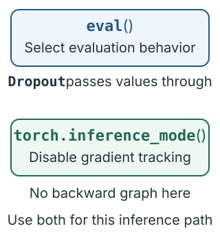

```python
import torch  # Load the PyTorch library.
from torch import nn  # Load the neural-network building blocks.

# Build a linear layer and dropout, then select evaluation behavior.
model = nn.Sequential(nn.Linear(4, 2), nn.Dropout()).eval()
x = torch.ones(3, 4)  # Create three inputs with four features each.
print(model(x).requires_grad)  # Show that evaluation mode still allows gradient recording.
with torch.inference_mode():  # Disable gradient recording for the indented calculation.
    output = model(x)  # Run the model without recording gradients.
print(output.requires_grad)  # Show that this output does not require gradients.
```

The output has shape `[3, 2]` in both calls. **`torch.no_grad`** is another
way to disable gradient recording, with fewer restrictions on using the
results in later gradient-tracked work.

**Performance connection:** disabling gradient recording avoids saving
information needed only for backward. Evaluation mode separately selects the
model's prediction behavior.

### Mental model

**`eval`** chooses model behavior. The gradient context chooses whether to record the calculation.

## 12. Transfers are part of the input pipeline

### Objective

Separate input preparation, copying to the GPU and model computation.

### How it works

An input pipeline prepares data and delivers it to a model. A batch prepared
in CPU memory must be copied to GPU memory before a CUDA model can use it.
This copy is called a host-to-device (H2D) transfer; host means CPU here.

The arrows show one batch moving through preparation, copying and computation.
The model needs the copy to finish before it can use the data.

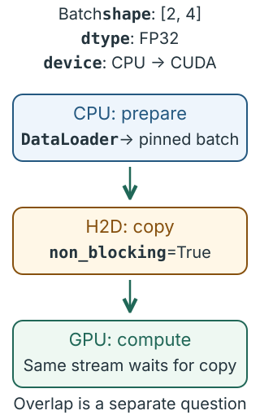

**CUDA example:**

```python
import torch  # Load the PyTorch library.
from torch import nn  # Load the neural-network building blocks.

# Create a linear layer, move its parameters to the GPU, and select evaluation.
model = nn.Linear(4, 2).to("cuda").eval()
cpu_batch = torch.ones(2, 4)  # Prepare two inputs with four features each on the CPU.
gpu_batch = cpu_batch.to("cuda")  # Copy the input batch to the GPU.
with torch.inference_mode():  # Disable gradient recording for the model call.
    output = model(gpu_batch)  # Compute two output features for each input on the GPU.
```

Keep results on the GPU while later GPU operations still need them, avoiding
unnecessary trips back to the CPU.

**Performance connection:** a model must wait for its next input. Preparing
batches, copying them and computing on them are separate costs; making one
stage faster does not automatically make the others faster.

### Mental model

Prepare the batch, move it to the right device, then compute.

## 13. Live tensors and reserved memory are different

### Objective

Distinguish memory occupied by tensors from memory reserved for reuse.

### How it works

PyTorch's caching allocator keeps GPU memory blocks for reuse. Allocated
memory is occupied by live tensors. Reserved memory includes those allocations
plus blocks the allocator can reuse later.

The outer box is the reserved pool; the inner regions show live and reusable
space. Their sizes are schematic. Other GPU allocations can exist outside
this pool.

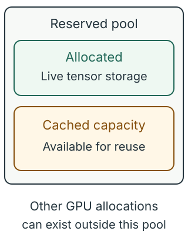

**CUDA example:** the counters depend on the device and other live tensors.

```python
import torch  # Load the PyTorch library.

x = torch.ones(1024, device="cuda")  # Create a GPU tensor containing 1,024 ones.
print(torch.cuda.memory_allocated())  # Show GPU bytes currently occupied by live tensors.
# Show GPU bytes held by the allocator, including reusable blocks.
print(torch.cuda.memory_reserved())
del x  # Remove this reference to the tensor.
torch.cuda.empty_cache()  # Return unused cached blocks so other GPU applications can use them.
```

Keeping a tensor in a variable or list keeps its storage needed.
**`torch.cuda.empty_cache`** can release unused blocks, but it cannot free
live tensors. These counters describe this process's allocator, not all
memory used on the GPU.

Out of memory (OOM) means a requested allocation could not be satisfied.
Check live inputs, outputs and saved training state before trying to clear
the cache.

**Performance connection:** retaining unnecessary tensors reduces available
capacity. Reusing cached blocks avoids repeated allocation work, so clearing
the cache every step can be counterproductive.

### Mental model

Allocated memory holds live tensors. Reserved memory also includes space kept for reuse.

## 14. Batching expresses repeated work as tensor operations

### Objective

Express independent per-row calculations as one whole-tensor operation.

### How it works

Batching groups inputs to process together. Vectorization expresses repeated
work with whole-tensor operations instead of a Python loop. The following
calculation doubles each value and adds one; every row can be processed
independently.

The diagram compares a loop over three rows with one expression for the whole
matrix. The arrows represent equivalent calculations, not measured durations.

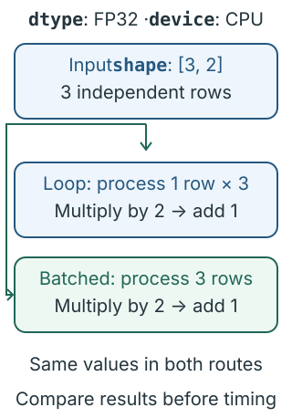

```python
import torch  # Load the PyTorch library.

# Create three independent rows with two values each.
x = torch.tensor([[1., 2.], [3., 4.], [5., 6.]])
rows = []  # Start an empty list for the row results.
for row in x:  # Visit each row separately.
    rows.append(row * 2 + 1)  # Double each value, add one, and save the row result.
batched = x * 2 + 1  # Apply the same calculation to the whole matrix.
print(batched)  # Show all row results together in one matrix.
```

Both approaches produce the same values because no row needs another row's
result. A loop whose next calculation depends on the previous result needs
different reasoning.

Throughput is work completed per unit time. Latency is time to finish one
request. A larger batch may improve throughput while using more memory or
making requests wait for other inputs to arrive.

**Performance connection:** whole-tensor operations can reduce repeated Python
submissions and give the GPU more work at once. Check equivalent results,
then measure throughput and latency for the application.

### Mental model

When inputs are independent, group them and apply the same tensor operation together.

## 15. A timer must include completion

### Objective

Read a CUDA timing interval and identify the work it includes.

### How it works

Because GPU work is asynchronous, timing a Python call can measure submission
rather than completed calculation. A CUDA event marks a position in a stream.
Two timed events measure the interval between their positions once both have
completed.

Warmup runs the operation before measuring to reduce one-time initialization
effects. The diagram places start and end markers around repeated matrix work,
then shows the CPU waiting before reading the elapsed time.

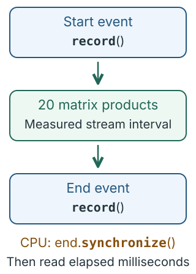

**CUDA example:** a timing pattern, with no claimed speedup.

```python
import torch  # Load the PyTorch library.

a = torch.randn(256, 256, device="cuda")  # Create a random square matrix on the GPU.
for _ in range(5):  # Repeat the warmup calculation five times.
    result = a @ a  # Multiply the matrix by itself to warm up the operation.
start = torch.cuda.Event(enable_timing=True)  # Create a GPU marker that can record the start time.
end = torch.cuda.Event(enable_timing=True)  # Create a GPU marker that can record the end time.
start.record()  # Place the start marker in the current GPU stream.
for _ in range(20):  # Repeat the calculation twenty times inside the timed interval.
    result = a @ a  # Multiply the matrix by itself.
end.record()  # Place the end marker after the repeated calculations.
end.synchronize()  # Wait until the GPU reaches the end marker.
# Divide elapsed milliseconds by the call count and print the average.
print(start.elapsed_time(end) / 20)
```

All work uses the same stream, so warmup finishes before the start marker.
The interval excludes input creation and printing. It can include GPU idle
gaps while the CPU submits work; it is not simply a sum of kernel durations.
Five warmups illustrate the sequence, not a universally sufficient count.

For total application latency, use a wall-clock interval that includes
preparation, transfers and completion. Repeat measurements with the same
shapes, dtypes and computation, and check correctness.

**Performance connection:** faster GPU calculation may have little effect on
total latency when input preparation or transfers take most of the time.
Measure the boundary that matches the application's need.

### Mental model

State what you time, and wait for that work to finish before reading the timer.

## 16. Code suggests a hypothesis; a profile supplies evidence

### Objective

Distinguish the work requested by tensor code from the execution shown by a profile.

### How it works

An operator is a PyTorch calculation, such as addition or mean. The dispatcher
selects an implementation for the tensor's device and dtype. On CUDA, that
implementation can use a GPU library or launch kernels. One Python line does
not tell you how many kernels execute.

The diagram traces these layers for a GPU input. The small worked example
below uses CPU tensors so its values are easy to inspect.

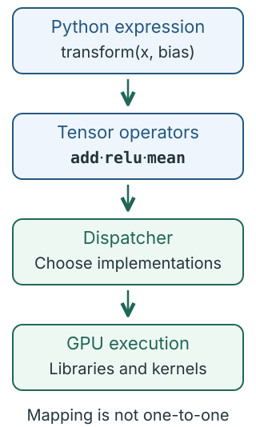

```python
import torch  # Load the PyTorch library.

def transform(x, bias):  # Define a function that transforms the input rows.
    shifted = x + bias  # Add the same column offsets to each row.
    positive = torch.relu(shifted)  # Replace negative values with zero.
    return positive.mean(dim=-1)  # Average across the last axis and return one mean per row.

# Create two input rows, including a negative value.
x = torch.tensor([[-2., 0., 2.], [1., 2., 3.]])
bias = torch.ones(3)  # Create an offset of one for each column.
print(transform(x, bias))  # Run the function and print the mean for each transformed row.
```

**`torch.relu`** applies the ReLU rule from lesson 9. Eager execution runs
operations as Python reaches them. Here addition and ReLU produce intermediate
tensors before the mean reduces each row.

A profiler records execution activity to show where time goes:

| Question | Evidence to inspect |
| --- | --- |
| Is the CPU struggling to submit work? | Gaps between GPU operations. |
| Are copies expensive? | Time spent moving data. |
| Which calculation dominates? | Operator and kernel durations. |

Measure a correct, unprofiled baseline first. Profiling adds overhead, so use
it to explain behavior, then remeasure normally. The
[tools course](../gpu-performance-tools/index.html) explains profiler commands.

**Performance connection:** use the profile to choose what to improve. A copy,
a wait and a calculation have different causes and costs.

### Mental model

Code describes requested work. A profile shows how that work actually executes.

## 17. Compilation can reduce launches and intermediate storage

### Objective

Explain possible fusion and separate compilation cost from repeated execution.

### How it works

**`torch.compile`** creates an optimized version of a function. It examines
tensor operations and their dependencies, then generates code for supported
parts of the calculation.

Fusion combines operations so they can avoid storing and rereading some
intermediate values. Lesson 16 adds a bias, applies ReLU and takes a mean.
The lower box shows a possible combined implementation of that sequence.
It does not promise that all three operations become one kernel.

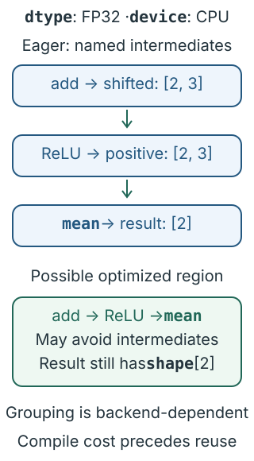

**Compiler example:** continue with `transform`, `x` and `bias` from lesson 16.
Running this optional example requires a working compiler backend: the
component that generates executable code. Inputs remain on the CPU.

```python
compiled = torch.compile(transform)  # Create a version of the function that PyTorch can compile.
expected = transform(x, bias)  # Calculate the ordinary, uncompiled result for comparison.
actual = compiled(x, bias)  # Run the compiled version; this first call may compile code.
# Check that both results agree within numerical tolerances.
torch.testing.assert_close(actual, expected)
```

**`torch.testing.assert_close`** checks values against allowed numerical
differences, called tolerances. Choose these for the application: changing
calculation order can slightly change floating-point results.

The first call can include compilation. Later compatible calls can reuse the
compiled work; new shapes can trigger compilation again. Measure startup and
repeated execution separately, using the same inputs and settings.

**Performance connection:** fusion can reduce launches and intermediate memory
traffic. Compilation also costs time, so verify the result and measure whether
repeated use pays off.

### Mental model

Compilation may change how the work runs. Check the result and include the costs that matter to your application.

## 18. Read a complete step like a performance engineer

### Objective

Trace shapes, device placement, computation and completion through an inference step.

### How it works

This example joins the earlier ideas: a linear layer changes the feature size,
ReLU keeps the shape, and a mean combines all values into one scalar. The
arrows trace the tensor shapes and the final move to a Python number.

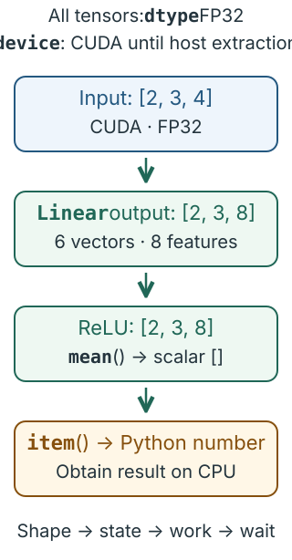

**CUDA example:** model parameters and input values are FP32 on the same GPU.

```python
import torch  # Load the PyTorch library.
from torch import nn  # Load the neural-network building blocks.

# Create a four-input, eight-output layer on the GPU in evaluation mode.
model = nn.Linear(4, 8).to("cuda").eval()
# Create two samples with three positions and four features on the GPU.
x = torch.ones(2, 3, 4, device="cuda")
with torch.inference_mode():  # Disable gradient recording for the following calculations.
    y = model(x)  # Turn the four input features at each position into eight outputs.
    z = torch.relu(y)  # Replace negative outputs with zero and keep the shape.
    score = z.mean()  # Average all output values into one scalar tensor on the GPU.
print(score.item())  # Wait for the GPU result, extract a Python number, and print it.
```

This explains the requested work. Kernel choice and the largest cost still
need execution evidence. GPU Fundamentals explains the hardware; GPU
Performance Optimization teaches how to test changes.

**Performance connection:** first locate the cost, then choose a change and
compare correct results under the same measurement conditions.

### Mental model

Read shape, state, work and completion. Then use evidence to decide what to improve.
