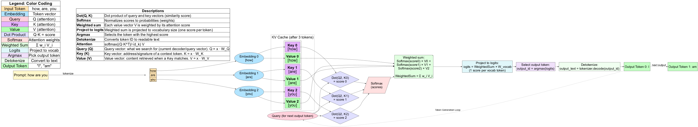

# A Practical Inference Guide and Serving LLMs with vLLM

This guide teaches the essentials of serving large language models (LLMs) with vLLM. It builds from foundational neural network concepts, through transformers and attention, to practical inference workflows, vLLM features, and operational guidance.

---

## Neural Network Foundations

### What is a Neural Network?
A neural network is a computer program made up of layers of simple units called neurons. Each layer processes information, **building up understanding step by step**. Early layers find simple features (like word patterns), while deeper layers combine these to understand more abstract ideas (like the meaning of a sentence).

All the neurons and their weights are stored as arrays of numbers in memory (RAM or GPU memory). When you load a neural network onto a GPU, you are copying all these weights and the code for the layers onto the GPU so it can do the calculations quickly.

When a model is very large, it may not fit on a single GPU. In that case, the model is split across multiple GPUs or even multiple nodes. The system divides the layers or parts of the layers between devices. Neurons on different GPUs communicate by sending their outputs (arrays of numbers) over high-speed connections like NVLink or PCIe. This is managed by the deep learning framework (like PyTorch), which handles all the details.

When you use a neural network for inference (getting answers from a trained model), the data flows through the layers in one direction, this is called a "forward pass". During training, the network learns by comparing its output to the correct answer and adjusting its internal settings (using a "backward pass"). Inference only needs the forward pass, which is much faster and uses less memory than training.

### Embeddings, Weights, and Quantization

**Embeddings:**
- When text is tokenized, each token is mapped to a numeric vector called an embedding.
- Embedding values are typically small real numbers (often between -1 and 1), initialized and learned during training.
- Only the embedding weights (the embedding matrix) are saved in the model; prompt-specific embeddings are computed fresh for each request.

**Weights:**
- Weights are the learned parameters of the neural network, stored as arrays of numbers (usually float32 or float16 by default).
- Only the weights are saved after training; no prompt-specific tokens or embeddings are stored.

**Quantization:**
- Quantization reduces the precision of weights (e.g., from float32 to INT8, INT4, or FP8), saving memory and speeding up inference.
- This allows larger models to fit on limited hardware, but may slightly reduce output quality. vLLM supports quantized weights (INT8, INT4, FP8, GPTQ, AWQ, etc.).
- Quantization is a trade-off: lower precision means more efficiency, but potentially less accuracy.

---

## Transformers

### What is a Transformer?
A Transformer is a type of neural network designed to understand and generate sequences of text, like sentences or conversations. It is especially good at handling context, meaning it can "pay attention" to all the words in your prompt, not just the most recent ones.

**Why is this powerful?**
- The Transformer can generate coherent, context-aware responses because it can relate every word in the prompt to every other word, no matter how far apart they are.
- This is what allows it to answer questions, continue stories, or hold conversations in a way that feels natural.

**Positional Encoding:**
- Since neural networks don’t naturally understand sequence order, positional encoding adds extra information so the model knows which token comes first, second, third, and so on. Positional Encoding is a mathematical technique used inside the model to give each token information about its position in the sequence (so the model knows the order of words). Examples: ALiBi, RoPE.
Different models use different methods for positional encoding, such as ALiBi (used by BLOOM) or RoPE (used by Qwen and LLaMA). The `positional encoding` method is chosen during model training and is part of the model’s architecture. But the `attention backend` is chosen at inference time and must be compatible with the model’s positional encoding. For example, some backends (like FlashAttention) only work with certain positional encodings (like RoPE), while others (like Torch SDPA) are more flexible.

---

## LLM Inference Workflow

### Step-by-Step Workflow

0. **Model and Weights Loading:** Before inference begins, the model architecture and its learned weights are loaded from disk (or remote storage) into CPU/GPU memory. This step happens once, before any prompts are processed. Basically the model should be loaded and all the layers state ready to receive the input tokens (in fact embeddings).
1. **Input Preparation:** You provide a prompt (text or chat history) to the model.
2. **Tokenization:** The model uses its tokenizer to split your text into tokens (words, subwords, or special symbols), and maps each token to a unique token ID (an integer) using the tokenizer and vocab files from the model artifacts. 
3. **Embedding Lookup:** Each token ID is used to look up a learned embedding vector from the model's `embedding matrix` that is saved as the model artifacts as well. These vectors represent the tokens in a way the neural network can process them in the neurons. 
4. **Prefill Phase:** The "Prefill Phase" is when the model processes your input tokens which are already converted to embeddings through its layers (using the already-loaded weights) to set up its internal state for generation of output tokens. If the model is using KV cache (which normally they should use), then during the Prefill phase, the model processes the prompt and fills the KV cache with key/value tensors for all input tokens.
5. **Decoding Phase:** The model generates output tokens one by one. For each step, it uses the current context to predict the next token. The current context is saved in a cache called KV cache. In the Decoding phase, the model uses the cached keys and values to efficiently generate each new output token, avoiding recomputation for the entire prompt.
6. **Sampling:** At each decoding step, the model assigns probability scores to possible next tokens. It uses sampling parameters (like `temperature`, `top_k`, `top_p`) to select one token from the most likely candidates. This controls how creative or focused the output is.
7. **Detokenization:** The output token IDs are converted back into readable text using the tokenizer's vocabulary.
8. **Output:** The final text (completion or chat reply) is returned to you.

The workflow repeats steps 5–7 until the desired number of tokens is generated or a stop condition is met.

**Key benchmarking metrics for LLM inference:**
- **Latency**: How quickly the model responds (time to first output token, time to full response)
- **Throughput**: How much work the system can handle (requests per second, tokens per second)
- **Concurrency**: Number of requests or users served at the same time
- **Memory usage**: Amount of GPU/CPU memory consumed during inference

---

## Additional Concepts

**Context Window**:
The context window is the span of tokens the model can consider at once. It includes your prompt, system instructions, chat history, and any assistant output fed back for continuity. If total tokens exceed the model’s maximum context length, the earliest tokens must be truncated or summarized. Larger context supports richer tasks (RAG, long chats) but consumes more memory and increases prefill latency.

**Vocabulary (Vocab)**:
“Vocab” is the set of tokens the tokenizer can emit. Larger vocabularies (e.g., ~150k in Qwen) can encode some languages/scripts more efficiently, potentially reducing token counts for the same text. Different tokenizers (BPE, SentencePiece, tiktoken‑derived) segment text differently; this affects token counts, latency, and cost. Always use the tokenizer intended for the model and be cautious when switching variants.

**Positional encoding**:
 Positional encoding is how a model keeps track of the order of words or tokens in your input. Since neural networks don’t naturally understand sequence order, positional encoding adds extra information so the model knows which token comes first, second, third, and so on. This helps the model make sense of sentences and conversations, not just the words themselves.

Different models use different methods for positional encoding, such as ALiBi (used by BLOOM) or RoPE (used by Qwen and LLaMA). You don’t need to set this yourself, the model is trained with a specific method, and it affects which attention backend you can use for serving.

**CUDA graphs**:
CUDA graphs are a performance optimization feature in NVIDIA GPUs. They allow you to record a sequence of GPU operations (such as neural network computations) and replay them efficiently, reducing the overhead of launching individual operations. This is especially useful for deep learning inference, where the same computation graph is executed repeatedly for different inputs. By capturing the computation as a CUDA graph, you can speed up model inference and improve throughput. CUDA graphs do not change the model's logic or attention mechanism, they simply make the execution faster and more efficient on supported hardware.

**Warmup**:
The first few requests may be slower due to model loading, memory allocation, or kernel compilation. Warmup ensures that subsequent measurements reflect steady-state (realistic) performance, not one-time initialization overhead.

---

## Example: Step-by-Step Workflow from Prompt to Answer

Let's walk through how a neural network (NN) predicts an answer, using the prompt "how are you?" and the expected answer "I am fine". We'll first explain the layers in a simple NN, then show a concrete example.

### Neural Network Layers (Simple Example)

A basic neural network has:

- **Input layer:** Receives the input data (e.g., token embeddings for each word).
- **Hidden layer(s):** Transforms the input using learned weights and activation functions. Can be one or more layers.
- **Output layer:** Produces the final prediction (e.g., the next token or word).

Suppose we have:
- 4 input neurons (for 4 input features/tokens)
- 4 hidden neurons
- 1 output neuron (for simplicity)


### Step-by-Step Simple Example

1. **Tokenization:**
  - The prompt "how are you?" is split into tokens: ["how", "are", "you", "?"]
  - Each token is mapped to a token ID (an integer) in this phase.
  
2. **Input Layer:**
  - In the Input layer (embedding layer), each token ID is used to look up its embedding vector (e.g., [0.1, 0.2, 0.3, 0.4]) from the embedding matrix.
  - The output of the Input layer is the embedding vectors for each token, these are the numeric representations ready for deeper layers. They are not activations; activations are produced by hidden layers after further processing.

3. **Hidden Layer:**
  - Each hidden neuron computes a weighted sum of all input neurons, adds a bias, and applies an activation function (like ReLU or tanh).
  - For example, Hidden Neuron 1: `h1 = activation(w1_1*0.1 + w1_2*0.2 + w1_3*0.3 + w1_4*0.4 + b1)`
  - This is done for all 4 hidden neurons, each with its own set of weights and bias.

4. **Output Layer:**
  - The output neuron takes the outputs from all hidden neurons, computes a weighted sum, adds a bias, and applies an activation function.
  - For example: `output = activation(v1*h1 + v2*h2 + v3*h3 + v4*h4 + b_out)`
  - The output is a score for the next token (e.g., the probability of "I").

5. **Prediction:**
  - The model selects the token with the highest score as the next word (e.g., "I").

6. **Repeat for Next Token:**
  - The new input is now ["how", "are", "you", "?", "I"]. The process repeats: the model encodes the new sequence, passes it through the network, and predicts the next token (e.g., "am").
  - This continues until the model outputs "fine" and then a stop token.

### Summary Table

| Step | Input Tokens                 | Input Embedding       | Output Token |
|------|------------------------------|-----------------------|--------------|
| 1    | how, are, you, ?             |[...],[...],[...],[...]| I            |
| 2    | how, are, you, ?, I          | ...                   | am           |
| 3    | how, are, you, ?, I, am      | ...                   | fine         |
| 4    | how, are, you, ?, I, am, fine| ...                   | <eos>        |

*Note: In real LLMs, the network is much deeper and more complex, and the input values are high-dimensional embeddings, not just single numbers. But the principle is the same: each layer transforms the input, and the output layer predicts the next token based on all previous tokens.*

---

### Attention Defined

Imagine reading a book and trying to answer a question about the story. Your brain doesn’t just focus on the last sentence, you recall relevant details from earlier pages, weighing which memories matter most for your answer. In AI, attention is the mechanism that lets a model do something similar, for each new word, it looks back at all previous words (context), deciding which parts are most important for the next step. This is not true memorization, but dynamic focus, like how you might remember a character’s name when needed, but not every word you’ve read.

- Attention lets a token “look back” at the prompt and prior tokens to decide what to generate next. In Transformer LLMs, self‑attention computes, for each token, weighted combinations of all earlier token representations. This enables long‑range dependencies and contextual reasoning that fixed‑window models cannot capture.
- Positional encodings: models bake this in during training and it constrains backend choice for attention:
  - ALiBi: additive linear bias by distance; used by BLOOM-176B model as an example.
  - RoPE: rotary embeddings; common in LLaMA/Qwen.
- Important: you cannot change a model’s attention mechanism at serve time; you only choose the implementation kernel (backend) compatible with it. See “Attention backends: how to choose”.

**Attention, at a glance:**
- For each token, the model decides how much to "pay attention" to every other token. This helps it understand the meaning of the whole sentence, not just each word in isolation.
- Attention lets the model dynamically focus on relevant parts of the context window (prompt, history, instructions) for each output token. It does not store or recall information like human memory, but it can “integrate” previous context by weighting and combining it at each step. The KV cache is a technical optimization that lets the model reuse these computed weights efficiently, so it can generate long outputs without reprocessing the entire prompt every time.
- The KV cache is primarily an inference-time optimization. During inference, the KV cache stores key/value tensors for previously processed tokens, so the model can generate new tokens efficiently without recomputing attention for the whole sequence.
- Attention Backend is the software implementation (kernel) used to compute the attention mechanism efficiently on your hardware during inference. Examples: Torch SDPA, FlashAttention, Triton.

### Attention backends: how to choose
You select an implementation kernel compatible with the model’s attention and your hardware:
- Torch SDPA (baseline): robust and widely compatible (with ALiBi, RoPE Positional encodings). Use when unsure or if other kernels are unstable.
- FlashAttention v2/v3: fastest on NVIDIA when supported; requires compatible head dims and positional encodings (not ALiBi). Great fit for RoPE models like Qwen.
- Triton attention: good alternative on NVIDIA for ALiBi models when you want more speed than SDPA.
- FlashInfer and other backends: specialized high-performance options depending on build. Verify support matrix for your device.

Decision guide
- If model uses ALiBi (e.g., BLOOM-176B): pick Torch SDPA or Triton; avoid FA3. Confirm in logs the kernel actually selected.
- If model uses RoPE and your build includes FlashAttention: pick flash-attn; fall back to SDPA if unsupported.
- On instability during warmup or capture: force SDPA and eager mode first; introduce faster kernels incrementally.

---

### Transformers with Attention and KV Cache

Modern LLMs use the Transformer architecture, which relies on self-attention and the KV cache for efficient, context-aware generation. The process is visualized in the diagram below:



**How it works:**

1. **KV Cache Calculation (Prefill Phase):**
  - When you send a prompt (e.g., "how are you"), the model processes all input tokens in parallel.
  - For each token, it computes Key and Value vectors and stores them in the KV cache. This cache holds the context for the entire prompt and is ready before any output tokens are generated.

2. **Token Generation (Decoding Phase):**
  - For each new output token, the following steps happen on the fly:
    - **Query:** The model computes a Query vector for the current position.
    - **Dot Product (Attention Score):** The Query is compared (dot product) with all stored Keys in the KV cache, producing attention scores.
    - **Softmax:** The scores are normalized into attention weights (probabilities).
    - **Weighted Sum:** The model computes a weighted sum of all Value vectors using these weights, blending information from the prompt and previous outputs.
    - **Project to Logits:** The result is projected onto the vocabulary space (via a linear layer), producing a logit (score) for every possible output token.
    - **Argmax or Sampling:** The model selects the next token by either picking the highest logit (argmax) or sampling from the probability distribution (for more creative outputs).
    - **Detokenization:** The selected token ID is converted back to text.
    - The new token's Key and Value are added to the KV cache, and the process repeats for the next output token.

**Key points:**
- The KV cache is calculated once for the prompt and reused for all output tokens, making generation efficient.
- Query, attention scores, softmax, and weighted sum are computed dynamically for each output token.
- Projecting to logits and selecting the next token (argmax or sampling) are the final steps before detokenization.
- See the diagram above for a step-by-step visualization of this process.

## Example: Prompting with "how are you?" (with KV Cache in action)

Suppose you prompt the model with "how are you?" and it will reply "I am fine". Here’s what the Transformer does when KV vache is used:

1. **Tokenization:** The prompt is split into tokens ("how", "are", "you", "?").
2. **Embedding:** Each token is mapped to a numeric vector (embedding). The tokenizer converts each token to a token ID (an integer). The embedding layer uses this token ID as an index to look up a row in the embedding matrix (a table of learned vectors). The result is the embedding vector for that token.
3. **Layer Processing:** The embedding vectors are then passed into the next layer(s) of the neural network (such as self-attention or a hidden layer). In these layers, the embedding vectors are multiplied by weights (and combined with biases and activation functions) to produce new representations.
4. **Self-Attention and KV Cache (Prefill Phase):**
   - The Transformer looks at all tokens in the prompt at once. For each token, it decides how much to "pay attention" to every other token.
   - As it processes the prompt ["how", "are", "you", "?"], the model computes key and value tensors for each token in the attention layers and stores them in the KV cache. This cache now holds the context for the entire prompt.
   - In a Transformer, each attention layer is a neural network layer that contains parameters (weights) and performs the self-attention operation. It is made up of multiple heads, each with its own set of weights, and processes the input embeddings using matrix multiplications and softmax.

  **Attention scores, softmax, and the KV cache:**
  - For each token, the model computes an "attention score" for every other token by taking the dot product (QxK) of their **Query** and **Key** vectors.
  - The **softmax* function turns these raw scores into normalized weights (probabilities that sum to 1), letting the model blend information from all tokens in a learnable way.
  - During inference, the KV cache stores the key and value vectors for previous tokens. This allows the model to quickly compute new attention scores and softmax weights for each new token, without recalculating everything for the whole sequence.

5. **Layer Processing:** The model passes these representations through many layers, each refining its understanding of the prompt and building up context.
6. **Decoding and KV Cache (Token Generation Loop):**
   - The model predicts the next token ("I") by considering the entire prompt and what it has learned about language. It uses the KV cache to efficiently access the context for ["how", "are", "you", "?"].
   - The new token ("I") is appended to the sequence, and its key and value tensors are added to the KV cache.
   - To predict the next token ("am"), the model only needs to process the new token ("I") and can reuse the cached keys/values for the previous tokens. This is much faster than recomputing everything.
   - This process repeats: each new token ("am", then "fine", then <eos>) is generated by looking at the cached context plus the new token, updating the KV cache at each step.

**Summary:**
- The KV cache allows the model to avoid recomputing attention for the entire sequence at every step. Instead, it only processes the new token and reuses all previous computations, making generation fast and efficient.
- If you add new input (e.g., extend the conversation), the model processes the new tokens, updates the KV cache, and continues generating efficiently.

---

## Models Architecture and Artifacts

When you download a model (e.g., from Hugging Face), you get more than weights:
- Weights (safetensors shards + index): the learned parameters during training
- Config (config.json): architecture hyperparameters and positional strategy
- Tokenizer assets: tokenizer.json, tokenizer_config.json, vocab/merges, specials
- Generation defaults (optional): generation_config.json. When you load a model with Transformers, these defaults are automatically applied unless you override them in your code. This helps ensure consistent, reproducible generation behavior across different environments and makes it easier to use the model as intended by its authors.
- Adapters (optional): Small sets of extra weights (such as LoRA or PEFT) that let you fine-tune a large model for a specific task without retraining all its parameters. LoRA (Low-Rank Adaptation) and PEFT (Parameter-Efficient Fine-Tuning) are popular techniques that add or modify a few layers or parameters, making it much cheaper and faster to adapt a model. Community adapters are pre-made fine-tuning weights shared by others for tasks like sentiment analysis, chat, or code generation. You can load these adapters on top of a base model to quickly switch its behavior for different use cases. In simple terms: Adapters are extra weights you can load into your model to change or specialize its behavior for new tasks, without retraining the whole model. For example, you can add an adapter to make a general language model better at answering medical questions or writing poetry.
- Custom code (rare): trust_remote_code. You should only enable trust_remote_code for models from sources you trust, as this code runs with full permissions and could be unsafe.

### How model artifacts get loaded into the CPU/GPU memory

When you load a model for inference, the Python framework (like Hugging Face Transformers) performs these steps:

1. Load model config (architecture and hyperparameters) into CPU/system memory.
2. Load tokenizer assets (tokenizer and vocab files) into CPU/system memory.
3. Load model parameters (weights and embedding matrix) into GPU memory.

This process ensures that the model structure, vocabulary, and embeddings are all consistent with how the model was trained, so inference works as expected.

You can run the code snippet below to view the model config (layers and neurons). This step does not require a GPU or any neural network computation, it only reads configuration data into CPU memory.

**Minimal example (Hugging Face Transformers)**:
```python
from transformers import AutoTokenizer, AutoConfig
model_id = "bigscience/bloom"
# Load model config (architecture and hyperparameters)
config = AutoConfig.from_pretrained(model_id)
print("Model config:", config)
print("Number of layers:", getattr(config, 'num_hidden_layers', 'N/A'))
print("Hidden size (neurons per layer):", getattr(config, 'hidden_size', 'N/A'))

# Load tokenizer (vocab and tokenization rules)
tokenizer = AutoTokenizer.from_pretrained(model_id)
text = "Write a short poem about the moon."
token_ids = tokenizer.encode(text, add_special_tokens=True)
print("Token IDs:", token_ids)
print("Decoded text:", tokenizer.decode(token_ids))
```

**Operational implications**:
- Token counts drive latency and cost
- Tokenizers differ across models
- Ensure tokenizer and weights are from the same model repo/revision

## Licenses: what to check
- License type: fully open source, research‑only, or restricted/commercial. Examples here: BLOOM RAIL (open with use constraints), Tongyi Qianwen license (commercial allowed with terms).
- Commercial use: verify if allowed and under what conditions; some require registration or approval for commercial deployments might be needed.
- Redistribution and derivatives: check whether you can redistribute weights, fine‑tuned variants, or quantized artifacts.
- Attribution and restrictions: some licenses include RAIL‑style acceptable‑use clauses or attribution requirements.
- Practical guidance: read the model card’s license section and linked license text; follow any registration steps if required by the provider. The simplest way is to create a License file in your root of the repository for it and link it to the source model's license file. When in doubt, consult your legal/compliance team.

### Model profiles and selection: BLOOM-176B vs Qwen-72B
Use official model cards for authoritative specs; below are practitioner notes with links.

- **BLOOM-176B (bigscience/bloom)**
  - Size and memory: 176B parameters; BF16/FP16 weights alone are ~352 GB. Expect multi-node tensor parallelism and/or quantization for serving.
  - Context and positions: trained with ~2k context and ALiBi positional bias. ALiBi impacts Attention backend choice (avoid FA3; prefer Torch SDPA or Triton). Torch SDPA tested and worked.
  - Tokenizer and prompts: HF fast tokenizer; no built-in chat template, You need to provide a chat template for chat-style prompts. A chat template has been provided in this repo in /template folder.
  - License: Ensure review it; BigScience BLOOM RAIL 1.0.
  - Read the Model Card: https://huggingface.co/bigscience/bloom

- **Qwen-72B (Qwen/Qwen-72B)**
  - Size and memory: 72B parameters. Authors note that BF16/FP16 requires with ~144 GB total GPU memory; INT4 variants can fit ≈48 GB GPU memory. So plan number of GPUs accordingly.
  - Context and positions: supports 32k context via extended RoPE; backend kernels like FlashAttention v2 is supported; SDPA is a safe fallback for the backend.
  - Tokenizer and prompts: tiktoken-derived large vocab (>150k). Some Transformers flows require trust_remote_code; ensure your runtime supports the model transformer version. Chat variants may provide templates. We don't need the chat template for this model.
  - License: Ensure review it; Tongyi Qianwen license;
  - Read the Model Card: https://huggingface.co/Qwen/Qwen-72B (newer: Qwen1.5-72B)

**Choosing between them for an inference task**
- Hardware fit: check total VRAM and interconnect; BLOOM-176B generally needs multi-node TP or heavy quantization. Qwen-72B is easier to deploy on fewer high-memory GPUs or with INT4.
- Context size needs: if you require >8k context, Qwen-72B’s 32k support is advantageous. BLOOM typically serves around 2k unless specialized. See context-defined.
- Language/compatibility: ensure tokenizer and chat templates align with your inputs; Qwen’s large vocab helps multilingual inputs; BLOOM is broadly multilingual too.
- Backend compatibility: BLOOM’s ALiBi favors Torch SDPA/Triton; Qwen with RoPE can leverage FlashAttention for best throughput.
- License and ecosystem: verify your use case aligns with each model’s license.

---

## vLLM: Core Concepts and Features

**vLLM** is a fast, open-source library for serving and running large language models (LLMs) with high efficiency and throughput. It is designed to make LLM inference easy, scalable, and cost-effective for both research and production. vLLM achieves state-of-the-art performance by using advanced memory management (PagedAttention), continuous batching, and optimized GPU kernels. It supports seamless integration with Hugging Face models, streaming outputs, and an OpenAI-compatible API server. vLLM runs on a wide range of hardware (NVIDIA, AMD, Intel, PowerPC, TPU) and supports distributed inference with tensor, pipeline, data, and expert parallelism.

**Key features**:
- PagedAttention (efficient KV cache management)
- Continuous batching of incoming requests
- Optimized attention backends (FlashAttention, FlashInfer, SDPA, Triton)
- Fast model execution with CUDA/HIP graphs
- Quantization support (GPTQ, AWQ, INT4, INT8, FP8)
- Speculative decoding and chunked/disaggregated prefill
- Prefix caching for repeated prompts
- Multi-LoRA and multimodal model support
- Streaming outputs
- OpenAI-compatible API server (completions, chat, models)
- Metrics and logging for production

**Parallelism in vLLM:**
vLLM supports several types of parallelism to scale LLM inference across multiple GPUs and nodes:
- **Tensor Parallelism (TP):** Splits the model's tensor computations (such as matrix multiplications in each layer) across multiple GPUs. Each GPU handles a slice of the computation for every layer. TP is not strictly one-to-one with GPUs, but for most users and typical LLM deployments, matching TP size to GPU count is the standard and recommended approach, but advanced setups may use more flexible mappings. TP is the most common way to scale very large models that cannot fit on a single GPU. `--tensor-parallel-size` (set to number of GPUs per node, e.g. `--tensor-parallel-size=4`).
- **Model Parallelism:** Splits different layers or blocks of the model across GPUs/nodes. Each device holds a part of the model and passes activations between devices. This is useful for extremely large models. vLLM does not natively support pipeline/model parallelism (splitting layers across GPUs/nodes) in the same way as Megatron-LM or DeepSpeed. Most vLLM deployments use tensor parallelism for scaling. `--pipeline-parallel-size <int>` (Experimental) For pipeline parallelism, but not widely used.
- **Data Parallelism:** Each GPU runs a full copy of the model and processes different batches of input data. Gradients or outputs are synchronized as needed. This is more common during training, vLLM is focused on inference, not training. Data parallelism (multiple copies of the model processing different batches) is not a primary feature, and you can run multiple vLLM servers for scaling inferenceing throughput.
- **Expert Parallelism:** Used for Mixture-of-Experts (MoE) models, where different "experts" (sub-networks) are distributed across devices. Each expert processes only the relevant part of the input, and vLLM coordinates routing and aggregation. vLLM supports Mixture-of-Experts (MoE) models, where expert parallelism is used. This is more advanced and model-specific. A Mixture-of-Experts (MoE) model contains multiple expert sub-models (networks), each specialized for certain types of input or tasks. The model dynamically routes tokens to the most relevant expert(s) for efficient and specialized processing.

Internally, vLLM manages these parallelism strategies using efficient scheduling, memory management, and communication primitives (such as NCCL for GPU-to-GPU transfers). You can configure tensor parallel size and other options to match your hardware and workload. For most LLMs, tensor parallelism is set to the number of GPUs per node, but advanced deployments may combine multiple strategies for optimal scaling.

Supported hardware: NVIDIA (CUDA), AMD (HIP/ROCm), Intel, PowerPC, TPU, and more. Choose builds/images compatible with your accelerator.

### How vLLM Works (Request Flow and API)

**High-level flow**:

- **Load tokenizer assets and weights and initialize tensor-parallel ranks (TP)**: The model and tokenizer are loaded into memory, and tensor parallelism is set up across available GPUs.
- **Start OpenAI-compatible server on the configured host/port**: vLLM launches its API server, ready to accept requests.
- **Workflow For each request**: tokenize → schedule/batch → prefill/decode → detokenize: Incoming requests are tokenized, batched/scheduled for efficient GPU usage, processed through prefill and decode phases, and then detokenized to produce output text.
- **Stream or return final text and update the KV cache for the subsequent tokens**: Results are streamed or returned, and the KV cache is updated for efficient generation of further tokens.

---
