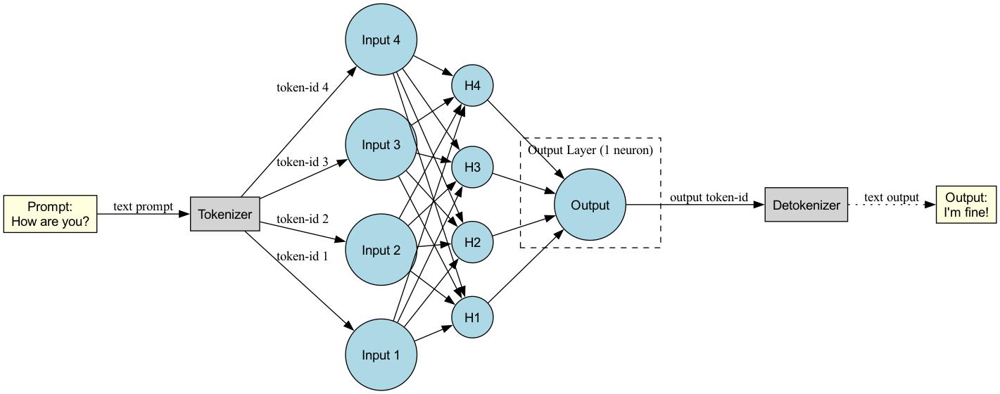

## Generate Image

### Visualizing the Simple Neural Network

Below is a diagram of the simple neural network described above, showing the flow from the input tokens ("How are you?") through the input layer (4 neurons), hidden layer (4 neurons), and output layer (1 neuron). All connections are shown.

You can generate the image using Graphviz:

```bash
dot -Tpng image/simple_nn.dot -o image/simple_nn.png
```

Then, include the image in the document as follows:

```markdown

```

Or view the DOT file directly at: `image/simple_nn.dot`
---