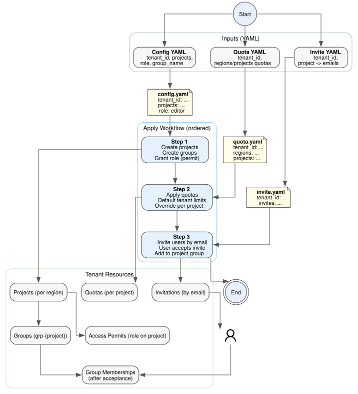

# Nebius Account Management CLI Design

> Version: 0.1.0 Designed by: Reza Bahmanzadeh, Nebius Professional Services, CX Org. Copyright 2026 Nebius B.V. Licensed under the Apache License, Version 2.0

## Table of Contents

- [Overview](#overview)
- [Goals](#goals)
- [Non-Goals](#non-goals)
- [Data Flow](#data-flow)
- [Workflow Diagram](#workflow-diagram)
- [Code Architecture](#code-architecture)
- [Invitation Handling](#invitation-handling)
- [Validation](#validation)
- [Quota Handling](#quota-handling)
- [Error Handling](#error-handling)
- [Security Considerations](#security-considerations)
- [Future API Layer](#future-api-layer)

## Overview

This project provides a stateless CLI for tenant administrators to batch-create
projects and project-scoped IAM groups, grant roles via access permits, and set
project quotas, plus invite users by email. The CLI uses the Nebius Python SDK as the backend integration
layer and applies YAML config files per tenant, with projects grouped by region
and quotas managed via a separate quota file.
The config file is versioned to allow future schema changes.

## Goals

- Stateless operation with no local customer database.
- Batch operations for project creation, group creation, and access permits.
- Quota application via JSON/YAML files.
- Email-based invitations into project groups.
- Clear separation between CLI, core logic, and Nebius SDK adapter.

## Non-Goals

- End-customer self-service UI.
- Persistent state.

## Data Flow

### Apply (YAML)

1. Load the tenant config file and resolve project lists per region.
2. For each project:
   - Ensure project exists in the target tenant and region.
   - Ensure project-level group exists (`grp-{project}`).
   - Ensure access permit for the requested role on the project.
3. Apply quotas from the optional quota file.
4. Apply invitations from the optional invite file.

#### Example (Apply YAML files)

```bash
nebius-acc apply --config-file tenant1.config.yaml \
  --quota-file tenant1-quota.config.yaml \
  --invite-file tenant1-invite.config.yaml
```

## Workflow Diagram

### Start-to-End Workflow



The diagram shows:

- Start/end of the workflow
- The three YAML inputs (config, quota, invite)
- The ordered apply phases (config → quota → invites)
- Resulting tenant resources (projects, groups, permits, quotas, invitations, memberships)

## Code Architecture

- `cli.py`: Argument parsing, input validation, and user-facing flows (`apply` for YAML).
- `core.py`: Pure orchestration logic (ensure project, group, permit, quotas).
- `nebius_sdk.py`: Thin adapter that wires Nebius SDK clients.
- `quota.py`: Quota file parsing and normalization.
- `config_loader.py`: YAML config loading and JSON-schema validation.
- `config_template.py`: Default YAML config and quota templates.
- `config_schema.json`: Config schema used by `validate`.

This separation allows a future API layer to reuse the same core logic.

### Create Projects (CLI)

1. Parse CLI flags for tenant, region, project names, role, and group template.
2. Ensure projects, groups, and access permits exist for each project.

### Set Quotas (CLI)

1. Parse CLI quota flags and resolve project names to IDs.
2. Apply quotas using the Quota Allowance API.

### Invite Users (CLI)

1. Resolve group names from `grp-{project}` (or CLI override).
2. If the user already exists, add a group membership directly.
3. If not, create an invitation and add the invited user to the group when possible.

## Invitation Handling

- Invites are provided via CLI (`--emails`) or via the `apply` command with an invite file.
- The invite file is per-tenant and maps project names to email lists.
- Invitations are idempotent: existing invites or memberships are skipped.
- A user can belong to multiple project groups; if their tenant account exists they are added directly, otherwise the invite is created and membership is added after acceptance.

## Validation

- `validate` accepts `--config-file`, `--quota-file`, and `--invite-file` in one command.

## Quota Handling

- Quotas can be defined per region or per project in the quota file.
- Quota files include `tenant_id` and are validated against the config tenant.
- The `apply` command applies quotas only from the quota file (if provided).
- When both per-region and per-project quotas are present, per-project entries override matching quota+region.
- Limits can be provided as integers or human-readable sizes (e.g. `250 TiB`).
- The CLI normalizes sizes into integer limits before calling the Nebius SDK.

## Error Handling

- Input validation failures raise `ConfigError` and exit with code 1.
- Nebius SDK request failures surface as SDK errors and halt the run.
- Idempotent operations avoid duplicate creations where possible.

## Security Considerations

- The CLI uses the tenant-admin user token via `NEBIUS_IAM_TOKEN` or the Nebius CLI profile config.
- Secrets are never written to disk or logged.
- Quota files should be kept outside the repo to avoid leaking customer details.
- The CLI attempts to resolve an IAM token at startup (environment, CLI config, or CLI token helper).

## Future API Layer

A future web UI can call the core orchestration layer directly. The core logic
is designed to be stateless and request-driven, which maps cleanly to HTTP APIs.
