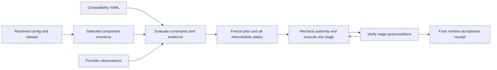

# Shared compatibility matrix design

Status: source implementation, 2026-09-16. The CLI loads the packaged
[compatibility-matrix.yaml](../compatibility-matrix.yaml). Offline verification
is separate from the historical live campaign described below; that campaign
was not admitted by this new evaluator.

## Application command admission

The two public execution gaps from the 2026-09-16 review are repaired in source.
Focused native-renderer and public-command tests cover the following boundaries;
these tests do not establish live cluster completion.

| ID | Repaired boundary | Regression evidence |
| --- | --- | --- |
| ALIGN-COMP-02 | Direct `flux apply` verifies whole-generation integrity, admits selected applications, and retains frozen inputs and captured bytes through execution. | Mutable remote artifacts, tampered evidence, changed files, and a failing second target stop before effects. Infrastructure checks are outside this application scope. |
| ALIGN-COMP-03 | Generic `upgrade helm-chart` prepares and assesses a candidate before atomic publication; dry-run uses the same path. | Operator downgrade, live Kubernetes constraint, initial-preimage conflict, and changed cluster/generation fail before effects. Retries reuse admitted artifacts; ordinary Soperator files remain protected. |

Direct apply does not initialize Terraform, hydrate outputs, or rerender. It may
read an existing cluster-ID output without initialization and uses temporary
cluster contexts. Render/deploy must resolve required application inputs first.
Admission checks the selected targets' declared rendered resources for NFS
StorageClass and MysteryBox secret bindings, including each secret key. Local
NFS charts are checked through their rendered StorageClass; explicit
`storageClass.create: false` disables that binding requirement. Missing outputs
must be resolved through deployment before direct apply.
The checks follow the upstream
[NFS StorageClass template](https://github.com/kubernetes-csi/csi-driver-nfs/blob/master/charts/latest/csi-driver-nfs/templates/storageclass.yaml)
and [ExternalSecret data fields](https://external-secrets.io/latest/api/externalsecret/),
without fetching secret payloads.
Chart upgrades resolve the complete declared nonsecret output closure in a
private candidate. The loaded manifest must match its initial publication
snapshot; initial file preimages guard publication; execution checks
the admitted generation and cluster identity. Deliberate rerenders retire old
upgrade intent; retries retain the exact intent. Success requires live release
and workload readiness after execution, independently of support evidence.

The same review repaired Helm constraint applicability: chart `kubeVersion`
is assessed against each stage's control plane, while node versions remain in
support assessment. A valid control-plane/node skew no longer fails chart
admission solely because a kubelet is older.

## Decision

Use one versioned YAML evidence registry and deterministic evaluator for cxcli.
Start with MK8s and Soperator installation and upgrade. Discover every selected
infra/app component from the resolved configuration; record uncovered
relationships explicitly. Expand coverage without adding command-specific
matrices or enumerating the Cartesian product of all versions.

`component_sources.yaml` continues to own source locations. The matrix owns
named, exact version sets for covered deployment profiles, documented
constraints, applicability, evidence, and transition rules. Covered components no longer have competing catalog version defaults for those covered components; generic
uncovered components retain their existing defaults with explicit unknown
coverage. An operation snapshot owns the exact selections and
evaluation used for that operation. Runtime receipts own observed test results.
The matrix neither supplies alternate Soperator dependencies nor replaces live
Nebius compatibility APIs.

Version sets can pin the right combinations after evidence establishes them.
The initial set records Nebius's exact GPU/Network recommendation and explicitly
leaves joint Kubernetes support unknown. A future qualified set can include the
exact tested OS, driver preset, GPU/NIC features, Kubernetes minor, and artifact
digests. Neither a label nor an exact version is evidence of compatibility.
The user-selected official Soperator release still resolves dynamically;
version sets do not become a whitelist of allowed Soperator releases.

Resolve `compatibility.targets.<target_id>.version_set` explicitly per target.
The wizard can choose one declared profile default and saves its identity in
configuration. A conflicting explicit chart version is an error, not an
override that silently changes the set. Custom exact versions require no
version-set reference and undergo the same rules; they inherit no qualification
from a named set. CPU-only targets do not acquire GPU pins. Reject ambiguous
defaults, missing required selections, and duplicate target mappings. Freeze
the resolved set ID, its pins, and their qualification evidence in the plan.
Sets assign versions to selected components; they do not enable applications.
Existing feature and ownership rules determine whether, for example, an
Ethernet-only GPU target needs Network Operator at all.

The implementation uses the existing Python, YAML, Helm, Terraform, Flux, and
Nebius SDK stack. No service, database, graph framework, solver, or AI subsystem
is needed. Complete findings are internal data used by the existing command owners.

## Command output boundary

Compatibility evaluation and evidence retention are independent of terminal
presentation. Commands omit assessment tables, routine warning/recommendation
rows, transition summaries, provider inventory and frozen provider summaries.
Progress, operational plans and selected versions/OS/GPU settings, runtime health,
recovery instructions and actionable blocking errors remain visible. Failed
constraints still prevent execution and return nonzero exits; supported-choice
guidance remains available with actual incompatibility errors.

Keep the existing in-memory reports, frozen manifests, admission reports,
transition evidence and operation receipts complete. Plain `validate` assesses
in memory and introduces no report-file writes. There is no opt-in table flag,
alternate presenter or console filter. Internal warning outcomes do not imply
terminal warnings.

## Existing YAML inventory

An exhaustive source scan, including ignored files and symlinks, finds only
`src/nebius_cxcli/soperator_wizard.yaml`. It declares that release/version
authority stays in the release resolver. It contains installation dependencies,
GPU profile defaults, and timeouts; it has no cross-version compatibility matrix.

The root `component_sources.yaml` pins chart sources/versions. The root
`component_cli_settings.yaml` holds Terraform/Flux defaults, GPU image preferences,
conditional driver values, ordering, and the RDMA device-plugin tag derived from
the Network Operator chart version. `setup.py` packages both root catalogs;
they are not duplicate checked-in YAML files under `src`.

Preserve operational defaults at their current owner. Move version defaults for
matrix-covered components into their selected version set once integration is
implemented. Preserve dependent operand derivation as an explicit relation;
never treat a derived image tag as an independently selectable version.

## Research and authority

| Source | What it establishes | Limit |
| --- | --- | --- |
| [Nebius GPU setup](https://docs.nebius.com/kubernetes/gpu/set-up) | Recommends Nebius Marketplace GPU `v25.10.0`, Network `25.7.0`; documents the host compatibility API | Does not publish the complete operator/Kubernetes/Soperator support matrix |
| [Nebius Kubernetes versions](https://docs.nebius.com/kubernetes/versions) | Current published service versions; 1.35 is recommended | The checked page does not list 1.36; a live API result is a separate scoped fact |
| [Soperator 4.1.5](https://github.com/nebius/soperator/blob/4.1.5/README.md), [4.1.8](https://github.com/nebius/soperator/blob/4.1.8/README.md) | Release-specific minimum Kubernetes 1.31 and external GPU/Network prerequisites | A minimum does not prove every later combination was tested; `main` is not release authority |
| [NVIDIA GPU 25.10](https://docs.nvidia.com/datacenter/cloud-native/gpu-operator/25.10/platform-support.html) | Kubernetes 1.35 support starts at 25.10.1 | Patch qualifiers and upstream distribution scope matter |
| [NVIDIA Network 25.7](https://docs.nvidia.com/networking/display/kubernetes2570/platform-support.html), [25.10](https://docs.nvidia.com/networking/display/kubernetes25100/platform-support.html) | Upstream Kubernetes ranges end at 1.33 and 1.34 respectively | Do not infer Nebius package equivalence from the version string |
| [Network lifecycle](https://docs.nvidia.com/networking/display/kubernetes2640/life-cycle-management.html) | Same or next published calendar-release family upgrade rule | A valid version hop can still have an incompatible intermediate Kubernetes state |
| [Helm chart metadata](https://helm.sh/docs/topics/charts/#the-kubeversion-field) | Optional `kubeVersion` constraints gate chart installation | Passing or absent constraints do not establish vendor support |
| [Kubernetes version skew](https://kubernetes.io/releases/version-skew-policy/) | Control-plane/node ordering, skew, and no skipped control-plane minors | Managed-service restrictions also apply |
| [Flux OCI digest reference](https://fluxcd.io/flux/components/source/ocirepositories/#digest-reference) | An OCI source can reference an exact digest | A version tag alone does not freeze artifact bytes |

No complete joint matrix was found in the checked public sources. Internal
read-only discovery supplied no additional current public support guarantee.
Only public evidence belongs in the repository registry.

Direct OCI pulls on the review date independently confirmed the exact package
metadata: GPU `v25.10.0` declares `kubeVersion: >= 1.16.0-0`; Network `25.7.0`
declares `>= 1.21.0`. The seed records their package and OCI manifest digests.
These declarations admit stable Kubernetes 1.35 and 1.36 at the chart-constraint
level. Independent reads also found both live Flux HelmChart artifact digests
equal to the downloaded package digests. This is source-artifact evidence,
not a retroactive immutable-operation receipt or a complete support guarantee.

The same digest-verified Network chart exposes an important version distinction:

| Identity | Inspected Nebius Network artifact |
| --- | --- |
| Chart version | `25.7.0` |
| Declared `Chart.yaml.appVersion` | `v25.7.0` |
| Chart's controller image tag | `v25.1.0` |
| Verified controller binary version or NVIDIA image equivalence | Unknown |

The installed controller matches that image reference, and the live HelmRelease
has no image override. The seed records the public image digest observed at
runtime. Keep chart application metadata, declared image tags, and verified
binary versions distinct. A mirrored image tag is not a build attestation;
neither the upstream 25.7 nor 25.1 support table can establish this package's
joint support solely from those labels. Inspect each enabled operand separately.

The selected Soperator release owns cert-manager and its other managed child
charts. Expand those from its frozen release graph. GPU and Network Operator
are external platform prerequisites; the selected Nebius Marketplace packages
must retain that distribution identity. A verified mapping may attach NVIDIA
operand constraints to exact packaged operands, with its provenance recorded.

## Model and evaluation

1. **Inventory:** use instance identity as well as catalog component ID. Two
   targets or node groups may run different versions. Keep module, chart,
   application, operand, host-driver, and jail-CUDA versions distinct. Include
   OS, architecture, GPU/NIC, RDMA mode, driver ownership, and enabled features.
2. **Evidence:** each assertion has a stable ID, source, date, exact release or
   source identity, applicability, and claim kind. The operation freezes the
   evidence used. Mutable documentation gets a captured content digest and
   review deadline during maintenance; a URL alone is not immutable evidence.
3. **Rules:** accumulate all applicable rules; no first/last-match override.
   Unknown components, missing required fields, unmapped distributions, expired
   support evidence, and contradictory applicable claims remain in internal findings.
   Disabled operands are not assessed as active dependencies.
4. **Adapters:** a closed set of typed evaluators reads frozen chart metadata,
   Terraform constraints, the official Soperator contract, and provider API
   observations. YAML contains no shell, Python, templates, imports, or hooks.
   Never fetch arbitrary evidence URLs during deployment.
5. **Three axes:** retain installation constraints (`pass/fail/unknown`),
   documented support (`documented/outside/unknown/conflict`), and runtime
   validation (`passed/failed/not-run/intervened`). Recommendation is evidence,
   not a success verdict. A tested combination is not automatically supported.
   Successfully read metadata without optional `kubeVersion` yields
   `not-declared`, leaving support unknown. Unreadable or malformed metadata,
   malformed constraints, and unsatisfied constraints are distinct blocking
   errors. Omitted optional metadata is not an unresolved hard constraint.
6. **Coverage:** profiles define required relationships, not a second inventory
   of defaults. Generic Helm and Terraform checks apply to every selected
   component; MK8s/Soperator add host, release, GPU/RDMA, storage and transition
   checks. A custom component receives explicit uncovered rows rather than a
   guessed compatibility claim. New catalog components require coverage review.

Helm versions and Kubernetes constraints must use Helm-compatible SemVer
semantics. NVIDIA release-family transitions use their explicit calendar
release order; arithmetic on `25.7` is not an upgrade policy. Distribution
matching compares canonical repository/chart identity and verified provenance,
never display names alone. Bind exact OCI and package digests independently.
The initial Network Operator edge is explicitly `25.7 -> 25.10` for NVIDIA
upstream. Unlisted family edges are unknown, and this edge does not apply to
Nebius packages without verified distribution mapping. The planner never fetches
a mutable release list to infer the next family during recovery.

## Installation and upgrade graph

Installation assesses its target and ordered prerequisites. Upgrade assesses
the source, proposed target, and every intermediate state, including mixed
node versions, old/new operator operands, CRD handling, and Soperator phases.
Endpoint compatibility alone never permits a transition. Do not automatically
substitute sources or upgrade external operators to make a graph pass.

Reuse existing deterministic MK8s/Soperator planners. The matrix validates and
explains their candidate stages. A missing transition means no proven path;
the first implementation does not search arbitrary package combinations.

## Admission and recovery

Default `standard` mode blocks failed constraints, missing required evidence,
conflicts, and explicitly out-of-support combinations. Validation mode may
acknowledge exact support gaps for an explicitly identified test plan; it cannot
bypass provider rejection, artifact integrity, unsafe ownership, or a failed or
unresolved hard installation constraint. An acknowledgement names finding IDs,
plan digest, reason, and scope; a new plan requires a new decision. It is not a
blanket `--force` or a replacement for operational authorization.

Plan and validation remain usable when execution is blocked. Reports show
which evidence or package decision would resolve the block. Read-only status
does not require complete matrix coverage. Recovery uses the admitted snapshot;
it must not re-evaluate against a newly edited matrix or catalog. Live provider
rejection and integrity failures can stop a stage, but cannot silently change
its selected versions. New policy is adopted only through a new reviewed plan.

Freeze the selected effective values, output bindings, feature flags, timeout,
dependencies, exact source artifacts, matrix digest, evaluator version, matched
evidence, and transition states in the existing immutable generation/campaign.
This must also fix current catalog-driven output-resolution drift. Freezing the
matrix alone does not freeze rendered applications. Never copy the whole global
catalog, credentials, customer identifiers, or unrelated defaults into evidence.

## Assessment of the current install/upgrade test

This is a historical manual assessment against the model, not a CLI evaluation
receipt. It does not retroactively alter the running deployment's authority.

| Check | Install: Soperator 4.1.5 / K8s 1.35 | Target: Soperator 4.1.8 / K8s 1.36 |
| --- | --- | --- |
| Soperator documented K8s minimum | Meets minimum | Meets minimum; full combination not established |
| Selected operator distribution | Nebius Marketplace | Retain distribution unless explicitly changed |
| GPU `v25.10.0` / Network `25.7.0` recommendation | Matches Nebius documentation | Same recommendation; no explicit 1.36 guarantee |
| Exact packaged `kubeVersion` | Downloaded Nebius artifacts' constraints admit 1.35 | The same declared constraints admit 1.36 |
| NVIDIA upstream support rows | Scoped reference; no unproved distribution inheritance | Same; does not establish a supported route |
| Nebius host/API admission | Product preflight passed | Fresh preflight admits 1.36 for all five groups and the selected OS/driver presets |
| Public Nebius K8s version listing | 1.35 listed | 1.36 absent from checked page |
| Product runtime evidence | Public deploy completed; 21 native acceptance executions passed; 11 Ready nodes, 16 GPUs, and desired active/passive checks restored | Public deploy completed through supported resumes; 21 fresh native executions passed; all five groups reached 1.36, with 11 Ready nodes, 16 GPUs, restored checks, and released scheduling |
| Trial integrity | Public replay from an independently verified recovered baseline; earlier recovery remains separate | Failed trials and operational recovery retained; affected transitions replayed after source repairs; no claim of a fresh uninterrupted run using the final source throughout |

The install exposed a host prerequisite failure: one worker's
preinstalled `openibd` service failed at boot while attempting to unload an
in-use `mlx5_core` module, leaving `rdma_cm` and `rdma_ucm` unloaded. The native
GPU health check drained that worker and blocked its pinned acceptance job.
Authorized recovery loaded the missing installed RDMA modules, including
`ib_ipoib`, and cleared only the attributed drain after all six native tests and
22 enabled subchecks passed. The previously blocked NCCL job then completed
successfully. This is an environment intervention; durable boot initialization
remains unproven. A later public deploy replay completed installation and
fresh native acceptance with desired check schedules and passive policy restored.
The subsequent upgrade completed its own 21 fresh native acceptance executions
and restoration through supported resumes. Independent verification confirmed
desired active/passive policy, UP partitions, no operation reservations, all five
original node groups, and all three original filesystems Ready. This is runtime
evidence, not vendor certification or proof that an operator version pair is
incompatible. Version-set selection
cannot replace per-node prerequisite and native health checks. cxcli now reports
unavailable Slurm workers before submission and during acceptance polling;
recovering the host and completing install/upgrade remain separate evidence.
Interrupted-install status also reads the identity from the exact remote
application journal, bound to the active generation and semantic plan selection,
and verifies the live Kubernetes UID. It does not depend on final local handoff
publication or restore an execution checkpoint merely to report status.

A new test must render a new generation and pass current provider and artifact
admission. The existing request to test 1.36 does not establish vendor support.
Never backfill new matrix evidence into an old operation or erase its failures.

## Alternatives and design review

| Option | Benefit | Cost or limitation |
| --- | --- | --- |
| Existing scattered checks | Least new code | No shared support evidence, coverage, or reproducible explanation |
| One table of supported complete stacks | Simple for a few tested fixtures | Combinatorial growth; hides partial coverage and transition gaps |
| Recommended rules plus scoped evidence | Shared explanations, incremental coverage, frozen recovery | Requires strict schema, provenance maintenance, and thoughtful unknown handling |

System-design review emphasizes one evidence owner, a pure evaluator, bounded
provider adapters, immutable recovery, explicit unknowns, and a small staged
rollout. Do not build a general policy language or a new orchestration engine.
Do not encode transient capacity, quotas, or regional availability as permanent
YAML support claims. Keep those live operational preflights separate.

## Implemented integration and verification boundary

- `validate` resolves target-specific version sets and retains constraints,
  documented support, and runtime validation as separate internal axes. Missing live
  evidence remains pending until deployment preflight.
- Render snapshots selected catalog entries and their dependencies, matrix and
  evaluator identity, chart bytes, metadata and effective values. Native Helm
  resolves enabled dependency conditions/tags before their `kubeVersion` checks.
  Chart `appVersion` alone never supplies a verified controller binary version.
- Deployment requires native Terraform validation, locked providers, resolved
  module/tool fingerprints and current Nebius control-plane/node-template
  admission. OS and platform must be explicit. Provider records retain each
  selected node-group tuple. GPU/Network/driver ownership checks remain mandatory.
- Ordinary OCI releases use Flux digest references. Local charts replay from
  frozen bytes, including packaged dependencies. HTTP/HTTPS Helm repositories
  use exact chart versions and a fresh download before execution. Admission
  verifies the chart name/version and compares every extracted file with the
  frozen snapshot; changed or unavailable content fails before effects. Scoped
  application execution refreshes only the selected application closure.
  HTTP remains publisher-trusted after admission: later Flux fetches are not
  continuously digest-pinned. This is a content check, not an archive checksum
  or OCI-equivalent execution binding. Prefer HTTPS; use OCI for digest-addressed
  execution. Git execution remains blocked, with no automatic source migration.
- Output hydration uses frozen catalog/output-binding instructions and chart
  inputs, reevaluates effective values, and leaves the parent generation sealed.
  Compatibility admission and transition reports are retained with operation
  evidence. Runtime results remain independent of documented vendor support.
- Soperator and generic MK8s planners assess source, operand rollout,
  control-plane hops, mixed node versions and final state. A source violation
  requires an exact `reviewed_remediations` entry identifying source/target
  versions, assertion IDs and evidence. That exception applies only to the
  existing source; every subsequent state must pass. The shipped list is empty.
- Changed/missing snapshots fail explicitly. No legacy reader, silent version
  substitution, blanket override or automatic evidence-URL fetch is provided.

Focused tests cover selection and patch boundaries, negative/stale evidence,
malformed data, native Helm dependency conditions, exact chart replay, unsafe
archive paths, OCI execution binding, mixed-version transitions, reviewed
source remediation, acceptance choice persistence, terminal restoration,
worker/job identity and graceful finishing. Package and public CLI checks cover
shipping the registry and exposing the acceptance option.

The new readiness/optional-acceptance workflow has not yet completed a separate
fresh live install/upgrade trial. Historical full acceptance above must not be
presented as live proof of these new choices or compatibility admission.
