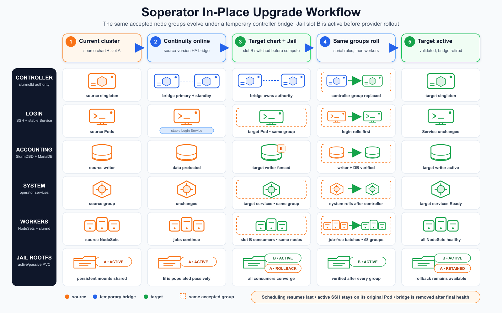
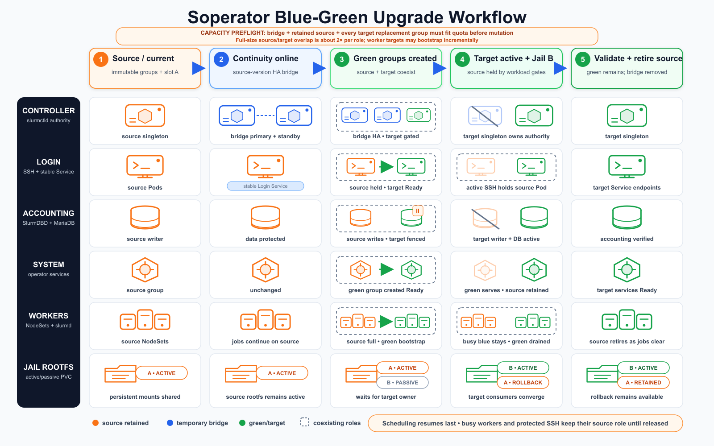
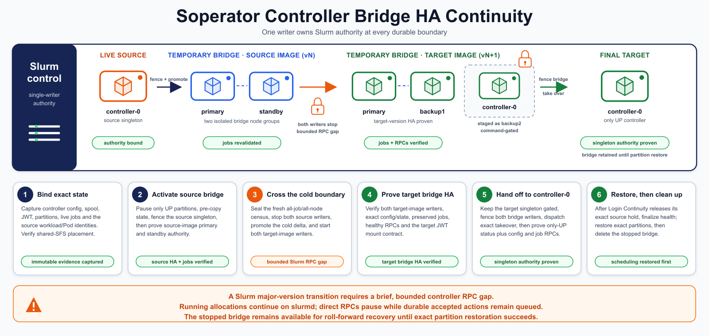
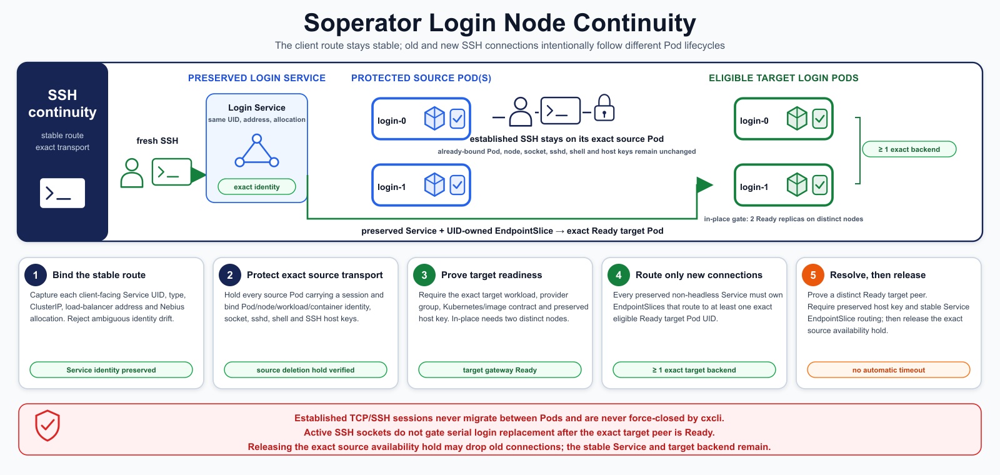
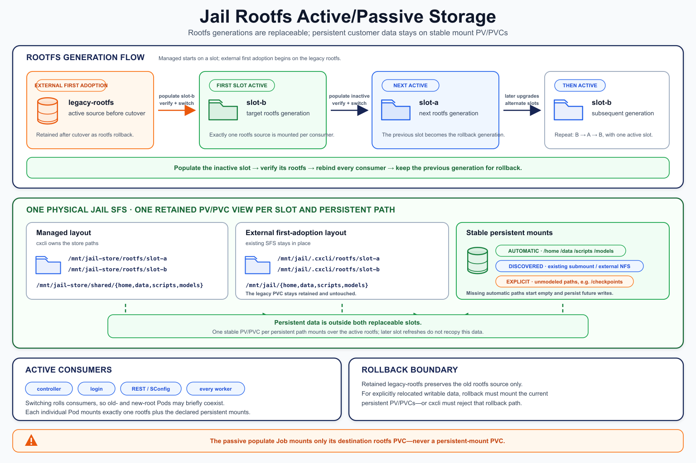

# nebius-cxcli Design

## Table of Contents

- [Goal](#goal)
- [Architecture Summary](#architecture-summary)
- [How Flux Works](#how-flux-works)
- [Why Terraform Modules And Helm Charts Are The Contracts](#why-terraform-modules-and-helm-charts-are-the-contracts)
- [Runtime Source Model](#runtime-source-model)
- [Observability](#observability)
  - [Nebius Platform Model](#nebius-platform-model)
  - [cxcli Design Principles](#cxcli-design-principles)
  - [Current cxcli Workflow](#current-cxcli-workflow)
  - [Grafana Dashboards](#grafana-dashboards)
  - [Source And Settings Catalog Contract](#source-and-settings-catalog-contract)
  - [Customer Config Contract](#customer-config-contract)
  - [Runtime Materialization](#runtime-materialization)
  - [Signal Flows](#signal-flows)
  - [Endpoints and Auth](#endpoints-and-auth)
  - [Operational Notes](#operational-notes)
  - [Onboarding Workflow](#onboarding-workflow)
- [Soperator](#soperator)
  - [Soperator Lifecycle Boundaries](#soperator-lifecycle-boundaries)
  - [Soperator Profile Model](#soperator-profile-model)
  - [Jail Upgrade](#jail-upgrade)
- [Config Model](#config-model)
- [Command Workflow](#command-workflow)
- [Generator-side Commands](#generator-side-commands)
- [Customer-side Commands](#customer-side-commands)
- [Supporting Commands](#supporting-commands)
- [Idempotency Rules](#idempotency-rules)
- [Validation Model](#validation-model)
- [Render Model](#render-model)
- [Auth and CI Bootstrap Model](#auth-and-ci-bootstrap-model)
- [Vendor Scope](#vendor-scope)
- [Runtime Versioning](#runtime-versioning)
- [Source Code Structure](#source-code-structure)

## Goal

`nebius-cxcli` provides a single, repeatable operator workflow:

1. Create one project configuration (`config.yaml`).
2. Adjust source-driven component selection in an existing `config.yaml` over time.
3. Validate generator-side configuration safety/readiness.
4. Render deterministic Terraform and Flux artifacts.
5. Commit the rendered customer artifact bundle.
6. Deploy from the generated bundle and/or bootstrap CI automation.

The design target is source-driven runtime behavior with minimal fixed component logic in core command paths.

## Architecture Summary

Core principles:

- `config.yaml` is the canonical render/reset contract.
- `generated/` is the deploy contract for customer repositories.
- Project-level workflow commands use `config.yaml` as the CLI entrypoint.
- `upgrade` is a day-2 lifecycle command group. It supports MK8s
  node-template rolling updates for Kubernetes version, OS image, and
  Nebius-image GPU stack, explicit MK8s node-group migration, and
  non-Soperator target-scoped Helm chart upgrades as separate product surfaces. In
  interactive terminals, commands that support guided mode can prompt from the
  generated managed-MK8s target set, live supported Kubernetes versions, live
  image choices, and live provider-backed node-group choices where applicable.
- Bundle-level validation can inspect any path under `generated/`; Terraform and
  Flux subcommands stay scoped to `generated/infra/` and `generated/flux/`.
- Source-driven component discovery from `component_sources.yaml`.
- Runtime introspection for module/chart fields and chart dependencies.
- Progressive-enhancement wizard model: infra inputs come from Terraform module variables and app inputs come from Helm values, and optional `wizard` metadata is reserved for explicit Nebius/chart-aware choices or other advanced integration. Complex Terraform types stay native; simple string lists prompt for comma-separated values, other complex inputs accept single-line YAML/JSON values, and product-specific flows such as MK8s `inputs.cluster.*` / `inputs.node_groups.*` or MysteryBox `inputs.secrets` can provide guided fields that still write the same native shape.
- Generic render path for Terraform modules/resources and Flux Helm releases.
- Optional plugin boundaries for provider-specific runtime option lookups and validation.

## How Flux Works

Flux is a shared control plane in the cluster. It does not install one controller
per Helm chart.

Typical shared controllers live in `flux-system`:

- `source-controller`
- `helm-controller`
- `kustomize-controller`
- `notification-controller`

The official Flux install manifest may also install:

- `image-reflector-controller`
- `image-automation-controller`

Those image controllers are shared too. They support automated image update
workflows and are not one-per-chart. The normal `HelmRelease` install path used
by local `deploy` / `flux apply` does not depend on them directly.

The usual object split in this repo is:

- source objects such as `HelmRepository` and `GitRepository` live in `flux-system`
- workload objects such as `HelmRelease` live in the target app namespace

Local direct-apply flow (`deploy` / `flux apply`):

1. Ensure the shared Flux controllers and required CRDs exist.
2. Apply the rendered manifests such as `Namespace`, `HelmRepository`, and `HelmRelease`.
3. `source-controller` resolves the chart source from the rendered source object.
4. `helm-controller` watches the `HelmRelease` and runs the Helm install/upgrade in the target namespace.
5. Flux reports status back on those rendered objects, and the CLI waits on the rendered workload path.

Important distinction:

- a pending `HelmRepository` status does not mean Flux is missing
- a `Ready` `HelmRelease` means the workload release itself is installed and reconciled
- GitOps bootstrap is separate from local apply success

What `flux bootstrap` changes:

- it does not install a different per-chart controller model
- it configures continuous Git-based reconciliation for the cluster
- the key bootstrap objects are `GitRepository/flux-system` and `Kustomization/flux-system`
- after bootstrap, the cluster can keep syncing from the watched Git repo/path

That is why local `deploy` / `flux apply` can succeed before GitOps bootstrap
exists: local apply talks to the cluster directly, while bootstrap turns on
continuous Git-driven sync.

Controller readiness vs workload readiness:

- when local `deploy` has to install Flux controllers itself, it waits for the core controller deployments and required CRDs before applying rendered workloads
- local success is primarily gated by the rendered workload resources such as `HelmRelease`
- the CLI does not require Git bootstrap objects to exist for local apply success
- the CLI also does not require image automation controllers to be part of the basic Helm release success path

Useful checks:

```bash
kubectl get helmreleases.helm.toolkit.fluxcd.io -A
kubectl get gitrepositories.source.toolkit.fluxcd.io -n flux-system
kubectl get kustomizations.kustomize.toolkit.fluxcd.io -n flux-system
```

Interpretation:

- if `helmreleases... -A` is green/`Ready`, the rendered workload releases are healthy
- if `gitrepositories...` and `kustomizations...` are missing in `flux-system`, GitOps bootstrap is not configured yet

## Why Terraform Modules And Helm Charts Are The Contracts

This architecture intentionally uses three different contract layers:

- `config.yaml` is the operator-facing orchestration contract.
- Terraform modules are the infra provisioning contract.
- Helm charts are the app provisioning contract.

The CLI does not use the Nebius SDK as the primary infrastructure reconciler because that would force `nebius-cxcli` itself to become the state engine, diff engine, destroy engine, and portability boundary. Terraform already provides those semantics well:

- desired-state planning and apply/destroy behavior
- state, locking, and drift-aware reconciliation
- reusable module interfaces built from variables and outputs
- portable generated artifacts that can run later in CI or another machine

That matters for this repo because the generator/runtime split is central to the design: the CLI renders a deterministic deployable bundle under `generated/`, then later deploy/apply/destroy commands operate on that bundle rather than reinterpreting `config.yaml` every time.

Terraform modules therefore serve as the canonical infrastructure contract for each reusable infra component. The CLI reads module variables to discover editable inputs, uses Nebius APIs only to enrich the operator experience with dynamic choices and validation, and then renders a plain Terraform root module as the deployable output.

Helm charts serve the same role for apps:

- they preserve the native application deployment contract instead of inventing a CLI-specific app schema
- they keep workload packaging cluster-agnostic
- they let Flux/Helm remain the runtime owner of app reconciliation

The Nebius SDK still has an important role, but it is intentionally narrower:

- validate tenant/project scope when creating or resolving a project scaffold
- discover dynamic provider-backed field options, using project scope for most reads and tenant scope only for tenant quota, Capacity Dashboard, or reservation inventory
- perform best-effort live quota checks and quota guard rails
- perform readiness/status polling and other runtime checks
- support auth/bootstrap and provider-specific guard rails

That split keeps the CLI generic while still taking advantage of Nebius-specific APIs where they add operator value.

The operator experience follows the same layered design:

- zero-config support for generic modules and charts through runtime introspection
- explicit metadata for Nebius-backed field choices when introspection alone is not enough
- explicit metadata only for advanced integration or ambiguous cases, via optional `wizard`

## Runtime Source Model

Primary source registries (repo root): `component_sources.yaml` and `component_cli_settings.yaml`

- `component_sources.yaml` is the source catalog for reusable Terraform modules and Helm chart components.
- `component_cli_settings.yaml` is the cxcli settings catalog linked by the same `components.<infra|apps>.<component-id>` keys. It owns managed tool versions, observability endpoint templates, Grafana bindings, and cxcli policy for component types.

Sections:

- `component_sources.yaml`
  - `shared.admin_ssh`
  - `components.infra.<component-id>`
    - `source.portable`, optional `source.local`, optional `ui`, optional `status`, optional `defaults`, optional `wizard_profile`, optional `wizard`, optional `input`
  - `components.apps.<component-id>`
    - optional `source.portable`, optional `source.local`, optional `ui`, optional `release`, optional `defaults`, optional `wizard_profile`, optional `wizard`, optional `input`
  - `source.portable.repo` can be an HTTP/S Helm repo base (must expose `index.yaml`), OCI (`oci://...`), or GitHub tree URL for a git-hosted chart
  - `source.portable.chart` remains the canonical chart basename when it differs from the app id; runtime Helm resolution must use that configured name instead of assuming `id == chart`
  - `source.local.path` is for developer-local Helm chart work and is removed
    from portable build artifacts; local renders stage charts into a temporary
    tree, rebuild local `file://` children there, and prepare temporary Helm
    repo entries for locked remote dependencies
- `component_cli_settings.yaml`
  - `cli.flux.version`
  - `cli.flux.release_timeout`
  - `cli.terraform.version`
  - `observability.endpoints.<read|write>.<endpoint-key>`
  - `components.infra.<component-id>.cli`
  - `components.apps.<component-id>.cli`

`wizard` is intentionally optional. It is not a second required schema that users must maintain when they add a module or chart. The default path is still introspection-first:

- new Terraform modules work from their variables
- new Helm charts work from their chart metadata and `values.yaml`
- optional `wizard_profile` or `wizard` only adds explicit hints when introspection alone is not enough
- when `wizard.<field>.options` is used, the supported keys are `from`, `prefix`, `depends_on`, `args`, `filter_regex`, `auto_select_single`, `auto_select_first`, and `skip_prompt_if_no_choices`; `filter_regex` is the only regex-capable selector, `prefix` and `depends_on` remain plain string/path helpers that are merged into `args` at catalog-load time, `args` carries provider-specific lookup inputs, `auto_select_single` is the opt-in “one compatible option becomes the default” behavior, `auto_select_first` materializes the first compatible option after provider-side preference ordering, and `skip_prompt_if_no_choices` lets an optional live-backed field disappear cleanly when the lookup succeeds but yields no valid choices
- provider-backed wizard options resolve through the same normalized metadata path for prompt-time choices, strict provider-value validation, singleton/first-choice auto-defaults, and planned VPC choice merging
- when `wizard.<field>.sources` is used, the supported bundled source is `source: static` with `values`; each value may be a plain string or a `{value, label}` mapping so the saved config value can stay concise while the wizard shows a richer operator-facing label
- `wizard.<field>.write_default_to_config: true` is reserved for declared wizard field specs where accepting the displayed default is a real persisted config choice instead of a virtual convenience default; the bundled MK8s profile uses it for the native MysteryBox ESO sync defaults so selecting MysteryBox with MK8s writes `deploy.targets[].secrets.mysterybox.enabled: true`, `deploy.targets[].secrets.mysterybox.allow_all_namespaces: true`, `deploy.targets[].secrets.mysterybox.refresh_interval: 15m`, and `deploy.targets[].secrets.mysterybox.sync_namespaces: [default]`
- explicit `wizard` entries can also suppress raw parent prompts with `prompt: false`; exact descendant entries remain promptable so a chart can hide broad `values` introspection while still exposing a small guided surface such as Soperator profile, partition, topology, and top-level optional-service gates
- interactive component-selection prompts emit one resolved infra/apps summary after dependency resolution finishes; target-bound apps are rendered as labels such as `soperator on mk8s`; auto-enabled app rows created during a target-scoped field wizard are selected by exact `apps:<chart-id>@<target-id>` selectors so a day-2 `component add mk8s@cluster2` does not accidentally pull existing `cluster1` app rows into the current app phase; during field input the wizard context stays compact as one Rich-colored line, `Wizard context: Current: <scope> / <component-or-target-feature>`, so long app lists are not repeated before every prompt; fields under `deploy.targets[]` use deploy-target context labels because they are not Terraform module inputs, and those deploy-target prompts are ordered after the current component's Terraform inputs so one component can finish before target customization starts; interactive `component add` treats this target-aware summary as authoritative and skips the final redundant `Added infra/apps components` lines, while non-interactive adds keep compact summaries only for categories that actually changed
- During interactive `create`, scalar-named infra targets such as MK8s are
  aligned to the entered resource name before the app wizard section starts.
  That means app prompt labels, skipped-default previews, derived
  `target_ref`, Soperator `values.clusterName`, and Soperator-created SFS
  filesystem `name`/`mount_tag` defaults all use the entered cluster target name
  instead of the initial placeholder or `client_info.client_name`.
- dependency-backed wizard fields are gated by the selected upstream component or context: for example GPU deployment testing waits for MK8s GPU, VM journald log fields wait for the VM observability context, provider-backed choices wait for their declared `depends_on` value, and native MysteryBox ESO sync waits for both MK8s and the Terraform `mysterybox` component
- the bundled MK8s profile suppresses raw parent prompts for the typed
  `inputs.cluster` and `inputs.node_groups` objects; the wizard asks for the
  cluster name, network, network-filtered subnet, Kubernetes version, endpoint
  mode, and node-group role fields directly, then persists the canonical typed
  module inputs. The node-group loop uses live provider choices for platform,
  preset, GPU image stack, OS, fabric, reservations, and boot-disk policy when
  the required tenant/project/region context is available; autoscaling is
  offered for each concrete node group and defaults to disabled, singleton
  compatible OS values are materialized without a redundant prompt, boot-disk
  defaults come from the shared compute boot-disk policy and selected shape, SSH
  defaults to enabled only as a prompt default, and `q` inside a draft group
  restarts that group instead of leaving the loop.
- Soperator `production-cluster` is a profile-backed managed-MK8s layout, not a
  retrofit path for arbitrary existing worker pools. `component add
  apps:soperator` preflights the authored MK8s row before context
  normalization and fails fast when non-empty `inputs.node_groups` lacks the
  required service-role groups (`system`, `controller`, `login`, and
  `accounting`) unless a complete explicit `apps.charts[].placements` map is
  already present. Existing clusters that need role mapping should use
  `ext-soperator onboard` or an explicit placement-bearing config path instead
  of generated production placement inference.
- the bundled VPC profile suppresses the raw `inputs.subnets` map and makes
  planned subnet collection optional. Live `project_networks` choices recommend
  `default-network` when it exists, and the `inputs.network.existing_id` skip
  row remains labeled `Create a new VPC network`; that path can attach a live
  unassigned existing private pool with at least one CIDR through
  `inputs.network.ipv4_private_pool_ids` before falling back to
  `inputs.network.ipv4_private_cidrs` for creating a new private pool.
  Direct config can also set `inputs.network.ipv4_private_source_pool_id` when
  the new managed pool must be carved from an existing source pool. Network
  CIDR prompts suggest custom private non-default `10.x` `/13` ranges such as
  `10.8.0.0/13`, `10.16.0.0/13`, `10.32.0.0/13`, `10.40.0.0/13`, and
  `10.56.0.0/13`, plus `172.16.0.0/12` and `192.168.0.0/16`, outside
  Nebius' documented regional default private-pool ranges.
  Public addressing follows the Nebius default-network pattern: direct config
  may set `inputs.network.ipv4_public_pool_ids`, but leaving it unset lets
  Nebius attach the default public pool to the new
  network. Operators can create a network with no subnets, or add planned
  subnets through guided name/private-CIDR prompts. Every declared subnet uses
  explicit private CIDRs; cxcli writes `use_network_private_pools=false`, and
  direct config uses the module's list form for multi-range subnets. Public
  pools are inherited unless `use_network_public_pools` is set to `false`.
  Explicit subnet CIDRs must fit inside the
  selected network range, including default-network ranges already attached to
  the parent, and must not overlap another subnet or live private allocation in
  the same network. When parent ranges are known, the wizard suggests child
  CIDRs from the selected parent private pools while avoiding known explicit
  subnet CIDRs and live private allocations. For a new
  Terraform-owned network, the wizard adds any out-of-parent custom subnet
  CIDR to `inputs.network.ipv4_private_cidrs` first so Terraform extends the
  parent network IP space before creating the explicit subnet child range; the
  subnet prompt includes those new-parent-block suggestions when Terraform can
  manage the network. For `inputs.network.existing_id`, cxcli suggests child
  CIDRs from the attached parent private-pool ranges. If the operator enters an
  out-of-parent custom subnet CIDR, cxcli adds that CIDR to an attached private
  pool on the selected live network first, then records the subnet with
  explicit private pools (`use_network_private_pools=false`). Terraform still
  treats the selected network as externally managed.
  When the operator selects an existing `inputs.network.existing_id`, the
  wizard skips the new-network name prompt and creates declared subnets under
  that existing network instead.
- cxcli does not expose a general SDK-backed VPC mutation command. The only
  VPC mutation in the guided flow is the bounded existing-network parent-pool
  extension described above; `infra:vpc` and Terraform state still own planned
  VPC network, private-pool, and subnet lifecycle.
- the bundled SFS profile suppresses the raw `inputs.filesystems` map in
  ordinary wizard mode and prompts the single-filesystem fields directly,
  including the optional `mount_tag` used by MK8s filesystem attachments; when
  Soperator has already materialized a multi-filesystem SFS map, the wizard
  skips the single-filesystem prompts and exposes the generated jail,
  controller-spool, and accounting entries through guided `name`, `size_gib`,
  `block_size_kib`, `mount_tag`, and `forbid_deletion` prompts. Soperator SFS
  `name` and `mount_tag` defaults use `<cluster-name>-<role>` so the visible
  Nebius filesystem identity and mount tag stay target-scoped. The shared
  SFS `type` prompt remains component-scoped and is ordered before generated
  filesystem-entry prompts, while final mapped configs omit single-filesystem
  `name`, `size_gib`, and `mount_tag` inputs. Standalone SFS
  prompts default to `name=sfs`, `size_gib=1024`, `type=NETWORK_SSD`,
  `block_size_kib=4`, and `forbid_deletion=false`.
- `status` is the canonical Nebius status-polling contract for infra components; if polling is needed, `status.kind` must be declared explicitly
- Destroy status polling is informational only: when a watched resource is no
  longer visible in the live Nebius API, cxcli reports it as already absent and
  leaves Terraform state/provider reconciliation as the source of truth for the
  actual delete.

`wizard_profile` is the built-in shorthand layer for component-specific Nebius wizard wiring. It expands to a tested `wizard` mapping at catalog-load time. When both `wizard_profile` and explicit `wizard` are set on the same component, profile fields load first and explicit `wizard` entries override or extend them. Built-in `wizard_profile` names are one-to-one with component ids, and the loader enforces that exact match when a profile is set.

Built-in component `wizard_profile` definitions are currently centralized in `src/nebius_cxcli/wizard_profiles.py`, not split into one Python file per component. That is an implementation choice, not a schema requirement.

Bundled components currently align like this:

- `mk8s`, `managed-postgresql`, `vm`, `wireguard-gw`, `ssh-jumphost`,
  `nfs`, `sfs`, `object-storage`, `mysterybox`, and `soperator` use matching
  `wizard_profile` names where they have tested guided behavior or prompt
  suppression.
- `sfs` uses its profile to hide the raw filesystem map from the ordinary
  wizard, list the provider-supported filesystem type enum
  (`NETWORK_SSD`, `NETWORK_HDD`, `WEKA`, and `VAST`), label Weka/VAST as
  advanced quota-gated filesystem types, present the standalone Terraform-backed
  defaults above, and keep Soperator-created multi-filesystem maps as direct
  config instead of prompting a conflicting single filesystem.
- `mysterybox` uses its profile to prompt the Terraform-native `inputs.secrets` list and hide the runtime-only `inputs.payload_values` helper from prompts; `inputs.secrets` remains the operator-facing backend contract. The wizard requires at least one Secret name, asks for the target Kubernetes Secret name with a Kubernetes-safe default derived from the MysteryBox name, asks for the ESO version policy with `auto-primary-version-pinning` as the default, requires at least one payload key per Secret, collects payload keys/types in a loop, normalizes entered payload keys to uppercase, and treats `q` inside that loop as local backtracking to the previous Secret/policy/key/type question before it exits the whole field. Actual secret payload values stay in runtime `TF_VAR_*_payload_values` input.
- App components can use `wizard_profile` for component-owned prompt policies
  such as Soperator. Other app charts generally stay on Helm introspection plus
  optional explicit `wizard` entries.
- The bundled `mk8s` and `vm` settings entries both declare cxcli-owned observability metadata under `components.infra.<id>.cli.observability.*`; the unified architecture, endpoint map, and customer contract are documented in [Observability](#observability).
- The bundled `nfs` infra component is a general VM-backed RWX storage provider
  for MK8s, not a Soperator-specific path. An NFS instance can bind explicitly
  to one MK8s target with `inputs.kubernetes_target_ref`; a single unscoped NFS
  instance can also back every enabled MK8s target. Once cxcli resolves an NFS
  export for a target, config normalization persists the target-scoped
  `csi-driver-nfs` app row, and create/component-add flows report that
  auto-selection to the operator. Initial render can install the driver before
  Terraform state exists;
  after Terraform apply, deploy refreshes Flux with the NFS module `server_ip`,
  `export_path`, and `mount_options` outputs so the StorageClass points at the
  actual VM export. This component is deliberately a single-VM NFS bridge, not
  an HA NFS cluster: replicated disk types improve backing disk durability, but
  they do not remove the single NFS service endpoint. Keep it for tests, demos,
  short-lived environments, or explicit NFS compatibility cases; use direct
  SFS for production or long-lived MK8s RWX storage.

Bundled MK8s GPU policy is split deliberately between component source data, cxcli settings data, and code-owned semantics:

- `component_sources.yaml` owns chart source selection, release metadata, and unconditional Helm defaults.
- `component_cli_settings.yaml` owns activation rules, role ids, validation images, timeouts, thresholds, and conditional overlays.
- The CLI owns only the rule evaluation. The bundled catalog expresses the current policy as:
  - always require the gpu-operator role
  - require the network-operator role only for MK8s contexts that are both cluster-capable in live Nebius preset metadata and explicitly configured onto the GPU-cluster / InfiniBand path with `inputs.gpu_clusters`
  - also require the network-operator role for operator-managed B200/B200A stacks that still need RDMA plumbing
  - apply Helm overlays from catalog rules matched on `gpu_stack_source`, GPU-cluster state, platform, and preset
- That split keeps chart metadata and conditional overlays out of Python while still letting the command path choose the correct role set from live MK8s shape decisions.
- Unconditional Helm defaults also carry conservative HA replica settings for platform charts that expose documented safe multi-replica knobs. Grafana's Envoy data plane, Envoy Gateway, cert-manager controller/webhook/cainjector, and External Secrets controller/webhook/cert-controller default to two replicas when the upstream chart default is one; External Secrets also enables leader election. Grafana itself stays on the upstream one-replica default because the bundled chart path uses per-pod SQLite/emptyDir storage; runtime validation rejects `grafana.values.replicas > 1` unless the chart values configure a shared MySQL or Postgres database. DaemonSets, validation jobs, n8n's enterprise-only multi-main path, and charts without a chart-native safe replica knob remain on upstream defaults instead of being forced active-active by cxcli.
- Soperator cert-manager `Certificate` manifests set `spec.privateKey.rotationPolicy` explicitly to `Always`. Local and portable source-backed Soperator outputs both use the static post-Flux manifest path, so the normalized Certificate manifests are applied directly.
- RDMA/GPUDirect detection is intentionally two-stage. The live Nebius project platform/preset inventory is the source of truth for whether the exact selected GPU shape is cluster-capable at all via `allow_gpu_clustering`; cxcli does not hardcode a preset list. The deployment only enters the GPU-cluster / InfiniBand path once `inputs.gpu_clusters` is actually set. The plain MK8s wizard materializes the fabric from the selected live Capacity Dashboard row for cluster-capable shapes so the common multi-GPU path proceeds without a raw fabric or GPU-cluster toggle prompt; direct config can still omit `inputs.gpu_clusters` to stay on the Ethernet-only render/install/validation path.
- MK8s resource-name preflight still checks every `inputs.gpu_clusters` entry referenced by a GPU node group's `gpu_cluster_key`, even when `infiniband_fabric` is still empty. The fabric value controls the RDMA/operator path; the referenced live GPU-cluster name is a separate collision risk. Generated-bundle validation, deploy preflight, and direct `terraform apply` also check Nebius-image GPU node groups against the live MK8s compatibility matrix so unsupported `platform` + `os` + `gpu_stack_preset` tuples fail before Terraform apply.
- `inputs.gpu_clusters.<key>.infiniband_fabric` is the only persisted MK8s GPU fabric source of truth. `inputs.node_group_defaults.gpu.infiniband_fabric` is intentionally rejected instead of translated. Because Nebius does not change the GPU cluster of an existing node group in place, render blocks source-config fabric drift against an existing generated manifest and deploy/direct `terraform apply` block fabric drift against Terraform state. `terraform plan` can still preview the diff, but prints the matching `upgrade node-group ... --dry-run` command. The explicit `upgrade node-group` command owns approved platform, preset, CPU/GPU kind, GPU-cluster, and fabric migration planning; current execute writes the approved checkpoint and stops before live replacement/cutover/retirement until that executor is enabled.
- The operator app entries keep only Nebius-specific deltas in top-level `defaults`; values that already match the live GPU Operator or Network Operator chart defaults are intentionally left to the charts rather than restated in the catalog.
- On the actual GPU-cluster / InfiniBand path, the bundled catalog now owns the explicit pod-facing RDMA overlay instead of relying on the Network Operator chart default CR. For `gpu_stack_source: nebius_image`, GPU Operator still disables host GPU-driver and NVIDIA Container Toolkit management. If Network Operator is part of the target, GPU Operator disables its own NFD so Network Operator can own that stack end to end; if Network Operator is not part of the target, GPU Operator pins its NFD worker to Nebius GPU nodes. Network Operator NFD and NodeFeatureRules are explicitly enabled because the chart defaults them off. On driverful InfiniBand targets, Network Operator scopes its NFD worker to Nebius driverful nodes, uses the standard Mellanox PCI feature label for the rendered `NicClusterPolicy`, and adds a Helm post-render patch so driverful InfiniBand nodes advertise `rdma/shared_device` without deploying the OFED driver container. The same patch sets `periodicUpdateInterval: 0` for the RDMA shared-device plugin so static KVM passthrough nodes do startup discovery and pod-facing device advertisement without noisy periodic full PCI rescans. For `gpu_stack_source: operator_managed`, the bundled catalog keeps OFED enabled and now adds the same explicit `rdma/shared_device` patch so operator-managed InfiniBand nodes satisfy the same scheduler-visible RDMA contract.
- Deploy-time GPU checks are not modeled as persistent app releases. They are rendered into the generated manifest as validation specs and executed by local `deploy` after Terraform has created or refreshed MK8s and kube access is available. For Soperator targets with nonzero GPU workers, `deploy` applies the platform GPU Flux resources first, runs the MK8s GPU deployment tests before the full Soperator Flux handoff, and then applies the Soperator app resources.
- The default fast all-node validation is MK8s node inventory smoke, implemented as one read-only Kubernetes node inventory query across every node before workload validation starts. Render materializes `nebius.com/node-group` on each MK8s node group so the Kubernetes-only inventory can match live nodes back to configured node-group names without a provider lookup. The JSON detail report keeps per-node-group summaries and grouped node details, while preserving the flat node list sorted by node group and node name for compatibility. The default fast workload validation is the deployment-testing `gpu_visibility` probe, implemented as a bounded sampled CUDA probe on Ready GPU nodes rather than an unbounded every-node fan-out. The catalog controls `max_nodes`, timeout, and cleanup behavior; when the wizard enables the check, it materializes the default `max_nodes` cap so the persisted target config always carries an explicit bound. The saved report also includes the selected nodes' device-plugin allocatable snapshot so operators can compare scheduler-visible resources such as `nvidia.com/gpu` or RDMA-style keys with the stronger workload-level CUDA result, but those allocatable keys remain informational rather than the pass/fail gate.
- NCCL is a separate acceptance benchmark, not deploy smoke and not a persisted `config.yaml` setting. It is selected through `nebius-cxcli acceptance-test benchmark --suite ...` and follows the public `NVIDIA/nccl-tests` + Kubeflow Training Operator path. The benchmark command is suite-driven so additional benchmark types can share the same command surface; omitted `--suite` fails fast instead of defaulting to the K8s NCCL suite. With `--suite k8s-nccl` selected, omitting `--target` runs across all generated targets, omitting `--max-nodes` uses all schedulable GPU nodes, omitting `--timeout` leaves no cxcli benchmark timeout, and the RDMA average bus-bandwidth threshold defaults to 300 Gbps. Slurm NCCL is selected with `--suite slurm-nccl`. Slurm NCCL prefers 8-GPU Slurm nodes when available, but it does not require them: multiple idle one-GPU Slurm nodes run a multi-node NCCL benchmark capped at a 2G message size, while one total GPU runs as a launch/smoke check with no collective-bandwidth threshold. For 1-GPU K8s or Slurm NCCL runs that complete and report average bandwidth, below-threshold bandwidth is recorded as an informational report comment instead of failing the benchmark. The workload manifest is rendered from the first-party transient `helm-charts/nccl-test` chart, `component_sources.yaml` carries both the developer-local chart path and the portable OCI source pinned to `oci://cr.<region>.nebius.cloud/<registry-short-id>/charts/nccl-test --version 0.2.8`, and chart defaults come from the chart `values.yaml` plus `component_cli_settings.yaml` at `components.infra.mk8s.cli.gpu.benchmarks.nccl`. Operators override benchmark node count, timeout, and RDMA bandwidth threshold per run with `--max-nodes`, `--timeout`, and `--average-bus-bandwidth-threshold-gbps`. The Training Operator remains a transient prerequisite pinned in the catalog's NCCL benchmark settings rather than a persistent app release, so `acceptance-test benchmark` can install/remove it around the `MPIJob` run. Saved NCCL benchmark reports record `NCCL_DMABUF_ENABLE`, whether it came from rendered MPI args or was left unset, the derived GPUDirect mode, measured average bus-bandwidth values for multi-rank runs, when a single-rank smoke run has no collective bandwidth to report, and any 1-GPU threshold comment.
- The bundled NVIDIA path intentionally does not ship a generic built-in "health checker" workload. NVIDIA's own docs separate fast install verification and sample workload validation from ongoing DCGM-based telemetry and deeper DCGM diagnostics. In cxcli, that means deploy-time checks stay focused on operator readiness, read-only all-node node inventory, and bounded GPU visibility, while NCCL/performance checks move to explicit acceptance benchmarks. Long-running telemetry/alerting remains the responsibility of DCGM Exporter / Prometheus / Grafana and deeper diagnostics remain explicit administrator workflows rather than something every `deploy` reruns. See: [About the NVIDIA GPU Operator](https://docs.nvidia.com/datacenter/cloud-native/gpu-operator/24.9/index.html), [GPU Operator Getting Started](https://docs.nvidia.com/datacenter/cloud-native/gpu-operator/23.9.0/getting-started.html), [NVIDIA GPU Telemetry](https://docs.nvidia.com/datacenter/cloud-native/gpu-telemetry/latest/index.html), [DCGM Diagnostics](https://docs.nvidia.com/datacenter/dcgm/latest/user-guide/dcgm-diagnostics.html), and [NVIDIA Network Operator readiness](https://docs.nvidia.com/networking/display/kubernetes2610/life-cycle-management.html).
- That split still assumes DCGM Exporter itself stays enabled on the GPU Operator release. For GPU-enabled MK8s, DCGM Exporter must stay enabled in GPU Operator. Omitting `nvidia-gpu-operator.values.dcgmExporter.enabled` is valid because the bundled GPU Operator chart defaults it to enabled; explicitly setting it to `false` is rejected. Scraping and pushing those metrics to Nebius Monitoring happens only when the MK8s observability metrics path is enabled. Prometheus scrape wiring remains a chart-level concern under `values.dcgmExporter.serviceMonitor.*`, not a built-in `deploy` validation toggle, and should only be enabled when the target cluster has a Prometheus-operator-compatible observability stack. For the Nebius Observability Agent path, the settings catalog declares the DCGM exporter as an app metric target with `discovery.kind: prometheus_annotations`, so the agent discovers the GPU Operator service through its documented `prometheus.io/scrape=true` service endpoint path instead of through a duplicate `config.metrics.additionalTargets` scrape job. Live testing on the Nebius driverful-image path (`gpu_stack_source: nebius_image`) showed an important nuance: NVIDIA's `dcgmExporter.enabled=true` keeps the source configured in `ClusterPolicy`, but the chart's default NFD worker affinity can leave Nebius driverful GPU nodes without the NFD-owned `nvidia.com/gpu.present=true` label, and those same nodes can carry `nvidia.com/gpu.deploy.operands=false`. The bundled GPU Operator rule therefore pins NFD workers to Nebius GPU nodes only on `nebius_image` targets where Network Operator is not present; GPU-cluster / InfiniBand targets keep Network Operator as the single NFD owner. The DCGM metric target's `managed_gpu_node_policy.{labels,selector,stack_sources}` owns only the Nebius-specific operand labels. Those operand labels are Nebius-specific scheduling policy, not an NVIDIA chart default. When observability and Kubernetes metrics are enabled, cxcli materializes that policy into `inputs.node_groups[*].node_labels`, enabling only the DCGM exporter and validator operands while explicitly keeping GPU Operator device-plugin/GFD disabled so the Nebius-managed device-plugin path is not duplicated. During `deploy`, cxcli also reconciles the same settings-owned operand labels onto existing live GPU Node objects matching the catalog-owned selector because MK8s node-group label updates may not back-propagate to already-running nodes.
- Observability architecture, endpoint guidance, project config shape, and onboarding workflow are documented in [Observability](#observability).
- The deploy-time MK8s deployment tests are intentionally layered to avoid semantic overlap. `cluster_smoke` is the required read-only all-node Kubernetes inventory gate generated for every MK8s target; it reports node readiness, CPU/GPU totals, node groups, known GPU node-group presence, and known minimum expected Ready GPU node counts without scheduling pods and writes `cluster-inventory-report-<target>.json`. For GPU-backed targets, `operator_readiness` is the prerequisite GPU stack gate: policy objects plus scheduler-visible GPUs on Ready nodes and writes `deploy-gpu-stack-readiness-report-<target>.json`. `gpu_visibility` is the bounded data-path probe that proves a real CUDA workload can execute during deploy and writes `deploy-gpu-visibility-report-<target>.json`. NCCL is no longer deploy smoke; it is selected through `acceptance-test benchmark` and writes `acceptance-benchmark-report-<target>.json`. For cxcli-managed Soperator targets with fixed or nonzero-minimum GPU workers, local `deploy` stages app reconciliation by applying the platform/GPU operator Flux resources first, running the required MK8s node inventory smoke plus GPU stack and GPU visibility while the GPUs are still scheduler-free, then applying the full Soperator bundle and writing `deploy-smoke-report-<target>.json`. If a managed Soperator GPU worker group autoscaling range starts from zero (`min_node_count: 0`, `max_node_count > 0`), cxcli applies the full Soperator bundle first, requests the Soperator power-state bootstrap for ephemeral GPU workers, runs the required Soperator deployment snapshot, and then runs the MK8s inventory/readiness/GPU visibility validations against any resumed GPU nodes. Workload validations still use scheduler-free GPUs and record a skipped report rather than failing when existing workloads or already-running Soperator workers reserve every GPU on every Ready GPU node. For Soperator targets, the required deploy report is a fast Kubernetes snapshot after bounded first-run storage/pod startup: it checks the `soperator-manager` Deployment, jail storage objects, Pending Soperator pods/events, failed or crash-looping Soperator pods, target `SlurmCluster`, and `NodeSet` resources without waiting for full Slurm availability. If a `populate-jail` Job pod stays active after the same-node `jail-mount` pod can see the jail `.populated` sentinel, cxcli deletes only that stuck Job pod and waits for the Job to complete before taking the final snapshot. GPU worker NodeSets must include the chart-owned `nvidia-driver-root` mount and `cxcli-gpu-driver-jail` init guard when the chart version owns that static driver-jail contract, so deploy/onboard/upgrade skip the static check for known pre-contract charts and fail fast when a contract-owning rendered or live GPU NodeSet lacks it. Deploy does not start Slurm jobs. Exhaustive all-node Slurm hostname/GPU checks run later through `acceptance-test smoke --suite slurm` and write `acceptance-smoke-report-<target>.json`; for GPU workers that acceptance smoke also verifies that Slurm jobs see non-empty `libcuda.so.1`, `libnvidia-ml.so.1`, and `nvidia-smi` from the job root. `acceptance-test benchmark --suite slurm-nccl` runs the same GPU driver-jail runtime preflight before launching NCCL. Acceptance smoke and benchmark commands require `--suite`; after a suite is selected, they run all generated targets when `--target` is omitted. They resolve target handoff from `generated/reports/deploy-report.md`, an explicit or unambiguous local kubeconfig context, or a known cluster ID; they do not read Terraform state or initialize the Terraform backend. If that handoff is missing, run `deploy` or `flux apply` for the target first. Test and inventory JSON detail reports carry `test_purpose`, `mode`, `scope`, `kind`, and `target_ref` metadata so report purpose is visible from both the filename and content. Acceptance-test terminal output prints a concise `PASSED`, `FAILED`, or `SKIPPED` result line for each generated report, including the suite scope, target, and most relevant summary or skip reason; color-capable terminals render `PASSED` green, `FAILED` red, `SKIPPED` yellow, and unknown report parsing status cyan. Report paths, suite names, and target names use bold accent colors, while the default-color labels, summaries, skip reasons, and elapsed times stay unbolded for readability. The `nebius-cxcli-soperator-cluster-validation/v2` JSON report is intentionally line-oriented for high-cardinality clusters: command `stdout`/`stderr` are arrays of lines, and acceptance hostname, GPU driver-jail, and GPU allocation sub-checks write structured `partition_hostnames`, `gpu_driver_jail`, and `gpu_allocations` arrays with all-node evidence, including the evidence source for each GPU allocation node.
- Acceptance-test smoke and benchmark reports also persist elapsed duration as `elapsed_seconds` and `elapsed_time`, and terminal result lines display the formatted `elapsed_time` value in `hh:mm:ss`.
- Soperator targets use the same cxcli-owned optional MK8s deployment-testing prompts as
  other GPU-enabled MK8s targets: `operator_readiness` and `gpu_visibility`
  are prompted in the create/component wizard and persisted under
  `deploy.targets[].deployment_testing.mk8s_gpu.*`. The required MK8s node inventory
  smoke is generated into the deploy manifest for every MK8s target instead of
  being persisted as a config toggle. The Soperator ActiveChecks child
  chart remains opt-in for Slurm-level benchmark/diagnostic clusters or
  maintenance windows, and `nccl-test` declares `usage.lifecycle: transient`
  rather than behaving as a selectable app. If Soperator NCCL ActiveChecks and
  the cxcli K8s NCCL benchmark are both runnable for the same target, cxcli warns
  because
  the Slurm NCCL workload and Kubernetes `MPIJob` can compete for GPUs and RDMA
  bandwidth, skew results, or skip/fail after Soperator workers
  reserve the GPUs.
- Enabled Soperator targets also get a required `soperator_cluster_smoke`
  validation that is separate from ActiveChecks and the Kubernetes NCCL
  validation. Deploy-time Soperator validation is a fast Kubernetes snapshot
  after bounded first-run storage/pod startup: it reads the
  `soperator-manager` Deployment, jail storage objects, Pending Soperator
  pods/events, target `SlurmCluster`, and worker `NodeSet` resources through
  the public Soperator CRDs. It does not wait for full Slurm availability,
  does not run Slurm CLI checks, and does not start `srun` jobs. Exhaustive
  functional Slurm checks run later through `acceptance-test smoke`, where
  Slurm nodes reported as `inval` remain an unhealthy validation gate.
  NCCL/performance work runs only through explicit `acceptance-test benchmark`
  suites.
  The goal is a quick post-install/post-upgrade proof that Soperator
  reconciliation, Slurm login access, worker visibility, queue access, and a
  minimal Slurm job path are all functioning before the run is reported
  healthy.
- The first gate is intentionally broader than its config-key name suggests. In operator-facing output and the combined deploy report, cxcli labels it `GPU stack readiness` because the runtime check covers GPU Operator and, when required by the selected MK8s shape, Network Operator plus `NicClusterPolicy`.
- `GPU stack readiness` is cluster-wide for Ready GPU nodes rather than sampled: it inspects every Ready node with allocatable GPUs, but it stays cheap because it reads operator policy/state and scheduler-visible resources only. It is therefore a control-plane/data-plane signal, not proof that every node can actually run a CUDA workload.
- Validation cleanup is split deliberately: keep dedicated namespaces for isolation and repeatability, but delete transient validation workloads after each run. For the bounded GPU visibility probe, which runs the CUDA sample workload, that means applying the `gpu-validation` namespace first, creating a reusable `cuda-smoke-validation` ServiceAccount with token automount disabled, and deleting the sampled pods after the run while retaining the namespace and ServiceAccount. For NCCL acceptance benchmarks that means deleting the transient `MPIJob` and, if cxcli had to install Kubeflow Training Operator only for that run, deleting that transient prerequisite again while retaining the validation namespace.
- Validation failures that occur before a normal detail report is complete still write a failure JSON artifact with the captured error, so the combined deploy summary reports `FAIL` for that validation instead of treating it as `NOT RUN`.
- On `gpu_stack_source: nebius_image`, Network Operator remains auto-enabled only when the selected MK8s platform/preset is cluster-capable in the live Nebius inventory and the config actually sets `inputs.gpu_clusters`. The plain MK8s wizard materializes `inputs.gpu_clusters` from the selected live cluster-capable Capacity Dashboard row, while direct config can still omit it to stay Ethernet-only. That matches Nebius guidance that Network Operator is optional in the other driverful cases. Operators can still enable it manually there, and cxcli keeps `operator.ofedDriver.deploy=false` on the driverful path so optional installs stay chart-managed rather than re-laying host OFED.
- The NCCL threshold uses NCCL's own `average bus bandwidth` metric rather than a raw link-rate threshold. For single-node runs that measures the effective GPU-to-GPU communication path inside the node. For multi-node runs it measures the normalized collective-communication bandwidth across the full topology, including intra-node GPU links and the inter-node network, so it is useful for comparing NCCL health against hardware capability but it is not a direct translation of switch-port line rate.
- Bundled Compute boot-disk defaults now split cleanly between settings-owned policy and code-owned evaluation. `component_cli_settings.yaml` owns shared `compute.boot_disk_defaults` disk-type choices plus ordered CPU/GPU `rules` keyed by resolved preset resources such as vCPU, RAM, and GPU count, while the CLI materializes explicit boot-disk size/type values for MK8s node-group defaults and any source-backed infra module that exposes the VM-style `platform`, `preset`, `boot_disk_size_gib`, and `boot_disk_type` inputs during `create`, `component add`, and runtime config loading. MK8s GPU-scoped boot-disk defaults are pruned when no GPU node group is present, so CPU-only configs do not retain stale GPU storage choices. VM-style components skip materialization when `inputs.boot_disk_existing_id` is set. Live provider preset metadata is preferred when available and preset-name parsing is the fallback. The first matching shared rule becomes the cxcli-owned explicit default for that shape; shapes that do not match a rule fail fast so maintainers update `compute.boot_disk_defaults` instead of relying on a hidden sizing fallback. High-performance SSD types round to the allocation units declared in the shared disk-type settings; regular `NETWORK_SSD` sizes remain exact GiB values so `93 GiB` and `1023 GiB` catalog defaults stay stable instead of being inflated to synthetic 32 GiB buckets. Explicit node-group `boot_disk` values or VM-style first-class inputs remain authoritative. VM-style boot-disk security prompts are tied to the same settings-owned disk type metadata: deletion protection is offered for created boot disks with default `false`, while explicit managed encryption is offered with default `false` only for disk types that declare support.

When `wizard.<field>.options` is present, it acts as wiring between an existing Terraform input, Helm value path, or typed wizard helper and a guided option provider. The field itself still belongs to the module/chart/wizard contract; the catalog metadata only tells the CLI how to fetch valid choices for that field. Declared wizard-only helper fields can also carry `default`, which behaves like a virtual prompt default: the operator sees and can change the value in wizard mode, but unchanged defaults are not written back into `config.yaml`. For Nebius-backed flows, that means the operator-facing destination remains something like concrete plain-MK8s `inputs.node_groups.system.platform` or a profile helper such as `inputs.node_group_defaults.cpu.platform`, while `from: mk8s_compatible_platforms`, `from: mk8s_gpu_capacity_choices`, `from: compute_platform_presets`, `from: mk8s_gpu_stack_presets`, `from: mk8s_node_group_os_values`, `from: compute_boot_disk_types`, `from: capacity_block_groups`, or `from: mk8s_control_plane_versions` tells the CLI which Nebius API-backed or Nebius-contract-backed lookup to execute. For MK8s platform fields, the provider now treats the MK8s compatibility matrix as the authoritative support filter and, when a project id is available, intersects that set with the selected project's live compute-platform inventory so the wizard only offers currently available CPU/GPU platforms. Plain MK8s-only create materializes concrete `inputs.node_groups.*` fields and prunes inactive `inputs.node_group_defaults.*`; profile-backed MK8s flows such as Soperator `production-cluster` can use `inputs.node_group_defaults.*` to seed real node groups and GPU-cluster entries. Profile-backed GPU flows materialize GPU image fields such as `inputs.node_group_defaults.gpu.gpu_stack_preset` and `inputs.node_group_defaults.gpu.os` only for the matching enabled node-group scope, while `inputs.node_group_defaults.gpu.gpu_stack_source` is a GPU-enabled guided fixed choice between `nebius_image` and `operator_managed` that controls whether the module renders Nebius-managed `gpu_settings.drivers_preset` or uses the operator-managed GPU Operator stack. CPU-only configs omit `inputs.node_group_defaults.gpu.gpu_stack_source`; when GPU nodes are enabled and the field is omitted, the settings-owned `components.infra.mk8s.cli.gpu.default_stack_source` default keeps cxcli GPU policy on `nebius_image`. Its wizard labels make driver ownership explicit: `nebius_image` means the Nebius GPU node image already includes the host NVIDIA driver/toolkit, and `operator_managed` means GPU Operator installs and manages those host components. The important GPU-cluster decision is no longer a static platform heuristic: after the operator selects a profile-backed GPU Capacity Dashboard row, the CLI checks the exact selected platform/preset in the live Nebius project inventory, uses the preset's `allow_gpu_clustering` metadata as the source of truth for RDMA capability, and materializes the row into the Terraform-facing fields. Cluster-capable multi-GPU rows write the row's preset plus canonical `inputs.gpu_clusters.<key>.infiniband_fabric`; 1-GPU Ethernet-only rows write only the preset and omit the managed GPU-cluster fabric. That keeps the concepts separate on purpose: live Nebius metadata decides whether the shape is cluster-capable, while the materialized `inputs.gpu_clusters` value enables the GPU-cluster / InfiniBand path for render-time operator selection and explicit benchmark GPUDirect/NCCL behavior. The wizard prints interconnect guidance before GPU preset selection instead of repeating it in every preset label: single-GPU non-clusterable shapes are Ethernet-only testing/dev shapes, while clusterable multi-GPU shapes are the InfiniBand path for distributed training. When tenant/project/region context is available, the GPU preset prompt queries the live Nebius Capacity Dashboard `resource-advice` surface for the selected GPU platform and region after reservation policy selection, then uses policy-matching rows as the selectable choices with current regular-vm/reserved slots and GPU totals. The row list is not filtered by an existing derived fabric value, so a regular 1-GPU row remains selectable when the selected reservation policy allows it. After a row is selected, cxcli uses that exact row as the source of truth for the stored preset, the selected fabric when the row is cluster-capable, and availability annotations; H100/H200 rows remain separated even when the preset names match. Because reservations are fabric-bound, row ordering follows the selected policy: `AUTO` recommends reserved-capacity rows first when any matching reservation slots exist, `STRICT` lists reserved-capacity rows, and `FORBID` lists regular-vm rows. In the plain MK8s node-group loop, selecting a GPU reservation policy other than `FORBID` offers tenant Capacity Block Groups filtered by region, selected platform, and selected fabric when present. The Capacity Dashboard can still report fabric-scoped capacity rows for single-GPU shapes because capacity is physically partitioned that way; cxcli shows those rows as selectable capacity/preset choices, but the materialized fabric is intentionally empty unless the live preset metadata says GPU clustering is supported. When a cluster-capable shape has no live fabric rows, the keyed fabric remains missing; runtime validation rejects that config and quota assessment reports a fabric coverage gap instead of relying on a baked-in static fabric list or checking any-fabric GPU capacity. Runtime validation also treats live Capacity Dashboard fabric rows as the source of truth for concrete `inputs.gpu_clusters[*].infiniband_fabric` values when those rows are available, while the selected preset's `allow_gpu_clustering` metadata remains the source of truth for whether the shape is RDMA-capable at all. Wizard metadata can also suppress optional advanced fields from interactive prompting with `prompt: false`; the bundled MK8s profile uses that for the compatibility-matrix-derived image inputs, the raw provider-style typed node group maps, and the derived GPU fabric field. The first-class boot-disk fields are now part of the interactive flow for enabled MK8s node-group scopes and VM-style components: once the effective Compute shape is known, cxcli pre-fills boot-disk size from the first matching ordered `compute.boot_disk_defaults` rule, prompts with guided settings-owned disk-type labels, and refreshes the derived size when the selected shape/type changes unless the operator has already set a custom first-class value, a VM existing boot disk, or an MK8s node-group `boot_disk` value. For VM-style components, that prompt-time refresh happens after platform/preset selection so `inputs.boot_disk_size_gib` shows the recommended size instead of the module's nullable Terraform default. The guided choices come from `compute.boot_disk_defaults.disk_types`, including labels, allocation units, and whether the disk type supports an explicit managed-encryption prompt. GPU boot-disk helpers apply only when a GPU node group is present, so CPU-only clusters do not carry inactive GPU storage settings. The guided boot-disk prompt intentionally offers the recommended SSD-backed types declared by that shared policy; other module-supported values such as `NETWORK_HDD` remain manual-config-only with explicit sizing. VM-style components always prompt deletion protection for created boot disks with default `false`; they prompt explicit boot-disk encryption with default `false` only for disk types that support Nebius managed encryption. The MK8s preemptible switch stays an ordinary first-class node-group input: `inputs.node_groups[*].preemptible` renders the matching node-group `template.preemptible = {}` block for that node group. The VM wizard keeps the Compute preemptible contract in one place too: it shows preemptible follow-up fields only for GPU platforms, suppresses direct recovery-policy prompting, and materializes `inputs.recovery_policy: FAIL` when `inputs.preemptible_enabled=true` so the VM module can render `preemptible.on_preemption = "STOP"` with a valid recovery policy. Deploy-time optional MK8s GPU checks now use the target-facing `deploy.targets[].deployment_testing.mk8s_gpu.*` contract, not fake Terraform module inputs, one project-global validation block, or the old `deploy.targets[].validations.*` path. The settings catalog owns the defaults in `component_cli_settings.yaml` `components.infra.mk8s.cli.gpu.deployment_testing`, and the MK8s wizard exposes those optional toggles as deployment testing. The required MK8s node inventory smoke is generated into `deploy.validations` for every MK8s target and is not persisted as a config toggle. The legacy fake-input path `infra.components[].inputs.gpu_validation_overrides` and the old `deploy.targets[].validations.*` path are intentionally unsupported and fail fast. When GPU nodes are enabled, operators can toggle operator-readiness and bounded GPU visibility checks and tune `gpu_visibility.max_nodes` per target. NCCL settings are command-only `acceptance-test benchmark` options, with defaults in `components.infra.mk8s.cli.gpu.benchmarks.nccl`; the NCCL bus-bandwidth threshold is no longer a deploy config or wizard field. `deploy.targets[].deployment_testing.mk8s_gpu.health_checker.enabled` is a reserved app-policy hook, not a built-in validation kind: it can auto-enable a catalog app with role `health_checker`, but cxcli does not ship a built-in health-check runner and omits that setting from bundled target defaults unless an active catalog actually supplies such an app. Local `deploy` can temporarily bypass optional built-in validation kinds with `--skip-validations` or repeatable `--skip-validation <kind>` flags, while required validation kinds still run; those one-run overrides do not rewrite `config.yaml`. If the resolved MK8s GPU inputs imply required operator apps, the wizard now auto-enables and seeds those app rows after the infra pass and before the app pass, so the same `create` or `component add` run can still show their app prompts instead of only materializing them later in the saved config. Component-level phase prompts preserve that sequencing: answering `n` to `Configure '<component>' component fields now?` skips that component phase and continues with the remaining selected components, while `q` still stops the wizard; in interactive `component add`, a skipped newly added infra component is removed from the pending edit instead of being written as an unconfigured row. The interactive field wizard also prints explicit `Infra` and `Apps` section banners and echoes each answered field as a terminal-visible `Selected <path> = <value>` line with secret-like paths redacted, so operators can scan the terminal history before reading the saved `config.yaml`. Operator readiness itself is now grounded in live cluster state rather than NVIDIA label folklore: the control-plane gate is the pair of operator policy objects (`ClusterPolicy` and, when required, `NicClusterPolicy`), GPU data-plane readiness still requires Ready Kubernetes nodes to advertise allocatable `nvidia.com/gpu`, and the actual GPU-cluster / InfiniBand path additionally requires those same Ready GPU nodes to expose scheduler-visible RDMA-style allocatable resources such as `rdma/shared_device`. The saved report now also captures `NicClusterPolicy.status.appliedStates` plus daemonset rollout summaries so a green control plane is not mistaken for pod-facing GPUDirect readiness. If a GPU Operator condition reason is stale or conservative, for example `NoGPUNodes`, allocatable GPUs on Ready nodes remain the data-plane signal cxcli uses. Public MK8s node-group `boot_disk` currently exposes size/type only, so optional SSD NRD / SSD IO M3 encryption remains out of scope for cxcli until Nebius exposes that field on the MK8s surface. For current disk characteristics and pricing, see [Types of storage volumes in Compute](https://docs.nebius.com/compute/storage/types) and [Compute pricing in Nebius AI Cloud](https://docs.nebius.com/compute/resources/pricing). `depends_on` is the chaining input for multi-step lookups, such as querying presets for the platform selected in a previous prompt, and that relative path is normalized against the active component instance for both prompt-time choice loading and strict provider-value validation. Chained provider-backed fields are only prompted after their dependency field has a concrete value, and enabling a sibling `<prefix>_enabled` toggle now expands those dependent prompts immediately into the remaining wizard flow instead of deferring them to a later pass. `filter_regex` is the only regex-capable selector, and it is applied consistently to displayed choices and manual-entry validation. Fields that do not need guided choices should rely on normal Terraform/Helm introspection and omit both `wizard_profile` and `wizard`.

VM preemptible rendering intentionally omits the deprecated Compute preemptible
priority field. `preemptible_enabled` plus the generated `recovery_policy=FAIL`
is the canonical VM contract until Nebius exposes a replacement instance-type
surface.

Built-in component `wizard_profile` names currently include:

- `managed-postgresql`
- `mk8s`
- `mysterybox`
- `nfs`
- `object-storage`
- `sfs`
- `ssh-jumphost`
- `soperator`
- `vpc`
- `vm`
- `wireguard-gw`

Source-backed VM-style modules that expose first-class `data_disk_*` inputs get
guided secondary-disk prompts without component-specific code branches. The
wizard uses the same settings-owned Compute disk-type labels for those data
disks, asks `data_disk_size_gib` as a normal first-class size input, aligns
high-performance disk sizes to the selected type's declared allocation unit,
prompts `data_disk_encryption_enabled` only for disk types that support
explicit managed encryption, and leaves advanced multi-disk or existing-disk
lists as manual YAML/JSON inputs.

Component output and handoff contract:

- Terraform outputs exposed by a source module are exported automatically under their normalized names.
- Consumer-side `input` bindings use those exported Terraform output names.
- Infra rows may also declare row-level `bindings` from `inputs.*` target paths
  to another enabled infra component output. This is the planned-resource path:
  live resources stay as literal IDs in `inputs`, while resources created by
  the same config are represented as typed bindings and render to Terraform
  expressions such as `module.cluster1_vpc.network_id` or
  `module.cluster1_vpc.subnets["worker"].id`. The `inputs.` prefix identifies
  the config target path only; render materializes the value on the consuming
  Terraform module's direct argument, for example `network_id` or `subnet_id`.
- `infra:vpc` is the canonical planned VPC owner. It either creates a network
  with optional subnets, or uses `inputs.network.existing_id` and creates
  subnets under that existing network. Workload modules still receive plain
  `network_id` and `subnet_id` arguments after render; they do not understand
  cxcli binding syntax. The VPC wizard treats `inputs.subnets` as an optional
  guided subnet-entry loop instead of exposing the Terraform map object as raw
  YAML/JSON. New VPC networks can attach live unassigned existing private pools
  with at least one CIDR through `inputs.network.ipv4_private_pool_ids`; pools
  whose SDK assignment fields reference a network or subnet are hidden from
  that prompt. Otherwise they collect
  `inputs.network.ipv4_private_cidrs` so Terraform can create a managed private
  pool for the parent network. Live project-network choices recommend
  `default-network` when it exists, so all wizard profiles backed by
  `project_networks` default to the existing Nebius network unless the operator
  chooses another network or the `infra:vpc` create-new row. Direct config can
  set
  `inputs.network.ipv4_private_source_pool_id` when that managed pool should
  derive from an existing source pool. Direct config can set
  `inputs.network.ipv4_public_pool_ids` to attach explicit public pools; when
  omitted, Nebius attaches the default public pool and creates the network
  default route table. Subnet
  CIDRs are required child ranges for every declared subnet; cxcli writes
  `use_network_private_pools=false`, public pools are inherited unless
  `use_network_public_pools` is set to `false`, and the guided wizard accepts
  one or more comma-separated explicit private CIDRs while still writing the
  module's native list form. Explicit subnet CIDRs
  must fit inside the selected network range, including default-network ranges
  already attached to the parent, and must not overlap another subnet or live
  private allocation in the same network. When parent ranges are known, the
  prompt suggests child CIDRs from the selected parent private pools while
  avoiding known explicit subnet CIDRs and live private allocations. For a
  Terraform-owned new network, cxcli adds any out-of-parent custom subnet CIDR
  to `inputs.network.ipv4_private_cidrs` before subnet creation so Terraform
  extends the parent network IP space first, and the subnet prompt includes
  those new-parent-block suggestions when Terraform can manage the network. For
  `inputs.network.existing_id`, cxcli suggests child CIDRs from the attached
  parent private-pool ranges and keeps already attached RFC1918 extension
  blocks such as `172.16.0.0/12` and `192.168.0.0/16` visible as explicit
  subnet candidates when no explicit subnet CIDR or live private allocation
  overlaps them. If the operator selects or enters an out-of-parent custom
  child range, cxcli adds that CIDR to an attached private pool on the selected
  live network first, then records the subnet with explicit private pools
  (`use_network_private_pools=false`). Terraform still treats the selected
  network as externally managed. The
  `infra:vpc.inputs.network.existing_id` prompt is live-only;
  planned VPC rows are not valid existing-network choices for the producer row.
- VM SFS attachment helpers follow the same boundary: `inputs.sfs_attachments`
  is a cxcli-only VM helper that renders to the VM module's real `filesystems`
  input. Existing SFS filesystems render as literal attachment objects; planned
  SFS filesystems render from `module.<sfs>.filesystems[<key>]`.
- Cluster handoff for kubeconfig/bootstrap is code-owned, not catalog-declared.
- Today the bundled `mk8s` component is the only built-in cluster handoff source. It uses Terraform output `cluster_id` and derives endpoint access from `inputs.cluster.public_endpoint`.
- Multiple enabled instances of that handoff source can be rendered and applied as infra, with each Terraform output namespaced by `instance_id`. Scalar named infra modules prompt for the resource name in wizard mode; `instance_id` is derived from that normalized name and must stay aligned with `inputs.name` or the catalog-declared scalar `status.name_input`. For MK8s, that scalar name input is `inputs.cluster.cluster_name`, so cluster targets stay human-readable (`training-cluster`, `serving-cluster`) and app/deploy target references follow the same derived id. Collection-style identity such as `mysterybox.inputs.secrets` is not treated as a scalar component name. Enabled app rows require at least one enabled cluster target, either a managed MK8s handoff target or an onboarded external MK8s target, and bind to exactly one target by using that target id as `apps.charts[].instance_id`; target-scoped deploy settings bind through `deploy.targets[].instance_id` using the same target id. The full app identity remains `<chart-id>@<target-id>` such as `nvidia-gpu-operator@cluster2`. Render derives target-scoped deploy metadata into the generated manifest with `deploy.targets[].target_ref` equal to `deploy.targets[].instance_id` and writes one flat Flux subtree per target under `generated/flux/targets/<target-id>/`. Generated-bundle commands reject missing or divergent `target_ref` values instead of falling back to old component/chart identities. Plain `deploy <config.yaml>` reconciles every generated target by default; `deploy --target <target-id>` narrows to one target, and `deploy --all-targets` is an explicit spelling of the default. Direct Flux commands that need Kubernetes access, such as `flux apply`, `flux destroy`, or `flux bootstrap`, still select one target with `--target <target-id>` or run every target with `--all-targets`.

### `upgrade <layer>`

`upgrade` is the explicit day-2 lifecycle surface for changes that must be
visible to cxcli before it calls live provider APIs. The command group is
layered deliberately:

Use `upgrade` when a covered operational upgrade should get cxcli guardrails
before live reconciliation: MK8s Kubernetes minor upgrades, MK8s node-template
upgrades for Kubernetes version/OS/GPU stack, MK8s node-group platform, preset,
CPU/GPU kind, GPU cluster, or fabric migrations, and target-scoped Helm chart
version bumps. Manual `config.yaml` desired-state edits remain valid for
unsupported fields, broader project refactors, generic VM image-family changes,
and chart source-family changes.

- `upgrade node-template <config.yaml> [infra:mk8s@<target>] [--to-version <major.minor>] [--to-os <os>] [--to-gpu-stack-preset <preset>]`
  is the MK8s node-template rolling-update path for Kubernetes minor, node OS
  image, and Nebius-image GPU stack changes. In interactive terminals it can
  prompt from `config.yaml` alone for the managed target, target version,
  optional node-group narrowing, compatible OS, required Nebius-image GPU
  stack, dry-run/apply choice, strategy, drain timeout, and post-upgrade
  validation choice. Automation passes an explicit target plus at least one of
  `--to-version`, `--to-os`, or `--to-gpu-stack-preset`; omitted values keep
  the selected live value when that value is unambiguous and compatible.
  It validates the requested Kubernetes version plus live node-group platform
  against the SDK compatibility matrix, requiring the requested OS and, for
  Nebius-image GPU groups, the requested `drivers_preset`. The staged rollout is
  control plane first, then selected node groups in CPU/system-before-GPU order,
  and generated-bundle compatibility validation honors explicit node-group
  `version` pins during the intermediate control-plane stage. That keeps old
  node templates validated against their current node-group Kubernetes minor
  until their own stage writes the new template. Each node-group stage writes
  version, OS, and Nebius-image
  `gpu_stack_preset` together so the group replaces nodes once. The GPU stack
  flag is required when selected groups include Nebius-image GPU groups and is
  rejected when none of the selected groups can consume a Nebius
  `drivers_preset`; operator-managed GPU groups can still receive version and
  OS changes. Existing node-group platform, hardware preset, and GPU cluster
  remain outside this command because Nebius requires creating a new node group
  for those fields. Planning rejects live node groups that already report a
  Kubernetes minor above the requested target/control-plane version, because
  node groups must not run above the control plane and cxcli should not hide a
  downgrade or skew-repair decision inside the rolling-update path. Planning
  and dry runs resolve the live cluster ID through the SDK by the configured
  cluster name, not by initializing Terraform or reading backend outputs.
  Guided dry-run output includes a complete repeatable command with the
  resolved target, selected node-template fields, strategy defaults, drain
  timeout, validation/auth flags where applicable, and `--no-interactive`, plus
  the live compatibility-matrix OS and driver-preset choices for each selected
  node-group platform. `emptyDir` preflight findings are summarized as one
  advisory because emptyDir is ephemeral by Kubernetes design and is appropriate
  for scratch or intermediate data when persistent state uses PVC-backed
  volumes. After GPU node groups settle, enabled target-scoped deployment
  testing such as GPU stack readiness, MK8s node inventory smoke, and bounded
  GPU visibility is the post-upgrade GPU canary phase. NCCL remains an
  explicit `acceptance-test benchmark` run. Repeated
  deploy-validation advisories are
  de-duplicated within the upgrade command even though each rendered stage is
  validated independently. Successful runs write
  `generated/reports/upgrade-node-template-report.md` and
  `generated/reports/upgrade-node-template-report.json` as the command-scoped
  latest report.
- `upgrade node-group <config.yaml> infra:mk8s@<target> --node-group <group>`
  is the explicit approved migration planner for Terraform-managed MK8s node
  groups that need a different hardware platform, hardware preset, CPU/GPU
  kind, GPU cluster, or InfiniBand fabric. `--to-fabric` is optional for
  GPU-cluster / InfiniBand node groups and defaults to the current
  `inputs.gpu_clusters.<key>.infiniband_fabric`; CPU groups and non-InfiniBand
  GPU groups reject it. Dry runs print the selected node group, current
  config/state fabric, effective target fabric, shape deltas, reservation
  policy, shared-storage evidence, target quota/capacity preflight, and
  repeatable dry-run/execute commands. Current execute writes an approved
  pre-mutation checkpoint after the local gates, writes
  `generated/reports/upgrade-node-group-report.md` and
  `generated/reports/upgrade-node-group-report.json`, and then stops before live
  replacement/cutover/retirement; the live executor is not enabled yet.
- Generic `upgrade helm-chart` remains a focused non-Soperator chart upgrade
  layer. Managed `soperator upgrade` is the cxcli-managed Soperator cluster
  upgrade layer: omitted MK8s flags are MK8s no-ops; when MK8s flags are
  supplied without `--to-chart-version`, the chart is a no-op; and one command
  owns preflight, restore-capable backup, optional MK8s node-template rollout,
  optional Soperator chart apply, validation, shared protected customer-state
  capture/comparison, bounded read-only fast safety checks, and report
  generation. Generic `upgrade helm-chart` still fails fast for
  `apps:soperator@<target>` with the canonical `soperator upgrade` command
  instead of keeping a duplicate compatibility path. The Soperator path writes
  a local mode-0600 backup archive with raw Kubernetes Secret restore material,
  Soperator resources/config, recreation-runbook evidence, Slurm policy
  snapshots, and a chart-managed MariaDB accounting DB dump before mutation
  when live accounting exists.
  `externalDB.enabled=true` fails fast in v1 because external DB backup support is not implemented. For MK8s
  target changes, the command pauses affected Slurm scheduling partitions by
  default, drains cxcli-owned Slurm worker nodes, applies the selected
  affected-job policy for running and completing Slurm jobs, treats pending jobs
  as queued information while pause is active, and lets the Terraform/Nebius
  node-group rollout
  own Kubernetes drain/cordon behavior rather than running raw `kubectl drain`.
  The MK8s node-template stage waits for stable node-group readiness before
  advancing, and the protected config comparison excludes cxcli-owned temporary
  drain state plus Nebius replacement instance churn while still checking
  Slurm partition/config, accounting policy, desired values, and stable
  node-to-partition/features/GRES mapping.
  Managed `mk8s-node-template` resume performs internal Nebius API resume
  reconciliation before trusting a completed checkpointed phase. It compares
  the checkpointed target, current command target, live MK8s control-plane
  version, and provider node-group template/readiness state. Checkpoints remain
  authoritative for transaction ownership, phase order, backups, approvals,
  Slurm gates, and duplicate-mutation prevention; live Nebius API state is the
  machine source for current MK8s infrastructure reality. Reconciliation can
  complete the phase, wait on provider rollout, retry the existing
  Terraform-managed node-template workflow for config/generated-state sync,
  fail fast on unreconcilable drift, or record `unknown` without marking the
  phase complete when provider evidence is missing.
  A chart upgrade updates the desired `SlurmCluster.spec.populateJail.image`,
  but an already-populated rootfs slot does not refresh by image change alone.
  Managed `soperator upgrade` therefore treats `populate-jail-refresh` as a
  first-class stage after target chart apply and before postflight validation.
  The default `--populate-jail-refresh auto` refreshes when the target
  populate-jail image changed or selected chart/rootfs evidence means
  compatibility is unproven; `force` always refreshes; `manual` stops before
  refresh and prints passive-slot instructions. The active/passive refresh
  populates the passive rootfs slot with the target populate-jail image, applies
  the selected `--job-policy` before worker NodeSet mutation, switches
  consumers to the populated slot only while the login Service has ready
  EndpointSlice endpoints during the login StatefulSet rollout, and keeps the
  previous slot as rollback until postflight passes. Managed greenfield uses one
  SFS-backed jail store with
  `/mnt/jail-store/rootfs/slot-a`, `/mnt/jail-store/rootfs/slot-b`, and
  `/mnt/jail-store/shared/home`; additional customer paths such as `/data`,
  `/scripts`, or `/models` belong under sibling shared directories such as
  `/mnt/jail-store/shared/data`, `/mnt/jail-store/shared/scripts`, or
  `/mnt/jail-store/shared/models`. The
  production profile defaults that backing store to `2048` GiB total capacity
  for both rootfs slots plus persistent mounts, not a per-slot quota. External
  adoption and external adoption share the same Jail Upgrade pattern: known
  customer paths are moved out of the replaceable rootfs and mounted back into
  every active/passive slot. Managed first adoption uses the cxcli-owned
  physical jail store and migrates rootfs-owned `/home`, `/data`, `/scripts`,
  `/models`, or explicitly declared paths into
  `/mnt/jail-store/shared/...`. External adoption keeps the existing physical
  jail SFS, creates only logical slot directories under
  `/mnt/jail/.cxcli/rootfs`, treats legacy `/mnt/jail` as the active rootfs
  until first switch. Automatic external `/home`, `/data`, `/scripts`, and
  `/models` stay in place under `/mnt/jail` and require neither a writer hold
  nor a copy. Only an explicitly requested non-overlapping relocation uses a
  path such as `/mnt/jail/shared/...` and the guarded copy workflow. When a
  copy is required, cxcli preserves ownership and permissions, symlinks, ACLs,
  and xattrs where supported. The migration records exact source decisions in
  checkpoint/report state and counts only present copied paths in capacity.
  Before passive-slot values or the populate Job are applied, cxcli probes
  physical jail SFS capacity, measuring legacy rootfs usage while excluding
  the layout-specific cxcli system directory and configured persistent jail
  mount local paths. Required passive free space is the larger of `64` GiB and
  `measured_rootfs_used * 1.25`, rounded up. If capacity is short, managed
  `soperator upgrade` expands only the cxcli-owned
  `filesystems.jail.size_gib` through config render plus Terraform apply, then
  re-probes. External `ext-soperator upgrade` may expand only a single
  identified existing Nebius jail SFS through the Nebius SDK/API, then
  re-probes. Existing NFS, opaque customer submounts, unknown/non-Nebius
  storage, and non-jail SFS rows are preserved and never resized by the rootfs
  refresh.
  Managed `soperator scale-up` and `soperator scale-down` are narrower worker
  capacity commands. Ephemeral worker NodeSets change active ordinals through
  `NodeSetPowerState`; non-ephemeral worker scale updates the cxcli-owned
  worker node-group inputs, rerenders, gates scale-down with the same Slurm
  job-policy helper without leaving live Slurm nodes drained, and leaves live
  reconciliation to the managed deploy/apply path. The command does not bypass
  Terraform/Flux ownership for the live NodeSet or managed MK8s host capacity;
  the normal deploy or infra apply path reconciles host counts.
  Explicit non-ephemeral ordinal removal is tail-only until a tested
  controller-safe `reserveOrdinals` path is added.
  The managed stage model is explicit: planning/dry-run resolves chart and MK8s
  target intent, refreshes live discovery into a temporary bundle, and validates
  exact cluster identity plus the fixed controller/system bridge substrate
  without a durable checkpoint or mutation; preflight validates the generated bundle, live Soperator/Slurm
  state, backup, protected-state capture, and ActiveChecks checkpoint; MK8s
  rollout records cxcli-owned affected partition state, sets eligible `UP`
  partitions to `DOWN` by default, drains cxcli-owned Slurm nodes, applies
  `--job-policy` to displayed affected running and `COMPLETING` Slurm jobs while
  showing pending jobs as queued information, and waits for
  Terraform-managed control-plane/node-group readiness; chart apply updates the
  Soperator app row, rerenders, validates, applies Flux/static manifests, and
  verifies live chart identity; Jail Upgrade populates the passive
  active/passive rootfs slot, switches consumers when required, and requires
  post-rootfs `scontrol`, `sbatch`, and accounting/QOS smoke; fast stage
  gates record
  `fast_verification` after each completed managed upgrade stage, including the
  post-MK8s validation and Jail Upgrade boundaries, before advancing. Managed
  fast stage verification is read-only, so gates whose checks re-read live
  cluster state (the Jail Upgrade result and the shared safety verifier) retry
  a failed check in-process for the same bounded convergence budget as the
  external path (default 300 seconds, 20-second poll) before recording the
  failure; both paths run one shared convergence loop owned by the external
  executor module — the managed delegation suppresses transient re-read
  errors and keeps the previous attempt's failed checks, while the external
  caller propagates compute failures — so the retry contract cannot drift
  between them; the recorded verification is always the final attempt with
  its attempt count, an unconverged failure still writes the report and fails
  closed, and evidence-only gates (discovery manifest, backup metadata,
  protected-state hashes, phase-selection skips) stay single-attempt;
  postflight compares protected customer state and runs the required
  Soperator/Slurm smoke plus the shared fast safety verifier. The shared
  authority journal then closes durable job admission, restores checkpointed
  scheduling, advances through `partitions-restored`, and removes only
  ephemeral bridge Kubernetes resources before reaching `cleaned`. Managed
  controller/system domains and their provider-owned mount substrate are
  preserved. ActiveChecks and held jobs are restored only after those final
  gates, and the command writes
  `generated/reports/soperator-clusters/<cluster-key>/soperator-upgrade/report.md` and JSON. Kubernetes minor
  upgrades must follow provider-supported hops, so a managed `1.32` to `1.34`
  maintenance path is modeled as a `1.33` run followed by a `1.34` run.
  Managed upgrades do not persist a locked multi-run path because `config.yaml`
  plus live MK8s state are the source of truth for each requested run. cxcli
  uses the same unconditional login-continuity contract as external upgrade:
  one Ready replacement endpoint is required, every exact established socket
  keeps its hosting node indefinitely while live, and replacement never forces
  disconnect. After exact socket absence, the operator records either voluntary
  exit with `soperator jobs --acknowledge-login-exit <fingerprint>` or explicit
  continuation authorization after a confirmed involuntary timeout with
  `--authorize-login-timeout-continuation <fingerprint>`. There is no managed or
  external automatic login timeout or force-disconnect path. Both `jobs` commands
  write the canonical authority-aware Slurm action journal. When an accepted
  in-place provider operation has already replaced a protected login Pod before
  the handoff recorded the absent socket, recovery may establish only the
  absence boundary: the exact released hold, source and successor Pod/workload
  identities, terminal provider operation, node-group binding, target
  Kubernetes version, and Ready postcondition must agree. The unresolved
  fingerprint then follows the normal explicit-disposition path; successor
  adoption never implies voluntary exit or timeout authorization.
  After a checkpointed managed controller or system provider roll reaches its
  terminal state, cxcli refreshes discovery and permits only that exact domain's
  Node UID set to rebind. The opposite domain, provider group ID, and storage
  attachment fingerprint must remain unchanged before the operation becomes
  verified.
  cxcli records managed MK8s reconciliation diagnostics under `mk8s` and
  `phase_state["mk8s-node-template"]`, including the reconciliation status,
  reason, readiness evidence, and compact provider node-group status snapshots
  from Nebius API live reads. cxcli
  does still enforce the committed Soperator/Kubernetes recommended order: if a
  cluster is already at the Soperator staging Kubernetes minor, for example
  `1.32`, and the next requested hop would cross to `1.33` while the Soperator
  chart is still old, `soperator upgrade` blocks the combined run and prints a
  chart-first command. Run the Soperator chart upgrade while Kubernetes stays at
  `1.32`, then rerun `soperator upgrade --to-k8s-version 1.33`, and later
  `--to-k8s-version 1.34` as separate provider-supported hops.
  If `--to-chart-version` is omitted in an interactive run, the
  `soperator.upgrade.to_chart_version` prompt shows the selected row's current
  chart version and uses the active `component_sources.yaml` Soperator chart pin
  as the default target version. If
  `values.soperator-activechecks.enabled` or
  `values.soperator-activechecks.waitForChecks.enabled` is true in the
  cxcli-owned Soperator row, it snapshots the original values, writes a local
  `.nebius-cxcli/soperator-clusters/<cluster-key>/soperator-upgrade/checkpoint.json` upgrade
  checkpoint, renders/applies a temporary ActiveChecks suspension, patches
  matching live ActiveCheck CRs to suspend launch-on-create checks, removes
  matching already-launched check CronJobs/jobs/pods, and restores the original
  values after postflight validation. If live ActiveChecks cannot be inspected,
  the cxcli-managed upgrade fails closed before the chart upgrade so the report
  does not claim an ambiguous live suspension. The flow writes
  `generated/reports/soperator-clusters/<cluster-key>/soperator-upgrade/report.md` and
  `generated/reports/soperator-clusters/<cluster-key>/soperator-upgrade/report.json` with before/after protected
  customer-state hashes, deltas, fast safety results, zero-downtime eligibility,
  backup evidence, manual heavy follow-ups, the final `current_phase`, the
  operator-facing top-level stage (`MK8s Node Upgrades`, `Soperator Upgrade`, or `Jail Upgrade`),
  the Markdown `Stage Fast Verification` rollup plus JSON `stage_verification`
  details, per-phase `phase_state[<phase>].fast_verification` proof, and the
  phase history with component-aware operator comments. Setup phases record
  evidence-only checks; runtime phases record targeted phase-fast smoke.
  For external upgrades, zero-downtime eligibility consumes the controller
  transition timeline as well as the final health snapshot. A checkpointed
  executor-owned controller gap makes eligibility false and is reported as a
  planned maintenance boundary rather than hidden by a healthy post-state;
  incomplete capture, protected-state failure, or unresponsive workers remains
  blocking. Full Soperator/Slurm validation remains at managed
  preflight/postflight instead of
  running after every phase. Quiet terminal phases
  such as discovery, backup, protected-state capture, live ActiveChecks
  patching, Slurm restore, shared safety verification, and report writing keep
  a spinner active. If the process is interrupted
  after ActiveChecks are
  suspended, rerunning the same `soperator upgrade` command reuses the local
  upgrade checkpoint and restores the original values before completing the
  maintenance flow.
- Standalone `soperator backup` / `soperator restore` and
  `ext-soperator backup` / `ext-soperator restore` use the same
  restore-capable archive contract outside the upgrade workflow. Managed
  backup remains config-based; external backup can use an accepted onboarded
  target or run before onboarding with direct `--project-id` plus
  `--cluster-id` or `--kube-context` access. For direct `--cluster-id` backup,
  `--access external` selects the public control-plane endpoint and
  `--access internal` selects the private endpoint; private access requires an
  existing VPN or other private network path. `--access` is rejected with
  standalone `--kube-context` because the kubeconfig context already selects
  its API endpoint. Direct external backup collects live Helm release evidence
  before planning so archive metadata records the source Soperator version.
  External backup archive names begin with
  `external-soperator-backup-` so operators can distinguish them from
  cxcli-managed `soperator backup` archives. Backup writes raw Kubernetes JSON plus
  restore-ready YAML for namespaced in-cluster material: Secrets, ConfigMaps,
  service accounts, services, PVCs, Deployments, StatefulSets, DaemonSets,
  CronJobs, RBAC, PodDisruptionBudgets, NetworkPolicies, HPAs, Ingresses, and
  Soperator SlurmCluster/NodeSet/
  ActiveCheck resources. Required controller/accounting PVCs are filtered out
  of the generic PVC restore path and written with their retained PV bindings
  under `recreation/restore/persistentvolumes.yaml` and
  `recreation/restore/persistentvolumeclaims.yaml`, preserving PV `claimRef`
  and PVC `volumeName` while stripping unsafe server-owned metadata and status.
  It also records Helm values, Slurm CLI snapshots, and the chart-managed
  MariaDB accounting dump after pausing accounting writes.
  Recreation-runbook material is collected by default: bound PV raw manifests
  and reclaim-policy status, Flux-system ConfigMaps used to reconstruct
  Soperator/terraform values, Kruise worker StatefulSet data when present,
  worker-local PVC/PV evidence for `image-storage-worker-*` and
  `local-data-worker-*`, `sacctmgr dump cluster=<cluster>`, running and
  pending/held Slurm job id lists, `soperator.cfg` when available,
  best-effort Terraform allocation state, and
  `recreation/recreation-coverage.json` with collected, missing, skipped, and
  not-applicable items. Backup fails when required recreation material is
  missing and not proven not-applicable; worker-local PVC/PV and Terraform
  allocation evidence stay warning-only. Generated MariaDB metrics Secrets are
  preserved when present in the raw Secret restore material, but they are not
  required because older source operators may not create them. Restore keeps the
  DR/new-empty-target contract, validates checksums, recreation coverage, and
  required CRD/API availability, applies cluster-scoped retained PV restore
  manifests before namespaced PVCs and other restore-ready manifests, and
  imports the DB dump when requested. VM/NFS data disk retention and final
  Terraform convergence remain explicit operator runbook responsibilities.
  Restore is archive-driven and dry-run by default, and it is DR/new-empty-target
  only. It is not same-cluster rollback: operators must not point restore at
  the original/source cluster or an existing Soperator namespace. `--execute
  --approve` validates checksums, creates the target namespace when needed,
  rewrites namespaced restore manifests to the selected namespace, applies the
  restore-ready manifests, pauses accounting, imports the DB dump, and
  restores accounting replicas. The external commands reuse onboarding target
  resolution and the temporary kubeconfig handoff for `cluster_id` targets, but
  they do not make external MK8s clusters Terraform-owned.
  External Soperator adoption, storage remediation, control-plane-only
  upgrades, and accepted in-place or blue-green compute migration remain owned by
  `ext-soperator upgrade`. GPU stack preset means the MK8s `drivers_preset` /
  cxcli `gpu_stack_preset` layer, for example `cuda13.0`. Platform and CPU/GPU
  hardware preset changes are node-group replacement migrations, not in-place
  preset mutation. Node firmware is maintained by the Nebius hardware team and
  is not a customer upgrade layer. Add-on and app chart upgrades remain outside
  `upgrade node-template`; compatibility should be checked before the
  Kubernetes upgrade and chart changes should roll through a controlled
  Helm/Flux phase.
  Guided upgrade prompts use the shared `OptionChoice` provider path for live
  Nebius choices where the SDK has an authoritative list: MK8s OS values and
  GPU stack presets come from the compatibility matrix, platform choices are
  intersected with live project platform inventory, and CPU/GPU preset choices
  come from the live compute platform preset inventory for the selected live
  node-group platform. The optional `node_group` prompt remains a flag-value
  prompt instead of a per-node-group menu.
  Rollback is not modeled as an in-place Kubernetes downgrade. For high-risk GPU
  and production workloads, the supported operational pattern is blue/green or
  new node-group migration followed by workload movement after validation.

Node-template upgrades use `--strategy zero-surge|safe-surge|force-delete`.
`zero-surge` is the default and sets zero surge plus one unavailable node, so it
does not need spare node quota but can temporarily reduce active capacity. PDB
blockers stop preflight, workloads may become unavailable, and Pods can remain
Pending until replacement capacity returns. `safe-surge` defaults to one
temporary surge node per active node group to preserve active capacity, and
`--strategy-max-surge-count <n>` changes that to `n` temporary extra nodes per
active node group. For `upgrade node-template`, cxcli checks the selected
safe-surge temporary surge-node quota/capacity before the first staged
`config.yaml` write or Terraform mutation because plain `validate` can only
check desired-state quota, not the runtime strategy choice. GPU node groups
attached to a GPU cluster are checked against the same InfiniBand fabric and
`reservation.policy` as the selected node group; changing fabric requires a
separate GPU cluster/node-group migration instead of an in-place node-template
upgrade. `force-delete` is a last-resort mode selected explicitly through the
upgrade strategy; cxcli sets a finite Terraform node-group `drain_timeout`,
after which Managed Kubernetes may fall back to Pod deletion and old-node
deletion.
It never deletes PVC/PV objects, but forced Pod deletion can still create
application-level consistency risk if a process skips graceful shutdown or a
replacement Pod runs concurrently against shared storage, locks, or external
APIs. `--drain-timeout auto` resolves to `30m` for `zero-surge` and
`safe-surge`, and `10m` for `force-delete`; `none` waits indefinitely instead
of allowing provider drain fallback. This is the provider drain
fallback, not the total cxcli rollout wait budget. cxcli's SDK node-group
rollout watch is for the whole group, starts after each Terraform apply, and
uses max(`1h`, `10m * target node count`).

Terraform apply is not considered complete by cxcli until the live node-group
rollout is fully settled. cxcli waits until provider node-group status shows
ready, target, and total node counts; if the provider also returns outdated-node
or reconciliation fields, those must be clean. If a previous run already
requested the target node-template values and old nodes are still being retired,
rerunning `upgrade node-template` treats that as a resumable wait rather than a new
mutation; PDB/drain blockers still gate new mutation but do not block waiting
for an already-started provider rollout. If live resources are already at the
target version but source config is stale, cxcli still updates
`config.yaml`, rerenders `generated/`, runs Terraform plan, and applies the
rendered bundle so Terraform desired state cannot drift backward on the next
run. If a stage fails after a temporary node-group strategy is
written, cxcli restores `config.yaml` and `generated/` to the non-temporary
strategy state before returning the original error. The bundled MK8s Terraform
module keeps that strategy shape typed to the provider schema so a staged
single-node-group strategy does not make Terraform infer incompatible
`node_groups` map element types.

Source profile contract:

- `portable` is the default and always resolves Terraform modules from `source.portable`.
- `local` prefers `source.local` and falls back to `source.portable` when `source.local` is blank.
- The active profile is chosen globally by `--source-profile`, then `NEBIUS_CXCLI_COMPONENT_SOURCES_PROFILE`, then default `portable`.
- The root CLI help should state that default explicitly so workstation users do not assume `local`.
- Metadata discovery is allowed to prefer a resolvable `source.local` even when the active profile is `portable`, so local/CI validation can inspect module outputs and variables without paying remote Git probe cost for every catalog entry.

Source validation requirements (`validate-sources`):

- Terraform components (`components.infra.<id>`):
  - `<component-id>` token must match runtime component id format (lowercase letters/digits/hyphens).
  - `source.portable` is required.
  - `source.local` is optional.
  - `validate-sources` validates whichever module source is active for the resolved source profile.
  - Active local filesystem sources may be relative or absolute.
  - Relative local paths are resolved from the active `component_sources.yaml` file location first.
  - Active local sources must resolve to an existing directory with at least one `*.tf` file.
  - Every module source is install-checked with `terraform init -backend=false`, so broken remote refs and missing git/auth access fail before deploy-time commands start.
  - Fast module-contract validation also runs against the resolved module directory:
    - missing `versions.tf`, missing `required_version`, and missing `required_providers` are hard failures
    - provider/backend blocks inside child modules are hard failures
    - missing canonical files such as `main.tf`, `variables.tf`, `outputs.tf`, `README.md`, or runnable `examples/` roots are warnings
  - Supported Terraform module source formats are only:
    - relative local path
    - absolute local path
    - Git repo source address such as `git::https://github.com/org/repo.git//modules/mk8s?ref=v1.2.3`
  - Plain `http://` or `https://` module URLs are rejected. Users must provide the Terraform Git source form instead.
  - Registry-style and `oci://` Terraform module sources are rejected.
  - All Terraform outputs exposed by the module are exported automatically under their normalized names.
  - If a custom module is used behind the bundled `mk8s` component, it must still expose Terraform output `cluster_id` for local `deploy` and CI kubeconfig bootstrap flows.
- Helm chart sources (`components.apps.<id>`):
  - HTTP repo mode: `source.portable.repo` is a Helm repository base URL; `index.yaml` must be readable; chart name and configured version must be present in index entries.
  - OCI mode: `source.portable.repo` is an OCI repo prefix (`oci://...`); `source.portable.chart` provides the chart name, and runtime validation/rendering/dependency lookup keep using that chart basename even when the app id differs.
  - GitHub tree mode is supported for git-hosted charts via `source.portable.repo`: `https://github.com/<owner>/<repo>/tree/<ref>/<chart-path>`.
  - Local chart mode is supported via `source.local.path` when the active source profile is `local`.
  - Local chart staging copies symlink targets into the staging tree, rebuilds
    `file://` chart dependencies in that temporary staging tree so local child
    chart edits are not hidden by stale packaged archives. Generic Helm hooks
    are stripped from the static local render; explicitly annotated hooks
    (`nebius-cxcli.nebius.ai/include-local-render=true`) are kept and applied
    after custom resources in cxcli's post-Flux path.
  - Helm chart sources are fail-fast validated with `helm show chart`; missing Helm, missing Git for Git tree chart sources, bad refs, unreachable repos, and chart/version mismatches are hard failures. `validate-sources` checks the full catalog, including optional app charts. `create` and `component add` validate infra sources first, then validate only selected app chart sources plus auto-enabled app dependencies for that operation, and run a final app-source check after the wizard to catch late auto-enabled rows before `config.yaml` is written.
  - `NEBIUS_CXCLI_HELM_TIMEOUT_SECONDS` can raise the validation timeout for slow OCI registries or chart sources without changing the catalog.
  - Fast chart-contract validation also materializes the resolved chart and checks for `Chart.yaml`, `values.yaml`, `templates/`, and essential `Chart.yaml` metadata (`apiVersion`, `name`, `version`).
  - Missing `README.md` is a warning only for local chart paths; remote Helm chart packages may omit it without warning because that is upstream packaging policy rather than a customer action item.
  - Local chart locators may omit `chart` or `version`; when
    `source.local.path` resolves to a checked-out chart, cxcli derives missing
    metadata from that chart's `Chart.yaml` so local-profile `config.yaml`
    rows expose the active local version while keeping `repo` blank for static
    local chart rendering.
  - At render time, a project `apps.charts[]` row with `repo: ''` keeps the
    static local chart path for local chart-backed entries. A non-empty `repo`
    is an explicit Helm source override in the config row, such as a published
    parent OCI package. Source-family changes are direct desired-state edits to
    the row `repo` plus `version`; structured generic `upgrade helm-chart` and
    Soperator-aware `soperator upgrade` commands change only the row `version`.
  - Soperator is source-backed but not HelmRelease-backed: local and published
    parent OCI Soperator sources are rendered into the static post-Flux manifest
    path. This avoids Kubernetes' 1 MiB object data limit for Helm release
    Secrets when the large umbrella chart is stored as Helm release state.

Accepted Terraform module source examples:

- relative local path: `../../platform-infra/modules/mk8s`
- home-relative local path: `~/repos/platform-infra/modules/mk8s`
- Git repo source: `git::https://github.com/org/repo.git//modules/mk8s?ref=v1.2.3`

Local Terraform module sources are rendered as resolved local filesystem paths. If you need a pinned remote ref, declare an explicit `git::...?...ref=...` source instead of combining a local path with `version`.

Accepted built-in MK8s handoff example:

```yaml
cli:
  flux:
    version: v2.8.0
  terraform:
    version: 1.15.5

components:
  infra:
    mk8s:
      source:
        portable: git::https://github.com/nebius/nebius-ps-services.git//platform-infra/modules/mk8s?ref=main
        local: ../../platform-infra/modules/mk8s
      defaults:
        inputs.cluster.public_endpoint: true
        inputs.cluster.kube_network.service_cidrs:
          - /20
```

This is the catalog shape for the bundled MK8s component after the handoff contract was moved into code.
Terraform outputs are still exported automatically, and the built-in MK8s handoff consumes Terraform output `cluster_id`.
Endpoint access still resolves from `inputs.cluster.public_endpoint`, but that binding now lives in code instead of `component_sources.yaml`.
Helm chart definitions stay cluster-agnostic; cluster selection is an
operator-side binding in `config.yaml` through `apps.charts[].instance_id`,
while `deploy`/`flux bootstrap`/CI resolve each built-in MK8s target separately
and then run Flux/kubectl against that target's rendered Flux subtree. App
charts cannot be enabled without a managed MK8s target or an onboarded
`kind: external-mk8s` target in the same project. An external MK8s target is a
Kubernetes/app-management binding, not a Terraform import: cxcli records target
access, discovered inventory, and accepted remediation state so it can manage
selected apps on that cluster, while the cluster and node groups remain outside
cxcli Terraform ownership. Target-bound app chart identity is the pair
`<chart-id>@<target-id>`; target-bound app rows use the target id as
`instance_id`, so `instance_id: cluster2` is the single authored cluster binding
without hiding the chart type. Internal generated rows may also carry
`target_ref`, but that field is a derived runtime alias for the same target
`instance_id`, not a second user-facing binding.
Flux controller installation version for local `deploy` is configured in `component_cli_settings.yaml` under `cli.flux.version`.
Default rendered Helm release timeout is configured in `component_cli_settings.yaml` under `cli.flux.release_timeout`.
Managed Terraform CLI download version is configured in `component_cli_settings.yaml` under `cli.terraform.version`. That settings value selects the Terraform binary; provider source/version compatibility is declared in generated and module `terraform.required_providers` blocks.
For app entries, unconditional chart defaults stay at top-level `defaults` in `component_sources.yaml`, while context-sensitive MK8s GPU policy lives in `component_cli_settings.yaml` under `components.apps.<id>.cli.mk8s_gpu_policy.rules`. Each rule can auto-enable the app and/or inject conditional chart defaults when the selected GPU context matches, so the settings catalog keeps one rule list instead of splitting activation and value-default behavior across separate fields. When multiple rules need the same chart-value overlay or post-render patch body, the settings catalog can define that once under `cli.mk8s_gpu_policy.default_sets` or `post_render_patch_sets` and let individual rules reference it with `defaults_from` or `post_render_patches_from`; that keeps the important selectors and CR patch content catalog-owned without duplicating them inline. Post-render patch text can use `{chart_version}` when an operand image tag must track the app chart's `source.portable.version`, such as the Network Operator RDMA shared-device plugin tag. The same `cli` namespace also carries optional app-side observability metadata under `cli.observability.metric_targets` for app-specific metrics endpoints and GPU node-label prerequisites. For the bundled `nvidia-gpu-operator`, both MK8s GPU stack modes now force `values.driver.nvidiaDriverCRD.enabled=false`, because the bundled GPU Operator chart path for Nebius `NVIDIADriver` CRs can fail during Flux install. The Nebius-image rule also disables `values.driver.enabled` and `values.toolkit.enabled` because Nebius-managed GPU images already ship the host GPU driver plus the NVIDIA Container Toolkit runtime, while the `operator_managed` rule keeps those two host-side paths enabled so GPU Operator installs and manages the host stack. cxcli intentionally does not pre-seed `nvidia.com/gpu.deploy.operands=true` or `nvidia.com/gpu.deploy.device-plugin=true` on operator-managed targets; those labels are manual forced-operand controls for preinstalled-driver workflows, not the source of truth for the operator-managed lifecycle. Separate rules suppress GPU Operator's NFD whenever the bundled Network Operator path is selected, explicitly enable Network Operator NFD/NodeFeatureRules for those targets, and add GPU Operator's Nebius GPU-node NFD affinity only when a `nebius_image` target is not on the GPU-cluster path. In multi-target MK8s projects, required GPU app rows are normalized per target and GPU policy defaults plus post-render patches are resolved through each row's target-scoped `instance_id`, so a GPU-cluster / InfiniBand target and an Ethernet-only 1-GPU target can coexist without sharing incompatible operator values. Directly authored enabled app rows that carry explicit chart source metadata stay selected even if the current MK8s GPU policy does not require them; pruning is limited to stale policy-managed rows that no target needs, including auto target-scoped rows that carry catalog source metadata. Native MysteryBox-to-Kubernetes sync is also target-scoped: `deploy.targets[].secrets.mysterybox.enabled=true` auto-enables `external-secrets` for that target and renders ESO-native resources into a generated post-Flux manifest that local deploy/Flux apply submits after the external-secrets HelmRelease is Ready. Selecting the Terraform `mysterybox` backend with any MK8s target also auto-enables the same target-scoped `external-secrets` row during `create` and `component add`, before the component field wizard starts, so the dependency is visible with the other app selections. The source-catalog `release.install_after` field is an app prerequisite list: it auto-selects prerequisite app components and feeds Flux `dependsOn` ordering between Helm releases. MK8s GPU policy-managed chart-value paths are authoritative during `create`, `component add`, direct `config.yaml` normalization, and `render`: cxcli rewrites the currently applicable policy paths from the settings catalog and clears no-longer-applicable policy paths instead of preserving stale older operator values from `config.yaml`.

The bundled Soperator app also uses source-owned CLI metadata:
`components.apps.soperator.cli.soperator_nodesets_profile`. The selected
`apps.charts[].profile` chooses a named profile, defaulting to `nebius-gpu-v1`.
Built-in profile choices are `nebius-cpu-v1`, `nebius-gpu-v1`, and
`nebius-mixed-v1`. The selected `apps.charts[].install_mode` chooses how the
profile is applied. `production-cluster` materializes the complete MK8s+SFS+Soperator
bundle by seeding Terraform-owned MK8s generic `node_groups`, sibling SFS
filesystems, and matching Soperator chart values.
During `create` and `component add`, cxcli reports those Soperator-owned
selection adjustments explicitly: production mode explains auto-added `mk8s` /
`sfs`, while the Soperator chart requirement explains auto-added
`cert-manager`.
During interactive `create` and `component add`, Soperator production flows ask
for the Soperator nodesets profile before the MK8s infra field phase, so
CPU-only, GPU-only, or mixed worker layout is known before MK8s shape/fabric
helpers, GPU reservation policy, and target GPU deployment-testing prompts are offered.
When the selected profile is CPU-only, cxcli skips and prunes the inactive
`inputs.node_group_defaults.gpu.*` helper scope before the MK8s field phase and
during runtime config normalization, so GPU fabric, reservation, and stack fields are not
offered or persisted unless the profile actually creates GPU node groups.
Production profiles also seed a catalog-owned CPU shape under
`inputs.node_group_defaults.cpu` so the generated `system`, `controller`,
`login`, `accounting`, and CPU worker groups all carry the MK8s module's
required `platform` and `preset` fields before render. The built-in production
profiles use `cpu-d3/32vcpu-128gb` for those CPU role groups so Soperator's
production controller/login requests can schedule alongside Kubernetes daemon
overhead. The `nebius-cpu-v1` profile maps Slurm workers only to `worker-cpu`,
keeps the service groups out of the CPU partition, and disables the Soperator
DCGM exporter when no GPU node groups exist. GPU-capable Soperator production
profiles prompt `inputs.node_group_defaults.gpu.reservation.policy` before GPU
preset selection, default it to `AUTO`, and materialize the selected value into
generated GPU worker node groups so preset and fabric recommendations follow
the selected reservation behavior. `STRICT` uses only selected/suitable
reservations, and `FORBID` keeps the GPU worker on regular-vm capacity. The login role is tainted with
`slurm.nebius.ai/nodeset-name=login:NoSchedule`; cxcli converts that taint into
the matching Soperator role toleration when rendering chart values.
Before rendering the Soperator Helm chart, cxcli prunes generated YAML `null`
booleans only from the Soperator cert-manager and MariaDB webhook paths where
unset optional wizard fields must inherit chart defaults. Explicit `false`
values and intentional `null` overrides on other Helm values are preserved.
`nebius-cxcli ext-soperator onboard <config.yaml-or-deployments-root>` writes
`onboard-existing-cluster` for an external Nebius MK8s target in
`deploy.targets[]`, updating an existing project config or creating the
canonical tenant/project `config.yaml` first when the operator passes a
deployments root. Interactive onboarding lists existing Nebius MK8s clusters
in the selected project, asks the operator to choose one cluster for that run,
and stores the selected Nebius `cluster_id` as the durable target access
handle instead of deriving target identity from an ambient local kube context.
Non-interactive onboarding uses `--cluster-id <mk8scluster-id>` as the
authoritative Nebius cluster selector and generates temporary kubeconfig access
through the Nebius API; `--target-id` is only an optional cxcli logical alias
stored as `deploy.targets[].instance_id`, and `--kube-context` is an explicit
discovery override rather than the default handoff mechanism. Fresh-install
campaigns use the live provider control-plane version at both
Kubernetes endpoints and the selected catalog Jail image as the not-yet-installed
baseline, so the same schema-v6 contract remains valid when discovery finds no
existing Soperator. Campaignless legacy targets are not converted in place.
It records
discovered live groups under
`deploy.targets[].inventory.node_groups`, stores an accepted
`deploy.targets[].soperator_onboarding` action plan, and derives
`apps.charts[].placements` from discovered inventory and the selected profile
instead of Terraform-owning the existing cluster or adding role-named host
pools. The onboarding discovery summary includes the discovered Kubernetes
control-plane version, target Kubernetes version, Soperator app version,
Soperator chart package version, Jail rootfs image-tag version when available,
and an `Upgrade Guidance` section with Kubernetes minor hops, current/target
Soperator chart package state, current/target Jail rootfs image-tag state, and
the matched Soperator/Kubernetes upgrade-path rule; discovery stays read-only
and does not gate unsupported paths by itself. Support-policy evidence validates
the path but does not by itself mean a chart upgrade or Jail refresh is
required. When
external control-plane work is selected interactively, the Kubernetes target prompt
defaults to the next supported minor hop from the discovered live version, not
the global latest supported minor, and rejects skipped minor targets before any
accepted onboarding plan is written. Operators can still edit the materialized
placements in `config.yaml` before render; render compiles those placements into Soperator
chart-native
`k8sNodeFilters`, `slurmNodes.*.k8sNodeFilterName`, storage selectors,
partition refs, and worker `nodesets[]`. The onboarding command asks for the
target cluster plus storage and compute intent. Generated onboarding NodeSets use live inventory-derived
node counts, selectors, taints, and GPU allocatable data as authoritative
scheduling/resource inputs over catalog template defaults. Deploy-time MK8s node
inventory smoke uses the same scheduler-visible node readiness and allocatable
GPU signal as a fast all-node Kubernetes gate before sampled workload
validations. The full
source-cluster discovery snapshot is written under
`generated/reports/soperator-clusters/<cluster-key>/discovery/` with `manifest.json` and
section files; the config keeps only
stable onboarding decisions and fingerprints. The same discovery writer is
available directly as `nebius-cxcli ext-soperator discover`: it can read an
onboarded target from `config.yaml`, or it can run before onboarding with
`--project-id <project-id> --cluster-id <mk8scluster-id>` and no
config/deployments path. In standalone cluster-id mode, `--tenant-id` is
accepted only as optional metadata because temporary kubeconfig handoff and
provider inventory use project-scoped Nebius authentication. Tenant/project
scope validation reads the project and compares its immutable parent id instead
of requiring tenant-level read permission. The generated kubeconfig remains
active through Kubernetes, Helm, Slurm, and accounting collection and is removed
only after the bundle writer finishes. `--client-name`
selects a specific runtime-auth cache profile when needed; otherwise cxcli
infers the unique cached client name when one exists and continues through the
normal Nebius SDK auth order when no cache is selected. The default bundle root
is the current working directory; `--output-dir` selects a different root while
still preserving `generated/reports/soperator-clusters/<cluster-key>/discovery/` below that
root. Managed and external discovery share the same status and upgrade guidance
formatter: the console footer and `summary.md` show the discovered Kubernetes
version, Soperator install status, detected app version, detected chart package
version, Jail rootfs image-tag version when available, and an explicit
not-installed status when no Soperator installation is found. When Helm release
metadata is unavailable but live Soperator resources carry chart/app labels,
discovery uses those labels as version evidence. When current and target
versions are known, the formatter also shows Kubernetes minor hops, current or
target Soperator chart package state, current or target Jail rootfs image-tag
state, the matched upgrade-path rule, and the canonical ordering across the
Kubernetes `1.33+` boundary. For the tested old-source path, that renders
Kubernetes `1.31 -> 1.32`, then Soperator chart
`1.22.3 -> 4.0.2-ps.4`, then Jail rootfs image tag
`1.22.3-slurm23.11.6-cuda12.4.0 -> 4.0.2-slurm25.11.3-cuda12.9.0`, then
Kubernetes `1.32 -> 1.33 -> 1.34`. This ordering is intentional. The first Kubernetes hop
gets the external MK8s control plane to the provider-supported `1.32` surface.
In blue-green mode, source node-group templates remain immutable and the required
Nebius GPU image, CUDA stack, OS, and driver targets are staged on replacement
groups. In in-place mode, the same targets are applied to the accepted source
groups only through the guarded rollout contract described below.
The Soperator
cutover then removes the old `1.22.x` controller, CRDs, admission webhooks, and
source-family runtime assumptions before the cluster reaches the Kubernetes
`1.33+` boundary where legacy Soperator targets below `1.23.0` are unsupported.
That one-shot chart cutover to the cxcli-pinned target is the validated way for
cxcli to pass the known legacy compatibility issues as one profile-controlled
takeover instead of trying to patch old releases in place: `procMount:
Unmasked` admission now depends on `hostUsers: false`, user-namespace/idmap and
NFS behavior must match the target chart contract, old source webhooks and
controllers must stop reconciling target objects, and source ActiveChecks or
stale Flux/Helm records must be retired before final validation. After the
pinned target Soperator is reconciled, the remaining Kubernetes upgrades can
continue as provider-supported one-minor hops with the target chart already in
place. Upstream Soperator releases newer than the cxcli pin, such as `4.1.1`,
are deliberately not advertised by this workflow; they remain `not_validated`
until cxcli has an explicit tested policy rule and component-source pin for
that target. The
onboarding flow has
an explicit source-version recovery path: when Soperator CRDs are present but
no compatible Helm release version is detected, interactive onboarding asks the
operator to choose a version from the exact committed upgrade compatibility
profile rows or enter one manually, while non-interactive runs can pass
`--source-version <version>`. That selected version is validated against an
exact row or a known major-generation profile group in
`soperator_migration_profiles.yaml` before cxcli records the source version and
profile id. If a canonical pinned-target `soperator` release is already
present, older same-name source-family Helm records are treated as stale
discovery evidence in the saved report and do not trigger the source-version
recovery prompt or selected onboarding work. Helm release discovery enumerates
all namespaces, stores only Soperator-like releases in the discovery bundle, and
reports known Soperator release names from non-standard namespaces as
`helm-release-detected` with release name, namespace, chart, detected version,
and matched migration profile. It also has two independent layer
choices: storage mode is
`keep-existing-storage` or
`create-aligned-sfs`, and compute mode is `keep-existing-compute` or
`create-aligned-node-groups`. Discovery recommends aligned SFS when jail,
controller-spool, and accounting storage are missing, partial, or incompatible,
but explicit keep-existing storage means cxcli does not plan SFS creation. The
aligned-SFS path is an upgrade remediation plan: create and attach new SFS filesystems,
keep old storage active, run online bulk data sync, then perform final delta
sync and storage-reference cutover during a controlled Slurm quiet window. The
keep-existing storage path preserves live chart-owned PV nodeAffinity selectors
in target Helm values so upgrade does not attempt immutable PV selector
changes during chart takeover. It also treats discovered PVC/PV sizes as lower
bounds, preserving the largest live PVC request, PVC capacity, and PV capacity
for jail, controller-spool, and accounting storage so chart takeover does not
attempt a storage shrink. When live Soperator placement labels are present,
onboarding persists `apps.charts[].placements.*` from discovered node-group ids
so service-role pods keep their adopted scheduling shape. Live worker labels
such as `worker-cpu` and `worker-gpu` also select the mixed Soperator profile
and persist worker-specific `apps.charts[].placements.worker-cpu` and
`apps.charts[].placements.worker-gpu` entries, so render keeps the adopted
worker NodeSet names and partition references instead of creating synthetic
worker NodeSets from raw node-group ids. Onboarding also samples
`slurmd -C --parameters=l3cache_as_socket` from one running `slurmd` pod per GPU
worker NodeSet, falls back to `lscpu -J` when that probe is unavailable, and
preserves the normalized CPU/socket/core/thread topology in adopted
`values.nodesets[].nodeConfig.static`, so install/adopt-only rerenders do not
fall back to compact profile worker topology. External upgrades add
`SlurmdParameters=l3cache_as_socket` when generated GPU worker values use GRES
autodetection and no explicit Slurm daemon parameters are configured.
Chart-owned worker image tags
remain target chart defaults instead of being copied from the adopted source
NodeSets. Adopted Soperator values also set Pyxis to optional and clear the
importer path so a legacy or incompatible Pyxis importer option cannot prevent
`slurmd` from starting during chart takeover. Chart-managed MariaDB adoption
defaults to `compute-csi-default-sc` with `ReadWriteOnce` storage, and a
discovered live MariaDB PVC overrides that default with its storage class,
access mode, and largest observed size so the accounting database is not
rendered onto the shared Slurm filesystem. When an existing
Soperator release is adopted, onboarding preserves the live `SlurmCluster`
resource name in `values.clusterName` so target deploy and smoke validation
continue to address the adopted cluster. Campaign schema v6 separates compute
layout from compute migration. `compute_migration.mode` is exactly `in-place`
or `blue-green`. The layout choice still controls whether discovered mappings
are preserved or aligned; it does not silently choose the migration mode.
External Kubernetes minor, node OS image, and Nebius-image GPU-stack changes are
external-upgrade-owned because the target is not Terraform-owned.

In-place mode updates each accepted fixed-size provider group under resource
version CAS. Worker groups require a complete Slurm-clear proof, an exact
cxcli-owned per-group `DRAIN`, and an immediate identity/job/epilog recheck
before provider dispatch. cxcli first locks every currently clear group,
checkpoints and displays the aggregate unavailable-node impact, and only then
submits that prepared batch; each group is re-proved immediately before its
provider request. The Kubernetes workload classifier resolves every live
ReplicaSet owner on the rolling group to its exact Deployment. Each such
Deployment must have at least two desired replicas and a Ready replica outside
the rolling group. cxcli checkpoints its UID, original affinity, outside-peer
Pod UIDs, and a merged required node-affinity exclusion for the provider group,
then applies that guard under UID and resource-version tests and waits for an
Available rollout. This prevents an eviction controller with broad tolerations
from continually recreating a Pod on a cordoned source node. After the provider
operation and complete Node UID transition are terminal, cxcli restores the
exact original affinity, including a missing or explicit null field, and waits
for the restored rollout. Resume accepts only the checkpointed original or
guarded value; identity or unrelated affinity drift is recovery-required.
Partition-wide scheduling pause defaults to true but
is independently selectable. When it is false, unrelated groups remain
schedulable, a prompt-capable run defaults to the durable job-control TUI, that
TUI returns after each accepted operator action for immediate group
reclassification, and the per-group drain closes the clear-to-dispatch race.
Explicit preserve/non-interactive execution leaves jobs untouched and relies on
the separate checkpoint TUI for actions. Zero
surge defaults to `max_unavailable: all`, worker drain timeout `10m`, and 32
parallel clear groups (maximum 64). `all` is resolved to each accepted immutable group size
and included in the fingerprint; it is an allowed-unavailability bound, not a
provider concurrency guarantee. Service roles remain serial with unlimited
provider drain, revalidate slot-B consumers and persistent mounts after each
replacement, and keep controllers last under temporary bridge authority. A
worker group's exact Slurm drain remains held after provider
replacement until the replacement Node UIDs are Ready and fresh `slurmd`,
slot-B consumer, persistent-mount, and GPU runtime evidence passes; only then
does cxcli resume nodes still carrying its exact owned reason.

Blue-green mode creates separately identified target groups. Each worker group
has an accepted bootstrap count from one through its source size and capacity
is exchanged incrementally. It has no in-place rollout settings. Busy workers
remain on source nodes until jobs and epilogs finish. In both modes, the exact
source login Pod/node remains until an exact fingerprint-bound acknowledgement
proves voluntary session exit; socket disappearance alone remains
`Indeterminate`.
In-place Jail resume also recognizes the crash boundary between releasing the
zero-session login hold and capturing immutable children. That recovery is
fail-closed: all released Pod names must match the hold, and every original Pod
must remain Ready, restart-free, UID-stable, and owned by the checkpoint-bound
source login StatefulSet before the mixed source-login/target-worker slot state
is accepted as intentional.
If that boundary contains a Helm `pending-*` revision, cxcli reads Helm history
rather than relying on the ordinary release list, which can still expose the
preceding deployed revision. It first journals the exact pending revision and
verifies its chart, application version, and stored-values fingerprint against
the immutable apply intent. Only that Helm Secret may be cleared; the
never-deployed intent is archived and replaced atomically with a fresh intent
when resume-derived values changed. The replacement revision goes through the
ordinary login-guarded apply path so recovery cannot silently bypass session
continuity.
Onboarding also applies compact OpenKruise, MariaDB, Slurm control-plane, and
worker pod requests so generic external CPU clusters can schedule the Soperator
stack before the operator tunes production reservations. The onboarding
workflow is explicit: run
`nebius-cxcli ext-soperator onboard <config.yaml-or-deployments-root>` to register
the external Nebius MK8s target in `config.yaml`, run the read-only analysis,
inspect the discovery bundle and Soperator app/remediation/upgrade plan plus
placements, then continue directly with
`nebius-cxcli ext-soperator upgrade <config.yaml> --target <target> --dry-run` to
inspect the first unmet campaign segment and `--execute --approve` to reconcile
or execute the complete remaining campaign. The dry run is optional; the
approved invocation continues after every terminal segment checkpoint and stops
only on pending, error, explicit-stop, or interrupt boundaries. Do not run
render, deploy, or onboarding again between segments. `ext-soperator upgrade`
requires an explicit mode flag; omitting both `--dry-run` and `--execute` fails
before discovery or mutation. `ext-soperator onboard` means: “Register a new
target, report its active campaign, or propose the next campaign after
completion.” Before live discovery or campaign acceptance, onboarding validates
an existing `config.yaml` against the current runtime schema. This keeps every
preserved target canonical and guarantees that the accepted campaign can be
reloaded after execution acquires the shared cluster lease. Onboarding locks the full
discovery-guided path under
`deploy.targets[].soperator_onboarding.upgrade_path` using only
`nebius-cxcli-ext-soperator-upgrade-campaign/v6`. One
`ext-soperator upgrade --execute --approve` invocation reconciles and executes
every remaining locked segment in dependency order. `config.yaml` is the sole
desired-campaign authority; the
campaign-scoped v6 journal records only operation intent, provider operation
ids, evidence, compensation state, and completed segment ids. A missing config
campaign, any non-v6 journal, or any non-v6 campaign fails immediately without conversion or
checkpoint fallback. A segment becomes immutable when its id is added to
`completed_segment_ids`. Reconciliation may demote a completed phase only while
its segment is still active and incomplete; live drift discovered after segment
completion instead fails closed as `recovery-required`. Recovery starts with
fresh `ext-soperator onboard` discovery and an explicitly accepted new campaign,
never by removing completion evidence or rewriting the completed v6 history.
Onboarding and upgrade serialize the cluster through one
cluster-visible Kubernetes Lease. Normal context exit immediately expires that
Lease with the API's six-fractional-digit `MicroTime` representation; the
120-second duration remains only a crash or release-failure fallback. Renewal
retries bounded transient MK8s exec-credential, API timeout, TLS, connection,
etcd leader-change, rate-limit, and exec-credential token-expiry Unauthorized
failures within that duration. A temporary cxcli-owned kubeconfig binds every
kubectl subprocess to one owner-only command-lifetime ExecCredential cache;
file locking single-flights concurrent refreshes, refresh begins before
expiry, and a still-valid cached token remains the fallback during a transient
refresh failure. A sanitized 60-second refresh-failure cooldown lets lock
waiters reuse that valid token immediately instead of serially repeating the
failed exchange. Acquisition retries a timed-out lease kubectl call inside its
bounded loop; the acquisition re-read reconciles a
replace that landed server-side despite the client timeout. Holder-test
failure, an API conflict, or another workstation's unexpired hold still fails
immediately because cxcli may no longer own the Lease. Read-only kubectl
commands retry the same Unauthorized boundary and read timeouts; mutations
never retry on authorization failures. The bridge's Pod-to-local
state-artifact copies retry bounded transient stream failures, each attempt
writing a fresh owner-only partial file promoted only after the stream
completes, while deterministic copy errors fail immediately. In legacy
CSI layouts, the Jail filesystem identity is the
bound PV's `volumeHandle`. Active/passive layouts use local-path slot PVs, so
onboarding resolves the immutable backing SFS ID from fresh Nebius SDK
node-group attachments and requires every `mount_tag: jail` attachment to
reference the same filesystem. A campaign may accept its exact locked
desired-image evidence only at waypoints before the segment that repairs Jail
population; that segment's target, all later waypoints, and campaign completion
require a completed active/passive populate-jail Job whose UID, image, slot,
and PVC claim match the live Bound canonical active PVC, immutable filesystem
identity, and every discovered SlurmCluster/NodeSet Jail consumer. A completed
passive-slot Job remains pending until consumer switch-over establishes that
binding. Final reconciliation requires the same live Job/PVC UIDs, slot, and
image to match the refresh segment's archived operation evidence. In
interactive terminals, the dry-run plan groups target discovery, versions, the
full locked path, completed/current/remaining segments, locked path source, the
accepted one-minor Kubernetes hop for the current segment, support policy, accepted onboarding
actions, persistent jail mounts when a rootfs refresh or explicit mount input
makes them relevant, external control-plane and accepted compute-migration phases,
execution controls, and execution contracts so operators can scan the plan
before accepting live work.
The route
is driven by
`deploy.targets[].soperator_onboarding.actions`, not by storage and compute
modes alone: a target that resolved to `keep-existing-storage-layout` and
`keep-existing-compute-layout` in the plan can still require upgrade for
Soperator chart upgrade or an external MK8s control-plane-only upgrade with an
accepted in-place or blue-green compute migration.
`ext-soperator upgrade --execute` owns the Nebius SDK/API calls,
checkpointing, validation hold, source retirement phases, and target Helm
cutover value remediation. During target Helm cutover, cxcli normalizes the
Soperator manager and Soperator checks `kube-rbac-proxy` image values to
`registry.k8s.io/kubebuilder/kube-rbac-proxy:v0.15.0` so stale source-family
values do not override the current target chart defaults. Use upgrade for
reruns/resume while those actions remain selected. When a phase-bounded run
stops after validation with the target-version HA bridge intentionally retained,
resume reconciliation verifies the journaled target-version active/standby roles
without replaying the superseded source-version takeover. The retirement phase
then replays the journaled target-singleton handoff and requires it to reach
`handoff-validated`; it does not bypass phase-9 safety or Slurm action-journal
gates. A segment that owns this validated bridge restores the exact
checkpointed Slurm scheduling state and performs destructive bridge cleanup
before the segment is marked complete, even when the locked campaign continues
with later Kubernetes-only segments. The cleanup health gate is scoped to that
segment's Kubernetes and node-group targets and, after source cleanup, to the
journaled target SlurmCluster UID rather than the retired source UID. Cleanup
may consume the durable completed Jail verification after the singleton
topology intentionally supersedes its bridge-authority precondition, but does
not generalize that exception to other stale phase checks; a completed phase
whose fast verification is an expected `SKIP` is also terminal for this gate.
The final singleton proof binds the live target `StateSaveLocation` mount to
exactly one non-bridge PVC/PV, so the target and temporary bridge containers may
use different paths for the same handoff lifecycle. Canonical indexed or
service-addressed `SlurmctldHost` syntax is accepted only when it still resolves
to the single final `controller-0` identity. Its
pre-fence client propagation proof compares the live configuration
to the exact service-qualified target-controller and bridge host list that the
handoff writes. Once that handoff configuration is checkpointed, resume treats
the target-singleton transition as an active downstream mutation boundary: it
preserves completed predecessor phases and lets phase 10 reconcile the exact
journal instead of comparing phase-6 topology against intentional phase-10
configuration. The target-version bridge consumes `slurm.conf` from its shared
Jail PVC, not directly from that ConfigMap, so phase 10 atomically stages the
exact bridge-first handoff payload into the Jail before `scontrol reconfigure`.
The stager accepts only the exact current target digest or a preimage bound by
the bridge-role journal or the verified phase-7 compatibility proof. In this
three-host window Slurm reports the serving standby as `backup1` and the inert
future target as DOWN `backup2`; role validation requires the primary and
`backup1` UP and ignores only that explicitly non-UP future entry. Before
client RPC, cxcli binds the target MUNGE Secret by UID and both full and
effective content hashes. When the effective mounted bytes and live accounting
marker already match, it updates only source-UID provenance under
resourceVersion CAS and re-proves primary/standby plus cluster-wide exclusivity
without restarting either controller. If the bytes or marker differ, cxcli
stops both exact HA writers, proves their host processes absent, applies only
the target authentication material to the retained bridge Secret under CAS,
and restarts it. That cold path accepts only the bare target name or that same
target with a numeric accounting ID in the shared cluster marker and preserves
the existing bytes exactly; provenance or credential rotation cannot rewrite
an established same-target accounting identity. Target-secret bytes never
enter the checkpoint. After the
bridge is fenced, the retained target controller may move from zero to one
replica only through a checkpointed compare-and-set bound to its exact workload
UID and resource version. A retry accepts only that journaled scale. Failed
takeover recovery treats a two-replica bridge with fewer than two Ready Pods as
unsafe: it records and CAS-scales the exact bridge workload to zero, waits for
the captured Pod UIDs to disappear, and atomically restores the checkpoint-bound
bridge payload into the shared Jail before either bridge writer is restarted.
JWT continuity binds the configured controller image across that Pod recreation
and records each runtime `imageID` in its local proof, but does not require the
gated and ungated Pods to expose the same runtime digest representation. The
startup path independently requires the ungated Pod's runtime-resolved
`imageID` to end in either the exact campaign-locked OCI index digest or its
exact linux/amd64 platform-manifest digest. Both digests come from the same
checkpointed image lock; no other resolved digest is accepted.
The handoff does not dispatch `scontrol takeover`. It fences both bridge
members, transfers the external authority Lease while the writer set is empty,
and then removes the retained target controller's command gate. The durable
proof requires `controller-0` to be the only UP controller and successful
active-controller `show config` and `show jobs` RPCs; a static configured role
label is not treated as runtime authority. Those RPC probes are bounded.
The image proof tolerates only bounded Kubernetes status convergence for the
same Pod UID. A later Pod UID may start a new image or takeover proof only when
the old Pod UID and node match the exact stopped-target record and verified
host-runtime fence, after which the old immutable proof is archived.
The same boundary suppresses completed compute-cutover replay
before phase dispatch. After a segment completes
with `Pending phase: none`, cxcli keeps accepted onboarding in place while any
locked path segments remain and prints a next action to rerun the exact original
command with every option unchanged. It does not rewrite desired state from
live observations. After
the final locked segment completes, `generated/reports/soperator-clusters/<cluster-key>/ext-soperator-upgrade/report.md`
shows `Pending phase: none` and the completed immutable campaign remains in
`config.yaml`. If the report still shows any pending phase other than `none`,
rerun the same `ext-soperator upgrade ... --execute --approve` command. Rerun
`ext-soperator onboard` after completion only to query provider/catalog support
and explicitly accept a later complete campaign; with no later targets it is a
no-op.
The external stage model is explicit: dry-run planning reads `config.yaml` and
the accepted discovery bundle; execute preflight refreshes live discovery,
verifies source release/fingerprint, creates or reuses a restore-capable backup,
captures protected state, checks quota/capacity and selected worker health,
starts the durable TUI action journal, and pauses scheduling while failing
closed if affected Kubernetes nodes cannot be scoped to Slurm node names or if
Slurm rejects the scoped node filter.
Infrastructure remediation upgrades the external MK8s control plane first, then creates the
temporary controller bridge and target blue/green replacement groups alongside
target GPU stack, aligned SFS, and guarded copy phases; Soperator takeover applies CRDs/chart values, preserves
discovered worker NodeSets and partition refs when source evidence exists,
normalizes source-era runtime settings, and retires legacy source Flux/Helm
records; validation hold verifies MK8s, target Soperator, configured MK8s GPU
checks, required Soperator deployment snapshot, protected-state deltas, and the
shared bounded fast safety verifier; every executed stage runs a fast
stage-scoped verification before the next stage starts, prints
`Phase validation <phase-id>: PASS|FAIL|SKIP - <summary>`, and records
`phase_state[<stage>].fast_verification`. Fast stage verification is read-only,
so a failed check re-reads live state inside the same execute invocation for a
bounded convergence budget (default 300 seconds, 20-second poll) before it
records the failure; snapshot-consuming stages (rolling compute, final cutover,
Jail Upgrade) also refresh the live snapshot between attempts. A verification
that converges on a later attempt records how many attempts it needed; one that
never converges records the failed verification and fails closed as the same
pending phase as before, so the retry only removes the full command
re-invocation (discovery plus preflight) that a still-converging rollout used
to force. The recorded verification is always the final attempt; intermediate
read-only attempts are not journaled; the full Soperator/Slurm validation
suite remains at validation hold rather than after every individual phase; the
final post-upgrade MK8s and Helm readiness checks record the same
fast-verification shape before report completion; completion writes the external
upgrade reports with the Markdown `Stage Fast Verification` rollup and JSON
`stage_verification` array and checkpoints pending operation evidence without
rewriting the completed config-owned campaign. Both latest and per-segment
reports also project the campaign's cumulative active execute time from the
private checkpoint. The JSON `timing` object carries `elapsed_seconds`,
`elapsed_time` in `hh:mm:ss`, attempt count, and allowlisted timestamps; the
Markdown summary prints the same duration. Each execute invocation contributes
only its active command lifetime, so offline gaps between resumptions do not
inflate the upgrade-performance measurement.

After the source and bridge ConfigMap copies accept the bridge host list, the
executor polls the source controller's mounted jailed `slurm.conf` for up to
three minutes. It dispatches `scontrol reconfigure` only after exact-content
equality, keeping ordinary Kubernetes projection latency within the current
attempt while preserving the fail-closed configuration boundary. At the
pre-authority boundary, a `JailedConfig` resource-version advance is rebound
only when its immutable UID, referenced ConfigMap UID, name, key, and path are
unchanged. This tolerates controller status projection before or after the
configuration intent while the ConfigMap write retains its separate exact
UID/resource-version compare-and-set.

Source-reconciliation fence closure discovery lists independent served
namespaced API types through at most eight parallel read-only `kubectl` calls.
Results are still parsed and validated in the canonical resource-type order, so
parallel I/O reduces resume latency without changing the fail-closed closure or
checkpoint fingerprint.

When Jail refresh creates the target SlurmCluster before rolling compute starts,
the same authorized creation boundary immediately checkpoints its live
namespace, name, and UID together with the immutable source identity. The
in-place login surge consumes that binding directly, avoiding an ordering-only
pending/resume cycle without relaxing target-identity revalidation. Its
canonical temporary size is one above the locked configured count, even when
only one of multiple login Pods carries an active socket: OpenKruise ordered
rollout can otherwise block on the protected highest ordinal before updating a
session-free lower ordinal. cxcli applies the surge only through checkpointed
Helm intent/proof, requires exact SlurmCluster and OpenKruise desired counts,
then retains the existing Ready target-rootfs Pod and Service-endpoint gate.
After the fingerprint-bound voluntary handoff releases the hold, a separate
checkpointed Helm intent/proof restores the configured count. Resume accepts
only those two locked replica counts. Both fresh and post-switch resume paths
have a terminal guard: the Jail phase remains pending while the exact socket
hold is live and cannot complete until the release and restoration are proven.

The lightweight login drain gate returns immediately when its first socket
snapshot is empty. A positive count is sampled up to three times at one-second
intervals and the minimum persistent count is used, preventing short TCP
readiness checks from creating false user-session holds while a real SSH socket
that persists across the bounded window remains fail-closed.

Accounting writer fencing uses a bounded three-attempt compare-and-set loop for
SlurmCluster resource-version conflicts. The loop does not sleep: it re-reads
the exact namespace/name/UID binding and recomputes the checkpointed
enabled/command/args identity before each retry. This tolerates controller
status updates without broadening the mutation precondition; actual spec drift
still stops before cxcli writes. The v2 resume validator models the durable
source-first `fence-intent` boundaries as well as applied and verified pairs, so
a crash after either intent checkpoint resumes instead of rejecting its own
journal shape.

When the discovery snapshot contains GPU workers, onboarding records
`reconcile-target-gpu-stack` and writes the same target-scoped MK8s GPU policy
used by new GPU clusters: GPU Operator for GPU targets, Network Operator when
the target inventory is GPU-cluster/RDMA-capable, deploy-time GPU stack and
bounded GPU visibility checks, plus command-only NCCL acceptance benchmark
defaults. On reruns, onboarding inspects the live
GPU Operator and Network Operator Helm releases, NVIDIA ClusterPolicy and
NicClusterPolicy readiness, scheduler-visible GPU/RDMA resources, and Nebius
driver labels. Healthy evidence is reported as `gpu-stack: verified`; the
selected action then means cxcli adopts/reconciles desired state and keeps
deploy-time validation reports, not that remediation is missing. Missing
scheduler-visible `rdma/*` resources in the source inventory are saved as
`gpu-rdma: validation-planned` evidence for Network Operator/RDMA
reconciliation when the target is RDMA-capable, not as an operator-owned manual
unblocking step. Target GPU stack reconciliation is represented in the same
external campaign; when every campaign postcondition already passes,
`ext-soperator upgrade` returns a complete no-op. On Soperator
clusters whose worker pods own all Kubernetes GPUs, Kubernetes GPU visibility
may report a scheduler skip and `deploy-report.md` keeps that skip visible as
the deploy-time GPU visibility result. Slurm allocation evidence is produced by
explicit `acceptance-test smoke --suite slurm` runs, while NCCL/performance work
stays under explicit `acceptance-test benchmark` runs. `ext-soperator upgrade`
is the separate execution surface for live orchestration. `--execute --approve`
refreshes discovery, validates the accepted onboarding analysis, reads
`generated/reports/soperator-clusters/<cluster-key>/discovery/manifest.json`, rechecks the live source
release and full discovery fingerprint, creates a restore-capable backup before
the first mutation for new/replacement-cluster restore only, binds it to the
campaign rather than one segment, and reuses that validated archive on every
retry and later locked segment. Full archive validation is cached only for an
unchanged file identity within one command invocation. Execution identity stays
segment-local and cannot be recovered from an earlier segment's backup. It
rejects sparse, missing, or hash-mismatched metadata before mutation and writes
a campaign-scoped
`.nebius-cxcli/soperator-clusters/<cluster-key>/ext-soperator-upgrade/campaigns/<campaign-id>/checkpoint.json` operation journal, and
advances the selected accepted external MK8s control-plane-only hop,
target GPU stack reconciliation phase when paired with external upgrade work,
storage, copy, compute, cutover, Jail Upgrade, validation, and
retirement phases in order.
External control-plane work is one Kubernetes minor hop per accepted locked-path
segment. A single approved `ext-soperator upgrade --execute --approve`
invocation drives every remaining segment in order. After each successful
terminal segment checkpoint, cxcli reacquires the campaign-bound cluster lease,
refreshes live discovery for the next segment, and revalidates the config-owned
campaign plus operation journal before continuing. Pending phases, errors,
explicit stop points, and interrupts stop the invocation without advancing
another segment; the exact same command resumes from the first unmet
checkpoint. A fresh `ext-soperator onboard` decision is only for proposing a
later campaign after live-verified completion.

The config-owned v6 campaign is the desired-path authority, the operation
journal is progress authority, and live discovery is observation authority for
the current segment only. CLI and report output therefore label the discovered
support rule and executor phase list as current-segment scoped, separately show
the campaign final-target rule, and derive the committed support-policy rule for
every locked segment. Deferred discovery must recompute the current segment's
support finding instead of retaining a final-target rule ID beside
current-segment version evidence.

The execute attempt owns a narrow read-only observation cache to keep repeated
pre-fence validation from dominating production upgrade time. A bridge route is
seeded only from an exact accepted two-writer authority journal and may be reused
for `scontrol` reads, `sinfo`, `squeue`, and `sacct`; its first failure removes
the hint. The `preserve` policy reuses the first all-job snapshot captured after
partition pause, status-only Slurm RPCs defer during the immutable Jail mutation
boundary, and login/worker rootfs checks share one Kubernetes resource snapshot.
No mutating `scontrol` operation uses the route cache. Lease ownership,
compare-and-set mutation preconditions, final writer fences, and final
Kubernetes/Slurm readiness observations remain fresh.

The executor then auto-detects source
worker node groups from live Nebius MK8s node-group names and Kubernetes
`slurm.nebius.ai/nodeset` worker labels, such as `worker-gpu` and `worker-cpu`,
and records the resolved groups in the checkpoint. The
  executor upgrades only the external MK8s control plane to the accepted
  Kubernetes target for this run. Source service-role and worker node-group
  templates remain immutable. The rolling-compute phase creates and validates
  full-capacity blue/green target groups, retains busy source workers until jobs
  and epilogs finish, and retains protected login nodes until a ready target and
  exact fingerprint-bound acknowledgement prove each voluntary SSH exit.
  A disappeared socket without that acknowledgement remains `Indeterminate`.
  It fails closed unless the operation journal contains exact
  approval for the exact campaign fingerprint and provider group identities.
  It snapshots every partition and changes only currently `UP` partitions to
  `DOWN` while the bridge and blue/green replacements are active. Running and
  `COMPLETING` allocations continue on their exact source workers; each busy
  source node and node group remains until its job and epilog finish. Pending
  work stays queued while pause is active. The TUI and explicit `--job-policy`
  actions remain available, but no destructive policy is implicit. Reports and
  checkpoints record immutable source and target group identities, paused partitions,
restore verification, target mode, and a per-job hold operation containing the
immutable Slurm identity, full pre-state record, durable mutation intent, and
full observed held post-state. Compare-and-set derives a stable control
projection from those v1 records: `RunTime`, `EndTime`, and `LastSchedEval` may
advance between observations, while state, reason, priority/held status,
requeueability, restart count, partition, allocation, and every other
nonvolatile field remain exact. Successful upgrades release only jobs that
cxcli requeue-held. After dispatch, Slurm must show the same stable job lineage,
a reset `SubmitTime`, `Restarts` incremented by exactly one, unchanged
partition/requeue/time-limit controls, and a settled unallocated held state;
that full post-transition observation owns later release. A fresh observation
still matches that cxcli-owned post-state immediately before release. An exact
stable pre-state after an undispatched intent is a no-op; lineage drift,
customer re-hold/state drift, or unknown observation is `recovery-required` and
preserves the compensation without dispatching release. An intent-only resume
that observes a held job, or a release-intent resume that observes an unheld
job, is also recovery-required because cxcli cannot distinguish an interrupted
cxcli command from a customer action; it does not adopt the live state without
explicit exact recovery approval. `--approve-remediation` permits only an exact
intent-to-held transition to be adopted. cxcli checkpoints recovery intent
before promoting the full live held observation, performs no second hold
mutation, and completes this reconciliation before partition pause or
worker/provider classification. The same-attempt release proof accepts either
the exact unallocated pending state or an immediately allocated
`CONFIGURING`/`RUNNING` state. Recovery guidance is inspection-only outside
this explicit exact approval path (`scontrol show job <jobid> -o`), not a blind
mutation command. External upgrade defaults to `preserve` in both TTY and
non-TTY execution: it pauses new scheduling, records the exact running-job
lineage, and neither waits for nor mutates those allocations. Managed upgrade
retains its TTY `interactive` and non-TTY `fail` defaults. Wait, cancel,
requeue, hold, and release behavior requires an explicit policy or durable TUI
action; destructive policies never become an implicit automation default.
Prompt-capable interactive runs render the affected jobs in an aligned Textual
table with persistent controls: `a` selects or clears all rows, `i` inverts the
selection, and the canonical action keys are `r` refresh, `w` wait, `c` cancel,
`q` requeue, `h` hold, uppercase `H` requeue-and-hold, and `u` release. The `?`
key opens a scrollable help overlay. Mutation keys act on the exact displayed
selection; wait binds to the full displayed snapshot. Refresh performs a fresh
live poll and replaces the table with all jobs currently returned by the screen's
provider; it does not enqueue a stale pseudo-action. External
upgrade persists every intent before dispatch in its v6 journal. The connected
pre-bridge source singleton keeps the broker dispatch-enabled. During a
controller gap the broker is accept-only, so the TUI records `Queued` without
claiming success and displays controller authority, connectivity, snapshot age,
and each action result. Dispatch advances through `Dispatching` to `Applied`,
`Rejected`, or `Indeterminate`; an uncertain dispatch is never retried blindly,
and an indeterminate action blocks partition restoration. In Slurm-clear fast
worker scheduling, a completed
operator action can return control to the scheduler so newly clear provider
units are dispatched before reopening the monitor for remaining blockers, and
idle polling exits automatically when no affected jobs remain. Slurm may report cancelled jobs as `COMPLETING` while processes
exit and nodes return to service; cxcli keeps those jobs visible and blocking
until Slurm clears them from the affected node list. When the target populate-jail image changed or
selected chart/rootfs evidence requires refresh, the Jail Upgrade phase first
verifies persistent jail mounts, then applies the same job-policy gate to
affected worker NodeSets, populates the passive rootfs slot with the target
populate-jail image, switches consumers to that
populated slot only while the login Service has ready EndpointSlice endpoints
during the login StatefulSet rollout, and keeps the previous slot available for
rollback,
preserves the canonical login Service object and Nebius LoadBalancer public or
internal address during `rolling-compute-migration`, fails before target chart
handoff if the existing login `LoadBalancer` address cannot be converted into a
reusable Nebius allocation and persisted as
`nebius.com/load-balancer-allocation-id` in
`slurmNodes.login.sshdServiceAnnotations`; restores that checkpointed annotation
into every later target Helm and Jail Upgrade values reapply so server-side
apply cannot remove the retained allocation; and verifies the original Service
UID, ClusterIP, LoadBalancer ingress, allocation id, target login StatefulSet
readiness, preserved-Service EndpointSlice readiness, and login-side Slurm smoke
before source login retirement. Before non-destructive target and Jail Helm
reconciliation, external upgrade checkpoints every exact source login Pod,
owning node, SSH container, and live socket fingerprint. A Pod/node carrying a
protected connection is never rolled, deleted, replaced, or released by a
timeout. During immutable-child handoff, the captured workload UID, Pod UID,
target selector, and handoff token remain sufficient ownerless-Pod authority
after the manager journal advances monotonically from `children-prepared` to
`manager-restored`; all Ready sshd identity checks still apply.
The `children-prepared` checkpoint is also the exact zero-writer resume boundary
after source retirement: cxcli accepts it only with the complete captured
workload orphan/relabel journal, target-selector-ready login bridge, shared-SFS
controller-spool authority proof, exact source retirement, and the original
positive SConfig restore generation. This permits the already-authorized writer
restore without treating an arbitrary target size of zero as valid.
The exact socket/node/host-key probe receives the same immutable journal and
derives the missing controller workload only from its captured Pod UID, target
selector, and handoff token; no generic ownerless Pod is accepted.
OpenKruise `PodUnavailableBudget` protects the controller-owned login case. It
does not count an ownerless preserved Pod, so the immutable-handoff case also
uses a campaign-scoped `ValidatingAdmissionPolicy` whose match conditions bind
the exact namespace, checkpointed Pod name and UID, and campaign hold label.
The policy has fail-closed admission semantics, must report no CEL type-check
warnings, and must be named in the server dry-run deletion denial; unrelated or
generic admission denial is not proof. Release removes the Pod hold label first,
then deletes the exact recorded binding and policy with UID/resourceVersion
preconditions, preserving the fence through every crash-resume boundary. A
later protected-Pod rotation may change the login-surge UID set only when every
removed UID appears in an exact current or archived canonical hold-release
record and every added Pod has fresh server-side deletion-denial proof.
The temporary login surge is modeled as staged, applied, peer-ready, released,
and restored. Its apply and restore are target-binding and Helm-proof bound;
neither transition patches the OpenKruise StatefulSet directly. A recovered
ownership marker is therefore insufficient by itself: Jail continuation also
requires exact live surge reconciliation before selecting the target-slot peer.
Both Helm transitions derive from the canonical bridge-gated values, establish
and re-establish the manager pause plus inert controller command fence around
the apply, render `controllerManager.replicas: 0` while bridge authority is
active, and reject unclassified semantic drift in their dedicated proof.
For a checkpoint created before the phase-owned service-replay pause journal,
the active bridge may rearm a new pause only when the immutable-child handoff
binds the requested and live target SlurmCluster namespace/name/UID, the same
manager UID and non-replica spec, and the exact monotonic
capture-to-pause-to-restore generations. That rearm authority is checkpointed
before the manager scale mutation, permits only the restored replica count and
one generation transition, and validates the same contract through the
canonical accepted, terminating, and verified pause states. An interruption
after the scale dispatch is recovered only when replicas are zero at that one
expected generation; target, spec, UID, replica, fingerprint, or later
generation drift fails closed.
The paused manager also hosts Soperator admission, so a target Helm replay
cannot call its NodeSet and SlurmCluster webhooks directly. The surge and
restore boundaries create one campaign-named Deployment cloned from the exact
paused manager template and give it a unique selector. The chart-native
controller selection enables only `cluster` and `nodeset`, because this
Soperator binary registers their admission handlers through those setup paths,
while `nodeconfigurator` and `topology` stay disabled. The controller watch
cache is restricted to `kube-system`; cxcli requires that namespace to contain
zero SlurmCluster and NodeSet resources before Deployment creation, admission
probe, and Helm dispatch, so the temporary manager cannot observe or reconcile
the target namespace. cxcli binds the exact Deployment-to-ReplicaSet-to-Pod
ownership chain, resolves the webhook Service's sole TCP/443 target to exactly
one manager container port, replaces the chart's generic readiness check with a
TCP probe for that port, and requires the exact Pod to be a Ready EndpointSlice
target on the same port. It then performs server-side dry-run replacement of
the target SlurmCluster and every target-owned NodeSet. The template-to-Pod
fingerprint normalizes only the API-default `default` service account and the
standard NotReady/Unreachable eviction tolerations; all non-default scheduling
material remains exact. The bounded NodeSet probe uses the target
SlurmCluster's exact partition references and accepts only the corresponding
ownerless, target-parented Helm resources; missing, foreign, or extra
target-parented NodeSets fail closed. Webhook failure policies remain `Fail`;
the temporary Deployment and owned lineage are checkpointed for crash recovery
and removed with a UID precondition in `finally`, whether Helm succeeds or
fails. Resume reconciles that cleanup before any surge or restore early return.
A `deleted` checkpoint is not terminal authority by itself: cxcli re-proves
Deployment, ReplicaSet, and Pod absence from successful inventory reads, and
any read failure remains pending. A v1 bridge checkpoint can enter only this
UID-bound cleanup and archival path; it is never adopted as a v2 bridge, and
every subsequent creation uses the namespace-isolated v2 contract.
If the protected socket voluntarily exits while a surge Helm attempt is still
pending, the exact zero-session hold-release journal is continuation authority,
not permission to skip the surge lifecycle. cxcli binds the last deployed
revision, a bounded contiguous chain of intent-time admission-webhook failures
with identical values, and the expected next deployed revision. It replays the
same surge intent through the webhook bridge, deriving the temporary replica
count from the immutable surge contract rather than the steady-state input
values. It verifies the target peer, repairs the already-released handoff gate,
and only then restores configured replicas. This keeps failed Helm heads out of
downstream GPU repair release selection.
If a new active session causes a replacement protected Pod to be observed after
that full release, its PUB denial and the archived full zero-session release
journal form the exact UID transition proof; full releases do not fabricate a
shrink-history record.
The temporary login Helm pulse has one narrower accounting predecessor than
ordinary target Helm replay. `target-enabled` is admissible only when the
import execution and cleanup, schema bootstrap, exact source retirement,
source and target command fences, target writer enable, target-owned selector
handoff, and post-retirement command-fence proof are all complete and
identity-consistent. Final Slurm registration/history verification may remain
deferred because it requires the SConfig compatibility pulse produced by this
Helm replay. After checkpointing either temporary Helm intent and immediately
before its mutation guard, cxcli rechecks live source absence plus the exact
enabled, identity-stable, Ready target writer. This exception applies only to
the temporary surge and its restoration; every ordinary target values replay
still requires accounting status `verified`. The corresponding post-Helm proof
compares the deployed and live SlurmDBD state as a restored writer, while any
unexpected inert command fence remains fail-closed drift.
Source-retirement gates must forward the execution checkpoint writer into this
release path. Missing writer authority is rejected before the PUB, Pod hold
metadata, or ownerless admission-policy resources are changed.
A crash after durable zero-session `release-intent` is admissible at the exact
in-place pre-ownership slot boundary. Resume still binds every held Pod and
requires zero restarts, then completes the release with checkpoint-writer
authority. Intermediate Helm and hold-retention gates verify the zero-session
release intent instead of re-running the installed-hold label/PUB verifier.
Sequential hold cycles may use an archived identity only when that cycle binds
the exact Pod UID to a completed release, zero-session probe, drained state,
and durable intent/completion timestamps.
Source `SlurmCluster` orphan deletion uses a 30-second normal-completion grace;
a timeout advances directly to the pre-existing exact finalizer recovery. The
recovery still validates the complete captured-child inventory and immutable
source/target bindings and restores its temporary admission-policy change, so
the shorter grace removes idle wait rather than weakening retirement safety.
An operator-requested `--stop-after-phase` ceiling truncates only the current
execution attempt, not the immutable campaign plan. The completed boundary is
checkpointed and the next planned phase remains pending for an uncapped resume.
Accounting registration/history verification remains deferred through its durable
`target-enabled` state until the SConfig compatibility pulse has materialized
and verified the active Jail slot, so target controller init never depends on
an empty `/etc/slurm`. The deferral covers every immutable-child stage between
the manager restore and the pulse — `manager-restored` and
`target-children-created` alike — because no version-matched `sacctmgr` route
exists anywhere in that window: active-slot Jail clients are already
target-version while the still-serving accounting daemon speaks the source
protocol, and the bridge controllers are outside the accounting network
contract. The transition is checked again in the same executor call
that restores the target writer, before controller-backed registration probes.
At that resume boundary, cxcli revalidates the enabled
target writer and the completed selector handoff's exact target Deployment UID,
owner, selector, and `Recreate` strategy, plus the exact source-retirement
journal, source absence, and preserved UID/resourceVersion cleanup proof without requiring the controller-backed
registration result that depends on the pulse. A crash at `target-enabling`
finishes the idempotent writer restore before entering the deferral. The
prepared SConfig zero fence admits that restore's one-generation successor only
when the live resourceVersion equals both accounting restoration checkpoints,
the enabled Deployment remains exact, and reinstating the canonical command
fence reconstructs the prior full target spec. Other simultaneous drift fails
closed. The
restored manager may reveal the single expected cxcli Helm revision that removes
temporary controller/OpenMetrics gates and applies CRD defaults. A prepared,
zero-size SConfig fence may rebind to that newer generation only with a fresh
deployed chart/app and a stored-values proof equal to the desired values plus
only the exact legacy-client OpenMetrics and zero-size writer-fence gates,
exact defaulted live spec, unchanged
target UID and login mount contract, and durable source retirement. Other spec
drift fails closed. cxcli accepts
an independent target login endpoint only when its Pod
is controlled by the exact target login workload UID and runs on the
checkpointed replacement login node group at the target Kubernetes version;
when the workload exposes an immutable SSH image identity, that identity must
also match. The preserved Service must route to that exact Pod while the
original TCP connection remains on its source Pod. Socket disappearance alone
is `Indeterminate`; source retirement requires the exact fingerprint-and-
absence-epoch acknowledgement after the user confirms voluntary exit. Missing
or drifted identity evidence fails closed, and no mechanism moves an
established TCP connection between Pods. Effective target
Helm values explicitly disable
controller OpenMetrics while consumers use the legacy rootfs so Slurm 24.x does
not parse the Slurm 25.11-only `MetricsType` key. The override remains through
slot switch and exact target-slot consumer verification without rewriting
`config.yaml`; a second checkpointed Helm reconciliation then restores the
configured/default value, verifies SlurmCluster readiness and the exact live
value, and runs the full pre-release Slurm suite against that final
configuration before user partitions reopen. A checkpoint-owned
crash-window resume defers that Slurm CLI smoke only when Jail Upgrade is planned
and the failure matches known old-rootfs/target-config handoff markers, and
requires post-Jail `scontrol`, `sbatch`, and accounting/QOS smoke after consumers
switch, keeps automatic external persistent paths in
place without a login writer hold, and leaves an explicitly relocated
first-adoption path's copy-time writer hold pending while any protected source
SSH session remains. External upgrade has no session policy or drain-timeout
override: the hold advances only after each disappeared socket has an exact
fingerprint-bound voluntary-exit acknowledgement. The dry-run and TUI surfaces
report the protected identities and pending acknowledgements,
provides ad hoc `ext-soperator scale-up` and `ext-soperator scale-down`
commands for external maintenance without onboarding, requiring both Nebius
`--project-id`/`--cluster-id` for node-group lookup and `--kube-context` for
Kubernetes/Slurm access,
keeps the core external onboarding/backup/upgrade path SSH-free from the
operator workstation by using Nebius SDK/API calls for cloud resources and
Kubernetes API/kubeconfig access for cluster, Soperator, and Slurm operations;
Slurm CLI probes and decisions run through `kubectl exec` into the login or
controller pods, while login-node SSH keys remain only the separate human access
contract for operator sessions and manual smoke checks,
creates target-version CPU and GPU replacement groups without mutating source
templates, retains source login and busy-worker nodes behind their continuity
gates, and applies
target-scoped GPU Operator and Network Operator app rows plus the same
catalog-owned post-render patches that Flux would apply,
creates or reuses aligned controller-spool and accounting SFS
filesystems, keeps the existing physical jail SFS for single-SFS rootfs slot
adoption, models `/home`, `/data`, `/scripts`, `/models`, plus explicitly
declared additional customer paths as persistent jail mounts on the same
physical jail SFS, adopts the automatic legacy paths in place without a data
copy or all-consumer writer hold, retains guarded copying only for explicitly
relocated non-overlapping paths, attaches required storage to
discovered Nebius node groups, runs Kubernetes data-copy Jobs when old and
target PVC pairs exist for non-jail storage, normalizes target Slurm
plugin runtime settings, recreates target worker Kruise StatefulSets when
source-era specs cannot be updated in place, validates Soperator
reconciliation, runs the required MK8s node inventory smoke, runs the
target-scoped `deploy.targets[].deployment_testing.mk8s_gpu.*` checks configured
  in `config.yaml`, such as operator readiness and bounded GPU visibility when
  those checks are enabled, runs the required fast Soperator deployment
  snapshot, runs the same shared protected customer-state comparison and
  bounded read-only fast safety checks used by managed upgrade, and leaves Slurm
  CLI, `srun`, all-node hostname, all-node GPU allocation, backend metrics/log
  ingestion, Terraform drift review, and NCCL/performance work to explicit
  manual or `acceptance-test` commands, writes
  `generated/reports/soperator-clusters/<cluster-key>/ext-soperator-upgrade/report.md` and
  `generated/reports/soperator-clusters/<cluster-key>/ext-soperator-upgrade/report.json` with MK8s GPU,
  Soperator/Slurm validation rollups, protected-state hashes and deltas,
  locked-path progress, backup metadata, Slurm decisions, phase state, and
  recovery notes, writes segment snapshots under
  `generated/reports/soperator-clusters/<cluster-key>/ext-soperator-upgrade/segments/<segment-id>/`, refreshes
  `generated/reports/deploy-report.md` as a secondary deploy-compatible MK8s GPU
  summary only after protected comparison passes, and checkpoints pending gates
  instead of retiring old resources early. During chart takeover it suspends
legacy Flux HelmReleases that match the old Soperator release. Before changing
those releases, it atomically suspends each exact parent Flux Kustomization with
a UID test and a spec-only patch. The patch intentionally does not compare the
Kustomization resource version because Flux status reconciliation may advance
it independently; UID replacement remains fail-closed. The executor applies
Soperator CRDs with server-side conflict resolution, retries bounded
admission-webhook startup races while the target controller/webhook becomes
ready, and removes legacy source-family
ActiveChecks CronJobs/jobs/pods before target Slurm custom resources are
applied. That checkpoint is local operational state and is ignored by
cxcli-managed deployments `.gitignore` files. Operators should finish
`ext-soperator upgrade` and checkpointed `soperator upgrade` runs from the same
laptop, workdir, and operator account that started them, because the resume
checkpoints are local under `.nebius-cxcli/soperator-clusters/<cluster-key>/ext-soperator-upgrade/campaigns/<campaign-id>/` and
`.nebius-cxcli/soperator-clusters/<cluster-key>/soperator-upgrade/`. The immutable
external campaign remains in source config while reports refresh.
`ext-soperator onboard` is therefore
discovery-only and does not create SFS filesystems, attach storage, drain
nodes, run data sync jobs, or mutate Helm/Soperator resources. Before every
mutation or resume, upgrade reloads the v6 campaign from `config.yaml` and
compares its fingerprint with immutable live identities and the operation
journal. The journal never preserves or reconstructs the desired phase plan.
Every mutating phase must
watch Nebius API, Kubernetes, Soperator, and Slurm failure signals and persist
timeout-guarded checkpoints so interrupted upgrades can resume without redoing
completed safe work or retiring old storage and compute early. Reruns are
live-reconciled: the accepted v6 campaign defines the desired work,
and `ext-soperator upgrade --execute` rechecks completed action phases against
live state before skipping them, including data sync, rolling compute,
validation hold, old-resource retirement, and final post-upgrade checks.
This retry reconciliation applies only to an active, incomplete segment. Once a
segment is in `completed_segment_ids`, its operation history is immutable and a
failed live recheck stops with `recovery-required`; cxcli never reopens the
segment or rewrites its evidence. Rerunning `ext-soperator onboard` remains
read-only while a campaign is active.
After live-verified completion, it may propose a later complete campaign; no
candidate is a byte-stable no-op. Missing, partial, or errored provider evidence
is blocked/unknown and never treated as up to date. External infrastructure upgrade
checks the live MK8s control plane and target replacement groups, including Kubernetes
version, node OS image, and Nebius `drivers_preset` / CUDA stack where applicable while proving source groups remain retained; target GPU
stack remediation checks selected GPU/Network Operator Helm releases;
aligned-SFS checks verify filesystems and node-group attachments; and final
cutover checks the target SlurmCluster/NodeSet state. Preserved worker NodeSet
Slurm CPU/GPU topology is sampled from live inventory and one representative
worker pod per NodeSet so reruns can repair source-era static config without
hardcoding a GPU platform or node count. If completed operation evidence no
longer satisfies live state, cxcli returns the same campaign segment to pending
or recovery instead of inventing a new desired path. Before completion, cxcli verifies the
external MK8s control plane and target replacement-group readiness,
repeats the final source-retention and target-readiness check when that action was accepted,
verifies the target Soperator Helm release and rendered workloads, then fails
if stale old source-family Soperator Helm releases or active old source Flux
HelmReleases still remain after automatic retirement. That automatic retirement
runs before validation hold and again before completion: it suspends old Flux
Kustomization desired state, deletes suspended old source Flux HelmRelease
records, prunes old operational Soperator resources, removes stale Helm release
records, and preserves shared/storage/custom resources. The stale source Helm
release family is derived from `soperator_migration_profiles.yaml`, including
the old upstream `soperator-fluxcd` fan-out releases such as
`flux-system-soperator-fluxcd-*` and `soperator-fluxcd-values`; the current
target `soperator/soperator` release remains protected by target chart identity.
Deploy-time Soperator smoke validation waits through bounded first-run
storage/pod startup and also reports active old source Flux HelmReleases and
Pending Soperator pods as first-class failed checks, so an operator sees the
live blocker before the later Slurm CLI checks cascade.
Same-name source records left behind
after target takeover are retired by stale Helm storage revision before target
readiness lookup so the current target release record stays intact. Data-copy
and infrastructure retirement remain checkpoint-gated because rerunning them can
affect customer data or teardown.
If a target replacement create or provider readiness observation times out,
the executor re-reads the exact journaled target identity and operation. The
next identical execute command reconciles that same replacement instead of
creating another group. Blue-green source node-group templates remain immutable
throughout resume; in-place source groups remain bound to their accepted identity
and compare-and-set provider operation. The journal owns operation intent and identities; `config.yaml` owns
path and phase order; live state owns current infrastructure reality.
Provider-operation reconciliation uses the service-scoped MK8s node-group,
MK8s cluster, Compute filesystem, or VPC allocation operation client selected
from the exact journaled operation kind; it promotes state only when the
returned operation ID is terminal-successful and its resource ID matches the
journal. Unknown, failed, or mismatched observations remain fail-closed without
dispatching another provider mutation.
The executor-owned live status surface uses concise
`External Soperator upgrade phase ...` comments for preflight, Slurm job
preflight, protected-state capture, final post-upgrade checks, and report
writing. Backup validation, backup metadata lookup/reuse, and backup archive
creation use `External Soperator upgrade backup guard ...` comments because the
backup is a restore precondition around mutation, not an upgrade phase to repeat.
The active v6 checkpoint carries one campaign-owned backup across every segment.
If that archive is missing or invalid, no ordinary approval can bypass it.
Interactive confirmation or the dedicated `--approve-backup-recovery` flag
records an exact campaign, segment, phase, operation-scope, invalid-binding, and
failure-class approval before any recovery write. Independently proven
post-mutation work may finish only that current segment while unprotected; the
next segment is blocked until a newly created archive passes full restore and
identity verification and atomically replaces the active binding. A clean final
segment may report `completed-with-degraded-protection` if replacement creation
fails, and a later approved invocation performs replacement-only repair without
rerunning campaign phases. Archive creation/validation failures are distinct from
lease, checkpoint compare-and-set, and binding activation failures: only the
former can produce clean final degraded protection; the latter remain
fail-closed. Binding and replacement writes recheck the lease under the shared
config lock and compare the exact campaign checkpoint loaded before validation.
Restore verification accepts only regular current-user-owned archives without
group/other permissions and bounds member count, member and total uncompressed
size, compression expansion, and temporary-disk capacity before extraction. Old
archives are not deleted by this state change.
Those comments run alongside an
interactive spinner backed by phase-aware status snapshots. Storage phases emit
`External Soperator upgrade status` with the elapsed time, canonical phase id,
human-readable phase label, and overall phase health before component details.
The interactive terminal renderer keeps those status updates in one spinner
line, suppresses stray key echo while no prompt is active, and restores normal
terminal input before prompts or full-screen Slurm job controls. Storage phases
then show aligned SFS/PVC copy progress plus MK8s and Slurm continuity signals,
while compute and cutover phases emit MK8s status as a Nebius API-backed
replacement node-group table sourced from one node-group snapshot per
refresh. The table starts with aggregate totals, then lists one row per node
group with provider state, API-reported Kubernetes version, total,
provider-current, provider-updating, provider-outdated, ready/current, and
latest event columns. These labels describe provider generation state rather
than the locked campaign target. `provider-current` is
`total - outdated_node_count`, `provider-outdated` is `outdated_node_count`, and
the latest event is selected by `last_occurrence.occurred_at` because provider
event-array order is not chronological. When no event has a parseable
timestamp, the final coded event is the deterministic fallback. `provider-updating` is
provider-active rollout nodes: readiness deficit plus at least
`provider-outdated` when state/event signals active provisioning such as `PROVISIONING`,
`Draining`, or `NodeProvisioning`. This keeps large groups such as 1000-node
worker pools scan-friendly without mixing in Kubernetes registered-node counts
and still shows provider replacement when `ready/current` is already full. A
provider-current group whose `k8s` column is below the locked segment target is
waiting for its provider rollout; it is not reported as campaign-upgraded.
Active or degraded groups sort before
unchanged ready groups, and missing provider fields render as `unknown`, except
an omitted `outdated_node_count` on a fully ready provider-active group, or on
a fully ready non-active `RUNNING` group, is treated as zero remaining. A
provider-active target replacement with capacity already ready renders as
`upgrading`; unavailable or failed targets remain `degraded`. Retained source
groups remain visible until workload-specific retirement gates pass. During a
control-plane-only hop, source groups do not show mutation progress. Live status
reports a separate `MK8s Control Plane` signal while that hop is active.
Terminal output highlights provider
table labels and states while preserving the same plain-text table in
non-interactive logs. Slurm worker names/states deduplicate `sinfo -N` rows by
node name because Slurm emits one row per node-partition membership; conflicting
duplicate rows retain the least healthy state. Maintenance and
performance-counter states are degraded/non-serving, while reboot, power-up,
and similar transitional states are upgrading rather than serving. Interrupts
from either status probe propagate before phase mutation. Queue health and Soperator
SlurmCluster reconciliation remain adjacent component details. The checkpoint
records compact status snapshots at phase start, phase end, and pending gates.
These status lines describe best-effort service continuity and degradation
during external upgrade; they do not promise that downtime cannot occur. The
legacy-rootfs compatibility bridge suppresses target-only OpenMetrics and
`PluginDir` config while old-rootfs clients remain. Before restoring the target
Soperator manager after source-owner retirement, cxcli checkpoints the exact
target SConfig replica contract and service-account identity, sets the target
SConfig writer size to zero, and proves that the captured source Deployment,
ReplicaSets, and Pods no longer run a writer. The compatible config already in
the shared Jail remains authoritative even if the restored manager regenerates
the target ConfigMap. Because the validating webhook is served by that paused
manager, the size mutation uses a checkpointed admission window bound to the
exact webhook UID/index and target SlurmCluster UID/resourceVersion. Only that
validator changes from `Fail` to `Ignore`, and cxcli restores `Fail` before
manager resume. After the other target-slot consumers are verified, cxcli
restores the target SConfig replica contract, requires a target-owned pod using
the actual target service account and active slot, and verifies delivery of the
target config before completing `rootfs_handoff_verification`. It then restores
the configured OpenMetrics value before final pre-release checks and partition
release. Resume distinguishes SSH-held login Pod identities from Ready peers
that were first captured only after the hold release: the latter are accepted
by exact captured UID only when their names never occur in current, shrunk, or
archived hold history; held or replaced names retain the full release-lineage
requirement. During checkpointed rolling-compute target
handoff, Slurm worker status can still report deferred/upgrading from checkpoint
state instead of probing an old Slurm client after a crash-window target config
apply. A recognized config mismatch uses the durable target-apply marker even
when this phase recorded no new partition transition because admission was
already paused.
Before the passive-slot Job exists, Jail Upgrade status follows persistent-copy
state: active or completed copy work is `upgrading`, failed or writer-drift-stale
evidence is `degraded`, and planned work remains `not-started`.
If the target children are already exact but the in-place ownership marker is
missing, resume reconstructs that marker only from the current target Helm
proof, sealed immutable-child bindings, manager generation, controller
authority, and the checkpoint-owned partition-pause gap. It then routes to the
protected-login voluntary-exit gate before full login rollout or accounting
readiness. Ready Pods on an old OpenKruise revision do not satisfy the strict
rollout gate.
The terminal renderer styles only the exact provider-table heading as bold
black. Status snapshot data remains plain text, and the signal composer inserts
a line break before `| Slurm Workers ... | Soperator ...` when the preceding
provider signal is multiline so those summaries cannot run into the last table
row.
While the durable writer hold is `holding` or `held`, Slurm status is
deferred/upgrading because the target SlurmCluster maintenance contract
intentionally downscales login, controller, and worker workloads.
Existing projects can pass `config.yaml`
or the project directory containing it. Deployments-root onboarding resolves
the tenant/project folder from identity inputs; if that resolved project
already has `config.yaml`, the interactive flow warns after tenant/project selection
and asks before overwriting the config in place with Soperator onboarding
changes. Non-interactive deployments-root onboarding with `--tenant-id` and
`--project-id` prints the same warning and continues. For this flow, first-time
onboarding can pass the deployments root plus identity options so cxcli creates
the project config before writing the target. The interactive flow does not accept
arbitrary vanilla Kubernetes clusters; it selects from the live Nebius MK8s
clusters in the resolved project and onboards one target per cxcli run.
Fingerprint validation compares the
accepted plan with the same
deterministic Soperator defaults produced by runtime normalization, so unrelated
day-2 app edits and Soperator Helm chart version edits do not invalidate a
accepted onboarding plan. The fingerprint still tracks target identity,
inventory, selected actions, source/target release analysis, storage mode, and
collection errors, so changing the cluster or migration decision requires a
fresh onboarding analysis. This is primarily a day-2 Soperator management and
upgrade path for clusters that already exist; it does
not make Terraform responsible for that cluster lifecycle. Multi-target
onboarding keeps each `apps:soperator` row bound to its matching
`kind: external-mk8s` target row instead of reusing the first external target;
multiple unbound onboarding rows are rejected. External cluster registration
has one canonical entry point:
`nebius-cxcli ext-soperator onboard <config.yaml-or-deployments-root>`. It
repairs missing target-scoped Soperator-required app rows on that same target;
`component add` is not an external-onboarding alias.
The analyzer treats only exact
`soperator` Helm release/chart identity and canonical Soperator CRDs as
cxcli-managed Soperator state, ignores sibling helper charts, and reports
`kubectl`/`helm` collection failures as incomplete analyses rather than
continuing with empty-cluster assumptions. Partial or incompatible analyses
are not marked accepted automatically. GPU/RDMA source lacks that can be
remediated by the standard target stack are recorded as selected remediation
actions rather than placeholder actions. Remediation actions
that change existing MK8s node-group templates, including SFS filesystem
attachments, are marked disruptive because Managed Kubernetes applies node
template changes as
[rolling node replacement](https://docs.nebius.com/kubernetes/node-groups/manage#deployment-strategy-and-quotas):
create a replacement node, cordon the existing node, drain it, then delete it.
Those steps can evict pods, restart Slurm workers, and interrupt active Slurm
jobs, so onboarding should separate safe app/chart adoption from
maintenance-window node-group remediation. The default GPU profile maps
`worker` to GPU groups and maps `system`, `controller`, `login`, and
`accounting` to CPU groups; the wizard resolves those target-scoped options and
lets the operator override each role's group list. Rendering uses the same map for Slurm
`k8sNodeFilters`, worker NodeSets, storage PV/DaemonSet selectors, SFS
attachments, NodeConfigurator rebooter tolerations, and partition references.
Onboarding mode can also carry profile-owned service sizing overlays, such as
smaller login, accounting, controller, MariaDB, OpenKruise, and worker pod
requests for already-created clusters with modest CPU pools.

Soperator upgrade profiles are the compatibility source of truth for existing
Soperator upgrades. A profile record must exist for every upstream
release that cxcli can recognize, and runtime onboarding must use the committed
profile data rather than live GitHub access. The committed generator captures
explicit release records and generation-level compatibility axes from GitHub
release metadata, then downloads each release tarball and records the official
chart identity plus per-component chart archive, CRD, rendered-template source,
values, image, and Slurm contract fingerprints. It records that scope in
`generator_scope: chart-tarball-crd-template-image-and-slurm-contract-fingerprints`.
Profile groups also declare the generation-level node label layout that the
executor can normalize: legacy source inventories may carry
`slurm.nebius.ai/nodeset` or `slurm.nebius.ai/nodeset-name`, while the target
node-group and chart contract is `slurm.nebius.ai/nodeset-name`. Migration
creates or reuses service-role groups for `system`, `controller`, `login`, and
`accounting`, accepts either legacy or target label key for source-era
scheduling, and normalizes current Nodes toward the target key during cutover.
Worker roles continue to map to the preserved detected worker node groups.
Live discovery still verifies the concrete node labels and node-group inventory
before external upgrade mutates the cluster.
Profile groups also own execution-time takeover differences between release
families. For legacy v1 and v2 source clusters, cxcli suspends old Flux desired
state, deletes the source Soperator admission webhooks declared by the profile,
and scales down the source Soperator controller deployment declared by the
profile before target compute reconciliation, so the old controller cannot keep
patching `NodeSet` or worker `StatefulSet` objects and stale source webhooks
cannot reject target `NodeSet` or `SlurmCluster` updates while the pinned target
chart takes over. Shared storage, custom config, and other source-family
resources are left for the later retirement phase unless the profile and
executor mark them safe to prune. The later retirement phase also uses the
release profiles to identify old source-family Helm chart records that were
rendered by upstream `soperator-fluxcd` rather than declared as dependencies of
the pinned cxcli-owned target chart.
The target profile schema is release-scoped and component-scoped:

- release identity: upstream tag, chart version, app version, image tags, and
  dependency chart versions
- CRD contract: `SlurmCluster`, `NodeSet`, `NodeConfigurator`,
  `NodeSetPowerState`, `ActiveCheck`, `JailedConfig`, and any generated schema
  hashes
- role layout: system, controller, login, accounting, REST, MariaDB, Kruise,
  SConfigController, worker, CPU/GPU partition, and generated service role
  placement fields
- storage layout: jail, controller spool, accounting, REST/config outputs,
  PVC/PV names, StorageClass requirements, SFS filesystem attachment shape,
  mount paths, and data-preserving copy requirements
- compute layout: NodeSet names, node-label compatibility axes, selectors,
  tolerations, topology labels, GPU/GRES/RDMA attributes, node counts, drain
  policy, replacement policy, and validation checks before accepting jobs
- checks/layout extras: ActiveChecks, slurmrestd, SConfigController,
  MariaDB/accounting, OpenKruise, health checks, and chart-owned scripts that
  affect Slurm lifecycle

Migration analysis compares the discovered source release profile with the
target chart version selected in `component_sources.yaml` or the target-scoped
`apps:soperator` row. Compatible storage and application axes can be adopted
in place. External Kubernetes control-plane work remains one minor hop per
segment. Compute migration follows the campaign's explicit mode: blue-green
keeps accepted source templates immutable while creating replacements, and
in-place compare-and-set updates those same accepted groups under the rollout,
Slurm-clear, identity, and provider-operation gates described below.

#### In-place upgrade workflow

The in-place diagram shows how cxcli establishes controller and login
continuity, prepares and verifies the passive Jail rootfs slot, and only then
updates the same accepted service and worker node groups under the Slurm-clear
and provider gates.



[Editable in-place workflow SVG source](soperator-in-place-upgrade-workflow.svg)

#### Blue-green upgrade workflow

The blue-green diagram shows how cxcli keeps source node-group templates
immutable, creates target-version capacity beside them, transfers controller
authority to the target, and then completes the Jail handoff. Source groups
are retired independently only after their workload, accounting,
login-session, and final health gates pass.



[Editable blue-green workflow SVG source](soperator-blue-green-upgrade-workflow.svg)

- each accepted segment changes only the MK8s control plane in its source
  cluster hop before its mode-specific compute operation;
- cxcli creates two temporary one-node controller groups cloned from the exact
  source controller template at the source Kubernetes version and attaches the
  aligned shared controller SFS and exact existing Jail SFS from birth. The
  target controller image is resolved from an explicit
  `values.images.slurmctld` override or the committed target Soperator release
  profile and locked to one linux/amd64 OCI manifest digest before either group
  is created. This keeps onboarding-generated override-only chart values on the
  same exact-image contract as explicit values. The
  controller Pod's source Jail mount is retargeted to a bridge-local Retain
  PV/PVC backed by that same immutable SFS, while its init/container mount
  contract remains unchanged; their immutable Nebius node-group
  IDs must be distinct under the `nebius.com/node-group-id` scheduling topology,
  and writer activation additionally binds each group to one exact live
  Kubernetes Node UID. Coincident group IDs, recreated Nodes, or changed provider
  membership stop the campaign before controller mutation. This is a scheduling
  and process-isolation contract, not a claim that the bridge controllers occupy
  separate provider availability zones.
  cxcli
  strips every inherited source-role taint from the cloned node templates and
  applies one bridge-only `NoSchedule` taint. The controller StatefulSet,
  two-node mount canaries, and spool stager all carry the one matching exact
  toleration; the temporary bridge therefore does not depend on old Soperator
  role tolerations. It then re-fetches both created node groups to prove both
  exact shared-SFS
  attachments, then runs and checkpoints bidirectional spool and Jail mount
  canaries pinned to both immutable node-group, Node UID, PV,
  and PVC identities.
  The pre-authority manifest census recognizes only the exact inert legacy
  `controller-placeholder` layouts emitted by supported source releases: either
  the wait-helper layout or the older two-container layout, each with the exact
  restartable inert munge sidecar and every helper command fixed to
  `sleep infinity`. Unknown init containers, extra containers, or changed
  commands fail closed, and an independent host process census still rejects
  any additional `slurmctld` authority.
  Only that proof advances the bridge to `substrate-ready`; source controller
  configuration, reconciliation suspension, fencing, and cold promotion all
  fail closed without it. Every locked campaign segment uses a distinct,
  deterministic authority epoch while its local capture artifacts also include
  the journaled operation token. This prevents a later Kubernetes segment from
  adopting or colliding with an earlier segment's immutable state-transfer
  material. After the online spool pre-copy, cxcli reruns the
  exact two-node bidirectional canary and re-fetches both provider attachments,
  Node UIDs, and provider memberships while the source singleton still has one replica and
  remains authoritative. The fresh proof is bound to the source authority epoch
  and a durable fence intent before the action broker enters accept-only mode
  or cxcli dispatches scale-to-zero. A stale proof, recreated Node, lost
  attachment, or changed Node/node-group identity therefore leaves the source singleton running
  and unfenced;
- before target Helm adoption can relabel clients and before the cold
  source-to-target controller-version transition, cxcli reconciles the bridge
  NetworkPolicy to admit both the exact source and target Soperator instance
  labels. The same idempotent gate runs before a checkpointed target-HA proof
  is reused, so target Helm adoption cannot leave relabeled login or worker
  clients outside an otherwise Ready bridge;

  The controller diagram traces single-writer authority from the source
  singleton through source- and target-version HA bridge states to the final
  target singleton, including the bounded RPC gap and cleanup order.

  

  [Editable controller-bridge SVG source](soperator-controller-bridge-ha-continuity.svg)

- rolling compute follows the fingerprinted v6 mode: in-place provider updates
  for accepted fixed-size groups or separately identified blue/green targets;
- workers remain blocked until jobs and epilogs finish, and the exact source
  login Pod/node carrying a protected SSH session remains until the user
  voluntarily hands off;
- replacement workers remain drained until their Ready Node UIDs, slot-B Jail
  consumers, persistent mounts, GPU runtime when applicable, and `slurmd`
  registration are freshly verified;
- in-place zero-surge and safe-surge expose only the accepted unavailable,
  surge, worker drain-timeout, and parallel-group controls; service roles remain
  serial with unlimited provider drain. If a managed service Pod is recreated
  on the exact machine named by the provider's latest `Draining` event, cxcli
  may break that loop only for login, accounting, controller, or system groups.
  The recovery requires an alternate Ready group member and binds the provider
  event to the Pod UID/resource version and controller owner, Node UID and
  machine annotation, and accepted node group. It journals intent, adds a
  campaign-bound `NoSchedule` taint, and requests a normal UID- and
  resource-version-preconditioned Pod deletion without force. Each Pod UID is
  attempted once; after provider completion the taint is removed, or its Node's
  verified absence completes cleanup. Identity drift or missing redundant
  capacity remains a fail-closed pending boundary.

  The login diagram separates connection lifetimes: established SSH remains on
  its exact source Pod, while new SSH uses the stable Login Service and a Ready
  target backend.

  

  [Editable login-continuity SVG source](soperator-login-node-continuity.svg)

Before controller authority moves, cxcli snapshots every partition and changes
only currently `UP` partitions to `DOWN`. Already non-schedulable states are
preserved. New jobs queue while running allocations continue unchanged.
Partition restoration keeps the journaled full records as evidence and uses a
customer-owned-field compare-and-set contract
and waits until all controller, worker, accounting, Jail, login, and durable TUI
action gates pass. Finalization is deliberately two-step. cxcli first closes
new action admission through a checkpointed accept-only boundary, drains every
accepted action to a definitive terminal result, revalidates the target
singleton and preservation jobs against both action-generation bindings, and
restores the exact partition records while the fenced bridge StatefulSet,
Retain PV/PVC, namespace, and both temporary node groups still exist in a
stopped state. The journal then advances to
`partitions-restored`. Only that stage permits UID-bound bridge-resource and
node-group deletion and the terminal `cleaned` stage. Destructive storage
cleanup first revalidates both exact state and Jail PV/PVC name/UID, claimRef,
local-path, and `Retain` contracts, then deletes both PVCs, the bridge namespace,
and both PVs in that order. Each operation is independently checkpointed with
UID/resourceVersion preconditions. If an API response is lost, a same-UID
`deletionTimestamp` is accepted as durable dispatch evidence; resource-version
drift without termination fails closed instead of retrying blindly. A failed or partial
compare-and-set therefore leaves the stopped bridge substrate available for
roll-forward recovery; destructive cleanup cannot race ahead of scheduling
restoration.

The temporary bridge owns one active and one standby `slurmctld` using exact
source image, configuration, MUNGE, JWT, and shared `StateSaveLocation`
identity. Before changing controller configuration, cxcli resolves exactly one
active `JailedConfig` item whose path is `/etc/slurm/slurm.conf` and binds its
ConfigMap name, data key, UID, and resource version. The source
`SlurmctldHost` value is preserved byte-for-byte, including an optional address
alias, while the two bridge hosts and temporary controller-gap timeouts are
added. Before reconfigure, the source controller must read the exact intended
jailed file; ConfigMap API acceptance alone is not projection proof. After
`scontrol reconfigure`, the exact primary must remain UP and every
checkpoint-owned partition pause is revalidated. If reconfigure restores the
exact prior UP partition record, cxcli immediately reapplies and verifies DOWN;
any other state or field drift is recovery-required. In the narrow
pre-authority window, an operator-restored pair of exact source and bridge
ConfigMap preimages is journaled, rebound, and used to regenerate corrected
intent. A partial rollback or any rollback after the first bridge write fails
closed. cxcli then pre-copies the source RWO spool through a transfer-token-owned
incoming tree. Before the immutable epoch destination exists, resume rejects a
symlinked staging path, removes only that incomplete tree and its transient
manifest sidecars, then re-extracts the hash-verified archive. It does not compare
new immutable material with an interrupted partial extraction or use GNU tar's
timestamp-precision-sensitive compare on shared storage. The source completion
hashes, successful metadata-preserving extraction, deterministic tree manifest,
and atomic destination promotion remain mandatory. cxcli then fences the source singleton,
performs and verifies the final cold delta, atomically promotes a new authority
epoch on the aligned SFS, and proves that no third writer exists. Once the
bridge writes shared state, rollback to the source singleton is prohibited and
recovery is roll-forward only. The bridge stays on the source Kubernetes
version while the control plane advances and is deleted instead of being
updated in place. JWT continuity brackets target takeover. Before bridge
fencing, cxcli requires the canonical controller command gate and checkpoints a
one-way contract over exact source Secret names, UIDs, and selected key names.
While the target controller is still gated, cxcli binds its target-named Secret
by UID, adopts only the selected source key under resource-version CAS without
checkpointing key bytes, and then binds the target Secret `items.path`, container
mount, and configured `jwt_key` destination. Sidecar-only, ConfigMap-copy,
unbound-Secret, and Secret `subPath` references are rejected. The gated Pod must
hash the exact adopted file. After authority
transfer, cxcli checkpoints the ungate intent, applies the ungated upstream
values even when the gated workload already has one replica, and waits for the
exact gated Pod UID to disappear. Every live proof and resume then hashes both
the target Secret mount and configured key, requires the upstream bind mount when the
paths differ, binds immutable workload/Pod/image identities, and obtains a
60-second token with `scontrol token` without printing or persisting it.
While target-version bridge HA remains authoritative, resume pauses and binds
the exact target Soperator manager before reasserting that checkpoint-owned
inert command gate through the target SlurmCluster, its exact owned controller
workload, and the live controller Pod before JWT preflight. Each accepted
repair stops at a checkpoint boundary before bridge fencing, and the exact
manager replica contract is restored only after singleton authority is durable.
The live gate census requires the exact workload-owned `controller-0`; other
controller-labelled placeholder Pods are not command-gate candidates. The
pre-fence client list keeps both live bridge hosts ahead of the inert future
target, so direct RPC proves the serving bridge rather than timing out on the
not-yet-authoritative singleton. Both target-version bridge daemons must first
observe and reconfigure to that exact same ordered host list; client propagation
cannot pass against a controller/client topology mismatch. The bridge ConfigMap
preimage may carry the prior compute topology only when its complete SHA still
matches both immutable target-bridge role proofs; arbitrary content drift is
rejected.
Identity, path, content, or functional-token drift fences the target, clears
the stale proof only after the runtime fence, and restores target-version bridge
authority for roll-forward recovery.

The bridge namespace enforces the least Pod Security level compatible with the
exact mirrored source controller contract, while audit and warning remain at
`restricted`. A default-deny ingress/egress policy permits only bridge peers,
the exact journaled Soperator namespace and workload, cluster DNS, and the
Kubernetes API Service's exact `/32` or `/128` address; it never admits a
namespace-wide peer or broad API CIDR. cxcli fingerprints and revalidates those
policies, namespace identities, API binding, and bridge Pod security contract
before every writer activation. The mirrored Pod does not receive a service
account token by default. cxcli enables token mounting only when the source
controller proves an exact allowlisted `NodeSet`/`NodeSetPowerState` RBAC
contract, and rejects wildcard or broader source rules instead of copying
them into the temporary namespace. Namespace objects are applied in a separate
first batch because Kubernetes List application does not establish dependency
ordering. The namespace controller's injected `kube-root-ca.crt` ConfigMap is
never adopted or mirrored by the campaign; Kubernetes remains its sole owner,
while the accepted source fingerprint remains unchanged for exact resume.

Pod deletion is not treated as a writer fence. At each source, bridge, and
failed-target boundary, cxcli runs digest-pinned host-PID inspectors on the
exact historical nodes and requires zero `slurmctld` processes, zero writable
state mounts, and no unreadable process evidence. State markers containing
mountinfo-escaped whitespace or backslashes are rejected rather than compared
ambiguously. Fresh inspectors start as one concurrent all-node census and bind
each permitted live `slurmctld` PID through its cgroup to one exact running Pod
UID, CRI container ID, image ID, Node UID, provider ID, and system UUID; generic
images, ConfigMap entrypoints, and host processes therefore cannot evade the
proof through manifest naming. Successful inspectors are then removed by their
unique names in a `try/finally` cleanup that also covers partial bulk admission,
and exact Pod absence is required. Both fence and census Pods run tokenless,
without host mounts, inside a dedicated privileged inspector namespace whose
network policy denies all traffic. Before any source mutation, cxcli creates
and fingerprints that namespace and policy and server-side dry-runs one exact
inspector Pod for every current Node; final cleanup deletes the exact namespace
by UID precondition. Immediately before the campaign-bound Kubernetes Lease
UID/resourceVersion compare-and-swap and again before every writer start, cxcli
re-lists the complete Node set. Added or removed Nodes, or any change to a
Node's name, UID, provider ID, or system UUID, invalidates the census and blocks
authority transfer.
The journal records every intent, observed Lease identity, runtime proof, and
accepted authority epoch for crash reconciliation.

Both in-place ownership adapters use one service and worker campaign order:
`login -> accounting -> controller -> system -> workers`. Accounting captures
and compares the exact MariaDB/SlurmDBD writer, persistent-volume identities,
accounts, users, associations, QOS, registrations, and history hashes around
its provider operation. While source- or target-bridge HA remains authoritative,
each rolling-compute service or provider replay first revalidates the exact
phase-owned manager pause and inert target-controller command gate. An
externally resumed manager is compare-and-swap paused and checkpointed before
any Slurm RPC, accounting sample, accepted provider-operation reconciliation,
or new provider mutation; the strict accounting comparison still rejects
evidence changed during the incident. Across completed campaign segments, the
bridge pause and current phase pause must retain one manager UID and original
replica contract; the current phase's non-replica spec fingerprint is then
checked against the live paused Deployment instead of being compared to an
older segment's fingerprint. When that fingerprint drifts while the
Deployment generation still equals the checkpointed pause expectation — a
control-plane upgrade re-defaulting the identical spec, since any real spec
mutation bumps the generation — the reserialized fingerprint is adopted
under an explicit journal record; fingerprint drift with any generation
movement remains recovery-required. Once target-native cleanup is durably
post-provider, cxcli validates every completed node-group replacement and
resumes only controller finalization, runtime identity, and source cleanup.
The same tail-only resume applies to a checkpointed bridge fence whose
authority already transferred to the target singleton but whose singleton
start has not completed: with the journaled bridge stop, post-stop
API-absence census, verified pre-takeover client propagation proof (accepted
directly, or as the superseded proof carried by an accepted
singleton-recovery record after the interrupted-singleton client reconcile
ran), no active recovery bridge, and every node-group replacement terminal,
the resume bypasses bridge-client staging (whose direct RPC proof cannot ping
fenced zero-replica writers) and continues the takeover inside the compute
tail; any missing fence evidence remains recovery-required. An interrupted
singleton start is admitted with either recorded intent shape — the
zero-to-one scale dispatch or the ungate dispatch of the one exact recorded
inert-gated Pod (replicas already one, gated Pod UID bound) — consistently
across the journal validator, the client-proof deferral, and the
client-configuration reconcile; a replicas-one dispatch without the gated Pod
identity, or any intent recorded between states, remains recovery-required.
Target-chart dependency preparation remains a pre-mutation boundary. Its exact
locked `helm dependency build` receives two bounded backoff retries only when
the failure is a transient repository download, gateway, timeout, connection,
or equivalent transport error. Deterministic chart and lock failures stop
immediately, and exhausting the transient retry chain checkpoints the last
error without dispatching Helm or provider mutation.
Before a controller or system provider operation, the
bridge member in the opposite placement domain must be the observed healthy
primary; after the operation, only the journaled domain may present replacement
Node UIDs. Workers are classified from exact Slurm placement, and only clear
groups enter batches capped at eight. Managed mode sends each batch through one
desired-state render/apply transaction, while external mode retains its direct
provider adapter. Each group receives a durable cxcli-owned Slurm drain and an
immediate job-free proof before provider dispatch; the drain remains until the
replacement is provider-terminal and Slurm-healthy. Drain and restore intents
persist exact node-state preimages before mutation. Resume adopts only an exact
live postcondition; an unresolved intent is non-resendable and fails closed.
Job-bearing groups remain
pending without provider dispatch. The final lifecycle reconciles exact
cxcli-owned held-job compensation before it restores partitions, ActiveChecks,
or destructive bridge cleanup.

A durable v6 TUI action journal remains available across planned controller RPC
gaps. Each cancel, requeue, hold, requeue-and-hold, release, or wait action is
bound to job identity, user, submit time, and restart baseline, and
moves through `Queued -> Dispatching -> Applied|Rejected|Indeterminate`.
Refresh is a live all-job read that updates the durable safe display snapshots
without creating an action record.
Uncertain dispatch is never blindly retried. It remains a non-resendable
`Indeterminate` record until exact postconditions reconcile it to `Applied` or
`Rejected`. The journal rejects concurrent nonterminal mutations for the same
immutable binding, and the TUI renders an action result only when that binding
matches the current durable job snapshot, preventing reused JobIDs from showing
prior-lineage results. Before partition restoration, cxcli drains and seals the pre-target
authority generation as immutable restore evidence, then opens a new
target-singleton generation with dispatch-enabled admission. That generation
remains usable throughout the upgrade without changing the sealed proof. At the
final restore boundary cxcli checkpoints accept-only mode, irreversibly closes
new admission, drains and reconciles every action accepted before closure, and
freezes a separate target-generation binding. Fresh final health is immediately
revalidated and rebound to that binding in the same command invocation. Any
`Queued`, `Dispatching`, or `Indeterminate` action in either generation blocks
partition restoration and destructive bridge cleanup; only `Applied` and
`Rejected` are terminal for this boundary.

The operation checkpoint remains the private recovery authority. Generated
external-upgrade Markdown and JSON reports use a schema-v6 allowlist projection:
they retain hashed action/job references and safe state/count/timestamp
summaries, but default-drop unknown fields and omit raw phase state, usernames,
JobIDs, `scontrol` records, partition/node names, paths, socket fingerprints,
commands, and action result text. Latest and per-segment report files are
written mode `0600`.

The same journal owns protected-login exit confirmation. When an exact captured
SSH socket disappears, cxcli records its socket fingerprint and absence epoch,
leaves the session without an end time, keeps the source Pod/node hold, and
reports the handoff as `Indeterminate`. The TUI status displays the pending
fingerprint. Only after the user voluntarily hands off and confirms that exit
may the operator run:

```console
nebius-cxcli ext-soperator jobs CONFIG_YAML --target TARGET \
  --acknowledge-login-exit FINGERPRINT
```

If the user confirms that the same absent socket ended through an involuntary
timeout instead, the operator uses
`--authorize-login-timeout-continuation FINGERPRINT`. This creates a distinct
timeout disposition bound to the same fingerprint and absence epoch. Neither
command can release a live or reappeared socket.

Both `jobs` commands (external and managed) also accept
`--acknowledge-job-ended JOB_ID`: an explicit operator attestation that a
preserved running-job baseline ended out of band (for example, the operator
cancelled it directly against the controller). The attestation is journaled
against the immutable job binding through the durable action journal as a
cancel action (Queued → Dispatching → Applied) under the checkpoint's current
controller authority epoch; no live Slurm RPC is issued. Only journaled
preservation-baseline jobs can be attested, and the running-job preservation
proof then yields `operator-modified` evidence instead of pending on lineage
that live accounting can no longer observe (for example after a bridge-era
JobID reuse or an accounting dump that predated the job's completion).

For a Nebius external target registered by `cluster_id` without a durable
`kube_context`, the jobs command uses the same non-persisted temporary
kubeconfig handoff as the upgrade command for the entire TUI session. Its
during-upgrade screen lists every current active or pending job, and `r` repeats
that live all-job inventory before replacing the displayed rows. A deliberate
full-screen close is a terminal no-action result, not a reason to reopen the
text fallback with the initial job snapshot.

The acknowledgement is accepted only for that currently pending fingerprint
and absence epoch. It cannot release a live socket; if the socket reappears, the
old absence epoch is invalid and a later disappearance needs a new explicit
acknowledgement. Source retirement and bridge cleanup remain pending until all
protected sessions satisfy this contract.

After the source bridge is authoritative, cxcli installs the target chart with
its normal upstream-compatible singleton values surface. Source reconciliation
is fenced with a cxcli-owned Kubernetes v1
`ValidatingAdmissionPolicy`/`ValidatingAdmissionPolicyBinding`, scoped only
to `system:serviceaccount:soperator:soperator-manager`. The journal binds the
fence to exact source object UIDs and allowlisted labels. Its source `NodeSet`
UID set is immutable from initial capture and reused by every resume, so mixed
post-Helm discovery cannot classify target-created `NodeSet` children as new
source closure members. `failurePolicy: Fail`
and a deny expression protect only those source-owned objects while allowing
the unmodified target manager to create target MariaDB/SlurmDBD and other
children. cxcli proves CEL type-check success and a server-dry-run denial
attributed to the policy using temporary narrowly scoped canary RBAC. The fence
remains through target singleton handoff and source retirement, then exact
UID-bound policy, binding, and canary RBAC resources are removed during final
validated cleanup. No raw Secret manifest is stored in the journal.

For the Slurm version transition, cxcli switches the action broker to
accept-only, stops both bridge controllers, updates both to the exact target
image digest, and starts both together. Slurm requires simultaneous controller
major-version upgrade, so this creates a short controller RPC gap while running
allocations continue. The TUI keeps accepting exact actions as durable queued
intents; submit/cancel/requeue/hold RPCs resume only after the target authority
generation is serving. To minimize the gap, cxcli performs the complete
all-node process census while the source bridge remains 2/2 Ready and
checkpoints the exact inspected Node identities. The cold interval runs only
the exact two bridge-node runtime fences, Kubernetes API absence proof, and
identity revalidation before target startup. Resume recognizes that durable
cold-gap evidence before partition revalidation and reuses the checkpointed
exact DOWN records without querying unavailable Slurm controller RPCs. The
continuous worker scheduling guard used by Jail ownership handoff consumes the
same exact records during this gap; it defers live worker and job revalidation
until target controller authority is serving instead of attempting an RPC
against the intentionally stopped HA set. Immediately before target authority
Lease transfer and again before target writer scale, cxcli repeats the API
workload-absence check, exact two-node runtime fence, and all-node identity
revalidation against the pre-stop census. It does not launch another all-node
host-process census while controllers are stopped. After
the runtime fence, cxcli binds a
metadata-aware preimage manifest, creates or revalidates an immutable cold
backup, and can restore only into a new authority epoch before the first target
write using resumable backup/restore intents. Any target-version state write
prohibits downgrade. First adoption may require a distinct target
`ClusterName` while the immutable source SlurmCluster still exists. The
transition therefore keeps the source name in the authority journal, binds the
different target name from the exact target Helm values and generated
`slurm.conf`, and rejects any third name or later drift before target write.
Bridge staging, singleton takeover, failed-takeover recovery, final
verification, and cleanup use only the source-journal-bound `slurm.conf` data
key and preserve sibling fragment files such as `custom_slurm.conf`.
After a safely restored source bridge has consumed a backup-derived epoch, a
later pre-target recovery derives a new immutable epoch from the same sealed
backup; only an unaccepted in-progress copy reuses its exact operation token.
Any failure before target material/write restores and proves the exact
source-image bridge 2/2 with `bridge-0` primary before the phase returns.
Target `controller-0` remains command-gated until its
shared spool, ClusterName, secrets, configuration, and image are proven.
The bridge journal seals only the canonical `slurmctld` command, args, and
disabled probes owned by that gate, so checkpointed Jail, login, metrics, and
controller-size value transitions do not invalidate it. A legacy full-values
seal can migrate only when it is bound to the exact verified target Helm apply
intent and proof; otherwise resume fails closed.
Handoff fences both bridge controllers before removing that command gate. If
singleton startup fails, cxcli fences it before restarting the target-version
bridge from the same shared state.
The final bridge fence performs its all-node process census before
scale-to-zero while both target bridge members are serving. During the bounded
writer gap, it repeats only the exact bridge-node runtime fences, a fresh
cluster-wide API/workload absence proof, and Node identity revalidation against
that checkpointed census. The singleton-only shared-Jail payload is rendered
with the original Slurm timeout values before the command gate is removed, so
post-start finalization is an idempotent proof rather than another timeout-only
ConfigMap transition.
Final client propagation is also a daemon-runtime boundary. The final
single-host ConfigMap and every jailed login/worker copy must first share the
same canonical digest. cxcli then journals the target authority epoch and exact
worker Pod UID, resourceVersion, container ID, Node identity, Pod IP, and
StatefulSet owner before deleting one exact Pod. Target singleton startup can
reload the canonical `State=UP` partition definition after the earlier
checkpoint-owned runtime pause. After the final config and live RPC proof,
cxcli therefore checkpoints a reload-specific pause-reassertion intent. It
accepts only the exact saved pre-pause `UP` record or owned `DOWN` record,
restores and proves `DOWN`, and binds that action to the target authority epoch
and final config digest. The affected Slurm partitions must then match their
checkpoint-owned `DOWN` records, a fresh node-scoped active-job query must be
empty, and the `DOWN` records are reread immediately after that query. It
admits only a different Ready successor on the same Node and owner, verifies
the final config through that successor's exact container, reconciles its
Slurm address/instance identity, and waits for a serving state before rotating
the next worker. This proof is replay-safe and rejects active allocations,
partition state outside the exact saved pair, unjournaled Pod replacement, or
config/authority drift.

#### Active/passive authority model

| Surface | Passive element | Promotion proof | Retirement rule |
| --- | --- | --- | --- |
| Jail rootfs | Inactive slot A/B | Populated digest, mounts, consumers, and live jailed validation | Retain the prior slot until target consumers and rollback hold complete |
| Slurm controller | Two-member source/target-version bridge | Authority Lease, shared-state epoch, runtime fences, exact image digests, and one live primary | Fence both bridge members before target singleton promotion |
| Workers | Blue/green replacement capacity or one untouched worker Pod | Provider lineage or exact `DOWN` partitions, fresh zero-active-job proof, UID/resourceVersion delete intent, and Ready successor/config/runtime | Retire only the bound source capacity or job-free Pod after successor proof |
| Soperator manager | Target Deployment held at zero replicas | One canonical pause record, target UID, non-replica Helm spec, generation-fenced restore, rollout and availability | Never overlap old/new mixed-version manager authority |
| Helm/config state | Previously applied immutable intent/proof | Target UID, revision, chart, values, rendered manifest/spec, live manifest/spec | Do not synthesize evidence for a no-op; checkpoint intent before every real mutation |

The table describes authority and rollback topology; it is not a zero-downtime
claim. A native Slurm standby can self-promote when the active member
disappears, but an external Kubernetes authority Lease cannot be atomically
transferred at that same instant. A naive passive-first image rollout would
either pre-authorize the target while the source still writes or allow target
writes before the Lease moves. Until the daemon is lease-gated, for example by
a wrapper or sidecar that must acquire the epoch before enabling write mode,
the supported image/release transition remains a cold, simultaneous controller
boundary. Production use therefore requires a canary, an approved maintenance
window, and an SLO that permits the recorded controller RPC gap.

The manager row is deliberately a staged-zero single-writer handoff, not a
second mixed-version manager pair. Controller-runtime leader election gates
controllers that request it, but webhooks and other non-leader runnables may
still serve from every replica. Sharing cluster-scoped resources between old
and new managers would therefore create dual authority even if only one
controller leader were elected. The checkpoint authority graph allows only the
ordered source singleton, source bridge, target bridge, target singleton, and
none transitions; it rejects skipped or reverse ownership transitions. A
source fence therefore unions both manager inventories: every deployment
selected by the locked legacy profile and the exact live
`deployment/soperator-manager`, when present. Matching the target application
version does not make that live manager passive; its UID-bound zero-replica
proof must be durable before the source controller workload can be scaled.
A source-retirement timestamp is evidence only: every fence rebind repeats the
exact retirement-checkpoint, live source-absence, controller-health, and queue
query before it can authorize a new boundary.
The rolling phase likewise cannot complete from a timestamp. Once workers and
the target singleton are healthy, cxcli removes only exact captured old
Deployment dependents after proving independent target capacity, repeats the
source-child inventory cleanup, and proves that the exact Available target is
the only remaining SlurmCluster. One structured completion record binds those
live observations to the accounting-retirement checkpoint and completed
immutable-child journal. Final health, source-reconciliation-fence removal,
and the campaign identity transition require this record. Recovery from an
in-flight ordering gap runs only this narrow cleanup boundary; it cannot
replay provider replacement or manufacture completion evidence. For
NodeSet-owned workers, this boundary consumes the active/passive release-gate
binding directly: both the live NodeSet owner UID and workload UID must match
the immutable target successor before cleanup can classify it as target-owned.
In a later Kubernetes-only segment, the current rolling journal carries only
an `already_transitioned` binding. Finalization revalidates that binding
against the campaign transition's completed origin and cleanup-proof
fingerprint plus the live target namespace/name/UID, then reuses it without
replaying source cleanup or copying prior-segment ownership state.
GPU worker topology is the narrow exception because it remains an effective
Slurm registration input in every later segment. Before a worker provider
operation exists, cxcli selects a unique verified topology replay from
completed segment evidence, requires its target namespace/name/UID to match the
live `already_transitioned` target, and copies only canonical effective
CPU/board/socket/core/thread/parameter/typed-GRES fields into the current
rolling journal. Discovery Pod names remain provenance and are excluded from
the effective topology fingerprint. Conflicting completed proofs, malformed
topology, target drift, or a recovery attempted after provider dispatch block.
If the current release retained only generic worker static values, cxcli
permits exactly that canonical topology delta plus storage of missing canonical
controller-gate command, args, and probes after the same gate is proven live.
Existing noncanonical controller fields and all unrelated values remain
blocking drift. cxcli checkpoints immutable Helm intent, keeps the target
controller inert, reasserts the full partition pause around reconciliation,
and proves the one-revision successor. The worker drain
gate cannot run until exact target NodeSet/StatefulSet/Pod lineage is Ready and
every Slurm worker proves the recovered topology, typed GRES, zero allocation,
absence of `INVALID_REG`, and either no drain or only the exact checkpointed
stale-topology drain that cxcli clears under an empty queue.
Final Helm recovery similarly treats the temporary target-controller gate as
an owned mutation, not an allowed permanent drift. After selecting one exact
target-UID-bound Helm intent/proof, it proves the completed gate/ungate journal
and fills only missing `command`, `args`, `livenessProbe`, and
`readinessProbe` fields from the deployed manifest through a
UID/resourceVersion-preconditioned patch. A present field that differs from
the manifest is unowned drift and blocks. The complete defaulted live spec
must then match that manifest; this path does not depend on an inferred Helm
apply timestamp or a legacy reconciliation status. The ordinary path may prove
gate establishment with its direct durable timestamp. An alternate singleton
adoption instead must supply the exact verified gate state, canonical contract,
target and workload UIDs, validated `controller-0` Pod lineage, accepted
target-start binding, verified ungate, rearm marker, and restored admission
window; it does not manufacture the missing historical timestamp.

For a composite old-Soperator segment, the partition pause is continuous
through target GPU/operator reconciliation, target chart handoff, rolling
compute, and Jail activation. If target-chart replay retires every source-era
partition and creates differently named canonical target partitions, the
source journal remains the retirement proof while cxcli separately persists
each target partition's full pre-mutation record, changes only `UP` to `DOWN`,
and verifies the exact post-mutation fingerprint. Both the Jail and rolling
journals receive that target record before GPU drain recovery, so later worker
release and final restore cannot treat retired source names as a target fence.
An in-place segment may instead add canonical target partitions while every
source-era name survives, for example when the bridge-staged target chart
introduces a new default partition. When the live set is a strict superset of
the exact all-partitions pause journal, each new name is live `UP`, the bridge
journal proves exclusive bridge-target write authority, and the name is absent
from the bridge's source-era partition inventory, cxcli adopts the addition
through the same intent-first pause: it persists the full pre-mutation record
to both the Jail and rolling journals, changes only `UP` to `DOWN`, and
verifies the exact post-mutation fingerprint before reusing the job-free
boundary. A removed name, a non-`UP` addition, or a source-era inventory name
missing from the pause journal still pends for review; the source-era case is
an ownership integrity failure, not a target-chart addition.
An `IDLE+CLOUD+DRAIN` worker whose live topology now matches may be resumed when
its remaining reason is exactly the stale typed-GRES count plus low CPU-topology
registration reason emitted before replay; other drain reasons remain blocking.
An exact generic-GRES process with `INVALID_REG` may be either
`DOWN+INVALID_REG` or `IDLE+CLOUD+DRAIN+INVALID_REG`; both require the same
typed target `slurmd -C` proof and immutable workload binding before the
checkpointed replacement Pod rollover. Before immutable-child handoff rebinds
that Pod name, the verified old/new UID transition is copied from the Jail
journal into the rolling journal and must match exactly on every resume. Any
downstream driver-loader repair binding may advance only through that same
old/new UID transition.
After GPU validation, the generic post-Jail live job does not reopen a
production partition. It uses a separately checkpointed root-only temporary
partition pinned to one verified dispatchable worker, requires exact terminal
accounting success, and deletes that partition before the gate passes. A
pre-fix pending job bound to a production partition is cancelled and reconciled
through its exact name and JobID before one replacement attempt is permitted.
The passive Jail rootfs receives an idempotent
post-population job using the campaign-locked target controller image as its
tooling runner; the accepted PopulateJail image remains the immutable source of
the populated rootfs. Before creating the post-population job, cxcli verifies
the runner lock resolves to exactly one `linux/amd64` OCI manifest, checkpoints
its index and platform digests, and uses only the immutable platform-digest
reference. Completion requires the result Pod
`imageID` to equal the checkpointed platform digest. The job creates and
validates `libcuda.so`, `libcuda.so.1`, `libnvidia-ml.so`, and
`libnvidia-ml.so.1` inside the passive rootfs, atomically installs and hashes the
runtime-injected `nvidia-smi`, regenerates the linker cache, and requires jailed
`nvidia-smi -L`. It uses the NVIDIA RuntimeClass without a GPU resource request
or worker PriorityClass, so validation cannot preempt the resident Slurm worker.
Mixed host-driver versions, hash drift, or
links escaping the rootfs block activation. The pre-activation fleet is derived
from every Ready Node owned by the exact target GPU node-group IDs and names,
without requiring the still-source-owned worker workload to have target Helm
lineage before activation. Every Ready fleet member receives a node-pinned,
non-preempting NVIDIA RuntimeClass Job using the immutable target controller
image, no GPU resource request, and Node UID checks on both sides. cxcli repeats
the exact fleet inventory and runtime probes immediately before the active-slot
Helm mutation; membership or UID drift blocks the switch. After activation,
release separately requires exact target NodeSet, AdvancedStatefulSet, and Pod
UID lineage, the full worker health checker, a pinned H100 smoke job,
post-epilog health, and `IDLE+DYNAMIC_NORM` with no reason.

The persisted target and campaign shapes are intentionally small and stable:

```yaml
node_template_upgrade:
  target_k8s_version: "1.32"

upgrade_path:
  schema: nebius-cxcli-ext-soperator-upgrade-campaign/v6
  compute_migration:
    mode: in-place
    slurm_scheduling_pause: true
    node_group_rollout:
      strategy: zero-surge
      worker:
        max_unavailable: all
        drain_timeout: 10m
        max_parallel_groups: 32
```

Incompatible storage axes require an aligned-SFS plan: create and dual-attach
target SFS filesystems, keep old storage active, run online bulk sync, run a
final delta during a controlled Slurm pause, then cut references over. The
rootfs remains a separate active/passive boundary. cxcli owns this orchestration
through Nebius, Kubernetes, Helm, and Slurm APIs with checkpointed discovery,
approval, storage, copy, bridge, compute replacement, validation, and explicit
old-resource retirement phases.

Before the first mutation, quota preflight requires two temporary fixed
one-node CPU bridge groups cloned from the exact source controller template,
using the actual Kubernetes version reported by provider status, and the aligned
shared controller SFS. Blue-green additionally checks every target replacement
group while its source remains retained. In-place zero-surge does not request
simultaneous spare worker or service-role quota because the provider releases
source capacity before reacquiring its replacement; in-place safe-surge checks
only the configured temporary worker surge, while service roles remain serial
zero-surge. An existing bridge group is omitted from net-new quota
only after its exact template and source Kubernetes version are revalidated.
Any pending provider input from the aggregate quota pass is attributed to its
own storage, controller-bridge, or compute phase in the checkpoint and reports.
For a cloned GPU node template, quota modeling uses the exact provider-effective
reservation policy (`AUTO` when omitted) and resolves an attached GPU-cluster ID
to its immutable InfiniBand fabric through the Nebius API. It must not select an
unrelated best-capacity fabric; missing identity or fabric evidence is a
compute-phase pending condition. The live inventory classification and cloned
provider platform must agree on whether the worker is GPU-backed, and a GPU
replacement without an exact attached GPU-cluster ID is unsupported. A
`STRICT` policy with explicit reservation IDs also remains pending until exact
reservation-specific capacity validation exists; tenant-wide reserved capacity
is not accepted as proof for those IDs. A phase-input resolution failure writes
a fresh blocked quota manifest for that phase, replacing any earlier passed or
blocked evidence rather than leaving contradictory journal state.
The two immutable Nebius node-group IDs must be distinct under the
`nebius.com/node-group-id` scheduling topology. Writer activation also binds
each group to one exact live Kubernetes Node UID and revalidates provider
membership. Coincident group IDs, recreated Nodes, or changed memberships remain
fail-closed pre-writer conditions. This proves distinct scheduling and process
placement but does not infer provider availability-zone separation.
Preflight counts spare storage required during data copy and the mode-specific
net-new CPU/GPU capacity described above. Confirmed shortage,
unresolved limit, coverage gap, or quota lookup failure becomes a checkpointed
pre-mutation pending result. For a quota dimension shared across phases, the
phase resolver walks the locked execution order and selects the first phase
whose cumulative requirement exceeds the live available amount. Unknown checks
and coverage gaps bind to their earliest exact contributor; an unstructured
lookup failure binds to the earliest phase that supplied quota inputs.
The rootfs switch is a separate data-plane boundary from target Helm handoff.
Target chart values may create or warm replacement Soperator resources, but the
old controller, login, and worker pods must not be required to parse target-era
`slurm.conf` before they are retired or replaced. When a previous run already
paused Slurm partitions and reached target chart handoff, a compatible rerun
reuses the checkpointed `UP -> DOWN` partition records and rolls forward through
the target handoff instead of re-inspecting source partitions with old Slurm
clients. The durable checkpoint records the handoff marker before Helm mutation
starts so a Helm timeout or partial apply has an idempotent resume point.
Generic login-continuity state does not prove target handoff by itself; missing
or non-v6 journal evidence fails closed instead of using a markerless fallback.
Likewise, socket absence is not exit evidence unless the v6 TUI journal contains
the matching fingerprint-and-absence-epoch acknowledgement.
Discovery itself stays singleton-strict unless an active v6 checkpoint supplies
the handoff scope. A target-handoff scope must resolve exactly the immutable
source plus one target; a missing target UID may be bootstrapped only from exact
Helm ownership and the checkpointed chart version, then revalidated under the
execution lock and persisted before backup. Source-cleanup scope permits only
the bound pair or the target after source deletion, and target-only scope
permits exactly the bound target. UID drift, missing namespaces, or any extra
`SlurmCluster` fails closed. Source `SlurmCluster` and `NodeSet` cleanup uses an
API `DeleteOptions` UID precondition rather than a name-only delete. A completed
handoff is promoted to a compact campaign-level source-to-target transition;
later segments retain that immutable evidence without carrying operational
rolling phase state or repeating source cleanup. Jail rootfs/PVC discovery uses
the scope-selected identity resource, not the ambiguous full handoff inventory.
Slurm partition restore and resume commands remain tied to Slurm control-plane
authority rather than login availability: cxcli uses login-side Slurm clients
when possible and falls back to the controller `slurmctld` container for Slurm
CLI commands if login pods are temporarily unavailable during handoff.
Slurm does not expose a partition resource version, so cxcli preserves the
canonical full `scontrol show partition -o` records and SHA-256 fingerprints as
evidence, then performs pause ownership CAS over an explicit catalog of
customer-configurable fields plus `State`. Unknown fields stay in the guarded
view and fail closed until classified. Only `TotalNodes`, `TotalCPUs`, `TRES`,
and `NodeIndices` are excluded because Slurm derives those topology summaries
from the worker inventory and they legitimately change during blue/green worker
replacement or the controller-version transition. cxcli persists the pre-state
fingerprint before `State=DOWN`, rechecks the guarded view immediately before
mutation, persists the observed full post-state fingerprint, and restores only
while the guarded post-state is still owned. Any customer-owned or unknown-field
change blocks automatic restore and requires manual inspection.
Jail-rootfs refresh remains active/passive: populate the passive rootfs slot,
switch each consumer to exactly one active rootfs slot, then require replacement
login and worker pod evidence that `/mnt/jail` resolves to the refreshed slot and
that persistent mounts such as `/home`, `/data`, `/scripts`, `/models`, and any
declared extra paths are mounted from the shared same-SFS area.
Slurm configuration and accounting database state are protected customer state.
Discovery and backup capture the old `slurm.conf` fingerprints, partition
definitions, QOS/accounting policy inputs, accounting storage settings, and the
chart-managed MariaDB accounting dump when live accounting exists. Target render
must preserve those values through typed chart fields or explicit raw config
escape hatches; profile defaults must not erase customer partitions,
associations, QOS, or accounting enforcement. The pre-mutation backup is a DR
restore point, not the transactional handoff image: after new scheduling is
paused and exact running-job lineage is captured, rolling compute captures a
preliminary source snapshot without changing accounting or waiting for those
allocations to finish. Target Helm values provision a separate
MariaDB with accounting enabled. cxcli then compare-and-set replaces the
SlurmDBD command/args on both exact source and target `SlurmCluster` objects
with an inert command while leaving `accounting.enabled=true`. It does not
disable accounting: Soperator treats that setting as removal of the CR-owned
MariaDB resource.

The command-fence journal binds both CR namespace/name/UID/resourceVersion
identities, their original command/args field presence and values, the global
accounting Deployment, and every pre-fence ReplicaSet UID. Convergence requires
both CRs to retain the inert command, the globally named Deployment to use
`Recreate`, its template and every current owned Pod to carry the same command,
all pre-fence Pods to be absent, port 6819 to have no listener, and both MariaDB
process lists to have no other `slurm_acct_db` connection. This explicit dual
proof is required because source and target CRs contend for one accounting
Deployment name even though their MariaDB resources are distinct. If an older
interrupted attempt removed the source MariaDB, cxcli records recovery intent,
atomically re-enables that exact source CR with the inert command, requires the
new Pod to reattach the checkpointed retained PVC, and never accepts a rebound
PVC. Both the fence and restore require the live accounting enabled value,
command, and args to be either the checkpointed predecessor or the exact
checkpointed destination at the inspected resourceVersion; any other live
configuration is external drift and is not overwritten. The intent checkpoint
precedes every CAS, so a canonical inert fence observed without its durable
intent is also ambiguous external state and cannot be adopted.
The private campaign checkpoint and every latest or per-segment report store
only command/args field-presence flags, item counts, and SHA-256 identities.
Before the restore mutation, cxcli transiently re-derives the exact original
values from the fingerprint-bound deployed Helm revision and verifies those
hashes; it never serializes the raw writer material. Sensitive patch content is
supplied to `kubectl patch` through stdin rather than process argv.

Under the dual fence, cxcli writes a new private mode-`0600`
`slurm_acct_db`-only dump and seals its generation/SHA, source history, and both
database identities. Each identity follows the exact Pod -> StatefulSet ->
MariaDB -> checkpointed `SlurmCluster` controller-UID chain and a Bound PVC
name/UID; every import, retirement, cleanup, and fast-verification boundary
revalidates that chain. The import preserves target internal/global schema,
reconciles compatible source-prefixed and shared tables additively, and uses
drop-table reset semantics.

A fresh target MariaDB may contain only Slurm's global/internal tables because
the no-wait target chart and fixed-name child handoff do not guarantee that a
target controller registered before both SlurmDBD writers were fenced. cxcli
therefore treats schema initialization as its own journaled boundary. It accepts
either a complete existing target-version proof or an exactly empty registration
and per-cluster-table state. For the empty state, it checkpoints bootstrap
intent and binds the Helm-proven target image across the exact target CR,
Deployment, Pod image, and runtime image ID. The target binary's `slurmdbd -V`
must match the pinned image version. `slurmdbd -u` must return `0` for every
accepted nonempty schema. Its documented `1` result is accepted only when the
immediately preceding database inventory contains zero tables, where it means
initial schema creation is required; a nonempty schema requiring conversion
remains blocked. The isolated bootstrap requires the same checkpointed update
check code before its target SlurmDBD process starts. It preserves the
target-rendered `DbdHost` so the daemon identity continues to match the
container hostname, while overriding only the loopback bind address, private
port, and transient PID/log paths. The production command fence also prevents
the normal entrypoint from materializing its JWT key, so the bootstrap creates
an owner-only ephemeral HS256 key and rewrites only its copied
`AuthAltParameters`; cleanup removes that key. Before
starting SlurmDBD, cxcli starts an inert listener for a cross-Pod positive
control, creates a deny-ingress `NetworkPolicy` selecting the exact fenced Pod,
rejects every other applicable additive policy that could allow the non-Service
bootstrap port, then proves the same cross-Pod probe is denied while a Pod-local
probe still reaches the listener. The design does not rely on `DbdAddr` to
constrain the daemon listener. Listener cleanup validates the exact operation
marker for every live PID, treats zombie/dead process states as stopped, and
independently requires the bootstrap port to have no listener; delayed child
reaping by the container init process therefore cannot create a false cleanup
failure. Kubernetes may omit a serialized empty `ingress` list, so the live
proof normalizes missing and empty ingress only for exact
`policyTypes: [Ingress]`, exact match labels, and no match expressions. Any
allow rule or broader policy shape remains a hard failure. Target-version
`sacctmgr -i add cluster` adds both
the source historical name and final target name, making Slurm's own
`create_cluster_tables()` path the schema authority and retaining
target-version-only suffix tables. Handwritten or cloned Slurm DDL is forbidden.

The bootstrap process is explicitly represented as `intent -> running ->
verified`. It is terminated gracefully without a forced-kill path. Before
`verified`, cxcli requires the owned process and non-Service listener to be gone,
zero target database connections, both exact registrations, equal non-empty
source/target suffix sets, the immutable target Pod/PVC/image identity, and both
production command fences again. The schema snapshot and proof hash precede a
UID/resourceVersion-preconditioned policy deletion. Complete live proof can be
adopted after a checkpoint crash; a partial registration/table set, live
bootstrap process, extra registration, or identity drift fails closed because
Slurm cluster-table creation is not transactional.
Once verified, the bootstrap's original Pod-bound binary and network proof
remain immutable even if the later post-retirement writer fence rolls the Pod.
Resume journals a successor chain only when the exact retirement checkpoint
and target-only fence name the new singleton and its Deployment UID, owner,
image/runtime image, stable labels, selector, and Helm proof match the previous
entry. Only Pod UID, name, IP, and `pod-template-hash` may change at that
boundary; every other difference remains fail-closed.

`cluster_table` is deliberately excluded from the SQL dump. Before bootstrap,
cxcli seals the old internal cluster ID and accepts only the exact default source
policy projection: `classification=0`, `dimensions=1`, `flags=0`, empty
`federation`, empty `features`, `fed_id=0`, and `fed_state=0`. Non-default policy
metadata fails before import instead of being silently reset. Runtime
registration fields are regenerated by target-version SlurmDBD. Because
`sacctmgr add cluster` reallocates internal IDs on a fresh database, cxcli
requires both new IDs to be unique and within Slurm's `2..4095` range, and the
final target ID must not reuse the old source ID; this keeps future target SLUIDs
out of the historical source SLUID namespace without claiming that the source ID
is deterministically preserved.

The SQL stream is delivered only through `kubectl exec -i`. Before execution,
cxcli binds the dump generation/SHA, target database identity, global schema
snapshot, and bootstrap proof. The stream ends by writing a private completion
marker with the operation ID and immutable dump binding. MariaDB exit zero alone
does not advance state: cxcli also requires that exact marker, the complete
source-prefixed inventory, and exact source-history equality before checkpointing
`import_execution.status=applied`. Source-schema and global-schema reconciliation
then have separate idempotent checkpoints. A crash during either reconciliation
resumes from `applied` without SQL replay. Before dispatch, cxcli single-opens
each private mode-`0600` artifact without following symlinks, verifies the exact
opened bytes against size/SHA, and freezes SQL stdin before checkpointing the
attempt. An absent or empty completion journal permits only the same immutable
drop-table reset, bounded to three approved attempts; an exact marker is adopted
even after a nonzero client/transport result, while a malformed or mismatched
marker never replays. Successful schema reconciliation first checkpoints
`import-reconciled`; the marker table is then removed under a separate
drop-intent/absence journal before advancing to `imported-paused`. An exact
legacy `importing` checkpoint from the former
no-stdin command is converted only after proving the target database is still the
unchanged baseline with zero registrations and zero cluster-prefixed tables.
`imported-paused` and `target-enabling` never replay SQL, and every checkpointed
command fence suppresses Helm replay.

Source-owner retirement occurs before target writer restore so the two CRs
cannot fight over the global Deployment. While both writers remain fenced,
cxcli first requires the controller, login workload, and all login Services to
carry the exact target `SlurmCluster` API/name/UID controller owner. Controller
and login workload replica intent must equal the corresponding target CR sizes,
and ready login Pods must carry the exact OpenKruise login workload
API/name/UID owner before Service endpoints can count. It also requires every
target-parented Helm NodeSet plus the worker workload owned
by that exact NodeSet UID to request the configured replica count and be ready.
The NodeSet/workload UIDs and configured counts are checkpointed. `scontrol
ping` and `squeue` execute through an exact target-owned login Pod. These
identity/readiness gates run again at the final delete boundary. After that
potentially long worker wait, every active cxcli-owned `held-observed` Slurm job
is re-read through an exact target login Pod and must exactly match its durable
held observation; missing, substituted, unheld, or changed lineage blocks
retirement.
Cleanup intent captures the final source resourceVersion plus a stable exact
API-path/kind/name/UID inventory of source-owned apps workloads, Kruise
Advanced StatefulSets, Services, MariaDB CRs, and NodeSets. Kubernetes
DeleteOptions then carry both UID and resourceVersion preconditions and
`Orphan` propagation to delete only the source CR. Before restoring the target,
the globally named accounting Deployment can be an ownerless former source
child whose selector is immutable. cxcli checkpoints a separate selector
handoff only after exact source retirement, both CR command fences, the disabled
target writer, and the captured source Deployment UID all agree. It then
UID/resourceVersion-deletes only that Deployment with `Orphan` propagation,
preserving the old ReplicaSet/Pod/PVC, and waits for the target manager to create
the exact target-owned `Recreate` Deployment with the target selector and inert
writer command. Resume switches its required durable writer/retirement binding
from the source UID/selector to only that checkpointed target UID/selector.
After the target writer is restored and Ready, validation rechecks exact source
absence and target ownership, inventories every ownerless ReplicaSet with the
retired source selector plus its owned non-Ready Pods, and checkpoints a delete
intent before using UID/resourceVersion preconditions. This closes the
orphan-propagation gap without weakening the scheduling smoke: a Ready source
Pod, unknown owner, new UID, or selector change refuses cleanup and remains a
validation failure.
Schema bootstrap is ordered after this target-owned replacement,
so it cannot race an impossible in-place selector mutation. Its target image and
spec are read from the exact fingerprint-bound historical Helm revision in the
apply proof. A later deployed revision is accepted only when it retains the same
chart/application version and does not regress; live CR, Deployment, Pod,
command-fence, and runtime-image identities are still revalidated separately.
The same immutable-selector rule applies to the globally named
`controller-placeholder` DaemonSet left ownerless by source retirement. Before
removing it, cxcli binds the exact pre-retirement child UID to the retired source
owner, requires the live source selector, an allowlisted sleep-only inert
template, and a fully Ready Pod set controlled by that UID, then checkpoints the
resourceVersion and spec fingerprint. A UID/resourceVersion-preconditioned
`Foreground` delete removes only that inert DaemonSet and its inert Pods; target
reconciliation advances only after the replacement has a new UID, the exact
target selector, the exact target SlurmCluster controller owner, and the same
inert contract. Any controller-capable or identity-drifted workload blocks.
After immutable child creation is durable, legacy-rootfs health probes use the
new target login workload only when its live UID equals the journaled
`target_uid`, its target-bound timestamp and selector are present, and its
controller owner is the exact target SlurmCluster. The earlier source UID
remains valid only while the source workload is still the live object; a third
UID is never inferred as a valid transition.
The canonical GPU Jail proof is `etc/nebius-cxcli/gpu-driver-jail.env` plus the
checkpointed driver/library/linker/`nvidia-smi` evidence. Because the target
login entrypoint can still wait on the older empty
`etc/gpu_libs_installed.flag`, cxcli follows that stronger proof with a separate
exact-PVC, immutable-image Job that creates only the zero-length compatibility
marker. The Job is journaled before apply, verifies the canonical evidence
fields, rejects symlinked or nonempty legacy markers, and records its exact Job
UID, Pod image digest, and success log. It never copies or rewrites driver
libraries, including during a post-switch crash recovery.
The worker init guard executes Jail `nvidia-smi -L` through the Jail dynamic
loader and library path from the GPU-requesting init container, so the probe
retains the live device namespace without persisting `/dev/nvidia*` in the
shared rootfs. A campaign already paused on the old chroot probe may repair that
chart content only through a checkpointed same-version Helm boundary: cxcli
requires the exact failed old script and log on target-UID-owned Pods, seals the
release revision, chart/app version, stored values, manifest, chart content,
StatefulSet UID, and Pod UIDs before apply, then requires exactly one new
revision with unchanged values and new loader-contract Pods. A different
failure or any identity, values, version, or revision drift fails closed.
The verified repair remains reusable after worker rollover records those exact
replacement Pod UIDs as target-bound; an unverified repair or UID mismatch at
that later state fails closed without another Helm apply. Kubernetes API
resource quantities are string-serialized, so live validation canonicalizes the
single `nvidia.com/gpu` limit value to `"1"` while still requiring that it is the
only GPU limit key. Kubernetes also injects one read-only `kube-api-access-*`
three-source projected mount into the init container; live validation accepts
only that standard projection alongside the exact Jail and driver mounts and
rejects every other extra mount. The later OpenMetrics restore is the sole phase-6 Helm
revision allowed to follow the repair proof: its revision must be exactly next,
its Helm timestamp must fall inside the checkpointed restore window, and its
stored values plus target-spec render and loader contract must match before
cxcli seals a reusable downstream proof. When the manager restore produced no
config change, no config successor is journaled and the post-Jail boundary
rebind legitimately re-verifies the repair's own release revision in place;
cxcli admits that exact no-revision rebind — same schema, verified status,
target UID, chart/app version, matching fenced values fingerprint, and the
repair's release revision — instead of demanding a compatibility-predecessor
lineage that has no intervening revision to bind, and the restore stays
exactly next after the repair revision. After the restore, target workers may
register their typed GRES topology and evolve the desired worker `nodesets`
values before the topology values replay has run; the repair seal defers only
that exact delta — the entire stored-versus-desired difference confined to
`nodesets`, a journaled per-nodeset topology with complete static tokens, and
no verified replay — to the replay, which remains the sole owner of that
values reconciliation. Any other stored-values drift still fails closed with
the failed comparison and differing value paths named. After that restore, the released
SConfig writer can legitimately expose a newly generated full ConfigMap rather
than the pre-restore digest. cxcli accepts that state once only when the sealed
Helm proof, OpenMetrics timestamps, target UID and single bounded generation,
ConfigMap UID, full-data fingerprint, and exact compatibility directive delta
all agree. It journals the full and derived-compatible semantic fingerprints;
a retry may tolerate a new Kubernetes resource version but not changed data or
identity. A failure after writer release can leave the handoff journal at
`consumers-verified-with-sconfig-released`; the OpenMetrics binder promotes
that state back to `verified` only from complete target consumer/mount evidence
and the exact released-writer/rootfs-PVC proof.
Target login startup may materialize the manager-restored full-target config in
the shared Jail after the compatible writer pulse. That is an allowed one-way
transition only when target child creation is complete, the active-slot writer
pulse is verified, and every captured legacy worker Pod has a durable exact
delete proof and is absent by UID; the checkpoint seals those releases and the
full-target digest before later reconciliation accepts it.
Before manager restoration, immutable-child handoff has a narrower
`children-prepared` shared-config gap: the legacy-compatible client config may
already name the future singleton while neither the retired source controller
nor that singleton can answer. Resume may cross this gap without a Slurm RPC
only when target-bridge authority, both accepted bridge identities, the active
legacy-rootfs bridge, the paused manager, and the complete job-free exact
partition-pause journal all remain checkpoint-proven. The gap may continue
through `manager-restored` only when its intent, source/target generations,
resource versions, and completion timestamp prove the single expected manager
generation transition and target children do not yet exist. Any missing field
or a started singleton proof returns to the normal live-revalidation path.
The paused-manager target-controller command gate extends that same invariant
through the pre-controller-node-group roll. cxcli rereads the exact jailed
bridge-host config and immutable identity of every current login and worker
client, fingerprints that proof together with the complete target gate,
manager pause, bridge authority, and exact partition pause, and performs no
Slurm RPC while neither controller can serve one. The path fails closed if the
gap proof is incomplete; final singleton propagation still requires fresh live
ping and configuration RPCs after activation.
Manager restoration can create a target worker StatefulSet immediately before
the handoff checkpoint records `target-bound`. That interruption is reconciled
only when the live workload has a new UID, a post-`children-prepared` creation
timestamp, the exact target selector, and a controller reference to the exact
NodeSet UID. Because chart 4.x labels that NodeSet with the Helm release rather
than the SlurmCluster name, the alternate exact binding requires the target
SlurmCluster's NodeSet reference, matching non-empty Helm instance, manager,
and chart labels, a creation time within the target-chart/preparation window,
and the checkpointed active Jail PVC. The captured source UID remains the
orphan-preimage identity until the normal handoff code durably promotes the
successor.
An exact Helm reconciliation can also reassert the manager's chart-declared
replica count after `children-prepared` while the SConfig writer fence is still
in progress. This is not accepted as manager restoration. Recovery requires
the same manager UID and replica-independent spec, one generation beyond the
paused journal, a sole Helm-owned `spec.replicas` managed field timestamped
after preparation, a newer deployed release with the exact chart/app and
normalized manager manifest, and an exact target worker successor. cxcli first
checkpoints a re-pause intent, scales that manager back to zero by UID and
resourceVersion, and records the new paused generation. If that Helm revision
also refreshed the target SlurmCluster after the original writer-fence intent,
cxcli rebinds the fence only when the live UID, zero-size generation, release
revision, manifest hash, and replica-independent defaulted spec all match the
same proof. The one allowed manifest difference is the exact target SlurmDBD
command fence that the accounting handoff already bound by schema, status,
namespace/name/UID, original command identity, and canonical stopped command.
Only then does it continue the writer fence and ordinary manager restoration.
If the manager-paused accounting handoff reached source retirement before a
target-writer gate existed, the selector transition creates that durable gate
from the exact command-fenced, ownerless source Deployment after manager
restoration. The transition still requires different source/target selectors
and the original Deployment UID before deletion and target-owned recreation.
The target-compatibility manager pulse is also a bounded generation cycle. A
crash after manager restore but before the final login digest can reuse the
restored manager only when the pause generation, config replacement, writer
zero, restore-from generation, restore generation, manager UID, and both spec
fingerprints are all durable and exact. Resume then finishes the post-restore
proof without issuing a second pause. Generic active-fence revalidation also
recognizes the one exact state in which that restored manager has already
replaced the compatible Slurm ConfigMap with the checkpointed full-target
variant before Jail-boundary recovery. It atomically promotes the durable
variant only when ConfigMap UID, full content/data digests, and the entire
manager generation/spec cycle match; all other drift fails closed.
Active compatibility revalidation similarly recovers an accounting writer
restore only as the exact next target generation. The target UID, size-zero
contract, login submount fingerprint, restore/enable resource version,
accounting Deployment owner, original writer command, source-retirement proof,
and the prior spec reconstructed with the command fence must all match. The
recovery records the later observed resourceVersion separately so ordinary
status writes cannot weaken the generation- and spec-bound proof.
That current accounting-resume rebind also bounds one pre-writer-pulse login
crash window: the restored manager's full-target config may already have reached
the shared Jail. Classification is permitted only for the exact checkpointed
full-target digest after every captured worker Pod has durable deletion evidence
and a live target-owned replacement. The checkpoint records which accounting
rebind fingerprint authorized this early classification, and later resumes must
keep that proof exact.
The in-place controller command gate keeps its original semantic node binding,
but its Pod lineage may cross nodes after the provider replaces the controller
group. Such a successor is admitted only by a fingerprinted proof of the unique
completed controller group, terminal target-update and strategy-restore
operations, exact replacement UID membership, and a Ready live node with the
expected group, nodeset, and target-version labels. This prevents an unrelated
Pod recreation from silently moving the command authority. Once the controller
is restored, accounting continuity permits one similarly narrow semantic
transition: the target cluster registration may acquire its runtime host and
port when the controller operation and dedicated bridge rebind are exact. The
proof is scoped to that registration and endpoint pair; RPC identity, legacy
registrations, catalogs, historical counters, writer ownership, and storage
identity remain strict equality gates.
Worker completion is also an irreversible resume boundary. A completed group
may re-enter provider and replacement-health verification while its phase-level
proof is pending, but it cannot re-enter source-retirement alias, allocation, or
epilog classification using the replacement fleet. Because service replay can
refresh manager, command-gate, bridge, client-propagation, and release evidence,
the controller-gap bridge authorization is minted again after that replay and
immediately before the final worker Slurm RPC; its validator continues to
require exact fingerprints rather than accepting a stale proof.
The later final slot-aware Helm reconciliation seals a distinct proof of the
deployed release, stored values, installed manifest, live target spec, target
UID, and accepted slot-B binding. The post-OpenMetrics topology proof may
advance to it only through a one-way successor whose fingerprint binds the
previous replay; retries reuse that exact successor and reject any unrelated
Helm or target-spec drift.
That Helm operation is release-wide and can restore the paused manager as well
as the target SlurmCluster. Before dispatch, the shared managed/external
handoff path therefore journals a manager restore intent bound to the selected
pause UID, replica authority, non-replica and rendered Helm spec fingerprints,
paused and expected generations, target UID, values fingerprint, and immutable
Helm apply intent. Crash adoption after Helm is narrower than generic live-state
adoption: cxcli requires the verified final-values reconciliation, exact
intent/proof/provenance fingerprints, freshly re-renders the manager from the
same chart and values, reads the manager manifest from the proof's exact Helm
release revision, and accepts only the single paused-generation successor. The
pause journal is required before final Helm dispatch, and the terminal
restore/proof/live postcondition is replay-safe across another resume. Missing
pause or intent authority, a generation jump, revision or chart drift, target
drift, or a merely matching replica count remains recovery-required.
When this boundary runs in a later campaign segment, the operational
rolling-compute journal can be empty by design while the completed
source-to-target identity transition remains at campaign scope. One canonical
accessor validates the singleton target, checkpoint target, campaign
transition, and live namespace/name/UID, then durably materializes that
authority in the current segment before either the matching-values proof path
or the mutation-intent path proceeds. This keeps segment compaction from
turning a valid immutable campaign identity into an unsatisfiable local gate.
Before bridge cleanup, a paused-manager reconciliation may require cxcli to
re-arm the inert target controller command gate. The post-OpenMetrics topology
proof admits that one-generation successor only from the exact checkpointed
pre-patch resource version, target UID, canonical gate fingerprint, restored
admission window, prior Helm/spec fingerprint, and live inert gate. The proof
is durable across retries: its original gate CAS resource version remains the
resume anchor even when a later SConfig health proof observes a newer live
resource version. It does not admit other spec changes.
During that exact gate-observation interval, Slurm RPCs may be unavailable by
design. Continuous-pause validation therefore reuses the complete exact
partition journal only when the target UID, manager pause, canonical gate,
restored admission window, and target-HA bridge authority all match; other
states continue to require live partition revalidation. The same proof gates
continuous worker pause, rolling ownership handoff, Jail refresh, and
controller-bridge replay so none of those resume paths probes the intentionally
inert controller. If controller reconciliation restores a partition's
configured scheduling state, cxcli performs the `DOWN` compare-and-swap
through the exact Slurm route that returned the immediately preceding live
record and verifies the result through that same route. A missing observed
route blocks before mutation; a login route and bridge route cannot be mixed
across this boundary. Helm admission-webhook startup retries remain one
logical apply attempt but may consume failed release revisions. Recovery
requires one contiguous history after the checkpointed pre-revision: exact
desired values and chart identity throughout, only the bounded transient
webhook failure class on intermediate revisions, monotonic post-intent
timestamps, and one final deployed revision. A previously verified GPU
topology drain/registration replay
may cross the same gap only when its exact worker set, observations, topology
fingerprint, and target partition fingerprint remain bound. Before native
controller activation, the GPU-smoke worker-drain release consumes the same
rolling/bridge pause inventory and verified canonical target-partition
fingerprint instead of performing a live snapshot. The snapshot primitive
requires a caller label and refuses this controller-gated window directly even
when exact reusable evidence is incomplete or drifted. GPU post-activation
replay also refuses direct Slurm node and temporary-partition operations in
that state. Explicit post-activation reads require a fully validated bridge
journal at `handoff-validated` or later.
Discovery/source-fingerprint refresh is deferred for that entire active gate;
the executor must reuse its retained discovery bundle until controller
activation instead of comparing a post-mutation source observation with the
immutable pre-mutation backup binding.
When such an observation was already persisted, source identity may be
reconstructed only from the checksum-verified immutable backup; the checkpoint
continues to carry the original pre-mutation source-report fingerprint.
This permits later cxcli-owned manager/SConfig/OpenMetrics reconciliations
without treating the current mutable Helm manifest as the original image/spec
authority. Before restoring the target, cxcli proves source absence,
old writer-Pod absence, target-only fence ownership, the unchanged target
MariaDB, and retention of the source PVC plus sealed dump. It restores the
target's original command/args exactly, verifies Deployment and Pod rollout,
history, registrations, `sacctmgr`, and target-version `sacct`, and only then
performs broader source child-resource cleanup. An interrupted import resume
passes the complete rolling-phase retirement record into sealed-dump
revalidation, so the verifier uses the exact retired source UID, retained PVC,
and target-only command fence rather than falling back to the pre-retirement
dual-live-CR proof. Child cleanup enumerates strict
resource identities, preserves exact target-controller-owned children despite
stale source labels, and accepts an orphaned former source child only when its
API path and UID equal the pre-retirement binding. Each delete uses the current
resourceVersion plus the exact UID, then polls that API path until the deleted
UID is absent or a different UID proves replacement; an HTTP `202` alone cannot
advance cleanup completion. Every captured source NodeSet follows this path;
NodeSet cleanup is not restricted by a `worker*` name convention. The retained
source accounting PVC is not a cleanup
candidate. Any identity drift,
ambiguous ownership, unhealthy target control plane, lost rollback asset, import mismatch, or stale deletion
precondition leaves scheduling paused and the phase pending. SQL and
credentials are never written to reports or terminal output. Post-cutover validation compares protected-state hashes
and verifies live partitions, selected Slurm config keys, and
SlurmDBD/accounting reachability before old rootfs/storage resources can be
retired.
Protected Slurm runtime fields are comparable only when both field probes
succeeded. A failed pre-upgrade field probe followed by a successful
post-upgrade capture remains visible as non-comparable audit evidence without
requiring remediation approval; drift between successful captures remains
approval-gated, and post-upgrade probe failure still stops validation.
Those overlays are data in `component_cli_settings.yaml`, are merged only for
`onboard-existing-cluster`, and do not change the production-cluster defaults.
The mapped `system` filter also feeds chart-owned helper deployments such as
the Soperator manager, checks controller, and MariaDB operator so those pods
stay on CPU/system node groups instead of consuming GPU workers.
If a selected MK8s node group is tainted, cxcli converts those taints into the
matching role filter, worker NodeSet, and storage selector tolerations so the
mapped Soperator workloads can still schedule on their intended nodes.
The mixed profile deliberately creates separate homogeneous worker NodeSets,
`worker-cpu` and `worker-gpu`, and maps Slurm partitions to those NodeSets; it
does not create a mixed-hardware NodeSet. The Soperator chart derives Slurm
`Gres=gpu:<count>` from each GPU NodeSet's `slurmd.resources.gpu` value during
render, so profile data does not duplicate the GPU count while Slurm GPU
partitions still support `--gres=gpu:*` requests. When a selected GPU preset has
fewer vCPUs than the profile template's static Slurm topology, cxcli downsizes
generated `nodeConfig.static` to fit that Kubernetes worker host. NFS is
intentionally outside the MK8s node-group profile and remains an optional
VM-based infra component.
The general Kubernetes consumption path is the target-scoped NFS CSI
StorageClass; Soperator can additionally consume the same Terraform outputs via
chart `externalNfs` values when that app is enabled.
The Soperator app wizard hides raw parent chart values by default and exposes a
small guided surface instead: nodeset profile, partition profile, topology
profile, and top-level optional-service gates. Before every app chart field
phase, cxcli prints up to four concise lines of the defaults that answering `n`
will keep, then prompts for the chart version separately so operators can change
only the package version without entering the longer app config phase. For
Soperator, that preview prioritizes release/profile basics, cluster/partition
defaults, and SFS-derived jail/controller-spool/accounting sizes. SFS remains
the physical filesystem capacity owner; the Soperator app row mirrors those
values into Helm `values.volume.*`, `values.sfs.filesystems.*`, and
chart-managed MariaDB storage because the chart renders storage objects and
mounts.
If the operator answers `n` to the app field phase, cxcli keeps the catalog
production chart config defaults: five-role GPU layout (`system`, `controller`,
`login`, `accounting`, and GPU `worker`), SFS jail/controller-spool/accounting
filesystems, Slurm accounting, SlurmDBD, and chart-managed MariaDB enabled with
storage bound to the accounting SFS-backed `slurm-local-pv` class, three fixed
`system` nodes, two fixed `controller`, `login`, and `accounting` nodes, one
worker node by default, with
ActiveChecks, checks controller, Soperator DCGM job mapping, notifier, backup,
QoS reconcile, SSSD, and the NodeConfigurator rebooter disabled. Exact
descendant wizard entries can still prompt under `values.*`; broad chart
internals stay direct `config.yaml` edits.

The Soperator app wizard also exposes catalog-derived
`values.partitionProfile` choices scoped to the selected nodesets profile. The
default `shape-default` keeps the visible worker partition from that profile
without QoS/preemption. Slurm accounting, SlurmDBD, and the chart-managed
accounting database stay enabled for `production-cluster`; the partition
profile does not toggle the accounting database. Partition profiles only change
queue/scheduling policy. `with-debug-long` overlays extra `debug`
and `long` policy partitions on the same capacity. That partition-only policy
uses Slurm partition settings such as `PriorityTier` and does not require QoS
objects. The opt-in
`with-qos-preemption` profile writes persistent Slurm QoS/preemption config and
`debug`, `eval`, `train`, and `data` policy partitions for the selected worker
shape. It also materializes the standard QOS objects for those partition
`AllowQos` lists, and cxcli validates that `values.qosConfiguration.enabled` is
true before render/deploy so a fresh controller does not crash on missing
SlurmDBD QOS rows. Operators still add account and association entries in
`config.yaml` for the users/projects that should submit into those queues. The
wizard gates `values.qosConfiguration.enabled` behind QoS-capable partition
profiles so the baseline and debug/long policies stay profile-based instead of
asking for irrelevant SlurmDBD reconciliation. The mixed profile also offers
`with-h100-infiniband-debug-long`, which adds `h100` / `infiniband` partitions
and the matching `worker-gpu` `nodeConfig.features`. Slurm features stay on
the rendered `NodeSet` `nodeConfig.features` list, so hardware labels such as
`h100`, `a100`, `highmem`, and `infiniband` are attached to homogeneous worker
NodeSets rather than modeled as partition fields. Partition and topology
profiles can replace catalog-owned base defaults during first materialization,
but repeated materialization preserves explicit operator edits to those same
value paths.

Beneath the partition-profile abstraction, the Soperator chart now exposes
typed Slurm scheduling, accounting-enforcement, and preemption surfaces that
cxcli profiles and operator overrides materialize into structured values rather
than free-form `customSlurmConfig` strings. Cluster-wide settings live under
`values.schedulingConfig` (`preemptType`, `preemptMode`, `preemptParameters`,
`jobRequeue`, `accountingStorageEnforce`, `enforcePartLimits`,
`schedulerType`, `schedulerParameters`, `priorityType`, and the
`priorityWeights.*` fields). Per-partition settings live
under `values.partitionConfiguration.partitions[].policy` (`priorityTier`,
`preemptMode`, `default`, `hidden`, `state`, `maxTime`, `defaultTime`,
`defMemPerNode` / `defMemPerCPU` / `defMemPerGPU` / `defCpuPerGPU`,
`overSubscribe`, `allowAccounts` / `allowQos` / `denyAccounts` / `denyQos`).
The chart's template render emits these typed fields as Slurm.conf lines or
tokens and hard-fails when the same key also appears in the raw
`customSlurmConfig` string or the same partition's `config` escape hatch.
The bundled `partition_profiles` (CPU, GPU, Mixed) and their `with-debug-long`,
`with-qos-preemption`, and `with-h100-infiniband-debug-long` overlays in
`component_cli_settings.yaml` now populate these typed fields directly; the
free-form `config` and `customSlurmConfig` paths remain available for tokens
the typed surface does not model. The
cxcli-managed Nebius Soperator profiles pin
`PluginDir=/usr/lib/x86_64-linux-gnu/slurm`; catalog-owned QOS overlays leave that path unchanged.
The supported Nebius Slurm 25 images place SPANK plugins in that Debian
multi-arch directory. The standalone chart default still leaves `PluginDir` unset, and direct Helm users should set it only when the
selected image path is known because Slurm fails startup when any listed
`PluginDir` directory is absent. The chart also exposes
`slurmNodes.controller.openMetrics.enabled`; it defaults to `true` for Slurm
25.11, while external first adoption overrides it through target-slot consumer
verification and restores it before final pre-release checks.
See the Scheduling And Preemption section in the soperator chart design
document for the full field-to-Slurm.conf mapping and operational patterns.

For declarative QOS, the chart exposes a `qosConfiguration` block that, when
enabled, reconciles accounts, QOS objects, and user/account associations into
SlurmDBD via a post-install/post-upgrade Helm hook Job. The Job executes the
reconcile script through the accounting pod, not the controller, so it can
bootstrap QOS rows even while slurmctld is waiting for those rows to exist. Its
default driver image is `alpine/k8s:1.33.5`, chosen because the hook requires
Bash plus kubectl and was verified against live MK8s pulls; the script is
streamed with `kubectl exec -i` so the path does not depend on `kubectl cp` or
`tar` inside the Slurm containers. The hook applies QOS preemption relationships
after all referenced QOS objects exist, matching SlurmDBD validation behavior.
cxcli profile data treats this as a policy-gated operator decision:
`with-qos-preemption` configures the Slurm-side preemption controls, supplies
the standard QOS object names, and requires `qosConfiguration.enabled=true`;
non-QoS partition profiles do not prompt for that toggle. Operators who want
full IaC-managed QOS add account and association values explicitly per cluster.
The Job cannot run in Managed Soperator targets because cxcli has no access to
the operator namespace there. Because the bundled `with-qos-preemption` profile
depends on cxcli-managed SlurmDBD QOS bootstrap, cxcli rejects that profile when
`qosConfiguration.enabled` is false; Managed Soperator targets should keep the
non-QOS partition profiles and coordinate QOS/preemption changes through the
managed-service path instead of selecting this cxcli self-deployment profile.

SSSD is an opt-in Soperator service in the guided wizard. It is the Linux System
Security Services Daemon path for external identity sources such as LDAP/AD;
enabling it requires existing SSSD configuration Secrets/CA data that the chart
can mount into Slurm pods, so cxcli defaults the guided `values.sssd.enabled`
identity gate to `false`. When enabled, cxcli materializes both
`values.slurmNodes.sssd.enabled=true` for Slurm controller/login and
`values.nodesets[].sssd.enabled=true` for generated worker NodeSets. The raw
chart values remain available for advanced direct `config.yaml` edits when the
guided helper is absent. The
NodeConfigurator rebooter is a lower-level host
maintenance helper, so the normal wizard does not prompt it. The rebooter gate
stays available as an explicit `config.yaml` edit for clusters that should allow
Soperator-managed worker-node maintenance. It enables the Soperator
NodeConfigurator helper and RBAC for operator-triggered drain/handoff or reboot
workflows. It is a cluster-level
NodeConfigurator switch, not a per-NodeSet switch, and does not reboot nodes
during installation. cxcli may mirror worker NodeSet tolerations onto the helper
for placement on tainted worker hosts, but the helper only acts after a runtime
maintenance flow sets the node's `SlurmNodeDrain` or `SlurmNodeReboot`
condition. In upstream Soperator 3.0.5,
drain is implemented by cordoning the node, adding a `NoExecute` taint, and
waiting for non-DaemonSet pods without matching tolerations to leave. The chart
does not create a reboot schedule or CronJob by itself and this is not a Slurm
job restart feature, so cxcli leaves it disabled unless the operator explicitly
opts in. Those conditions are Kubernetes Node status conditions written by the
Soperator checks controllers. For maintenance, an external node condition such
as `NebiusMaintenanceScheduled=True` is converted into
`SoperatorChecksNodeMaintenance=True` after Slurm workers on that Kubernetes
node have drained, and then into `SlurmNodeDrain=True` for the rebooter. For
reboots, a degraded Slurm reason such as `Kill task failed` or
`[compute_maintenance] node reboot process` becomes
`SoperatorChecksNodeDegraded=True`, then `SlurmNodeReboot=True`.
Advanced production-maintenance mode is intentionally direct-config only:
operators enable both `values.soperator-checks.enabled=true` and
`values.rebooter.enabled=true` when they want Soperator-managed node maintenance
automation. The two runtime intents are separate. `NebiusMaintenanceScheduled=True`
means graceful maintenance drain and node handoff: Soperator drains Slurm
workers, the rebooter cordons and `NoExecute`-drains Kubernetes pods, and the
checks controller can delete the Kubernetes Node object for the maintenance
platform. It does not call the rebooter's host `reboot now` path. Actual
Soperator host reboot after drain is the `SlurmNodeReboot=True` path. That path
is normally reached through a Soperator degraded-node flow after Slurm carries a
reboot/degraded reason; direct external writes to `SlurmNodeReboot=True` must
only happen after Slurm workloads are already drained.

For GB300/NVL topology, the catalog exposes a `nebius-nvl-rack-v1` topology
profile under both the GPU and Mixed Soperator profile entries. The profile
selects `slurm.conf` `topology/block` plus a NVIDIA rack-aware
`topologyLabelPrefix=topology.nvidia.com` so Soperator picks up NVL rack
membership from the existing Kubernetes node labels. The chart's
`nodesets[].topologyLabels` field accepts opaque per-NodeSet topology
features that are concatenated onto `nodeConfig.features`, so jobs can
target rack/SU/fabric topology with `--constraint=`. The Terraform-side
rack scaffolding lives in `nebius-solutions-library`; cxcli only declares
the NodeSet shape Soperator should expect, keeping the chart's typed
surface vendor-neutral.

The wizard also exposes catalog-derived `values.topologyProfile` choices scoped
to the selected nodesets profile. The default `disabled` profile leaves
`slurmConfig.topologyPlugin` empty so clusters without verified topology labels
do not hang worker init waiting for missing Soperator tier labels. The
`nebius-tiered-tree-v1` profile is the explicit production topology opt-in: it
sets `topology/tree`, `SwitchAsNodeRank`, and
`controllerManager.manager.env.topologyLabelPrefix=topology.nebius.com`. Use it
only when the target worker nodes expose matching `topology.nebius.com/tier-*`
labels.

The five-role Nebius production shape is not the same thing as Slurm topology.
The role shape creates and maps the operational pools `system`, `controller`,
`login`, `accounting`, and `worker`; that separation is required for predictable
Soperator placement even when topology is disabled. Slurm topology is a
worker-side scheduling optimization layered on top of that shape. It tells
Slurm which worker nodes are closer in the physical or InfiniBand fabric
hierarchy so distributed jobs can be placed with better locality.

Policy:

- Fresh Nebius production MK8s plus Soperator deployments should use
  `values.topologyProfile: nebius-tiered-tree-v1` only when the same provisioning
  flow prepares accurate `topology.nebius.com/tier-*` labels for worker nodes.
- Generic Kubernetes clusters, arbitrary on-prem clusters, and existing Nebius
  MK8s clusters default to `values.topologyProfile: disabled`.
- Existing clusters may opt in after operators label the nodes deliberately and
  verify that the labels match the real fabric topology. Nebius MK8s node-group
  metadata labels are not retroactive to already-created Kubernetes Nodes, so
  existing clusters may need explicit node relabeling or node replacement.

The performance reason to enable topology is NCCL/MPI locality, not Slurm role
separation. Slurm's
[`topology/tree`](https://slurm.schedmd.com/topology.html) plugin uses the
network hierarchy to reduce contention for hierarchical networks, and Nebius
documents
[topology-aware NCCL AllReduce tests](https://docs.nebius.com/compute/clusters/gpu/topology)
with improvements of up to 20% depending on cluster size. The result is not
guaranteed for every workload or cluster shape, so the deploy report should
use NCCL validation as the real evidence that topology helped.

Manual pre-labeling before a direct Soperator Helm install is acceptable when
labels are complete, stable, and truthful. The unsafe case is arbitrary or stale
labels: Slurm may wait for topology data that workers never expose, prefer the
wrong workers, or place a multi-node job across nodes that cannot communicate as
the topology says they can.

The Soperator upstream-family add-ons are optional child charts of the single
`apps:soperator` row, controlled by nested values such as
`values.soperator-notifier.enabled` and
`values.soperator-activechecks.enabled`. The parent Soperator values surface
only carries integration overrides that cxcli needs to own: feature gates,
stable resource names, runtime Secret references, and safety defaults. The
child charts keep their own full defaults in their chart folders. The wizard
keeps that surface light by prompting child and service `enabled` gates first
and then only the declared nested fields for children the operator enabled.
`values.soperator-activechecks.enabled`,
`values.soperator-activechecks.waitForChecks.enabled`,
`values.soperator-checks.enabled`, `values.soperator-dcgm-exporter.enabled`,
notifier, backup, QOS reconcile, SSSD, and rebooter gates default to false.

The bundled `values.soperator-notifier.enabled` child chart owns only
in-cluster VictoriaMetrics Alertmanager resources for Slurm job-state Slack
messages. cxcli owns setup and runtime Secret materialization. Slack delivery
uses a Slack App incoming webhook, following Slack's
[incoming webhook guide](https://docs.slack.dev/messaging/sending-messages-using-incoming-webhooks/).
The webhook URL is sensitive and never belongs in `config.yaml`, Helm values,
generated manifests, or Git.

The canonical cxcli setup choice is
`values.soperator-notifier.slack.webhookSource`. `deploy-time` accepts the
Slack incoming webhook URL from
`NEBIUS_CXCLI_SOPERATOR_SLACK_WEBHOOK_URL_<TARGET>` for target-scoped
Soperator rows, or the bare `NEBIUS_CXCLI_SOPERATOR_SLACK_WEBHOOK_URL` only
for an unscoped row. An interactive hidden prompt or a precreated Kubernetes
Secret can also satisfy the runtime Secret referenced by the chart.
`mysterybox` is the
no-action deploy path: the operator stores the webhook URL once in an existing
Nebius MysteryBox Secret, sets
`values.soperator-notifier.slack.mysterybox.secretId` to that non-secret
`mbsec-...` Secret ID, and keeps
`values.soperator-notifier.slack.mysterybox.property` at `url` unless the
payload uses another key. cxcli enables target MysteryBox ESO sync, includes
the Soperator namespace in `deploy.targets[].secrets.mysterybox.sync_namespaces`,
auto-enables the target `external-secrets` app, renders an `ExternalSecret`
targeting `values.soperator-notifier.slack.existingSecret` /
`values.soperator-notifier.slack.existingSecretKey`, and intentionally omits
`remoteRef.version` so ESO always reads the current primary MysteryBox version.
That MysteryBox notifier path also auto-selects the matching target-scoped
`external-secrets` app during create/component-edit normalization; no separate
component action is required.

Other Soperator child charts follow the same contract split. Active checks use
`values.soperator-checks.enabled` and `values.soperator-activechecks.enabled`
so operators can opt into upstream health checks without making every Soperator
install run recurring Slurm CUDA, NCCL, GPU stress, RDMA, or maintenance jobs.
cxcli derives the ActiveChecks
`slurmClusterRefName` and `NUM_OF_LOGIN_NODES` from the matching `soperator`
app row instead of keeping a second fixed default. Jail backups use
`values.soperator-backup-config.enabled`; the parent Soperator chart owns the
optional K8up dependency and backup child chart, while the Terraform
`object-storage` component owns the bucket. Baseline Soperator installs leave
backup and K8up disabled. K8up runs inside the Soperator Helm release
namespace, not as a separate cxcli app release. cxcli creates or reuses the
runtime Kubernetes Secret for S3 credentials without storing credentials in
`config.yaml` or generated manifests. The backup runtime
secret accepts
`NEBIUS_CXCLI_SOPERATOR_BACKUP_AWS_ACCESS_KEY_ID_<TARGET>`,
`NEBIUS_CXCLI_SOPERATOR_BACKUP_AWS_SECRET_ACCESS_KEY_<TARGET>`, and
`NEBIUS_CXCLI_SOPERATOR_BACKUP_REPOSITORY_PASSWORD_<TARGET>` for target-scoped
Soperator rows, or the unsuffixed names only for an unscoped row.
The cxcli production profile keeps `values.soperator-checks.enabled`,
`values.soperator-activechecks.enabled`,
`values.soperator-activechecks.waitForChecks.enabled`, and
`values.soperator-dcgm-exporter.enabled` disabled by default. This is the
production-training best practice: ActiveChecks are for benchmark/diagnostic
clusters or maintenance windows, not production training clusters. If an
operator enables ActiveChecks, cxcli enables the checks controller as the
required reconciler while keeping `runAfterCreation` launches disabled for GPU,
NCCL, jail, and prepull checks unless explicitly requested.
The Soperator profile keeps the cxcli-owned deploy-time GPU visibility prompt
available while keeping Soperator ActiveChecks disabled by default. Explicit
NCCL benchmark settings are command-only options on `acceptance-test
benchmark`. The shared `nccl-test` source declares
`usage.lifecycle: transient`, so it remains tied to the acceptance benchmark
flow instead of the persistent app selector. If an operator enables Slurm NCCL
ActiveChecks while the K8s NCCL benchmark remains enabled, cxcli emits a
validation warning that the Slurm NCCL
checks and transient Kubernetes `MPIJob` can compete for GPUs and RDMA
bandwidth, skew results, or skip/fail after Soperator workers
reserve the GPUs. Notifier, backup, and K8up remain opt-in. The Soperator DCGM
child chart covers
optional Slurm job-mapping metrics; the normal product telemetry path remains
the GPU Operator DCGM node/GPU metrics path scraped by the Nebius Observability
Agent. For Nebius GPU-image MK8s node groups,
cxcli sets `values.soperator-dcgm-exporter.validateToolkit=false` because the
host NVIDIA runtime stack is already present and the GPU Operator toolkit
validation file is not expected. CPU-only or otherwise no-GPU Soperator
profiles force `values.soperator-dcgm-exporter.enabled=false` because the
exporter has no GPU job-mapping signal to scrape.
The recommended production-training values are
`values.soperator-activechecks.enabled=false`,
`values.soperator-activechecks.waitForChecks.enabled=false`,
`values.soperator-checks.enabled=false`,
`values.soperator-dcgm-exporter.enabled=false`,
`values.soperator-notifier.enabled=false`, and
`values.soperator-backup-config.enabled=false`. CXCLI managed `soperator upgrade`
keeps that contract strict: if ActiveChecks or `waitForChecks` are enabled in
the cxcli-owned Soperator row, the non-dry-run upgrade performs a checkpointed
suspend/restore lifecycle and records the original values, live suspension
attempt, restore event, and final status in the upgrade report. An interrupted
run can be repeated with the same command; cxcli reads the unfinished upgrade
checkpoint before deciding that the chart version is already current, so a
pending ActiveChecks restore is still completed. The in-chart
service defaults
are `values.qosConfiguration.enabled=false`,
the guided SSSD gate defaults to `values.sssd.enabled=false` and materializes
to `values.slurmNodes.sssd.enabled=false` and `values.nodesets[].sssd.enabled=false`
when explicitly present,
and `values.rebooter.enabled=false`.
In-cluster Soperator NFS is not exposed by cxcli. Production shared storage
should use Nebius SFS. The Terraform-owned VM NFS module plus the general NFS
CSI StorageClass path remains the optional non-HA bridge for tests, short-lived
environments, and explicit NFS compatibility cases.

Module outputs consumed by app bindings or built-in handoff behavior must be treated as a versioned interface.
In practice that means names such as `cluster_id` are not just internal module details once the CLI, generated manifest, app bindings, or deploy/bootstrap flows consume them.
Renaming, removing, or changing the meaning/type of one of those outputs is a breaking contract change for the component, even if the underlying Terraform module still applies successfully.
When a module evolves, either keep those exported outputs stable or introduce the change as an explicit contract/version change rather than silently reusing the old component identity with different output semantics.

Flux namespace architecture:

- `flux-system` is the shared Flux control namespace in this project.
- Flux controllers run in `flux-system`.
- Flux source objects such as `HelmRepository`, `GitRepository`, `OCIRepository`, and `Bucket` typically live in `flux-system` as shared inputs for one or more workloads.
- Namespaced consumer objects such as `HelmRelease` live in the target workload namespace and can reference a source object in `flux-system`.
- The resulting workload pods and services are created in the workload namespace, not in `flux-system`.
- A workload namespace does not require its own dedicated source object unless it truly consumes a different chart or repository source.

Generic component wiring model:

```yaml
components:
  infra:
    mk8s:
      source:
        portable: git::https://github.com/nebius/nebius-ps-services.git//platform-infra/modules/mk8s?ref=main
        local: ../../platform-infra/modules/mk8s

  apps:
    demo-app:
      source:
        portable:
          repo: https://example.invalid/charts
          chart: demo-app
          version: 1.0.0
      release:
        namespace: demo
        name: demo-app
        timeout: 10m
      input:
        values.global.clusterId: mk8s.cluster_id
```

Contract rules:

- Source-defined values live under `defaults`.
- Terraform module defaults must target `inputs.*`.
- Helm chart defaults must target `values.*`.
- Shared-derived defaults use `shared.<path>`.
- Producers expose Terraform outputs from their source modules.
- Consumers declare target paths under `input`.
- `input` is reserved for component-output references; literal values and shared-derived values must use `defaults`.
- References use `<component-id>.<output-alias>` or `<component-id>@<instance-id>.<output-alias>`.
- Unqualified references resolve only when exactly one enabled source instance matches that component type.
- Both producer and consumer must be declared in `component_sources.yaml`.
- Component ids must be globally unique across `infra` and `apps`.
- Literal `defaults` seed starter config during `create` and apply as runtime fallback when the target field is missing.
- Shared-derived `defaults` resolve from top-level catalog `shared` values, and `create`/`component add` materialize those effective values into the selected component rows in `config.yaml`.
- The one intentional exception is `shared.admin_ssh.public_key`: when a private active catalog sets it and a selected infra module declares `ssh_public_key`, `create`/`component add` accept either inline `ssh-rsa`, `ssh-ed25519`, or ECDSA content or a readable local `.pub` path, resolve it locally if needed, and copy the normalized inline key into the per-project `config.yaml`.
- Terraform-backed outputs render as native Terraform module references for infra consumers.
- Terraform-backed outputs for app consumers resolve from Terraform state during `deploy` and `flux bootstrap`.
- Plain `render` can resolve Terraform-backed app bindings only when prior Terraform state already exists; otherwise it fails fast.

Resolution precedence:

1. CLI `--component-sources-file`
2. current working directory `./component_sources.yaml`
3. env `NEBIUS_CXCLI_COMPONENT_SOURCES_FILE`
4. user file `~/.config/nebius-cxcli/component_sources.yaml`
5. global file `/etc/nebius-cxcli/component_sources.yaml`
6. repo default `component_sources.yaml` (when present)
7. bundled package default (`nebius_cxcli/component_sources.yaml` packaged inside the install)

Catalog-selection policy:

- Automatic catalog resolution is a convenience default for interactive use.
- `validate` and `render` default to the `portable` source profile, so the normal generator path produces deployable artifacts rather than workstation-local Terraform module paths.
- Installed-package fallback is portable by default: when no external catalog override is present, the packaged `nebius_cxcli/component_sources.yaml` uses Git Terraform module sources.
- `--source-profile local` is the explicit escape hatch for workstation testing against checked-out Terraform modules.
- `--component-sources-file` and `NEBIUS_CXCLI_COMPONENT_SOURCES_FILE` remain catalog-selection overrides, not the primary portable-vs-local switch.
- `component_sources.yaml` stays semantically identical across local and portable use because both source forms live in one file; profile choice only changes transport, not feature contract.
- Generated-bundle commands should not require the original render environment's local source catalog in order to resolve Terraform module paths.

Instance self-containment:

- `--component-sources-file` is a global optional override for the active source catalog path.
- When omitted, nebius-cxcli resolves the default file name `component_sources.yaml` from the standard search order above.
- The active source catalog and its sibling `component_cli_settings.yaml` are loaded as a catalog pair. cxcli does not raw-merge the YAML trees; it performs a typed join by `(scope, component-id)`, so `component_cli_settings.yaml` `components.infra.<id>.cli` attaches to the matching Terraform component and `components.apps.<id>.cli` attaches to the matching Helm chart. Settings for unknown component ids fail validation.
- The checked-in catalog pair may use YAML anchors/aliases only as file-authoring
  shorthand for repeated specs such as shared profile fragments. The loaded
  contract remains the resolved mapping; runtime code must not depend on anchor
  identity or YAML alias semantics.
- `component_sources.yaml` is source input for `create` and for config-based runtime validation.
- `create` component selection uses the full resolved `component_sources.yaml` catalog.
- `component list`/`component add`/`component remove` also use the full resolved `component_sources.yaml` catalog against an existing `config.yaml`.
- In `component_sources.yaml`, `ui.enabled` controls default selection state only.
- `create` persists only selected `infra.components[]` and `apps.charts[]` rows in `config.yaml`.
- Interactive `create` prompts for infra first and, when no app flags are
  provided, opens app chart selection only after the selected infra set includes
  an MK8s target. Explicit app selections still run normal target validation,
  so non-Soperator Helm charts cannot be added without a managed or onboarded
  MK8s target.
- When `create` overwrites an existing resolved project folder, it recreates that one folder from scratch, restarts client-info prompts from the normal create defaults, and rebuilds infra/apps selections plus component rows from the current create inputs.
- `component add` preserves existing rows and values, appends new selected rows, and prompts only for newly added component fields.
- `component add` is deterministic for already-enabled exact rows. In
  interactive mode, scalar named infra modules prompt for the resource name,
  defaulting to the next unique normalized value for that component type; the
  saved `instance_id` is derived from that name. In non-interactive mode, a
  bare infra selector creates the default named row when absent; adding another
  named infra row or choosing the first row name uses
  `<component-id>@<resource-name>`.
- In non-interactive mode, `component add` requires app charts to have an enabled MK8s target. When multiple cluster targets exist, app selectors name the target explicitly, for example `n8n@cluster2`; the saved app row uses `instance_id: cluster2`. A target-bound chart can be enabled once per chart id and cluster target; duplicate `<chart-id>@<target-id>` adds are skipped without writing a second row.
- Interactive `component add` prompts for infra first and can complete an infra-only add without any app selection. It prompts for apps only when no infra was selected or when the operator explicitly chooses to add apps too. If apps are selected without an enabled MK8s target, the wizard warns immediately and returns to infra selection so the operator can add `infra:mk8s` in the same session.
- `component add` validates `component_sources.yaml` by default, matching `create`; `--no-validate-sources` is the explicit escape hatch.
- Infra-only `component add` does not re-resolve Helm chart dependencies for already-enabled app rows; app chart dependency resolution runs when the add request includes app components.
- `component add` prompts for selected infra resource names before live provider checks, then revalidates the existing Nebius tenant/project scope before provider-backed field prompts so dynamic option failures surface clearly. Provider-backed Nebius SDK requests use a bounded timeout, controlled by `NEBIUS_CXCLI_PROVIDER_REQUEST_TIMEOUT_SECONDS` when set and 15 seconds by default.
- `component remove` deletes selected rows and, when a cluster target is removed, cascades removal to app chart rows plus `deploy.targets[]` settings bound to that target. It still fails when the resulting config would break component bindings or chart dependencies.
- `config.yaml` does not embed `component_sources`.
- Config-based commands resolve sources from the active `component_sources.yaml` resolution path.
- Canonical project path shape is `<deployments-root>/<tenant-folder>/<project-folder>/config.yaml`.
- `create` still takes `tenant_id` / `project_id` as the project identity inputs. Folder names are resolved from the validated Nebius names only after ID validation succeeds, and runtime identity continues to come from `config.yaml`.
- App chart defaults (`release.namespace`, `release.name`) can be edited in wizard mode or overridden in non-interactive `create` and `component add` with `--app-namespace` and `--app-releasename`.
- App chart `release.timeout` is optional catalog metadata for Flux `HelmRelease.spec.timeout`; when omitted, the chart inherits `cli.flux.release_timeout`. That keeps a global default in the catalog while still allowing per-chart overrides without hardcoding chart-specific logic in the deploy loop.
- `deploy.targets[].observability.*` is the canonical customer-facing MK8s observability contract, and `deploy.observability.vm.*` remains the VM observability contract. cxcli renders those deploy settings into infra labels and app chart values during render/deploy, keeping `config.yaml` organized under `infra`, `apps`, and `deploy`.

Wizard field/option model:

- Infra input fields are discovered from module `variables.tf` (required and optional variables for source-backed modules).
- Required variables are prioritized during prompts and enforced by strict validation.
- When an MK8s wizard answer under `deploy.targets[].observability.*` makes the bundled `nebius-observability-agent` required, cxcli auto-enables that target-bound app immediately and announces the adjustment before later infra prompts. The later app-phase prompt only controls whether to customize chart values; skipping it keeps the selected app defaults.
- Runtime-required infra inputs can be promoted above raw Terraform metadata when the CLI needs a stronger contract for a specific component.
- Prompt labels include Terraform type hints (for example `string`, `number`, `bool`) and `required` markers.
- `create` validates `tenant_id` and `project_id` via Nebius IAM APIs before optional wizard phases.
- Interactive `component add` and `component remove` use separate infra/apps selection prompts and an explicit confirmation before editing `config.yaml`.
- Repeating the same scalar named infra component interactively prompts for a new resource name; explicit selectors such as `mk8s@training-cluster` are the canonical non-interactive way to keep two clusters or two modules of the same type distinct in one project. For target-bound app charts, `<app-id>@<target-id>` selects the cluster target, and the same app id cannot be added twice to the same target.
- For source-backed modules, `inputs.parent_id`/`inputs.project_id` are pre-seeded from `client_info.nebius.project_id` when those variables are present.
- `component_sources.yaml` can declare per-component `defaults` so known Terraform inputs and Helm values are pre-seeded before prompting; literal defaults still appear in the interactive wizard as editable current values.
- `component_sources.yaml` can declare top-level `shared` values, and `defaults` entries can reference them with `shared.<path>` so shared values are resolved once and then materialized into component config blocks.
- `shared` is catalog-only; `config.yaml` must not declare a root `shared` block.
- The shipped public catalogs should contain only non-sensitive shared defaults and should omit `shared.admin_ssh.public_key` entirely. Project-scoped SSH public keys for VM-style public-access modules belong in the private project `config.yaml`, not in the bundled `component_sources.yaml`. A private customer-local catalog may still expose `shared.admin_ssh.public_key` as a bootstrap seed that `create`/`component add` materialize into matching `inputs.ssh_public_key` fields.
- Shared-derived defaults are a create-time/component-add-time seeding contract only. Runtime commands do not backfill those values later; if an enabled row is missing a declared shared-derived target, validation fails and the project config must be corrected explicitly.
- For operator convenience, both `shared.admin_ssh.public_key` and per-project `inputs.ssh_public_key` accept inline `ssh-rsa`, `ssh-ed25519`, or ECDSA values or readable local `.pub` file paths. `~` is expanded, relative paths resolve from the containing catalog/config file, runtime validation rejects unsupported key types, and persisted config/manifests are normalized back to inline key text. In interactive wizard mode, `inputs.ssh_public_key` lists supported `~/.ssh/*.pub` files and stores the selected file's key content in `config.yaml`.
- If an enabled Terraform module declares `ssh_public_key`, strict validation keeps that field required after seeding; missing values fail instead of falling through to Terraform apply.
- The bundled `mk8s` source entry sets `defaults.inputs.cluster.public_endpoint: true`, and the built-in MK8s handoff resolves endpoint access dynamically from that input. If operators switch the control plane to private-only, local app operations still work as long as the machine running `nebius-cxcli` already has private network reachability to the MK8s API endpoint.
- The bundled `mk8s` source entry also sets `defaults.inputs.cluster.kube_network.service_cidrs: ["/20"]`. Nebius defaults omitted MK8s service CIDRs to `["/16"]`; on a single-pool `/16` subnet that can consume the entire pool and stall control-plane provisioning. `validate` and `deploy` now preflight that case against the live subnet before Terraform apply, and the same VPC networking preflight verifies that selected subnet IDs belong to the selected project VPC network.
- The bundled `mk8s` source entry does not default `inputs.node_groups`; the wizard materializes explicit typed node groups from profile data or operator answers so the rendered config owns every node-group role, size, platform, preset, storage, reservation, service account, and SSH assignment. Node-group service-account assignment defaults to none; the wizard only writes `service_account` when the operator selects an existing service account ID or a create-by-name path.
- For a plain MK8s-only target, the interactive flow enters a node-group creation loop after the cluster fields. Each loop iteration writes one concrete `inputs.node_groups.<name>` entry and asks for the node-group name, autoscaling or fixed size, CPU/GPU resource type, preemptible flag, platform, GPU reservation policy when relevant, GPU preset row, materialized GPU cluster fabric when the selected row is cluster-capable, tenant Capacity Block Group IDs when relevant, OS, boot-disk type/size, same-session SFS attachment keys when available, SSH public-key attachment, and service-account attachment. For GPU presets, the prompt uses policy-matching live Capacity Dashboard rows as choices with VM slots and GPU totals: `AUTO` keeps reserved and regular-vm options with reserved recommendations first, `STRICT` lists reserved-capacity options, and `FORBID` lists regular-vm options. For cluster-capable multi-GPU rows, cxcli writes the selected row's fabric without a raw fabric prompt; for 1-GPU Ethernet-only rows, it writes only the preset and omits the GPU-cluster fabric.
- The bundled MK8s flow also treats effective node-group prerequisites as conditionally required: each concrete enabled `inputs.node_groups.*` entry must provide effective `platform` and `preset`, plus either `node_count` or enabled autoscaling. For a plain MK8s-only target, the default CPU baseline group name is `system`; `node_group_defaults.*` is a profile helper surface used only when another flow, such as Soperator `production-cluster`, materializes profile-owned groups into concrete `inputs.node_groups` and `inputs.gpu_clusters`. Runtime config normalization prunes inactive helper blocks for bundled MK8s-only configs, while preserving custom module/catalog entries that explicitly declare or seed that input. Profile-owned Soperator boot-disk defaults merge into concrete node groups and preserve cxcli-computed `size_gibibytes` values. The Soperator continuity contract fixes `system` at three nodes and `controller` at two with autoscaling absent; stale scale-helper inputs cannot override those bridge domains. Login and accounting retain their eligible fixed-size/autoscaling controls. Worker autoscaling is configured on generated shards through `inputs.soperator.worker_node_groups.<worker>.autoscaling`.
- `component_sources.yaml` can declare consumer-side `input` bindings so component outputs feed other component inputs without adding hardcoded wiring to the CLI.
- Interactive field prompting now offers all discoverable required and optional component fields for newly selected components.
- Per-component field phases default to `y` for infra modules and `n` for app charts, because Helm/chart defaults still cover the app case unless the operator explicitly wants overrides.
- Required fields are labeled `required` and must receive a valid value before the wizard advances unless the operator backs out or stops the wizard.
- Optional fields are labeled `optional`; blank answers keep defaults/current values and leave the field implicit in `config.yaml` when the value still matches a virtual module/chart default.
- Declared `wizard` metadata targeting `inputs.*` or `values.*` remains promptable even before that leaf exists in the payload; the wizard treats those paths as create-on-write prompt targets instead of warning that the path is missing.
- Fields grouped behind a sibling `<prefix>_enabled` toggle are prompted only when that toggle is true; enabling the toggle during the wizard appends the dependent fields later in the same run.
- Deferred dependency-prompt expansion must capture the current component's module metadata and required leaf set when the callback is queued, so later prompt expansion cannot accidentally read loop state from a different component iteration.
- Empty optional complex defaults such as `{}` and `[]` are presented with a blank prompt default plus explicit “blank keeps current empty map/list” text, instead of rendering those literals as inline prompt defaults.
- When Terraform module metadata falls back to local `variables.tf` parsing, multiline default values such as map/object literals must still be parsed as full defaults so the interactive wizard does not emit truncated prompt values.
- If a selected module has no catalog default for a required field, `create` prompts for it and stores it in the per-project `config.yaml`. That is the canonical path for sensitive per-project values such as jump-host `ssh_public_key`, even when the operator enters a local `.pub` path that is immediately normalized to inline key text.
- Wizard option sources are inferred by field conventions and resolved live via Nebius APIs when available.
- When a live provider-backed option lookup fails, the CLI prints a field-specific warning immediately before prompting that field manually and explains whether blank input is still acceptable; configured plugin load failures and Nebius SDK lookup failures are preserved in that warning instead of looking like an empty result set.
- Explicit CLI severity diagnostics use fixed terminal colors: warnings are amber and errors are red.
- Optional provider-backed fields accept blank/skip answers as “leave unset” without revalidating that blank value against the live option list.
- Built-in provider option sources include:
  - `mk8s_compatible_platforms`
  - `mk8s_gpu_capacity_choices`
  - `mk8s_gpu_stack_presets`
  - `mk8s_node_group_os_values`
  - `mk8s_infiniband_fabrics`
  - `compute_boot_disk_types`
  - `capacity_block_groups`
  - `compute_platforms`
  - `compute_platform_presets`
  - `compute_public_image_families`
  - `project_subnets`
  - `project_networks`
  - `project_private_pools`
  - `project_private_allocations`
  - `project_filesystems`
  - `tenant_projects`
  - `mk8s_control_plane_versions`
  - `soperator_nodesets_profiles`
  - `soperator_partition_profiles`
  - `soperator_topology_profiles`
  - `soperator_node_groups`
- The bundled `mk8s` catalog uses that contract directly: `inputs.cluster.network_id` lists live project VPC networks plus planned `infra:vpc` rows that create a network, `inputs.cluster.subnet_id` is wired to `project_subnets` with `inputs.cluster.network_id` as a provider filter and includes planned subnet keys from the selected live or planned VPC row, and both fields use `auto_select_single` so non-interactive create only materializes them when the combined live/planned choice is unambiguous. `inputs.cluster.k8s_version` uses the live MK8s control-plane version lookup with the first returned version auto-selected by default, concrete node-group platform fields use the MK8s compatibility lookup intersected with project compute-platform inventory, CPU preset fields are chained to the selected live compute platform, GPU preset fields use policy-matching live Capacity Dashboard rows for the selected platform/region as the choices, profile-backed and plain MK8s GPU flows materialize `inputs.gpu_clusters.<key>.infiniband_fabric` from the selected cluster-capable row, plain MK8s GPU reservation policy is prompted before preset selection, Soperator GPU production profiles prompt `inputs.node_group_defaults.gpu.reservation.policy` before GPU preset selection and materialize it into generated GPU worker node groups, GPU reservation lists come from tenant Capacity Block Groups filtered by region/platform/fabric, and profile-owned GPU image helpers such as `inputs.node_group_defaults.gpu.gpu_stack_preset` and `inputs.node_group_defaults.gpu.os` come from the same live MK8s compatibility matrix with catalog preference ordering when that helper surface is active. When an OS is already selected or defaulted, `mk8s_gpu_stack_presets` filters to that OS before applying catalog preference ordering, and create/component-add materialization replaces stale helper values that are not present in the live choice set. For Nebius-image GPU node groups, generated-bundle validation, deploy preflight, and direct `terraform apply` treat `gpu_stack_preset` compatibility as OS-specific and require an explicit `os` before Terraform apply.
- The bundled `vm` profile applies the same project-scoped lookup pattern for `inputs.network_id`, network-filtered `inputs.subnet_id`, `inputs.platform`, and `inputs.preset`, resolves `inputs.source_image_family` from the live Nebius public image inventory for the selected platform and region through the Nebius SDK `ImageServiceClient.list_public` API, ranks image families with Nebius `recommended_platforms` ahead of other compatible families, adds a guided static choice for `inputs.public_ip_mode`, and reuses the existing InfiniBand fabric provider wiring for optional GPU-cluster VM shapes. That shared compute-platform provider path is also where the interconnect guidance now lives: single-GPU GPU presets stay Ethernet-only testing/dev shapes, clusterable multi-GPU presets are the InfiniBand / GPUDirect-RDMA path, live Capacity Dashboard advice ranks the platform -> region -> preset choices with VM-slot/GPU-total labels and reserved-capacity priority when tenant context exists, and stale VM fabric selections are cleared during interactive edits when a later preset/platform change no longer supports GPU clustering.
- Interactive infra field prompts process selected `infra:vpc` rows before VPC-consuming rows, regardless of catalog order. This lets one `create` or `component add` run define a planned VPC subnet and then bind MK8s, VM, NFS, WireGuard gateway, or SSH jump-host rows to that planned subnet through row-level `infra.components[].bindings`.
- This intentionally follows the public Nebius Compute contract in [Types of virtual machines and GPUs](https://docs.nebius.com/compute/virtual-machines/types#presets-compatible-with-gpu-clusters): cxcli asks the live project for supported platforms/presets first, then uses the selected preset's live `allow_gpu_clustering` metadata as the source of truth for GPU-cluster eligibility. The public doc currently lists the supported cluster-compatible 8-GPU presets, but cxcli does not freeze that list in code.
- The bundled SSH jump-host, WireGuard gateway, and NFS profiles apply the same pattern at a simpler scope: `inputs.network_id` lists live project VPC networks, `inputs.subnet_id` lists only subnets in the selected network, `inputs.platform` comes from the live compute-platform inventory, `inputs.preset` is chained to the selected platform, and `inputs.source_image_family` comes from the same live Nebius public image-family inventory used by the generic VM profile. The underlying Terraform modules are thin wrappers around `platform-infra/modules/vm`: the shared VM module owns disk/instance/network behavior, while each wrapper owns its service-specific cloud-init payload.
- Optional wizard navigation uses a single control model across component selection, component phase prompts, and field prompts: `q` backs up to the previous wizard step so the operator can revise earlier answers, and `qq` stops the wizard immediately. Guided nested prompts, such as the MysteryBox Secret/policy/key loop, consume `q` locally until there is no earlier nested question left, then hand back to the outer field wizard. In TTY list and checkbox prompts, those controls are key shortcuts rather than selectable Back/Quit rows. TTY prompts for constrained choices render only selectable values, plus skip for optional unset fields; the non-TTY fallback accepts only a listed index or exact value. Manual free text is used only when choices are unavailable, except required VPC network/subnet fields which fail fast when live lookup is unavailable. At the first wizard step, `q` opens an explicit exit confirmation instead of trapping the operator on the same prompt. Remaining fields keep defaults when skipped.
- Stopping the wizard with unresolved required fields cancels the write. `create` does not write or overwrite the project `config.yaml` or `generated/` skeleton, and `component add` preserves the existing `config.yaml`; if only optional fields are skipped, the current payload can still be persisted.

## Observability

### Nebius Platform Model

Nebius observability has three public services:

- Monitoring stores metrics and exposes them through the web console, Prometheus-compatible APIs, and Grafana-compatible read paths.
- Logging stores logs and exposes them through the web console, Loki-compatible APIs, the Nebius CLI, and Grafana-compatible read paths.
- Tracing stores traces and exposes them through OpenTelemetry write APIs plus Tempo-compatible read paths.

Nebius service telemetry is separate from cxcli-managed collectors. The current
[supported-services page](https://docs.nebius.com/observability/services) lists
Monitoring metrics for Compute VMs/volumes, MK8s, Object Storage, MLflow, and
Managed PostgreSQL, and Logging for Compute serial logs, MLflow, Managed
PostgreSQL, MK8s, and MK8s applications. cxcli models those service-side
metric/log domains as source catalog buckets.

Nebius also has two agent families with different responsibilities:

- The Monitoring agent runs on Compute virtual machines and Managed Kubernetes node VMs. It is preinstalled by Nebius, collects system metrics, and can also forward journald logs from systemd services when the supported VM labels are enabled.
- Nebius Observability Agent for Kubernetes is a Helm chart installed into a Managed Kubernetes cluster. The detailed public product page documents logs, metrics, and traces for this agent, and that is the contract cxcli follows for cluster observability.

cxcli keeps those two agents separate on purpose. The Monitoring agent is a Nebius platform concern on Compute resources, while the Kubernetes agent is an explicit cluster workload owned by the project config and rendered bundle.

### cxcli Design Principles

cxcli's observability design follows these rules:

- Keep Nebius-managed control surfaces authoritative. If Nebius already provides a managed agent path, cxcli does not add a competing installer flow.
- Keep `config.yaml` project-facing. The operator should set signal toggles and a small number of product-facing knobs, not raw Helm values, raw OpenTelemetry configs, raw Compute labels, or static tokens.
- Keep auth public-safe. `config.yaml`, `component_sources.yaml`, and generated manifests must not carry static observability secrets.
- Keep multi-target behavior explicit. When one project has multiple MK8s clusters, collector rows and Flux output are target-scoped instead of relying on one implicit kubeconfig context.

### Current cxcli Workflow

The implemented workflow has five boundaries. Each boundary owns a different
part of the observability contract.

1. Catalog authorship.
   `component_sources.yaml` owns stable source facts: which reusable infra
   modules and Helm charts exist, what source locator/version they use, which
   chart defaults are unconditional, which Grafana dashboard sources should be
   deployed, and whether a chart has `usage.lifecycle: transient` for a
   cxcli-owned runtime flow. Transient charts also declare `usage.config.ref`
   so selector guidance can point to the customer-facing config field that
   activates the flow. `component_cli_settings.yaml` owns cxcli behavior for
   those same component ids: signal defaults, Observability read/write endpoint
   records, Grafana datasource and dashboard signal bindings, app-side metric
   targets such as DCGM Exporter, and deploy-time guardrails. The files are
   joined by matching `components.<infra|apps>.<component-id>` paths, then parsed into
   typed component objects; settings for unknown component ids fail validation
   instead of being silently ignored. Endpoint records are global settings under
   `observability.endpoints.<read|write>` because Nebius Observability read/write
   APIs are tenant/project surfaces, not MK8s-owned or VM-owned resources. Each
   record owns the endpoint key, report label, URL/template text,
   `include_when` selectors, and optional bucket placeholder expansion. Grafana
   read-side metadata is split deliberately:
   `component_cli_settings.yaml` `components.apps.grafana.cli.datasources`
   declares the display names, stable UIDs, types, default marker, and
   Observability read endpoint keys that cxcli provisions into Grafana;
   `logout-timeout` sets Grafana's idle auth-session duration and defaults to
   `20m`; `component_sources.yaml`
   `components.apps.grafana.defaults.values.dashboards.*` declares each
   dashboard source and the datasource name it is bound to; and
   `component_cli_settings.yaml` `components.apps.grafana.cli.dashboard_signals`
   binds each observability signal to one existing `<folder>/<dashboard>` reference
   under `values.dashboards.*`. Each dashboard default must declare a datasource
   under `components.apps.grafana.cli.datasources` plus either a Grafana.com
   `gnetId` with pinned `revision` and imported `uid`, or dashboard JSON with a
   top-level `uid`.
   Bundled cxcli-owned dashboards use `json_file` package assets so the source
   catalog carries stable bindings without embedding large dashboard documents
   inline. User-maintained catalogs can also reference dashboard JSON with
   `json_file`; relative paths resolve from the active `component_sources.yaml`
   directory, and absolute paths are accepted for operator-managed files.
   The `grafana` command is the operator workflow for bringing external
   dashboards into that catalog: export from a Grafana API or normalize local
   JSON, then opt into `--attach` for deploy-ready `json_file` entries.
2. Customer intent.
   `create`, `component add`, and direct `config.yaml` edits write only
   customer intent under `deploy.targets[].observability.*` for MK8s and
   `deploy.observability.vm.*` for VMs. The MK8s wizard prompts that
   target-scoped contract directly. When those answers make the bundled
   `nebius-observability-agent` required, cxcli auto-selects the app immediately
   and emits the adjustment while the operator is still answering
   `deploy.targets[].observability.*` prompts. The later app prompt only asks whether to
   customize chart values; answering `n` keeps the app selected with defaults.
3. Normalization.
   Every config load normalizes the deploy contract before runtime validation.
   The current sequence is:
   `ensure_mk8s_gpu_app_rows`,
   `materialize_mk8s_gpu_app_values`,
   `normalize_observability_project_settings`,
   `ensure_observability_app_rows`, then
   `materialize_observability_infra_values`, then
   `strip_observability_generated_app_values`.
   This is why a direct config edit that sets
   `deploy.targets[].observability.enabled=true` or adds another GPU-enabled MK8s target
   still gets the required target-bound app rows and VM/MK8s infra-side
   materialization without a separate day-2 command, while source `config.yaml`
   stays focused on operator intent instead of generated collector scrape rules.
4. Render and deploy materialization.
   `render` and deploy paths re-run infra/app materialization before writing
   generated artifacts. MK8s materialization writes managed
   `values.config.*` and cxcli-owned `additionalTargets` into each target-bound
   collector chart row and preserves target scoping. VM materialization writes
   only the supported Compute journald labels. For GPU-enabled
   Nebius-image clusters with Kubernetes metrics enabled, cxcli also
   materializes the catalog-owned DCGM node-label policy into the MK8s node
   group overrides.
5. Deploy-time reconciliation and reporting.
   During deploy, after the cluster handoff is ready and before Flux applies
   app charts, cxcli reconciles the same catalog-owned DCGM node labels onto
   already-running GPU nodes when that policy is active. `write_inventory`
   then writes `generated/reports/deploy-report.md` from the normalized
   runtime config, live runtime status, and validation metadata. `create` and
   `render` do not create that Markdown report; render keeps its non-live
   handoff data in `generated/nebius-cxcli-manifest.json`.

The generated deploy report is the customer handoff for read-side tools. It
includes three observability sections when the selected signals require them:

- `Client`: the client name, tenant, project, and region from `config.yaml`.
- `Infra`: grouped into `Infra Component Status`, catalog-driven `Infra
  Component Reports`, and `MK8s Clusters`. The component reports are generated for every
  enabled infra row from `component_sources.yaml` metadata plus safe config
  inputs, so adding a new Terraform-backed component does not require a custom
  report allowlist. Cluster rows are nested so the target `instance_id`,
  configured cluster name, node shapes, fabric/public endpoint choice, and,
  after Terraform state is available, the Nebius MK8s cluster ID plus the
  derived kube context used by deploy/Flux commands stay together.
- `Apps`: grouped into `App Component Status`, catalog-driven `App Component
  Reports`, and enabled-only platform, observability, and workload handoff
  details where useful. Component status lists enabled and disabled catalog
  rows; report/details sections include enabled Helm rows only. The generic app
  report records each enabled Helm row's target, namespace/release, chart
  source, version, install ordering, and top-level value keys while omitting
  sensitive values.
- `Observability Endpoints`: project-scoped datasource base URLs and regional
  write URLs, including concrete Prometheus federation URLs for service buckets
  that apply to the selected/deploy-created resources. Datasource base URLs are
  kept visible for external tools, but the report does not include raw API probe
  URLs by default.
- `Grafana`: grouped per target. Each target subsection contains the live
  bundled Grafana URL, bundled-dashboard links, target cluster ID/kube context
  metadata when available, and the
  target-scoped `kubectl --context=...` admin-password command. A separate
  `Notes` subsection explains pending runtime links, datasource provisioning,
  the Prometheus datasource split, and bundled-dashboard ownership.

The report intentionally does not write credentials. Operators supply
`Authorization: Bearer <observability static token or IAM token>` out of band,
using a service account or IAM token with project observability read access for
Grafana and other read-side tools.

### Grafana Dashboards

The bundled Grafana contract is the binding chain:

1. `component_cli_settings.yaml` `observability.endpoints.read.<key>` declares a Nebius read endpoint.
2. `component_cli_settings.yaml` `components.apps.grafana.cli.datasources.<id>` binds one Grafana
   datasource name/UID/type to that read endpoint key.
3. `component_sources.yaml` `components.apps.grafana.defaults.values.dashboards.<folder>.<dashboard>`
   binds a dashboard source to one Grafana datasource name.

`components.apps.grafana.cli.dashboard_signals.<signal>` is not a second
dashboard registry. It selects signal-bound dashboards for validation and
runtime status; `deploy-report.md` lists the cxcli-owned bundled dashboards
directly instead of separate Metrics, Logs, or Traces shortcut rows.

The binding exists because a dashboard only fits a datasource when that
datasource exposes the metric names, label keys, log labels, or trace search
surface used by the dashboard's queries. Grafana variables are used for values
such as selected node, namespace, pod, or service; they are not used as a
substitute for incompatible schema. If a Prometheus datasource has
`kubernetes_io_hostname` but not `node` on a metric, the dashboard query must
use `kubernetes_io_hostname` for that metric. If Loki stores Kubernetes labels
as `k8s_namespace_name` and `k8s_pod_name`, the dashboard must query those
labels instead of `namespace` and `pod`.

The bundled Kubernetes dashboards are cluster-aware because Nebius read
endpoints are project-scoped. The Metrics dashboard uses the `Nebius User
Metrics` Prometheus `k8s.cluster.id` label in quoted-label PromQL selectors and
exposes it as a `Cluster` variable. The GPU dashboard uses the `Nebius Services`
Prometheus `mk8s_cluster_id` label for DCGM metrics and builds its GPU-node
selector with `query_result(...)`, not `label_values(...)`, so stale project-wide
label metadata cannot list deleted or replaced nodes. The Logs dashboard uses
the Loki `k8s_cluster_id` label for the same variable. The bundled Traces
dashboard stays generic because live Tempo resource attributes depend on the
emitting workload and are not currently normalized to a required cluster label
by cxcli. When `deploy`, `flux apply`, or `flux bootstrap` has the target MK8s
cluster ID from the handoff Terraform output, generated Grafana report links
include `var-Cluster=<cluster-id>` so target-specific Metrics and Logs links open
with the matching cluster selected.
The files under
`generated/grafana_dashboards/<target-id>/...` still remain deploy-artifact
copies; cluster selection is a dashboard variable and URL parameter, not a
filesystem folder.

The bundled VM dashboards are project/VM-aware instead of cluster-aware. VM
Metrics binds to `Nebius Services` and uses built-in Nebius Monitoring-agent
labels such as `job="nebius-observability-agent"` and `instance_id` for CPU,
load, memory, filesystem, disk IO, network throughput, and optional DCGM GPU
panels. VM Logs binds to `Nebius Logs`, defaults to the `sp_serial` Loki bucket
used for Compute VM serial/journald logs, and also exposes `default` for
user-ingested logs. VM dashboard report links do not include a Kubernetes
`var-Cluster` URL parameter.

Catalog shape:

```yaml
observability:
  endpoints:
    read:
      metrics_user_read:
        template: https://read.monitoring.api.nebius.cloud/projects/{project_id}/prometheus

components:
  apps:
    grafana:
      cli:
        datasources:
          user-metrics:
            name: Nebius User Metrics
            uid: nebius-user-metrics
            type: prometheus
            read_endpoint: metrics_user_read
        dashboard_signals:
          metrics: nebius-kubernetes/kubernetes-cluster-monitoring
      defaults:
        values.dashboardProviders:
          dashboardproviders.yaml:
            apiVersion: 1
            providers:
              - name: nebius
                folder: Nebius
                folderUid: nebius
                type: file
                options:
                  path: /var/lib/grafana/dashboards/nebius
              - name: nebius-kubernetes
                folder: Nebius Kubernetes
                folderUid: nebius-kubernetes
                type: file
                options:
                  path: /var/lib/grafana/dashboards/nebius-kubernetes
              - name: nebius-vm
                folder: Nebius VMs
                folderUid: nebius-vm
                type: file
                options:
                  path: /var/lib/grafana/dashboards/nebius-vm
        values.dashboards:
          nebius:
            nebius-disk:
              gnetId: 23425
              revision: 2
              uid: nebius-disk-user-stats
              datasource: Nebius Services
          nebius-kubernetes:
            kubernetes-cluster-monitoring:
              datasource: Nebius User Metrics
              json_file: grafana_dashboards/kubernetes-metrics.json
            kubernetes-gpu:
              datasource: Nebius Services
              json_file: grafana_dashboards/kubernetes-gpu.json
          nebius-vm:
            vm-metrics:
              datasource: Nebius Services
              json_file: grafana_dashboards/vm-metrics.json
            vm-logs:
              datasource: Nebius Logs
              json_file: grafana_dashboards/vm-logs.json
          myfolder:
            kubernetes-mylogs:
              datasource: Nebius Logs
              json_file: ./myk8slogs-dash.json
```

Ownership rules:

- The bundled `grafana` app declares its read-side CLI contract under
  `components.apps.grafana.cli` in `component_cli_settings.yaml`.
  `admin` owns the runtime admin username plus Secret name/keys, and
  `read_token` owns the Observability read-token Secret name/key and Grafana
  environment variable. cxcli issues that key for an ensured service account
  with the `viewer` role and stores the token only in the runtime Kubernetes
  Secret named by this catalog record. `datasources` owns the Grafana display name, UID,
  datasource type, default marker, read endpoint key, and report-facing
  description. `orgId` and
  `explore_queries` own generated signal-link org selection and fallback Explore
  queries. `values.dashboards` owns the dashboard source list. Each dashboard
  entry owns the datasource display name plus either a Grafana.com `gnetId` with
  pinned `revision` and imported dashboard `uid`, or dashboard JSON with a
  top-level `uid`. `dashboard_signals` owns only signal-bound dashboard
  selection by pointing each signal at one already declared
  `values.dashboards.<folder>.<dashboard>` entry. Bundled cxcli-owned dashboards
  are referenced with `json_file`. Source `config.yaml` does not store those
  dashboard JSON payloads; `render` writes them into `generated/` and points the
  generated Grafana HelmRelease at a generated ConfigMap.
- Dashboard sources are either:
  - upstream Grafana.com imports, declared with `gnetId`, pinned `revision`,
    imported dashboard `uid`, and `datasource`
  - cxcli-owned dashboard JSON package assets under
    `src/nebius_cxcli/grafana_dashboards/`, declared with `json_file` and
    `datasource`
  - operator-owned dashboard JSON files declared with `json_file` and
    `datasource` in a custom active component-sources file. Relative
    `json_file` paths resolve from that component-sources file's directory;
    absolute paths are accepted. Keep these user files outside `src/` unless
    they are intended to be shipped inside the `nebius_cxcli` Python package.
- `render`, `deploy`, and `validate-dashboards` do not dynamically generate or
  rewrite dashboards to fit a live datasource schema. The bundled cxcli-owned
  dashboards are fixed package JSON assets, and the bundled upstream
  service-dashboard example is a fixed pinned Grafana.com import. The explicit
  `grafana --export-dashboard --attach` and `grafana --dashboard-json --attach`
  workflows can rewrite dashboard datasource refs to selected cxcli datasource
  UID/type values before catalog attachment. The datasource binding determines
  where each dashboard queries;
  validation checks that the fixed dashboard source fits the bound read
  endpoint.
- `component_sources.yaml` should not carry large inline cxcli dashboard JSON.
  The source catalog names the dashboard file and datasource; the settings
  catalog names dashboard signal bindings, datasources, and read endpoints. Package data
  carries the actual dashboard JSON.
- A Grafana Helm chart provider key must use one dashboard delivery mechanism:
  chart-managed `values.dashboards` imports or `dashboardsConfigMaps`, not both.
  The bundled catalog therefore keeps the single Nebius service-dashboard import
  example under the `nebius` provider key and cxcli-owned Kubernetes JSON
  dashboards under the `nebius-kubernetes` provider key, and cxcli-owned VM JSON
  dashboards under the `nebius-vm` provider key. This is a Helm
  chart/provider separation, not a per-cluster split; per-cluster selection stays
  in dashboard variables and generated dashboard URL parameters.
- Every cxcli-owned dashboard JSON must be a Grafana dashboard object with a
  stable top-level `uid`. For cxcli-owned dashboards the UID lives inside the
  JSON package asset. For upstream Grafana.com imports the UID is copied into
  the catalog from the pinned `gnetId` revision. That UID is the update identity
  used by Grafana imports and the lookup identity used by `validate-dashboards`.
- Dashboard JSON should reference the Grafana datasource UID in panel targets
  and variables. The chart default still declares the human Grafana datasource
  name because the Grafana Helm chart uses that field for dashboard imports and
  Grafana.com dashboard substitutions.
- `service-metrics` provisions the `Nebius Services` Prometheus datasource from
  the `metrics_service_provider_read` endpoint key. That endpoint renders to
  `https://read.monitoring.api.nebius.cloud/projects/<project-id>/service-provider/prometheus`
  and reads Nebius/provider service metrics. This metric domain includes
  Nebius-managed service telemetry, platform/node-style metrics, GPU/DCGM
  metrics exposed through the service-provider path, and other metrics owned by
  Nebius service integrations.
- `user-metrics` provisions the `Nebius User Metrics` Prometheus datasource from
  the `metrics_user_read` endpoint key. That endpoint renders to
  `https://read.monitoring.api.nebius.cloud/projects/<project-id>/prometheus`
  and reads customer/user-ingested Prometheus metrics. For cxcli-managed MK8s
  observability, this is where Kubernetes API server, cAdvisor/container,
  namespace, pod, and workload-style metrics from the Nebius observability agent
  are read back.
- The two Prometheus datasources are not duplicates and are not a single
  automatic aggregation layer. They are separate server-side read views into
  different metric domains. PromQL aggregation still happens only when the
  dashboard query asks for it with expressions such as `sum by (...)`,
  `avg by (...)`, or `rate(...)`. The generated `deploy-report.md` renders this
  split from the settings-owned datasource descriptions so operators can see why
  the service-dashboard example, the Kubernetes GPU dashboard, and Kubernetes
  workload dashboards use different Prometheus datasources.

Dashboard source materialization workflow:

1. Author or update the dashboard JSON under
   `src/nebius_cxcli/grafana_dashboards/` when the dashboard is cxcli-owned and
   must ship inside the Python wheel. Use deterministic `uid` values such as
   `cxcli-kubernetes-metrics`, `cxcli-kubernetes-logs`, and
   `cxcli-kubernetes-traces` so rerenders update the same Grafana dashboards
   instead of creating duplicates. For customer/operator-owned dashboard JSON,
   keep files next to the custom `component_sources.yaml` or in another
   operator-owned directory and reference them with relative or absolute
   `json_file` paths; do not put customer files under package `src/`.
   Operators can also run
   `grafana --export-dashboard <grafana-base-or-folder-url>` to export existing dashboards
   from a Grafana API into `./dashboards/<folder>/`, or
   `grafana --dashboard-json <path>` to normalize an existing local dashboard
   JSON file through the same output and attach path without Grafana API
   credentials. Export-only does not mutate the catalog. With `--attach`, cxcli
   updates the selected `component_sources.yaml` with `json_file` entries under
   the Grafana app,
   creates a dashboard provider for the selected catalog folder when needed,
   rewrites dashboard datasource refs to the selected cxcli datasource UID/type,
   and validates the updated catalog before keeping the write. It refuses to
   attach JSON dashboards into a provider key that already contains Grafana.com
   `gnetId` imports because the Grafana Helm chart cannot mix delivery
   mechanisms for one provider key.
2. Point the catalog dashboard default at the asset with `json_file` and declare
   the intended Grafana datasource name with `datasource`.
3. If the dashboard should be used as a Metrics, Logs, or Traces signal binding,
   bind the observability signal in `component_cli_settings.yaml` by setting
   `components.apps.grafana.cli.dashboard_signals.<metrics|logs|traces>` to
   `<folder>/<dashboard>`. Dashboards that are not signal-bound are still
   deployed and validated as catalog dashboard sources. If they are cxcli-owned
   package assets under `src/nebius_cxcli/grafana_dashboards/`, they also appear
   in the generated `deploy-report.md` bundled-dashboard list for each Grafana
   target. Operator-owned external dashboard JSON is imported into Grafana but
   intentionally omitted from that handoff shortcut list.
4. `load_component_sources()` resolves the `json_file` relative to the
   explicit or discovered component-sources file, resolves absolute
   `json_file` paths directly, and then falls back to packaged cxcli resources
   for bundled assets such as `grafana_dashboards/kubernetes-metrics.json`. It
   parses the dashboard JSON, requires a top-level `uid`, writes the JSON into
   the in-memory Helm values as `json`, and removes `json_file` from the
   runtime chart defaults. It rejects dashboards that declare both `json` and
   `json_file`.
5. `validate-sources` checks the static graph: every catalog dashboard source
   has a datasource declared under `component_cli_settings.yaml`
   `components.apps.grafana.cli.datasources`,
   every Grafana.com import has `gnetId`, pinned `revision`, and imported
   `uid`, every cxcli-owned dashboard has JSON with a top-level `uid`, every
   dashboard signal binding points to an existing dashboard source, and every datasource
   `read_endpoint` exists under `observability.endpoints.read`.
6. `render` keeps the operator-facing `config.yaml` clean and writes cxcli-owned
   dashboard JSON as deployable generated artifacts:
   `generated/grafana_dashboards/<target-id>/<folder>/<dashboard>.json` for the
   readable JSON copies, plus
   `generated/flux/targets/<target-id>/configmap-grafana-<folder>-dashboards.yaml`
   for the ConfigMap that Grafana imports. The generated HelmRelease uses
   `dashboardsConfigMaps.<folder>` for cxcli-owned dashboard providers and keeps
   only Grafana.com `gnetId` imports under chart-managed `values.dashboards`
   providers. A single provider key is never rendered with both mechanisms.
7. `deploy`, `flux apply`, and `flux bootstrap` create or reuse the Grafana
   admin Secret and Observability read-token Secret, refresh the read token when
   a catalog-bound Prometheus read endpoint clearly rejects it, apply the
   Grafana HelmRelease, set Grafana's public `root_url` from the discovered
   Gateway/LoadBalancer address, and builds direct deploy-report links for every
   active catalog dashboard whose JSON matches a packaged
   `src/nebius_cxcli/grafana_dashboards/*.json` asset. When the target MK8s
   cluster ID is known, Kubernetes bundled links include
   `var-Cluster=<cluster-id>`; VM bundled links do not include that Kubernetes
   variable. Links are shown as pending until the target Grafana base URL is
   known.
8. Grafana imports dashboards asynchronously from the chart-rendered dashboard
   ConfigMap. Until the target Grafana base URL is known, report generation
   marks bundled dashboard links as pending rather than adding signal-specific
   Explore fallbacks.
9. `validate-dashboards <config.yaml>` checks the live post-deploy state through
   the bundled Grafana API for every catalog dashboard source. It confirms the
   datasource UID/type exists, warns if the expected dashboard UID has not been
   imported yet, and validates the dashboard query contract through Grafana
   datasource proxy requests when dashboard JSON is available from a cxcli-owned
   package asset or the live imported Grafana.com dashboard. It shows a timed
   dashboard-level spinner/progress display while querying live Grafana.
   Target-scoped rows must resolve an explicit kube context. The current
   kubeconfig context is accepted only when its generated Nebius name matches the
   target; otherwise the command fails fast instead of using an unrelated
   ambient `kubectl` current context. It does not mutate, regenerate, or repair
   dashboard JSON.

Current bundled package dashboards:

- Metrics: `nebius-kubernetes/kubernetes-cluster-monitoring` binds to `Nebius User
  Metrics` and `metrics_user_read`. It uses Nebius-agent/cAdvisor and API-server
  metrics for cluster/node discovery, CPU, memory, CPU throttling, memory
  failures, network throughput, network errors/drops, filesystem usage and IO,
  API-server request rate, inflight requests, and top-pod tables. Node selectors
  use `query_result(...)` with `kubernetes_io_hostname` so the dropdown comes
  from current query results rather than a stale label index.
- GPU: `nebius-kubernetes/kubernetes-gpu` binds to `Nebius Services` and
  `metrics_service_provider_read` because the Nebius monitoring-agent/DCGM
  service metrics are exposed through the service-provider read endpoint. It
  filters by `mk8s_cluster_id`, lists GPU nodes from current
  `DCGM_FI_DEV_GPU_UTIL` query results, reports GPU count, and keeps utilization,
  memory, power, temperature, clocks, the current XID code, ECC, PCIe
  replay, and NVLink panels per GPU UUID. The XID stat follows NVIDIA DCGM
  semantics: `DCGM_FI_DEV_XID_ERRORS` is the specific XID code value, not an
  error counter, zero is mapped to `No XID`, and no data means the XID read
  point is absent instead of being synthesized from another GPU metric.
  Time-series legends start with the GPU UUID and include `instance_id` as node
  context.
- Logs: `nebius-kubernetes/kubernetes-logs-from-loki` binds to `Nebius Logs` and
  `logs_loki_read`. It queries the `default` bucket, uses
  `k8s_namespace_name` plus `k8s_pod_name` variables, and includes log volume,
  noisy-pod ranking, and warning/error stream panels without depending on
  optional workload-specific labels.
- Traces: `nebius-kubernetes/kubernetes-traces` binds to `Nebius Traces` and
  `traces_tempo_read`. It uses generic TraceQL searches for recent, slow, and
  error traces so the dashboard is valid before workloads emit
  application-specific trace attributes. A live validation warning that no
  traces were returned means the endpoint is reachable but no trace data matched
  the selected time window.
- VM Metrics: `nebius-vm/vm-metrics` binds to `Nebius Services` and
  `metrics_service_provider_read`. It uses built-in VM Monitoring-agent labels
  such as `job="nebius-observability-agent"` and `instance_id` for CPU, load,
  memory, filesystem, disk IO, and network panels. Optional GPU panels use DCGM
  metrics when the built-in agent exposes them for GPU VMs.
- VM Logs: `nebius-vm/vm-logs` binds to `Nebius Logs` and `logs_loki_read`. It
  defaults to the `sp_serial` bucket for Compute VM serial/journald log search,
  log rate, and error-like log counts, while keeping `default` selectable for
  user-ingested logs.

Live fit validation rules:

- Prometheus validation extracts metric names and required label keys from
  dashboard variables and panel expressions, checks `/api/v1/series` through the
  Grafana datasource proxy, and runs representative `/api/v1/query` checks with
  Grafana interval variables replaced by concrete durations for report
  dashboards. Target-scoped selectors are narrowed with `k8s.cluster.id` for
  user-ingested Kubernetes Prometheus metrics and `mk8s_cluster_id` for Nebius
  service-provider GPU/DCGM metrics when those labels are present. Non-report
  upstream Grafana.com dashboards can be resource-specific and noisy, so cxcli
  checks their datasource/import/metric-label discovery and summarizes missing
  metric series as warnings instead of executing every panel query.
- Loki validation extracts selector labels from variables and LogQL, discovers
  labels both globally and inside `{__bucket__="default"}`, then runs
  representative `query_range` checks through the Grafana datasource proxy.
- Tempo validation discovers TraceQL tags when the endpoint exposes them and
  runs representative TraceQL searches. Missing trace data is a warning, not a
  schema error, when the endpoint itself is reachable.
- External Grafana instances, external Prometheus configs, LogCLI profiles, and
  dashboard designs outside the bundled Grafana app remain operator-owned.
  cxcli validates every bundled Grafana dashboard source because those are the
  dashboards it renders and imports into the customer handoff. Signal-bound
  dashboard sources are still validated, but `deploy-report.md` lists bundled
  dashboards directly instead of adding Metrics/Logs/Traces shortcut rows.

### Source And Settings Catalog Contract

Observability is split across the same catalog pair:

- `component_sources.yaml` declares component sources and Grafana dashboard source entries under `components.apps.grafana.defaults.values.dashboards.*`.
- `component_cli_settings.yaml` declares cxcli behavior and read/write endpoint bindings.

`component_cli_settings.yaml` is the authoritative cxcli-owned observability settings registry:

- `observability.endpoints.*` defines the tenant/project-wide Nebius Observability
  read/write endpoint templates used by reports, Grafana datasource bindings,
  and collector guidance:
  - `endpoints.write.*` covers public Monitoring, Logging, and Tracing ingest
    endpoints plus platform-managed write notes
  - `endpoints.read.*` covers public Prometheus, Loki, Tempo, and federation
    read endpoints
  - endpoint records are global because those APIs are reusable by MK8s, VM,
    Object Storage, PostgreSQL, and future Nebius resource types
- `components.infra.mk8s.cli.observability.*` defines the Kubernetes-agent contract:
  - `primary_agent.kind: kubernetes_agent`
  - `primary_agent.chart_component_id`
  - `primary_agent.{logs,metrics,traces}` keep the customer-facing signal defaults
  - `primary_agent.validation` is a boolean switch for the deploy-time
    Observability Agent guardrail; it defaults to enabled when omitted, while
    cxcli keeps the Nebius-agent object names, value paths, selectors, and
    bounded check limits internal
  - `service_metrics.buckets` and `service_logs.buckets` declare the Nebius-managed service metric/log domains that exist for the cluster itself
- `components.infra.vm.cli.observability.*` defines the VM Monitoring-agent contract:
  - `primary_agent.kind: monitoring_agent`
  - `primary_agent.metrics` records the built-in VM metrics path
  - `primary_agent.logs` keeps the VM journald collection defaults
  - `service_metrics.buckets` and `service_logs.buckets` declare the automatic Compute metric domains and Compute serial-log bucket
- Other Nebius service components use the same `cli.observability.service_metrics.buckets`
  and `cli.observability.service_logs.buckets` shape without pretending to own
  an agent. In the bundled catalog, Object Storage declares the `sp_storage`
  service-metrics bucket, Managed PostgreSQL declares the `msp` metrics bucket
  and `sp_postgres` log bucket, and Object Storage request logs stay documented
  as Audit Logs rather than a Loki bucket.
- `components.apps.<id>.cli.observability.metric_targets` is the app-side settings-owned place for metrics endpoints or prerequisites when cxcli must reason about them. In the bundled catalog this is how cxcli tracks the GPU Operator DCGM Exporter source through `discovery.*` metadata and the Nebius-specific GPU node policy required to make that source actually run on Nebius driverful nodes.

Each endpoint record has this shape:

```yaml
observability:
  endpoints:
    read:
      metrics_user_read:
        label: Metrics read (Prometheus, user-ingested metrics)
        template: https://read.monitoring.api.nebius.cloud/projects/{project_id}/prometheus
        include_when:
          - kubernetes_metrics
    write:
      metrics_prometheus_remote_write:
        label: Metrics write (Prometheus Remote Write)
        template: https://write.monitoring.{region}.nebius.cloud/projects/{project_id}/prometheus/api/v1/write
        include_when:
          - kubernetes_metrics
```

The endpoint key is the stable binding handle. Grafana datasources refer to
that key with `read_endpoint`; reports use `label`; endpoint rendering uses
`template`; and `include_when` selects the endpoint from computed deployment
signals such as `kubernetes_metrics`, `vm_service_metrics`, `logs`, or
`metrics`. A future read endpoint can be added by declaring a new
`observability.endpoints.read.<key>` record and binding a Grafana datasource to
that key.
Python owns only signal evaluation and materialization, not the endpoint
allowlist.

Service metric/log bucket records have this shape:

```yaml
service_metrics:
  buckets:
    sp_storage:
      label: Object Storage service metrics
service_logs:
  buckets:
    sp_postgres:
      label: Managed Service for PostgreSQL logs
```

The bucket key is the value used in service-provider Prometheus federation URLs
or the Loki `__bucket__` selector. `include_when` is optional and can refer to
generic component conditions such as `inputs.node_groups`; if omitted, the
bucket applies whenever that component row is enabled. This keeps future Nebius
service bucket additions in `component_sources.yaml` instead of Python.

Important catalog choices:

- The MK8s cxcli-managed project contract is default-off, but once the operator enables it cxcli treats `collect_k8s_cluster_metrics=true` as the enabled baseline so cluster and node health are included by default. That differs from the public chart default of `false` and is an intentional cxcli opinion, not an attempt to mirror upstream defaults verbatim.
- cxcli pins `oci://cr.nebius.cloud/observability/public/nebius-observability-agent-helm` because the current Nebius Observability Agent for Kubernetes docs identify that OCI chart as the supported chart, the traces ingest workflow uses the same chart, and its rendered surface matches the logs+metrics+traces contract cxcli materializes. Ref: [Nebius Observability Agent for Kubernetes](https://docs.nebius.com/observability/agents/nebius-o11y-agent), [Nebius traces ingest](https://docs.nebius.com/observability/traces/ingest)

### Customer Config Contract

`config.yaml` exposes only the deploy-facing observability contract under `deploy`:

```yaml
deploy:
  targets:
  - instance_id: cluster1
    observability:
      enabled: false
      kubernetes:
        logs:
          enabled: true
          collect_agent_logs: false
          excluded_namespaces:
            - kube-system
        metrics:
          enabled: true
          collect_agent_metrics: false
          collect_k8s_cluster_metrics: true
          excluded_namespaces:
            - kube-system
        traces:
          enabled: true
  observability:
    vm:
      logs:
        enabled: true
        systemd_units: []
      collector:
        enabled: false
        metrics:
          enabled: true
        logs:
          enabled: true
          systemd_units: []
```

Design rules for the customer config:

- `deploy.targets[].instance_id` binds target-scoped deploy settings to an enabled MK8s cluster target.
- `deploy.targets[].observability.enabled` is the per-cluster switch for cxcli-managed MK8s observability.
- If an observability-group app row such as `nebius-observability-agent` or `grafana` is already selected for an MK8s target during create/component-add, the wizard defaults that target switch to `true`. `gateway-helm` alone is not treated as observability intent because it is a shared Gateway API dependency.
- Nebius Monitoring/Logging/Tracing endpoints are project-scoped service surfaces. Deploy observability settings control whether cxcli deploys or configures producers against them; they are not the thing that makes the endpoint URLs exist.
- Nebius-managed service metrics/logs for enabled resources are represented by catalog bucket metadata, not by customer `deploy.observability.*` toggles. For example, PostgreSQL and Object Storage service metrics can appear in the report even when no cxcli-managed collector is enabled.
- `deploy.targets[].observability.kubernetes.*` is only for the MK8s Kubernetes-agent path.
- `deploy.observability.vm.logs.*` is only for the VM Monitoring-agent journald-label path; the wizard presents `logs.enabled` as the "collect journald logs?" decision for standalone VM components.
- The bundled VM catalog defaults `deploy.observability.vm.logs.enabled` to true, but that branch is active only when `deploy.observability.enabled=true`.
- `create` and normalization keep the contract scoped to the enabled infra set:
  - MK8s-only projects keep `deploy.targets[].observability.kubernetes.*`
  - VM-only projects keep `deploy.observability.vm.logs.*`
  - mixed projects keep both
- Unrelated project-scope branches are pruned instead of leaking into the customer config. For example, VM-only configs do not keep MK8s GPU deploy validations.

What cxcli intentionally does not put in `config.yaml`:

- static observability keys or tokens
- Grafana credentials or static tokens
- raw `values.config.iam.*` auth details for the Kubernetes chart
- whole chart `values.yaml` trees

### Runtime Materialization

The source/settings catalog contract becomes runtime state during normalization and render:

- When `deploy.targets[].observability.enabled=true` for an MK8s component, cxcli ensures the bundled collector and Grafana chart rows exist for that target. The collector materializes target-facing toggles into chart-native `values.config.*`; Grafana materializes datasource provisioning for the selected Metrics, Logs, and Traces read endpoints.
- In multi-target projects, that materialization is target-scoped: each enabled MK8s target gets its own collector and Grafana rows with `instance_id` set to the target id.
- Grafana admin Secret values, read-token Secret/environment values, datasource values, fallback Explore queries, dashboard signal bindings, org ID, and the idle auth-session timeout are generated from the active settings catalog. Dashboard source values are generated from the active source catalog. Datasource URLs use the same settings endpoint records used by the deploy report. The bearer token comes from a deploy-time Kubernetes Secret exposed as an environment variable for Grafana provisioning. `Nebius Services` points at the service-provider Monitoring read endpoint; `Nebius User Metrics` points at the user-ingested Prometheus read endpoint because that endpoint contains the cxcli-managed Kubernetes agent metrics. Logs and traces use `Nebius Logs` and `Nebius Traces`. Catalog validation fails if any Grafana dashboard source lacks datasource metadata plus either `gnetId` with pinned `revision` and imported `uid` or dashboard JSON with a top-level `uid`, if a dashboard datasource name is not declared under `components.apps.grafana.cli.datasources`, if a dashboard signal binding references a missing dashboard source, or if a datasource read endpoint is not declared under the observability endpoint registry.
- The built-in VM Monitoring agent remains platform-managed whenever a `vm` component is enabled; cxcli does not install it and does not configure its internal metrics ingest path. Built-in VM metrics and label-enabled journald logs use Nebius-managed ingestion, so this path does not need a customer-created VM service account, public write endpoint configuration, or cxcli-managed token on the VM.
- When `deploy.observability.enabled=true` and a VM component is enabled, cxcli materializes the supported Compute labels into `infra.components[id=vm].inputs.labels`:
  - `nebius.o11y.systemd-logs-collection.enabled=true`
  - optional `nebius.o11y.systemd-logs-collection.units=<unit1;unit2>`
  - when no units are configured, the units label is omitted so the Nebius VM agent collects all supported systemd units
- The VM Terraform module does not install a collector package and does not create observability service accounts; direct module users can still attach an unrelated `service_account_id` when their own cloud-init or workload needs one. Identities that cxcli may create for Grafana Observability read-token provisioning or Terraform runtime auth are separate control-plane/read-side concerns and are not part of the VM built-in agent write path.
- Generated manifest and inventory/report output describe which observability path is active, which signals are enabled, and which public read/write endpoints apply to that project.

This materialization boundary is why `component_sources.yaml` and `config.yaml` can stay clean: catalog owns source facts, config owns project intent, and normalized runtime state bridges them.

### Signal Flows

Kubernetes logs:

- The Kubernetes agent collects workload logs from pod stdout/stderr and forwards them to Logging.
- The public docs describe this as default-on log collection for workloads, with the resulting logs landing in the `default` bucket.
- Workload-level opt-out remains a workload concern, not a cxcli config branch.

Kubernetes metrics:

- The Kubernetes agent collects Prometheus-style metrics through its scrape pipeline.
- `collect_k8s_cluster_metrics` controls cluster, node, and control-plane style metrics in that pipeline. cxcli treats this as the user-facing intent for Nebius Observability Agent scrape config in source `config.yaml`; during render it emits a cxcli-owned set of `additionalTargets` for API server, kubelet, cAdvisor, and Hubble scrapes with a small allowlist of stable labels such as `node` and `kubernetes_io_hostname`. The rendered chart value `config.metrics.collectK8sClusterMetrics` is set to `false` so the upstream chart's built-in kubelet/cAdvisor jobs do not copy every Kubernetes node label, including high-volume NFD feature labels, into every container metric.
- The bundled default excludes ordinary `kube-system` service/pod annotation scrapes for metrics, matching the agent namespace-exclusion model while leaving chart-owned infrastructure targets under the agent chart's control.
- App-side metric sources, such as the GPU Operator's DCGM Exporter service, are modeled through `metric_targets` metadata when cxcli needs catalog-owned prerequisites or reporting.
- Catalog-owned targets with `discovery.kind: prometheus_annotations` rely on the Nebius agent's built-in service/pod annotation discovery. Catalog-owned targets with `discovery.kind: additional_target` and cxcli-owned cluster metric jobs are rendered into the Nebius agent's chart-native `values.config.metrics.additionalTargets` list. User-defined `additionalTargets` on the chart row are preserved unless they reuse a catalog-owned `job_name`.
- On Nebius driverful GPU nodes, cxcli may also materialize node labels so only the needed GPU Operator observability operands run without duplicating the Nebius-managed device-plugin path.

Kubernetes traces:

- The Kubernetes agent exposes an in-cluster OTLP/gRPC receiver for traces at `nebius-observability-agent.<namespace>.svc.cluster.local:4317`.
- Applications send traces to that in-cluster service; the agent forwards them to Nebius Tracing.

VM metrics:

- The Monitoring agent collects VM and node metrics automatically.
- For standalone VMs this feeds the Console Metrics view and the Monitoring read endpoints.
- The built-in agent writes those metrics through Nebius-managed internal regional ingest. That path is not the same as the customer-facing public write endpoints used by external collectors or the MK8s Kubernetes agent.
- Managed Kubernetes node VMs also get the same platform metrics path automatically, but cxcli does not expose that as a second MK8s config branch.

VM journald logs:

- The Monitoring agent can forward journald logs from systemd services when the supported VM labels are enabled.
- cxcli exposes that through `deploy.observability.vm.logs.*` only on the explicit `vm` component path.
- VM journald logs land in Logging through the platform-managed Compute log path. cxcli's bundled VM Logs dashboard reads them from the `sp_serial` bucket by default and keeps `default` selectable for user-ingested logs.
- When enabled, those logs also use the platform-managed Logging ingest path, not the public customer log-write endpoints.

### Endpoints and Auth

cxcli keeps endpoints in the catalog and renders them into reports with placeholders such as `<project-id>` and `<region>`.
Those URLs are service-scoped project endpoints; the cxcli project switch decides whether collectors are configured to use them, not whether the URLs themselves exist.

Write endpoints relevant to the MK8s path:

- Monitoring OTLP metrics: `https://write.monitoring.<region>.nebius.cloud/projects/<project-id>/opentelemetry/v1/metrics`
- Monitoring Prometheus Remote Write: `https://write.monitoring.<region>.nebius.cloud/projects/<project-id>/prometheus/api/v1/write`
- Logging HTTPS ingest guidance for external collectors: `https://write.logging.<region>.nebius.cloud`
- Logging gRPC/DNS endpoint used by the bundled Kubernetes agent: `dns:///write.logging.<region>.nebius.cloud:443`
- Tracing OTLP/gRPC: `dns:///write.tracing.<region>.nebius.cloud:443`

Read endpoints:

- Nebius/provider service metrics: `https://read.monitoring.api.nebius.cloud/projects/<project-id>/service-provider/prometheus` (`service-provider` is literal). The bundled Grafana `Nebius Services` datasource uses this endpoint.
- Customer/user-ingested metrics: `https://read.monitoring.api.nebius.cloud/projects/<project-id>/prometheus`. The bundled Grafana `Nebius User Metrics` datasource uses this endpoint.
- Prometheus federation bucket URLs: `https://read.monitoring.api.nebius.cloud/projects/<project-id>/buckets/<bucket>/prometheus/federate`, where `<bucket>` is selected from catalog-declared service buckets that apply to the deployment, such as `compute`, `gpu`, `nbs`, `sp_storage`, and `msp`
- Loki-compatible logs: `https://read.logging.api.nebius.cloud/projects/<project-id>`
- Tempo-compatible traces: `https://read.tracing.api.nebius.cloud/projects/<project-id>/tempo`
- Direct API probes for reachability use tool-specific subpaths below those datasource URLs, for example `/api/v1/query?query=count(...)` or `/api/v1/query?query=up` for Prometheus, `/loki/api/v1/query?...` for Loki, and `/api/v2/search/tags` for Tempo. The generated report intentionally omits those raw probe URLs by default because the bundled Grafana links and datasource base URLs are the customer-facing handoff.

Auth model:

- The bundled Kubernetes agent keeps the public-safe Nebius-managed auth path:
  - `auth_scheme: iam-token-file`
  - token file: `/mnt/cloud-metadata/tsa-token`
  - IAM endpoint: `tokens.iam.api.nebius.cloud:443`
- External collectors, `nebius logging`, Prometheus, LogCLI, or Grafana use `Authorization: Bearer <observability static token or IAM token>` supplied out of band.
- cxcli never asks the user to paste those secrets into `config.yaml`.
- For in-cluster Grafana, `deploy`, `flux apply`, and `flux bootstrap` create or reuse the target-cluster admin/password Secret and Observability read-token Secret before Helm reconciliation. If the read-token Secret is missing, cxcli ensures a project service account, grants `viewer` through a project IAM group, issues an `OBSERVABILITY` static key, and stores the one-time token only in that Kubernetes Secret.
- The generated deploy report renders client identity, infra inventory, and three user-facing observability surfaces: public write endpoints, public read endpoints, and Grafana links. The Grafana section lists every configured Grafana target, shows pending links until `deploy` or `flux apply` can read the target Gateway/LoadBalancer status, waits briefly for a newly created Gateway/LoadBalancer address, then reports the live URL, cxcli-owned bundled-dashboard links, target cluster ID/kube context metadata when available, and the target-specific `kubectl --context=...` command for retrieving the admin password. Direct read API probe URLs and duplicate dashboard shortcut rows are kept out of the default report to keep the customer handoff compact.

VM-specific note:

- For the built-in Monitoring agent path, cxcli still does not generate customer-configurable VM write-endpoint settings because Nebius owns that ingest path.

### Deploy-Time Guardrail

When an MK8s target has `deploy.targets[].observability.enabled=true` and the
effective Kubernetes signal contract requires the Nebius Observability Agent,
cxcli generates one target-scoped deploy validation with kind
`mk8s_observability_ingestion`.

- The guardrail is generated at `render` time into
  `generated/nebius-cxcli-manifest.json` under `deploy.validations[]`; it is not
  a user-facing `config.yaml` toggle.
- `deploy` runs the guardrail after Terraform apply, Flux apply, and Flux
  readiness for the selected target, using the same handed-off kubeconfig as
  the rest of target-scoped app work.
- The live checks are intentionally in-cluster. The HelmRelease condition must
  be true, the rendered Helm values for logs/metrics/traces must match the
  enabled signal contract, cluster metric collection must have rendered
  additional targets when `collect_k8s_cluster_metrics=true`, the agent
  DaemonSet must be Ready, and the OTLP/gRPC service must have a ready
  EndpointSlice when traces are enabled. The settings catalog exposes only the
  boolean `primary_agent.validation` switch; the Nebius Observability Agent
  object names, value paths, selectors, and bounded check limits are internal
  cxcli defaults.
- The guardrail is designed to stay fast on 1000-4000 node clusters. The pass
  path uses direct object reads for the HelmRelease, DaemonSet, and Service plus
  a bounded EndpointSlice list; it does not list every agent pod or every
  endpoint. A bounded non-running pod sample is collected only when the
  DaemonSet check fails.
- Results are written as
  `generated/reports/observability-ingestion-report-<target>.json` and rolled
  into the `Validations` section of
  `generated/reports/deploy-report.md`.
- This guardrail answers "is the in-cluster producer healthy and configured for
  the selected signals?" It does not replace `validate-dashboards`, which
  answers "do the live read endpoints and Grafana datasources contain the
  metrics, labels, log labels, trace reachability, and dashboard query contract
  expected by the bundled dashboards?"
- The one-run override flags remain operational escape hatches:
  `--skip-validations` skips every selected deploy validation, and
  `--skip-validation observability-ingestion` skips only this guardrail for the
  current `deploy` run without rewriting `config.yaml`.

### Operational Notes

- MysteryBox backend creation and Kubernetes secret sync are intentionally separate contracts. The `mysterybox` Terraform component creates Nebius MysteryBox secrets and keeps the product-native `inputs.secrets` list. Kubernetes sync is target-scoped under `deploy.targets[].secrets.mysterybox.*` and uses External Secrets Operator's native `nebiusmysterybox` provider, so those prompts are deploy-target settings for the MK8s target rather than MysteryBox Terraform module inputs. The MK8s wizard shows those sync prompts only when the Terraform `mysterybox` component is also selected and enabled; in that context the sync toggle defaults to `true` and accepting defaults persists `enabled: true`, `allow_all_namespaces: true`, `refresh_interval: 15m`, and `sync_namespaces: [default]`. cxcli derives one key-mapped `ExternalSecret` for each declared MysteryBox Secret in each sync namespace, with one `spec.data[].remoteRef.property` entry per declared MysteryBox payload key. Deploy resolves Terraform-created `mbsec-...` IDs from Terraform `secret_ids` output after Terraform apply, refreshes the Flux manifests, and only then applies ESO resources. Before those Terraform outputs exist, the post-Flux manifest can contain only the safe prerequisite objects such as namespaces and `ClusterSecretStore`; the `ExternalSecret` objects and their `refreshInterval` are rendered when real MysteryBox IDs are available. The Soperator notifier's `webhookSource: mysterybox` path is the narrow exception: because the operator provides an existing non-secret `mbsec-...` ID, that notifier `ExternalSecret` can render immediately while still omitting the webhook URL.
- The `payload_values` module input is runtime-only in cxcli-generated Terraform roots. Render declares a sensitive root variable such as `mysterybox_payload_values`, passes it to the child module, and omits it from generated tfvars and manifests; operators provide values at first Terraform/deploy time as a JSON/YAML two-level map keyed by secret name and payload key. Interactive local `deploy`, `terraform plan`, and `terraform apply` runs prompt with hidden input for missing first-deploy values before Terraform starts. CI and other non-interactive runs set `TF_VAR_mysterybox_payload_values`; non-default MysteryBox instances use their rendered module variable name, for example `TF_VAR_secretstore_alpha_payload_values`. cxcli preflight checks first-deploy Secrets whose `version_id` is empty or `n/a` and reports the exact missing entries before Terraform apply. After cxcli records the created `version_id` in source config, the generated manifest, and generated Terraform tfvars, later plan/apply/destroy runs do not need the original payload values. If Nebius creates the Secret versions but Terraform exits because the provider lost an operation poll, deploy best-effort recovers those `mbsecver-...` IDs from Terraform state and refreshes the generated bundle so the next deploy continues without asking for payload values again. `inputs.payload_values` in source config is rejected so payload cleartext cannot become part of `config.yaml` or generated artifacts.
- When the Terraform `mysterybox` component and an MK8s target are both enabled, cxcli ensures the target-scoped `external-secrets` app row by default so the ESO controller is present. `create` and `component add` materialize that dependency before their field wizard prompts, so operators can review the app row in the same pass that introduced MysteryBox. Native sync defaults on in that selected-backend wizard path: when it is enabled for an MK8s target, cxcli renders non-built-in workload namespaces, one `ClusterSecretStore`, and generated namespace-scoped key-mapped `ExternalSecret` resources into a generated post-Flux manifest next to the target's Flux files, and does not render the credential Secret into Git-managed output. The external-secrets HelmRelease installs only the ESO controller and CRDs; local deploy/Flux apply submits the post-Flux manifest after that HelmRelease is Ready so Kubernetes can discover the CRDs before `ClusterSecretStore` and `ExternalSecret` resources are created. These cxcli-managed ESO objects are not source-config content: `config.yaml` keeps only `deploy.targets[].secrets.mysterybox.*`, and normalization strips stale cxcli-managed MysteryBox ESO `extraObjects` from the external-secrets app row while preserving operator-authored chart objects. Local deploy/Flux commands treat the configured Kubernetes Subject Credentials Secret as the persisted ESO auth location; when it is missing, invalid, or stale, cxcli ensures the dedicated Nebius service account `mysterybox-sa`, grants only `mysterybox.payload-viewer`, creates an authorized key through the Nebius API, and writes the private key only into that runtime Secret before applying Flux. That IAM-management step suppresses Terraform runtime service-account env vars so target-scoped `flux apply` uses the operator's Nebius auth context, including the Nebius CLI access-token fallback for federation profiles, instead of accidentally using the Terraform automation identity. ESO exchanges it for Nebius IAM access tokens when calling MysteryBox.
- The generated `ClusterSecretStore` defaults to `apiDomain: api.nebius.cloud:443` and does not render `caProvider`. ESO connects to the Nebius public API with the controller image's normal public CA trust bundle; cert-manager and trust-manager are only relevant for private CA, TLS-inspecting proxy, self-signed, or custom-domain designs.
- Before local deploy/Flux commands apply GitOps resources for a MysteryBox-enabled target,
  cxcli runs a temporary in-cluster curl pod from the credentials Secret namespace against
  the configured `api_domain`. The check proves cluster DNS, egress, hostname validation,
  public CA trust for the current endpoint certificate, and that the endpoint returns an
  HTTP response, without hardcoding a CA issuer. The validation suppresses the exact HTTP
  status line in terminal output and report details so an expected root-endpoint `404` does
  not look like an error.
- After local `deploy` applies Flux resources and post-Flux ESO resources for a configured native sync target, cxcli runs
  a required `mysterybox_eso_connectivity` validation and records it in
  `generated/reports/deploy-report.md`. It checks `ClusterSecretStore Ready=True`, every
  configured `ExternalSecret Ready=True`, and ESO controller logs since the current validation
  started for Nebius/MysteryBox TLS, certificate, unauthorized, or permission errors. Optional
  validation skip flags do not disable this required guardrail.
- The operator identity running deploy/Flux must be allowed to manage service accounts, IAM groups, and access permits in the target project so cxcli can create and bind `mysterybox-sa`; that created account itself receives only `mysterybox.payload-viewer`.
- Rendered ESO native MysteryBox references are ID-oriented. Source config does not carry raw ExternalSecret specs; cxcli derives `ExternalSecret.spec.data[].remoteRef` entries from declared `mysterybox.inputs.secrets`, configured `sync_namespaces`, and Terraform `secret_ids` output. A declared Secret `kubernetes_secret_name` controls the generated `ExternalSecret` name and target Kubernetes Secret name; omitted values default from a Kubernetes-safe form of the MysteryBox Secret name. The wizard uses that same derived default, so a MysteryBox Secret such as `db_credentials` defaults to Kubernetes Secret `db-credentials`. The default `eso_version_policy` is `auto-primary-version-pinning`, which omits `remoteRef.version` so ESO asks MysteryBox for the current primary version on each periodic refresh. The non-default `manual-version-pinning` policy renders `remoteRef.version` from a real `version_id: mbsecver-...`; before the first deploy that ID is not available, and deploy fills it from Terraform output before refreshing ESO manifests. Generated ExternalSecrets use `refreshPolicy: Periodic` and default `refreshInterval: 15m`; the target-level `refresh_interval` accepts `s`, `m`, and `h` durations such as `30s`, `1m`, `15m`, or `1h`.
- The generated sync path resolves each declared Secret name through Terraform `secret_ids` output to a Terraform-created `mbsec-...` ID. Source config does not expose raw ExternalSecret fields such as `secret_name` or `mysterybox_instance_id`; multiple MysteryBox component instances are resolved from the enabled `mysterybox` component rows. General-purpose externally managed MysteryBox Secrets sync is intentionally out of scope for this simplified generated sync model; the Soperator Slack notifier is a narrow exception because `values.soperator-notifier.slack.webhookSource: mysterybox` consumes one existing non-secret `mbsec-...` ID only to sync the notifier webhook Secret.
- The generated store defaults to cluster-wide access: `allow_all_namespaces: true` omits `ClusterSecretStore.conditions`. Restricted access is opt-in with `allow_all_namespaces: false`, which renders `ClusterSecretStore.conditions.namespaces` from the same non-empty `sync_namespaces` list that receives generated ExternalSecrets. In both modes, cxcli renders Namespace objects only for configured sync namespaces that are not built-in Kubernetes namespaces such as `default`; the `ExternalSecret` itself can still target `default`. The namespace condition controls which namespaces may reference the shared store, but the dedicated Nebius service account still defines the actual upstream read boundary, so namespace RBAC and the `mysterybox-sa` `mysterybox.payload-viewer` grant must be designed together.
- Existing VMs need a stop/start cycle after changing journald labels before the Monitoring agent picks up the new configuration.
- Public docs say omitted `deploy.observability.vm.logs.systemd_units` means all systemd services. cxcli keeps that default, but explicit units are still the deterministic smoke-test path.
- The detailed Kubernetes-agent docs define logs, metrics, and traces. That is the signal contract cxcli follows for MK8s, even though the public agents overview page summarizes the Kubernetes agent more narrowly.
- Grafana is the only read-side tool cxcli deploys automatically for MK8s observability. Prometheus configs, LogCLI environment variables, and any external Grafana instance remain operator-side concerns; the deploy report keeps the read endpoint URLs visible for those external tools. For bundled Grafana, the catalog still binds Metrics, Logs, and Traces dashboard signals for validation and runtime status, while the deploy report lists the cxcli-owned bundled dashboards directly. If cxcli cannot finish reconciling Grafana's public `root_url`, runtime status keeps the underlying probe error visible while falling back to long Explore links; the deploy report surfaces the same root URL note alongside the Grafana root, credentials, and bundled dashboard links. The bundled catalog pair binds Metrics to a cxcli-owned Kubernetes dashboard that uses `Nebius User Metrics`, current `query_result(...)` variables, cAdvisor/container metrics keyed by `kubernetes_io_hostname`, and standard CPU, memory, pod, container, and network panels; GPU to a cxcli-owned Kubernetes GPU dashboard that uses `Nebius Services`, `mk8s_cluster_id`, and DCGM metrics for only current GPU nodes in the selected cluster; Logs to a cxcli-owned Loki dashboard that queries the `default` bucket and Kubernetes labels such as `k8s_namespace_name` and `k8s_pod_name`; and Traces to a cxcli-owned Tempo dashboard that reads `Nebius Traces` and stays empty until workloads emit OTLP traces. VM Metrics and VM Logs are also cxcli-owned JSON dashboards: VM Metrics binds to `Nebius Services` and uses built-in VM Monitoring-agent labels, while VM Logs binds to `Nebius Logs`, defaults to `sp_serial`, and keeps `default` selectable. The bundled catalog keeps one Nebius service dashboard import as an example under `Nebius Services`; cluster-scoped MK8s dashboards and VM dashboards are cxcli-owned JSON so cxcli can control variable scoping and avoid stale label-index values. The report uses direct bundled-dashboard links, adding the target cluster variable only for Kubernetes dashboards when available, and intentionally omits separate Metrics/Logs/Traces shortcut rows to avoid duplicating that list. Operators can run `validate-dashboards <config.yaml>` after deploy to verify every catalog dashboard source against the live Grafana datasource/read-endpoint chain.
- cxcli references maintained upstream third-party artifacts from `component_sources.yaml` instead of vendoring them. The bundled observability console uses the maintained Grafana community Helm chart, leaves Grafana image registry/repository/tag on that chart's defaults so the chart version and chart `appVersion` stay the single source of truth, keeps a single Grafana.com service dashboard import as an example, ships cxcli-owned Kubernetes dashboard JSON package assets, and uses Envoy Gateway for Gateway API load-balancer exposure. The catalog-created EnvoyProxy sets the generated public LoadBalancer service to `externalTrafficPolicy: Cluster`, because Nebius Managed Kubernetes load balancers reject Envoy Gateway's default `Local` policy. CPU-only platform/observability charts use hard node affinity with `nebius.com/gpu NotIn ["true"]` so Grafana, Envoy Gateway, cert-manager, ExternalDNS, External Secrets, and n8n do not consume GPU worker capacity by default. The catalog defines this block once as YAML anchor `&nebius_cpu_only_node_affinity` and reuses it with aliases, but rendered HelmRelease values contain ordinary Kubernetes affinity objects rather than YAML anchor semantics. Because it is hard affinity, GPU-only clusters need an operator override or CPU node capacity for these platform pods. Third-party binaries, Helm charts, container images, package repositories, and Grafana.com dashboard imports referenced by the catalog remain governed by their own upstream licenses, support terms, usage terms, and distribution policies. This repository's license covers the cxcli source, bundled cxcli-owned dashboard JSON, and generated automation, not the operator's deployed use of referenced third-party artifacts.

### Onboarding Workflow

Use this sequence when onboarding observability for any bundled or new service:

1. Pick the supported control surface first.
   - `mk8s`: Nebius Observability Agent for Kubernetes plus optional app-side metric-target metadata.
   - `vm`: built-in Monitoring agent plus the supported Compute label contract for journald collection from systemd services.
   - If Nebius already provides a managed agent path, keep that path authoritative.
2. Declare observability metadata in the right catalog.
   - Put component sources and dashboard JSON/Grafana.com dashboard source entries in `component_sources.yaml`.
   - Put global endpoint templates, default toggles, app metric targets, Grafana datasource and dashboard signal bindings, and source-specific guardrails under `component_cli_settings.yaml`.
3. Expose only the customer-facing project contract in `config.yaml`.
   - `deploy.targets[].observability.enabled`
   - `deploy.targets[].observability.kubernetes.*`
   - `deploy.observability.vm.logs.*`
4. Materialize runtime state during normalization and render.
   - MK8s: chart rows plus managed `values.config.*`
   - VM: supported `nebius.o11y.systemd-logs-collection.*` labels
5. Validate and report the runtime contract.
   - Fail fast on unsupported `deploy.targets[].observability.*` or `deploy.observability.*` keys or wrong types.
   - Generated reports must say which agent path is active, which signals are enabled, and which endpoints apply.
6. Prove the live path.
   - MK8s: verify the Helm release, signal collection, and relevant read/write paths.
   - VM: verify labels, agent services, journald forwarding when enabled, and Monitoring readback for metrics.

## Soperator

Soperator is modeled as one Helm app row, but the production install can also
shape the underlying MK8s and SFS infra. Interactive `create` and managed
`component add` use `production-cluster`, which creates the full
MK8s+SFS+Soperator bundle. Existing Nebius MK8s targets are registered with
`nebius-cxcli ext-soperator onboard <config.yaml-or-deployments-root>`, which
writes `onboard-existing-cluster` so Soperator roles map onto that target
without taking Terraform ownership of the cluster. `component add` does not
infer external onboarding; the two-command external lifecycle is intentionally
canonical.

### Soperator Lifecycle Boundaries

The Soperator lifecycle surface is split by ownership:

- cxcli-managed Soperator targets use the `soperator` command group. Backup and
  restore are archive-driven DR/new-empty-target workflows, while
  `soperator upgrade` owns the managed maintenance window for Soperator chart
  changes, optional MK8s node-template changes, Slurm job policy, protected-state
  comparison, Jail Upgrade, and local
  `.nebius-cxcli/soperator-clusters/<cluster-key>/soperator-upgrade/checkpoint.json` resume state.
- External Nebius MK8s clusters start with `ext-soperator onboard`. Onboarding
  is live read-only and writes local target, inventory, discovery, placement,
  and accepted-action state without taking Terraform ownership of the cluster.
- External upgrade-owned work stays under `ext-soperator upgrade`. The accepted
  v6 campaign in `config.yaml` locks the full path; one approved invocation
  executes or reconciles every remaining segment in dependency order and writes
  terminal operation evidence for each segment under
  `.nebius-cxcli/soperator-clusters/<cluster-key>/ext-soperator-upgrade/campaigns/<campaign-id>/checkpoint.json`.
- Completed external campaigns stay in `config.yaml`. Later Kubernetes,
  Soperator, or Jail targets are proposed by rerunning `ext-soperator onboard`
  and continue through `ext-soperator upgrade`; external targets do not switch
  to the managed `soperator upgrade` path.

### Protected-State Approval Contract

Managed and external upgrades use one fail-closed protected-state approval
model. Every comparison delta carries canonical full-value before and after
SHA256 digests in addition to its redacted report summary. Normal
`--execute --approve` can classify a delta as command-owned only through one
immutable proof bound to the command kind, cluster and target identity,
checkpoint or campaign identity, phase, operation fingerprint, frozen baseline
hash, resource and field, exact before/after digests, and the applicable
resource or owner UID. Proof matching is one-to-one: wildcard, resource-name,
mode-boolean, and prefix-only authorization is not part of the execution path,
and a proof can never downgrade a blocked delta.

The managed producer checkpoints the campaign-wide protected-change intent
with the baseline, then checkpoints the exact gated chart values before apply
and consumes only verified chart/provider operations. The external producer
uses the existing intent-bound Helm proof, provider operation journal,
controller handoff, and GPU topology release binding. In particular, a
topology-driven NodeSet spec transition is authorized by the immutable rendered
apply intent, compatible installed/live proof, exact target SlurmCluster UID,
NodeSet UID, topology fingerprint, and release gate rather than by the
`worker` name.

Terminal bridge cleanup does not erase earlier transition authority. When the
external journal is exactly `cleaned`, the safety producer validates the full
bridge journal and emits a hash-sealed historical transition proof bound to the
campaign, target UID, source bridge authority history, manager pause, generated
source ConfigMap copy, live client propagation, target singleton takeover,
retained target state, cleanup, and verified Helm operation. The consumer
recomputes that proof fingerprint and permits it to classify only the exact
target `*-slurm-configs` data delta and syntactically canonical Soperator Helm
history Secret data/label deltas. A separate retained-login-allocation proof
may classify only `spec_hash_without_controller_open_metrics_enabled`: it
requires one persisted checkpoint allocation decision, the exact target UID,
the expected internal/external annotation set on the live target, an unchanged
live capture hash, and equality between the frozen baseline hash and the live
spec after removing only those two annotation keys. Other SlurmCluster,
similarly named Secret, and customer ConfigMap drift do not inherit terminal
authorization. Each resulting intentional-delta proof still binds the current
full before/after digests one-to-one.

Completed login handoff replay is monotonic after bridge cleanup. Refreshing
the exact target login Pod and preserved Service route retains `complete`
instead of checkpointing a transient `target-ready` downgrade that contradicts
the `cleaned` journal. Loader recovery is intentionally narrower than a general
journal migration: it requires the exact cleaned terminal proof, zero sessions
at lock and now, intact target-ready and Service timestamps, a revalidation
later than cleanup, and successful full journal validation after changing only
that derived state. It records a hash-bound recovery event; any active session,
missing proof, or other invalid field remains fail-closed.

External final health also treats `DRAIN` as a non-serving worker state. A
post-controller-gap recovery is available only when a previously verified GPU
topology/release gate covers the same Slurm node names, provider nodes, target
UID, and workload UID, and the completed target-singleton/cleanup journal
proves that controller outage occurred later. cxcli records the exact current
Ready Pod UID, container ID, Pod IP, Kubernetes instance ID, and checkpoint
proof before mutation. Each candidate must have canonical zero-allocation
topology, typed GRES, `IDLE+DRAIN`, the recognized stale topology reason plus
Slurm's display-only `Not responding` annotation, and no queued job on the
exact candidate set. Only then may one journaled `State=RESUME` run. Interrupted
`resume-intent` and `resume-dispatched` states can adopt an already-converged
postcondition, but a customer reason, allocation, queue entry, identity change,
new drain, or non-serving result blocks.

`--approve-remediation` is a separate recovery path for unexpected but
reviewed drift. The first failed comparison persists a fingerprint over the
entire comparison envelope, including every exact delta digest and
classification. A later invocation can consume only that previously stored
fingerprint. A fresh flag cannot approve a fresh capture; any changed delta,
classification, baseline, or post-state produces a new plan and stops again.
Blocked deltas remain non-overrideable. Both upgrade commands perform a second
protected-state capture after their final cluster mutations and record a
terminal verification marker; report/checkpoint writes may follow, but no
cluster mutation may follow that marker.

Protected Slurm configuration capture canonicalizes only the volatile leading
`Configuration data as of ...` banner emitted by `scontrol show config` before
computing the protected digest and summary. The command audit retains the raw
stdout digest. This keeps managed and external remediation fingerprints stable
across identical observations without masking any actual configuration line.

Jail Upgrade is a shared Soperator lifecycle boundary, not a generic MK8s
upgrade concept. It is described below because both managed and external
Soperator upgrade flows can require the same active/passive jail rootfs refresh.

Managed and external controller continuity share one authority/configuration
state machine but use different capacity adapters. Managed campaigns use a
fast Kubernetes-Pod bridge across the existing fixed `controller` and `system`
node-group scheduling domains. They reuse the chart mount substrate, preserve
both groups during cleanup, and reject all bridge-time provider node-group
create/delete operations. External campaigns retain two isolated temporary
one-node groups and delete those owned groups after the final handoff. Neither
adapter treats node-group separation as a provider availability-zone claim.
Authority transitions, first-write roll-forward, configuration and Secret
hashes, exact Node/Pod UIDs, storage identities, running-job evidence, login
evidence, and the bounded major-version controller-RPC interruption are
checkpointed uniformly. Scheduling is restored only after target-singleton,
Jail, accounting/QOS, customer-configuration, login, and running-job gates pass.

### Soperator Profile Model

The catalog split is intentional. `component_sources.yaml` keeps the app source,
release, stable chart defaults, and `wizard_profile: soperator`. The built-in
Soperator wizard profile lives in `src/nebius_cxcli/wizard_profiles.py` so the
source catalog does not repeat a long list of prompt fields. The large
`soperator_nodesets_profile` table stays in `component_cli_settings.yaml`
because it is cxcli policy data: node-role layouts, platform/preset defaults,
partition profiles, topology profiles, and generated chart values. Runtime code
consumes the resolved `HelmChartSource.wizard_fields` and
`HelmChartSource.soperator_nodesets` surfaces, so moving the prompt map out of
YAML does not change `config.yaml`.

- NodeSet profile chooses the Slurm worker layout. `nebius-gpu-v1` is the
  default production GPU shape with service roles `system`, `controller`,
  `login`, `accounting`, plus a GPU `worker` NodeSet. `nebius-cpu-v1` keeps only
  CPU workers and disables GPU-only child features. `nebius-mixed-v1` creates
  separate `worker-cpu` and `worker-gpu` NodeSets. The production wizard keeps
  raw profile-owned `inputs.node_groups.*` prompts hidden, but exposes
  curated CPU service-role count helpers:
  `inputs.soperator.system_node_count`,
  `controller_node_count`, `login_node_count`, and `accounting_node_count`.
  The continuity-ready contract overrides the `controller` and `system`
  helpers: controller is fixed at two nodes, system is fixed at three nodes,
  autoscaling is unsupported for both, each has a distinct
  `nebius.ai/soperator-bridge-domain` Kubernetes node label, and both attach
  Jail plus controller-spool storage. Login and accounting retain their
  separate service-role count/autoscaling controls. Worker autoscaling is controlled per
  generated worker shard through
  `inputs.soperator.worker_node_groups.<worker>.autoscaling`. Worker fixed
  capacity is shape-specific:
  `inputs.soperator.worker_cpu_total_nodes` /
  `worker_cpu_nodes_per_group` for CPU workers and
  `inputs.soperator.worker_gpu_total_nodes` /
  `worker_gpu_nodes_per_group` for GPU workers, because workers can shard into
  multiple MK8s groups independently by shape. Each `worker_*_total_nodes`
  value is the Kubernetes worker host count for that shape, not total GPU count
  and not an aggregate CPU/GPU split; Soperator worker replicas match those
  hosts, and GPU count per host is written to
  `nodesets[].slurmd.resources.gpu`. Each `worker_*_nodes_per_group` value must
  be less than or equal to the selected profile's per-group limit; Nebius
  production profiles cap worker shards at 100 MK8s nodes per generated group.
  For example, 5 x `1gpu-*` hosts means five Slurm worker replicas with
  `gpu: 1`, while 5 x `8gpu-*` hosts means five replicas with `gpu: 8` and 40
  total GPUs. cxcli writes and refreshes
  `inputs.soperator.worker_node_groups` entries for the generated worker
  shards, such as `worker-cpu-0` and `worker-gpu-2`, with canonical
  `autoscaling` and `ephemeral_nodes` controls ready to edit. During `create`,
  the wizard uses `autoscaling.enabled` as the per-shard Infra/MK8s worker
  autoscaling toggle: answering `true` writes same-shard
  `ephemeral_nodes.enabled=true` and asks min/max, with max defaulting to that
  shard's generated capacity, while answering `false` clears same-shard
  autoscaling bounds and writes `ephemeral_nodes.enabled=false`. When more than
  one generated worker shard exists, the wizard first offers a synthetic bulk
  apply-to-all choice for all CPU worker shards, all GPU worker shards, or all
  worker shards in mixed CPU+GPU layouts. The visible mixed-layout helper is
  shortened to `all_worker_shards_apply_to_all` and defaults to `true`;
  accepting it asks one `autoscaling.enabled` prompt and writes only canonical
  per-shard controls, while declining keeps the per-shard prompts. No bulk key
  is saved. The wizard asks the global
  suspend-time value only after at least one shard has autoscaling-backed
  ephemeral nodes enabled. In hand-authored config, enabling a
  shard's `autoscaling` block uses that shard's min/max as the Kubernetes
  autoscaling range, rejects `max_node_count` above the shard capacity, and
  preserves an explicit `0..0` scale-to-zero range. By itself that is
  maximum-capacity materialization, not upstream Soperator Slurm-demand
  elasticity: without ephemeral NodeSets, the rendered NodeSet replicas still
  desire the maximum worker pods. True Slurm-demand worker elasticity is enabled
  only when the same shard has
  `inputs.soperator.worker_node_groups.<worker>.ephemeral_nodes.enabled=true`;
  then cxcli requires that shard's autoscaling to be enabled, materializes
  `ephemeralNodes: true`, derives `initialNumberEphemeralNodes` from that
  shard's autoscaling `min_node_count` for CPU workers, raises GPU worker shards
  to at least one initial active worker when max capacity is positive so
  Soperator can seed GPU libraries into the jail, writes finite non-negative
  `slurmConfig.suspendTime` from global
  `inputs.soperator.worker_ephemeral_nodes.suspend_time_seconds`, and keeps the
  same one-worker-pod to one-Kubernetes-worker-VM resource shape. Day-2 worker
  scale commands preserve this split: ephemeral workers patch
  `NodeSetPowerState.activeNodes`, while non-ephemeral scale changes NodeSet
  replicas and matching worker host capacity. Scale-to-zero on non-ephemeral
  workers is maintenance mode, not workload availability. Explicit
  non-ephemeral ordinal removal is tail-only until a tested controller-safe
  `reserveOrdinals` path is added. Service-role
  autoscaling must keep `max_node_count` at least `1` because those groups back
  required Soperator placement.
  Profile-owned NodeSet values leave worker `slurmd` and `munge` image
  selection to the selected Soperator chart defaults, so chart-version bumps do
  not duplicate worker image tags in `component_cli_settings.yaml`.
- Partition profile chooses Slurm queues and scheduling policy. `shape-default`
  creates the default worker partition. At render time, when ActiveChecks are
  enabled, cxcli can add an internal `hidden` partition for ActiveChecks
  readiness/check jobs. That internal partition is profile-owned render-time
  plumbing, not a wizard field or source-config knob. `with-debug-long` adds
  debug and long queues on the same workers. The
  profile-scoped H100 InfiniBand variant adds the same style of debug/long
  queues for mixed H100 IB clusters. `with-qos-preemption` writes the Slurm
  `PreemptType=preempt/qos` policy plus QOS objects for the `debug`, `eval`,
  `train`, and `data` queues, with non-zero QOS/fairshare priority weights and
  a root smoke-test association. Production operators should add real
  account/user associations in `config.yaml`.
- QoS reconciliation is separate from selecting a partition profile. It runs
  the chart job that manages SlurmDBD accounts, QOS, and associations, and it
  stays disabled unless the operator explicitly enables it for a QoS-capable
  profile.
- Topology profile controls Slurm locality scheduling, not the five-role
  production layout. `disabled` is safe for generic clusters. The Nebius tiered
  tree profile expects accurate `topology.nebius.com/tier-*` labels. The NVL
  rack profile expects accurate `topology.nvidia.com/rack` labels.
- Node group mapping connects Slurm roles to MK8s node groups. Production mode
  materializes those groups from the selected profile; onboarding mode derives
  editable choices from `deploy.targets[].inventory.node_groups`.

The Helm chart remains the Slurm resource owner. cxcli materializes profile
intent into chart values, MK8s node groups, SFS attachments, and dependency
selection; the chart renders the `SlurmCluster`, NodeSets, storage, controller,
login, accounting, optional QoS reconciliation, and optional child charts. The
optional child charts for ActiveChecks, checks, notifier, backup, and Soperator
DCGM exporter are top-level gates and default off unless the selected profile or
operator enables them. SSSD and the NodeConfigurator rebooter are in-chart
service gates, not child charts, and also default off. cxcli prompts SSSD as
one curated `values.sssd.enabled` identity-integration gate and materializes
that intent onto both Slurm service nodes and generated worker NodeSets, but
does not prompt the raw rebooter gate;
operators who intentionally want Soperator-managed node maintenance set
`values.rebooter.enabled=true` in `config.yaml`. The chart's NodeConfigurator
custom container is a no-op host-setup carrier, not the reboot helper; it
remains enabled so host initContainers can run while `rebooter.enabled=false`.
Enabling the rebooter does not add a chart-owned reboot schedule or trigger
install-time node reboots; an operator workflow must explicitly request drain
or reboot behavior, and those paths are separate.

### Jail Upgrade

Soperator uses a shared jail rootfs as the Slurm runtime filesystem mounted at
`/mnt/jail`; it is not the Kubernetes container's literal `/`. The slot-switch
contract covers the controller, login, enabled REST (`slurmrestd`),
SConfigController, and every worker NodeSet. Controller and login workloads
reference the selected rootfs volume source, REST and SConfigController follow
the canonical `jail` volume-source alias, and every worker NodeSet references
the selected rootfs PVC. Each individual pod mounts exactly one active rootfs
source, and every enabled consumer must converge on the refreshed slot before
user partitions resume. The target jail content comes from
`SlurmCluster.spec.populateJail.image`. Updating that image in Helm values is
only a desired-state change; it does not rewrite a rootfs slot that has already
been populated. cxcli therefore treats jail refresh as a separate
`populate-jail-refresh` phase in both managed `soperator upgrade` and external
`ext-soperator upgrade`.
The phase writes its durable execution journal at entry, before any mutation.
It checkpoints the passive PVC UID and immutable Job contract before apply,
then persists the API-server-confirmed Job UID immediately before Pod/log
polling. A resumed command therefore adopts only the exact UID-bound Job and
its controller-owned Pod; it never treats a same-name replacement as progress.
If an older checkpoint already proves that exact Job complete but has no
monitor payload, resume backfills it with the same read-only Pod/log inspection.
Checkpoint resume also reads the exact `soperator`-namespace SlurmCluster
inventory independently of broad CRD discovery before accepting source/target
UIDs, so a transient empty broad inventory cannot be treated as resource loss.
Jail Upgrade follows the Soperator chart/rootfs activation boundary, not the
eventual final Kubernetes target. For old-source external paths, the intended
order is the first supported Kubernetes staging hop, then target Soperator chart
handoff plus Jail rootfs refresh in that same segment, then later Kubernetes-only
hops after Slurm has passed post-Jail smoke.

The jail refresh design uses active/passive rootfs slots plus stable
persistent-mount directories on the same physical jail SFS:

- the physical jail backing store contains `slot-a` and `slot-b`;
- before first external-adoption switch, `legacy-rootfs` is the active rootfs
  source and `slot-b` is passive;
- afterward, exactly one slot is the active rootfs mounted by the controller,
  login, enabled REST, SConfigController, and every worker NodeSet, while the
  other slot is passive and can be repopulated with the target image;
- customer-owned paths such as `/home`, `/data`, `/scripts`, and `/models` live
  outside the replaceable rootfs slots and are mounted back into whichever slot
  is active.

The Jail storage diagram separates replaceable rootfs generations from stable
persistent overlays and calls out the first-adoption, consumer-switch, and
rollback boundaries.



[Editable SVG source](jail-rootfs-active-passive-storage.svg)

Slot images may contain mount-point directories or image-provided scaffolding at
these paths, but persistent customer data lives only in disjoint backing
directories outside both slots. The persistent backing directories do not
overlap either rootfs slot. The passive populate Job mounts only the passive
slot PVC, never a persistent-mount PVC, so it cannot read or overwrite that
backing data. When a slot becomes active, the chart mounts the same persistent
PV/PVCs over the corresponding in-Jail paths. Retaining `legacy-rootfs` is the
rollback policy; it is not the active data path used by slot-backed consumers
after adoption.

Explicit relocation has an additional rollback constraint. It is a
point-in-time copy: after cutover, writes advance the new target while the
original legacy path becomes stale. Retaining the legacy PVC alone preserves
the old rootfs source, not a data-current rollback for relocated writable
paths. A relocation-capable wizard must either make legacy rollback mount the
current target persistent PVCs or reject that rollback path; cxcli must not
reverse-copy implicitly.

Managed clusters use `/mnt/jail-store/rootfs/slot-a` and
`/mnt/jail-store/rootfs/slot-b`, with known persistent mounts under the same
physical SFS, for example `/mnt/jail-store/shared/home`,
`/mnt/jail-store/shared/data`, `/mnt/jail-store/shared/scripts`, and
`/mnt/jail-store/shared/models`. These are not additional rootfs slots and do
not require separate physical SFS filesystems; each path is a stable
submount/PV/PVC backed by the same jail SFS. External single-SFS adoption keeps
the existing physical jail SFS, creates logical slots under
`/mnt/jail/.cxcli/rootfs`, and treats the legacy `/mnt/jail` root as the active
source until the first successful switch. External discovery resolves the
legacy PVC from the selected source SlurmCluster/owned NodeSets and stores it as
`jailRootfs.adoption.legacyPvcName`; service and worker consumers stay on that
PVC until the first passive-slot switch. In managed and external first
adoption, `/home`, `/data`, `/scripts`, and `/models` are automatically modeled
as persistent jail mounts. Managed targets use `/mnt/jail-store/shared/...`;
external targets adopt `/mnt/jail/home`, `/mnt/jail/data`,
`/mnt/jail/scripts`, and `/mnt/jail/models` in place. Additional paths such as
`/checkpoints` must be declared with
`--jail-persistent-mount <mountPath>=<localPath>` because cxcli does not infer
arbitrary root-level folders as customer data.
If an automatic path was absent in the legacy rootfs, the chart creates the
stable directory before mounting it. Later `/models` writes land in
`/mnt/jail/models` on external clusters or `/mnt/jail-store/shared/models` on
managed clusters.

Persistence and copying are separate decisions. During external first
adoption, `/home`, `/data`, `/scripts`, and `/models` remain at their existing
`/mnt/jail/...` directories and are remounted into the refreshed rootfs; their
contents are not copied. Operators must declare every additional customer path.
A same-location mapping is adopted in place, while only an explicitly relocated,
non-overlapping mapping uses the guarded one-time copy workflow. An undeclared
directory inside the legacy rootfs remains replaceable rootfs content and is not
guaranteed to appear in the refreshed slot.

The refresh sequence is deliberately ordered:

External first adoption enters this sequence only after rolling compute has
established one canonical dual-JailedConfig payload. With the exact manager
paused, cxcli scales the exact source SConfig writer from its checkpointed
replica count to zero and proves its ReplicaSets/Pods absent. An exact Ready
Login Service endpoint classifies the complete frozen Jail as either the
checkpointed target-canonical payload or one complete checkpointed
source-legacy-safe payload. A third complete controller-recovery payload is
admissible only when every file except `slurm.conf` is source-legacy-safe and
the exact replacement `slurm.conf` digest is jointly bound by the accepted
jailed-config repair and verified job-state recovery journals, including the
source preimage, recovered job/partition semantics, and two Ready recovery
controllers. Its target-era pre-health is deferred until the canonical rewrite;
the post-write Slurm health gate is not deferred. cxcli then
compare-and-set writes the canonical target payload to the target ConfigMap
first and source ConfigMap second, binds the intended service account only at
zero, restores the exact original source-writer replica count, and verifies all
JailedConfig files plus legacy Slurm health again. When the live
controller-bridge journal has already advanced through its version transition,
a fourth complete payload is admissible: every file except `slurm.conf` is
source-legacy-safe and `slurm.conf` carries exactly the journaled
version-transition staged digest that both bridge controller roles serve. The
canonical client payload is always derived under the live bridge journal, so a
canonical intent that an earlier derivation checkpointed without bridge
awareness is rebound in place to the bridge-aware canonical — but only while
the dual-writer fence is still mid-zero-window with no written payload, under
the same exact target-HA journal guards, journaled as a `rebound-pre-write`
recovery; a completed zero-window still requires the full ready-fence adoption
proof. Any other mixed, partial, unknown, or drifted payload blocks. This
pre-Jail dual bridge is distinct from the later target-only compatible slot
seed.
The durable manager pause that anchors this sequence is self-healing against
out-of-band reconcilers: if the exact checkpointed manager Deployment resumes
after its durable pause (same UID, unchanged selector/template contract,
replicas back at the exact original count, later generation) while the source
Flux reconciliation fence holds a verified durable suspension, cxcli journals
the fenced repause and re-drives the canonical generation-fenced pause instead
of stopping; foreign spec drift or an unfenced resume still fails closed. The
checkpoint-owned scheduling pause also remains authoritative from the
`manager-paused` stage onward: the journaled version-transition shared-Jail
write changes the live partition set at exactly that stage, so the
controller-gap partition pause contract matches it while the dual-writer
zero-window is still unwritten, and live partition revalidation resumes after
target controller authority.

1. Plan the refresh. `auto` refreshes when the populate-jail image changed, or
   when selected chart/rootfs evidence means compatibility cannot be proven. `force`
   always refreshes. `manual` records the required action and stops before
   mutation.
2. Verify persistent mounts and passive-slot capacity. Automatic external paths
   are recorded as `adopted-in-place`; existing customer submounts remain
   `existing-submount`, and explicitly relocated paths remain `explicit`. The
   capacity probe measures the physical jail SFS while
   excluding the layout-specific cxcli system directory and persistent-mount
   source paths from the rootfs-copy estimate, counts only present
   explicit copy data separately, and requires enough free space for the
   passive rootfs plus any configured copy.
3. During automatic external first adoption, drain only affected Slurm work
   according to the selected job policy, populate the passive rootfs, and roll
   consumers while the persistent directories remain live. No
   `maintenance=downscale` hold is used. If an operator explicitly relocates a
   persistent path to a different non-overlapping target, checkpoint the
   immutable target SlurmCluster UID and maintenance value and leave the
   copy-time writer hold pending while any protected source SSH session is
   active. There is no automatic timeout or force-disconnect path. After every
   disappeared socket has either an exact fingerprint-bound voluntary-exit
   acknowledgement or explicit timeout-continuation authorization, apply
   `maintenance=downscale` and run a Kubernetes persistent migration Job before
   passive-slot population. The Job mounts the existing
   jail PVC once at `/store`, copies only present known or explicit paths such
   as `/store/home`, `/store/data`, `/store/scripts`, and `/store/models` into
   `/store/shared/...`. Copying uses a neutral operation-bound directory on the
   same PVC and a digest-pinned Ubuntu image with delayed Job-Pod replacement:
   the Pod has no service-account token, uses RuntimeDefault seccomp, disallows
   privilege escalation, keeps its image root read-only, runs explicitly as
   UID/GID 0, and drops all Linux capabilities except `CHOWN`, `DAC_OVERRIDE`,
   `DAC_READ_SEARCH`, `FOWNER`, `FSETID`, and `SETFCAP`. `DAC_OVERRIDE` is
   required for the same-PVC cross-parent rename after `cp -a` preserves a
   user-owned mount root; the remaining capabilities let GNU tar read
   restricted trees and preserve ownership and metadata.
   GNU `cp -a` preserves the source, a deterministic GNU-tar digest
   verifies the child tree plus root metadata including ACLs and all xattrs,
   and a same-filesystem rename promotes the verified directory. This avoids
   inheriting default ACLs from `/store/shared`. Unix sockets and unsafe state,
   marker, stage, target, or quarantine path types fail closed. Markers under
   `/store/.cxcli/persistent-migrations/` are schema-versioned, atomically
   published, and bound to the original checkpointed copy token and strict
   digest. Reruns skip only an exact marker whose live source and target still
   produce that digest, and fail closed on missing targets, stale or foreign
   markers, source/target overlap, top-level source symlinks, target symlinks,
   or unmarked non-empty targets.
   A retained schema-v1 Job that stopped at the old content-verification exit
   is not replaced or deleted. Recovery requires its exact checkpointed Job
   contract and UID, exactly one controller-owned Pod with copy-container exit
   code 19, the first checkpoint entry as the one failed mount in its logs, the
   same PVC UID, unchanged checkpointed source presence, and an intact writer
   hold. A later-entry schema-v1 failure requires manual reconciliation rather
   than a marker-compatibility path. cxcli checkpoints a
   distinct recovery Job token, contract, UID, and one controller-owned
   successful Pod while retaining the original copy token for stage, intent,
   and marker state. Only the failed mount's provisional target may use the
   relaxed comparison; it must match the source tree and root metadata when the
   known ACL xattrs alone are excluded, and is then moved to an exact-attempt
   quarantine. Later untouched mounts follow the fresh neutral-stage path.
   Relaxed comparison authorizes quarantine only. Promotion, marker publication,
   and phase completion still require the full schema-v2 ACL/all-xattr
   comparison and final Job, Pod, PVC, writer-hold, and original-evidence
   revalidation after proof logs are read.
   On managed clusters those store paths map to `/mnt/jail-store/...`; on
   external clusters they map to `/mnt/jail/...`.
   This copy-only boundary is not used by automatic in-place adoption. If a
   later refresh step fails after an explicit copy is marked complete, cxcli keeps
   `maintenance=downscale` and Slurm quiet instead of reopening legacy-rootfs
   writes that would make the shared copy stale. Resume accepts only the same
   SlurmCluster UID and either the recorded original or held maintenance value;
   replacement identity or foreign maintenance drift fails closed. Pre-copy
   drift restores steady-state writers and Slurm scheduling so a fresh retry
   can establish a new hold. Post-copy drift marks the copy stale, restores
   steady-state availability, and blocks automatic marker reuse until the
   source, shared target, markers, and checkpoint are manually reconciled
   under an approved maintenance window.
   External execute resume treats any durable Jail Upgrade mutation evidence
   (optional writer hold, copy/recovery intent or completion, passive population, switch,
   handoff, or post-Jail smoke) as a cross-phase fence until Jail Upgrade is
   durably completed. Policy-bearing quota/job preflight is deferred and no
   planned predecessor is reconciled, demoted, or rerun. A rolling/final phase
   name previously demoted by an interrupted rerun is reconstructed only when
   immutable event history contains a paired completion and passed
   fast-verification event from before the fence start and the stored
   verification payload is still passed. Missing predecessor evidence blocks
   before the handler; live-state inference alone cannot recreate completion.
4. Apply refresh values and run a Kubernetes Job named like
   `<target>-populate-jail-passive-<slot>-<attempt-token>`. The checkpoint binds
   that name, exact pod contract, Job UID, and passive PVC UID before reuse.
   The immutable active campaign segment supplies the exact target image; the
   executor never substitutes the discovered pre-upgrade image. The Job runs the target
   populate-jail image and mounts the passive slot PVC at `/mnt/jail`. Existing
   controller, login, enabled REST, and worker pods still use the old active
   slot while this Job writes the new rootfs generation. Both captured source
   and target SConfig writers are stopped; SConfigController is not an old-slot
   consumer during passive population.
5. Monitor the exact UID-bound passive-slot Job and its controller-owned Pod
   until completion with the expected image. The bounded poll records Pod,
   container, restart, exit, and warning-event state plus a digest and parsed
   counters from a bounded log tail; raw logs are never written to the
   checkpoint. Structured progress is derived from monotonic file and byte
   counters rather than an image-reported percentage. The timeout is anchored
   to the immutable Job start or creation timestamp, so restarting cxcli does
   not reset the aggregate wait. Transient API or log-read failures are retried
   and the same Job UID is resumed. Identity drift, terminal failure, or timeout
   fails closed and leaves the Job and passive PVC untouched. cxcli does not
   delete or recreate a started populate writer: that recovery would be safe
   only after the image provides an explicit atomic, restart-idempotent
   generation contract.
6. For in-place first adoption, enforce a checkpointed host/PVC readiness
   contract at two boundaries. Before refresh Helm mutation, a digest-pinned
   read-only Job inspects the actual host-side jail store through a read-only
   `/mnt` host mount and the legacy jail PVC through a separate read-only mount.
   The store must be a real root-owned directory, not group- or world-writable;
   every existing component of each declared persistent path must be a
   directory and never a symlink. Missing automatic paths are allowed only at
   this first boundary. After the mount DaemonSet creates the declared paths and
   passive population completes, wait for the chart-derived jail-mount
   DaemonSet, require the legacy, slot-a, slot-b, and every persistent-mount PVC
   to be `Bound`, checkpoint their immutable UIDs, and re-run the read-only
   probe with every path required to be a directory. Contract, PVC UID, root
   permission, path-type, or host/PVC-view drift sets
   `in_place_persistent_mount_adoption.status=pending` and blocks before the
   switching Helm apply. Retries, including a live-corroborated post-switch
   resume, re-run the gate rather than trusting old results.
7. Verify that the login Service has at least one ready EndpointSlice backend
   before switching consumers. Only an explicit copy-time writer hold defers
   this check until writer restore after the slot switch.
8. Switch desired state so the passive slot becomes the active slot. That one
   decision drives the controller and login rootfs references, the canonical
   `jail` alias consumed by enabled REST and SConfigController workloads, and
   the Jail PVC reference for every configured worker NodeSet. The previous
   active slot becomes the rollback slot. First adoption switches
   `legacy-rootfs` to `slot-b`; later refreshes alternate between `slot-a` and
   `slot-b`. Accounting values and storage bindings do not participate in this
   switch. During first-adoption compatibility, the canonical SConfig alias
   moves to the passive slot while the target SConfig desired size remains zero.
   Before any SlurmCluster availability or non-writer consumer-rollout wait,
   cxcli pauses the exact manager, compare-and-set restores the checkpointed
   compatible all-file ConfigMap payload, and runs a generation-bounded target
   SConfig `0 -> 1 -> 0` seed pulse with the target service account and exact
   passive-slot PVC. The pulse must prove its Pod mount and compatible Jail
   digest, then return every target writer ReplicaSet and Pod to zero. cxcli
   restores the exact manager at its checkpointed replica count while the
   target SConfig CR desired size remains zero, and only then begins non-writer
   consumer reconciliation/readiness. The pulse does
   not restore the normal target writer contract or full target config. An
   explicit copy workflow also restores the checkpointed SlurmCluster
   maintenance value.
9. Let Soperator reconcile the changed SlurmCluster and NodeSet desired state.
   The original NodeSet desired topology remains unchanged; automatic in-place
   adoption retains steady maintenance throughout, while an explicit copy
   workflow verifies the restored value against the checkpointed SlurmCluster UID.
   New or restarted controller, login, REST, and worker consumers mount the
   refreshed rootfs, and
   persistent submounts such as `/home`, `/data`, `/scripts`, and `/models` are
   attached back into that rootfs. After the bounded seed pulse has returned
   SConfig to an exact zero-writer state, cxcli checkpoints a non-writer
   consumer boundary, waits for controller, login, enabled REST, and target
   worker readiness, proves each uses the active slot PVC, reconciles desired
   versus Ready replica counts, and checks every Ready target-owned login pod
   and worker pod for every target NodeSet.
   Each pod must mount the
   configured NFS, host path, bound PVC, or validated claim template at
   `/mnt/jail.upper/home`. Live probes require the upper path and
   `/mnt/jail/home` to be exact mounts with identical device/inode identity;
   stable runtime source strings must exactly match the configured NFS or jail
   backing source and subpath before source retirement. cxcli then restores the
   current canonical bridge mode after immutable-child handoff and binds the
   non-writer proof to that post-handoff mode; a same-call activation therefore
   cannot be checkpointed as a premature generic verification. cxcli restores the
   checkpointed target SConfig size using the actual target service account,
   proves that no captured source writer survived, waits for the target-owned
   SConfigController pod on the active slot, and verifies delivery of the
   checkpointed full target config and exact digest into the Jail. Only then
   does it record
   `rootfs_handoff_verification.status=verified` with all consumer, slot,
   persistent-mount, and SConfig evidence.
10. Keep user partitions controlled/DOWN. After the complete rootfs handoff,
   restore the configured/default OpenMetrics value, then run post-rootfs
   `scontrol`, `sbatch --test-only`, and accounting/QOS pre-release checks from
   a login pod.
   Slurm configuration-parse failures keep scheduling paused. Only after
   those checks pass, resume partitions and run a bounded live `sbatch` job,
   checkpointed before and after its single submission, polled through
   accounting, and cancelled on timeout before considering the refresh
   complete. The GPU post-activation gate binds its candidate Slurm node to the
   exact checkpointed Ready worker Pod name and requires an exec in that same
   Pod UID/node binding to return exactly that `NodeName` from
   `scontrol show node`; it does not infer identity from an optional process
   environment variable. In the same binding, full health-checker execution
   derives its specific-first platform tag from the live `nvidia-smi` product
   and device count using the chart check-runner convention. It then invokes
   `/usr/local/bin/health-checker` through the activated Jail login environment,
   where the live worker devices and Jail CUDA, DCGM, NCCL, and package metadata
   are visible. The chart-owned read-only host `/sys` projection is visible at
   `/sys-host`, so the same gate also validates PCI and InfiniBand topology; a
   missing `/sys-host/bus/pci` path fails before the long-running check. This
   post-activation boundary does not rely on the outer container `PATH` or
   job/prolog-exported environment. A target release missing that mount may
   cross one checkpointed same-version Helm boundary: the pre-apply proof binds
   chart content, manifest, values, revision, target StatefulSet UIDs, and Pod
   UIDs; the post-apply proof requires exactly the next revision, unchanged
   values, the rendered mount, the same StatefulSet owners, and replacement Pod
   UIDs. Verified retries reuse that proof and never replay the repair. A rerun after
   a verified consumer handoff corroborates the live slot and resumes that
   smoke state without populating or switching the live PVC again.

External takeover preserves login authorization and server identity as separate
contracts. Discovered `slurmNodes.login.sshRootPublicKeys` are merged into the
target values. The source SSH host-key Secret is copied to a distinct target
`secrets.sshdKeysName` through stdin-only create/replace, without a
secret-bearing last-applied annotation. Only the six SSH host-key fields cross
the source boundary; unrelated target-owned fields are retained, conflicting
owner references fail closed, and a SHA-256 data marker plus the independent
checkpoint digest must match before a later source-unavailable resume can trust
that copy. Verified-backup recovery derives the canonical six-field digest
from the hash-checked archive and rejects substituted same-name live source
material. Approved mutation also requires the immutable source SlurmCluster
name, namespace, UID, and SSH Secret reference. Status and fast
verification use the checkpointed passive-slot Job identity plus verified
consumer handoff and post-Jail Slurm smoke, never the legacy generic
populate-jail Job. Verified backup recovery additionally binds the archive to
the current cluster, immutable source SlurmCluster and jail PVC UIDs, SSH Secret
reference, chart/Kubernetes transition, and locked segment. A missing historical
passive-slot Job may be treated as garbage-collected evidence only after the
versioned durable handoff and smoke contracts have passed and current
login/worker slot, `/home` source, `scontrol`, and `sbatch --test-only` probes
revalidate them.
When immutable-child handoff replaces a protected source login name, the
continuity journal accepts the target successor only after binding the exact
source/target StatefulSet and Pod UIDs plus a zero-active-session hold release.
That successor proof does not establish how the original session ended: any
original socket without an end record still requires a fingerprint-bound
voluntary-exit acknowledgement or distinct timeout-continuation authorization.
The status loop does not duplicate this expensive live recovery proof: a
missing checkpointed passive-slot Job remains unknown until execute-time
revalidation. Before controller-spool cluster-name cleanup, execute resolves
the target values' exact PVC, checkpoints it, and rejects claim drift on retry.
The cleanup Job does not immediately delete the controller Pod; controller
restart is deferred to the controlled maintenance/slot handoff to avoid a
transient pre-Jail Slurm controller start.

The switch-over is not a live bind-mount flip inside an already-running
consumer container. The chart exposes both slot volumes as possible
SlurmCluster volume sources, and the physical backing store has both slot
directories, but each controller, login, REST, SConfigController, or worker pod
has one main Jail rootfs mount. During passive population and the compatibility
seed fence, both SConfig writers are stopped. The later rollout can temporarily
contain old non-SConfig pods still using the previous slot and replacement pods
using the refreshed slot. Persistent submounts such as `/home`, `/data`, `/scripts`, and
`/models` are the pieces shared across generations; the rootfs slots themselves
remain separate.

Accounting is deliberately outside the Jail slot contract. SlurmDBD and its
MUNGE sidecar run from their container images and neither mounts `/mnt/jail`;
MariaDB data lives on the dedicated accounting PVC. Upstream Soperator 4.0.2
still places an unused canonical-Jail volume in the accounting Pod template,
so an alias change may reconcile that workload, but it does not make accounting
a rootfs consumer and no accounting data is copied between rootfs slots.
External chart takeover protects accounting separately through dual-writer
fencing, the final SQL dump/import, target-writer restoration, and
`sacctmgr`/`sacct` validation before scheduling resumes.

The one-time migration runs only while
`jailRootfs.adoption.activeSource == "legacy-rootfs"`. Automatic external paths
are adopted at their existing `/mnt/jail/<path>` locations; only explicitly
relocated non-overlapping paths are copied. After the readiness gate passes and
consumers switch to a slot-backed rootfs, those persistent directories are
external to the rootfs lifecycle. Future Jail Upgrade runs repopulate only the
passive rootfs slot and remount the same persistent paths into each newly active
slot. If an automatic path was absent during first adoption, the chart creates
it and the readiness gate proves it is a real directory before switch-over; it
remains empty until users write data there. The old legacy rootfs remains
untouched for rollback until an explicit cleanup policy is added. The chart
derives the canonical `jail` volume-source alias from the active source and slot
for SConfigController and REST. Fresh switch and post-switch resume
verify the alias and steady-state maintenance, then bind controller,
SConfigController, and REST Pod templates and Ready rollouts to the
active PVC at `/mnt/jail` before restoring Slurm partitions. Only regular
workload-container mounts satisfy this gate; init-only or lookalike paths do not.
Controller convergence reads the
Soperator-owned OpenKruise StatefulSet, while deployment convergence polls until
the operator has generated the active-PVC template instead of judging the stale
pre-reconcile generation. Completed-phase reconciliation
repeats the live alias, alias-consumer, login/worker, `/home`, and Slurm admission
checks even when the historical populate Job still exists.

## Config Model

Runtime config root keys:

- `version`
- `client_info`
- `infra`
- `apps`
- `deploy`

Canonical `client_info` keys:

- `client_name`
- `nebius.tenant_id`
- `nebius.project_id`
- `nebius.region_id`
- `notifications.email_enabled`
- `notifications.email`
- `notifications.email_enabled` is the single per-client enable/disable switch for deploy-report email delivery across local runs and CI.
- In `create`, leaving the optional notifications email blank writes `notifications.email_enabled: false` and `notifications.email: null`.
- `nebius.region_id` uses one canonical supported id: `eu-north1`, `eu-west1`,
  `me-west1`, `us-central1`, `eu-north2`, or `uk-south1`. Explicit unsupported
  or empty `--region-id` input fails before config persistence; aliases such as
  `eu-north` are not accepted.

Legacy `client_info.env` and `client_info.cluster_name` are not supported.

Canonical model is dynamic:

- `infra.components[]`: `id`, `instance_id`, `enabled`, `inputs`
- `apps.charts[]`: `id`, `instance_id`, `group`, `enabled`, `repo`, `version`, `namespace`, `release-name`, `values`
- Enabled `apps.charts[]` rows require at least one enabled MK8s target, and each app row `instance_id` must match one enabled target cluster `instance_id`.
- App chart versions default to the active `component_sources.yaml` pin.
  Interactive `create` and `component add` prompt for the row `version`
  immediately after each selected app's default preview and before the full app
  field phase, so an operator can set a published chart version while still
  skipping the longer app config prompt. Non-interactive `create` and
  `component add` accept
  `--app-version <app-id>=<chart-version>` for explicit published-version
  overrides. With source validation enabled, cxcli validates non-catalog
  requested versions against the resolved Helm/OCI chart source before writing
  `config.yaml`.
- Source catalogs use `release.name`; project `config.yaml` uses `release-name`. Alias keys are intentionally unsupported.
- Static nested component blocks are not accepted.

Commands operate from this dynamic model with infra source metadata resolved from the active `component_sources.yaml`, not pinned in `config.yaml`. New starter configs omit `infra.components[].source` and `infra.components[].version`.

## Command Workflow

The command boundary is intentional:

- Generator-side commands operate on `config.yaml`.
- Project-level runtime commands (`deploy`, `destroy`, `email`, `wireguard`, `ssh-jumphost`) also start from `config.yaml` and resolve sibling `generated/`.
- Bundle-level runtime commands keep artifact-specific boundaries:
  `validate-generated` accepts any path under `generated/`, `terraform *`
  accepts `generated/` or `generated/infra/`, and `flux *` accepts
  `generated/` or `generated/flux/`.
- Customer CI is artifact-driven and should deploy only from canonical `<tenant-folder>/<project-folder>/generated/**` paths.
- `create` owns project identity and initial scaffold creation from a deployments root.
- The deployments root may already exist or may be a new path. `create`
  creates the root directory when it is missing before writing the resolved
  `<tenant-folder>/<project-folder>` scaffold below it.
- When `create` targets an already-existing resolved project folder for the same `tenant_id`/`project_id`, interactive mode warns and asks for confirmation before recreating that folder from scratch unless `--force` is provided; non-interactive mode requires `--force`.
- Interactive `create` prompts for `tenant_id` / `project_id` first and only warns when that resolved target already exists. Choosing a different new project under the same deployments root does not trigger an overwrite warning.
- Unless `--tenant-id` / `--project-id` were passed explicitly, interactive `create` starts those identity prompts blank instead of prefilling values from an existing project under the deployments root.
- After `create` writes the resulting `config.yaml`, it runs the internal warning-only post-create validation by default; `--no-validate-config` is the explicit escape hatch.
- `component add`/`component remove` are the day-2 config-editing commands for an already existing `config.yaml`. They take that file with `--config <config.yaml>` so component selectors can be written first.
- Live Helm chart defaults remain implicit in the chart and are not persisted into `config.yaml`; the wizard may surface them as prompt defaults, but only explicit chart overrides are written. Chart version defaults are the exception already present in each app row: `create` and `component add` seed the active catalog pin into `apps.charts[].version`, prompt for that version before the longer app config phase, and replace the pin only when the operator explicitly requests another version.
- CLI help should label positional targets explicitly as `DEPLOYMENTS_ROOT`, `CONFIG_YAML`,
  `GENERATED_PATH`, or `COMPONENT_SOURCES_YAML` so operators can tell the expected path type
  from the first `--help` screen.
  `auth` is the exception: it has no positional path and may also run `--validate-profile`
  across all cached profiles when no project/config target is provided.

### `create <deployments-root>`

- Creates one name-derived tenant/project folder and `config.yaml`.
- Operators still enter `tenant_id` / `project_id`; the CLI resolves tenant/project names only for the filesystem path after validation.
- Wizard-first for identity and component prompts (unless `--no-interactive`).
- Uses source-driven infra/app entries.
- Resolves app dependencies from live Helm chart metadata (`Chart.yaml`) when available.
- Resolves infra field options from live Nebius APIs where option sources are inferred.
- This is the bootstrap path because it owns project identity discovery/validation and initial directory creation.
- If the resolved project folder already exists for the same `tenant_id`/`project_id`, overwrite is explicit: interactive mode confirms unless `--force` is provided, non-interactive mode requires `--force`, existing component selections are not merged, and only that resolved folder is recreated.
- A deployments root owns one cxcli-managed `.gitignore` block for every `<tenant-folder>/<project-folder>` beneath it. `create` rejects a target path nested under an ancestor cxcli-managed deployments root instead of creating a second managed `.gitignore`.

### `component list --config <config.yaml>`

- Read-only inspection of the current project component state against the active source catalog.
- Reports enabled component instances and reusable catalog component types, split between infra modules and app charts.
- Example: `nebius-cxcli component list --config <config.yaml>`

### `component add [component-selector...] --config <config.yaml>`

- Adds source-defined components to an existing project config without rerunning `create`.
- Component catalog entries are reusable types; each newly added infra row has its own `instance_id`. For scalar named infra modules, the user-facing resource name is the source of truth and `instance_id` is derived from that normalized name; app chart cluster placement is expressed by setting the app row `instance_id` to the cluster target id.
- App additions require an enabled MK8s target. In non-interactive multi-target configs, target-bound app additions use `<app-id>@<target-id>` and fail fast when the target is omitted.
- Transient catalog charts such as `nccl-test` are not selectable app
  components. They declare `usage.lifecycle: transient`, so selector guidance
  points operators to the cxcli-owned runtime flow. Operators configure NCCL
  benchmark overrides through `nebius-cxcli acceptance-test benchmark` flags
  for that run. cxcli keeps the transient chart
  source internal to the explicit benchmark runner.
- Interactive mode prompts for infra first when component ids are omitted, can finish an infra-only add, and only asks for apps when no infra was selected or the operator explicitly chooses to add apps too. If apps are selected without an MK8s target, it warns and returns to infra selection before writing `config.yaml`.
- Interactive mode confirms the add before editing `config.yaml`.
- Auto-resolves app chart dependencies from chart metadata and app
  `release.install_after` prerequisites before persisting the updated selection.
- Runs the field wizard only for newly added components; existing component values remain untouched.
- Newly added app charts prompt for `apps.charts[].version` before the longer
  app config phase. Non-interactive `component add` accepts `--app-namespace`,
  `--app-releasename`, and `--app-version` for app rows added by that operation;
  requested non-catalog versions are validated before `config.yaml` is written
  when source validation is enabled.
- The field wizard offers all discoverable required and optional fields for each newly added component, keeping module/chart defaults virtual unless the operator overrides them.
- In interactive `component add`, answering `n` at a newly added infra
  component's `Configure '<component>' component fields now?` phase cancels
  that pending infra add instead of persisting an unconfigured row. App chart
  phases keep the existing default behavior: answering `n` keeps the selected
  chart with catalog/default values.
- For `apps:soperator`, the create/component wizard uses
  `production-cluster`, asks for the worker profile before MK8s/SFS
  materialization, materializes the complete MK8s+SFS+Soperator five-role
  bundle with three fixed `system` nodes, two fixed `controller`, `login`, and
  `accounting` nodes, one worker node by default, Jail/controller-spool storage
  on both bridge domains, and skips
  placement prompts.
  `nebius-cxcli ext-soperator onboard <config.yaml-or-deployments-root>` resolves
  the selected project, lists existing Nebius MK8s clusters, registers one
  chosen cluster as an external target with its `cluster_id`, reads that
  target's `deploy.targets[].inventory.node_groups` inventory, refreshes
  Nebius control-plane and node-group template state by node group when
  `--cluster-id` access is available, and records independent storage and
  compute mode choices. The discovery summary printed during onboarding is
  read-only, includes the discovered/current and target Kubernetes minor
  versions plus `Upgrade Guidance`, and does not present external upgrade
  phases as actions taken by the onboard command. SDK-generated access for the
  selected `cluster_id` is canonical; when an explicit `--kube-context` is
  supplied, onboarding compares its `kube-system` UID with the UID observed
  through provider-generated access and fails before writing on unknown or
  conflicting identity. If external Kubernetes work is selected, the
  interactive target prompt defaults to the highest endpoint reachable under
  the committed compatibility policy. Onboarding locks every sequential minor
  hop in `upgrade_path`, and `ext-soperator upgrade` executes one locked
  segment per run. Target-compatible storage can omit aligned SFS migration.
  Compute migration is an explicit schema-v6 choice. `in-place` updates the
  accepted fixed-size groups under Slurm and provider safety locks;
  `blue-green` creates target-version groups for each service and worker role.
  A Kubernetes-only segment still includes the selected compute phase even when
  no Soperator chart hop is required.
  `keep-existing-compute` preserves discovered role,
  NodeSet, partition, placement, and topology mappings under either migration
  mode; `create-aligned-node-groups` selects aligned mappings while still
  cloning the accepted source platform/preset. The layout choice never changes
  the separately accepted migration mode. Explicit storage and compute mode selections are
  authoritative even when discovery reports the current layout as
  target-compatible; onboarding never silently rewrites an aligned choice to a
  keep-existing mode. Busy workers remain on
  source nodes until jobs and epilogs finish, and exact source login
  sessions remain until a ready target exists and each exact socket is either
  live or has a fingerprint-bound voluntary-exit acknowledgement or distinct
  timeout-continuation authorization. Unresolved socket disappearance remains
  `Indeterminate` and never releases the source hold. The v6 path also
  requires the
  cxcli-owned two-controller bridge, exact authority fencing, and a proven final
  singleton takeover. In Kubernetes-only follow-up segments, cxcli detects and
  CAS-pauses the modern `soperator-manager` deployment before the source fence,
  even though the legacy migration profile has no manager selector. The bridge
  owns that exact pause through singleton handoff and restores the same manager
  UID and replica contract only after target authority is durable. When the
  shared controller filesystem retains a prior segment's `current` symlink,
  the next promotion journals its exact same-campaign epoch preimage and uses a
  compare-and-set symlink replacement; a foreign or changed preimage is
  recovery-required. The source bridge host list is likewise CAS-staged into
  the shared Jail before its first writer scale. A legacy accepted scale that
  missed this staging is reduced to zero by exact StatefulSet identity, fenced,
  staged, and restarted. The all-node process census taken before the
  authority-Lease transition is reused across that Lease-only mutation after
  fresh API absence, security-contract, and node-UID revalidation. The outer
  discovery refresh is deferred during checkpointed controller gaps rather than
  waiting serially for Slurm CLI timeouts; the recovery executor still performs
  live provider, Kubernetes, authority, and runtime gates. The retained segment
  projection restores the immutable campaign migration-profile id together with
  its accepted source and target versions, so a discovery report that observes
  the partially activated target cannot replace the in-flight legacy-to-target
  execution contract. Pre-rollout worker runtime identity follows the same
  controller-gap rule: it may defer live Slurm inspection only when the exact
  current Pod/instance bindings match the passed worker release gate, every
  target partition pause is intact, all-worker GPU drain observations are
  verified, and the post-activation GPU proof is complete. Immediately after
  native target-controller activation, phase 7 must reconcile and freshly
  verify every worker's Slurm address, provider instance id, and serving state
  before it can complete. The phase handler's
  successful all-node census is also reused by its immediately adjacent fast
  verification, which freshly proves the authority Lease, workload and Pod
  identities, images, HA roles, and API exclusivity without launching another
  cluster-wide inspector set. Census preexistence, terminal-state polling, and
  final absence use bulk inspector-Pod observations while retaining each node's
  exact manifest, UID, placement, log, CRI binding, and node-identity proof.
  Controller-gap partition recovery recognizes only
  the exact journaled source-writer scale shape bound to its workload UID,
  timestamps, and source-fence proof. A failed Jail stager may be rebound only
  after two ready canaries on distinct bridge nodes agree on the exact live file
  preimage; Failed or Succeeded stager Pods are terminal immediately rather than
  waiting for the readiness deadline. A target-version bridge left on the
  pre-slot Jail root after the active-slot handoff is recoverable only under the
  exact inert target gate, immutable non-running bridge Pod identities, and the
  journaled StatefulSet and target image. Two bridge-node canaries must agree on
  a digest already accepted by the target writer-release proof. cxcli atomically
  replaces only that preimage with the verified bridge-only configuration. The
  ConfigMap successor is journaled first against its immutable UID, source UID,
  predecessor material digest, exact config key, bridge workload, Pod identities,
  and controller-gap proof. That proof is a sealed v2 semantic contract over the
  exact partition-pause payloads, manager Deployment UID and original scale,
  target SlurmCluster and controller-workload UIDs, inert command contract,
  admission target, and bridge campaign, authority epoch, and StatefulSet UID.
  Observation timestamps, resource versions, counters, and the gated Pod UID do
  not participate in its digest. A replacement gated Pod is accepted only
  through a separately journaled same-workload, same-name, same-node and
  same-command-contract lineage. The pre-gate client configuration proof may be
  provisional, but controller-gap runtime and ConfigMap-successor acceptance
  require the binding sealed after a live verified gate. The former mutable v1
  subtree fingerprint has no checkpoint migration path; journal validation
  directs operators to start a fresh campaign instead of guessing a new anchor.
  Replay may reuse only that accepted successor and exact Jail staging record.
  cxcli then requires the same bridge workload,
  cluster-wide runtime exclusivity, and fresh client RPC proof before provider
  dispatch. If target clients have already adopted target MUNGE material, the
  canonical stopped-HA authentication and accounting-marker handoff runs before
  that RPC proof; its pre-stop and post-restart Pod identities form the only
  accepted bridge-Pod successor lineage. A later Kubernetes-only
  in-place segment
  resolves its active Jail slot from the latest immutable completed-segment
  operation evidence when its own phase list intentionally has no Jail refresh.
  Its topology restore does not assume that the paused operator will regenerate
  the serving controller's private configuration. After proving the exact Helm
  successor, cxcli derives a topology-only successor from the checkpointed
  source-bridge `slurm.conf`, preserves non-worker directives, pins every
  checkpoint-owned partition `DOWN`, and journals the bridge ConfigMap UID,
  source UID, predecessor material, topology/value fingerprints, StatefulSet,
  and both bridge Pod identities before mutation. The existing jailed-config
  stager accepts only the recorded predecessor or successor digest. A
  login-side `scontrol reconfigure` is bracketed by exact partition-pause
  reassertion, and later handoff/config-recovery digest gates explicitly accept
  this additive successor without rewriting their historical anchors. Natural
  worker registration receives a bounded window; only a still-waiting exact
  Pod-UID/container identity may receive one journaled in-place slurmd
  `SIGHUP`. An indeterminate prior signal fails closed rather than risking a
  duplicate signal or Pod recreation.
  Before that segment's first provider rollout, cxcli journals every Ready
  worker Pod UID, Kubernetes instance identity, and current Pod IP, then
  reconciles and re-reads that exact dynamic Slurm runtime identity through the
  serving bridge. If the corrected Ready node still carries
  `NOT_RESPONDING`, cxcli issues the narrowly owned Slurm resume and requires that
  flag to clear. A stale Pod IP therefore cannot make a recreated worker
  unreachable during the following Slurm-clear gate. Later segments bind their
  fresh mutable provider resource version only after revalidating the campaign's
  immutable reservation/failure-domain identity and the prior segment's exact
  node-template postcondition; that segment-bound version becomes the CAS source
  for its provider operation. After the final segment, an approved completed-
  campaign replay remains a narrow maintenance path rather than starting a new
  campaign. It first reconciles each Ready worker Pod's current compute identity
  and current Ready Pod IP into Slurm, then runs discovery and evaluates final
  health against the target SlurmCluster UID proven by the journaled handoff
  instead of the immutable source UID. Final Helm reconciliation recognizes the
  separately installed legacy MariaDB operator only when its exact namespace,
  release/chart family, and Flux ownership labels match the source profile.
  Cleanup is scoped by exact Helm release namespace/name, preserves shared CRDs
  and unrelated same-name releases, reverifies the target Soperator chart, and
  refreshes the canonical report. The full fresh discovery and allowed-resource
  cleanup scans use bounded provider, Kubernetes, Slurm, accounting, GPU, and
  Helm probes; because those remote probes are currently serial, the CLI tells
  operators that this step can take several minutes. Normal
  `--execute --approve` authorizes mutation but
  bypasses no continuity gate. Bridge Pod templates retain the accepted source
  runtime contract but remove admission-computed `priority` and
  `preemptionPolicy` before selecting the cxcli-owned non-preempting
  PriorityClass; the class is the canonical source for both fields. During the
  documented controller gaps, direct RPC
  may fail while TUI actions are durably accepted for later dispatch.
  A major Slurm version boundary restarts both HA controllers together. cxcli
  captures a cold-boundary census of every job immediately before that stop and
  verifies pending job identity, partition, and restart lineage after target HA
  starts; an earlier affected-job snapshot is not sufficient because users may
  submit or hold another job before the cold boundary. The converted target
  `slurm.conf` retains source-only partitions as `Default=NO State=DOWN`, while
  target-defined partitions remain authoritative, so state restoration can
  resolve legacy partition references without reopening scheduling. If an exact
  sealed epoch must be recovered, the journal binds its seed hash, epoch path,
  target cluster marker, controller/config identities, and recovered job
  semantics. Resume does not require the active `job_state` bytes to retain the
  seed hash after `slurmctld` starts because the controller legitimately
  checkpoints that file. Status renders the current immutable-child substage
  from this journal, with a one-frame-per-second interactive spinner.
  Interactive onboarding always shows every applicable migration setting;
  non-interactive onboarding requires `--compute-migration-mode`. Render/deploy refuse
  onboarding mode until
  the target has a current accepted `deploy.targets[].soperator_onboarding`
  analysis fingerprint. Actions that only install or adopt apps are the safe path.
  Actions that update existing node-group templates, such as adding SFS
  attachments, require maintenance planning because the MK8s rolling update
  cordons, drains, and replaces nodes. The follow-up
  `nebius-cxcli ext-soperator upgrade <config.yaml> --target <target> --dry-run`
  command reads the source discovery bundle and prints the target remediation
  and compute/storage remediation plan from the accepted onboarding analysis.
  Live `--execute`
  validates the config-owned v6 campaign, rechecks immutable live identities
  and current segment postconditions before the first mutation, writes a local
  `.nebius-cxcli/soperator-clusters/<cluster-key>/ext-soperator-upgrade/campaigns/<campaign-id>/checkpoint.json` operation journal,
  records approval with `--approve`, auto-detects source worker node groups
  from live Nebius node-group names and Slurm worker labels, and advances
  supported target GPU stack, storage, copy, compute, cutover, validation, and
  retirement phases in order without deleting preserved worker node groups.
  The campaign also embeds the accepted migration-profile execution contract;
  resume uses those fingerprinted controller selectors and never reloads
  mutable profile policy to reinterpret an active campaign.
  When first-adoption compute work creates persistent replacement node groups,
  the journal binds each original provider ID to the exact live replacement ID,
  name, and role. Later campaign hops project only that identity onto the
  config-owned OS/driver/Kubernetes tuple; the journal never becomes a desired
  upgrade-path authority.
  Fresh-live observation may close only an exact provider-only MK8s segment
  after the control-plane and every changed group are terminal and ready;
  composite Soperator, storage, data, compute, Jail, or protected-state work
  always resumes through the journaled executor. A provider mutation is not
  terminal evidence until the Nebius SDK operation succeeds and exposes its
  real operation ID. Restoration checks immutable identity and the exact
  cxcli-applied temporary value before compare-and-set, so a concurrent customer
  strategy, Slurm, drain, or service-role change becomes `recovery-required`
  instead of being overwritten.
  Mutating phases
  show phase progress, watch failures, apply bounded safe remedies or stop at
  pending gates, and resume timeout-guarded phases from checkpoints. The
  saved external target is not a Terraform-managed MK8s row; it is the stable
  app/remediation target used by the config-owned campaign. External targets
  are registered only by `ext-soperator onboard` and advanced only by
  `ext-soperator upgrade`.
- Accepts simple string-list Terraform inputs as comma-separated prompt values and other complex inputs such as maps/objects/object-lists as single-line YAML/JSON prompt values so reusable modules do not need CLI-specific scalar shims.
- Validates active infra source/settings entries by default before editing `config.yaml`, matching `create`. If the add request includes app charts, it validates only those selected app chart sources plus auto-enabled app dependencies.
- Skips Helm chart dependency re-resolution for already-enabled app rows on infra-only adds; requests that include app components still resolve app chart dependencies before writing the selection.
- Reuses the existing project tenant/project scope and validates it non-interactively before provider-backed prompts, after selected infra resource-name prompts, instead of silently downgrading dynamic Nebius lookups. Provider-backed Nebius SDK requests use a bounded timeout, controlled by `NEBIUS_CXCLI_PROVIDER_REQUEST_TIMEOUT_SECONDS` when set and 15 seconds by default.
- Non-interactive mode accepts one or more component selectors: `<component-id>`, `infra:<component-id>`, `apps:<component-id>`, `all`, `none`, or `<component-id>@<resource-name-or-target-id>`.
- In interactive mode, scalar named infra modules prompt for the resource name,
  defaulting to the next unique normalized name such as `vm-2`; the saved
  `instance_id` is derived from that normalized name and the same value is
  seeded into `inputs.name` or the catalog-declared scalar `status.name_input`.
  In non-interactive mode, a bare infra selector creates the default named row
  when absent; `<component-id>@<resource-name>` controls the named infra row.
  For app charts, the suffix is the cluster target id and becomes
  `apps.charts[].instance_id`.
- Supports `--validate-sources` for the same scoped source validation model as `create`; use the standalone `validate-sources` command for a full catalog check.
- These commands update only `config.yaml`; existing `generated/` artifacts and
  live resources are unchanged until `render` refreshes the generated bundle and
  a deploy/destroy command is run. After the edit, the expected source-config
  loop is `validate`, then `render`.
- Examples: `nebius-cxcli component add infra:vm --config <config.yaml>` and `nebius-cxcli component add managed-postgresql object-storage@logs-bucket --config <config.yaml> --no-interactive`.

### `component remove [component-selector...] --config <config.yaml>`

- Removes enabled component rows from an existing project config without rerunning `create`.
- Interactive mode prompts separately for infra and apps selections when component ids are omitted.
- Interactive mode confirms the removal before editing `config.yaml`.
- Non-interactive mode accepts enabled row selectors: `<component-id>`, `infra:<component-id>`, `apps:<component-id>`, `all`, `none`, `<row-id>`, or `<component-id>@<resource-name-or-target-id>`.
- For scalar named infra, the row id is the normalized resource name; for target-bound app charts, it is the target id. When more than one row matches the same component type, non-interactive remove must target an exact row id or `<component-id>@<resource-name-or-target-id>`.
- When removing a cluster target, also removes app chart rows and `deploy.targets[]` settings bound to that target.
- Fails fast when the resulting config would still break app dependencies or component input bindings.
- These commands update only `config.yaml`; existing `generated/` artifacts and
  live resources are unchanged until `render` refreshes the generated bundle and
  a deploy/destroy command is run. After the edit, the expected source-config
  loop is `validate`, then `render`.
- Example: `nebius-cxcli component remove managed-postgresql@analytics-pg --config <config.yaml> --no-interactive`.

### `wireguard` day-2 operations

- Generates one new WireGuard client config from an already deployed
  `wireguard-gw` component with
  `nebius-cxcli wireguard --gen-client-conf <config.yaml>`.
- Before reading Terraform output or SSHing to the VM, the command verifies
  that the current `config.yaml` and sibling rendered/deployed `generated/`
  bundle both contain the same selected `wireguard-gw` component
  instance. If the source component was added, removed, or renamed, operators
  must run `render` and `deploy` first.
- Resolves sibling `generated/`, reads Terraform output for the selected VPN
  gateway public IP, SSHes to the gateway VM, and runs the gateway-local
  `nebius-wireguard-client add --output-json` command.
- Uses a wg-quick-safe client/config basename: lowercase letters, digits, and
  hyphens, up to 15 characters. When the operator omits `--client-name`, cxcli
  generates a short unique `wg-...` name and passes it to the VM-local helper.
- Prints the exact local `wg-quick up <client.conf>` and
  `wg-quick down <client.conf>` commands after downloading the generated config.
- After deploy, cxcli adds a WireGuard VPN gateway handoff section to `deploy-report.md`
  from the same `config.yaml` and Terraform output data. The report includes the
  public endpoint when known, `wireguard_tunnel_cidr`, default `local_subnets`,
  default client DNS, the client-generation command, and exact
  `wg-quick up/down` commands for any already downloaded local client configs
  under `wireguard-clients/`.
- Checks for the local `wg-quick` client tool and prints an OS-specific install
  hint, such as `brew install wireguard-tools` on macOS, when it is missing.
- The gateway-local command owns day-2 WireGuard client state: it allocates the next
  free `/32` from `wireguard_tunnel_cidr`, updates the running `wg0` peer set,
  writes the server-side client config, and records allocation metadata on the
  VM.
- Downloaded `.conf` files default to
  `<tenant-folder>/<project-folder>/wireguard-clients/`; the deployments-root
  `.gitignore` ignores that directory because client configs contain private
  key material.
- The command does not edit `config.yaml` for each generated client. Terraform
  `inputs.clients` remains only an optional first-boot seed list using the
  Terraform-native `client_wg_tunnel_address` and `local_subnets` field names.
- The `wireguard-gw` wizard materializes
  `inputs.wireguard_tunnel_cidr` into `config.yaml` because it defines the
  server tunnel interface address and client allocation pool. It suppresses the
  advanced `inputs.clients`, `inputs.endpoint_host`, and `inputs.labels`
  prompts. Day-2 clients should be generated through this command, the endpoint
  host is auto-detected unless a direct Terraform/config caller overrides it,
  and the module applies `component`/`name` labels automatically.
- Strict validation uses the same public-IP allocation contract for
  `wireguard-gw` and `ssh-jumphost`: either create a new allocation with
  `create_public_ip_allocation=true`, or set `create_public_ip_allocation=false`
  and provide `public_ip_allocation_id`. Explicit `public_ip_allocation_name`
  values must use lowercase letters, digits, and hyphens so invalid names fail
  in cxcli before Terraform module validation.
- The create/component-add wizard writes the default tunnel CIDR,
  `10.8.0.1/22`, into `config.yaml`. It provides about 1,000 client `/32`
  allocations after reserving the network, broadcast, and server addresses.
  The tunnel CIDR should be non-overlapping private address space, not
  APIPA/link-local space. Changing it after deployment is a render/deploy
  topology change and requires regenerated client configs; it is not a
  VM-local day-2 subnet-list update.
- Default private destination CIDRs for future generated clients are managed
  with `nebius-cxcli wireguard --add-local-subnets <config.yaml> --local-subnet
  10.20.0.0/16,10.30.0.0/16` and `--remove-local-subnets` using the same
  comma-separated format. These commands update VM-local runtime state under
  `/var/lib/nebius-wireguard/`; existing downloaded client configs are not
  rewritten automatically.
- The three WireGuard modes are mutually exclusive. Add/remove subnet mode
  requires exactly one comma-separated `--local-subnet` option; client
  generation may repeat `--local-subnet` for per-client routed CIDRs.

### `ssh-jumphost` day-2 operations

- Manages source CIDR allowlist changes for an already deployed
  `ssh-jumphost` component with `nebius-cxcli ssh-jumphost`.
- Before reading Terraform output or SSHing to the VM, the command verifies
  that the current `config.yaml` and sibling rendered/deployed `generated/`
  bundle both contain the same selected `ssh-jumphost` component row. If
  the source component was added, removed, or renamed, operators must run
  `render` and `deploy` first.
- Resolves sibling `generated/`, reads Terraform output for the selected
  jump-host public IP, SSHes to the VM, and runs the VM-local
  `nebius-ssh-jumphost` helper.
- After deploy, cxcli uses the same Terraform outputs to add ProxyJump
  handoff commands for enabled private `vm` components into
  `deploy-report.md`; the terminal footer prints those commands when the
  jump-host public IP and VM private IP are available.
- `inputs.allowed_cidrs` remains the first-boot bootstrap seed so the VM starts
  with a closed UFW policy and at least one operator source CIDR. Later
  day-2 changes are VM-local runtime state under
  `/var/lib/nebius-ssh-jumphost/` and do not edit `config.yaml`.
- Use `--add-allowed-cidrs <config.yaml> --allowed-cidr
  203.0.113.10/32,198.51.100.0/24`, `--remove-allowed-cidrs` with the same
  comma-separated format, or `--list-allowed-cidrs <config.yaml>`.
- The modes are mutually exclusive. Add/remove mode requires exactly one
  comma-separated `--allowed-cidr` option, and list mode rejects
  `--allowed-cidr`.
- The VM-local helper canonicalizes and deduplicates IPv4 CIDRs, reapplies the
  module-owned UFW SSH policy, and refuses to remove the last remaining source
  CIDR to avoid SSH lockout.

### `validate-sources [component_sources.yaml]`

- Validates `component_sources.yaml`, sibling `component_cli_settings.yaml`, resolved Terraform module sources, and resolved Helm chart sources.
- Keeps the check fast: source resolution, catalog shape, child-module/chart layout, and CLI-facing surface validation only. It does not replace full `terraform validate` in example roots or `helm lint`.
- Accepts an optional positional `component_sources.yaml` path in addition to the global `--component-sources-file` override. The paired settings file is resolved as sibling `component_cli_settings.yaml`.

### `validate <config.yaml>`

- Runs the runtime validation stack: config/catalog load, active source checks,
  dependency checks, Terraform module input/schema checks, strict readiness,
  VPC networking preflight, then a fail-fast live Nebius quota/capacity phase.
- Prints one concise validated-scope list after the phase run, with separate
  `infra` and `apps` sections and per-group entries such as `Compute`,
  `Storage`, `Platform`, or `Workloads`.
- Adds deployment-readiness checks:
  - placeholder rejection
  - chart source/dependency checks
  - module source and required-variable checks
  - provider-schema/resource checks when available
- Adds the same live Nebius quota/capacity assessment used by `quota-check`. GPU quota dimensions are resolved from the live Capacity Dashboard for the exact platform/preset/fabric shape, interpreted as VM slots for that preset, and converted to GPU units before comparison, while non-GPU dimensions still use the regular quota allowance APIs.
- Fails `validate` on confirmed live quota/capacity insufficiency, while unresolved live limits stay warning-only.
- For existing rendered/deployed MK8s bundles, uses the same best-effort sibling generated manifest plus Terraform state discount as `quota-check`, so an unchanged managed cluster does not fail validation as a fresh capacity request. If generated state cannot be read, the check falls back to the full desired source-config shape.
- Reuses the common runtime-validation result instead of rerunning the full common validation stack again before the readiness-only checks.

### `grafana --export-dashboard <grafana-base-or-folder-url>` / `grafana --dashboard-json <path>`

- Exports dashboards from a Grafana API or normalizes local dashboard JSON into
  operator-owned JSON files under `./dashboards` by default; `--output-dir`
  selects another destination, `--folder-uid` and repeatable `--dashboard-uid`
  make API selection non-interactive, repeatable `--dashboard-json` processes
  multiple local files, and `--overwrite` replaces existing dashboard files.
- Interactive API selection sorts folder and dashboard lists by title, then UID,
  and binds letters/digits to the first visible choice with that prefix so long
  Grafana instances can be navigated without scrolling from the top.
- Authentication tries `GRAFANA_TOKEN`, `NEBIUS_IAM_TOKEN`,
  `nebius iam get-access-token --format text`, `--token-env`, then Basic auth
  when `--username` is provided with `--password-env` or an interactive secure
  password prompt. Local `--dashboard-json` mode does not call the Grafana API
  or require Grafana credentials.
- Export-only never mutates `component_sources.yaml`. `--attach` is the
  explicit catalog-mutation mode: it writes only the Grafana `dashboard` object,
  strips runtime `id` and `version`, preserves `uid`, stores a `json_file` path
  relative to the selected catalog, creates the dashboard provider when needed,
  and validates the updated catalog before keeping the edit.
- `--attach` maps dashboard datasource refs to one cxcli Grafana datasource
  UID/type from `component_cli_settings.yaml`. If the exported refs match a
  configured datasource name, UID, or unique type, cxcli maps it automatically;
  otherwise interactive runs prompt and non-interactive runs require
  `--datasource`. Dashboards with mixed datasource types fail attach until
  explicit multi-datasource mapping is added.
- A catalog folder that already contains Grafana.com `gnetId` dashboards is not
  eligible for JSON attachment; operators must choose a separate provider key
  with `--dashboard-folder`.
- `grafana --help` keeps the same contract visible at the CLI surface with
  labeled examples for interactive API export, non-interactive API export, API
  export with catalog attach, local JSON attach, and multi-file local JSON
  attach with an explicit catalog.

### `validate-dashboards <config.yaml>`

- Validates enabled bundled Grafana dashboard sources against the live Grafana
  instance for the project config. Signal-bound dashboard sources are validated
  for runtime status, while `deploy-report.md` lists the bundled dashboard set
  directly instead of separate Metrics, Logs, and Traces shortcuts. Other
  catalog dashboards are checked as dashboard sources too.
- Checks the concrete chain from `observability.endpoints.read.<key>` to
  Grafana datasource UID/type to dashboard JSON query contract.
- For target-scoped Grafana rows, resolves an explicit kube context from
  generated Grafana status, the deploy report, the matching current local
  kubeconfig context, an unambiguous local kubeconfig context, or the generated
  MK8s handoff before any `kubectl` call. If a target context cannot be
  resolved, validation fails fast instead of using an unrelated ambient current
  context.
- Uses Grafana datasource proxy APIs so validation exercises the same
  Prometheus, Loki, and Tempo read endpoints that Grafana panels use.
- Reuses dashboard variable current/default values for representative live
  queries, including the VM Logs `sp_serial` bucket, and replaces Grafana
  interval variables with concrete validation durations.
- Prometheus checks metric names, required label keys, and representative
  PromQL queries. For target-scoped dashboard sources it resolves the target
  MK8s cluster ID from generated Grafana status, generated reports, or the
  persisted kube context and validates cluster-filtered selectors such as
  `k8s.cluster.id` instead of letting another cluster's data satisfy the check.
  Loki checks bucket-aware label discovery and representative LogQL queries in
  the same target-aware way. Tempo checks TraceQL search reachability and warns
  when the endpoint is reachable but has no traces in the selected window.
- Prints each dashboard result with `Source:`, optional `Checks:`, grouped
  `Warnings:`, and grouped `Errors:`. Grafana.com imports are source provenance,
  not warnings; Prometheus dashboard sources show whether metric and label
  names matched the selected datasource.
- Shows a timed dashboard-level spinner/progress display while it waits on live
  Grafana datasource/dashboard API calls. The total is every target-bound
  Grafana.com and cxcli-owned dashboard binding, and the active item is labeled
  as `<target-id>: <folder>/<dashboard>`.
- Supports `--target <target-id>` for multi-target configs. For MK8s, the
  target id is the normalized cluster resource name stored as that row's
  `instance_id`.

### `quota-check <config.yaml>`

- Runs the same live Nebius quota/capacity assessment used by `create`, `render`, and `deploy`, but as an explicit read-only operator command against one project config. It always queries current Nebius state and does not reuse a cached create-time result.
- For existing rendered/deployed MK8s bundles, best-effort state adjustment reads the sibling generated manifest plus Terraform state and discounts quota already managed by that bundle. That keeps manual day-2 edits such as changing a node count from 4 to 6 focused on the net-new 2 nodes when state is available, while still falling back to the full desired source-config shape when no generated state can be read.
- Quota assessment prefers operator auth such as an IAM token or Nebius CLI profile when available, then falls back to runtime project auth. That keeps tenant-scope quota and Capacity Dashboard reads working during normal operator reruns even after cxcli has bootstrapped a project-scoped runtime service account into the process environment.
- `CXCLI_NEBIUS_DELEGATE_ID` makes operator impersonation an
  explicit fail-closed identity boundary. The shared SDK auth helper asks the
  selected `NEBIUS_PROFILE` for an impersonated short-lived token internally;
  token exchange failure cannot degrade to the base profile or runtime service
  account.
- GPU quota dimensions are centralized on the live Capacity Dashboard `resource-advice` surface for the exact platform + region + preset + fabric shape. cxcli treats the returned availability as VM slots for that preset, multiplies by the selected preset's GPU count, and compares the result with `compute.instance.gpu.*`; a two-node `8gpu-*` request requires 16 GPUs and passes when at least two matching VM slots are available. Before using those numeric values, the assessor checks `data_state` on exactly the lanes selected by the reservation policy: both reserved and on-demand for `AUTO`, reserved for `STRICT`, and on-demand for `FORBID`. Any selected lane other than `DATA_STATE_FRESH` yields an unresolved capacity check, while a non-selected stale lane does not change the result. cxcli no longer overlays a separate Capacity Block Group-specific GPU path or a synthetic `compute.gpucluster.count` check.
- Prints a concise per-component confirmed summary for the quota dimensions that were successfully checked, including the exact checked quota names listed one per line. Components with coverage gaps still appear there with a partial-coverage note, while confirmed shortages and unresolved live limits stay out of that list.
- Returns success when no confirmed insufficiency is found, even if some live quota dimensions remain unresolved; those unresolved limits and coverage gaps are still printed as warnings.
- Coverage-gap warnings are rendered as one component line with a vertical `gaps:` list underneath so each unresolved reason appears on its own line.
- Optional `--all-regions` prints per-region availability for the same shape across all discovered quota regions plus any GPU regions returned by the Capacity Dashboard, but it does not change pass/fail semantics.
- When quota-check ends with confirmed insufficiency and `--all-regions` was not requested, the CLI prints either the direct `quota-request` remediation command for requestable tenant/project quota shortages or a GPU Capacity Dashboard shape-change hint for capacity-only shortages, plus the exact `quota-check --all-regions` rerun command as a diagnostic next step.
- Coverage-gap-only warnings remain non-fatal and indicate partial estimator coverage, not a confirmed shortage in the quota dimensions that were successfully checked. The unresolved reasons are listed one per line under the affected component.
- Returns a non-zero exit status only when the enabled infra shape is confirmed to exceed currently available live quota.

### `quota-request <config.yaml>`

- Reuses the same live quota assessment as `quota-check`, but keeps the object
  model explicit: `QuotaAllowance` confirms what quota currently exists, while
  `QuotaRequest` is the separate resource used to ask for a limit change.
- Acts only on shortages confirmed by the current live assessment. If the
  config is currently sufficient, it exits as a no-op rather than pre-requesting
  quota because the config exists.
- Supports day-2 manual `config.yaml` edits by reusing the same best-effort
  MK8s state discount as `quota-check`; the planned `QuotaRequest` target is
  based on the confirmed net-new shortfall when existing generated state is
  available.
- Capacity Dashboard-only GPU availability shortages are not quota-request
  targets. Operators must choose another platform/preset/fabric or region with
  available capacity, or wait for capacity to appear.
- No verified public Nebius quota-request API surface is assumed here.
  Automatic submission is an internal-only path: it works only on the Nebius
  internal network for Nebius employees/operators when that internal request
  path is available. Otherwise the command falls back to a manual console step.
- Requests only the constraining tenant/project scopes; unresolved live limits
  and estimator coverage gaps remain report-only and are not auto-requested.
- When internal auto-submit is available, cxcli asks the internal
  quota-recommendation service for the final request set before submission, so
  related quotas can move together instead of blindly mirroring the raw
  insufficiency list.
- When internal auto-submit is unavailable or denied, the command prints the
  exact tenant/project quota entries that still need follow-up under
  Administration -> Limits -> Quotas.
- That manual fallback also prints the minimum total target limit and minimum
  increase to request for each confirmed shortage, so the console path keeps
  the same actionable numbers as the auto-submit path.
- When the report contains coverage gaps only, `quota-request` still prints the
  per-component unresolved reasons before the final no-op summary so operators
  can see why nothing was submitted.
- For bundled MK8s node-group disk-size quota, exact `compute.disk.size.*`
  requests work whenever cxcli can resolve the node-group preset resources plus
  disk type and therefore materialize the effective boot-disk size/type, or
  when the equivalent first-class boot-disk fields / `template.boot_disk`
  override values are already explicit in `config.yaml`. If neither path
  resolves the exact shape, the CLI keeps the result as a coverage gap instead
  of issuing a blind quota request.
- Submission is best described as a request, not an immediate guarantee of
  granted quota. Current quota allowances remain unchanged until the request is
  approved, and operators should submit or track follow-up status in the
  Nebius web console under Administration → Limits → Quotas.

### `render <config.yaml>`

- Writes deterministic artifacts under `generated/infra`, `generated/flux`, and `generated/nebius-cxcli-manifest.json`.
- Requires the project `config.yaml` path explicitly; passing `generated/` is a usage error and should be rejected with targeted guidance instead of a raw filesystem exception.
- Runs pre-render runtime validation before any render side effects: load config/catalog, validate active component sources, validate dependencies, then validate Terraform module inputs/schema.
- Writes `generated/nebius-cxcli-manifest.json`, which snapshots the runtime config and deployment metadata needed to operate on the generated bundle later.
- Runs a best-effort live Nebius quota assessment for the rendered infra shape, discounts capacity already managed in the current sibling generated Terraform state when available, persists that report in the generated manifest, and warns instead of blocking when quota is insufficient or only partially known.
- Keeps non-blocking coverage-gap detail in the persisted quota report, while routine `render` terminal output focuses on confirmed shortages and live lookup failures. The explicit `quota-check` command remains the verbose terminal surface for coverage gaps.
- Warns before replacing existing render-owned generated artifacts, because rerendering is the replace path back to the original `config.yaml` contract while preserving lifecycle reports under `generated/reports/` and their referenced JSON detail files.
- The replacement warning should not trigger on the scaffold created by `create` alone; empty generated subdirectories are not treated as meaningful existing rendered artifacts.
- Renders into a hidden sibling staging directory first and swaps it into `generated/` only after the replacement bundle is complete, so a failed rerender leaves the current bundle intact. The overwrite prompt is only for existing render-owned generated artifacts; command-owned lifecycle reports under `generated/reports/` are preserved without making first render require `--force`.
- When Terraform is available from `PATH` or the managed download path, attempts backend-disabled `terraform init -backend=false` to produce/update `.terraform.lock.hcl`.
- Removes transient `.terraform/` workdir state after lockfile generation so the canonical rendered bundle stays clean.
- On successful CLI `render`, the terminal output prints a deploy helper for the same project config as `Next step: deploy the rendered bundle:` followed by a distinct colored `nebius-cxcli deploy <config.yaml>` command line. Internal rerenders used by upgrade flows suppress this helper so stage output can continue with validation/apply progress.

### `validate-generated <generated-path>`

- Validates an existing generated artifact bundle without rerendering it, including generated-bundle readiness and live quota/capacity.
- After backend init, the generated-bundle quota/capacity phase is state-aware for bundled MK8s reruns: cxcli reads the current Terraform state, reconstructs the MK8s quota already managed by that bundle, and subtracts that managed baseline before comparing the desired bundle against live Nebius quota/capacity.
- That keeps unchanged existing-cluster reruns idempotent instead of treating them like fresh creates, while still failing when the rerun would add real net-new capacity such as more nodes or a larger GPU shape.
- Confirmed generated-bundle quota/capacity failures print the exact source-config follow-up commands for `quota-request` and `quota-check --all-regions`.
- Runs Terraform validation against `generated/infra`.
- Runs `kubectl kustomize` against each rendered Flux tree when apps are enabled.
- For bundled MK8s, the generated-bundle Terraform-validation pass also checks
  live Nebius cluster / derived GPU-cluster names against the current
  Terraform state and fails fast when a stale unmanaged live resource would
  make `terraform apply` hit `AlreadyExists`.
- Optional `--portable` enforcement rejects generated bundles whose Terraform root still embeds local filesystem module sources.
- Reports visible validation phases for strict readiness, VPC networking preflight, backend auth preparation, live quota/capacity, Terraform validation, Flux manifest validation, and optional portability enforcement.

### `deploy <config.yaml>`

- Deploys an existing generated bundle as a reconcile/apply path: Terraform apply, interim deploy-report refresh from infra/app artifacts, local Flux apply, runtime-status capture, deploy-time validations, then final `generated/reports/deploy-report.md` refresh. On success, the terminal footer includes the deploy report path, generated bundle path, and any concrete SSH ProxyJump commands that can be derived for enabled `ssh-jumphost` + private `vm` pairs.
- Requires `config.yaml` explicitly and resolves the sibling `generated/` directory, while still deploying from the generated manifest so source-file edits after render do not silently alter the applied bundle.
- The source chain is explicit: changes to `config.yaml` affect deployment only after `render` updates `generated/nebius-cxcli-manifest.json`; `deploy` then recreates `generated/infra/terraform.auto.tfvars.json` from that manifest before Terraform runs.
- When the generated manifest declares more than one cluster target, plain `deploy <config.yaml>` reconciles every target by default. `deploy --target <target-id>` narrows app and deploy-validation work to one target, while `deploy --all-targets` is an explicit all-target spelling.
- Before Terraform apply, runs a generated-bundle deploy preflight: strict readiness checks against the manifest runtime config, VPC networking preflight, live Nebius quota/capacity validation, Terraform validation for `generated/infra`, MK8s GPU-stack compatibility for Nebius-image GPU node groups, and `kubectl kustomize` against each rendered Flux tree when apps are enabled. On bundled MK8s, that Terraform-validation pass now also fails fast on live MK8s cluster / derived GPU-cluster name collisions that are not already tracked in the current Terraform state, while treating Nebius `NOT_FOUND` responses as the expected "resource is absent" case.
- Ensures remote-state backend bucket exists before Terraform init/apply.
- The generated-bundle quota/capacity preflight uses the same state-aware MK8s baseline subtraction as `validate-generated`, so a sequential rerun of the same managed cluster does not fail quota as if all of its existing nodes still needed to be created from scratch.
- MK8s status polling still fails fast on fresh terminal node-group API errors from the current run, but it ignores stale old node-group error events that predate the current watcher start so Terraform replacement of a previously failed group can begin.
- Does not rerender from `config.yaml`.
- Uses `generated/nebius-cxcli-manifest.json` to recover the runtime config snapshot and deployment metadata.
- The live quota/capacity preflight still fails fast with a quota-increase message and the exact `quota-request` / `quota-check --all-regions` follow-up commands when the rerun would add net-new capacity that exceeds currently available quota.
- Applies deploy-time validations from the generated manifest. Every MK8s target gets the required read-only MK8s node inventory smoke, GPU workload checks come from the target-facing `deploy.targets[].deployment_testing.mk8s_gpu.*` contract, and enabled Soperator targets get the required `soperator_cluster_smoke` deployment snapshot. The optional deploy GPU chain starts with GPU stack readiness before sampled GPU visibility; NCCL workloads run only through explicit `acceptance-test benchmark`. When generated config or accepted external inventory exposes GPU node-group names or minimum expected Ready GPU node counts, the required MK8s inventory smoke fails under-advertised scheduler-visible GPU groups instead of only reporting them. The required Soperator deployment test runs after Terraform and Flux have reconciled the target manifests, waits through bounded first-run storage/pod startup, performs Kubernetes reads for the `soperator-manager` Deployment, jail storage objects, Pending Soperator pods/events, target `SlurmCluster`, and `NodeSet` resources, and records storage-related event causes such as `FailedMount` without waiting for full Slurm availability. Observability-enabled MK8s targets get `mk8s_observability_ingestion` when the active settings catalog leaves `primary_agent.validation` enabled. That guardrail verifies the live Nebius Observability Agent HelmRelease, signal config, DaemonSet readiness, and trace OTLP service EndpointSlice readiness. Native ESO MysteryBox sync targets get a required `mysterybox_eso_connectivity` validation that checks in-cluster Nebius API TLS, `ClusterSecretStore Ready=True`, every configured `ExternalSecret Ready=True`, and ESO controller log errors since the current validation started. The generated Markdown report keeps platform/security selections visible in its component summary, including MysteryBox, External Secrets Operator, NVIDIA GPU Operator, NVIDIA Network Operator, and Soperator smoke results when those components are enabled. Local `deploy` can bypass optional validations with `--skip-validations` or a subset with repeatable `--skip-validation <kind>` flags such as `gpu-visibility` or `observability-ingestion`; required validations still run and those one-run overrides do not rewrite the source config.
- Keeps non-blocking coverage-gap detail in the generated manifest instead of repeating it in normal `deploy` terminal output. Operators can run `quota-check` against the source config when they need the full coverage-gap summary in the terminal.
- Uses `deploy.status_watchers[]` from the generated manifest to decide which Nebius SDK pollers to run for infra status reporting. Those watcher specs are derived from `components.infra.<id>.status` in the active catalog at render time.
- Each watcher spec resolves `parent_id` and `resource_name` from the enabled component's `inputs` payload in `config.yaml`, following the catalog-declared `status.parent_input` and `status.name_input` paths. `status.name_input` may resolve a scalar resource name or a collection of named objects, in which case the CLI expands one component row into multiple watcher specs.
- Service-specific pollers must read the Nebius SDK response shape for that API directly, rather than assuming a generic `items[]` field, so in-progress resources remain visible during long-running applies.
- Fail-fast error detection is also service-specific: MK8S uses node-group event logs, while MSP PostgreSQL, SFS, object-storage buckets, compute instances, and MysteryBox secrets use live resource state plus the latest terminal Nebius operation status for that resource.
- If a composite watcher cannot evaluate one sub-poller's terminal operation status, the merged API status reports that sub-poller as terminal-check unavailable and continues polling the remaining watchers without treating that diagnostic as a terminal resource failure.
- Compute instance pollers treat either a public IP or a private interface IP as network readiness, so private-only VMs do not stay labeled as network-pending after the VM reaches `RUNNING`.
- Bundled SSH jump-host and WireGuard VPN gateway Terraform modules now declare `status.kind: nebius.compute.instance`, so their long-running instance creates participate in the same SDK-backed status reporting and terminal-failure abort path as the other bundled infra modules.
- The bundled `mysterybox` module now declares `status.kind: nebius.mysterybox.secret` with `status.name_input: secrets`, so each configured secret participates in the same catalog-driven status reporting and abort path.
- When an older generated manifest does not contain watcher metadata yet, `deploy` may rebuild watcher specs from the loaded runtime config plus the active local catalog as a fallback.
- Must stay idempotent for the same generated bundle, but should not change into a create-only mode that ignores drift or desired updates to already managed resources.
- Operators who need a non-mutating preview should use `terraform plan` against the same generated bundle before `deploy`.

### `destroy <config.yaml>`

- Destroys all rendered project resources represented by the existing generated bundle as the destructive inverse of `deploy`: `destroy` requires `config.yaml`, resolves sibling `generated/`, and then uses the generated manifest as the authoritative project-wide teardown contract. When app charts are enabled, destroy deletes rendered Flux and locally applied post-Flux app resources first so Kubernetes finalizers and CSI cleanup can run, then runs Terraform destroy against the rendered infra bundle. For generated bundles with built-in MK8s handoff metadata, Terraform still removes the handed-off cluster after app teardown.
- For onboarded `kind: external-mk8s` targets, `destroy` never destroys the
  external cluster or its node groups because they are not Terraform-owned by
  cxcli. It deletes only cxcli-managed rendered app resources on that target
  and any explicitly owned add-on infra represented by the generated bundle.
- Does not rerender from `config.yaml`.
- Uses `generated/nebius-cxcli-manifest.json` to recover the runtime config snapshot and deployment metadata.
- Uses the same generated manifest watcher specs/runtime auth/backends as the apply path.
- Rendered app teardown failure is fatal before Terraform destroy when app
  charts are enabled, even for managed clusters that Terraform will remove
  afterward. In multi-target generated bundles, cxcli attempts all selected
  targets first and then reports the collected teardown failure so Kubernetes
  finalizers and CSI cleanup are not skipped silently.
- Requires explicit confirmation in interactive mode and `--yes` in non-interactive mode.
- Does not uninstall Flux controllers or mutate GitHub workflow/bootstrap state.

`object-storage` is modeled as one bucket per enabled component instance. That keeps `config.yaml`, the field wizard, and the Terraform module contract aligned on scalar inputs like `inputs.name`, `inputs.versioning_policy`, and `inputs.protect_from_destroy` while still allowing multiple buckets in one project through distinct `instance_id` values.

Modules that expose collection/object inputs, such as `mysterybox.secrets`, `ssh-jumphost.allowed_cidrs`, `wireguard-gw.clients`, or MK8s override objects, should keep those Terraform-native shapes. For SSH jump hosts, `inputs.allowed_cidrs` is the first-boot source CIDR seed; day-2 add/remove/list operations use `nebius-cxcli ssh-jumphost` and VM-local runtime state rather than editing cloud-init. For WireGuard, top-level `inputs.local_subnets` is the default private destination CIDR list for future generated clients, and `inputs.clients` is only an optional first-boot seed list hidden from the normal wizard. Day-2 clients are created by `nebius-cxcli wireguard --gen-client-conf <config.yaml>` and tracked on the VPN gateway VM; day-2 default subnet additions/removals are also gateway-local runtime state. Seed entries use `client_wg_tunnel_address` for an explicit tunnel `/32` and `local_subnets` for client-routed private destination CIDRs; omitting `client_wg_tunnel_address` lets the gateway-local generator allocate the next free address. For MysteryBox, `inputs.secrets` is a list of secret objects where `name` is the stable identity, each secret carries a non-empty `payload` mapping with named `text` or `file` payload entries, and `version_id` records the current primary MysteryBox version ID. Before first deploy `version_id` is empty or `n/a`; after Terraform creates the initial primary version, cxcli updates it from the module output. Later rotations happen in Nebius MysteryBox, and operators update `version_id` to the new primary version ID when they want Terraform metadata and manual ESO pinning to follow that version. The optional `kubernetes_secret_name` and `eso_version_policy` fields are cxcli-only sync metadata: render strips them before passing `secrets` to Terraform and uses them only for generated ESO target Secret naming and version selection. The CLI prompts this one product-specific object through a guided Secret/policy/key loop while still writing the Terraform-native list/map shape; simple `list(string)` prompts use comma-separated input, and other complex module inputs use the generic single-line YAML/JSON prompt. The corresponding `payload_values` remain outside config and generated files; cxcli renders only the root variable pass-through and expects first-deploy runtime `TF_VAR_*` injection keyed by secret name and payload key.

### `bootstrap-ci <config.yaml>`

- Generates `.github/workflows/nebius-deployments.yml`.
- Re-running it automatically reconciles that CLI-managed workflow file to the latest template for the target repo/deployments path.
- Generated customer workflow is artifact-driven: it watches and deploys only canonical `<tenant-folder>/<project-folder>/generated/**` paths.
- Generated customer workflow also supports manual `workflow_dispatch`, which runs discovery in `--all` mode for the configured deployments scope.
- `config.yaml` remains in the customer repo as a manual render/replace contract and does not trigger customer CI deployment.
- The target `config.yaml` must already live inside the customer git repository because the workflow is written at that repo root.
- The command resolves the target GitHub repo from the checkout `origin` remote. `--github-repo` is only an explicit override for missing, non-GitHub, or remapped remotes.
- `--github-token-env` controls the GitHub API token used for workflow/environment reconciliation, SMTP sync, and optional Nebius auth bootstrap.
- Every run reconciles local SMTP settings from `nebius-cxcli email --setup` into the matching GitHub Environment, including removal of stale GitHub SMTP settings when local SMTP is disabled.
- `--auth-bootstrap` controls only Nebius CI auth bootstrap/rotation. Disabling it does not disable workflow reconcile or SMTP reconcile.
- Because SMTP reconciliation happens on every run, `bootstrap-ci` still requires GitHub API access even when `--no-auth-bootstrap` is used.
- When `--cli-ref` is omitted, the generated workflow defaults to `main` for development builds and `nebius-cxcli-v<version>` for stable tagged releases.
- `--cli-ref` is the explicit escape hatch when generator-side automation must pin the generated customer workflow to a specific nebius-cxcli branch, tag, or commit for PR validation.
- `--cli-ref` selects the `nebius-cxcli` source ref to install from `nebius-ps-services`; it does not select or mutate the branch of the customer target repo.
- Example: `nebius-cxcli bootstrap-ci /path/to/config.yaml --cli-ref <branch|tag|sha>`.
- Generated workflows also support a GitHub repo/org variable override `NEBIUS_CXCLI_REF`, which takes precedence over the generated default ref.
- The intended ref controls are generator-time pinning via `--cli-ref` and optional runtime override via the GitHub variable; editing the generated workflow YAML is not required for normal use.
- Optional CI auth/environment-secret bootstrap creates the GitHub Environment and syncs Environment Secrets, but does not manage GitHub repo/org variables.
- Generated workflows always run the deploy-report email step after apply. `client_info.notifications.email_enabled` is the single send/no-send switch; when enabled but SMTP is not configured, the step warns and continues.

### `auth` (flag-driven)

- `auth --create` creates runtime auth cache/profile only when missing.
- `auth --recreate` always rotates runtime auth material and rewrites cache.
- `auth --validate-profile` inspects cached runtime auth profile metadata/private key and verifies Nebius auth public key visibility.
- The runtime auth cache is a local cleartext credential cache by design: it stores the Terraform private key and Object Storage access keys in a `0700` directory with `0600` files. Operators should keep `NEBIUS_CXCLI_RUNTIME_AUTH_DIR` on protected local storage, outside synced or backed-up folders, and rotate with `auth --recreate` if the cache location may be exposed.
- Customer-side commands that run with `--auto-auth-bootstrap` also self-heal a stale cached
  runtime auth profile when the cached Nebius auth public key has been deleted or the cached
  private-key metadata is broken; healthy cached profiles are reused without rotation.
- `auth --bootstrap-ci` syncs local runtime auth cache material into GitHub environment secrets.
- `auth --profile` and `auth --sdk-config-file` target Nebius SDK config resolution; they do not require the standalone `nebius` CLI binary.

## Generator-side Commands

- `validate-sources`
  - Validates the active source/settings catalog contract and backing Terraform/Helm sources.
- `validate <config.yaml>`
  - Validates the project config contract and deployment-readiness gate before rendering.
  - Defaults to source profile `portable`; `--source-profile local` is available for local checked-out module workflows.
- `render <config.yaml>`
  - Produces the canonical generated Terraform/Flux/report bundle.
  - Recreates the managed `generated/` bundle from a clean layout without stale files and removes any legacy `generated/flux/flux-system` subtree.
  - Stages the replacement bundle under a hidden sibling directory and swaps it into `generated/` only after the staged bundle is complete.
  - Defaults to source profile `portable`; `--source-profile local` is explicit and produces non-portable generated Terraform sources for local testing.
  - If the target `generated/` bundle already exists, rerender is treated as a replace action:
    - interactive terminal: prompt before replacement
    - non-interactive context: require `--force`

## Customer-side Commands

- `validate-generated <generated-path>`
  - Validates an already-rendered bundle without rerendering it.
  - CI and publish workflows should call `validate-generated --portable` before plan/apply. That command now reuses the same generated-bundle strict readiness, VPC networking preflight, and live quota/capacity gate as `deploy` preflight.
  - `--auto-auth-bootstrap/--no-auto-auth-bootstrap` controls runtime auth creation for Terraform validation (default enabled).
- `deploy <config.yaml>`
  - Full local deployment from the generated bundle: Terraform first, interim deploy-report refresh for infra and apps artifacts, Flux direct apply, runtime-status capture, deploy-time validations, then final deploy-report refresh.
  - The command resolves sibling `generated/`, but the generated manifest remains the canonical deploy input.
- Prints a final `Deployment summary` footer with colored `Validation`, `Copy/paste commands`, and `Important paths` sections. Validation lines are grouped whenever report results are target-scoped, including single-target runs; copy-paste command lines use the shared colored command style; important paths list the generated bundle, the `generated/reports/` validation-detail directory, and the customer-facing `deploy-report.md`.
  - `--auto-auth-bootstrap/--no-auto-auth-bootstrap` controls runtime auth creation (default enabled).
  - Does not run `flux bootstrap`; GitOps bootstrap/reconcile stays explicit through `flux bootstrap` or the generated CI apply workflow.
  - Does not run `bootstrap-ci` automatically, even when the generated bundle is inside a git repository; GitHub workflow/environment bootstrap stays an explicit generator-side action.
- `destroy <config.yaml>`
  - Project-wide destructive teardown from the generated bundle: `destroy` resolves sibling `generated/`, then removes all rendered resources represented by the generated manifest. Rendered Flux and locally applied post-Flux app resources are deleted first for enabled app charts, including managed MK8s handoff bundles, so Kubernetes finalizers and CSI cleanup can remove app-owned resources such as PVC-backed disks before Terraform destroys the cluster.
  - For external MK8s targets, removes only cxcli-managed app/add-on resources
    and never destroys the external MK8s cluster or node groups.
  - `--auto-auth-bootstrap/--no-auto-auth-bootstrap` controls runtime auth creation (default enabled).
  - Uses guarded destroy recovery: stale-lock auto-unlock/retry first, then targeted MK8s stuck node-group cleanup only when live API state still blocks destroy.
  - Requires explicit confirmation or `--yes`.
- `terraform apply <generated-path>`
  - Infra-only apply from the generated Terraform bundle.
  - Accepts the project `generated/` directory or a path under `generated/infra/`; other generated subtrees are rejected.
  - `--auto-auth-bootstrap/--no-auto-auth-bootstrap` controls runtime auth creation (default enabled).
- `terraform destroy <generated-path>`
  - Infra-only destroy from the generated Terraform bundle.
  - Accepts the project `generated/` directory or a path under `generated/infra/`; other generated subtrees are rejected.
  - `--auto-auth-bootstrap/--no-auto-auth-bootstrap` controls runtime auth creation (default enabled).
  - Uses the same guarded stale-lock and MK8s stuck-create recovery path as top-level `destroy`.
  - Requires explicit confirmation or `--yes`.
- `flux apply <generated-path>`
  - Apps-only direct apply from the generated Flux bundle.
  - Accepts the project `generated/` directory or a path under `generated/flux/`; other generated subtrees are rejected.
  - When the rendered manifest needs Terraform-backed handoff or app-input outputs, it initializes `generated/infra` first and reads the current outputs from state, but it does not run `terraform apply`.
  - Its pre-apply Flux API discovery is resource-type based, so it does not wait on app target namespaces that are expected to be created by the rendered manifests themselves.
  - `--auto-auth-bootstrap/--no-auto-auth-bootstrap` controls runtime auth creation (default enabled).
- `flux destroy <generated-path>`
  - Apps-only direct delete from the generated Flux bundle.
  - Accepts the project `generated/` directory or a path under `generated/flux/`; other generated subtrees are rejected.
  - `--auto-auth-bootstrap/--no-auto-auth-bootstrap` controls runtime auth creation (default enabled).
  - If the target cluster is reachable but Flux CRDs are already absent, the CLI prints a skip note instead of surfacing raw `kubectl` resource-mapping errors.
  - Requires explicit confirmation or `--yes`.
- `flux bootstrap <generated-path>`
  - GitOps bootstrap/reconcile path from the generated Flux bundle.
  - Accepts the project `generated/` directory or a path under `generated/flux/`; other generated subtrees are rejected.
  - `--auto-auth-bootstrap/--no-auto-auth-bootstrap` controls runtime auth creation (default disabled).

## Supporting Commands

- `component list --config <config.yaml>`
  - Shows enabled and available catalog components for the current project.
- `component add [component-selector...] --config <config.yaml>`
  - Day-2 config mutation path for adding source-defined components to an existing project.
- `component remove [component-selector...] --config <config.yaml>`
  - Day-2 config mutation path for safely removing enabled components from an existing project.
- `ssh-jumphost <config.yaml>`
  - Day-2 runtime path for add/remove/list operations on a deployed SSH jump-host source CIDR allowlist.
- `create <deployments-root>`
  - Scaffolds one name-derived tenant/project folder with `config.yaml` and the generated skeleton.
  - Accepts an existing deployments root or a missing root path; missing roots
    are created before the tenant/project folder is written.
  - Operators still enter `tenant_id` / `project_id`; the CLI resolves names only for the folder path after ID validation succeeds.
  - Interactive mode prompts for `tenant_id` / `project_id` first and only warns when that resolved target already exists; choosing a different new project under the same deployments root does not trigger an overwrite warning.
  - Unless `--tenant-id` / `--project-id` were passed explicitly, interactive mode starts those identity prompts blank instead of prefilling values from an existing project under the deployments root.
  - Keeps one root-level cxcli-managed `.gitignore` for all tenant/project folders and fails fast when the supplied root is nested below another cxcli-managed deployments root; nested root compatibility is not supported.
  - Runs internal warning-only post-create validation on the resulting `config.yaml` by default.
  - Runs a best-effort live Nebius quota assessment for bundled infra components and warns when the selected shape already exceeds current quota, but it does not block render or further config edits, does not reserve capacity, and is not a wizard-selectable deploy gate. Confirmed requestable quota shortages print the exact `quota-request <config.yaml>` follow-up command, while capacity-only GPU shortages point to choosing another available shape or region.
  - In GPU profile-backed MK8s flows such as a GPU or mixed Soperator `production-cluster`, CPU defaults are prompted first as `node_group_defaults.cpu.platform` and `node_group_defaults.cpu.preset`; they are required and provider-defaulted rather than left blank. GPU defaults are prompted next as `node_group_defaults.gpu.platform`, `node_group_defaults.gpu.reservation.policy`, and `node_group_defaults.gpu.preset`; they are also required when the selected profile materializes GPU workers, while CPU-only Soperator profiles skip and prune the inactive GPU helper scope. The GPU preset prompt is a policy-matching live Capacity Dashboard row selector for the selected platform/region, showing preset, fabric, regular-vm or reserved VM slots, and GPU totals without repeating redundant vCPU/RAM/GPU parentheticals. Existing derived fabric values do not filter the GPU preset list, so regular 1-GPU rows and reserved-backed multi-GPU rows can both remain selectable when the selected reservation policy allows them. Profile-backed GPU flows default `node_group_defaults.gpu.reservation.policy` to `AUTO` and materialize it into the generated GPU worker node group's `reservation.policy`; there is no `create` flag because reservation policy is per GPU worker/node group. Selecting a cluster-capable multi-GPU row writes the row's preset to the GPU preset field and the row's fabric to canonical `inputs.gpu_clusters.<key>.infiniband_fabric` without showing a raw fabric prompt. Selecting a 1-GPU Ethernet-only row writes only the preset and clears profile-managed GPU-cluster references, including `inputs.gpu_clusters` entries and worker `gpu_cluster_key` values. Plain MK8s-only create uses concrete `inputs.node_groups.*` entries and follows the same row materialization rule. GPU interconnect guidance is printed before preset selection instead of being repeated in every preset label. Invalid stale fabric values fail fast during validation instead of surviving until Terraform apply, and a GPU node group with `gpu_cluster_key` but no `inputs.gpu_clusters.<key>.infiniband_fabric` is rejected by validation while quota assessment reports a fabric coverage gap.
  - NCCL is not configured in `config.yaml`; operators choose K8s or Slurm NCCL with `acceptance-test benchmark --suite ...`. The benchmark default is `k8s-nccl` across all targets, all schedulable GPU nodes, no cxcli timeout, and a 300 Gbps RDMA bandwidth threshold. For 1-GPU and Ethernet-only shapes the run is a smoke/launch check only, not representative distributed-training performance; Slurm NCCL one-GPU node selections cap the message sweep at 2G, and below-threshold bandwidth is reported as an informational comment when NCCL completes and reports an average.
  - Keeps non-blocking coverage-gap detail for `quota-check` and the persisted generated manifest instead of repeating it during normal `create` terminal output.
- `quota-check <config.yaml>`
  - Read-only live quota assessment for the enabled infra components in the current project config.
  - Reruns against current Nebius state every time instead of relying on the create-time warning result.
  - For existing rendered/deployed MK8s bundles, discounts capacity already managed in Terraform state when the sibling generated bundle is available, so day-2 scale edits are evaluated as net-new capacity.
  - Uses the same SDK-backed logic and component estimators as the render/deploy guard rails.
  - Prints a concise per-component confirmed summary for the quota dimensions that were successfully checked, including the exact checked quota names listed one per line. Components with coverage gaps still appear there with a partial-coverage note, while confirmed shortages and unresolved live limits stay out of that list.
  - Optional `--all-regions` replays the current config's quota requirements across all discovered tenant/project regions and prints per-region availability for the same shape. This remains quota-only, does not change pass/fail semantics, and does not revalidate platform/preset compatibility in those other regions.
- `quota-request <config.yaml>`
  - Plans requests only for confirmed live quota shortages in the current project config.
  - Exits as a no-op when the current live assessment has no confirmed insufficiency.
  - For manual day-2 MK8s scale edits, plans request targets from the net-new shortfall when generated Terraform state can be read.
  - Does not request pure GPU Capacity Dashboard capacity shortages that have no constraining tenant/project quota target.
  - Keeps live `QuotaAllowance` reads separate from `QuotaRequest` submission, so unresolved live limits and estimator coverage gaps remain report-only instead of becoming blind quota requests.
  - Uses the internal Nebius request path only when that path is available and permitted; otherwise it prints exact manual web-console follow-up targets with minimum total limits and increases.
- `upgrade node-template <config.yaml> [infra:mk8s@<target>] [--to-version <major.minor>] [--to-os <os>] [--to-gpu-stack-preset <preset>]`
  - Plans and applies Terraform-managed MK8s node-template rolling updates for
    Kubernetes minor version, node OS image, and Nebius-image GPU stack.
  - Prompts for the target selector, optional node-group narrowing,
    node-template values, dry-run/apply choice, upgrade strategy, drain
    timeout, and post-upgrade validation choice when run interactively from
    `config.yaml`; `--no-interactive` fails fast unless the explicit target and
    at least one requested node-template field are present.
  - Rejects app/external target selectors, downgrades, multi-minor skips, and
    platform, hardware preset, CPU/GPU kind, GPU cluster, or fabric changes
    that require `upgrade node-group`.
  - Rejects live node groups that already report a Kubernetes minor above the requested target/control-plane version.
  - Uses the same generated-bundle target resolution and SDK-backed cluster handoff as deploy. Before any live mutation, it writes the new version into `config.yaml`, rerenders `generated/`, and validates the rendered bundle so Terraform desired state is the mutation source.
  - Does not make the structured upgrade command the only supported mutation path. Operators can still make explicit desired-state edits in `config.yaml`, rerender, review the generated diff and Terraform plan, then reconcile with `deploy` or `terraform apply`. The selected generated-bundle command owns its normal guardrails: `deploy` runs the full generated-bundle preflight such as readiness/schema checks, VPC/resource-name preflight, live quota/capacity checks, Nebius-image GPU-stack compatibility, Terraform/provider validation, and Flux validation; `terraform apply` is infra-only and still runs MK8s infra preflights plus Terraform/provider validation before apply.
  - Runs Terraform plan and apply in staged order: first the control-plane version while node groups are pinned to their live versions, then one node group at a time in CPU/system-before-GPU order. Each enabled source node group receives an explicit `inputs.node_groups.*.version` during the upgrade so the day-2 artifact is auditable even though the Terraform module still supports defaulting node-group version from `inputs.cluster.k8s_version`.
  - Prints that upgrade stages are per control-plane hop and per node group, not per node. Large node groups therefore increase provider rollout/watch time, not the number of cxcli render stages.
  - `--dry-run` resolves the live cluster through the SDK, prints the live plan plus a copy/paste-ready repeat dry-run command, and exits without changing `config.yaml`, `generated/`, Terraform backend state, or live Nebius resources. The repeat command carries the selected target values, selected node-template fields, explicit strategy defaults such as `--strategy-max-surge-count 1` and `--drain-timeout auto`, selected validation/auth flags, and `--no-interactive`; removing only `--dry-run` keeps the apply command aligned with the reviewed plan.
  - Non-dry runs use the SDK for live discovery, compatibility checks, generated handoff, progress/error watching, and final rollout verification. Terraform remains the reconciler that changes cluster and node-group version fields. Before success, a final MK8s readiness check re-reads the live control plane and selected node groups to verify the requested Kubernetes version has settled, and it requires provider node-group status rather than accepting matching spec fields alone.
  - Non-dry runs wait for node groups to finish provider rollout and can resume that wait after partial live progress. If live resources are already at the target version but source config is stale, cxcli still syncs the desired-state files through Terraform plan/apply. If a rerun only needs to wait for an already-requested rollout after a temporary strategy was staged, cxcli still performs a final rendered apply after the rollout settles so the configured node-group strategy is restored.
  - Kubernetes preflight inspection failures block non-dry runs for every upgrade strategy, including `force-delete`, so unknown cluster state cannot be treated as a known PDB or drain blocker.
  - After GPU node groups settle, the required MK8s node inventory smoke plus enabled target-scoped deployment-testing checks such as GPU stack readiness and bounded GPU visibility are the post-upgrade GPU canary phase; NCCL remains an explicit `acceptance-test benchmark` run.
  - De-duplicates repeated deploy-validation advisory text within the upgrade run while still validating every rendered stage.
  - Temporary node-group strategy settings are restored in `config.yaml` and `generated/` if a staged render, validation, Terraform plan/apply, or rollout wait fails.
  - `--strategy zero-surge|safe-surge|force-delete` selects zero-surge/unavailable, rolling headroom, or last-resort Pod deletion and old-node deletion behavior. `--strategy-max-surge-count <n>` applies only to `safe-surge`, defaults to `1`, and sets the temporary extra nodes per active node group. `--drain-timeout auto|none|<duration>` resolves to `30m` for `zero-surge` and `safe-surge`, and `10m` for `force-delete`; `none` waits indefinitely instead of allowing provider drain fallback. The drain timeout does not shorten cxcli's node-group rollout wait, which is for the whole group and uses max(`1h`, `10m * target node count`).
  - `--node-group <source-key-or-live-name>` narrows the update to one source
    key, explicit configured name, Terraform-default name, or live node-group
    name. In the guided wizard this is a plain optional flag-value prompt, not a
    live per-node-group menu; blank omits the flag and updates every managed
    node group.
  - Uses the same `--strategy`, `--strategy-max-surge-count`, and
    `--drain-timeout` semantics for every node-template rolling update. It does
    not SSH to nodes, run apt-based Ubuntu upgrades, or mutate packages in
    place. The guided optional `node_group` prompt says blank selects all
    managed node groups, the safe-surge choice says it defaults to one spare
    node per active node group, the `strategy_max_surge_count` prompt asks for
    temporary extra nodes per active node group, and the `drain_timeout` prompt
    shows all `auto` defaults (`30m` for
    zero-surge/safe-surge and `10m` for force-delete).
  - Uses the SDK compatibility matrix with
    `cluster_kubernetes_version=<target-version>` and each live node group's
    platform. A valid row must match the requested OS and, for Nebius-image GPU
    groups, the requested `drivers_preset`.
  - Prints the returned OS and driver-preset choices per selected platform in
    the plan output before any source file or live resource mutation.
  - Requires `--to-gpu-stack-preset` when selected groups include
    Nebius-image GPU groups and rejects it when the selected groups are CPU-only
    or operator-managed GPU groups.
  - Stages control plane first, then selected node groups in
    CPU/system-before-GPU order. Each node-group stage writes
    `inputs.node_groups.<group>.version`, `.os`, and Nebius-image
    `.gpu_stack_preset` together before render/validate/Terraform
    plan/apply/wait, so the group rolls once for the combined template change.
    With `--strategy safe-surge`, a strict safe-surge quota/capacity preflight
    estimates the temporary surge nodes for the selected node-group stages and
    blocks on confirmed shortages, unknown limits, coverage gaps, or lookup
    errors before the first staged write or Terraform mutation.
    Before success, a final MK8s readiness check re-reads the live control plane
    and selected node groups to verify Kubernetes version, OS, and Nebius
    `drivers_preset` / CUDA stack.
  - Carries `--node-group`, `--dry-run`, `--strategy`,
    `--strategy-max-surge-count`, `--drain-timeout`, auth bootstrap, and
    validation skip guardrails. It has no `--yes` and supports the shared
    `--interactive/--no-interactive` wizard contract.
- `upgrade node-group <config.yaml> infra:mk8s@<target> --node-group <group>`
  - Plans an approved Terraform-managed node-group migration instead of letting
    raw config edits replace an existing node group.
  - Supports CPU node groups, GPU node groups without InfiniBand, and
    GPU-cluster / InfiniBand node groups through one command. CPU migrations
    check platform, preset, OS, boot-disk/reservation, and capacity without
    GPU/RDMA gates. GPU migrations add GPU stack and GPU readiness checks.
    InfiniBand migrations also resolve the effective target fabric, GPU
    cluster binding, RDMA, Network Operator, NCCL, reservation, and
    fabric-scoped quota/capacity checks.
  - `--to-fabric` is optional. Omitted means keep the current canonical
    `inputs.gpu_clusters.<key>.infiniband_fabric`; the same value is an
    explicit unchanged-fabric intent; a different value stages a cross-fabric
    replacement. If no current fabric can be resolved for a GPU-cluster node
    group, the command fails and requires `--to-fabric`.
  - Dry runs discover the selected node group, current config and Terraform
    state fabric, effective target fabric, shape deltas, `reservation.policy`,
    SFS/PVC evidence, and target quota/capacity. The output includes
    copy/paste dry-run and approved execute commands.
  - Current execute requires `--approve`, writes an approved pre-mutation
    checkpoint after the local gates, and then stops before live
    replacement/cutover/retirement; the live executor is not enabled yet.
  - Missing target values in guided flows are offered from live provider
    choices when available instead of raw required scalar prompts: platform
    uses the live MK8s compatibility matrix plus project platform inventory,
    GPU stack uses the matrix for the selected live platform/OS, and CPU/GPU
    presets use the live compute preset inventory for the selected live
    platform.
- `upgrade helm-chart <config.yaml> apps:<chart>@<target> --to-version
  <chart-version>` updates the target-scoped `apps.charts[]` row version,
  rerenders, validates, and applies the selected target's Flux bundle through
  the same target-scoped Flux apply path as `flux apply --target`. After the
  apply, it requires the selected generated target handoff and then verifies
  the live Helm release plus rendered Deployment/StatefulSet/DaemonSet
  workloads. It carries `--dry-run` and interactive prompt/confirmation flags,
  but no node-drain flags. If the requested target version appears lower than
  the current configured chart version, the plan prints a downgrade warning but
  still allows the change for rollback or recovery. The warning is intentional:
  Helm chart downgrades are operator-controlled desired state, not guaranteed
  safe production rollbacks, especially when CRDs, schema migrations, or
  application data changed. It does not switch an app row from local static
  rendering to OCI/HTTP/Git Helm source or back; when that source-family change
  is the desired state, make a manual edit of the row `repo` plus `version`,
  followed by `render` and `deploy` or `flux apply`. Soperator remains on the
  static post-Flux render path after that source edit, so a published parent OCI
  package does not become a Flux `HelmRelease`.
- Manual desired-state upgrades remain valid outside the structured upgrade
  command: operators may edit `config.yaml` fields such as Kubernetes version,
  OS image, platform, preset, GPU stack preset, chart version, or chart source
  repo and then run `render` plus `deploy`, `terraform apply`, or `flux apply`.
  The structured `upgrade` command is recommended for the covered day-2 changes
  because it adds live discovery, compatibility checks, preflight checks, staged
  execution output, downgrade warnings where cxcli can compare versions, and
  repeat dry-run command generation. Node firmware is
  maintained by the Nebius hardware team and is not a customer upgrade
  responsibility.
  Rollback for high-risk GPU and production workloads should use blue/green or
  new node-group migration rather than in-place Kubernetes downgrade.
- `bootstrap-ci <config.yaml>`
  - Generates or reconciles the customer workflow. The generated workflow watches and deploys only canonical `<tenant-folder>/<project-folder>/generated/**` paths.
  - When the deployments root is the repository root, the generated workflow uses `NEBIUS_DISCOVER_TARGET: .` and `*/*/generated/**` rather than a `./` path-filter segment.
  - Uses the same deployments-root `.gitignore` guard as `create` and `render`: if the inferred config root is nested under another cxcli-managed deployments root, the command fails before reconciling workflow files.
- `discover <deployment-scope-dir>`
  - Returns deployment-project discovery payload for CI.
  - Uses local git/filesystem discovery over readable project `config.yaml` files and does not call Nebius APIs.
  - Accepts the deployments root or any narrower directory under it, including one project directory or `generated/`.
  - Scope filtering remains project-aware for both `--all` and changed-only mode, so a scoped `generated/` directory still maps back to that project `config.yaml`.
- `terraform plan <generated-path>`
  - Infra-only plan from the generated Terraform bundle.
  - Accepts the project `generated/` directory or a path under `generated/infra/`; other generated subtrees are rejected.
  - `--auto-auth-bootstrap/--no-auto-auth-bootstrap` controls runtime auth creation (default enabled).
- `terraform unlock <generated-path>`
  - Clears a stale remote Terraform state lock for a generated infra bundle.
  - Accepts the project `generated/` directory or a path under `generated/infra/`; other generated subtrees are rejected.
  - `--auto-auth-bootstrap/--no-auto-auth-bootstrap` controls runtime auth creation (default enabled).
  - `--force` overrides local safety checks and force-unlocks even when the lock owner is different or local processes are still active.
- `flux apply <generated-path>`
  - Applies rendered app resources from the generated Flux bundle and supports `--target <target-id>` / `--all-targets` for multi-target MK8s bundles.
- `flux destroy <generated-path>`
  - Deletes rendered app resources from the generated Flux bundle, requires confirmation or `--yes`, and supports `--target <target-id>` / `--all-targets` for multi-target MK8s bundles.
- `flux bootstrap <generated-path>`
  - Bootstraps or reconciles GitOps from the generated Flux bundle and supports `--target <target-id>` / `--all-targets` for multi-target MK8s bundles.
- `email [config.yaml]`
  - Sends `deploy-report.md` via SMTP and fails if the existing markdown file is missing.
  - Omits the positional path only when `--setup` is used.
  - Resolves sibling `generated/` automatically and still reads the runtime snapshot from the generated manifest instead of live source edits.
  - Reads the recipient from `client_info.notifications.email` in the generated-bundle runtime config snapshot, not from any inventory artifact.
  - SMTP is opt-in. Local operators enable it with `nebius-cxcli email --setup`, which writes `~/.config/nebius-cxcli/email.yaml` with host/port/STARTTLS/from and optional username/password. Setup, GitHub sync, and sending require STARTTLS so report contents and optional SMTP credentials are not sent in plaintext.
  - Per-client delivery is controlled by `client_info.notifications.email_enabled` in `config.yaml`.
  - If email is enabled but SMTP is not configured, the command warns and exits successfully instead of failing the deploy/email flow.
  - Runtime `SMTP_*` environment variables override the local email config when present.
  - Redacts tenant/project identifiers in the email subject/body while leaving the local `deploy-report.md` artifact unchanged on disk.
- `auth`
  - Manages runtime auth profiles and optional GitHub environment secret sync.
  - Targets either `--project-config <config.yaml>` or `--project-id`; `--client-name` belongs only to the manual `--project-id` path.

## Idempotency Rules

- `create`: create-if-missing for a new resolved project folder; existing resolved targets for the same `tenant_id`/`project_id` require explicit overwrite confirmation unless `--force` is provided, and are not reconciled in place.
- `create --force`: deterministic overwrite for the same resolved project folder. It recreates only that folder and does not delete the deployments root or unrelated project folders.
- `component list`: read-only; safe to repeat.
- `component add`: interactive scalar named infra modules prompt for the
  resource name, defaulting to the next available normalized value; the saved
  `instance_id` is derived from that normalized name. Non-interactive repeats
  of already-enabled exact rows are skipped unless a new explicit named
  selector such as `mk8s@training-cluster` is supplied.
  Target-bound app charts are unique per chart id and cluster target, so
  duplicate `<chart-id>@<target-id>` adds are skipped instead of inventing a
  second target-bound row.
- `component remove`: idempotent for already-absent components; cluster-target removal also removes app rows and deploy-target settings bound to that target, while removals that would still violate dependency contracts are blocked.
- `validate-sources`: read-only; safe to repeat.
- `validate`/`quota-check`/`render`: deterministic and repeatable, aside from expected live provider/quota state changes.
- `render --force`: same rendered output for the same config, but intentionally bypasses the interactive overwrite confirmation.
- `validate-generated`: deterministic for a given generated bundle.
- `discover`: read-only; safe to repeat.
- `deploy`: convergent behavior expected from apply/reconcile against a fixed generated bundle.
- `destroy`: sequentially convergent for a fixed generated bundle, but intentionally destructive and confirmation-gated.
- `terraform plan`: read-only; safe to repeat.
- `terraform apply`: sequentially convergent for a fixed generated bundle; Terraform backend locking intentionally prevents concurrent mutation against the same state.
- `terraform destroy`: sequentially convergent for a fixed generated bundle, but intentionally destructive and confirmation-gated.
- `terraform unlock`: operationally idempotent; once a stale lock is cleared, reruns report that no lock is present.
- `flux apply`: sequentially convergent for a fixed generated bundle.
- `flux destroy`: sequentially convergent for a fixed generated bundle, but intentionally destructive and confirmation-gated.
- `flux bootstrap`: bootstrap once, reconcile on rerun when the cluster is already GitOps-bootstrapped.
- `email --setup`: local SMTP-config reconcile; repeating the same answers leaves the same config on disk.
- `email`: intentionally not idempotent because each successful run sends another message.
- `bootstrap-ci`: idempotent reconcile; reruns auto-update the CLI-managed customer workflow and re-check GitHub environment secret presence.
- `auth --create`: idempotent create-if-missing.
- `auth --recreate`: explicit rotation path.
- `auth --validate-profile`: read-only profile validation; safe to re-run.
- `auth --bootstrap-ci`: idempotent environment-secret upsert from local cache.
- `deploy` and other customer-side generated-bundle commands do not mutate GitHub CI state as a side effect.

## Validation Model

Validation layers:

1. Structural/runtime config checks (`runtime_validation.py`).
2. Dynamic payload shape checks (`validate_dynamic_payload_structure`).
3. Strict checks in CLI for deployment readiness, including bundled component runtime rules.
4. Optional custom plugin validation via `NEBIUS_CXCLI_RUNTIME_VALIDATION_PLUGINS`.

Bundled runtime validation selection is code-owned in `src/nebius_cxcli/validation_profiles.py`, mirroring the built-in wizard-profile and cluster-handoff layers. It is internal metadata, not a supported public catalog field.

Plugin default:

- Bundled component runtime rules are not plugin-gated and run during strict
  deployment-readiness validation before live quota/capacity checks.
- Default custom runtime validation plugins are disabled.
- Operators can enable custom/provider-specific rule packs explicitly.

## Render Model

Infra render:

- Root-module Terraform layout with separated concerns:
  - `backend.tf`: authoritative remote-state backend config (root-owned; non-secret).
  - `versions.tf`: authoritative Terraform and provider constraints for generated root module.
  - `providers.tf`: provider configuration (child modules do not define provider blocks).
  - `variables.tf`: generated variable declarations for module arguments.
  - `main.tf`: module/resource orchestration only.
  - `outputs.tf`: generated root outputs required by higher-level CLI orchestration and declared component-output exports.
  - `terraform.auto.tfvars.json`: concrete values for generated variables, rendered locally and recreated from `generated/nebius-cxcli-manifest.json` by generated-bundle CLI commands before Terraform runs; config edits reach this file only through a new `render` that refreshes the manifest first.
- Generic module blocks from enabled infra module entries.
- `render` with source profile `portable` is the default and rewrites active local developer sources to `source.portable` when a matching portable source exists.
- `render` with source profile `local` preserves resolved filesystem module paths for workstation testing and is intentionally non-portable.
- `component_sources.yaml` and `component_cli_settings.yaml` are the checked-in catalog pair; build/package steps strip `source.local` from the bundled portable source catalog and bundle the settings catalog alongside it.
- Any app chart that still lacks `source.portable` remains intentionally local-only and fails portable release verification until a portable chart source is published.
- Release workflows rewrite internal `source.portable` refs from `?ref=main` to the current tag or commit before publishing.
- Generator-side commands use the global source profile to choose portable vs local output, and use `--component-sources-file` only when they need to override which catalog file is active.
- Deterministic output files:
  - `generated/nebius-cxcli-manifest.json`
  - `generated/infra/backend.tf`
  - `generated/infra/versions.tf`
  - `generated/infra/providers.tf`
  - `generated/infra/variables.tf`
  - `generated/infra/main.tf`
  - `generated/infra/outputs.tf`
  - `generated/infra/terraform.auto.tfvars.json` (ignored in git and recreated from the generated manifest by cxcli runtime commands)
  - `generated/infra/.terraform.lock.hcl` (generated by backend-disabled `terraform init -backend=false` during CLI `render` when Terraform is available)
- Remote-state backend is distinct from app/object-storage components:
  - Bucket/key/endpoint settings are derived from `client_info` (`client_name`, `project_id`, `region_id`).
  - `infra.components[id=object-storage]` remains workload/application storage only.
- Before backend-enabled Terraform init paths (`validate-generated`, `terraform plan`, `terraform apply`, `deploy`), CLI ensures the backend bucket exists via Nebius Storage API.
- Backend lock recovery remains available explicitly through `terraform unlock <generated-dir>`, which inspects the remote `.tflock` object for the rendered backend and then uses Terraform `force-unlock` only when the lock appears stale. By default it refuses to unlock while local Terraform/deploy operations are still active or when the recorded lock owner differs from the current local identity.
- `destroy` / `terraform destroy` can invoke that same stale-lock recovery automatically inside an already-confirmed destroy flow and retry Terraform destroy once before surfacing the lock failure.
- `terraform unlock` still requires `aws` CLI in `PATH`; Terraform itself may come from `PATH` or the managed Terraform download path.
- Local `deploy` validates the rendered Terraform root before apply, then resolves the rendered cluster ID output and prepares kubeconfig whenever a built-in handoff such as the bundled `mk8s` component is enabled. Flux work runs only when app charts are enabled.
- Customer-side commands operate on the rendered `generated/` bundle as the deploy contract and do not need the source catalog to recover local Terraform module paths from the original render machine.
- On non-CI local runs, that same built-in MK8s handoff also updates the user kubeconfig at `~/.kube/config` with a `nebius-cxcli` exec-based credential entry, creating the `.kube` directory and `config` file when they do not already exist, so the target MK8s cluster is immediately usable with `kubectl` after `deploy`, `flux apply`, or `flux bootstrap` without a separate Nebius CLI install. `upgrade` uses a temporary handoff for preflight and validation and does not persist or switch the local kubeconfig.
- Every MK8s exec-credential request has a 28-second total budget and uses at most two fresh SDK clients: one exchange capped at eight seconds and one retry after a one-second backoff only when the first exchange times out. Temporary cxcli-owned kubeconfigs append an owner-only command-lifetime cache path to the hidden exec command; the atomic `0600` cache and lock single-flight concurrent kubectl subprocesses, refresh five minutes before expiry, permit fallback only while the cached token remains valid, and are removed with the temporary kubeconfig directory. Each cleanup is independently bounded, a hanging cleanup fails the request, permanent failures and empty results fail immediately, Nebius SDK logs remain suppressed for the entire attempt and cleanup, failure output contains only a redacted timeout or credential-exchange reason, and stdout is reserved for one complete Kubernetes `ExecCredential` document.
- Only `deploy`, `flux apply`, and `flux bootstrap` persist that local kubeconfig handoff. `destroy` and `flux destroy` use only a temporary kubeconfig when they need cluster access for rendered app teardown and should not switch the operator's local current-context as a side effect. Local multi-target runs now merge every selected target into `~/.kube/config` without overriding the existing `current-context`; only a single-target handoff switches the active context automatically.
- The built-in MK8s handoff no longer hardcodes public access. It resolves the endpoint choice from `inputs.cluster.public_endpoint`, so the CLI selects the private API endpoint automatically when the cluster is configured private-only.
- Private-endpoint cluster access is supported, but reachability is still an environment concern. `nebius-cxcli` fails early with a targeted message when `kubectl` cannot reach a private control-plane endpoint; operators must provide that path through their own VPN, routed private network, tunnel, subnet router, or an in-network runner.
- `upgrade node-template` is intentionally Terraform-driven for mutation, but not Terraform-blind. It uses the generated manifest to resolve the cxcli target, resolves the live MK8s cluster through the Nebius SDK by the configured cluster name, injects that live cluster ID into temporary handoff, updates source config and generated artifacts, runs Terraform plan and apply against the rendered Terraform bundle in staged control-plane/node-group order, and then uses SDK reads to watch provider progress and surface MK8s errors. This keeps Terraform state authoritative while still giving cxcli day-2 safety gates and resumable rollout awareness.
- Before `deploy`, `flux apply`, or `flux bootstrap` starts Flux work against a handed-off MK8s cluster, the CLI now prints a node-status snapshot and then proceeds directly into Flux or validation-specific readiness checks. The blocking waits are attached to the actual resources being reconciled rather than a generic "all nodes Ready" pre-gate. When no app charts are enabled, local `deploy` still prepares the handoff and persists local kubeconfig, but it skips Flux work entirely.
- Generated manifests can also carry deploy-time validation specs. When present, local `deploy` still treats Terraform and Flux as the persistent reconciler layers, then runs the requested GPU deployment-testing, Soperator smoke, observability, and ESO checks against the handed-off cluster with `kubectl`, keeps machine-readable JSON detail reports under `generated/reports/`, and refreshes one human-readable `generated/reports/deploy-report.md` for the current run. The Soperator deployment test is a fast Kubernetes snapshot after bounded first-run storage/pod startup: manager Deployment readiness, jail storage objects, Pending Soperator pods/events, and Slurm custom-resource visibility; it records storage-related event causes such as `FailedMount` without waiting for full Slurm availability or starting Slurm checks. That single Markdown artifact combines grouped `Infra`, `Apps`, `Grafana`, and `Validations` sections; its `Infra Component Status` list is catalog-driven from `component_sources.yaml`, its MK8s rows use total-node wording for both CPU and GPU groups, and each validation with a JSON `checks[]` array renders those checks as a numbered Markdown list below the summary. For multi-target MK8s bundles it lists every cluster shape under `Infra` > `MK8s Clusters`, groups Grafana links per target, and keeps repeated validation headings target-scoped. The terminal footer uses the same validation result set, but groups repeated checks under each target and keeps the wording shorter than the Markdown report. Plain deploy and `--all-targets` report every selected target. When a run selects one target with `--target <target-id>`, the refreshed validation section includes only that target's validations. The config contract stays on `deploy.targets[].deployment_testing.*` plus required generated inventory and Soperator smoke specs for enabled targets; the summary-file path is a fixed generated artifact rather than another project-level knob.
- Generated manifests are expected to carry `deploy.validations` metadata from `render`. Local `deploy` treats that metadata as part of the canonical generated-bundle contract and fails fast with rerender guidance when the field is missing or malformed instead of trying to recompute validations from the runtime config.
- That deploy-time MK8s validation chain now keeps one continuous spinner active and updates its message from the emitted validation progress, so the CLI stays visibly alive while it transitions between node-inventory smoke, operator-readiness, and GPU visibility phases.
- After that built-in MK8s handoff is prepared, the local Flux phase keeps one continuous spinner alive and updates its message across cluster reachability, Flux API discovery, rendered-manifest apply, and the final rendered-resource readiness wait so the command remains visibly active during quiet kubectl/Flux setup work.
- When no app charts are enabled, render writes an empty Flux kustomization with no placeholder Helm repository manifest. Local `deploy` still prepares the built-in handoff and refreshes local kubeconfig when available, but skips Flux work; on a multi-target infra-only bundle it refreshes every built-in cluster context so operators can switch between them locally after Terraform apply. `flux apply` continues to fail fast because there are no enabled charts to apply.
- In non-interactive environments, those same phase updates degrade to ordinary printed lines rather than transient spinner frames, so CI logs stay readable without requiring terminal animation support.
- `terraform plan` and `terraform apply` operate on the existing generated infra bundle rather than rerendering from `config.yaml`.
- `terraform apply` is a sequentially idempotent infra-only path for a given `generated/infra` bundle. It still runs the cxcli VPC networking and MK8s GPU-stack compatibility preflights before Terraform apply. Repeated runs converge through Terraform state; concurrent runs against the same backend are intentionally blocked by remote state locking.
- During long-running Terraform apply or destroy operations, local `deploy`, `terraform apply`, and `terraform destroy` emit one merged status surface: Terraform transitions plus a light Nebius MK8s API snapshot. When an enabled `mk8s` component is present and Nebius SDK auth is available, the CLI polls Nebius MK8s API for cluster/node-group state, suppresses SDK retry tracebacks for requests that are still being retried, and omits completed MK8s operations that predate the current watcher run; otherwise it falls back to an elapsed heartbeat for the API side.
- The merged status surface is formatted as a multi-line terminal block with separate TF and API sections so provider progress and Nebius API state are easy to distinguish during long creates. Only fixed labels and explicit severity markers use color; Nebius resource names, IDs, counts, and states stay plain text instead of being syntax-highlighted.
- If Terraform apply fails, the CLI raises the Terraform failure as the canonical error and appends the last known merged Terraform/API status snapshot for context.
- If Terraform fails before it acquires the S3 backend lock, the CLI reports that as a backend lock failure, states that the run created nothing, and surfaces the lock owner/creation metadata Terraform returned. This avoids confusing a stale `.tflock` object with a cluster provisioning failure.
- If MK8s node-group status exposes `ERROR` events, the merged status block includes those alerts from the live SDK event objects so likely quota/provisioning problems surface before Terraform exits, and it prefers the event's human error text over raw SDK object reprs. Known transient bootstrap warnings are downgraded to notes while the node group remains in provisioning.
- If the live MK8s API reports an active terminal node-group error during apply or destroy, the CLI aborts the Terraform wait loop early and raises that API-side failure instead of burning the full generic Terraform timeout.
- Generated Flux artifacts are treated as deploy truth. If enabled app charts bind values from Terraform-backed component outputs, operators must rerender after the required Terraform state exists before treating `generated/flux` as the final GitOps payload.
- If Flux controllers are missing, local `deploy` installs the core Flux controllers into the target cluster from the official Flux install manifest before applying rendered resources. This removes the `flux` CLI dependency from local `deploy`.
- The Flux install manifest version used by local `deploy` comes from `component_cli_settings.yaml` `cli.flux.version`.
- After `kubectl apply -k generated/flux`, local `deploy` waits for the rendered Flux `source.toolkit` and `helm.toolkit` resources to become `Ready`, so a chart fetch/install failure does not get masked as a successful local deploy.
- The local Flux wait budget should remain resource-driven as well: when rendered workload resources declare `spec.timeout`, the CLI derives its default outer wait window from the longest rendered workload timeout plus a short grace period instead of assuming every chart fits in one fixed global window.
- During that Flux wait, local `deploy` and `flux apply` poll the rendered Flux resources from the cluster with `kubectl get -o json` and print a generic status block for the rendered `HelmRepository`, `GitRepository`, `HelmRelease`, and `Kustomization` objects. The status surface is resource-driven, not chart-specific.
- Flux `dependsOn` edges come from app `release.install_after` plus the MK8s GPU policy layer for context-specific role relationships such as `nvidia-network-operator -> nvidia-gpu-operator`.
- If one rendered workload reaches a terminal Flux failure while other rendered workloads are still progressing, the CLI keeps watching the remaining workload resources until they settle; it then exits non-zero with the failed-resource summary instead of waiting out the whole window on whichever source object happened to be listed first.
- If all rendered workload resources are already `Ready` and only rendered Flux source objects remain pending without any `Ready` condition, the CLI stops waiting and completes with a concise note. That guardrail avoids false hangs on source-controller status gaps after a successful local apply, and the note points operators at `kubectl get helmreleases.helm.toolkit.fluxcd.io -A` to verify workload release health directly.
- `deploy` and `flux apply` intentionally stay local direct-apply commands. They do not auto-bootstrap GitOps, because GitOps bootstrap has extra GitHub/Flux side effects and some customers intentionally operate without continuous GitOps sync. If the cluster is not bootstrapped yet, they finish the local apply and print an informational GitOps note with the exact optional `nebius-cxcli flux bootstrap <generated-dir>` follow-up command. The follow-up command uses the local generated bundle path; `flux bootstrap` resolves the GitHub repository from `GITHUB_REPOSITORY` or the local git `origin`, and the rendered `generated/flux` path must be committed and pushed before the cluster can continuously reconcile it. Customers who use local direct apply as their intended workflow can skip that GitOps step.
- The final `deploy` footer is the concise terminal handoff. It has three stable sections: target-grouped validation PASS/FAIL, copy-paste commands such as WireGuard `wg-quick up/down`, SSH `ProxyJump`, and GitOps bootstrap follow-ups, and important generated paths limited to the generated bundle plus the deploy report. Validation JSON files remain in `generated/reports/` for details but are not printed in the footer.
- `flux apply` reuses that same local app-deploy path without Terraform apply, which makes it the apps-only command for day-2 chart deployments after infra is already present.
- `flux apply` is also sequentially idempotent for a given `generated/flux` bundle: it applies the current rendered manifests, skips Flux controller installation when the controllers already exist, and waits for the rendered Flux resources to report `Ready`.
- `flux bootstrap` auto-downloads a managed Flux CLI binary from the official Flux GitHub release for the catalog-pinned `cli.flux.version` when `flux` is not already available in `PATH`. The binary is cached under the local nebius-cxcli cache and is not installed system-wide.
- Managed Terraform and Flux downloads verify the official release SHA256 manifest before installation. Cached binaries are reused only when their local checksum sidecar still matches the binary.
- `flux bootstrap` resolves the GitHub repo slug from `GITHUB_REPOSITORY` when present, otherwise it falls back to the local git `origin` remote.
- `flux bootstrap` uses the same built-in MK8s handoff rather than hardcoding a specific Terraform output name in CI workflow logic.
- `flux bootstrap` only switches to reconcile mode when the cluster already contains both the core Flux controller deployments and the bootstrap Git objects `GitRepository/flux-system` plus `Kustomization/flux-system`. A cluster that only has Flux controllers from local `deploy`/`flux apply` is not treated as Git-bootstrapped yet.
- `flux bootstrap` is intentionally the GitOps path, not the direct-apply path. It assumes the rendered manifests are committed and pushed to the watched Git repository/path. `flux apply` is the local direct-apply path for immediate day-2 deployment before Git reconciliation is in place.
- GitOps safety comes from publishing one final watched-path snapshot, not from tearing Flux down. Normal updates should rerender locally, review the `generated/` diff, and push a single commit; do not publish an intermediate manifest-deletion commit and do not routinely unbootstrap/rebootstrap Flux to replace rendered artifacts.
- Local kubeconfig persistence is skipped automatically in CI and can be disabled explicitly with `NEBIUS_CXCLI_PERSIST_LOCAL_KUBECONFIG=false`.
- `flux bootstrap` still depends on GitHub release availability when the managed Flux CLI download path is used.

Managed vs external local tooling:

- Local developer bootstrap for this repo assumes Python `3.12+`, `make`, `git`, Python venv support, and a native build toolchain for Python-package fallback builds before `make venv` / `make all` are expected to work.
- The repo Makefile exposes an explicit fast/default unit lane plus separate integration/coverage entrypoints: `make test-unit`, `make test-integration`, and `make coverage`. The current suite still lives under `tests/`, so `test-unit` is the practical default while `tests/integration` remains the reserved isolated lane for future slower coverage.
- Provider lookup helpers should stay friendly to strict IDE type checkers as well as runtime checks; when `callable()` or optional-value narrowing is not enough for Pyright/Pylance, prefer explicit casts or stepwise typed locals over compact inference-heavy comprehensions.
- Auto-managed by the CLI when missing:
  - `terraform` for Terraform-backed validation, render lockfile generation, `terraform plan`, `terraform apply`, `terraform unlock`, and backend-backed Terraform output reads
  - `flux` for `flux bootstrap`
- Still external prerequisites:
  - `kubectl` for `deploy`, `upgrade`, `destroy`, `flux apply`, `flux destroy`, `flux bootstrap`, and Flux readiness probes
  - Nebius SDK auth for kubeconfig generation against built-in cluster handoff components such as the bundled `mk8s`; the standalone `nebius` CLI is only an optional auth-token fallback, not a runtime dependency for cluster API access
  - `helm` for strict Helm source validation
  - `aws` CLI for `terraform unlock` remote lock inspection

Flux render:

- Generic Helm source docs (`HelmRepository` HTTP/OCI or `GitRepository` for standalone chart sources).
- Runtime inventory/report artifacts are written only by deployment/apply paths.
- `generated/reports/deploy-report.md` is the deploy-time human-readable customer handoff report and the body used by the `email` command after a deployment/apply command has created it.
- The generated Markdown should stay lint-clean, including no trailing duplicate blank lines at EOF.
- `create` and `render` do not create the Markdown report; `deploy`, `terraform apply`, `flux apply`, and `flux bootstrap` refresh it for the active project. All lifecycle reports stay under `generated/reports/`, and command-specific reports use deterministic latest filenames rather than timestamped session directories. The render-time `generated/` replacement preserves command-owned runtime reports such as `deploy-report.md`, `generated/reports/soperator-clusters/**`, `upgrade-node-template-report.md`, `upgrade-node-template-report.json`, `upgrade-node-group-report.md`, `upgrade-node-group-report.json`, and JSON detail files referenced from those Markdown reports, but still removes unrelated stale report files with the replaced bundle. Existing lifecycle reports alone do not trigger the render overwrite prompt because they are carried forward rather than replaced.
- Explicit Namespace docs for chart target namespaces.
- Generic HelmRelease docs from enabled app releases.
- Deterministic flat output under the rendered Flux tree:
  - built-in MK8s target bundles use `generated/flux/targets/<target-id>`
  - each tree contains:
    - `helm-repositories.yaml`
    - `namespace-<namespace>.yaml`
    - `helmrelease-<group>-<release>.yaml`
    - `kustomization.yaml`
- Legacy nested Flux layout (`generated/flux/apps` and `generated/flux/sources`) is not supported.

## Auth and CI Bootstrap Model

`bootstrap-ci`:

- Generates workflow file.
- Treats `.github/workflows/nebius-deployments.yml` as a CLI-managed file and automatically reconciles it to the latest generated contract on every rerun.
- Requires the target config path to be inside the customer git repository so the workflow can be written at the repo root.
- Auto-detects the target GitHub repo from the checkout `origin` remote unless `--github-repo` overrides it.
- Fails before writing the workflow if GitHub reconciliation prerequisites are missing.
- Derives GitHub environment name as `<client_name>-<project_id>`, ensures that environment exists, then reconciles SMTP settings on every run and optionally Nebius CI auth secrets when `--auth-bootstrap` is enabled.
- Generated customer workflows validate with `nebius-cxcli validate-generated --portable` before `nebius-cxcli terraform plan` and `nebius-cxcli terraform apply` so non-portable local module paths are rejected in PRs and main-branch deploy runs, and the same generated-bundle strict readiness/quota preflight is enforced before those Terraform steps.
- Generated customer workflows also support manual `workflow_dispatch`; manual runs switch discovery to `nebius-cxcli discover --all <scope>` so every tracked project under the configured deployments scope is included even without a fresh git diff.
- If that configured deployments scope is the repository root, the workflow keeps discovery rooted at `.` and watches `*/*/generated/**` so the canonical two-level tenant/project layout still works without `./` in path filters.
- Generated customer workflows rely on the same generated-bundle CLI commands, which recreate ignored `generated/infra/terraform.auto.tfvars.json` from `generated/nebius-cxcli-manifest.json` before Terraform runs. Raw Terraform from a fresh checkout is not the supported customer handoff path unless the operator first restores that ignored tfvars file and provides the same backend/auth environment.
- Generated customer workflows do not install the standalone `nebius` CLI; MK8s kubeconfig generation and token retrieval stay inside `nebius-cxcli` via the Nebius SDK.
- Generated customer workflows install `kubectl` directly from upstream Kubernetes release binaries instead of `azure/setup-kubectl`, avoiding GitHub Actions Node runtime deprecation coupling.
- Generated customer workflows also keep the Python runtime version in one env var and write compact single-line discovery JSON to `GITHUB_OUTPUT` for stable matrix handoff.
- Does not manage GitHub repo/org variables; `NEBIUS_CXCLI_REF` remains an optional manual override consumed by the generated workflow.
- `generated/infra/terraform.auto.tfvars.json` remains ignored in private deployment repos; generated-bundle CLI commands recreate it from `generated/nebius-cxcli-manifest.json` before Terraform runs so CI does not depend on a committed tfvars file or duplicate that restore logic in workflow YAML.

`auth`:

- Reads `~/.config/nebius-cxcli/<client_name>-<project-id>/runtime-auth.json`.
- Uses one runtime target mode at a time: `--project-config <config.yaml>` resolves
  both `project_id` and `client_name`, while the manual path uses `--project-id`
  plus `--client-name` when the cache cannot infer a unique client. Omitting both
  target options is allowed only for global `--validate-profile`.
- `--create`: creates runtime auth profile if cache is missing; otherwise no rotation.
- `--recreate`: always rotates keys and refreshes cached material.
- `--validate-profile`: checks local private key presence and verifies auth public key visibility via Nebius IAM API.
  When no project/config target is provided, it validates every cached runtime auth profile.
- `--auto-auth-bootstrap` command paths also recreate a cached runtime auth profile automatically
  when the cached Nebius auth public key has been deleted or the cached private-key metadata is
  broken, but they do not rotate a healthy cached profile.
- Runtime-auth metadata writes use same-directory temporary files plus atomic replace so
  a failed write does not leave a partially written `runtime-auth.json`.
- ESO MysteryBox does not use the local runtime-auth cache. The configured Kubernetes
  Subject Credentials Secret is the persisted ESO auth location. Deploy/Flux commands
  create or replace that Secret only when it is missing, invalid, references a different
  service account than `mysterybox-sa`, or references a Nebius authorized public key that
  is no longer readable.
- Stale-profile IAM verification and runtime-auth bootstrap use short-lived Nebius SDK clients.
  cxcli closes those clients after each check/create step. After creating new runtime auth
  keys, it waits until Nebius token exchange accepts the new public key before handing control
  to Terraform backend/apply work. During stale-profile recovery and that propagation wait,
  cxcli suppresses only the expected first-attempt deleted-key token-refresh traceback and
  retryable token-exchange deadline tracebacks while it converts SDK failures into the
  canonical warning/retry path.
- `--bootstrap-ci`: syncs local cached auth material into GitHub environment secrets (`<client_name>-<project_id>`); requires existing local cache material.

Terraform runtime auth:

- Generated `providers.tf` uses direct Nebius provider service-account fields and `module_name`.
- Runtime auth material is passed to Terraform via `TF_VAR_*` rather than provider `_env` fields.
- Runtime auto-bootstrap uses dedicated service account name `nebius-cxcli-tf-sa`.
- Auto-bootstrapped runtime auth material is cached under `~/.config/nebius-cxcli/<client_name>-<project-id>/`.
- ESO MysteryBox auth is deliberately separate from the Terraform runtime cache. Rendered
  Git bundles never carry the Subject Credentials Secret; deploy/Flux commands manage that
  runtime-only Kubernetes Secret directly for ESO.
- Terraform backend path requires AWS-compatible Object Storage keys (`AWS_ACCESS_KEY_ID` / `AWS_SECRET_ACCESS_KEY`); runtime auth cache provides them automatically when bootstrapped.

## Vendor Scope

Current runtime implementation is Nebius-focused:

- Nebius SDK/API integration for auth/IAM and provider option lookups.
  Provider option lookups use operator-facing SDK auth preference so live
  wizard discovery is not hijacked by Terraform runtime service-account env
  vars left in the shell. If the matching Codex agent
  `NEBIUS_AUTH_CREDENTIALS_FILE` and `NEBIUS_PROFILE` pair points to an
  existing credential file alongside `NEBIUS_IAM_TOKEN`, the credential file is
  used first so long-running agent SDK clients keep renewable service-account
  auth; stale credential paths fall back to the IAM token.
- When `CXCLI_NEBIUS_DELEGATE_ID` is set, the renewable base
  credential preference is intentionally disabled: only successful CLI token
  exchange into that exact service account may initialize the SDK.
- Nebius-oriented defaults for provider/config behavior.

The component source model itself is Terraform-module + Helm-chart based, but this release does not claim full multi-vendor runtime support.

## Runtime Versioning

- Installed wheels rely on package metadata for the published version.
- Source/editable checkouts prefer live SCM state over a generated `_version.py` cache: they use `setuptools-scm` when available and fall back to `git describe` when it is not, so local runtime behavior still tracks the current repo state even in minimal release-shell environments.
- `publish-release.sh --prep X.Y.Z` fails before editing `CHANGELOG.md` if the target tag already exists locally or on `origin`, so duplicate release-prep runs stop before producing a redundant changelog commit.
- `publish-release.sh --prep X.Y.Z` is otherwise idempotent while the target tag remains unreleased: once `Unreleased` is empty, reruns leave `CHANGELOG.md` and `HEAD` unchanged.
- `publish-release.sh --publish X.Y.Z` creates the service tag locally, verifies that the tagged source checkout resolves `nebius_cxcli.__version__ == X.Y.Z`, and only then pushes the tag to trigger the release workflow.

## Source Code Structure

- `setup.py`: wheel-build hook that bundles the portable `component_sources.yaml` view and rewrites internal release refs for published artifacts.
- `src/nebius_cxcli/cli.py`: CLI entrypoints, orchestration, strict checks, command behavior.
- `src/nebius_cxcli/component_sources.py`: source registry loading, strict schema parsing, source-profile resolution, automatic Terraform output export, and `wizard_profile` expansion/merge.
- `src/nebius_cxcli/cluster_handoffs.py`: built-in cluster handoff contracts such as the bundled `mk8s` kubeconfig/bootstrap handoff.
- `src/nebius_cxcli/validation_profiles.py`: built-in runtime validation-profile defaults for bundled infra components.
- `src/nebius_cxcli/wizard_profiles.py`: built-in one-to-one component
  `wizard_profile` registry for bundled component-guidance shorthands.
- `src/nebius_cxcli/component_defaults.py`: shared/default resolution and virtual prompt-default seeding for source-catalog values.
- `src/nebius_cxcli/component_wiring.py`: producer-to-consumer Terraform output binding helpers.
- `src/nebius_cxcli/components.py`: runtime component entry generation and dependency helpers.
- `src/nebius_cxcli/config_template.py`: starter `config.yaml` generation from runtime entries.
- `src/nebius_cxcli/config_model.py`: runtime/dynamic shape conversion.
- `src/nebius_cxcli/config_loader.py`: file loading + runtime validation normalization.
- `src/nebius_cxcli/runtime_validation.py`: core runtime validation.
- `src/nebius_cxcli/runtime_plugin_validation.py`: optional validation plugin loader.
- `src/nebius_cxcli/runtime_component_validation.py`: optional component rule plugin (not default-loaded).
- `src/nebius_cxcli/runtime_introspection.py`: module/chart introspection helpers.
- `src/nebius_cxcli/provider_options.py`: Nebius/provider-backed field option lookup, built-in provider source registry, plugin hooks, option filtering, and resolver error reporting.
- `src/nebius_cxcli/sdk_auth.py`: shared Nebius SDK initialization used by auth/bootstrap and provider-backed option lookups.
- `src/nebius_cxcli/infra_render.py`: Terraform render generation.
- `src/nebius_cxcli/terraform_backend.py`: Terraform remote-state backend derivation/rendering + bucket bootstrap.
- `src/nebius_cxcli/flux_render.py`: Flux render generation.
- `src/nebius_cxcli/render.py`: combined render orchestration.
- `src/nebius_cxcli/terraform_ops.py`: terraform command wrappers.
- `src/nebius_cxcli/flux_ops.py`: flux bootstrap/reconcile wrappers.
- `src/nebius_cxcli/discover_ops.py`: changed-config discovery (git and non-git modes).
- `src/nebius_cxcli/iam_bootstrap.py`: Nebius IAM bootstrap (identity + key material).
- `src/nebius_cxcli/github_secrets.py`: GitHub repo/environment secret sync helpers.
- `src/nebius_cxcli/paths.py`: project path resolution and alignment checks.
- `src/nebius_cxcli/generated_manifest.py`: generated-bundle manifest read/write helpers for deploy/runtime replay.
- `src/nebius_cxcli/email_settings.py`: operator-local SMTP/email settings persistence and resolution.
- `src/nebius_cxcli/inventory_ops.py`: deploy report generation operations.
- `src/nebius_cxcli/notify_ops.py`: email notification operations.
- `src/nebius_cxcli/managed_tools.py`: managed Terraform/Flux download and cache helpers for tool bootstrap.
- `component_sources.yaml`: repo-level starter source registry editable by operators.
- `component_cli_settings.yaml`: repo-level cxcli settings registry linked to the source registry by component id.
- `<install-prefix>/nebius_cxcli/component_sources.yaml` and `<install-prefix>/nebius_cxcli/component_cli_settings.yaml` (wheel data-files): bundled fallback registries shipped inside wheel builds.
- The `nebius-cxcli` GitHub release workflow publishes both the wheel and the raw portable catalog file so operators can download the editable source catalog directly from the release page with module refs already pinned to the published release tag.
- The repo CI and release workflows run the same local `make all` verification contract before wheel verification or release publication so GitHub Actions and local development stay on one lint/test/build path.
- That `make all` path intentionally reuses the repo `.venv` for `python -m build --wheel --no-isolation` and overlaps the wheel build with the lint/test gate after env setup instead of paying for a second isolated build environment on every run; `make venv` upgrades `setuptools` first so the shared environment satisfies the build backend contract.
- After `make all`, the repo CI workflow runs `validate-sources component_sources.yaml` with source profile `local` so branch changes are checked against the current checkout's Terraform modules and Helm charts. The release workflow separately runs the same command with source profile `portable` so published wheels and release catalogs are still verified against portable pinned sources.
- The repo CI workflow checks that built wheels bundle both `component_sources.yaml` and `component_cli_settings.yaml` with a valid catalog shape. The release workflow is the place that runs the stricter portable `verify-wheel` / `verify-catalog` checks.
- Post-`make all` workflow verification uses the repo `.venv/bin/python` for `nebius_cxcli.release_catalog` commands so wheel/catalog checks import the checked-out editable package reliably under GitHub Actions.

Primary automated test ownership:

- `tests/test_cli.py` and `tests/test_cli_command_coverage.py`: CLI command contract and workflow-generation behavior.
- `tests/test_component_sources.py`: component source precedence and validation rules, including `validate-sources` registry checks.
- `tests/test_components_runtime_discovery.py`: component-entry discovery from source catalogs, including bundled `wizard_profile` expansion on runtime entries.
- `tests/test_wizard_provider_field_specs.py`: explicit wizard/provider wiring behavior, relative `depends_on` normalization, and provider-backed allowed-value semantics.
- `tests/test_provider_option_plugins.py`: provider-option plugin hooks, plugin filtering, and provider error reporting behavior.
- `tests/test_github_secrets.py`: GitHub repo/environment secret helper behavior, including environment creation and environment-secret upsert orchestration.
- `tests/test_setup_build.py`: setup/build packaging contract, with CI build env isolated so source selection and release-ref rewrite precedence stay deterministic under GitHub Actions.
