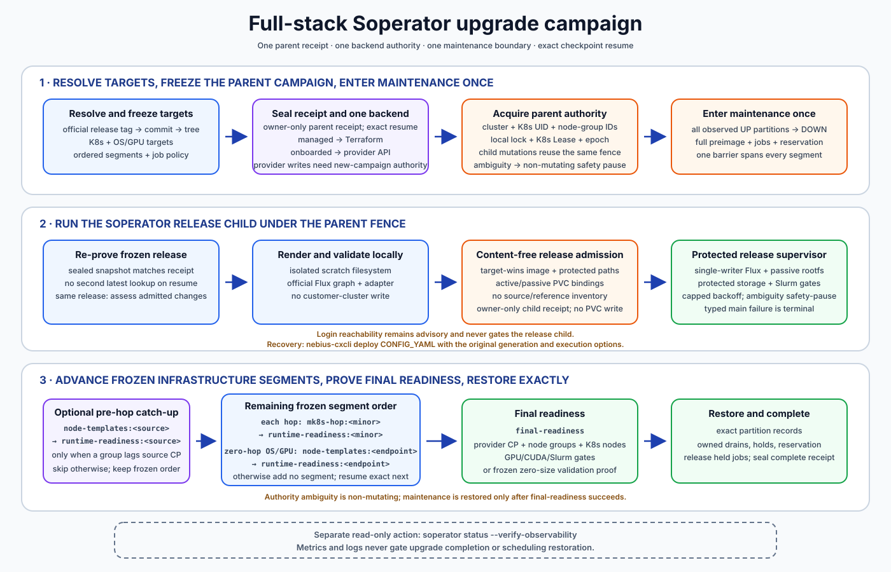
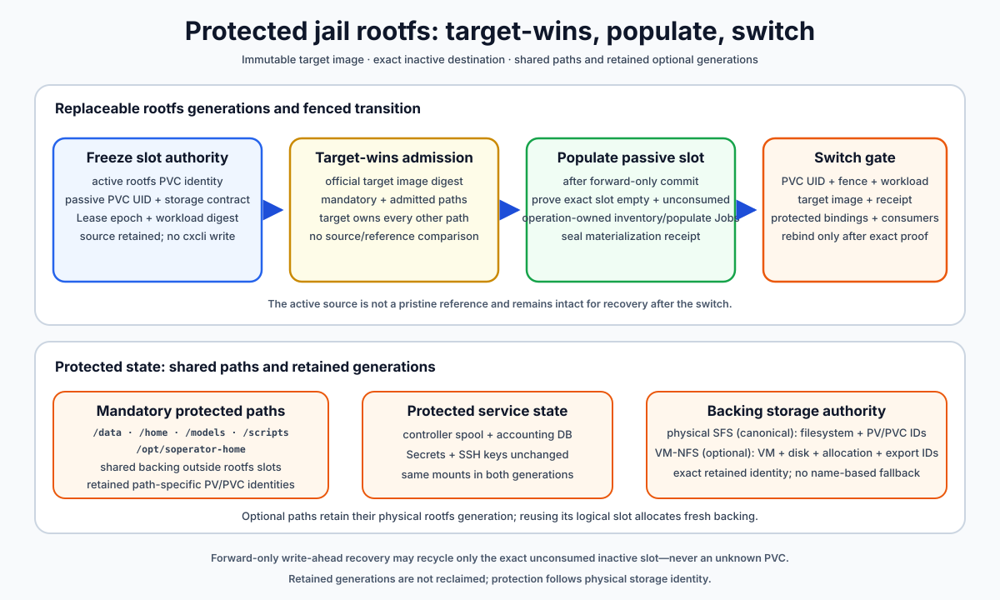

<!-- markdownlint-disable MD001 MD013 MD024 -->
<!-- maintain-project-specs:design:start schema=maintain-project-specs/design-v2 -->
# Project Design

## Scope

This is the implementation contract for the Soperator lifecycle supported by
`nebius-cxcli`. FEAT-001 through FEAT-012 remain reserved. The project has one
command family, operation model, and official-upstream delivery path.

## Architecture

```text
official GitHub release selector
              |
              v
release metadata + verified source archive
              |
              v
immutable operation snapshot ----> capability fingerprint
              |                              |
              |                              v
              |                       strategy graph
              |                              |
              +-------------+----------------+
                            v
                 common operation engine
                    /               \
       Nebius infrastructure     in-cluster reconciler
          Terraform/API        upstream graph + adapter
                    \               /
                     v             v
                      product gates
                     Kubernetes + Slurm
```

The official `nebius/soperator` release is the product authority. cxcli fetches
the release archive and referenced packages directly from their official
authorities, verifies them, and freezes a content-addressed operation snapshot
before mutation. The snapshot, not a bundled target-version lock or a second
lookup of `latest`, is interrupted-operation recovery authority.

Soperator is outside the generic component catalogs: neither
`component_sources.yaml` nor `component_cli_settings.yaml` may declare it.
Install-only defaults, CPU/GPU/mixed profiles, and wizard fields live in the
packaged, source-free `soperator_wizard.yaml` contract. Lifecycle code combines
that policy with the exact frozen official OCI release to construct an internal
entry; project intent remains an `apps.charts[id=soperator]` runtime row.

The source catalog contains discovered release facts and capability
fingerprints. A separate strategy graph maps capability transitions to one of
`install`, `noop`, `in-place`, or `protected-data-plane`. It never dispatches
on an exact release pair or on a major-version fallback. A future release is
accepted only when its derived capability contract is already understood.

Terraform owns creation and reconciliation of managed Nebius resources outside the
cluster. Whole-cluster destruction uses the Nebius SDK for both ownership modes,
followed by constrained Terraform state and ancillary-resource reconciliation.
The common in-cluster
reconciler owns Helm, Flux, and Kubernetes actions for both cxcli-installed and
onboarded clusters. Upstream owns product resources; the adapter owns only the
Nebius integration resources and supported values listed in its allowlist. The
first diagram places the protected release transition inside the parent
full-stack campaign; its dashed observability box is a separate status action,
not an upgrade gate. The second diagram expands only the content-free
target-wins jail/rootfs transition and its retained storage boundary.





## Public Lifecycle

Post-Flux ExternalSecret readiness uses the exact `external-secrets.io` API
group from `apiVersion`; this field is a Kubernetes group/version, not a URL.

```text
new target -------- soperator create -> validate -> render -> deploy -> managed
existing target --- soperator discover [raw scope] ----------------> information report
existing target --- soperator onboard ----------------------------> registered
managed/registered - soperator upgrade [release + K8s + OS/GPU targets] -> full stack reconciled
registered target -- soperator status [--verify-observability] ---> configured/live status
registered target -- destroy [--dry-run] [--delete-sfs] -> retired; SFS preserved by default
```

For interactive create or guided upgrade, an omitted release selector resolves
the official latest metadata for the prompt and freezes the selected exact release.
A non-interactive create requires its release selector; a fresh non-interactive
guided upgrade also requires explicit Kubernetes, OS and GPU-stack selectors.
Create saves configuration without execution. Guided upgrade writes the selected
desired state and invokes render/deploy. Matching interrupted operations recover
through deploy from local execution snapshots and frozen campaign evidence, without
reselecting latest. Preview is advisory and grants no later execution authority.
Onboarding records proven installed release and infrastructure identities.

## Ownership Matrix

| Owner | Resources |
| --- | --- |
| Upstream release | Product namespaces, charts, CRDs, controllers, workloads, active checks, scripts, and product image references |
| cxcli adapter | Nebius mount resources, supported values, stable protected-storage bindings, observability wiring, and operation evidence |
| Infrastructure driver | Nebius resources outside Kubernetes; Terraform for managed creation/reconciliation, Nebius APIs for onboarded changes and whole-cluster destruction in both ownership modes |
| Operator | Explicit policy for non-requeueable jobs and any accepted customization outside the adapter contract |

## Validation Evidence Boundary

The supported implementation contract and live validation evidence are separate
lanes. Offline source and behavioral tests cover both the
`managed/terraform` and `onboarded/provider-api` backends. The 2026-08-31 live
campaign on a previously onboarded target proved the common release segment,
Kubernetes 1.34 and 1.35 runtime readiness, and provider readback of the control
plane plus all five node groups at Kubernetes 1.35. Final independent
verification observed 11/11 Ready Kubernetes v1.35.6 nodes, the complete
19-member Flux release graph and all 16 frozen sources current and Ready, two
GPU workers exposing driver 580.159.04 plus CUDA 12.9 and required Jail
libraries, an UP Slurm controller with two idle nodes, restored scheduling, and
a terminal complete campaign receipt.

A separate managed/Terraform lab campaign completed on 2026-09-09. Installation
of Soperator 4.1.5 on Kubernetes 1.34 completed through supported resume; the same
cluster then completed its upgrade to Soperator 4.1.7 and Kubernetes 1.35.
Independent verification found 11 Ready nodes, 16 allocatable GPUs, 24 Ready
HelmReleases, 21 completed native check executions, restored desired schedules,
and released maintenance. A normal-user job verified arithmetic on all 16 GPUs
across both workers. This validates supported install recovery and the managed
upgrade; it does not establish a fresh clean-install rerun with the final source,
1,000-node behavior, or a comparative maintenance-time improvement.

<!-- FEATURE: FEAT-013 reqs=REQ-013 status=ready delivery=verified priority=P0 version=21 -->
### FEAT-013: Dynamic official release authority

#### Requirements Covered

- REQ-013: Resolve official upstream releases dynamically.

#### Context Evidence

The previous runtime contract was a wheel-bundled lock for one target release,
which coupled cxcli publication to Soperator publication and could not make
`latest` authoritative at execution time.

#### Design Details

Release identity publication requires this ledger instance to hold the
existing per-tag lock for the exact identity in the publishing thread. Write
and fsync a private temporary file, then atomically rename it under that lock
and fsync the directory. No partial final pin is visible; established pins
remain immutable. Interrupted temporary files grant no authority.

Resolve `latest` from the official latest-release API and exact stable semantic
versions from official release tags. Dereference the tag to commit and tree,
then use an owner-only XDG-state ledger keyed by official repository and
resolved tag. The first verified source observation atomically pins commit and
tree; later disagreement fails before download or mutation. Source discovery
uses bounded safe extraction and verifies the source manifest, image references
and tag identity before recording that source observation. Package admission
then compiles the requested phases and verifies their required charts. Recheck
the tag under the same per-tag lock before publishing a sealed admission snapshot. Interrupted-operation
recovery loads only the frozen snapshot. Each chart pull runs in fresh temporary
state and receives at most three attempts with bounded exponential backoff and
jitter only for transport timeouts or resets. Authentication, certificate,
not-found, digest, archive-validation, and source-identity failures are terminal
on their first attempt.

The verified umbrella values own the upstream OCI registry. Discover source
charts from their Chart.yaml identities; retain semantic keys for adapter-owned
roles and assign bounded deterministic keys to additional charts. Classify chart
ownership by source membership and repository together, since third-party charts
may share the product registry. Discover additional third-party artifacts from
the rendered graph and freeze their full repository/name/version identity.
Source discovery inventories chart metadata without claiming package verification.
Package admission follows the completed target configuration and declared operation
stages. Required artifacts comprise the umbrella, effective final consumers,
explicit compiler/adapter consumers and recursive packaging dependencies. Source
role names do not require downloads. Disabled unused standalone charts, including
NFS, cannot block an unrelated operation. Preserve strict source/package equality,
identity, archive, dependency and effective-value checks for every required artifact.

Version 19 separates a typed verified-source context from a sealed v3 artifact
snapshot. Creation loads source defaults before the wizard, then admits completed
selections before saving; render, validation and Grafana use the same pipeline.
Preliminary compilation retains source selectors. Acquire only feature-selected
packages needed for exact versions or digest-bound adapter decisions, finalize
values and stage graphs, then verify the complete required closure. Dashboard
ConfigMap delivery remains an explicit chart consumer even without a HelmRelease.
Missing digests never select a fallback branch. Dependency discovery is bounded,
monotonic and rejects cycles or ambiguous authorities.

Admission and execution share final document transformations: compare raw source
and OCI renders, apply permitted routing/patches identically, then validate every
consumer's identity, namespace, dependencies and values. Required missing packages
fail instead of being skipped. Materialized infrastructure outputs receive fresh
value validation while artifact selection remains bound to the frozen request.
An active attempt cannot silently expand its inventory.

Child post-render normalization distinguishes the routing producer's single
`replace /spec/values` mapping patch from the required graph rename. Retarget
both to the actual umbrella child name, including custom umbrella identities,
without changing routing values or patch order. Every child still requires
exactly one `replace /metadata/name` matching the frozen graph. Only graph
patches receive namespace and staging controls; unsupported non-rename patches,
missing renames, duplicate graph patches and incorrect names remain errors.

V3 snapshots bind target, request fingerprint, separate stage graphs and explicit
auxiliary artifact reasons alongside immutable source/package identities. Contexts
and the 15-minute admission cache use source, target, compiler policy, normalized
requested configuration and stages rather than release alone. Retain the immutable
package cache. Union stage artifact sets without merging incompatible graph edges.
No persistent project lock or new public flag is added. Resume reads only the
captured snapshot; a new repair requirement needs newly admitted operation evidence.
Old discovery entries are ignored in a separate namespace. Old generated snapshots
fail with rerender guidance only when no unfinished operation exists; unfinished
old operations must complete using the previous binary. Preserve their evidence;
provide no conversion, old decoder, fallback or dual execution path.

Version 17 applies the same generation-bound release context to every deployment
application re-render. Bind all enabled targets before Flux rendering, including
ordinary reconciliation without a selected stage target and mixed-release
projects. Use the supplied generation, preserve exact snapshot report bytes and
restore outer contexts on failure. Missing or conflicting evidence fails before
rendering; target projection never enables mutable discovery for other targets.
This is a private-boundary restoration of the frozen-generation contract.

Version 18 closes the earlier deployment-to-release-reconciler handoff. During
both dry-run admission and execution, bind the generation releases and pass the
selected target snapshot digest explicitly. Digest-bound resolution first uses
the matching operation context, revalidates its seal, and rejects a conflicting
bound digest before any cache fallback. The existing source, package, identity
ledger and downgrade verification remains mandatory. Recovery compares
parent and active-child snapshot identities before observing or finalizing an
already-completed child. Generic fresh release selection
and intentional upgrades retain their existing discovery boundary. The former whole-release inventory policy is superseded by Version 19.

Creation, validation, upgrade and Flux output carry the same frozen registry;
registry changes are release data, not hostname aliases or fallback attempts.
The source chart metadata owns packaged upstream versions even when umbrella
default selectors differ. Effective selectors must match frozen exact versions
or the selectors independently rendered from the verified source. Unsupported
dependency fields fail explicitly instead of losing their semantics. Strategic
label patches preserve upstream labels and create missing maps before delivery.
The stack remains Python/Helm/Flux with deterministic code and no AI subsystem.
Design review prioritizes upstream ownership, fail-fast artifact admission and
frozen recovery; a hostname-only patch was rejected because compiled inventory
and graph lists would continue coupling independent releases.

OCI deployment-manifest capture shares the release resolver's bounded chart
acquisition context. The context retains successful package bytes until metadata
or file-map capture completes, and removes every attempt directory on exit.
Only acquisition failures are retryable; caller validation failures and interrupts
propagate without another download. Frozen-generation replay keeps its existing
network-free path, and chart source/version/digest authority is unchanged.
Capture-path regressions exercise native subprocess result handling for resets,
transport timeouts and process timeouts, plus bounded exhaustion, clean partial
downloads, permanent/invalid-artifact rejection, interrupted cleanup, consumer
failure propagation and frozen replay. The four retry regressions fail against
the former direct single-attempt call and pass through the shared context.

Source acquisition represents a symbolic alias between distinct root Markdown
documents as a regular file containing the exact Git link-target bytes. It
requires a regular document target, verifies the alias against its resolved Git
blob, and includes those bytes in the frozen normalized manifest. Recovery uses
the same representation. No filesystem link is created or followed; aliases in
runtime/chart/script paths, link chains, hard links, submodules, unsafe paths,
duplicate members, and size-limit violations remain rejected.

Release selection is separate from mutation authority. Create or guided upgrade
freezes the selected release before publishing desired configuration. Deploy uses
the exact rendered snapshot. An interrupted deploy reloads the frozen backend
generation and campaign, so recovery never resolves latest again or requires a
new release selector. A changed generation conflicts with active execution.
Frozen handoffs validate the original sealed snapshot digest and compare the
requested exact version with its resolved release. They preserve the snapshot's
selection provenance, including `latest`, without resealing or normalizing its
content under the requested stage selector.

Each completed admission publishes an owner-only v3 snapshot keyed by the
source identity and target request, with a separate immutable digest index.
Fresh requests verify the official source/tag identity and may reuse a matching
admission for at most 15 minutes after revalidating all declared phases and
packages. Custom resolver openers bypass this recent cache. Missing or stale
recent admission evidence requires fresh admission; it never broadens the
request. Exact-digest replay requires its target-bound retained or generation
snapshot, rejects conflicts before hydration, and never falls back to discovery.
This cache grants no execution authority: cluster discovery, admission, fencing
and normal approvals remain mandatory before mutation.

Default official GitHub API requests may use the first non-empty `GH_TOKEN` or
`GITHUB_TOKEN` from the process environment as an in-memory Bearer credential.
The resolver never serializes or reports the token, rejects control characters,
and does not inject ambient credentials into a caller-supplied opener. This
changes request quota only; the official repository, tag, commit, tree, archive,
and artifact authorities remain identical.

Soperator release discovery resolves `latest` through its dedicated official
resolver and passes the resulting exact version to Helm source and chart-contract
validation. Soperator is outside the generic component catalog. Generic chart
validation and rendering share one exact-version parser: require all three
semantic-version components and reject `latest`, ranges, wildcards, and incomplete
versions. Exact prerelease and build suffixes remain valid. This fixes selector
identity; immutable package bytes require a separately verified artifact digest.

#### Selected Option

Use source discovery followed by target-scoped required-artifact admission and an immutable operation snapshot.

#### Alternatives Considered

A bundled target lock, mirrored OCI, a fallback registry, and a Python release
unpacker were rejected because they create a second release authority or retain
the publication coupling being removed.

#### Implementation Boundaries

The resolver may use only official GitHub and artifact authorities. It must
finish before the operation engine receives mutation authority.

#### Test-First Success Criteria

Tests prove latest and exact resolution, draft or prerelease rejection, moved
tag detection, hostile archive rejection, digest mismatch rejection, unknown
contract rejection, bounded sealed-snapshot reuse, and frozen recovery.

#### Validation Plan

Inspect canonical snapshots and compare their identities and digests with
verified source and downloaded packages.

#### Test Plan

Cover moved chart tags against captured deployment generations, multiple frozen releases and
context cleanup, missing/corrupt/conflicting attempt snapshot rejection before application, and
failed source verification leaving no new source identity record, and failed
package admission leaving no reusable admission snapshot.

Run resolver, extraction, graph, artifact, and operation-recovery tests with
local fixtures; run opt-in read-only official release discovery.

#### Evaluation Plan

Demonstrate that no mutable step can run with an unresolved or incomplete
snapshot.

#### Rollout And Rollback

Cut over atomically. Rollback is a source rollback before any new-format
operation begins; new receipts are not translated to superseded formats.

#### Done Definition

No runtime target-version lock or second `latest` lookup remains.

#### Implementation Evidence

Version 21: `soperator_release_identity.py` requires the publishing thread and
process to hold the exact identity lock. It writes an owner-only temporary
record, fsyncs complete bytes, renames under the per-tag lock, and fsyncs the
directory. Existing pins remain authoritative; only the current writer's
unfinished temporary file is cleaned up.

Version 20 repairs `flux_ops._normalize_soperator_outer_post_renderers` so
Grafana's values-only routing patches do not consume or fail the graph identity
check. Both stable desired-state observation and staged release execution use
the same normalization. No source snapshot, deployment input or CLI contract
changes are required.

Version 19: source-only discovery supplies creation defaults before selection.
The required-artifact compiler admits the umbrella, effective phase consumers,
explicit adapter consumers and packaging dependencies. Source/package equality
remains strict. Shared final-consumer binding applies saved authored patches,
routing and generated Flux patches, including jail storage bindings, before
validating child values. V3 snapshots and contexts bind target, source, request,
phase graphs and patches. Validation, render, Grafana, create and upgrades use
this pipeline. Local active-operation preflight rejects old snapshot evidence
before render or Grafana settings writes; completed projects can rerender.

Historical evidence below describes earlier versions and does not replace Version 19 validation.

Version 17 makes `deployment_resolution._resolve` bind every enabled Soperator
release from its supplied immutable generation through the existing verified
generation context. The ordinary reconciliation path and target-scoped stages
share this boundary; snapshot validation and source/package equality remain
mandatory. Projection and prerequisite tests isolate the new acquisition seam.
README and Unreleased changelog describe the preserved release authority.

The historical Version 16 accepted-generation prerequisite for observability
reconfiguration is superseded by FEAT-048. That implementation reused accepted
snapshots throughout setup. Current Grafana setup uses current source discovery
and normal rendering, then preserves the captured attempt's verified snapshots
through application rerendering. Source/package equality, effective-value checks,
child render validation and immutable release identity remain enforced. The
Version 16 verification results below describe the earlier implementation.

The resolver discovers source-owned and third-party artifacts and freezes the
source-selected registry. Snapshot URLs, internal component entries, creation,
source validation, upgrade admission and Flux sources carry that authority.
The release-graph selector derives enabled children from verified Helm renders;
artifact verification and Flux rendering share the selection contract. Required
adapter roles and source/package verification remain enforced. README and the
Unreleased changelog describe compatible additions and remaining boundaries.

#### Verification Evidence

Version 21: regression tests first reproduced partial final records after
write or file-fsync failures. The repaired ledger passes interrupted write,
file-sync, rename and directory-sync cases, identical retry, single-link
ownership, wrong-thread/identity lock rejection, concurrent identical
observations and conflicting first observations. Resolver consumer tests pass.
This is local source and filesystem verification, not live release deployment
proof.

Version 20: a local replay of the failing Soperator 4.1.11 render reproduced
the collector-events identity exception before repair and validates all 21
children and five routing patches afterward on stable and staged paths. Saved
inputs remain unchanged. Producer-to-normalizer regressions cover custom names,
namespace handling, preserved routing values and null pipelines, both staging
modes, input immutability, and missing, duplicate, incorrect or test-only renames.
Native Kustomize rendering verifies routing values, final names, namespaces and
suspension on both execution paths. All 536 affected offline tests pass, along
with scoped Ruff, formatting, Markdown and diff checks and the existing mypy
debt ratchet. Independent review found no blocking issue. Live deployment
completion remains unverified.

Version 19: regressions exercise disabled corrupt NFS without acquisition,
selected corrupt NFS rejection, strict registry-host comparison, dependency
cycles, dashboard adapter consumption, saved-patch replay, final jail-log storage
binding, graph omissions, target isolation and old-schema cutoff with unchanged
evidence. Captured 4.1.11 source renders exclude NFS in every declared phase.
Creation tests prove admission follows wizard completion and precedes saving.
A synthetic public-artifact admission against official Soperator 4.1.11 verifies
10 required upstream charts and 11 third-party artifacts across desired, initial,
maintenance and acceptance phases; NFS and bootstrap remain absent. This trial
uses complete synthetic placement and storage values, real package downloads and
strict final-consumer verification. Exact-digest replay then retains the same
snapshot identity and artifact inventory. Neither trial performs cluster or
deployment mutation.
Full Ruff and Markdown checks pass, as do the formatting, type-debt and CLI
architecture ratchets. The installed wheel passes its CLI contract check.
Independent final review reports no blocking issue. The final `make all` passes with 7,459 offline tests passing, three skipped and
15 opt-in integration tests deselected. Live deployment and remote CI remain
unverified.

Version 18: the user retry reproduced the original error after Version 17;
its local render proof did not cover the earlier release-admission path.
New negative controls reproduce both the exact admission/execution chart
mismatch and completed-child snapshot identity bypass. All 1,043 affected
deployment, generation, observability-installation, release resolver/artifact,
CLI safety and architecture tests pass. An actual selected-target `deploy
--dry-run` completes both unchanged Terraform plans and release admission
successfully; the checked config and release snapshot bytes remain unchanged.
This proves the original admission failure is repaired, not that deployment
execution or customer acceptance completed. The editable installed command
loads the repaired source. Scoped lint, type, Markdown and CLI architecture
checks pass; the resolver retains a preexisting unrelated formatting finding.
Independent final review found no blocking issue. Full deployment execution,
cluster health, customer acceptance and remote CI remain unverified.

Version 17: the regression reproduced the original NFS chart mismatch in both
ordinary and target-scoped rendering before the fix. All 758 focused deployment,
generation, observability-installation, resolver and artifact tests pass, including
mixed releases, exception cleanup, immutable bundle inputs and strict mismatch
rejection. An isolated real application-resolution replay using the selected
frozen bundle and an incident-observed cluster-output fixture completed render
and compatibility verification, reconstructed 30 bundle files and preserved the
release snapshot bytes while mutable discovery was forbidden. The original
bundle remained unchanged. This is local affected-boundary proof, not live
reconciliation or current infrastructure-output proof. Scoped Ruff, formatting,
type and Markdown checks pass; independent review found no blocking product
issue. The editable installed command loads the repaired source. Live deployment,
cluster health and remote CI remain unverified.

Version 16: red-to-green regressions reproduce lost accepted-release context and
premature publication. All 134 focused tests pass, including success/failure
publication order for fresh, recent-cache and digest-bound selection, invalid
snapshots before save, mixed releases, cancellation cleanup and strict registry
host comparisons. A local replay with preserved public release artifacts
verifies all 29 packages and renders 22 Flux files using the identical snapshot
with mutable discovery forbidden; the changed NFS package still raises the
original integrity error. This replay uses isolated cache copies and a synthetic
project, not a live deployment. Independent review found no blocking issue.
The full offline suite also passes. Repository Ruff, Markdown, formatting/type
ratchets, CLI architecture and final wheel CLI contract checks pass. The installed
editable CLI imports the repaired checkout. Live installation, remote CI and
cluster health remain unverified.

The registry-change regression reproduced the original backup-chart rejection
before the fix. Official 4.1.9 freezing then succeeded against public upstream
artifacts with 16 source charts, 13 third-party identities and 30 child releases;
the final official source preflight also passed. Local regressions cover additive
charts, unused helpers, full dependency identities, source version selectors,
missing/duplicate/cyclic or unsupported graph data, creation and source validation
with the new registry, and actual Helm and kubectl-kustomize boundaries.
Independent read-only review rechecked version authority, dependency semantics
and label preservation after regression tests demonstrated each rejected state.
Eight core modules pass scoped type checks; scoped Ruff, Markdown and CLI
architecture checks pass. A temporary wheel build/import smoke verifies the
unchanged public CLI contract and create help using existing locked dependencies.
The active editable CLI imports the repaired source. Full create completion and
cluster deployment were not performed; broader pre-existing type diagnostics in
inventory and Flux rendering remain outside this repair.
The subsequent alignment pass reproduced missing nested dependencies and a
default-enabled child hidden by a known optional before fixing their inventory
collection. Regressions cover mutually exclusive dependency orderings and raw
defaults that reference disabled optionals. The expanded offline run passed
1,272 tests; a final focused rerun passed all 77 resolver, artifact and graph
tests. The final source-manifest-verified 4.1.9 inventory preflight passed with
30 children and one remote nested dependency already present in that inventory.
Independent read-only review found no remaining concrete issue in these fixes;
the final temporary wheel build, isolated import, CLI contract, type, lint and
format checks passed. No cloud mutation or live create/deploy replay was used.

<!-- /FEATURE: FEAT-013 -->

<!-- FEATURE: FEAT-014 reqs=REQ-014 status=ready delivery=unassessed priority=P0 version=12 -->
### FEAT-014: Capability-validated thin adapter

#### Requirements Covered

- REQ-014: Keep Nebius integration in a thin adapter.

#### Context Evidence

The local chart family duplicated upstream product ownership and required
continuous synchronization with the Soperator team's release intent.

#### Design Details

Render from verified upstream sources. Classify the release by source-derived
capabilities, validate adapter values against that contract, and reject any
adapter-rendered resource outside the ownership allowlist. Keep upstream image,
script, chart, active-check, and dependency intent unchanged unless a contract
explicitly defines a supported value input. Onboarding projects only bounded,
release-neutral worker, partition, and optional accounting/exporter
service topology from the live SlurmCluster and NodeSet resources. Target
profile defaults hydrate that projection in render memory, but adopted worker
NodeSets replace profile scheduling defaults with the exact discovered Nebius
node-group selector or required affinity. A missing or unusable discovered
placement fails before render rather than leaving target workers unschedulable.
Source images, arbitrary environment values, init containers, annotations,
secrets, and volume definitions are never copied into source configuration or
reused as target-release authority. REST is required because upstream SConfig
uses it to apply Slurm configuration. Materialization enables the internal
service and rejects explicit disablement or zero replicas. The shared
`slurm.conf` would expose the controller-only `MetricsType` directive to
`slurmrestd`, so materialization disables controller-native OpenMetrics; upstream exporter presence remains the independently
preserved service-topology choice.
GPU materialization fills an absent `nodeConfig.static` Gres declaration from
the selected GPU count independently of CPU topology resizing. It preserves
already fitting CPU topology, including explicit Gres declarations. GPU visibility in
Kubernetes does not establish Slurm registration or workload acceptance.

The adapter maps only the verified digest-pinned jail image from the frozen
official release into the upstream `images.populateJail` contract. It rejects
any cxcli rootfs-image override so release ownership remains singular.

#### Selected Option

Use upstream product resources plus a declarative Nebius adapter.

#### Alternatives Considered

Maintaining a downstream umbrella or copying release content at runtime was
rejected because either path creates downstream product ownership.

#### Implementation Boundaries

The adapter owns Nebius infrastructure references, mounts, storage bindings,
observability wiring, and allowed values only.

#### Test-First Success Criteria

Every known capability contract renders without ownership overlap; unknown
values, resources, or graph shapes fail closed. Registration tests prove that
arbitrary live pod payloads stay out of configuration while projected topology
renders a complete target-profile NodeSet contract, preserves optional service
presence, binds adopted workers to discovered node-group identities, and emits
the required REST service with its controller OpenMetrics and JWT startup settings.

#### Validation Plan

Compare rendered objects with the upstream source graph and adapter allowlist.

#### Test Plan

Run render, schema, source-equivalence, graph, and architecture-boundary tests.

#### Evaluation Plan

Verify that a compatible future patch release needs no cxcli source edit.

#### Rollout And Rollback

Keep the verified adapter path and absence of a local product chart in one
candidate. Rollback restores the whole source candidate, not two delivery
paths.

#### Done Definition

Upstream artifacts plus adapter-owned resources are the only rendered surface.

#### Implementation Evidence

Adapter schemas, ownership checks, rendered-graph receipts, and deletion guards
provide implementation evidence.

#### Verification Evidence

No independent verification evidence was recorded before schema migration.

<!-- /FEATURE: FEAT-014 -->

<!-- FEATURE: FEAT-015 reqs=REQ-015 status=ready delivery=unassessed priority=P0 version=53 -->
### FEAT-015: Canonical Soperator CLI lifecycle

Command alignment binds fresh upgrade planning to the initially read source
configuration, including public read-only selection before execution. A second
hash check after release admission rejects concurrent edits before returning
an intent; desired publication retains its existing compare-and-set guard.
Unreadable source configuration fails before provider discovery. Provider scope
lookup failures in discovery and onboarding retain only their controlled error
message, suppressing raw SDK exception chaining. The removed private discovery
implementation has no command route; the config-independent runtime remains the
single public discovery owner. Campaign and child operation status requires the
original deploy options; local receipts omit target and validation selections,
so status does not invent a complete executable recovery command. Campaign
status separately presents its known frozen Slurm flags. Invocation recovery
guidance likewise preserves the original frozen generation and execution controls.

#### Requirements Covered

- REQ-015: Provide one canonical Soperator command family.

#### Context Evidence

Fresh installation, adoption, release change, and read-only inspection need
one unambiguous command and operation contract.

#### Design Details

Status uses a focused read-only collector, a pure component/overall-health projection and a terminal-safe renderer. It shares release resolution and transport readers with registration without running storage identity or CPU-topology discovery. Exact cluster identity is validated before runtime probes. Inventory calls have 30-second timeouts, Slurm ping and node-state queries 10 seconds each, with one attempt and no readiness polling. Target labels plus immutable ownership identify component workloads; controller placeholders remain separate and worker rows scale by NodeSet. Workload generations govern readiness; upstream CR conditions without observed-generation support are supplemental. Independent failures retain successful observations as a partial report; fatal identity conflicts suppress untrusted live data.

Status reuses stderr progress sequences with current activity and elapsed time, pauses for prompts and cleans up on interruption. The report uses colored status words, Ready/Expected counts and blank healthy details; nonhealthy details combine observed evidence with component-specific impact. Overall precedence is Unhealthy, Degraded, Unknown, Healthy; fatal command failures report Error. Disabled/intentional zero capacity and historical check results do not contribute success or failure; no assessed components is Unknown. Failed explicit observability verification contributes unknown evidence without modifying lifecycle completion. Offline status ends with Not checked. One installed chart version retains build metadata; a distinct app version appears only for meaningful discrepancies. Existing lifecycle recovery and completed-history authority remain unchanged.

Status reliability revision: the collector and projector match Helm ownership by resolved release name and target namespace, retaining the separate storage namespace for Helm storage reads. Each installed NodeConfigurator child must resolve exactly one owned CR, then its exact UID-owned DaemonSet and pods; missing or ambiguous expected CRs produce Unknown. The selected design retains these health checks instead of removing useful controller evidence. Corrected fixtures explicitly model different target and storage namespaces.

Recorded-check observations carry declared type, native result, suspended scheduling and separately labeled timestamps. Collection state distinguishes collected (including a successful empty inventory), unavailable, API not installed and offline not checked. Only the declared check type selects a status subtree; unsupported types are unverified. Default rendering summarizes all outcome categories and shows at most five alphabetically ordered Failed/Error/Cancelled records with an expansion hint. --show-checks renders all records in Check, Recorded result, Schedule and Timestamps columns without new queries. Missing timestamps are omitted; submitted, scheduled, last successful and status updated are not interchangeable. History issues and results never enter current-health aggregation or exit status, even with --show-checks; failed current-health reads and explicitly requested observability still do. --no-live --show-checks remains local and reports history Not checked. The existing deterministic Python/Typer/Rich stack and bounded read-only transport remain unchanged. Reliability revision evidence: the namespace attribution, expected NodeConfigurator checks, structured history and --show-checks rendering are implemented. Local verification passed 841 focused tests, scoped Ruff lint and formatting, type checks, Markdown lint and the CLI architecture ratchet; read-only review found no serious findings. On 2026-09-16, both the default and --show-checks commands completed against the authorized live target with exit 0 and overall Healthy: operator 1/1 and NodeConfigurator 5/5. The default report summarized 17 complete checks, zero failures and eight suspended without results; expanded output showed all 25 records with separate timestamp labels and no fabricated missing values. Independent identity-bound Kubernetes reads confirmed current workload generations, readiness and immutable pod ownership for the operator and NodeConfigurator. These trials made no cluster mutations or check submissions; live warning and failure paths remain covered by local regression tests, not injected live failures.

Prior status implementation evidence: Status is implemented in soperator_status_collect.py, soperator_status_health.py and soperator_status_render.py, with CLI wiring and a shared read-only Slurm field parser. Local verification passed 798 focused tests covering actual Rich terminal colors and NO_COLOR, animated progress during delayed collection, interruption cleanup, partial and stale observations, exact ownership and identity, dynamic worker capacity, issue/impact text, aggregation, read-only query bounds, existing recovery consumers, documentation and CLI contracts. Scoped Ruff, type checks and the CLI architecture ratchet pass. This is source and local-test evidence; no live cluster validation was performed for this revision.

Soperator create uses the private typed `project_creation.py` workflow shared with
the generic create command. The CLI constructs its wizard and I/O dependencies
explicitly; the application workflow does not import the composition root.
The jail-log collector uses the existing umbrella post-render boundary to bind
its node affinity and tolerations to the compiled system node filter and its
read-only jail host path to the exact active PVC's protected adapter PV. The
placement intersects the system and protected volume node constraints. The
binding is derived again after jail-slot selection during every render. Exact
tests of the upstream affinity and named jail volume fail on source drift;
other collector values, commands, images, init containers and readiness remain
unchanged. Missing, ambiguous or non-local storage authority fails before apply.
The shared logs override cannot provide this binding because it replaces the
complete values of both jail and node collectors.

A closed interrupted-install collector repair changes only the umbrella's
existing collector patch. It requires the same completed source/storage prefix,
incomplete apply intent, unchanged scheduling gate and unstarted acceptance as
the other input repairs, but authenticates the exact never-successful collector
release and frozen third-party chart. It preserves completed native bootstrap
checks and all prior repair receipts. An acknowledged suspended release with
native uninstall evidence may discharge a queued retry only after revalidating
its exact chart reference, version, values digest and frozen artifact identity.
No source archive, node label, filesystem, shared collector configuration or
successful check evidence is rewritten to make the installation pass.

The same sealed collector repair can recover a native `MissingRollbackTarget`
left by a failed first upgrade. Before opening that child stage, require its
exact UID, frozen HelmChart artifact, failed revision/configuration, acknowledged
suspension, no successful release history, and a current fully Ready owned
Deployment. Request a single native force/reconcile using a deterministic token
bound to UID, source artifact and configuration digest. Do not set Helm resource
replacement or disable waits. Preserve the token across resume, wait for native
acknowledgment, and retain normal terminal failure and readiness checks. Other
children and failure classes do not enter this continuation.

A closed GPU/maintenance successor can admit the exact failed initial check
acceptance frontier when generated NodeSet static configuration omits its GPU
count. Require matching live NodeSet UID, source and missing static count,
unchanged worker resources and storage, no accepted or submitted check jobs,
and the original active root-only full-worker reservation. Derive only the
missing `Gres` token through the canonical materializer; update the values record
and matching umbrella inline values together. Seal the original reservation
fingerprint and prior checks receipt with the existing repair ancestry. Import
only the completed source/storage prefix and replay declarative apply; preserve
all invalid prior restoration and downstream evidence without treating it as
success. The new checks epoch adopts the same reservation under its seal,
retains its release obligation and rejects any changed fingerprint. The check
policy digest binds all compiled values, so the missing-count correction creates
a new policy identity. Reconstruct the exact predecessor files from the sealed
reversible delta, verify both file maps and the forward materializer, and prove
that only the policy's values digest changed. Bind the predecessor and successor
policy identities in the reservation handoff; never rewrite its admission seal
or copy acceptance results. No reservation recreation, arbitrary input replacement
or manual Slurm edit is permitted.

Only the CLI adapter parses component/version tokens;
install supplies an exact frozen release and returns the config path directly.
Initial rendering defers the managed cluster identity used by upstream
observability until Terraform has created it. The post-Terraform Flux refresh
requires the immutable cluster ID through the catalog module output name; root
output prefixes are applied exactly once. A missing fabric on a profile-owned
GPU cluster remains a required prompt after shape selection when regional
Capacity Dashboard advice is unavailable. A fabric already derived from a live
capacity choice stays automatic. Missing regional capacity coverage is unknown,
not confirmed zero; reservation policy remains enforced by the provider.
Install suppresses the generic deploy hint during its internal render. The
Object Storage install lease normalizes HTTP metadata header names at the read
boundary, rejects ambiguous duplicate names, and keeps exact owner values,
ETag, expiry, and immutable cluster binding checks.
The MK8s module exposes configured service-account keys at plan time; only
the account IDs remain apply-time values. Initial observability IAM grants
therefore use the ordinary full Terraform plan without a targeted bootstrap.
Each configured node-account group receives one project-scoped `editor`
permit for upstream metrics and log ingestion. The vendor names
`monitoring.metrics.writer` and `logging.logs.writer` describe permissions,
not assignable roles. The supported general editor role grants wider project
resource management; no tenant grant or separate credential is introduced.
Install ownership includes the exact generated observability IAM addresses for
enabled Soperator node groups with configured accounts. Unknown root resources,
deletes and replacements are rejected; root IAM changes alone cannot satisfy
the fresh infrastructure requirement.
The full MK8s, SFS, and Soperator field wizard runs without generic component
selection or an editable release version. Fresh install offers no optional-app
questions, generic target-observability prompts, or `--app` option. The shared
field runner presents Infrastructure, Soperator configuration with the frozen
upstream release, and Required platform or integration components. Optional
ordinary apps are added afterward through `component add`. The internal
`apps.charts[id=soperator]` row remains lifecycle intent, never a selectable
catalog app. Worker autoscaling retains MK8s capacity ownership and upstream
NodeSet replica mapping. Enabling autoscaling exposes a separate per-shard
ephemeral-worker choice; bulk autoscaling does not opt shards into ephemeral
mode. Disabling autoscaling clears its bounds and ephemeral mode. Profiles,
placements, and storage retain their adapter mappings. The existing adapter
maps retained fields to the selected upstream release; unsupported settings fail
explicitly.
Required platform/integration customization uses an explicit `Customize` prompt
with default `n` and a preview explaining that the required component remains
enabled with the shown values. Enter/no retains those values; yes opens the
existing detailed fields. The upstream Soperator configuration prompt also
displays default `n`: Enter retains the previewed settings and frozen release,
and explicit yes opens its detailed fields. The default applies to all app rows
in the dedicated install wizard. Infrastructure defaults to yes; generic apps
still require an explicit choice. Back and quit retain their existing behavior.
Missing root SSH selection runs before this optional customization gate, as
specified in FEAT-033.
Storage preparation and slot switching share `normalize_jail_storage_intent`.
It copies and normalizes layout, slots, adoption and consumer bindings without
creating, deleting or rewriting supplied `volumeSources`. The thin adapter is
the sole generated-source owner and rejects conflicts. The obsolete
upgrade-only alias-stripping handoff is removed; no compatibility wrapper,
legacy mode, or automatic repair of malformed saved configuration is provided.
Completed fresh-install values pass the real adapter compiler with the frozen
release after final policy validation and before scaffolding or publication.
The compiled result is discarded; saved configuration remains canonical intent.
Compilation errors retain target/field context and stop before config writes,
rendering or planning. This covers interactive and non-interactive creation
without subjecting intermediate adoption drafts to completed-input checks.
The integration regression crosses creation, save/reload, repeated
normalization, compilation and rendering using controlled external fixtures.
It checks unique generated aliases, exact PVC/consumer bindings, real custom
source conflicts, and adoption plus consecutive slot-switch semantics.
The install-only SFS subflow owns source selection and conditional fields for
accounting, controller-spool, and jail in that order. A transient mode defaults
from each nonempty `existing_id`; it is never a second persisted authority.
Create new collects name, size, block size, mount tag and deletion protection,
removes the existing ID, and performs no filesystem inventory lookup. Reuse
requires an explicit choice from current-project inventory, retaining the
configured/profile attachment tag independently of the resource name. There is
no skip, singleton auto-selection or manual-ID fallback. Empty or failed lookup
returns to the same source choice without changing the configured role. Role IDs
and mount tags must be distinct. A shared type prompt runs once when any role
creates storage. Draft branch edits and visible-step navigation preserve prior
creation answers and other roles. Cancellation returns an incomplete wizard;
fresh installation rejects that result before further materialization or
scaffolding even when defaults otherwise satisfy validation. A completion or
skip-customization summary shows requested creation properties or the reused ID
and tag. Existing profile/derived fields and Terraform partitioning by
`existing_id` remain unchanged; reuse summaries never describe those defaults as
live properties. Generic SFS, headless creation and saved-plan resume do not
enter this subflow.

Generated SFS mount tags are bounded to the virtio-fs device's 36-byte UTF-8
field with a deterministic hash suffix when necessary. The Compute API permits
37 characters, but QEMU rejects tags larger than the device field before VM
startup. Filesystem resource names and
explicit attachment tags remain separate inputs. The SFS wizard and canonical
config loader reject overlong explicit tags, including single-filesystem and
mapped configurations, before infrastructure planning.
Validation measures the encoded bytes of the stored string that Terraform
forwards; it does not discard whitespace when checking the limit. Generated
prefixes end at a complete UTF-8 code point. Interactive wizard fields are
trimmed before validation and storage. The device constraint is defined by
`struct virtio_fs_config.tag[36]` in the
[Linux virtio-fs header](https://github.com/torvalds/linux/blob/master/include/uapi/linux/virtio_fs.h)
and enforced during device realization in
[QEMU](https://github.com/qemu/qemu/blob/v10.1.0/hw/virtio/vhost-user-fs.c).

SFS source-choice delivery: implemented. `soperator_sfs_wizard.py` owns the
atomic draft and conditional navigation; the install-only branch in `cli.py`
bridges existing prompt/provider primitives and prints escaped intent summaries.
`project_creation.py` rejects incomplete fresh-install wizards before subsequent
materialization and scaffold publication. The existing configuration schema,
profile/derived fields, Terraform create/reuse split, headless path and saved-plan
resume remain unchanged.

Offline verification covers all-new/no-inventory, all-reused and mixed choices,
empty/error inventory, duplicate IDs/tags, explicit singleton selection,
text/TTY backtracking and cancellation, no-write interruption with complete
defaults, repeated normalization/runtime conversion, and ordinary-wizard
isolation. Focused SFS/creation, shared navigation/values/provider/docs, and SFS
rendering tests pass. Changed Python lint/format and Markdown lint pass; an
independent read-only code/security review found no blocking issues. Live
provisioning was not performed and is a separate evidence lane.

The selected worker profile is applied before initial normalization. GPU helper
requirements are reconciled after field changes across every group on a target.
The fixed bundle derives external GPU/network and optional integration helpers
from configuration, separately from install ordering. Ordering-only selection
is suppressed only for app types whose enabled instances all belong to
Soperator targets; mixed or ambiguous ownership retains generic requirements.
Upstream cert-manager
must remain enabled and no standalone duplicate is selected. Frozen optional
release coverage is a verified superset; wizard choices select its subset.
Public Nebius Grafana is the fresh-install default. Optional local Grafana
and its Gateway, and the additional Nebius observability agent, are selected
independently after installation under FEAT-030. The existing Flux graph post-render
patch disables the upstream VM-stack Grafana child. The separate cxcli agent
excludes Soperator, Soperator-system, monitoring-system, and logs-system
namespaces from generic log and metric collection while retaining ordinary
workloads and traces. Upstream Soperator 4.1.7 uses OpenTelemetry collectors,
VictoriaMetrics, and VictoriaLogs, not the nebius-observability-agent-helm
package. These namespace exclusions do not establish that cluster-wide scrape
jobs have disjoint metrics. Declining app field customization preserves the
selected apps and defaults.
Install reuses the upgrade progress renderer with an install prefix, scoped
release/auth/provider/render/plan phases, elapsed terminal state rows, and
bounded stable stderr records for redirected output. Cached lookups stay quiet;
remote-call phases sit inside exception handlers so handled provider failures
still fail the displayed phase. Project validation classifies its returned
outcome. Authentication ownership, permissions, retries, credential recovery,
plan approvals, leases, and resume semantics remain unchanged. Progress pauses
for prompts and nested displays and cannot change operation outcomes.
Subnet discovery and networking preflight read effective CIDRs from
`status.ipv4_private_pools[*].cidrs`. Explicit authored CIDRs retain precedence;
prefix allocations use their resolved status ranges. Inherited or omitted
private-pool specifications do not establish subnet-owned CIDRs. The deprecated
flat status field is not read or retained as a compatibility fallback.
Compute platform names and complete preset resources/clustering metadata are
read together using the paginated project-scoped List API and cached only after
the entire inventory succeeds. Preset lookup never repeats GetByName for old
or unavailable shapes; absence in a complete inventory remains distinct from
a failed read. Failed reads do not poison the preset-choice cache.
After a wizard field changes, the existing dependency expander propagates
managed node-group shapes before boot-disk refresh. The unchanged previous
inputs remain available to distinguish generated values from supported custom
helper disk overrides. Explicit platform choices are never substituted.

Expose exactly five Soperator commands in canonical help order: `soperator
create`, `soperator discover`, `soperator onboard`, `soperator upgrade`, and
`soperator status`. Global `destroy` owns all MK8s teardown. Create authors configuration;
discover and status inspect it. Standard render/deploy execute the complete
frozen desired configuration. Named option invocation order is intentionally
arbitrary, while declaration/help/example order and conditional requiredness
are frozen in the v5 Soperator CLI contract. Onboard records an existing
official installation after verifying live rendered-object equivalence.
Upgrade selects exact desired release/platform and rollout settings, publishes
configuration with a source compare-and-swap, then invokes render/deploy. The
shared planner composes release, Terraform/provider, compatibility, readiness
and validation owners under one durable parent campaign. Zero-capacity groups use
provider desired-template verification; no separate waiver is exposed. The parent campaign
returns its current Lease fencing authority to every child reconciler after
re-proving the frozen campaign, inventory, configuration, and registration
state; a child mutation cannot substitute unfenced local authority. The
scheduling barrier reasserts that Lease immediately before every individual
partition mutation, so authority loss after one update cannot spill into a
later partition. Before the
other upgrade choices, the wizard displays the fixed required
`pause-all-active` Partition Policy and then a structured Job Policy selector
whose omitted default is guarded `requeue-hold-all`; only an explicit
`interactive` choice delegates decisions to the per-job TUI. Protected
controller-spool migration state is checkpointed under the parent's active
maintenance evidence and forwarded to the release reconciler, rather than
creating a nested child Slurm journal or maintenance owner. The
recovery path and provider child executor consume the validated, resolved
strategy values. The command-neutral Terraform child translates a frozen
non-safe zero to its no-override call representation instead of reprocessing
it as a fresh CLI override. Provider node-group writes use the same effective
desired-or-actual version mapping as planning for inherited groups and omit an
empty GPU settings message for driverless groups. The
Kubernetes default is not hard-coded: cxcli queries the Nebius control-plane versions API,
selects the highest same-major endpoint reachable through a contiguous minor
path, and freezes every sequential hop plus every per-group provider
compatibility row. The release catalog separately freezes the Jail CUDA target;
provider GPU drivers and Jail CUDA remain distinct evidence layers. Compatibility
output calls the API value a Nebius drivers preset and does not infer an NVIDIA
driver build. `auto` selects the latest recognized provider OS first and then the
latest compatible preset for each group and hop; ambiguous provider identifiers
fail with the exact choices instead of using lexical order. A global exact GPU
preset applies only to Nebius-image GPU groups; an exact per-group preset for a
driverless group fails. Every frozen tuple is re-read immediately before that
group's Terraform or provider-API mutation, including after a provider control-
plane wait. Provider list order and node-group aliases are canonicalized; an
ambiguous override alias fails rather than affecting multiple groups. Public
discover takes an output root plus parser-required tenant, project, and cluster
IDs. It verifies that identity through the Nebius APIs, derives the cluster
region (or verifies an optional assertion), UID-binds any explicit Kubernetes
context to provider-generated access, and writes only `report.json` and
`report.md` under `soperator-discovery/{cluster-key}/`. The schema-v2 JSON
retains the complete support-safe in-scope node, provider-group, component,
referenced-storage, topology, health, and collection inventory. The writer
returns the exact saved bounded Markdown projection to the command runtime,
which renders it on screen before printing artifact paths. Before both
persistence and display, that projection converts terminal controls,
bidi/format controls, and line separators to visible Unicode escapes and
escapes Markdown structure from live-derived values. Its fixed component rows
and one-row-per-node-group table derive from the authoritative JSON inventory;
no per-node rows are rendered. Evidence classes are provider-configured,
Kubernetes-observed, runtime-observed, or unknown and never treat a driver
preset, image identity, Helm value, or node label as an exact runtime
driver/CUDA result. It never
reads/creates config, registers, renders, writes a lifecycle receipt, or creates
a workload. Its shareable Markdown keeps the report directory relative, and
collector gaps such as ambiguous SlurmCluster identity, failed PV/PVC
inventory, or an unavailable Slurm health probe are printed and recorded in a
partial report before the command exits nonzero instead of preventing artifact
creation. Onboarding re-collects
registration evidence under strict identity/storage gates and does not import
a public discovery report. A fresh onboarding run also treats an omitted region
as live-derived in both interactive and non-interactive modes, including a
retry after the initial project scaffold was written. The pending authority is
published before the scaffold as an owner-only marker bound to the exact config
hash. Marker and config publication share the config lock, and config creation
uses an atomic create-only path so a competing writer is preserved rather than
overwritten. The marker is then re-proved after discovery and under the config
lock. Established configs retain their configured region authority; an
explicit `--region-id` is always an additional assertion, so configured,
explicit, and observed regions must agree whenever they apply.

Execute performs fresh discovery and freezes the exact parent intent before
mutation. One target-scoped lease, one local writer lock, and one approval cover
the complete campaign. Admission proves and freezes exactly one infrastructure
authority: `managed/terraform` for a cxcli-managed MK8s component, or
`onboarded/provider-api` for an external registration authorized by the same
shared admitted deployment campaign. Ambiguous or drifted
ownership fails before mutation, and recovery cannot override, fall back, or
switch backends. Both paths reuse the common official Soperator release/Flux
engine; only the infrastructure mutation adapter differs. Operation-owned Slurm maintenance begins once and stays
active through release reconciliation, control-plane-first Kubernetes hops,
node-group OS/driver rolling updates, per-hop provider readiness, and final
generated Soperator/Kubernetes/GPU validation. Managed node-template children delegate only their own
target's Soperator graph smoke check through the private campaign context;
node, GPU, RDMA and other deployment checks still run per group. The parent
refreshes exact frozen sources before mandatory final graph and runtime proof.
This avoids waiting on artifacts that a suspended HelmChart cannot rebuild
after source-controller replacement, as described by the
[Flux HelmChart suspension contract](https://fluxcd.io/flux/components/source/helmcharts/#suspending-and-resuming).
Standalone commands, other owners and other targets retain required graph
checks even when public validation-skip flags are supplied. Failed segments leave
maintenance active and are retried from their exact receipt ledger; only full
completion restores partitions and releases operation-owned held jobs. The
maintenance entry has a durable `entering` state: every partition and job
pre/post-mutation event is owner-only journaled immediately, so recovery can
re-prove an exact partial pause before continuing. A node group that is exactly
one minor behind first receives a frozen catch-up template at the current
control-plane minor; larger or cross-major lag fails before mutation. Managed
targets use current Terraform/node-template executors and short transactional
config generations. Every operation-owned config edit first journals its exact
preimage, postimage, and complete project-generation digest in the parent
receipt, then commits config and generated artifacts as one transaction.
A completed or no-op declarative-release postcondition refreshes every frozen
digest-bound Flux source before re-entering its graph wait; this reconstructs
artifacts lost when source-controller's ephemeral storage is replaced even
though the retained source status was previously Ready. After generated
Soperator, Kubernetes, GPU, and CUDA validation passes, final readiness repeats
that source proof from the selected target's Flux directory, re-freezes the
resulting HelmChart artifact identities, and waits for the complete rendered
release graph to acknowledge its current generations as Ready. Each active GPU
group must have exactly one non-skipped successful CUDA workload report. The
campaign freezes all group counts and provider resource versions before those
workloads and compares them again only after the source/graph proof, so any
capacity or identity transition retries the whole final postcondition. Zero-
capacity groups record runtime evidence as not applicable. The provider matrix
and plan expose only Nebius driver presets; the bounded CUDA canary proves
execution and retains an attempt-unique, SHA-256-bound report but does not
currently report an exact host NVIDIA driver or runtime CUDA build. An exact
replay of an already-completed
campaign reruns
only this final postcondition, persists the fresh evidence in the final segment,
and leaves restored Slurm maintenance plus all provider segments untouched. A
running or failed final-only replay is projected as an operation while the last-
known-good completed evidence and report files remain intact; successful
revalidation replaces that evidence atomically. Completed campaign tuples and
per-group report paths
remain visible in `soperator status` without treating history as an active
operation.
The campaign also freezes the initial config-plus-render-owned generated-file
snapshot and exact provider node-group ID set. Every recovery fence rejects
foreign generated-file or provider-inventory drift. The render-owned inventory
excludes Terraform runtime caches, local state, workspace state, state backups
and state locks, as well as campaign and native check lifecycle receipts.
Rendering preserves these artifacts across directory promotion without
following provider-cache symlinks. Configuration and `.terraform.lock.hcl`
remain in the fingerprint. A durable applied transition is verified against
its exact config-plus-generated postimage; planned transitions also require
the matching fully materialized transaction generation. Runtime changes to a
completed transaction do not invalidate an applied configuration receipt.
Provider node groups may
leave their desired Kubernetes version empty to inherit the control-plane
major/minor; admission derives that effective source version from actual node
status while preserving any explicit desired version as authoritative. This
matches the
[Nebius node-group version contract](https://docs.nebius.com/terraform-provider/reference/resources/mk8s_v1_node_group),
including its provider-specific actual-status form. Sequential control-plane
then node-group ordering follows the
[Nebius MK8s upgrade procedure](https://docs.nebius.com/kubernetes/manage-versions).
Control-plane readiness
requires matching desired and actual status versions, `RUNNING`,
non-reconciling state, and two stable observations. Zero-sized groups always
receive the same stable desired-template readback; the GPU skip policy waives
only live GPU/CUDA workload proof. Recovery accepts only that receipt-owned
chain. Onboarded targets require explicit provider-API authority
on a newly approved campaign and use optimistic metadata-versioned updates with
the same frozen rollout strategy. One forward-only executor owns remaining upgrade steps. A permanent or unknown
failure stops the invocation and retains the exact durable operation for recovery.
Only safe logical operations retry explicitly transient failures within three attempts;
there is no campaign or whole-release retry loop.
For a cxcli-owned Flux installation, status projects the unique canonical main
HelmRelease into the common release view only after checking current observed
generation, Ready state, deployed history, and release-graph version identity.
The completed operation receipt remains historical evidence and never replaces
that fresh read; legacy direct-Helm installations retain Helm storage discovery.
Observability verification is an explicit status action outside install and
upgrade receipts. A typed terminal state of a non-source main Soperator workload remains distinct
from invocation failure; authority ambiguity stops immediately with recovery required. Discover writes a
read-only support bundle without upgrade-preview selectors. Status reports
configured/live release plus the parent Soperator upgrade campaign before any
child release receipt, recovery, and receipt information. Recovery guidance
requires the original execution controls when local receipts cannot reconstruct
them. It never
projects node-group migration state. Destroy requires a target, prints exact destroy/preserve
inventories, and has a separate resumable receipt and explicit TTY-bound
approval. An interrupted upgrade reloads its frozen active intent through
`nebius-cxcli deploy CONFIG_YAML` with the same execution controls. Repeating
`soperator upgrade` selects a new intent and is not the recovery path.
Long-running release and full-stack
handoffs regenerate their temporary kubeconfig from that immutable cluster
identity with renewable current-Python exec authentication rather than copying
an existing context's launcher. For managed targets, resolve a missing cluster
ID from the exact generated Terraform output with backend initialization disabled;
the full-stack planner independently compares the provider's named cluster ID.
Both parent and release-child handoffs use this path. External targets must
supply their registered cluster ID and cannot read Terraform state.
If an external edit invalidates the current
cxcli executable or module, the supervisor treats it like a process
interruption: it exits without terminalizing the main workload or retrying a
missing local program; after the runtime is restored,
`nebius-cxcli deploy CONFIG_YAML` resumes the same receipt and frozen generation.

Interactive create and guided upgrade display the latest official release; an
explicit release flag skips that prompt. Guided upgrade also resolves a contiguous
Kubernetes path and compatible host-runtime choices. The selected exact targets
are saved to configuration and use the common render/deploy engine. Matching
recovery runs deploy with the same execution controls and never repeats selection.

The full-stack upgrade owns one presentation dispatcher but activates only one
phase-scoped live renderer at a time, stopping it before prompts and static
plans. Progress is written to stderr; stdout remains the plan/result channel.
TTY rows have one state column that renders an animated spinner while running
and replaces it in place with success, failure, or skipped state. Non-TTY
rendering is stable and ANSI-free. Flux bridge install, custom-resource
migration, configured-controller install, and rollout commands run through a
captured migration boundary so child stdout/stderr cannot tear the live row.
The static campaign plan renders destination minors as explicit adjacent
transitions beginning at the observed source minor; compatibility rows label
those minors as target compatibility rather than implying a transition. After
the plan, an operation-authority phase covers local and cluster writer-fence
acquisition, including expired-Lease quiescence proof, and a maintenance-entry
phase covers partition pause, active-job handling, reservation creation, and
barrier convergence. Non-TTY milestones are capped at sixteen records per
phase and deduplicated by stable operation key; repeated barrier passes keep
updating the terminal row but produce one `INFO` record in redirected logs.
The maintenance phase binds the existing Slurm job-output pause hook so its
terminal row stops before a nested table, live dashboard, or prompt and resumes
afterward; nested pauses are reentrant and the binding is reset on every exit.
These presentation callbacks are fail-open and do not change lock, fencing,
maintenance, or retry semantics.
Whole-release backoff is removed. An invocation-scoped emitter writes the static
plan once across admission and execution, and stop notices use the existing
progress owner. Bounded safe reads do not restart preparation or the campaign.
Successful output is summarized by apply disposition, controller count, and
resource kind; parsers do not decide operational success. Existing return
codes, timeouts, authority fences, bridge/configured order, and API-gap proofs
remain the control plane. Normal plan/readiness output is O(node groups): one
group row retains every frozen hop tuple and ready/target counts, while exact
node arrays remain in owner-only lifecycle evidence and failures expose only a
bounded sample.

Nebius SDK cleanup uses the SDK-owned runtime and native close boundary. cxcli
does not supervise a borrowed loop or filter shutdown diagnostics, so actual
cleanup failures remain observable and successful finalization stays quiet.

Matching local deploy recovery uses its captured execution generation and its admitted
semantic stages (FEAT-034). Each execution or explicit recovery generates a fresh Terraform plan and
checks that remaining actions and known desired values stay within admission.
Partial provider IDs come only from authoritative state; names never grant
ownership. There is no saved binary approval, replan command, install receipt
reader or compatibility path. Source, backend, and cluster fences protect every
checkpoint and publication.

Install execution carries an explicit absent source release into reconciliation.
An empty frozen source is distinct from an unspecified source: the latter may
use live discovery, while initial deployment recovery keeps its original strategy even after
the target main release appears. A live version outside the frozen source/target
lineage fails before mutation.

After infrastructure completes, initial deployment recovery may repair the known
pinned monitoring-dashboard chart separator failure before the main release
starts. This is a delivery correction under the frozen deployment intent, not an
infrastructure replan. It requires the exact failed child UID, chart digest,
version and error, no successful child history, an untouched scheduling gate,
and a suspended, unstarted main release with no SlurmCluster. It transforms the
saved compiled manifests: disable only that dashboard child, remove its exact
source and graph row, and deliver seven ConfigMaps from the verified upstream
source through the existing post-Flux adapter. All other values and app files
retain their approved bytes. The predecessor operation anchor seals the repair
receipt hash before atomic file publication. Resume verifies that seal and the
replacement file hashes, imports only the authenticated completed prefix, and
binds a generation-one successor. Shared application admission recognizes this
same exact dashboard delivery transition before rejecting other bundle drift.
It authenticates the previous application bundle, verifies the seven source
payloads and closed render delta, and preserves predecessor files until the
cluster repair owner seals the admission. The repair receipt retains encoded
predecessor files for interruption between file publication and application
journal publication; hashes, bundle identity and the cluster seal remain
required on replay. The shared journal records the existing dashboard repair
reason and its predecessor bundle. The staged executor suspends and quiesces the
exact retired child before the umbrella removes it. Failed receipts and repair
authority survive later rendering; foreign identities and unrelated deltas fail
closed. Fresh installs use the same digest-bound dashboard adapter directly.

An interrupted first checks installation may admit an active-jail binding repair
after main release creation and before acceptance. Bind native check volumes and
the hardcoded reservation CronJob claim to the existing approved jail PVC. Only
the compiled values record and matching umbrella may change; source, graph,
adapter, infrastructure, optional apps and prior repair files remain unchanged.
Authenticate any dashboard ancestor and seal the contiguous successor on its
predecessor anchor before publication. Reuse the gated empty scheduling journal
and import only the completed source/storage prefix. After suspending writers,
the executor may set a one-second Job deadline on the admitted exact read-only
wait hook under UID/resource-version and lease fences. It fails the old hook;
Flux owns failed-install uninstall and retry. A later hook UID is never ended
using old admission evidence. No check status, data or infrastructure is reset.
A suspended checks release with current generation acknowledgment, current
InstallFailed and UninstallSucceeded conditions, and matching admitted UID/source
may retain ProgressingWithRetry after uninstall. Treat that exact completed
remediation as quiescent; reject active actions, stale conditions, successful
history, upgrades and releases without the explicit checks repair admission.

The same interrupted apply frontier may admit a separate sealed REST dependency
repair when frozen inputs omit the enable flag and the live service is absent.
The closed delta enables REST, disables controller-native OpenMetrics and adds
only the established JWT wait to the exact existing controller jail mount gate.
It preserves REST size and placement, source versions, checks, workers and
storage. Every ancestor hash link and predecessor seal is verified recursively;
each invocation admits at most one successor. The upstream controller creates
its own internal service and authentication material, and SConfig performs the
reconfigure. No direct REST service, manual Slurm reconfigure or state rewrite
is an accepted replacement for this product transition.

Hardware platform, hardware preset, CPU/GPU kind, GPU-cluster, reservation, and
fabric changes are not full-stack upgrade dimensions. Their canonical surface
is top-level `migrate node-group`; there is no `upgrade node-group` alias. The
migration creates a permanent replacement key/name, validates provider and
workload readiness, then enters source-worker-scoped Slurm maintenance before
it establishes dual Soperator placement. Placement is applied by a
migration-owned staged Flux executor; it does not call the Soperator upgrade
lifecycle, supervisor, receipt, or status surface. It cuts over, retires
the source, restores autoscaling, then proves replacement-only provider state
and a final Terraform no-op before restoring its own maintenance. Its receipt,
report, recovery ledger, and config-generation chain are independent of the
Soperator upgrade campaign. Its receipt is forward-only after cutover and
legacy pre-mutation checkpoints are refused rather than translated.

#### Selected Option

Use one command family and one operation engine.

#### Alternatives Considered

Generic create integration was rejected because Soperator has a
product-specific topology and state model.

#### Implementation Boundaries

Generic destructive and Terraform mutation commands reject protected Soperator
resources. Ordinary app operations follow FEAT-030 within the accepted
protected baseline and existing lifecycle fencing. Onboard performs read-only
Nebius and Kubernetes discovery, verifies the exact installed official source,
then writes only the local registration and redacted discovery evidence. It
does not select an upgrade target or mutate the cluster.

#### Test-First Success Criteria

CLI help and command order, dynamic provider-version paths, per-hop
compatibility, conditional interactive defaults, non-interactive
fail-before-network, immutable stage admission and fresh-plan recovery, no-op, downgrade rejection,
managed and explicitly authorized onboarded full-stack upgrade, exact parent
recovery, maintenance restoration, and forward-only node-group migration pass.
Equal-release no-op readiness selects the live authority by topology: an exact
cxcli graph is validated through its ownership label, canonical main and
namespace releases, declared suspension state, current Ready generations, and
graph version, and only product gates enabled in the frozen graph contract are
evaluated. Otherwise direct-upstream native HelmRelease and product validation
applies. A declared ActiveCheck product gate mirrors Soperator's installed
acceptance contract: it filters out ActiveChecks that explicitly disable
`runAfterCreation`, requires at least one remaining check, and evaluates
`Complete` from the K8s-job or Slurm-run status selected by `checkType`. The
generic status-metadata conditions are not used because the 4.1.7 ActiveCheck
controller does not publish them.

#### Validation Plan

Inspect the registered commands, saved target schema, and operation routing.

#### Test Plan

Run CLI, release-selection, onboarding, install, upgrade, status, installed-wheel
parity, and interrupted-operation recovery tests.

#### Evaluation Plan

Confirm the root registry contains only `soperator` for Soperator lifecycle
operations and that its command set matches the canonical contract.

#### Rollout And Rollback

Ship the root command, five-command subgroup, and current schemas as one
candidate. Roll back the candidate as a whole before release if validation
fails.

#### Done Definition

Mutating lifecycle entry points use the common operation model; discover and
status remain read-only views over registered targets and operation evidence.

#### Implementation Evidence

Upgrade campaign planning emits one node-template/readiness pair when a lagging
node group catches up to an unchanged control-plane version while its OS or
driver preset changes. The catch-up stage already applies those frozen targets;
no duplicate stage identity is allocated. Existing receipts containing the former
duplicate sequence fail the exact segment-order comparison on resume.

Upstream Soperator configuration and required integration prompts now default
to no without disabling their app rows. The shared field runner applies this
default only in dedicated installation; infrastructure and generic-app defaults
retain their existing policies.
`normalize_jail_storage_intent` is shared by preparation and slot
switching; the adapter owns generated aliases and the obsolete upgrade
stripping handoff is removed. Fresh creation invokes the real adapter compiler
with its frozen release before scaffolding, adding target/field context on
failure while retaining only canonical input configuration.

The install, onboard, upgrade, discover, status, scratch-render, admission, and
protected handoff surfaces are implemented. Install and generic create share
the typed creation workflow, with explicit CLI-owned dependencies and no
module-global result handoff. Install passes the frozen release directly and
retains field wizards for its fixed component bundle.
The developer-only CLI contract v1
pins the group description plus every command description, positional argument,
option help string, structural flag property, default, paired form, and selected
epilog clause, and the built-wheel verifier rechecks that contract from the
installed artifact and exercises each of the five command callbacks through a
safe hermetic path. Direct boundary tests cover fresh-install option forwarding,
stage plan refresh and every rejected receipt state, common
zero/single/multiple and invalid-explicit
target selection,
onboarding admission and explicit-context identity binding, invalid discovery
redaction, per-command option rejection, upgrade job
lists/policy/durations/paired approval, and managed discover/status routing.
The installed-wheel verifier also proves a missing non-interactive install
release fails before configuration or provider work. Upgrade rejects selected job IDs unless
their matching selected policy is active, and rejects selected policies without
IDs, before configuration or provider access. Conditional release selection and
the integration-lane release sweep complete the CLI proof boundary.
Registration v3, verified live provenance, dedicated destroy, recovery-rich
status, and removal of discover preview selectors are implemented by FEAT-024.

#### Verification Evidence

An executing campaign regression reproduced duplicate provider-stage calls
before the repair and now proves one call per frozen segment. Template-only,
catch-up-only and multi-hop paths retain their existing behavior.

The command alignment audit covers create, discover, onboard, upgrade and
status. Regression tests invoke the public upgrade callback and real planner
with controlled external boundaries, reject edits during source loading,
provider discovery and release admission, preserve edited source bytes, and
retain unchanged preview and execution behavior. Public discovery tests prove
provider failures omit raw SDK causes and close the SDK once. Recovery tests
use the public deploy parser and real interrupted deployment state: differing
controls refuse restoration, exact original controls resume, and status leaves
receipt bytes unchanged while avoiding incomplete executable guidance.

Local `make all` passed 5,932 tests and isolated wheel verification of 45 public
surfaces plus the hidden credential command. Both integration tests passed,
including the official release capability sweep with 4.1.8. Focused status
rendering checks and a rebuilt wheel cover the final recovery wording. Ruff,
architecture, formatting and type ratchets, Markdown and paired-spec validation
passed; these gates retain their existing debt baselines. The coverage run also
passed all 5,932 tests and measured 73.72% global coverage, satisfying the global
floor and all five critical module ratchets. Independent review found no serious
issue in the repaired boundaries. This evidence does not
qualify a live upgrade, cluster health or scheduling restoration.

Upstream prompt regression tests reproduce the repeated prompt on Enter before
the default change and pass afterward. Real prompt input covers Enter, explicit
no/yes, Back and Quit, including the displayed default, revisited prompt count,
preserved frozen version and unchanged values when customization is skipped.
The 169 focused install, introspection, interruption, frozen-version CLI and
documentation tests pass. This verifies local prompt behavior; live installation
was not exercised for this change.

The canonical install regression saves real project-creation output and loads
and renders it twice through the real adapter, using controlled external-source
fixtures for new, reused and mixed SFS inputs. It verifies unique generated
sources, jail/controller-spool PVC bindings, retained root keys and unchanged
saved configuration. Interactive and headless conflicting input fails before
scaffolding. Real prompt tests cover Enter/no, explicit yes, back and quit;
adoption and repeated slot compilation preserve protected identities and custom
sources while rejecting reserved names. The 556-test CLI/render/storage/wizard
suite and 102 configuration/values/policy/docs tests passed, as did focused
upgrade/adoption checks. Ruff, Markdown lint, paired-spec validation and an
independent code/security review passed. These are offline source/render checks,
not proof of a live installation or real pinned-chart package rendering.

Offline regression tests cover real project creation for CPU, GPU, and mixed
profiles, retained upstream options, conservative mixed-target ownership, and
GPU helper reconciliation across both node-group orders. Progress tests cover
creation versus reuse, nested display cleanup, cancellation, handled provider
errors, quiet cache hits, partial name resolution, and renderer/classifier
failures without changing operation outcomes. The isolated installed-wheel
verifier checks all 45 public CLI surfaces and the hidden credential surface.
Real SDK response tests cover explicit, prefix-allocated, inherited, and
omitted subnet pools without deprecated getters, complete paginated preset
metadata, and inventory failure recovery without partial cache publication.
Actual CPU and GPU field-wizard tests prove group propagation before disk
recommendations and preservation of supported helper disk overrides.
A scoped read-only provider replay returned selected CPU/GPU presets across
repeated lookups and resolved project subnets without failed progress rows or
SDK deprecation warnings. The replay used current-session authentication; it
is not proof of the user's terminal authentication context.
These are local and provider-read checks; live Nebius installation and the full
lifecycle acceptance boundary remain outside this evidence.

<!-- /FEATURE: FEAT-015 -->

<!-- FEATURE: FEAT-016 reqs=REQ-016 status=ready delivery=implemented priority=P0 version=11 -->
### FEAT-016: Infrastructure and in-cluster ownership split

#### Requirements Covered

- REQ-016: Separate cloud infrastructure from in-cluster reconciliation.

#### Context Evidence

Terraform remains appropriate for Nebius infrastructure but is not the chosen
authority for in-cluster application installation.

#### Design Details

Install produces and applies a saved Terraform plan only for MK8s, node groups,
networking, physical SFS, service accounts, and other Nebius resources. After cluster
identity and reachability are proved, the operation engine performs Helm, Flux,
and Kubernetes reconciliation. Onboard discovers the same identities through
Nebius APIs without importing them into Terraform. A versioned storage-neutral
receipt identifies canonical physical SFS or an explicit VM-NFS variant and is
bound unchanged across install, admission, operation, recovery and upgrade.
Destroy freezes cloud identities separately and uses one SDK cluster-delete
request for both ownership modes. SFS is preserved by default; --delete-sfs
requires explicit confirmation, exclusive attachment proof and deletion protection
checks. A fresh normal Terraform plan reconciles only frozen ancillary deletes
and expected state/output changes after SDK deletion.

The Soperator configuration materializer allocates missing node service-account
names only after `inputs.cluster.cluster_name` is present. Derive the bounded
name from the complete cluster name and node-group key, retaining the full
identity in the hash even when the readable prefix is shortened. Temporary
component IDs do not define project-wide IAM identities. Saved mappings remain
authoritative, including explicit IDs and empty mappings. Worker topology
rebuilds carry mappings only for surviving group keys; new keys use the same
deterministic cluster scope. No random seed, account adoption, state import or
automatic rewrite of a frozen failed installation is introduced.

The real creation initializer must leave an auto-allocated MK8s component's
cluster name unset until selected when Soperator is enabled. Explicit names and
non-Soperator defaults keep their existing behavior.

Every deployment Terraform plan checks named IAM service-account create actions
against the exact project/name with a bounded read-only SDK lookup. An existing
account stops admission or recovery before apply with address/name/ID evidence.
Only a typed NOT_FOUND means the name is available; authentication, timeout and
incomplete identity results fail closed with sanitized diagnostics. Update and
no-op actions use their existing state bindings without lookup. A deleted S3
backend loses both Terraform mappings and deployment recovery records; cxcli
cannot reconstruct ownership from matching names. Restore the original state or
perform exact, independently verified state imports before replay. Normal global
destroy already removes state-owned ancillary IAM resources; deleting a cluster
in the console does not substitute for that workflow. No orphan garbage collector
or automatic import is introduced.

#### Selected Option

Keep separate infrastructure and Kubernetes drivers behind one operation plan.

#### Alternatives Considered

Terraform Helm resources and separate onboarded-cluster reconcilers were
rejected because they blur ownership or duplicate recovery logic.

#### Implementation Boundaries

No in-cluster manifest may appear in generated Terraform. Infrastructure
rollback must not delete protected application state.

#### Test-First Success Criteria

Architecture guards and driver tests prove the split for installed and
onboarded targets.

#### Validation Plan

Audit plans and mutation logs against the ownership matrix.

#### Test Plan

Run Terraform generation, Nebius discovery, driver routing, and Kubernetes
reconciler tests.

#### Evaluation Plan

Demonstrate independent recovery at the infrastructure and in-cluster boundary.

#### Rollout And Rollback

Use saved plans and operation receipts; rollback stops at the failing owner and
does not cross ownership boundaries automatically.

#### Done Definition

Terraform contains no Soperator Helm, Flux, or Kubernetes installation logic.

#### Implementation Evidence

Generated-plan guards, reconciler boundaries, and target-kind tests provide
implementation evidence.

Node account allocation now waits for a configured cluster name and hashes the
complete cluster/group pair. The topology materializer preserves existing
account mappings for surviving worker keys during rebuilds. The generic MK8s
Terraform module still owns creation from the supplied name or attachment by
explicit ID; this repair changes neither grants nor recovery-plan authority.

The real starter path now defers the auto-allocated MK8s name when Soperator is
selected. `deployment_iam.assert_service_account_names_available` checks each
fresh account create in the shared deployment planner, including recovery plans,
before execution. SDK requests have finite time/retry bounds and only typed
NOT_FOUND admits a new identity. Lookup failures are raised without retaining
provider exception context. Existing state bindings do not trigger this lookup.

#### Verification Evidence

No independent verification evidence was recorded before schema migration.
For node account naming, seven regressions failed against the prior source:
premature allocation, three cross-cluster collisions, and three lost account
mappings during autoscaling changes. All ten identity tests now pass, including
independent normalization, saved round trips, explicit ID/empty mapping retention,
and shard growth/shrink. Render/config/CLI/wizard coverage passed 215 tests;
the subsequent identity/recovery/install-policy/docs selection passed 78 tests
(overlapping coverage). Ruff, formatting, Markdown and paired-spec validation
passed. Focused mypy reports the same five diagnostics against both the repaired
module and its Git baseline. Independent read-only review found no blocking
issue. These checks establish source behavior; no live apply or account adoption
was performed, and existing frozen installations retain their saved names.

The subsequent real-initializer regressions reproduced premature allocation
before the caller fix and now pass for distinct selected names and an explicitly
selected `mk8s` name. The focused naming/wizard selection passed 30 tests. The
IAM preflight, adapter, naming, ancillary-destroy, deployment-plan and workflow
suite passed 124 tests. Initial admission and failed-install recovery both stop
before apply on a collision; typed absence, unavailable/denied requests, identity
mismatches, bounded lookup and provider-context redaction have regression coverage.
Scoped Ruff, new-module mypy, Markdown and paired-spec validation passed.
These establish source behavior and do not prove arbitrary lost-state recovery
or successful end-to-end deployment after manual infrastructure deletion.

<!-- /FEATURE: FEAT-016 -->

<!-- FEATURE: FEAT-017 reqs=REQ-017 status=ready delivery=implemented priority=P0 version=20 -->
### FEAT-017: Immutable operation, lease, and recovery model

Current shared deployment admission follows FEAT-048; descriptions below of
backend generations and execution leases are superseded. Command-local recovery
contracts remain unchanged.

#### Requirements Covered

- REQ-017: Persist immutable and resumable operation evidence.

#### Context Evidence

Dynamic release discovery is safe only when execution and interrupted-operation
recovery share the same immutable authority and conflicting writers are
excluded.

#### Design Details

Create an operation specification containing target identities, release
snapshot digest, source and target capability fingerprints, selected strategy,
ownership, approvals, and stage plan. Bind it to a Kubernetes operation anchor
and renewable lease before mutation. Before canonical config or generated-render mutation, persist
a cluster-bound active release intent plus the exact frozen snapshot. Retry
loads that authority before any mutable selector lookup; anchor, snapshot,
capability, and stage-plan disagreement fails closed. Completed-release and
no-op application follow-ups retain the admitted infrastructure plan digest in
the operation specification even when Terraform has no changes; observation
does not permit an empty or synthesized identity. Each stage persists inputs and
authoritative postconditions. Recovery verifies all immutable fields and
returns to the earliest unproved boundary. Registration v3 binds normalized
live-to-official render equivalence and protected-storage identity without raw
values or Secret material. The command-local destroy-v1 receipt binds cloud IDs,
storage dispositions, final generated artifacts and exact Terraform cleanup scope.
It persists request intent and accepted operation IDs before polling. Dedicated
command recovery and Kubernetes locks remain unchanged.

FEAT-048 owns generic deployment admission: native Terraform state and locking,
local attempts and kernel process ownership, with no shared S3 lifecycle records.
Supervisors inherit the execution lock descriptor and retain it until contained
writers stop. Artifact publication uses a separate short lock. Serialize complete
workflows across workstations and repositories through CI/operator scheduling.

The full-stack campaign keeps receipt schema v6 and uses one private semantic
validator after deserialization and before atomic publication. It binds the
receipt target, cluster ID and Kubernetes UID to its digest-verified intent and
requires the exact ordered intent segment ledger. During active maintenance,
completed segments form a prefix, followed by at most one running or failed
segment and then pending successors; an entirely pending or completed ledger
is valid. Pending and entering maintenance require all segments pending.
Restoring maintenance requires all segments complete. Only restored maintenance
with all segments complete permits campaign completion; every other combination
fails closed. Supervisor state remains diagnostic: final-readiness revalidation
can be running, retrying or stopped while a completed campaign retains its
last-known-good authority. Errors contain no raw receipt values. Malformed
receipts cannot reach executor or restoration callbacks, archival or replacement.
The writer validates before touching the destination. No schema migration,
automatic receipt repair, compatibility path or new command is introduced.

#### Selected Option

Use one versioned operation schema with content-addressed release evidence.

#### Alternatives Considered

Mutable local state and translation of superseded operation formats were rejected
because they cannot establish one authoritative replay contract.

#### Implementation Boundaries

Receipts contain no secrets or raw customer data. Lease loss stops mutation.

#### Test-First Success Criteria

Tamper, identity drift, lease loss, moved-tag, interrupted-stage, and stale
postcondition tests fail safely.

#### Validation Plan

Compare upgrade receipts with the cluster anchor, live identity and snapshot
digest. Compare destroy recovery with the authoritative backend receipt, cloud
identity, frozen generation and per-resource request journal.

#### Test Plan

Run operation-model, anchor, lease, transition, interruption, and recovery
tests.

#### Evaluation Plan

Prove that retry never silently changes target release or repeats an unsafe
side effect.

#### Rollout And Rollback

The new engine starts only new-format operations. Rollback requires completing
or explicitly abandoning the active operation first.

#### Done Definition

Every mutable lifecycle has one immutable specification, one anchor, and one
lease.

#### Implementation Evidence

Version 20 implements the canonical full-stack campaign receipt validator in
`soperator_full_stack_upgrade.py`, shared by deserialization and publication.
Existing schema, intent/evidence digests, config-generation chain and supervisor
field checks remain mandatory. Identity, exact ledger, ordered progress and
maintenance/completion invariants now fail before callback execution, archival
or destination writes. Supervisor diagnostics retain completed-campaign final
revalidation. README and changelog document failure handling without migration
or automatic receipt repair.

Version 19 implements the shared v2 lease and command-scoped observation in
`deployment_lease.py`, `deployment_lease_status.py`, `deployment_cli.py` and
`operation_cli.py`. `lease_clock.py` owns policy and elapsed clocks.
`owned_process.py` and its private worker supervise the Terraform and Kubernetes
subprocess boundaries. The root CLI exposes bounded lease waiting; standalone
Grafana imports use the same policy. Cleanup stops contained writers, renewal and
storage workers before conditional deletion. Acquisition budgets cannot leak into
cleanup, and completed workers retain their queued quiescence acknowledgements.
README, the Grafana guide, CLI contract and changelog match the v2 behavior.

Operation schemas, anchor records, transition receipts, and fault-injection
tests provide implementation evidence.

#### Verification Evidence

Version 20 receipt regressions reproduced 88 pre-fix failures. After repair,
245 focused cases and the expanded 44-module selection of 1,181 upgrade,
rootfs/protected-storage, recovery, status, CLI and documentation tests pass.
Coverage includes all campaign/maintenance combinations across five ledger
shapes, every completed prefix, identity and ledger tampering, untouched
rejected publications, and rejection before callbacks or new-campaign archival.
Every normal runner publication boundary survives injected interruption and
resumes without repeating completed segments; failed segments and interrupted
final revalidation retain their original recovery behavior. Malformed fixtures
inject raw JSON so they exercise the read guard independently of the stronger
writer. A coherent foreign receipt remains rejected by the restoration owner's
frozen-authority comparison. Scoped Ruff, formatting and campaign-module mypy
pass, and independent read-only review found no new blocker. These checks prove
local source behavior only; live managed/onboarded upgrades, large-rootfs image
execution and interrupted-live replay were not run for this change.

The subsequent alignment review reproduced a completion-boundary gap: streaming
Terraform accepted a zero leader exit even when its supervisor could not confirm
contained process-group shutdown. `ManagedProcess` now converts that outcome to
failure at the shared completion boundary; confirmed completion and nonzero
command failures retain their status. Four negative controls failed before the
repair, and all eight acknowledgement/streaming cases pass afterward. The fresh
expanded regression selection passes 298 tests, including lease cleanup refusal,
Terraform/Kubernetes consumers, Grafana nesting, CLI contract and root help.
Scoped Ruff/formatting and six-module mypy checks pass. Independent runtime,
security and test reviews found no remaining blocker. Full-suite, wheel and
loopback results below predate this bounded repair and were not rerun.

Version 19 passes 289 focused process, lease, operation, Terraform, Kubernetes,
observability and Grafana regressions. The real shared-boundary Grafana test
proves save, render and nested deploy use one owner, one create and one delete.
Disposable subprocess tests cover parent SIGKILL, SIGINT/SIGTERM, repeated
signals, blocked output, ignored TERM, deadline extension and startup cancellation.
Negative controls reproduced acquisition-deadline cleanup failure and discarded
completion acknowledgement before their repairs. Clock and protocol tests cover
wall jumps, suspend-aware deadlines, unchanged-owner observation, fresh-HEAD races,
unsupported records and uncertain cleanup without touching foreign ownership.

Fourteen loopback-only Object Storage integration tests pass, including two real
clients and a full 300-second unchanged-owner observation after the first client
is killed. The contender conditionally acquires and releases the lease. This
qualifies the local protocol and process lifecycle, not Nebius Object Storage or
a customer deployment. The refreshed isolated wheel verifies 53 public CLI
surfaces and one hidden surface, and includes all three new runtime modules.
The root help regression and seven generated-contract checks pass. Scoped Ruff,
formatting and six-module mypy checks pass; final read-only review found no
remaining introduced blocker. Existing v1 backend leases were not modified.

Before that alignment repair, `make ci-quality` passed: 7593 tests pass,
three are skipped and 21 integration cases are deselected. Combined line/branch
coverage is 74.84%, satisfying the global floor and all five critical module
ratchets. Lint, architecture, formatting, typing and diff gates also pass under
the repository's existing baselines; this does not claim zero baseline debt.
The 14 loopback integration cases above were run separately. This evidence
establishes the v19 source/package scope, not every broader FEAT-017 lifecycle
or live cloud behavior.

Version 17 restores the documented wait and cleanup bounds. Six negative-control
regressions reproduce expired-budget inspection and transient cleanup-read
failures, including SIGINT to an actual idle worker against a loopback-only S3
server. The repaired implementation passes all 110 focused operation-command,
lease recovery/transport, install-lease and object-storage protocol/worker tests.
Coverage includes oversleep, replacement-holder preservation, repeated transport
failure and non-retryable access denial. A native five-minute live wait now
returns the held-lease result, and a subsequent native retry observes natural
expiry and acquires a new lease without a manual unlock. Terraform reports no
changes. Independent inspection after the retry exits confirms the lease is
absent. Deployment acceptance remains incomplete because worker registration
revealed an independent GPU device-list mismatch. The loopback SIGINT test
qualifies interrupted-worker cleanup; the live exit qualifies ordinary cleanup.

Version 16 adds bounded held-lease transport reconciliation, distinct sanitized
errors and nonce-bearing renewal bodies. Tests cover committed/uncommitted
connection loss and subprocess timeouts, frozen retries, same-second ETags,
cluster binding, unchanged predecessor proof, successor/read/deadline failures,
acquisition exclusion and actual subprocess timeout capping. The source repair
addresses those named failure classes; a historical generic lease error does
not establish its underlying transport category or successful live replay.

The final complete non-integration suite passes 6436 tests, with one skipped
and six integration cases deselected. The rebuilt isolated wheel verifies
52 public CLI surfaces and one hidden surface, including operation status.
These results qualify source and installed-package behavior; live backend
recovery and Grafana operation remain separately authorized validation.

Version 15 passes 180 focused adapter, shared execution, lease-recovery,
operation-status and Grafana command/cluster regressions. Fake transport and
clock tests establish local authority and cleanup behavior; they are not live
Object Storage or split-brain qualification. Changed modules pass Ruff and
focused mypy, and independent final review found no significant issue.

No independent verification evidence was recorded before schema migration.
The completed-release and no-op handoff regression failed when the caller omitted
the infrastructure plan digest; the ordinary execution branch already retained it.
After forwarding the existing admitted digest, all 107 focused deployment-progress,
application-boundary and operation-identity tests pass. The 46 identity/application
cases also pass in a noninteractive dumb-terminal environment. Native completion
of the repaired follow-up remains pending; this is source-level verification.
Recovery-cache regression tests fail with the previous implementation when
completed generations accumulate, a pending baseline is omitted, or required
staging is incomplete. Tests cover interrupted publication, pending dashboard
files, exact restore, retained local history, and unchanged security boundaries.
The last authoritative checkpoint also passes an isolated frozen-bundle plus
cache reconstruction and repaired-cache roundtrip with every committed target
digest matching. A clean public deploy resume from that authoritative checkpoint
now exits successfully and accepts the original generation. Independent backend
observations confirm native cache publication remains below 20 MB with rendered
dashboards retained and redundant staging excluded; the reconciliation stage is
recorded complete. The admitted-plan handoff also completes in this live resume.
These results verify the repaired recovery and handoff segment, not every
lifecycle or interruption path covered by this broader feature.

<!-- /FEATURE: FEAT-017 -->

<!-- FEATURE: FEAT-018 reqs=REQ-018 status=ready delivery=unassessed priority=P0 version=9 -->
### FEAT-018: Protected-state transition primitives

#### Requirements Covered

- REQ-018: Preserve protected cluster state during upgrade.

#### Context Evidence

Accounting and controller PVCs, required secrets, VM-based NFS, jail state, and
infrastructure identities form the protected boundary; concrete object names
may vary by release capability.

#### Design Details

Capability contracts define discoverers and invariants, not fixed
release-specific object names. Before a protected transition, discover the
exact protected
objects, set required PV reclaim policy to `Retain`, and bind one sanitized
infrastructure receipt to the operation. The receipt resolves the live NFS PV
server through Nebius APIs to exactly one VM and its attached non-boot data
disks, and resolves a LoadBalancer ingress to exactly one allocation without
changing allocation ownership or annotations. The target adopts the exact live
bindings and verifies MK8s, NFS, data-disk, mount, and jail identities before
product readiness. NFS and MK8s drift are protected safety conditions; login
Service or allocation drift after commit is recorded as advisory degradation
and never terminates forward reconciliation.
Slurm-state capture first executes read-only probes in the login container. A
known configless Slurm/DNS configuration-source failure selects the controller
`slurmctld` container as the canonical read-only fallback, and both attempts are
recorded in the command audit. Other login failures remain fail-closed.

#### Selected Option

Move general protected-state safety primitives into the common engine.

#### Alternatives Considered

Keeping a second protected-transition engine or assuming one release layout
was rejected because neither scales to arbitrary source releases.

#### Implementation Boundaries

The upgrade engine never recreates the NFS data disk or migrates VM-based NFS.
Ambiguous discovery blocks the operation.

#### Test-First Success Criteria

Tests cover name variation, multiple matches, retention, adoption, binding,
NFS disk identity, mounts, and jail postconditions.

#### Validation Plan

Compare journaled preimages with Kubernetes and Nebius authoritative identities.

#### Test Plan

Run protected-state unit tests and disposable protected-data-plane trials for
each distinct capability transition.

#### Evaluation Plan

Confirm every protected identity and required state survives the operation.

#### Rollout And Rollback

Stop before destructive mutation when evidence is incomplete. After mutation,
recover from the journaled retained state rather than re-resolving resources.

#### Done Definition

The common engine owns all retained protected-state invariants needed by any
advertised strategy.

#### Implementation Evidence

Discoverers, sanitized journals, transition checks, and identity-postcondition
tests provide implementation evidence.

#### Verification Evidence

No independent verification evidence was recorded before schema migration.

<!-- /FEATURE: FEAT-018 -->

<!-- FEATURE: FEAT-019 reqs=REQ-019 status=ready delivery=unassessed priority=P0 version=15 -->
### FEAT-019: Exact Slurm maintenance and job recovery

#### Requirements Covered

- REQ-019: Gate upgrades with exact Slurm state.

#### Context Evidence

Protected release changes require maintenance, requeue, hold, and later ordered
release, but broad commands can overwrite operator-owned scheduling state.

#### Design Details

Journal exact jobs, full partition records, holds, reasons, and canonical
reservation records, with a fingerprint for every admitted preimage.
Action subject hashing treats lists and tuples identically so JSON persistence
cannot change identity. The install resume path may admit the exact node-tuple
defect in scheduling-pause and no-blocking-jobs events only when the local and
cluster journals agree on immutable operation fields and the complete event
history. Valid gate-start and gate-complete records must bind the same nonempty
node scope. Before repair admission, resolve the existing frozen install receipt
against its operation hash, target and cluster; the ordinary deploy caller need
not have constructed a strategy object yet. The repair preserves every original event and seals the corrected
prefix; only affected action IDs change. Replay authenticates that prefix and
all later events through the strict validator. The existing Lease and journal
CAS owner persist the correction before restoration, without changing the
immutable operation identity, accepted checks, or live scheduling state.
General hash relaxation, manual history replacement, and operation resets are
not recovery paths. Tests cover JSON round trips, divergent journal copies,
foreign node scopes, unrelated defects, and altered repair records.
Both job experiences converge on one all-active-partition barrier. The wizard
first displays the fixed required `pause-all-active` Partition Policy and then
presents the structured Job Policy selector. Its omitted default in both TTY
and non-TTY execution is guarded `requeue-hold-all`: only authoritative active
batch records with a stable immediate identity recheck are requeued and held;
completing, non-batch, unsupported, disappeared, or unproven records are shown
and waited out, with no implicit cancellation. `interactive` is an explicit TUI
selection rather than an ambient terminal-dependent default. Interactive
admission freezes the TUI mode and fallback, and the action journal records each wait, temporary hold, requeue,
requeue-and-hold, or explicit cancellation choice before its job mutation.
The committed supervisor requires a prompt-capable terminal only when the
frozen interactive policy encounters blocking jobs; an empty job set proceeds
without opening the TUI so a durable retry does not fail solely because its
observation path is headless.
Selected policies use wait-to-finish for unselected or newly observed jobs,
while all-job policies cover jobs appearing as the barrier converges. After the
operation-owned reservation exists, re-pause and re-inventory until no active
partition or blocking job escaped the barrier.
The receipt-driven executor preserves this scheduling barrier across invocation
failure. Recovery re-enters from the same journal after proving exact inputs and
ownership; a stopped invocation must not release maintenance or claim restoration.
Create one deterministically named, operation-owned `Duration=UNLIMITED`
maintenance reservation only after proving it did not exist in the preimage.
Normalize Slurm's successful `No reservations in the system` response to an
empty preimage instead of treating that status line as a reservation record.
Parse `scontrol -o` records by quote-aware `key=` boundaries rather than by
whitespace tokens because login-shell `SLURM_TIME_FORMAT` values may contain an
unquoted date/time separator. Canonical records shell-quote complete field
values before hashing and round-trip validation; malformed quoting, a missing
first field, and duplicate keys remain rejected without logging values.
Preserve already held jobs, initially inactive partitions, and every
pre-existing reservation. Keep the operation reservation through
infrastructure, workload, storage, and product readiness. Restoration reads only
identity-bound applied hold postimages, writes intent before each release,
journals disappeared jobs as tombstones, and rejects reused IDs or ambiguous
legacy hold records. It releases those exact operation holds while every
operation-paused partition remains `DOWN`, deletes only the operation-owned
reservation, and restores each partition from its exact saved record last.
For a cross-version restore, the controller reasserts the documented
`AllocNodes=ALL` sentinel even when the visible guarded record is unchanged,
because an older literal host-list representation can render identically while
still rejecting submissions. When a live partition preimage is projected into
the target release, null output sentinels are omitted and unlimited memory is
rendered as Slurm's explicit numeric-zero value; finite partition memory
policies remain explicit and guarded.
Observability verification is not part of this scheduling or upgrade
transaction. Completion verifies initially inactive partitions and pre-existing
reservations retained their customer-owned fields, pre-existing holds were not
released, operation-owned holds were removed, and every touched job has a
policy-specific terminal or surviving postcondition.

#### Selected Option

Use identity-scoped Slurm journals and ordered recovery gates.

#### Alternatives Considered

Bulk hold or release and Kubernetes-health-only gating were rejected because
they can lose user intent or resume work too early.

#### Implementation Boundaries

No cancellation occurs without the approved policy. Existing reservations and
holds remain operator-owned.

#### Test-First Success Criteria

Mixed running, pending, held, non-requeueable, interrupted, and partially
released job sets restore exactly.

#### Validation Plan

Compare journals with authoritative Slurm control and accounting state.

#### Test Plan

Run Slurm state-machine tests and disposable upgrade scenarios with representative
jobs.

#### Evaluation Plan

Confirm user scheduling intent is unchanged except for explicitly approved
operation-owned transitions.

#### Rollout And Rollback

Retryable failure retains maintenance and operation-owned holds while the same
invocation reconciles forward. An authority or protected-state ambiguity
enters a read-only safety pause until recovery gates can be proved again.

#### Done Definition

Jobs resume in the documented order only after every prerequisite is proved.

#### Implementation Evidence

The all-active partition selector, cluster-wide job inventory independent of
worker-Pod discovery, convergent final recheck, full-record CAS journal,
same-holder Lease acquisition re-proof, removal of the upgrade `fail` policy,
non-TTY unlimited-wait default, ownership tags, gate receipts, and state-machine
tests provide implementation evidence.

#### Verification Evidence

No independent verification evidence was recorded before schema migration.

<!-- /FEATURE: FEAT-019 -->

<!-- FEATURE: FEAT-020 reqs=REQ-020 status=ready delivery=unassessed priority=P0 version=9 -->
### FEAT-020: Product readiness and explicit observability verification

#### Requirements Covered

- REQ-020: Prove product readiness and verify observability explicitly.

#### Context Evidence

Healthy collectors prove only workload health. They do not prove that the
correct Nebius project ingested fresh Soperator metrics and logs.

#### Design Details

Upgrade completion ends after the product graph reaches its expected revisions
and the SlurmCluster, pods, PVCs, mounts, active checks, representative product
behavior, and operation-owned Slurm recovery gates pass. It contains no
telemetry phase and owns no observability credential lifecycle.

An operator may separately run
`soperator status CONFIG --target TARGET --verify-observability`. Status first
validates the exact live target and Kubernetes context, then queries the
project-scoped Nebius Prometheus and Loki endpoints directly. The verifier uses
one short-lived access token from the operator's selected Nebius CLI profile:
non-browser acquisition is attempted first, and browser SSO may be attempted
only for an explicitly interactive TTY invocation. It never falls back to a
runtime service account, delegated identity, IAM-token environment variable,
static key, or Kubernetes Secret.

The metric proof uses
`kube_customresource_slurmcluster_info` bound to project, MK8s cluster,
Soperator release, namespace, and SlurmCluster name. The default-bucket log
proof binds the exact controller namespace, Pod name, Pod UID, and container;
it does not require provider-resource or cluster stream labels that the bucket
does not populate. The metric must be no older than five minutes and the log
must be from the exact current Pod UID at or after that Pod's start time. The
verifier polls for at most 60 seconds at 10-second intervals. Grafana, when
enabled, remains a separate broader dashboard-validation surface.

#### Selected Option

Keep product readiness in the operation engine and use a separate direct
datasource verifier for observability evidence.

#### Alternatives Considered

Pod health or Grafana UI checks alone were rejected because they do not prove
fresh authoritative ingestion.

#### Implementation Boundaries

Raw observations remain ephemeral. Queries are project and target scoped and
read-only, and the verifier accepts only a supplied operator token without
owning IAM. It writes a separate atomic owner-only observation receipt with
timestamps, safe counts, typed outcome, credential-source label, release, and
hashed target, workload, endpoint, and query identities. It persists no token,
provider response, raw log, project ID, cluster ID, or customer data. This
receipt is never an install, upgrade, destroy, recovery, or operation receipt.
Authentication, authorization, backend, and missing-evidence failures are
sanitized and return nonzero without changing upgrade completion.

#### Test-First Success Criteria

Incomplete product state fails the upgrade. Stale samples, wrong projects,
missing labels, missing logs, or rejected operator credentials fail only the
explicit verifier and produce a sanitized separate receipt.

#### Validation Plan

Compare the current Pod start time and target identities with direct Prometheus
and Loki query results.

#### Test Plan

Run datasource clients with recorded fixtures, strict operator-auth tests,
receipt-isolation tests, and disposable live project-scoped verification.

#### Evaluation Plan

Confirm upgrade completion requires working product behavior and never invokes
the verifier; explicit verification proves current metrics and logs without
reopening the completed result.

#### Rollout And Rollback

Unavailable observability fails only the explicit verifier and does not roll
back or reopen a healthy product. A later invocation may create a new
observation receipt without touching the release transition.

#### Done Definition

The operation receipt contains independently proved product postconditions only;
the verifier writes a distinct sanitized receipt for current observability.

#### Implementation Evidence

Datasource clients, strict operator-token acquisition, redacted separate
receipts, product probes, and failure-isolation tests provide implementation
evidence.

#### Verification Evidence

No independent verification evidence was recorded before schema migration.

<!-- /FEATURE: FEAT-020 -->

<!-- FEATURE: FEAT-021 reqs=REQ-021 status=ready delivery=unassessed priority=P0 version=11 -->
### FEAT-021: Capability catalog and strategy graph

#### Requirements Covered

- REQ-021: Select upgrade strategy by capabilities.

#### Context Evidence

Official releases evolve independently, so source facts and strategy policy
must remain separate and release numbers cannot be mutation dispatch keys.

#### Design Details

For each requested installed or target release, generate an immutable source
fact snapshot containing provenance, Git and archive identity, structural
fingerprints, chart topology, and other planner inputs. A reviewed strategy
graph separately matches source and target capability classes and declares
preconditions, transitions, and postconditions. Release numbers are evidence
only, never dispatch keys. Capability admission evaluates reviewed structural
predicates for the Flux graph and protected-data-plane families: required chart
roles, Slurm CRD/API shape, HelmRelease topology, storage ownership, and
populate-jail behavior. Chart names are descriptive evidence, never sufficient
admission. Every predicate input is covered by the capability digest.

#### Selected Option

Use generated source facts plus a small reviewed capability strategy graph.

#### Alternatives Considered

Exact release-pair profiles, one profile per target, and major-version fallback
were rejected because they require perpetual cxcli releases or unsafe inference.

#### Implementation Boundaries

Generated discovery must exclude drafts and prereleases. Unknown facts or graph
edges fail before mutation.

#### Test-First Success Criteria

The enforced official matrix (`latest`, `1.22.0`, `3.0.4`, `4.0.5`, and
`4.1.7`) generates deterministically and every required selector classifies
under a supported structural contract; every distinct known contract has an
explicit strategy edge; incomplete matrices and unknown variants fail closed.

#### Validation Plan

Resolve the current official `latest` and each capability-contract
representative from official metadata, then compare deterministic fingerprints
and strategy coverage.

#### Test Plan

Run snapshot, schema, provenance, deterministic-output,
contract-classification, and strategy-selection tests.

#### Evaluation Plan

Prove a new compatible patch release requires no target allowlist or
release-pair branch.

#### Rollout And Rollback

Ship the source-fact snapshot and strategy schema with the new operation
engine. A bad classifier blocks admission without translating active receipts.

#### Done Definition

No runtime exact-pair or major-fallback selection remains.

#### Implementation Evidence

Dynamic official source snapshots, capability fingerprints, and the strategy
graph provide the planner inputs. The protected-data-plane transition uses live
ownership, storage, CRD, jail, and writer capabilities; implementation and
single-path validation provide the completion evidence.

#### Verification Evidence

No independent verification evidence was recorded before schema migration.

<!-- /FEATURE: FEAT-021 -->

<!-- FEATURE: FEAT-022 reqs=REQ-022 status=ready delivery=unassessed priority=P0 version=12 -->
### FEAT-022: Single official-upstream delivery boundary

#### Requirements Covered

- REQ-022: Enforce one upstream delivery implementation.

#### Context Evidence

The repository must expose one Soperator delivery boundary: verified official
upstream artifacts plus the thin cxcli adapter and common operation engine.

#### Design Details

Keep protected-state, Slurm, lease, evidence, and recovery invariants in the
common engine. Runtime, packaging, CI, and documentation contain one product
delivery path, one lifecycle engine, and one bundled-artifact authority. Keep
only two referenced, accessible SVG diagrams:
the protected-upgrade workflow and active/passive jail storage. Architecture
guards reject forbidden paths, symbols, image names, package contents, and
unreferenced documentation assets.

#### Selected Option

Enforce one fail-fast source and delivery path.

#### Alternatives Considered

Retaining a local product copy was rejected because it creates a second product
contract and permits drift.

#### Implementation Boundaries

Preserve unrelated work. Delete only Soperator surfaces proven superseded by
the common engine. Do not claim unavailable live validation.

#### Test-First Success Criteria

Static gates pass, package contents contain no local chart or target lock, the
root registry exposes only `soperator`, and focused operation tests pass.

#### Validation Plan

Search forbidden paths and symbols, inspect packages and commands, and run the
complete static single-path matrix.

#### Test Plan

Run unit, integration, CLI, package, docs, lint, security, and architecture
checks; separately run disposable install, onboard, upgrade, interruption, and
telemetry trials when an authorized environment exists.

#### Evaluation Plan

Confirm the only product delivery path is verified official upstream artifacts
plus the thin adapter.

#### Rollout And Rollback

The candidate is accepted or reverted as a whole. No partial rollback restores
the old chart beside the new path.

#### Done Definition

The root registry, lifecycle engine, upstream artifact authority, adapter,
package contents, diagrams, and publication wiring match their exact canonical
contracts and all available gates are truthful.

#### Implementation Evidence

Architecture guards assert the exact root command, package entries, artifact
authority, publication wiring, and source-validation boundary. The registration schema accepts only the canonical target model and
protected data-plane tests provide the safety evidence. Packaging, CLI-help,
forbidden-path, and forbidden-import checks close the static single-path
boundary; disposable live trials remain a separately reported validation gate.

#### Verification Evidence

No independent verification evidence was recorded before schema migration.

<!-- /FEATURE: FEAT-022 -->

<!-- FEATURE: FEAT-023 reqs=REQ-023 status=ready delivery=unassessed priority=P0 version=52 -->
### FEAT-023: Same-MK8s protected data-plane handoff

#### Requirements Covered

- REQ-023: Upgrade the jail and Soperator data plane in place.

#### Context Evidence

The common reconciler selects supported source-to-target transitions from live
capabilities. Retained storage, active/passive jail slots, persistent path
mounts, populate-Job identity checks, Slurm journals, the advisory login
continuity observer, Flux staging, and single-writer fencing compose the
protected data-plane strategy.

#### Design Details

The protected strategy freezes the same MK8s identity and builds a live
capability inventory from the storage-neutral protected-storage receipt. It
accepts canonical physical SFS or an explicit VM-NFS layout without treating
`externalNfs.server` as a universal admission requirement. It retains every
protected volume and pauses scheduling. Every Slurm command issued through the
login workload enters its mounted `/mnt/jail` rootfs before invoking Slurm, so
the customer configuration is authoritative even when the host container has
no `slurm.conf`; the controller fallback remains explicit and bounded.
It attempts to preserve the login Service and allocation and samples Service
identity, ready EndpointSlices, and TCP/22 reachability with a non-throwing
observer at admission, including each resumed invocation. This is
advisory sampling, not continuous SSH monitoring; login topology limitations,
zero endpoints, Service replacement, and disconnects are recorded as advisory
degradation and never block admission or forward progress. SSH host-key
material remains protected customer state, but active SSH session continuity
is not promised. The effective target jail image is the verified digest-pinned
image owned by the frozen official release. One immutable target-rootfs
contract carries that digest and its provenance through rendered
`images.populateJail`, passive population, release intent, operation identity,
journal, recovery, and receipt. Admission does not build a second reference
rootfs: source and target images are not extracted into scratch storage, and
unselected live files are not inventoried to decide whether official packages
may replace them. cxcli instead freezes the target digest, selected persistent
paths, live active-slot identity, exact passive PVC identity, provisioner and
capacity, and the target-wins decision. A selected path is a customer-data
ownership boundary: its retained PVC intentionally shadows target-image content
at that subtree, including the five mandatory paths. Outside selected paths,
the official target image replaces the live rootfs in full. Content-free
decision counts, protected-path compatibility, and the decision digest are
sealed in the owner-only admission receipt. Recovery reconstructs and verifies
that receipt without creating a reference rootfs. At the forward-only commit,
a read-only operation Job proves the exact adapter-owned passive PVC logically
empty, UID-matched, and unreferenced; immediately before its first write, cxcli
reasserts the Lease and repeats the PVC UID, ownership, and consumer checks.
The digest-pinned official population Job writes the passive slot once, and one
subsequent exact inventory becomes the canonical materialization receipt bound
to that Job, image, slot, and operation. There is no `emptyDir`, jail-store,
reference-copy, or implicit-StorageClass fallback. Every inventory, cleanup,
and population Job is pinned to the selected Kubernetes context,
fencing epoch, and an admitted identity digest
covering its image, PVC, containers, volumes, scheduling, and execution policy;
a SHA-256 operation fingerprint is encoded in Kubernetes labels as its
Kubernetes-safe hexadecimal token while the full prefixed digest remains bound
in the admission, operation, and recovery receipts;
a mismatched or missing journal enters a non-mutating safety pause instead of
cleaning unknown content. Recovery revalidates every write-ahead stage intent. A
completed stage requires the exact checkpointed Job UID and admitted workload
identity, and a missing or replaced Job enters a safety pause instead of
recreating the completed side effect. Before target activation, recovery also
repeats the passive consumer census. After the exact target release has adopted
the prepared slot, recovery proves the sealed materialization and completed Job
identities instead; the active target PVC is no longer misclassified as an
unsafe passive consumer. Admission reports only content-free
counts for target-owned replacement and protected paths. It never prints nested
path names, file content, or per-path digests. Unselected drift under `/usr`,
`/opt`, `/etc`, or any other rootfs tree is informational and cannot block the
upgrade. The canonical passive-slot inventory is a pre-activation image proof,
not an immutable-runtime contract. After the target starts, Soperator may
generate Slurm configuration, install GPU and Enroot runtime files, update
loader caches, and create target-owned directories outside the selected
persistent mounts. Adoption and pre-retirement reuse the sealed pre-activation
receipt and re-prove the exact protected PV/PVC, path mapping, and target
consumer identities; they do not create another whole-rootfs inventory Job or
compare the running slot to the pristine image manifest. Data
directories selected in any upgrade are bound directly from their existing
same-SFS locations into retained path-specific PVCs; there is no content copy
or move. `/home`, `/data`, `/scripts`, `/models`, and `/opt/soperator-home` are
mandatory. Before freezing the campaign, the public wizard displays existing
protections and asks whether to add comma-separated data-directory paths.
No or empty input preserves all existing paths; recovery and unattended
execution never prompt. The normalized mount plan is carried through desired
configuration authoring, render, admission, and shared deployment, with accepted
evidence promoted only on success. Extra paths must exist as live real
directories on the admitted physical SFS without symlink traversal or overlap.
When a selected folder lies inside a physical rootfs generation, that generation
is retained permanently by this workflow. Logical `slot-a` and `slot-b` remain;
before reuse of retained backing, the planner freezes a new physical directory
and new PV/PVC names. It preserves retained objects in rendered inventory and
never inventories, cleans, or populates retained generations. Retention survives
removal of a selection. The preview explains the extra retained rootfs storage;
automatic reclamation is excluded. Admission and journal identities include the
full path-to-backing mapping and retained-generation authority, and resume
reuses the same allocation. Existing bound PV paths are never rewritten.
The authored configuration and generation remain immutable deployment intent.
A versioned jail-state receipt binds that intent, cluster identity, canonical
protection mapping, existing storage evidence, and a content-addressed effective
generation whose runtime configuration and manifests agree. Campaign v8 and
receipt v6 reject unsupported active formats. Each application publication seals
exact effective-generation bytes and declared nonsecret render inputs in an
owner-only campaign journal, checkpoints them remotely before the project
transaction, and replays those bytes without consulting changed output state.
The release child owns activated storage; growth and final reconciliation carry
its authenticated projection. Same-release additions preserve the active slot
and still require mount verification. Final acceptance persists immutable blobs
before one fenced compare-and-swap update binds all selected-target evidence.
The next wizard and deployment planning perform a three-way merge of authored
baseline, verified effective state, and new intent: unchanged derived fields
advance, additive folders bind to the verified active rootfs, and conflicting
identities, removals, or redirects fail. Unrelated target baselines remain owned
by their respective accepted evidence. A first receipt requires fresh proof of
configured physical storage; unsupported active receipts are never migrated.
Validation must cover two consecutive upgrades, managed and onboarded hooks,
exact cross-runner replay, crashes around sealing/publication/acceptance,
conflicting edits, input-bound mounts, and dry-run without writes.
`deployment_jail_state.py` and `soperator_campaign_handoff.py` implement the
accepted-state and completed-child boundaries. `deployment_resolution.py` binds
projected configuration to matching frozen compatibility evidence; source
admission still checks the immutable request before restoring execution state.
The render owner preserves campaign application journals across publication.
Offline regressions exercise both storage layouts, consecutive upgrades, actual
adapter rendering, grow/final publication with lost acknowledgements and another
runner, same-release additions, in-place children, missing or changed child
proof, NFS/local storage identities, conflicting edits, sensitive output
rejection, and crashes before publication and around backend acceptance. Live
cluster acceptance is separate and has not been performed for this extension.

The implementation uses `soperator_jail_protection.py` for additive selection,
retained-generation validation, deterministic replacement allocation and frozen
storage authority. Campaign v8 carries the complete selection through shared
deployment; rootfs admission v2 binds physical storage and observed directory
identities. Focused offline regressions cover repeated upgrades, rendering of
retained PV/PVCs, wizard validation, desired-config propagation and replay.
Live-cluster acceptance remains unverified. The extension reuses the existing
storage adapter without copying or selective image-extraction exclusions.
A selected subtree under `/usr`, `/opt`, or `/etc` is allowed under the same
rules, and its retained PVC intentionally shadows any target-image content at
that exact subtree. At the direct-upstream handoff, storage preparation and slot switching
preserve canonical layout and consumer intent without generating volume-source
aliases. The thin adapter alone generates `jail` and `controller-spool` from
the admitted active-slot and protected PVC identities. Explicit source-name
conflicts are rejected rather than removed.
For the controller spool, the adapter emits only
`volumeSourceName=controller-spool`; because the frozen upstream child chart
reintroduces its default claim template during Helm value coalescing, the exact
child HelmRelease carries a post-render JSON Patch that tests the exact
SlurmCluster identity and removes only
`spec.slurmNodes.controller.volumes.spool.volumeClaimTemplateSpec`. Retained
path-specific sources are attached through `jailSubMounts` only on Slurm node
roles whose 4.1.7 API declares that field, currently login and worker nodes.
The controller API supports only its jail root and spool volume contracts, so
cxcli neither post-renders controller `jailSubMounts` nor emits controller init
gates for those unsupported volumes. Controller init gates therefore verify
only the generated `controller-spool` and `jail` identities. This keeps the
four admitted customer-data mounts visible where user workloads consume them
without producing an invalid controller Pod specification. Unrelated sources
are preserved and direct caller collisions remain fail-fast.
The fail-closed spool gate consumes the same boot-fresh mount receipt as every
other adapter-owned SFS consumer. Therefore cxcli always deploys its idempotent
controller-spool mount/receipt DaemonSet, including when it adopts an existing
spool PV/PVC and the legacy chart still owns a compatible mount DaemonSet. The
cxcli writer first verifies the already-mounted virtio-fs source and mount path,
writes only the node-local receipt into that retained filesystem, and keeps the
gate closed when the source, filesystem identity, node, boot, or receipt is
missing or stale. Adoption suppresses storage creation, not receipt ownership;
no user action or one-time receipt backfill is required.
Render-only target-profile hydration also normalizes adopted worker GPU shape
before it crosses the upstream values boundary. The release-neutral topology
may contain either the canonical `slurmd.resources.gpu` field or the legacy
`slurmd.resources.nvidia.com/gpu` alias, but not conflicting counts. cxcli
checks the selected discovered node groups for one positive uniform per-node
GPU capacity, rejects a requested count above that capacity, emits only the
canonical `gpu` field, and fits the generated GRES and static Slurm topology to
that exact count. Profile defaults can fill absent release-neutral fields but
cannot silently replace the adopted physical worker shape.
The topology profile boundary is similarly explicit. Soperator 4.1.7 defaults
`slurmConfig.topologyPlugin` to `topology/tree`, so cxcli's `disabled` profile
materializes that field as an empty string instead of omitting it. This keeps
upstream ownership intact while preventing its GPU worker init path from
waiting on `topology-node-labels` when the discovered cluster has no selected
topology producer. Enabling a topology profile remains the sole path that
selects `topology/tree` or `topology/block` and their label contract.
The upstream REST service is required for SConfig; the controller's
existing jail mount gate additionally waits until the protected jail
`slurm.conf` contains both `AuthAltTypes=...auth/jwt` and an
`AuthAltParameters=...jwt_key=...` directive. This keeps the upstream
controller and REST ownership unchanged while ensuring a controller Pod starts
with the JWT configuration already written by SConfig. The declarative Pod
template change rolls the controller through the ordinary release graph and
breaks the fresh-install cycle in which SConfig attempted its first REST call
before the still-running controller had reconfigured JWT authentication.
The outer 4.1.7 chart treats a non-empty `soperator.overrideValues` as a full
replacement, not a partial merge. When cxcli must emit that override for an
adopted controller setting such as affinity, it preserves the caller values and
materializes the AppArmor, MariaDB, and Prometheus CRD capability flags from the
same enabled umbrella dependency graph that upstream's skipped default branch
would have used. This prevents a healthy MariaDB resource from remaining
untyped to the Soperator controller and leaving accounting availability
unknown. A bound repair admits only those graph-derived flags in the two exact
generated values documents and resumes at declarative apply; any additional
render delta fails closed.
When an adopted legacy Kruise controller still owns a spool
`volumeClaimTemplate`, cxcli performs a journaled non-deleting migration before
opening the main target HelmRelease. It proves the exact source PVC and PV,
changes the PV reclaim policy to `Retain`, quiesces and later restores the
exact Soperator reconciler, changes the AdvancedStatefulSet claim update
strategy to `OnDelete`, and removes only the exact legacy template in a second
preconditioned API request. The second request freshly observes the live
AdvancedStatefulSet and atomically tests the UID, strategy, and template
identity; status-only resource-version changes cannot invalidate that
spec-scoped transition. Because the same controller Deployment serves the
SlurmCluster validating webhook, cxcli restores the controller and verifies
both Deployment availability and a current webhook endpoint before it opens
the target Slurm HelmRelease; the target API write is never attempted while
its admission webhook is intentionally quiesced. Restoring that controller can
reintroduce the old same-name claim template before the target SlurmCluster is
authoritative. The post-open finish step therefore re-proves that the target
SlurmCluster selects the exact shared spool PVC, removes only that reintroduced
legacy template, and waits for the exact owned controller Pod to use the target
claim and complete its mount-receipt gate. Removing the claim template does not
itself change the Pod template revision, so an existing Pod may retain the
legacy claim. In that state cxcli proves the Pod's exact AdvancedStatefulSet
owner, UID, resource version, and source claim, then adds only
`apps.kruise.io/specified-delete=true`; Kruise performs the lifecycle-aware
replacement from the corrected template while cxcli waits for the new owned
Pod and successful mount receipt. A completed receipt whose live
template regresses is reopened at this post-open boundary. Even when the
pre-open completed-state check is clean, finish never short-circuits: it repeats
the exact post-open template, Pod claim, owner, and mount-gate proof after every
main-release opening. When the outer declarative-release transition is already
checkpointed complete, its completed-transition postcondition invokes this same
spool convergence before Flux readiness rather than skipping the inner stage
callbacks. Every completed step
is recorded in the cluster-authoritative Slurm journal, so recovery resumes
without deleting or recreating the retained PVC or repeating a completed
rootfs stage.
The target graph uses distinct cxcli HelmRelease owner objects while retaining
the upstream Helm release identities. Runtime staging resolves the exact
rendered outer release identity, derives the official chart's raw child names
from that identity, and retargets every post-render patch before the outer
release can create children. Existing raw children are accepted only when their
Helm ownership matches that exact outer release and they are suspended with no
reconciliation history; foreign, already-reconciled, or terminating inventory
is contaminated recovery state and fails before cleanup or further staging.
cxcli keeps a pristine final bundle and a staged copy whose outer release
initially forces every child HelmRelease suspended. After that inventory is
quiescent at its observed generation, cxcli suspends the outer release and
applies a stable control bundle containing the final child specifications and
the still-suspended outer release. The namespace-owning child retains its
suspension permanently after the namespace chart first becomes Ready, so later
owner cleanup cannot invoke Helm namespace uninstall. Each other dependency
stage is then activated by removing the child's `spec.suspend` field, so its
generation already represents the final desired specification before workload
authority is observed. Source reconcilers are fenced, and
controller/accounting writers use a stop/start single-writer handoff. The
Kruise manager rewrites the webhook lists and the chart's `template` annotation
while installing its self-signed CA, so the target HelmRelease delegates only
each configuration's `/webhooks` and `/metadata/annotations/template` fields to
that controller. The webhook objects themselves remain under Flux drift
correction; a missing mutating or validating configuration is therefore
recreated from the frozen Helm manifest before dependency health can pass. A
custom resource admitted during an earlier webhook outage may lack an
admission-supplied default even after those configurations return. Before the
Kruise dependency gate, cxcli inventories only `slurm-operator`-managed
AdvancedStatefulSets, verifies their controlling `SlurmCluster` owner, and
restores a missing rolling-update partition to the upstream default `0` with an
observed-resource-version precondition. Existing partition values are never
rewritten, and temporary webhook unavailability is retried only within the
stage timeout. The
completed-owner verifier uses Kubernetes' explicit optional-object lookup for
each captured legacy HelmRelease: an empty successful response proves
retirement, while every other lookup failure remains fail-closed. The
final product-readiness gate therefore requires that exact namespace-owning
child to remain suspended with `Ready=True` and a current status-observed
generation, while every other graph child must be unsuspended. It does not
require Flux to rewrite the older Ready condition generation when the only
observed change is the canonical terminal suspension.
The native Soperator v1 SlurmCluster does not publish the generic
`status.observedGeneration` plus `Available` condition shape. Product readiness
therefore requires its official `status.phase=Available` and exactly one true
condition for Common, Controllers, Login, Accounting, and SConfigController
availability. Its v1alpha1 NodeSet similarly uses `status.phase=Ready` plus
`status.replicas=spec.replicas`; its controller does not populate the generic
Available shape or a usable NodeSet observed generation. Flux, Helm, DaemonSet,
and other APIs that do expose an authoritative observed generation retain their
generation-fresh checks. The stable readiness receipt is captured and the
complete product is revalidated after capture.

The adapter has one explicit digest-bound delivery exception for an official
subchart whose frozen templates cannot produce valid Kubernetes YAML. For that
exact digest, the compiled umbrella values disable only the unusable child and
the adapter reads the intended payload from the already verified, read-only
official source tree. It validates safe relative paths, regular non-symlink
JSON files, object shape, unique Kubernetes names, and ConfigMap size, then
emits one content-digest-annotated, lifecycle-labeled post-Flux ConfigMap per
dashboard in `monitoring-system`. The ordinary post-Flux apply, verification,
upgrade recovery, and cleanup paths own those resources. Every other digest or
unexpected source shape uses the official child normally or fails closed; cxcli
does not patch a live chart, publish a replacement artifact, or ask the user to
maintain one.
The reviewed Soperator 4.1.8, 4.1.9 and 4.1.11 dashboard packages are included in
that exact-digest set: template whitespace trimming joins a document separator
to the next `apiVersion`. The verified 4.1.9 artifact reproduces the live failure
through Helm 4.1.1 post-rendering; a whitespace-only counterfactual and the
adapter manifest stream pass that same parser. The 4.1.11 template, helper,
values and all seven dashboard JSON payloads are byte-identical to 4.1.9. A raw
Helm 4.1.1 template probe produces six malformed joins for 4.1.11; removing only
the closing range's newline trim eliminates them. All seven adapter payloads
match the verified upstream JSON bytes. Plain `helm template`, client dry-run
and newer Helm versions can accept this chart, so they alone do not prove the
controller rendering path. Adding a reviewed digest preserves earlier entries;
each deployment continues to use its frozen release and source.
The same source adapter serves new installs and upgrade rendering. Shared
checkpoint tests cover exact predecessor authentication, unrelated-drift
rejection, cluster-owner admission and interrupted publication replay, including
the real local repair transaction for both 4.1.9 and 4.1.11. The closed repair
removes the compiler's exact dashboard patch pair: upstream-name wiring and
final-name ownership labels. It requires unique exact selectors and validates
the metadata-only ownership patch against the frozen graph stage and release.
All other child patches remain unchanged. Regression tests include the real
paired shape and reject missing, duplicated, altered or retained dashboard
patches. Admission binds the stage-plan hash to the frozen deployment profile,
matching the canonical operation builder for standard and fast Dev/Test. The
exact three-phase pre-main prefix accepts an interrupted running apply or a
recorded failed apply with operation-error evidence, positive failure attempts,
no success receipt and no crossed irreversible frontier. Any pending failed
apply intent must match that transition. Mixed status pairs and later phases
are rejected. Both profiles and releases exercise native receipt replay, and
the core reconciler exercises failed-apply dashboard successors for initial
standard and fast installs. These are source and local parser/recovery checks,
not proof of a completed live deployment.
Stage readiness timeouts identify the blocking declared HelmRelease, including
an earlier-stage dependency, and its bounded Ready status and reason. Raw
condition messages are excluded because they may contain sensitive values.
The adapter also carries one closed third-party chart exception for the exact
frozen `victoria-metrics-k8s-stack` 0.39.4 package whose SHA-256 is recorded in
the release snapshot. That package enables an uninstall-only CRD cleanup hook
whose implicit `bitnami/kubectl:1.33` image is unavailable. Only for the exact
chart name, version, repository, package digest, raw-child chart identity, and
expected complete unmodified value shape, cxcli leaves the outer umbrella
values unchanged and adds a staged JSON Patch to the raw child HelmRelease. The
patch first tests the complete official
`spec.values.victoria-metrics-operator` mapping and then adds only
`crds.cleanup.enabled=false` at that exact child-owned value path. The same
digest-bound patch tests the complete official `spec.install` mapping and adds
Flux `RetryOnFailure` with a 30-second retry interval. This keeps the chart's
fail-closed VictoriaMetrics admission webhook enabled while allowing its first
operator Pod and serving endpoint to survive a dependent-resource admission
race; the next Helm action is an upgrade over the retained failed install, not
an uninstall/reinstall loop. A staged non-main `Stalled` condition is surfaced
immediately as an invocation failure with recovery evidence instead of consuming
the 30-minute stage window. The next explicit deploy observes the existing graph
and uses the receipt-bound recovery classifier before advancing.
If an already bound operation was admitted before this closed repair existed,
cxcli may start one new intervention generation only while the exact reconcile
receipt ends at running `apply-declarative-release`. It proves that the sole
project-generation delta is the target outer HelmRelease's two VM-stack
install-strategy JSON Patch operations, and independently observes the exact
graph-owned VM child at its current generation with `Stalled/InstallFailed`
after retry exhaustion. The existing rootfs materialization, storage,
scheduling-maintenance, and legacy-owner receipts remain unchanged. Any other
delta, frontier, live identity, condition, or generation enters a safety pause;
cxcli never patches the live child out of band.
The replacement operation receipt is a repair successor rather than a fresh
reconcile history. It verifies the predecessor receipt chain, reconstructs the
completed transition prefix under the replacement operation identity with an
explicit predecessor-receipt digest, and starts execution at
`apply-declarative-release`. The successor opens the predecessor's sealed
rootfs recovery journal for later materialization-hash checks; it never calls
the passive preparation callback for the imported prefix. If a run from an
older implementation already created a successor receipt and started a
duplicate inventory before this boundary was enforced, recovery accepts only
the exact pre-apply replay shape with no irreversible frontier or rootfs write
stage. It verifies and deletes only the repair-owned Job whose single container
mounts the admitted passive PVC read-only and runs the canonical inventory
command. It writes the exact Job UID and observed resource version before
requesting foreground deletion with both values as API preconditions, resumes
an already-started exact foreground deletion without issuing another delete,
marks the empty successor rootfs journal as superseded evidence, and records
the discarded replay digest before rebuilding the successor prefix.
Any population, cleanup, writable mount, foreign workload, completed duplicate
inventory, or later transition fails closed.
An exact later render repair for adopted GPU shape and the REST/JWT startup
gate uses the same successor model. Admission accepts only those bounded
generated-value changes and only when the predecessor has completed the apply,
Flux, post-Flux, and single-writer prefix and failed protected-data-plane
adoption at the recorded irreversible frontier. A supervisor interruption may
leave that predecessor receipt marked `running`; replay treats it like
`recovery-required` only when the same exact completed prefix, failed
transition, and repair delta all re-prove. No broader running receipt can grant
repair authority, and the sealed passive-rootfs Jobs are not rerun.
Repair admission re-proves infrastructure without depending on a second broad
Soperator discovery snapshot after the target graph has partially applied. It
uses the authenticated admitted infrastructure receipt as the exact SFS role,
filesystem, node-group, and Kubernetes binding selector; Nebius APIs re-read
those exact filesystems, while the protected-data-plane journal separately
re-proves the exact PV/PVC objects and the login continuity observer re-proves
the exact Service/allocation assignment. This avoids treating expected
legacy/target Helm-storage overlap or an absent optional Kruise workload type
as missing physical-storage evidence. Ordinary discovery still fails closed on
ambiguous Helm ownership, but it collects optional Kruise workloads in an
independent best-effort query so an unsupported optional API cannot erase the
required built-in workload inventory.
During first adoption, the admitted legacy `/home` mount transport is expected
to change when `/home` is rebound as the mandatory persistent-path PVC. The
protected-data-plane verifier permits that transport-only digest transition
only when the frozen rootfs transition starts at `legacy-rootfs`, `/home` is in
the admitted persistent-path set, and the adapter has an exact `/home` binding.
The same adoption and pre-retirement gates then require every target consumer,
PVC UID, PV binding, Retain policy, and admitted path-to-PVC mapping to match;
cluster, physical-storage, Secret, and other protected identities remain
immutable. Slot-to-slot upgrades continue to require an unchanged mount digest.
Runtime
VictoriaMetrics resources remain unchanged, ordinary cxcli/Flux lifecycle
cleanup remains authoritative, and no replacement helper image, republished
chart, or user maintenance is required. Any artifact, child identity, value
path, install shape, or source-shape change disables the exception and fails
closed until it is reviewed.
The passive slot becomes active only
after image, mount, and ownership proof. For first adoption it must be
logically empty. On later upgrades, the exact current inactive slot may contain
the previously retained release; an identity-bound write-ahead cleanup stage
proves it unconsumed before recycling only that slot. The former active slot
remains intact until this next approved recycle. Persistent path PVCs are
shared across slot generations and are never copied or rolled back by a slot
switch.
Execute first performs read-only discovery and validates a staged target render,
then freezes an admission receipt containing the immutable release,
infrastructure and protected-state identities, complete Slurm preimages, the
all-active-partition selection rule, and the job fallback policy. After
rendering, Kustomize validation runs against the selected target's canonical
Flux subdirectory inside the staging generation rather than the multi-target
Flux parent. Official source/package render equivalence is checked with the
same compiled upstream umbrella values produced by the thin adapter for that
staged render; raw cxcli values such as the declarative `nodesets` list never
cross the upstream chart boundary. The selected staged target directory is also
the sole authority for the adapter manifest and passive-rootfs PVC capacity;
multi-target Flux roots are never treated as product-resource directories.
After approval, the Lease and content-free operation evidence form the
operation-owned preflight. Rejection releases only those resources and leaves
canonical config, Slurm, Services, releases, and every customer PVC unchanged.
The active intent marks the forward-only commit before cxcli creates the exact
passive empty-inventory Job or writes slot content. Inventory and cleanup Jobs
use the POSIX `/bin/sh` contract present in the official populate-jail images
and avoid Bash-only syntax. cxcli polls the exact Job JSON under its frozen UID
and admitted workload identity, accepts `Complete=True`, and reports an
authenticated `Failed=True` condition immediately instead of waiting for the
completion timeout. The authenticated passive inventory treats a newly
formatted filesystem as logically empty only when it contains no entries or
exactly one `/lost+found` directory with no inventoried children. Its receipt
retains the full manifest digest and records which of those two shapes was
admitted. A `lost+found` file, link, child, or any additional path remains
customer content and fails closed. The operation journal tracks every committed
Job by UID and workload identity; cleanup or recovery ambiguity becomes a
safety pause rather than recreating a write or broadly deleting resources.
The adapter-owned mount-gate image remains digest-addressed and must resolve in
the registry before live use. A recent release snapshot is reusable only when
its recorded mount image equals the current adapter image authority, so rotating
a stale digest invalidates cached release evidence instead of replaying it.
Populate Jobs against real passive rootfs slots keep the persistent mount-
receipt gate; their exact PVC UID, Job identity, and Pod identity remain the
mount authority.
Every custom populate Job preserves the official image runtime contract by
forcing `OVERWRITE=1` and adding only the upstream-required `SYS_ADMIN` and
`SETFCAP` capabilities to its digest-pinned populate container. It retains the
no-service-account-token and non-host execution boundaries.
A fresh selected-path, active-slot, and passive-PVC identity check must still
match the sealed admission before passive population. An active intent plus a
recoverable generated/config promotion transaction marks the upgrade committed.
The forward-only executor owns the scheduling barrier, common release
reconciler, protected-state restoration and completion gates. Invocation failure
retains these durable obligations without an outer retry loop.
For the unique graph-declared main HelmRelease, the first observation with its
exact current generation, UID, graph/chart binding, and Ready source identity
is CAS-frozen in the cluster operation anchor before cxcli interprets either
the main release's `Stalled` or `Ready` condition. `Stalled` wins when both are
true. Every later terminal observation is authenticated against that frozen
authority. A recreated UID, changed generation, altered graph/source binding,
missing authority, or conflicting anchor stops the invocation with recovery
required. Durable intent remains unresolved; stopping does not authorize takeover. After all
stages become Ready, cxcli removes the outer release's `spec.suspend` field and
does not reapply or otherwise mutate child specifications after authority is
frozen.
Permanent and unknown API, source, dependency, readiness, product, Slurm-path
and login failures stop promptly. Only allowlisted transient safe reads receive
three attempts with bounded backoff; a readiness deadline never restarts. Flux
raises a dedicated structured failure only when a
non-source main Soperator workload in the frozen rendered graph reports an
explicit terminal state. The operation graph must declare exactly one such
workload by GVK, namespace, name, and source identity, then freeze its admitted
UID and observed generation before accepting terminal evidence. That typed,
identity-bound condition is distinct from invocation failure and is never
inferred from exception text.
Mutate-once stages classify their write-ahead intent from independent live
postconditions. Only ambiguous fencing authority, protected identity,
conflicting writers, journal integrity, or mutate-once outcome produces a
non-mutating recovery-required stop. Matching deploy recovery re-proves safety
before continuing the same durable operation. Target consumers roll under mount gates, source
ownership retires only after readiness, and cxcli restores only
operation-owned Slurm changes after product readiness passes. Explicit
observability verification is outside this operation and cannot delay restore.

#### Selected Option

Use planned maintenance with best-effort reconnectable login access, one
controller/accounting writer, a common all-partition scheduling barrier, two
job-admission experiences, target-owned active/passive rootfs slots, and
mandatory plus user-selected path-specific persistent PVCs.

#### Alternatives Considered

MK8s recreation was rejected because the control plane is not the migration
problem. Native destructive active-slot overwrite, blind filesystem merge,
live-rootfs export, custom target-image ownership, retaining the old chart, and
a dual-controller zero-downtime bridge were rejected because they increase
data-loss, disclosure, maintenance, ownership, or recovery risk.

#### Implementation Boundaries

Terraform and Nebius APIs may satisfy separately approved infrastructure
prerequisites but never recreate the cluster or protected backing storage. The thin adapter owns
only storage/mount integration and upstream value wiring. Unselected rootfs
drift is target-owned rather than an unknown-data blocker. Invalid, overlapping,
or symlink-traversing persistent-path selections, unavailable target-image identity, unsafe CRD conversion, external accounting
whose protected PVC and Secret consumption cannot be proved, or ownership
ambiguity blocks admission before mutation. Login continuity capability is
advisory and does not block admission.

#### Test-First Success Criteria

Tests prove target-wins admission, official-image propagation,
selected-path PVC shadow precedence, exact protected identities, best-effort login
identity and non-blocking continuity observation, single-writer fencing, an
empty first-adoption or exact journaled inactive-slot recycle precondition that
is rechecked at the first write, wizard selection persistence, explicit context
and full admitted Job identity, passive population,
forward-only behavior after the first mutation, and exact Slurm restoration.
Disposable managed/onboarded interruption trials remain a separate live
acceptance gate.

#### Validation Plan

Run focused static and integration tests, then disposable managed and onboarded
trials seeded with synthetic accounting, spool, jobs, NFS data, additional
persistent directories, and unselected system drift that must be replaced.

#### Test Plan

Run strategy, operation, protected-state, jail-mount, populate-jail, Flux
ownership, Slurm state, CLI, docs, package, and architecture suites with
failure injection before and after the forward-only frontier.

#### Evaluation Plan

Prove the same MK8s, protected storage, NFS, login, SSH, Slurm, filesystem, and
accounting identities serve the frozen target release. Exercise explicit
observability verification as a separate read-only trial when evidence is
required.

#### Rollout And Rollback

Before approval, reject invalid discovery or protected-path compatibility
without any mutation. Before commit, an invalid target-wins admission removes
only exact operation-owned content-free preflight evidence and leaves canonical
customer state unchanged. After commit, retain
maintenance and retry forward rather than rolling back. An ambiguous safety
condition pauses mutation while the same process waits for authority or an
operator repair; after an explicit process interruption, rerunning the same
approved upgrade recovers from the durable checkpoint. Never attempt an
automatic Helm or schema downgrade. Retain the original rootfs as recovery
evidence until its exact slot becomes the inactive recycle target of the next
approved upgrade. Slot rollback never claims to restore shared persistent-path
contents.

#### Done Definition

Any inspectable official source with a supported live capability contract can
reach the current frozen target on the same MK8s cluster without protected data
loss or a retained source-release owner.

#### Implementation Evidence

Rootfs shell jobs check traversal, file reads, symlink reads, metadata, encoding
and sorting independently before accepting inventory or permitting cleanup.
The POSIX implementation buffers content-free inventory before sorting, avoiding
writable scratch storage while preserving canonical digest bytes, including
symlink trailing newlines. Required directory and non-symlink probes execute
separately so regular files cannot pass additional-folder admission. Changed
Job commands retain exact workload identity checks; interrupted operations need
their matching executable or an independently reviewed recovery procedure.

Storage preparation and slot switching now share canonical storage-intent
normalization without emitting intermediate volume sources. Upgrade passes
that intent directly to the adapter; no generated-alias stripping path remains.

The protected-state receipt, sealed content-free target-wins admission,
selected-path PVC shadow precedence, exact passive-PVC identity and empty-state
checks, single-pass target population and sealed materialization inventory, empty first-adoption
and journaled inactive-slot recycle preflight,
context-pinned full Job identity, POSIX-shell inventory and cleanup execution,
prompt authenticated Job failure detection, active/passive population, exact
consumer checks, raw-child identity normalization, generation-acknowledged
HelmRelease suspension, permanent namespace-owner suspension,
source/target ownership fences, inline admission receipt,
complete Slurm preimage-bound cluster journal, upgrade-only forward supervisor,
non-throwing login observer, maintenance-reservation journal, explicit separate
observability verifier, and focused failure-injection tests provide source implementation
evidence.
Disposable managed and onboarded trials remain a separate live-validation gate.

#### Verification Evidence

Generated-shell regressions reproduced masked tool failures and regular-file
admission before repair. They now prove nonzero failure status, no cleanup after
failed inventory, canonical empty/nonempty evidence, symlink digest preservation,
and admission of real directories only. The scoped upgrade/recovery/storage/CLI
and documentation suite passed 859 tests. ShellCheck passed the generated POSIX
scripts. Official-image execution, large-inventory memory use, and live
managed/onboarded upgrade trials remain unverified.

Offline regressions compile managed and external adoption intent before and
after consecutive slot switches, checking retained mounts, rollback authority,
protected spool and active-jail PVCs, consumer references, and custom-source
preservation. Focused existing upgrade path-selection and admission checks pass.
This evidence covers the normalization change, not live rootfs migration.

No independent verification evidence was recorded before schema migration.

<!-- /FEATURE: FEAT-023 -->

<!-- FEATURE: FEAT-024 reqs=REQ-024 status=ready delivery=implemented priority=P0 version=22 -->
### FEAT-024: Verified lifecycle closure and protected destruction

#### Requirements Covered

- REQ-024: Complete and safely retire a registered Soperator lifecycle.

#### Context Evidence

The supported lifecycle covers managed and onboarded targets through one root
command, five public subcommands plus global destroy, one operation engine, storage-neutral evidence,
and protected destruction. Discovery evidence and rerun commands must use the
same canonical registered-target boundary as the public CLI.

#### Design Details

Registrations use `nebius-cxcli.soperator-registration.v3`. Onboard
collects live Helm metadata, computed values, stored manifests, Kubernetes
identity, and protected-storage identity in memory. cxcli renders the verified
official chart in memory with those values, normalizes only generated metadata
and status, compares the stored release graph and specifications, and then
requires every persistent rendered object to exist live with an immutable UID.
When live Flux or OCI evidence exposes a source digest it must agree; otherwise
the registration records render-equivalence provenance. Persistence is limited
to normalized fingerprints and redacted facts. The fingerprint binds the
immutable registered target, observed source release evidence, live object
evidence, namespace, and Helm release name. It intentionally excludes the
mutable desired app version because an admitted upgrade changes that field while
the registration's observed `source_version` remains the provenance authority.

The infrastructure receipt uses storage-neutral v4. Its
canonical `sfs` variant records filesystem IDs, mount tags, node-group
attachments, and PVC/PV bindings. The optional `vm-nfs`
variant records the explicit VM, address, disk/attachment, allocation, and
export identity. Exactly one variant is valid, deterministic, and digest-bound
to installation and upgrade operations; destroy uses the cloud-only approval below. For managed and onboarded local-SFS layouts, retained PV/PVC
records supply the Kubernetes binding and exact physical filesystem IDs are
resolved from matching `READ_WRITE` MK8s node-group attachments. Dynamic
compute-disk CSI handles are not SFS identities, and every resolved filesystem
is read through the Nebius API before admission proves its immutable identity.
Select that discovery path from live local-PV bindings, independently of whether
the source configuration declares SFS components. Configured roles must have
retained bindings and the snapshot must identify the exact node groups. CSI
handle discovery applies only to a CSI-backed layout; local SFS never needs a
CSI volume handle.
Forward configured role-to-mount-tag bindings through discovery. Join exact
declared tags to Nebius attachments without stripping prefixes or guessing role
names. Require unique tag assignments; record the protected role and actual
mount tag separately with the same authoritative filesystem and node-group IDs.
Protected-state volume capture selects PVC/PV pairs by receipt-bound exact names
whenever the physical-SFS receipt has a Kubernetes binding, so release-era
dynamic PVCs with similar role names cannot make the retained local-SFS identity
ambiguous. A role without any SFS-side PVC/PV binding, such as an application
database backed by its own dynamic volume, uses the release-neutral name/label
classifier and still requires exactly one Bound pair.
Nebius `forbid_deletion` remains an independent provider option: managed
Soperator profiles default it to `false`, an explicit user choice is preserved,
and its value is not part of the protected-storage digest or upgrade admission.
Destroy preserves it unchanged by default and rejects protected SFS when
`--delete-sfs` requests physical deletion.

`destroy CONFIG --target CLUSTER_ID [--dry-run] [--yes] [--delete-sfs] [--preserve-pvc-disks]`
uses one cloud-only SDK cluster deletion path for managed and onboarded targets.
No Kubernetes, Helm/Flux or finalizer teardown prerequisite exists. Default deletion
includes attached/detached cluster-owned CSI PVC disks and dedicated GPU clusters.
SFS remains preserved unless --delete-sfs; --preserve-pvc-disks retains PVC disks.
The disk policy is explicit whole-cluster deletion, not a Kubernetes reclaim-policy inference.

Freeze exact project/cluster ownership, CSI/PV/PVC provenance, GPU identities from
node templates, actual workers and exact selected managed state, and group mappings.
Use complete paginated bulk inventories with indexed references. Exclude boot,
instance-managed, independent VM-NFS and unrelated disks. Freeze known exclusions
so surviving excluded disks cannot become unapproved-PVC cleanup candidates. Shared GPU references,
outside consumers, unknown ownership, protected disks and active image/snapshot
locks block before cluster deletion. Check stopped instances, other cluster templates
and remaining configuration/rendered references. Never modify outside consumers or
disable protection. Independent provisioning/reuse automation must remain paused;
backend fencing is not an atomic provider attachment precondition.

Print explicit DESTROY/PRESERVE IDs, PVC names/sizes and dispositions. Confirmation
starts with `destroy <cluster-id>` and appends each nonzero deletion count in GPU,
PVC, SFS order. Pause progress at the TTY/confirmation boundary; explicit `--yes`
approves the identical validated scope without a prompt. Dry-run writes only a local preview. Freeze v1 backend-authoritative
approval, config digests and final generation under the shared lease/mutation fence.
Ordered checkpoints: approved, cluster_absent, gpu_clusters_absent, storage_resolved,
state_reconciled, config_committed and baseline_cleared. Persist request intent before
submission and operation ID before polling. Dispatch cluster, GPU, disk and filesystem
requests explicitly. Recover uncertain acceptance from exact provider evidence only;
never blindly replay. Terminal retries require renewed confirmation and validation.

After cluster/node-group/worker absence, delete GPUs with zero membership/references,
then PVC disks and optional SFS. Use eight maximum in-flight disk operations and one
receipt writer. Revalidate exact identity, ownership, protection and detachment before
each submission/retry. Typed NOT_FOUND proves absence; permission/transport errors do
not. Re-prove all cloud postconditions on every later resume, including publication.
New unapproved resources remain undeleted and require separate resolution before full
completion. Progress displays resource IDs/counts/elapsed time, with operation IDs in
receipts. Only unapproved current-format local previews can be rebuilt. Every older local or
backend receipt is rejected regardless of status, including completed. No import,
legacy preview recognition, archival, migration or existing-orphan recovery exists.

Freeze a normal untargeted Terraform preview of the cleaned final generation before
approval. GPU resources are SDK-owned; bind their exact address/type/ID and admit only
same-ID SDK absence and frozen ancillary IAM deletion during reconciliation. Reject
SDK deletes, creates, updates, replacements and unrelated drift. No manual state rm.
Retain canonical temporary roots, saved-plan identity/hash guards, redacted Terraform
output and lease fencing. Publish exact frozen files transactionally, verify/restore
them on every resume, and clear the selected baseline only after verified completion.
External IaC remains its owner's responsibility.

One common reconciler accepts managed/onboarded ownership and either storage
variant. One receipt-driven execution boundary records safety pauses, terminal
product failures and recovery-required stops without replaying the whole workflow. Successful onboarding writes its own internal project-scoped discovery
bundle with `source_kind: onboarded`; that bundle is registration evidence, not
the public discover artifact. Missing, ambiguous, incomplete, or unofficial
products write neither a target nor an onboarding bundle. Before an explicit
context contributes public discovery, onboarding, or live status evidence,
cxcli compares its kube-system namespace UID with provider-generated or
registered immutable identity. Unknown or mismatched identity fails closed
without persisting evidence from that context.
Protected upgrades use only the common target-wins admission and passive-slot
materialization path; no historical rootfs classifier or source-image adoption
authority remains reachable.

#### Selected Option

Use the current lifecycle schemas and a shared MK8s destroy
state machine.

#### Alternatives Considered

Generic Terraform cluster destruction and retaining mandatory Kubernetes cleanup
were rejected: both preserve separate teardown authority and application delays.
A bare SDK call without state reconciliation was rejected because it leaves stale
managed ownership and enables recreation. Default SDK PVC/GPU cleanup avoids leftovers; manual cleanup is not the normal lifecycle. SFS deletion remains opt-in.

#### Implementation Boundaries

No destroy mutation occurs without a fresh exact inventory and explicit --yes or exact interactive
approval. Physical SFS is deleted only under the confirmed --delete-sfs disposition;
VM/NFS backing resources are outside every deletion closure. Provider calls use immutable IDs and resumable operation
evidence. No live cloud or cluster validation is implied by source tests.

#### Test-First Success Criteria

Tests prove registration-v3 provenance, redaction, both storage variants,
managed install-to-upgrade, the sole root group, exact five-command help,
canonical saved discovery commands, read-only recovery status, destroy approval
and plan scope, mutation ordering, both ownership paths, resume at every
frontier, storage survival, transactional config cleanup, and install
interruption.

#### Validation Plan

Run focused schema/provenance/storage/destroy tests, CLI and recovery suites,
all Soperator tests, Ruff and diff checks, the official-release opt-in sweep,
and repository gates. Run managed and onboarded disposable live trials only
under separate authorization.

#### Test Plan

Exercise every fail-before-mutation boundary and every resumable checkpoint
with mocked provider identities and saved Terraform plans. Separately validate
actual cluster deletion, node-group/worker absence, SFS survival and explicit SFS deletion in disposable
environments.

#### Evaluation Plan

Demonstrate that each registered ownership/storage combination upgrades and
retires through one command family while storage follows its confirmed preserve/delete disposition and the root/package contracts remain exact.

#### Rollout And Rollback

New invocations accept registration v3 and only destroy receipt v1. Unsupported
local or backend destroy records remain untouched and block admission, including
completed older records. Finishing with a prior build does not admit its receipt
to v1. There is no backward compatibility or automatic retirement path. Active v1
operations must finish before rollback. Resume forward without recreation. Live
validation requires a separately authorized disposable target.

#### Done Definition

The five Soperator commands and global destroy cover managed and onboarded entry, inspection,
upgrade, recovery, and safe retirement; the approved storage disposition is verified, remote and local state are
coherent, and no replaced mutation path is reachable.

#### Implementation Evidence

The shared SDK command and neutral v1 receipt contract are defined by FEAT-037.
Unsupported schemas are rejected in every status without mutation or migration.

The cloud-only destroy path retains the existing storage safety engine. The resource owner
`destroy_resources.py` verifies CSI/PVC provenance, indexed cloud/config
references, boot/instance-managed exclusions and GPU membership. The v1 engine
journals SDK GPU/disk operations, bounds disks to eight in flight, preserves exact
approval on recovery, and shares PVC classification checks between first submission
and terminal retries. The CLI exposes --preserve-pvc-disks independently of
--delete-sfs and includes destructive resource counts in confirmation. Terraform
reconciles SDK-deleted GPUs as absent and deletes only approved ancillary IAM.
Earlier lifecycle evidence below describes the prior implementation boundaries.

`soperator_registration.py` implements registration v3, official-render
equivalence, live persistent-object UID proof, and redacted protected-storage
bindings. `soperator_registration_observation.py` owns the bounded live
observation session, while `soperator_registration_projection.py` owns the
release-neutral topology projection. `soperator_infrastructure_identity.py`
implements the storage-neutral v4 SFS/VM-NFS receipt, local binding projection,
node-group attachment resolution, and authoritative Nebius SFS identity reads.
`destroy.py` owns ordered frontiers and request journals;
`destroy_cloud.py` owns paginated SDK inventory and deletion;
`destroy_state.py` owns backend authority and mutation admission;
`destroy_generation.py` freezes publication and exact Terraform
reconciliation; `destroy_cli.py` composes the command. Source writers and generic cloud/app mutations use local process ownership.
Render loads source configuration without persistence and publishes generated
artifacts under the project-local lock, without destroy admission or a remote lease.
`soperator_status.py` projects active install, upgrade, safety-pause, and destroy
receipts without writing them. It exposes only contract-owned stable
classifications: validated destroy failure classifications, upgrade supervisor
dispositions or transition failure types from explicit allowlists, and
normalized `operation-error` for failed installs or any unknown upgrade value.
Arbitrary receipt text is never normalized into output. Live status resolves
context in the order explicit CLI value, stored target value, then scoped
temporary access from an onboarded cluster ID; managed access uses the same
nonpersistent handoff policy and passes its scoped kubeconfig only to
collection. Focused provenance, storage, destroy, status, Terraform, CLI,
architecture, command-boundary, and offline release-matrix tests cover these
contracts; disposable live managed/onboarded deletion remains a separate
authorization boundary.

Destroy resolves the exact requested cloud ID from project-bound generated
metadata and selected managed state/outputs or explicit onboarded registration. It freezes the final
rendered files before approval, uses the paused TTY observation, and submits one
SDK cluster request. Complete cloud reads bind templates, workers, dedicated GPU
clusters, owned PVC disks and SFS;
worker turnover does not change the approved group/storage scope. VM-NFS uses
provider VM/disk/allocation identity without probing an export.

#### Verification Evidence

Current global-destroy verification is recorded under FEAT-037. The prior SDK
engine evidence below remains limited to the tested storage/recovery behavior.

The prior SDK implementation passed 638 focused destroy, CLI contract, command coverage,
documentation, architecture and wheel-verifier tests. Coverage includes managed and
onboarded dispositions, attached/detached PVCs, zero-node and managed GPU discovery,
shared references, protection/locks, unknown attachment ownership, 1000-disk bounded
operations, lost acceptance, terminal retries, preserved exclusions, late PVCs and
Terraform GPU absence. Full CLI handoff tests cover the preservation flag through
publication. Real SDK client tests cover all four delete request/operation kinds.
The rebuilt isolated wheel verified 46 public surfaces and one hidden surface.
Scoped Ruff/format, five-module mypy, Markdown and diff checks passed; the repository
mypy ratchet passed at 485 errors against its existing 493-error ceiling. Independent
read-only review findings on attachment evidence, per-GPU reference freshness,
boot/managed exclusions and retry classification were fixed with regressions.
These are source, fixture and installed-wheel results; no live deletion or speedup
claim is implied, and existing orphan resources were not modified.

Focused tests exercise both ownership modes, preserve/delete disposition,
shared/protected/unknown storage rejection, zero-node templates, 1000-worker
bulk inventory, real SDK operation-message serialization, lost responses,
terminal failures, lease/CAS refusal, local-cache loss, interrupted publication,
operator-edit rejection, exact Terraform scope and progress/TTY handoff.
Actual SDK client request-construction tests cover cluster, GPU cluster, disk and filesystem deletion,
including the persisted x-idempotency-key metadata and disabled automatic retries.
Installed-wheel callback checks verify the public --delete-sfs and --preserve-pvc-disks mappings and the
sanitized status failure contract. Alignment regressions cover missing-backend
bootstrap, permission/transport refusal, nonpublishing diagnostic reads, recovery
under the backend lease, and source changes during lease acquisition. The prior
alignment unit suite passed 5,225 tests with two integration tests deselected;
46 focused state, deployment and documentation tests also passed. These are
source and isolated-wheel checks; no live cluster or SFS deletion or large-cluster
timing trial was performed.

The refresh-admission repair reproduced seven validation failures and eight
subprocess-output failures before implementation. It then passed 478 affected
tests, including a synthetic 30-resource deletion plan, exact identity and
retained-resource rejection, expected post-SDK disappearance, ancillary refresh,
and captured init/plan/show/apply failure diagnostics. The rebuilt isolated wheel
again verified 46 public CLI surfaces and one hidden surface. Scoped Ruff,
Markdown, documentation alignment, and existing quality ratchets passed. The
original incident plan JSON was unavailable, so its precise refresh fields were
not independently inspected; the fixture proves the validation defect and repair,
not completion of the reported live deletion.

The deletion-wait display repair passed a local cluster/filesystem polling smoke:
progress uses the approved resource ID while SDK requests still use the operation
ID. The same smoke exposed the operation-ID display before repair. All 85 focused
destroy, inventory, handoff and documentation tests passed. Independent read-only
review found no identity or recovery behavior change; scoped lint, formatting and
Markdown checks passed. This verifies source presentation only; no live deletion
was run or interrupted, and an existing process retains its loaded display code.

The temporary-root repair reproduced a saved-plan containment failure before
Terraform launch on a macOS temporary-path alias. A portable aliased-root
regression failed before repair and passed afterward; 144 affected deployment,
saved-plan, destroy, handoff and documentation tests passed. Independent review
and six focused path/security checks passed. A read-only replay from a frozen
post-storage generation created the saved plan and passed exact reconciliation
validation with only approved ancillary deletes. That diagnostic disabled backend
locking and did not apply the plan, change state or publish project files; full
checkpoint resume remains separate live verification. Existing descendant symlink,
permissions, ownership, saved-plan identity and mutation-fence guards are unchanged.

<!-- /FEATURE: FEAT-024 -->

<!-- FEATURE: FEAT-025 reqs=REQ-025 status=ready delivery=unassessed priority=P0 version=10 -->
### FEAT-025: Recoverable project generations and credential compensation

#### Requirements Covered

- REQ-025: Persist project state and bootstrap credentials transactionally.

#### Context Evidence

MysteryBox primary-version synchronization currently advances source config,
the generated manifest, and Terraform tfvars as one logical result. IAM
bootstrap similarly creates multiple credential resources before returned
secret material is delivered. Both workflows need durable ownership and crash
classification rather than sequential best-effort cleanup.

#### Design Details

GitHub environment synchronization reads the selected environment first.
Existing environments retain their deployment branch/tag policies and other
protection settings. Only a confirmed 404 permits creation, using an empty
settings payload; authentication, authorization and transport errors stop
synchronization.

Project files that must advance together use one `ProjectBundleTransaction`.
The writer holds the project lock, validates regular owner-controlled targets,
records content-free preimage and postimage digests, stages and fsyncs a full
generation, and atomically commits one owner-only metadata record before it
materializes canonical paths with same-directory atomic replacement and
directory fsync. An absolute target reached through an alias of the exact
project root, including macOS `/tmp` to `/private/tmp`, is rebased to the
physical project root before containment checks; symlinks below that root still
fail closed. The v2 generation contains explicit write records and deletion
tombstones for the complete render-owned postimage. Upgrade and destroy stage
the full remaining project, preserve lifecycle reports outside that ownership
set, and commit config plus generated additions, replacements, and removals in
one generation. Every cxcli reader first completes an incompletely materialized
committed transaction; prepared generations are ignored. Once marked complete,
the journal remains historical and no longer compare-and-swaps canonical
targets, so later operator edits and later generations remain valid. Active
operations separately compare the admitted logical generation and its complete
preimage before continuing. A third digest or unsafe path during materialization
is a non-overwriting safety failure, not authority to roll back an operator edit.
For operations that must perform a slow external read before deciding their
postimage, the transaction service snapshots the canonical target bytes and
matching preimage digests in one safe observation under the project lock, then
releases the lock before the external call. SecretStash primary-version
synchronization uses the canonical on-disk config, generated manifest, and
Terraform tfvars as its only write authority, derives updates from those
snapshots, and commits exactly the changed subset with the matching expected
preimages. Any concurrent edit fails closed without partial writes, merge, or
automatic retry; a later operator rerun takes fresh snapshots and fills only
values that remain unset. Snapshot contents stay in memory and are never added
to the content-free generation journal.

Canonical runtime permission reconciliation belongs to normal project authentication,
including `create` and targeted `auth`. The project-only admin role supports
Terraform-owned IAM and service-account attachment. A healthy cached key is
token-validated, then checked with canonical credentials without operator access.
Typed missing managed group/membership or project-role drift admits the existing
operator-authenticated reconciliation under the project lock; transport errors,
foreign ownership, foreign members, foreign permit scope and identity changes do
not. A typed SDK permission-denied response first triggers strict read-only
inspection under operator credentials, and only confirmed managed drift admits
repair; an otherwise healthy operator read cannot substitute for canonical
authority. Reconciliation binds the cached service-account ID, establishes project
admin before deleting exact obsolete managed permits, and verifies the resulting
contract again with canonical credentials before downstream writes. Cold-cache
bootstrap also enables strict managed-role convergence. Neither path replaces a
healthy key. Preview and CI imports remain read-only, and missing operator IAM
authority fails with a sanitized explanation. This changes role desired state,
not credential compensation, cache schema or key rotation.

The CLI scopes a token-refresh diagnostic adapter to its command context. It
recognizes the SDK renewal logger and timeout exception type as well as gRPC
deadline text, and renders a short warning without provider text or traceback.
Existing readiness scopes may keep expected retries quiet. Closing the command
restores logging filters. This adapter never catches request failures, changes
SDK timeouts/retry policy, switches credentials, or treats stale capacity as
available. Tests inject timeout-then-success and persistent timeout behavior
through the real SDK bearer and cover command failure/cleanup.

Automatic typed-drift reconciliation is selected over the existing manual-auth
handoff, which interrupts normal setup, and over unconditional repair after any
exception, which could mistake an outage or ownership failure for drift. The
existing Python/SDK boundaries remain fixed; no new technology, profile or public
flag is introduced. Tests must cover normal-command drift repair, healthy rerun
no-ops, exact cached identity, denied operator authority, provider redaction,
canonical post-repair verification, and unchanged preview/CI read-only behavior.

IAM bootstrap uses a separate owner-only v2 credential journal and a typed
delivery adapter. Before delivery, it records only a destination digest,
operation marker digest, and provider-credential identity digest. Cache and
Kubernetes Secret destinations persist the non-secret marker with the delivered
material and can probe it after interruption. Recovery classifies the outcome
as delivered, not delivered, or ambiguous: delivered and ambiguous outcomes
retain credentials, while only monotonic, independently proved non-delivery
deletes exact operation-created authorized, access, or static keys in reverse
order through the current Nebius APIs. A missing cache entry or Kubernetes
Secret is ambiguous because delivery may have succeeded before an external
deletion. A failed delete or ambiguous probe remains pending and blocks new
credential creation. Provider failures are mapped to stable secret-free error
codes without including SDK response text. Service
accounts, groups, memberships, permits, and roles are reusable desired state
and are not compensation targets. Journals, errors, and telemetry never carry
private keys, tokens, access secrets, Secret payloads, or provider bodies.

Human-facing first mentions describe SecretStash and state that `mysterybox`
remains the required service identifier. Configuration keys, resource kinds,
Terraform variables and outputs, ESO provider names, IAM roles, ID prefixes,
and internal symbols remain unchanged.

#### Selected Option

Use forward recovery from one content-free committed-generation record and one
credential-only compensation journal.

#### Alternatives Considered

Sequential atomic writes were rejected because they can expose mixed
generations. Cross-filesystem rollback was rejected because it can overwrite a
foreign edit. Deleting every newly observed IAM object was rejected because
service accounts and grants are reusable desired state rather than secret
credentials.

#### Implementation Boundaries

The transaction service accepts exact target paths, complete postimages,
explicit deletion tombstones, and exact expected preimages for the changed
target set. Its snapshot primitive recovers committed materialization, rejects
duplicate or unsafe targets, and returns immutable bytes plus their matching
digest from one safe file observation. Commit returns only after all canonical
paths match the committed generation and provides a recovery gate used by
config and generated-bundle readers only while that generation remains
committed. A completed record is historical; active-operation generation
verification is a separate explicit check. The IAM
service records write-ahead create intents, exact result identities, delivery
evidence, and compensation checkpoints without recording returned secret
material.

#### Test-First Success Criteria

A crash before metadata commit leaves the old generation authoritative. A
crash after commit resumes forward materialization. Foreign edits during
materialization or between an admitted snapshot and commit stop without
overwrite or partial publication, while edits after completion and a
consecutive generation remain valid. An exact rerun preserves operator-set
SecretStash version IDs and fills only still-unset values. Ambiguous credential
ownership stops without deletion. A mutate/result gap is classified from
independent file or consumer identity evidence; destination absence is
ambiguous rather than proof of non-delivery, and an unclassifiable outcome
fails closed.

#### Validation Plan

Use deterministic failpoints around every write, fsync, rename, commit,
credential mutation, delivery, and delete. Assert exact recovery, concurrent
edit preservation, reverse compensation, and secret-free receipts and logs.

#### Test Plan

Run focused project-transaction, config synchronization, IAM bootstrap,
SecretStash terminology, CLI help, and redaction tests before the full offline
suite.

#### Evaluation Plan

Demonstrate old-before-commit and committed-new recovery at every failpoint,
then prove repeated IAM bootstrap neither duplicates credentials nor deletes
pre-existing identity resources.

#### Rollout And Rollback

There is one current transaction and credential-journal schema. Superseded
active state is rejected with exact recovery guidance and is never silently
translated or discarded. Rollback is not used after metadata or credential
commit; recovery proceeds forward from proved evidence.

#### Done Definition

Interrupted multi-file updates converge to one complete generation, IAM retry
does not accumulate unusable credentials, and every user-facing naming note
preserves the executable `mysterybox` contract.

#### Implementation Evidence

Version 10: `github_secrets.py` checks whether the selected environment exists
before synchronization. Existing environments receive no settings update; only
a confirmed 404 allows creation with an empty payload. All secret and variable
presence helpers share the same resource lookup.

`src/nebius_cxcli/sdk_auth.py` classifies plain timeout exceptions and renders
a replacement warning record, clearing provider text and traceback caches.
The root CLI callback owns filter lifetime through its Click context. Existing
readiness suppression remains scoped; credential selection and retries are unchanged.

`cli.py` opts normal runtime setup into managed-role reconciliation for both
cached and initial authentication. `iam_bootstrap.py` distinguishes recoverable
managed-state drift from malformed responses and foreign ownership;
`runtime_auth_identity.py` handles typed SDK permission-denied reads with an
operator read-only preflight, reconciles only confirmed drift, and verifies
postconditions using canonical credentials. A healthy key is preserved, while
preview and CI imports retain read-only checks.

`project_bundle_transaction.py` owns immutable generation staging, content-free
owner-only metadata, safe in-memory target snapshots, write/deletion preimage
compare-and-swap, forward materialization, and reader recovery. `cli.py`,
`generated_manifest.py`, and the configuration load/render paths invoke that
recovery gate; SecretStash primary-version synchronization snapshots canonical
config, generated manifest, and Terraform tfvars before provider output and
commits their exact changed subset in one transaction. Soperator upgrade and
destroy build a full deterministic project generation before commit.
`credential_compensation.py` owns the secret-free
operation journal, typed delivery disposition, and exact reverse-order
credential deletion, while `iam_bootstrap.py` records write-ahead create and
delivery intents and marks delivery only after the destination succeeds. Cache
and Kubernetes Secret consumers stamp and probe the durable marker. Focused
failpoint and tamper
tests cover read-only targets, unsafe links, foreign edits, incomplete delivery,
terminal-state integrity, compensation, and retry convergence.

#### Verification Evidence

Version 10: mocked API regressions first reproduced branch/tag policy reset
through ensure, secret sync and variable sync. Both existing policy forms
remain unchanged after repair; creation, encoded environment/variable names,
variable presence and non-404 errors are covered. No live GitHub environment
was changed or used as verification.

Token-refresh regressions reproduce the original empty-message classification
failure and exercise the installed SDK bearer through timeout-then-success and
persistent timeout. CLI tests cover success, terminal failure, interruption,
filter restoration and diagnostic redaction. SDK, diagnostic, capacity/quota,
backend and complete CLI-contract tests pass, as do scoped Ruff, SDK-auth mypy
and Markdown checks. Read-only live checks observed successful canonical token
exchange and a separately stale selected on-demand capacity lane. The final live
authentication probe succeeded without a retry, so timeout rendering is proved
by deterministic SDK/CLI tests, not that final live probe. Complete create replay
and provider-side timeout prevention or capacity freshness are not verified.

For automatic runtime authentication, 237 focused auth, IAM, cache, SDK,
preview and create tests passed. Regression coverage includes role convergence,
healthy no-op reruns, direct and wrapped SDK permission denial, missing operator
authority, redaction, exact cached identity, canonical postchecks, and read-only
preview/CI behavior. Source lint and affected Markdown validation passed.

A clean live replay of the original `create` workflow reached the first
post-authentication wizard prompt after product-owned conversion of the managed
project permit from editor to admin. Independent fresh IAM reads verified exact
project scope and sole canonical membership, with unchanged account, authorized
key set (one key), protected key file and cache. A second run reached the same
prompt with an unchanged permit set and credentials. Both were cancelled at that
prompt, before configuration creation or deployment. No manual auth repair or
out-of-band IAM write pre-satisfied this trial. This verifies the authentication
segment; it does not establish complete feature or deployment verification.
Other feature evidence predating this change remains unassessed.

<!-- /FEATURE: FEAT-025 -->

<!-- FEATURE: FEAT-026 reqs=REQ-026 status=ready delivery=unassessed priority=P1 version=9 -->
### FEAT-026: Layered CLI services and ratcheted repository gates

#### Requirements Covered

- REQ-026: Keep one modular and continuously verified CLI implementation.

#### Context Evidence

The initial implementation placed command registration and substantial
application/domain behavior in the Typer entrypoint, while configuration and
render helpers imported private CLI implementation. The repository also had a
Python 3.12 test job but no enforced branch coverage, formatting, package-wide
static-type ratchet, or every-supported-minor offline matrix.

#### Design Details

Revision 9 adds one shared copy/run command presentation owner in
`terminal_styles.py`: bold foreground `#202020` on background `#e5e7eb`, applied
only to command text. The printer accepts the existing caller Console, renders
literal text without syntax highlighting and retains runtime soft wrapping.
Help uses the same style after existing example/comment normalization; separators
retain their own color. Rich owns terminal capability detection and color opt-out.
Normal redirected output stays plain. No new theme settings or dependencies are
introduced, and raw command builders plus saved reports remain unchanged.

Replace the CLI-local printer with this owner and route create/render/deploy,
component and quota hints, Grafana access, Flux/SSH/WireGuard handoffs, upgrade
follow-ups and Nsight access/recovery output through it. Split inline action
labels from complete commands. Do not infer executable commands from arbitrary
logs, exception prose, JSON or progress records. Preserve all command arguments,
quoting, target checks, password handling and lifecycle behavior.

Use the existing recursive help formatter rather than a second help renderer.
Style normalized command bodies once, escape literal markup, and keep explanatory
labels/comments outside the style. Example parser checks extract plain commands
before tokenization; canonical CLI metadata is regenerated and reviewed. Validate
terminal colors, opt-outs, long runtime commands and help at 80/160 columns, then
focused workflow/output tests and installed-wheel CLI verification. Text-only
highlighting is selected over cyan-only text or full-width panels to improve
contrast without adding copied decoration. Revision 9 presentation is implemented:
focused terminal/help, workflow, access, recovery and report tests pass, including
explicit command-channel wiring for ordinary-app deployment. Ruff and formatting
pass for all changed Python files, and the existing mypy and CLI architecture
ratchets pass. A fresh isolated wheel verifies all 52 public and one hidden CLI
surfaces against the canonical contract. This evidence is local source and
installed-package validation; no live deployment was performed. Broader
architecture delivery retains its existing unassessed state.

Decompose incrementally in dependency order: move leaf normalization helpers
first, then the Soperator supervisor and command adapter, project persistence,
IAM command adapters, deploy orchestration, and remaining command families.
`cli.py` retains Typer registration, dependency construction, and
exception-to-output mapping only. Moved private implementations are removed;
tests target injected services rather than monkeypatching compatibility
forwarders. Protected-directory discovery now lives in
`soperator_jail_observation.py`; upgrade, campaign and final deployment storage
verification call the same injected adapter. Namespace, volume-binding and inode
checks remain unchanged.

Architecture tests enforce `commands -> application services ->
domain/adapters` and forbid application or leaf imports of `cli.py`. CI uses
the same offline contract locally and remotely: Python 3.12, 3.13, and 3.14;
Ruff lint and format checks; diff hygiene; a package-wide mypy debt ratchet;
branch-mode pytest coverage; the complete offline suite; and installed-wheel
CLI verification. One structured whole-CLI contract is authoritative for the
root, public groups and leaves, arguments, options, defaults, structural flag
properties, ordering, visibility, and selected help clauses. Soperator tests
consume their subtree from that contract instead of owning a second fixture.
Help metadata remains with the registered command and is reviewed against its
current implementation. Example formatting separates commands from commentary
and sentence punctuation. A parser-only regression exercises every displayed
example with command and parameter callbacks disabled, so it checks syntax
without authentication, file publication, or infrastructure operations.
Semantic regressions separately cover defaults, conditional requirements,
target selection, recovery commands, and the stated effects of preview modes.
The status wheel smoke injects an unexpected configuration-read failure before
external effects. It verifies the exact read call independently of rendered
output, requires the sanitized diagnostic and overall Error with exit 1, and
rejects the injected exception text. A generic error alone does not prove
callback reachability; raw exception disclosure is never required as evidence.
The same built wheel is installed and verified under every supported Python
minor. The measured global combined line/branch result is 70.41%, with an
enforced 70.4% floor. Critical modules are independently ratcheted at passing
combined coverage floors: credential compensation 76.1% (measured 76.17%),
project transaction 84.7% (measured 84.78%), VM-NFS identity 62.9% (measured
62.90%), release ownership 65.2% (measured 65.22%), and upgrade supervisor
92.3% (measured 92.31%). Their explicit target remains 90%; the baseline can
only become stricter as focused tests are added.

#### Selected Option

Use incremental extraction after the P0 safety services, with one canonical
implementation removed from `cli.py` in every slice and quality gates ratcheted
from measured passing baselines.

#### Alternatives Considered

A big-bang rewrite was rejected because it combines behavior and wiring risk.
A permanent partial type-check list was rejected because it leaves existing
package debt unowned. Required live or network CI was rejected because it
mixes repository correctness with external authorization and availability.

#### Implementation Boundaries

Command modules own Typer parsing only. Application services own orchestration
and durable state transitions. Domain modules own immutable types and
classification. Adapters own filesystem, Kubernetes, Slurm, Terraform, Nebius,
and subprocess effects. CI and Make targets own repository verification.

#### Test-First Success Criteria

An architecture test fails before extraction when a leaf imports `cli.py`,
public command snapshots stay byte-stable, and each moved behavior passes its
focused tests without a forwarding wrapper. Deliberate coverage, format, type,
and supported-minor regressions fail their dedicated gates.

#### Validation Plan

After every extraction, run focused service tests, architecture guards, and
the public CLI snapshot before broadening to Ruff, mypy, branch coverage, the
full suite, supported-minor jobs, and wheel smoke.

#### Test Plan

Run service-unit and command-snapshot tests per slice, then Ruff lint and the
format/mypy debt ratchets, branch coverage, all offline tests, the Python-minor
matrix, and installed-wheel verification. Compare every proposed baseline with
the merge-base version: coverage floors may only rise, the mypy ceiling may
only fall, and the format offender set may only shrink. Replace each debt
ratchet with a zero-debt gate when its recorded backlog reaches zero.

Soperator onboarding fixtures materialize the minimal source-owned OCI registry
metadata consumed by the real reader. Upgrade fixtures use the shared typed
release snapshot so chart URL derivation remains exercised. Validation tests
replace release acquisition at the consuming module while retaining repository
comparison and the offline network guard. Region, collision, publication,
authority-loss and frozen-resume assertions remain the acceptance oracle.

#### Evaluation Plan

Inspect the final import graph and exercise every root command from the built
wheel. Confirm global and critical-module coverage floors are enforced from
the same source scope locally and in CI.

#### Rollout And Rollback

Land behavior-preserving extraction slices after the P0 safety services are
complete. Each slice deletes its old implementation and remains independently
revertible. Network artifact sweeps and disposable live product trials remain
separately authorized evidence.

#### Done Definition

Every command reaches one implementation path, no service imports the Typer
composition root, all supported Python minors pass, package mypy and Ruff-format
debt cannot grow, and coverage cannot regress below the ratcheted floors.

#### Implementation Evidence

Soperator source-contract tests use `tests/source_inspection.py` to select an
exact top-level function by its defining file and name. Source edits before an
imported function no longer redirect assertions or extracted callbacks to a
neighboring definition through stale runtime line coordinates. The helper rejects
missing, duplicate, and nested definitions and caches only by source content.
Runtime code, lifecycle assertions, and public CLI behavior are unchanged; a
fresh test run remains necessary after edits to validate one final checkout.

`soperator_config_materialization.py` is the sole implementation of 165
configuration materialization definitions removed from `cli.py`;
`config_loader.py` and `render.py` import it directly, and architecture tests
reject any service or leaf import of the Typer root. `ssh_trust.py` is the next
extracted day-2 boundary and is shared by the jump-host and WireGuard services.
`cli.py` remains the command composition module and still contains substantial
behavior, so further extraction stays incremental rather than a big-bang
rewrite. The Makefile, `pyproject.toml`, coverage and quality baseline checkers,
and `nebius-cxcli-ci` workflow implement the Python 3.12-3.14 source matrix,
full offline suite, Ruff lint, format and mypy debt ratchets, branch coverage,
and diff hygiene. The tag-only `nebius-cxcli-release` workflow replays that
quality and exact-wheel contract against the tagged commit and its first
parent before publishing. One generated whole-CLI contract covers every root,
group, public leaf, parameter, hidden surface, and selected help clause: 45 public
surfaces plus the hidden `mk8s-token` boundary. The isolated verifier exercises
every public help and callback boundary from one exact wheel. That verifier
passed locally on Python 3.12, and CI downloads the same artifact for declared
Python 3.12, 3.13, and 3.14 jobs; the 3.13 and 3.14 jobs were not executed
locally. The final aggregate source/package gate passed 2,707 offline tests,
full-package Ruff, wheel build, and installed-wheel verification. The separate
branch-coverage run measured 70.41% globally and passed all five critical
module floors. The package-wide mypy ceiling is 493 errors, the format-debt
set contains 45 files, and neither ratchet may grow.
Merge-base comparison makes the quality and coverage baselines monotonic, while
an AST ownership ratchet prevents new service or domain definitions from
accumulating in `cli.py`.

The help alignment repair updates command descriptions, conditional options,
example comments, README guidance, and the generated whole-tree fixture at
their existing owners. The formatter handles commentary and sentence endings
for every example, including arguments ending in digits; examples use explicit
placeholders instead of ellipses that resemble sentence punctuation.

The installed status smoke now checks exact configuration-read invocation,
sanitized failure output, exit 1 and the overall Error footer independently.
Its regression suite accepts the real status callback and rejects an unreached
or wrong-path read, raw exception disclosure, missing diagnostic or footer,
and an unexpected successful exit. Product exception handling is unchanged.

#### Verification Evidence

The source-inspection repair has a controlled negative and positive result:
shifting only imported line coordinates reproduces all 28 reported failures with
the original lookup, while the same coordinates pass all 249 affected tests with
the repaired lookup. Both affected suites plus eight helper regressions pass
257 tests. The helper regressions cover inserted and removed preceding lines,
reexports, async functions, missing or duplicate definitions, nested-name
collisions, current-body edits, and decorators. Independent review reran all
eight helper cases successfully. This establishes local test-infrastructure
behavior; it does not establish a live Soperator change or identify the writer
that shifted source during the original run.

The registry fixture repair reproduced eight onboarding source-file failures
and four upgrade snapshot-interface failures before correction. The reported
runtime-validation network failures were already corrected in the worktree and
remain covered with network blocking active. All 338 tests across the three
reported modules now pass with the region, ownership, authority-loss,
publication and frozen-resume assertions preserved. The Python 3.12.14
`make all` gate exits zero: 6,558 passed, one skipped and seven integration
cases deselected, full-package Ruff passed, and the isolated wheel verified
52 public CLI surfaces plus one hidden surface. Scoped formatting, Markdown,
spec validation and independent review pass. These are offline test and
artifact results; no live onboarding or upgrade was performed.

The help audit covers 46 public surfaces, 38 leaf commands, 252 declared
parameters, and 134 displayed examples. All public help surfaces render and
all examples parse with product callbacks disabled, including labelled Grafana
examples. The 660-test offline CLI, command coverage, Soperator surface, shared
deployment, and documentation selection passed. Ruff, formatting, Markdown,
diff hygiene, and paired spec validation passed for the changed scope. These
checks do not establish installed-wheel or live infrastructure behavior.

The status smoke repair reproduced rejection of the real sanitized response
and incorrect acceptance of a leaked exception before the change. Afterward,
43 focused verifier, status CLI, command-contract, documentation and workflow
tests passed; independent read-only review also passed all seven new verifier
tests. The existing wheel, whose status callback matches current source, passed
the complete isolated CLI gate on Python 3.13.14: 46 public surfaces, one hidden
surface and dependency checks. Scoped Ruff, formatting, Markdown lint and paired
spec validation passed. This repair did not rerun the full offline suite or the
remaining installed-wheel Python matrix and made no live infrastructure calls.

Post-deploy recovery alignment passed `make all` with 5,926 offline tests on
Python 3.12 and isolated-wheel verification of 45 public surfaces and one hidden
surface on Python 3.13. Both integration tests passed separately: public-release
source verification and the cloud-free native Terraform fixture. Combined
line/branch coverage from the full 5,924-test run plus the 32-test transaction
rerun reached 73.69% globally and passed all five critical-module floors.
The added foreign-generation recovery regressions raised transaction coverage
to 85.52% and prove that a mismatched approval cannot change pending journal or
target contents. Architecture, format and type debt ratchets, lint, Markdown,
diff hygiene and paired-spec validation passed without weakening their
baselines. The remaining supported Python versions were not exercised locally.

<!-- /FEATURE: FEAT-026 -->

<!-- FEATURE: FEAT-027 reqs=REQ-027 status=ready delivery=unassessed priority=P1 version=3 -->
### FEAT-027: Project-local fail-closed SSH host trust

#### Requirements Covered

- REQ-027: Authenticate SSH hosts before privileged day-2 operations.

#### Context Evidence

Before FEAT-027, the SSH jump-host and WireGuard helpers passed
`StrictHostKeyChecking=accept-new` before invoking VM-local helpers through
`sudo`. That trusts an unseen first key and couples later runs to the user's
machine-global OpenSSH state.

#### Design Details

Resolve exact instance IDs before shared component-type selectors. A selector
must identify exactly one enabled SSH jump-host or WireGuard instance before
Terraform output lookup or remote execution; ambiguous shared types report the
available instance choices.

One shared SSH trust-policy module resolves `--ssh-known-hosts-file` or defaults
to `ProjectPaths.generated_dir / "ssh_known_hosts"`. It requires a regular,
readable file before subprocess execution and constructs SSH options with
`StrictHostKeyChecking=yes`, the resolved `UserKnownHostsFile`, and
`GlobalKnownHostsFile=/dev/null`. Both request models carry the resolved trust
file, and every SSH command builder consumes the same policy.

The CLI never creates or populates the trust file. Operators obtain the host
public key through an independently authenticated channel and write standard
OpenSSH known-hosts content. Missing, unknown, and mismatched keys remain
ordinary fail-closed SSH errors. The managed deployments-root `.gitignore`
adds `*/*/generated/ssh_known_hosts` so customer host identity and address
material cannot be committed while the remaining generated contract stays
versioned. Because `render` replaces the generated bundle, operators must
provision the default trust file again after rendering or select an
operator-managed path outside `generated/`.

#### Selected Option

Use an explicit project-local trust file with a deterministic generated-folder
default and an operator override. Do not reuse machine-global trust or add a
first-use acceptance path.

#### Alternatives Considered

The user's ordinary OpenSSH known-hosts database was rejected because it mixes
projects and retains stale-address coupling. Automatic `ssh-keyscan` was
rejected because it does not authenticate the first observation. Deferring the
fix was rejected because these commands run privileged remote helpers.

#### Implementation Boundaries

The shared policy owns path validation and SSH trust argv. Command callbacks
resolve project paths and display sanitized failures. The SSH jump-host and
WireGuard service modules continue to own their remote helper protocols.

#### Test-First Success Criteria

Tests first require both command families to reject a missing trust file and to
emit strict, project-local SSH options. Unknown and mismatched host failures do
not invoke a remote helper or create WireGuard client output.

#### Validation Plan

Run focused SSH/WireGuard service and CLI tests, contract/help tests, managed
gitignore tests, security searches, and the full offline suite.

#### Test Plan

Inject subprocess results for exact, unknown, and mismatched identities;
exercise default and explicit trust paths; and assert no `accept-new` or global
known-hosts fallback remains.

#### Evaluation Plan

Inspect every SSH invocation in the package and confirm both public command
families route through the shared policy before remote execution.

#### Rollout And Rollback

Ship the fail-closed behavior as the single canonical path. Operators must
provision the trust file before their next day-2 command; no compatibility or
insecure rollback flag is retained.

#### Done Definition

Both SSH-backed command families require authenticated project-local host
identity, the default trust file is ignored by managed deployment repositories,
and focused plus full offline tests pass.

#### Implementation Evidence

Version 3: the SSH jump-host and WireGuard selectors resolve exact enabled
instance IDs before matching shared component types, and reject multiple
matches with explicit instance choices before any remote action.

Both public callbacks resolve the shared project-local default or explicit
override and carry it in their service request. Every SSH argv builder consumes
the strict shared policy before invoking a remote helper; WireGuard generation
does so before creating its local output directory. The managed deployments
ignore block excludes exactly `*/*/generated/ssh_known_hosts`, and CLI help,
README guidance, the whole-CLI contract fixture, and focused tests describe the
same fail-closed behavior. Focused regression coverage also proves that
missing, symlinked, and hard-linked trust files fail before remote execution,
and that WireGuard does not create its output directory before trust
validation.

#### Verification Evidence

Version 3: both gateway test modules reproduce ambiguous type selection and
exact-instance shadowing before the fix. Regression cases pass for either
component order, ambiguous shared types, exact IDs that equal a component
type, and existing remote-operation behavior. This verifies selector repairs
only; no live gateway was contacted.

No independent verification evidence was recorded before schema migration.

<!-- /FEATURE: FEAT-027 -->

<!-- FEATURE: FEAT-028 reqs=REQ-026 status=ready delivery=verified priority=P1 version=4 -->
### FEAT-028: Locked uv contributor and CI workflow

#### Requirements Covered

- REQ-026: Keep one modular and continuously verified CLI implementation.

#### Context Evidence

The repository already commits `uv.lock`, but Make currently creates and repairs
the contributor environment through venv, ensurepip, custom pip installation,
and timestamp/checker logic. A current locked uv check reports that this
pip-managed environment has diverged from the committed lock. The cxcli CI and
release workflows call that Make path and also invoke the venv interpreter
directly.

#### Design Details

Release verification fetches main without introducing a shallow boundary,
retaining complete history for tag ancestry and the tagged commit parent used
by quality ratchets.

Use uv as the single contributor dependency authority while retaining Make as
the stable task facade. Development and build tools move from the
consumer-facing `dev` extra to the default uv development group. `make env`
validates the configured environment path before invoking uv, rejects
whitespace-containing, unsafe, symlinked, or unrecognized targets, maps the
path through `UV_PROJECT_ENVIRONMENT`, checks the lock with the selected
supported Python and automatic downloads disabled, takes the existing
per-environment file lock, and runs exact `uv sync --locked`. Python-backed
targets depend on that boundary and use locked, non-syncing `uv run` so
parallel checks cannot mutate the shared environment.

Builds use uv's isolated PEP 517 wheel builder with backend versions and hashes
exported from the committed lock into a temporary constraint file.
Installed-wheel verification creates a separate temporary uv environment,
installs the one exact wheel and its locked declared runtime dependencies,
checks dependency consistency, and executes the CLI contract from that
environment. These build and artifact-consumer lanes are not second project
dependency authorities. The cxcli CI and release workflows install one pinned
uv version, retain their Python 3.12-3.14 and artifact topology, and delegate
project synchronization to Make. Consumer documentation and generated customer
workflows remain pip-compatible. The integration target selects marked tests
throughout the test tree, including the local built-in-provider Terraform fixture;
the official release sweep retains its explicit selector opt-in.

#### Selected Option

Perform one fail-fast uv cutover across project metadata, Make, cxcli CI/release
workflows, focused tests, and developer documentation, without pip fallbacks or
legacy Make aliases.

#### Alternatives Considered

Replacing `pip` with `uv pip` inside the existing custom installer was rejected
because it would preserve two competing resolution authorities. Requiring uv
for end users was rejected because consumer wheel installation is a separate
contract. Removing configurable `VENV` support was rejected because validated
custom environments remain useful and can map directly to uv's supported
project-environment interface.

#### Implementation Boundaries

`pyproject.toml` and `uv.lock` own dependency intent and resolution. Make owns
safe environment selection, serialization, and local task composition. Only
the two cxcli workflows install uv; sibling workflows are out of scope. The
existing build hook remains the packaging authority for generated wheel data.

#### Test-First Success Criteria

- Stale or missing lock state, missing uv, unsupported Python, and whitespace-containing, unsafe, symlinked, or unrecognized `VENV` paths fail before environment mutation.
- Exact sync removes undeclared packages, ignores unrelated active environments, and converges under concurrent `make env` calls.
- Isolated build backends are present in and hash-constrained by the committed lock.
- Every cxcli workflow job pins the approved setup-uv action/version and preserves the existing Python matrices and one-build/many-consumer wheel graph.
- Installed-wheel verification imports from the temporary environment and never rebuilds a downloaded artifact.

#### Validation Plan

Check lock freshness, synchronize once through Make, prove uv environment
parity, run focused Make/workflow/packaging tests, verify the exact wheel, then
run the full quality and aggregate Make gates. GitHub Actions supplies the
definitive Python 3.12, 3.13, and 3.14 evidence.

#### Test Plan

Replace pip/stamp-specific environment tests with uv failure injection and
concurrency cases. Extend workflow tests for the setup-uv pin, cache scope,
locked execution, unchanged matrices, and artifact handoff. Retain setup-hook,
release-catalog, runtime-version, CLI-contract, documentation, offline-suite,
and installed-wheel regression coverage.

#### Evaluation Plan

Confirm `uv lock --check` and environment parity succeed, no standalone pip or
development-extra path remains in cxcli development/CI, the exact wheel passes
from an isolated environment, and consumer pip instructions are unchanged.

#### Rollout And Rollback

Land the metadata, lockfile, Make, workflows, tests, and documentation as one
cutover. If validation cannot be completed, revert that complete cutover rather
than adding a fallback or leaving mixed pip/uv authority.

#### Done Definition

The contributor environment and both cxcli workflows use the reviewed lock
through uv, all supported Python jobs retain their validation contract, wheel
verification remains artifact-exact, and focused plus aggregate gates pass.

#### Implementation Evidence

Version 4: `.github/workflows/nebius-cxcli-release.yml` retains full main
history by removing the depth-one fetch from the ancestry gate. The existing
full-history checkout and first-parent quality baseline remain the canonical
path.

`pyproject.toml` and `uv.lock` now own one default development group, the uv
version policy, and the constrained PEP 517 backend. `Makefile` owns validated
environment selection, selected-Python lock checks, per-environment serialized
sync, locked non-syncing execution, hash-constrained builds, and exact-wheel
verification. Both cxcli workflows install the pinned setup-uv action and uv
version and use the Make-owned environment. Focused tests, README, changelog,
runtime remediation text, and developer design text describe that single path;
the former pip environment helpers and legacy Make aliases are removed.

#### Verification Evidence

Version 4: `tests/test_github_workflows.py` executes the actual ancestry shell
step against disposable local Git remotes with both historical and tip release
commits. The old fetch reproduced rejected historical ancestry and an
unresolved tip parent; both cases pass after repair. GitHub-hosted publication
itself was not run.

Focused environment/workflow/documentation tests pass with 27 cases, including
missing uv, stale lock, whitespace and unsafe paths, foreign active
environments, concurrency, workflow pins, and artifact handoff. Real default
and custom `make env` runs converge, and `make verify-wheel-cli` passes with a
hash-constrained isolated build plus all 46 public and one hidden CLI surfaces.
`make coverage-check` passes 3,284 offline tests with one deselected, 71.01%
global branch coverage, and all five critical-module ratchets; `make all`
passes its concurrent lint, offline-test, build, and wheel lanes. The complete
repo-owned project-spec suite passes 37 tests, the canonical pair validates as
current, and an independent changed-scope risk review's three uv findings were
reproduced, repaired, and reverified. The GitHub-hosted Python 3.12-3.14 matrix
remains the definitive cross-platform execution evidence; local `make
ci-quality` is independently blocked by unrelated pre-existing formatting and
mypy ratchet debt in the dirty worktree.

<!-- /FEATURE: FEAT-028 -->

<!-- FEATURE: FEAT-029 reqs=REQ-015 status=ready delivery=verified priority=P1 version=2 -->
### FEAT-029: Scalable Soperator discovery report projections

#### Requirements Covered

- REQ-015: Provide one canonical Soperator command family.

#### Context Evidence

The existing public discovery report uses one flat version-fact collection for
both the terminal/Markdown view and JSON. Two version rows per Kubernetes node
make the customer display grow linearly with cluster size, while the JSON lacks
the complete normalized component and node inventory needed for support.

#### Design Details

Replace the public report with the single canonical schema
`nebius-cxcli.soperator-public-discovery.v2`. Its top-level contract is
`identity`, `summary`, `inventory`, `collection`, and `limitations`. The JSON
inventory is the authoritative complete, support-safe model; the Markdown
renderer derives a bounded summary from that model and the runtime renders the
exact saved Markdown. The summary contains fixed cluster/component sections and
one deterministic node-group row with `Ready/Actual/Target` counts for every
provider group plus any unmatched Kubernetes nodes. Per-node inventory remains
JSON-only.

All public inventory passes dedicated allowlist projectors. Arbitrary labels,
condition messages, full object specs/status, Secret and ConfigMap values,
storage handles, raw subprocess output, and unrelated namespaces never enter
the public report. Collection lanes explicitly record `succeeded`, `failed`,
or `not-applicable`, and successful empty collections remain distinguishable
from failed reads. Soperator absence is conclusive only when every detection
lane succeeds. Node correlation prefers an exact provider node-group ID and
uses an exact unique name only when no ID is present; contradictions,
ambiguities, and unmatched nodes remain visible and make the report partial.

Publication takes a report-directory lock, stages both files with one report
identity and content digest, removes the prior JSON completion marker before
replacing Markdown, and commits JSON last. Failed publication restores the
prior pair, while an interrupted publication is recovered on the next writer.
This prevents concurrent writers from publishing a committed mixed pair.

#### Selected Option

Use one complete normalized JSON model and one bounded projection derived from
it. Make schema v2 a fail-fast cutover without a v1 compatibility path.

#### Alternatives Considered

Truncating the existing version table was rejected because it would preserve a
node-shaped display model and make omitted data ambiguous. Writing a second
summary-only JSON artifact was rejected because it would create competing
machine-readable authorities. Persisting raw Kubernetes snapshots was rejected
because their schemas are unstable and can disclose customer-controlled data.

#### Implementation Boundaries

The provider collector owns configured group identity and capacity. The
Kubernetes collector owns allowlisted observed nodes, component objects, and
lane outcomes. The report builder owns normalization, deterministic
correlation, status, and summary derivation. The Markdown renderer owns only
the bounded customer projection, and the report writer owns pair publication.

#### Test-First Success Criteria

- A 4,000-node, five-group report preserves all 4,000 safe node records in JSON while Markdown stays below 50 logical lines and 16 KiB with no node names.
- Ready, actual, and target counts reconcile for exact-ID, unique-name, contradictory, ambiguous, unmatched, mixed-version, and zero-node cases.
- Adversarial labels, annotations, messages, specs, Secret/ConfigMap values, storage handles, and raw output cannot cross the public projector boundary.
- Failed, successful-empty, and not-applicable lanes produce distinct deterministic JSON and status outcomes.
- Reordered inputs produce byte-identical output, and concurrent writers cannot leave a mixed report pair.
- Narrow TTY and non-TTY rendering preserve the exact saved Markdown projection and bounded output.

#### Validation Plan

Run focused report, collector, CLI-surface, contract, and documentation tests;
format and lint the changed Python files; run the architecture check and the
broader unit/quality gates; then perform an independent changed-scope risk
review and reverify any repairs.

#### Test Plan

Add synthetic scale and correlation fixtures, adversarial redaction sentinels,
collection-lane failure matrices, deterministic ordering checks, concurrent
publication tests, and Rich console checks for TTY and non-TTY output. Retain
the existing no-mutation and exact Markdown persistence assertions.

#### Evaluation Plan

Confirm the customer output is useful and bounded independently of node count,
the JSON remains lossless for every in-scope discovered entity, and every
status or aggregate is reproducible from explicit inventory and lane evidence.

#### Rollout And Rollback

Land schema, collection, projection, publication, tests, help, documentation,
and changelog as one v2 cutover. Roll back that complete cutover rather than
adding dual-schema or legacy rendering branches.

#### Done Definition

Public discovery emits one deterministic support-safe v2 JSON inventory and
its exact concise Markdown projection, preserves all in-scope nodes and
components in JSON, remains bounded for 4,000-node clusters, and passes focused
plus project alignment gates.

#### Implementation Evidence

`soperator_discovery.py` now owns the v2 allowlist projectors, deterministic
node-group correlation and summaries, fixed Soperator/GPU/Network Operator
component resolution, referenced-storage filtering, conclusive lane-based
status, bounded Markdown, and serialized recoverable pair publication.
`soperator_public_discovery.py` retains provider actual/target/ready counts and
provider lane outcomes. `soperator_registration.py` records explicit
Kubernetes/Helm/component/health lanes, collects workloads only from discovered
Soperator and GPU-stack namespaces including Kruise StatefulSets, and projects
only safe resource fields. CLI help, the canonical CLI contract, README,
changelog, and focused tests describe and exercise the same v2 cutover.

#### Verification Evidence

The final focused discovery, collector, CLI-surface, CLI-contract, and
documentation suite passed. The complete offline unit suite passed with 3,290
tests and one deselection; the CLI architecture ratchet passed with 1,194
current definitions against 1,199 allowed. Targeted Ruff lint/format,
compileall, markdownlint, diff checks, and direct mypy for the discovery model
passed; the repository mypy ratchet passed with 492 errors against the maximum
of 493. An isolated Python 3.13 wheel passed dependency checks and the installed
CLI contract for 46 public and one hidden surface. Independent changed-scope
risk review findings for storage scope, lane completeness, optional workload
collection, component classification, correlation, ordering, and pair recovery
were repaired and reverified. No live cluster was contacted.

<!-- /FEATURE: FEAT-029 -->

<!-- FEATURE: FEAT-030 reqs=REQ-028 status=ready delivery=verified priority=P0 version=4 -->
### FEAT-030: Ordinary app workflows on Soperator MK8s targets

#### Requirements Covered

- REQ-028: Manage ordinary MK8s apps on Soperator clusters.

#### Context Evidence

The generic catalog already supplies ordinary MK8s apps. Soperator uses a
frozen upstream Flux graph; its VM-stack Grafana is disabled at the existing
post-render boundary. Upstream telemetry uses VictoriaMetrics and OpenTelemetry,
not the separate generic Nebius agent. Before this change, generic guards
rejected whole Soperator configurations and full rendering replaced shared
generated roots.

#### Design Details

App ownership inspection first admits Helm 4 through its local version output,
then uses its all-status release inventory. Helm 4 removed the old list --all
flag; older clients without that flag could silently omit pending releases, so
unsupported versions fail before live inventory. Preserve every ownership check
and use one current command path without version-specific compatibility branches.
Focused tests reject unsupported clients and foreign failed, pending and retained
uninstalled releases. Live Helm 4.3 inventory and application of both Nsight
viewers succeed. Repeating the unchanged profiling install leaves both releases,
Deployments, ReplicaSets and Pods unchanged while both Mac streams remain active.

The selected frozen upstream umbrella owns telemetry defaults. Merge its verified
observability defaults with supported explicit native settings and required Nebius
bindings once; rendering, expected graph and readiness consume the same effective
view. Preserve the post-render bundled-Grafana exclusion and remote Grafana default,
but remove redundant ignored Grafana values. Retain independent digest-bound chart
repairs. Route `observability` to the umbrella input contract and reject the obsolete
`soperator-dcgm-exporter` subtree across complete effective inputs. Express required
Nebius-image toolkit settings through native DCGM child values.

The manifest-backed `deploy` loader validates saved Soperator feature values
before authentication, backend setup, or Terraform preflight. It uses the same
feature validator as source configuration admission, including defaults without
explicit-value metadata. Correcting source inputs requires a fresh render;
deployment does not rewrite frozen generations or recovery records. Public CLI
regressions cover execution and preview with absent or empty explicit metadata
and prove rejected input cannot reach authentication.

On Soperator targets, disable the GPU Operator exporter while retaining its platform
roles; ordinary MK8s exporter policy is unchanged. Filter metric sources by exact
target and exclude Soperator from generic exporter label creation and reconciliation.
New explicit additional collector selections default to application logs, metrics and
traces, without infrastructure collection. Saved explicit signal/custom-target
settings remain effective. No automatic app uninstall, storage deletion, foreign
adoption or frozen-operation reinterpretation is introduced.

Regression evidence must compare actual rendered child resources, effective defaults
and graph expectations; cover explicit overrides, protected binding rejection,
obsolete inputs without explicit metadata, CPU/GPU authoring, mixed targets and
upgrade/recovery admission. Fresh backend samples and dashboard queries are separate
live evidence and cannot be inferred from source or package checks.

Keep fresh-install selection fixed to infrastructure, upstream Soperator, and
configuration-derived prerequisites. Create has no `--app` or optional-app
questions; ordinary apps use `component add` before or after deployment.
Grafana retains its dashboards, Gateway, and authorized project read endpoints
without adding the collector. Additional telemetry requires an enabled collector
row on the exact Soperator target in both selection and materialization; a
target switch alone cannot select it. Newly authored contradictory telemetry
intent fails with component-add guidance. Collector removal clears the switch.
Signal summaries use the same effective collector policy and retain independent
upstream metrics/logs. Ordinary MK8s behavior stays target-local and unchanged.
Render the selected-region upstream OpenTelemetry logs endpoint explicitly.

Keep protected Soperator rows available during ordinary selection filtering and
dependency expansion even though those rows are absent from picker entries.
Retain dynamically required GPU/network, secret, and storage integration helpers;
ordering alone never selects apps. Keep frozen resume artifacts and selections
unchanged; there is no schema migration or live uninstall.

Use component add/remove for authoring and standard render/deploy for the whole
desired generation (FEAT-034). Ordinary resources remain in their target bundle.
The planner classifies Soperator changes before Terraform or release effects;
ordinary-only changes leave Soperator scheduling in place. Explicit ordinary
Helm upgrades author the version, render, and invoke shared deploy. Direct Flux
apply cannot bypass the Soperator workflow. Resource identities and namespaces
are proved before apply, and foreign releases are never adopted.

Fresh lifecycle applies ordinary prerequisites and readiness before GPU checks
and the protected graph. Dedicated upgrade and recovery preserve unrelated app
resources and saved selections. Onboarded upstream Grafana remains untouched.
The CLI composition root exposes the ordinary runtime ownership guard to the
shared application prerequisite boundary used by deployment and upgrade;
runtime writes recheck local execution ownership inside that guard.
Staged execution also enforces runtime prerequisites omitted by upstream chart
dependencies: managed cert-manager must be Ready before Security Profiles
Operator, whose daemon controller creates Issuers and Certificates. Derive an
execution graph without changing frozen source evidence, retain each source
stage as a lower bound, propagate prerequisite ordering to downstream releases,
and reject cycles or missing declared dependencies before mutation. The same
ordering applies during installation, upgrade, and recovery. External
cert-manager remains outside the managed release graph.
After installation has completed infrastructure, application recovery retains
the infrastructure plan identity from the exact reconcile receipt bound by the
cluster scheduling journal. Fresh Terraform planning and stage admission still
verify live infrastructure; the new plan file's bytes do not redefine the
unfinished application operation. Require one supported install receipt with
matching operation hash, target, and cluster, then retain the full operation
hash comparison so changed values, storage, release, checks, or cluster identity
still fail closed. No journal reset or receipt migration is involved.
Component removal is configuration-only under existing semantics; ordinary
apply does not prune live objects omitted from a later bundle.

#### Selected Option

Resource-scoped ordinary MK8s app operations within existing commands.

#### Alternatives Considered

Special Soperator app commands, fixed optional-app allowlists, and new approval
flags were rejected because ordinary apps retain normal MK8s semantics.

#### Implementation Boundaries

Selection and observability policy, Flux and generated manifest ownership,
atomic render publication, existing CLI adapters, lifecycle ordering, tests,
help, README, and changelog. No new dashboard import or cloud provisioning.

#### Test-First Success Criteria

The actual install field runner contains no optional-app or generic observability
prompts and labels Soperator separately from ordinary Apps. Default install
emits no local Grafana or extra agent; later selections work independently on
their exact targets, including after dependency filtering. Removed `--app` fails
before side effects. Autoscaling, ephemeral nodes, placements, and storage
choices reach the selected upstream chart. Ordinary-only desired changes preserve Soperator configuration and scheduling;
full render and deploy retain exact ownership and reject foreign collisions.

#### Validation Plan

Inspect actual generated objects and protected file hashes across ordinary
changes, mixed targets, fresh install, upgrade, recovery, and failed publication.

#### Test Plan

Run focused selection, rendering, manifest, CLI, identity, publication, and
lifecycle tests, then project quality and isolated wheel CLI gates.

#### Evaluation Plan

Prove source and package behavior independently. Do not infer live ingestion,
Public Grafana query success, or successful installation from offline tests.

#### Rollout And Rollback

No automatic live migration or adoption. Existing lifecycle receipts remain
protected. Revert the source change if validation fails; do not mutate cloud
resources to compensate for a source defect.

#### Done Definition

All REQ-028 criteria have implementation and focused verification evidence,
operator docs agree, and no unrelated dirty work is overwritten.

#### Implementation Evidence

Version 3 resolves observability defaults from the verified frozen umbrella in
`soperator_values.py`, then shares those effective values across compilation,
rendering, artifact verification, and expected release-graph construction.
Native DCGM settings use the upstream-consumed child values. Full saved inputs
reject the obsolete exporter subtree; explicit inputs cannot replace Nebius
identity/authentication or protected collector bindings. The graph retains the
bundled-Grafana exclusion and existing digest-bound upstream repairs.

`observability.py` defaults extra Soperator collectors to application signals,
preserves explicit settings and custom targets, filters GPU metric sources by
target, and skips Soperator node-label creation and cleanup. `mk8s_gpu.py`
disables only the separate exporter on those targets. Configuration reports
separate upstream policy, optional apps, live readiness, and ingestion evidence.

Install recovery checks the existing application journal against the candidate
bundle before infrastructure execution, retaining the existing exact storage
repair exception. Before the first application journal entry, it compares the
immutable admitted target bundle with a replay using its saved inputs and frozen
source. This replay requires no current Terraform outputs and materializes the
same deterministic NFS and secret bindings as normal output resolution. Changed
bundles fail before infrastructure execution without rebinding the journal.
Upgrade recovery authenticates the frozen telemetry policy before acquiring its
Kubernetes Lease. An exact candidate bundle needs no prior render-file read.
Local process ownership remains an earlier fence, and the operation retains its
Kubernetes Lease. No receipt is silently rewritten.

The earlier ordinary-app implementation evidence below remains historical context.

`ordinary_apps.py` owns protected baseline acceptance, app-only compilation,
atomic publication, static and live resource ownership, immutable target
bindings, and shared lifecycle fencing. `app_mutation.py` propagates authority
to mutation and retry boundaries. Configuration authoring preserves protected fields. Standard render produces the
complete graph and deploy applies it through shared planning (FEAT-034). Scoped
release children preserve ordinary resources and runtime selections. Their private
ordinary-app apply path requires existing Flux controllers and skips Terraform
and Slurm hooks. Public raw Flux mutation rejects Soperator bundles.
Existing namespace resources and their matching Kustomization references are
omitted from the private apply snapshot; the saved generated bundle remains
unchanged. Reference matching handles the renderer's relative path notation.

Fresh installation now fixes core selection in `project_creation.py`, removes
`--app` and both optional-app questions, and presents separate infrastructure,
upstream Soperator, and required-component field groups. The actual field runner
suppresses generic observability prompts and preserves the frozen release,
backtracking, and upstream configuration. Autoscaling and ephemeral-worker
choices are separate, including after bulk autoscaling. Observability selection,
materialization, signal summaries, and mixed-target wizard notices share exact
target requirements. Ordinary filtering retains the protected Soperator row
after ordinary target binding. Saved resume configuration remains unchanged.
Observability rendering retains cxcli Grafana dashboards and reads while
selecting the upstream logs endpoint by region. Flux and MysteryBox generation separate ordinary resources from the
protected graph and order shared stores and external secrets before consumers.
README, changelog, CLI help, and the canonical CLI contract describe this same
workflow and configuration-only removal behavior.

#### Verification Evidence

The 2026-09-21 reconciliation refreshed the unchanged REQ-028 contract against
current source and offline tests. All 1,044 distinct cases in the mapped policy,
CLI/wizard, rendering, ownership, deployment, recovery and Grafana replay suites
passed. Six new cases cover fresh ordinary-prerequisite ordering and failure,
existing upstream Grafana ownership/collision handling, and absence of implicit
dashboard API imports. The two Nsight call-format changes in `cli.py` have an
identical Python AST to their preimage; no runtime behavior changed.

| Criterion | Current implementation and verification |
| --- | --- |
| AC-001 | `project_creation.py` fixes the install core; real creation and field-runner tests in `test_cli.py` and `test_soperator_install_wizard.py` cover frozen release/values and removed optional-app input. `test_soperator_install_resume.py`, `test_deployment_install_repair.py` and application-journal tests retain exact frozen identity/selections and reject changed inputs. |
| AC-002 | `test_observability.py` covers independent optional apps, exact-target collector selection, mixed targets and signal summaries. Real component add/remove tests in `test_cli.py` check Gateway dependency and clearing the removed collector's switch. |
| AC-003 | Real protected component add/remove tests in `test_cli.py`, plus `test_shared_deployment_cli.py` and `test_deployment_adapter.py`, exercise normal commands and full desired-state planning without changing unrelated configuration. |
| AC-004 | `test_ordinary_apps.py` and `test_application_execution.py` cover protected file/config preimages, target identity, foreign resources, Helm 4 all-status inventory, admission ordering and guarded apply. |
| AC-005 | `test_application_execution.py` proves the ordinary path has no infrastructure or maintenance effects; `test_deployment_plan.py` classifies ordinary-only changes without maintenance. Omission does not prune resources. |
| AC-006 | `test_deployment_applications.py::test_fresh_install_applies_ordinary_prerequisites_before_protected_graph` checks successful order and failure before protected apply through real ordinary staging. Ordinary generation preservation, atomic publication/CAS, campaign and install-replay tests cover upgrade/recovery. |
| AC-007 | `test_render.py` checks emitted project bindings and logs endpoints in three regions; `test_observability.py` separates configured signals from live evidence. Onboarding accepted-generation publication, upstream Grafana ownership/collision, and no-prune tests cover preservation. |
| AC-008 | `test_soperator_values.py` checks selected frozen defaults and supported overrides; adapter, render, release-artifact and Flux-graph tests check effective native values and the bundled-Grafana exclusion. Optional cxcli Grafana remains independent. |
| AC-009 | Frozen-value and public CLI tests reject obsolete saved defaults with absent/empty explicit metadata before authentication or mutation; protected identity, credential, placement and jail bindings remain rejected. |
| AC-010 | `test_mk8s_gpu.py` and `test_observability.py` check target-local GPU Operator exporter policy, metric-source selection, and absence of generic Soperator GPU label creation or cleanup. |
| AC-011 | `test_observability.py` verifies application-only collector defaults, explicit infrastructure/custom-target overrides and independent upstream signals. |
| NC-001 | The real ordinary component and application workflow tests admit Soperator-marked targets through the existing commands and ownership checks. |
| NC-002 | `test_grafana_cluster.py::test_soperator_replay_does_not_import_dashboards_without_target_intent` proves no Grafana API session without explicit target imports, including another target's imports. Upstream dashboard ConfigMaps remain upstream chart delivery. The inspected ordinary workflow contains no Public Grafana account provisioning, compatibility wrapper or new approval engine. |
| NC-003 | Removal/admission tests in `test_deployment_applications.py` and ordinary apply preservation checks retain the configuration-only removal contract. |

The rendering batch also passed digest-checked Soperator 4.1.8 configuration
fixtures through local Helm. This establishes offline chart rendering, not live
installation or telemetry ingestion. A wheel built from a clean private source
copy passed dependency checks, source-byte parity for 268 Python modules, and
all 50 public plus one hidden CLI surfaces. Ruff lint and the format (20/41),
mypy (488/493), and CLI architecture (1,133/1,191) ratchets passed; these ratios
retain existing unrelated baseline debt rather than claiming zero findings.

REQ-028 remains satisfied and FEAT-030 is verified for this declared offline
validation method. FEAT-034's delivery status is unchanged. Live installation,
metrics/log ingestion, Public Grafana queries and native AMD64 qualification
are not established by this audit; native AMD64 remains pending CI. The earlier
verification blocks below are historical records, not fresh execution results.

Version 3 and its replay alignment passed 770 focused tests covering native
defaults and overrides, protected/obsolete inputs, optional-agent selection and
signals, custom targets, CPU/GPU rendering, mixed targets, configuration reports,
CLI contracts, shared deployment and frozen replay. Negative controls reproduced
the empty-journal admission gap before repair. Saved-input replay then matched
the entire normally resolved generation while current output reads were forbidden.
The accepted frozen 4.1.8 source and official chart packages passed artifact
verification. A real Helm render produced 22 releases matching the expected
graph; native toolkit validation and Slurm job mapping reached the DCGM child,
upstream Grafana defaulted on, and the cxcli graph patch disabled it. Upstream
vmalert and Alertmanager remained disabled. An isolated rebuilt wheel passed
dependency checks and all 45 public plus one hidden CLI contract surfaces;
changed source modules and the packaged wizard matched source bytes.
Scoped Ruff lint/format, the mypy ratchet (488 errors against 493 allowed),
Markdown lint, and changed-file whitespace checks passed. Read-only code and
security review found no remaining scoped blocker. The wider CLI architecture
check still rejects an unrelated pre-existing top-level function,
`_observe_soperator_protected_directories`; the original pre-change baseline
reproduces that failure. It was left untouched. No live deployment, backend
ingestion, or Grafana query result is claimed from these offline checks.

The retained earlier install-boundary alignment passed 924 regression tests across the full CLI
and prompt-interruption suites plus observability, Soperator install policy,
CLI contracts, upstream adapters, telemetry, ordinary apps, and documentation.
Checks cover CPU/GPU/mixed creation, required GPU/network and notifier helpers,
optional-app exclusion, removed-option rejection before writes, saved-plan
resume, explicit ephemeral choices, backtracking/quit, exact-target selection
and notices, disabled signals, and protected ordinary add/remove/render flows.
Sixteen real Helm renders of the official Soperator 4.1.7 umbrella and NodeSet
charts passed from eight actual CPU/GPU worker-wizard configurations. The cached
source tree was checked against its accepted frozen manifest before rendering.
An isolated wheel passed dependency checks and all 46 public plus one hidden
CLI surfaces; installed changed modules matched source bytes. Ruff lint,
Markdown lint, diff checks, and the format (30/45), mypy (490/493), and CLI
architecture (1,194/1,199) ratchets passed. Independent changed-scope code and
security review found no remaining blocker. These are offline source, chart,
and package checks; no live installation, ingestion, or Grafana query was run.

The preceding ordinary-app alignment passed 502 focused tests after repairing dangling
Kustomization references when an app namespace already exists. The added
real-render-to-apply regression failed before the repair, then passed for
both new and existing namespaces, checking every retained resource path and
unchanged saved bundle bytes. The full-suite baseline before this repair
passed 3,407 tests with one deselection and 71.62% combined line and branch
coverage, satisfying the global and all five critical-module floors. That
full-suite coverage run was not repeated for this bounded repair. Focused
tests exercise independent app
selections, real CLI add/remove/render and ordinary Helm upgrade, protected
config and artifact preimages, mixed targets, immutable identities, publication
races, local and remote lifecycle fencing, resource and Secret ownership,
readiness ordering, lifecycle preservation, and three regional logs endpoints.

Ruff lint, the formatting ratchet (30 existing offenders against 45 allowed),
the mypy ratchet (490 errors against 493 allowed), CLI architecture (1,194
definitions against 1,199 allowed), Markdown lint, and diff checks passed.
The new ordinary app and mutation authority modules also passed direct mypy.
An isolated Python 3.12 wheel passed dependency checks and all 46 public plus
one hidden CLI contract checks; bundled portable catalog, settings, and wizard
content matched current source. Final changed-scope code and security review
found no remaining material issue. No live installation, metrics ingestion,
Public Grafana query, or cluster lifecycle result is claimed from these checks.

<!-- /FEATURE: FEAT-030 -->

<!-- FEATURE: FEAT-031 reqs=REQ-029 status=ready delivery=implemented priority=P0 version=43 -->
### FEAT-031: Operation-scoped check deferral and fresh acceptance

#### Requirements Covered

- REQ-029: Defer disruptive checks with validated Soperator handoff.

#### Context Evidence

Upstream 4.1.7 mixes bootstrap and exclusive diagnostics in ActiveChecks. Suspend does not suppress runAfterCreation and its readiness hook ignores waitForChecks.enabled. The previous wizard disabled checks persistently; existing lifecycle retains maintenance until customer release.

#### Design Details

The diagnostic maintenance redesign preserves the existing job-policy owner.
Phases are job-policy handling, isolated maintenance, fresh acceptance,
recurring-schedule restoration, authorized admission handoff and ready.
Job-policy handling retains all TUI actions and guarded requeue-hold-all;
wait is not an unconditional prerequisite. Passive checks and operational hooks
remain effective until all user allocations and cleanup leave the scope.
Pending/held jobs are permitted throughout maintenance and acceptance.

Initial install readiness also observes the generated check schedules before
restoring scheduling. The upstream 4.1.8 ActiveCheck controller creates CronJobs
only after Slurm availability and bootstrap dependencies; Helm readiness does not
prove these children exist. The read-only wait is limited to initial installation
with a planned checks receipt, uses the existing deadline and authority checks,
and waits only for missing controller-created children. Validate every present
object on each pass so a missing child cannot hide conflicting policy elsewhere.
Missing chart-owned objects, suspension/schedule/ownership drift and invalid
auxiliary storage fail with resource/field diagnostics. Subsequent maintenance
and completed-postcondition verification retain immediate strict checks. Deploy's
job-policy gate inspects the adapter workload namespace independently of the
Helm release storage namespace.

Initial acceptance can resume one Docker registry connection-reset failure per
worker without changing application inputs or the enclosing operation. The checks
owner authenticates the retained Kubernetes submitter, native policy epoch,
terminal Slurm allocation, bounded pre-execution output and handled drain. It
requires no active Slurm work, unchanged worker identity, healthy private Docker
storage and the original reservation. Persist the failure and recovery intent,
close temporary check authorization, restore only the attributed idle drain, and
retain the original Job while creating a distinct deterministic replacement.
Checkpointed intent makes interruptions around drain restoration and submission
recoverable. Successful peer work remains subject to the normal native verdict
checks. One failed replacement exhausts this narrow recovery; arbitrary retries,
job deletion, script changes, maintenance reset and accepted-result copying are
excluded. The implementation is covered by fault-injected local recovery tests;
live replay remains an independently authorized verification step.

Acceptance polling emits its check identity once and periodic elapsed heartbeats,
with explicit completion or failure. Terminal Slurm errors expose only bounded
job/check identity, state and exit code. Deploy reports distinguish skipped probes
from passed measurements and publish support-safe failure reports to stable local
paths before the private execution cache is removed. The outer deployment owner
updates that summary when final convergence or backend acceptance fails, retains
passed validations, and treats report and footer output as best effort without
masking the original exception. OCI HelmRepository data
objects do not require a Ready condition; HTTP sources still require readiness.

Compile frozen source and target policies separately. Classify complete native
scripts/configuration, preserve operational/bootstrap execution, and suppress
only proven diagnostic entries using the upstream reservation exclusion after
isolation. A fresh installation omits those reviewed entries until acceptance,
so no diagnostic execution depends on creating the reservation first.
Unknown passive behavior selects enabled-with-warning before mutation; partial
suppression requires verified restoration. Apply phase overlays to the actual
umbrella inline values and matching evidence, preserving desired configuration.

Use whole-cluster isolation initially. Maintain a declarative and runtime
admission barrier independent of the diagnostic reservation: ordinary partitions
closed, native hidden partition restricted to the verified checks group, and
identity-bound holds for existing ordinary pending jobs eligible for it.
Preserve policy-owned/user/admin holds and freeze every newly acquired hold.
Restore passive execution with fresh applicability-aware evidence, then run
bounded native acceptance while recurring schedules remain suspended.
After acceptance, delete the exact reservation under the independent barrier,
restore desired schedules and verify readiness, durably authorize admission,
and delegate existing job-policy hold restoration to its canonical owner.
Reservation deletion must not implicitly release jobs. All admission-release
paths require final authorization; interrupted release resumes remaining steps.

Receipt phases retain scope, source/configuration digests, exact pre/postimages,
observed suppression/restoration, fallback reasons and acceptance bindings.
Owned drift is reconciled under the operation lease with bounded calls and
existing forward supervision; no new global timeout or infrastructure rewind.
Authority/isolation ambiguity and real health failures block dependent steps.
Resume never reinterprets prior job choices or accepts stale/skipped diagnostics.
The existing active-only deferral is the safe passive-unsupported fallback;
blanket runner shutdown is rejected. No new services, public flags or shims.
New operations use the new receipt contract; old operations finish with their
original executable. Live barrier qualification precedes release. Synthetic
1,000-node tests prove bounded work, not a measured maintenance speedup.

The shared phase compiler and lifecycle coordinator own these overlays. The
existing job-policy journal transfers its complete partition inventory, including
originally closed partitions and ACLs, to the admission owner. Infrastructure
restoration delegates partition writes to that owner and continues restoring its
own drains. The campaign records the complete inventory before its first mutation.
Fresh passive acceptance observes the unchanged native periodic and job-hook
runner, verifies a post-restoration start boundary and exact worker/Slurm-attempt
identity, and preserves bounded per-worker evidence across interruption. Opaque
rendered target configuration remains frozen when behavior is unreviewed.
Worker evidence uses flat private lifecycle-report files beside the main checks
receipt. The existing render and authenticated recovery classification preserves
them without including runtime evidence in the desired-configuration snapshot.
Operation, policy, and worker bindings remain mandatory when reusing evidence.
Freeze the complete passive scheduler and hook contract from the rendered
SlurmCluster, including chart defaults absent from raw values. Apply structured
Slurm settings, health-check settings, and final custom configuration in the
upstream operator's order. Custom scalar directives replace previous values;
repeated prolog/epilog entries accumulate. Reject unresolved custom includes,
wildcard hooks, and ambiguous directives before execution. Compare native
indexed hooks without dropping entries and normalize node-state flag order.
Both reviewed suppression and enabled fallback require the effective scheduler
and mounted policy to match. Sealed acceptance, restored-policy replay, and final
READY verification reobserve that state without rerunning diagnostics or
rewriting accepted evidence. Restore the frozen desired suspension settings;
do not enable intentionally suspended one-shot checks.
During worker observation, canonicalize only Kubernetes-declared container-status
map lists: resource groups by `name`, resource health entries by `resourceID`, and
volume mounts by `mountPath`. Preserve every value and reject duplicate or
malformed keys. Identity, restart, readiness, health, and mount changes remain
invalidating; atomic lists retain order. This follows the
[Kubernetes v1.36 API contract](https://github.com/kubernetes/api/blob/v0.36.0/core/v1/types.go).
Freeze each reviewed diagnostic's proof role in the passive policy digest.
GPU health, boot disk and memory require positive child-log measurements when
applicable; native wrapper success without those measurements blocks acceptance.
GPU-busy and optional NVMe scripts provide supporting native completion only:
query/discovery errors can be hidden by their own implementation. A native skip
is not proof of hardware absence. Record limited completion or skip separately,
never as PASS or required measurement coverage, and summarize limitations once
per script rather than per worker. Required fresh active acceptance remains
unchanged. Read bounded, stable native child logs bound to the runner interval,
worker and Slurm attempt; keep only log digests in receipts.
Final admission freezes a bulk partition-configuration intent bound to its durable
authorization, desired-policy digest and READY configuration. Persist releasing
status before applying READY; permit only complete frozen before/after rows while
that intent is active. Apply and prove the declarative configuration first, then
complete runtime State/ACL restoration and retire the temporary allowances after
full final proof. Interrupted or partial reconciliation resumes through normal
lifecycle reproof without recapturing or broadening the original ownership.
The existing native execution and recovery contracts below retain these phase
and ownership boundaries.

Use a frozen-source policy compiler, verified Helm execution render and native-template acceptance runner
with injected Kubernetes/Slurm transports, composed by the existing fenced
operation reconciler. Classify scripts/dependencies into bootstrap, scheduling
prerequisites, diagnostics and recurring work; reject unknown capabilities before
mutation. Enable framework defaults, derive its controller and remove the ineffective
wait field; explicitly propose enabling saved disabled policies without guessing
which overrides were intentional. Retain CPU/platform exclusions.

Quiesce source diagnostics before scheduling disruption: suspend schedules,
suppress creation triggers, stop declarative reversion and wait for existing jobs.
Every suspended declarative writer must acknowledge its current generation
before check mutation. Target handoff uses the same rendered-graph umbrella
resolver as staged apply, including canonical inline values. A suspended writer
whose controller cannot acknowledge the current generation remains blocked;
absence of a Reconciling condition cannot authorize forward progress.

Apply temporary target values to the exact umbrella HelmRelease inline values
and matching values ConfigMap in common staged/stable documents. The staged
executor supplies its resolved umbrella identity; missing, duplicate, or drifted
inline values fail before mutation. The ConfigMap is evidence and is not a
valuesFrom source for the generated umbrella. Saved desired values remain
unchanged. The orchestration-only outer HelmRelease disables Helm resource
waiting for install and upgrade in both saved render and operation copies.
Upstream child Helm waits and hooks remain enabled, and cxcli retains every
explicit child stage, dependency-health, Slurm and fresh-check acceptance gate.
This avoids waiting on intentionally suspended child custom resources; it does
not cancel an already running Helm action or establish live recovery. Native checks and the auxiliary reservation CronJob use the same active jail
claim as Slurm and NodeSets. The thin child postrenderer tests the upstream
hardcoded claim before replacing it. Operation copies additionally suspend the
auxiliary CronJob; upgrade source quiescence proves its Helm ownership, journals
its UID and waits for its running Jobs. Handoff verifies its steady schedule and
active claim as well as native check schedules. Ordinary partitions remain DOWN
through fresh acceptance and recurring restoration; the native hidden partition
opens only for the exclusive checks group. Restore infrastructure-owned drains
under the retained reservation, and admission-owned partition preimages only
after final authorization.
Native check template validation follows the pinned controller renderer: the
`munge-key` Pod volume references the `<cluster>-munge` Secret. These are distinct
identities; require the exact key path, read-only mounts and native file modes.
Slurm normalizes an unlimited reservation to a 365-day duration in `scontrol`
output. Validate that native representation, rather than expecting the input
keyword back. Keep active-state, complete node/core coverage, permitted users
and flags, and the exact reservation fingerprint mandatory.
Reservation identity reads explicitly set `SLURM_TIME_FORMAT=standard` and
`TZ=UTC`, then use the canonical complete-field parser. Check ownership requires
valid full-second start and end timestamps; date-only or custom-format output
cannot establish a fingerprint. Upgrade preimage capture uses the same display
settings. Existing active receipts are never rewritten to change their identity.

A shared read-only scheduling verifier checks live ActiveChecks, their generated
CronJobs and the auxiliary schedule before install restoration and between upgrade
segments. Generated CronJobs must belong to the exact SlurmCluster UID. Nonterminal
diagnostic Kubernetes Jobs and queued or running Slurm diagnostics block progress;
bootstrap exceptions require exact CronJob ownership and verified native execution.
Retained suspended diagnostic Jobs are quiet only after controller acknowledgement,
zero active or terminating Pods and an independent check that no owned Pod remains
live; submitted Slurm work is checked separately.
Only the current operation's recorded executable and Job identity may resume
acceptance. The compiler fills omitted schedules from the served ActiveCheck CRD defaults in
the verified upstream release. Missing or conflicting defaults fail closed.
Final restoration checks exact cron expressions and time zones, not
only suspension flags. Auxiliary scheduling is projected from the already hashed
upstream source and desired values without changing the frozen policy identity.
GPU acceptance selects the frozen provider node-group ID retained separately from
logical labels, rejecting missing IDs and preventing alias collisions.

One checks-maintenance composition owns initial execution, interrupted recovery
and completed verification of restoration. The parent creates its campaign
receipt before lazily initializing the checks owner or invoking maintenance
callbacks. Source-check compilation includes the rendered Slurm cluster name
required by pinned native login scripts; it remains stable across rootfs-slot
promotion. Initialization failure reporting cannot precede campaign durability.
The render lifecycle inventory preserves campaign source, target and catch-up
check receipts and excludes them from configuration snapshots and render plans.
Their creation and updates cannot invalidate the campaign's frozen input state.
The release resolver retains target/request admission snapshots by digest in
its private v3 cache. An admitted campaign requires that exact digest from its
bound context or immutable digest entry; mutable discovery entries cannot
substitute for missing authority. Rehydration verifies source and release identity.
A cold OCI chart cache pulls the frozen manifest digest instead of the mutable
version tag and still verifies both manifest and package digests.
The parent forwards the same digest to checks, release preflight and release
execution, including validation against a resumed child intent. Missing, tampered
or conflicting content fails before maintenance; no campaign digest is rewritten
and mutable chart tags are not resolved to substitute artifacts on resume.
Both execution paths prepare or reuse the owned reservation and establish the
independent admission barrier before invoking the existing infrastructure owner.
That owner delegates partition restoration to the final admission transition. Verification is read-only and requires
the bound reservation plus observed partition states, or exact durable release
evidence and partition states after the reservation has been released. That
advanced checkpoint must not re-enter reservation preparation or topology repair;
it resumes only the pending policy handoff.
Infrastructure-only evidence cannot satisfy this combined transition. A saved
false completion is retained in the predecessor lineage and replayed from an
authenticated successor; receipts are not edited or removed to manufacture a
retry. Live validation includes a controlled CLI interruption at restoration and
canonical resume, in addition to reservation, partition and GPU postconditions.

Execute target-required creation checks using upstream dependency semantics. Defer
the Kubernetes srun prerequisite until scheduling is ready. Use the upstream
reservation branch, one deterministic native Job per expected worker with exact
allocation and original controller linkage; never the bulk name-cancelling launcher.
Queue all workers with a 200 concurrency ceiling reduced by smaller upstream limits.
Worker pinning uses supported `#SBATCH --nodelist` and `--nodes` directives,
inserted after the native directive header and before its first executable line.
Retain every upstream script byte, entrypoint, image and controller annotation.
The immutable Job template owns a bounded script annotation, projected read-only
through the existing batch-script mount. Include its bytes in executable identity
and deterministic job naming; verify the native source ConfigMap before deriving
the allocation. No separate mutable script resource or launcher is introduced.

For an unfinished acceptance with obsolete worker-selection variables, the
fenced executor can retire only exact submitted Job identities, native templates,
script authorities and epochs with unambiguous, successful, terminal Slurm
evidence inside the original reservation. Atomically retain the original entries
and observed results before removing their active acceptance slots. Keep their
Jobs and the native initial creation guard. New allocation-bound jobs rerun the
diagnostics; retired results never count as acceptance and expected worker names
are never reassigned. Unknown, changed, running, failed or ambiguous submissions
remain blocked. Interruption after retirement resumes with fresh deterministic
names; uncertain creation is never blindly repeated.

Journal target/policy hashes, Job UIDs and all Slurm IDs; independently require
terminal success and exact coverage. Reconcile ambiguous submission before retry.
After all readiness and fresh acceptance gates pass, close temporary diagnostic
authorization to root only. Persist reservation release intent bound to the owner
operation, checks operation, policy, reservation fingerprint, principal UID and
accepted allocation/jobs digest. Delete only that owned reservation and record
completion after authoritative absence. Only then restore steady recurring
schedules. Native submitters exclude RESERVED nodes; unsuspending earlier can
immediately launch missed Cron runs with no eligible workers. The full-stack
campaign supplies the release callback and records its own maintenance events;
a release child never deletes a parent-owned reservation. Existing customer job
holds remain until steady policy and product readiness pass.

On interruption, a matching intent can reconcile deletion completed before the
receipt write. Absence without intent, a recreated reservation, changed accepted
evidence or lost job holds stops recovery. Keep the checks phase accepted until
policy restoration actually converges. A completed release cannot recreate the
barrier or rewind infrastructure. Reprove earlier completed stages against this
advanced checkpoint, then finish the policy handoff and existing held-job release.

For a prior failed restoration, admit only exact late native CronJob executions
whose terminal failure, owner UID, schedule timestamp, upstream executable/script,
missing Slurm submission and zero-eligible-node logs match accepted maintenance.
Bind the checks Helm owner, source digest and rendered read-only wait hook.
The existing staged executor suspends writers before ending that exact old hook
with a bounded deadline, then reapplies temporary check policy. A retained
ProgressingWithRetry condition is quiescent only for that admitted checks writer
when suspension and every terminal condition acknowledge the current generation,
Helm reports a completed deployed rollback of the same release/chart/source,
and an independent OCI artifact read matches the admitted digest. The new
rollback revision need not contain the optional OCI digest: require its immediately
preceding failed upgrade and a prior superseded revision with matching rollback
values, release identity, chart version and admitted OCI digest. Match the failed
upgrade values to lastAttemptedConfigDigest. The pinned OCIRepository ref and
its current Ready artifact revision must match that manifest digest; the separate
artifact digest is an archive checksum and does not supply OCI manifest identity. Pending actions,
Stalled, changed identity/source and incomplete rollback remain blocked. This
recognizes completed remediation without declaring the failed release Ready.
A dedicated parent-bound execution runs fresh native checks under the original reservation;
earlier accepted and failed jobs remain evidence. Native controller observation
must consume the fresh results. No status patch, result import, unsupported
scheduling field or hook-success bypass is used. Bind recovery evidence into the
reservation handoff. Both install and campaign use the same staged recovery and
release order. Report policy-stage progress and pending restoration; timing
comparisons remain a separate live evaluation.

Both graph-owned and direct-native readiness separate retained terminal scheduled
check Pods from service Pod readiness. A failed Pod is history only when its
controller owner matches the exact terminal Job UID, that Job matches the exact
CronJob UID, and the CronJob is owned by the current SlurmCluster UID. Require
native component labels, the same-name ActiveCheck's cluster reference and its
Helm owner among the already validated releases. Missing or ambiguous inventory,
changed ownership, deleting resources and active or terminating Jobs remain
blocking. History never supplies a successful result: required ActiveCheck gates
and operation-bound fresh acceptance remain authoritative. Keep failed Pods in
readiness observations and preserve their Jobs, logs and native status.
The native auxiliary extensive-check CronJob is Helm-owned rather than
SlurmCluster-owned. Its terminal history requires that exact Helm owner, the
fixed auxiliary identity and its declared extensive-check target belonging to
the same release and cluster. Pending auxiliary Pods remain blocking.

The common staged/stable materializer binds the auxiliary chart's hardcoded
Slurm ConfigMap and munge Secret names to the approved cluster name, in addition
to its approved jail claim. New graph rendering uses the same transformation.
Test the exact native volume positions and original references before replacing
them; reject custom conflicting postrenderers. Frozen inputs and historical
repair recipes remain unchanged. No alias resource or Secret-content mutation
is introduced.

For accepted catch-up recovery, the auxiliary repair admits only one exact
never-started Job/Pod under the original root-only reservation. Prove the frozen
checks Helm owner and source digest, native rendered executable, original
CronJob template and both missing-reference mount events. Journal the complete
binding before staged application. After writer suspension, revalidate owner,
Job and Pod identity and absence of execution, persist termination intent, then
set only that Job's deadline. A resumed intent cannot terminate a Pod that has
since started. Require native DeadlineExceeded with no active or terminating
Pods, then verify the corrected quiet CronJob. Preserve terminal history and all
accepted native results; bind the completed auxiliary recovery into maintenance
release. Steady-policy verification includes both corrected references.

Native output is ephemeral: the pinned upstream cleanup removes files older than
60 minutes. Re-read and validate actual output until maintenance release. After
the existing release record is complete, authenticate its full acceptance digest,
operation, policy, principal, reservation preimage and recovery bindings; prove
reservation absence, then use the bound PASS verdict and output digest. Continue
live Job UID, executable, completion, check authority and Slurm accounting checks.
For a recovery child, require its entire receipt digest, exact operation/path and
policy to match the accepted result inside that same parent release binding.
This is one lifecycle transition, with no missing-file fallback or receipt rewrite.
A missing seal, changed evidence or recreated reservation remains blocking.

Deployment smoke uses the authoritative generated target release graph and the
shared product-readiness predicate. Validate exactly one main workload before
Kubernetes reads, bind the target/context, and reject graph drift during the
observation. Preserve the canonical deployment report path and schema. The
validator performs observations only: no old-chart jail-name inference, bootstrap
Job recovery or storage mutation. Explicit Slurm acceptance commands retain their
separate workload-execution purpose.

Final campaign policy application and catch-up recovery supply the staged
executor with main-workload authority persisted in the existing campaign receipt.
Require the exclusive campaign lease, matching intent and exact cluster identity,
and the graph-observed release UID and frozen source revision. Permit active
maintenance or restoration with every frozen segment complete and an existing
workload-authority binding. Restoration cannot establish a replacement identity.
An identical observation is idempotent; only a newer observed generation of that
same identity can refine the binding. Corruption, source/UID substitution, stale
generations and lost authority stop the operation. Keep the shared main-workload
readiness and terminal-failure predicates unchanged. Restoration event writes and
completion reload the fenced receipt, verify its unchanged completed segments
and restoration journal using canonical JSON, and preserve current callback-owned
authority, configuration transitions, and recovery evidence. Focused production-callback
tests exercise the real staged wait and durable receipt through both entry paths;
source verification does not by itself establish completed live handoff.

Before final runtime validation, replay the deferred-policy stages under the
existing maintenance barrier so interrupted later releases can resume before the
full graph must be Ready. Prove source-writer adoption only after the staged apply
has resumed target writers and effective diagnostic deferral is verified; retain
exact writer UID and ownership checks. Reload the durable campaign receipt after that boundary
to retain newly frozen main authority. Keep full graph, capacity and GPU proof
before fresh acceptance; a failed proof cannot admit diagnostics or users. For an
already accepted interruption, authenticate acceptance and complete the existing
schedule handoff before graph reproof, without recreating released reservations
or resubmitting acceptance jobs. Recovery tests cover interrupted quiet apply,
interrupted accepted restoration, retained authority and an unready graph.

#### Selected Option

Temporary operation policy and fresh validated handoff using upstream resources; no new service or chart fork.

#### Alternatives Considered

Permanent disablement weakens bootstrap/health. Background-only validation weakens handoff. Bulk submission under reservations skips workers and can cancel same-name jobs.

#### Implementation Boundaries

Wizard/child materialization, source-aware checks policy and runner, staged Flux input, existing release reconciler and scheduling journal. CLI composes transports and reports progress. The campaign module selects parent-owned graph validation from the supplied transition store and owner; CLI context remains transport wiring.

GPU wizard profiles use `55Gi` instead of the undersized `10Gi` default.
The canonical materializer also fills a missing GPU worker
`slurmd.resources.ephemeralStorage` with `55Gi`, matching both pinned upstream
GPU examples. Explicit allowances, CPU, memory, GPU, mounts and provider disks
remain unchanged. Native `/tmp` stays accounted as pod ephemeral storage; no
new shared filesystem, host-path bypass or image fork is introduced.
A distinct initial-install storage repair admits only the exact `10Gi` to `55Gi`
delta for the former eight-GPU default
in the matching ConfigMap and umbrella values. Its predecessor must have reached
fresh acceptance after complete maintenance restoration. Admission proves the
native submitter UID and executable, Slurm accounting identity and allocation,
durable kubelet termination and successful-eviction records, and the replacement
pod's native NodeSet ownership. Read only a bounded journal window through the
existing read-only NVIDIA host root mount; bind trusted journal unit and boot
fields to the current Kubernetes Node UID and boot identity. Require one exact
old pod UID, termination during the failed job's execution interval, and a
matching successful eviction within ten seconds. Bound records and bytes;
missing, truncated or ambiguous records stop admission. Require the pinned upstream passive checks controller to have logged usage
above 100 percent in the same pod and namespace within ten seconds before the
termination. Bind controller Deployment/ReplicaSet/Pod ownership, manager image
and unchanged container identity; reject missing, unrelated or within-limit
reports. No Kubernetes Event retention assumption or private diagnostic capture
supplies recovery authority. The new generation retains all predecessor evidence and
the exact original reservation. A separate write-ahead recovery record retires
only the proven orphan, requires failed terminal accounting, and closes temporary
check authorization before replaying apply. Completed submitters and old results
remain evidence; no old result satisfies the successor's fresh acceptance.
Missing or ambiguous identity, foreign running work and changed reservation
authority stop recovery. An already expired controller job record is resolved
through authoritative Slurm accounting, not inferred success.

The infrastructure adapter also declares one versioned `AppArmorProfile` for
the exact `/usr/bin/enroot-nsenter` executable, using the pinned upstream
Security Profiles Operator API. A named unconfined profile grants `userns`
without disabling the host-wide restriction. The existing upstream operator
owns profile files, kernel loading and removal. No additional collector,
controller, privileged loader or upstream diagnostic fork is introduced.
The storage barrier and initial staged control bundles defer this CR until its
upstream owner and API are ready. The staged executor then applies the exact
profile and requires `Installed` node statuses with that profile's UID on every
ready node before opening the main workload. Conflicting profile identity,
permission, owner, duplicate or incomplete node coverage stops progress.

A separate initial-install repair admits only an additive profile document in
the existing adapter, preserving every previous byte and all values. Admission
binds the terminal failed native submitter, execution epoch, exact Slurm
allocation, worker UID, read-only native host mount and Node boot identity.
The native output must confirm import completion followed by namespace failure;
the trusted kernel journal must record the matching Enroot process transition
and capability denial in that failure window. Foreign live Slurm work stops
admission. The sealed successor closes temporary check authorization, retains
the original reservation and failed evidence, and replays apply and all fresh
acceptance. The repair never manually marks a check successful.

GPU NodeSets bind `configMapRefSupervisord` to upstream's
`custom-supervisord-config`, which owns Docker startup. A read-only subPath mount
projects `image-storage/daemon.json` at `/etc/docker/daemon.json`. A jail
sub-mount gives each Pod an `emptyDir` image cache at `/mnt/image-storage`,
matching the native data-root through the jail. Native jail initialization
already shares `/run`; no host Docker socket, public listener or additional
daemon is introduced. CPU NodeSets and declared resources remain unchanged.
Explicit conflicting Supervisor or volume bindings fail before rendering.
The adapter composes persistent jail bindings with existing private runtime
submounts. It rejects duplicate volume names and mount paths instead of replacing
the private `emptyDir` with the shared jail rootfs.

The distinct `install-worker-docker-storage-v1` repair admits the original
interrupted acceptance checkpoint. Its full sealed receipt travels in the
portable recovery cache, including transaction generations. Terminal accounting
must remain exact except that a recorded `TIMEOUT` with `0:0` may finalize to
`0:15` or `0:9`, the documented Slurm timeout termination signals. Recovery
retains the original receipt and records the final accounting observation;
neither timeout observation satisfies fresh acceptance.

The interrupted acceptance frontier does not require an earlier omitted-Supervisor
repair. Its reversible delta adds only the exact private Docker submount to the
two matching generated values documents. Native checks must be terminal on
every affected worker; at least one must have the attributed Docker connection
failure. Peer success or timeout remains its actual recorded outcome. Worker,
NodeSet, boot, allocation, shared jail claim and metadata inode observations
bind the cause. Existing source, resources and persistent storage stay bound.
The successor seals predecessor evidence, closes temporary check authorization,
adopts the original reservation and replays from declarative apply. Before fresh
acceptance it requires newly reconciled Ready worker Pods, private storage and
responsive Docker APIs, and clears only the attributed idle drain under the
retained maintenance barrier. It never imports predecessor check results.
The shared executor compares the recovered bundle with freshly resolved desired
inputs before Terraform-output refresh can overwrite it. Only the reversible
private-cache delta may cross the application journal boundary. Under both
deployment and cluster fences, native admission seals that delta before runtime
application effects; the journal retains the previous bundle and admission
digest. A crash after file publication is recoverable only when its exact
inverse still matches the checkpoint. Immediately before clearing a drain,
recheck replacement Pod, node, container, boot and storage identities and the
closed reservation. Any changed identity stops that mutation.

The adapter emits `retainedGenerations` only when retained rootfs generations
exist. An empty optional field must not change the state hash or the immutable
application bundle for an unchanged installation. This belongs to the renderer;
the exact Docker-repair comparison and checkpoint are not rewritten to accept it.
The application-resume regression uses the real adapter renderer against a
recorded no-retention bundle and reproduces the original repair rejection before
the fix. Existing retained-generation coverage still verifies protected PV/PVC
identities and physical backing when retention is active. These source checks
do not establish completed live deployment or fresh Slurm acceptance.
Read-only comparison against an authoritative interrupted checkpoint also
confirmed that the repaired renderer reproduces its exact application-bundle
digest and passes the original repair guard, with both the remote checkpoint
and saved generated bundle unchanged.

The initial Docker repair requires the native Docker NCCL submitters to be
complete but their Slurm allocations to have failed with the missing Unix-socket
error on every expected GPU worker. Admission binds exact Job, worker and
NodeSet UIDs, executable epochs, allocations, absent default Supervisor wiring,
pinned native configuration bytes and chart ownership. It rejects active Slurm
work and changes to storage or resources. The only generated delta is the
matching values ConfigMap and outer inline values; its inverse must reproduce
the predecessor bytes. The sealed successor closes temporary check access,
adopts the original reservation and reruns apply and fresh acceptance without
importing prior results. Upstream singleton checks retain singleton semantics;
checks declared per-worker must cover every required worker and GPU allocation.

Before acceptance, Docker recovery also restores only idle Slurm drains whose
native reason identifies the sealed failed Docker job. It re-proves the failed
Job UID, execution, accounting and upstream final-state handled timestamp, so
the old reaction cannot be replayed as a new failure. A queued bootstrap probe
must match the current operation, Job UID, Pod submitter address, native command,
principal and reservation. The existing probe-quiescence path suspends that
Job, waits for its Pod to stop, cancels only the exact pending Slurm submission
and verifies cancellation without any allocated resources. Failed evidence and
the original reservation remain intact.

Drain restoration requires the corrected native NodeSet ownership and bindings,
Ready workers, no current Kubernetes hardware or pressure fault, the pinned
mounted daemon settings, both runtime sockets and a Supervisor-owned Docker
process. Write-ahead per-worker intents permit only the attributed `UNDRAIN`
transition. After all workers are restored, the acceptance owner authorizes the
check principal and resumes the same native Job, requiring a new Pod UID.
Normal same-operation resume revalidates already completed bootstrap checks;
cancelled probe submissions cannot satisfy acceptance. Interruption retains the
recovery intent, and unrelated workloads, changed drains or lost identity stop
recovery. No native failure reaction, status or diagnostic is rewritten.

Native diagnostic acceptance reads the pinned submitter's exact output path,
bounded to 4 MiB, only after native Job identity and Slurm allocation validation.
Health-checker reports require PASS and successful enabled tests and subchecks;
the extensive check requires all six ordered phases. The CUDA sample phase and
standalone check require exactly deviceQuery, vectorAdd, simpleMultiGPU and
p2pBandwidthLatencyTest: each enabled command must exit zero without an error.
Those native command-only tests have null subchecks; missing, duplicate,
disabled or substituted commands are rejected, and other diagnostics still
require their enabled subchecks. Docker NCCL requires its
completed collective, all allocated GPUs, validation enabled, zero out-of-bounds
results and positive transfer bandwidth. The receipt stores a structured verdict
and output digest. Reverification rereads the same output; prior receipts without
diagnostic evidence cannot silently become acceptance. Native scripts remain
unchanged, including their upstream zero-exit handling of ERROR.

The managed H200 128-vCPU preset uses two sockets, 32 cores per socket and two
threads per core. All 128 CPU IDs remain available to Slurm jobs. Its Kubernetes
CPU-time quota is independent of physical CPU affinity and is not translated into
`CpuSpecList`; native MLC bandwidth matrices bind all hardware threads. Unknown
platforms do not inherit this mapping, registered targets retain their existing
projection, and explicit conflicting H200 topology fails validation.

Initial topology recovery binds the falsely completed native IB/GPU jobs to
their exact cross-NUMA affinity errors, allocations, worker/NodeSet identities,
physical topology, source, storage and prior sealed generation. Its only values
change is `nodeConfig.static` in the two matching compiled value representations;
the inverse must reproduce the predecessor bytes. It closes temporary check
authorization and rechecks quiescence before adopting the original reservation.
After native reconciliation, the maintenance owner verifies the corrected
physical topology and unchanged effective CPU allowance. It refreshes the same
full-node reservation only if needed, permits only the mathematically derived
physical core and CPU totals to change, and retains both original and corrected
fingerprints with complete timestamp evidence. Verification cannot perform this
transition. Resume validates the recorded transition and ordinary temporary
check authorization; no prior diagnostic result is imported into the new epoch.

The initial topology repair recipe remains immutable for verification of sealed
history. A successor CPU-mask repair binds the exact native memory bandwidth
thread-binding error and successful latency test, complete job/allocation
identity, full parent-container CPU access and the predecessor generation.
It removes only the generated specialization from both compiled value copies,
preserving CPU-time, memory, scratch, GPU and storage allocations. The same
NodeSet admission implementation verifies native chart, source, storage and
ancestry for both repairs. After closing temporary authorization and proving
quiescence, it adopts the original reservation and requires 128 effective Slurm
CPUs before replaying all required native checks. Every original reservation
field, including full timestamps and physical totals, remains unchanged.

The canonical NodeSet materializer binds the upstream `slurm-scripts` ConfigMap
at the native and jail paths, with read-only executable permissions, and retains
the node-local job metrics directory for installed and registered targets.
The initial-install runtime repair admits only a missing-mount delta in the
matching values ConfigMap and outer inline values after full maintenance restore
and interrupted fresh acceptance. Its successor imports only immutable source
and storage barriers and replays declarative apply; no acceptance is imported.
The predecessor seal includes exact Job/Pod identities, native executable,
Slurm submitter address, full submission timestamps, reservation and prolog drain
timestamps. The successor journals suspension intent, suspends the recorded Job,
proves all its Pods stopped, and cancels only a still-pending sealed Slurm ID.
It restores root-only authorization and adopts the original reservation with
both policy identities authenticated through the reversible values delta.
After apply, it verifies upstream ConfigMap identity, native Pod paths normalized
by the upstream renderer, mounted script hashes and executable target-file
permissions, dereferencing the projected ConfigMap links. Write-ahead `UNDRAIN` intents clear only the attributable
prolog drains, preserve base node state and reconcile interruption without
repeating a completed mutation. Fresh native acceptance precedes customer release.
Changed identities, foreign work or drains, ambiguous submissions, partial
mount deltas and missing evidence fail closed. Failed receipts, Jobs and sealed
submission evidence are retained.

#### Test-First Success Criteria

Red regressions demonstrate permanent defaults, lost staged policy, stale acceptance, missing coverage and premature customer release before fixes.

#### Validation Plan

Inspect actual official renders, policy/journal identities, mutation ordering, source and installed-package behavior.

#### Test Plan

Profile/back/quit wizard cases; staged/stable transforms; running checks, reservation drift, pending customer jobs, existing drains, partial submission, missing accounting, full worker coverage and interruption at every phase.

#### Evaluation Plan

Run declared live install/upgrade trials separately from offline evidence. Compare phase timing using identical target and final acceptance policy.

#### Rollout And Rollback

New operations use the canonical policy. The exact terminal allocation recovery
above retains its audit evidence; other incompatible started receipts fail safely.
Interrupted operations preserve maintenance and recover forward with exact authority.

#### Done Definition

Source, package and documentation align; acceptance precedes customer release and restored policy is independently proven. Live performance claims require live evidence.

#### Implementation Evidence

Passive proof roles are frozen with reviewed source and enabled scripts. The
worker observer verifies bounded, stable child logs from the native execution;
GPU-health reports reuse the active acceptance validator for enabled tests and
subchecks. Disk and memory require positive measurements. GPU-busy and optional
NVMe completion or skips remain supporting evidence with visible, durable,
once-per-script limitations and separate coverage. Wizard, child-chart and
upgrade-plan guidance use the same phase policy and preserve job-policy choices.
Periodic acceptance evaluates the frozen Slurm health-check node-state selector
against stable live worker facts. Inapplicable periodic execution is recorded
without PASS and cannot waive native job-hook evidence. Baseline collection
retains each completed sweep's valid worker observations, retries missing
workers and preserves replacement-identity reproof; one busy worker no longer
requires restarting progress for the whole cluster.

Local alignment regressions cover the umbrella wait boundary, inline-value
writer handoff, missing or stale suspension acknowledgement, GPU registration
defaults and retained IAM permit constraints. They do not establish live
installation, upgrade or workload acceptance.

The checks policy compiler freezes source, desired values, required dependency
order and native Helm-rendered execution. The executor pauses exact source
writers, rechecks inventory after reconciliation, journals native per-worker Jobs,
checks complete GPU allocation and Slurm accounting, and binds acceptance to CR
UID/generation, script ConfigMap UID/content and the created Job executable.

For native login checks with a fixed default Service hostname, the source-aware
binder reads the exact frozen upstream script and substitutes only that host
with the validated cluster-specific login hostname through the chart command
value. It preserves every other script byte, image, argument and native check
behavior. Render, upgrade preflight and policy verification share the binding;
commands must equal the independently derived source command. Source archives
are never modified and no compatibility Service or SSH wrapper is introduced.
An interrupted first install may publish only the matching compiled values and
outer inline-values delta before acceptance, bound to the exact failed checks
child, source snapshot, active jail, unchanged scheduling gate and recursively
verified repair ancestors. The new identity repair retains its own receipt and
anchor seal. Native failed-install recovery remains responsible for old jobs.
Local regressions and exact pinned Helm renders precede a declared live replay;
only successful native bootstrap and later full acceptance establish delivery.
The full-stack coordinator owns deferral across release and later infrastructure
segments and final acceptance under the same maintenance reservation. Customer
release follows verified steady policy and authorization restoration; interrupted
reservation deletion reconciles its durable intent without recreating the barrier.

Install preflight runs before backend/Terraform execution; initial project IAM
setup still precedes this preflight. Upgrade planning proposes enabling saved
checks policies and removes ignored wait/partition knobs before maintenance.
Equal-release changes use in-place reconciliation when policy or later
infrastructure requires fresh acceptance. Wizard profiles retain CPU/platform
exclusions and default to the upstream framework and controller enabled.

#### Verification Evidence

A focused review reproduced allocation-only periodic acceptance stalls and lost
partial baseline progress with four failing regression cases. The same cases
pass after bounded repairs. All 223 relevant observer, probe, execution,
campaign, catch-up, handoff, phase and admission tests pass, including state
selectors, changing applicability, mandatory job-hook evidence and the existing
1,000-worker transport/write bound. Scoped Ruff checks and the type-debt ratchet
pass. These are offline results; no new live qualification is claimed.

The subsequent alignment rejects wrapper-only success, absent GPU reports,
empty tests, skipped/missing subchecks, unavailable disk/memory measurements,
stale/concurrently rewritten child logs and supporting-to-required proof
substitution. Tests cover the standalone worker payload with no cxcli install
and durable warning deduplication across workers/resume. Pinned 4.1.5 and 4.1.7
compile four required and two supporting enabled passive diagnostics each.
The locked wheel passed dependency checks, exact parity for 18 scoped modules
and all 46 public plus one hidden CLI surface. Final review found no concrete
remaining source blocker; fresh live qualification remains pending.

The phase/admission redesign passed 1,218 focused checks, CLI, install, upgrade,
Slurm-policy, Flux and quality regressions. Tests exercise full partition-preimage
transfer, original closed states and ACLs, independent reservation deletion,
foreign holds, interrupted partition writes and job release, passive fallback
restoration, worker replacement and stale evidence. The 1,000-worker fixture
verifies a 16-worker transport ceiling and linear private receipt writes.
Both pinned 4.1.5 and 4.1.7 passive bundles compile with six reviewed enabled
diagnostics and 22 frozen native files. The isolated locked wheel imports the
new modules with exact source parity and renders install/upgrade help. Scoped
Ruff, Markdown lint, format and CLI architecture gates pass; the type-debt
ratchet remains below its existing ceiling. Current delivery is implemented;
fresh live install/upgrade barrier qualification and timing remain pending.
The prior lab campaign below cannot satisfy that release qualification.

Earlier native-shaped executor and campaign tests cover allocation, cancellation, missing
accounting, uncertain creation, interruption, restored-policy reproof, executable
substitution, script drift, late source inventory and multi-object kubectl output.
All 18 official 4.1.7 Helm renders passed across CPU/GPU/mixed profiles and desired,
install and upgrade phases. The broader changed-surface run passed 1,716 tests; a subsequent two-case
install preflight test proved unsupported checks fail before execution authority
or deployment. An isolated locked wheel passed dependency checks, imported all
five new checks modules and verified 46 public plus one hidden CLI surface.
Ruff lint, format and CLI architecture ratchets passed. The type ratchet passed
with 489 existing findings versus 490 in the task-start snapshot, below its 493
ceiling. These offline checks do not by themselves establish live delivery or
performance improvement.

The separately declared managed lab campaign completed on 2026-09-09 through
supported install resume and a subsequent full-stack upgrade from Soperator
4.1.5/Kubernetes 1.34 to Soperator 4.1.7/Kubernetes 1.35. Final policy application
and interrupted restoration used the campaign-owned main-workload binding.
Independent verification matched all 21 native executions across 14 check types,
including 15 Slurm jobs with successful accounting and native PASS results.
Desired schedules and passive health checks were restored, maintenance was
released, and a normal-user job verified arithmetic across two workers and all
16 GPUs. The final upgrade ran with its frozen source unchanged. A fresh clean
install with that final source, 1,000-node operation and comparative timing remain
unverified. This lab evidence predates the phase/admission redesign and does not
qualify its new source or receipt contract.

<!-- /FEATURE: FEAT-031 -->

<!-- FEATURE: FEAT-032 reqs=REQ-030 status=ready delivery=verified priority=P1 version=3 -->
### FEAT-032: Dedicated Soperator values and runtime prerequisites

#### Requirements Covered

- REQ-030: Configure dedicated Soperator installation completely.

#### Context Evidence

At implementation start, the dedicated creation workflow used frozen official
releases and a packaged wizard policy, but inferred ownership from value equality.
Backup routing wrote overrideValues while upstream read values, and the runtime
namespace followed the umbrella. Shared SSSD propagated only enablement.

#### Design Details

Add create-only `--values-file` with strict single-document mapping parsing.
Merge before prompting, record explicit JSON Pointer paths as chart-row
`values-explicit-paths` metadata and preserve them through materialization,
pruning and upgrade. Lists are atomic. Validate supported routing/helper fields,
protected ownership and frozen child schemas/templates; upstream open maps retain
their documented limits. Saved effective configuration remains plan authority.
Reject direct dependency and raw observability overrides in this input path: the
upstream replacement branches can discard required defaults. Also reject
adapter-owned dependency environment flags rather than silently replace input.

Complete conditional backup bucket/endpoint, schedule, daily-retention and Secret
reference questions using frozen chart defaults. Correct backup.config.values and
derive runtime namespaces from rendered consumers. Extend the shared SSSD helper
with sssdConfSecretRefName and sssdLdapCAConfigMapRefName, lowering them into service
and NodeSet values and removing helper data from rendered values.

Reuse backup runtime environment/masked inputs. Add target-scoped SSSD config-file
and LDAP-CA-file environment inputs, with interactive file-path prompts. Deliver
sssd.conf in a Secret and optional ca.crt in a ConfigMap before consumers start.
Persist references only. Reuse complete objects; reject incomplete objects; create
absent objects with per-write authority checks and explicit target context.

#### Selected Option

Values-only fresh-install input and runtime files extend existing ownership with
one canonical saved configuration and no second lifecycle.

#### Alternatives Considered

Whole-deployment input expands infrastructure authority unnecessarily. Reopening
generic chart selection duplicates lifecycle ownership. References-only SSSD does
not complete a fresh installation; SecretStash provisioning and rotation are
separate features.

#### Implementation Boundaries

Own the dedicated creation/input path, wizard policy, explicit value preservation,
upstream adapter and existing pre-Flux runtime prerequisites. Keep catalog,
infrastructure selection, release/image/storage protection and resume authority.

#### Test-First Success Criteria

- TDD-001: Input settings survive actual wizard and normalization paths, including default-equal values, lists and false; invalid inputs fail before dependent work.
- TDD-002: Frozen umbrella and child renders contain the chosen backup destination, schedule, retention and runtime references in the consumer namespace.
- TDD-003: Service/worker SSSD references agree, helpers do not leak, runtime contents remain unpersisted and loss of authority prevents each write.

#### Validation Plan

Run focused tests and applicable lint, typing, architecture, docs and wheel CLI
checks, followed by changed-surface align and independent read-only risk review.

#### Test Plan

Cover interactive/noninteractive creation, input conflicts, repeated config
round-trips, automatic recovery, upgrade preservation, upstream renders, runtime reuse,
missing inputs, incomplete objects, namespace routing and lease loss.

#### Evaluation Plan

Source and package evidence demonstrate implementation only. Live backup/restore
and directory resolution need a separately authorized non-production trial.

#### Rollout And Rollback

The new flag is opt-in; metadata is additive and never inferred for historical
configs. No migration or compatibility shim is introduced. Existing immutable
plans remain unchanged. Do not rotate or overwrite live credentials.

#### Done Definition

All requested paths are implemented and focused checks and independent review
pass; operational validation limits are explicit.

#### Implementation Evidence

Implemented configuration-creation `--values-file` in the dedicated CLI/project creation
path and `soperator_values.py`. Explicit paths survive wizard confirmation,
pruning, config normalization and upgrade; frozen input checks reject protected
ownership and unsupported routes. Generic catalogs remain separate.

Completed backup and shared SSSD wizard/reference lowering. Backup uses
`backup.config.values`; runtime prerequisites derive consumer namespaces from the
frozen umbrella render. `soperator_runtime_objects.py` provides create-only
operations with explicit context, per-write authority and sanitized failures.
Backup and SSSD delivery reuse complete objects, reject incomplete objects and
keep runtime files/content outside saved configuration. Both install and upgrade
use the same pre-Flux prerequisite boundary.

Planning validates effective child values with verified upstream and dependency
chart packages. README, changelog and the packaged CLI contract describe the
new input, required runtime files and supported configuration boundaries.
Both values and runtime file reads validate an opened regular-file descriptor
before a bounded UTF-8 read; FIFOs/devices cannot block waiting for a writer.
Consumed feature enablement must be boolean, and required checks/ActiveChecks
cannot be disabled through advanced input.

#### Verification Evidence

The 18-file regression selection passed 1,208 tests. The final ownership and
route restrictions then passed all 62 focused input/runtime/artifact tests.
Tests include actual wizard/default pruning, repeated normalization and version
changes, resume rejection before file reads, target-bound runtime writes and
lease loss between namespace and Secret creation. An unmodified, hash-verified
upstream 4.1.8 fixture proves final backup Schedule settings and service/NodeSet
SSSD references; an actual Helm schema rejection proves safe child diagnostics.

Changed Python lint and format checks, Markdown lint, diff checks and the CLI
architecture ratchet (1,191/1,199 definitions) passed. Mypy reports the same 490
diagnostics as the task-start source, with no added or removed diagnostics.
An isolated rebuilt wheel passed dependency checks and all 46 public plus one
hidden CLI contract checks. Independent read-only risk review found no remaining
blocker after the ownership restrictions.

The subsequent explicit alignment pass repaired two input-validation defects:
blocking special-file reads and late rejection of malformed/disabled required
component enablement. Twelve new negative cases reproduced the failures before
repair; all thirteen focused cases pass after repair, including an existing
required-controller rejection. The final 17-file selection passed 1,014 tests.
Independent runtime/security and value-ownership reviewers confirmed both fixes;
lint, format, Markdown and diff checks pass, with the same 490 mypy diagnostics.

Evidence is offline source, frozen-chart and installed-package validation.
No live infrastructure was changed; backup/restore and directory authentication
remain separate operational validation.

<!-- /FEATURE: FEAT-032 -->

<!-- FEATURE: FEAT-033 reqs=REQ-023,REQ-030 status=ready delivery=verified priority=P1 version=3 -->
### FEAT-033: Root SSH selection and canonical Soperator home retention

#### Requirements Covered

- REQ-023: Upgrade the jail and Soperator data plane in place.
- REQ-030: Configure dedicated Soperator installation completely.

#### Context Evidence

Before this change, the dedicated wizard skipped the generic MK8s SSH picker
and inherited a node-group key. The adapter already forwarded root keys
correctly. Upstream 4.1.8 creates named users beneath `/opt/soperator-home`;
that path was missing from mandatory retained mounts, and check workloads were
bound only to the rootfs claim.

#### Design Details

Select root keys at the fresh-install input boundary, with explicit lists taking
precedence over local discovery. Reuse public-key parsing and preferred-file
ordering; persist inline values and atomic list ownership. Interactive replacement
of existing keys is deliberate. Headless omission selects the preferred local
key or fails. No local key lookup occurs during render, resume or upgrade.
The final fresh-install validator requires explicit key ownership before saving
configuration; leaving the wizard early cannot turn an unset choice into `[]`.
The component runner resolves missing explicit root keys before offering optional
upstream customization. It uses the existing public-key picker, handles Back and
Quit before writing, and records both the selected list and explicit ownership.
Already explicit lists, including `[]`, skip this prerequisite and remain editable
through deliberate detailed customization. The runner excludes a newly answered
key path from all subsequent field sources in that component visit to prevent a
duplicate prompt. Component backtracking retains completed choices; returning to
the component allows deliberate editing through its detailed fields.

Add `/opt/soperator-home` to the canonical shared-directory definitions, backed
by `/mnt/jail-store/shared/opt/soperator-home` for new managed installations.
Use the existing retained PV/PVC and mount mechanisms across login, workers,
bootstrap/check jobs and applicable auxiliary consumers. Exclude retained mounts
from image population and slot cleanup. Reject incomplete canonical layouts
without migrating or silently redirecting data. Preserve upstream user homes;
directory retention does not preserve account definitions in `/etc`.
Rendered check mounts must use canonical absolute paths, and path containment
checks reject aliases and parent/child overlaps with retained storage.

#### Selected Option

Extend the existing deterministic input and retained-directory contracts. Keep
the upstream SSH adapter and user bootstrap behavior.

#### Alternatives Considered

MK8s key inheritance obscures root-login ownership. Moving named users into
another user's home is incorrect. Migration, compatibility branches and a new
account registry are outside the accepted greenfield contract.

#### Implementation Boundaries

Fresh project creation and wizard policy, public-key selection helpers, shared
jail mount definitions, native check binding and actual-consumer verification.
No new public flags, identity service, data migration or account database.

#### Test-First Success Criteria

- TDD-001: Explicit single/multiple/empty keys survive save and upstream render; absent keys use local discovery only during fresh install.
- TDD-002: All fresh profiles and relevant consumers share the canonical retained home outside both disposable slots.
- TDD-003: Slot transitions retain backing and files; population excludes retained storage and invalid layouts fail without repair.
- TDD-004: The real fresh-install wizard, with optional customization declined, selects missing keys and reaches save validation with explicit ownership. Supplied empty/multiple lists remain authoritative; unowned defaults still prompt; Back and Quit preserve navigation and no-write cancellation. Explicit yes prompts a newly selected key only once.

#### Validation Plan

Run focused SSH/wizard, frozen-chart render, persistent-mount, checks-binding and
consumer-verification tests, then scoped lint, architecture/type checks and align.

#### Test Plan

Cover missing keys, explicit empty lists, cancellation, headless creation,
resume without discovery, conflicting/missing mounts and consecutive slot changes.

#### Evaluation Plan

Separate offline configuration/render proof from live provisioning, root SSH and
native named-user bootstrap proof on a newly provisioned disposable cluster.

#### Rollout And Rollback

Ship one canonical greenfield configuration. Do not adapt earlier cxcli layouts
or migrate data. No live operation is authorized by source validation.

#### Done Definition

Source, tests and documentation agree on root-key ownership and retained-directory
semantics; report any unperformed live acceptance explicitly.

#### Implementation Evidence

`soperator_login_keys.py` owns fresh headless defaults and explicit-list prompt
semantics. Project creation resolves inputs once, initializes the managed slot
layout, and persists key ownership. The dedicated wizard reuses the public-key
picker; the former MK8s-to-root inheritance helpers were removed.

The component runner in `_run_component_field_wizard` resolves missing root-key
ownership before optional customization and excludes the newly answered path from
later field prompts during the same visit. Final save validation still rejects
unresolved ownership independently of wizard behavior.

The shared retained-path definitions now include `/opt/soperator-home`.
Adapter compilation and upgrade admission reject incomplete or conflicting
saved layouts. ActiveChecks, bootstrap users and the auxiliary CronJob use the
same retained claims as login and workers. Policy compilation validates actual
rendered check storage after per-check overrides; scheduling and auxiliary
recovery also verify retained bindings. Long mount-gate names receive a stable
bounded hash suffix. README, changelog and storage diagram reflect the contract.

#### Verification Evidence

The final affected-surface selection passed 822 tests (319 unrelated tests
deselected), including real fresh-install creation across CPU/GPU/mixed profiles,
explicit and empty key choices, missing keys, consecutive slot switches,
conflicting layouts, recovery, and architecture contracts. Unmodified upstream
4.1.8 charts, verified against the source archive hash, prove exact root-key
forwarding, named-user bootstrap mounts, and the actual auxiliary Kustomize
postrenderer. Negative frozen-chart tests reject per-check mount bypasses.

Scoped Ruff lint/format, Markdown, diff and CLI architecture checks pass.
The configured mypy ratchet passes with 490 existing diagnostics against a
493 maximum. Independent read-only review found no remaining serious issue.
Evidence is source, in-checkout CLI and offline chart-consumer validation;
no live provisioning, SSH login, home-file survival, or account-bootstrap trial
was performed.

An explicit subsequent alignment audit reproduced two contract violations:
STORAGE-001 allowed mount-path aliases or `/` to evade overlap checks;
SSH-001 allowed an interrupted wizard to save an unowned empty key list and
reach planning. Ten frozen-chart bypass cases and the real-creation interruption
case failed before repair. Canonical path validation and final explicit-key
validation now close those paths, with all 27 targeted cases passing. Independent
read-only reviewers confirmed both repairs. The final expanded selection passed
1,160 tests, including the shared CLI creation and install-policy tests. Ruff
lint/format passed for all 23 changed Python files; the mypy and CLI architecture
ratchets passed. A wheel built from a temporary source copy passed the packaged
CLI contract using its extracted package and existing runtime dependencies.
This adds packaged CLI evidence, without claiming a fresh dependency installation
or live cluster validation.

The subsequent default-no SSH regression was reproduced through the real field
wizard and fresh project creation before repair. The repaired path passes across
CPU, GPU and mixed profiles, explicit empty/multiple lists, unowned defaults,
Back/Quit and detailed customization without duplicate key prompts. The final
full unit suite passes 4,586 tests with one deselected; reviewed source, tests and
documentation remained unchanged throughout that run. Scoped Ruff, Markdown,
canonical spec validation and independent read-only review pass.

The current checkout still fails the broader architecture check for the existing
`_print_soperator_sfs_summary` helper and the mypy ratchet with 505 diagnostics
against a 493 maximum. A comparison with this SSH repair removed preserves all
505 diagnostics, proving no additional type diagnostics from this repair. These
existing failures remain outside the required-SSH fix. This verification is local
source and CLI creation/save evidence; no live installation or SSH login ran.

<!-- /FEATURE: FEAT-033 -->

<!-- FEATURE: FEAT-034 reqs=REQ-013,REQ-015,REQ-016,REQ-017,REQ-028,REQ-030,REQ-031 status=ready delivery=implemented priority=P0 version=26 -->
### FEAT-034: Shared configuration-driven deployment

Current shared deployment admission follows FEAT-048; descriptions below of
backend generations and execution leases are superseded. Command-local recovery
contracts remain unchanged.

Render is a local artifact producer, independent of the destroy workflow. The
render context skips destroy admission and config recovery/publication, loads
normalized configuration in memory, and retains source validation, chart reads,
quota observations and required Terraform output reads. Generated artifacts are
staged and promoted under the existing local project lock; embedded render in a
shared execution reuses its caller's ownership. Render does not acquire a remote
lifecycle lease or read deployment/destroy records. Deploy continues to capture
and admit the current generated snapshot under local execution ownership before mutation.
No receipt schema, compatibility reader, migration or backend reset is introduced.

Standalone render establishes the existing invocation-scoped progress owner after
pre-validation, retaining an inherited owner when embedded in another command.
Preparation, output resolution, infrastructure/chart rendering, quota observations,
manifest preparation, provider-lock generation and publication have bounded phase
descriptions emitted before work. The terminal renderer owns elapsed time; plain
stderr reports phase start/outcome. Overwrite prompts are outside active phases.
Exceptions and interrupts reset the invocation context and retain failed outcomes;
an unavailable optional provider lock is skipped rather than reported as generated.
Interrupted preparation discards the staging bundle, preserving published artifacts.
An interrupted publication rename restores the previous bundle from its backup
before propagating the interruption.
Command regressions assert that each stage is visible before its work starts in
TTY and plain-text modes, inherited ownership is retained, and render, manifest
and provider failures or interrupts clean up progress and temporary artifacts.

The selected repair removes all three lifecycle couplings from render. Keeping
only the early-check exemption would still fail during config loading or final
publication; improving the error alone would not satisfy render independence.
Implementation order: add failing boundary and public-render regressions; make
render source loading non-persistent; remove destroy admission and remote
publication checks; retain local publication locking; prove deploy rejection and
source immutability; align documentation. The fixed Python/CLI stack needs no
new dependencies, AI subsystem or migration. Rollback is a source revert without
changing any remote record. Verification must distinguish artifact generation
from deploy execution and confirm no backend admission calls in render.

The shared creation workflow owns advisory post-publication validation. It catches
operational validation errors only after configuration publication, reports an
incomplete check with bounded sanitized detail, and continues quota assessment
and next-step guidance. Interruptions propagate. Standalone validation and source
checks before publication retain their failure semantics.

The Helm metadata/values and chart-materialization subprocess boundaries permit three attempts only for
timeouts and connection resets, preserving the exact reference/version and the
configured per-attempt timeout. Backoff is one then two seconds with at most
250 milliseconds of jitter per delay. Authentication, certificate, missing-chart,
integrity and unclassified errors fail immediately. Error classification excludes
URL content; terminal diagnostics remove signed URLs, and exhausted transient
failures expose only a category and attempt count without raw exception chains.
Materialization invokes `helm pull --untar`, using a fresh extraction directory
per attempt. Cleanup runs before retry and on terminal failure, launch failure
or interruption. Only a successful extraction is handed to the caller, whose
context owns its cleanup. Invalid chart layout remains a terminal failure.
The contract-findings cache stores completed inspections, while materialization
exceptions escape the cache and become sanitized user-facing findings outside it.
Source errors from Soperator lifecycle commands never recommend the generic-only
`--no-validate-sources` switch.
This is a localized error-handling repair; it does not change registry authority,
chart pins, deployment admission or the supported command family.

Coordinated admission, private execution configuration, release handoffs, and
stage publication project frozen runtime rows back to canonical source data
through the config-model owner. Preserve component instances, selected values,
versions, and input bindings; omit derived runtime section aliases and chart
target references. A conflicting derived target identity fails export. Public
source validation remains strict and does not accept runtime-only fields.
The immutable generation owner binds its portable manifest locators to each
temporary stage during preflight, using the same pure binding as private-cache
materialization. This does not change frozen content or final publication
locators. Canonical target-directory validation remains mandatory.

Saved Terraform plans are execution artifacts under the private Terraform runtime
directory (`generated/infra/.terraform/cxcli-plans/`), excluded from the sealed
configuration snapshot and portable recovery cache. Producing or replacing a plan
must not change the config-generation digest. The exact configuration guard and
infra path confinement remain unchanged, and saved plans retain owner-only file
permissions.

The shared executor labels admission, execution refresh and convergence plans.
For Terraform commands, captured saved-plan inspection owns an elapsed-time progress phase; streamed
Terraform output and subsequent apply/release dashboards retain their own output
ownership. Plain stderr records start and outcome, and interruption closes the
phase without success. The artifact helper consumes the executor's completed
preflight runtime inputs within the same private execution; direct helper callers
still require preflight. No secret inputs enter receipts or progress messages.
Simple-stage verification checks whether execution has occurred before issuing
a plan whose result otherwise cannot establish completion. Execution refresh,
admitted-scope comparison, lease fencing, post-execution verification and final
independent observations remain separate. Intermediate campaign configurations
retain their own preflights. An empty refreshed plan is described as no changes,
without inferring that a checkpoint completed. Regression tests must distinguish
initial verification from post-execution drift, assert preflight-input propagation,
and exercise progress cleanup on success, failure and interruption.
After successful top-level backend preparation, local process ownership reuses
that prepared context while retaining authentication. Generic deployment does
not consult another command's destroy receipt. Campaign execution delegates Terraform initialization to its stage
preflight, avoiding an immediate duplicate initialization of the same root.

Post-apply application resolution and Flux refresh explicitly reuse that
initialized execution root; standalone output consumers retain initialization.
Terraform JSON readers check authority on a bounded cadence measured after each
remote check, at stream completion and before success, rather than once per
queued event. Returned cancellation reasons and raised authority errors terminate
the subprocess. Status rendering coalesces transitions within one second, forces
summaries and diagnostics, flushes pending final output, and compares semantic
content independently of elapsed time before its periodic heartbeat. Long
Terraform addresses retain their instance suffix. Completed API operations show
completion without an ever-growing age presented as duration.

Coordinated application prerequisites materialize the resolved application
generation in disposable staged paths. Consumers receive Terraform-resolved
inputs while the parent's sealed files remain unchanged. The release child
alone publishes its admitted generated changes through the existing config
transition store. Cleanup runs on success and interruption. Recovery preserves
all frozen execution controls and identifies differing fields on rejection.

#### Requirements Covered

- REQ-013: Resolve official upstream releases dynamically.
- REQ-015: Provide one canonical Soperator command family.
- REQ-016: Separate cloud infrastructure from in-cluster reconciliation.
- REQ-017: Persist immutable and resumable operation evidence.
- REQ-028: Manage ordinary MK8s apps on Soperator clusters.
- REQ-030: Configure dedicated Soperator installation completely.
- REQ-031: Deploy Soperator through the standard configuration pipeline.

#### Context Evidence

Before this change, the wizard shared project creation but install combined creation/render/
execution. Generic render/deploy dispatched Soperator to app-only paths. The release
strategy supports install/no-op/in-place/protected transitions, while the earlier
change detection and fixed-inventory campaigns do not cover general settings or
resizing. Terraform previously preceded the Slurm gate, so unrestricted apply is
not a safe replacement for component-aware planning.

#### Design Details

Deploy projects physical GPU capacity observations into a separate allowance-only
preflight decision after managed-state discounting. Aggregate all shapes sharing
one quota and region before comparing tenant/project headroom; do not alter the
standalone capacity report or declare pending resources ready.
During node-group provisioning or updating, the recognized
`ComputeInstanceCreationFailed` event with `RESOURCE_EXHAUSTED: VM schedule timeout`
is a pending-capacity note. The same recurrent creation event with `UNAVAILABLE`
is a visible cloud provisioning retry, not a terminal node-group operation.
Continue the existing Terraform wait within its bounded deadline. Other errors,
actual provider operation failures, execution deadlines and final acceptance
remain enforced. Capacity telemetry failure cannot hide known quota deficits.

Create publishes desired YAML and resolves an exact release; standard render
freezes source/chart identities in the generated manifest. Deploy consumes that
snapshot directly, with common optional dry-run and no human approval token.
One typed planner/executor owns dispatch and explicit stage transitions. Existing
Terraform, release, platform, maintenance and readiness owners implement effects.

Compare complete normalized owned desired configuration with observed state and
accepted identities before mutation. Unknown ownership requires onboarding or a
conflict; read failure never means fresh/no-op. Same intent resumes its immutable
generation, and completed actions require observed postconditions before replay.

Private local journals hold execution snapshots and attempt-specific progress.
Fresh attempts ignore prior completion data. Capture manifest and artifacts under
the same publication lock, then deploy the private snapshot under local ownership.
Terraform retains native remote state locking. Preview does not publish checkpoints.
Refreshed plans remain within the admitted stage action set.

Attempt checkpoints use owner-only atomic local files and compare-and-set writes
under the kernel lock. Optional completion summaries never gate a fresh attempt.
Dedicated command receipts are preserved in their own namespaces. No shared S3
checkpoint transport, backend lease or cross-command active-generation gate remains.

The accepted S3 transport update uses Boto3 low-level HEAD/GET/conditional PUT/DELETE
operations in command-scoped persistent Python workers. A separate lease lane
remains independent of foreground generation transfers. Workers start via exec,
receive frozen credentials through private IPC, reuse clients/connections and set
`total_max_attempts=1`. No AWS CLI transport fallback or ambient credential chain
is retained. Deadlines include startup, IPC and complete body consumption; timeout
kills and joins the local worker before the existing owner reconciles an uncertain
remote outcome. Bounded frames and the existing 64 MiB object limit constrain reads.
Scopes close workers on success, failure and interruption; direct short reads own
and close their transport when no enclosing scope exists. Terraform still owns
its state/lock protocol and the Nebius SDK owns bucket/IAM management.

Backend admission verifies immutable parent/name binding, readiness, non-filesystem
storage and anonymous-policy isolation for the state/lock keys, project lease and
complete deployment namespace. Disjoint public prefixes remain allowed. Initial
reuse, new-bucket readback and concurrent-create recovery use the same validation.
Existing policies and versioning are never modified; disabled versioning is reported.
Static credential export removes incompatible AWS session tokens, including for
Terraform. Object keys, generations, schemas and public commands remain unchanged.

Implementation status for this transport update: implemented and locally verified.
`object_storage_transport.py`, `object_storage_worker.py` and the bounded framing
module own execution; `object_storage_admission.py` owns bucket admission. Existing
lease/checkpoint owners retain recovery decisions. Focused shared-consumer tests
and actual loopback worker trials cover lost acknowledgements, committed and
uncommitted timed-out writes, frozen CAS, conditional conflicts, independent
renewal, oversized/truncated/slow responses, credential isolation and cleanup.
Local latency measurements include worker startup and prove connection reuse.
Lint/type gates and the isolated installed-wheel CLI/worker checks are separate
from live Nebius conditional-semantics qualification, which remains unperformed.

The exact initial-install observability correction has a guarded forward path.
Dispatch selects it only when the desired runtime configuration equals the
closed obsolete-default correction of the immutable active generation. Other
generation mismatches report the ordinary active-deployment conflict before
loading recovery sources; native observability, changed releases, targets or
profiles do not imply observability recovery. Selection grants no admission.
The complete recovery validator still compares all frozen inputs and authority.
It compares the corrected source with a closed transformation of the frozen
predecessor, authenticates the checkpoint and retains an immutable copy of the
complete prior authority record. Under the project fence, one conditional write
publishes the successor generation and its rebound application journal together.
Infrastructure admissions, scheduling/check receipts and completed history remain
intact. A dedicated cluster-sealed render intervention authenticates the old and
new bundles using the same upstream snapshot and hydrated identity. It transfers
the owned reservation, supersedes the operation contiguously and restarts apply,
readiness and acceptance. Unrelated drift, missing authority and incompatible
frontiers fail closed. Preview performs admission without publishing a successor.

Topology transitions quiesce complete affected groups when provider removal is
not selective, freeze scale-in controls, preserve existing default job policy and
verify inventories. Combined edits retire/downsize first, upgrade the verified
remaining inventory, grow/add target-version capacity, then reconcile/verify.
All intermediate configurations and allowed Terraform deltas are admitted before
retirement. Admission retains complete managed-resource rows, then uses Terraform
replacement planning for exact earlier-deleted addresses required downstream.
Only those replacement actions normalize to creation; preserve dependency unknown
masks and reject induced survivor destruction. Stage prerequisites bind predecessor
admission and original immutable resource identities. Execution uses normal fresh
plans, proves original deletion, and admits only authoritative replacements during
partial-growth recovery. Diagnostic replacement binaries never reach apply.

Managed and onboarded campaign hooks share frozen generation publication and final
application reconciliation. Onboarded hooks bind registered IDs without Terraform
adoption; provider API platform authority and shared project Terraform ownership
remain separate. Desired values, including removals, and resource readiness use
the same stable document transformations as the release executor. The checks owner
projects its exact current phase, including temporary partition admission and saved
partition restoration. Final readiness verifies that phase; maintenance restoration
verifies the READY projection before completion. Temporary policy cannot deadlock
verification of the settings its owner has yet to restore.

Application intent is derived afresh from frozen configuration and authoritative
declared Terraform outputs in a disposable render cache. Complete values comparison
remains strict. Refresh also runs when a retry observes no Terraform changes; release
admission uses the same complete output-spec inventory. The original generation and
resolved bundle digest bind recovery, so changed outputs cannot silently rebind a
partially applied target.

The existing phase renderer owns named stderr progress for application resolution
and compatibility replay, Flux refresh, cluster handoff and identity checks,
operation authority acquisition, application input admission, and final live
cluster and per-target acceptance verification. Streaming Terraform output runs
outside these progress phases. Follow-up command construction receives the
original report paths; all execution reads and writes keep using the private
generation. These phases
also run after a no-change Terraform plan. Each synchronous phase starts its
spinner before work, retains elapsed completion/failure rows, and closes before
the next renderer or interactive workflow takes ownership. Non-TTY output uses
bounded start/outcome records. Presentation does not change operational ordering,
cached-generation reuse, authority checks, exception propagation or timeouts.

Selected ordinary targets execute in a separate applications stage after scheduling
restoration, under the same backend fence. Same-cluster ordinary resources remain
inside final Soperator reconciliation. One extracted target executor serves simple
and coordinated deployment with temporary handoffs, exact cluster ID/Kubernetes UID,
required validations, and effect-boundary authority checks. A support-safe per-target
journal checkpoints before effects and after completion. Acceptance tracks desired
bundle and verified identities per target; unselected evidence is retained rather
than advanced. Another target failure leaves active authority and prior acceptance
intact, with Soperator jobs restored. Recovery re-proves completed campaign evidence
without repeating maintenance and fails closed on changed or unavailable identity.
Both root and ordinary sibling bundles are applied and observed. OCI HelmRepository
objects require identity/spec proof according to the [Flux statusless repository contract](https://fluxcd.io/flux/components/source/helmrepositories/#helm-oci-repository);
their consuming releases require current readiness. Missing manifests fail closed.
Final comparison recognizes equivalent representations without accepting changed
intent: core PV/PVC storage quantities use exact numeric values; graph-owned
Soperator partition fields use unique key/value semantics and native
`AllowGroups=ALL`/`State=UP` defaults. Explicit Slurm `DEFAULT` inheritance stays
exact. Graph-owned Soperator node-filter required node-affinity `In`/`NotIn`
values use unordered member comparison on both the values ConfigMap and umbrella
HelmRelease. This follows the [Kubernetes selector contract](https://kubernetes.io/docs/concepts/scheduling-eviction/assign-pod-node/).
Sorting occurs only in copied observation values; rendering, frozen bundle bytes
and evidence digests remain unchanged. Membership and duplicate counts, selector
keys/operators, other lists and removed owned fields remain exact.
Workload literal empty environment values may be omitted only without a
`valueFrom` source; the owned Soperator umbrella may omit `suspend: false`.
Helm values remain complete maps, unrelated resources receive no Soperator
normalization, and evidence retains the original desired/observed digests.
Removing or renaming whole ordinary
resources is rejected before admission because deploy has no resource-pruning owner;
retained resources still support complete value removal. Deployment v2, campaign v8
and receipt v6 replace their prior private formats without compatibility readers.
Supported execution failures retain their checkpoint for forward recovery.
Install repair selection distinguishes its predecessor/successor from a later
independent install. Historical observability repair and ancestor records remain
untouched after proving the sealed successor, its complete transition chain and
cluster admission, one exact active install receipt with no intervention, and
unchanged application/cluster inputs and replacement files. Only per-operation
scheduling, infrastructure-plan and admission identities may differ. The current
operation still passes complete immutable binding before effects. Missing,
ambiguous, incomplete or changed evidence fails closed. Regression tests reproduce
the original stale selection and cover both its own operations and rejected history.

CI runs the same explicit validate/render/validate-generated/deploy workflow,
recognizes config-only changes, supports manual execution and does not cancel a
running mutation. Existing environment protections remain; no new mandatory
approval job or raw Terraform/Flux execution bypass is introduced.

Keep one Soperator target per project and existing ordinary targets. A target-scoped
run cannot execute pending Soperator changes on an unselected target; it fails before
execution admission. Unsupported storage/identity replacement and downgrade fail. Remove the old install command,
obsolete flags and compatibility readers without migration shims. Existing stack
and deterministic execution remain; no agent subsystem or plugin framework.

Configuration loading keeps normalization in memory. Only explicit configuration
publication acquires the existing project-write lease; bootstrap-ci and quota-request
do not acquire it as a loading side effect. Existing publication preimage and
destroy-admission checks remain authoritative.

#### Selected Option

Keep Soperator-specific authoring and lifecycle operations. Use the standard
rendered-configuration deployment engine for initial and subsequent convergence.
Terraform and live resources establish current state. Local command journals own recovery.

#### Alternatives Considered

- Keep create plus install: rejected because execution remains ambiguous.
- App-only steady-state deploy: rejected because ordinary YAML edits cannot converge.
- Remove guards and apply Terraform first: rejected because retirement and version
  transitions need component-aware ordering before provider mutation.

#### Implementation Boundaries

The CLI owns user input and dispatch. Deployment planning/state are independent
modules; campaign hooks compose existing Terraform, release and maintenance owners.
No new public recovery protocol, cloud identity adoption or compatibility reader.
Ordinary app edits remain config-only until the common render/deploy sequence.

#### Test-First Success Criteria

A changed source file cannot affect an already rendered deploy. Render succeeds
without consulting destroy receipts or backend lifecycle generations. Changed artifacts select a new local attempt. Local locks protect publication and
execution independently. Matching attempts resume from local evidence without
expanding actions or skipping maintenance.
Config-only create and guided upgrade controls are observable at the public command.

#### Implementation Plan

Reconcile contracts; split creation; implement complete rendering and typed
planning, private state/fencing and initial/no-op/recovery; integrate settings,
resizing and upgrades; route CI; remove obsolete interfaces; align and verify.

#### Validation Plan

Public-chain, pure planner, state integrity, resize/upgrades, injected stage drift,
render/execution races, crash recovery, command-contract, CI-template and wheel
checks. Live backend conditional semantics and nonproduction worker transitions
remain independent qualification gates and require separately authorized targets.

#### Test Plan

Run focused generation/state/planner/campaign tests, actual public CLI callbacks,
transaction replay across runner roots, SDK transport mocks and complete nonintegration
regressions. Verify the installed wheel against the generated CLI contract.

#### Evaluation Plan

Treat offline control-flow, recorded mock postconditions, installed-package loading
and live infrastructure qualification as separate evidence. A successful mock never
proves provider scale-in selection, storage preservation or end-to-end GPU readiness.

#### Rollout And Rollback

Replace the unused command contract directly, with no alias or old-state reader.
Deploy retries matching current input using command-local checkpoints; source rollback
requires a newly rendered supported desired state. Downgrades and protected identity
replacement fail before mutation. In-flight operations recover forward.

#### Done Definition

The canonical command chain renders and executes complete desired configuration;
repeat and recovery paths retain ownership and maintenance. CLI/help/docs/CI/wheel
contracts agree and source gates pass. Live qualification requires a separate target
and action authorization and is not implied by implementation completion.

#### Implementation Evidence

Final observation delegates graph readiness to `verify_soperator_desired` once.
The former outer call repeated the same gate immediately before this verifier
without an intervening mutation. Both Fast Dev/Test and standard profiles retain
the canonical readiness/receipt freshness gate, desired-state and dashboard
verification, jail observation, owned settings and final acceptance. This shared
deduplication is independent of fast-only timing checkpoint suppression.

Version 17 removes implicit normalized-config persistence from `_load_context`.
The in-memory values and explicit publication paths remain intact. Loader and
command tests assert authentication ordering and unchanged source bytes.

The admitted-dependency, onboarded final-generation and per-target acceptance
repairs are implemented. `deployment_dependencies.py` binds prior deletion proof
to the original resource incarnation and admits exact diagnostic recreations,
including originally unchanged dependencies. Diagnostic plans are discarded;
fresh execution plans retain the strict stage boundary.

Saved-plan inspection in `deployment_cli.py` uses the existing progress renderer
with terminal elapsed time and plain stderr outcomes. Callers label each plan's
purpose, including intermediate campaign stages. Simple verification avoids a
discarded plan before execution, and the artifact helper consumes the completed
executor preflight's in-memory environment. The direct helper path still runs
preflight when no validated environment is supplied. No-change output describes
the observed Terraform plan; saved-plan identity, scope and lease checks remain.

`ApplicationCampaignHooks` publishes onboarded desired generations inside the
existing maintenance owner. `deployment_target.py` shares runtime prerequisites
and application execution across simple and coordinated workflows.
`deployment_applications.py` checkpoints per-target identity and resolved desired
bundle evidence. Both application and dependency journals validate support-safe
shapes before cross-runner capture and restoration. `deployment_resolution.py`
derives application manifests from frozen inputs and authoritative outputs.

The final checks-phase projection is owned by `SoperatorCampaignChecks`; stable
Soperator manifest transformations are shared with `flux_ops.py`. Final acceptance
observes every selected target and preserves unselected target evidence.

`deployment_plan.py`, `deployment_state.py` and `deployment_workflow.py` implement
semantic planning and immutable backend authority. `deployment_cli.py` composes
execution; `deployment_campaign.py` and `deployment_retirement.py` bind stages to the
existing full-stack campaign with exact inventory and quiescence checks. The private
campaign resides in `soperator_campaign_cli.py`; public upgrade saves resolved desired
settings and invokes render/deploy. `deployment_observation.py` verifies the owned
release graph. Onboard/status/destroy share the backend authority boundary.
Backend checkpoint write errors report only allowlisted service codes or fixed
transport categories. Unknown diagnostics remain redacted; each transport request
makes one SDK attempt. The checkpoint owner alone reconciles an ambiguous write
under the bounded authority and predecessor rules above. Focused fault tests
cover service/conflict failures, secret redaction and unchanged CAS conditions.

The public CLI removes install; create publishes configuration only. Manifest v2
freezes backend identity. CI templates use the same workflow and non-cancelling
serialization. The former saved-install recovery module and reader are removed.

`project_creation.py` now keeps operational failures from advisory post-create
validation inside that boundary, preserves cancellation, and retains quota and
continuation guidance. `helm_client.py` bounds metadata, values, and chart-download
transport recovery and sanitizes errors. Its contract cache stores completed
inspections; materialization exceptions become findings outside the cache.

Application execution publishes the resolved immutable target bundle and its
frozen dashboard assets through the existing project-file transaction. It does
not invoke another renderer on mutable recovery configuration. Selected targets
must be unique and disjoint; publication validates canonical paths, captures
exact predecessor bytes, rechecks the deployment lease and retains the final
bundle identity comparison. Other targets, infrastructure and recovery receipts
remain outside this publication. Existing install-input transition admission is
unchanged. Recovery reapplies the recorded immutable OCI artifact bindings
before lifecycle validation. It does not resolve new versions or alter unrelated
values; normal application hash and journal admission remain authoritative.

#### Verification Evidence

The deployment-output review reproduced the duplicate final graph wait and
console-overrun message before repair. All 597 focused timing, progress,
workflow, planning, adapter, reconciler, readiness, profile, admission, acceptance
and status tests pass afterward. The real final-observation/desired-verifier
path is exercised for both profiles with failures at each dependent gate.
Ruff, changed-file formatting, Markdown and diff checks pass; the existing mypy
ratchet passes with 485 errors against the unchanged maximum of 493. Independent
read-only review found no blocking code or security issue. These are source and
local fixture results; no changed-code live deploy or wall-clock saving is proven.

A second captured checkpoint reproduces raw ordinary-chart references whose
manifest retains the pinned artifact hashes. Restoring recorded bindings makes
every application-file hash match. Regression tests reject a foreign chart source
and retain rejection of unrelated values drift.

A saved real-generation replay reproduces refresh drift in the two Soperator
values surfaces. Publishing the already resolved bytes passes the recovered
application journal and exact final bundle check. Regression coverage includes
immutable OCI references, selected-target isolation, stale selected files,
dashboard assets, changed preimages, lease loss, symlinks and path containment.
These are offline checks; the subsequent native recovery is tracked separately.

Selector-order regressions first reproduce false final drift for unchanged
In/NotIn membership, then accept reordering on both owned values surfaces.
Negative cases retain rejection of added/removed/duplicated members and changed
keys/operators. The captured failed-replay values agree after authenticated
identity binding and this semantic comparison. Focused observation/application
regressions and type/lint checks pass; native checkpoint recovery is verified
separately from these offline checks.

Version 19 separates deploy GPU quota allowances from physical-capacity advice
and keeps recognized provisioning schedule timeouts pending. Producer-to-gate
tests cover missing capacity telemetry, actual quota deficits, shared GPU quota
and managed-state discounting; status tests preserve genuine terminal failures.
The combined lease, state/workflow/recovery, quota, status and Terraform selection
passes 346 tests; 24 CLI quota/capacity regressions also pass. These are local
source checks, not live provisioning or deployment completion evidence.

The final complete non-integration suite passes 6436 tests, with one skipped
and six integration cases deselected. The rebuilt isolated wheel verifies
52 public CLI surfaces and one hidden surface, including operation status.
These results qualify source and installed-package behavior; live backend
recovery and Grafana operation remain separately authorized validation.

Version 17 passes 63 focused context/configuration command tests plus the
updated authentication-order test, which now asserts no normalized write. The
project mypy ratchet remains at 488 errors against its 493 ceiling; the CLI
architecture ratchet passes with 1133 definitions against 1191 allowed.

Render independence is covered by original-failure admission tests with running
and completed unsupported destroy records, source-loader rejection spies, and
public render staging/promotion against an unchanged active backend generation.
A competing local lock preserves existing generated artifacts. Deploy still
rejects unsupported destroy authority, and render preserves source bytes while
using normalized SSH keys in generated inputs. The focused render, destroy,
deployment-state, CLI and documentation selection passes 258 tests. Independent
review found no issues in the changed boundary. The original configuration passes
the former admission boundary without invoking destroy admission; full live render
and cloud deployment remain outside this proof.

The deploy progress and duplicate-work repair has 14 focused regressions covering
initial versus post-execution verification, observed drift, terminal and plain
progress, success/error/interruption cleanup, and runtime-input propagation through
the real artifact helper, backend preparation through the real lease boundary,
and campaign initialization order. Negative controls reproduced silent inspection,
the discarded initial plan, duplicate preflight, repeated backend preparation and
duplicate campaign initialization before repair. Adapter, campaign,
application, workflow, preview, plan-storage, CLI-boundary and shared-progress
tests pass; independent changed-scope review found no blocking issue. These are
source and local UI checks. Original live pause attribution, real deployment
timing and a live replay of the new progress display remain unverified.

The post-Terraform handoff repair adds progress at frozen application resolution,
Flux refresh, target connection/identity, operation-authority acquisition and
input admission boundaries. Negative controls reproduced empty progress output
inside both application resolution and target connection. Regression coverage
checks active terminal rendering, plain stderr outcomes, cached-generation reuse,
failure/interruption cleanup and cluster-Lease release. Existing recovery and
application authority tests remain applicable. These local checks establish
presentation behavior, not cloud latency or deployment completion.

The post-create repair has deterministic negative-control regressions for saved
configuration preservation, explicit validation failure, cancellation, bounded
reset/timeout recovery, permanent-error rejection, signed-URL redaction, timeout
exception context, and TCP-port versus HTTP-status classification. The focused
Helm, creation, documentation and CLI-contract selection passes 159 tests. A
read-only check resolved all three chart references from the affected saved
configuration without changing it. This is chart-resolution and source proof;
it does not establish a fresh end-to-end wizard run or cloud deployment.

The materialization repair adds fault-injected OCI and HTTP download recovery,
isolated extraction, terminal-error and cancellation cleanup, uncached failed
inspections, and context-specific source-check guidance. The focused Helm,
source-validation, documentation and CLI-contract selection passes 119 tests.
A fresh process ran the selected-source validator against GPU Operator
`v25.10.0` and Network Operator `25.7.0`: both metadata resolution and chart
materialization completed with no issues or warnings. This verifies public chart
downloads through the product boundary, not end-to-end wizard or cloud execution.

Focused tests cover original-incarnation deletion, propagated Terraform unknowns,
onboarded generation publication, application interruption after Soperator recovery,
per-target acceptance, temporary handoffs, effect-boundary fencing, exact phase
projection, real ordinary-bundle rendering and statusless OCI repositories.
The native Terraform fixture uses only built-in terraform_data resources and
proves retirement followed by fresh recreation; it uses no cloud provider/backend.
Real NFS value materialization repeats across independent runner roots and rejects
changed output bindings. Production campaign closures verify phase proof ordering
and prevent completion when desired settings differ.

Public-loader regressions exercise fresh Soperator preview and execution without
an ordinary-application baseline. The loader delegates both to the shared planner,
retains frozen Terraform inputs and authenticates before dispatch. Scoped Helm
chart operations retain their ordinary-application baseline guard.

Final validation passes 4,615 nonintegration tests, with two integration tests
excluded. The cloud-free native Terraform recreation fixture passes separately.
Combined line/branch coverage is 72.20%; the global and five critical-module floors
pass. Ruff, Markdown lint, canonical spec validation and diff checks pass. The type
ratchet remains at its unchanged 493-error ceiling; formatting has 28 existing
offenders against 45 allowed, and CLI architecture has 1,171 definitions against
1,199 allowed. These ratchets do not claim a debt-free codebase.

A wheel built from a clean source copy has exact byte parity for all 20 changed
modules and excludes the removed install modules. Its isolated environment passes
dependency consistency and all 46 public plus one hidden CLI contract checks.
Independent final review found no further serious source issue. These source,
package and local-runtime checks do not prove live worker transitions, backend
conditional writes or infrastructure recovery; live qualification remains separate.

A live install exposed a transient filesystem-attachment `UNAVAILABLE` event.
The old watcher aborted Terraform, leaving four node groups untracked and one
tainted, although the cloud reconciler independently brought all eleven nodes
into readiness. Six negative controls reproduced the premature abort. The
repair retains only that typed creation event as pending in reconciling states;
146 status, capacity and progress regressions pass, including permanent-error
and terminal-state controls. This is source/offline evidence for the watcher
repair; the later infrastructure-state recovery is separately classified.

Recovery-dispatch regressions reproduce native-observability, unrelated-change
and customized-policy mismatches in execution and preview. They verify the
ordinary conflict before snapshot loading and preserve every backend object.
The exact correction still reaches complete recovery validation; existing
admission, publication and rejection tests remain applicable. This is local
control-flow proof, not completion of an interrupted cloud installation.

<!-- /FEATURE: FEAT-034 -->

<!-- FEATURE: FEAT-035 reqs=REQ-029,REQ-032 status=ready delivery=implemented priority=P0 version=3 -->
### FEAT-035: Shared acceptance profiles and safe finishing

#### Requirements Covered

- REQ-029: Preserve verified handoff.
- REQ-032: Optional extended acceptance and safe finishing.

#### Context Evidence

Existing checks execution, admission, campaign, and release adapters.

#### Design Details

Use the existing maintenance owner and authenticated operation receipts.

The packaged CPU, GPU and mixed wizard profiles keep the native
`ensure-healthy-nodes` check enabled with `runAfterCreation: true`. Profile
materialization and upstream-value compilation must preserve those defaults.
The readiness compiler continues to reject explicit disabling overrides;
maintenance pauses checks through its existing temporary policy. Topology and
GPU-only check selection remain profile-specific. No saved-config migration or
deploy-time correction substitutes for fixing the source defaults.

#### Selected Option

Use one operation-scoped readiness/full decision and durable Ctrl+G request. Unattended defaults to full; interactive omission prompts default no. Retain Ctrl+C interruption. Required readiness and desired Active/Passive restoration gate completion independently from extended outcomes. Preserve the diagnostic-reservation/customer-admission distinction. Cancel only source-reviewed jobs with exact Kubernetes/Slurm identity and proven child cleanup; untracked Docker children require natural completion. Apply reviewed ActiveChecks hook ownership consistently to install and upgrade, with complete affected-hook inventory and unchanged diagnostic bodies.

The waiter adapter fingerprints the verified template after replacing only the
registry hostname in its one fixed image field with an inert comparison marker.
The reviewed image repository and version, script, pod specification and hook
metadata remain byte-bound to the reviewed contract. This is comparison-only:
never rewrite the chart, change the frozen image or introduce registry fallback.
Official package/source equality remains the artifact trust boundary. Missing or
duplicate image fields, executable changes and extra install/upgrade hooks fail
closed. Both artifact validation and desired/quiet policy rendering use this
same adapter for install and upgrade.

#### Alternatives Considered

Retaining mandatory full acceptance and scattered compatibility checks leaves the
requested behavior unavailable. Independent commands or a general policy engine
add another lifecycle owner; use the existing deterministic owners instead.

#### Implementation Boundaries

Shared checks policy/execution/lifecycle/handoff/admission, install and campaign callers, release adapter, product readiness, status and CLI progress. No alternate maintenance owner or permanent monitoring-disable setting.

#### Test-First Success Criteria

- TDD-001: New contract tests fail before wiring and pass through public entry points after implementation.
- TDD-002: Interrupted effects retain exact identities and never become synthetic successful evidence.

#### Validation Plan

Run focused tests, Ruff, native type/architecture ratchets, package and CLI checks,
documentation validation and changed-scope align.

#### Test Plan

Exercise the mapped requirements' positive, negative, interruption and recovery cases.

#### Evaluation Plan

Separate offline verification from fresh install/upgrade live trials and retained failures.

#### Rollout And Rollback

Apply to new operations with a current schema. Unsupported active generations fail
explicitly; never reinterpret or clear their evidence. Preserve prior source for recovery.

#### Done Definition

Mapped behavior is wired and verified; limitations are reported independently.

#### Implementation Evidence

Shared acceptance control is wired through deploy, Soperator upgrade, durable deployment checkpoints, native checks policy/execution, hook ownership, readiness gates, passive-check evidence, status and final reporting. Required readiness and restoration remain mandatory; skipped and safely finished extended work retain distinct outcomes.

Alignment enforces mandatory Slurm/CUDA smoke from desired NodeSet inventory,
independently of optional creation flags. Pending optional exemptions verify
frozen native CronJob/Job/Pod execution and Slurm script contents. Only recognized
Pod admission additions are normalized; auxiliary pending work remains gated.

#### Verification Evidence

Focused acceptance, lifecycle, recovery and CLI tests pass. A native pseudo-terminal test verifies Ctrl+G handling and terminal restoration; reviewed upstream hook inventory passes native Helm install/upgrade rendering. A fresh live install/upgrade trial using the new profiles has not been performed; historical full-acceptance runs are not proof of these choices.

CPU, GPU and mixed starter configurations now pass the real materialization and
upstream-value adapter into the readiness compiler. The profile regression failed
for all three prior defaults and passes with required native Slurm smoke present,
GPU-only CUDA applicability and topology selection preserved. Native Helm/policy
compilation against the verified upstream 4.1.8 source also passes for all three
profiles. Explicit disabling remains covered by rejection tests. These are local
source/chart checks, not deployed Slurm or GPU execution evidence.

The waiter registry regression fails with the original adapter and passes with
comparison-only hostname normalization. Focused hook, artifact, checks-policy
and campaign tests pass, including rejection of executable, image-version and
hook-inventory drift. Native Helm install/upgrade validation passes against
verified 4.1.8 and 4.1.9 sources. An original 4.1.9 render replay exits zero with
unchanged authored configuration; independent checks verify the published
manifest binding, application-file digests, frozen acceptance ownership and
Flux kustomization. This proves rendering, not deployment or GPU availability.

<!-- /FEATURE: FEAT-035 -->

<!-- FEATURE: FEAT-036 reqs=REQ-033 status=ready delivery=implemented priority=P0 version=8 -->
### FEAT-036: Shared compatibility admission and immutable rendering

#### Requirements Covered

- REQ-033: Shared reproducible compatibility.

#### Context Evidence

Existing compatibility proposal, catalogs, generation capture and provider adapters.

#### Design Details

Compare Kubernetes identities as complete identifiers. Soperator status retains
exact CRD-name matching for Flux HelmReleases and Kruise StatefulSets, expressed
as equality rather than domain-like literal membership so static analysis does
not confuse a set lookup with URL substring validation. MysteryBox binding
admission matches the renderer's complete `external-secrets.io/v1` API version
alongside kind, name and namespace. A prefix, empty version, additional path,
foreign group or alternate version cannot establish a generated binding.
Keep the repair within the existing discovery and generated-artifact admission
owners; no URL parsing, suppression, CRD-version fallback or live mutation is
required. Test exact and misleading names through status collection and mutate
rendered ExternalSecrets through application admission before deployment effects.
This identity-check revision is implemented and locally verified. Broader
feature delivery and live deployment evidence retain their existing scope.

Frozen Soperator main-workload stalls still pass through the exact identity
guard when generic generation filtering leaves them pending. Stale resource-
generation authority retains its typed safety pause. Current resource
authority with an old condition remains nonterminal, and unavailable frozen-
source identity always clears readiness.

Ordinary-app Flux readiness requires the current resource generation before
interpreting Ready or Stalled conditions, including each condition generation
when present. Preserve the explicit statusless OCI HelmRepository contract.
Local chart directories remain local when an exact version is supplied, and
their Chart.yaml version must match before capture. Boot-disk default sizing
uses the authored disk type allocation unit when size is omitted; explicit
sizes remain authoritative.

Use closed pure evaluation and immutable selected rendering inputs.

Support native HTTP/HTTPS HelmRepository execution alongside digest-bound OCI
execution. The frozen generation remains the owner of assessed chart files,
values, identities and constraints. A shared transport admission helper verifies
every selected chart snapshot before effects. For HTTP, require the existing
exact-version grammar and matching Chart.yaml name/version, temporarily clear the
frozen-input context only for a fresh repository download, then compare every
extracted file using the existing tree digest. Restore the context on success,
failure and interruption. Reject changed or unavailable content without publishing
new state or substituting a version; errors must not expose repository credentials.
Application-only admission refreshes only selected targets and their dependency
closure. Keep frozen constraint replay separate from source freshness checks.

Preserve native HTTP source and HelmRelease identities, readiness, leases,
ownership checks and recovery; do not introduce a mirror, registry, credential,
new controller or Helm-to-raw-manifest migration. OCI keeps the assessed digest
and needs no admission-time mutable-tag refetch. Local charts retain frozen replay.
GitHub tree sources must not be misclassified as HTTP Helm repositories. Git
execution and malformed or unbound OCI references remain blocked.

HTTP is a publisher-trusted source contract: the check detects divergence at
admission, but Flux can fetch again after admission and during later reconciliation.
It is not an OCI-equivalent immutable execution binding. Prefer HTTPS; use OCI
when continuous digest-addressed artifact selection is required. This explicit
transport distinction replaces the previous blanket HTTP execution prohibition.

Implementation order: add shared transport validation and regression fixtures;
wire full and application admission without changing execution owners; align docs
and CLI error wording; run artifact/admission/application tests and a native HTTP
chart check; rerender and replay the authorized Grafana dry run. Deployment and
browser checks remain separate live evidence and retain credential approvals.

Deployment startup admits the pristine materialized generation before overlaying
an interrupted operation's execution cache. Hydrated values and maintenance
transformations in that cache are execution state, not the original render's
compatibility inputs. Keep the fresh admission report in memory across restoration,
reload the restored manifest and runtime configuration, and prepare runtime inputs
and initialize Terraform against the restored files before planning or execution.
Existing stage admissions and constraint replay remain authoritative; neither
cached reports nor a rerender can authorize changed artifacts or tool inputs.

Compatibility findings are internal inputs to validation, admission, rendering,
upgrade planning and recovery. Remove their table presenter and routine terminal
summaries at the presentation owners, including provider inventory in node-template
previews and frozen provider summaries in Soperator status. Keep complete findings,
warning outcomes and transition evidence in their existing in-memory reports,
manifests and operation receipts. Plain validation introduces no persistence.
Assessment calls, error propagation, exit codes, integrity and admission gates stay
independent of presentation. Progress, selected operational settings, runtime health,
recovery guidance and actionable compatibility blockers remain visible. No output
filter, quiet/debug switch, alternate presenter or compatibility wrapper is added.

The shared Helm constraint adapter treats omitted, null or empty `kubeVersion`
metadata as `not_declared`, including empty strings emitted by native Helm while
inspecting enabled dependencies. This records no support claim. Nonempty
constraints retain native Helm evaluation and fail on malformed or incompatible
ranges; declared constraints still require a target Kubernetes version.

Both ordinary and bundled chart evidence parse native rendered YAML through one
private SafeLoader subclass that removes only the implicit resolver for bare `=`.
CRD scalar enums therefore retain their string values. No global loader mutation,
text rewriting, permissive tag constructor or chart-byte modification is used;
all other safe-loader validation and error propagation remain intact.
The shared rendered-chart boundary rejects duplicate environment names within
each native Pod, workload template or List item before application effects.
It also rejects malformed SHA-256 container image references using the existing
immutable-image predicate. It does not interpret custom-resource image fields or
change admission for tag-only references and other digest algorithms. Diagnostics
omit the image value.
Check regular, init and ephemeral containers independently; allow optional null
lists and leave unknown custom resources uninterpreted. Diagnostics identify
the resource, container and name without exposing environment values.
Native Helm regression coverage carries a bare-equals CRD through frozen ordinary
chart evidence. Parser tests cover enum strings, normal scalar types, merge keys,
unchanged global loader behavior, and rejection of malformed YAML and unsafe tags.
Local replay of the digest-verified prometheus-operator-crds 19.1.0 chart from the
Soperator 4.1.8 snapshot parses all 20 documents, including three equals enums;
the unchanged global loader still rejects the native output at line 9983.

Application execution validates whole-generation integrity before projecting selected
targets and their dependency closure. Application admission excludes infrastructure
provisioning checks while retaining chart, Kubernetes and ownership constraints.
All selected targets pass before authentication setup, persistent cluster-context
changes, prerequisites or application effects. The frozen input context and admitted
application bytes remain authoritative through execution.

Generic chart upgrades use one prepare-only candidate for dry-run and execution:
capture source preimages, validate source/live identity, stage the requested version,
assess artifact constraints and operator transitions, then atomically publish the
configuration, application generation and bound transition evidence. Dry-run uses
read-only observations and disposable files. Publication compares initial preimages;
execution and retries reuse admitted artifacts without resolving mutable tags again.
Ordinary applications on Soperator preserve protected files and ownership and execute
through canonical deploy. A version in YAML alone never proves upgrade completion.

#### Selected Option

Use a strict declarative matrix plus pure evaluator and closed adapters. Unknown documented support records internal warning outcomes; hard constraints, provider rejection, integrity errors and applicable known unsupported combinations block with actionable errors. Select exact version sets without changing upstream Soperator ownership. Freeze selected rendering defaults, values/output wiring, artifact identities and evaluator/tool semantics before execution. Assess every planned intermediate state; recover solely from admitted bytes. Retain constraint, support and runtime evidence independently without routine terminal presentation.

#### Alternatives Considered

Retaining mandatory full acceptance and scattered compatibility checks leaves the
requested behavior unavailable. Independent commands or a general policy engine
add another lifecycle owner; use the existing deterministic owners instead.

Hiding only the compatibility table leaves routine internal assessments in status
and upgrade output. A private OCI mirror would require extra infrastructure, credentials and source-auth
wiring. Raw template application would abandon Helm ownership. Neither is needed
for native HTTP support. Removing the guard without a fresh content check would
lose the render-to-admission drift check.

A quiet flag or console filter creates another presentation
path and risks hiding actionable failures; remove routine rendering at its owners.

#### Implementation Boundaries

Canonical root matrix/package, config normalization, catalog selection, validation/render/deploy and deterministic upgrade planners, generation capture/output hydration and reports. Reuse native Helm semantics; no general solver, new service, automatic version substitution or legacy path.

#### Test-First Success Criteria

- TDD-001: New contract tests fail before wiring and pass through public entry points after implementation.
- TDD-002: Interrupted effects retain exact identities and never become synthetic successful evidence.

#### Validation Plan

Run focused tests, Ruff, native type/architecture ratchets, package and CLI checks,
documentation validation and changed-scope align.

#### Test Plan

Exercise the mapped requirements' positive, negative, interruption and recovery cases.

#### Evaluation Plan

Separate offline verification from fresh install/upgrade live trials and retained failures.

#### Rollout And Rollback

Apply to new operations with a current schema. Unsupported active generations fail
explicitly; never reinterpret or clear their evidence. Preserve prior source for recovery.

#### Done Definition

Mapped behavior is wired and verified; limitations are reported independently.

#### Implementation Evidence

`soperator_status_collect.py` now expresses the two optional CRD checks as
complete-name equality. `mysterybox_eso.py` accepts only the renderer's exact
`external-secrets.io/v1` identity when checking required bindings; existing kind,
name, namespace and mapping checks remain in the same admission boundary.

Version 7: `flux_ops.py` admits Ready and terminal Stalled conditions only
with current resource generation evidence; condition generations are checked
when supplied. The statusless OCI source exception is unchanged.
`helm_client.py` materializes versioned local directories directly after
matching Chart.yaml metadata. Both compute boot-disk materializers pass the
authored disk type to allocation-unit sizing.

The packaged registry, strict parser, pure evaluator, version-set normalization, native/provider adapters, frozen catalog/chart inputs and intermediate-state planner are wired into validation, render and deployment admission. Native constraint identities are checked again during recovery and coordinated Terraform stages. Ordinary OCI and local artifacts retain immutable execution bindings. HTTP Helm charts require exact identity and freshly fetched file contents matching the render snapshot before deployment, application execution and chart upgrades. Subsequent Flux HTTP reconciliation remains publisher-trusted; Git chart execution is unsupported. Helm chart constraints use stage control-plane versions; support assessment retains node versions.

HTTP/OCI transport regressions cover nested frozen contexts, fresh HTTP downloads,
republished versions, exact Chart.yaml identity, sanitized download failures,
interruption restoration, selected-target scope, deployment and upgrade admission,
OCI/local replay and rejection of Git references with or without URL schemes.
Native Helm admission also succeeds for an existing mixed HTTP/OCI snapshot.
The 132 focused artifact, admission, application, version and documentation tests
pass, as do Ruff, Markdown and the existing mypy ratchet. A public deployment
preview passes source admission and completes with no infrastructure changes.
Independent observations confirm accepted deployment state, both profiling
viewers and their existing credential Secret remain unchanged. These are source,
preview and observation checks, not proof of a completed live application update.

ALIGN-COMP-02 and ALIGN-COMP-03 are repaired: direct Flux application uses
whole-generation integrity and scoped application admission before effects;
generic chart upgrades prepare and assess immutable candidates before atomic
publication. Dry-run uses the same preparation without project or cluster
mutation. Live Kubernetes patch constraints, operator transitions, initial
preimages, cluster identity and exact-generation retries are enforced. Ordinary
Soperator app preparation preserves protected artifacts and refreshes its own
evidence. See the [application admission contract](compatibility-matrix.md#application-command-admission).

Routine compatibility presentation is removed from validation, generated-bundle
preflight, Flux apply, chart upgrades, node-template previews and Soperator status.
Their assessment/admission calls and complete existing report/receipt data remain
intact; plain validation stays in-memory. Operational plans, progress, runtime
health, compatible-choice failure guidance and blocking errors remain visible.

#### Verification Evidence

Identity regressions in `tests/test_application_execution.py` reproduced four
incorrect admissions before repair: an empty version suffix, additional version
path, invalid version and alternate v1beta1. They now fail as required, canonical
rendered bindings pass, and empty/missing API identity retains the earlier
resource-validation error. Ten `tests/test_soperator_status_collect.py` cases
confirm exact Flux/Kruise discovery and rejection of lookalike names without
changing Helm fallback behavior. The expanded status, MysteryBox, application,
ordinary-app, rendering and ESO-waiter suite passes 352 tests. Scoped Ruff,
formatting, Markdown and diff checks pass; the repository mypy debt ratchet passes
with 485 existing errors against its 493 ceiling. Independent code/security review
found no blocking issue. The three original CodeQL predicates were inspected
against the reporting query, but CodeQL was not executed locally and GitHub alert
closure awaits a scan of published changes. No live deployment was performed.

Version 7 cross-flow verification: raw-stall inspection preserves the existing
typed safety pause for stale Soperator main-workload resource authority.
Additional regressions distinguish old condition generations from current
terminal authority and prove that a source disappearing between observations
keeps the workload pending even with a current Ready condition. The complete
Flux, Soperator readiness/reconciler and CLI command-coverage test modules
pass all 581 cases. These checks exercise source behavior without live cluster
operations.

Version 7: regressions first reproduced stale Ready success, stale Stalled
failure, versioned local chart download, and wrong allocation-unit defaults.
Affected suites pass stale/missing generation cases, current Ready/Stalled,
statusless OCI identity checks, matching and mismatching local versions, and
both 93-GiB disk types across node groups, MK8s defaults and VM fields while
preserving explicit sizes. Seven CLI waiter regressions also pass with
realistic generation metadata. Proof is offline source execution, not live
Flux or cloud provisioning.

Focused registry, artifact replay, enabled-child constraint, provider tuple, Terraform drift, transition, output-resolution and CLI tests pass. Native Helm, isolated wheel/package checks, Ruff, type and CLI architecture ratchets pass. Support assertions and local tests are distinct from live runtime evidence and do not establish deployment completion.

Deployment recovery admission is ordered before cache restoration in
`deployment_cli.py`. Regression coverage in `test_deployment_adapter.py` first
failed when checkpointed Flux values were compared as original render inputs,
then passed with admission preceding restoration. It verifies retained execution
values, rejection of stale cached admission as authority, refreshed runtime
inputs, and Terraform initialization/validation of restored intermediate files.
The focused deployment, compatibility and documentation suite passes 131 tests.
An installed editable CLI terminal dry-run also completes against an existing
rendered generation and interrupted-operation checkpoint, including fresh
compatibility admission and restored Terraform validation. The read-only preview
leaves execution checkpoints and acceptance unchanged. These checks do not prove
completion of the resumed cloud deployment.

Application-command regressions cover all-target rejection before effects, staged
dry-run, initial-preimage conflicts, frozen retries, file and cluster replacement
before execution, identity-bound readiness, ordinary/protected evidence retention,
shared OCI sources and declared NFS output hydration. The installed wheel verifies
the complete public CLI contract independently of source-tree imports.

The internal-output change passes 553 focused compatibility, application, upgrade,
status, CLI and documentation tests. Ten new output assertions failed against the
previous presentation before passing with the change. Native Helm fixtures include
a populated operator transition, and tests independently verify retained admission
JSON, campaign receipts, provider choices and blocking failures. Scoped Ruff,
formatting, Markdownlint and repository type/CLI architecture ratchets pass;
the type ratchet retains existing repository debt. Source review found no issues.
This change has not been exercised through a live cloud command.

<!-- /FEATURE: FEAT-036 -->

<!-- FEATURE: FEAT-037 reqs=REQ-034 status=ready delivery=implemented priority=P0 version=2 -->
### FEAT-037: Shared SDK MK8s destroy

#### Requirements Covered

- REQ-034: Retire one explicitly selected MK8s cluster through global destroy.

#### Context Evidence

The SDK destroy engine provides durable cluster/GPU/PVC/SFS operations and
constrained Terraform reconciliation. One global command exposes that engine for
managed and onboarded clusters independently of Soperator registration.

#### Design Details

Extract neutral destroy modules and one thin global CLI. Resolve the immutable
--target cloud ID against exact generated targets and managed state/outputs or
explicit onboarded registration, and verify cloud project membership. Read the
established backend destroy.json authority before current target resolution so
publication-only recovery survives config removal. Keep internal target_ref for
project cleanup; never expose it as a destroy alias. Reject incomplete or
contradictory bindings, including managed/onboarded ownership collisions and preserve unsupported receipts in place.

Freeze inventory, storage disposition, approved resource addresses and final
project generation. --yes is an explicit engine authorization mode for initial
approval and terminal retries; it never skips validation or expands scope.
Accepted operations resume by polling. Retain lease/CAS ownership, request intent
before SDK effects, exact absence checks, eight in-flight disk operations and
transactional final publication. Terraform never applies SDK-owned deletes.
Normal reconciliation accepts only frozen ancillary deletes and expected absent
identities. Remove only selected target/application/component configuration;
retain SFS unless explicitly deleted, VM-NFS and unrelated infrastructure.

Use nebius-cxcli.destroy.v1 receipts and neutral cache/status references with no
old-schema reader. Completed replay checks exact cloud ID and published config;
changed config fails without acting on replacement resources. MK8s-free projects
retain generic teardown, but explicit cluster IDs and unresolved MK8s lifecycle
state never fall through to it. Completion covers only the approved inventory,
not arbitrary resources created by application controllers.

#### Selected Option

Generalize the existing protected SDK engine under global destroy with required
single-cluster selection and optional unattended approval.

#### Alternatives Considered

Separate public commands, aliases, bulk/implicit selection and SDK-only arbitrary
infrastructure teardown are excluded. A bare SDK call cannot replace durable
recovery, ownership validation and Terraform state reconciliation.

#### Implementation Boundaries

Neutral destroy modules own workflow/state/cloud/publication. Soperator-specific
registration and VM-NFS interpretation remain scoped adapters. CLI, status,
admission, contract fixtures, installed-wheel verification and docs change
together. Preserve unrelated dirty changes; no live mutation is authorized.

#### Test-First Success Criteria

- TDD-001: Source and installed CLI reject removed commands and implicit MK8s scope, while routing exact cloud IDs and --yes to the common engine.
- TDD-002: Both ownership kinds and workload kinds prove deletion ordering, protection and unrelated-resource preservation without Kubernetes calls.
- TDD-003: Recovery survives every durable frontier, including removed target configuration, cache loss, uncertain acceptance and terminal retry.

#### Validation Plan

Run focused destroy, CLI, admission and docs checks, then make all and the align
quality gates. Keep source and installed-wheel proof separate from live trials.

#### Test Plan

Cover target identity ambiguity, same logical name/new cloud ID, storage flags,
non-TTY approval, dry-run, fences, unsupported records, constrained saved plans,
publication races and non-MK8s-only regressions.

#### Evaluation Plan

Independently inspect cloud and Terraform postconditions in separately authorized
disposable managed/onboarded trials. Do not claim measured speedups from fakes.

#### Rollout And Rollback

A direct command/receipt cutover has no compatibility aliases or migration.
Finish active predecessor destroys before upgrade and explicitly retire
incompatible completed records; unsupported records remain untouched. Complete
active current-format operations before rollback; deletion has no rollback.

#### Done Definition

Source and installed command contracts, scoped safety/recovery tests and docs
agree; report live validation separately and preserve unrelated project work.

#### Implementation Evidence

Global `destroy` composes the neutral `destroy.py`, `destroy_cli.py`,
`destroy_cloud.py`, `destroy_state.py`, `destroy_generation.py`,
`destroy_resources.py` and `destroy_target.py` owners. Immutable cluster IDs are
cross-checked with source/generated bindings and managed Terraform state/outputs;
internal names never authorize deletion. Mixed ownership fails before planning.
The neutral v1 receipt remains at the established backend key. Local cache names
hash the cloud ID; unsupported predecessor cache paths fail without parsing or
mutation and render preserves them until explicit operator retirement.

Explicit --yes enters the same inventory, protection, fencing, request journal
and recovery engine as interactive approval, including terminal retries. Exact
renderer-owned root IAM addresses constrain reconciliation. Generic destruction
checks configuration, generated targets and Terraform state for MK8s. The nested
command and stuck-node Terraform deletion fallback are removed. Help, golden
contract, wheel verifier, status resume commands, README and changelog agree.

#### Verification Evidence

`make all` passed 5,600 offline tests (two opt-in integration tests deselected)
and an isolated installed-wheel CLI check. After the final ownership/receipt
preservation safeguards, 400 focused destroy/render/admission tests passed.
The final wheel verifies 45 public surfaces plus one hidden credential surface,
including global destroy flag routing and rejection of the removed command.
Architecture, format, type-check and baseline ratchets, full Ruff, Markdown and
diff checks passed; all seven neutral destroy modules are individually mypy-clean.

Independent read-only review identified predecessor-cache discovery and mixed
ownership gaps. Regression tests reproduced both, and the fixes passed focused
checks and final review. A render-plan regression also proved unsupported
predecessor receipts remain untouched. Managed/onboarded and ordinary/Soperator
paths, exact IDs, non-TTY --yes, dry-run, failed-operation retry, completed replay,
config cleanup, cloud storage ownership, bounded operations and frozen Terraform
scope are covered. No cloud teardown, live performance measurement or live
acceptance trial was performed; those require a separately authorized target.

One-GPU inventory correction: the API may serialize the optional absent GPU
cluster as an empty mapping. Treat only absent/null or empty mappings as no
attachment; reject malformed nonempty references. This preserves all ownership,
reference and deletion-protection checks. A live read reproduced the empty
mapping, and the old implementation failed its new Ethernet-worker inventory
regression. All 149 focused destroy/inventory/storage tests pass after repair.
This version adds source/offline evidence; prior verified destroy evidence does
not establish a fresh live destroy for this correction.

<!-- /FEATURE: FEAT-037 -->

<!-- FEATURE: FEAT-038 reqs=REQ-035 status=ready delivery=implemented priority=P1 version=4 -->
### FEAT-038: Guarded private course observability integration

#### Requirements Covered

- REQ-035: Guarded private course observability integration.

#### Context Evidence

Existing course result writers, seven-section lab guides and cxcli Grafana catalog, ordinary-app workflow and private cluster handoff provide the integration boundaries.

#### Design Details

Keep exported dashboard documents under generated/grafana_dashboards as strict JSON identical to the corresponding ConfigMap data. Apply Kubernetes ownership annotations and YAML serialization only to resources within the ordinary Flux directory; dashboard export data has no Kubernetes ownership metadata.

Wire existing ordinary-app render and apply paths into public render/flux apply for Soperator projects, enforcing command-local accepted generation/identity and local execution ownership before mutation. Preserve cluster lease, ownership and protected-file checks. Resolve internal Grafana Service identity from the selected release and use a scoped loopback kubectl port-forward for API checks. Extend datasource settings with explicit authentication semantics for internal Prometheus endpoints, without forwarding cloud tokens. Course catalogs remain external assets; no hardcoded lab inventory belongs to cxcli.

#### Selected Option

Reuse NVIDIA Nsight, existing Soperator collectors and local VictoriaMetrics, private Grafana and a finite Pushgateway comparison cache. Keep immutable result files authoritative.

#### Alternatives Considered

Reject a custom dashboard application, duplicate monitoring stack, public Grafana exposure, infrastructure reconciliation for dashboard updates and unbounded per-run metric labels.

#### Implementation Boundaries

Changes are limited to ordinary app dispatch/admission, Grafana settings/render/runtime validation, focused tests, CLI contract/help and project documentation. No infrastructure provisioning, ownership adoption, credential broadening or external exposure is implied.

#### Test-First Success Criteria

- TDD-001: Missing dashboards, unsupported recipes, mismatched comparisons, stale publication and unsafe ordinary-app dispatch fail clearly.
- TDD-002: Repeated imports preserve stable identity; source checks never imply live qualification.

#### Validation Plan

Validate exact CLI commands, semantic measurement mappings, dataset provenance, private networking and generated artifact parity.

#### Test Plan

Run focused Python, shell, dashboard and course tests; check current deployment authority, ownership rejection and port-forward cleanup with isolated fixtures.

#### Evaluation Plan

Verify the complete Lab 00 and Lab 01 flow, then representative distributed, training, serving and CUDA paths on the designated non-production two-H100 target when its identity and access are provided.

#### Rollout And Rollback

Implement one complete course slice before extending all families. Roll back only task-owned source changes or explicitly owned optional application resources; preserve results and cluster infrastructure.

#### Done Definition

All requested source paths and documentation are wired and checked, with live and browser coverage reported separately and no fabricated results.

#### Implementation Evidence

Restricted ordinary Flux resource stamping to its resource directory. Extended the render regression across ordinary and unsplit rendering to parse each exported JSON document and require byte parity with ConfigMap data while retaining ownership annotations on ordinary ConfigMaps. README and Unreleased changelog describe the same boundary.

Implemented public ordinary-app render/apply dispatch for Soperator with accepted backend generation, project/cluster fencing, pending-operation, ownership and protected-config/file checks. Added explicit internal datasource authentication semantics, private Grafana loopback access and cleanup, and guarded accepted-baseline update. Updated README and Unreleased changelog; the course catalog owns dashboards and publication resources.

Live target observation calls the canonical ordinary-app baseline validator
from its owning module, rather than relying on a CLI re-export. The public
application-dispatch regression now exercises this real observation path while
faking only Kubernetes transport. The former missing-attribute failure reproduced
before the fix; 88 application and ordinary-app tests pass after it. CLI help
matches the app-only path on accepted Soperator projects. The initial live apply
failed before app effects and left protected state unchanged; live replay is
tracked separately from this source evidence.

Grafana selects the official community OCI chart at the existing pinned version.
Shared rendering binds its assessed artifact digest. FEAT-036 now admits mixed
bundles with HTTP Nsight charts after a fresh exact-version content check; no
private registry or mirror is required. HTTP publisher trust after admission is
distinct from OCI digest-bound execution.

#### Verification Evidence

The new ordinary-render regression reproduced the prior YAML-in-JSON export failure; both render modes pass after repair, as do fifty-seven affected Grafana/ordinary-app checks. Public rendering of the accepted test configuration produced 117 strict JSON exports identical to their ConfigMap data. Independent bundle comparison found all Kubernetes and infrastructure artifacts unchanged, so this local export repair required no additional cluster apply. Separately, the earlier ordinary apply of two course description corrections completed, retained namespace/worker identity and resources, matched installed ConfigMap data, and passed Grafana API plus Playwright export-view checks with unchanged queries and numeric formatting. These are scoped checks, not all-course dashboard acceptance.

Source evidence: 588 focused tests passed for ordinary apps, public application dispatch, deployment admission, bundle transactions, component catalogs, observability and Grafana. Public-loader dispatch fixtures prove ordinary updates avoid Terraform and Slurm maintenance even with infrastructure drift, and reject protected/ownership changes. Private forwarding cleanup and no-cloud-auth datasource fixtures pass; changed Python files pass Ruff. Installed-wheel and designated live-cluster dashboard updates are unverified. Delivery is implemented, not verified; REQ-035 remains active.

The Grafana OCI catalog correction passes 210 focused catalog, observability,
private-dashboard and artifact-binding tests. A project-local private render
produces a digest-bound OCIRepository and ClusterIP Grafana service with no
Gateway, generated credentials or Kubernetes RBAC. All 22 source-owned GPU
dashboard queries return data from an existing Soperator local metrics store.
These are render and datasource checks. The initial deployment preview failed
on the selected Nsight HTTP chart under the previous admission policy. That failed
trial is retained; Grafana deployment and browser acceptance remain unverified.
After the native HTTP source repair, the actual mixed Nsight HTTP and Grafana/GPU/
network OCI snapshot passes fresh chart-source admission, and the public deployment
preview completes successfully without infrastructure changes. After credential
approval, ordinary application execution exposed the observation wiring defect
described above. Its repaired replay passed that boundary but remained blocked by
historical active Soperator operation anchors. The retained predecessor checkpoint
contains only a recovery-required receipt for a superseded operation, not terminal
proof for the two active records. Neither Grafana credentials nor app resources
were created; browser acceptance remains unverified. Independent observations
confirm accepted backend state, existing profiling resources and credentials
are unchanged.

Canonical target deployment now retains the returned Soperator reconcile anchor
for both normal and same-release branches and seals it under the current project
and cluster fence after all required target postconditions, before installation
completion. Missing anchors, failed validation, lost authority and failed sealing
prevent successful return. This closes a source defect that could leave active
anchors after backend acceptance. The 116 focused deployment, progress and anchor
tests pass, including observed failing regressions before the repair. This fix
does not retroactively authenticate or seal historical operations. Recover those
only through their exact immutable specifications, receipts and admitted lineage;
backend acceptance alone is insufficient. No live full-lifecycle replay was
performed to test this second repair.

<!-- /FEATURE: FEAT-038 -->

<!-- FEATURE: FEAT-039 reqs=REQ-036 status=ready delivery=implemented priority=P1 version=13 -->
### FEAT-039: Nsight tools and catalog viewers

#### Requirements Covered

- REQ-036: Shared Nsight profiling and private browser viewers.

#### Context Evidence

The catalog, wizard and ordinary Apps workflow already own Helm applications.
Soperator owns accepted storage bindings, generation publication and fenced
rootfs population. The official 2026.4.1 chart renders separate nsys 2026.4.1
and ncu 2026.2.1 Deployments with HTTP and TURN TCP Services.

#### Design Details

Revision 13 adds `soperator profiling show CONFIG --target TARGET`, using the
existing positional configuration convention. A separate live access reader
resolves recorded accepted Soperator identity and verifies the cluster UID,
then discovers the two owned Nsight HelmReleases, ready Deployments and matching
Services. Live chart roles, container bindings, names, namespaces, HTTP/TURN
ports and Secret references own access instructions; local desired viewer values
and saved reports do not. Use HelmRelease application-owner annotations followed
by Helm release annotations and Service selectors; this chart uses app/release
labels, not Grafana's instance labels. Require one Systems and one Compute viewer,
completed rollouts and stable resource snapshots. Preserve the live TURN port
locally, reject colliding mappings and require one shared password reference.

Read only Secret metadata and nonempty key names, rejecting literal, optional,
duplicate or aliased credential references without retrieving values. Reuse
explicit-input Nsight command builders for both installation and show. Render
exactly two loopback HTTP/TURN forwards and one quoted password-retrieval command
with a display newline using the shared command style; print browser URLs and
labels separately. Complete all verification before printing commands.

Follow Grafana's existing kubeconfig handoff and persistence owner, preserving
the current context, honoring opt-outs and independently proving durable access.
Bound reads and sanitize failures. Do not acquire execution leases, run Pod
probes, invoke installation/reconciliation, mutate cluster resources or execute
displayed commands. Local verified kubeconfig refresh is the only persistent
side effect. Existing installation, recovery, report and credential semantics
remain unchanged. No schema migration, new dependency or compatibility alias is
needed. The current installation collector intentionally remains separate because
it validates desired values and probes Pods. Cached report replay would not meet
freshness. Revision 13 access-command delivery is implemented in the dedicated
live reader, registered show callback and explicit-input shared command builders.
Read-only review identified a selector that could match another viewer release;
the implementation now requires the exact role and release in both Deployment
labels and the Service selector, with omitted-label regressions.

Validation passed 318 focused access, installation, recovery, ordinary-app,
deployment, Grafana, CLI-contract, architecture and presentation tests. The
SHA256-pinned official chart rendered both viewers with production patches and
passed live-discovery port, label and Secret-reference contract checks. Changed
Python Ruff/format, Markdown and diff checks pass; the new access module passes
mypy and the full-source debt remains 485 errors below its 493-error ceiling.
The CLI architecture ratchet passes. A fresh isolated wheel built with locked,
hashed dependencies verifies 53 public and one hidden CLI surfaces; an additional
installed callback smoke reproduces exactly three commands from synthetic access
evidence. No live deployment or browser-streaming validation was performed.

Validate live drift, target/ownership/readiness, HTTP/TURN linkage, shared Secret
references, safe projections, changing snapshots, persistence opt-outs, command
quoting, exactly three styled outputs and no partial failure output. Extend the
pinned chart-render contract, refresh CLI metadata, verify the isolated installed
wheel, and align README, profiling guide and changelog. Source, installed-package
and live browser evidence remain separate; no live deployment is required.

Add nsight-streamer and nsight-streamer-ncu catalog entries sharing the official
NGC Helm repository. Default to ClusterIP, one software-rendered replica,
1920x1080 resize, external Secret references, read-only /mnt/reports and no GUI
configuration persistence. Disable unused Kubernetes API permissions and hooks.
Resolve Soperator /data backing through accepted persistent-mount identities;
generic targets supply their existing PVC and optional subdirectory.

A target-owned profiling manifest freezes selected versions and artifacts.
The new profiling install command configures both tools and viewers, requires
an explicit accepted target, rejects unrelated pending changes and uses existing
project/backend and cluster fencing. Install exact official packages and their
bounded dependencies in the shared jail. Refresh isolated signed official Ubuntu
indexes, freeze exact dependency artifacts, and consume only the rechecked local
files through dpkg. Prepare private runtime mounts, remove SYS_ADMIN and enable
no_new_privs before package execution. Derive executable paths from package
metadata and write the generation-owned /etc/profile.d/99-nsight.sh. Preserve
existing unrelated installations. Replay setup after pristine upstream inventory
and before jail promotion; require a separate generation-bound customization
receipt. Do not reinterpret customized contents as pristine upstream content.

Reuse ordinary Apps rendering/apply for viewer releases without reentering jail
mutation. Print two complete persistent-context loopback port forwards only after
checking deployment and Service readiness; preserve successful installation if
access setup or a viewer fails. Never include credential contents in output.

After acceptance, an unchanged install invocation reuses the accepted generation
and profiling receipt, verifies the active tools, reconciles the same two viewer
manifests and refreshes the ordinary-app baseline with identical content. It
creates no package Jobs and preserves existing login credentials. Verify
idempotency by comparing accepted state, config/generated bytes, Job UIDs, Secret
identity and viewer workload identities around two successful invocations; lease
renewal and kubeconfig refresh are expected operational effects.

#### Installation Progress

Version 10 reuses the existing phase-scoped Soperator progress renderer with
an Nsight prefix. Show actual boundaries for configuration and accepted-state
checks, lock acquisition, viewer generation preparation, cluster handoff,
storage checks, credential Secret reads and creation, viewer preflight,
generation publication, each shared-jail Job, active-tool verification,
viewer access checks and final acceptance. Job labels explain prerequisites
and package resolution, installation, and version/activation verification.
Keep credential prompts and stdin input outside live displays; Secret I/O
uses separate phases. Yield terminal ownership to ordinary viewer deployment.
Static descriptions contain no credentials, remote output or fabricated
percentages. The existing renderer supplies terminal spinner/elapsed time,
bounded redirected START/OK/FAILED lines and cleanup on exceptions/interrupts.
Do not change Jobs, retries, timeouts, locks, fences or acceptance semantics.

Version 11 routes kubeconfig persistence notices, persistence warnings and the
internal-access handoff note through the shared stderr progress Console.
Rich can then clear the active row before the notice and redraw it until the
phase completes with its existing green check. Retain notices and persistence
behavior; no stdout result or credential protocol changes. Verify both success
and warning output with separate Console instances targeting one terminal,
and with independently redirected stdout/stderr.

#### Runtime Credentials

Profiling install defaults to wizard mode, independent of terminal detection.
Resolve the optional --interactive/--no-interactive choice once before execution:
omission selects the wizard unless --password-stdin selects noninteractive
runtime input. Explicit --interactive plus --password-stdin is an error.
For a missing Secret, prompt for username (admin default) and a hidden confirmed
password. Retry missing, empty or whitespace-only passwords; retain valid bytes
exactly and existing single-line and size bounds. Cancellation publishes no
Secret, desired configuration or package Job. A needed prompt without a terminal
fails with terminal/stdin guidance. --no-interactive without stdin requires an
existing valid Secret. Existing Secrets are reused without prompts, including
headless reruns; explicitly supplied stdin credentials must match both fields or
fail without mutation. No automatic rotation or demo-password fallback occurs.

After accepted target identity and storage preflight under both leases, create
a missing Opaque Secret through kubectl stdin. Credentials remain runtime-only,
outside settings, generation hashes, config, generated manifests, argv and logs.
Component-add only stores Secret references.

Generate the password-retrieval command alongside runtime access commands from
the same independently verified persistent kubeconfig/context and selected
namespace, Secret and password key. Shell-quote every argument and decode only
the selected key through the documented kubectl JSONPath/base64 pipeline.
Version 12 appends a fixed printf newline after successful decoding so shells
finish the display line without their partial-line marker. Preserve all password
bytes, including literal percent signs; do not trim, re-encode or change the
Secret. Use conditional execution so the newline does not mask a decoder error.
Print the command once for the shared Secret from the common successful-install
output, including healthy reruns. Never execute it, retrieve credentials to
format output or use temporary kubeconfig paths. If persistent access is not
verified, preserve the explicit incomplete-access message. Retrieval remains a
user-run action requiring Kubernetes Secret-read permission.

#### Recovery and Verification Contract

Add `soperator profiling recover CONFIG --target TARGET --stage admit|install|verify --job-uid FAILED_JOB_UID [--dry-run]`. Resolve one authenticated active owner and use a shared Nsight attempt validator with separate profiling/backend and rootfs/ConfigMap journal adapters. Retain the three logical stages, immutable original intent and nested attempt history. Capture created or adopted UID and admitted workload before waiting in both workflows. Reserve one deterministic successor before creation, freeze its fencing epoch, and allow at most three total Jobs per stage. Repeated recovery of the same predecessor resumes its reserved successor; standalone install can reserve unchanged safe retries automatically; deploy/upgrade resume never allocates successors implicitly. Authenticate terminal Job and all owned Pod execution/termination evidence, storage, frozen installer and operation identity. Missing evidence stays blocked. Dry-run writes no leases, journals, caches or Jobs.

For the proven initial mount-setup denial, `profiling recover --repair
runtime-mounts` admits only standalone nsight-admit before any later stage.
The source renderer sets the rootfs container AppArmor profile to Unconfined,
matching upstream jail population; SYS_ADMIN is still removed before jail
executables and package scripts. The old base manifest stays immutable. A
repair-bearing successor records the deterministic one-field delta, before/after
manifest hashes, and authenticated predecessor proof including the exact initial
mount-denial log signature. Validate current source against that exact transform;
reject changes to commands, image, installer, volumes, other security settings,
conflicting AppArmor policy, or any completed/later execution. Ordinary resume
may consume an explicitly reserved repaired lineage but cannot grant the repair.
No arbitrary manifest override, receipt rewrite, failed-Job deletion or new
controller is introduced. Dry-run explains the exact field before any write.
Counterfactual live recovery crossed the initial mount boundary and confirmed
the AppArmor cause, then proved a second defect: the population image supplies
BusyBox readlink, while the execution wrapper requires GNU readlink and util-linux
setpriv. Version 7 pins the main runtime to the official multi-platform Ubuntu
24.04 image index sha256:008173c23f95b170204355c12626cb5a965d779a7e1283b09e9cffbb1bf33ca3.
Keep mount-gate init containers on the original population image. Do not change
the wrapper or jail installer bytes. Explicit `--repair runtime-image` corrects
only the known incompatible main image and, if absent, its Unconfined policy.
Require the exact retained BusyBox readlink usage failure after successful mount
setup, or the original initial-mount denial before any jail executable. Preserve
all prior repairs and hash each deterministic transition from its predecessor
execution. Reject other images, conflicting AppArmor settings and arbitrary drift.
Validate the full wrapper with read-only container root, only SYS_ADMIN added,
no_new_privs and writable/read-only disposable jails before live replay. This
wrapper check is distinct from deferred native AMD64 package-only CI.

Version 8 corrects shell activation ordering without changing frozen package
installer bytes. Soperator path_cuda.sh runs after the managed 99-nsight.sh
payload and prepends its bundled profilers. The profiling workflow owns one
mandatory late hook, /etc/profile.d/zz-nebius-nsight.sh, which sources the single
canonical 99-nsight.sh payload. Before install, atomically create only the exact
root-owned hook through the existing capability-dropped chroot; identical reruns
perform no write. Reject unsafe parent directories, symlinks, foreign ownership,
writable-by-others files and conflicting contents. Both read-only verification
paths validate exact hook bytes and retain real bash login PATH resolution.
Explicit --repair profile-order admits only a standalone failed install, exact
retained PATH-error traceback and authenticated terminal predecessor. Its sole
manifest change inserts this source-defined activation command before the frozen
installer retry loop. Preserve original package program/request, admission,
failed history, fences and the existing stage budget. Fresh installs use the
same renderer. No package re-admission, CUDA edits or credential changes occur.
Test Soperator-shaped startup scripts, foreign hook rejection, no-write replay,
read-only missing/drift rejection and full public repair/resume before live use.

Upgrade recovery requires the current unsealed rootfs owner, a customization frontier before any promotion intent, and fresh passive-target non-use proof. Recovery completes only its selected stage; the original workflow performs later stages, customization sealing and promotion. Final-attempt identities and complete attempt lineage must be validated by all sealing/promotion consumers. Preserve pristine inventory and original deployment controls; print the exact normal-resume command without synthesized defaults.

Before first package effects, freeze package statuses/versions/architectures, admission and artifact hashes, and managed profile/receipt preimages. Allow exact installed/unpacked or owned half-configured states. Reject half-installed/reinstreq, unrelated pending work, unaccounted triggers, changed identities and missing historical baselines. Preserve normal fresh-install triggers; never configure all pending packages. Installation/recovery consume only checksum-verified cached artifacts. Receipt ownership distinguishes unchanged accepted preimages from the current admission's publication intent. Stale installer bytes are not migrated.

Validate resource-specific names, value structures and exact chart repository/name/version before publication/rendering. Automate checksum-verified real chart renders with generated patches and four native package matrix cells (Ubuntu22/24 x amd64/arm64), separating online acquisition from network-disabled install/replay. Keep native, emulated and live evidence distinct. Live validation requires explicit target authorization; source and package checks do not imply live completion.

#### Selected Option

Generic catalog Apps plus one Soperator-owned deterministic coordination command.
Use the existing Python, Helm and Flux stack, with no AI subsystem or new controller.

#### Alternatives Considered

Reject a jail-writing Helm hook, full-jail viewer mounts, floating package
versions, a separate copy of the chart installer, and automatic host driver changes.

#### Implementation Boundaries

Catalog/wizard, narrow Nsight value/runtime helpers, Soperator profiling command
and package/generation stages, ordinary App output, tests and project docs.
No cloud provisioning, public service exposure, credential creation or live run
is authorized by source implementation alone.

#### Test-First Success Criteria

- TDD-001: Both generic viewers render independently with exact image/port/Secret/PVC contracts.
- TDD-002: Unsafe identities, paths, dependencies, permission assumptions and incomplete generation receipts fail before promotion or success output.
- TDD-003: Pinned executable selection survives new sessions, workers and jail replacement; interrupted work resumes its exact frozen intent.

#### Validation Plan

Run focused offline pytest, Ruff, CLI contract/package checks and official chart
renders. Add masked/stdin credential, creation-race, redaction, existing-Secret
preservation, successful repeated-install, one-field repair, immutable-history,
crash-resume, wrong-UID, later-stage, drift and dry-run regressions. Inspect owned
diffs and run changed-scope alignment. Then execute authorized explicit recovery,
original install, independent laptop access and a second unchanged install.

#### Test Plan

Cover generic and Soperator paths, mount/Secret validation, chart patches,
concurrent operations, partial failures, package mismatch, PATH and replay evidence.

#### Evaluation Plan

On a separately authorized disposable target collect one report with each tool,
open both viewers concurrently from a Mac, and repeat after jail replacement.

#### Rollout And Rollback

Opt-in catalog selection or profiling install. Retain reports and CLI tools on
viewer removal. Failed customization blocks generation promotion. Resume client
interruptions through the exact profiling command and options; generic deploy
routes an active profiling plan to its owner before preflight or forward recovery.
Never recreate a Job with a recorded UID, even when its stage is incomplete.
Terminal failed Jobs are retained for explicit bounded successor recovery. Missing
recorded Jobs, unprovable writer termination, absent preimages and stale installer
hashes remain blocked. Preserve independently successful stages and receipts.

#### Done Definition

Source, package, CLI, docs and focused tests agree; live evidence is identified
separately. Preserve unrelated source work and customer state.

#### Implementation Evidence

Version 12 appends a literal conditional printf newline to the generated
password-retrieval command. The display ends on a complete line without
interpreting password characters or changing credentials. README, profiling
guide, changelog and command-output fixtures match the new suffix.

Version 11 changes only the output Console for kubeconfig persistence success,
persistence warnings and the internal-access handoff note. All three now use
the same stderr Console as the active Soperator/Nsight phase. Kubeconfig writes,
return values, authentication and phase completion remain unchanged.

Version 10 adds phase-scoped progress to profiling installation and credential
Secret I/O using the existing Soperator renderer. Prompts and stdin remain
outside live displays, and ordinary viewer deployment owns its display.
Labels are static and credential-free. README, profiling guide and changelog
now describe terminal and redirected output. Existing idempotency, frozen
recovery, Job identity checks, fencing and acceptance semantics are preserved.

Version 9 default wizard and password-retrieval output are implemented. Credential
mode resolves once before execution; missing Secrets prompt for admin-default
username and a masked, confirmed nonblank password. Existing credentials remain
unchanged. Status collection builds a shell-quoted password retrieval command
only with verified persistent cluster access; the common success path prints it
once for both viewers and again on successful reruns. CLI help, its generated
contract, README, profiling guide and changelog match this behavior. Earlier
version evidence below remains historical.

Version 8 activation, runtime, credential and Helm ownership corrections are
implemented and reviewed. All 612 focused Nsight, CLI, docs and protected-workload
tests pass; the subsequent Helm correction passes 57 ordinary-app/install tests
and 56 docs/ordinary-app/readiness tests. Ruff, Markdown and the mypy ratchet pass.
Native ARM64 Ubuntu22 and Ubuntu24 pass fresh, unpacked and abrupt
activation-publication interruption install/replay/read-only verification with
Soperator-shaped CUDA PATH precedence. The runtime uses the pinned production
image and only SYS_ADMIN for mount preparation, with a separately verified
read-only container root and writable/read-only jail boundary.

Live source-owned runtime and profile-order recovery succeeds with retained
failed predecessors and bounded successor Jobs. Fresh login shells in both a
login and worker jail resolve pinned nsys2026.4.1 and ncu2026.2.1; the independent
read-only package verification Job succeeds. The original install exits zero,
accepts its generation and prints both complete loopback HTTP/TURN commands.
Both repositories, releases and viewer Deployments become Ready. Native Mac
Chrome receives authenticated 1440x900 Systems and Compute video streams with
advancing decoded frames through their separate forwarded TURN ports; anonymous
HTTP receives401. Both actual GUIs were visually inspected.

A second exact unchanged install exits zero without new package Jobs. Independent
before/after comparison proves identical accepted backend state, source/generated
file bytes, ordinary-app baseline bytes, six retained Job identities/specs,
Secret UID/resourceVersion/data, and viewer HelmRelease, Deployment, ReplicaSet
and Pod identities/specs/generations/restart counts. Both browser streams remain
connected and continue decoding frames throughout the repeat. No out-of-band
package, activation-file, receipt or Job mutation supplies this proof. Credential
creation was separately approved prerequisite setup before the installation trial.
Native AMD64 package-only matrix remains pending CI by operator choice; GPU report
capture and live jail-replacement qualification remain separate unverified scopes.

Implemented explicit `soperator profiling recover` for initial installation and
pre-promotion rootfs customization, with a shared attempt engine and separate
backend/ConfigMap owners. Upgrade recovery hydrates the authenticated execution
archive, revalidates its operation and storage, and checkpoints through its
original deployment owner. Attempts retain exact Job/Pod identity and termination
proof; normal resume cannot allocate successors. Recovery stops after one stage
and preserves the original continuation command and controls.

Package admission now freezes inventory and managed-file preimages. Cached-only
installation authenticates unpacked and half-configured maintainer scripts,
preserves accepted receipt preimages during interrupted publication, and verifies
exact versions plus Nsight file/PATH evidence. Viewer names, value structures and
full chart identity are validated. Both generated viewer resources reach the
ordinary Apps owner using their canonical metadata names.

Bounded compressed requests fit Linux argument limits. Compact ConfigMap storage
deduplicates attempt manifests and result evidence while reconstructing canonical
identity-bound journals. Capacity is reserved before the first Nsight Job.
Added the official archive SHA256 check, production post-render test, native
package harness and Ubuntu22/24 x amd64/arm64 CI workflow.

Implemented the two catalog Apps and guided component wizard; nsight value,
storage, Kubernetes access, package admission, generation and installation modules;
the Soperator profiling command; scoped Flux rendering/application hooks; and
separate pre-promotion customization plus post-activation verification. Added
recovery tests for interrupted PATH publication, backend acceptance/local baseline
repair and source edits before publication. README, changelog, operator guide and
nested CLI contract cover the delivered paths. Reports remain on the accepted
persistent submount, while viewers mount only the reports directory read-only.
Alignment closes dangling profile-symlink replacement, missing recorded Job
recreation and generic deployment's handling of the profiling plan shape.

#### Verification Evidence

Version 12: all 89 focused runtime, installation and password-output tests pass.
Six synthetic byte-output cases failed before the repair and pass afterward
under native sh and zsh 5.9. Tests preserve literal percent, whitespace,
backslashes and shell metacharacters, and keep decoder errors nonzero.
Ruff check/format, Markdown lint, native credential-entry help and read-only
code/security review pass. Tests substitute a synthetic kubectl producer;
no live Secret was retrieved or changed and no installation was rerun.

Version 11: four notice regressions failed before the repair; all five new
notice tests pass afterward, including the internal-access path. Terminal tests
prove erase-line precedes the notice and exactly one green success check remains;
redirected tests prove stdout is clear of these diagnostics. All 48 focused
notice/profiling/shared-renderer tests and eight existing native handoff and
persistence tests pass. Ruff, Markdown lint and native credential-entry help
pass. No live installation or browser replay was run for this display-only fix.

Version 10: 165 focused progress, credential, installation, runtime, shared
renderer, CLI-contract and docs tests pass. The original missing-progress
reproducer failed in both terminal modes before the fix and passes afterward.
Coverage includes error/interruption cleanup, prompt and stdin isolation,
existing-Secret reuse, exclusive viewer display ownership and resuming after
Lease loss without new package Jobs. Ruff, Markdown lint and changed-scope
review pass. An AST comparison excluding presentation confirms the installer
control flow is unchanged. Native credential-entry help and an authenticated
read against the accepted cluster UID succeed after correcting an intermediate
source indentation error. These checks do not establish full live installation,
viewer readiness or browser streaming for this revision; no live replay was run.

Version 9 validation passed 122 focused credential, install, runtime, CLI-contract
and documentation tests. Coverage includes default and explicit modes, stdin
conflicts, masked password retries, exact password preservation, headless reuse,
cancellation before publication/Jobs, and success-only deduplicated retrieval
instructions. Independent read-only review found no blocking issues and reran
71 credential/runtime cases. Scoped Ruff checks, formatting and Markdown lint
passed. Repository virtualenv CLI help displays the wizard default and explicit
noninteractive option. Native kubectl client-only synthetic Secret formatting
and base64 decoding passed for default, dotted and hyphenated password keys.
No live cluster installation or credential mutation was performed for version 9;
earlier live evidence below does not qualify this new CLI behavior.

Focused offline tests cover catalog/wizard, values, storage and Secret identity,
private access commands, package closure, capability setup, atomic receipts,
configuration publication and upgrade receipt validation. Existing ordinary Apps,
render, CLI and protected-rootfs/reconciler checks passed. Ruff, shell syntax,
shellcheck, CLI architecture and type-debt ratchets passed; the isolated wheel
exposes the nested profiling command and catalog.

Both official 2026.4.1 chart renders passed with all image, token, Role and
persistent-mount patches and matched the runtime contract. A local Ubuntu 24.04
arm64 container, starting with empty apt indexes, passed signed dependency
admission, installation of the actual NVIDIA packages, capability removal,
selected login PATH and independent verification with a read-only jail. This
native test found and drove repairs for missing runtime mounts, empty indexes,
APT's SHA512 URI display and local-archive selection behavior. Earlier failing
trials are not acceptance evidence. Kubernetes deployment and both Mac browser
streams now pass the live installation trial described above. GPU capture and live
jail-upgrade acceptance remain unverified.

Alignment regression tests first reproduced the ownership and recovery defects,
then passed with the repairs. Coverage rejects live and dangling administrator
profile symlinks before package work, rejects missing recorded Jobs before
creation, resumes interrupted profiling stages without granting creation, and
routes generic deploy in both dry-run and execution before/after publication.

Current implementation validation covers exact predecessor recovery, lost
responses, UID-before-wait, missing Jobs, CAS failure, bounded retries, package
partial states and control-file drift, stale preimages, encoded transport,
2,000-package inventories with the maximum attempt history, upgrade frontier
rejection and installed CLI wiring. Both official chart renders pass with the
actual generated patches. The native Ubuntu 22.04 and 24.04 ARM64 harness passes
fresh and interrupted-unpack installation, replay and read-only verification
with networking disabled after signed acquisition. Receipts bind the current
installer bytes and Ubuntu image digest. Native AMD64 execution is explicitly
pending CI; the successful live AMD64 jail installation does not substitute for
that package-only matrix. Earlier fixture failures and rejected checks are not
acceptance evidence.

<!-- /FEATURE: FEAT-039 -->

<!-- FEATURE: FEAT-040 reqs=REQ-035,REQ-036 status=ready delivery=implemented priority=P1 version=4 -->
### FEAT-040: Idempotent installation and accepted-state reconciliation

#### Requirements Covered

- REQ-035: Guarded private course observability integration.
- REQ-036: Shared Nsight profiling and private browser viewers.

#### Context Evidence

Healthy profiling installs already reuse accepted receipts. Interrupted installer
stages retain immutable manifests and failed Job identities. Historical cluster
install records can outlive backend acceptance when operation completion was not
persisted. Installation must remain independent of user profiling workloads.

#### Design Details

Keep all public commands and options unchanged. Use a typed installation
observation to distinguish healthy, repairable omissions and conflicts. Reuse
validated successful stage results, independently verify the active jail, and
reserve safe terminal-failure successors before creation under the same three-Job
budget. Never infer failure from an arbitrary transport exception or automatically
grant security/runtime-image repairs. Reconcile missing viewers independently.
Bind repairs to the accepted receipt, physical storage and observed preimage;
restore only missing owned files from exact admitted artifacts and reject changed
existing contents. Preserve credentials, reports and unrelated packages.

OCI artifact binding preserves source metadata. Ordinary apply may reuse a ready,
unchanged digest-pinned source from its authenticated accepted generation as a
read-only prerequisite. Require the exact accepted, desired and live owned Helm
consumer set, complete source settings after documented API defaults, current
readiness and stable non-deleting identities. Omit that source only from the
private mutation snapshot. Never adopt or relabel unowned sources; changed,
foreign, unaccepted or ambiguous sources remain blocked.

One shared accepted-state reconciler runs inside the existing project/cluster
fences for ordinary apply and standalone profiling install. A same-generation
backend metadata transaction freezes the accepted preimage and exact historical
anchor UIDs/specification hashes, records fresh identity/release/storage/rootfs,
controller ownership and maintenance evidence and proves prior writers quiescent.
Only same-target historical install records are eligible; upgrades, promotion and
ambiguous ownership remain with their original lifecycle owner. Preserve original
anchor payloads in backend evidence. Conditional updates use a distinct reconciled
status plus receipt identity, never historical success. Admission requires the
committed backend receipt; partial publication resumes through the same command.
All readers reject reopening retired records. Future normal acceptance durably
binds exact terminal operation evidence. Healthy reruns leave accepted generation,
receipts, package Jobs and credentials unchanged apart from operational leases.

#### Alternatives Considered

Unconditional reinstall repeats successful work and can overwrite unrelated
state. Deleting or marking old anchors successful discards evidence. A separate
recovery command adds operator burden. Reuse the existing deterministic Python,
backend and Kubernetes/Flux architecture with no new service or AI subsystem.

#### Validation Plan

Exercise healthy replay, exact terminated installer retries, omission repair,
foreign files, changed storage, stale records, supersession, missing proof,
concurrent writers and interruption at every transaction boundary. Real public
CLI dispatch must reach canonical owners. Assert no user GPU workload execution,
report-content requirement, credential rotation, Terraform or Slurm maintenance.
Run focused tests and alignment before the authorized existing-cluster replay and
laptop port-forward/browser checks. Native AMD64 package tests remain pending CI.

#### Implementation Evidence

Implemented `installation_reconciliation.py` with accepted-generation identity
binding, independent observation, immutable backend receipts and conditional
record updates; integrated into profiling installation and ordinary app apply.
`nsight_installation.py` and its self-contained file program restore only proven
regular-file omissions. Standalone installer retry reuses the existing journal
and bounded termination proof. `operation_completion.py` binds future completion
to the final operation UID/specification and desired application bundle.
Running Slurm Pods are attributed through accepted child Helm sources and immutable
controller ownership; persistent adapter Pods require independently verified
accepted controller UIDs. Read-only report viewers remain running only when all
normal, init and ephemeral mounts are read-only; raw devices and missing access
evidence remain writer candidates. Orphan or unknown writable-rootfs Pods remain blocked.
Renderer-owned telemetry identity placeholders are resolved from the verified
accepted cluster identity before comparison; unrelated values remain exact.

#### Verification Evidence

406 focused regression tests passed, including the real desired-state observer
through its controller/writer checks. Coverage includes healthy replay, ownership conflicts, terminated
successors, interrupted metadata publication, omission repair and stale terminal
receipts and accepted read-only OCI source reuse without adoption. Isolated wheel validation passed all 48 public and one hidden CLI
surfaces. Native Ubuntu 22.04 and 24.04 ARM64 package-only validation passed network-disabled
missing-executable/profile restoration, fresh install, partial unpack recovery,
interrupted activation, replay and read-only verification. Native AMD64 remains
pending CI. The authorized ordinary-app replay reconciled both historical
initial-install records and installed private Grafana. Independent snapshots
verified unchanged profiling objects, credentials and accepted deployment state;
reused GPU chart sources retained their identities/settings without adoption.
Localhost port-forwarding and Chrome login succeeded, the GPU dashboard displayed
16 GPUs across two workers without visible panel errors, and all 22 authored
expressions returned finite values through authenticated Grafana with fresh GPU
samples. These installation checks ran no profiling workload and do not qualify
GPU report capture or the native AMD64 package matrix. A second public apply
completed with every resource unchanged and independently verified unchanged
Grafana deployment/credentials, profiling objects/credentials, reconciliation
receipts and accepted deployment state, with no active backend transaction.

#### Selected Option

Existing command reconciliation with authenticated bounded retries and backend-owned metadata transactions.

#### Implementation Boundaries

Profiling coordinator and installer, shared lifecycle records, ordinary apply admission and terminal deployment evidence. No user workload execution or security-policy changes.

#### Test-First Success Criteria

- TDD-001: Repeated healthy install produces no new Jobs or credential changes.
- TDD-002: Exact failed installer successors are bounded, durable and never overlap prior writers.
- TDD-003: Interrupted historical reconciliation resumes without bypassing ownership or inventing success.

#### Test Plan

Focused Nsight, ordinary application, deployment state, operation anchor and CLI dispatch regression suites.

#### Evaluation Plan

Separate source, installed CLI and authorized live laptop access evidence. Native AMD64 package matrix remains pending CI.

#### Rollout And Rollback

Publish the canonical readers and writers together. Existing commands reconcile eligible state on demand. Retain original records and reject unsupported dispositions on older runtimes; never erase receipts to downgrade.

#### Done Definition

Public commands, canonical specs, documentation and regression tests agree. Live outcomes and unresolved evidence gaps are reported separately.

<!-- /FEATURE: FEAT-040 -->

<!-- FEATURE: FEAT-041 reqs=REQ-014 status=ready delivery=implemented priority=P0 version=6 -->
### FEAT-041: Preset-derived managed worker resource defaults

#### Requirements Covered

- REQ-014: Keep Nebius integration in a thin adapter.

#### Context Evidence

Previously, managed profile templates seeded GPU workers with 32 CPUs and
16 GiB. The former materializer leaves both values unchanged when they fit the selected VM, so a
large worker retains the small template quota. Upstream slurmd sets requests
and limits from these values. The Nebius reference deployment derives its budget
from the preset and then deducts resident components. Its policy is pinned for
review at [solutions-library commit 400d53a](https://github.com/nebius/nebius-solutions-library/tree/400d53abbcc7daa5553216aab1f0973ac40cb406/soperator).

#### Design Details

Version 6: default CPU and GPU worker host totals to two in the built-in MK8s
wizard fields and all bundled Soperator worker profiles. Mixed profiles default
to two hosts of each shape. Keep explicit payload totals authoritative and keep
nodes-per-group limits and autoscaling bounds unchanged. This is a local
authoring-default change within existing configuration ownership.

Remove CPU and memory constants from managed worker templates. Materialize
missing fields inside the existing resource-fitting boundary from nominal preset
CPU minus one CPU and nominal RAM times 0.9 minus 2 GiB. Deduct configured Munge
and enabled SSSD requests, round down to whole cores/GiB as upstream does, reserve
50 millicores and 0.128 GiB for Kruise, then floor final memory to whole GiB.
Explicitly configure sidecar sizing in profiles so it is stable across upstream
chart default changes. Keep a release-neutral `worker-defaults` map on the Soperator
configuration row recording only the last generated CPU, memory, physical
CPU topology and GPU device list by NodeSet name. Before ordinary managed materialization, clear a
recorded field only when its current value still equals the generated preimage;
recompute it from the final selected preset and refresh the record. An
edit differing from that preimage transfers ownership to the operator. Untracked
values are operator intent. Managed profiles omit fixed GPU device lists; missing
`nodeConfig.gresConfig` derives `/dev/nvidia0` for one GPU and an inclusive
zero-based device range for multiple GPUs. Keep the generated single-line list
as a copied, bounded list in provenance so in-place edits cannot change its
recorded preimage. Preserve supplied custom lists, including empty lists, rather
than inferring ownership from a familiar eight-device constant. Validate the bounded field schema, never
forward this metadata into upstream values, and skip this mechanism for registered
targets and frozen recovery generations. This also handles a wizard changing its
initial large preset to a smaller final selection without inheriting stale quotas.
Known preset topology follows the same ownership rule; unknown topology requires
an explicit operator-supplied physical description. Reject nonpositive budgets and invalid or excessive
explicit requests instead of silently clamping them. Preserve untracked and operator-edited numeric
resource values as configuration intent; removing one field requests fresh
derivation of that field. When an observed allocatable bound is supplied, reject
budgets whose worker and sidecar requests exceed it. Keep GPU counts and physical
CPU topology separate from CPU-time quotas.

The reference policy is an install default, not an assertion of current free
capacity. Before live deployment, independently compare the rendered worker Pod
and required node agents with actual allocatable resources. Do not change the
frozen application generation after infrastructure execution.

#### Selected Option

Use the reference deployment's deterministic preset budget within the existing
private materializer. It fixes the proven create-time defect without changing
operation authority or recovery identity.

#### Alternatives Considered

Full nominal VM capacity oversubscribes Kubernetes and system services. The old
75-percent heuristic has no upstream basis. A live late-binding capacity writer
would require a new frozen-generation contract and is unnecessary for this fix.

#### Implementation Boundaries

Own worker defaults, resource materialization, focused tests and related docs.
Leave registered/adopted workers, upstream charts, CPU topology recovery,
physical VM sizing and immutable deployment recovery unchanged. No compatibility
aliases or legacy sizing fallback.

#### Test-First Success Criteria

- TDD-001: A new H100 or H200 128-CPU/1600-GiB worker derives 125950m CPU and 1436Gi memory with the profile sidecars, rather than 32 CPU and 16Gi.
- TDD-002: CPU workers, enabled SSSD, explicit overrides, invalid/insufficient inputs and repeated materialization have deterministic bounded behavior.
- TDD-003: Registered sizing and physical H200 topology remain independent.
- TDD-004: Wizard preset changes recompute only recorded generated fields; changed operator values, absent provenance and frozen generations are preserved.
- TDD-005: Real managed profiles and the creation initializer derive one-GPU device lists after a preset change and YAML round trip, preserve explicit lists, and retain list provenance independently of in-place edits.

#### Validation Plan

Run focused materializer/profile/topology tests, source lint and rendered chart
consumer checks. Review the exact deployment delta before live reconciliation.

#### Test Plan

Exercise fresh profile creation and the pure resource boundary, including explicit
values and observed allocatable bounds. Retain the failing pre-fix reproducer.

#### Evaluation Plan

After ordinary authorized reconciliation, compare desired values, Pod requests
and limits, runtime cgroup limits and Slurm RealMemory, then submit a workload
above the former 16-GiB allocation. Retain all earlier trial evidence.

#### Rollout And Rollback

Preserve source/configuration preimages. For an existing test deployment, remove
only the known generated CPU/memory fields to request the new default, render,
review all changes and reconcile after existing jobs finish. Rollback restores
the exact prior configuration through the supported deploy workflow.

#### Done Definition

Focused tests pass and the declared live reconciliation independently proves
resource limits and job admission, without claiming complete lab qualification.

#### Implementation Evidence

Version 6: `wizard_profiles.py` supplies two for both worker-total prompts;
all four worker entries in `soperator_wizard.yaml` use two for omitted totals.
Existing catalog and profile-switch assertions, README and Unreleased changelog
are aligned. Explicit totals, group sizing and autoscaling logic are unchanged.

Implemented in `soperator_config_materialization.py`,
`soperator_worker_defaults.py`, `runtime_validation.py` and the packaged worker
profiles. README and changelog describe default ownership, physical topology and
explicit overrides. No deployment or frozen recovery writer was added.

#### Verification Evidence

Version 6: three existing catalog/wizard/profile-switch checks fail on the
old one-worker defaults and pass after the change. The focused catalog, prompt,
render and node-account checks pass. Independent local materialization confirms
two workers per enabled shape for CPU, GPU and mixed profiles, preserving
explicit totals of one and three. Scoped Ruff, formatting, Markdown and diff
checks pass. This verifies source authoring behavior; an already-running wizard
process and installed-package activation were not exercised.

Version 5 adds GPU-device derivation and provenance. Three negative controls
reproduce the fixed eight-device profile and missing device ownership. All 123
focused resource, topology, account-name, install-wizard, configuration-render
and registration tests pass, including the real initializer with a one-GPU
preset change. This qualifies authoring behavior. A live interrupted install
with one GPU per worker and eight configured device files confirms the daemon
fails on the absent second device; its container supervisor can still report
Ready. Existing frozen inputs are retained, and this change does not implement
an early-readiness GRES recovery or establish live deployment acceptance.
Slurm device-file semantics were checked against the
[25.11.3 vendor source](https://github.com/SchedMD/slurm/blob/slurm-25-11-3-1/doc/man/man5/gres.conf.5).

Version 4 verification follows. The focused resource/topology lane passes 26 cases. The broader configuration,
wizard, registration, CLI and pinned chart-consumer regression set passes.
The shape-change negative control exposed stale initial-preset quotas and is
covered by generated-value ownership tests. A real deployment configuration
derives the expected large-worker resources offline. The supported native deploy
resume now completes and the backend accepts the original frozen generation.
Independent observation on two H200 workers verifies requests and limits of
125950m CPU, 1436Gi memory and eight GPUs per worker, matching cgroup enforcement
and Slurm RealMemory while retaining the physical 128-CPU topology. A two-node
Slurm job successfully uses 40 CPUs, touches 24 GiB of resident host memory and
executes a checked CUDA calculation on one GPU per worker. Fresh scheduler and
source-identity checks pass. No VM resize or acceptance-state rewrite was used.
This live result qualifies the tested worker preset and sizing path; it does not
qualify H100 performance, every deployment lifecycle, or the course lab catalog.

<!-- /FEATURE: FEAT-041 -->

<!-- FEATURE: FEAT-042 reqs=REQ-037 status=ready delivery=implemented priority=P1 version=9 -->
### FEAT-042: Unified Grafana dashboard commands

#### Requirements Covered

- REQ-037: Immediate and recoverable Grafana dashboard management.

#### Context Evidence

The old Grafana command only exports or normalizes local JSON; attachment writes
catalog defaults but does not install. Runtime already resolves Grafana Secrets
and temporary port-forwards. Source values strip dashboard definitions, so new
project intent must be typed chart-row metadata rather than arbitrary Helm values.
File provisioning can overwrite database edits. The pinned chart 12.1.3 uses
Grafana 13.0.1; qualify the dashboard.grafana.app/v1 API explicitly.

#### Design Details

FEAT-048 supersedes Version 9's shared backend lease for cluster imports.
Standalone imports acquire local process ownership; nested deployment calls reuse
the active outer owner. Existing command-specific Kubernetes coordination remains.
Historical backend records are ignored without drain, migration or replacement.

Version 5 adds a Grafana-local progress adapter over the existing Rich dependency.
The CLI owns one stderr live surface with literal phase labels and elapsed time;
shared cluster/import helpers accept a presentation-only callback. Start before
blocking configuration, recovery, project lease, Kubernetes access, cluster lease,
release checks, credential lookup, tunnel, API and preflight operations. Report
per-dashboard validation, installation/readback and optional catalog publication.
Plain output has bounded start/end records without animation. Suspend rendering
for prompts and result lines; unresolved datasource selection is expected input,
not a failed phase. Keep the progress scope through connection/lease cleanup and
emit overall success afterward. Renderer errors cannot alter domain outcomes;
operation exceptions and interrupts stop the display without false completion.
No API polling, schema, dependency, CLI flag, timeout or authorization changes.

The shared Deployment lease classifier recognizes the exact `KeyAlreadyExists`
PutObject code and delegates to FEAT-017 v19 observation, fresh HEAD and conditional
acquisition. Preserve live-owner rejection, invalid-format refusal and bounded
compare-and-swap races. Never forcibly delete or override an existing owner.
The observed provider error proves the earlier classification gap; live backend
recovery and end-to-end import remain independently verified evidence lanes.

Prefer staged progress to a generic spinner or plain messages alone: it explains
where time is spent while preserving a live elapsed indicator. Keep the helper
Grafana-local instead of coupling to Soperator or extracting a general framework.
Fixed Python/Typer/Rich/Questionary stack; deterministic presentation only.
Test delayed work, prompt suspension, redirected output, cancellation, renderer
failure, partial writes and cleanup; exercise held/takeover-ready/invalid/racing lease
fixtures with the reported provider response. Rollback is source-only and does
not mutate remote objects or undo already completed dashboard writes.

Version 4 replaces free-text datasource UID entry for unresolved API-import
references with a Questionary selection menu. The portable mapping error carries
the source, concrete expected type and compatible candidates from the inventory
used for resolution. The CLI displays name, plugin type and UID, sorted by name
then UID; typing filters choices and arrows navigate. A single choice is
highlighted but requires Enter. Unknown types allow all existing candidates;
concrete types use the same exact plugin comparison as mapping validation.
A filter with no matches blocks Enter and displays an inline correction hint;
users can revise or clear the filter, or cancel.
Confirmed mappings are reused across the batch and preflight refreshes inventory
before publication. Existing automatic UID/name resolution, explicit mappings,
dynamic variables, internal sources and query text remain intact.

The picker is limited to interactive API import. Noninteractive unresolved
references retain explicit mapping guidance; browser-assisted SSO still selects
in Grafana. Empty compatible inventories fail clearly. Ctrl+C, EOF or no answer
cancels with exit code 1 before new-batch publication or dashboard writes, while
preserving preceding pending-operation recovery and session cleanup. No raw UID
fallback, new dependency, flag, schema or persisted preference is introduced.
Use the existing menu dependency instead of a numbered prompt or automatic sole
choice: the former adds typing and the latter removes explicit confirmation.

Version 3 group-level `grafana --help` presents eight labeled examples after the
command list through the existing Typer epilog and shared example formatter.
Cover single-file and directory imports with and without attachment, recursive
attached directory import, external token import, browser-assisted SSO import,
cluster export and offline JSON validation. Explain `CLUSTER_TARGET`, existing
Secret authentication and immediate installation without attachment in the group
help; label SSO as preparation requiring manual completion. Keep labels separate
from copyable commands and preserve all subcommand examples. This changes help
metadata only, with no new flags, authentication behavior or renderer.

This feature supersedes the Grafana command, authentication and single-datasource
clauses in the recovered pre-lifecycle baseline below. The operational contract is
[Grafana dashboards](grafana-dashboards.md); historical text is retained verbatim.

Expose import PATH..., export, and validate [PATH...]. Cluster mode defaults to
config.yaml and selects one exact target, reads its existing admin Secret and
uses an identity-bound loopback tunnel. External --url rejects config/target/
attachment/catalog options before project resolution; it reads only an explicitly
selected --token-env variable. Interactive --sso is import preparation plus browser
handoff, never automated API authentication. API calls preserve URL subpaths,
verify TLS, bound responses and timeouts, reject credential redirects and redact
errors. No credential creation, rotation or ambient cloud token fallback.

A typed dashboard_imports field on the selected Grafana chart row stores UID,
project-relative JSON path, folder UID and optional catalog linkage. Copy sources
into project-owned storage. Require stable UIDs and validate complete batches
before effects. Preserve embedded datasource references with repeatable
--datasource-map SOURCE=UID; support JSON catalog entries without a blanket
single-datasource override, while explicit signal bindings remain unambiguous.

Publish project JSON/config atomically with a nonsecret pending operation record,
then install and read back each dashboard. Record remote preimages/versions and
intent before writes, reconcile uncertain outcomes through reads, and require
--overwrite for changed dashboards. Unchanged content skips writes; concurrent
changes fail. Publish catalog attachment last as a separately atomic transaction;
partial failure remains recoverable by the same import command. Never claim a
cross-system atomic transaction. Explicit overwrite admits only editable classic
file-provisioned UIDs under the version 8 policy below. Only linked attached
API-owned entries are suppressed for the importing target. Omission never deletes or silently transfers ownership.

Export is remote read/local output only, with paginated UID/folder filtering.
Validate with local paths is offline unless a destination is supplied; configured
validation retains live datasource/read-endpoint checks. Import defaults to root
for API-owned dashboards and preserves managed folders; directories are nonrecursive unless requested, external API automation
requires explicit token selection, and browser handoff reports a pending status.
Retire the old command flags and top-level validate-dashboards without aliases.

Use one dashboard reconciliation service after ordinary apply/deploy readiness
and for standalone import. Standalone import must use source config plus accepted
cluster identity, reject competing operations, and never advance deployment
acceptance. Access verifies the accepted cluster identity and the live ready,
project-owned HelmRelease against rendered intent, including ordinary Grafana
installations absent from the older accepted app generation. Both full and ordinary
renders stamp Grafana ownership; older unmarked releases require normal deployment
reconciliation. Exact server-defaulted HelmRelease fields are normalized before
comparison. Loopback transport disables system/environment proxies.

Local import, output and catalog transactions carry destination-specific ownership
identities. The coordinator recovers only those identities, including interrupted
attachment when catalog and project share a directory. First-read file preimages
remain fixed through commit. Pending remote intent retains its original resource
version across retries; lost successful responses are reconciled by content.
Live provisioned ownership is checked before applying changed provisioning.
Render only packages and validates replayable declarations. Replay may restore
missing API-owned dashboards or verify ownership and existence, preserving existing
browser edits and validating frozen source intent. FEAT-044 replaces ephemeral
database defaults with shared persistent PostgreSQL for new installations.

FEAT-048 replaces shared backend leases with local process ownership; nested
callers reuse the outer owner. Select datasources through read-only discovery
before mutation ownership, then revalidate identity, configuration, datasource
availability and dashboards. Do not reprompt after acquiring ownership when the
selected inventory changes. Dedicated local recovery and Kubernetes operation
coordination remain unchanged. No public remote operation status or lease-wait
interface remains.

Version 7 checks existing dashboard ownership across the batch before selection
or schema conversion. Cluster discovery performs this check before mutation
leases. One datasource inventory snapshot serves all discovery prompts; fresh
locked preflight still validates selected mappings and dashboard ownership.
Keep the discovery context alive and reuse only its renewable Kubernetes auth
environment after exact config, target and accepted identity continuity checks.
Repeat accepted-state, kube-system UID, lifecycle and release admission under
leases. Read the admin Secret and reopen the Grafana tunnel/API connection because
service forwarding pins a pod that may change while the user selects datasources.
Do not reuse old endpoint, credentials or authority. Preserve existing CAS fences,
recovery and progress. Version 7 refused all managed dashboards and explained
source updates or a separate copy; version 8 narrows that policy as described next.

Version 8 replaces the blanket ownership refusal on explicit import with a typed
admission result. Only unmanaged resources or explicitly overwritten classic file
provisioning with an identified manager and exact edit permission are eligible.
Preserve management/source annotations, labels and folder, and fence ownership
before content equality, PUT and readback. No forced adoption, source mutation,
folder relocation, new flag or extra confirmation. Reject managed attachment.
Grafana's manager-specific API routing is not a universal permission gate; other
manager kinds remain unsupported. Existing lease and access latency safeguards stay.

Managed cluster copies use optional boolean `replay` (default true) set false,
require `management_sha256`, and omit catalog linkage. The canonical fingerprint
binds destination identity, authenticated namespace, UID, folder and the admitted
manager/edit-permission tuple. Persist and check it in declarations and receipts,
including completed imports; refuse missing provenance or implicit mode changes.
Exclude manual copies from catalog suppression, rendered replay assets, deployment
ownership preflight and replay acceptance, returning before access if none remain.
Keep explicit JSON/datasource validation available. External mode has no local state.

Canonical content equality is a write-free success, including with --overwrite.
Preserve unchanged file bytes and mtimes and completed receipt state. If external
content changes after a completed import, initialize a new pending update using
its fresh observed version; interrupted imports keep the original version binding
until readback resolves the outcome. Preserve completed batch items and recover
publication/catalog independently. Qualify exact PUT semantics, metadata retention,
repeat no-op versions and later source replacement in disposable pinned Grafana
before shipping. No customer mutation is part of source/package qualification.

#### Selected Option

Immediate API installation with project-owned desired state and separate optional
catalog publication, using the existing deterministic Python/Typer stack.

#### Alternatives Considered

Config-only import misses immediate availability. Automatic takeover or source edits exceed the selected content-only update.
File provisioning may replace an explicitly accepted temporary API edit. Automatic generic SSO token exchange lacks a
portable vendor contract. A persistent-storage rollout was explicitly declined.

#### Implementation Boundaries

Own the Grafana command group, transport, typed dashboard state, ordinary replay,
source validation, tests and documentation. Preserve protected Soperator identity,
receipts, Terraform and Helm ownership. No live deployment or new credentials.

#### Test-First Success Criteria

- TDD-001: File/directory imports with and without attachment converge and preserve unrelated state.
- TDD-002: External invocation never loads project state or ambient credentials; SSO reports pending.
- TDD-003: UID ownership, preimage drift, interrupted publication and uncertain remote effects fail or resume safely.
- TDD-004: Render is offline and ordinary replay restores missing dashboards without overwriting divergent edits.

#### Validation Plan

Run focused CLI/schema/dashboard/runtime/ordinary-render tests, Ruff, public CLI
contract checks, installed-wheel help and docs alignment; use bounded independent
risk review. Qualify pinned Grafana API in a disposable environment separately.

#### Test Plan

Cover real keyboard filtering/navigation and single-choice Enter, multiple typed candidates, duplicate names, unknown types, cancellation, empty inventories, explicit/noninteractive mappings, shared references and stale selections. Assert no new-batch publication or committed writes on failure; preserve pending-operation recovery tests.

Exercise datasource-picker keyboard selection, filtering, unmatched-search
recovery, cancellation, empty inventories, stale selections and batch reuse with
fake Grafana data. Assert unchanged new-batch publication state on failure.

Exercise all cluster/external/auth modes, malformed and mixed-datasource JSON,
legacy option rejection, output collisions, paginated export, unsupported APIs,
provisioning ownership conflicts and interruption boundaries.

#### Evaluation Plan

A separately authorized live trial should compare API readback, Grafana UI,
unchanged cluster credentials and repeated-command effects. No live trial is
implied by implementation or isolated fixture tests.

#### Rollout And Rollback

Publish the new command contract without aliases. Preserve existing provisioned
dashboards and storage settings. Retain source preimages for code rollback;
restoring source does not delete remote dashboards or revoke credentials.

#### Done Definition

Approved behaviors are implemented and focused checks pass; source, disposable
API and live evidence are reported separately with unresolved limitations explicit.

#### Implementation Evidence

Version 9 removes the standalone lease policy override and consumes FEAT-017 v19
for all cluster imports. Focused Grafana and nested observability tests verify
the canonical policy and outer-owner reuse; the broader v19 protocol, process
and loopback verification is recorded under FEAT-017. Live customer import and
backend recovery remain separate evidence lanes.

Version 8 adds typed management admission, metadata-preserving guarded PUT and
ownership checks before equality, write and readback. The CLI freezes admission
through selection, preserves managed folders and rejects managed attachment.
Project declarations and receipts bind manual-only copies to management identity;
render, catalog suppression, deploy preflight, replay and acceptance filter them.
No-op checkpoints preserve completed receipts even when server bookkeeping changes.
Remote content drift after completion creates a fresh pending version guard;
interrupted writes retain their original guard. Help, schema and operational docs
are aligned with the explicit overwrite policy.

Version 7 adds batch ownership preflight before mapping and schema conversion,
checks ownership during cluster discovery before leases, and fetches discovery
inventory once. The outer discovery context retains renewable Kubernetes auth;
locked sessions reuse only that active environment after source/identity checks.
Fresh locked admission, credentials and endpoint setup remain enforced. Managed
UID errors explain source updates or a separate copy without offering takeover.

Version 6 moves datasource discovery and selection ahead of mutation leases,
records actual target metadata and requests the standalone 300/30 backend policy.
Locked preflight rejects changed configuration, destination identity and missing
datasources before project publication or API writes, without prompting again.
The unchanged path completes publication and import. Shared lease recovery and
read-only operation inspection use the FEAT-017 implementation.

Version 5 implements the Grafana-local renderer in `grafana_progress.py` and
stage callbacks in `grafana_cli.py`, `grafana_cluster.py` and `grafana_import.py`.
Progress starts before blocking work, yields to prompts and result lines, and
resumes after prompts only on the next work stage. Overall verification follows
session cleanup. The shared Deployment lease recognizes the exact provider
conditional-create collision and retains the existing HEAD, expiry and observed
ETag takeover path. README, operational guide and changelog describe both behaviors.
Earlier version evidence below remains historical.

Version 4 adds typed candidate context in `grafana_dashboards.py` and a focused
Questionary picker in `grafana_cli.py`. A conditional Enter binding prevents
Questionary's unmatched-search fallback from accepting an unrelated datasource;
a conditional inline message remains visible without terminal cursor-position
reports. Existing preflight refresh, publication, recovery and authentication
boundaries are retained. The import help hash, workflow guide, README and
changelog are aligned. The version 3 evidence below remains historical.

Version 3 adds the eight-example group epilog and authentication/attachment
notes in `grafana_cli.py`, using the existing shared help formatter. The CLI
contract changes only the Grafana group hash; all command paths and subcommand
metadata remain unchanged. README and changelog expose the new quickstart.

The public group is implemented in `grafana_cli.py`, with separate portable inputs,
API transport, guarded reconciliation, project/catalog publication and cluster
admission modules. The old export module and obsolete CLI paths are removed.
Typed dashboard declarations flow through runtime validation and render into the
existing frozen Grafana asset inventory. Ordinary, full and campaign application
owners run preflight/replay; final verification observes only. README, operational
guide, changelog, CLI fixture and CI/release API qualification are aligned.

#### Verification Evidence

Version 8 passes the complete non-integration suite: 6,491 passed, one skipped
and seven integration tests deselected. Additional focused retry, provenance,
timestamp and mixed replay checks pass after the final test additions. Five disposable digest-pinned Grafana 13.0.1 API tests pass:
editable file-provisioned PUT retains ownership/source metadata and leaves the
source file unchanged; a repeated import preserves resourceVersion; an independent
fixture source update later replaces the API edit. Denied file-provider edits,
CAS conflicts, schema dry-run/migration and organization isolation are covered.
Changed-scope Ruff lint/format, Markdown, CLI/docs contracts, six Grafana-module
mypy checks and architecture gates pass. The project mypy ratchet passes with
488 errors against its existing 493-error allowance; the unrelated renderer error
also reproduces against its pre-change source. An isolated wheel verifies all
52 public and one hidden CLI surfaces. Parent code, security and consumer review
found no remaining blocker. Customer cluster access and elapsed-time benchmarking
were outside this source/package/disposable validation.

Version 7 passes 534 focused Grafana command/cluster/catalog/progress/runtime,
CLI contract/coverage, documentation and GitHub workflow tests. Five negative
controls reproduced the original late owner check, unwanted prompt and duplicate
handoff before repair. Regression coverage verifies one handoff, one discovery
inventory plus a locked refresh, fresh admission, owner/config/identity drift,
closed-context rejection and cleanup ordering. Changed-scope Ruff lint/format,
mypy for four source modules, Markdown and independent read-only code/security
review pass. The rebuilt isolated wheel verifies 52 public and one hidden CLI
surfaces. No live cluster import, API qualification or elapsed-time benchmark
was performed for this revision; successful imports still reopen the Grafana
connection and retain remote authority fences.

The preceding version 6 complete non-integration suite passes 6436 tests, with one skipped
and six integration cases deselected. The rebuilt isolated wheel verifies
52 public CLI surfaces and one hidden surface, including operation status.
These results qualify source and installed-package behavior; live backend
recovery and Grafana operation remain separately authorized validation.

Version 6 is covered by the 180 focused lease/status/adapter/Grafana tests,
including unchanged import and datasource, identity and configuration drift
between discovery and mutation. Source checks establish pre-publication rejection
and no locked reprompt. Changed-scope Ruff, mypy, Markdown and independent review
pass. No live Grafana import or S3 lock recovery was performed for this revision.

Version 5 passes 309 focused Grafana, catalog, cluster, ordinary-app, shared
Deployment, lease, CLI-contract and documentation tests. Two provider-response
regressions failed before the classifier repair and pass afterward; active and
ambiguous owners remain blocked, and a renewed owner wins an expired-takeover
race without unconditional writes. Renderer tests cover prompt exclusivity,
cancellation, broken output, stderr and cleanup ordering. A native terminal
fixture with a delayed connection shows independent spinner/elapsed updates,
search selection and verified fixture import, including `NO_COLOR`. Focused
Ruff, mypy, Markdown and independent read-only review pass. The project console
script resolves the modified source. A read-only HEAD inspection found an active
remote lease; it was preserved. No live import, forced recovery, package release
or hosted CI run was performed; this revision's verified scope is source and
local fixture behavior.

Version 4 passes 138 focused Grafana command, datasource-validation,
course-dashboard, cluster, CLI-contract and documentation tests. Tests cover
single-choice confirmation, sorted compatible candidates, duplicate names,
input plugin types, unknown types, shared batch mappings, explicit/noninteractive
operation, cancellation and stale selections. Two real-keyboard negative controls
first reproduced wrong selection after an unmatched search; both now pass for
filter correction and cancellation. A native terminal smoke check confirms the
single-choice wait, visible no-match message, blocked Enter, filter recovery and
Ctrl+C exit. Changed-scope Ruff lint/format and independent read-only review pass.
A subsequent alignment pass fixed three mypy union-attribute diagnostics by
explicitly narrowing picker labels to strings; the two modified source modules
now pass focused mypy checks. All 138 tests pass after that repair. Markdown,
CLI metadata and canonical-spec checks remain current. No live Grafana, cluster
or API qualification was performed for this revision.

Version 3 group-help verification on 2026-09-21 passed 80 focused Grafana
command, CLI contract/example-parser, documentation and wheel-checker tests.
The laptop console script displays all eight examples at 80 and 160 columns
with `NO_COLOR`. Labels stay outside parser-checked commands. The complete
command-module AST is unchanged after excluding only group help/epilog metadata.

A clean-source wheel passed locked dependency checks, source-byte parity for
268 Python modules, its Grafana group-help check and all 50 public plus one
hidden CLI surfaces. Changed-scope Ruff lint/format, Markdown lint, diff checks
and independent read-only review passed. No Grafana server, credentials or live
cluster was accessed; native AMD64 qualification remains pending CI. The
preceding dashboard-workflow evidence below is historical, including its old
formatting warning, and is not a fresh execution result for version 3.

Focused command/catalog/cluster/render/ordinary/deployment tests pass, including
file/directory imports with and without attachment, unchanged retries, CAS and
partial outcomes, exact local recovery, shared-root attachment, proxy isolation,
pre-provisioning ownership rejection, frozen assets and protected config fencing.
The full CLI command coverage suite and documentation tests pass. Isolated-wheel
validation covers 50 public surfaces and one hidden surface, help and examples.
Four real API tests pass against disposable digest-pinned Grafana 13.0.1 on local
ARM64: dry-run/schema migration/no-op readback, stale versions, editable provisioned
UID rejection and organization isolation. CI/release now run this pinned lane.

Ruff lint and changed-scope formatting pass. The mypy debt ratchet passes at 488
errors against the existing 493 ceiling after removing obsolete helpers; remaining
errors are pre-existing. The architecture ratchet passes. Whole-project formatting
still flags an unchanged pre-existing Nsight block in cli.py; it was preserved.
No customer cluster, browser SSO, monitoring ingestion or native AMD64 runtime
qualification was performed. Those evidence lanes remain separate.

<!-- /FEATURE: FEAT-042 -->

<!-- FEATURE: FEAT-043 reqs=REQ-038 status=ready delivery=verified priority=P0 version=1 -->
### FEAT-043: Explicit Kubernetes process targeting

#### Requirements Covered

- REQ-038: Bind every Kubernetes connection to its intended target.

#### Context Evidence

The incident baseline showed that canonical deploy already creates a target-specific temporary kubeconfig and
verifies the immutable cluster ID and kube-system UID. Other application and
runtime paths fell back to current-context, and shared subprocess boundaries
permitted targetless kubectl execution. Flux rollout errors discarded stdout when
stderr existed and omitted the failed controller from the failure label.

#### Design Details

Introduce one private Kubernetes process adapter for cluster-capable subprocess
boundaries. Require explicit --context (kubectl/Flux) or --kube-context (Helm),
or the selected handoff's NEBIUS_CXCLI_TARGET_KUBE_CONTEXT. Bind the command to
that selector and reject conflicting selectors before subprocess invocation.
Honor the handoff KUBECONFIG and explicit kubeconfig flags; Kubernetes tool
configuration loading resolves the selected entry and must fail if absent.
Never derive intent from current-context or inherited KUBECTL_CONTEXT.

Remove targetless branches and current-context preference in target resolution.
Keep immutable identity checks at their existing lifecycle owners. Before reusing
a local context, obtain the selected immutable cluster ID's provider endpoint and
CA and verify both against the referenced kubeconfig entry. Reject insecure TLS
or TLS-name overrides. Names alone are insufficient proof. Copy source-relative
certificate, key, token and exec-plugin paths without changing their meaning;
keep the temporary kubeconfig private. Use a small
explicit client-only exemption set for help/version, kubectl kustomize and
local Helm/Flux artifact operations; cluster dry runs still require targeting.
Reject server/cluster overrides and conflicting Boolean flags that would turn
a client-only operation into a cluster operation. Each validation spec starts
with its own environment so context cannot leak from a previous spec.
Non-cluster subprocesses retain their existing semantics. Do not monkeypatch
stdlib subprocess or introduce process-global cluster selection.

Preserve existing timeout limits. Rollout errors name the controller and combine
bounded sanitized stdout/stderr, making delayed image-pull failures attributable.
Generated follow-up guidance never emits a runnable ambient cluster command.

#### Selected Option

Use a shared explicit-target process adapter and remove ambient selection at its
owners. This covers streaming and direct subprocess paths without changing
cluster lifecycle authority or adding public flags.

#### Alternatives Considered

Per-call ad hoc checks miss alternate paths. Changing workstation current-context
races other clusters. Process-global monkeypatching changes unrelated libraries.
All three are rejected.

#### Implementation Boundaries

Cluster-capable process runners, context resolution, generated guidance and
focused tests. Cloud APIs, credentials, lease ownership and offline artifact
operations retain their existing contracts.

#### Test-First Success Criteria

- TDD-001: Missing or conflicting target selection produces no subprocess call.
- TDD-002: An unrelated ambient current-context cannot override a selected target.
- TDD-003: Rollout failure retains resource identity and sanitized output.

#### Implementation Plan

Add the shared adapter, route cluster-capable process boundaries through it,
remove unsafe context resolvers and targetless workflows, update guidance and
focused regression fixtures, and review subprocess coverage structurally.

#### Validation Plan

Run focused target-binding, Flux, application, runtime and CLI regressions,
Ruff and changed-scope security/code review. Inspect all process callsites.

#### Test Plan

Prove no subprocess runs for absent/conflicting selectors and no ambient context
is chosen. Cover explicit contexts, selected handoff propagation, streaming,
client-only operations and sanitized resource-specific timeout messages.

#### Evaluation Plan

Read-only cluster evidence may characterize the incident. Full deployment proof
requires a separately declared clean replay; healthy controllers alone do not
prove deploy completion.

#### Rollout And Rollback

Ship one fail-fast path without compatibility aliases. Source rollback changes
no cluster resources or workstation current-context.

#### Done Definition

Every cluster-capable execution surface is explicitly targeted, regression and
alignment checks pass, and remaining live verification is stated separately.

#### Implementation Evidence

- `src/nebius_cxcli/kubernetes_process.py` provides the shared synchronous and
  streaming explicit-target guard; 136 process callsites across 36 modules use it.
  The existing Nsight runner independently requires context and kubeconfig.
- `src/nebius_cxcli/kubeconfig_target.py` verifies provider endpoint/CA identity;
  CLI handoff reuse invokes it before any Kubernetes process.
- Targetless lifecycle and ambient context fallbacks are removed. GPU probes,
  Grafana, notifier secrets, application observation and deployment validation
  retain the selected target. Generated commands are targeted or withheld.
- Flux rollout errors identify the failed controller and preserve bounded,
  sanitized stdout/stderr. README and changelog describe the enforced behavior.

#### Verification Evidence

- Full offline suite: 6,702 passed, seven integration tests skipped, and six
  Grafana fixture failures caused by references to the removed private ambient
  context helper. Those fixtures now supply explicit target environments; the
  complete affected Grafana file passes all 21 tests. Production source stayed
  fixed throughout this run and the focused rerun.
- Final target/Grafana/validation/architecture subset: 90 passed; CLI command
  coverage: 372 passed; source-sensitive Soperator subset: 245 passed.
- Targeted regressions reproduce missing/conflicting selection, wrong-cluster
  endpoint/CA, ambiguous histories, override flags and per-validation context
  leakage, then prove rejection before subprocess execution.
- Scoped Ruff checks, new-module mypy, CLI architecture ratchet and independent
  code/security review pass. Installed CLI resolves to the edited checkout.
- Read-only incident evidence showed controller image downloads exceeding the
  existing rollout deadline. No live mutation or deployment replay was performed;
  source verification does not establish completed application deployment.

<!-- /FEATURE: FEAT-043 -->

<!-- FEATURE: FEAT-044 reqs=REQ-037,REQ-039 status=ready delivery=implemented priority=P1 version=4 -->
### FEAT-044: Persistent PostgreSQL and replicated Grafana

#### Requirements Covered

- REQ-037
- REQ-039

#### Context Evidence

The catalog owns Helm pins and defaults; observability owns target selection and
materialization. Runtime bootstrap precedes Flux and dashboard replay. Existing
replay compares remote content to the saved source, which rejects browser edits.

#### Design Details

Add CloudPirates postgres chart 0.20.6 with official PostgreSQL 18.6, one CPU-only
instance, private ClusterIP and retained 10Gi RWO compute-csi-default-sc storage.
Pin Grafana chart 13.2.5 (application 13.2.2), two replicas, no shared Grafana PVC,
preferred spreading, minAvailable=1 and headless TCP/UDP alerting gossip.
Use the pinned Grafana chart's built-in Downward API POD_IP binding for alerting
listen and advertise addresses. Do not duplicate it through envValueFrom.
Pinned native-chart tests require unique environment names and the exact Pod IP
binding for default and customized release names. The native image.sha value is
only the hexadecimal digest because this exact chart adds the algorithm prefix.
Catalog defaults and authored values use this canonical chart format; no rewrite
shim changes an explicit override. Pinned integration tests assert the full image
reference for both release variants, preventing a duplicated digest prefix.
Derive same-target database DNS and generated Secret references from release rows.
Grafana and PostgreSQL share a namespace; materialize the Grafana fullname from its
release identity so custom release names keep API access and gossip consistent.
Use a dedicated ordinary grafana database owner, separate PostgreSQL administrator
password, Grafana admin Secret and shared encryption Secret. Bootstrap the same
application role for standalone PostgreSQL. Validate all required resource and
Secret ownership before writes; persistent state with incomplete credentials
fails closed. Resolve catalog storage defaults and verify the explicit StorageClass
before mutations. Reject existingClaim attachment. Retained PostgreSQL state also
protects Grafana admin/encryption credentials after its Deployment is removed.
Attaching Grafana to an already initialized standalone PostgreSQL database without
the original Grafana credentials is unsupported; fresh installs select both.
Generate secrets only in memory and Kubernetes Secrets; retain on
ordinary removal. Use SCRAM plus NetworkPolicy without TLS by explicit choice.
Authenticated local TCP SQL readiness gates PostgreSQL; Grafana readiness proves
its Service/DNS/database path. Block existing SQLite or indeterminate deployments
before any application preparation, regardless of dashboard declarations. Check
HelmRelease/history, workloads, canonical claim identity, live ConfigMap database
settings and exact environment Secret references; environment overrides cannot
hide a different active database. Reject custom startup commands/arguments and
GF_PATHS_CONFIG indirection. Inspect the canonical consumed mount and ConfigMap,
not any available ConfigMap. Pending HelmReleases also require the complete
canonical database/Secret binding without valuesFrom indirection.
A failed first install can have Helm history but no Deployment. Admit that case
only with one owned current-generation terminal failed HelmRelease, matching
revision-one failed storage and exact stored values, and the same chart/release
identity and configuration digest. Decode storage only in bounded memory; prove
its owned Deployment and consumed ConfigMap specify the expected PostgreSQL
backend and credential references. Reject duplicate backend/startup environment
keys, residual Pods/ReplicaSets, stale/ambiguous/successful history and missing
credentials. Normal corrected-values reconciliation owns retry; do not reset Helm,
delete history, regenerate credentials or migrate databases. All ordinary live
backend and full-inventory ownership checks remain mandatory.
The Flux renderer materializes a private copy
through the same observability owner, including direct frozen-bundle refreshes.
Import preparation sets editable=true without altering export normalization.
Replay validates frozen input hashes, creates only absent API dashboards and
checks ownership/existence for existing dashboards. Explicit overwrite retains
its optimistic concurrency and ownership contracts.

#### Selected Option

One separately selectable PostgreSQL chart and shared database for two Grafana
replicas, with automated runtime credentials and retained storage.

#### Alternatives Considered

Shared SQLite volumes, bundled database assumptions, dual legacy paths and silent
migration are rejected. Database HA, external backup infrastructure and TLS are
outside this increment.

#### Implementation Boundaries

Catalog/settings, observability materialization, runtime bootstrap/admission,
application deployment entry points, dashboard replay/import and qualification.
Do not alter course dashboard generators or normal export semantics.

#### Test-First Success Criteria

Fresh target renders and starts with no manual credentials; existing state cannot
cause secret replacement. Imported editable=false becomes true; deployment leaves
UI edits untouched. Backend admission runs with zero dashboard declarations.

#### Validation Plan

Check catalog schema, actual pinned chart rendering, no credential leakage,
target isolation and ownership guards, then run focused repository quality gates.

#### Test Plan

Exercise selection, derived values, readiness, Secret reuse and corruption,
existing backend rejection, editable import and replay content/ownership races.

#### Evaluation Plan

Run disposable pinned API and PostgreSQL replica persistence tests. Kubernetes
PVC/NetworkPolicy and browser session trials are distinct evidence lanes, never
inferred from unit or Docker results.

#### Rollout And Rollback

New installs only. Reject existing SQLite; no migration. Failed installs retain
claims and credentials for diagnosis. A database pod restart reuses its claim;
ordinary removal retains data and Secrets. Database HA and backups remain operator
responsibilities. Do not downgrade an initialized database data directory.

#### Done Definition

Source, tests, documentation and catalog agree; evidence identifies every runtime
boundary and any unexecuted acceptance trial.

#### Implementation Evidence

- `component_sources.yaml` and `component_cli_settings.yaml` pin and select the database/Grafana pair; `observability.py` manages per-target selection and generated values.
- `grafana_database.py` owns binding, private policy, retained storage identity and SQL readiness patches. `grafana_database_runtime.py` owns admission, conditional runtime Secret creation, reuse and per-replica readiness.
- `flux_render.py`, `deployment_target.py`, `ordinary_apps.py` and CLI wrappers share the same canonical binding and pre-mutation admission.
- `grafana_import.py`, `grafana_cli.py` and `grafana_cluster.py` implement editable imports and UI-edit-preserving replay. Exports keep their existing normalization.
- README, dashboard guide, changelog, focused tests and CI/release qualification steps describe and exercise the new contract.

#### Verification Evidence

- Pinned upstream chart rendering passed for default and custom Grafana release names, including Secret references, retained claims, disruption budget, peer discovery and authenticated SQL readiness patch.
- The five disposable Grafana 13.2.2 API tests passed, including editable import, idempotency, concurrency and managed ownership.
- The disposable PostgreSQL 18.6 trial passed with two Grafana instances: shared login session, editable imported dashboard, saved user edit, Grafana restarts, PostgreSQL restart and container replacement reusing its volume. No import or replay repaired restart observations.
- The 626 focused regression tests passed, covering target selection, whole-inventory admission, missing/foreign/partial Secrets, retained state, absent StorageClass, live environment drift, SQLite rejection without dashboards and preserve-existing replay. The broad unit run passed 6731 tests with three skips; one unrelated existing README link check was explicitly excluded. An additional omitted-default runtime regression and documentation/workflow checks passed separately.
- Ruff checks, type and architecture ratchets passed, with no newly introduced formatting debt. These source checks do not replace runtime evidence.
- A follow-up alignment reproduced and closed alternate-startup/configuration admission bypasses. Eighteen negative controls cover source/live startup overrides, unused or remapped configuration mounts and pending HelmRelease database/Secret indirection; canonical recovery remains admitted. All 44 focused database tests, both actual-chart admission cases and 677 changed-scope regressions passed. Independent read-only review found no remaining blocker in the repair.
- Nonproduction recovery on an existing Soperator target completed through normal render/deploy, followed by an unchanged deploy with the same configuration and controls. Both commands exited successfully. Independent checks found both Grafana replicas Ready, all three saved datasource identities and backend health correct, and recent metrics samples available. The unchanged run preserved all 29 HelmRelease identities, generations, specifications and Helm revisions, plus all 26 retained Secret/PVC identities.
- Deliberate PVC deletion/retention-policy tests, NetworkPolicy enforcement, actual browser UI editing and new logs/traces ingestion were not exercised in that trial. Delivery remains implemented across those independent acceptance lanes.

<!-- /FEATURE: FEAT-044 -->

<!-- FEATURE: FEAT-045 reqs=REQ-014 status=ready delivery=implemented priority=P0 version=2 -->
### FEAT-045: GPU-shape alignment for Slurm checks

#### Requirements Covered

- REQ-014: Keep Nebius integration in a thin adapter.

#### Context Evidence

The managed H100 resource boundary supports one and eight GPUs per worker, but
pinned upstream ActiveChecks default their allocation to eight. Native per-worker
acceptance overrides that allocation, whereas restored recurring schedules use
desired values. The NCCL verifier also incorrectly requires positive bus bandwidth
for a single-rank run. NVIDIA's all-reduce normalization yields zero for one rank.
The pinned 4.1.9 CUDA script accepts only specific multi-GPU platforms, and the
optional H100/InfiniBand partition template contains fixed eight-GPU resources.
These are separate blockers; a corrected verifier does not qualify deployment.

#### Design Details

At the upstream values adapter, bind the supported ActiveChecks
`slurmJob.gpusPerNode` value from homogeneous GPU-enabled NodeSet resource counts.
Ignore CPU-only NodeSets. Validate positive integral counts. Preserve an explicit
positive allocation that fits every GPU worker; reject excessive or malformed
values. Mixed GPU counts require an explicit allocation that fits every GPU
worker rather than guessing a global count. Preserve unrelated check values and
upstream scripts. The resulting desired values and their digest survive all
policy phases, including restoration of recurring schedules.

For the native single-node NCCL verifier, retain exact test identity, GPU count,
enabled data validation, successful completion and zero out-of-bounds checks.
Accept finite zero bus bandwidth only for one GPU with one local thread; reject
negative or nonfinite results for every shape and zero for multiple GPUs. Record
single-GPU smoke coverage separately from multi-GPU transfer coverage.

#### Selected Option

Use supported upstream allocation values and repair the cxcli result verifier.
Keep diagnostic scripts upstream-owned under the existing contract. Full one-GPU
qualification remains pending a compatible upstream diagnostic implementation;
FEAT-046 records the subsequently authorized test/dev-only waiver.

#### Alternatives Considered

An acceptance-only environment override leaves recurring checks broken. A
hardcoded one-GPU allocation breaks eight-GPU coverage. Accepting an unsupported
script's zero exit status or disabling required checks would manufacture proof.
Rewriting frozen inputs would bypass deployment recovery authority.

#### Implementation Boundaries

Change only the values adapter, check binding/verdict owners, focused regressions
and documentation. Do not edit upstream caches, images, check scripts, active
receipts, live NodeSets or frozen generations. Optional partition-template repair,
upstream diagnostic qualification and sealed interrupted-install recovery remain
separate follow-up work; they must complete before full support is claimed.

#### Test-First Success Criteria

- TDD-001: One-GPU and eight-GPU renders produce matching recurring allocations; restored desired values retain them.
- TDD-002: CPU-only nodes, explicit fitting allocations and mixed GPU shapes are handled deterministically; malformed and excessive allocations fail.
- TDD-003: A completed validated single-GPU NCCL run with zero bus bandwidth passes as smoke; multi-GPU zero, invalid data, wrong count, incomplete runs and nonfinite bandwidth fail.

#### Validation Plan

Run negative controls, paired shape tests, adapter/configuration/check-policy
consumers, focused lint/type checks and the changed-scope alignment workflow.

#### Test Plan

Exercise actual adapter output and lifecycle policy projections for both shapes;
retain existing eight-GPU negative verdict cases and add single-GPU negatives.

#### Evaluation Plan

Qualify Slurm registration, controller/accounting/login, real CUDA jobs, native
acceptance and recurring checks on each shape through the normal product workflow.
An existing eight-GPU target or authorized provisioning is required for live
validation. Offline tests do not substitute for either live lane.

#### Rollout And Rollback

Apply to newly rendered desired values. An unfinished frozen deployment must use
an independently admitted recovery transition; this feature grants no bypass.
Restore source preimages to revert unshipped changes. Preserve failed trials.

#### Done Definition

Local fixes pass focused checks, and full shape support is claimed only after
compatible upstream diagnostics and independent live acceptance on both shapes.

#### Implementation Evidence

Implemented GPU allocation binding in `soperator_checks_binding.py`, called by
the canonical upstream values adapter. `soperator_checks_verdict.py` distinguishes
single-GPU NCCL smoke from multi-GPU transfer evidence. Tests, README and
changelog are aligned. FEAT-041 separately implements generated GRES and
resource defaults. No upstream diagnostic or frozen-install recovery changed.

#### Verification Evidence

Twenty-one negative controls failed before the source repair, including missing
recurring allocations and rejection of validated single-GPU zero bandwidth. The
457 checks, handoff, lifecycle, worker-resource and wizard regressions pass. The
separate adapter/configuration-render consumer suite passes, including actual
unmodified 4.1.8 Helm renders and restored recurring allocations for both GPU
counts. Focused Ruff, type checks and diff checks pass. These are offline tests.
The pinned 4.1.9 upstream source independently confirms the CUDA-platform
restriction. The optional InfiniBand profile reproduces a one-GPU capacity
rejection; it remains documented as an eight-GPU selection. The current one-GPU
deployment remains incomplete, and no new live eight-GPU trial was run.

<!-- /FEATURE: FEAT-045 -->

<!-- FEATURE: FEAT-046 reqs=REQ-014,REQ-020,REQ-029,REQ-031 status=ready delivery=implemented priority=P0 version=17 -->
### FEAT-046: Fast Dev/Test deployment with explicit coverage and sized telemetry

#### Requirements Covered

- REQ-014: Keep Nebius integration in a thin adapter.
- REQ-020: Verify Soperator observability explicitly.
- REQ-029: Defer disruptive checks with validated Soperator handoff.
- REQ-031: Use the ordinary rendered deployment and recovery workflow.

#### Context Evidence

Prior successful one-GPU deployment proved core Slurm functionality but replayed
four full staged release graphs for policy changes. Native infrastructure and jail
setup remain real prerequisites. Earlier one-GPU evidence does not verify this
new profile or its performance. Upstream vmagent otherwise defaults write queues
from available CPUs; the solutions-library sizing uses configured worker capacity.

#### Design Details

Profile clarity refinement: retain the existing Python policy and all profile IDs,
flags, defaults, schemas and recovery behavior; do not introduce a catalog. Keep
pure presentation and eligibility helpers outside cli.py. The existing Yes/No
prompt explains both choices without changing seeds or confirmation behavior.
After saving, summarize authored intent; after successful Soperator publication,
summarize generated controls and point to existing values; during deploy, use only
admitted frozen inputs and already-compiled policy. Standard preserves native
controls plus valid configured overrides. Fast describes reviewed suppressions,
retained bootstrap/hooks and reduced acceptance. Counts and explicit provenance
require existing evidence; missing/unsupported inventories are not zero counts.
Do not resolve sources, compile policy, execute Helm or access the network just
for display. Skip plain MK8s and ordinary-app-only rendering. Correct the shared
ActiveChecks warning for Fast permanent reviewed suppression.

Validate normalized worker/profile eligibility in the shared adapter before any
fresh project scaffold/config publication. Standard with an enabled one-GPU worker
fails with an actionable message; retain downstream independent verification.
Never change the profile automatically or introduce wizard retry navigation.
Verify both profiles through creation, real local rendering and frozen selection,
profile roundtrips preserving authored settings, no-write early failures, truthful
summary evidence and no added display-side effects. This refinement is implemented and verified offline; earlier delivered Fast
behavior and its separately scoped evidence remain below.

Use values.deploymentProfile: fast-dev-test|standard and reject diagnosticsProfile.
For soperator create only, non-interactive selection resolves explicit
--fast-deploy/--no-fast-deploy before values.deploymentProfile from --values-file,
then falls back to Standard. Keep the optional flag default unset so omission
preserves a supplied values-file profile. Validate supplied profiles before
applying a flag, rejecting invalid and retired controls.

Interactive creation always asks at the existing early command boundary, before
release resolution or project publication. Seed the question from the explicit
flag, then the values-file profile. Without either, use no default and reprompt
on blank input. The final answer overrides the seed and is persisted explicitly.
Cancellation exits before setup or publication. The completed field wizard
preserves the resolved profile, avoiding a duplicate question.

Keep the private prompt in the Soperator wizard deployment module, accepting an
optional bool-or-None default. Its omitted-argument default remains Yes for generic
wizard callers. Decouple generic wizard reconciliation from creation resolution:
preserve and validate existing profiles, ask only for a missing managed-target
profile, and retain Fast when no chooser is supplied. Other commands, registered
targets, existing configurations and frozen operations retain their behavior.
This command-local change needs no migration, new public flag or dependency.

Generated wizard defaults leave upstream health-check enablement to its source,
so the fast compiler can disable it without an artificial explicit override
conflict. Authored conflicting check controls remain invalid. Keep --profile for
CPU/GPU/mixed topology. Missing profile on existing configs is Standard.
Import the shared prompt at the CLI boundary without adding implementation
helpers to cli.py. Action approvals retain their separate no-default helper.
Guard direct confirmation calls by named policy owner. Verify creation precedence,
interactive seed/override and blank-input/cancellation behavior, single prompting,
persisted profiles, generic wizard behavior and command-help contracts. Update
only soperator create help to describe its Standard fallback and mandatory
interactive choice. This creation extension is implemented and covered by the
focused offline verification below; existing fast-profile evidence remains scoped
to its recorded behavior.
Show: Fast deploy — Dev/Test only. Slurm readiness and a test job are verified.
GPU health and performance qualification are disabled. Support CPU, one/eight-GPU
and mixed fast targets without inferring coverage from hardware at deployment.

Freeze profile, coverage inventory, resolved values and transition graph into the
existing operation/checkpoint/acceptance identities. Reject profile changes during
active operations; older unfinished operations need the original executable.
Preserve local process ownership, command-specific cluster locks, protected
storage and exact target authority.

Fresh fast installation applies the dependency-ordered graph once and performs
required user, jail/package, directory, topology and authentication setup once.
Retain operational prolog, epilog, passive runner and Pyxis behavior. Disable the
reviewed GPU qualification, image-prepull, SSH acceptance, redundant scheduler
and healthy-node checks and their diagnostic launchers. Keep housekeeping in the
background and project dependencies only onto retained prerequisites. Validate
both active and passive suppression against the pinned source before cloud effects.
Fast Dev/Test admission is version-independent: do not gate it on an exact active
or passive chart-bundle digest. Keep source and policy digests as immutable
execution/recovery identities, not release allowlists. Diagnostic controls are
materialized on the rendered copy when absent from authored configuration.
Accept changed release metadata, official image defaults and disabled diagnostic
bodies when native control shapes, retained dependencies and rendered suppression
remain valid. Reject conflicting user execution overrides, ignored disable flags,
missing operational scripts and ambiguous scheduler/hook wiring. Validate the
rendered passive ConfigMap against enabled native entries and script bodies;
require disabled diagnostics absent from both scripts and checks.json. Allow
unrelated customSlurmConfig directives, such as PluginDir, after effective
scheduler validation; unresolved includes and custom lifecycle hooks still fail.
Standard maintenance suppression retains its existing reviewed-source contract.

Replace repeated maintenance/acceptance/schedule/ready full-graph sweeps with
profile-specific journaled transitions. Explicitly restore/open ordinary-user
scheduling before final smoke. Updates preserve workload protection and exact
operation-owned holds; no-op and recovery never replay successful setup without
input, target, storage and postcondition justification. Cache immutable verification
within an operation and batch readiness reads where ownership allows.

Pre-restoration readiness verifies active worker registration and responsiveness
while operation-owned drains and maintenance reservations remain in place. It
does not require scheduling to be open. The existing restoration boundary still
authenticates exact drain preimages, reasons and reservation ownership; the
registration check grants no restoration authority. Final ordinary admission and
smoke continue to reject drained or maintenance workers, including first install.

Fast day-2 acceptance uses the exact frozen Fast coverage declaration, supported
passive controls and explicitly empty diagnostics. It verifies current scheduler,
mounted scripts, configuration and complete worker coverage without requiring
prolog/epilog diagnostic reports from the waived Slurm checks. Preserve completed
bootstrap receipts on resume; do not resubmit them or label waived diagnostics
as passed. Standard acceptance still requires native diagnostic hook evidence
on every worker. Keep the immutable stage plan and final ordinary-user smoke
transition unchanged, including its durable proof on completed replay.

Final fast readiness requires controller, accounting, login, storage, initially
active worker registration and regular partition admission. Use active worker
ordinals/NodeSetPowerState, not ephemeral maxima; require at least one active
worker. Submit as ordinary nebius, grouped by usable partition and CPU/GPU,
pinned to exact workers: one hostname task per worker, one GPU per GPU worker,
no benchmark, at most two minutes including scheduling. Persist generation,
user, partition, workers, job identity, bounded output and terminal accounting
success; cancel only recorded owned jobs. Waived qualification is never PASS.

Resolve the ordinary account through NSS and bind its numeric UID and canonical
absolute home before smoke submission. Place the output workspace beneath that
home and pass an explicit Slurm working directory; quote shell arguments and
reject Slurm filename-pattern characters in the home. Preserve upstream account
bootstrap and retained home ownership. Every submitted or completed attempt keeps
its original UID/home binding. A sealed cancellation before submission, with no
job ID or proof, is retained as unused intent history and cannot authorize job or
output-file transport. The next attempt discovers the current account home.

Prepare the workspace and establish submission authority before capturing the
fixed two-minute scheduling/execution deadline. Durably publish the fenced
submission intent, then reassert operation authority immediately before transport.
Checkpoint publication can block or outlive the operation fence; authority loss
stops submission and cannot authorize a receipt rewrite or job cancellation.
Read-only accounting and output collection do not renew authority independently;
proof publication and cancellation still reassert it. Keep learned job IDs in
memory until proof publication or cleanup, using the durable exact-name intent
for interrupted recovery. Checkpoint publication after proof collection is not
scheduler execution time; deployment timing still includes its full duration.

A dedicated local deadline rejection before submission transport may seal
`submissionNotDispatched` together with cancellation intent, preserving the
original submission intent and deadline. That evidence requires no job ID or
proof and cannot be inferred from arbitrary transport failures. Existing
ambiguous submissions are never automatically reclassified and their deadlines
remain unchanged. For an expired, cancellation-pending intent with no job ID or
proof, normal interactive deploy may offer explicit exact-attempt retirement
after successful exact-name accounting and queue absence observations. Reuse the
no-default action confirmation, bind it to the owning generation and unchanged
receipt, reobserve after confirmation and reassert operation authority before
publication. Declining or lacking interactive confirmation leaves it unresolved.

Append a strict retirement record with generation, exact attempt name, original
attempt digest, receipt preimage digest, confirmation time and outcome-unknown
disposition. Preserve every original job field; retirement is neither proof of
non-submission nor success. Publish through the normal conditional execution
checkpoint before a distinct replacement attempt. Resume authenticates the audit
and republishes recovery state before new transport. Recheck all retired attempts
for late active or ambiguous matches before replacement submission, final
acceptance and read-only completed verification. Terminal owned historical jobs
remain history and cannot satisfy the new smoke. Query errors or changed identity
stop the dependent transition without foreign-job cancellation.

Compare only deployment wait/refresh duration controls by the existing runtime
parser, including its supported zero spellings; preserve raw recorded values and
all other exact control comparisons. This admits equivalent duration syntax, not
a changed recovery policy. No new bypass flag, configuration field, backend,
service or dependency is introduced. Baseline indefinite rejection has no audited
exit; automatic retirement from negative evidence would erase uncertainty. The
selected explicit recovery path retains that uncertainty and requires fresh proof.

Implementation plan: add the fast-smoke disposition validation and confirmation
callback, wire both normal and parent-campaign callers, test interruption and
late visibility, then add semantic duration comparison and regression coverage.
Publish source verification separately from the authorized same-backend live
recovery trial. Rollback of code does not delete or rewrite recorded retirement;
resume requires an executable that understands its audit. This version-11
extension is implemented: 271 scoped recovery, state, reconciliation, CLI and
wheel-contract tests pass. Independent review verified retirement quiescence and
checkpoint interruption, including terminal accounting with a still-visible
queue entry. Ruff, Markdown, architecture and existing type ratchets pass.
A subsequent frozen, product-supported same-backend recovery completed.
Independent reads verified unchanged original attempt digests, the audit bound
to the original receipt preimage, and a distinct ordinary-user smoke with both
workers, two allocated GPUs and terminal exit `0:0`. All twelve native
transitions completed; the backend accepted the same generation and cleared
the active operation. The backend lease was released. This verifies recovery
and acceptance without claiming a fresh-install benchmark.

On the rendered copy derive observability.vmStack.values.vmagent.spec.extraArgs
remoteWrite.queues = str(2 + total_worker_capacity // 60). Count all configured
worker capacity including ephemeral maxima; exclude system/controller/login/
accounting. Preserve explicit overrides, avoid authoring the derived value back
into config, and freeze the resolved result for recovery. Keep alerts enabled.

Extend existing progress/reporting with start/end/duration/attempt/outcome/parent
for infrastructure, setup, orchestration, diagnostics and readiness. Persist outside
the disposable cache and distinguish nested from exclusive time. Fifteen minutes
is the fresh two-worker performance target, not permission to stop essential setup.
The console footer reports elapsed duration, outcome and the report path only;
target comparison remains in structured timing evidence without an overrun warning.
The presentation refinement is implemented in `deployment_timing.py`; structured
target comparison, atomic publication and failure semantics remain unchanged.
Target selection is validated before entering timing collection. Cleanup
preserves a primary deployment exception and attaches sanitized publication-failure
notes; an otherwise successful operation still exposes a failed timing write.
Recorder and parent context are restored even when publication fails.

Fast-only orchestration refinement: timing-file publication previously used the
lifecycle receipt writer, so each span start and finish captured the full
execution cache and performed a conditional backend checkpoint even though timing
reports are excluded from recovery. A counted local reproducer records two
recovery callbacks for one otherwise read-only timed span. Separate the secure
atomic file-write primitive from lifecycle checkpoint notification. After frozen
configuration and selected-target admission, an exclusively fast-dev-test
Soperator execution uses local-only timing publication. Keep the recorder's
default publication policy for standard, absent, disabled, unknown, other-target
and mixed-target profiles. Scope the policy to timing writes and restore it on
exit; a real lifecycle receipt inside a fast timing span still checkpoints.

This refinement does not disable source verification, fencing, conditional state
writes, setup, smoke acceptance or production orchestration. Test explicit fast
versus default/standard/mixed selection, frozen recovery selection, actual receipt
publication, interruption, private file protections and nested recorder cleanup.
Count recovery publications before and after under the same workload; existing
Kubernetes timing includes reporting overhead and cannot establish the eventual
wall-clock saving. Keep this candidate separate from any running deployment;
measure a subsequent declared run before promising improved deploy duration.
The isolated version-12 candidate passes 282 scoped tests, including four
initial/interrupted-recovery profile-selection cases. A counted workload of 100
timing spans and one lifecycle receipt publishes one recovery checkpoint in fast
mode versus 201 in standard mode. Independent review found no blocking issue;
private file protections, receipt publication and standard behavior remain
covered. The implementation was promoted after the previous run stopped and
its writers were proven quiescent; all 55 timing and adapter tests pass in the
working source. The subsequent frozen recovery completed in 23.7 minutes, with
22.0 minutes attributed to orchestration and accepted ordinary-user smoke proof.
Execution input resolution took 22 seconds, versus 13 minutes 34 seconds in the
previous interrupted run on the same deployment. The earlier failed run recorded
68.5 minutes of orchestration. These observations support the removed overhead;
the runs reached different endpoints and are not a controlled fresh-install
benchmark. The fifteen-minute fresh-install target remains unproven. Ordinary
production behavior and required fast-mode lifecycle checks remain unchanged.

#### Selected Option

A closed Dev/Test profile through upstream values and existing lifecycle owners,
with a small native Slurm smoke, avoids chart forks and preserves standard coverage.

#### Alternatives Considered

Skipping every readiness/safety gate permits false completion. Reusing privileged
check-user probes fails to prove ordinary admission. Permanently writing automatic
queue counts into authored config prevents resizing. A hard fifteen-minute deadline
would fail working installations during required cloud provisioning or jail setup.

#### Implementation Boundaries

Own profile authoring/compiler, lifecycle selection, ordinary-user smoke receipts,
progress reports and vmagent render sizing. Preserve unrelated work and standard
behavior. Do not modify upstream caches or manually satisfy product-owned live steps.

#### Test-First Success Criteria

- TDD-001: CLI precedence/defaults, completed/aborted wizard scope, retired-key rejection and standard behavior are covered.
- TDD-002: Actual pinned Helm renders and synthetic future-release metadata, image and disabled-script changes prove version-independent active/passive suppression, retained operational hooks and valid dependencies; malformed or conflicting controls fail early.
- TDD-003: Fresh/repeat/resume bind the same profile, avoid duplicate setup and preserve admission/hold/job ownership under interruption.
- TDD-004: Smoke covers active CPU/GPU/mixed and ephemeral workers, rejects zero active capacity and cannot cancel foreign jobs or accept incomplete accounting.
- TDD-005: Queue boundaries at 59/60/119/120, explicit override, resize, multiple targets and immutable recovery are covered.
- TDD-006: Reports persist accurate nested timing and distinguish performance misses from deployment failure.

#### Validation Plan

Run focused pytest, lint/type/CLI contracts, actual pinned Helm renders and explicit
alignment. Separate source validation from live evidence and coverage waivers.

#### Test Plan

Use negative controls for reenabled diagnostics, removed setup dependencies,
custom passive scripts, stale bootstrap receipts, profile flips, foreign jobs,
wrong worker allocations and ambiguous terminal accounting.

#### Evaluation Plan

Declare a fresh two-worker one-GPU native render/deploy trial on the authorized
disposable target, then unchanged redeploy and interrupted fast recovery. Verify
Slurm independently, inspect effective vmagent queues and fresh telemetry plus
rate limits/backlog. Perform bounded eight-GPU smoke separately and restore final
one-GPU topology. Never use fixture interventions as product success evidence.

#### Rollout And Rollback

Ship the create default after native success and repeat/resume proof. Convert only
completed deployments; return supported hardware to standard via a new operation
and full acceptance. Preserve failed evidence, source/config checkpoints and state.

#### Done Definition

Fast one-GPU native deployment succeeds, repeat/resume are safe, eight-GPU smoke
is verified, queue sizing is effective and timings honestly measure the target.
Standard coverage remains available and Dev/Test limitations are explicit.

#### Implementation Evidence

Profile clarity refinement: pure helpers in soperator_deployment_profile.py now
present saved intent, published rendered controls and frozen deployment inputs.
Creation and render hooks remain outside ordinary-app-only paths. Full deploy
reuses the already-compiled policy; no-op prints once from its existing readiness
policy compilation. The shared adapter rejects Standard one-GPU workers before
scaffolding while downstream verification remains. Prompts explain both existing
choices and Fast warnings distinguish enabled controllers from waived diagnostics.
No catalog, schema, policy inventory, lifecycle identity or new network call was
introduced.

Creation-mode revision: soperator create now defaults non-interactive creation to
Standard, retains explicit flag/file precedence, and always prompts interactively
with an optional supplied seed. An unseeded question requires an answer; the final
choice is saved once and preserved by field-wizard completion. Early cancellation
returns 130 before setup. Generic wizard reconciliation retains its previous
preserve/prompt/Fast-fallback behavior. Help, README and Unreleased notes describe
only this command's revised policy; the generated CLI contract changes only the
soperator create help digest and mode option text.

Implemented the canonical create/wizard profile, source-validated active/passive
waivers, distinct frozen fast transition graph, bootstrap/admission handoff,
ordinary-user smoke receipts and recovery, worker-capacity vmagent sizing and
persistent nested timing reports. Replaced the retired profile without aliases.
README, Unreleased notes and the generated CLI contract describe the new behavior.
Fast admission validates native active controls and rendered active inventory
without an exact chart-bundle allowlist. The source digest remains part of the
frozen policy identity. Fast passive admission validates the effective scheduler,
base/operational scripts and rendered checks.json, without a release-digest gate.
Unrelated custom Slurm directives are accepted after effective hook validation;
standard maintenance suppression retains its reviewed-source policy. Coordinated release children delegate ordinary admission and smoke to
the parent, which proves smoke after scheduling restoration. Completed smoke
revalidation cannot submit, cancel, or rewrite the original job receipt.

Regression repair removes redundant generated health-check enables, validates
target options before timing initialization, and preserves original errors across
phase and final timing publication. Wizard fixtures now supply the profile choice,
and historical repair fixtures retain valid frozen ConfigMap values.

#### Verification Evidence

The timing-footer regression first failed on the unwanted overrun sentence,
then passed with elapsed duration and report path preserved. The structured
report still records the overrun and correct exclusive totals. The combined
deployment-output review passes 597 focused tests, including existing timing
publication failure and context-restoration coverage. This proves local output
and source behavior; a new end-to-end deployment was not run for this change.

Profile clarity refinement: the offline suite passes 7,550 tests with three
skipped and twenty integration tests deselected. After the no-op addition, the
final shared-deployment/summary/CLI-regression suite passes 747 tests. Additional
focused checks verify full deployment summaries against real compiled policy,
ordinary-app and plain MK8s isolation, real saved-profile rendering and frozen
selection, profile roundtrips, and existing-file preservation under rejected
forced creation. Scoped Ruff, Markdown, type and architecture ratchets pass
without raising baselines. An isolated wheel verifies 53 public and one hidden
CLI surfaces. Independent read-only code/security review found no blockers.
These checks provide source/offline evidence, not live deployment acceptance.

Creation-mode revision passes 575 focused offline tests: 529 profile, wizard,
install-wizard and CLI command-coverage tests; 32 creation-path tests; and 14 CLI
contract/wheel-verifier tests. Real prompt input covers blank reprompting,
seed acceptance, final-answer overrides, EOF and interruption; full creation
fixtures verify explicit saved modes and no duplicate question. Generic wizard
regressions preserve existing profiles, selected-target isolation and the Fast
fallback without a chooser. Ruff, changed-file formatting and Markdown lint pass.
The existing architecture ratchet passes at 1,131 definitions against 1,191 allowed;
the type ratchet passes at 490 errors against its 493-error baseline. These debt
ceilings are not clean-baseline claims. Changed-scope code/security review found
no blocker. No live deployment or remote CI was run for this creation-only change.

Account-home, deadline and fencing coverage passes 63 focused smoke tests,
including the upstream retained home, quoted paths, explicit working directories,
unchanged canceled intent history, ambiguous submission rejection, identity/home
drift and Slurm filename-pattern rejection. Injected-clock regressions cover
preparation latency, fenced dispatch, a proven pre-transport abort, delayed proof
publication, exact-name recovery and accepted-job transport timeouts. Authority
loss during intent publication prevents submission and preserves the saved intent;
its regression failed with a submitted job before the final authority check was
restored. The hardcoded-home and timing oracles also failed before their respective
repairs. All 110 affected readiness, campaign and release-reconciler tests pass. A live install
verified ordinary-user workspace creation; the later deadline repair has source
and regression proof only, with the saved ambiguous submission still unresolved.

Version-independent admission passes 328 focused and adjacent regressions,
including unmodified 4.1.9/4.1.11 Helm fixtures and synthetic future release,
image-default and disabled-script revisions. Negative controls reject ignored
active/passive disable flags, missing operational scripts, conflicting execution
overrides and custom scheduler hooks; unrelated PluginDir and scheduler settings
are accepted. The future-version oracle failed against the prior digest gate.
Scoped Ruff, formatting, mypy and Markdown checks pass; read-only code/security
review found no blocking issue. The original installed editable CLI render then
completed successfully with the authored configuration unchanged. Independent
verification matched manifest/config identity and the actual HelmRelease values
to their ConfigMap evidence: all sixteen active and seven passive diagnostics
were disabled. Direct Helm renders retained nine native checks with valid
dependencies and operational scripts, with waived diagnostics absent from both
script data and checks.json. These are source/render checks, not live Slurm,
GPU qualification or performance evidence.

The explicit changed-scope alignment passed 1,029 regression tests, including
actual pinned 4.1.9 Helm renders for CPU, one/eight-GPU and mixed workers. Negative
controls prove altered active-check bundles and custom waived execution are
rejected. Campaign tests cover parent-owned scheduling, restoration interruption
and completed recovery without replacement submissions. Tests cover retired-key rejection, wizard precedence, ephemeral capacity,
foreign job/UID rejection, lost submission replies, timeout/interrupt recovery,
completed no-op/update evidence, queue boundaries and timing overruns. Changed-scope
Ruff checks passed; the five new modules type-check cleanly, and full-project type
debt remains at its pre-change 493 errors. An isolated wheel CLI check covers all
52 public and one hidden command surfaces. Native fresh deployment, repeated and
interrupted live execution, effective telemetry and the fifteen-minute performance
target remain unverified; live evaluation is handed to the operator. Historical
single-GPU deployment evidence does not prove this fast profile.

The subsequent test-regression repair passes 16 focused timing/profile tests and
30 create, adapter, historical-repair and readiness regressions. These include
CPU/GPU/mixed generated defaults, rejection of authored diagnostic conflicts,
original error identity under timing-publication failure and interruption, and
context cleanup. Target-selection errors produce no timing receipt. Catalog
assertions now require upstream/profile-owned health-check enablement; all 146
catalog/profile tests pass. The final broad unit run records 7,141 passed, three
skipped, 20 deselected and no errors. That run still had six failing confirmation-policy tests in the then-unfinished
prompt-helper change; no other unit failures remained. Scoped
Ruff, deployment/timing type checks, CLI architecture and the isolated wheel's
53 public plus one hidden command surfaces pass. At that point, wider worktree
formatting and type ratchets still failed (13 formatting files; 494 type errors
against a 493-error baseline). No live qualification is claimed from these
offline checks.

The completed confirmation-policy repair shares one configuration prompt between
creation and wizard completion, retaining the documented Yes default and separate
no-default action approval. Named-owner policy checks replace the obsolete global
call-count assumption. Negative controls reject unclassified calls and changed,
missing or dynamic action defaults. Real prompt tests cover blank input, Yes/No,
EOF and interruption; both callers and saved-profile bypass are covered. All 563
tests in the full CLI command-coverage, deployment-profile, wizard-deployment,
wizard-prompt and documentation modules pass, including all 392 CLI command-coverage
tests without exclusions. Scoped Ruff, wizard deployment module type checks,
CLI architecture and Markdown checks pass; read-only review found no scoped
security or correctness issue. That focused run did not rerun the wider
worktree quality ratchets above.

Combined post-repair alignment passes `make all`: 7,154 offline tests passed,
three skipped and 20 integration tests deselected, plus isolated wheel validation
of 53 public and one hidden CLI surfaces. Twelve files were formatted with
unchanged Python syntax trees. Four local observability typing corrections
preserve existing dictionary ownership and narrowing; all 118 observability tests
and scoped type checks pass. Full-package Ruff, CLI architecture, Markdown and
spec checks pass. The format ratchet passes with 17 grandfathered files against
41 baseline files, and the mypy ratchet passes with 490 diagnostics against the
unchanged 493 ceiling. No baseline was loosened. Independent code/security
reviews found no actionable issue in the combined changes. This is local source
and installed-wheel evidence; coverage, the remote CI Python matrix, integration
and live deployment qualification were not rerun in this alignment.

<!-- /FEATURE: FEAT-046 -->

<!-- FEATURE: FEAT-047 reqs=REQ-040 status=ready delivery=implemented priority=P1 version=13 -->
### FEAT-047: Shared Grafana installation and telemetry routing

Current shared deployment admission follows FEAT-048; descriptions below of
backend generations and execution leases are superseded. Command-local recovery
contracts remain unchanged.

#### Requirements Covered

- REQ-040

#### Context Evidence

Existing observability policy owns target defaults, app selection and rendered
values; ordinary application publication uses compare-and-set writes and target
identity checks. Soperator owns a separate frozen native graph and protected
lifecycle. Grafana uses shared PostgreSQL and generic dashboard import mapping.

#### Design Details

Revision 13 adds one shared, deterministic live Grafana access handoff used by
successful deployment reporting and `grafana show --config PATH --target TARGET`.
Resolve the exact managed target through existing immutable cluster handoff;
inspect its ready owned Grafana release, Service and runtime Secret references.
Live resources, not saved reports or undeployed settings, determine the commands.
Keep this read path separate from dashboard sessions, credential retrieval and
Grafana URL reconciliation. Missing or ambiguous evidence fails explicitly.

Reuse the existing local kubeconfig persistence owner, preserving an existing
current context and honoring CI/persistence opt-outs; independently verify the
durable context. Print explicit kubeconfig/context/namespace arguments, loopback
127.0.0.1 with local port 3000, the actual Service port, a browser URL and login
username, plus a quoted password extraction command with newline termination.
Never execute the displayed commands or read password data for this handoff.

Carry bounded access results in the deployment summary, refresh the final
Markdown report before disposable execution paths disappear, and include Grafana
independently of cloud-observability settings. Cover fresh, unchanged and resumed
runs. Retain Gateway readiness semantics. A handoff failure after acceptance is a
warning, while explicit show fails nonzero. No offline fallback, extra dependency,
compatibility alias, cluster mutation or validation-summary schema change is needed.

The selected shared helper avoids duplicated install-only rendering and report
parsing. Tests cover live drift versus stale configuration, identity and ownership,
Secret bindings, command quoting, durable context refresh, opt-outs, error paths,
publication and output parity. Update CLI help, README, observability guide and
changelog. Normal CLI release requires no cluster migration.

Revision 13 delivery is implemented in the shared access helper, CLI, accepted
deployment finalizer and report renderer. Alignment added the required leaf help
example and regenerated the canonical CLI contract. Access discovery rejects
identical username/password Secret references before any Secret read, preserving
the no-password-presentation boundary even for a misconfigured live workload.
A regression first reproduced the unsafe projection and then passed with the guard.

Validation passed 282 focused tests covering access, CLI contracts and architecture,
shared deployment, reports, Grafana workflows and observability. Prior validation
also passed 10 footer/kubeconfig tests and two digest-pinned Grafana/PostgreSQL
chart renders. Changed-scope Ruff, formatting, Markdown lint, architecture checks
and access-helper type checking passed. The full-source mypy ratchet passed with
485 existing errors against a maximum of 493; this is not a clean full-source
type check. Independent final review found no remaining blocking issue.

An isolated wheel built offline from the current source, installed with locked
runtime dependencies and passed dependency checks plus the repository's installed
CLI verifier for 52 public and one hidden surface. Coverage includes fresh,
resumed and unchanged handoffs, live-resource drift via mocks, Secret projections,
identity/timeouts, persistence opt-outs, shell quoting and report publication.
No live deployment, remote CI or full coverage qualification was run. Prior
revision evidence below remains historical.

Revision 9 adds a shared native graph transition owner before checks or scheduling
maintenance. Classify fresh predecessor releases against frozen desired identities;
reject unqualified removals. Capture exact target/cluster, parent and child UID,
specification, Helm revision/chart and workload inventory fingerprints. Bind the
immutable witness into operation admission; persist progress in the fenced
scheduling journal and execution recovery checkpoint before any mutation.

For the qualified native-public token-writer removal, suspend and quiesce the
parent and children, resume only the exact retiring child using UID/resourceVersion
compare-and-set, then publish the desired parent through compare-and-set separately
from bulk resource apply. Normal parent pruning and Flux finalizer uninstall own
cleanup. Replay distinguishes intent, uninstall enabled, deletion pending, cleanup
pending and verified absence. Status-only version drift requires re-observation;
changed UID, specification, ownership or chart authority fails closed. Keep-policy,
hook, Secret or PVC uninstall inventories are unsupported. Never strip finalizers
or directly delete the writer. Require current parent reconciliation and absence
of the child and its Deployment/Pods before opening desired stages.

A separate same-release repair successor preserves the exact frozen generation,
controls and predecessor history. Admit only validated failed declarative apply
without a completed irreversible frontier, plus fresh parent UID/specification and
source Helm evidence matching the frozen source-writer witness. Seal before any
binding changes; only admission identity and intervention generation may change.
Transfer authenticated source and target maintenance receipts with held-job and
reservation ownership intact; do not reset target-apply intent or import acceptance
success. Resume at declarative apply using only the completed predecessor prefix.

Private admission rendering performs fresh compatibility checks, then preserves
the authenticated prior observation only if changing its observation date and
derived digest reproduces the exact same compatibility block. Crossing midnight
cannot change an otherwise identical publication. Expiry outcomes, matrix,
configuration, artifact and receipt differences remain new evidence and retain
normal admission guards. Explicit user render still records fresh observations.
Fast readiness receipts belong to their lifecycle writer and are preserved outside
render writes/removals, including receipts created after a completed publication.

Tests cover shared entry points, unsupported removals, identity/specification
replacement, suspended-child uninstall ordering, cleanup completion and interrupted
publication at each boundary. Controller-backed and authorized lab trials remain
separate from source tests. Recover using the existing deploy command and original
bundle, then verify an unchanged deployment. This revision is implemented in the shared graph-transition and sealed-successor
owners, with common deploy/Grafana and campaign wiring. Server dry-runs normalize
API defaults before exact comparison. Parent staged/stable publications and child
opening intents retain UID and specification fences across replay; campaign
progress checkpoints retain their original admission. Completed scheduling history is excluded from fresh native admission, allowing later routing changes to qualify their own current resource identities without weakening active recovery. Later campaign checks phases and both catch-up recovery paths reload or retain that same transition owner before parent publication. Deployment resume reads the saved private source configuration, independently of the expanded runtime manifest, so generated ordinary-app defaults cannot change admission hashes. Source tests cover these
boundaries. The opt-in `test_soperator_native_retirement_integration.py` fixture
uses disposable kind and real Flux controllers to check uninstall, lost-response
replay and retained Secret/PVC identity. The reusable qualification runner passed
both the successful recovery and independent suspended-child orphan control with
Helm controller 1.5.0 and source controller 1.8.0, then removed its owned cluster.
Status-only resource-version conflicts permit at most three attempts, each after
fresh unchanged UID, ownership and specification proof; other failures stop.
Scoped Ruff, module type checks and shared-consumer regressions pass.
A real-controller regression reproduced SSA pruning a child values map from
nonempty to null despite an explicitly empty map in the saved Helm manifest.
Repeated SSA dry-run produces the intended empty map, so null is not accepted as
an equality exception. The native transition instead journals a narrowly qualified
materialization intent before a UID/resourceVersion/specification-checked write.
Require identical keys, arrays, scalars and nonempty maps everywhere; only present
null to explicit empty maps below child values qualify. Bind the suspended child
and quiescent parent to the exact parent publication, deployed SSA revision and
manifest. Verify the exact postimage before opening the child. Pending intents
finish before another parent publication; verified evidence cannot reauthorize a
later drift. Source-fence recovery recognizes the suspended pending state without
claiming convergence. Frozen generation and admission remain unchanged.

The same SSA pruning can reject the typed VMAgent field during a child upgrade.
Only an exhausted upgrade with successful rollback and the exact empty-map
validation failure may enter the native metrics recovery. Bind the failed and
rollback revision history, SSA metadata, manifests, effective ConfigMap and inline
values, frozen HelmChart artifact, parent publication and child identity. Render
the verified cached chart independently and require its VMAgent identity and
specification to match the failed manifest. Unsupported values references or child
post-renderers fail closed. Server-normalize the rollback spec and require the
live VMAgent to match it with exact Helm ownership.

Journal the original and materialized spec fingerprints before fencing the child.
With parent and child quiescent, recheck source, values and ownership immediately
before a UID/resourceVersion/full-spec CAS that changes only
`spec.remoteWriteSettings` to `{}`. Recheck the materialized postimage and fences
before atomically opening the child with one deterministic `resetAt`/`requestedAt`
token. Never use force, replace the workload or change the frozen bundle. Replay
revalidates the complete materialized or target spec before opening; a handled
reset followed by another failure stops without another token. Require normal
Helm readiness and the complete canonical target VMAgent specification to seal
convergence. Pending recovery completes before another parent publication.

The disposable controller fixture now installs a typed VMAgent, reproduces the
failed upgrade and successful rollback, then exercises the production recovery
through normal Helm convergence. Unit tests cover interrupted intent, field write
and retry publication, plus changed identities, sources, values, full specs and
retry controls. Source and controller results do not imply lab acceptance.

Ordinary installs without a native transition retain their staging path. Regression
lanes cover those installs, unchanged deployments, interrupted installation,
upgrades/campaigns and Grafana-after-install ownership. Existing-target native
retirement recovery and unchanged redeployment are qualified below; fresh-install
and other upgrade scenarios retain their separate evidence boundaries.

FEAT-048 supplies the installation lifecycle. Confirm once, save changed settings
with a preimage check, always render current configuration and invoke normal
project deploy. Include pending infrastructure and App changes with normal
approvals. Prior cancelled attempts do not block installation. Identical saved
settings avoid a config write but still render and verify convergence. Named
datasource updates retain ordering, UID and authentication; authenticated URL/type
changes require explicit configuration review.

Add a typed per-target signal routing contract under observability. Each of metrics,
logs and traces selects local, remote or both, with separate remote write URL,
protocol and Secret references. Local retention defaults are 90d/30d/7d. Keep named
datasource name/type/url/UID/auth settings with Grafana and derive local service
addresses from owned releases. Explicit flags override saved values; defaults fill
unset fields. Repeatable datasource tuples update named query connections and
never redirect ingestion. Remote URL flags alone do not enable remote routing.

Catalog Apps use victoria-metrics-k8s-stack 0.93.0, victoria-logs-single 0.13.9,
victoria-traces-single 0.1.11, opentelemetry-collector 0.173.1 and
prometheus-pushgateway 3.9.0; retain Nebius agent 1.0.5. Use frozen upstream versions
for Soperator. Disable embedded Grafana and redundant components. Install only
missing collector capabilities, one owner per signal/scope, preferring compatible
existing/native owners. Nebius-only unowned signals use the Nebius agent; generic
metrics use VMAgent, logs/traces use OpenTelemetry node/gateway roles. Reject
unsupported owner transitions before mutation. Local stores and optional 1Gi
Pushgateway use private persistent releases independent from Grafana.

The new grafana install command requires configuration and target. The same wizard
is used by Apps selection, including noninteractive creation/addition and targets
with previously selected standalone backends. Fresh selection stays private;
previously configured access is preserved explicitly. Wizard backtracking removes
only newly introduced routing and dependencies. Explicit Grafana selection can
publish routing intent for its selected target while preserving native/infra rows;
ordinary rendering and apply still reject protected native routing changes.
Resolve target and ownership, gather choices, publish
atomically, render and execute the protected deployment lifecycle, then verify.
Require that the wizard changes only selected observability intent relative to
current config; normal deployment admits the complete resulting project plan. Native maintenance, lease, jail and acceptance
authority remain in that lifecycle. Exact active retries reuse frozen artifacts
without rerendering; failed applies retain desired state. Qualify native graph
changes and retire only the obsolete upstream token writer. Replace the complete
VMAgent destination list and corresponding auth. Preserve local claims, explicit
retention and scalar queue tuning. Refuse ambiguous positional options or retained
URL queue-index changes until an explicit stopped-collector handoff is complete.

Provision Prometheus, VictoriaLogs and Jaeger local query connections, or Nebius
Prometheus/Loki/Tempo connections for remote storage. Reuse the central endpoint
catalog. Install the logs plugin, retain stable UIDs, validate types/defaults, and
isolate Secret references per destination. Local-only needs no cloud observability
credentials. Existing Grafana/PostgreSQL admission and private access remain.

Wizard revision: use one focused prompt module behind grafana_install.configure
for both command and Apps callers. Preserve local/remote/both values while showing
storage explanations. Select Nebius or a custom remote destination; derive known
Nebius endpoints/protocols and request custom write/read endpoints independently.
Complete missing custom read connections, review retained read connections after
write-destination changes, and repair unavailable saved defaults before saving.
Preview actual resolver-produced connections on isolated candidate state, using a
temporary automatic default only to enumerate choices for explicit default repair.
Show planned configuration, never unverified health.

Native preview repair: reuse an active frozen source when present; otherwise verify
the official release source and identity, read supported observability defaults,
and recheck the release tag without resolving or downloading chart packages. Share
default parsing and authored-value validation with frozen rendering. Report phase
progress before acquisition and reuse raw verified defaults per release only within
one configuration operation. Version 8 keeps one nested scope for the complete
Grafana invocation, including saved-routing loading, the wizard, confirmation,
project qualification, save-time normalization and render configuration processing.
Merge authored values for each target independently; a bound frozen generation
source always takes precedence during deployment. This source-only context grants
no package or live authority. Full render admission still resolves current source,
verifies required packages and rechecks the tag before sealing the new snapshot;
deploy consumes that exact generation. Clear the context on success, cancellation
and exceptions; subsequent invocations revalidate. Do not add a persistent cache,
retry policy, timeout change or compatibility path.

Version 5 scopes pre-save setup explicitly through config loading, validation,
normalization, routing reconciliation and observability App materialization.
An internal observability_target_refs set permits only those targets; None keeps
project-wide behavior and an empty set materializes no target. Keep the complete
project target inventory separate from permitted mutations, including multi-target
identity selection and single-target defaults. Validate requested targets before
source acquisition. Keep whole-project structural and pure routing validation;
ordinary non-network canonicalization remains active. Shared Grafana configure
and its installer load pass the selected target without changing persisted schema.

Use the existing operation context only for verified source reuse and progress,
not implicit target authority. Announce configured MK8s or Soperator ownership;
explain native metrics/logs collector reuse once per selected target before source
acquisition, including saved-routing load. No live health claim is implied.
Explain before final confirmation that deployment qualification remains
project-wide and may verify other configured components. End selected-target
materialization limits before the existing installation owner, while retaining
verified raw defaults as data only. After confirmation, normalize a private
candidate with the same project-wide defaults as the reloaded source before exact
scope comparison. The installation owner nests the same defaults scope through
saving, rendering and deployment, also when invoked directly. Preserve
strict outside-scope admission, saved-operation identity, leases, rendering and
source integrity. No new flags, dependencies or migrations.

Replace unconditional datasource text questions with optional customization
(default No): add, edit, choose default, done. Use supported readable backend
choices, suggested unique names, URL validation and selection of existing defaults.
Keep edit names fixed for stable UIDs and preserve complete saved mappings. Lock
explicit CLI choices. Keep authentication in configuration, reject wizard-origin
authenticated URL/type changes and custom write Secret loss with precise config
guidance, and never carry cloud credentials to custom endpoints. Explain optional
Pushgateway and retained local storage. Preserve existing final save/apply admission,
headless behavior, schema, generated provisioning, and deployment verification.

Version 3 implements the guided wizard revision with source, offline regression,
and isolated installed-wheel qualification. Live deployment and telemetry
qualification remain separate from this wizard revision.

#### Selected Option

One canonical routing resolver and existing catalog/render/deploy ownership;
collector capabilities are independent from storage placement.

#### Alternatives Considered

Message-only changes leave cross-target source acquisition unresolved. A separate
hidden target-policy context obscures authority. Whole-command isolation requires
accepted-artifact composition and lifecycle redesign and is explicitly deferred.

An unconditional OpenTelemetry install duplicates existing pipelines. A second
installer bypasses lifecycle authority. Direct course publication changes result
semantics; course edits and ownership migration are explicitly excluded.

#### Implementation Boundaries

All source, tests and documentation changes stay within nebius-cxcli. Courses are
read-only consumers. Report private service bases and datasource UIDs; reuse generic
import mappings. Do not fabricate course receipts or change old course installers.

#### Test-First Success Criteria

Required command arguments, local defaults, saved precedence, atomic cancellation,
collector reuse and missing-capability selection, remote URL/read URL separation,
no implicit credential forwarding, and unchanged course bytes.

#### Validation Plan

Run focused configuration, catalog, wizard, rendering, lifecycle and datasource
tests; render pinned charts and native source fixtures; align cxcli surfaces.

#### Test Plan

Version 8 injects a source lookup timeout after initial verification, exercising
real config loading, normalization and atomic save through the public Grafana
installer and installation owner. Check interactive and headless flows, render
failure propagation, no deploy after failure, next-invocation revalidation,
cancellation, per-target merges and frozen-source precedence. Retain package
integrity, moved-tag and generation replay checks. Live deployment remains a
separate qualification boundary.

Version 6 also exercises actual render publication under the execution owner's
real local lock, with competing projects, changed backend, lost lease and stale
context controls. Repeat public Grafana installation after a real Flux render and
publication; generated chart values must not force another render or rewrite.
Missing or malformed accepted source bindings must fail before writes for both
unchanged and changed settings.

Version 6: reproduce authenticated datasource field loss and needless rerender
on identical accepted input before repair. Cover stable datasource ordering and
UIDs, blocked authenticated endpoint/type changes, repeated public install calls,
changed desired state, pre-admission render failure/retry, active-operation
recovery, mismatched controls/settings, altered generated bytes, stale config
bindings, and lease/CAS failures. Retain database Secret and API dashboard
preservation checks. Keep offline product-path proof separate from live reruns.

Version 5 tests select plain MK8s in a mixed project with unrelated source
resolution forbidden, check native/disabled/invalid targets, preserve unrelated
routing validation and App selection, exercise shared/headless callers, cancellation
and per-operation reuse. Exercise the real post-confirmation owner with partial
peer routing: canonical defaults must not cause rejection, unauthorized peer
changes must fail before saving, and saved retries must retain their generation.

Cover the independent routing matrix, native consumer/dependency changes,
custom destination authentication, both-mode partial failure, retained volumes,
Pushgateway scrape semantics and safe retry after persistence.

#### Evaluation Plan

Separate source and rendered-artifact proof from live ingestion/readback. Live
verification uses an explicit test target and does not mutate course files.

#### Rollout And Rollback

Existing incompatible owners require explicit documented cutover. Do not adopt or
remove them. Persist desired configuration before deploy, retain failed state for
retry and preserve claims and previous data through route changes.

#### Done Definition

The shared CLI/wizard, catalogs, routing, deployment and verification are integrated;
focused checks pass and source/live evidence limitations are explicit.

#### Implementation Evidence

Version 8 extends the existing native defaults scope through grafana_install.install
and the directly callable observability_installation owner. Selected-target setup
limits remain explicit; post-confirmation normalization is still project-wide.
Both source/candidate comparison and config preimage checks retain their ordering.
No resolver, package-admission, generation, retry or timeout implementation changes
were needed. The scope resets on every exit, and frozen-source lookup remains
higher priority than cached raw defaults. README, observability guide and Unreleased
notes describe the verification timing.

Version 7 moves the conflicting-controls guard ahead of accepted-generation reads
and source normalization. Private command projection preserves ordinary deploy
controls or the exact supported Grafana owner; the error confirms settings were
not saved and explains the resume-then-install sequence. README, observability
guide and Unreleased notes now distinguish persisted checkpoints from live locks.

The render-publication repair binds execution ownership to the resolved project
lock path and backend identity. Publication verifies and retains that held lease;
standalone rendering and another project acquire their own local lock. Remove the
unbound shared-deployment boolean. Unchanged Grafana intent is recognized through
the accepted semantic source-config digest, since rendered runtime configuration
contains generated chart values. Reject absent or malformed accepted source
bindings before saving; retain exact local generation checks and convergence.

Version 6 updates named datasource mappings in place and retains authentication
for identical repeats. Authenticated endpoint/type changes through datasource
options fail with configuration guidance. The installation owner reuses intact
accepted bundles only after canonical input, bundle identity and source-config
binding checks; no configuration or render write occurs on that path. Protected
deployment convergence checks still run, active retries retain their controls
and exact generation, and unaccepted saved changes retain normal render/retry.
README, observability guide and Unreleased notes document these boundaries.
Earlier implementation evidence below belongs to prior versions.

Version 5 implements explicit target scope through the config loader and
observability materializers, keeping full project cardinality and global
validation. Plain MK8s setup in mixed projects does not acquire unrelated native
sources. Policy reads resolve partial peer routing without persisting it.
Configured ownership is explained before native acquisition and the final prompt
names the project-wide qualification boundary. After confirmation, the protected
owner canonicalizes a private candidate alongside source loading before unchanged
strict admission and retry checks. README, help contract, observability guide and
Unreleased notes match these boundaries. Earlier revision evidence below remains
historical.

Version 4 repairs native datasource preview at the source-resolution boundary.
It acquires verified observability defaults without Helm/chart graph acquisition,
retains official tag/tree and identity-ledger checks, and reports phase progress.
An operation-local context reuses raw verified defaults from saved-routing config
loading through previews and final configuration, while merging each target
independently. Nested wizard scopes reuse that context and active frozen sources
remain authoritative. Shared defaults parsing preserves authored-value and DCGM
ownership validation. Installation still performs its full snapshot qualification.

The version 3 wizard lives in grafana_install_wizard.py and uses the same copied
candidate materializer as final configuration. CLI and Apps callers share the
storage/destination flow, effective datasource preview and optional customization.
Required custom read setup, changed-write review, stale-default repair, explicit
option precedence, stable edit names/UIDs, credential preservation and atomic
cancellation are implemented. Help, the CLI contract fixture, README, observability
guide and Unreleased notes describe the guided flow without changing the schema
or headless routing path.

Implemented shared grafana install/Apps wizard configuration, target schema and
catalog backend dependencies, typed datasource provisioning and private defaults.
Native routing uses frozen service identities and exact child value patches;
standalone VMAgent and conditional OpenTelemetry roles share the same resolver.
Protected generation admission rejects unrelated changes and infrastructure plans.
Dedicated read/write Secret references isolate destination credentials. Runtime
checks verify actual VMAgent arguments, datasource identity/health, recent metrics,
and native Pod-bound logs through Grafana's authenticated proxy. Datasource
verification captures the outer operation callback before entering the nested
Grafana client scope. Nested endpoint and API checks invoke that captured fence,
propagate authority loss and restore the outer scope; they never install the
authority dispatcher as its own callback. VictoriaLogs
NDJSON readback preserves empty-result polling and bounded requests. README,
CLI help/contract, observability guide and Unreleased notes match the implementation.
Pushgateway scrape/publication addresses honor chart service overrides. Local node
log configuration replaces stale external exporter/pipeline maps while retaining
receiver and processor customizations. Reconciliation derives runtime target
references from authored app instance identifiers before matching existing rows,
so configuring another cluster cannot append duplicate existing app identities.

#### Verification Evidence

The nonproduction existing-target trial recovered the interrupted native graph
transition through the supported deployment workflow, then completed Grafana
installation and an unchanged redeployment. Independent postconditions after
both successful commands verified 29 Ready HelmReleases at current generations,
absence of the retired token writer and its workloads, all 26 retained Secret/PVC
identities, restored scheduling and the sealed retirement checkpoint. The
unchanged run preserved every HelmRelease UID, generation, specification and Helm
revision. Both final acceptance runs passed service readiness and the mandatory
ordinary-user Slurm job. This qualifies the declared existing-target recovery;
it does not establish a new clean Soperator installation, other release upgrades
or GPU health/performance qualification.

Version 8 reproduces the redundant lookup timeout against the original functions
at reload/save boundaries and, for unchanged settings, the exact pre-render config
load. The repaired path passes 24 cases covering public/direct-owner entry points,
changed/unchanged config, interactive/headless execution, source outage after
initial verification and render rejection. Unchanged config bytes are preserved;
errors prevent deployment and clear the scope. Additional regressions prove frozen
source takes precedence and real admission still rejects a moved tag with populated
preview defaults. The affected 12-module suite passes 350 tests, including package
integrity and generation authority. Scoped Ruff, formatting, three-module mypy,
Markdown, CLI help and diff checks pass. Independent read-only review found no
remaining critical gap. External mutation is mocked in the reproducer; no live
installation, upstream availability or cluster convergence was verified.

Version 7: four new regression cases failed against the previous implementation
and pass after repair. The expanded focused installer, wizard, deployment workflow,
CLI boundary and docs suite passes 135 tests. Coverage includes original ordinary
interactive deployment controls, refusal before source lookup, completed but
unaccepted stages, other Grafana owners, repeated options, quoting and malformed
controls. Scoped Ruff, formatting and mypy pass. Independent read-only code and
security review found no actionable issue. Live backend inspection identified an
unfinished ordinary deployment and an exact matching local bundle; it did not
resume or modify that operation. Live installation remains unverified.

The subsequent publication regression reproduced the reported same-process local
lock conflict before repair. The repaired real-lock/render path and owner suite
pass 41 tests, including ten accepted-binding refusal cases. A public install
with real local locking, Flux rendering and publication followed by an identical
install preserves configuration/artifact bytes and modification times. Cloud
edges, remote leases and final deployment are test doubles; this is local product
path evidence. The installed wheel verifies all 53 public CLI surfaces and one
hidden surface. Scoped lint, formatting, type and architecture ratchets and
read-only code/security review pass without increasing debt ceilings. No customer
project or live deployment was used for this repair. The final offline suite
passes 7,522 tests, with three skips and 20 integration tests deselected.

Version 6: all nine new failure regressions fail against the prior implementation
and pass after repair. The expanded focused run passes 261 tests; the final
24-test owner suite adds real Flux artifact identity checks and repeated public
install calls with unchanged bytes and modification times. Tests cover preserved
datasource authentication, ordering and UIDs; authenticated endpoint/type refusal;
changed or missing bundle and stale source binding rejection; concurrent config
edits; and retries before and after deployment admission. Seven additional
preservation checks verify reused database/encryption credentials, refusal to
regenerate missing retained credentials, and preservation of API dashboard UI
edits during replay. Source and wheel contents match; the wheel verifies all
53 public CLI surfaces and one hidden surface. Ruff, scoped formatting, the type
ratchet and CLI architecture gate pass without changing debt ceilings. The final
offline suite passes 7,504 tests, with three skips and 20 integration tests
deselected. Markdown, introduced whitespace and the repository format ratchet
also pass. Local code/security review retains fences, whole-project admission,
exact snapshot verification and deployment convergence. No live rerun or remote
CI was performed.

Version 5 passes 163 focused tests, including real mixed-project loader isolation,
invalid peer routing, selected frozen-source precedence, atomic cancellation and
post-confirmation acceptance/rejection with strict scope enforcement. Both the
unrelated native lookup and private-candidate handoff regressions were reproduced
before repair. A separately installed wheel matches all six changed source
modules and verifies 53 public CLI surfaces plus one hidden surface.
The complete offline suite passes 7,463 tests with three skips and 20 integration
deselections. Whole-source Ruff, changed-scope formatting, Markdown and whitespace
checks pass. Five changed implementation modules pass direct mypy; the CLI
wrapper retains its task-start datasource annotation error, confirmed against the
baseline file. Repository format, type and architecture ratchets pass without
changing debt ceilings. Final code/security review reports no remaining finding
in the changed scope. This is local source/package qualification; no live
installation, cluster connectivity or telemetry health was verified.

Version 4 qualification passes 396 focused wizard, routing, source/identity,
Soperator values/rendering, Apps, CLI and runtime tests. The cold-native regression
fails on the previous chart-freeze path and passes with zero Helm calls; additional
cases cover moved tags, invalid source receipts/trees/layout/defaults, operation
and release isolation, cancellation cleanup and unchanged authored values. Scoped
Ruff, format, four-module mypy, Markdown and diff checks pass. A real installed
editable CLI replay with the selected configuration and existing source cache
reaches preview in 4.4 seconds and continues through the final declined install
confirmation; independent hashing confirms the configuration is unchanged. The
previous bounded replay spent 60 seconds acquiring unrelated charts without
reaching preview. No deployment or live telemetry verification was performed.

Final version 4 alignment covers the repeat-install loader path: source progress
starts before config normalization and one lookup serves loading plus wizard work.
A red-to-green regression verifies that boundary and nested-scope reuse. The offline
suite passes 7,444 tests with three skips and 20 integration deselections; it was
collected before the final scope adjustment, which passes 145 focused post-fix
tests. An isolated installed wheel contains the exact reviewed source and verifies
53 public CLI surfaces and one hidden surface. Scoped lint, formatting, five-module
mypy, Markdown and spec validation pass; repository architecture, format and type
ratchets pass without changing debt ceilings. Final code/security review finds no
remaining issues in the changed scope. This is local qualification only.

Version 3 qualification passes 30 focused wizard cases, including real Questionary
selector values, native frozen-source query URLs, preview/render parity, custom
read/write separation, authentication guards, defaults and cancellation. Related
routing, Apps, runtime, CLI and native tests also pass. The complete make ci-quality
run passes 7,433 tests with three skips and 20 integration deselections; one native
interactive test added after collection passes separately. Coverage is 74.63%
with all five critical module floors passing. Existing format/type debt stays
within the project ratchets; scoped changed-source Ruff, formatting and mypy checks
pass. Markdown and canonical spec validation pass. An isolated installed wheel
verifies all 53 public CLI surfaces and one hidden surface. These results do not
establish live deployment, connectivity or ingestion health.

The final alignment regression run passed 1,121 configuration, catalog, lifecycle,
datasource, CLI, native telemetry, status and documentation tests, plus 11 focused
CLI/wizard tests. New regressions cover headless and partial-routing selection,
fresh/private versus preserved access, wizard backtracking, bounded config-only
publication with native apply rejection, and stale external node-log removal.
Pinned standalone charts and native VictoriaMetrics 0.39.4, VictoriaLogs 0.9.8,
and OpenTelemetry 0.149.0 child charts render successfully; local-only native
VMAgent has one internal destination and each native log pipeline exports locally.
Real starter save/load/render tests cover local, remote and both. Tests also cover
malformed routing, custom credential isolation, frozen retry, queue index guards,
retained storage and retention, and native graph protection. Scoped Ruff, eight-module mypy and diff
whitespace checks pass. All 1,677 tracked/nonignored course files match the initial
hash inventory. The then-failing CLI confirmation-policy test was excluded from that historical
run. The subsequent prompt-policy repair passes the complete 392-test CLI
command-coverage module without exclusions. A broader wizard run also exposes 12
out-of-scope Soperator fast-deploy prompt fixture failures; the native creation
fixture fails before Grafana selection on conflicting fast-profile controls.
Those earlier failures were not passing evidence. A subsequent regression repair
corrected generated fast-profile defaults and explicit wizard inputs, supplied
valid frozen-source fixtures, and normalized app targets before reconciliation.
All four multi-cluster wizard scope tests, both ordinary app edit/upgrade tests,
three canonical storage render cases and 118 observability tests now pass.
Native routing is established before the ordinary-app fixture baseline; selecting
new native routing still requires full deployment admission. Live deployment,
signal ingestion/readback, capacity, HA and queue handoff qualification remain
unverified.

<!-- /FEATURE: FEAT-047 -->
<!-- FEATURE: FEAT-048 reqs=REQ-017,REQ-031,REQ-040 status=ready delivery=implemented priority=P0 version=8 -->
### FEAT-048: Current-input deployment with command-local recovery

#### Requirements Covered

- REQ-017: Preserve command-owned recovery evidence.
- REQ-031: Render current configuration and deploy current artifacts.
- REQ-040: Run Grafana setup through ordinary render and deploy.

#### Context Evidence

Shared S3 active and accepted generations couple independent commands to cancelled
attempts. Local upgrade, reconciliation and deployment journals already own
useful recovery evidence and must remain separate from this backend coupling.

#### Design Details

Revision 8 publishes resolved selected-target Flux and dashboard bytes with
compatibility evidence for the actual composite execution bundle in one project
transaction. Unselected targets, infrastructure and runtime configuration retain
their existing bytes. Publication rechecks the complete preimage and lease before
commit. The immutable authored generation and saved admissions remain unchanged.

A restored cache retaining the original manifest may refresh only its private
compatibility metadata when the original generation, selection and authenticated
application journal bind every changed target resource. The existing target
traversal proves resource-file coverage; its permanent Soperator document
projection remains the checkpoint digest authority. Raw umbrella formatting is
not compared with its normalized executor representation. Additions, removals,
Kustomize transformations, undeclared files, dashboard changes and changes outside
selected Flux roots are rejected. Different stage manifests keep their sealed
admission path. Unchanged partial installs do not resolve unavailable outputs.
Authored replay reuses an effective report only when configuration, compatibility
and artifact bytes all match; otherwise it independently replays authored inputs
under the existing exact Terraform input and variable checks.

Revision 6 uses the FEAT-047 native graph admission and repair successor from all
shared Soperator deployment paths. No public flags, render schema migration or
historical accepted-generation authority is added. The original immutable bundle
and controls remain recovery inputs. Successor publication and source/target
maintenance transfer are checkpointed before execution. Shared command wiring and
source verification are implemented; the scoped existing-target recovery below
qualifies the repaired path.
Same-release interrupted reconciliation cannot enter fresh-install-only repair.

Revision 5 introduces invocation-local `PreparedDeployment`, `TerraformObservation`
and `PreparedRelease` values. Initialization binds concrete root, tool, backend,
modules and provider lock, with separate infrastructure and application identities.
Cache only successful pure work; never cache credentials, live quota, capacity,
network, scheduling or ownership decisions. Recovery materializes its checkpoint
before preflight. Re-materialization and missing initialized state invalidate reuse.
One raw observation drives drift classification and admission; a fresh execution
plan remains adjacent to apply with unchanged scope and ownership guards. Keep
distinct stage plans and independent post-stage/final verification.

Commands expose Prepare, Assess changes, Deploy, Verify and Result. Internal
admission is not called a dry run; same-version changes reconcile. Common release
preview preparation may be reused only under exact input and live identity binding,
without reusing temporary authentication. Source/package evidence remains fresh
before mutation. Required readiness and acceptance still run on no-op.

Forward-only recovery is independent of retry duration. Remove whole-workflow
retry loops; only allowlisted transient safe operations retry three times per
invocation with 1/2 second backoff and at most 250 ms jitter. Ambiguous mutation
results use existing recovery classifiers, not blind repetition. Deadlines do not
restart. Unknown/permanent failures stop with nonzero status, cause-first sanitized
details and original frozen-input recovery guidance. Existing receipts retain
maintenance, unresolved intent and failure evidence; local children must quiesce
before ownership is released. Controllers continue independently. No durable
phase/hash/schema changes, compatibility shims, flags or new background service.

Terraform failure translation removes ANSI color escapes before parsing and
display. Token-exchange DNS failures receive connectivity guidance; a resource's
module filename is diagnostic context, never sufficient evidence to recommend
editing or revalidating module source. Preserve specific expression diagnostics
and the original plain-text error details. This restores the existing error
contract without changing retries, plans, authentication or deployment authority.

Revision 4 restores complete stdin delivery in the private supervised-process
runner. A single calling-thread selector loop owns input offsets, concurrent
stdout/stderr draining and final wait/acknowledgement. It uses bounded polling
for authority, abort and deadline checks without restarting `communicate` with
incomplete input. Preserve text/bytes, encoding, newline and exit-status behavior,
existing process containment and bounded cleanup; do not raise Helm timeouts or
add retries. No input is written to diagnostic artifacts or progress output.

Deployment progress retains each saved plan's purpose and counter, and covers
quiet Soperator input checks, observed-source/stage rendering and recovery replay.
Reuse the existing terminal spinner/elapsed renderer and bounded stderr records.
Keep native Terraform output, prompts and existing child progress outside these
phases. Presentation preserves mutation authority. The shared preparation flow below removes duplicate observation/admission plans.

Remove shared deployment checkpoint and lease admission. Terraform retains its
existing remote state and native lock. Capture current rendered inputs under a
short publication lock, then execute a private snapshot under local process
ownership. Preserve all command-local checkpoints through render publication.
Select generic local attempts by backend, artifact identity and semantic controls;
matching recovery reobserves effects and changed input starts an independent
attempt. Dedicated Soperator upgrade checkpoints and resume behavior are unchanged.
Generic execution must not adopt, modify or supersede a dedicated command's files.

Inactive profiling and ordinary Apps commands select completed local evidence
matching their current generated baseline and selected targets. Active command
records retain exact recovery inputs; matching terminal evidence remains usable
if the optional completion index is stale. Target-scoped generic completion
merges other completed targets only into that optional index, never fresh planning.
Malformed optional reports cannot fail an already committed completion. Explicit
Nsight recovery locates exactly one local owner by target, stage and predecessor
Job UID, verifies its frozen identity and attempt digest, and rereads that same
record after local ownership acquisition. Existing cluster admission and journal
schemas remain unchanged.

Plan using current Terraform and explicit-target cluster observations. Local
previous evidence is useful for recovery but is not shared deployment authority.
Preserve resource identity, job, storage, source integrity and supported-upgrade
checks. Supervise subprocesses without a remote lease. CI/operator serialization
covers cross-machine mutation outside Terraform. Ignore obsolete backend objects;
no migration, compatibility path, deletion or Terraform backend relocation.
For matching release and topology, resolve desired application values from the
frozen catalog, source and chart bytes plus current nonsecret Terraform outputs
in a disposable render. Compare the complete values mapping through the existing
final-verifier canonicalizer: unordered selector members and restored structured
partition defaults retain their established semantics. Preserve real identity,
selector and access-policy differences. Do not publish this observation, replace
the generation or cache it as execution authority; execution resolves again.
Resolve only after independent storage checks; first-install and coordinated
transition branches keep their existing output ordering. Missing live values
retain the guarded repair path, while unavailable desired inputs fail closed.

Same-release reconciliation independently verifies the live storage adapter,
owned PV/PVC specifications and current SlurmCluster/NodeSet bindings before
changing Apps. A missing recreatable values ConfigMap is repairable under these
checks; coordinated transitions require reproducible observed source, protected
resource verification and a source Terraform no-op. Unsupported source projection
fails before mutation. Live target-owned HelmReleases omitted from desired Apps
require explicit removal; deploy does not implement uninstall or broad pruning.

Grafana install saves settings with preimage checking, renders and runs ordinary
deploy with normal approvals. Separate all backend consumers from global history
while retaining their local checkpoint owners. This feature replaces the shared
backend admission and frozen-global-generation portions of FEAT-017, FEAT-034 and
FEAT-047 and the remote-lease portion of FEAT-042; unrelated local recovery and product validation behavior remains current.

#### Alternatives Considered

Keeping global checkpoints with improved diagnostics retains the original blocker.
Deleting local journals violates the command-specific recovery requirement.
Remote lease replacement introduces another shared lifecycle owner and is rejected.

#### Validation Plan

Test cancelled A then changed B, same-input local resume, unchanged dedicated
upgrade recovery, checkpoint preservation through render, artifact snapshot races,
no custom lifecycle S3 calls, native Terraform locks, Grafana idempotency and
independent resource postconditions. Run focused regressions and project alignment.

#### Implementation Evidence

Revision 8 regressions exercise real freeze/admit receipt comparison across
publication and cache restore, mixed-target preservation, authenticated metadata
repair, interruption after commit, unselected-file races, unsupported changes,
partial creation, stage isolation and independent authored replay. External release
acquisition is isolated in the receipt fixture; live recovery is separate evidence.

`terraform_ops.py` normalizes captured diagnostics before classification and
presentation, recognizes wrapped token-exchange DNS failures, and preserves
independent error blocks from Terraform JSON events. Removed the location-only
module-repair recommendation; specific module-expression guidance remains.
README and changelog describe connectivity recovery using the existing bundle.
No plan, retry, authentication or deployment execution behavior changed.

Revision 5 adds invocation-scoped preparation and raw Terraform observations in
`deployment_preparation.py`, safe bounded transport reads in `deployment_retry.py`,
and release candidate extraction in `soperator_release_preparation.py`. Shared
deploy reuses admission observations, restores execution before preflight and
checks infrastructure scope before release mutation. When a subsequent Terraform
apply is needed, release publication is followed by another fresh plan. Recovery
independently replays authored compatibility while preflighting restored effective
inputs; native Terraform proof is shared only after exact input/variable equality.
Whole-release and campaign retries are removed. Existing transition receipts,
identity guards, interrupted-write classifiers and forward-only maintenance remain.
Failure checkpoints retain previous evidence and sanitized failure types; source
review and focused offline regressions cover these changed boundaries. Full
quality and installed-package verification are recorded separately below.
The alignment follow-up routes KeyboardInterrupt through best-effort stop
reporting while re-raising the same interruption. It retains maintenance and
completed campaign segments. Terraform file fingerprints length-frame each
relative name and content field so distinct file boundaries cannot encode the
same stream; these fingerprints remain invocation-local, with no durable schema
change.

Revision 4 replaces sliced `communicate` calls with one selector-based pipe
exchange in `owned_process.py`. It preserves unfinished input across polls and
drains stdout and stderr concurrently while keeping authority and abort callbacks
on the calling thread. Existing process-group acknowledgement and bounded cleanup
remain mandatory. `deployment_cli.py` retains purpose in plan-inspection labels
and uses existing progress phases for target observation, frozen input checks,
source/stage admission and recovery. Final verification keeps its own single
progress surface; native Terraform output remains streamed directly.

Implemented local journal storage and process ownership in `deployment_local.py`;
removed shared S3 lifecycle stores, leases and operation status. Generic deployment
captures the current artifact snapshot, selects input-specific local attempts and
plans against fresh infrastructure and target observations. Source reconstruction
requires render equivalence, independent protected-resource verification and a
source Terraform no-op. Same-release repair checks actual storage and consumer
bindings. Target-owned HelmRelease inventory prevents implicit App removal.

Grafana installation saves changed settings, always renders and invokes ordinary
project deployment with normal approvals. Render, destroy, ordinary Apps and
profiling consumers use local execution ownership. Follow-up alignment binds
inactive command reads to the current generation and selected targets, preserves
other targets in the optional completion index, and validates malformed optional
reports without failing a committed attempt. `nsight_deployment_owner.py` restores
exact pre-promotion recovery lookup across local attempts while ignoring unrelated
invalid history. Selected checkpoints are rechecked after acquiring ownership.
Dedicated Soperator source
modules and command-owned checkpoint formats remain unchanged. README, command
help, observability guides, changelog and regression tests describe the new flow.

#### Verification Evidence

The repaired effective-input publication and recovery admission passed the
nonproduction existing-target workflow end to end. Normal render changed only
the corrected Grafana chart input and its ordinary HelmRelease; every generated
Soperator Flux file remained byte-identical. The subsequent deployment and an
unchanged redeployment both completed with four unchanged Terraform plans,
Soperator classified as NOOP, complete application readiness and required
ordinary-user Slurm acceptance. Independent postflight checks confirmed unchanged
release identities/specifications/revisions on the second run and healthy saved
Grafana datasource connections. This is existing-target deployment and recovery
proof; the earlier source-only evidence below retains its original scope.

Ten diagnostic regression cases fail against the original translator and pass
with the repair, covering boxed/plain and colored/uncolored DNS errors,
authentication and permission failures, independent JSON-event causes, and
unknown errors. The affected Terraform operations/backend and CLI cause-chain
suite passes 67 tests. Scoped Ruff, formatting, mypy, Markdown and whitespace
checks pass. Changed-scope code and security review found no remaining issue.
These are local source checks; live token exchange and deployment remain
unverified, and no external DNS repair is claimed.

The subsequent alignment pass reproduced two gaps before repair: Ctrl+C left
campaign status running, and distinct valid Terraform-comment file trees shared
an ambiguous fingerprint. Both negative controls now pass. The actual campaign
stop callback test preserves frozen intent and active maintenance, then resumes
without replaying its completed prefix; a failed stop report retains the original
interruption. All 530 affected tests pass, alongside scoped lint/format, Markdown,
type and architecture ratchets, and whitespace checks. Independent bounded code
and security review found no remaining blockers. A fresh isolated wheel passes
all 51 public and one hidden command contracts. The earlier full coverage run
below was not repeated for these two focused fixes. No live target was used.

Revision 5 passes the complete offline quality run: 7,520 tests passed, three
were skipped and 15 integration cases were deselected. Global coverage and all
five critical-module coverage floors pass without weakening any baseline. The
full run began before removal of one unused nested observer; 272 affected
source, CLI and documentation tests pass after that cleanup. Final source lint,
format, type and architecture ratchets and whitespace checks pass. The isolated
wheel passes all 51 public and one hidden command contracts. Markdown and paired
spec validation pass. Recovery/input invalidation, bounded nested retry budgets,
early journal conflicts, pre-mutation scope checks and stopped-status projection
have focused regressions. These results prove source, offline and installed-wheel
behavior; that offline run did not perform a live deployment or recovery replay.
The later existing-target qualification above is separate evidence. Delivery
remains implemented for acceptance lanes outside that trial.

Revision 4 reproduces the old stdin stall with delayed readers in both supervised
and abort-only execution, for text and bytes while both output pipes fill. All
four regressions fail before repair and pass afterward. A controlled delayed
render of the original frozen chart now finishes in under one second and matches
the direct subprocess output; original passive-policy compilation also succeeds.
The affected boundary suite passes 360 tests, plus eight direct observation tests
that verify one progress surface and cleanup during errors and interruption.
The broad offline run passes 7,485 cases with three skips and 15 integration
cases deselected, and exposes ten fixture failures in two test modules whose CLI
doubles lack the newly used progress console. After supplying the console in
those fixtures, all 139 tests in those modules and the final progress suite pass;
production source is unchanged after the broad run. Independent process/progress
review found no blockers. Scoped lint, formatting, Markdown, type and architecture
ratchets pass. Verification is limited to source, offline tests and local replay;
the live deployment has not been rerun.

The initial implementation's complete offline coverage run passed 7,411 cases and exposed 15 orchestration
fixture gaps for the new inventory boundary. After fixture-only corrections,
all 15 passed under coverage append; 18 observed-source tests also passed,
including two added protected-resource roundtrip regressions. Production source
was unchanged across these runs. The resulting `make ci-quality` rerun passed
lint, architecture, format and type ratchets, whitespace checks and coverage
floors (74.77% combined globally and all five critical modules). No baselines
were weakened.

`make verify-wheel-cli` passed for 51 public and one hidden command surface.
All 131 dedicated Soperator source modules and the dedicated Soperator CLI
contract are byte-identical to their preimplementation snapshots. Focused local
ownership, cancellation, render publication, current-input retry, Grafana flow,
App inventory, destroy and command-consumer regressions passed. Documentation
and help alignment passed. These are source, offline and installed-wheel checks;
no live deployment, remote CI run or cross-machine execution was performed.

Follow-up alignment reproduced stale terminal command baselines, loss of
unselected target completion evidence and unreachable pre-promotion Nsight
recovery. Regressions now verify matching generation/target selection, preserved
active checkpoints and CAS versions, corrupt optional-index handling, exact
predecessor UID selection, ambiguity rejection and locked rereads. The broader
changed-scope suite passed 1,809 tests; the final affected-consumer suite passed
137 tests after the last corrupt-history guard. Final lint, format, type and
architecture ratchets, whitespace checks and isolated wheel/CLI verification
passed without changing baselines. All 131 dedicated Soperator source modules
and its CLI contract remain byte-identical. Current requirements and guides
remove obsolete backend prerequisites while retaining historical evidence.
This follow-up did not rerun full coverage or perform live deployment verification.

#### Selected Option

Remove shared lifecycle authority while keeping native Terraform state and local
command-owned recovery. Input-specific generic attempts isolate new desired state.

#### Implementation Boundaries

Shared deployment, render publication and backend consumers are in scope. Dedicated
upgrade checkpoint schemas, resume rules and unrelated dirty changes are preserved.
No live deployment, Git publication or credential changes are part of implementation.

#### Test-First Success Criteria

- TDD-001: New input deploys despite an interrupted prior shared/local attempt.
- TDD-002: Dedicated command checkpoints remain byte-identical through render.
- TDD-003: No cxcli lifecycle S3 calls occur; native Terraform locking remains.
- TDD-004: Observation/admission share one raw snapshot; mutation still requires a
  fresh scope check, and a release intervening before Terraform apply adds a refresh.
- TDD-005: Unknown/permanent failures execute once; nested safe reads share a
  three-attempt budget and never replay their enclosing workflow.
- TDD-006: Changed tool, backend, environment, inputs or installed dependencies
  invalidate preparation; recovery preserves sealed intent and failure evidence.

#### Test Plan

Exercise workflow, adapter, Grafana, render, local recovery and existing dedicated
upgrade regression suites, then required repository quality checks.

#### Evaluation Plan

Compare current-input convergence and preserved checkpoint behavior independently;
report local source/test evidence separately from live deployment proof.

#### Rollout And Rollback

No compatibility or migration support is required. Ignore obsolete backend objects;
keep Terraform state at its existing location and preserve local checkpoint files.
Rollback is a source change with local attempt files retained for diagnosis.

#### Done Definition

The specified command paths ignore shared lifecycle state, preserve local recovery,
pass focused regressions and align current documentation and contracts.

<!-- /FEATURE: FEAT-048 -->

<!-- maintain-project-specs:design:end -->

## General Architecture and Runtime Design (Recovered Pre-Lifecycle Baseline)

This section restores the accepted general `nebius-cxcli` design that predates the project-spec lifecycle. The lifecycle-managed Soperator design above is authoritative for Soperator. Archived Soperator, Slurm, jail, and upgrade clauses were reviewed separately and are not copied into this recovered baseline.

### Recovered Design Contents

- [Goal](#goal)
- [Architecture Summary](#architecture-summary)
- [How Flux Works](#how-flux-works)
- [Why Terraform Modules And Helm Charts Are The Contracts](#why-terraform-modules-and-helm-charts-are-the-contracts)
- [Runtime Source Model](#runtime-source-model)
  - [`upgrade <layer>`](#upgrade-layer)
- [Observability](#observability)
  - [Nebius Platform Model](#nebius-platform-model)
  - [cxcli Design Principles](#cxcli-design-principles)
  - [Current cxcli Workflow](#current-cxcli-workflow)
  - [Grafana Dashboards](#grafana-dashboards)
  - [Source And Settings Catalog Contract](#source-and-settings-catalog-contract)
  - [Customer Config Contract](#customer-config-contract)
  - [Runtime Materialization](#runtime-materialization)
  - [Signal Flows](#signal-flows)
  - [Endpoints and Auth](#endpoints-and-auth)
  - [Deploy-Time Guardrail](#deploy-time-guardrail)
  - [Operational Notes](#operational-notes)
  - [Onboarding Workflow](#onboarding-workflow)
- [Config Model](#config-model)
- [Command Workflow](#command-workflow)
  - [`create <deployments-root>`](#create-deployments-root)
  - [`component list --config <config.yaml>`](#component-list---config-configyaml)
  - [`component add [component-selector...] --config <config.yaml>`](#component-add-component-selector---config-configyaml)
  - [`component remove [component-selector...] --config <config.yaml>`](#component-remove-component-selector---config-configyaml)
  - [`wireguard` day-2 operations](#wireguard-day-2-operations)
  - [`ssh-jumphost` day-2 operations](#ssh-jumphost-day-2-operations)
  - [`validate-sources [component_sources.yaml]`](#validate-sources-component_sourcesyaml)
  - [`validate <config.yaml>`](#validate-configyaml)
  - [`grafana --export-dashboard <grafana-base-or-folder-url>` / `grafana --dashboard-json <path>`](#grafana---export-dashboard-grafana-base-or-folder-url--grafana---dashboard-json-path)
  - [`validate-dashboards <config.yaml>`](#validate-dashboards-configyaml)
  - [`quota-check <config.yaml>`](#quota-check-configyaml)
  - [`quota-request <config.yaml>`](#quota-request-configyaml)
  - [`render <config.yaml>`](#render-configyaml)
  - [`validate-generated <generated-path>`](#validate-generated-generated-path)
  - [`deploy <config.yaml>`](#deploy-configyaml)
  - [`destroy <config.yaml>`](#destroy-configyaml)
  - [`bootstrap-ci <config.yaml>`](#bootstrap-ci-configyaml)
  - [`auth` (flag-driven)](#auth-flag-driven)
- [Generator-side Commands](#generator-side-commands)
- [Customer-side Commands](#customer-side-commands)
- [Supporting Commands](#supporting-commands)
- [Idempotency Rules](#idempotency-rules)
- [Validation Model](#validation-model)
- [Render Model](#render-model)
- [Auth and CI Bootstrap Model](#auth-and-ci-bootstrap-model)
- [Vendor Scope](#vendor-scope)
- [Runtime Versioning](#runtime-versioning)
- [Source Code Structure](#source-code-structure)

## Goal

`nebius-cxcli` provides a single, repeatable operator workflow:

1. Create one project configuration (`config.yaml`).
2. Adjust source-driven component selection in an existing `config.yaml` over time.
3. Validate generator-side configuration safety/readiness.
4. Render deterministic Terraform and Flux artifacts.
5. Commit the rendered customer artifact bundle.
6. Deploy from the generated bundle and/or bootstrap CI automation.

The design target is source-driven runtime behavior with minimal fixed component logic in core command paths.

## Architecture Summary

Core principles:

- `config.yaml` is the canonical render/reset contract.
- `generated/` is the deploy contract for customer repositories.
- Project-level workflow commands use `config.yaml` as the CLI entrypoint.
- `upgrade` is a day-2 lifecycle command group. In interactive terminals, commands that
  support guided mode can prompt from the generated managed-MK8s target set, live
  supported Kubernetes versions, live image choices, and live provider-backed node-group
  choices where applicable.
- Bundle-level validation can inspect any path under `generated/`; Terraform and
  Flux subcommands stay scoped to `generated/infra/` and `generated/flux/`.
- Source-driven component discovery from `component_sources.yaml`.
- Runtime introspection for module/chart fields and chart dependencies.
- Progressive-enhancement wizard model: infra inputs come from Terraform module variables and app inputs come from Helm values, and optional `wizard` metadata is reserved for explicit Nebius/chart-aware choices or other advanced integration. Complex Terraform types stay native; simple string lists prompt for comma-separated values, other complex inputs accept single-line YAML/JSON values, and product-specific flows such as MK8s `inputs.cluster.*` / `inputs.node_groups.*` or MysteryBox `inputs.secrets` can provide guided fields that still write the same native shape.
- Generic render path for Terraform modules/resources and Flux Helm releases.
- Optional plugin boundaries for provider-specific runtime option lookups and validation.

## How Flux Works

Flux is a shared control plane in the cluster. It does not install one controller
per Helm chart.

Typical shared controllers live in `flux-system`:

- `source-controller`
- `helm-controller`
- `kustomize-controller`
- `notification-controller`

The official Flux install manifest may also install:

- `image-reflector-controller`
- `image-automation-controller`

Those image controllers are shared too. They support automated image update
workflows and are not one-per-chart. The normal `HelmRelease` install path used
by local `deploy` / `flux apply` does not depend on them directly.

The usual object split in this repo is:

- source objects such as `HelmRepository` and `GitRepository` live in `flux-system`
- workload objects such as `HelmRelease` live in the target app namespace

Local direct-apply flow (`deploy` / `flux apply`):

1. Ensure the shared Flux controllers and required CRDs exist.
2. Apply the rendered manifests such as `Namespace`, `HelmRepository`, and `HelmRelease`.
3. `source-controller` resolves the chart source from the rendered source object.
4. `helm-controller` watches the `HelmRelease` and runs the Helm install/upgrade in the target namespace.
5. Flux reports status back on those rendered objects, and the CLI waits on the rendered workload path.

Important distinction:

- a pending `HelmRepository` status does not mean Flux is missing
- a `Ready` `HelmRelease` means the workload release itself is installed and reconciled
- GitOps bootstrap is separate from local apply success

What `flux bootstrap` changes:

- it does not install a different per-chart controller model
- it configures continuous Git-based reconciliation for the cluster
- the key bootstrap objects are `GitRepository/flux-system` and `Kustomization/flux-system`
- after bootstrap, the cluster can keep syncing from the watched Git repo/path

That is why local `deploy` / `flux apply` can succeed before GitOps bootstrap
exists: local apply talks to the cluster directly, while bootstrap turns on
continuous Git-driven sync.

Controller readiness vs workload readiness:

- when local `deploy` has to install Flux controllers itself, it waits for the core controller deployments and required CRDs before applying rendered workloads
- local success is primarily gated by the rendered workload resources such as `HelmRelease`
- the CLI does not require Git bootstrap objects to exist for local apply success
- the CLI also does not require image automation controllers to be part of the basic Helm release success path

Useful checks:

```bash
kubectl get helmreleases.helm.toolkit.fluxcd.io -A
kubectl get gitrepositories.source.toolkit.fluxcd.io -n flux-system
kubectl get kustomizations.kustomize.toolkit.fluxcd.io -n flux-system
```

Interpretation:

- if `helmreleases... -A` is green/`Ready`, the rendered workload releases are healthy
- if `gitrepositories...` and `kustomizations...` are missing in `flux-system`, GitOps bootstrap is not configured yet

## Why Terraform Modules And Helm Charts Are The Contracts

This architecture intentionally uses three different contract layers:

- `config.yaml` is the operator-facing orchestration contract.
- Terraform modules are the infra provisioning contract.
- Helm charts are the app provisioning contract.

The CLI does not use the Nebius SDK as the primary infrastructure reconciler because that would force `nebius-cxcli` itself to become the state engine, diff engine, destroy engine, and portability boundary. Terraform already provides those semantics well:

- desired-state planning and apply/destroy behavior
- state, locking, and drift-aware reconciliation
- reusable module interfaces built from variables and outputs
- portable generated artifacts that can run later in CI or another machine

That matters for this repo because the generator/runtime split is central to the design: the CLI renders a deterministic deployable bundle under `generated/`, then later deploy/apply/destroy commands operate on that bundle rather than reinterpreting `config.yaml` every time.

Terraform modules therefore serve as the canonical infrastructure contract for each reusable infra component. The CLI reads module variables to discover editable inputs, uses Nebius APIs only to enrich the operator experience with dynamic choices and validation, and then renders a plain Terraform root module as the deployable output.

Helm charts serve the same role for apps:

- they preserve the native application deployment contract instead of inventing a CLI-specific app schema
- they keep workload packaging cluster-agnostic
- they let Flux/Helm remain the runtime owner of app reconciliation

The Nebius SDK still has an important role, but it is intentionally narrower:

- validate tenant/project scope when creating or resolving a project scaffold
- discover dynamic provider-backed field options, using project scope for most reads and tenant scope only for tenant quota, Capacity Dashboard, or reservation inventory
- perform best-effort live quota checks and quota guard rails
- perform readiness/status polling and other runtime checks
- support auth/bootstrap and provider-specific guard rails

That split keeps the CLI generic while still taking advantage of Nebius-specific APIs where they add operator value.

The operator experience follows the same layered design:

- zero-config support for generic modules and charts through runtime introspection
- explicit metadata for Nebius-backed field choices when introspection alone is not enough
- explicit metadata only for advanced integration or ambiguous cases, via optional `wizard`

## Runtime Source Model

Primary source registries (repo root): `component_sources.yaml` and `component_cli_settings.yaml`

- `component_sources.yaml` is the source catalog for reusable Terraform modules and Helm chart components.
- `component_cli_settings.yaml` is the cxcli settings catalog linked by the same `components.<infra|apps>.<component-id>` keys. It owns managed tool versions, observability endpoint templates, Grafana bindings, and cxcli policy for component types.

Sections:

- `component_sources.yaml`
  - `shared.admin_ssh`
  - `components.infra.<component-id>`
    - `source.portable`, optional `source.local`, optional `ui`, optional `status`, optional `defaults`, optional `wizard_profile`, optional `wizard`, optional `input`
  - `components.apps.<component-id>`
    - optional `source.portable`, optional `source.local`, optional `ui`, optional `release`, optional `defaults`, optional `wizard_profile`, optional `wizard`, optional `input`
  - `source.portable.repo` can be an HTTP/S Helm repo base (must expose `index.yaml`), OCI (`oci://...`), or GitHub tree URL for a git-hosted chart
  - `source.portable.chart` remains the canonical chart basename when it differs from the app id; runtime Helm resolution must use that configured name instead of assuming `id == chart`
  - `source.local.path` is for developer-local Helm chart work and is removed
    from portable build artifacts; local renders stage charts into a temporary
    tree, rebuild local `file://` children there, and prepare temporary Helm
    repo entries for locked remote dependencies
- `component_cli_settings.yaml`
  - `cli.flux.version`
  - `cli.flux.release_timeout`
  - `cli.terraform.version`
  - `observability.endpoints.<read|write>.<endpoint-key>`
  - `components.infra.<component-id>.cli`
  - `components.apps.<component-id>.cli`

`wizard` is intentionally optional. It is not a second required schema that users must maintain when they add a module or chart. The default path is still introspection-first:

- new Terraform modules work from their variables
- new Helm charts work from their chart metadata and `values.yaml`
- optional `wizard_profile` or `wizard` only adds explicit hints when introspection alone is not enough
- when `wizard.<field>.options` is used, the supported keys are `from`, `prefix`, `depends_on`, `args`, `filter_regex`, `auto_select_single`, `auto_select_first`, and `skip_prompt_if_no_choices`; `filter_regex` is the only regex-capable selector, `prefix` and `depends_on` remain plain string/path helpers that are merged into `args` at catalog-load time, `args` carries provider-specific lookup inputs, `auto_select_single` is the opt-in “one compatible option becomes the default” behavior, `auto_select_first` materializes the first compatible option after provider-side preference ordering, and `skip_prompt_if_no_choices` lets an optional live-backed field disappear cleanly when the lookup succeeds but yields no valid choices
- provider-backed wizard options resolve through the same normalized metadata path for prompt-time choices, strict provider-value validation, singleton/first-choice auto-defaults, and planned VPC choice merging
- when `wizard.<field>.sources` is used, the supported bundled source is `source: static` with `values`; each value may be a plain string or a `{value, label}` mapping so the saved config value can stay concise while the wizard shows a richer operator-facing label
- `wizard.<field>.write_default_to_config: true` is reserved for declared wizard field specs where accepting the displayed default is a real persisted config choice instead of a virtual convenience default; the bundled MK8s profile uses it for the native MysteryBox ESO sync defaults so selecting MysteryBox with MK8s writes `deploy.targets[].secrets.mysterybox.enabled: true`, `deploy.targets[].secrets.mysterybox.allow_all_namespaces: true`, `deploy.targets[].secrets.mysterybox.refresh_interval: 15m`, and `deploy.targets[].secrets.mysterybox.sync_namespaces: [default]`
- During interactive `create`, scalar-named infra targets such as MK8s are aligned to
  the entered resource name before the app wizard section starts.
- dependency-backed wizard fields are gated by the selected upstream component or context: for example GPU deployment testing waits for MK8s GPU, VM journald log fields wait for the VM observability context, provider-backed choices wait for their declared `depends_on` value, and native MysteryBox ESO sync waits for both MK8s and the Terraform `mysterybox` component
- the bundled MK8s profile suppresses raw parent prompts for the typed
  `inputs.cluster` and `inputs.node_groups` objects; the wizard asks for the
  cluster name, network, network-filtered subnet, Kubernetes version, endpoint
  mode, and node-group role fields directly, then persists the canonical typed
  module inputs. The node-group loop uses live provider choices for platform,
  preset, GPU image stack, OS, fabric, reservations, and boot-disk policy when
  the required tenant/project/region context is available; autoscaling is
  offered for each concrete node group and defaults to disabled, singleton
  compatible OS values are materialized without a redundant prompt, boot-disk
  defaults come from the shared compute boot-disk policy and selected shape, SSH
  defaults to enabled only as a prompt default, and `q` inside a draft group
  restarts that group instead of leaving the loop.
- the bundled VPC profile suppresses the raw `inputs.subnets` map and makes
  planned subnet collection optional. Live `project_networks` choices recommend
  `default-network` when it exists, and the `inputs.network.existing_id` skip
  row remains labeled `Create a new VPC network`; that path can attach a live
  unassigned existing private pool with at least one CIDR through
  `inputs.network.ipv4_private_pool_ids` before falling back to
  `inputs.network.ipv4_private_cidrs` for creating a new private pool.
  Direct config can also set `inputs.network.ipv4_private_source_pool_id` when
  the new managed pool must be carved from an existing source pool. Network
  CIDR prompts suggest custom private non-default `10.x` `/13` ranges such as
  `10.8.0.0/13`, `10.16.0.0/13`, `10.32.0.0/13`, `10.40.0.0/13`, and
  `10.56.0.0/13`, plus `172.16.0.0/12` and `192.168.0.0/16`, outside
  Nebius' documented regional default private-pool ranges.
  Public addressing follows the Nebius default-network pattern: direct config
  may set `inputs.network.ipv4_public_pool_ids`, but leaving it unset lets
  Nebius attach the default public pool to the new
  network. Operators can create a network with no subnets, or add planned
  subnets through guided name/private-CIDR prompts. Every declared subnet uses
  explicit private CIDRs; cxcli writes `use_network_private_pools=false`, and
  direct config uses the module's list form for multi-range subnets. Public
  pools are inherited unless `use_network_public_pools` is set to `false`.
  Explicit subnet CIDRs must fit inside the
  selected network range, including default-network ranges already attached to
  the parent, and must not overlap another subnet or live private allocation in
  the same network. When parent ranges are known, the wizard suggests child
  CIDRs from the selected parent private pools while avoiding known explicit
  subnet CIDRs and live private allocations. For a new
  Terraform-owned network, the wizard adds any out-of-parent custom subnet
  CIDR to `inputs.network.ipv4_private_cidrs` first so Terraform extends the
  parent network IP space before creating the explicit subnet child range; the
  subnet prompt includes those new-parent-block suggestions when Terraform can
  manage the network. For `inputs.network.existing_id`, cxcli suggests child
  CIDRs from the attached parent private-pool ranges. If the operator enters an
  out-of-parent custom subnet CIDR, cxcli adds that CIDR to an attached private
  pool on the selected live network first, then records the subnet with
  explicit private pools (`use_network_private_pools=false`). Terraform still
  treats the selected network as externally managed.
  When the operator selects an existing `inputs.network.existing_id`, the
  wizard skips the new-network name prompt and creates declared subnets under
  that existing network instead.
- cxcli does not expose a general SDK-backed VPC mutation command. The only
  VPC mutation in the guided flow is the bounded existing-network parent-pool
  extension described above; `infra:vpc` and Terraform state still own planned
  VPC network, private-pool, and subnet lifecycle.
- The shared SFS `type` prompt remains component-scoped and is ordered before generated
  filesystem-entry prompts, while final mapped configs omit single-filesystem `name`,
  `size_gib`, and `mount_tag` inputs. Standalone SFS prompts default to `name=sfs`,
  `size_gib=1024`, `type=NETWORK_SSD`, `block_size_kib=4`, and `forbid_deletion=false`.
- `status` is the canonical Nebius status-polling contract for infra components; if polling is needed, `status.kind` must be declared explicitly
- Destroy status polling is informational only: when a watched resource is no
  longer visible in the live Nebius API, cxcli reports it as already absent and
  leaves Terraform state/provider reconciliation as the source of truth for the
  actual delete.

`wizard_profile` is the built-in shorthand layer for component-specific Nebius wizard wiring. It expands to a tested `wizard` mapping at catalog-load time. When both `wizard_profile` and explicit `wizard` are set on the same component, profile fields load first and explicit `wizard` entries override or extend them. Built-in `wizard_profile` names are one-to-one with component ids, and the loader enforces that exact match when a profile is set.

Built-in component `wizard_profile` definitions are currently centralized in `src/nebius_cxcli/wizard_profiles.py`, not split into one Python file per component. That is an implementation choice, not a schema requirement.

Bundled components currently align like this:

- `mysterybox` uses its profile to prompt the Terraform-native `inputs.secrets` list and hide the runtime-only `inputs.payload_values` helper from prompts; `inputs.secrets` remains the operator-facing backend contract. The wizard requires at least one Secret name, asks for the target Kubernetes Secret name with a Kubernetes-safe default derived from the MysteryBox name, asks for the ESO version policy with `auto-primary-version-pinning` as the default, requires at least one payload key per Secret, collects payload keys/types in a loop, normalizes entered payload keys to uppercase, and treats `q` inside that loop as local backtracking to the previous Secret/policy/key/type question before it exits the whole field. Actual secret payload values stay in runtime `TF_VAR_*_payload_values` input.
- Other app charts generally stay on Helm introspection plus optional explicit `wizard`
  entries.
- The bundled `mk8s` and `vm` settings entries both declare cxcli-owned observability metadata under `components.infra.<id>.cli.observability.*`; the unified architecture, endpoint map, and customer contract are documented in [Observability](#observability).
- An NFS instance can bind explicitly to one MK8s target with
  `inputs.kubernetes_target_ref`; a single unscoped NFS instance can also back every
  enabled MK8s target. Once cxcli resolves an NFS export for a target, config
  normalization persists the target-scoped `csi-driver-nfs` app row, and
  create/component-add flows report that auto-selection to the operator. Initial render
  can install the driver before Terraform state exists; after Terraform apply, deploy
  refreshes Flux with the NFS module `server_ip`, `export_path`, and `mount_options`
  outputs so the StorageClass points at the actual VM export. This component is
  deliberately a single-VM NFS bridge, not an HA NFS cluster: replicated disk types
  improve backing disk durability, but they do not remove the single NFS service
  endpoint. Keep it for tests, demos, short-lived environments, or explicit NFS
  compatibility cases; use direct SFS for production or long-lived MK8s RWX storage.

Bundled MK8s GPU policy is split deliberately between component source data, cxcli settings data, and code-owned semantics:

- `component_sources.yaml` owns chart source selection, release metadata, and unconditional Helm defaults.
- `component_cli_settings.yaml` owns activation rules, role ids, validation images, timeouts, thresholds, and conditional overlays.
- The CLI owns only the rule evaluation. The bundled catalog expresses the current policy as:
  - always require the gpu-operator role
  - require the network-operator role only for MK8s contexts that are both cluster-capable in live Nebius preset metadata and explicitly configured onto the GPU-cluster / InfiniBand path with `inputs.gpu_clusters`
  - also require the network-operator role for operator-managed B200/B200A stacks that still need RDMA plumbing
  - apply Helm overlays from catalog rules matched on `gpu_stack_source`, GPU-cluster state, platform, and preset
- That split keeps chart metadata and conditional overlays out of Python while still letting the command path choose the correct role set from live MK8s shape decisions.
- Unconditional Helm defaults also carry conservative HA replica settings for platform charts that expose documented safe multi-replica knobs. Grafana's Envoy data plane, Envoy Gateway, cert-manager controller/webhook/cainjector, and External Secrets controller/webhook/cert-controller default to two replicas when the upstream chart default is one; External Secrets also enables leader election. Grafana itself stays on the upstream one-replica default because the bundled chart path uses per-pod SQLite/emptyDir storage; runtime validation rejects `grafana.values.replicas > 1` unless the chart values configure a shared MySQL or Postgres database. DaemonSets, validation jobs, n8n's enterprise-only multi-main path, and charts without a chart-native safe replica knob remain on upstream defaults instead of being forced active-active by cxcli.
- RDMA/GPUDirect detection is intentionally two-stage. The live Nebius project platform/preset inventory is the source of truth for whether the exact selected GPU shape is cluster-capable at all via `allow_gpu_clustering`; cxcli does not hardcode a preset list. The deployment only enters the GPU-cluster / InfiniBand path once `inputs.gpu_clusters` is actually set. The plain MK8s wizard materializes the fabric from the selected live Capacity Dashboard row for cluster-capable shapes so the common multi-GPU path proceeds without a raw fabric or GPU-cluster toggle prompt; direct config can still omit `inputs.gpu_clusters` to stay on the Ethernet-only render/install/validation path.
- MK8s resource-name preflight still checks every `inputs.gpu_clusters` entry referenced by a GPU node group's `gpu_cluster_key`, even when `infiniband_fabric` is still empty. The fabric value controls the RDMA/operator path; the referenced live GPU-cluster name is a separate collision risk. Generated-bundle validation, deploy preflight, and direct `terraform apply` also check Nebius-image GPU node groups against the live MK8s compatibility matrix so unsupported `platform` + `os` + `gpu_stack_preset` tuples fail before Terraform apply.
- `inputs.gpu_clusters.<key>.infiniband_fabric` is the only persisted MK8s GPU fabric source of truth. `inputs.node_group_defaults.gpu.infiniband_fabric` is intentionally rejected instead of translated. Because Nebius does not change the GPU cluster of an existing node group in place, render blocks source-config fabric drift against an existing generated manifest and deploy/direct `terraform apply` block fabric drift against Terraform state. `terraform plan` can still preview the diff, but prints the matching `migrate node-group ... --dry-run` command. The explicit `migrate node-group` command owns approved platform, preset, CPU/GPU kind, GPU-cluster, reservation, and fabric migration through permanent replacement, cutover, source retirement, and final readiness.
- The operator app entries keep only Nebius-specific deltas in top-level `defaults`; values that already match the live GPU Operator or Network Operator chart defaults are intentionally left to the charts rather than restated in the catalog.
- On the actual GPU-cluster / InfiniBand path, the bundled catalog now owns the explicit pod-facing RDMA overlay instead of relying on the Network Operator chart default CR. For `gpu_stack_source: nebius_image`, GPU Operator still disables host GPU-driver and NVIDIA Container Toolkit management. If Network Operator is part of the target, GPU Operator disables its own NFD so Network Operator can own that stack end to end; if Network Operator is not part of the target, GPU Operator pins its NFD worker to Nebius GPU nodes. Network Operator NFD and NodeFeatureRules are explicitly enabled because the chart defaults them off. On driverful InfiniBand targets, Network Operator scopes its NFD worker to Nebius driverful nodes, uses the standard Mellanox PCI feature label for the rendered `NicClusterPolicy`, and adds a Helm post-render patch so driverful InfiniBand nodes advertise `rdma/shared_device` without deploying the OFED driver container. The same patch sets `periodicUpdateInterval: 0` for the RDMA shared-device plugin so static KVM passthrough nodes do startup discovery and pod-facing device advertisement without noisy periodic full PCI rescans. For `gpu_stack_source: operator_managed`, the bundled catalog keeps OFED enabled and now adds the same explicit `rdma/shared_device` patch so operator-managed InfiniBand nodes satisfy the same scheduler-visible RDMA contract.
- Deploy-time GPU checks are not modeled as persistent app releases. They are rendered
  into the generated manifest as validation specs and executed by local `deploy` after
  Terraform has created or refreshed MK8s and kube access is available.
- The default fast all-node validation is MK8s node inventory smoke, implemented as one read-only Kubernetes node inventory query across every node before workload validation starts. Render materializes `nebius.com/node-group` on each MK8s node group so the Kubernetes-only inventory can match live nodes back to configured node-group names without a provider lookup. On onboarded clusters, inventory falls back to the provider-native `nebius.com/node-group-id` identity when the rendered name label is absent, while preferring the rendered name when both exist. The JSON detail report keeps per-node-group summaries and grouped node details, while preserving the flat node list sorted by node group and node name for compatibility. Soperator smoke reads the canonical `sconfigcontroller` deployment and requires the upstream-adapter-owned read-only `nvidia-driver-root` mount on every GPU NodeSet; the separate Slurm GPU jail check proves non-empty CUDA/NVML libraries and device visibility from the Jail runtime. Runtime inventory, deploy smoke, acceptance smoke and benchmark, GPU-stack readiness, and CUDA-visibility JSON reports are lifecycle evidence rather than render-owned bundle inputs; render preserves them and excludes their creation from the project snapshot used by upgrade recovery. The default fast workload validation is the deployment-testing `gpu_visibility` probe, implemented as a bounded sampled CUDA probe on Ready GPU nodes rather than an unbounded every-node fan-out. The catalog controls `max_nodes`, timeout, and cleanup behavior; when the wizard enables the check, it materializes the default `max_nodes` cap so the persisted target config always carries an explicit bound. The saved report also includes the selected nodes' device-plugin allocatable snapshot so operators can compare scheduler-visible resources such as `nvidia.com/gpu` or RDMA-style keys with the stronger workload-level CUDA result, but those allocatable keys remain informational rather than the pass/fail gate.
- Final Soperator upgrade validation treats an all-GPUs-allocated visibility
  result as a scheduling constraint rather than successful CUDA evidence. It
  maps each bounded sampled GPU node to exactly one Ready `slurmd` pod owned by
  the selected Soperator instance and requesting every advertised node GPU,
  runs the fixed `nvidia-smi` and CUDA Driver API probe there, and rewrites the
  attempt report as non-skipped only after every selected worker returns one
  GPU inventory row per advertised GPU and passes initialization.
- NCCL is a separate acceptance benchmark, not deploy smoke and not a persisted
  `config.yaml` setting. It is selected through `nebius-cxcli acceptance-test benchmark
  --suite ...` and follows the public `NVIDIA/nccl-tests` + Kubeflow Training Operator
  path. The benchmark command is suite-driven so additional benchmark types can share
  the same command surface; omitted `--suite` fails fast instead of defaulting to the
  K8s NCCL suite. With `--suite k8s-nccl` selected, omitting `--target` runs across all
  generated targets, omitting `--max-nodes` uses all schedulable GPU nodes, omitting
  `--timeout` leaves no cxcli benchmark timeout, and the RDMA average bus-bandwidth
  threshold defaults to 300 Gbps. The workload manifest is rendered from the first-party
  transient `helm-charts/nccl-test` chart, `component_sources.yaml` carries both the
  developer-local chart path and the portable OCI source pinned to
  `oci://cr.<region>.nebius.cloud/<registry-short-id>/charts/nccl-test --version 0.2.8`,
  and chart defaults come from the chart `values.yaml` plus
  `component_cli_settings.yaml` at `components.infra.mk8s.cli.gpu.benchmarks.nccl`.
  Operators override benchmark node count, timeout, and RDMA bandwidth threshold per run
  with `--max-nodes`, `--timeout`, and `--average-bus-bandwidth-threshold-gbps`. The
  Training Operator remains a transient prerequisite pinned in the catalog's NCCL
  benchmark settings rather than a persistent app release, so `acceptance-test
  benchmark` can install/remove it around the `MPIJob` run. Saved NCCL benchmark reports
  record `NCCL_DMABUF_ENABLE`, whether it came from rendered MPI args or was left unset,
  the derived GPUDirect mode, measured average bus-bandwidth values for multi-rank runs,
  when a single-rank smoke run has no collective bandwidth to report, and any 1-GPU
  threshold comment.
- The bundled NVIDIA path intentionally does not ship a generic built-in "health checker" workload. NVIDIA's own docs separate fast install verification and sample workload validation from ongoing DCGM-based telemetry and deeper DCGM diagnostics. In cxcli, that means deploy-time checks stay focused on operator readiness, read-only all-node node inventory, and bounded GPU visibility, while NCCL/performance checks move to explicit acceptance benchmarks. Long-running telemetry/alerting remains the responsibility of DCGM Exporter / Prometheus / Grafana and deeper diagnostics remain explicit administrator workflows rather than something every `deploy` reruns. See: [About the NVIDIA GPU Operator](https://docs.nvidia.com/datacenter/cloud-native/gpu-operator/24.9/index.html), [GPU Operator Getting Started](https://docs.nvidia.com/datacenter/cloud-native/gpu-operator/23.9.0/getting-started.html), [NVIDIA GPU Telemetry](https://docs.nvidia.com/datacenter/cloud-native/gpu-telemetry/latest/index.html), [DCGM Diagnostics](https://docs.nvidia.com/datacenter/dcgm/latest/user-guide/dcgm-diagnostics.html), and [NVIDIA Network Operator readiness](https://docs.nvidia.com/networking/display/kubernetes2610/life-cycle-management.html).
- That split still assumes DCGM Exporter itself stays enabled on the GPU Operator release. For GPU-enabled MK8s, DCGM Exporter must stay enabled in GPU Operator. Omitting `nvidia-gpu-operator.values.dcgmExporter.enabled` is valid because the bundled GPU Operator chart defaults it to enabled; explicitly setting it to `false` is rejected. Scraping and pushing those metrics to Nebius Monitoring happens only when the MK8s observability metrics path is enabled. Prometheus scrape wiring remains a chart-level concern under `values.dcgmExporter.serviceMonitor.*`, not a built-in `deploy` validation toggle, and should only be enabled when the target cluster has a Prometheus-operator-compatible observability stack. For the Nebius Observability Agent path, the settings catalog declares the DCGM exporter as an app metric target with `discovery.kind: prometheus_annotations`, so the agent discovers the GPU Operator service through its documented `prometheus.io/scrape=true` service endpoint path instead of through a duplicate `config.metrics.additionalTargets` scrape job. Live testing on the Nebius driverful-image path (`gpu_stack_source: nebius_image`) showed an important nuance: NVIDIA's `dcgmExporter.enabled=true` keeps the source configured in `ClusterPolicy`, but the chart's default NFD worker affinity can leave Nebius driverful GPU nodes without the NFD-owned `nvidia.com/gpu.present=true` label, and those same nodes can carry `nvidia.com/gpu.deploy.operands=false`. The bundled GPU Operator rule therefore pins NFD workers to Nebius GPU nodes only on `nebius_image` targets where Network Operator is not present; GPU-cluster / InfiniBand targets keep Network Operator as the single NFD owner. The DCGM metric target's `managed_gpu_node_policy.{labels,selector,stack_sources}` owns only the Nebius-specific operand labels. Those operand labels are Nebius-specific scheduling policy, not an NVIDIA chart default. When observability and Kubernetes metrics are enabled, cxcli materializes that policy into `inputs.node_groups[*].node_labels`, enabling only the DCGM exporter and validator operands while explicitly keeping GPU Operator device-plugin/GFD disabled so the Nebius-managed device-plugin path is not duplicated. During `deploy`, cxcli also reconciles the same settings-owned operand labels onto existing live GPU Node objects matching the catalog-owned selector because MK8s node-group label updates may not back-propagate to already-running nodes.
- Observability architecture, endpoint guidance, project config shape, and onboarding workflow are documented in [Observability](#observability).
- The deploy-time MK8s deployment tests are intentionally layered to avoid semantic
  overlap. `cluster_smoke` is the required read-only all-node Kubernetes inventory gate
  generated for every MK8s target; it reports node readiness, CPU/GPU totals, node
  groups, known GPU node-group presence, and known minimum expected Ready GPU node
  counts without scheduling pods and writes `cluster-inventory-report-<target>.json`.
  For GPU-backed targets, `operator_readiness` is the prerequisite GPU stack gate:
  policy objects plus scheduler-visible GPUs on Ready nodes and writes
  `deploy-gpu-stack-readiness-report-<target>.json`. `gpu_visibility` is the bounded
  data-path probe that proves a real CUDA workload can execute during deploy and writes
  `deploy-gpu-visibility-report-<target>.json`. NCCL is no longer deploy smoke; it is
  selected through `acceptance-test benchmark` and writes
  `acceptance-benchmark-report-<target>.json`. Acceptance smoke and benchmark commands
  require `--suite`; after a suite is selected, they run all generated targets when
  `--target` is omitted. They resolve target handoff from
  `generated/reports/deploy-report.md`, an explicit or unambiguous local kubeconfig
  context, or a known cluster ID; they do not read Terraform state or initialize the
  Terraform backend. If that handoff is missing, run `deploy` or `flux apply` for the
  target first. Test and inventory JSON detail reports carry `test_purpose`, `mode`,
  `scope`, `kind`, and `target_ref` metadata so report purpose is visible from both the
  filename and content. Acceptance-test terminal output prints a concise `PASSED`,
  `FAILED`, or `SKIPPED` result line for each generated report, including the suite
  scope, target, and most relevant summary or skip reason; color-capable terminals
  render `PASSED` green, `FAILED` red, `SKIPPED` yellow, and unknown report parsing
  status cyan. Report paths, suite names, and target names use bold accent colors, while
  the default-color labels, summaries, skip reasons, and elapsed times stay unbolded for
  readability.
- Acceptance-test smoke and benchmark reports also persist elapsed duration as `elapsed_seconds` and `elapsed_time`, and terminal result lines display the formatted `elapsed_time` value in `hh:mm:ss`.
- The required MK8s node inventory smoke is generated into the deploy manifest for every
  MK8s target instead of being persisted as a config toggle.
- NCCL/performance work runs only through explicit `acceptance-test benchmark` suites.
- The first gate is intentionally broader than its config-key name suggests. In operator-facing output and the combined deploy report, cxcli labels it `GPU stack readiness` because the runtime check covers GPU Operator and, when required by the selected MK8s shape, Network Operator plus `NicClusterPolicy`.
- `GPU stack readiness` is cluster-wide for Ready GPU nodes rather than sampled: it inspects every Ready node with allocatable GPUs, but it stays cheap because it reads operator policy/state and scheduler-visible resources only. It is therefore a control-plane/data-plane signal, not proof that every node can actually run a CUDA workload.
- Validation cleanup is split deliberately: keep dedicated namespaces for isolation and repeatability, but delete transient validation workloads after each run. For the bounded GPU visibility probe, which runs the CUDA sample workload, that means applying the `gpu-validation` namespace first, creating a reusable `cuda-smoke-validation` ServiceAccount with token automount disabled, and deleting the sampled pods after the run while retaining the namespace and ServiceAccount. For NCCL acceptance benchmarks that means deleting the transient `MPIJob` and, if cxcli had to install Kubeflow Training Operator only for that run, deleting that transient prerequisite again while retaining the validation namespace.
- Validation failures that occur before a normal detail report is complete still write a failure JSON artifact with the captured error, so the combined deploy summary reports `FAIL` for that validation instead of treating it as `NOT RUN`.
- On `gpu_stack_source: nebius_image`, Network Operator remains auto-enabled only when the selected MK8s platform/preset is cluster-capable in the live Nebius inventory and the config actually sets `inputs.gpu_clusters`. The plain MK8s wizard materializes `inputs.gpu_clusters` from the selected live cluster-capable Capacity Dashboard row, while direct config can still omit it to stay Ethernet-only. That matches Nebius guidance that Network Operator is optional in the other driverful cases. Operators can still enable it manually there, and cxcli keeps `operator.ofedDriver.deploy=false` on the driverful path so optional installs stay chart-managed rather than re-laying host OFED.
- The NCCL threshold uses NCCL's own `average bus bandwidth` metric rather than a raw link-rate threshold. For single-node runs that measures the effective GPU-to-GPU communication path inside the node. For multi-node runs it measures the normalized collective-communication bandwidth across the full topology, including intra-node GPU links and the inter-node network, so it is useful for comparing NCCL health against hardware capability but it is not a direct translation of switch-port line rate.
- Bundled Compute boot-disk defaults now split cleanly between settings-owned policy and code-owned evaluation. `component_cli_settings.yaml` owns shared `compute.boot_disk_defaults` disk-type choices plus ordered CPU/GPU `rules` keyed by resolved preset resources such as vCPU, RAM, and GPU count, while the CLI materializes explicit boot-disk size/type values for MK8s node-group defaults and any source-backed infra module that exposes the VM-style `platform`, `preset`, `boot_disk_size_gib`, and `boot_disk_type` inputs during `create`, `component add`, and runtime config loading. MK8s GPU-scoped boot-disk defaults are pruned when no GPU node group is present, so CPU-only configs do not retain stale GPU storage choices. VM-style components skip materialization when `inputs.boot_disk_existing_id` is set. Live provider preset metadata is preferred when available and preset-name parsing is the fallback. The first matching shared rule becomes the cxcli-owned explicit default for that shape; shapes that do not match a rule fail fast so maintainers update `compute.boot_disk_defaults` instead of relying on a hidden sizing fallback. High-performance SSD types round to the allocation units declared in the shared disk-type settings; regular `NETWORK_SSD` sizes remain exact GiB values so `93 GiB` and `1023 GiB` catalog defaults stay stable instead of being inflated to synthetic 32 GiB buckets. Explicit node-group `boot_disk` values or VM-style first-class inputs remain authoritative. VM-style boot-disk security prompts are tied to the same settings-owned disk type metadata: deletion protection is offered for created boot disks with default `false`, while explicit managed encryption is offered with default `false` only for disk types that declare support.

When `wizard.<field>.options` is present, it acts as wiring between an existing
Terraform input, Helm value path, or typed wizard helper and a guided option provider.
The field itself still belongs to the module/chart/wizard contract; the catalog metadata
only tells the CLI how to fetch valid choices for that field. Declared wizard-only
helper fields can also carry `default`, which behaves like a virtual prompt default: the
operator sees and can change the value in wizard mode, but unchanged defaults are not
written back into `config.yaml`. For Nebius-backed flows, that means the operator-facing
destination remains something like concrete plain-MK8s
`inputs.node_groups.system.platform` or a profile helper such as
`inputs.node_group_defaults.cpu.platform`, while `from: mk8s_compatible_platforms`,
`from: mk8s_gpu_capacity_choices`, `from: compute_platform_presets`, `from:
mk8s_gpu_stack_presets`, `from: mk8s_node_group_os_values`, `from:
compute_boot_disk_types`, `from: capacity_block_groups`, or `from:
mk8s_control_plane_versions` tells the CLI which Nebius API-backed or
Nebius-contract-backed lookup to execute. For MK8s platform fields, the provider now
treats the MK8s compatibility matrix as the authoritative support filter and, when a
project id is available, intersects that set with the selected project's live
compute-platform inventory so the wizard only offers currently available CPU/GPU
platforms. Profile-backed GPU flows materialize GPU image fields such as
`inputs.node_group_defaults.gpu.gpu_stack_preset` and
`inputs.node_group_defaults.gpu.os` only for the matching enabled node-group scope,
while `inputs.node_group_defaults.gpu.gpu_stack_source` is a GPU-enabled guided fixed
choice between `nebius_image` and `operator_managed` that controls whether the module
renders Nebius-managed `gpu_settings.drivers_preset` or uses the operator-managed GPU
Operator stack. CPU-only configs omit `inputs.node_group_defaults.gpu.gpu_stack_source`;
when GPU nodes are enabled and the field is omitted, the settings-owned
`components.infra.mk8s.cli.gpu.default_stack_source` default keeps cxcli GPU policy on
`nebius_image`. Its wizard labels make driver ownership explicit: `nebius_image` means
the Nebius GPU node image already includes the host NVIDIA driver/toolkit, and
`operator_managed` means GPU Operator installs and manages those host components. The
important GPU-cluster decision is no longer a static platform heuristic: after the
operator selects a profile-backed GPU Capacity Dashboard row, the CLI checks the exact
selected platform/preset in the live Nebius project inventory, uses the preset's
`allow_gpu_clustering` metadata as the source of truth for RDMA capability, and
materializes the row into the Terraform-facing fields. Cluster-capable multi-GPU rows
write the row's preset plus canonical `inputs.gpu_clusters.<key>.infiniband_fabric`;
1-GPU Ethernet-only rows write only the preset and omit the managed GPU-cluster fabric.
That keeps the concepts separate on purpose: live Nebius metadata decides whether the
shape is cluster-capable, while the materialized `inputs.gpu_clusters` value enables the
GPU-cluster / InfiniBand path for render-time operator selection and explicit benchmark
GPUDirect/NCCL behavior. The wizard prints interconnect guidance before GPU preset
selection instead of repeating it in every preset label: single-GPU non-clusterable
shapes are Ethernet-only testing/dev shapes, while clusterable multi-GPU shapes are the
InfiniBand path for distributed training. When tenant/project/region context is
available, the GPU preset prompt queries the live Nebius Capacity Dashboard
`resource-advice` surface for the selected GPU platform and region after reservation
policy selection, then uses policy-matching rows as the selectable choices with current
regular-vm/reserved slots and GPU totals. The row list is not filtered by an existing
derived fabric value, so a regular 1-GPU row remains selectable when the selected
reservation policy allows it. After a row is selected, cxcli uses that exact row as the
source of truth for the stored preset, the selected fabric when the row is
cluster-capable, and availability annotations; H100/H200 rows remain separated even when
the preset names match. Because reservations are fabric-bound, row ordering follows the
selected policy: `AUTO` recommends reserved-capacity rows first when any matching
reservation slots exist, `STRICT` lists reserved-capacity rows, and `FORBID` lists
regular-vm rows. In the plain MK8s node-group loop, selecting a GPU reservation policy
other than `FORBID` offers tenant Capacity Block Groups filtered by region, selected
platform, and selected fabric when present. The Capacity Dashboard can still report
fabric-scoped capacity rows for single-GPU shapes because capacity is physically
partitioned that way; cxcli shows those rows as selectable capacity/preset choices, but
the materialized fabric is intentionally empty unless the live preset metadata says GPU
clustering is supported. When a cluster-capable shape has no live fabric rows, the keyed
fabric remains missing; runtime validation rejects that config and quota assessment
reports a fabric coverage gap instead of relying on a baked-in static fabric list or
checking any-fabric GPU capacity. Runtime validation also treats live Capacity Dashboard
fabric rows as the source of truth for concrete
`inputs.gpu_clusters[*].infiniband_fabric` values when those rows are available, while
the selected preset's `allow_gpu_clustering` metadata remains the source of truth for
whether the shape is RDMA-capable at all. Wizard metadata can also suppress optional
advanced fields from interactive prompting with `prompt: false`; the bundled MK8s
profile uses that for the compatibility-matrix-derived image inputs, the raw
provider-style typed node group maps, and the derived GPU fabric field. The first-class
boot-disk fields are now part of the interactive flow for enabled MK8s node-group scopes
and VM-style components: once the effective Compute shape is known, cxcli pre-fills
boot-disk size from the first matching ordered `compute.boot_disk_defaults` rule,
prompts with guided settings-owned disk-type labels, and refreshes the derived size when
the selected shape/type changes unless the operator has already set a custom first-class
value, a VM existing boot disk, or an MK8s node-group `boot_disk` value. For VM-style
components, that prompt-time refresh happens after platform/preset selection so
`inputs.boot_disk_size_gib` shows the recommended size instead of the module's nullable
Terraform default. The guided choices come from `compute.boot_disk_defaults.disk_types`,
including labels, allocation units, and whether the disk type supports an explicit
managed-encryption prompt. GPU boot-disk helpers apply only when a GPU node group is
present, so CPU-only clusters do not carry inactive GPU storage settings. The guided
boot-disk prompt intentionally offers the recommended SSD-backed types declared by that
shared policy; other module-supported values such as `NETWORK_HDD` remain
manual-config-only with explicit sizing. VM-style components always prompt deletion
protection for created boot disks with default `false`; they prompt explicit boot-disk
encryption with default `false` only for disk types that support Nebius managed
encryption. The MK8s preemptible switch stays an ordinary first-class node-group input:
`inputs.node_groups[*].preemptible` renders the matching node-group
`template.preemptible = {}` block for that node group. The VM wizard keeps the Compute
preemptible contract in one place too: it shows preemptible follow-up fields only for
GPU platforms, suppresses direct recovery-policy prompting, and materializes
`inputs.recovery_policy: FAIL` when `inputs.preemptible_enabled=true` so the VM module
can render `preemptible.on_preemption = "STOP"` with a valid recovery policy.
Deploy-time optional MK8s GPU checks now use the target-facing
`deploy.targets[].deployment_testing.mk8s_gpu.*` contract, not fake Terraform module
inputs, one project-global validation block, or the old `deploy.targets[].validations.*`
path. The settings catalog owns the defaults in `component_cli_settings.yaml`
`components.infra.mk8s.cli.gpu.deployment_testing`, and the MK8s wizard exposes those
optional toggles as deployment testing. The required MK8s node inventory smoke is
generated into `deploy.validations` for every MK8s target and is not persisted as a
config toggle. The legacy fake-input path
`infra.components[].inputs.gpu_validation_overrides` and the old
`deploy.targets[].validations.*` path are intentionally unsupported and fail fast. When
GPU nodes are enabled, operators can toggle operator-readiness and bounded GPU
visibility checks and tune `gpu_visibility.max_nodes` per target. NCCL settings are
command-only `acceptance-test benchmark` options, with defaults in
`components.infra.mk8s.cli.gpu.benchmarks.nccl`; the NCCL bus-bandwidth threshold is no
longer a deploy config or wizard field.
`deploy.targets[].deployment_testing.mk8s_gpu.health_checker.enabled` is a reserved
app-policy hook, not a built-in validation kind: it can auto-enable a catalog app with
role `health_checker`, but cxcli does not ship a built-in health-check runner and omits
that setting from bundled target defaults unless an active catalog actually supplies
such an app. Local `deploy` can temporarily bypass optional built-in validation kinds
with `--skip-validations` or repeatable `--skip-validation <kind>` flags, while required
validation kinds still run; those one-run overrides do not rewrite `config.yaml`. If the
resolved MK8s GPU inputs imply required operator apps, the wizard now auto-enables and
seeds those app rows after the infra pass and before the app pass, so the same `create`
or `component add` run can still show their app prompts instead of only materializing
them later in the saved config. Component-level phase prompts preserve that sequencing:
answering `n` to `Configure '<component>' component fields now?` skips that component
phase and continues with the remaining selected components, while `q` still stops the
wizard; in interactive `component add`, a skipped newly added infra component is removed
from the pending edit instead of being written as an unconfigured row. The interactive
field wizard also prints explicit `Infra` and `Apps` section banners and echoes each
answered field as a terminal-visible `Selected <path> = <value>` line with secret-like
paths redacted, so operators can scan the terminal history before reading the saved
`config.yaml`. Operator readiness itself is now grounded in live cluster state rather
than NVIDIA label folklore: the control-plane gate is the pair of operator policy
objects (`ClusterPolicy` and, when required, `NicClusterPolicy`), GPU data-plane
readiness still requires Ready Kubernetes nodes to advertise allocatable
`nvidia.com/gpu`, and the actual GPU-cluster / InfiniBand path additionally requires
those same Ready GPU nodes to expose scheduler-visible RDMA-style allocatable resources
such as `rdma/shared_device`. The saved report now also captures
`NicClusterPolicy.status.appliedStates` plus daemonset rollout summaries so a green
control plane is not mistaken for pod-facing GPUDirect readiness. If a GPU Operator
condition reason is stale or conservative, for example `NoGPUNodes`, allocatable GPUs on
Ready nodes remain the data-plane signal cxcli uses. Public MK8s node-group `boot_disk`
currently exposes size/type only, so optional SSD NRD / SSD IO M3 encryption remains out
of scope for cxcli until Nebius exposes that field on the MK8s surface. For current disk
characteristics and pricing, see [Types of storage volumes in
Compute](https://docs.nebius.com/compute/storage/types) and [Compute pricing in Nebius
AI Cloud](https://docs.nebius.com/compute/resources/pricing). `depends_on` is the
chaining input for multi-step lookups, such as querying presets for the platform
selected in a previous prompt, and that relative path is normalized against the active
component instance for both prompt-time choice loading and strict provider-value
validation. Chained provider-backed fields are only prompted after their dependency
field has a concrete value, and enabling a sibling `<prefix>_enabled` toggle now expands
those dependent prompts immediately into the remaining wizard flow instead of deferring
them to a later pass. `filter_regex` is the only regex-capable selector, and it is
applied consistently to displayed choices and manual-entry validation. Fields that do
not need guided choices should rely on normal Terraform/Helm introspection and omit both
`wizard_profile` and `wizard`.

VM preemptible rendering intentionally omits the deprecated Compute preemptible
priority field. `preemptible_enabled` plus the generated `recovery_policy=FAIL`
is the canonical VM contract until Nebius exposes a replacement instance-type
surface.

Built-in component `wizard_profile` names currently include:

- `managed-postgresql`
- `mk8s`
- `mysterybox`
- `nfs`
- `object-storage`
- `sfs`
- `ssh-jumphost`
- `vpc`
- `vm`
- `wireguard-gw`

Source-backed VM-style modules that expose first-class `data_disk_*` inputs get
guided secondary-disk prompts without component-specific code branches. The
wizard uses the same settings-owned Compute disk-type labels for those data
disks, asks `data_disk_size_gib` as a normal first-class size input, aligns
high-performance disk sizes to the selected type's declared allocation unit,
prompts `data_disk_encryption_enabled` only for disk types that support
explicit managed encryption, and leaves advanced multi-disk or existing-disk
lists as manual YAML/JSON inputs.

Component output and handoff contract:

- Terraform outputs exposed by a source module are exported automatically under their normalized names.
- Consumer-side `input` bindings use those exported Terraform output names.
- Infra rows may also declare row-level `bindings` from `inputs.*` target paths
  to another enabled infra component output. This is the planned-resource path:
  live resources stay as literal IDs in `inputs`, while resources created by
  the same config are represented as typed bindings and render to Terraform
  expressions such as `module.cluster1_vpc.network_id` or
  `module.cluster1_vpc.subnets["worker"].id`. The `inputs.` prefix identifies
  the config target path only; render materializes the value on the consuming
  Terraform module's direct argument, for example `network_id` or `subnet_id`.
- `infra:vpc` is the canonical planned VPC owner. It either creates a network
  with optional subnets, or uses `inputs.network.existing_id` and creates
  subnets under that existing network. Workload modules still receive plain
  `network_id` and `subnet_id` arguments after render; they do not understand
  cxcli binding syntax. The VPC wizard treats `inputs.subnets` as an optional
  guided subnet-entry loop instead of exposing the Terraform map object as raw
  YAML/JSON. New VPC networks can attach live unassigned existing private pools
  with at least one CIDR through `inputs.network.ipv4_private_pool_ids`; pools
  whose SDK assignment fields reference a network or subnet are hidden from
  that prompt. Otherwise they collect
  `inputs.network.ipv4_private_cidrs` so Terraform can create a managed private
  pool for the parent network. Live project-network choices recommend
  `default-network` when it exists, so all wizard profiles backed by
  `project_networks` default to the existing Nebius network unless the operator
  chooses another network or the `infra:vpc` create-new row. Direct config can
  set
  `inputs.network.ipv4_private_source_pool_id` when that managed pool should
  derive from an existing source pool. Direct config can set
  `inputs.network.ipv4_public_pool_ids` to attach explicit public pools; when
  omitted, Nebius attaches the default public pool and creates the network
  default route table. Subnet
  CIDRs are required child ranges for every declared subnet; cxcli writes
  `use_network_private_pools=false`, public pools are inherited unless
  `use_network_public_pools` is set to `false`, and the guided wizard accepts
  one or more comma-separated explicit private CIDRs while still writing the
  module's native list form. Explicit subnet CIDRs
  must fit inside the selected network range, including default-network ranges
  already attached to the parent, and must not overlap another subnet or live
  private allocation in the same network. When parent ranges are known, the
  prompt suggests child CIDRs from the selected parent private pools while
  avoiding known explicit subnet CIDRs and live private allocations. For a
  Terraform-owned new network, cxcli adds any out-of-parent custom subnet CIDR
  to `inputs.network.ipv4_private_cidrs` before subnet creation so Terraform
  extends the parent network IP space first, and the subnet prompt includes
  those new-parent-block suggestions when Terraform can manage the network. For
  `inputs.network.existing_id`, cxcli suggests child CIDRs from the attached
  parent private-pool ranges and keeps already attached RFC1918 extension
  blocks such as `172.16.0.0/12` and `192.168.0.0/16` visible as explicit
  subnet candidates when no explicit subnet CIDR or live private allocation
  overlaps them. If the operator selects or enters an out-of-parent custom
  child range, cxcli adds that CIDR to an attached private pool on the selected
  live network first, then records the subnet with explicit private pools
  (`use_network_private_pools=false`). Terraform still treats the selected
  network as externally managed. The
  `infra:vpc.inputs.network.existing_id` prompt is live-only;
  planned VPC rows are not valid existing-network choices for the producer row.
- VM SFS attachment helpers follow the same boundary: `inputs.sfs_attachments`
  is a cxcli-only VM helper that renders to the VM module's real `filesystems`
  input. Existing SFS filesystems render as literal attachment objects; planned
  SFS filesystems render from `module.<sfs>.filesystems[<key>]`.
- Cluster handoff for kubeconfig/bootstrap is code-owned, not catalog-declared.
- Today the bundled `mk8s` component is the only built-in cluster handoff source. It uses Terraform output `cluster_id` and derives endpoint access from `inputs.cluster.public_endpoint`.
- Multiple enabled instances of that handoff source can be rendered and applied as infra, with each Terraform output namespaced by `instance_id`. Scalar named infra modules prompt for the resource name in wizard mode; `instance_id` is derived from that normalized name and must stay aligned with `inputs.name` or the catalog-declared scalar `status.name_input`. For MK8s, that scalar name input is `inputs.cluster.cluster_name`, so cluster targets stay human-readable (`training-cluster`, `serving-cluster`) and app/deploy target references follow the same derived id. Collection-style identity such as `mysterybox.inputs.secrets` is not treated as a scalar component name. Enabled app rows require at least one enabled cluster target, either a managed MK8s handoff target or an onboarded external MK8s target, and bind to exactly one target by using that target id as `apps.charts[].instance_id`; target-scoped deploy settings bind through `deploy.targets[].instance_id` using the same target id. The full app identity remains `<chart-id>@<target-id>` such as `nvidia-gpu-operator@cluster2`. Render derives target-scoped deploy metadata into the generated manifest with `deploy.targets[].target_ref` equal to `deploy.targets[].instance_id` and writes one flat Flux subtree per target under `generated/flux/targets/<target-id>/`. Generated-bundle commands reject missing or divergent `target_ref` values instead of falling back to old component/chart identities. Plain `deploy <config.yaml>` reconciles every generated target by default; `deploy --target <target-id>` narrows to one target, and `deploy --all-targets` is an explicit spelling of the default. Direct Flux commands that need Kubernetes access, such as `flux apply`, `flux destroy`, or `flux bootstrap`, still select one target with `--target <target-id>` or run every target with `--all-targets`.

### `upgrade <layer>`

`upgrade` is the explicit day-2 lifecycle surface for changes that must be
visible to cxcli before it calls live provider APIs. The command group is
layered deliberately:

Use `upgrade` when a covered in-place operational change should get cxcli
guardrails before live reconciliation: MK8s node-template upgrades for
Kubernetes version, OS, or GPU stack, and non-Soperator target-scoped Helm chart
version bumps. Hardware platform, hardware preset, CPU/GPU kind, GPU cluster,
reservation, and fabric replacements belong exclusively to the separate
top-level `migrate node-group` lifecycle. Manual `config.yaml` desired-state
edits remain valid for unsupported fields, broader project refactors, generic
VM image-family changes, and chart source-family changes.

- `upgrade node-template <config.yaml> [infra:mk8s@<target>] [--to-version <major.minor>] [--to-os <os>] [--to-gpu-stack-preset <preset>]`
  is the MK8s node-template rolling-update path for Kubernetes minor, node OS
  image, and Nebius-image GPU stack changes. In interactive terminals it can
  prompt from `config.yaml` alone for the managed target, target version,
  optional node-group narrowing, compatible OS, required Nebius-image GPU
  stack, dry-run/apply choice, strategy, drain timeout, and post-upgrade
  validation choice. Automation passes an explicit target plus at least one of
  `--to-version`, `--to-os`, or `--to-gpu-stack-preset`; omitted values keep
  the selected live value when that value is unambiguous and compatible.
  It validates the requested Kubernetes version plus live node-group platform
  against the SDK compatibility matrix, requiring the requested OS and, for
  Nebius-image GPU groups, the requested `drivers_preset`. The staged rollout is
  control plane first, then selected node groups in CPU/system-before-GPU order,
  and generated-bundle compatibility validation honors explicit node-group
  `version` pins during the intermediate control-plane stage. That keeps old
  node templates validated against their current node-group Kubernetes minor
  until their own stage writes the new template. Each node-group stage writes
  version, OS, and Nebius-image
  `gpu_stack_preset` together so the group replaces nodes once. The GPU stack
  flag is required when selected groups include Nebius-image GPU groups and is
  rejected when none of the selected groups can consume a Nebius
  `drivers_preset`; operator-managed GPU groups can still receive version and
  OS changes. Existing node-group platform, hardware preset, and GPU cluster
  remain outside this command because Nebius requires creating a new node group
  for those fields. Planning rejects live node groups that already report a
  Kubernetes minor above the requested target/control-plane version, because
  node groups must not run above the control plane and cxcli should not hide a
  downgrade or skew-repair decision inside the rolling-update path. Planning
  and dry runs resolve the live cluster ID through the SDK by the configured
  cluster name, not by initializing Terraform or reading backend outputs.
  Guided dry-run output includes a complete repeatable command with the
  resolved target, selected node-template fields, strategy defaults, drain
  timeout, validation/auth flags where applicable, and `--no-interactive`, plus
  the live compatibility-matrix OS and driver-preset choices for each selected
  node-group platform. `emptyDir` preflight findings are summarized as one
  advisory because emptyDir is ephemeral by Kubernetes design and is appropriate
  for scratch or intermediate data when persistent state uses PVC-backed
  volumes. After GPU node groups settle, enabled target-scoped deployment
  testing such as GPU stack readiness, MK8s node inventory smoke, and bounded
  GPU visibility is the post-upgrade GPU canary phase. NCCL remains an
  explicit `acceptance-test benchmark` run. Repeated
  deploy-validation advisories are
  de-duplicated within the upgrade command even though each rendered stage is
  validated independently. Successful runs write
  `generated/reports/upgrade-node-template-report.md` and
  `generated/reports/upgrade-node-template-report.json` as the command-scoped
  latest report.
- `migrate node-group <config.yaml> infra:mk8s@<target> --node-group <group>`
  is the explicit approved migration executor for Terraform-managed MK8s node
  groups that need a different hardware platform, hardware preset, CPU/GPU
  kind, GPU cluster, or InfiniBand fabric. `--to-fabric` is optional for
  GPU-cluster / InfiniBand node groups and defaults to the current
  `inputs.gpu_clusters.<key>.infiniband_fabric`; CPU groups and non-InfiniBand
  GPU groups reject it. Dry runs print the selected node group, current
  config/state fabric, effective target fabric, shape deltas, reservation
  policy, shared-storage evidence, target quota/capacity preflight, and
  repeatable dry-run/execute commands. Execute requires one permanent
  replacement config key and provider name, freezes a durable receipt, creates
  and validates the replacement, establishes dual placement, cuts over,
  retires the source, restores autoscaling, and verifies replacement-only
  provider state plus a final Terraform no-op. After cutover, recovery is
  forward-only. It writes `generated/reports/migrate-node-group-report.md` and
  `generated/reports/migrate-node-group-report.json`.

- Generic `upgrade helm-chart` remains the focused upgrade path for non-Soperator target-scoped charts.

GPU stack preset means the MK8s `drivers_preset` / cxcli `gpu_stack_preset`
layer. Platform and hardware-preset changes require `migrate node-group`; node
firmware is maintained by the Nebius hardware team and is not a customer
upgrade layer. Add-on and app chart upgrades remain outside the
`upgrade node-template` command; compatibility should be checked before the
Kubernetes upgrade, and chart changes should roll through the controlled
non-Soperator Helm/Flux path.

Guided node-template prompts use the shared `OptionChoice` provider path for
live Nebius choices: MK8s OS values and GPU stack presets come from the
compatibility matrix. Guided migration uses live project platform inventory and
the selected platform's compute preset inventory for replacement choices. The
optional `node_group` prompt remains a flag-value prompt instead of a
per-node-group menu. Rollback is not modeled as an in-place Kubernetes
downgrade. For high-risk GPU and production workloads, use a new node-group
migration followed by workload movement after validation.

Node-template upgrades use `--strategy zero-surge|safe-surge|force-delete`.
`zero-surge` is the default and sets zero surge plus one unavailable node, so it
does not need spare node quota but can temporarily reduce active capacity. PDB
blockers stop preflight, workloads may become unavailable, and Pods can remain
Pending until replacement capacity returns. `safe-surge` defaults to one
temporary surge node per active node group to preserve active capacity, and
`--strategy-max-surge-count <n>` changes that to `n` temporary extra nodes per
active node group. For `upgrade node-template`, cxcli checks the selected
safe-surge temporary surge-node quota/capacity before the first staged
`config.yaml` write or Terraform mutation because plain `validate` can only
check desired-state quota, not the runtime strategy choice. GPU node groups
attached to a GPU cluster are checked against the same InfiniBand fabric and
`reservation.policy` as the selected node group; changing fabric requires a
separate GPU cluster/node-group migration instead of an in-place node-template
upgrade. `force-delete` is a last-resort mode selected explicitly through the
upgrade strategy; cxcli sets a finite Terraform node-group `drain_timeout`,
after which Managed Kubernetes may fall back to Pod deletion and old-node
deletion.

The shared deployment adapter translates a saved resolved zero surge count for
`zero-surge` and `force-delete` into an omitted campaign surge selector. The
desired configuration retains its exact count, and the public
`--strategy-max-surge-count` option remains restricted to `safe-surge`; malformed
or nonzero counts are still rejected at admission.
It never deletes PVC/PV objects, but forced Pod deletion can still create
application-level consistency risk if a process skips graceful shutdown or a
replacement Pod runs concurrently against shared storage, locks, or external
APIs. `--drain-timeout auto` resolves to `30m` for `zero-surge` and
`safe-surge`, and `10m` for `force-delete`; `none` waits indefinitely instead
of allowing provider drain fallback. This is the provider drain
fallback, not the total cxcli rollout wait budget. cxcli's SDK node-group
rollout watch is for the whole group, starts after each Terraform apply, and
uses max(`1h`, `10m * target node count`).

Terraform apply is not considered complete by cxcli until the live node-group
rollout is fully settled. cxcli waits until provider node-group status shows
ready, target, and total node counts; if the provider also returns outdated-node
or reconciliation fields, those must be clean. If a previous run already
requested the target node-template values and old nodes are still being retired,
rerunning `upgrade node-template` treats that as a resumable wait rather than a new
mutation; PDB/drain blockers still gate new mutation but do not block waiting
for an already-started provider rollout. If live resources are already at the
target version but source config is stale, cxcli still updates
`config.yaml`, rerenders `generated/`, runs Terraform plan, and applies the
rendered bundle so Terraform desired state cannot drift backward on the next
run. If a stage fails after a temporary node-group strategy is
written, cxcli restores `config.yaml` and `generated/` to the non-temporary
strategy state before returning the original error. The bundled MK8s Terraform
module keeps that strategy shape typed to the provider schema so a staged
single-node-group strategy does not make Terraform infer incompatible
`node_groups` map element types.

Source profile contract:

- `portable` is the default and always resolves Terraform modules from `source.portable`.
- `local` prefers `source.local` and falls back to `source.portable` when `source.local` is blank.
- The active profile is chosen globally by `--source-profile`, then `NEBIUS_CXCLI_COMPONENT_SOURCES_PROFILE`, then default `portable`.
- The root CLI help should state that default explicitly so workstation users do not assume `local`.
- Metadata discovery is allowed to prefer a resolvable `source.local` even when the active profile is `portable`, so local/CI validation can inspect module outputs and variables without paying remote Git probe cost for every catalog entry.

Source validation requirements (`validate-sources`):

- Terraform components (`components.infra.<id>`):
  - `<component-id>` token must match runtime component id format (lowercase letters/digits/hyphens).
  - `source.portable` is required.
  - `source.local` is optional.
  - `validate-sources` validates whichever module source is active for the resolved source profile.
  - Active local filesystem sources may be relative or absolute.
  - Relative local paths are resolved from the active `component_sources.yaml` file location first.
  - Active local sources must resolve to an existing directory with at least one `*.tf` file.
  - Every module source is install-checked with `terraform init -backend=false`, so broken remote refs and missing git/auth access fail before deploy-time commands start.
  - Fast module-contract validation also runs against the resolved module directory:
    - missing `versions.tf`, missing `required_version`, and missing `required_providers` are hard failures
    - provider/backend blocks inside child modules are hard failures
    - missing canonical files such as `main.tf`, `variables.tf`, `outputs.tf`, `README.md`, or runnable `examples/` roots are warnings
  - Supported Terraform module source formats are only:
    - relative local path
    - absolute local path
    - Git repo source address such as `git::https://github.com/org/repo.git//modules/mk8s?ref=v1.2.3`
  - Plain `http://` or `https://` module URLs are rejected. Users must provide the Terraform Git source form instead.
  - Registry-style and `oci://` Terraform module sources are rejected.
  - All Terraform outputs exposed by the module are exported automatically under their normalized names.
  - If a custom module is used behind the bundled `mk8s` component, it must still expose Terraform output `cluster_id` for local `deploy` and CI kubeconfig bootstrap flows.
- Helm chart sources (`components.apps.<id>`):
  - HTTP repo mode: `source.portable.repo` is a Helm repository base URL; `index.yaml` must be readable; chart name and configured version must be present in index entries.
  - OCI mode: `source.portable.repo` is an OCI repo prefix (`oci://...`); `source.portable.chart` provides the chart name, and runtime validation/rendering/dependency lookup keep using that chart basename even when the app id differs.
  - GitHub tree mode is supported for git-hosted charts via `source.portable.repo`: `https://github.com/<owner>/<repo>/tree/<ref>/<chart-path>`.
  - Local chart mode is supported via `source.local.path` when the active source profile is `local`.
  - Local chart staging copies symlink targets into the staging tree, rebuilds
    `file://` chart dependencies in that temporary staging tree so local child
    chart edits are not hidden by stale packaged archives. Generic Helm hooks
    are stripped from the static local render; explicitly annotated hooks
    (`nebius-cxcli.nebius.ai/include-local-render=true`) are kept and applied
    after custom resources in cxcli's post-Flux path.
  - Helm chart sources are validated with `helm show chart` and materialized with `helm pull --untar`. Metadata, values, and chart downloads retry only transport timeouts and connection resets, at most three attempts with bounded backoff and sanitized diagnostics as specified in FEAT-034. Pull attempts use fresh extraction directories and clean up after failure or interruption. Materialization failures are not cached as completed inspections. Missing Helm or Git, authentication/certificate errors, bad refs, missing charts and version mismatches fail immediately; unresolved transport errors fail after the retry budget. `validate-sources` checks the full catalog, including optional app charts. `create` and `component add` validate infra sources first, then validate only selected app chart sources plus auto-enabled app dependencies for that operation, and run a final app-source check after the wizard to catch late auto-enabled rows before `config.yaml` is written. Soperator source-validation errors omit the generic-only bypass flag.
  - `NEBIUS_CXCLI_HELM_TIMEOUT_SECONDS` sets the per-attempt Helm timeout for slow OCI registries or chart sources without changing the catalog.
  - Fast chart-contract validation also materializes the resolved chart and checks for `Chart.yaml`, `values.yaml`, `templates/`, and essential `Chart.yaml` metadata (`apiVersion`, `name`, `version`).
  - Missing `README.md` is a warning only for local chart paths; remote Helm chart packages may omit it without warning because that is upstream packaging policy rather than a customer action item.
  - Local chart locators may omit `chart` or `version`; when
    `source.local.path` resolves to a checked-out chart, cxcli derives missing
    metadata from that chart's `Chart.yaml` so local-profile `config.yaml`
    rows expose the active local version while keeping `repo` blank for static
    local chart rendering.
  - At render time, a project `apps.charts[]` row with `repo: ''` keeps the static local
    chart path for local chart-backed entries. A non-empty `repo` is an explicit Helm
    source override in the config row, such as a published parent OCI package.
  - This avoids Kubernetes' 1 MiB object data limit for Helm release Secrets when the
    large umbrella chart is stored as Helm release state.

Accepted Terraform module source examples:

- relative local path: `../../platform-infra/modules/mk8s`
- home-relative local path: `~/repos/platform-infra/modules/mk8s`
- Git repo source: `git::https://github.com/org/repo.git//modules/mk8s?ref=v1.2.3`

Local Terraform module sources are rendered as resolved local filesystem paths. If you need a pinned remote ref, declare an explicit `git::...?...ref=...` source instead of combining a local path with `version`.

Accepted built-in MK8s handoff example:

```yaml
cli:
  flux:
    version: v2.8.0
  terraform:
    version: 1.15.5

components:
  infra:
    mk8s:
      source:
        portable: git::https://github.com/nebius/nebius-ps-services.git//platform-infra/modules/mk8s?ref=main
        local: ../../platform-infra/modules/mk8s
      defaults:
        inputs.cluster.public_endpoint: true
        inputs.cluster.kube_network.service_cidrs:
          - /20
```

This is the catalog shape for the bundled MK8s component after the handoff contract was moved into code.
Terraform outputs are still exported automatically, and the built-in MK8s handoff consumes Terraform output `cluster_id`.
Endpoint access still resolves from `inputs.cluster.public_endpoint`, but that binding now lives in code instead of `component_sources.yaml`.
Helm chart definitions stay cluster-agnostic; cluster selection is an
operator-side binding in `config.yaml` through `apps.charts[].instance_id`,
while `deploy`/`flux bootstrap`/CI resolve each built-in MK8s target separately
and then run Flux/kubectl against that target's rendered Flux subtree. App
charts cannot be enabled without a managed MK8s target or an onboarded
`kind: external-mk8s` target in the same project. An external MK8s target is a
Kubernetes/app-management binding, not a Terraform import: cxcli records target
access, discovered inventory, and accepted remediation state so it can manage
selected apps on that cluster, while the cluster and node groups remain outside
cxcli Terraform ownership. Target-bound app chart identity is the pair
`<chart-id>@<target-id>`; target-bound app rows use the target id as
`instance_id`, so `instance_id: cluster2` is the single authored cluster binding
without hiding the chart type. Internal generated rows may also carry
`target_ref`, but that field is a derived runtime alias for the same target
`instance_id`, not a second user-facing binding.
Flux controller installation version for local `deploy` is configured in `component_cli_settings.yaml` under `cli.flux.version`.
Default rendered Helm release timeout is configured in `component_cli_settings.yaml` under `cli.flux.release_timeout`.
Managed Terraform CLI download version is configured in `component_cli_settings.yaml` under `cli.terraform.version`. That settings value selects the Terraform binary; provider source/version compatibility is declared in generated and module `terraform.required_providers` blocks.
For app entries, unconditional chart defaults stay at top-level `defaults` in `component_sources.yaml`, while context-sensitive MK8s GPU policy lives in `component_cli_settings.yaml` under `components.apps.<id>.cli.mk8s_gpu_policy.rules`. Each rule can auto-enable the app and/or inject conditional chart defaults when the selected GPU context matches, so the settings catalog keeps one rule list instead of splitting activation and value-default behavior across separate fields. When multiple rules need the same chart-value overlay or post-render patch body, the settings catalog can define that once under `cli.mk8s_gpu_policy.default_sets` or `post_render_patch_sets` and let individual rules reference it with `defaults_from` or `post_render_patches_from`; that keeps the important selectors and CR patch content catalog-owned without duplicating them inline. Post-render patch text can use `{chart_version}` when an operand image tag must track the app chart's `source.portable.version`, such as the Network Operator RDMA shared-device plugin tag. The same `cli` namespace also carries optional app-side observability metadata under `cli.observability.metric_targets` for app-specific metrics endpoints and GPU node-label prerequisites. For the bundled `nvidia-gpu-operator`, both MK8s GPU stack modes now force `values.driver.nvidiaDriverCRD.enabled=false`, because the bundled GPU Operator chart path for Nebius `NVIDIADriver` CRs can fail during Flux install. The Nebius-image rule also disables `values.driver.enabled` and `values.toolkit.enabled` because Nebius-managed GPU images already ship the host GPU driver plus the NVIDIA Container Toolkit runtime, while the `operator_managed` rule keeps those two host-side paths enabled so GPU Operator installs and manages the host stack. cxcli intentionally does not pre-seed `nvidia.com/gpu.deploy.operands=true` or `nvidia.com/gpu.deploy.device-plugin=true` on operator-managed targets; those labels are manual forced-operand controls for preinstalled-driver workflows, not the source of truth for the operator-managed lifecycle. Separate rules suppress GPU Operator's NFD whenever the bundled Network Operator path is selected, explicitly enable Network Operator NFD/NodeFeatureRules for those targets, and add GPU Operator's Nebius GPU-node NFD affinity only when a `nebius_image` target is not on the GPU-cluster path. In multi-target MK8s projects, required GPU app rows are normalized per target and GPU policy defaults plus post-render patches are resolved through each row's target-scoped `instance_id`, so a GPU-cluster / InfiniBand target and an Ethernet-only 1-GPU target can coexist without sharing incompatible operator values. Directly authored enabled app rows that carry explicit chart source metadata stay selected even if the current MK8s GPU policy does not require them; pruning is limited to stale policy-managed rows that no target needs, including auto target-scoped rows that carry catalog source metadata. Native MysteryBox-to-Kubernetes sync is also target-scoped: `deploy.targets[].secrets.mysterybox.enabled=true` auto-enables `external-secrets` for that target and renders ESO-native resources into a generated post-Flux manifest that local deploy/Flux apply submits after the external-secrets HelmRelease is Ready. Selecting the Terraform `mysterybox` backend with any MK8s target also auto-enables the same target-scoped `external-secrets` row during `create` and `component add`, before the component field wizard starts, so the dependency is visible with the other app selections. The source-catalog `release.install_after` field is an app prerequisite list: it auto-selects prerequisite app components and feeds Flux `dependsOn` ordering between Helm releases. MK8s GPU policy-managed chart-value paths are authoritative during `create`, `component add`, direct `config.yaml` normalization, and `render`: cxcli rewrites the currently applicable policy paths from the settings catalog and clears no-longer-applicable policy paths instead of preserving stale older operator values from `config.yaml`.

Module outputs consumed by app bindings or built-in handoff behavior must be treated as a versioned interface.
In practice that means names such as `cluster_id` are not just internal module details once the CLI, generated manifest, app bindings, or deploy/bootstrap flows consume them.
Renaming, removing, or changing the meaning/type of one of those outputs is a breaking contract change for the component, even if the underlying Terraform module still applies successfully.
When a module evolves, either keep those exported outputs stable or introduce the change as an explicit contract/version change rather than silently reusing the old component identity with different output semantics.

Flux namespace architecture:

- `flux-system` is the shared Flux control namespace in this project.
- Flux controllers run in `flux-system`.
- Flux source objects such as `HelmRepository`, `GitRepository`, `OCIRepository`, and `Bucket` typically live in `flux-system` as shared inputs for one or more workloads.
- Namespaced consumer objects such as `HelmRelease` live in the target workload namespace and can reference a source object in `flux-system`.
- The resulting workload pods and services are created in the workload namespace, not in `flux-system`.
- A workload namespace does not require its own dedicated source object unless it truly consumes a different chart or repository source.

Generic component wiring model:

```yaml
components:
  infra:
    mk8s:
      source:
        portable: git::https://github.com/nebius/nebius-ps-services.git//platform-infra/modules/mk8s?ref=main
        local: ../../platform-infra/modules/mk8s

  apps:
    demo-app:
      source:
        portable:
          repo: https://example.invalid/charts
          chart: demo-app
          version: 1.0.0
      release:
        namespace: demo
        name: demo-app
        timeout: 10m
      input:
        values.global.clusterId: mk8s.cluster_id
```

Contract rules:

- Source-defined values live under `defaults`.
- Terraform module defaults must target `inputs.*`.
- Helm chart defaults must target `values.*`.
- Shared-derived defaults use `shared.<path>`.
- Producers expose Terraform outputs from their source modules.
- Consumers declare target paths under `input`.
- `input` is reserved for component-output references; literal values and shared-derived values must use `defaults`.
- References use `<component-id>.<output-alias>` or `<component-id>@<instance-id>.<output-alias>`.
- Unqualified references resolve only when exactly one enabled source instance matches that component type.
- Both producer and consumer must be declared in `component_sources.yaml`.
- Component ids must be globally unique across `infra` and `apps`.
- Literal `defaults` seed starter config during `create` and apply as runtime fallback when the target field is missing.
- Shared-derived `defaults` resolve from top-level catalog `shared` values, and `create`/`component add` materialize those effective values into the selected component rows in `config.yaml`.
- The one intentional exception is `shared.admin_ssh.public_key`: when a private active catalog sets it and a selected infra module declares `ssh_public_key`, `create`/`component add` accept either inline `ssh-rsa`, `ssh-ed25519`, or ECDSA content or a readable local `.pub` path, resolve it locally if needed, and copy the normalized inline key into the per-project `config.yaml`.
- Terraform-backed outputs render as native Terraform module references for infra consumers.
- Terraform-backed outputs for app consumers resolve from Terraform state during `deploy` and `flux bootstrap`.
- Plain `render` can resolve Terraform-backed app bindings only when prior Terraform state already exists; otherwise it fails fast.

Resolution precedence:

1. CLI `--component-sources-file`
2. current working directory `./component_sources.yaml`
3. env `NEBIUS_CXCLI_COMPONENT_SOURCES_FILE`
4. user file `~/.config/nebius-cxcli/component_sources.yaml`
5. global file `/etc/nebius-cxcli/component_sources.yaml`
6. repo default `component_sources.yaml` (when present)
7. bundled package default (`nebius_cxcli/component_sources.yaml` packaged inside the install)

Catalog-selection policy:

- Automatic catalog resolution is a convenience default for interactive use.
- `validate` and `render` default to the `portable` source profile, so the normal generator path produces deployable artifacts rather than workstation-local Terraform module paths.
- Installed-package fallback is portable by default: when no external catalog override is present, the packaged `nebius_cxcli/component_sources.yaml` uses Git Terraform module sources.
- `--source-profile local` is the explicit escape hatch for workstation testing against checked-out Terraform modules.
- `--component-sources-file` and `NEBIUS_CXCLI_COMPONENT_SOURCES_FILE` remain catalog-selection overrides, not the primary portable-vs-local switch.
- `component_sources.yaml` stays semantically identical across local and portable use because both source forms live in one file; profile choice only changes transport, not feature contract.
- Generated-bundle commands should not require the original render environment's local source catalog in order to resolve Terraform module paths.

Instance self-containment:

- `--component-sources-file` is a global optional override for the active source catalog path.
- When omitted, nebius-cxcli resolves the default file name `component_sources.yaml` from the standard search order above.
- The active source catalog and its sibling `component_cli_settings.yaml` are loaded as a catalog pair. cxcli does not raw-merge the YAML trees; it performs a typed join by `(scope, component-id)`, so `component_cli_settings.yaml` `components.infra.<id>.cli` attaches to the matching Terraform component and `components.apps.<id>.cli` attaches to the matching Helm chart. Settings for unknown component ids fail validation.
- The checked-in catalog pair may use YAML anchors/aliases only as file-authoring
  shorthand for repeated specs such as shared profile fragments. The loaded
  contract remains the resolved mapping; runtime code must not depend on anchor
  identity or YAML alias semantics.
- `component_sources.yaml` is source input for `create` and for config-based runtime validation.
- `create` component selection uses the full resolved `component_sources.yaml` catalog.
- `component list`/`component add`/`component remove` also use the full resolved `component_sources.yaml` catalog against an existing `config.yaml`.
- In `component_sources.yaml`, `ui.enabled` controls default selection state only.
- `create` persists only selected `infra.components[]` and `apps.charts[]` rows in `config.yaml`.
- Interactive `create` prompts for infra first and, when no app flags are provided,
  opens app chart selection only after the selected infra set includes an MK8s target.
- When `create` overwrites an existing resolved project folder, it recreates that one folder from scratch, restarts client-info prompts from the normal create defaults, and rebuilds infra/apps selections plus component rows from the current create inputs.
- `component add` preserves existing rows and values, appends new selected rows, and prompts only for newly added component fields.
- `component add` is deterministic for already-enabled exact rows. In
  interactive mode, scalar named infra modules prompt for the resource name,
  defaulting to the next unique normalized value for that component type; the
  saved `instance_id` is derived from that name. In non-interactive mode, a
  bare infra selector creates the default named row when absent; adding another
  named infra row or choosing the first row name uses
  `<component-id>@<resource-name>`.
- In non-interactive mode, `component add` requires app charts to have an enabled MK8s target. When multiple cluster targets exist, app selectors name the target explicitly, for example `n8n@cluster2`; the saved app row uses `instance_id: cluster2`. A target-bound chart can be enabled once per chart id and cluster target; duplicate `<chart-id>@<target-id>` adds are skipped without writing a second row.
- Interactive `component add` prompts for infra first and can complete an infra-only add without any app selection. It prompts for apps only when no infra was selected or when the operator explicitly chooses to add apps too. If apps are selected without an enabled MK8s target, the wizard warns immediately and returns to infra selection so the operator can add `infra:mk8s` in the same session.
- `component add` validates `component_sources.yaml` by default, matching `create`; `--no-validate-sources` is the explicit escape hatch.
- Infra-only `component add` does not re-resolve Helm chart dependencies for already-enabled app rows; app chart dependency resolution runs when the add request includes app components.
- `component add` prompts for selected infra resource names before live provider checks, then revalidates the existing Nebius tenant/project scope before provider-backed field prompts so dynamic option failures surface clearly. Provider-backed Nebius SDK requests use a bounded timeout, controlled by `NEBIUS_CXCLI_PROVIDER_REQUEST_TIMEOUT_SECONDS` when set and 15 seconds by default.
- `component remove` deletes selected rows and, when a cluster target is removed, cascades removal to app chart rows plus `deploy.targets[]` settings bound to that target. It still fails when the resulting config would break component bindings or chart dependencies.
- `config.yaml` does not embed `component_sources`.
- Config-based commands resolve sources from the active `component_sources.yaml` resolution path.
- Canonical project path shape is `<deployments-root>/<tenant-folder>/<project-folder>/config.yaml`.
- `create` still takes `tenant_id` / `project_id` as the project identity inputs. Folder names are resolved from the validated Nebius names only after ID validation succeeds, and runtime identity continues to come from `config.yaml`.
- App chart defaults (`release.namespace`, `release.name`) can be edited in wizard mode or overridden in non-interactive `create` and `component add` with `--app-namespace` and `--app-releasename`.
- App chart `release.timeout` is optional catalog metadata for Flux `HelmRelease.spec.timeout`; when omitted, the chart inherits `cli.flux.release_timeout`. That keeps a global default in the catalog while still allowing per-chart overrides without hardcoding chart-specific logic in the deploy loop.
- `deploy.targets[].observability.*` is the canonical customer-facing MK8s observability contract, and `deploy.observability.vm.*` remains the VM observability contract. cxcli renders those deploy settings into infra labels and app chart values during render/deploy, keeping `config.yaml` organized under `infra`, `apps`, and `deploy`.

Wizard field/option model:

- Infra input fields are discovered from module `variables.tf` (required and optional variables for source-backed modules).
- Required variables are prioritized during prompts and enforced by strict validation.
- When an MK8s wizard answer under `deploy.targets[].observability.*` makes the bundled `nebius-observability-agent` required, cxcli auto-enables that target-bound app immediately and announces the adjustment before later infra prompts. The later app-phase prompt only controls whether to customize chart values; skipping it keeps the selected app defaults.
- Runtime-required infra inputs can be promoted above raw Terraform metadata when the CLI needs a stronger contract for a specific component.
- Prompt labels include Terraform type hints (for example `string`, `number`, `bool`) and `required` markers.
- `create` validates `tenant_id` and `project_id` via Nebius IAM APIs before optional wizard phases.
- Interactive `component add` and `component remove` use separate infra/apps selection prompts and an explicit confirmation before editing `config.yaml`.
- Repeating the same scalar named infra component interactively prompts for a new resource name; explicit selectors such as `mk8s@training-cluster` are the canonical non-interactive way to keep two clusters or two modules of the same type distinct in one project. For target-bound app charts, `<app-id>@<target-id>` selects the cluster target, and the same app id cannot be added twice to the same target.
- For source-backed modules, `inputs.parent_id`/`inputs.project_id` are pre-seeded from `client_info.nebius.project_id` when those variables are present.
- `component_sources.yaml` can declare per-component `defaults` so known Terraform inputs and Helm values are pre-seeded before prompting; literal defaults still appear in the interactive wizard as editable current values.
- `component_sources.yaml` can declare top-level `shared` values, and `defaults` entries can reference them with `shared.<path>` so shared values are resolved once and then materialized into component config blocks.
- `shared` is catalog-only; `config.yaml` must not declare a root `shared` block.
- The shipped public catalogs should contain only non-sensitive shared defaults and should omit `shared.admin_ssh.public_key` entirely. Project-scoped SSH public keys for VM-style public-access modules belong in the private project `config.yaml`, not in the bundled `component_sources.yaml`. A private customer-local catalog may still expose `shared.admin_ssh.public_key` as a bootstrap seed that `create`/`component add` materialize into matching `inputs.ssh_public_key` fields.
- Shared-derived defaults are a create-time/component-add-time seeding contract only. Runtime commands do not backfill those values later; if an enabled row is missing a declared shared-derived target, validation fails and the project config must be corrected explicitly.
- For operator convenience, both `shared.admin_ssh.public_key` and per-project `inputs.ssh_public_key` accept inline `ssh-rsa`, `ssh-ed25519`, or ECDSA values or readable local `.pub` file paths. `~` is expanded, relative paths resolve from the containing catalog/config file, runtime validation rejects unsupported key types, configuration-writing commands persist inline key text, and render resolves inline keys in memory for generated artifacts without rewriting source configuration. In interactive wizard mode, `inputs.ssh_public_key` lists supported `~/.ssh/*.pub` files and stores the selected file's key content in `config.yaml`.
- If an enabled Terraform module declares `ssh_public_key`, strict validation keeps that field required after seeding; missing values fail instead of falling through to Terraform apply.
- The bundled `mk8s` source entry sets `defaults.inputs.cluster.public_endpoint: true`, and the built-in MK8s handoff resolves endpoint access dynamically from that input. If operators switch the control plane to private-only, local app operations still work as long as the machine running `nebius-cxcli` already has private network reachability to the MK8s API endpoint.
- The bundled `mk8s` source entry also sets `defaults.inputs.cluster.kube_network.service_cidrs: ["/20"]`. Nebius defaults omitted MK8s service CIDRs to `["/16"]`; on a single-pool `/16` subnet that can consume the entire pool and stall control-plane provisioning. `validate` and `deploy` now preflight that case against the live subnet before Terraform apply, and the same VPC networking preflight verifies that selected subnet IDs belong to the selected project VPC network.
- The bundled `mk8s` source entry does not default `inputs.node_groups`; the wizard materializes explicit typed node groups from profile data or operator answers so the rendered config owns every node-group role, size, platform, preset, storage, reservation, service account, and SSH assignment. Node-group service-account assignment defaults to none; the wizard only writes `service_account` when the operator selects an existing service account ID or a create-by-name path.
- For a plain MK8s-only target, the interactive flow enters a node-group creation loop after the cluster fields. Each loop iteration writes one concrete `inputs.node_groups.<name>` entry and asks for the node-group name, autoscaling or fixed size, CPU/GPU resource type, preemptible flag, platform, GPU reservation policy when relevant, GPU preset row, materialized GPU cluster fabric when the selected row is cluster-capable, tenant Capacity Block Group IDs when relevant, OS, boot-disk type/size, same-session SFS attachment keys when available, SSH public-key attachment, and service-account attachment. For GPU presets, the prompt uses policy-matching live Capacity Dashboard rows as choices with VM slots and GPU totals: `AUTO` keeps reserved and regular-vm options with reserved recommendations first, `STRICT` lists reserved-capacity options, and `FORBID` lists regular-vm options. For cluster-capable multi-GPU rows, cxcli writes the selected row's fabric without a raw fabric prompt; for 1-GPU Ethernet-only rows, it writes only the preset and omits the GPU-cluster fabric.
- The bundled MK8s flow also treats effective node-group prerequisites as conditionally
  required: each concrete enabled `inputs.node_groups.*` entry must provide effective
  `platform` and `preset`, plus either `node_count` or enabled autoscaling. Runtime
  config normalization prunes inactive helper blocks for bundled MK8s-only configs,
  while preserving custom module/catalog entries that explicitly declare or seed that
  input. Login and accounting retain their eligible fixed-size/autoscaling controls.
- `component_sources.yaml` can declare consumer-side `input` bindings so component outputs feed other component inputs without adding hardcoded wiring to the CLI.
- Interactive field prompting now offers all discoverable required and optional component fields for newly selected components.
- Per-component field phases default to `y` for infra modules. App-chart field
  phases have no default and require an explicit decision because blank input
  must not be interpreted as declining customization.
- Required fields are labeled `required` and must receive a valid value before the wizard advances unless the operator backs out or stops the wizard.
- Optional fields are labeled `optional`; blank answers keep defaults/current values and leave the field implicit in `config.yaml` when the value still matches a virtual module/chart default.
- Declared `wizard` metadata targeting `inputs.*` or `values.*` remains promptable even before that leaf exists in the payload; the wizard treats those paths as create-on-write prompt targets instead of warning that the path is missing.
- Fields grouped behind a sibling `<prefix>_enabled` toggle are prompted only when that toggle is true; enabling the toggle during the wizard appends the dependent fields later in the same run.
- Deferred dependency-prompt expansion must capture the current component's module metadata and required leaf set when the callback is queued, so later prompt expansion cannot accidentally read loop state from a different component iteration.
- Empty optional complex defaults such as `{}` and `[]` are presented with a blank prompt default plus explicit “blank keeps current empty map/list” text, instead of rendering those literals as inline prompt defaults.
- When Terraform module metadata falls back to local `variables.tf` parsing, multiline default values such as map/object literals must still be parsed as full defaults so the interactive wizard does not emit truncated prompt values.
- If a selected module has no catalog default for a required field, `create` prompts for it and stores it in the per-project `config.yaml`. That is the canonical path for sensitive per-project values such as jump-host `ssh_public_key`, even when the operator enters a local `.pub` path that is immediately normalized to inline key text.
- Wizard option sources are inferred by field conventions and resolved live via Nebius APIs when available.
- When a live provider-backed option lookup fails, the CLI prints a field-specific warning immediately before prompting that field manually and explains whether blank input is still acceptable; configured plugin load failures and Nebius SDK lookup failures are preserved in that warning instead of looking like an empty result set.
- Explicit CLI severity diagnostics use fixed terminal colors: warnings are amber and errors are red.
- Optional provider-backed fields accept blank/skip answers as “leave unset” without revalidating that blank value against the live option list.
- Built-in provider option sources include:
  - `mk8s_compatible_platforms`
  - `mk8s_gpu_capacity_choices`
  - `mk8s_gpu_stack_presets`
  - `mk8s_node_group_os_values`
  - `mk8s_infiniband_fabrics`
  - `compute_boot_disk_types`
  - `capacity_block_groups`
  - `compute_platforms`
  - `compute_platform_presets`
  - `compute_public_image_families`
  - `project_subnets`
  - `project_networks`
  - `project_private_pools`
  - `project_private_allocations`
  - `project_filesystems`
  - `tenant_projects`
  - `mk8s_control_plane_versions`
  - `soperator_nodesets_profiles`
  - `soperator_partition_profiles`
  - `soperator_topology_profiles`
  - `soperator_node_groups`
- The bundled `mk8s` catalog uses that contract directly: `inputs.cluster.network_id`
  lists live project VPC networks plus planned `infra:vpc` rows that create a network,
  `inputs.cluster.subnet_id` is wired to `project_subnets` with
  `inputs.cluster.network_id` as a provider filter and includes planned subnet keys from
  the selected live or planned VPC row, and both fields use `auto_select_single` so
  non-interactive create only materializes them when the combined live/planned choice is
  unambiguous. When an OS is already selected or defaulted, `mk8s_gpu_stack_presets`
  filters to that OS before applying catalog preference ordering, and
  create/component-add materialization replaces stale helper values that are not present
  in the live choice set. For Nebius-image GPU node groups, generated-bundle validation,
  deploy preflight, and direct `terraform apply` treat `gpu_stack_preset` compatibility
  as OS-specific and require an explicit `os` before Terraform apply.
- The bundled `vm` profile applies the same project-scoped lookup pattern for `inputs.network_id`, network-filtered `inputs.subnet_id`, `inputs.platform`, and `inputs.preset`, resolves `inputs.source_image_family` from the live Nebius public image inventory for the selected platform and region through the Nebius SDK `ImageServiceClient.list_public` API, ranks image families with Nebius `recommended_platforms` ahead of other compatible families, adds a guided static choice for `inputs.public_ip_mode`, and reuses the existing InfiniBand fabric provider wiring for optional GPU-cluster VM shapes. That shared compute-platform provider path is also where the interconnect guidance now lives: single-GPU GPU presets stay Ethernet-only testing/dev shapes, clusterable multi-GPU presets are the InfiniBand / GPUDirect-RDMA path, live Capacity Dashboard advice ranks the platform -> region -> preset choices with VM-slot/GPU-total labels and reserved-capacity priority when tenant context exists, and stale VM fabric selections are cleared during interactive edits when a later preset/platform change no longer supports GPU clustering.
- Interactive infra field prompts process selected `infra:vpc` rows before VPC-consuming rows, regardless of catalog order. This lets one `create` or `component add` run define a planned VPC subnet and then bind MK8s, VM, NFS, WireGuard gateway, or SSH jump-host rows to that planned subnet through row-level `infra.components[].bindings`.
- This intentionally follows the public Nebius Compute contract in [Types of virtual machines and GPUs](https://docs.nebius.com/compute/virtual-machines/types#presets-compatible-with-gpu-clusters): cxcli asks the live project for supported platforms/presets first, then uses the selected preset's live `allow_gpu_clustering` metadata as the source of truth for GPU-cluster eligibility. The public doc currently lists the supported cluster-compatible 8-GPU presets, but cxcli does not freeze that list in code.
- The bundled SSH jump-host, WireGuard gateway, and NFS profiles apply the same pattern at a simpler scope: `inputs.network_id` lists live project VPC networks, `inputs.subnet_id` lists only subnets in the selected network, `inputs.platform` comes from the live compute-platform inventory, `inputs.preset` is chained to the selected platform, and `inputs.source_image_family` comes from the same live Nebius public image-family inventory used by the generic VM profile. The underlying Terraform modules are thin wrappers around `platform-infra/modules/vm`: the shared VM module owns disk/instance/network behavior, while each wrapper owns its service-specific cloud-init payload.
- Optional wizard navigation uses a single control model across component selection, component phase prompts, and field prompts: `q` backs up to the previous wizard step so the operator can revise earlier answers, and `qq` stops the wizard immediately. Guided nested prompts, such as the MysteryBox Secret/policy/key loop, consume `q` locally until there is no earlier nested question left, then hand back to the outer field wizard. In TTY list and checkbox prompts, those controls are key shortcuts rather than selectable Back/Quit rows. TTY prompts for constrained choices render only selectable values, plus skip for optional unset fields; the non-TTY fallback accepts only a listed index or exact value. Manual free text is used only when choices are unavailable, except required VPC network/subnet fields which fail fast when live lookup is unavailable. At the first wizard step, `q` opens an explicit exit confirmation instead of trapping the operator on the same prompt. Remaining fields keep defaults when skipped.
- Stopping the wizard with unresolved required fields cancels the write. `create` does not write or overwrite the project `config.yaml` or `generated/` skeleton, and `component add` preserves the existing `config.yaml`; if only optional fields are skipped, the current payload can still be persisted.

## Observability

### Nebius Platform Model

Nebius observability has three public services:

- Monitoring stores metrics and exposes them through the web console, Prometheus-compatible APIs, and Grafana-compatible read paths.
- Logging stores logs and exposes them through the web console, Loki-compatible APIs, the Nebius CLI, and Grafana-compatible read paths.
- Tracing stores traces and exposes them through OpenTelemetry write APIs plus Tempo-compatible read paths.

Nebius service telemetry is separate from cxcli-managed collectors. The current
[supported-services page](https://docs.nebius.com/observability/services) lists
Monitoring metrics for Compute VMs/volumes, MK8s, Object Storage, MLflow, and
Managed PostgreSQL, and Logging for Compute serial logs, MLflow, Managed
PostgreSQL, MK8s, and MK8s applications. cxcli models those service-side
metric/log domains as source catalog buckets.

Nebius also has two agent families with different responsibilities:

- The Monitoring agent runs on Compute virtual machines and Managed Kubernetes node VMs. It is preinstalled by Nebius, collects system metrics, and can also forward journald logs from systemd services when the supported VM labels are enabled.
- Nebius Observability Agent for Kubernetes is a Helm chart installed into a Managed Kubernetes cluster. The detailed public product page documents logs, metrics, and traces for this agent, and that is the contract cxcli follows for cluster observability.

cxcli keeps those two agents separate on purpose. The Monitoring agent is a Nebius platform concern on Compute resources, while the Kubernetes agent is an explicit cluster workload owned by the project config and rendered bundle.

### cxcli Design Principles

cxcli's observability design follows these rules:

- Keep Nebius-managed control surfaces authoritative. If Nebius already provides a managed agent path, cxcli does not add a competing installer flow.
- Keep `config.yaml` project-facing. The operator should set signal toggles and a small number of product-facing knobs, not raw Helm values, raw OpenTelemetry configs, raw Compute labels, or static tokens.
- Keep auth public-safe. `config.yaml`, `component_sources.yaml`, and generated manifests must not carry static observability secrets.
- Keep multi-target behavior explicit. When one project has multiple MK8s clusters, collector rows and Flux output are target-scoped instead of relying on one implicit kubeconfig context.

### Current cxcli Workflow

The implemented workflow has five boundaries. Each boundary owns a different
part of the observability contract.

1. Catalog authorship.
   `component_sources.yaml` owns stable source facts: which reusable infra
   modules and Helm charts exist, what source locator/version they use, which
   chart defaults are unconditional, which Grafana dashboard sources should be
   deployed, and whether a chart has `usage.lifecycle: transient` for a
   cxcli-owned runtime flow. Transient charts also declare `usage.config.ref`
   so selector guidance can point to the customer-facing config field that
   activates the flow. `component_cli_settings.yaml` owns cxcli behavior for
   those same component ids: signal defaults, Observability read/write endpoint
   records, Grafana datasource and dashboard signal bindings, app-side metric
   targets such as DCGM Exporter, and deploy-time guardrails. The files are
   joined by matching `components.<infra|apps>.<component-id>` paths, then parsed into
   typed component objects; settings for unknown component ids fail validation
   instead of being silently ignored. Endpoint records are global settings under
   `observability.endpoints.<read|write>` because Nebius Observability read/write
   APIs are tenant/project surfaces, not MK8s-owned or VM-owned resources. Each
   record owns the endpoint key, report label, URL/template text,
   `include_when` selectors, and optional bucket placeholder expansion. Grafana
   read-side metadata is split deliberately:
   `component_cli_settings.yaml` `components.apps.grafana.cli.datasources`
   declares the display names, stable UIDs, types, default marker, and
   Observability read endpoint keys that cxcli provisions into Grafana;
   `logout-timeout` sets Grafana's idle auth-session duration and defaults to
   `20m`; `component_sources.yaml`
   `components.apps.grafana.defaults.values.dashboards.*` declares each
   dashboard source and the datasource name it is bound to; and
   `component_cli_settings.yaml` `components.apps.grafana.cli.dashboard_signals`
   binds each observability signal to one existing `<folder>/<dashboard>` reference
   under `values.dashboards.*`. Each dashboard default must declare a datasource
   under `components.apps.grafana.cli.datasources` plus either a Grafana.com
   `gnetId` with pinned `revision` and imported `uid`, or dashboard JSON with a
   top-level `uid`.
   Bundled cxcli-owned dashboards use `json_file` package assets so the source
   catalog carries stable bindings without embedding large dashboard documents
   inline. User-maintained catalogs can also reference dashboard JSON with
   `json_file`; relative paths resolve from the active `component_sources.yaml`
   directory, and absolute paths are accepted for operator-managed files.
   The `grafana` command is the operator workflow for bringing external
   dashboards into that catalog: export from a Grafana API or normalize local
   JSON, then opt into `--attach` for deploy-ready `json_file` entries.
2. Customer intent.
   `create`, `component add`, and direct `config.yaml` edits write only
   customer intent under `deploy.targets[].observability.*` for MK8s and
   `deploy.observability.vm.*` for VMs. The MK8s wizard prompts that
   target-scoped contract directly. When those answers make the bundled
   `nebius-observability-agent` required, cxcli auto-selects the app immediately
   and emits the adjustment while the operator is still answering
   `deploy.targets[].observability.*` prompts. The later app prompt only asks whether to
   customize chart values; answering `n` keeps the app selected with defaults.
3. Normalization.
   Every config load normalizes the deploy contract before runtime validation.
   The current sequence is:
   `ensure_mk8s_gpu_app_rows`,
   `materialize_mk8s_gpu_app_values`,
   `normalize_observability_project_settings`,
   `ensure_observability_app_rows`, then
   `materialize_observability_infra_values`, then
   `strip_observability_generated_app_values`.
   This is why a direct config edit that sets
   `deploy.targets[].observability.enabled=true` or adds another GPU-enabled MK8s target
   still gets the required target-bound app rows and VM/MK8s infra-side
   materialization without a separate day-2 command, while source `config.yaml`
   stays focused on operator intent instead of generated collector scrape rules.
4. Render and deploy materialization.
   `render` and deploy paths re-run infra/app materialization before writing
   generated artifacts. MK8s materialization writes managed
   `values.config.*` and cxcli-owned `additionalTargets` into each target-bound
   collector chart row and preserves target scoping. VM materialization writes
   only the supported Compute journald labels. For GPU-enabled
   Nebius-image clusters with Kubernetes metrics enabled, cxcli also
   materializes the catalog-owned DCGM node-label policy into the MK8s node
   group overrides.
5. Deploy-time reconciliation and reporting.
   During deploy, after the cluster handoff is ready and before Flux applies
   app charts, cxcli reconciles the same catalog-owned DCGM node labels onto
   already-running GPU nodes when that policy is active. `write_inventory`
   then writes `generated/reports/deploy-report.md` from the normalized
   runtime config, live runtime status, and validation metadata. `create` and
   `render` do not create that Markdown report; render keeps its non-live
   handoff data in `generated/nebius-cxcli-manifest.json`.

The generated deploy report is the customer handoff for read-side tools. It
includes three observability sections when the selected signals require them:

- `Client`: the client name, tenant, project, and region from `config.yaml`.
- `Infra`: grouped into `Infra Component Status`, catalog-driven `Infra
  Component Reports`, and `MK8s Clusters`. The component reports are generated for every
  enabled infra row from `component_sources.yaml` metadata plus safe config
  inputs, so adding a new Terraform-backed component does not require a custom
  report allowlist. Cluster rows are nested so the target `instance_id`,
  configured cluster name, node shapes, fabric/public endpoint choice, and,
  after Terraform state is available, the Nebius MK8s cluster ID plus the
  derived kube context used by deploy/Flux commands stay together.
- `Apps`: grouped into `App Component Status`, catalog-driven `App Component
  Reports`, and enabled-only platform, observability, and workload handoff
  details where useful. Component status lists enabled and disabled catalog
  rows; report/details sections include enabled Helm rows only. The generic app
  report records each enabled Helm row's target, namespace/release, chart
  source, version, install ordering, and top-level value keys while omitting
  sensitive values.
- `Observability Endpoints`: project-scoped datasource base URLs and regional
  write URLs, including concrete Prometheus federation URLs for service buckets
  that apply to the selected/deploy-created resources. Datasource base URLs are
  kept visible for external tools, but the report does not include raw API probe
  URLs by default.
- `Grafana`: grouped per target. Each target subsection contains the live
  bundled Grafana URL, bundled-dashboard links, target cluster ID/kube context
  metadata when available, and the
  target-scoped `kubectl --context=...` admin-password command. A separate
  `Notes` subsection explains pending runtime links, datasource provisioning,
  the Prometheus datasource split, and bundled-dashboard ownership.

The report intentionally does not write credentials. Operators supply
`Authorization: Bearer <observability static token or IAM token>` out of band,
using a service account or IAM token with project observability read access for
Grafana and other read-side tools.

### Grafana Dashboards

The bundled Grafana contract is the binding chain:

1. `component_cli_settings.yaml` `observability.endpoints.read.<key>` declares a Nebius read endpoint.
2. `component_cli_settings.yaml` `components.apps.grafana.cli.datasources.<id>` binds one Grafana
   datasource name/UID/type to that read endpoint key.
3. `component_sources.yaml` `components.apps.grafana.defaults.values.dashboards.<folder>.<dashboard>`
   binds a dashboard source to one Grafana datasource name.

`components.apps.grafana.cli.dashboard_signals.<signal>` is not a second
dashboard registry. It selects signal-bound dashboards for validation and
runtime status; `deploy-report.md` lists the cxcli-owned bundled dashboards
directly instead of separate Metrics, Logs, or Traces shortcut rows.

The binding exists because a dashboard only fits a datasource when that
datasource exposes the metric names, label keys, log labels, or trace search
surface used by the dashboard's queries. Grafana variables are used for values
such as selected node, namespace, pod, or service; they are not used as a
substitute for incompatible schema. If a Prometheus datasource has
`kubernetes_io_hostname` but not `node` on a metric, the dashboard query must
use `kubernetes_io_hostname` for that metric. If Loki stores Kubernetes labels
as `k8s_namespace_name` and `k8s_pod_name`, the dashboard must query those
labels instead of `namespace` and `pod`.

The bundled Kubernetes dashboards are cluster-aware because Nebius read
endpoints are project-scoped. The Metrics dashboard uses the `Nebius User
Metrics` Prometheus `k8s.cluster.id` label in quoted-label PromQL selectors and
exposes it as a `Cluster` variable. The GPU dashboard uses the `Nebius Services`
Prometheus `mk8s_cluster_id` label for DCGM metrics and builds its GPU-node
selector with `query_result(...)`, not `label_values(...)`, so stale project-wide
label metadata cannot list deleted or replaced nodes. The Logs dashboard uses
the Loki `k8s_cluster_id` label for the same variable. The bundled Traces
dashboard stays generic because live Tempo resource attributes depend on the
emitting workload and are not currently normalized to a required cluster label
by cxcli. When `deploy`, `flux apply`, or `flux bootstrap` has the target MK8s
cluster ID from the handoff Terraform output, generated Grafana report links
include `var-Cluster=<cluster-id>` so target-specific Metrics and Logs links open
with the matching cluster selected.
The files under
`generated/grafana_dashboards/<target-id>/...` still remain deploy-artifact
copies; cluster selection is a dashboard variable and URL parameter, not a
filesystem folder.

The bundled VM dashboards are project/VM-aware instead of cluster-aware. VM
Metrics binds to `Nebius Services` and uses built-in Nebius Monitoring-agent
labels such as `job="nebius-observability-agent"` and `instance_id` for CPU,
load, memory, filesystem, disk IO, network throughput, and optional DCGM GPU
panels. VM Logs binds to `Nebius Logs`, defaults to the `sp_serial` Loki bucket
used for Compute VM serial/journald logs, and also exposes `default` for
user-ingested logs. VM dashboard report links do not include a Kubernetes
`var-Cluster` URL parameter.

Catalog shape:

```yaml
observability:
  endpoints:
    read:
      metrics_user_read:
        template: https://read.monitoring.api.nebius.cloud/projects/{project_id}/prometheus

components:
  apps:
    grafana:
      cli:
        datasources:
          user-metrics:
            name: Nebius User Metrics
            uid: nebius-user-metrics
            type: prometheus
            read_endpoint: metrics_user_read
        dashboard_signals:
          metrics: nebius-kubernetes/kubernetes-cluster-monitoring
      defaults:
        values.dashboardProviders:
          dashboardproviders.yaml:
            apiVersion: 1
            providers:
              - name: nebius
                folder: Nebius
                folderUid: nebius
                type: file
                options:
                  path: /var/lib/grafana/dashboards/nebius
              - name: nebius-kubernetes
                folder: Nebius Kubernetes
                folderUid: nebius-kubernetes
                type: file
                options:
                  path: /var/lib/grafana/dashboards/nebius-kubernetes
              - name: nebius-vm
                folder: Nebius VMs
                folderUid: nebius-vm
                type: file
                options:
                  path: /var/lib/grafana/dashboards/nebius-vm
        values.dashboards:
          nebius:
            nebius-disk:
              gnetId: 23425
              revision: 2
              uid: nebius-disk-user-stats
              datasource: Nebius Services
          nebius-kubernetes:
            kubernetes-cluster-monitoring:
              datasource: Nebius User Metrics
              json_file: grafana_dashboards/kubernetes-metrics.json
            kubernetes-gpu:
              datasource: Nebius Services
              json_file: grafana_dashboards/kubernetes-gpu.json
          nebius-vm:
            vm-metrics:
              datasource: Nebius Services
              json_file: grafana_dashboards/vm-metrics.json
            vm-logs:
              datasource: Nebius Logs
              json_file: grafana_dashboards/vm-logs.json
          myfolder:
            kubernetes-mylogs:
              datasource: Nebius Logs
              json_file: ./myk8slogs-dash.json
```

Ownership rules:

- The bundled `grafana` app declares its read-side CLI contract under
  `components.apps.grafana.cli` in `component_cli_settings.yaml`.
  `admin` owns the runtime admin username plus Secret name/keys, and
  `read_token` owns the Observability read-token Secret name/key and Grafana
  environment variable. cxcli issues that key for an ensured service account
  with the `viewer` role and stores the token only in the runtime Kubernetes
  Secret named by this catalog record. `datasources` owns the Grafana display name, UID,
  datasource type, default marker, read endpoint key, and report-facing
  description. `orgId` and
  `explore_queries` own generated signal-link org selection and fallback Explore
  queries. `values.dashboards` owns the dashboard source list. Each dashboard
  entry owns the datasource display name plus either a Grafana.com `gnetId` with
  pinned `revision` and imported dashboard `uid`, or dashboard JSON with a
  top-level `uid`. `dashboard_signals` owns only signal-bound dashboard
  selection by pointing each signal at one already declared
  `values.dashboards.<folder>.<dashboard>` entry. Bundled cxcli-owned dashboards
  are referenced with `json_file`. Source `config.yaml` does not store those
  dashboard JSON payloads; `render` writes them into `generated/` and points the
  generated Grafana HelmRelease at a generated ConfigMap.
- Dashboard sources are either:
  - upstream Grafana.com imports, declared with `gnetId`, pinned `revision`,
    imported dashboard `uid`, and `datasource`
  - cxcli-owned dashboard JSON package assets under
    `src/nebius_cxcli/grafana_dashboards/`, declared with `json_file` and
    `datasource`
  - operator-owned dashboard JSON files declared with `json_file` and
    `datasource` in a custom active component-sources file. Relative
    `json_file` paths resolve from that component-sources file's directory;
    absolute paths are accepted. Keep these user files outside `src/` unless
    they are intended to be shipped inside the `nebius_cxcli` Python package.
- `render`, `deploy`, and `validate-dashboards` do not dynamically generate or
  rewrite dashboards to fit a live datasource schema. The bundled cxcli-owned
  dashboards are fixed package JSON assets, and the bundled upstream
  service-dashboard example is a fixed pinned Grafana.com import. The explicit
  `grafana --export-dashboard --attach` and `grafana --dashboard-json --attach`
  workflows can rewrite dashboard datasource refs to selected cxcli datasource
  UID/type values before catalog attachment. The datasource binding determines
  where each dashboard queries;
  validation checks that the fixed dashboard source fits the bound read
  endpoint.
- `component_sources.yaml` should not carry large inline cxcli dashboard JSON.
  The source catalog names the dashboard file and datasource; the settings
  catalog names dashboard signal bindings, datasources, and read endpoints. Package data
  carries the actual dashboard JSON.
- A Grafana Helm chart provider key must use one dashboard delivery mechanism:
  chart-managed `values.dashboards` imports or `dashboardsConfigMaps`, not both.
  The bundled catalog therefore keeps the single Nebius service-dashboard import
  example under the `nebius` provider key and cxcli-owned Kubernetes JSON
  dashboards under the `nebius-kubernetes` provider key, and cxcli-owned VM JSON
  dashboards under the `nebius-vm` provider key. This is a Helm
  chart/provider separation, not a per-cluster split; per-cluster selection stays
  in dashboard variables and generated dashboard URL parameters.
- Every cxcli-owned dashboard JSON must be a Grafana dashboard object with a
  stable top-level `uid`. For cxcli-owned dashboards the UID lives inside the
  JSON package asset. For upstream Grafana.com imports the UID is copied into
  the catalog from the pinned `gnetId` revision. That UID is the update identity
  used by Grafana imports and the lookup identity used by `validate-dashboards`.
- Dashboard JSON should reference the Grafana datasource UID in panel targets
  and variables. The chart default still declares the human Grafana datasource
  name because the Grafana Helm chart uses that field for dashboard imports and
  Grafana.com dashboard substitutions.
- `service-metrics` provisions the `Nebius Services` Prometheus datasource from
  the `metrics_service_provider_read` endpoint key. That endpoint renders to
  `https://read.monitoring.api.nebius.cloud/projects/<project-id>/service-provider/prometheus`
  and reads Nebius/provider service metrics. This metric domain includes
  Nebius-managed service telemetry, platform/node-style metrics, GPU/DCGM
  metrics exposed through the service-provider path, and other metrics owned by
  Nebius service integrations.
- `user-metrics` provisions the `Nebius User Metrics` Prometheus datasource from
  the `metrics_user_read` endpoint key. That endpoint renders to
  `https://read.monitoring.api.nebius.cloud/projects/<project-id>/prometheus`
  and reads customer/user-ingested Prometheus metrics. For cxcli-managed MK8s
  observability, this is where Kubernetes API server, cAdvisor/container,
  namespace, pod, and workload-style metrics from the Nebius observability agent
  are read back.
- The two Prometheus datasources are not duplicates and are not a single
  automatic aggregation layer. They are separate server-side read views into
  different metric domains. PromQL aggregation still happens only when the
  dashboard query asks for it with expressions such as `sum by (...)`,
  `avg by (...)`, or `rate(...)`. The generated `deploy-report.md` renders this
  split from the settings-owned datasource descriptions so operators can see why
  the service-dashboard example, the Kubernetes GPU dashboard, and Kubernetes
  workload dashboards use different Prometheus datasources.

Dashboard source materialization workflow:

1. Author or update the dashboard JSON under
   `src/nebius_cxcli/grafana_dashboards/` when the dashboard is cxcli-owned and
   must ship inside the Python wheel. Use deterministic `uid` values such as
   `cxcli-kubernetes-metrics`, `cxcli-kubernetes-logs`, and
   `cxcli-kubernetes-traces` so rerenders update the same Grafana dashboards
   instead of creating duplicates. For customer/operator-owned dashboard JSON,
   keep files next to the custom `component_sources.yaml` or in another
   operator-owned directory and reference them with relative or absolute
   `json_file` paths; do not put customer files under package `src/`.
   Operators can also run
   `grafana --export-dashboard <grafana-base-or-folder-url>` to export existing dashboards
   from a Grafana API into `./dashboards/<folder>/`, or
   `grafana --dashboard-json <path>` to normalize an existing local dashboard
   JSON file through the same output and attach path without Grafana API
   credentials. Export-only does not mutate the catalog. With `--attach`, cxcli
   updates the selected `component_sources.yaml` with `json_file` entries under
   the Grafana app,
   creates a dashboard provider for the selected catalog folder when needed,
   rewrites dashboard datasource refs to the selected cxcli datasource UID/type,
   and validates the updated catalog before keeping the write. It refuses to
   attach JSON dashboards into a provider key that already contains Grafana.com
   `gnetId` imports because the Grafana Helm chart cannot mix delivery
   mechanisms for one provider key.
2. Point the catalog dashboard default at the asset with `json_file` and declare
   the intended Grafana datasource name with `datasource`.
3. If the dashboard should be used as a Metrics, Logs, or Traces signal binding,
   bind the observability signal in `component_cli_settings.yaml` by setting
   `components.apps.grafana.cli.dashboard_signals.<metrics|logs|traces>` to
   `<folder>/<dashboard>`. Dashboards that are not signal-bound are still
   deployed and validated as catalog dashboard sources. If they are cxcli-owned
   package assets under `src/nebius_cxcli/grafana_dashboards/`, they also appear
   in the generated `deploy-report.md` bundled-dashboard list for each Grafana
   target. Operator-owned external dashboard JSON is imported into Grafana but
   intentionally omitted from that handoff shortcut list.
4. `load_component_sources()` resolves the `json_file` relative to the
   explicit or discovered component-sources file, resolves absolute
   `json_file` paths directly, and then falls back to packaged cxcli resources
   for bundled assets such as `grafana_dashboards/kubernetes-metrics.json`. It
   parses the dashboard JSON, requires a top-level `uid`, writes the JSON into
   the in-memory Helm values as `json`, and removes `json_file` from the
   runtime chart defaults. It rejects dashboards that declare both `json` and
   `json_file`.
5. `validate-sources` checks the static graph: every catalog dashboard source
   has a datasource declared under `component_cli_settings.yaml`
   `components.apps.grafana.cli.datasources`,
   every Grafana.com import has `gnetId`, pinned `revision`, and imported
   `uid`, every cxcli-owned dashboard has JSON with a top-level `uid`, every
   dashboard signal binding points to an existing dashboard source, and every datasource
   `read_endpoint` exists under `observability.endpoints.read`.
6. `render` keeps the operator-facing `config.yaml` clean and writes cxcli-owned
   dashboard JSON as deployable generated artifacts:
   `generated/grafana_dashboards/<target-id>/<folder>/<dashboard>.json` for the
   readable JSON copies, plus
   `generated/flux/targets/<target-id>/configmap-grafana-<folder>-dashboards.yaml`
   for the ConfigMap that Grafana imports. The generated HelmRelease uses
   `dashboardsConfigMaps.<folder>` for cxcli-owned dashboard providers and keeps
   only Grafana.com `gnetId` imports under chart-managed `values.dashboards`
   providers. A single provider key is never rendered with both mechanisms.
7. `deploy`, `flux apply`, and `flux bootstrap` create or reuse the Grafana
   admin Secret and Observability read-token Secret, refresh the read token when
   a catalog-bound Prometheus read endpoint clearly rejects it, apply the
   Grafana HelmRelease, set Grafana's public `root_url` from the discovered
   Gateway/LoadBalancer address, and builds direct deploy-report links for every
   active catalog dashboard whose JSON matches a packaged
   `src/nebius_cxcli/grafana_dashboards/*.json` asset. When the target MK8s
   cluster ID is known, Kubernetes bundled links include
   `var-Cluster=<cluster-id>`; VM bundled links do not include that Kubernetes
   variable. Links are shown as pending until the target Grafana base URL is
   known.
8. Grafana imports dashboards asynchronously from the chart-rendered dashboard
   ConfigMap. Until the target Grafana base URL is known, report generation
   marks bundled dashboard links as pending rather than adding signal-specific
   Explore fallbacks.
9. `validate-dashboards <config.yaml>` checks the live post-deploy state through
   the bundled Grafana API for every catalog dashboard source. It confirms the
   datasource UID/type exists, warns if the expected dashboard UID has not been
   imported yet, and validates the dashboard query contract through Grafana
   datasource proxy requests when dashboard JSON is available from a cxcli-owned
   package asset or the live imported Grafana.com dashboard. It shows a timed
   dashboard-level spinner/progress display while querying live Grafana.
   Target-scoped rows must resolve an explicit kube context. The current
   kubeconfig context is accepted only when its generated Nebius name matches the
   target; otherwise the command fails fast instead of using an unrelated
   ambient `kubectl` current context. It does not mutate, regenerate, or repair
   dashboard JSON.

Current bundled package dashboards:

- Metrics: `nebius-kubernetes/kubernetes-cluster-monitoring` binds to `Nebius User
  Metrics` and `metrics_user_read`. It uses Nebius-agent/cAdvisor and API-server
  metrics for cluster/node discovery, CPU, memory, CPU throttling, memory
  failures, network throughput, network errors/drops, filesystem usage and IO,
  API-server request rate, inflight requests, and top-pod tables. Node selectors
  use `query_result(...)` with `kubernetes_io_hostname` so the dropdown comes
  from current query results rather than a stale label index.
- GPU: `nebius-kubernetes/kubernetes-gpu` binds to `Nebius Services` and
  `metrics_service_provider_read` because the Nebius monitoring-agent/DCGM
  service metrics are exposed through the service-provider read endpoint. It
  filters by `mk8s_cluster_id`, lists GPU nodes from current
  `DCGM_FI_DEV_GPU_UTIL` query results, reports GPU count, and keeps utilization,
  memory, power, temperature, clocks, the current XID code, ECC, PCIe
  replay, and NVLink panels per GPU UUID. The XID stat follows NVIDIA DCGM
  semantics: `DCGM_FI_DEV_XID_ERRORS` is the specific XID code value, not an
  error counter, zero is mapped to `No XID`, and no data means the XID read
  point is absent instead of being synthesized from another GPU metric.
  Time-series legends start with the GPU UUID and include `instance_id` as node
  context.
- Logs: `nebius-kubernetes/kubernetes-logs-from-loki` binds to `Nebius Logs` and
  `logs_loki_read`. It queries the `default` bucket, uses
  `k8s_namespace_name` plus `k8s_pod_name` variables, and includes log volume,
  noisy-pod ranking, and warning/error stream panels without depending on
  optional workload-specific labels.
- Traces: `nebius-kubernetes/kubernetes-traces` binds to `Nebius Traces` and
  `traces_tempo_read`. It uses generic TraceQL searches for recent, slow, and
  error traces so the dashboard is valid before workloads emit
  application-specific trace attributes. A live validation warning that no
  traces were returned means the endpoint is reachable but no trace data matched
  the selected time window.
- VM Metrics: `nebius-vm/vm-metrics` binds to `Nebius Services` and
  `metrics_service_provider_read`. It uses built-in VM Monitoring-agent labels
  such as `job="nebius-observability-agent"` and `instance_id` for CPU, load,
  memory, filesystem, disk IO, and network panels. Optional GPU panels use DCGM
  metrics when the built-in agent exposes them for GPU VMs.
- VM Logs: `nebius-vm/vm-logs` binds to `Nebius Logs` and `logs_loki_read`. It
  defaults to the `sp_serial` bucket for Compute VM serial/journald log search,
  log rate, and error-like log counts, while keeping `default` selectable for
  user-ingested logs.

Live fit validation rules:

- Prometheus validation extracts metric names and required label keys from
  dashboard variables and panel expressions, checks `/api/v1/series` through the
  Grafana datasource proxy, and runs representative `/api/v1/query` checks with
  Grafana interval variables replaced by concrete durations for report
  dashboards. Target-scoped selectors are narrowed with `k8s.cluster.id` for
  user-ingested Kubernetes Prometheus metrics and `mk8s_cluster_id` for Nebius
  service-provider GPU/DCGM metrics when those labels are present. Non-report
  upstream Grafana.com dashboards can be resource-specific and noisy, so cxcli
  checks their datasource/import/metric-label discovery and summarizes missing
  metric series as warnings instead of executing every panel query.
- Loki validation extracts selector labels from variables and LogQL, discovers
  labels both globally and inside `{__bucket__="default"}`, then runs
  representative `query_range` checks through the Grafana datasource proxy.
- Tempo validation discovers TraceQL tags when the endpoint exposes them and
  runs representative TraceQL searches. Missing trace data is a warning, not a
  schema error, when the endpoint itself is reachable.
- External Grafana instances, external Prometheus configs, LogCLI profiles, and
  dashboard designs outside the bundled Grafana app remain operator-owned.
  cxcli validates every bundled Grafana dashboard source because those are the
  dashboards it renders and imports into the customer handoff. Signal-bound
  dashboard sources are still validated, but `deploy-report.md` lists bundled
  dashboards directly instead of adding Metrics/Logs/Traces shortcut rows.

### Source And Settings Catalog Contract

Observability is split across the same catalog pair:

- `component_sources.yaml` declares component sources and Grafana dashboard source entries under `components.apps.grafana.defaults.values.dashboards.*`.
- `component_cli_settings.yaml` declares cxcli behavior and read/write endpoint bindings.

`component_cli_settings.yaml` is the authoritative cxcli-owned observability settings registry:

- `observability.endpoints.*` defines the tenant/project-wide Nebius Observability
  read/write endpoint templates used by reports, Grafana datasource bindings,
  and collector guidance:
  - `endpoints.write.*` covers public Monitoring, Logging, and Tracing ingest
    endpoints plus platform-managed write notes
  - `endpoints.read.*` covers public Prometheus, Loki, Tempo, and federation
    read endpoints
  - endpoint records are global because those APIs are reusable by MK8s, VM,
    Object Storage, PostgreSQL, and future Nebius resource types
- `components.infra.mk8s.cli.observability.*` defines the Kubernetes-agent contract:
  - `primary_agent.kind: kubernetes_agent`
  - `primary_agent.chart_component_id`
  - `primary_agent.{logs,metrics,traces}` keep the customer-facing signal defaults
  - `primary_agent.validation` is a boolean switch for the deploy-time
    Observability Agent guardrail; it defaults to enabled when omitted, while
    cxcli keeps the Nebius-agent object names, value paths, selectors, and
    bounded check limits internal
  - `service_metrics.buckets` and `service_logs.buckets` declare the Nebius-managed service metric/log domains that exist for the cluster itself
- `components.infra.vm.cli.observability.*` defines the VM Monitoring-agent contract:
  - `primary_agent.kind: monitoring_agent`
  - `primary_agent.metrics` records the built-in VM metrics path
  - `primary_agent.logs` keeps the VM journald collection defaults
  - `service_metrics.buckets` and `service_logs.buckets` declare the automatic Compute metric domains and Compute serial-log bucket
- Other Nebius service components use the same `cli.observability.service_metrics.buckets`
  and `cli.observability.service_logs.buckets` shape without pretending to own
  an agent. In the bundled catalog, Object Storage declares the `sp_storage`
  service-metrics bucket, Managed PostgreSQL declares the `msp` metrics bucket
  and `sp_postgres` log bucket, and Object Storage request logs stay documented
  as Audit Logs rather than a Loki bucket.
- `components.apps.<id>.cli.observability.metric_targets` is the app-side settings-owned place for metrics endpoints or prerequisites when cxcli must reason about them. In the bundled catalog this is how cxcli tracks the GPU Operator DCGM Exporter source through `discovery.*` metadata and the Nebius-specific GPU node policy required to make that source actually run on Nebius driverful nodes.

Each endpoint record has this shape:

```yaml
observability:
  endpoints:
    read:
      metrics_user_read:
        label: Metrics read (Prometheus, user-ingested metrics)
        template: https://read.monitoring.api.nebius.cloud/projects/{project_id}/prometheus
        include_when:
          - kubernetes_metrics
    write:
      metrics_prometheus_remote_write:
        label: Metrics write (Prometheus Remote Write)
        template: https://write.monitoring.{region}.nebius.cloud/projects/{project_id}/prometheus/api/v1/write
        include_when:
          - kubernetes_metrics
```

The endpoint key is the stable binding handle. Grafana datasources refer to
that key with `read_endpoint`; reports use `label`; endpoint rendering uses
`template`; and `include_when` selects the endpoint from computed deployment
signals such as `kubernetes_metrics`, `vm_service_metrics`, `logs`, or
`metrics`. A future read endpoint can be added by declaring a new
`observability.endpoints.read.<key>` record and binding a Grafana datasource to
that key.
Python owns only signal evaluation and materialization, not the endpoint
allowlist.

Service metric/log bucket records have this shape:

```yaml
service_metrics:
  buckets:
    sp_storage:
      label: Object Storage service metrics
service_logs:
  buckets:
    sp_postgres:
      label: Managed Service for PostgreSQL logs
```

The bucket key is the value used in service-provider Prometheus federation URLs
or the Loki `__bucket__` selector. `include_when` is optional and can refer to
generic component conditions such as `inputs.node_groups`; if omitted, the
bucket applies whenever that component row is enabled. This keeps future Nebius
service bucket additions in `component_sources.yaml` instead of Python.

Important catalog choices:

- The MK8s cxcli-managed project contract is default-off, but once the operator enables it cxcli treats `collect_k8s_cluster_metrics=true` as the enabled baseline so cluster and node health are included by default. That differs from the public chart default of `false` and is an intentional cxcli opinion, not an attempt to mirror upstream defaults verbatim.
- cxcli pins `oci://cr.nebius.cloud/observability/public/nebius-observability-agent-helm` because the current Nebius Observability Agent for Kubernetes docs identify that OCI chart as the supported chart, the traces ingest workflow uses the same chart, and its rendered surface matches the logs+metrics+traces contract cxcli materializes. Ref: [Nebius Observability Agent for Kubernetes](https://docs.nebius.com/observability/agents/nebius-o11y-agent), [Nebius traces ingest](https://docs.nebius.com/observability/traces/ingest)

### Customer Config Contract

`config.yaml` exposes only the deploy-facing observability contract under `deploy`:

```yaml
deploy:
  targets:
  - instance_id: cluster1
    observability:
      enabled: false
      kubernetes:
        logs:
          enabled: true
          collect_agent_logs: false
          excluded_namespaces:
            - kube-system
        metrics:
          enabled: true
          collect_agent_metrics: false
          collect_k8s_cluster_metrics: true
          excluded_namespaces:
            - kube-system
        traces:
          enabled: true
  observability:
    vm:
      logs:
        enabled: true
        systemd_units: []
      collector:
        enabled: false
        metrics:
          enabled: true
        logs:
          enabled: true
          systemd_units: []
```

Design rules for the customer config:

- `deploy.targets[].instance_id` binds target-scoped deploy settings to an enabled MK8s cluster target.
- `deploy.targets[].observability.enabled` is the per-cluster switch for cxcli-managed MK8s observability.
- If an observability-group app row such as `nebius-observability-agent` or `grafana` is already selected for an MK8s target during create/component-add, the wizard defaults that target switch to `true`. `gateway-helm` alone is not treated as observability intent because it is a shared Gateway API dependency.
- Nebius Monitoring/Logging/Tracing endpoints are project-scoped service surfaces. Deploy observability settings control whether cxcli deploys or configures producers against them; they are not the thing that makes the endpoint URLs exist.
- Nebius-managed service metrics/logs for enabled resources are represented by catalog bucket metadata, not by customer `deploy.observability.*` toggles. For example, PostgreSQL and Object Storage service metrics can appear in the report even when no cxcli-managed collector is enabled.
- `deploy.targets[].observability.kubernetes.*` is only for the MK8s Kubernetes-agent path.
- `deploy.observability.vm.logs.*` is only for the VM Monitoring-agent journald-label path; the wizard presents `logs.enabled` as the "collect journald logs?" decision for standalone VM components.
- The bundled VM catalog defaults `deploy.observability.vm.logs.enabled` to true, but that branch is active only when `deploy.observability.enabled=true`.
- `create` and normalization keep the contract scoped to the enabled infra set:
  - MK8s-only projects keep `deploy.targets[].observability.kubernetes.*`
  - VM-only projects keep `deploy.observability.vm.logs.*`
  - mixed projects keep both
- Unrelated project-scope branches are pruned instead of leaking into the customer config. For example, VM-only configs do not keep MK8s GPU deploy validations.

What cxcli intentionally does not put in `config.yaml`:

- static observability keys or tokens
- Grafana credentials or static tokens
- raw `values.config.iam.*` auth details for the Kubernetes chart
- whole chart `values.yaml` trees

### Runtime Materialization

The source/settings catalog contract becomes runtime state during normalization and render:

- When `deploy.targets[].observability.enabled=true` for an MK8s component, cxcli ensures the bundled collector and Grafana chart rows exist for that target. The collector materializes target-facing toggles into chart-native `values.config.*`; Grafana materializes datasource provisioning for the selected Metrics, Logs, and Traces read endpoints.
- In multi-target projects, that materialization is target-scoped: each enabled MK8s target gets its own collector and Grafana rows with `instance_id` set to the target id.
- Grafana admin Secret values, read-token Secret/environment values, datasource values, fallback Explore queries, dashboard signal bindings, org ID, and the idle auth-session timeout are generated from the active settings catalog. Dashboard source values are generated from the active source catalog. Datasource URLs use the same settings endpoint records used by the deploy report. The bearer token comes from a deploy-time Kubernetes Secret exposed as an environment variable for Grafana provisioning. `Nebius Services` points at the service-provider Monitoring read endpoint; `Nebius User Metrics` points at the user-ingested Prometheus read endpoint because that endpoint contains the cxcli-managed Kubernetes agent metrics. Logs and traces use `Nebius Logs` and `Nebius Traces`. Catalog validation fails if any Grafana dashboard source lacks datasource metadata plus either `gnetId` with pinned `revision` and imported `uid` or dashboard JSON with a top-level `uid`, if a dashboard datasource name is not declared under `components.apps.grafana.cli.datasources`, if a dashboard signal binding references a missing dashboard source, or if a datasource read endpoint is not declared under the observability endpoint registry.
- The built-in VM Monitoring agent remains platform-managed whenever a `vm` component is enabled; cxcli does not install it and does not configure its internal metrics ingest path. Built-in VM metrics and label-enabled journald logs use Nebius-managed ingestion, so this path does not need a customer-created VM service account, public write endpoint configuration, or cxcli-managed token on the VM.
- When `deploy.observability.enabled=true` and a VM component is enabled, cxcli materializes the supported Compute labels into `infra.components[id=vm].inputs.labels`:
  - `nebius.o11y.systemd-logs-collection.enabled=true`
  - optional `nebius.o11y.systemd-logs-collection.units=<unit1;unit2>`
  - when no units are configured, the units label is omitted so the Nebius VM agent collects all supported systemd units
- The VM Terraform module does not install a collector package and does not create observability service accounts; direct module users can still attach an unrelated `service_account_id` when their own cloud-init or workload needs one. Identities that cxcli may create for Grafana Observability read-token provisioning or Terraform runtime auth are separate control-plane/read-side concerns and are not part of the VM built-in agent write path.
- Generated manifest and inventory/report output describe which observability path is active, which signals are enabled, and which public read/write endpoints apply to that project.

This materialization boundary is why `component_sources.yaml` and `config.yaml` can stay clean: catalog owns source facts, config owns project intent, and normalized runtime state bridges them.

### Signal Flows

Kubernetes logs:

- The Kubernetes agent collects workload logs from pod stdout/stderr and forwards them to Logging.
- The public docs describe this as default-on log collection for workloads, with the resulting logs landing in the `default` bucket.
- Workload-level opt-out remains a workload concern, not a cxcli config branch.

Kubernetes metrics:

- The Kubernetes agent collects Prometheus-style metrics through its scrape pipeline.
- `collect_k8s_cluster_metrics` controls cluster, node, and control-plane style metrics in that pipeline. cxcli treats this as the user-facing intent for Nebius Observability Agent scrape config in source `config.yaml`; during render it emits a cxcli-owned set of `additionalTargets` for API server, kubelet, cAdvisor, and Hubble scrapes with a small allowlist of stable labels such as `node` and `kubernetes_io_hostname`. The rendered chart value `config.metrics.collectK8sClusterMetrics` is set to `false` so the upstream chart's built-in kubelet/cAdvisor jobs do not copy every Kubernetes node label, including high-volume NFD feature labels, into every container metric.
- The bundled default excludes ordinary `kube-system` service/pod annotation scrapes for metrics, matching the agent namespace-exclusion model while leaving chart-owned infrastructure targets under the agent chart's control.
- App-side metric sources, such as the GPU Operator's DCGM Exporter service, are modeled through `metric_targets` metadata when cxcli needs catalog-owned prerequisites or reporting.
- Catalog-owned targets with `discovery.kind: prometheus_annotations` rely on the Nebius agent's built-in service/pod annotation discovery. Catalog-owned targets with `discovery.kind: additional_target` and cxcli-owned cluster metric jobs are rendered into the Nebius agent's chart-native `values.config.metrics.additionalTargets` list. User-defined `additionalTargets` on the chart row are preserved unless they reuse a catalog-owned `job_name`.
- On Nebius driverful GPU nodes, cxcli may also materialize node labels so only the needed GPU Operator observability operands run without duplicating the Nebius-managed device-plugin path.

Kubernetes traces:

- The Kubernetes agent exposes an in-cluster OTLP/gRPC receiver for traces at `nebius-observability-agent.<namespace>.svc.cluster.local:4317`.
- Applications send traces to that in-cluster service; the agent forwards them to Nebius Tracing.

VM metrics:

- The Monitoring agent collects VM and node metrics automatically.
- For standalone VMs this feeds the Console Metrics view and the Monitoring read endpoints.
- The built-in agent writes those metrics through Nebius-managed internal regional ingest. That path is not the same as the customer-facing public write endpoints used by external collectors or the MK8s Kubernetes agent.
- Managed Kubernetes node VMs also get the same platform metrics path automatically, but cxcli does not expose that as a second MK8s config branch.

VM journald logs:

- The Monitoring agent can forward journald logs from systemd services when the supported VM labels are enabled.
- cxcli exposes that through `deploy.observability.vm.logs.*` only on the explicit `vm` component path.
- VM journald logs land in Logging through the platform-managed Compute log path. cxcli's bundled VM Logs dashboard reads them from the `sp_serial` bucket by default and keeps `default` selectable for user-ingested logs.
- When enabled, those logs also use the platform-managed Logging ingest path, not the public customer log-write endpoints.

### Endpoints and Auth

cxcli keeps endpoints in the catalog and renders them into reports with placeholders such as `<project-id>` and `<region>`.
Those URLs are service-scoped project endpoints; the cxcli project switch decides whether collectors are configured to use them, not whether the URLs themselves exist.

Write endpoints relevant to the MK8s path:

- Monitoring OTLP metrics: `https://write.monitoring.<region>.nebius.cloud/projects/<project-id>/opentelemetry/v1/metrics`
- Monitoring Prometheus Remote Write: `https://write.monitoring.<region>.nebius.cloud/projects/<project-id>/prometheus/api/v1/write`
- Logging HTTPS ingest guidance for external collectors: `https://write.logging.<region>.nebius.cloud`
- Logging gRPC/DNS endpoint used by the bundled Kubernetes agent: `dns:///write.logging.<region>.nebius.cloud:443`
- Tracing OTLP/gRPC: `dns:///write.tracing.<region>.nebius.cloud:443`

Read endpoints:

- Nebius/provider service metrics: `https://read.monitoring.api.nebius.cloud/projects/<project-id>/service-provider/prometheus` (`service-provider` is literal). The bundled Grafana `Nebius Services` datasource uses this endpoint.
- Customer/user-ingested metrics: `https://read.monitoring.api.nebius.cloud/projects/<project-id>/prometheus`. The bundled Grafana `Nebius User Metrics` datasource uses this endpoint.
- Prometheus federation bucket URLs: `https://read.monitoring.api.nebius.cloud/projects/<project-id>/buckets/<bucket>/prometheus/federate`, where `<bucket>` is selected from catalog-declared service buckets that apply to the deployment, such as `compute`, `gpu`, `nbs`, `sp_storage`, and `msp`
- Loki-compatible logs: `https://read.logging.api.nebius.cloud/projects/<project-id>`
- Tempo-compatible traces: `https://read.tracing.api.nebius.cloud/projects/<project-id>/tempo`
- Direct API probes for reachability use tool-specific subpaths below those datasource URLs, for example `/api/v1/query?query=count(...)` or `/api/v1/query?query=up` for Prometheus, `/loki/api/v1/query?...` for Loki, and `/api/v2/search/tags` for Tempo. The generated report intentionally omits those raw probe URLs by default because the bundled Grafana links and datasource base URLs are the customer-facing handoff.

Auth model:

- The bundled Kubernetes agent keeps the public-safe Nebius-managed auth path:
  - `auth_scheme: iam-token-file`
  - token file: `/mnt/cloud-metadata/tsa-token`
  - IAM endpoint: `tokens.iam.api.nebius.cloud:443`
- External collectors, `nebius logging`, Prometheus, LogCLI, or Grafana use `Authorization: Bearer <observability static token or IAM token>` supplied out of band.
- cxcli never asks the user to paste those secrets into `config.yaml`.
- For in-cluster Grafana, `deploy`, `flux apply`, and `flux bootstrap` create or reuse the target-cluster admin/password Secret and Observability read-token Secret before Helm reconciliation. If the read-token Secret is missing, cxcli ensures a project service account, grants `viewer` through a project IAM group, issues an `OBSERVABILITY` static key, and stores the one-time token only in that Kubernetes Secret.
- The generated deploy report renders client identity, infra inventory, and three user-facing observability surfaces: public write endpoints, public read endpoints, and Grafana links. The Grafana section lists every configured Grafana target, shows pending links until `deploy` or `flux apply` can read the target Gateway/LoadBalancer status, waits briefly for a newly created Gateway/LoadBalancer address, then reports the live URL, cxcli-owned bundled-dashboard links, target cluster ID/kube context metadata when available, and the target-specific `kubectl --context=...` command for retrieving the admin password. Direct read API probe URLs and duplicate dashboard shortcut rows are kept out of the default report to keep the customer handoff compact.

VM-specific note:

- For the built-in Monitoring agent path, cxcli still does not generate customer-configurable VM write-endpoint settings because Nebius owns that ingest path.

### Deploy-Time Guardrail

When an MK8s target has `deploy.targets[].observability.enabled=true` and the
effective Kubernetes signal contract requires the Nebius Observability Agent,
cxcli generates one target-scoped deploy validation with kind
`mk8s_observability_ingestion`.

- The guardrail is generated at `render` time into
  `generated/nebius-cxcli-manifest.json` under `deploy.validations[]`; it is not
  a user-facing `config.yaml` toggle.
- `deploy` runs the guardrail after Terraform apply, Flux apply, and Flux
  readiness for the selected target, using the same handed-off kubeconfig as
  the rest of target-scoped app work.
- The live checks are intentionally in-cluster. The HelmRelease condition must
  be true, the rendered Helm values for logs/metrics/traces must match the
  enabled signal contract, cluster metric collection must have rendered
  additional targets when `collect_k8s_cluster_metrics=true`, the agent
  DaemonSet must be Ready, and the OTLP/gRPC service must have a ready
  EndpointSlice when traces are enabled. The settings catalog exposes only the
  boolean `primary_agent.validation` switch; the Nebius Observability Agent
  object names, value paths, selectors, and bounded check limits are internal
  cxcli defaults.
- The guardrail is designed to stay fast on 1000-4000 node clusters. The pass
  path uses direct object reads for the HelmRelease, DaemonSet, and Service plus
  a bounded EndpointSlice list; it does not list every agent pod or every
  endpoint. A bounded non-running pod sample is collected only when the
  DaemonSet check fails.
- Results are written as
  `generated/reports/observability-ingestion-report-<target>.json` and rolled
  into the `Validations` section of
  `generated/reports/deploy-report.md`.
- This guardrail answers "is the in-cluster producer healthy and configured for
  the selected signals?" It does not replace `validate-dashboards`, which
  answers "do the live read endpoints and Grafana datasources contain the
  metrics, labels, log labels, trace reachability, and dashboard query contract
  expected by the bundled dashboards?"
- The one-run override flags remain operational escape hatches:
  `--skip-validations` skips every selected deploy validation, and
  `--skip-validation observability-ingestion` skips only this guardrail for the
  current `deploy` run without rewriting `config.yaml`.

### Operational Notes

- MysteryBox backend creation and Kubernetes secret sync are intentionally separate
  contracts. The `mysterybox` Terraform component creates Nebius MysteryBox secrets and
  keeps the product-native `inputs.secrets` list. Kubernetes sync is target-scoped under
  `deploy.targets[].secrets.mysterybox.*` and uses External Secrets Operator's native
  `nebiusmysterybox` provider, so those prompts are deploy-target settings for the MK8s
  target rather than MysteryBox Terraform module inputs. The MK8s wizard shows those
  sync prompts only when the Terraform `mysterybox` component is also selected and
  enabled; in that context the sync toggle defaults to `true` and accepting defaults
  persists `enabled: true`, `allow_all_namespaces: true`, `refresh_interval: 15m`, and
  `sync_namespaces: [default]`. cxcli derives one key-mapped `ExternalSecret` for each
  declared MysteryBox Secret in each sync namespace, with one
  `spec.data[].remoteRef.property` entry per declared MysteryBox payload key. Deploy
  resolves Terraform-created `mbsec-...` IDs from Terraform `secret_ids` output after
  Terraform apply, refreshes the Flux manifests, and only then applies ESO resources.
  Before those Terraform outputs exist, the post-Flux manifest can contain only the safe
  prerequisite objects such as namespaces and `ClusterSecretStore`; the `ExternalSecret`
  objects and their `refreshInterval` are rendered when real MysteryBox IDs are
  available.
- The `payload_values` module input is runtime-only in cxcli-generated Terraform roots. Render declares a sensitive root variable such as `mysterybox_payload_values`, passes it to the child module, and omits it from generated tfvars and manifests; operators provide values at first Terraform/deploy time as a JSON/YAML two-level map keyed by secret name and payload key. Interactive local `deploy`, `terraform plan`, and `terraform apply` runs prompt with hidden input for missing first-deploy values before Terraform starts. CI and other non-interactive runs set `TF_VAR_mysterybox_payload_values`; non-default MysteryBox instances use their rendered module variable name, for example `TF_VAR_secretstore_alpha_payload_values`. cxcli preflight checks first-deploy Secrets whose `version_id` is empty or `n/a` and reports the exact missing entries before Terraform apply. After cxcli records the created `version_id` in source config, the generated manifest, and generated Terraform tfvars, later plan/apply/destroy runs do not need the original payload values. If Nebius creates the Secret versions but Terraform exits because the provider lost an operation poll, deploy best-effort recovers those `mbsecver-...` IDs from Terraform state and refreshes the generated bundle so the next deploy continues without asking for payload values again. `inputs.payload_values` in source config is rejected so payload cleartext cannot become part of `config.yaml` or generated artifacts.
- When the Terraform `mysterybox` component and an MK8s target are both enabled, cxcli ensures the target-scoped `external-secrets` app row by default so the ESO controller is present. `create` and `component add` materialize that dependency before their field wizard prompts, so operators can review the app row in the same pass that introduced MysteryBox. Native sync defaults on in that selected-backend wizard path: when it is enabled for an MK8s target, cxcli renders non-built-in workload namespaces, one `ClusterSecretStore`, and generated namespace-scoped key-mapped `ExternalSecret` resources into a generated post-Flux manifest next to the target's Flux files, and does not render the credential Secret into Git-managed output. The external-secrets HelmRelease installs only the ESO controller and CRDs; local deploy/Flux apply submits the post-Flux manifest after that HelmRelease is Ready so Kubernetes can discover the CRDs before `ClusterSecretStore` and `ExternalSecret` resources are created. These cxcli-managed ESO objects are not source-config content: `config.yaml` keeps only `deploy.targets[].secrets.mysterybox.*`, and normalization strips stale cxcli-managed MysteryBox ESO `extraObjects` from the external-secrets app row while preserving operator-authored chart objects. Local deploy/Flux commands treat the configured Kubernetes Subject Credentials Secret as the persisted ESO auth location; when it is missing, invalid, or stale, cxcli ensures the dedicated Nebius service account `mysterybox-sa`, grants only `mysterybox.payload-viewer`, creates an authorized key through the Nebius API, and writes the private key only into that runtime Secret before applying Flux. That IAM-management step suppresses Terraform runtime service-account env vars so target-scoped `flux apply` uses the operator's Nebius auth context, including the Nebius CLI access-token fallback for federation profiles, instead of accidentally using the Terraform automation identity. ESO exchanges it for Nebius IAM access tokens when calling MysteryBox.
- The generated `ClusterSecretStore` defaults to `apiDomain: api.nebius.cloud:443` and does not render `caProvider`. ESO connects to the Nebius public API with the controller image's normal public CA trust bundle; cert-manager and trust-manager are only relevant for private CA, TLS-inspecting proxy, self-signed, or custom-domain designs.
- Before local deploy/Flux commands apply GitOps resources for a MysteryBox-enabled target,
  cxcli runs a temporary in-cluster curl pod from the credentials Secret namespace against
  the configured `api_domain`. The check proves cluster DNS, egress, hostname validation,
  public CA trust for the current endpoint certificate, and that the endpoint returns an
  HTTP response, without hardcoding a CA issuer. The validation suppresses the exact HTTP
  status line in terminal output and report details so an expected root-endpoint `404` does
  not look like an error.
- After local `deploy` applies Flux resources and post-Flux ESO resources for a configured native sync target, cxcli runs
  a required `mysterybox_eso_connectivity` validation and records it in
  `generated/reports/deploy-report.md`. It checks `ClusterSecretStore Ready=True`, every
  configured `ExternalSecret Ready=True`, and ESO controller logs since the current validation
  started for Nebius/MysteryBox TLS, certificate, unauthorized, or permission errors. Optional
  validation skip flags do not disable this required guardrail.
- The operator identity running deploy/Flux must be allowed to manage service accounts, IAM groups, and access permits in the target project so cxcli can create and bind `mysterybox-sa`; that created account itself receives only `mysterybox.payload-viewer`.
- Rendered ESO native MysteryBox references are ID-oriented. Source config does not carry raw ExternalSecret specs; cxcli derives `ExternalSecret.spec.data[].remoteRef` entries from declared `mysterybox.inputs.secrets`, configured `sync_namespaces`, and Terraform `secret_ids` output. A declared Secret `kubernetes_secret_name` controls the generated `ExternalSecret` name and target Kubernetes Secret name; omitted values default from a Kubernetes-safe form of the MysteryBox Secret name. The wizard uses that same derived default, so a MysteryBox Secret such as `db_credentials` defaults to Kubernetes Secret `db-credentials`. The default `eso_version_policy` is `auto-primary-version-pinning`, which omits `remoteRef.version` so ESO asks MysteryBox for the current primary version on each periodic refresh. The non-default `manual-version-pinning` policy renders `remoteRef.version` from a real `version_id: mbsecver-...`; before the first deploy that ID is not available, and deploy fills it from Terraform output before refreshing ESO manifests. Generated ExternalSecrets use `refreshPolicy: Periodic` and default `refreshInterval: 15m`; the target-level `refresh_interval` accepts `s`, `m`, and `h` durations such as `30s`, `1m`, `15m`, or `1h`.
- The generated sync path resolves each declared Secret name through Terraform
  `secret_ids` output to a Terraform-created `mbsec-...` ID. Source config does not
  expose raw ExternalSecret fields such as `secret_name` or `mysterybox_instance_id`;
  multiple MysteryBox component instances are resolved from the enabled `mysterybox`
  component rows.
- The generated store defaults to cluster-wide access: `allow_all_namespaces: true` omits `ClusterSecretStore.conditions`. Restricted access is opt-in with `allow_all_namespaces: false`, which renders `ClusterSecretStore.conditions.namespaces` from the same non-empty `sync_namespaces` list that receives generated ExternalSecrets. In both modes, cxcli renders Namespace objects only for configured sync namespaces that are not built-in Kubernetes namespaces such as `default`; the `ExternalSecret` itself can still target `default`. The namespace condition controls which namespaces may reference the shared store, but the dedicated Nebius service account still defines the actual upstream read boundary, so namespace RBAC and the `mysterybox-sa` `mysterybox.payload-viewer` grant must be designed together.
- Existing VMs need a stop/start cycle after changing journald labels before the Monitoring agent picks up the new configuration.
- Public docs say omitted `deploy.observability.vm.logs.systemd_units` means all systemd services. cxcli keeps that default, but explicit units are still the deterministic smoke-test path.
- The detailed Kubernetes-agent docs define logs, metrics, and traces. That is the signal contract cxcli follows for MK8s, even though the public agents overview page summarizes the Kubernetes agent more narrowly.
- Grafana is the only read-side tool cxcli deploys automatically for MK8s observability. Prometheus configs, LogCLI environment variables, and any external Grafana instance remain operator-side concerns; the deploy report keeps the read endpoint URLs visible for those external tools. For bundled Grafana, the catalog still binds Metrics, Logs, and Traces dashboard signals for validation and runtime status, while the deploy report lists the cxcli-owned bundled dashboards directly. If cxcli cannot finish reconciling Grafana's public `root_url`, runtime status keeps the underlying probe error visible while falling back to long Explore links; the deploy report surfaces the same root URL note alongside the Grafana root, credentials, and bundled dashboard links. The bundled catalog pair binds Metrics to a cxcli-owned Kubernetes dashboard that uses `Nebius User Metrics`, current `query_result(...)` variables, cAdvisor/container metrics keyed by `kubernetes_io_hostname`, and standard CPU, memory, pod, container, and network panels; GPU to a cxcli-owned Kubernetes GPU dashboard that uses `Nebius Services`, `mk8s_cluster_id`, and DCGM metrics for only current GPU nodes in the selected cluster; Logs to a cxcli-owned Loki dashboard that queries the `default` bucket and Kubernetes labels such as `k8s_namespace_name` and `k8s_pod_name`; and Traces to a cxcli-owned Tempo dashboard that reads `Nebius Traces` and stays empty until workloads emit OTLP traces. VM Metrics and VM Logs are also cxcli-owned JSON dashboards: VM Metrics binds to `Nebius Services` and uses built-in VM Monitoring-agent labels, while VM Logs binds to `Nebius Logs`, defaults to `sp_serial`, and keeps `default` selectable. The bundled catalog keeps one Nebius service dashboard import as an example under `Nebius Services`; cluster-scoped MK8s dashboards and VM dashboards are cxcli-owned JSON so cxcli can control variable scoping and avoid stale label-index values. The report uses direct bundled-dashboard links, adding the target cluster variable only for Kubernetes dashboards when available, and intentionally omits separate Metrics/Logs/Traces shortcut rows to avoid duplicating that list. Operators can run `validate-dashboards <config.yaml>` after deploy to verify every catalog dashboard source against the live Grafana datasource/read-endpoint chain.
- cxcli references maintained upstream third-party artifacts from `component_sources.yaml` instead of vendoring them. The bundled observability console uses the maintained Grafana community Helm chart, leaves Grafana image registry/repository/tag on that chart's defaults so the chart version and chart `appVersion` stay the single source of truth, keeps a single Grafana.com service dashboard import as an example, ships cxcli-owned Kubernetes dashboard JSON package assets, and uses Envoy Gateway for Gateway API load-balancer exposure. The catalog-created EnvoyProxy sets the generated public LoadBalancer service to `externalTrafficPolicy: Cluster`, because Nebius Managed Kubernetes load balancers reject Envoy Gateway's default `Local` policy. CPU-only platform/observability charts use hard node affinity with `nebius.com/gpu NotIn ["true"]` so Grafana, Envoy Gateway, cert-manager, ExternalDNS, External Secrets, and n8n do not consume GPU worker capacity by default. The catalog defines this block once as YAML anchor `&nebius_cpu_only_node_affinity` and reuses it with aliases, but rendered HelmRelease values contain ordinary Kubernetes affinity objects rather than YAML anchor semantics. Because it is hard affinity, GPU-only clusters need an operator override or CPU node capacity for these platform pods. Third-party binaries, Helm charts, container images, package repositories, and Grafana.com dashboard imports referenced by the catalog remain governed by their own upstream licenses, support terms, usage terms, and distribution policies. This repository's license covers the cxcli source, bundled cxcli-owned dashboard JSON, and generated automation, not the operator's deployed use of referenced third-party artifacts.

### Onboarding Workflow

Use this sequence when onboarding observability for any bundled or new service:

1. Pick the supported control surface first.
   - `mk8s`: Nebius Observability Agent for Kubernetes plus optional app-side metric-target metadata.
   - `vm`: built-in Monitoring agent plus the supported Compute label contract for journald collection from systemd services.
   - If Nebius already provides a managed agent path, keep that path authoritative.
2. Declare observability metadata in the right catalog.
   - Put component sources and dashboard JSON/Grafana.com dashboard source entries in `component_sources.yaml`.
   - Put global endpoint templates, default toggles, app metric targets, Grafana datasource and dashboard signal bindings, and source-specific guardrails under `component_cli_settings.yaml`.
3. Expose only the customer-facing project contract in `config.yaml`.
   - `deploy.targets[].observability.enabled`
   - `deploy.targets[].observability.kubernetes.*`
   - `deploy.observability.vm.logs.*`
4. Materialize runtime state during normalization and render.
   - MK8s: chart rows plus managed `values.config.*`
   - VM: supported `nebius.o11y.systemd-logs-collection.*` labels
5. Validate and report the runtime contract.
   - Fail fast on unsupported `deploy.targets[].observability.*` or `deploy.observability.*` keys or wrong types.
   - Generated reports must say which agent path is active, which signals are enabled, and which endpoints apply.
6. Prove the live path.
   - MK8s: verify the Helm release, signal collection, and relevant read/write paths.
   - VM: verify labels, agent services, journald forwarding when enabled, and Monitoring readback for metrics.

## Config Model

Runtime config root keys:

- `version`
- `client_info`
- `infra`
- `apps`
- `deploy`

Canonical `client_info` keys:

- `client_name`
- `nebius.tenant_id`
- `nebius.project_id`
- `nebius.region_id`
- `notifications.email_enabled`
- `notifications.email`
- `notifications.email_enabled` is the single per-client enable/disable switch for deploy-report email delivery across local runs and CI.
- In `create`, leaving the optional notifications email blank writes `notifications.email_enabled: false` and `notifications.email: null`.
- `nebius.region_id` uses one canonical supported id: `eu-north1`, `eu-west1`,
  `me-west1`, `us-central1`, `eu-north2`, or `uk-south1`. Explicit unsupported
  or empty `--region-id` input fails before config persistence; aliases such as
  `eu-north` are not accepted.

Legacy `client_info.env` and `client_info.cluster_name` are not supported.

Canonical model is dynamic:

- `infra.components[]`: `id`, `instance_id`, `enabled`, `inputs`
- `apps.charts[]`: `id`, `instance_id`, `group`, `enabled`, `repo`, `version`, `namespace`, `release-name`, `values`
- Enabled `apps.charts[]` rows require at least one enabled MK8s target, and each app row `instance_id` must match one enabled target cluster `instance_id`.
- App chart versions default to the active `component_sources.yaml` pin.
  Interactive `create` and `component add` prompt for the row `version`
  immediately after each selected app's default preview and before the full app
  field phase, so an operator can set a published chart version while still
  skipping the longer app config prompt. Non-interactive `create` and
  `component add` accept
  `--app-version <app-id>=<chart-version>` for explicit published-version
  overrides. With source validation enabled, cxcli validates non-catalog
  requested versions against the resolved Helm/OCI chart source before writing
  `config.yaml`.
- Source catalogs use `release.name`; project `config.yaml` uses `release-name`. Alias keys are intentionally unsupported.
- Static nested component blocks are not accepted.

Commands operate from this dynamic model with infra source metadata resolved from the active `component_sources.yaml`, not pinned in `config.yaml`. New starter configs omit `infra.components[].source` and `infra.components[].version`.

## Command Workflow

The command boundary is intentional:

- Generator-side commands operate on `config.yaml`.
- Project-level runtime commands (`deploy`, `destroy`, `email`, `wireguard`, `ssh-jumphost`) also start from `config.yaml` and resolve sibling `generated/`.
- Bundle-level runtime commands keep artifact-specific boundaries:
  `validate-generated` accepts any path under `generated/`, `terraform *`
  accepts `generated/` or `generated/infra/`, and `flux *` accepts
  `generated/` or `generated/flux/`.
- Customer CI is artifact-driven and should deploy only from canonical `<tenant-folder>/<project-folder>/generated/**` paths.
- `create` owns project identity and initial scaffold creation from a deployments root.
- The deployments root may already exist or may be a new path. `create`
  creates the root directory when it is missing before writing the resolved
  `<tenant-folder>/<project-folder>` scaffold below it.
- When `create` targets an already-existing resolved project folder for the same `tenant_id`/`project_id`, interactive mode warns and asks for confirmation before recreating that folder from scratch unless `--force` is provided; non-interactive mode requires `--force`.
- Interactive `create` prompts for `tenant_id` / `project_id` first and only warns when that resolved target already exists. Choosing a different new project under the same deployments root does not trigger an overwrite warning.
- Unless `--tenant-id` / `--project-id` were passed explicitly, interactive `create` starts those identity prompts blank instead of prefilling values from an existing project under the deployments root.
- After `create` writes the resulting `config.yaml`, it runs advisory post-create validation by default. Operational failures report incomplete validation, preserve the saved configuration, and retain quota assessment and next-step guidance; interruptions propagate. Explicit validation and source checks before publication remain blocking. Generic create accepts `--no-validate-config` to skip its post-write validation.
- `component add`/`component remove` are the day-2 config-editing commands for an already existing `config.yaml`. They take that file with `--config <config.yaml>` so component selectors can be written first.
- Live Helm chart defaults remain implicit in the chart and are not persisted into `config.yaml`; the wizard may surface them as prompt defaults, but only explicit chart overrides are written. Chart version defaults are the exception already present in each app row: `create` and `component add` seed the active catalog pin into `apps.charts[].version`, prompt for that version before the longer app config phase, and replace the pin only when the operator explicitly requests another version.
- CLI help should label positional targets explicitly as `DEPLOYMENTS_ROOT`, `CONFIG_YAML`,
  `GENERATED_PATH`, or `COMPONENT_SOURCES_YAML` so operators can tell the expected path type
  from the first `--help` screen.
  `auth` is the exception: it has no positional path and may also run `--validate-profile`
  across all cached profiles when no project/config target is provided.

### `create <deployments-root>`

- Creates one name-derived tenant/project folder and `config.yaml`.
- Operators still enter `tenant_id` / `project_id`; the CLI resolves tenant/project names only for the filesystem path after validation.
- Wizard-first for identity and component prompts (unless `--no-interactive`).
- Uses source-driven infra/app entries.
- Resolves app dependencies from live Helm chart metadata (`Chart.yaml`) when available.
- Resolves infra field options from live Nebius APIs where option sources are inferred.
- This is the bootstrap path because it owns project identity discovery/validation and initial directory creation.
- If the resolved project folder already exists for the same `tenant_id`/`project_id`, overwrite is explicit: interactive mode confirms unless `--force` is provided, non-interactive mode requires `--force`, existing component selections are not merged, and only that resolved folder is recreated.
- A deployments root owns one cxcli-managed `.gitignore` block for every `<tenant-folder>/<project-folder>` beneath it. `create` rejects a target path nested under an ancestor cxcli-managed deployments root instead of creating a second managed `.gitignore`.

### `component list --config <config.yaml>`

- Read-only inspection of the current project component state against the active source catalog.
- Reports enabled component instances and reusable catalog component types, split between infra modules and app charts.
- Example: `nebius-cxcli component list --config <config.yaml>`

### `component add [component-selector...] --config <config.yaml>`

- Adds source-defined components to an existing project config without rerunning `create`.
- Component catalog entries are reusable types; each newly added infra row has its own `instance_id`. For scalar named infra modules, the user-facing resource name is the source of truth and `instance_id` is derived from that normalized name; app chart cluster placement is expressed by setting the app row `instance_id` to the cluster target id.
- App additions require an enabled MK8s target. In non-interactive multi-target configs, target-bound app additions use `<app-id>@<target-id>` and fail fast when the target is omitted.
- Transient catalog charts such as `nccl-test` are not selectable app
  components. They declare `usage.lifecycle: transient`, so selector guidance
  points operators to the cxcli-owned runtime flow. Operators configure NCCL
  benchmark overrides through `nebius-cxcli acceptance-test benchmark` flags
  for that run. cxcli keeps the transient chart
  source internal to the explicit benchmark runner.
- Interactive mode prompts for infra first when component ids are omitted, can finish an infra-only add, and only asks for apps when no infra was selected or the operator explicitly chooses to add apps too. If apps are selected without an MK8s target, it warns and returns to infra selection before writing `config.yaml`.
- Interactive mode confirms the add before editing `config.yaml`.
- Auto-resolves app chart dependencies from chart metadata and app
  `release.install_after` prerequisites before persisting the updated selection.
- Runs the field wizard only for newly added components; existing component values remain untouched.
- Newly added app charts prompt for `apps.charts[].version` before the longer
  app config phase. Non-interactive `component add` accepts `--app-namespace`,
  `--app-releasename`, and `--app-version` for app rows added by that operation;
  requested non-catalog versions are validated before `config.yaml` is written
  when source validation is enabled.
- The field wizard offers all discoverable required and optional fields for each newly added component, keeping module/chart defaults virtual unless the operator overrides them.
- In interactive `component add`, answering `n` at a newly added infra
  component's `Configure '<component>' component fields now?` phase cancels
  that pending infra add instead of persisting an unconfigured row. App chart
  phases keep the existing default behavior: answering `n` keeps the selected
  chart with catalog/default values.

- Accepts simple string-list Terraform inputs as comma-separated prompt values and other complex inputs such as maps/objects/object-lists as single-line YAML/JSON prompt values so reusable modules do not need CLI-specific scalar shims.
- Validates active infra source/settings entries by default before editing `config.yaml`, matching `create`. If the add request includes app charts, it validates only those selected app chart sources plus auto-enabled app dependencies.
- Skips Helm chart dependency re-resolution for already-enabled app rows on infra-only adds; requests that include app components still resolve app chart dependencies before writing the selection.
- Reuses the existing project tenant/project scope and validates it non-interactively before provider-backed prompts, after selected infra resource-name prompts, instead of silently downgrading dynamic Nebius lookups. Provider-backed Nebius SDK requests use a bounded timeout, controlled by `NEBIUS_CXCLI_PROVIDER_REQUEST_TIMEOUT_SECONDS` when set and 15 seconds by default.
- Non-interactive mode accepts one or more component selectors: `<component-id>`, `infra:<component-id>`, `apps:<component-id>`, `all`, `none`, or `<component-id>@<resource-name-or-target-id>`.
- In interactive mode, scalar named infra modules prompt for the resource name,
  defaulting to the next unique normalized name such as `vm-2`; the saved
  `instance_id` is derived from that normalized name and the same value is
  seeded into `inputs.name` or the catalog-declared scalar `status.name_input`.
  In non-interactive mode, a bare infra selector creates the default named row
  when absent; `<component-id>@<resource-name>` controls the named infra row.
  For app charts, the suffix is the cluster target id and becomes
  `apps.charts[].instance_id`.
- Supports `--validate-sources` for the same scoped source validation model as `create`; use the standalone `validate-sources` command for a full catalog check.
- These commands update only `config.yaml`; existing `generated/` artifacts and
  live resources are unchanged until `render` refreshes the generated bundle and
  a deploy/destroy command is run. After the edit, the expected source-config
  loop is `validate`, then `render`.
- Examples: `nebius-cxcli component add infra:vm --config <config.yaml>` and `nebius-cxcli component add managed-postgresql object-storage@logs-bucket --config <config.yaml> --no-interactive`.

### `component remove [component-selector...] --config <config.yaml>`

- Removes enabled component rows from an existing project config without rerunning `create`.
- Interactive mode prompts separately for infra and apps selections when component ids are omitted.
- Interactive mode confirms the removal before editing `config.yaml`.
- Non-interactive mode accepts enabled row selectors: `<component-id>`, `infra:<component-id>`, `apps:<component-id>`, `all`, `none`, `<row-id>`, or `<component-id>@<resource-name-or-target-id>`.
- For scalar named infra, the row id is the normalized resource name; for target-bound app charts, it is the target id. When more than one row matches the same component type, non-interactive remove must target an exact row id or `<component-id>@<resource-name-or-target-id>`.
- When removing a cluster target, also removes app chart rows and `deploy.targets[]` settings bound to that target.
- Fails fast when the resulting config would still break app dependencies or component input bindings.
- These commands update only `config.yaml`; existing `generated/` artifacts and
  live resources are unchanged until `render` refreshes the generated bundle and
  a deploy/destroy command is run. After the edit, the expected source-config
  loop is `validate`, then `render`.
- Example: `nebius-cxcli component remove managed-postgresql@analytics-pg --config <config.yaml> --no-interactive`.

### `wireguard` day-2 operations

- Generates one new WireGuard client config from an already deployed
  `wireguard-gw` component with
  `nebius-cxcli wireguard --gen-client-conf <config.yaml>`.
- Before reading Terraform output or SSHing to the VM, the command verifies
  that the current `config.yaml` and sibling rendered/deployed `generated/`
  bundle both contain the same selected `wireguard-gw` component
  instance. If the source component was added, removed, or renamed, operators
  must run `render` and `deploy` first.
- Resolves sibling `generated/`, reads Terraform output for the selected VPN
  gateway public IP, SSHes to the gateway VM, and runs the gateway-local
  `nebius-wireguard-client add --output-json` command.
- Uses a wg-quick-safe client/config basename: lowercase letters, digits, and
  hyphens, up to 15 characters. When the operator omits `--client-name`, cxcli
  generates a short unique `wg-...` name and passes it to the VM-local helper.
- Prints the exact local `wg-quick up <client.conf>` and
  `wg-quick down <client.conf>` commands after downloading the generated config.
- After deploy, cxcli adds a WireGuard VPN gateway handoff section to `deploy-report.md`
  from the same `config.yaml` and Terraform output data. The report includes the
  public endpoint when known, `wireguard_tunnel_cidr`, default `local_subnets`,
  default client DNS, the client-generation command, and exact
  `wg-quick up/down` commands for any already downloaded local client configs
  under `wireguard-clients/`.
- Checks for the local `wg-quick` client tool and prints an OS-specific install
  hint, such as `brew install wireguard-tools` on macOS, when it is missing.
- The gateway-local command owns day-2 WireGuard client state: it allocates the next
  free `/32` from `wireguard_tunnel_cidr`, updates the running `wg0` peer set,
  writes the server-side client config, and records allocation metadata on the
  VM.
- Downloaded `.conf` files default to
  `<tenant-folder>/<project-folder>/wireguard-clients/`; the deployments-root
  `.gitignore` ignores that directory because client configs contain private
  key material.
- The command does not edit `config.yaml` for each generated client. Terraform
  `inputs.clients` remains only an optional first-boot seed list using the
  Terraform-native `client_wg_tunnel_address` and `local_subnets` field names.
- The `wireguard-gw` wizard materializes
  `inputs.wireguard_tunnel_cidr` into `config.yaml` because it defines the
  server tunnel interface address and client allocation pool. It suppresses the
  advanced `inputs.clients`, `inputs.endpoint_host`, and `inputs.labels`
  prompts. Day-2 clients should be generated through this command, the endpoint
  host is auto-detected unless a direct Terraform/config caller overrides it,
  and the module applies `component`/`name` labels automatically.
- Strict validation uses the same public-IP allocation contract for
  `wireguard-gw` and `ssh-jumphost`: either create a new allocation with
  `create_public_ip_allocation=true`, or set `create_public_ip_allocation=false`
  and provide `public_ip_allocation_id`. Explicit `public_ip_allocation_name`
  values must use lowercase letters, digits, and hyphens so invalid names fail
  in cxcli before Terraform module validation.
- The create/component-add wizard writes the default tunnel CIDR,
  `10.8.0.1/22`, into `config.yaml`. It provides about 1,000 client `/32`
  allocations after reserving the network, broadcast, and server addresses.
  The tunnel CIDR should be non-overlapping private address space, not
  APIPA/link-local space. Changing it after deployment is a render/deploy
  topology change and requires regenerated client configs; it is not a
  VM-local day-2 subnet-list update.
- Default private destination CIDRs for future generated clients are managed
  with `nebius-cxcli wireguard --add-local-subnets <config.yaml> --local-subnet
  10.20.0.0/16,10.30.0.0/16` and `--remove-local-subnets` using the same
  comma-separated format. These commands update VM-local runtime state under
  `/var/lib/nebius-wireguard/`; existing downloaded client configs are not
  rewritten automatically.
- The three WireGuard modes are mutually exclusive. Add/remove subnet mode
  requires exactly one comma-separated `--local-subnet` option; client
  generation may repeat `--local-subnet` for per-client routed CIDRs.
- All three modes resolve `--ssh-known-hosts-file` or the project-local
  `generated/ssh_known_hosts` default before remote execution. Missing or
  unsafe trust files fail before SSH or local client-output mutation.

### `ssh-jumphost` day-2 operations

- Manages source CIDR allowlist changes for an already deployed
  `ssh-jumphost` component with `nebius-cxcli ssh-jumphost`.
- Before reading Terraform output or SSHing to the VM, the command verifies
  that the current `config.yaml` and sibling rendered/deployed `generated/`
  bundle both contain the same selected `ssh-jumphost` component row. If
  the source component was added, removed, or renamed, operators must run
  `render` and `deploy` first.
- Resolves sibling `generated/`, reads Terraform output for the selected
  jump-host public IP, SSHes to the VM, and runs the VM-local
  `nebius-ssh-jumphost` helper.
- Resolves `--ssh-known-hosts-file` or the project-local
  `generated/ssh_known_hosts` default and requires a pre-existing,
  independently verified host key. It uses strict host-key checking with no
  machine-global fallback and no first-use acceptance path.
- After deploy, cxcli uses the same Terraform outputs to add ProxyJump
  handoff commands for enabled private `vm` components into
  `deploy-report.md`; the terminal footer prints those commands when the
  jump-host public IP and VM private IP are available.
- `inputs.allowed_cidrs` remains the first-boot bootstrap seed so the VM starts
  with a closed UFW policy and at least one operator source CIDR. Later
  day-2 changes are VM-local runtime state under
  `/var/lib/nebius-ssh-jumphost/` and do not edit `config.yaml`.
- Use `--add-allowed-cidrs <config.yaml> --allowed-cidr
  203.0.113.10/32,198.51.100.0/24`, `--remove-allowed-cidrs` with the same
  comma-separated format, or `--list-allowed-cidrs <config.yaml>`.
- The modes are mutually exclusive. Add/remove mode requires exactly one
  comma-separated `--allowed-cidr` option, and list mode rejects
  `--allowed-cidr`.
- The VM-local helper canonicalizes and deduplicates IPv4 CIDRs, reapplies the
  module-owned UFW SSH policy, and refuses to remove the last remaining source
  CIDR to avoid SSH lockout.

### `validate-sources [component_sources.yaml]`

- Validates `component_sources.yaml`, sibling `component_cli_settings.yaml`, resolved Terraform module sources, and resolved Helm chart sources.
- Keeps the check fast: source resolution, catalog shape, child-module/chart layout, and CLI-facing surface validation only. It does not replace full `terraform validate` in example roots or `helm lint`.
- Accepts an optional positional `component_sources.yaml` path in addition to the global `--component-sources-file` override. The paired settings file is resolved as sibling `component_cli_settings.yaml`.

### `validate <config.yaml>`

- Runs the runtime validation stack: config/catalog load, active source checks,
  dependency checks, Terraform module input/schema checks, strict readiness,
  VPC networking preflight, then a fail-fast live Nebius quota/capacity phase.
- Prints one concise validated-scope list after the phase run, with separate
  `infra` and `apps` sections and per-group entries such as `Compute`,
  `Storage`, `Platform`, or `Workloads`.
- Adds deployment-readiness checks:
  - placeholder rejection
  - chart source/dependency checks
  - module source and required-variable checks
  - provider-schema/resource checks when available
- Adds the same live Nebius quota/capacity assessment used by `quota-check`. GPU quota dimensions are resolved from the live Capacity Dashboard for the exact platform/preset/fabric shape, interpreted as VM slots for that preset, and converted to GPU units before comparison, while non-GPU dimensions still use the regular quota allowance APIs.
- Fails `validate` on confirmed live quota/capacity insufficiency, while unresolved live limits stay warning-only.
- For existing rendered/deployed MK8s bundles, uses the same best-effort sibling generated manifest plus Terraform state discount as `quota-check`, so an unchanged managed cluster does not fail validation as a fresh capacity request. If generated state cannot be read, the check falls back to the full desired source-config shape.
- Reuses the common runtime-validation result instead of rerunning the full common validation stack again before the readiness-only checks.

### `grafana --export-dashboard <grafana-base-or-folder-url>` / `grafana --dashboard-json <path>`

- Exports dashboards from a Grafana API or normalizes local dashboard JSON into
  operator-owned JSON files under `./dashboards` by default; `--output-dir`
  selects another destination, `--folder-uid` and repeatable `--dashboard-uid`
  make API selection non-interactive, repeatable `--dashboard-json` processes
  multiple local files, and `--overwrite` replaces existing dashboard files.
- Interactive API selection sorts folder and dashboard lists by title, then UID,
  and binds letters/digits to the first visible choice with that prefix so long
  Grafana instances can be navigated without scrolling from the top.
- Authentication tries `GRAFANA_TOKEN`, `NEBIUS_IAM_TOKEN`,
  `nebius iam get-access-token --format text`, `--token-env`, then Basic auth
  when `--username` is provided with `--password-env` or an interactive secure
  password prompt. Local `--dashboard-json` mode does not call the Grafana API
  or require Grafana credentials.
- Export-only never mutates `component_sources.yaml`. `--attach` is the
  explicit catalog-mutation mode: it writes only the Grafana `dashboard` object,
  strips runtime `id` and `version`, preserves `uid`, stores a `json_file` path
  relative to the selected catalog, creates the dashboard provider when needed,
  and validates the updated catalog before keeping the edit.
- `--attach` maps dashboard datasource refs to one cxcli Grafana datasource
  UID/type from `component_cli_settings.yaml`. If the exported refs match a
  configured datasource name, UID, or unique type, cxcli maps it automatically;
  otherwise interactive runs prompt and non-interactive runs require
  `--datasource`. Dashboards with mixed datasource types fail attach until
  explicit multi-datasource mapping is added.
- A catalog folder that already contains Grafana.com `gnetId` dashboards is not
  eligible for JSON attachment; operators must choose a separate provider key
  with `--dashboard-folder`.
- `grafana --help` keeps the same contract visible at the CLI surface with
  labeled examples for interactive API export, non-interactive API export, API
  export with catalog attach, local JSON attach, and multi-file local JSON
  attach with an explicit catalog.

### `validate-dashboards <config.yaml>`

- Validates enabled bundled Grafana dashboard sources against the live Grafana
  instance for the project config. Signal-bound dashboard sources are validated
  for runtime status, while `deploy-report.md` lists the bundled dashboard set
  directly instead of separate Metrics, Logs, and Traces shortcuts. Other
  catalog dashboards are checked as dashboard sources too.
- Checks the concrete chain from `observability.endpoints.read.<key>` to
  Grafana datasource UID/type to dashboard JSON query contract.
- For target-scoped Grafana rows, resolves an explicit kube context from
  generated Grafana status, the deploy report, the matching current local
  kubeconfig context, an unambiguous local kubeconfig context, or the generated
  MK8s handoff before any `kubectl` call. If a target context cannot be
  resolved, validation fails fast instead of using an unrelated ambient current
  context.
- Uses Grafana datasource proxy APIs so validation exercises the same
  Prometheus, Loki, and Tempo read endpoints that Grafana panels use.
- Reuses dashboard variable current/default values for representative live
  queries, including the VM Logs `sp_serial` bucket, and replaces Grafana
  interval variables with concrete validation durations.
- Prometheus checks metric names, required label keys, and representative
  PromQL queries. For target-scoped dashboard sources it resolves the target
  MK8s cluster ID from generated Grafana status, generated reports, or the
  persisted kube context and validates cluster-filtered selectors such as
  `k8s.cluster.id` instead of letting another cluster's data satisfy the check.
  Loki checks bucket-aware label discovery and representative LogQL queries in
  the same target-aware way. Tempo checks TraceQL search reachability and warns
  when the endpoint is reachable but has no traces in the selected window.
- Prints each dashboard result with `Source:`, optional `Checks:`, grouped
  `Warnings:`, and grouped `Errors:`. Grafana.com imports are source provenance,
  not warnings; Prometheus dashboard sources show whether metric and label
  names matched the selected datasource.
- Shows a timed dashboard-level spinner/progress display while it waits on live
  Grafana datasource/dashboard API calls. The total is every target-bound
  Grafana.com and cxcli-owned dashboard binding, and the active item is labeled
  as `<target-id>: <folder>/<dashboard>`.
- Supports `--target <target-id>` for multi-target configs. For MK8s, the
  target id is the normalized cluster resource name stored as that row's
  `instance_id`.

### `quota-check <config.yaml>`

- Runs the same live Nebius quota/capacity assessment used by `create`, `render`, and `deploy`, but as an explicit read-only operator command against one project config. It always queries current Nebius state and does not reuse a cached create-time result.
- For existing rendered/deployed MK8s bundles, best-effort state adjustment reads the sibling generated manifest plus Terraform state and discounts quota already managed by that bundle. That keeps manual day-2 edits such as changing a node count from 4 to 6 focused on the net-new 2 nodes when state is available, while still falling back to the full desired source-config shape when no generated state can be read.
- Quota assessment prefers operator auth such as an IAM token or Nebius CLI profile when available, then falls back to runtime project auth. That keeps tenant-scope quota and Capacity Dashboard reads working during normal operator reruns even after cxcli has bootstrapped a project-scoped runtime service account into the process environment.
- `CXCLI_NEBIUS_DELEGATE_ID` makes operator impersonation an
  explicit fail-closed identity boundary. The shared SDK auth helper asks the
  selected `NEBIUS_PROFILE` for an impersonated short-lived token internally;
  token exchange failure cannot degrade to the base profile or runtime service
  account.
- GPU quota dimensions are centralized on the live Capacity Dashboard `resource-advice` surface for the exact platform + region + preset + fabric shape. cxcli treats the returned availability as VM slots for that preset, multiplies by the selected preset's GPU count, and compares the result with `compute.instance.gpu.*`; a two-node `8gpu-*` request requires 16 GPUs and passes when at least two matching VM slots are available. Before using those numeric values, the assessor checks `data_state` on exactly the lanes selected by the reservation policy: both reserved and on-demand for `AUTO`, reserved for `STRICT`, and on-demand for `FORBID`. Any selected lane other than `DATA_STATE_FRESH` yields an unresolved capacity check, while a non-selected stale lane does not change the result. cxcli no longer overlays a separate Capacity Block Group-specific GPU path or a synthetic `compute.gpucluster.count` check.
- Prints a concise per-component confirmed summary for the quota dimensions that were successfully checked, including the exact checked quota names listed one per line. Components with coverage gaps still appear there with a partial-coverage note, while confirmed shortages and unresolved live limits stay out of that list.
- Returns success when no confirmed insufficiency is found, even if some live quota dimensions remain unresolved; those unresolved limits and coverage gaps are still printed as warnings.
- Coverage-gap warnings are rendered as one component line with a vertical `gaps:` list underneath so each unresolved reason appears on its own line.
- Optional `--all-regions` prints per-region availability for the same shape across all discovered quota regions plus any GPU regions returned by the Capacity Dashboard, but it does not change pass/fail semantics.
- When quota-check ends with confirmed insufficiency and `--all-regions` was not requested, the CLI prints either the direct `quota-request` remediation command for requestable tenant/project quota shortages or a GPU Capacity Dashboard shape-change hint for capacity-only shortages, plus the exact `quota-check --all-regions` rerun command as a diagnostic next step.
- Coverage-gap-only warnings remain non-fatal and indicate partial estimator coverage, not a confirmed shortage in the quota dimensions that were successfully checked. The unresolved reasons are listed one per line under the affected component.
- Returns a non-zero exit status only when the enabled infra shape is confirmed to exceed currently available live quota.

### `quota-request <config.yaml>`

- Reuses the same live quota assessment as `quota-check`, but keeps the object
  model explicit: `QuotaAllowance` confirms what quota currently exists, while
  `QuotaRequest` is the separate resource used to ask for a limit change.
- Acts only on shortages confirmed by the current live assessment. If the
  config is currently sufficient, it exits as a no-op rather than pre-requesting
  quota because the config exists.
- Supports day-2 manual `config.yaml` edits by reusing the same best-effort
  MK8s state discount as `quota-check`; the planned `QuotaRequest` target is
  based on the confirmed net-new shortfall when existing generated state is
  available.
- Capacity Dashboard-only GPU availability shortages are not quota-request
  targets. Operators must choose another platform/preset/fabric or region with
  available capacity, or wait for capacity to appear.
- No verified public Nebius quota-request API surface is assumed here.
  Automatic submission is an internal-only path: it works only on the Nebius
  internal network for Nebius employees/operators when that internal request
  path is available. Otherwise the command falls back to a manual console step.
- Requests only the constraining tenant/project scopes; unresolved live limits
  and estimator coverage gaps remain report-only and are not auto-requested.
- When internal auto-submit is available, cxcli asks the internal
  quota-recommendation service for the final request set before submission, so
  related quotas can move together instead of blindly mirroring the raw
  insufficiency list.
- When internal auto-submit is unavailable or denied, the command prints the
  exact tenant/project quota entries that still need follow-up under
  Administration -> Limits -> Quotas.
- That manual fallback also prints the minimum total target limit and minimum
  increase to request for each confirmed shortage, so the console path keeps
  the same actionable numbers as the auto-submit path.
- When the report contains coverage gaps only, `quota-request` still prints the
  per-component unresolved reasons before the final no-op summary so operators
  can see why nothing was submitted.
- For bundled MK8s node-group disk-size quota, exact `compute.disk.size.*`
  requests work whenever cxcli can resolve the node-group preset resources plus
  disk type and therefore materialize the effective boot-disk size/type, or
  when the equivalent first-class boot-disk fields / `template.boot_disk`
  override values are already explicit in `config.yaml`. If neither path
  resolves the exact shape, the CLI keeps the result as a coverage gap instead
  of issuing a blind quota request.
- Submission is best described as a request, not an immediate guarantee of
  granted quota. Current quota allowances remain unchanged until the request is
  approved, and operators should submit or track follow-up status in the
  Nebius web console under Administration → Limits → Quotas.

### `render <config.yaml>`

- Writes deterministic artifacts under `generated/infra`, `generated/flux`, and `generated/nebius-cxcli-manifest.json`.
- Requires the project `config.yaml` path explicitly; passing `generated/` is a usage error and should be rejected with targeted guidance instead of a raw filesystem exception.
- Runs pre-render runtime validation before any render side effects: load config/catalog, validate active component sources, validate dependencies, then validate Terraform module inputs/schema.
- Writes `generated/nebius-cxcli-manifest.json`, which snapshots the runtime config and deployment metadata needed to operate on the generated bundle later.
- Runs a best-effort live Nebius quota assessment for the rendered infra shape, discounts capacity already managed in the current sibling generated Terraform state when available, persists that report in the generated manifest, and warns instead of blocking when quota is insufficient or only partially known.
- Keeps non-blocking coverage-gap detail in the persisted quota report, while routine `render` terminal output focuses on confirmed shortages and live lookup failures. The explicit `quota-check` command remains the verbose terminal surface for coverage gaps.
- Warns before replacing existing render-owned generated artifacts, because rerendering is the replace path back to the original `config.yaml` contract while preserving lifecycle reports under `generated/reports/` and their referenced JSON detail files.
- The replacement warning should not trigger on the scaffold created by `create` alone; empty generated subdirectories are not treated as meaningful existing rendered artifacts.
- Renders into a hidden sibling staging directory first and swaps it into `generated/` only after the replacement bundle is complete, so a failed rerender leaves the current bundle intact. The overwrite prompt is only for existing render-owned generated artifacts; command-owned lifecycle reports under `generated/reports/` are preserved without making first render require `--force`.
- When Terraform is available from `PATH` or the managed download path, attempts backend-disabled `terraform init -backend=false` to produce/update `.terraform.lock.hcl`.
- Removes transient `.terraform/` workdir state after lockfile generation so the canonical rendered bundle stays clean.
- On successful CLI `render`, the terminal output prints a deploy helper for the same project config as `Next step: deploy the rendered bundle:` followed by a distinct colored `nebius-cxcli deploy <config.yaml>` command line. Internal rerenders used by upgrade flows suppress this helper so stage output can continue with validation/apply progress.

### `validate-generated <generated-path>`

- Validates an existing generated artifact bundle without rerendering it, including generated-bundle readiness and live quota/capacity.
- After backend init, the generated-bundle quota/capacity phase is state-aware for bundled MK8s reruns: cxcli reads the current Terraform state, reconstructs the MK8s quota already managed by that bundle, and subtracts that managed baseline before comparing the desired bundle against live Nebius quota/capacity.
- That keeps unchanged existing-cluster reruns idempotent instead of treating them like fresh creates, while still failing when the rerun would add real net-new capacity such as more nodes or a larger GPU shape.
- Confirmed generated-bundle quota/capacity failures print the exact source-config follow-up commands for `quota-request` and `quota-check --all-regions`.
- Runs Terraform validation against `generated/infra`.
- Runs `kubectl kustomize` against each rendered Flux tree when apps are enabled.
- For bundled MK8s, the generated-bundle Terraform-validation pass also checks
  live Nebius cluster / derived GPU-cluster names against the current
  Terraform state and fails fast when a stale unmanaged live resource would
  make `terraform apply` hit `AlreadyExists`.
- Optional `--portable` enforcement rejects generated bundles whose Terraform root still embeds local filesystem module sources.
- Reports visible validation phases for strict readiness, VPC networking preflight, backend auth preparation, live quota/capacity, Terraform validation, Flux manifest validation, and optional portability enforcement.

### `deploy <config.yaml>`

- Temporary GPU Capacity Dashboard shortages are advisory during deploy. The generated-bundle gate checks actual tenant/project quota allowances, aggregates net-new demand across GPU shapes sharing one quota, and continues infrastructure submission when physical capacity is pending. Explicit quota-check and validate-generated retain their diagnostic behavior. Provider deadlines and final readiness/acceptance checks remain enforced; this does not promise indefinite provisioning.

- Deploys an existing generated bundle as a reconcile/apply path: Terraform apply, interim deploy-report refresh from infra/app artifacts, local Flux apply, runtime-status capture, deploy-time validations, then final `generated/reports/deploy-report.md` refresh. On success, the terminal footer includes the deploy report path, generated bundle path, and any concrete SSH ProxyJump commands that can be derived for enabled `ssh-jumphost` + private `vm` pairs.
- Requires `config.yaml` explicitly and resolves the sibling `generated/` directory, while still deploying from the generated manifest so source-file edits after render do not silently alter the applied bundle.
- The source chain is explicit: changes to `config.yaml` affect deployment only after `render` updates `generated/nebius-cxcli-manifest.json`; `deploy` then recreates `generated/infra/terraform.auto.tfvars.json` from that manifest before Terraform runs.
- When the generated manifest declares more than one cluster target, plain `deploy <config.yaml>` reconciles every target by default. `deploy --target <target-id>` narrows app and deploy-validation work to one target, while `deploy --all-targets` is an explicit all-target spelling.
- Before Terraform apply, runs a generated-bundle deploy preflight: strict readiness checks against the manifest runtime config, VPC networking preflight, live Nebius quota/capacity validation, Terraform validation for `generated/infra`, MK8s GPU-stack compatibility for Nebius-image GPU node groups, and `kubectl kustomize` against each rendered Flux tree when apps are enabled. On bundled MK8s, that Terraform-validation pass now also fails fast on live MK8s cluster / derived GPU-cluster name collisions that are not already tracked in the current Terraform state, while treating Nebius `NOT_FOUND` responses as the expected "resource is absent" case.
- Ensures remote-state backend bucket exists before Terraform init/apply.
- The generated-bundle quota/capacity preflight uses the same state-aware MK8s baseline subtraction as `validate-generated`, so a sequential rerun of the same managed cluster does not fail quota as if all of its existing nodes still needed to be created from scratch.
- MK8s status polling still fails fast on fresh terminal node-group API errors from the current run, but it ignores stale old node-group error events that predate the current watcher start so Terraform replacement of a previously failed group can begin.
- Does not rerender from `config.yaml`.
- Uses `generated/nebius-cxcli-manifest.json` to recover the runtime config snapshot and deployment metadata.
- The live quota/capacity preflight still fails fast with a quota-increase message and the exact `quota-request` / `quota-check --all-regions` follow-up commands when the rerun would add net-new capacity that exceeds currently available quota.
- Applies deploy-time validations from the generated manifest. The optional deploy GPU
  chain starts with GPU stack readiness before sampled GPU visibility; NCCL workloads
  run only through explicit `acceptance-test benchmark`. When generated config or
  accepted external inventory exposes GPU node-group names or minimum expected Ready GPU
  node counts, the required MK8s inventory smoke fails under-advertised
  scheduler-visible GPU groups instead of only reporting them. Observability-enabled
  MK8s targets get `mk8s_observability_ingestion` when the active settings catalog
  leaves `primary_agent.validation` enabled. That guardrail verifies the live Nebius
  Observability Agent HelmRelease, signal config, DaemonSet readiness, and trace OTLP
  service EndpointSlice readiness. Native ESO MysteryBox sync targets get a required
  `mysterybox_eso_connectivity` validation that checks in-cluster Nebius API TLS,
  `ClusterSecretStore Ready=True`, every configured `ExternalSecret Ready=True`, and ESO
  controller log errors since the current validation started. Local `deploy` can bypass
  optional validations with `--skip-validations` or a subset with repeatable
  `--skip-validation <kind>` flags such as `gpu-visibility` or
  `observability-ingestion`; required validations still run and those one-run overrides
  do not rewrite the source config.
- Keeps non-blocking coverage-gap detail in the generated manifest instead of repeating it in normal `deploy` terminal output. Operators can run `quota-check` against the source config when they need the full coverage-gap summary in the terminal.
- Uses `deploy.status_watchers[]` from the generated manifest to decide which Nebius SDK pollers to run for infra status reporting. Those watcher specs are derived from `components.infra.<id>.status` in the active catalog at render time.
- Each watcher spec resolves `parent_id` and `resource_name` from the enabled component's `inputs` payload in `config.yaml`, following the catalog-declared `status.parent_input` and `status.name_input` paths. `status.name_input` may resolve a scalar resource name or a collection of named objects, in which case the CLI expands one component row into multiple watcher specs.
- Service-specific pollers must read the Nebius SDK response shape for that API directly, rather than assuming a generic `items[]` field, so in-progress resources remain visible during long-running applies.
- Fail-fast error detection is also service-specific: MK8S uses node-group event logs, while MSP PostgreSQL, SFS, object-storage buckets, compute instances, and MysteryBox secrets use live resource state plus the latest terminal Nebius operation status for that resource.
- If a composite watcher cannot evaluate one sub-poller's terminal operation status, the merged API status reports that sub-poller as terminal-check unavailable and continues polling the remaining watchers without treating that diagnostic as a terminal resource failure.
- Compute instance pollers treat either a public IP or a private interface IP as network readiness, so private-only VMs do not stay labeled as network-pending after the VM reaches `RUNNING`.
- Bundled SSH jump-host and WireGuard VPN gateway Terraform modules now declare `status.kind: nebius.compute.instance`, so their long-running instance creates participate in the same SDK-backed status reporting and terminal-failure abort path as the other bundled infra modules.
- The bundled `mysterybox` module now declares `status.kind: nebius.mysterybox.secret` with `status.name_input: secrets`, so each configured secret participates in the same catalog-driven status reporting and abort path.
- When an older generated manifest does not contain watcher metadata yet, `deploy` may rebuild watcher specs from the loaded runtime config plus the active local catalog as a fallback.
- Must stay idempotent for the same generated bundle, but should not change into a create-only mode that ignores drift or desired updates to already managed resources.
- Operators who need a non-mutating preview should use `terraform plan` against the same generated bundle before `deploy`.

### `destroy <config.yaml>`

- One global command deletes an explicitly selected managed or onboarded MK8s
  cluster through the Nebius Python SDK, with or without Soperator. The immutable
  cloud ID is required even for a sole cluster; no implicit or bulk selection.
- Freeze exact DESTROY/PRESERVE inventory and final generation. Exact interactive
  confirmation or `--yes` authorizes the same validated scope. `--dry-run` writes
  only a local preview, without executing cloud, state or publication changes.
- Delete dedicated GPU clusters and owned PVC disks by default; preserve SFS
  unless `--delete-sfs`, and PVC disks when `--preserve-pvc-disks` is selected.
  VM-NFS and unrelated resources remain outside the deletion scope.
- No Kubernetes, Helm, Flux, PVC/PV scan or finalizer cleanup prerequisite.
  Completion covers the cluster and approved inventory, not arbitrary external
  resources created by application controllers.
- Command-local receipts and local process ownership precede current target
  resolution. Resume accepted operations by polling, reconcile only frozen
  Terraform identities, and publish selected-target cleanup transactionally.
- Projects without MK8s retain rendered app teardown followed by Terraform
  destroy. Low-level Terraform destroy rejects MK8s configuration, generated
  targets and remaining state. No nested Soperator command or fallback exists.

`object-storage` is modeled as one bucket per enabled component instance. That keeps `config.yaml`, the field wizard, and the Terraform module contract aligned on scalar inputs like `inputs.name`, `inputs.versioning_policy`, and `inputs.protect_from_destroy` while still allowing multiple buckets in one project through distinct `instance_id` values.

Modules that expose collection/object inputs, such as `mysterybox.secrets`, `ssh-jumphost.allowed_cidrs`, `wireguard-gw.clients`, or MK8s override objects, should keep those Terraform-native shapes. For SSH jump hosts, `inputs.allowed_cidrs` is the first-boot source CIDR seed; day-2 add/remove/list operations use `nebius-cxcli ssh-jumphost` and VM-local runtime state rather than editing cloud-init. For WireGuard, top-level `inputs.local_subnets` is the default private destination CIDR list for future generated clients, and `inputs.clients` is only an optional first-boot seed list hidden from the normal wizard. Day-2 clients are created by `nebius-cxcli wireguard --gen-client-conf <config.yaml>` and tracked on the VPN gateway VM; day-2 default subnet additions/removals are also gateway-local runtime state. Seed entries use `client_wg_tunnel_address` for an explicit tunnel `/32` and `local_subnets` for client-routed private destination CIDRs; omitting `client_wg_tunnel_address` lets the gateway-local generator allocate the next free address. For MysteryBox, `inputs.secrets` is a list of secret objects where `name` is the stable identity, each secret carries a non-empty `payload` mapping with named `text` or `file` payload entries, and `version_id` records the current primary MysteryBox version ID. Before first deploy `version_id` is empty or `n/a`; after Terraform creates the initial primary version, cxcli updates it from the module output. Later rotations happen in Nebius MysteryBox, and operators update `version_id` to the new primary version ID when they want Terraform metadata and manual ESO pinning to follow that version. The optional `kubernetes_secret_name` and `eso_version_policy` fields are cxcli-only sync metadata: render strips them before passing `secrets` to Terraform and uses them only for generated ESO target Secret naming and version selection. The CLI prompts this one product-specific object through a guided Secret/policy/key loop while still writing the Terraform-native list/map shape; simple `list(string)` prompts use comma-separated input, and other complex module inputs use the generic single-line YAML/JSON prompt. The corresponding `payload_values` remain outside config and generated files; cxcli renders only the root variable pass-through and expects first-deploy runtime `TF_VAR_*` injection keyed by secret name and payload key.

### `bootstrap-ci <config.yaml>`

- Generates `.github/workflows/nebius-deployments.yml`.
- Re-running it automatically reconciles that CLI-managed workflow file to the latest template for the target repo/deployments path.
- Generated customer workflow watches canonical `<tenant-folder>/<project-folder>/config.yaml` and `generated/**` paths, then runs validate, render, validate-generated, and deploy.
- Generated customer workflow also supports manual `workflow_dispatch`, which runs discovery in `--all` mode for the configured deployments scope.
- Config-only changes trigger customer CI. PRs preview deployment; push/manual runs execute it. Workflow concurrency does not cancel an active deployment, and existing GitHub Environment protections remain in force.
- The target `config.yaml` must already live inside the customer git repository because the workflow is written at that repo root.
- The command resolves the target GitHub repo from the checkout `origin` remote. `--github-repo` is only an explicit override for missing, non-GitHub, or remapped remotes.
- `--github-token-env` controls the GitHub API token used for workflow/environment reconciliation, SMTP sync, and canonical Nebius auth sync.
- Every run reconciles local SMTP settings from `nebius-cxcli email --setup` into the matching GitHub Environment, including removal of stale GitHub SMTP settings when local SMTP is disabled.
- Every run syncs the canonical project identity and exact project-binding marker to CI;
  there is no auth-bootstrap opt-out. Clean runners validate and import that identity
  instead of treating their intentionally empty local cache as a first-use bootstrap.
- GitHub API access is always required because workflow, SMTP, and canonical auth reconciliation run together.
- When `--cli-ref` is omitted, the generated workflow defaults to `main` for development builds and `nebius-cxcli-v<version>` for stable tagged releases.
- `--cli-ref` is the explicit escape hatch when generator-side automation must pin the generated customer workflow to a specific nebius-cxcli branch, tag, or commit for PR validation.
- `--cli-ref` selects the `nebius-cxcli` source ref to install from `nebius-ps-services`; it does not select or mutate the branch of the customer target repo.
- Example: `nebius-cxcli bootstrap-ci /path/to/config.yaml --cli-ref <branch|tag|sha>`.
- Generated workflows also support a GitHub repo/org variable override `NEBIUS_CXCLI_REF`, which takes precedence over the generated default ref.
- The intended ref controls are generator-time pinning via `--cli-ref` and optional runtime override via the GitHub variable; editing the generated workflow YAML is not required for normal use.
- CI auth/environment-secret reconciliation creates the GitHub Environment and syncs Environment Secrets, but does not manage GitHub repo/org variables.
- Generated workflows always run the deploy-report email step after apply. `client_info.notifications.email_enabled` is the single send/no-send switch; when enabled but SMTP is not configured, the step warns and continues.

### `auth` (flag-driven)

- A targeted `auth` invocation performs the same automatic, idempotent canonical
  project identity ensure used by all project-aware commands.
- `auth --recreate` always rotates runtime auth material and rewrites cache.
- `auth --validate-profile` inspects cached runtime auth profile metadata/private key and verifies Nebius auth public key visibility.
- The project-only runtime auth cache stores the authorized-key private material and
  lazily issued Object Storage access keys in a `0700` directory with `0600` files.
  Operators should keep `NEBIUS_CXCLI_RUNTIME_AUTH_DIR` on protected local storage,
  outside synced or backed-up folders, and rotate with `auth --recreate` if exposed.
- Project-aware commands self-heal a deleted cached Nebius authorized key through
  operator bootstrap authority; healthy cached profiles are reused without rotation.
- `auth --bootstrap-ci` syncs local runtime auth cache material into GitHub environment secrets.
- `auth --profile` and `auth --sdk-config-file` target Nebius SDK config resolution; they do not require the standalone `nebius` CLI binary.

## Generator-side Commands

- `validate-sources`
  - Validates the active source/settings catalog contract and backing Terraform/Helm sources.
- `validate <config.yaml>`
  - Validates the project config contract and deployment-readiness gate before rendering.
  - Defaults to source profile `portable`; `--source-profile local` is available for local checked-out module workflows.
- `render <config.yaml>`
  - Produces the canonical generated Terraform/Flux/report bundle.
  - Recreates the managed `generated/` bundle from a clean layout without stale files and removes any legacy `generated/flux/flux-system` subtree.
  - Stages the replacement bundle under a hidden sibling directory and swaps it into `generated/` only after the staged bundle is complete.
  - Defaults to source profile `portable`; `--source-profile local` is explicit and produces non-portable generated Terraform sources for local testing.
  - If the target `generated/` bundle already exists, rerender is treated as a replace action:
    - interactive terminal: prompt before replacement
    - non-interactive context: require `--force`

## Customer-side Commands

- `validate-generated <generated-path>`
  - Validates an already-rendered bundle without rerendering it.
  - CI and publish workflows should call `validate-generated --portable` before plan/apply. That command now reuses the same generated-bundle strict readiness, VPC networking preflight, and live quota/capacity gate as `deploy` preflight.
  - Canonical project authentication is ensured before generated tfvars or other runtime artifacts are materialized.
- `deploy <config.yaml>`
  - Full local deployment from the generated bundle: Terraform first, interim deploy-report refresh for infra and apps artifacts, Flux direct apply, runtime-status capture, deploy-time validations, then final deploy-report refresh.
  - The command resolves sibling `generated/`, but the generated manifest remains the canonical deploy input.
- Prints a final `Deployment summary` footer with colored `Validation`, `Copy/paste commands`, and `Important paths` sections. Validation lines are grouped whenever report results are target-scoped, including single-target runs; copy-paste command lines use the shared colored command style; important paths list the generated bundle, the `generated/reports/` validation-detail directory, and the customer-facing `deploy-report.md`.
  - Canonical project authentication is automatic and has no per-command opt-out.
  - Does not run `flux bootstrap`; GitOps bootstrap/reconcile stays explicit through `flux bootstrap` or the generated CI apply workflow.
  - Does not run `bootstrap-ci` automatically, even when the generated bundle is inside a git repository; GitHub workflow/environment bootstrap stays an explicit generator-side action.
- `destroy <config.yaml> --target CLUSTER_ID`
  - The exact cloud cluster ID selects one project-bound managed or onboarded
    MK8s cluster, regardless of Soperator. SDK deletion needs no Kubernetes access.
  - `--dry-run` previews; exact interactive confirmation or `--yes` approves the
    same inventory. Storage disposition, durable recovery and transactional
    publication follow FEAT-037.
  - Without MK8s, `destroy CONFIG [--yes]` retains generic rendered-resource
    teardown. Every MK8s path requires the explicit cloud ID.

- `terraform apply <generated-path>`
  - Infra-only apply from the generated Terraform bundle.
  - Accepts the project `generated/` directory or a path under `generated/infra/`; other generated subtrees are rejected.
  - Canonical project authentication is automatic.
- `terraform destroy <generated-path>`
  - Infra-only destroy for projects and Terraform state without MK8s. MK8s deletion uses global `destroy CONFIG --target CLUSTER_ID`.
  - Accepts the project `generated/` directory or a path under `generated/infra/`; other generated subtrees are rejected.
  - Canonical project authentication is automatic.
  - Retries once after clearing a verified stale backend lock; MK8s is rejected before Terraform destruction.
  - Requires explicit confirmation or `--yes`.
- `flux apply <generated-path>`
  - Apps-only direct apply from the generated Flux bundle.
  - Accepts the project `generated/` directory or a path under `generated/flux/`; other generated subtrees are rejected.
  - It admits selected applications against whole-generation integrity before effects, then executes captured bytes with temporary inspected contexts. It may read an existing cluster-ID output without initialization. It does not initialize Terraform, hydrate outputs or rerender; unresolved application inputs require render/deploy.
  - Its pre-apply Flux API discovery is resource-type based, so it does not wait on app target namespaces that are expected to be created by the rendered manifests themselves.
  - Canonical project authentication is automatic.
- `flux destroy <generated-path>`
  - Apps-only direct delete from the generated Flux bundle.
  - Accepts the project `generated/` directory or a path under `generated/flux/`; other generated subtrees are rejected.
  - Canonical project authentication is automatic.
  - If the target cluster is reachable but Flux CRDs are already absent, the CLI prints a skip note instead of surfacing raw `kubectl` resource-mapping errors.
  - Requires explicit confirmation or `--yes`.
- `flux bootstrap <generated-path>`
  - GitOps bootstrap/reconcile path from the generated Flux bundle.
  - Accepts the project `generated/` directory or a path under `generated/flux/`; other generated subtrees are rejected.
  - Canonical project authentication is automatic.

## Supporting Commands

- `component list --config <config.yaml>`
  - Shows enabled and available catalog components for the current project.
- `component add [component-selector...] --config <config.yaml>`
  - Day-2 config mutation path for adding source-defined components to an existing project.
- `component remove [component-selector...] --config <config.yaml>`
  - Day-2 config mutation path for safely removing enabled components from an existing project.
- `ssh-jumphost <config.yaml>`
  - Day-2 runtime path for add/remove/list operations on a deployed SSH jump-host source CIDR allowlist.
- `create <deployments-root>`
  - Scaffolds one name-derived tenant/project folder with `config.yaml` and the generated skeleton.
  - Accepts an existing deployments root or a missing root path; missing roots
    are created before the tenant/project folder is written.
  - Operators still enter `tenant_id` / `project_id`; the CLI resolves names only for the folder path after ID validation succeeds.
  - Interactive mode prompts for `tenant_id` / `project_id` first and only warns when that resolved target already exists; choosing a different new project under the same deployments root does not trigger an overwrite warning.
  - Unless `--tenant-id` / `--project-id` were passed explicitly, interactive mode starts those identity prompts blank instead of prefilling values from an existing project under the deployments root.
  - Keeps one root-level cxcli-managed `.gitignore` for all tenant/project folders and fails fast when the supplied root is nested below another cxcli-managed deployments root; nested root compatibility is not supported.
  - Runs internal warning-only post-create validation on the resulting `config.yaml` by default.
  - Runs a best-effort live Nebius quota assessment for bundled infra components and warns when the selected shape already exceeds current quota, but it does not block render or further config edits, does not reserve capacity, and is not a wizard-selectable deploy gate. Confirmed requestable quota shortages print the exact `quota-request <config.yaml>` follow-up command, while capacity-only GPU shortages point to choosing another available shape or region.
  - The GPU preset prompt is a policy-matching live Capacity Dashboard row selector for
    the selected platform/region, showing preset, fabric, regular-vm or reserved VM
    slots, and GPU totals without repeating redundant vCPU/RAM/GPU parentheticals.
    Existing derived fabric values do not filter the GPU preset list, so regular 1-GPU
    rows and reserved-backed multi-GPU rows can both remain selectable when the selected
    reservation policy allows them. Profile-backed GPU flows default
    `node_group_defaults.gpu.reservation.policy` to `AUTO` and materialize it into the
    generated GPU worker node group's `reservation.policy`; there is no `create` flag
    because reservation policy is per GPU worker/node group. Selecting a cluster-capable
    multi-GPU row writes the row's preset to the GPU preset field and the row's fabric
    to canonical `inputs.gpu_clusters.<key>.infiniband_fabric` without showing a raw
    fabric prompt. Selecting a 1-GPU Ethernet-only row writes only the preset and clears
    profile-managed GPU-cluster references, including `inputs.gpu_clusters` entries and
    worker `gpu_cluster_key` values. Plain MK8s-only create uses concrete
    `inputs.node_groups.*` entries and follows the same row materialization rule. GPU
    interconnect guidance is printed before preset selection instead of being repeated
    in every preset label. Invalid stale fabric values fail fast during validation
    instead of surviving until Terraform apply, and a GPU node group with
    `gpu_cluster_key` but no `inputs.gpu_clusters.<key>.infiniband_fabric` is rejected
    by validation while quota assessment reports a fabric coverage gap.
  - The benchmark default is `k8s-nccl` across all targets, all schedulable GPU nodes,
    no cxcli timeout, and a 300 Gbps RDMA bandwidth threshold.
  - Keeps non-blocking coverage-gap detail for `quota-check` and the persisted generated manifest instead of repeating it during normal `create` terminal output.
- `quota-check <config.yaml>`
  - Read-only live quota assessment for the enabled infra components in the current project config.
  - Reruns against current Nebius state every time instead of relying on the create-time warning result.
  - For existing rendered/deployed MK8s bundles, discounts capacity already managed in Terraform state when the sibling generated bundle is available, so day-2 scale edits are evaluated as net-new capacity.
  - Uses the same SDK-backed logic and component estimators as the render/deploy guard rails.
  - Prints a concise per-component confirmed summary for the quota dimensions that were successfully checked, including the exact checked quota names listed one per line. Components with coverage gaps still appear there with a partial-coverage note, while confirmed shortages and unresolved live limits stay out of that list.
  - Optional `--all-regions` replays the current config's quota requirements across all discovered tenant/project regions and prints per-region availability for the same shape. This remains quota-only, does not change pass/fail semantics, and does not revalidate platform/preset compatibility in those other regions.
- `quota-request <config.yaml>`
  - Plans requests only for confirmed live quota shortages in the current project config.
  - Exits as a no-op when the current live assessment has no confirmed insufficiency.
  - For manual day-2 MK8s scale edits, plans request targets from the net-new shortfall when generated Terraform state can be read.
  - Does not request pure GPU Capacity Dashboard capacity shortages that have no constraining tenant/project quota target.
  - Keeps live `QuotaAllowance` reads separate from `QuotaRequest` submission, so unresolved live limits and estimator coverage gaps remain report-only instead of becoming blind quota requests.
  - Uses the internal Nebius request path only when that path is available and permitted; otherwise it prints exact manual web-console follow-up targets with minimum total limits and increases.
- `upgrade node-template <config.yaml> [infra:mk8s@<target>] [--to-version <major.minor>] [--to-os <os>] [--to-gpu-stack-preset <preset>]`
  - Plans and applies Terraform-managed MK8s node-template rolling updates for
    Kubernetes minor version, node OS image, and Nebius-image GPU stack.
  - Prompts for the target selector, optional node-group narrowing,
    node-template values, dry-run/apply choice, upgrade strategy, drain
    timeout, and post-upgrade validation choice when run interactively from
    `config.yaml`; `--no-interactive` fails fast unless the explicit target and
    at least one requested node-template field are present.
  - Rejects app/external target selectors, downgrades, multi-minor skips, and
    platform, hardware preset, CPU/GPU kind, GPU cluster, or fabric changes
    that require `migrate node-group`.
  - Rejects live node groups that already report a Kubernetes minor above the requested target/control-plane version.
  - Uses the same generated-bundle target resolution and SDK-backed cluster handoff as deploy. Before any live mutation, it writes the new version into `config.yaml`, rerenders `generated/`, and validates the rendered bundle so Terraform desired state is the mutation source.
  - Does not make the structured upgrade command the only supported mutation path. Operators can still make explicit desired-state edits in `config.yaml`, rerender, review the generated diff and Terraform plan, then reconcile with `deploy` or `terraform apply`. The selected generated-bundle command owns its normal guardrails: `deploy` runs the full generated-bundle preflight such as readiness/schema checks, VPC/resource-name preflight, live quota/capacity checks, Nebius-image GPU-stack compatibility, Terraform/provider validation, and Flux validation; `terraform apply` is infra-only and still runs MK8s infra preflights plus Terraform/provider validation before apply.
  - Runs Terraform plan and apply in staged order: first the control-plane version while node groups are pinned to their live versions, then one node group at a time in CPU/system-before-GPU order. Each enabled source node group receives an explicit `inputs.node_groups.*.version` during the upgrade so the day-2 artifact is auditable even though the Terraform module still supports defaulting node-group version from `inputs.cluster.k8s_version`.
  - Prints that upgrade stages are per control-plane hop and per node group, not per node. Large node groups therefore increase provider rollout/watch time, not the number of cxcli render stages.
  - `--dry-run` resolves the live cluster through the SDK, prints the live plan plus a copy/paste-ready repeat dry-run command, and exits without changing `config.yaml`, `generated/`, Terraform backend state, or live Nebius resources. The repeat command carries the selected target values, selected node-template fields, explicit strategy defaults such as `--strategy-max-surge-count 1` and `--drain-timeout auto`, selected validation/auth flags, and `--no-interactive`; removing only `--dry-run` keeps the apply command aligned with the reviewed plan.
  - Non-dry runs use the SDK for live discovery, compatibility checks, generated handoff, progress/error watching, and final rollout verification. Terraform remains the reconciler that changes cluster and node-group version fields. Before success, a final MK8s readiness check re-reads the live control plane and selected node groups to verify the requested Kubernetes version has settled, and it requires provider node-group status rather than accepting matching spec fields alone.
  - Non-dry runs wait for node groups to finish provider rollout and can resume that wait after partial live progress. If live resources are already at the target version but source config is stale, cxcli still syncs the desired-state files through Terraform plan/apply. If a rerun only needs to wait for an already-requested rollout after a temporary strategy was staged, cxcli still performs a final rendered apply after the rollout settles so the configured node-group strategy is restored.
  - Kubernetes preflight inspection failures block non-dry runs for every upgrade strategy, including `force-delete`, so unknown cluster state cannot be treated as a known PDB or drain blocker.
  - After GPU node groups settle, the required MK8s node inventory smoke plus enabled target-scoped deployment-testing checks such as GPU stack readiness and bounded GPU visibility are the post-upgrade GPU canary phase; NCCL remains an explicit `acceptance-test benchmark` run.
  - De-duplicates repeated deploy-validation advisory text within the upgrade run while still validating every rendered stage.
  - Temporary node-group strategy settings are restored in `config.yaml` and `generated/` if a staged render, validation, Terraform plan/apply, or rollout wait fails.
  - `--strategy zero-surge|safe-surge|force-delete` selects zero-surge/unavailable, rolling headroom, or last-resort Pod deletion and old-node deletion behavior. `--strategy-max-surge-count <n>` applies only to `safe-surge`, defaults to `1`, and sets the temporary extra nodes per active node group. `--drain-timeout auto|none|<duration>` resolves to `30m` for `zero-surge` and `safe-surge`, and `10m` for `force-delete`; `none` waits indefinitely instead of allowing provider drain fallback. The drain timeout does not shorten cxcli's node-group rollout wait, which is for the whole group and uses max(`1h`, `10m * target node count`).
  - `--node-group <source-key-or-live-name>` narrows the update to one source
    key, explicit configured name, Terraform-default name, or live node-group
    name. In the guided wizard this is a plain optional flag-value prompt, not a
    live per-node-group menu; blank omits the flag and updates every managed
    node group.
  - Uses the same `--strategy`, `--strategy-max-surge-count`, and
    `--drain-timeout` semantics for every node-template rolling update. It does
    not SSH to nodes, run apt-based Ubuntu upgrades, or mutate packages in
    place. The guided optional `node_group` prompt says blank selects all
    managed node groups, the safe-surge choice says it defaults to one spare
    node per active node group, the `strategy_max_surge_count` prompt asks for
    temporary extra nodes per active node group, and the `drain_timeout` prompt
    shows all `auto` defaults (`30m` for
    zero-surge/safe-surge and `10m` for force-delete).
  - Uses the SDK compatibility matrix with
    `cluster_kubernetes_version=<target-version>` and each live node group's
    platform. A valid row must match the requested OS and, for Nebius-image GPU
    groups, the requested `drivers_preset`.
  - Prints the returned OS and driver-preset choices per selected platform in
    the plan output before any source file or live resource mutation.
  - Requires `--to-gpu-stack-preset` when selected groups include
    Nebius-image GPU groups and rejects it when the selected groups are CPU-only
    or operator-managed GPU groups.
  - Stages control plane first, then selected node groups in
    CPU/system-before-GPU order. Each node-group stage writes
    `inputs.node_groups.<group>.version`, `.os`, and Nebius-image
    `.gpu_stack_preset` together before render/validate/Terraform
    plan/apply/wait, so the group rolls once for the combined template change.
    With `--strategy safe-surge`, a strict safe-surge quota/capacity preflight
    estimates the temporary surge nodes for the selected node-group stages and
    blocks on confirmed shortages, unknown limits, coverage gaps, or lookup
    errors before the first staged write or Terraform mutation.
    Before success, a final MK8s readiness check re-reads the live control plane
    and selected node groups to verify Kubernetes version, OS, and Nebius
    `drivers_preset` / CUDA stack.
  - Carries `--node-group`, `--dry-run`, `--strategy`,
    `--strategy-max-surge-count`, `--drain-timeout`, auth bootstrap, and
    validation skip guardrails. It has no `--yes` and supports the shared
    `--interactive/--no-interactive` wizard contract.
- `migrate node-group <config.yaml> infra:mk8s@<target> --node-group <group>`
  - Plans an approved Terraform-managed node-group migration instead of letting
    raw config edits replace an existing node group.
  - Supports CPU node groups, GPU node groups without InfiniBand, and
    GPU-cluster / InfiniBand node groups through one command. CPU migrations
    check platform, preset, OS, boot-disk/reservation, and capacity without
    GPU/RDMA gates. GPU migrations add GPU stack and GPU readiness checks.
    InfiniBand migrations also resolve the effective target fabric, GPU
    cluster binding, RDMA, Network Operator, NCCL, reservation, and
    fabric-scoped quota/capacity checks.
  - `--to-fabric` is optional. Omitted means keep the current canonical
    `inputs.gpu_clusters.<key>.infiniband_fabric`; the same value is an
    explicit unchanged-fabric intent; a different value stages a cross-fabric
    replacement. If no current fabric can be resolved for a GPU-cluster node
    group, the command fails and requires `--to-fabric`.
  - Dry runs discover the selected node group, current config and Terraform
    state fabric, effective target fabric, shape deltas, `reservation.policy`,
    SFS/PVC evidence, and target quota/capacity. The output includes
    copy/paste dry-run and approved execute commands.
  - Execute requires `--approve`, `--replacement-node-group`, and
    `--replacement-name`. It freezes the complete source/replacement and
    workload-placement preimage, uses saved Terraform plans for replacement
    creation and source retirement, and seals each provider/workload readiness
    phase. Once placement cutover begins, only forward recovery is permitted;
    legacy checkpoint files are refused and never translated.
  - Missing target values in guided flows are offered from live provider
    choices when available instead of raw required scalar prompts: platform
    uses the live MK8s compatibility matrix plus project platform inventory,
    GPU stack uses the matrix for the selected live platform/OS, and CPU/GPU
    presets use the live compute preset inventory for the selected live
    platform.
- `upgrade helm-chart <config.yaml> apps:<chart>@<target> --to-version <chart-version>`
  captures source preimages and the live release/cluster identity, stages the requested
  version privately, and assesses native constraints, support and operator transitions.
  Dry-run performs the same assessment without publishing or applying. Execution
  atomically publishes configuration, artifacts and transition evidence, then uses
  the admitted generation and observed cluster identity. Ordinary Soperator apps use
  canonical deploy; other apps use scoped Flux apply. Live Helm and workload readiness
  remains required for success. Retries retain admitted artifacts; YAML version equality
  does not skip execution or prove completion. Downgrade warnings do not bypass
  transition policy. Source-family changes require an explicit repo/version edit and
  render/deploy.
- Manual desired-state upgrades remain valid outside the structured upgrade
  command: operators may edit `config.yaml` fields such as Kubernetes version,
  OS image, platform, preset, GPU stack preset, chart version, or chart source
  repo and then run `render` plus `deploy`, `terraform apply`, or `flux apply`.
  The structured `upgrade` command is recommended for the covered day-2 changes
  because it adds live discovery, compatibility checks, preflight checks, staged
  execution output, downgrade warnings where cxcli can compare versions, and
  repeat dry-run command generation. Node firmware is
  maintained by the Nebius hardware team and is not a customer upgrade
  responsibility.
  Rollback for high-risk GPU and production workloads should use blue/green or
  new node-group migration rather than in-place Kubernetes downgrade.
- `bootstrap-ci <config.yaml>`
  - Generates or reconciles the customer workflow. The generated workflow watches canonical `<tenant-folder>/<project-folder>/config.yaml` and `generated/**` paths and runs the shared validate/render/validate-generated/deploy pipeline.
  - When the deployments root is the repository root, the generated workflow uses `NEBIUS_DISCOVER_TARGET: .` and `*/*/generated/**` rather than a `./` path-filter segment.
  - Uses the same deployments-root `.gitignore` guard as `create` and `render`: if the inferred config root is nested under another cxcli-managed deployments root, the command fails before reconciling workflow files.
- `discover <deployment-scope-dir>`
  - Returns deployment-project discovery payload for CI.
  - Uses local git/filesystem discovery over readable project `config.yaml` files and does not call Nebius APIs.
  - Accepts the deployments root or any narrower directory under it, including one project directory or `generated/`.
  - Scope filtering remains project-aware for both `--all` and changed-only mode, so a scoped `generated/` directory still maps back to that project `config.yaml`.
- `terraform plan <generated-path>`
  - Infra-only plan from the generated Terraform bundle.
  - Accepts the project `generated/` directory or a path under `generated/infra/`; other generated subtrees are rejected.
  - Canonical project authentication is automatic.
- `terraform unlock <generated-path>`
  - Clears a stale remote Terraform state lock for a generated infra bundle.
  - Accepts the project `generated/` directory or a path under `generated/infra/`; other generated subtrees are rejected.
  - Canonical project authentication is automatic.
  - `--force` overrides local safety checks and force-unlocks even when the lock owner is different or local processes are still active.
- `flux apply <generated-path>`
  - Applies rendered app resources from the generated Flux bundle and supports `--target <target-id>` / `--all-targets` for multi-target MK8s bundles.
- `flux destroy <generated-path>`
  - Deletes rendered app resources from the generated Flux bundle, requires confirmation or `--yes`, and supports `--target <target-id>` / `--all-targets` for multi-target MK8s bundles.
- `flux bootstrap <generated-path>`
  - Bootstraps or reconciles GitOps from the generated Flux bundle and supports `--target <target-id>` / `--all-targets` for multi-target MK8s bundles.
- `email [config.yaml]`
  - Sends `deploy-report.md` via SMTP and fails if the existing markdown file is missing.
  - Omits the positional path only when `--setup` is used.
  - Resolves sibling `generated/` automatically and still reads the runtime snapshot from the generated manifest instead of live source edits.
  - Reads the recipient from `client_info.notifications.email` in the generated-bundle runtime config snapshot, not from any inventory artifact.
  - SMTP is opt-in. Local operators enable it with `nebius-cxcli email --setup`, which writes `~/.config/nebius-cxcli/email.yaml` with host/port/STARTTLS/from and optional username/password. Setup, GitHub sync, and sending require STARTTLS so report contents and optional SMTP credentials are not sent in plaintext.
  - Per-client delivery is controlled by `client_info.notifications.email_enabled` in `config.yaml`.
  - If email is enabled but SMTP is not configured, the command warns and exits successfully instead of failing the deploy/email flow.
  - Runtime `SMTP_*` environment variables override the local email config when present.
  - Redacts tenant/project identifiers in the email subject/body while leaving the local `deploy-report.md` artifact unchanged on disk.
- `auth`
  - Manages runtime auth profiles and optional GitHub environment secret sync.
  - Targets either `--project-config <config.yaml>` or `--project-id`; `--client-name` belongs only to the manual `--project-id` path.

## Idempotency Rules

- Interactive action confirmations that previously defaulted to No use one
  no-default contract: they render as `[y/n]` and reprompt on blank Enter until
  the operator explicitly chooses `y` or `n`. Wizard confirmations with
  `q`/`qq` navigation retain those controls and likewise reject blank input.
  Typed configuration-value prompts retain their domain defaults because they
  edit values rather than authorize an action.
- `create`: create-if-missing for a new resolved project folder; existing resolved targets for the same `tenant_id`/`project_id` require explicit overwrite confirmation unless `--force` is provided, and are not reconciled in place.
- `create --force`: deterministic overwrite for the same resolved project folder. It recreates only that folder and does not delete the deployments root or unrelated project folders.
- `component list`: read-only; safe to repeat.
- `component add`: interactive scalar named infra modules prompt for the
  resource name, defaulting to the next available normalized value; the saved
  `instance_id` is derived from that normalized name. Non-interactive repeats
  of already-enabled exact rows are skipped unless a new explicit named
  selector such as `mk8s@training-cluster` is supplied.
  Target-bound app charts are unique per chart id and cluster target, so
  duplicate `<chart-id>@<target-id>` adds are skipped instead of inventing a
  second target-bound row.
- `component remove`: idempotent for already-absent components; cluster-target removal also removes app rows and deploy-target settings bound to that target, while removals that would still violate dependency contracts are blocked.
- `validate-sources`: read-only; safe to repeat.
- `validate`/`quota-check`/`render`: deterministic and repeatable, aside from expected live provider/quota state changes.
- `render --force`: same rendered output for the same config, but intentionally bypasses the interactive overwrite confirmation.
- `validate-generated`: deterministic for a given generated bundle.
- `discover`: read-only; safe to repeat.
- `deploy`: convergent behavior expected from apply/reconcile against a fixed generated bundle.
- `destroy`: sequentially convergent for a fixed generated bundle, but intentionally destructive and confirmation-gated.
- `terraform plan`: read-only; safe to repeat.
- `terraform apply`: sequentially convergent for a fixed generated bundle; Terraform backend locking intentionally prevents concurrent mutation against the same state.
- `terraform destroy`: sequentially convergent for a fixed generated bundle, but intentionally destructive and confirmation-gated.
- `terraform unlock`: operationally idempotent; once a stale lock is cleared, reruns report that no lock is present.
- `flux apply`: sequentially convergent for a fixed generated bundle.
- `flux destroy`: sequentially convergent for a fixed generated bundle, but intentionally destructive and confirmation-gated.
- `flux bootstrap`: bootstrap once, reconcile on rerun when the cluster is already GitOps-bootstrapped.
- `email --setup`: local SMTP-config reconcile; repeating the same answers leaves the same config on disk.
- `email`: intentionally not idempotent because each successful run sends another message.
- `bootstrap-ci`: idempotent reconcile; reruns auto-update the CLI-managed customer workflow and re-check GitHub environment secret presence.
- Targeted `auth`: idempotent canonical project identity ensure.
- `auth --recreate`: explicit rotation path.
- `auth --validate-profile`: read-only profile validation; safe to re-run.
- `auth --bootstrap-ci`: idempotent environment-secret upsert from local cache.
- `deploy` and other customer-side generated-bundle commands do not mutate GitHub CI state as a side effect.

## Validation Model

Validation layers:

1. Structural/runtime config checks (`runtime_validation.py`).
2. Dynamic payload shape checks (`validate_dynamic_payload_structure`).
3. Strict checks in CLI for deployment readiness, including bundled component runtime rules.
4. Optional custom plugin validation via `NEBIUS_CXCLI_RUNTIME_VALIDATION_PLUGINS`.

Bundled runtime validation selection is code-owned in `src/nebius_cxcli/validation_profiles.py`, mirroring the built-in wizard-profile and cluster-handoff layers. It is internal metadata, not a supported public catalog field.

Plugin default:

- Bundled component runtime rules are not plugin-gated and run during strict
  deployment-readiness validation before live quota/capacity checks.
- Default custom runtime validation plugins are disabled.
- Operators can enable custom/provider-specific rule packs explicitly.

## Render Model

Infra render:

- Root-module Terraform layout with separated concerns:
  - `backend.tf`: authoritative remote-state backend config (root-owned; non-secret).
  - `versions.tf`: authoritative Terraform and provider constraints for generated root module.
  - `providers.tf`: provider configuration (child modules do not define provider blocks).
  - `variables.tf`: generated variable declarations for module arguments.
  - `main.tf`: module/resource orchestration only.
  - `outputs.tf`: generated root outputs required by higher-level CLI orchestration and declared component-output exports.
  - `terraform.auto.tfvars.json`: concrete values for generated variables, rendered locally and recreated from `generated/nebius-cxcli-manifest.json` by generated-bundle CLI commands before Terraform runs; config edits reach this file only through a new `render` that refreshes the manifest first.
- Generic module blocks from enabled infra module entries.
- `render` with source profile `portable` is the default and rewrites active local developer sources to `source.portable` when a matching portable source exists.
- `render` with source profile `local` preserves resolved filesystem module paths for workstation testing and is intentionally non-portable.
- `component_sources.yaml` and `component_cli_settings.yaml` are the checked-in generic catalog pair; build/package steps strip `source.local` from the bundled portable source catalog, bundle the settings catalog alongside it, and include the source-free `soperator_wizard.yaml` lifecycle policy.
- Any app chart that still lacks `source.portable` remains intentionally local-only and fails portable release verification until a portable chart source is published.
- Release workflows rewrite internal `source.portable` refs from `?ref=main` to the current tag or commit before publishing.
- Generator-side commands use the global source profile to choose portable vs local output, and use `--component-sources-file` only when they need to override which catalog file is active.
- Deterministic output files:
  - `generated/nebius-cxcli-manifest.json`
  - `generated/infra/backend.tf`
  - `generated/infra/versions.tf`
  - `generated/infra/providers.tf`
  - `generated/infra/variables.tf`
  - `generated/infra/main.tf`
  - `generated/infra/outputs.tf`
  - `generated/infra/terraform.auto.tfvars.json` (ignored in git and recreated from the generated manifest by cxcli runtime commands)
  - `generated/infra/.terraform.lock.hcl` (generated by backend-disabled `terraform init -backend=false` during CLI `render` when Terraform is available)
- Remote-state backend is distinct from app/object-storage components:
  - Bucket/key/endpoint settings are derived from `client_info` (`client_name`, `project_id`, `region_id`).
  - `infra.components[id=object-storage]` remains workload/application storage only.
- Before backend-enabled Terraform init paths (`validate-generated`, `terraform plan`, `terraform apply`, `deploy`), CLI ensures the backend bucket exists via Nebius Storage API.
- Backend lock recovery remains available explicitly through `terraform unlock <generated-dir>`, which inspects the remote `.tflock` object for the rendered backend and then uses Terraform `force-unlock` only when the lock appears stale. By default it refuses to unlock while local Terraform/deploy operations are still active or when the recorded lock owner differs from the current local identity.
- `destroy` / `terraform destroy` can invoke that same stale-lock recovery automatically inside an already-confirmed destroy flow and retry Terraform destroy once before surfacing the lock failure.
- `terraform unlock` still requires `aws` CLI in `PATH`; Terraform itself may come from `PATH` or the managed Terraform download path.
- Local `deploy` validates the rendered Terraform root before apply, then resolves the rendered cluster ID output and prepares kubeconfig whenever a built-in handoff such as the bundled `mk8s` component is enabled. Flux work runs only when app charts are enabled.
- Customer-side commands operate on the rendered `generated/` bundle as the deploy contract and do not need the source catalog to recover local Terraform module paths from the original render machine.
- On non-CI local runs, that same built-in MK8s handoff also updates the user kubeconfig at `~/.kube/config` with a `nebius-cxcli` exec-based credential entry, creating the `.kube` directory and `config` file when they do not already exist, so the target MK8s cluster is immediately usable with `kubectl` after `deploy` or `flux bootstrap` without a separate Nebius CLI install. Direct `flux apply` retains its temporary preflight context through execution and leaves the local current-context unchanged. `upgrade` uses a temporary handoff for preflight and validation and does not persist or switch the local kubeconfig.
- Every MK8s exec-credential request has a 28-second total budget and uses at most two fresh SDK clients: one exchange capped at eight seconds and one retry after a one-second backoff only when the first exchange times out. Temporary cxcli-owned kubeconfigs append an owner-only command-lifetime cache path to the hidden exec command; the atomic `0600` cache and lock single-flight concurrent kubectl subprocesses, refresh five minutes before expiry, permit fallback only while the cached token remains valid, and are removed with the temporary kubeconfig directory. Each cleanup is independently bounded, a hanging cleanup fails the request, permanent failures and empty results fail immediately, Nebius SDK logs remain suppressed for the entire attempt and cleanup, failure output contains only a redacted timeout or credential-exchange reason, and stdout is reserved for one complete Kubernetes `ExecCredential` document.
- MK8s `destroy` uses cloud APIs without Kubernetes access. Only `deploy` and `flux bootstrap` persist that local kubeconfig handoff. Direct `flux apply` uses the temporary context inspected during admission. `flux destroy` uses only a temporary kubeconfig for rendered app teardown and does not switch the operator's local current-context as a side effect. Local multi-target runs now merge every selected target into `~/.kube/config` without overriding the existing `current-context`; only a single-target handoff switches the active context automatically.
- The built-in MK8s handoff no longer hardcodes public access. It resolves the endpoint choice from `inputs.cluster.public_endpoint`, so the CLI selects the private API endpoint automatically when the cluster is configured private-only.
- Private-endpoint cluster access is supported, but reachability is still an environment concern. `nebius-cxcli` fails early with a targeted message when `kubectl` cannot reach a private control-plane endpoint; operators must provide that path through their own VPN, routed private network, tunnel, subnet router, or an in-network runner.
- `upgrade node-template` is intentionally Terraform-driven for mutation, but not Terraform-blind. It uses the generated manifest to resolve the cxcli target, resolves the live MK8s cluster through the Nebius SDK by the configured cluster name, injects that live cluster ID into temporary handoff, updates source config and generated artifacts, runs Terraform plan and apply against the rendered Terraform bundle in staged control-plane/node-group order, and then uses SDK reads to watch provider progress and surface MK8s errors. This keeps Terraform state authoritative while still giving cxcli day-2 safety gates and resumable rollout awareness.
- Before `deploy`, `flux apply`, or `flux bootstrap` starts Flux work against a handed-off MK8s cluster, the CLI now prints a node-status snapshot and then proceeds directly into Flux or validation-specific readiness checks. The blocking waits are attached to the actual resources being reconciled rather than a generic "all nodes Ready" pre-gate. When no app charts are enabled, local `deploy` still prepares the handoff and persists local kubeconfig, but it skips Flux work entirely.
- Generated manifests can also carry deploy-time validation specs. That single Markdown
  artifact combines grouped `Infra`, `Apps`, `Grafana`, and `Validations` sections; its
  `Infra Component Status` list is catalog-driven from `component_sources.yaml`, its
  MK8s rows use total-node wording for both CPU and GPU groups, and each validation with
  a JSON `checks[]` array renders those checks as a numbered Markdown list below the
  summary. For multi-target MK8s bundles it lists every cluster shape under `Infra` >
  `MK8s Clusters`, groups Grafana links per target, and keeps repeated validation
  headings target-scoped. The terminal footer uses the same validation result set, but
  groups repeated checks under each target and keeps the wording shorter than the
  Markdown report. Plain deploy and `--all-targets` report every selected target. When a
  run selects one target with `--target <target-id>`, the refreshed validation section
  includes only that target's validations.
- Generated manifests are expected to carry `deploy.validations` metadata from `render`. Local `deploy` treats that metadata as part of the canonical generated-bundle contract and fails fast with rerender guidance when the field is missing or malformed instead of trying to recompute validations from the runtime config.
- That deploy-time MK8s validation chain now keeps one continuous spinner active and updates its message from the emitted validation progress, so the CLI stays visibly alive while it transitions between node-inventory smoke, operator-readiness, and GPU visibility phases.
- After that built-in MK8s handoff is prepared, the local Flux phase keeps one continuous spinner alive and updates its message across cluster reachability, Flux API discovery, rendered-manifest apply, and the final rendered-resource readiness wait so the command remains visibly active during quiet kubectl/Flux setup work.
- When no app charts are enabled, render writes an empty Flux kustomization with no placeholder Helm repository manifest. Local `deploy` still prepares the built-in handoff and refreshes local kubeconfig when available, but skips Flux work; on a multi-target infra-only bundle it refreshes every built-in cluster context so operators can switch between them locally after Terraform apply. `flux apply` continues to fail fast because there are no enabled charts to apply.
- In non-interactive environments, those same phase updates degrade to ordinary printed lines rather than transient spinner frames, so CI logs stay readable without requiring terminal animation support.
- `terraform plan` and `terraform apply` operate on the existing generated infra bundle rather than rerendering from `config.yaml`.
- `terraform apply` is a sequentially idempotent infra-only path for a given `generated/infra` bundle. It still runs the cxcli VPC networking and MK8s GPU-stack compatibility preflights before Terraform apply. Repeated runs converge through Terraform state; concurrent runs against the same backend are intentionally blocked by remote state locking.
- During long-running Terraform apply or destroy operations, local `deploy`, `terraform apply`, and `terraform destroy` emit one merged status surface: Terraform transitions plus a light Nebius MK8s API snapshot. When an enabled `mk8s` component is present and Nebius SDK auth is available, the CLI polls Nebius MK8s API for cluster/node-group state, suppresses SDK retry tracebacks for requests that are still being retried, and omits completed MK8s operations that predate the current watcher run; otherwise it falls back to an elapsed heartbeat for the API side.
- The merged status surface is formatted as a multi-line terminal block with separate TF and API sections so provider progress and Nebius API state are easy to distinguish during long creates. Only fixed labels and explicit severity markers use color; Nebius resource names, IDs, counts, and states stay plain text instead of being syntax-highlighted.
- Completion counts use Terraform's mutation actions: reads and no-ops add
  nothing, while replacement contributes one removal and one addition, matching
  the planned-change total.
- If Terraform apply fails, the CLI raises the Terraform failure as the canonical error and appends the last known merged Terraform/API status snapshot for context.
- If Terraform fails before it acquires the S3 backend lock, the CLI reports that as a backend lock failure, states that the run created nothing, and surfaces the lock owner/creation metadata Terraform returned. This avoids confusing a stale `.tflock` object with a cluster provisioning failure.
- If MK8s node-group status exposes `ERROR` events, the merged status block includes those alerts from the live SDK event objects so likely quota/provisioning problems surface before Terraform exits, and it prefers the event's human error text over raw SDK object reprs. Known transient bootstrap warnings are downgraded to notes while the node group remains in provisioning.
- If the live MK8s API reports an active terminal node-group error during apply or destroy, the CLI aborts the Terraform wait loop early and raises that API-side failure instead of burning the full generic Terraform timeout.
- Generated Flux artifacts are treated as deploy truth. If enabled app charts bind values from Terraform-backed component outputs, operators must rerender after the required Terraform state exists before treating `generated/flux` as the final GitOps payload.
- If Flux controllers are missing, local `deploy` installs the core Flux controllers into the target cluster from the official Flux install manifest before applying rendered resources. This removes the `flux` CLI dependency from local `deploy`.
- The Flux install manifest version used by local `deploy` comes from `component_cli_settings.yaml` `cli.flux.version`.
- After `kubectl apply -k generated/flux`, local `deploy` waits for the rendered Flux `source.toolkit` and `helm.toolkit` resources to become `Ready`, so a chart fetch/install failure does not get masked as a successful local deploy.
- The local Flux wait budget should remain resource-driven as well: when rendered workload resources declare `spec.timeout`, the CLI derives its default outer wait window from the longest rendered workload timeout plus a short grace period instead of assuming every chart fits in one fixed global window.
- During that Flux wait, local `deploy` and `flux apply` poll the rendered Flux resources from the cluster with `kubectl get -o json` and print a generic status block for the rendered `HelmRepository`, `GitRepository`, `HelmRelease`, and `Kustomization` objects. The status surface is resource-driven, not chart-specific.
- Flux `dependsOn` edges come from app `release.install_after` plus the MK8s GPU policy layer for context-specific role relationships such as `nvidia-network-operator -> nvidia-gpu-operator`.
- If one rendered workload reaches a terminal Flux failure while other rendered workloads are still progressing, the CLI keeps watching the remaining workload resources until they settle; it then exits non-zero with the failed-resource summary instead of waiting out the whole window on whichever source object happened to be listed first.
- If all rendered workload resources are already `Ready` and only rendered Flux source objects remain pending without any `Ready` condition, the CLI stops waiting and completes with a concise note. That guardrail avoids false hangs on source-controller status gaps after a successful local apply, and the note points operators at `kubectl get helmreleases.helm.toolkit.fluxcd.io -A` to verify workload release health directly.
- `deploy` and `flux apply` intentionally stay local direct-apply commands. They do not auto-bootstrap GitOps, because GitOps bootstrap has extra GitHub/Flux side effects and some customers intentionally operate without continuous GitOps sync. If the cluster is not bootstrapped yet, they finish the local apply and print an informational GitOps note with the exact optional `nebius-cxcli flux bootstrap <generated-dir>` follow-up command. The follow-up command uses the local generated bundle path; `flux bootstrap` resolves the GitHub repository from `GITHUB_REPOSITORY` or the local git `origin`, and the rendered `generated/flux` path must be committed and pushed before the cluster can continuously reconcile it. Customers who use local direct apply as their intended workflow can skip that GitOps step.
- The final `deploy` footer is the concise terminal handoff. It has three stable sections: target-grouped validation PASS/FAIL, copy-paste commands such as WireGuard `wg-quick up/down`, SSH `ProxyJump`, and GitOps bootstrap follow-ups, and important generated paths limited to the generated bundle plus the deploy report. Validation JSON files remain in `generated/reports/` for details but are not printed in the footer.
- `flux apply` reuses that same local app-deploy path without Terraform apply, which makes it the apps-only command for day-2 chart deployments after infra is already present.
- `flux apply` is also sequentially idempotent for a given `generated/flux` bundle: it applies the current rendered manifests, skips Flux controller installation when the controllers already exist, and waits for the rendered Flux resources to report `Ready`.
- `flux bootstrap` auto-downloads a managed Flux CLI binary from the official Flux GitHub release for the catalog-pinned `cli.flux.version` when `flux` is not already available in `PATH`. The binary is cached under the local nebius-cxcli cache and is not installed system-wide.
- Managed Terraform and Flux downloads verify the official release SHA256 manifest before installation. Cached binaries are reused only when their local checksum sidecar still matches the binary.
- `flux bootstrap` resolves the GitHub repo slug from `GITHUB_REPOSITORY` when present, otherwise it falls back to the local git `origin` remote.
- `flux bootstrap` uses the same built-in MK8s handoff rather than hardcoding a specific Terraform output name in CI workflow logic.
- `flux bootstrap` only switches to reconcile mode when the cluster already contains both the core Flux controller deployments and the bootstrap Git objects `GitRepository/flux-system` plus `Kustomization/flux-system`. A cluster that only has Flux controllers from local `deploy`/`flux apply` is not treated as Git-bootstrapped yet.
- `flux bootstrap` is intentionally the GitOps path, not the direct-apply path. It assumes the rendered manifests are committed and pushed to the watched Git repository/path. `flux apply` is the local direct-apply path for immediate day-2 deployment before Git reconciliation is in place.
- GitOps safety comes from publishing one final watched-path snapshot, not from tearing Flux down. Normal updates should rerender locally, review the `generated/` diff, and push a single commit; do not publish an intermediate manifest-deletion commit and do not routinely unbootstrap/rebootstrap Flux to replace rendered artifacts.
- Local kubeconfig persistence is skipped automatically in CI and can be disabled explicitly with `NEBIUS_CXCLI_PERSIST_LOCAL_KUBECONFIG=false`.
- `flux bootstrap` still depends on GitHub release availability when the managed Flux CLI download path is used.

Managed vs external local tooling:

- Local developer bootstrap for this repo assumes Python `3.12+`, uv `0.12.9` or a compatible `0.12.x` release, `make`, `git`, and a native build toolchain for Python-package fallback builds before `make env` / `make all` are expected to work. One phony `env` boundary precedes every Python-backed Make target: it rejects whitespace-containing, unsafe, symlinked, and unrecognized custom/default VENV paths before uv runs, maps the path through `UV_PROJECT_ENVIRONMENT`, checks `uv.lock` with the selected Python and automatic downloads disabled, and process-serializes exact `uv sync --locked`. Consumer commands use locked, non-syncing `uv run`; no timestamp, custom dependency checker, standalone pip launcher, or public development extra is repository authority.
- The repo Makefile exposes an explicit fast/default unit lane plus separate integration/coverage entrypoints: `make test-unit`, `make test-integration`, and `make coverage`. Unit and integration selection use pytest markers across `tests/`; the integration lane includes public-release source verification and the cloud-free native Terraform fixture regardless of directory.
- Provider lookup helpers should stay friendly to strict IDE type checkers as well as runtime checks; when `callable()` or optional-value narrowing is not enough for Pyright/Pylance, prefer explicit casts or stepwise typed locals over compact inference-heavy comprehensions.
- Auto-managed by the CLI when missing:
  - `terraform` for Terraform-backed validation, render lockfile generation, `terraform plan`, `terraform apply`, `terraform unlock`, and backend-backed Terraform output reads
  - `flux` for `flux bootstrap`
- Still external prerequisites:
  - `kubectl` for `deploy`, `upgrade`, `destroy`, `flux apply`, `flux destroy`, `flux bootstrap`, and Flux readiness probes
  - Nebius SDK auth for kubeconfig generation against built-in cluster handoff components such as the bundled `mk8s`; the standalone `nebius` CLI is only an optional auth-token fallback, not a runtime dependency for cluster API access
  - `helm` for strict Helm source validation
  - `aws` CLI for `terraform unlock` remote lock inspection

Flux render:

- Generic Helm source docs (`HelmRepository` HTTP/OCI or `GitRepository` for standalone chart sources).
- Runtime inventory/report artifacts are written only by deployment/apply paths.
- `generated/reports/deploy-report.md` is the deploy-time human-readable customer handoff report and the body used by the `email` command after a deployment/apply command has created it.
- The generated Markdown should stay lint-clean, including no trailing duplicate blank lines at EOF.
- `create` and `render` do not create the Markdown report; `deploy`, `terraform apply`,
  `flux apply`, and `flux bootstrap` refresh it for the active project. All lifecycle
  reports stay under `generated/reports/`, and command-specific reports use
  deterministic latest filenames rather than timestamped session directories. Existing
  lifecycle reports alone do not trigger the render overwrite prompt because they are
  carried forward rather than replaced.
- Explicit Namespace docs for chart target namespaces.
- Generic HelmRelease docs from enabled app releases.
- Deterministic flat output under the rendered Flux tree:
  - built-in MK8s target bundles use `generated/flux/targets/<target-id>`
  - each tree contains:
    - `helm-repositories.yaml`
    - `namespace-<namespace>.yaml`
    - `helmrelease-<group>-<release>.yaml`
    - `kustomization.yaml`
- Legacy nested Flux layout (`generated/flux/apps` and `generated/flux/sources`) is not supported.

## Auth and CI Bootstrap Model

`bootstrap-ci`:

- Generates workflow file.
- Treats `.github/workflows/nebius-deployments.yml` as a CLI-managed file and automatically reconciles it to the latest generated contract on every rerun.
- Requires the target config path to be inside the customer git repository so the workflow can be written at the repo root.
- Auto-detects the target GitHub repo from the checkout `origin` remote unless `--github-repo` overrides it.
- Fails before writing the workflow if GitHub reconciliation prerequisites are missing.
- Derives GitHub environment name as `<client_name>-<project_id>`, ensures that environment exists, then reconciles SMTP settings and canonical Nebius CI auth secrets on every run.
- Generated customer workflows validate with `nebius-cxcli validate-generated --portable` before `nebius-cxcli terraform plan` and `nebius-cxcli terraform apply` so non-portable local module paths are rejected in PRs and main-branch deploy runs, and the same generated-bundle strict readiness/quota preflight is enforced before those Terraform steps.
- Generated customer workflows also support manual `workflow_dispatch`; manual runs switch discovery to `nebius-cxcli discover --all <scope>` so every tracked project under the configured deployments scope is included even without a fresh git diff.
- If that configured deployments scope is the repository root, the workflow keeps discovery rooted at `.` and watches `*/*/generated/**` so the canonical two-level tenant/project layout still works without `./` in path filters.
- Generated customer workflows rely on the same generated-bundle CLI commands, which recreate ignored `generated/infra/terraform.auto.tfvars.json` from `generated/nebius-cxcli-manifest.json` before Terraform runs. Raw Terraform from a fresh checkout is not the supported customer handoff path unless the operator first restores that ignored tfvars file and provides the same backend/auth environment.
- Generated customer workflows do not install the standalone `nebius` CLI; MK8s kubeconfig generation and token retrieval stay inside `nebius-cxcli` via the Nebius SDK.
- Generated customer workflows install `kubectl` directly from upstream Kubernetes release binaries instead of `azure/setup-kubectl`, avoiding GitHub Actions Node runtime deprecation coupling.
- Generated customer workflows also keep the Python runtime version in one env var and write compact single-line discovery JSON to `GITHUB_OUTPUT` for stable matrix handoff.
- Does not manage GitHub repo/org variables; `NEBIUS_CXCLI_REF` remains an optional manual override consumed by the generated workflow.
- `generated/infra/terraform.auto.tfvars.json` remains ignored in private deployment repos; generated-bundle CLI commands recreate it from `generated/nebius-cxcli-manifest.json` before Terraform runs so CI does not depend on a committed tfvars file or duplicate that restore logic in workflow YAML.

`auth`:

- Reads the strict v2 project cache at
  `~/.config/nebius-cxcli/projects/<project-id>-<digest>/runtime-auth.json`.
- A targeted invocation idempotently ensures the same canonical identity as every
  project-aware command. `--project-config` resolves the exact project and CI label;
  `--project-id` is the manual project path. `--client-name` affects only the GitHub
  Environment label, never cache or cloud identity ownership.
- `--recreate` always rotates the canonical authorized key and refreshes cached material.
- `--validate-profile` checks strict cache schema/ownership/permissions, local private
  key presence, and cloud authorized-key visibility. With no target it validates all
  canonical project caches.
- A deleted key is rotated automatically through available operator bootstrap
  authority, while transient IAM/token errors fail without rotation. The cached key is
  token-validated before any IAM mutation, so a deleted key cannot be selected to repair
  itself and a healthy cached command does not depend on operator auth. A newly created
  key that remains unavailable past the propagation timeout fails without creating a
  duplicate key.
- Runtime-auth metadata and recoverable auth-key intent writes use same-directory
  temporary files plus atomic replace under a project lock. Completed private keys use
  immutable generation-specific filenames; the metadata replace is the only commit
  point, so a failed rotation cannot pair an old key ID with new private material.
- ESO MysteryBox does not use the local runtime-auth cache. The configured Kubernetes
  Subject Credentials Secret is the persisted ESO auth location. Deploy/Flux commands
  create or replace that Secret only when it is missing, invalid, references a different
  service account than `mysterybox-sa`, or references a Nebius authorized public key that
  is no longer readable.
- IAM reconciliation requires exactly one `nebius-cxcli-sa`, exactly the project
  `admin` role, no permit on another resource scope, and no unexpected member in
  its deterministic group. Project admin is required by rendered observability
  IAM and MK8s service-account attachment; no tenant grant is created. Cached
  commands validate this contract before provisioning. Confirmed managed group,
  membership or project-role drift automatically enters the same reconciliation
  used by targeted `auth`, without rotating a healthy key. The key and cached
  service-account ID are validated first; operator IAM authority creates the
  desired project permit before deleting exact obsolete managed project permits.
  Canonical credentials then verify the resulting identity and permissions before
  downstream writes. Foreign identity, scope, membership and unclassified provider
  failures block automatic repair. Healthy admin caches require no operator
  authentication; deployment preview and CI imports remain read-only.
- Operator token discovery first asks the active Nebius CLI profile for a cached token
  with browser authentication disabled. When that attempt fails and stdin is interactive,
  cxcli retries once through the CLI's normal browser flow and
  uses the refreshed token only for bootstrap. It never creates or activates another CLI
  profile. Non-interactive runs do not open a browser and surface a sanitized CLI failure
  classification without provider output.
- After authorized-key creation, cxcli waits for token exchange before any downstream
  write. Fingerprinted intent recovery prevents duplicate key creation after a crash.
- `--bootstrap-ci` ensures the identity, lazily issues Object Storage credentials, and
  syncs cached material plus `NEBIUS_CXCLI_RUNTIME_AUTH_PROJECT_ID` into GitHub
  environment secrets (`<client_name>-<project_id>`). A clean runner accepts that
  environment only when the marker equals the resolved project and strict live identity
  validation succeeds through read-only IAM calls, then imports it into the runner-local
  v2 cache without issuing a replacement authorized key or attempting IAM repair under
  the runtime identity.

Terraform runtime auth:

- Generated `providers.tf` uses direct Nebius provider service-account fields and `module_name`.
- Runtime auth material is passed to Terraform via `TF_VAR_*` rather than provider `_env` fields.
- Runtime identity is the project-owned `nebius-cxcli-sa`; human profile/env auth is
  bootstrap and recovery authority only, not the continuing runtime identity.
- Legacy `nebius-cxcli-tf-sa` resources and client-keyed caches are neither adopted nor
  deleted automatically.
- ESO MysteryBox auth is deliberately separate from the Terraform runtime cache. Rendered
  Git bundles never carry the Subject Credentials Secret; deploy/Flux commands manage that
  runtime-only Kubernetes Secret directly for ESO.
- Terraform backend paths require AWS-compatible Object Storage keys
  (`AWS_ACCESS_KEY_ID` / `AWS_SECRET_ACCESS_KEY`); cxcli issues them lazily under the
  canonical project identity and caches them with the same owner-only boundary. First
  issuance is an IAM bootstrap operation and runs under the process-captured operator
  identity before cxcli exports the canonical runtime environment; existing S3 keys are
  reused without operator credentials.

## Vendor Scope

Current runtime implementation is Nebius-focused:

- Nebius SDK/API integration for auth/IAM and provider option lookups.
  Provider option lookups use operator-facing SDK auth preference so live
  wizard discovery is not hijacked by Terraform runtime service-account env
  vars left in the shell. If the matching Codex agent
  `NEBIUS_AUTH_CREDENTIALS_FILE` and `NEBIUS_PROFILE` pair points to an
  existing credential file alongside `NEBIUS_IAM_TOKEN`, the credential file is
  used first so long-running agent SDK clients keep renewable service-account
  auth; stale credential paths fall back to the IAM token.
- cxcli leaves event-loop and shutdown ownership with Nebius SDK 0.6.4 or
  newer. Synchronous helpers retain the SDK's native fail-fast async-context
  guard; async callers await SDK handles or move the complete synchronous call
  to a worker thread. Focused regressions prove owned-runtime construction,
  completed-work shutdown, and quiet cleanup without filtering SDK failures.
- Every shared-auth and runtime-auth SDK constructor supplies the same
  `nebius-cxcli/<runtime-version>` user-agent prefix. This keeps application
  attribution versioned without changing credential or event-loop ownership.
- When `CXCLI_NEBIUS_DELEGATE_ID` is set, the renewable base
  credential preference is intentionally disabled: only successful CLI token
  exchange into that exact service account may initialize the SDK.
- Nebius-oriented defaults for provider/config behavior.

The component source model itself is Terraform-module + Helm-chart based, but this release does not claim full multi-vendor runtime support.

## Runtime Versioning

- Installed wheels rely on package metadata for the published version.
- Source/editable checkouts prefer live SCM state over a generated `_version.py` cache: they use `setuptools-scm` when available and fall back to `git describe` when it is not, so local runtime behavior still tracks the current repo state even in minimal release-shell environments.
- `publish-release.sh --prep X.Y.Z` fails before editing `CHANGELOG.md` if the target tag already exists locally or on `origin`, so duplicate release-prep runs stop before producing a redundant changelog commit.
- `publish-release.sh --prep X.Y.Z` is otherwise idempotent while the target tag remains unreleased: once `Unreleased` is empty, reruns leave `CHANGELOG.md` and `HEAD` unchanged.
- `publish-release.sh --publish X.Y.Z` creates the service tag locally, verifies that the tagged source checkout resolves `nebius_cxcli.__version__ == X.Y.Z`, and only then pushes the tag to trigger the release workflow.

## Source Code Structure

- `setup.py`: wheel-build hook that bundles the portable `component_sources.yaml` view and rewrites internal release refs for published artifacts.
- `src/nebius_cxcli/cli.py`: CLI entrypoints, orchestration, strict checks, command behavior.
- `src/nebius_cxcli/component_sources.py`: source registry loading, strict schema parsing, source-profile resolution, automatic Terraform output export, and `wizard_profile` expansion/merge.
- `src/nebius_cxcli/cluster_handoffs.py`: built-in cluster handoff contracts such as the bundled `mk8s` kubeconfig/bootstrap handoff.
- `src/nebius_cxcli/validation_profiles.py`: built-in runtime validation-profile defaults for bundled infra components.
- `src/nebius_cxcli/wizard_profiles.py`: built-in one-to-one component
  `wizard_profile` registry for bundled component-guidance shorthands.
- `src/nebius_cxcli/component_defaults.py`: shared/default resolution and virtual prompt-default seeding for source-catalog values.
- `src/nebius_cxcli/component_wiring.py`: producer-to-consumer Terraform output binding helpers.
- `src/nebius_cxcli/components.py`: runtime component entry generation and dependency helpers.
- `src/nebius_cxcli/config_template.py`: starter `config.yaml` generation from runtime entries.
- `src/nebius_cxcli/config_model.py`: runtime/dynamic shape conversion.
- `src/nebius_cxcli/config_loader.py`: file loading + runtime validation normalization.
- `src/nebius_cxcli/runtime_validation.py`: core runtime validation.
- `src/nebius_cxcli/runtime_plugin_validation.py`: optional validation plugin loader.
- `src/nebius_cxcli/runtime_component_validation.py`: optional component rule plugin (not default-loaded).
- `src/nebius_cxcli/runtime_introspection.py`: module/chart introspection helpers.
- `src/nebius_cxcli/provider_options.py`: Nebius/provider-backed field option lookup, built-in provider source registry, plugin hooks, option filtering, and resolver error reporting.
- `src/nebius_cxcli/sdk_auth.py`: shared Nebius SDK initialization used by auth/bootstrap and provider-backed option lookups.
- `src/nebius_cxcli/infra_render.py`: Terraform render generation.
- `src/nebius_cxcli/terraform_backend.py`: Terraform remote-state backend derivation/rendering + bucket bootstrap.
- `src/nebius_cxcli/flux_render.py`: Flux render generation.
- `src/nebius_cxcli/render.py`: combined render orchestration.
- `src/nebius_cxcli/terraform_ops.py`: terraform command wrappers.
- `src/nebius_cxcli/flux_ops.py`: flux bootstrap/reconcile wrappers.
- `src/nebius_cxcli/discover_ops.py`: changed-config discovery (git and non-git modes).
- `src/nebius_cxcli/iam_bootstrap.py`: Nebius IAM bootstrap (identity + key material).
- `src/nebius_cxcli/github_secrets.py`: GitHub repo/environment secret sync helpers.
- `src/nebius_cxcli/paths.py`: project path resolution and alignment checks.
- `src/nebius_cxcli/generated_manifest.py`: generated-bundle manifest read/write helpers for deploy/runtime replay.
- `src/nebius_cxcli/email_settings.py`: operator-local SMTP/email settings persistence and resolution.
- `src/nebius_cxcli/inventory_ops.py`: deploy report generation operations.
- `src/nebius_cxcli/notify_ops.py`: email notification operations.
- `src/nebius_cxcli/managed_tools.py`: managed Terraform/Flux download and cache helpers for tool bootstrap.
- `component_sources.yaml`: repo-level starter source registry editable by operators.
- `component_cli_settings.yaml`: repo-level cxcli settings registry linked to the source registry by component id.
- `<install-prefix>/nebius_cxcli/component_sources.yaml` and `<install-prefix>/nebius_cxcli/component_cli_settings.yaml` (wheel data-files): bundled fallback registries shipped inside wheel builds.
- The `nebius-cxcli` GitHub release workflow publishes both the wheel and the raw portable catalog file so operators can download the editable source catalog directly from the release page with module refs already pinned to the published release tag.
- Local `make all` runs the repository lint/test gate and wheel build through the same Make-owned environment contract. The CI and release workflows invoke the equivalent explicit `make ci-quality verify-wheel-cli` contract rather than calling `make all`; release publication then adds its release-specific checks.
- The local `make all` path overlaps the lint/test gate with an isolated PEP 517 `uv build --wheel` after the shared locked environment boundary. The build backend is represented in the development lock and constrained by a temporary hashed export of that lock. Wheel verification is serialized after the build, requires exactly one artifact, creates a temporary uv environment, installs runtime dependencies exported from the reviewed lock, installs the wheel without resolving a second graph, checks consistency, and runs the complete CLI contract from that isolated installation. The downloaded-wheel CI consumers never rebuild the artifact.
- After the Make quality and wheel gates, the repo CI workflow runs `validate-sources component_sources.yaml` with source profile `local` so branch changes are checked against the current checkout's Terraform modules and Helm charts. The release workflow separately runs the same command with source profile `portable` so published wheels and release catalogs are still verified against portable pinned sources.
- The repo CI workflow checks that built wheels bundle `component_sources.yaml`, `component_cli_settings.yaml`, and `soperator_wizard.yaml` with valid contracts. The release workflow is the place that runs the stricter portable `verify-wheel` / `verify-catalog` checks.
- Post-gate workflow verification uses locked, non-syncing `uv run` commands after `make env` so wheel/catalog checks import the checked-out editable package reliably under GitHub Actions. The two cxcli workflows pin setup-uv and uv itself; sibling workflows and generated customer pip installation remain outside this contributor-tooling contract.

Primary automated test ownership:

- `tests/test_cli.py` and `tests/test_cli_command_coverage.py`: CLI command contract and workflow-generation behavior.
- `tests/test_component_sources.py`: component source precedence and validation rules, including `validate-sources` registry checks.
- `tests/test_components_runtime_discovery.py`: component-entry discovery from source catalogs, including bundled `wizard_profile` expansion on runtime entries.
- `tests/test_wizard_provider_field_specs.py`: explicit wizard/provider wiring behavior, relative `depends_on` normalization, and provider-backed allowed-value semantics.
- `tests/test_provider_option_plugins.py`: provider-option plugin hooks, plugin filtering, and provider error reporting behavior.
- `tests/test_github_secrets.py`: GitHub repo/environment secret helper behavior, including environment creation and environment-secret upsert orchestration.
- `tests/test_setup_build.py`: setup/build packaging contract, with CI build env isolated so source selection and release-ref rewrite precedence stay deterministic under GitHub Actions.
