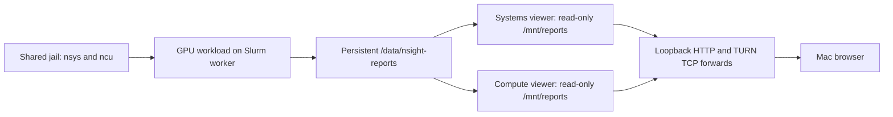

# Nsight profiling and browser analysis

The Soperator integration installs both profiling CLIs in the shared Slurm jail
and runs two independent browser viewers. Login and worker nodes see the same
tools and persistent reports. Your Mac needs `kubectl` and a browser.

Printed access, password-retrieval and recovery commands use the CLI's shared
light-gray highlight in color-enabled terminals. Copy only the command text;
labels remain separate, and redirected output stays plain.



## Install on Soperator

Start from a successfully accepted Soperator deployment with matching local
configuration and generated artifacts. Finish pending deployment or ordinary
application changes before installing profiling. The target must have an
accepted persistent `/data` submount; the installer resolves its actual PVC and
checks PVC/PV identities. It never assumes a claim named `jail-pvc`.
Before applying viewers, the ordinary app owner requires Helm 4 and checks Flux
resources and releases across all statuses; failed or pending releases still
prevent automatic adoption.

Both viewers use the `nsight-streamer-auth` Secret in `soperator`, with nonempty
`username` and `password` keys. Installation defaults to the login wizard when
the Secret is missing:

```bash
nebius-cxcli soperator profiling install ./config.yaml --target TARGET
```

Installation shows a spinner, a description and elapsed time for preparation,
cluster/storage checks, login Secret I/O, package prerequisites and resolution,
installation in the shared jail, and verification. Credential input runs without
an active spinner; viewer deployment uses its existing progress display.
Redirecting output produces bounded `START`/`OK`/`FAILED` phase lines instead
of terminal animations. A running spinner indicates a wait, not a percentage
complete or proof that a remote Job is healthy.

The wizard defaults the username to `admin` and hides the password and
confirmation. Empty or whitespace-only passwords are rejected and prompted again;
valid password characters are preserved exactly. Cancellation stops before
Secret creation, configuration publication or package Jobs. A needed prompt
without a terminal fails with guidance instead of silently changing modes.
Automation can pipe a password from its secret provider into
the same command with `--password-stdin`; use `--username NAME` to override the
new username. Do not put password literals in command arguments or shell history.
`--password-stdin` selects noninteractive input automatically; combining it with
explicit `--interactive` is rejected. `--no-interactive` disables the wizard and,
without stdin input, requires an existing Secret. Credentials stay in process
memory and the Kubernetes Secret, never config, generated values, receipts or output.

Existing Secrets are preserved: interactive mode reuses a valid existing Secret
without prompting, including on headless reruns; piped credentials must match
or fail without mutation. A healthy rerun never rotates credentials or creates
new package Jobs after successful acceptance. It verifies the installed tools
and reconciles the same viewers.
If an intact accepted receipt and exact cached package archives prove missing
regular files under `/opt`, or a missing owned activation profile/hook, the same
command restores only those omissions. Existing parent directories must be safe
and root-owned. Changed files, missing directories, symlink omissions, conflicting
package registration and missing receipts remain errors. Repair never touches
report contents; an empty reports directory is valid.

With `--no-interactive` and no stdin input, a missing Secret error identifies its name;
missing/empty key errors identify the required key. These checks precede
configuration publication and package Jobs. Access errors remain distinct from
absence. Secret creation additionally requires Kubernetes Secret create access.

```bash
nebius-cxcli soperator profiling install ./config.yaml --target TARGET --no-interactive
```

Successful installation and successful reruns print both viewer port-forward
commands and one password-retrieval command, introduced by:

```text
To display your Nsight browser password, run:
```

The printed command contains the verified persistent kubeconfig, exact context,
namespace and selected Secret. It reads only the password key using `kubectl`
JSONPath and decodes it with `base64 --decode`, followed by `&& printf '\n'`.
The newline keeps the shell prompt separate and prevents zsh's partial-line `%`
marker. It does not change the stored password or remove literal `%` characters.
You can save that command and run
it when you choose to reveal the password; it still requires your Kubernetes
Secret-read permissions. Cxcli never executes it or prints the password itself.
If persistent access cannot be verified, installation reports incomplete access
setup instead of printing a command that relies on a temporary kubeconfig.

Use `--secret-name NAME` for another Secret or `--reports-path /data/team/reports`
for another directory inside an accepted persistent submount. `TARGET` is the
project's explicit deployment target identifier.

### Show access commands later

```bash
nebius-cxcli soperator profiling show ./config.yaml --target TARGET
```

This command verifies the live viewers on your recorded accepted Soperator target
and prints exactly three highlighted commands: a Systems HTTP/TURN port-forward,
a Compute HTTP/TURN port-forward, and a shared-password retrieval command. Keep
each forward running in its own terminal, then open the displayed browser URLs.
Run the password command separately when you need to display the password.

Names, ports and Secret references come from the deployed viewers, so pending
local viewer changes do not replace the live instructions. Both viewers must be
ready and use the same password Secret key. Missing, conflicting or unverifiable
resources produce an error without a partial set of commands. Each forward binds
only to `127.0.0.1` and keeps the live TURN port number for browser streaming.

`show` needs working cluster authentication and Kubernetes Secret-read permissions.
It checks Secret metadata and nonempty key names without retrieving password
values. It never starts forwarding, runs the password command, reinstalls tools,
or changes cluster resources. As with `grafana show`, it may refresh the verified
target entry in local kubeconfig while preserving the current context. It honors
`CI` and `NEBIUS_CXCLI_PERSIST_LOCAL_KUBECONFIG`; when persistence is disabled, a
verified existing durable context is required. An access check does not qualify
browser streaming or report contents.

### Installation prerequisites

The jail must use Ubuntu 22.04 or 24.04 on amd64 or arm64, with Python 3, apt,
dpkg and the Ubuntu archive signing keyring. The installer downloads
checksum-pinned official NVIDIA packages, admits
only the pinned profilers and a bounded set of missing system libraries, and
uses the frozen transaction for installation. It rejects package removals,
upgrades of existing dependency packages, and CUDA/driver changes. Admission
fetches signed metadata from official Ubuntu HTTPS repositories into its own
cache, including when the fresh jail has no apt indexes. It does not replace the
jail's apt sources or ordinary package indexes. After rechecking dependency
resolution, installation passes only the admitted local artifacts to `dpkg`;
it does not fetch packages during installation.

The package Job prepares Pod-local resolver, device and temporary-directory
mounts before entering the jail. Its main container uses a digest-pinned official
Ubuntu 24.04 runtime with GNU coreutils and util-linux; mount-gate init containers
retain the upstream population image. Its rootfs container explicitly uses AppArmor
`Unconfined`, matching upstream jail population: containerd's default AppArmor
profile denies mount even with `SYS_ADMIN`. Only mount setup needs `SYS_ADMIN`; it drops
that capability and enables `no_new_privs` before any jail executable runs.
It requests no host devices, host namespaces or service-account token. Verification
mounts the jail read-only and checks the same capability boundary.

Nsight Systems **2026.4.1** and Nsight Compute **2026.2.1** match the two tool
images in NVIDIA's **2026.4.1** chart. Versioned package paths are discovered
from package metadata and prepended by `/etc/profile.d/99-nsight.sh`.
The managed `zz-nebius-nsight.sh` hook sources this same payload after Soperator's
CUDA PATH setup, so a new login shell selects the pinned tools. Installation
creates this exact root-owned hook atomically; conflicting files are rejected.
Verification checks it without writing and checks actual login-shell resolution.
Already-open shells can load them with:

```bash
source /etc/profile.d/99-nsight.sh
nsys --version
ncu --version
```

## Defaults

| Setting | Systems | Compute |
| --- | --- | --- |
| App and Helm release | `nsight-streamer` | `nsight-streamer-ncu` |
| Chart version | `2026.4.1` | `2026.4.1` |
| Tool | `nsys` | `ncu` |
| Namespace | `soperator` | `soperator` |
| Service | `ClusterIP` | `ClusterIP` |
| HTTP / TURN TCP ports | `30080` / `30478` | `30081` / `30479` |
| Display | Resize enabled, `1920x1080` | Resize enabled, `1920x1080` |
| Pod resources | Request 1 CPU / 2 GiB; limit 4 CPUs / 8 GiB | Same |
| Report mount | Read-only `/mnt/reports` | Read-only `/mnt/reports` |

Each viewer uses one software-rendered pod with no GPU request. Increase memory
for large reports through its App resource values. Namespace, claim and Secret
must match. Storage must support simultaneous mounts by the producer and both
viewers; `ReadWriteOncePod` is rejected. For `ReadWriteOnce` storage, configure
placement compatible with its node restriction. Soperator uses its existing
shared filesystem bindings and mount validation.

GUI configuration persistence is disabled. The generated HelmReleases disable
install, upgrade and uninstall hooks; post-render patches pin the images,
disable service-account token mounting and empty the unused Kubernetes Role.
Apply the generated Flux resources to retain these controls.

## Capture and view reports

Run the following inside a Slurm allocation with a GPU. Replace `./gpu_workload`
with your application. Capture Systems and Compute reports in separate runs:

```bash
source /etc/profile.d/99-nsight.sh
umask 022
report_dir="/data/nsight-reports/$USER"
mkdir -p "$report_dir"
nsys profile --output "$report_dir/systems-${SLURM_JOB_ID}" ./gpu_workload
ncu --export "$report_dir/compute-${SLURM_JOB_ID}" ./gpu_workload
```

For multi-rank work, include a rank identifier in every output prefix. Batch
scripts that do not start a login shell should source the profile explicitly.
The default reports directory is created with sticky shared-write permissions;
existing permissions are preserved. Producers must make intended reports and
their parent directories readable/traversable by the viewer's `nvidia` account.
The installer does not recursively change ownership or file permissions.

Open `.nsys-rep` in the Systems viewer and `.ncu-rep` in the Compute viewer under
`/mnt/reports`. Convert raw `.qdstrm` files with the matching Systems tool before
viewing, and complete any report-side processing before using the read-only
mount. If GPU counter or CPU sampling permissions prevent capture, arrange the
required permissions with the cluster administrator; installation does not
relax host profiling restrictions.

After readiness checks, installation prints **two complete commands** containing
the verified persistent kubeconfig path, exact context and namespace. Copy each
into its own Mac terminal and leave it running. The default mappings are:

```text
Systems: service/nsight-streamer-service       30080:30080 30478:30478
Compute: service/nsight-streamer-ncu-service   30081:30081 30479:30479
```

Open `http://localhost:30080` and `http://localhost:30081`, then use the credentials
from your login Secret. Both HTTP and TURN TCP mappings are required. Keep the
TURN local port equal to the configured TURN port. The emitted commands bind
only `127.0.0.1`; no Ingress or public Service is created. If a local port is
already occupied, stop its existing forward before retrying.

## Generic MK8s Apps

Run `nebius-cxcli component add ./config.yaml`, select either or both **Profiling**
Apps, and follow the viewer wizard. Supply an existing reports PVC, optional
relative subdirectory, namespace, Secret name/keys and resource settings.
The selected report subdirectory must already exist and be readable.
Component addition changes configuration only; render and apply through the
project's ordinary Apps workflow. Generic installation adds viewers, while the
producer environment supplies `nsys` and `ncu` itself.
For Soperator, enter credentials through the profiling installation wizard;
component-add keeps only the Secret reference.

## Recovery and jail upgrades

`profiling install` and ordinary `flux apply` share accepted-installation record
reconciliation. Before application effects, they bind stale initial-install
records to the accepted immutable release snapshot, cluster UID, capability and
jail image. Fresh protected-resource ownership, storage/rootfs identity, readiness,
restored maintenance and prior-writer termination must agree. Upgrades, foreign
identities and unknown ownership are not automatically retired.
Read-only report viewers may remain running. Every normal, init and ephemeral
container mount is checked; writable or ambiguous shared-volume access still
requires proven termination or the accepted Slurm controller ownership chain.

Reconciliation writes an immutable local receipt and conditionally updates the
exact old ConfigMap UIDs and versions. A rerun resumes partial updates under the
same local process and cluster fences. These records become `reconciled`, not
`complete`: this attests to current accepted installation state and preserves the
historical outcome as unknown. Future deployment acceptance retains independently
verified completion evidence for its exact final operation and desired bundle.
Both completion and historical-record updates recheck their fences after remote
reads or receipt preparation, immediately before the terminal cluster write.
No workload profiling or report-content check is part of installation readiness.

The Soperator command uses local process, local configuration and cluster
fences. Frozen stages retain package admission, install and verification results.
An interrupted client can rerun the same command with the same options; changed
inputs or target identities are rejected. Package admission/install each have
three bounded attempts within one Job pod. On a standalone install rerun, an exact
terminal failed Job whose Pods and containers have all stopped can reserve a
successor automatically. The reservation is checkpointed before creation, with
at most three total Jobs per stage; completed stages are reused. Old Jobs remain
immutable history. Missing Jobs, active or ambiguously terminated writers, changed
inputs and exhausted budgets stop safely. Passive jail upgrades retain explicit
recovery under their original promotion authority.
Standalone profiling attempts retain their original install/recover commands.
Generic `deploy` selects its own attempt from current artifacts and options.
Keep recorded Jobs and receipts for diagnosis and command-specific recovery.

Existing explicit recovery is available for passive upgrades and narrow runtime
repairs. Recover one failed stage with its exact retained Job UID:

Recovery selects exactly one local owner matching the target, stage and Job UID,
including a generic deployment's pre-promotion upgrade checkpoint. Ambiguous
matches fail before mutation. Active checkpoints retain their original inputs;
a completed install uses the current accepted configuration on its next run.

```bash
nebius-cxcli soperator profiling recover ./config.yaml \
  --target TARGET --stage install --job-uid FAILED_JOB_UID --dry-run
nebius-cxcli soperator profiling recover ./config.yaml \
  --target TARGET --stage install --job-uid FAILED_JOB_UID
```

For a retained standalone admission Job that failed on its initial private-mount
setup with the missing AppArmor setting, use the explicit narrow repair:

```bash
nebius-cxcli soperator profiling recover ./config.yaml \
  --target TARGET --stage admit --job-uid FAILED_JOB_UID \
  --repair runtime-mounts --dry-run
nebius-cxcli soperator profiling recover ./config.yaml \
  --target TARGET --stage admit --job-uid FAILED_JOB_UID --repair runtime-mounts
```

This adds only `appArmorProfile: {type: Unconfined}` to the rootfs container of
the successor Job. It requires exact terminal Job/Pod identity, successful init
gates, the initial mount-denial signature, unchanged installer bytes and no later
stages. Original manifests and failed attempts remain immutable. No arbitrary
patch is accepted; the successor counts toward the same three-Job stage limit.
After recovery, run the original installation command to continue.
For the exact retained `Login PATH selects another Nsight installation` failure
in a standalone install, use `--stage install --repair profile-order`, first with
`--dry-run`. This adds the same late activation hook used by fresh installations
before replaying the unchanged package installer. It preserves package admission,
installer bytes, failed history and the existing stage budget. It does not edit
CUDA startup files or replace a conflicting hook.
Recovery recognizes the standard region/zone labels Kubernetes adds to scheduled
Pods; declared labels and container execution settings remain identity-checked.

For the known population image with incompatible BusyBox commands, use
`--repair runtime-image` in the admission recovery command. It selects the pinned
Ubuntu execution image for the main container and supplies AppArmor `Unconfined`
if absent. Init images, commands, installer bytes and volumes remain unchanged.
Admission requires the exact initial BusyBox path-check failure or initial
mount-denial signature, with the same termination, identity and stage guards.
This correction can follow a recorded mount repair within the existing limit;
it never resets the attempt history or grants another Job budget.

`--stage` accepts `admit`, `install`, or `verify`. Recovery supports initial
profiling installation and customization of a passive replacement jail. It proves
the original operation, PVC/PV and installer identity, and the failed Job's exact
terminated Pod and containers. Upgrade recovery also requires an unsealed
pre-promotion owner and a fresh passive-volume consumer check. It reserves one
successor before creation and records its UID before waiting. Repeating the same
recovery command resumes that successor; each stage permits at most three total
Jobs, including the original. Earlier attempts remain immutable diagnostic history. Requests use bounded compressed
payloads. The upgrade journal stores one base manifest per stage and reserves
capacity before the first profiling Job.

Soperator service readiness recognizes a failed attempt as superseded history
only when both attempts retain their admitted workload and exact Job/Pod identity,
all containers have terminated, and the successful successor shares the operation,
stage and PVC UID at an equal or later fencing epoch. Missing or changed evidence,
unfinished attempts and unhealthy service Pods still block readiness. This check
does not validate profiling results or remove earlier attempts; installation and
recovery retain their own stage verification.

Recovery completes only the selected stage and prints the complete original
install or deploy command, preserving its options, for continuation. The original
workflow seals customization and performs promotion. `--dry-run` performs
read-only admission without acquiring leases or changing journals, Jobs or package
caches. Missing Jobs, missing termination evidence, absent historical package
preimages, exhausted attempts and changed installer hashes remain blocked.

Package admission freezes all package statuses, versions and architectures plus
the managed profile and receipt preimages. Recovery accepts unchanged baseline,
exact installed or unpacked packages and owned half-configured packages. Partial
packages must retain their admitted maintainer scripts. Half-installed or
`reinstreq` packages, unrelated pending work and unaccounted triggers are rejected.
Recovery uses only checksum-verified cached archives and configures only the
frozen remaining package set; it never runs a general package repair.

The installer rejects existing profile symlinks, including dangling links, before
package work. It updates a regular `99-nsight.sh` only when the installer receipt
proves ownership and its contents still match.

Viewer failures retain successful CLI installation evidence. Repeating the
command also repairs a missing local baseline after successful backend
acceptance, without reinstalling packages. If persistent kubeconfig verification
fails, output reports incomplete access setup instead of printing a command tied
to temporary files.

Jail replacement first validates the pristine upstream rootfs, then reapplies
the pinned profilers and verifies a separate customization receipt before
promotion. It checks the actual active jail again afterward. Report storage stays
on the persistent data submount. This process does not preserve all of `/opt`
or `/etc` from the old rootfs. Keep the CLI version that owns the frozen installer
hash for recovery; a different installer is rejected.

## Verification boundary

Source tests cover values, storage identity, unsafe paths, package transaction
limits, interrupted publication, customization receipts and command output.
Official chart rendering checks the generated patches. These checks do not prove
GPU capture or Mac browser streaming. Installation readiness checks tools,
viewers and access setup; it does not run user profiling workloads or require
report files. A separate, explicitly authorized GPU workflow test can capture
both report formats, open both viewers concurrently and repeat after jail
replacement.

Repeatable package-only validation uses disposable Docker fixtures on a matching
native host. Signed online acquisition is separate from network-disabled fresh
installation, interrupted-unpack recovery, interrupted activation, omission
repair, replay and read-only verification.
The harness exercises the production mount setup, capability removal, both
actual NVIDIA packages and login PATH. It records the resolved Ubuntu image
digest and frozen installer/repair-program hashes. It rejects emulation as native evidence.

```bash
uv run --locked --no-sync python scripts/verify_nsight_native.py \
  --ubuntu 24.04 --arch arm64 --output /tmp/nsight-native.json
uv run --locked --no-sync python scripts/verify_nsight_chart.py
```

The `nebius-cxcli-nsight` CI workflow covers Ubuntu 22.04/24.04 on native amd64
and arm64, plus SHA256-pinned official chart rendering with the generated
post-render patches. Local Ubuntu 22.04 and 24.04 ARM64 runs passed install, replay and read-only
verification in both fresh and interrupted-unpack scenarios against the current
installer hash. AMD64 execution remains pending CI. Kubernetes scheduling,
GPU capture, Mac streaming and live jail-upgrade replay remain unverified.

References: [NVIDIA chart 2026.4.1](https://catalog.ngc.nvidia.com/orgs/nvidia/devtools/helm-charts/nsight-streamer/2026.4.1),
[Systems installation](https://docs.nvidia.com/nsight-systems/InstallationGuide/index.html),
[Compute profiling guide](https://docs.nvidia.com/nsight-compute/ProfilingGuide/index.html).
