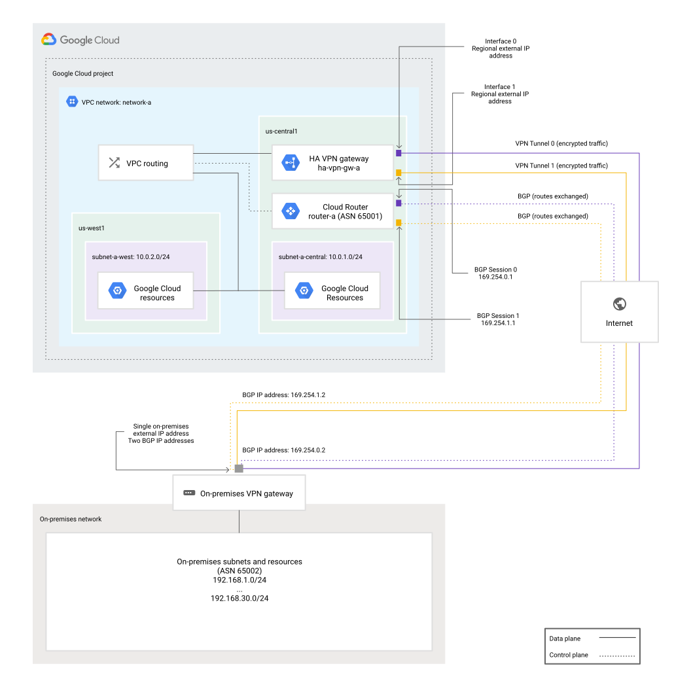

# Nebius VPN Gateway (VM-Based) — Design Document

Version: v0.3

## Purpose & Scope

Deliver a VM-based site-to-site VPN gateway for Nebius AI Cloud using IPsec (strongSwan) and routing (FRR for BGP, static as fallback). Provide a CLI orchestrator plus per-VM agent with idempotent configuration from a single YAML file, optionally merged with vendor peer configs. Support common cloud and on-premises peers (GCP HA VPN, AWS Site-to-Site VPN, Azure VPN Gateway, Cisco IOS).

## Goals & Non-Goals

**Goals:**

- IKEv2 (default) with IKEv1 fallback, PSK authentication
- Strong cryptography: AES-256, SHA-256/384/512, DH groups 14/20/24
- BGP routing (preferred) with static routing fallback
- Repeatable, idempotent deployments with minimal operator state
- Stable public IP preservation across VM recreation

**Non-goals (current scope):**

- ECMP in VPC route tables
- External NAT/Load balancing
- Multi-NIC support (platform limitation, code is future-ready)

## Architecture Overview

### Components

**Orchestrator CLI (`nebius-vpngw`):**

- Runs on operator laptop or CI/CD pipeline
- Reads YAML configuration and optional peer configs
- Manages VM lifecycle and IP allocations via Nebius SDK
- Pushes configuration to VMs over SSH
- Triggers agent reloads

**Gateway VM:**

- Ubuntu LTS with strongSwan, FRR, and Python
- Runs `nebius-vpngw-agent` systemd service
- Dedicated subnet (`vpngw-subnet`) for isolation

**Agent:**

- Single daemon per VM
- Renders strongSwan and FRR configurations
- Applies changes idempotently
- Persists state in `/etc/nebius-vpngw/last-applied.json`
- Reloads via SIGHUP

**Deployment Modes:**

- Single VM with multiple tunnels (active/active, VM is SPOF)
- Gateway group (N VMs) with per-tunnel pinning for VM-level HA

### Architecture Diagram



**HA VPN gateway connecting to a peer VPN gateway with one external IP address.** The HA VPN gateway uses two tunnels, both connecting to the single external IP address on the peer VPN gateway.

*Diagram courtesy of Google Cloud. Source: [VPN Topologies](https://cloud.google.com/network-connectivity/docs/vpn/concepts/topologies)*

## Nebius Networking Model

### VPC and Subnets

- One VPC network selected via `network_id` (optional; defaults to project's default VPC)
- Dedicated `vpngw-subnet` (/27 CIDR) created automatically if missing
- Workload subnets remain separate for security isolation

**Platform Constraint:** Currently 1 NIC per VM with 1 public IP. All tunnels share the same IP, differentiated by IKE/IPsec identifiers.

**Future-ready:** Configuration accepts `num_nics > 1` for when platform supports multi-NIC.

### Dedicated Subnet Rationale

- **Security isolation:** Limits blast radius of firewall misconfigurations
- **Routing clarity:** Simplifies HA failover and prevents asymmetric routing
- **IP hygiene:** Controlled CIDR for gateway infrastructure, separate from workloads
- **Policy separation:** Distinct egress controls without affecting application subnets
- **Operational safety:** Safer VM recreations with reduced ARP/ND noise

### Public IP Allocations

Configuration shape: `external_ips[instance_index][nic_index]` → IP string

**Behavior:**

- Omitted/empty: Auto-create IP allocations
- Provided: Use existing allocations
- Insufficient: Create missing allocations
- Auto naming: `{instance}-eth{N}-ip`

**Preservation:** Allocations are kept and reattached during VM recreation. No downtime for IP addresses, only for tunnel establishment.

**Examples:**

```yaml
# Single VM, single NIC (auto-allocate)
external_ips: []

# Single VM, existing IP
external_ips: [["203.0.113.10"]]

# Two VMs, existing IPs
external_ips: [["203.0.113.10"], ["203.0.113.20"]]
```

## Configuration Model

### YAML Structure

Single file `*.config.yaml` with four main sections:

1. **gateway_group:** VM infrastructure (instance count, specs, networking, IPs)
2. **gateway:** Routing identity (ASN, local prefixes, quotas)
3. **defaults:** Global VPN behavior (crypto, DPD, BGP settings)
4. **connections:** Peer gateways with tunnel definitions

### Merge Precedence

Tunnel settings override connection settings, which override peer-config, which override defaults.

### Environment Variables

Use `${VAR}` placeholders for secrets and environment-specific values. Missing variables are reported together before deployment.

### Template Generation

**Embedded template** in `config_template.py` is the source of truth, always aligned with schema:

```bash
# Create new config from embedded template
nebius-vpngw create-config my-vpn.config.yaml
```

Template includes comprehensive comments and examples. Files with `.config.yaml` extension are automatically git-ignored for security.

### Schema Validation

**Strict Pydantic-based validation** enforces configuration correctness:

**Features:**

- Rejects unknown fields (catches typos like `inner_ciddr`)
- Validates types (IPs, CIDRs, numbers, booleans)
- Enforces constraints (ASN ranges 64512-65534, /30 subnets, APIPA ranges)
- Checks logical consistency (BGP mode requires `remote_asn`)
- Verifies resource quotas

**API Versioning:**

- `version: 1` field required in all configs
- Future schema changes increment version number
- Backwards compatibility maintained

**CLI Integration:**

```bash
# Validate before deployment
nebius-vpngw validate-config my-vpn.config.yaml

# Validation runs automatically during apply
nebius-vpngw apply --local-config-file my-vpn.config.yaml
```

**Note:** The `validate-config` command takes the config file as a positional argument, not as `--local-config-file`. This is different from other commands like `apply` which use the flag syntax.

**Implementation:**

- Schema: `src/nebius_vpngw/schema.py` (Pydantic models)
- Validation: `src/nebius_vpngw/config_loader.py` (after env expansion)
- CLI command: `src/nebius_vpngw/cli.py` (`validate_config()`)

## Workflows & CLI

### Commands

**Configuration Creation:**

```bash
nebius-vpngw create-config <config-file>
```

Creates new configuration file from embedded template with comprehensive comments. Warns if filename doesn't end with `.config.yaml` (security best practice). Use `--force` to overwrite existing files.

**Configuration Validation:**

```bash
nebius-vpngw validate-config <config-file>
```

Validates configuration against schema without deployment. Performs full validation including types, constraints, and logical consistency. Returns exit code 0 (valid) or 1 (invalid). Use before deployment to catch errors early.

**Deployment:**

```bash
nebius-vpngw apply --local-config-file <file>
```

Deploy or update gateway. Automatically validates schema before deployment. Typical flow: parse args → load YAML → validate schema → merge peer configs → ensure network/subnet → ensure VMs + allocations → push config via SSH → reload agent → reconcile routes (static mode).

Flags: `--peer-config-file` (repeatable), `--recreate-gw`, `--project-id`, `--zone`

**Status & Monitoring:**

```bash
nebius-vpngw status --local-config-file <file>
nebius-vpngw list-routes --local-config-file <file>
nebius-vpngw add-routes --local-config-file <file>
```

**Default Behavior:**

- With config present: shows status
- No config: creates template from embedded source

### Peer Import & Merging

Vendor parsers (GCP/AWS/Azure/Cisco) normalize peer templates. Merger fills only missing fields—YAML topology is never overridden. Merge precedence: tunnel > connection > peer-config > defaults.

## Routing Modes & Local Prefixes

### Modes

- **BGP (preferred):** Dynamic routing with FRR, automatic route learning
- **Static:** Manual route configuration, simpler but less flexible

Global default under `defaults.routing.mode`; override per connection/tunnel.

### Local Prefixes

`gateway.local_prefixes` is the **single source of truth** for Nebius-side networks.

**BGP mode:** Advertised to peers when `advertise_local_prefixes: true`

**Static mode:** Used as `leftsubnet` in IPsec unless `tunnel.static_routes.local_prefixes` overrides

## IPsec Configuration

### strongSwan

- Policy-based or route-based (VTI interfaces)
- IKEv2 default, IKEv1 fallback configurable
- PSK authentication
- DPD (Dead Peer Detection) for tunnel liveness

### VTI Interfaces

Uses Linux kernel's VTI (Virtual Tunnel Interface) with strongSwan marks for proper route-based VPN:

- Creates `vti0`, `vti1`, etc. interfaces
- Each tunnel gets unique mark via `mark=%unique` in strongSwan config
- BGP sessions run over VTI interfaces using APIPA inner IPs
- Marks passed to custom updown script via `PLUTO_MARK_OUT` and `PLUTO_MARK_IN`

**VTI Setup:**

- strongSwan assigns unique marks automatically with `mark=%unique`
- Custom updown script (`ipsec-vti.sh`) creates VTI interfaces on tunnel establishment
- VTI interface created with: `ip link add vti{N} type vti okey <mark_out> ikey <mark_in>`
- Inner APIPA addresses assigned to VTI interfaces for BGP peering
- MTU set to 1387 (GCP MTU 1460 - IPsec overhead 73 bytes)

**Why VTI:**

- Route-based VPN allows BGP traffic over encrypted tunnels
- Works with `0.0.0.0/0` traffic selectors (required by GCP HA VPN)
- Supports asymmetric routing with proper sysctls (`rp_filter=2`)
- VTI interfaces can be referenced in FRR BGP neighbor configuration

### Crypto Proposals

**IKE (Phase 1):**

- `aes256gcm16-prfsha256-modp2048` (modern AEAD)
- `aes256-sha256-modp2048` (compatible)
- `aes256-sha1-modp1024` (legacy fallback)

**ESP (Phase 2):**

- `aes256gcm16-modp2048` (modern AEAD)
- `aes256-sha256-modp2048` (compatible)
- `aes256-sha1-modp1024` (legacy fallback)

## BGP Configuration

### FRR Setup

- `bgpd` daemon for BGP routing
- Runs over VTI interfaces using APIPA inner IPs
- Configurable timers: hold time (60s), keepalive (20s)
- Graceful restart enabled by default

### APIPA Inner IPs

- Must use /30 subnet in 169.254.0.0/16 range
- Example: `169.254.10.0/30` → usable IPs are `.1` and `.2`
- `.0` is network address, `.3` is broadcast (unusable)
- Each tunnel requires unique /30 subnet

### BGP Session Requirements

1. IPsec tunnels must be ESTABLISHED first
2. VTI interfaces must be up with assigned inner IPs
3. BGP peer must be reachable via inner_remote_ip
4. ASN configuration must match on both sides
5. FRR 10.x recommended (8.4.4 has route installation bugs)

### Common BGP Issues

- **No OPEN messages:** IPsec tunnel not established or VTI interface down
- **OPEN errors:** ASN mismatch between peers
- **Routes not installed:** FRR 8.4.4 bug, upgrade to 10.x
- **Policy errors:** Add `no bgp ebgp-requires-policy` to config

## Static Routes Configuration

### VPC Route Management

For static routing mode, CLI can manage VPC routes:

```bash
nebius-vpngw add-routes --local-config-file <file>
```

Creates static routes pointing to gateway VMs for `connection.remote_prefixes`.

### Per-Tunnel Static Routes

Override global `gateway.local_prefixes` per tunnel:

```yaml
tunnels:
  - name: tunnel-1
    static_routes:
      local_prefixes:
        - "10.0.0.0/16"  # Override for this tunnel only
```

## Security Hardening

### Applied via cloud-init at VM Creation

- SSH key-only authentication, root login disabled
- Fail2ban for SSH intrusion prevention
- UFW firewall (allows IPsec UDP 500/4500, ESP)
- auditd for command and config file monitoring
- Automated security updates (unattended-upgrades)
- IP forwarding enabled, ICMP redirects disabled

### Firewall Management

Agent synchronizes UFW rules with active tunnels:

- Adds peer IPs dynamically
- Removes stale peer IPs
- VTI interfaces are NOT filtered (internal encrypted traffic)

### Routing Guard

Production-grade validation:

- Removes table 220 policy routes (causes asymmetric routing)
- Detects broad APIPA routes (169.254.0.0/16)
- Identifies orphaned routes (routes without active tunnels)
- Structured logging with metrics

## Agent State Management

### Idempotent Applies

Agent compares desired state with `/etc/nebius-vpngw/last-applied.json`:

- Only renders configs if state changed
- Only reloads services if configs changed
- Atomic file updates with temp files

### Service Management

- `nebius-vpngw-agent.service`: Main agent daemon
- `strongswan-starter.service`: IPsec daemon
- `frr.service`: Routing daemon

Reload triggers: `systemctl reload` (SIGHUP)

## Monitoring & Status

### Status Command

```bash
nebius-vpngw status --local-config-file <file>
```

**Reports:**

- Tunnel status (ESTABLISHED, CONNECTING, etc.)
- BGP session state and prefix counts
- Service health (agent, strongSwan, FRR)
- Routing table health (table 220, APIPA routes, orphaned routes)

### Tunnel Status

Per-tunnel information:

- Gateway VM name
- Peer IP address
- Encryption algorithm
- Uptime
- BGP state (for BGP tunnels)

### System Health

Service status for each gateway VM:

- `nebius-vpngw-agent`: active/failed
- `strongswan-starter`: active/failed
- `frr`: active/failed

### Routing Health

Per-VM routing validation:

- Table 220 check: OK/WARNING
- Broad APIPA detection: OK/WARNING
- Orphaned routes count
- Overall health: Healthy/Degraded

## Peer Config Import

### Supported Vendors

- **GCP HA VPN:** Parses Cloud Router config exports
- **AWS Site-to-Site VPN:** Parses downloadable config files
- **Azure VPN Gateway:** Parses exported configurations
- **Cisco IOS:** Parses IOS config snippets

### Usage

```bash
nebius-vpngw apply \
  --local-config-file ./nebius-vpngw.config.yaml \
  --peer-config-file ./gcp-ha-vpn.txt \
  --peer-config-file ./aws-vpn.xml
```

### Merge Behavior

Peer configs fill only **missing** fields:

- PSKs (pre-shared keys)
- Remote public IPs
- Crypto proposals
- ASNs
- Inner IPs (for BGP)

Your YAML topology and explicit values are never overridden.

## VM Management

### VM Lifecycle

- **Create:** Full provisioning with cloud-init
- **Update:** Config push + agent reload (no recreation)
- **Recreate:** Explicit `--recreate-gw` flag required

### VM Diff Detection

Agent compares desired vs actual VM specs:

- Platform, preset, disk size/type
- NIC count
- Public IPs (preserved across recreation)

### Public IP Preservation

During recreation:

1. Detach allocations from old VM
2. Delete old VM
3. Create new VM
4. Reattach allocations to new VM

**Downtime:** Tunnel establishment time only, IPs never change.

## Development Workflow

### Agent Development

1. Modify agent code in `src/nebius_vpngw/agent/`
2. Rebuild wheel: `poetry build`
3. Deploy: `nebius-vpngw apply` (uploads new wheel automatically)

Agent is installed on remote VMs, not in local virtualenv.

### Testing Changes

```bash
# Validate schema
nebius-vpngw validate-config test.config.yaml

# Dry-run (hidden flag)
nebius-vpngw apply --local-config-file test.config.yaml --dry-run

# Deploy to test environment
nebius-vpngw apply --local-config-file test.config.yaml
```

### Dependency Upgrades

```bash
# Update pyproject.toml version constraints
# Rebuild wheel (cleans old ones automatically)
poetry build -f wheel

# Deploy with new dependencies
nebius-vpngw apply --local-config-file test.config.yaml
```

## Project Structure

```text
├── nebius-vpngw.config.yaml              # User configuration (git-ignored)
├── src/nebius_vpngw/
│   ├── __main__.py                       # Python module entry point
│   ├── cli.py                            # CLI orchestrator (nebius-vpngw command)
│   ├── config_loader.py                  # YAML parser and peer config merger
│   ├── schema.py                         # Pydantic schema for YAML validation
│   ├── config_template.py                # Embedded YAML template (source of truth)
│   ├── build.py                          # Binary build utilities
│   ├── vpngw_sa.py                       # Service account management
│   ├── agent/
│   │   ├── main.py                       # On-VM agent daemon
│   │   ├── frr_renderer.py               # FRR/BGP config renderer
│   │   ├── strongswan_renderer.py        # strongSwan/IPsec config renderer
│   │   ├── routing_guard.py              # Declarative route management & cleanup
│   │   ├── firewall_manager.py           # UFW firewall rule synchronization
│   │   ├── tunnel_iterator.py            # Centralized tunnel enumeration
│   │   ├── state_store.py                # Agent state persistence
│   │   ├── status_check.py               # Tunnel/BGP/service health checks
│   │   └── sanity_check.py               # Routing invariant validation tool
│   ├── deploy/
│   │   ├── vm_manager.py                 # VM lifecycle (create/delete/recreate)
│   │   ├── vm_diff.py                    # VM configuration change detection
│   │   ├── route_manager.py              # VPC route management (static mode)
│   │   └── ssh_push.py                   # Package/config deployment over SSH
│   ├── peer_parsers/
│   │   ├── gcp.py                        # GCP HA VPN config parser
│   │   ├── aws.py                        # AWS Site-to-Site VPN config parser
│   │   ├── azure.py                      # Azure VPN Gateway config parser
│   │   └── cisco.py                      # Cisco IOS config parser
│   └── systemd/
│       ├── nebius-vpngw-agent.service    # Agent systemd unit
│       └── ipsec-vti.sh                  # VTI interface creation script
```

### Module Descriptions

**Orchestrator (runs on operator machine):**

- `cli.py`: Main CLI entry point, orchestrates VM provisioning and config deployment
- `config_loader.py`: Parses YAML, merges peer configs, expands env vars, validates schema
- `schema.py`: Pydantic models for strict validation with type checking and constraints
- `config_template.py`: Embedded YAML template, source of truth, always aligned with schema
- `vpngw_sa.py`: Service account lifecycle for API authentication
- `build.py`: Utilities for building standalone binaries (PyInstaller)

**Agent (runs on gateway VM):**

- `main.py`: Agent daemon, renders configs, applies idempotently, handles SIGHUP reload
- `frr_renderer.py`: Generates FRR BGP configuration from YAML
- `strongswan_renderer.py`: Generates strongSwan IPsec configuration
- `routing_guard.py`: Enforces routing invariants, removes problematic routes
- `firewall_manager.py`: Synchronizes UFW rules with active tunnels
- `tunnel_iterator.py`: Centralized tunnel enumeration for consistent indexing
- `state_store.py`: Persists last-applied state for idempotency
- `status_check.py`: Collects health metrics for status command
- `sanity_check.py`: Standalone routing validation tool

**Deployment:**

- `vm_manager.py`: VM lifecycle using Nebius SDK
- `vm_diff.py`: Detects VM changes requiring recreation
- `route_manager.py`: Manages VPC static routes (static mode only)
- `ssh_push.py`: Deploys agent package and config via SSH/SFTP

**Peer Config Parsers:**

- `gcp.py`, `aws.py`, `azure.py`, `cisco.py`: Parse vendor-specific configs
