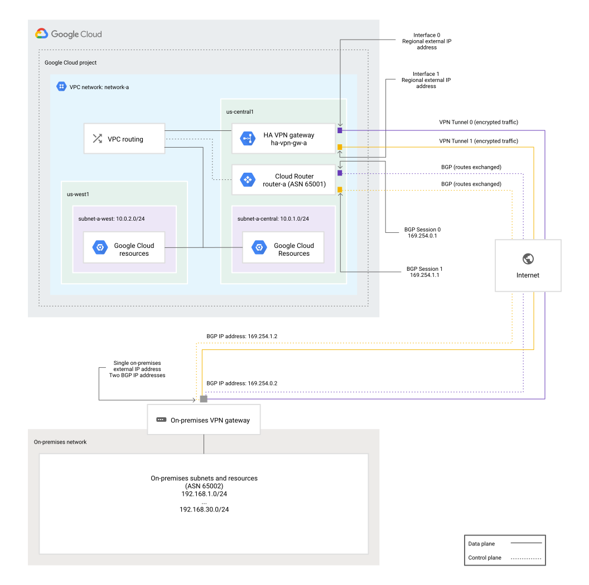

# Nebius VPN Gateway (VM-Based) — Design Document

> Version: v0.5.1
> Designed by: Reza Bahmanzadeh, Nebius Professional Services, CX Org.
> Copyright 2025 Nebius B.V.
> Licensed under the Apache License, Version 2.0

## Table of Contents

- [XFRM Mode Summary (current, required)](#xfrm-mode-summary-current-required)
- [Purpose & Scope](#purpose--scope)
- [Goals & Non-Goals](#goals--non-goals)
- [Architecture Overview](#architecture-overview)
- [Nebius Networking Model](#nebius-networking-model)
- [Configuration Model](#configuration-model)
- [Workflows & CLI](#workflows--cli)
- [Routing Modes & Local Prefixes](#routing-modes--local-prefixes)
- [IPsec Configuration](#ipsec-configuration)
- [BGP Configuration](#bgp-configuration)
- [Failover](#failover)
- [Static Routes Configuration](#static-routes-configuration)
- [XFRM Routing Stack](#xfrm-routing-stack)
- [Security Hardening](#security-hardening)
- [Agent State Management](#agent-state-management)
- [Monitoring & Status](#monitoring--status)
- [Peer Config Import](#peer-config-import)
- [VM Management](#vm-management)
- [Development Workflow](#development-workflow)
- [Project Structure](#project-structure)
- [Tips & Troubleshooting](#tips--troubleshooting)

> Note: Legacy VTI support has been removed. XFRM interfaces are the only supported mode going forward.

## XFRM Mode Summary (current, required)

- XFRM netdevices (`xfrm0`, `xfrm1`, …) bound via `if_id` in strongSwan; no marks or updown scripts.
- strongSwan connections are loaded via `swanctl` (VICI). `ipsec.conf` is a minimal starter-only config; tunnel CHILD_SAs include `if_id_in/if_id_out` for deterministic XFRM binding.
- Traffic selectors: local side is scoped to the tunnel’s inner /30 plus `gateway.local_prefixes`; remote stays `0.0.0.0/0`. This keeps SSH/ping to the public IP off the tunnel while allowing any remote prefixes to traverse.
- Routing hygiene: table 220 is removed; the broad `169.254.0.0/16` DHCP route is removed while preserving metadata routes (`169.254.169.x`). Prevents policy routing and APIPA from stealing tunnel/management traffic.
- Sysctl: `rp_filter=0` on all/default/eth0 (required for XFRM), IP forwarding enabled, redirects off, ARP hardened.
- Firewall: UFW allows SSH from management CIDRs (or anywhere if not configured), IPsec (UDP 500/4500, ESP) from peer IPs, traffic from local VPC subnets for forwarding, ICMP for troubleshooting, and permits all traffic on tunnel interfaces (xfrm*). BGP (TCP 179) is reachable only over xfrm* between APIPA peers (169.254.x.x), which only exist after IPsec decryption; no TCP/179 on eth0. Everything else inbound on eth0 is denied.

> Public (eth0):   IKE / ESP only, SSH, ICMP
> Tunnel (xfrm*):  BGP (tcp/179), ICMP, routed traffic

- Interfaces must exist before IPsec brings up CHILD_SAs; agent creates XFRM devices and assigns inner IPs/routes before FRR reload.

## Purpose & Scope

Deliver a VM-based site-to-site VPN gateway for Nebius AI Cloud using IPsec (strongSwan) and routing (FRR for BGP, static as fallback). Provide a CLI orchestrator plus per-VM agent with idempotent configuration from a single YAML file, with optional peer-config import to generate that YAML. Support common cloud and on-premises peers (GCP HA VPN, AWS Site-to-Site VPN, Azure VPN Gateway, Cisco IOS).

This project is an open source, self-service, VM-based VPN gateway. It is not a managed Nebius VPN service.

## Goals & Non-Goals

**Goals:**

- IKEv2 default; IKEv1 optional (disabled by default), PSK authentication
- Strong cryptography: AES-256, SHA-256/384/512, DH groups 14/20/24
- BGP routing (preferred) with static routing fallback
- Repeatable, idempotent deployments with minimal operator state
- Stable public IP preservation across VM recreation

**Non-goals:**

These features are not currently implemented but may be considered for future enhancements:

- **Multi-VM HA for one routed prefix:**
  - *What it means:* More than one gateway VM safely carrying the same site's routed prefixes as a coordinated HA service
  - *Current limitation:* `gateway_group` only orchestrates independent gateway VMs; it does not create a clustered control plane or clustered dataplane
  - *Why it matters:* If the same prefix becomes active on more than one gateway VM, you create multiple active paths and reintroduce the ECMP/asymmetric-routing problem this design avoids
  - *Status:* Not supported in current releases

- **ECMP (Equal-Cost Multi-Path) in VPC route tables:**
  - *What it does:* Allows load balancing traffic across multiple gateway VMs for the same destination prefix
  - *Current limitation:* VPC routes point to a single next-hop (one gateway VM per route)
  - *Benefit:* Would enable automatic traffic distribution and higher aggregate throughput for high-bandwidth workloads
  - *Status:* Nebius VPC platform does not currently support ECMP routing

- **External NAT/Load balancing:**
  - *What it does:* Single public IP distributed across multiple gateway VMs for incoming VPN connections
  - *Current limitation:* Each gateway has its own public IP; peers must configure multiple tunnels
  - *Benefit:* Would simplify peer configuration and enable transparent gateway VM scaling
  - *Status:* Requires platform-level load balancer integration for IPsec traffic

- **Multi-NIC support:**
  - *What it does:* Multiple network interfaces per gateway VM for traffic separation (management, tunnel, internal)
  - *Current limitation:* Nebius platform currently limits VMs to 1 NIC with 1 public IP
  - *Benefit:* Would improve security isolation and enable dedicated high-throughput tunnel interfaces
  - *Status:* Configuration is future-ready (accepts `num_nics > 1`), awaiting platform support

## Architecture Overview

### Components

**Orchestrator CLI (`nebius-vpngw`):**

- Runs on operator laptop or CI/CD pipeline
- Reads YAML configuration; peer configs can be imported to generate YAML
- Manages VM lifecycle and IP allocations via Nebius SDK
- Pushes configuration to VMs over SSH
- Triggers agent reloads

**Gateway VM:**

- Ubuntu LTS with strongSwan, FRR, and Python
- Runs `nebius-vpngw-agent` systemd service
- Dedicated gateway subnet (default name: `vpngw-subnet`) for isolation

**Agent:**

- Single daemon per VM
- Renders strongSwan and FRR configurations
- Applies changes idempotently
- Persists state in `/etc/nebius-vpngw/last-applied.json`
- Reloads via SIGHUP

**Deployment Modes:**

- Single VM with multiple tunnels and multiple peer `connections` (current releases use active/passive per connection; the VM remains a SPOF)
- Gateway group (N VMs) with per-tunnel pinning for orchestration across independent VMs

**Current HA Boundary:**

- Active/passive HA is supported only at the tunnel level inside a single gateway VM
- Each gateway VM must keep exactly one active tunnel per connection
- `gateway_group` is an orchestration grouping, not a clustered gateway service
- Creating multiple gateway VMs does not provide shared control-plane state or shared dataplane ownership for a single routed prefix
- Multi-VM HA for one prefix is not supported today

### Architecture Diagram



**HA VPN gateway connecting to a peer VPN gateway with one external IP address.** The HA VPN gateway uses two tunnels, both connecting to the single external IP address on the peer VPN gateway.

*Diagram courtesy of Google Cloud. Source: [VPN Topologies](https://cloud.google.com/network-connectivity/docs/vpn/concepts/topologies)*

## Nebius Networking Model

### VPC and Subnets

- One VPC network selected via `gateway_group.network_id` (optional; see resolution logic below)
- Dedicated gateway subnet created automatically if missing
- Dedicated route table (`<gateway-subnet-name>-routing-table`) with default egress route
- Workload subnets remain separate for security isolation

**Network Resolution Logic:**

When `gateway_group.network_id` is not specified in the YAML config, the system auto-discovers the network using this priority order:

1. **Default network:** Looks for a network named `default-network` in the project
2. **Single custom network:** If no default network exists and exactly ONE custom network is found, uses that network
3. **Multiple networks:** If multiple custom networks exist (rare scenario), the deployment **fails** with an error asking the user to explicitly specify `gateway_group.network_id` in the YAML

This intelligent resolution handles the common case (default network or single VPC) while preventing ambiguity when multiple networks exist.

**Platform Constraint:** Currently 1 NIC per VM with 1 public IP. All tunnels share the same IP, differentiated by IKE/IPsec identifiers.

**Future-ready:** Configuration accepts `num_nics > 1` for when platform supports multi-NIC.

### Dedicated Subnet Rationale

- **Security isolation:** Limits blast radius of firewall misconfigurations
- **Routing clarity:** Simplifies HA failover and prevents asymmetric routing
- **IP hygiene:** Controlled CIDR for gateway infrastructure, separate from workloads
- **Policy separation:** Distinct egress controls without affecting application subnets
- **Operational safety:** Safer VM recreations with reduced ARP/ND noise
- **Capacity:** The gateway subnet can be pinned to an explicit private CIDR or auto-carved from the target VPC’s private pool. Auto-carving uses `gateway_group.subnet.prefix_length` (default `/24`). Explicit CIDRs can come from extended RFC1918 ranges after the network pool is updated.
- **Control-plane safety:** `add-routes-local` and `list-routes-local` target workload subnets whose effective CIDRs overlap `gateway.local_prefixes`. For explicit-pool subnets this comes from `spec.ipv4_private_pools`; for inherited-pool subnets (`use_network_pools=true`) it falls back to the effective CIDRs exposed in subnet status so shared-pool workloads can still receive VPN routes.

### Public IP Allocations

Configuration shape: `external_ips[instance_index][nic_index]` → IP string (flat lists are not supported)

**Behavior:**

- Omitted/empty: Auto-create IP allocations
- Provided: Use existing allocations
- Insufficient: Create missing allocations
- Auto naming: `{instance}-eth{N}-ip`

**Pre-allocation workflow:** `nebius-vpngw prep-network` can create the configured gateway subnet and reserve public IPs before peer setup. It is safe to rerun. If `gateway_group.external_ips` is empty, it allocates new IPs and writes them into the YAML. If `external_ips` is set, it verifies and allocates those specific IPs when needed. If an IP was just released, it waits briefly (~10s) and retries before failing.

**Preservation:** Allocations are kept and reattached during VM recreation. No downtime for IP addresses, only for tunnel establishment.

**Subnet constraint:** Nebius does not allow changing `subnet_id` on an existing public allocation. If you supply `external_ips` and the found allocation belongs to a different subnet than the target gateway subnet, we fail fast with guidance:

- Deploy in the original subnet/network so the allocation matches, **or**
- Remove the IP from `external_ips` to get a new allocation in the gateway subnet, **or**
- (Best effort) Manually release the old allocation and let the deployer request the same IP in the new subnet. If the pool allows it and the address is still free, it is reclaimed; otherwise the request fails or yields a different IP.

**Examples:**

```yaml
# Single VM, single NIC (auto-allocate)
external_ips: []

# Single VM, existing IP
external_ips: [["203.0.113.10"]]

# Two VMs, existing IPs
external_ips: [["203.0.113.10"], ["203.0.113.20"]]

# Two VMs, two NICs each (future multi-NIC example)
external_ips:
  - ["66.201.0.131", "66.201.0.132"]  # VM 0: NIC0, NIC1
  - ["66.201.0.133", "66.201.0.134"]  # VM 1: NIC0, NIC1
```

## Configuration Model

### YAML Structure

Single file `*.config.yaml` with four main sections:

1. **gateway_group:** VM infrastructure (instance count, specs, gateway subnet, IPs)
2. **gateway:** Routing identity (ASN, local prefixes, quotas)
3. **defaults:** Global VPN behavior (crypto, DPD, BGP settings)
4. **connections:** Peer gateways with tunnel definitions

### Merge Precedence

Tunnel settings override connection settings, which override peer-config, which override defaults.

### Environment Variables

Use `${VAR}` placeholders for secrets and environment-specific values. Missing variables are reported together before deployment.

### Template Generation

**Embedded template** in `config_template.py` is the source of truth, always aligned with schema:

```bash
# Create new config from embedded template
nebius-vpngw create-config my-vpn.config.yaml
```

Template includes comprehensive comments and examples. Files with `.config.yaml` extension are automatically git-ignored for security.

### Schema Validation

**Strict Pydantic-based validation** enforces configuration correctness:

**Features:**

- Rejects unknown fields (catches typos like `inner_ciddr`)
- Validates types (IPs, CIDRs, numbers, booleans)
- Enforces constraints (ASN ranges 64512-65534, /30 subnets, APIPA ranges)
- Checks logical consistency (BGP mode requires `bgp.remote_asn`)
- Verifies resource quotas

**API Versioning:**

- `version: 1` field required in all configs
- Future schema changes increment version number
- Backwards compatibility maintained

**CLI Integration:**

```bash
# Validate before deployment
nebius-vpngw validate-config my-vpn.config.yaml

# Validation runs automatically during apply
nebius-vpngw apply --local-config-file my-vpn.config.yaml
```

**Note:** The `validate-config` command takes the config file as a positional argument, not as `--local-config-file`. This is different from other commands like `apply` which use the flag syntax.

**Implementation:**

- Schema: `src/nebius_vpngw/schema.py` (Pydantic models)
- Validation: `src/nebius_vpngw/config_loader.py` (after env expansion)
- CLI command: `src/nebius_vpngw/cli.py` (`validate_config()`)

## Workflows & CLI

### Commands

**Configuration Creation:**

```bash
nebius-vpngw create-config <config-file>
```

Creates new configuration file from embedded template with comprehensive comments. Warns if filename doesn't end with `.config.yaml` (security best practice). Use `--force` to overwrite existing files.
If the target file already contains that exact template, rerunning the command is a no-op and exits successfully.

**Configuration Validation:**

```bash
nebius-vpngw validate-config <config-file>
```

Validates configuration against schema without deployment. Performs full validation including types, constraints, and logical consistency. Returns exit code 0 (valid) or 1 (invalid). Use before deployment to catch errors early.

**Network Preparation (pre-allocate public IPs):**

```bash
nebius-vpngw prep-network --local-config-file <file>
```

Ensures the configured gateway subnet and route table exist. If `gateway_group.external_ips` is empty, reserves public IPs, prints them, and writes them into the YAML.
If `gateway_group.network_id` is set, the command targets that existing Nebius VPC; otherwise it uses the same auto-discovery logic as `apply`. The command is safe to rerun.

**Deployment:**

```bash
nebius-vpngw apply --local-config-file <file>
```

Deploy or update gateway. Automatically validates schema before deployment. Typical flow: parse args → load YAML → validate schema → ensure network/subnet → ensure VMs + allocations → push config via SSH → reload agent → reconcile routes (static mode).
The command is safe to rerun and reuses matching infrastructure state.

Flags: `--recreate-gw`, `--project-id`, `--zone`

**Peer Config Import (generate YAML only):**

```bash
nebius-vpngw create-from-peer-config <output-config-file> \
  --peer-config-file ./gcp-ha-vpn.txt \
  --peer-config-file ./aws-vpn.xml
```

Creates a new YAML config by merging vendor peer configs into the embedded template.
No deployment is performed; review and validate before running `apply`.
If the generated output already matches the target file, rerunning the command is a no-op and exits successfully.

**Status & Monitoring:**

```bash
nebius-vpngw status --local-config-file <file>
nebius-vpngw list-routes-local --local-config-file <file>
nebius-vpngw list-routes-remote --local-config-file <file>
nebius-vpngw add-routes-local --local-config-file <file>
```

**Default Behavior:**

- With config present: shows status
- No config: creates template from embedded source

### Peer Import & Merging

Vendor parsers (GCP/AWS/Azure/Cisco) normalize peer templates. Peer import overlays parsed values onto the template while keeping topology intact. Peer values replace template defaults when present; missing fields remain for manual review.

## Routing Modes & Local Prefixes

### Modes

- **BGP (preferred):** Dynamic routing with FRR, automatic route learning
- **Static:** Manual route configuration, simpler but less flexible

Global default under `defaults.routing.mode`; override per connection/tunnel.

### Local Prefixes

`gateway.local_prefixes` is the **single source of truth** for Nebius-side networks.

**BGP mode:** Advertised to peers when `advertise_local_prefixes: true`

**Static mode:** Used for VPC route management and included in leftsubnet selectors

### Nebius Managed Kubernetes Notes

For a typical Nebius Managed Kubernetes deployment, use the stable worker-subnet CIDR in `gateway.local_prefixes`, not the current per-node Pod CIDRs.

- Worker nodes and Pod IPs commonly share the same Nebius VPC subnet CIDR; the per-node Pod `/24`s are dynamic allocator artifacts, not a stable routing contract.
- `add-routes-local` operates at the subnet route-table layer. Pods do not need custom routes if the worker subnet is selected by overlap with `gateway.local_prefixes`.
- `ClusterIP` remains a cluster-internal virtual IP. Even if service VIPs fall inside the same advertised subnet, remote networks should not use `ClusterIP` over VPN.
- Current Nebius MK8s clusters commonly use Cilium with `routing-mode: native`, `enable-endpoint-routes: true`, and `kube-proxy-replacement: true`.
- Cilium commonly exempts private destinations in `10.0.0.0/8`, `172.16.0.0/12`, `192.168.0.0/16`, and `169.254.0.0/16` from masquerading. For those destinations, remote peers may see Pod IPs as the source and must route/allow the cluster subnet accordingly.
- For stable remote consumption, use Pod IPs directly or expose services through a routable frontend (`NodePort`, `LoadBalancer`, or Ingress/Gateway), not `ClusterIP`.

### Remote Prefixes

`connection.remote_prefixes` has different semantics depending on routing mode:

| Routing Mode | remote_prefixes Usage |
| ------------ | --------------------- |
| **BGP** | Optional - acts as inbound filter/whitelist. If omitted, accepts all BGP routes. |
| **Static** | Required - used for kernel route installation via XFRM interfaces. |

**BGP mode:**

- **Optional** - BGP learns routes dynamically from peer
- If specified: Acts as **inbound filter** (prefix-list) - only listed prefixes accepted
- If omitted: All routes advertised by peer are accepted
- Routes installed automatically by FRR BGP daemon
- No manual enumeration needed for 100+ remote networks

**Static mode:**

- **Required** (or in `tunnel.static_routes.remote_prefixes`)
- Used for kernel route installation via XFRM interfaces (rightsubnet stays 0.0.0.0/0)
- Each remote network must be explicitly listed
- No dynamic learning

## IPsec Configuration

### strongSwan

- Route-based VPN using XFRM interfaces (default)
- IKEv2 default, IKEv1 optional (disabled by default)
- PSK authentication
- DPD (Dead Peer Detection) for tunnel liveness

### IPsec Interface Modes

The gateway supports two interface modes for IPsec tunnels:

#### XFRM Interface Mode (Default, Recommended)

Modern kernel XFRM netdevs bound to strongSwan CHILD_SAs via `if_id`:

- Creates `xfrm0`, `xfrm1`, etc. interfaces
- Each tunnel bound via `if_id_in/if_id_out` parameters (e.g., 100, 101)
- No marks or updown scripts required
- **Eliminates packet duplication** issue with 0.0.0.0/0 traffic selectors
- BGP sessions run over XFRM interfaces using APIPA inner IPs
- Cleaner architecture, better performance

**Configuration:**

```yaml
gateway:
  local_asn: 65010
  local_prefixes:
    - "10.0.0.0/16"
  ipsec_mode: xfrm-interface  # Default
```

**XFRM Setup:**

- strongSwan config uses `if_id_in=100, if_id_out=100` (no marks)
- Agent creates XFRM devices: `ip link add xfrm0 type xfrm dev eth0 if_id 100`
- Inner APIPA addresses assigned to XFRM interfaces for BGP peering
- MTU set on XFRM interfaces to parent MTU minus IPsec/NAT-T overhead (default 64 bytes)
  (e.g., 1450 -> 1386; can be rounded down to 1380 for extra headroom)

**MTU and PMTU Validation (Operational Guidance):**

- Effective tunnel MTU is the largest IP packet that can traverse the XFRM interface without fragmentation.
- Example: `eth0 MTU = 1450`, `xfrm MTU = 1386` (1450 - 64).
- ICMP overhead is 28 bytes (20 IP + 8 ICMP), so the maximum safe `ping -s` payload is:
  `1386 - 28 = 1358`.

```bash
# PMTU sanity check (should succeed)
ping -M do -s 1358 <remote-ip>

# If you round xfrm MTU down to 1380, use:
# ping -M do -s 1352 <remote-ip>
```

**Best practice before bulk transfers:**

- Keep TCP MSS clamping enabled on the gateway so forwarded TCP traffic never exceeds the route MTU.
- This is the production-safe way to avoid fragmentation for workload traffic.

```bash
iptables -t mangle -A FORWARD -p tcp --tcp-flags SYN,RST SYN -j TCPMSS --clamp-mss-to-pmtu
```

### Permanent MTU Strategy (XFRM)

The gateway enforces a conservative MTU policy so workloads don't rely on PMTUD alone:

- Always enable TCP MSS clamping on the gateway
- Enable TCP MTU probing
- Set XFRM MTU to parent MTU minus IPsec/NAT-T overhead (default 64 bytes)
- Keep eth0 MTU unchanged
- Expect PMTU ~1380-1386 for GCP HA VPN with NAT-T

**Rules applied by the agent:**

```bash
iptables -t mangle -A FORWARD -p tcp --tcp-flags SYN,RST SYN -j TCPMSS --clamp-mss-to-pmtu
# nftables equivalent:
nft add rule ip mangle forward tcp flags syn tcp option maxseg size set rt mtu
```

**Sysctl (persistent):**

```bash
net.ipv4.tcp_mtu_probing = 1
```

**Why XFRM:**

- Modern Linux kernel interface (5.4+)
- No packet duplication with 0.0.0.0/0 traffic selectors
- Cleaner separation: if_id binding vs mark-based routing
- Better performance and maintainability

#### VTI Mode (Removed)

Legacy Virtual Tunnel Interface support has been removed due to packet duplication issues and operational complexity. All deployments must use XFRM interfaces.

### Route-Based VPN Architecture

#### IPsec Traffic Selectors vs Routing

`leftsubnet` and `rightsubnet` in strongSwan define **only the IPsec Traffic Selectors (TS)** exchanged during IKE negotiation. They do **NOT install routes** and do **NOT control which networks are routed through the tunnel**.

**For route-based VPN (XFRM), use:**

```text
leftsubnet=<inner /30 + gateway.local_prefixes>
rightsubnet=0.0.0.0/0
```

leftsubnet is a comma-separated list of the tunnel inner /30 plus `gateway.local_prefixes`.

This configuration:

- Allows any remote prefix for the configured local selectors (inner /30 + `gateway.local_prefixes`)
- Permits the tunnel to carry:
  - BGP APIPA traffic (169.254.x.x)
  - All dynamically learned remote prefixes
  - All local prefixes advertised through BGP
  - Any number of enterprise networks (scalable)
- Does NOT create policy-based routing restrictions
- Eliminates the need for hundreds of traffic selectors

**Routing is controlled exclusively by:**

1. **Linux routing table:** `ip route add <prefix> dev xfrm0`
2. **BGP daemon (FRR):** Learned routes installed dynamically
3. **Static routes:** Manual kernel routes (in static mode)
4. **XFRM interfaces:** Bound via `if_id` from strongSwan

**What determines which traffic enters the tunnel:**

- **The routing table** → what prefixes point to the XFRM interface
- **BGP daemon** → which routes FRR installs dynamically
- **NOT** leftsubnet/rightsubnet → these are IPsec selector allow-lists, not route selection

**Why this matters:**

- **BGP scalability:** No need to reconfigure IPsec when remote networks change
- **Dynamic routing:** BGP can learn/install 100+ prefixes without IPsec restarts
- **APIPA support:** BGP peering IPs (169.254.x.x) work seamlessly
- **Simplified config:** No tunnel-level prefix enumeration required
- **Peer compatibility:** GCP HA VPN and AWS VPN require 0.0.0.0/0 selectors

**Encryption decision:**

- strongSwan binds CHILD_SAs to XFRM interfaces via `if_id`
- `ip link add xfrm0 type xfrm dev eth0 if_id <id>`
- Any packet routed through xfrmX gets encrypted by strongSwan
- No policy database (SPD) restrictions on prefixes

### local_prefixes vs remote_prefixes

The configuration fields `local_prefixes` and `remote_prefixes` have different meanings depending on the VPN mode:

| Mode   | local_prefixes → Remote Peer                               | remote_prefixes → Nebius VM                             |
|--------|------------------------------------------------------------|---------------------------------------------------------|
| BGP    | Advertised by FRR to peer via `network` statements         | Learned dynamically from peer BGP; no YAML required     |
| Static | Installed as static routes to XFRM interfaces + VPC routes | Installed as static kernel routes to XFRM interfaces    |

**BGP Mode:**

- `local_prefixes`: Networks advertised to the remote peer via BGP `network` statements in FRR
- `remote_prefixes`: Optional filter list; actual routes learned dynamically from BGP peer
- FRR installs all learned routes automatically

**Static Mode:**

- `local_prefixes`: Networks reachable via Nebius VPC; installed as kernel routes and VPC routes
- `remote_prefixes`: Networks behind the remote peer; installed as kernel routes to XFRM interfaces
- Agent installs routes explicitly: `ip route replace <prefix> dev xfrm0`

**Key Differences:**

- BGP: Remote prefixes are **dynamic** (no YAML config needed)
- Static: Remote prefixes must be **explicitly configured** in YAML
- Both modes: rightsubnet is 0.0.0.0/0; leftsubnet includes the inner /30 plus `gateway.local_prefixes`

### Crypto Proposals

**IKE (Phase 1):**

- `aes256gcm16-prfsha256-modp2048` (modern AEAD)
- `aes256-sha256-modp2048` (compatible)

**ESP (Phase 2):**

- `aes256gcm16-modp2048` (modern AEAD)
- `aes256-sha256-modp2048` (compatible)

## BGP Configuration

### FRR Setup

- `bgpd` daemon for BGP routing
- Runs over XFRM interfaces using APIPA inner IPs
- Configurable timers with a baseline 3:1 ratio (hold time = 3 × keepalive)
- Optional BFD for sub-second failure detection (disabled by default; peer support is vendor/platform specific)
- Graceful restart is optional; disable for faster withdrawal if needed
- Install policy: use FRR 10.x from the official repo without pinning a single build (repo rotations can remove older builds). Apply performs a fallback install if FRR is missing.

### Timer Best Practices (BGP + DPD)

- **3:1 baseline:** `hold_time = 3 × keepalive`, `dpd_timeout = 3 × dpd_interval`
- **Faster convergence:** Enable BFD instead of pushing BGP timers too low
- **Vendor check first:** BFD support and timer floors vary by peer; verify the peer docs before enabling it
- **Routing-first failover:** Keep BGP hold shorter than DPD timeout so routes withdraw before IPsec cleanup
- **Noisy links:** Increase timers if you see route flapping from transient loss

### APIPA Inner IPs

- Must use /30 subnet in 169.254.0.0/16 range
- Example: `169.254.10.0/30` → usable IPs are `.1` and `.2`
- `.0` is network address, `.3` is broadcast (unusable)
- Each tunnel requires unique /30 subnet

### BGP Session Requirements

1. IPsec tunnels must be ESTABLISHED first
2. XFRM interfaces must be up with assigned inner IPs
3. BGP peer must be reachable via inner_remote_ip
4. ASN configuration must match on both sides
5. FRR 10.x recommended (8.4.4 has route installation bugs)

### Common BGP Issues

- **No OPEN messages:** IPsec tunnel not established or XFRM interface down
- **OPEN errors:** ASN mismatch between peers
- **Routes not installed:** FRR 8.4.4 bug, upgrade to 10.x
- **Policy errors:** Add `no bgp ebgp-requires-policy` to config

### Active/Passive HA Mode

**Design Philosophy:**

The Nebius VPN Gateway operates in **Active/Passive mode** by default to guarantee symmetric routing for customer workloads. This ensures compatibility with default Linux and Windows networking stacks without requiring any workload-side configuration changes.

**Problem with ECMP (Equal-Cost Multi-Path):**

When both tunnels have equal BGP preference, the kernel uses ECMP load balancing:

- Parallel TCP flows (`iperf3 -P 4`) get distributed across tunnels
- Return packets may arrive via a different tunnel than outbound packets went
- Workload VMs with default `rp_filter` settings drop asymmetric return packets
- Result: Connection hangs, packet loss, intermittent failures

**Active/Passive Solution:**

| Tunnel Role | BGP local-preference | IPsec Status | BGP Status | Traffic Handling |
| ----------- | ------------------- | ------------ | ---------- | ---------------- |
| **Active** | 200 (higher = preferred) | UP | ESTABLISHED | Carries all data traffic |
| **Passive** | 100 (lower = standby) | UP | ESTABLISHED | Hot standby for failover |

**How It Works:**

1. **Both tunnels are UP** (IPsec CHILD_SA established, BGP sessions active)
2. **FRR applies route-map** with `local-preference` based on `ha_role` config:

   ```text
   route-map SET-LOCAL-PREF-200 permit 10
    set local-preference 200

   route-map SET-LOCAL-PREF-100 permit 10
    set local-preference 100
   ```

3. **Kernel routing table** installs only the higher-preference route (active tunnel)
4. **All flows** use the same tunnel → symmetric return paths → no rp_filter drops
5. **Automatic failover:** BGP switches to passive within the hold timer; with BFD enabled this can be sub-second
6. **Traffic selectors** include the tunnel inner /30 plus `gateway.local_prefixes` on **both** active and passive tunnels so the passive tunnel can carry data immediately after failover.

**Configuration Example:**

```yaml
defaults:
  # Optional; defaults to active-passive if omitted
  ha_mode: "active-passive"

connections:
  - name: "gcp-ha-vpn"
    routing_mode: bgp
    tunnels:
      - name: "gcp-ha-tunnel-1"
        ha_role: "active"   # Primary tunnel (local-pref 200)
        # ... tunnel config ...
      - name: "gcp-ha-tunnel-2"
        ha_role: "passive"  # Standby tunnel (local-pref 100)
        # ... tunnel config ...
```

**Tunnel Mode Configuration Reference:**

| Desired Mode | Config Required | Description |
| ------------ | --------------- | ----------- |
| **active** | `ha_role: "active"` **OR** omit the field (default) | Primary tunnel with BGP local-preference 200. **Keep only one tunnel active at a time** to ensure symmetric routing. |
| **passive** | `ha_role: "passive"` (**must be explicit**) | Standby tunnel with BGP local-preference 100. Provides hot standby for automatic failover. |
| **disable** | `ha_role: "disable"` (**must be explicit**) | Tunnel is completely skipped (no IPsec, no BGP). Use for maintenance or cost optimization. |

**Important:** The Active/Passive design requires **exactly one active tunnel** per connection **per gateway instance** to guarantee symmetric routing. Schema validation enforces this, and `defaults.ha_mode` is **required** and locked to `"active-passive"` (the only supported mode in current releases). If you omit `ha_role` on multiple tunnels, they will all default to `"active"` and create ECMP routing, which defeats the purpose of this design.

**Gateway-group boundary:** This rule stops at the gateway-VM boundary. If you create two gateway VMs and make the same site's prefixes active on both VMs, then each VM still has its own active tunnel and you end up with two active paths for the same prefix between Nebius and the customer network. That is the same class of multipath/asymmetric-routing problem described above. Current releases do not coordinate multiple VMs as a single HA service for one prefix, so multi-VM HA for one prefix is not supported today. `gateway_group` is only an orchestration grouping for provisioning and config distribution.

**Multi-connection note:** The Active/Passive rule is scoped per connection, not globally across the gateway VM. This is intentional for multi-site topologies where each connection usually represents a different remote site and a different set of prefixes. If two different active connections learn the same prefix, FRR can still install live multipath for that overlapping prefix. Current releases surface that condition as a warning in `nebius-vpngw status`; operators should treat it as a routing-domain overlap to fix, not as the intended steady state.

**Implementation note:** To allow the passive tunnel to carry data immediately after failover, **both tunnels** include `gateway.local_prefixes` in traffic selectors. This requires `if_id_in/if_id_out` binding via `swanctl` (VICI). The legacy `ipsec.conf` parser does **not** support `if_id_*`, so `swanctl` is mandatory for deterministic XFRM selection.

**Benefits:**

- ✅ **No workload VM changes required** (rp_filter stays at default)
- ✅ **Works with any OS** (Linux, Windows, RHEL, Ubuntu)
- ✅ **Fast failover** (BGP detects failure and switches routes)
- ✅ **Scalable** (handles `iperf3 -P 100` without packet loss)
- ✅ **Production-proven** (same design as AWS VGW, Azure VPN Gateway, Cisco/Juniper)

**Verification:**

After deployment, check that only one route is active:

```bash
# On VPN gateway:
ip route show 10.10.0.0/24
# Expected: Single nexthop via active tunnel
10.10.0.0/24 via 169.254.18.225 dev xfrm0 proto bgp metric 20

# On workload VM:
iperf3 -c 10.10.0.2 -t 10 -i 1 -P 4
# Expected: No packet loss, stable throughput
```

**Migration from ECMP:**

If you have existing ECMP configuration (both tunnels set to `ha_role: "active"`):

1. Change one tunnel to `ha_role: "passive"` in your YAML config
2. Deploy the updated configuration
3. BGP will converge within one hold-time period (default 6 seconds, or faster with BFD)
4. Verify with `ip route show` and test with `iperf3 -P 4`

### BGP MED (Multi-Exit Discriminator) for Peer-Side Path Selection

**What is MED?**

BGP MED (Multi-Exit Discriminator) is a BGP attribute that influences which path a remote peer chooses when multiple paths exist to the same destination. Unlike `local-preference` (which affects LOCAL routing decisions), MED is transmitted TO the peer and affects THEIR routing decisions.

- **Lower MED = preferred path** (opposite of local-preference where higher = preferred)
- **MED is non-transitive**: Not passed between AS boundaries (only visible to immediate peer)
- **Default MED = 0** if not set explicitly

**Active/Passive Design - Two Mechanisms Working Together:**

The Nebius VPN Gateway uses **both** local-preference and MED to enforce Active/Passive routing in **both directions**:

1. **Local-preference (inbound)**: Controls Nebius → GCP routing (Nebius egress traffic)
   - Applied to routes **received FROM** GCP
   - Active tunnel: local-pref 200 (Nebius prefers this path for outbound)
   - Passive tunnel: local-pref 100 (Nebius uses as backup)

2. **MED (outbound)**: Controls GCP → Nebius routing (GCP's return traffic)
   - Applied to routes **sent TO** GCP (Nebius local prefixes)
   - Active tunnel: MED=0 (GCP prefers this path for return traffic)
   - Passive tunnel: MED=100 (GCP uses as backup)

| Tunnel Role | Local-Pref (Inbound) | MED (Outbound) | Nebius Routing Decision | GCP Routing Decision |
| ----------- | -------------------- | -------------- | ----------------------- | -------------------- |
| **active** | 200 (prefer routes from GCP) | 0 (GCP prefers routes to Nebius) | Uses active tunnel for **egress** | Uses active tunnel for **return traffic** |
| **passive** | 100 (deprioritize routes from GCP) | 100 (GCP deprioritizes routes to Nebius) | Uses as backup | Uses as backup |

**Result**: **Symmetric routing** - both directions use the same tunnel, no ECMP, no asymmetric routing, no `rp_filter` issues.

**How It Works:**

1. **Inbound route-maps (local-preference)**: Control Nebius → GCP path selection

   ```text
   route-map SET-LOCAL-PREF-200 permit 10
    set local-preference 200  # Prefer routes learned from active tunnel

   route-map SET-LOCAL-PREF-100 permit 10
    set local-preference 100  # Deprioritize routes learned from passive tunnel

   neighbor 169.254.18.225 route-map SET-LOCAL-PREF-200 in   # Active tunnel
   neighbor 169.254.5.153 route-map SET-LOCAL-PREF-100 in    # Passive tunnel
   ```

2. **Outbound route-maps (MED)**: Control GCP → Nebius path selection

   ```text
   route-map ADVERTISE-ACTIVE permit 10
    match ip address prefix-list ADVERTISE-LOCAL
    set metric 0  # MED=0 sent to GCP (GCP prefers this path)

   route-map ADVERTISE-PASSIVE permit 10
    match ip address prefix-list ADVERTISE-LOCAL
    set metric 100  # MED=100 sent to GCP (GCP deprioritizes this path)

   neighbor 169.254.18.225 route-map ADVERTISE-ACTIVE out   # Active tunnel
   neighbor 169.254.5.153 route-map ADVERTISE-PASSIVE out   # Passive tunnel
   ```

3. **Peer behavior**: GCP Cloud Router receives Nebius routes with different MED values:
   - Route via active tunnel: `10.49.0.0/16` with MED=0 → **GCP prefers this path**
   - Route via passive tunnel: `10.49.0.0/16` with MED=100 → **GCP uses as backup**

4. **No GCP configuration needed**: GCP automatically uses MED for path selection - no manual configuration required on GCP side

**GCP Cloud Router Verification:**

GCP Cloud Router displays learned routes with their MED values converted to "priority" (lower = better):

```bash
gcloud compute routers get-status ROUTER_NAME --region=REGION --project=PROJECT_ID

# Example output:
bestRoutes:
- destRange: 10.49.0.0/16
  nextHopIp: 169.254.18.226  # Active tunnel
  priority: 0                 # MED=0 from Nebius

- destRange: 10.49.0.0/16
  nextHopIp: 169.254.5.154    # Passive tunnel
  priority: 100               # MED=100 from Nebius
```

**Verification Commands:**

**On Nebius Gateway - Check Outbound Advertisements (MED):**

```bash
# Verify MED values being sent TO GCP:
sudo vtysh -c "show bgp ipv4 unicast neighbors 169.254.18.225 advertised-routes"
sudo vtysh -c "show bgp ipv4 unicast neighbors 169.254.5.153 advertised-routes"

# Look for "metric" field - should see 0 for active, 100 for passive:
# *> 10.49.0.0/16     0.0.0.0                            0         32768 ?
#    Advertised to: 169.254.18.225
#    metric 0  <-- Active tunnel
```

**On Nebius Gateway - Check Inbound Routes (Local-Preference):**

```bash
# Verify local-preference for routes received FROM GCP:
sudo vtysh -c "show bgp ipv4 unicast"

# Look for routes with different LocPrf values:
# *>  10.10.0.0/24     169.254.18.225         100    200      0 65014 ?  # Active (LocPrf 200)
# *   10.10.0.0/24     169.254.5.153          100    100      0 65014 ?  # Passive (LocPrf 100)
```

**On GCP Cloud Router - Check Learned Routes (MED):**

```bash
# Verify GCP is receiving and using MED values from Nebius:
gcloud compute routers get-status ROUTER_NAME --region=REGION --project=PROJECT_ID

# Look for your Nebius prefixes with different priorities:
# Routes learned FROM Nebius (GCP's perspective):
# - destRange: 10.49.0.0/16
#   nextHopIp: 169.254.18.226  # Active tunnel
#   priority: 0                 # Best route (MED=0)
#
# - destRange: 10.49.0.0/16
#   nextHopIp: 169.254.5.154    # Passive tunnel
#   priority: 100               # Backup (MED=100)
```

**On GCP Console:**

Navigate to: **Hybrid Connectivity → VPN → Cloud Routers → [Your Router] → Details Tab → Learned Routes**

You should see your Nebius prefix (e.g., `10.49.0.0/16`) with:

- One route with **priority 0** or **MED 0** (active tunnel)
- One route with **priority 100** or **MED 100** (passive tunnel)

**Important Notes:**

- **No GCP configuration required**: Nebius sets MED outbound, GCP automatically uses it for path selection
- **Symmetric routing guaranteed**: Both directions use the same tunnel (active)
- **Automatic configuration**: MED and local-preference automatically derived from `ha_role`
- **BGP import-check disabled**: Uses `no bgp network import-check` to allow advertising `local_prefixes` without kernel routes

**Troubleshooting:**

If GCP still shows both routes with same priority:

1. **Verify MED is being sent**:

   ```bash
   sudo vtysh -c "show bgp ipv4 unicast neighbors <peer-ip> advertised-routes"
   ```

   Look for "metric" field in output

2. **Check BGP sessions are established**:

   ```bash
   sudo vtysh -c "show bgp summary"
   ```

   Both neighbors should show "Established" state

3. **Verify route-maps are applied**:

   ```bash
   sudo vtysh -c "show running-config" | grep -A 5 "route-map"
   ```

   Should see ADVERTISE-ACTIVE and ADVERTISE-PASSIVE with different metric values

4. **Check GCP learned routes**:

   ```bash
   gcloud compute routers get-status ROUTER_NAME --region=REGION
   ```

   Should show different priority values (0 vs 100)

5. **Test with tcpdump**: Confirm packets enter/exit via the same tunnel interface:

   ```bash
   sudo tcpdump -i xfrm0 -n icmp  # Should see both directions
   sudo tcpdump -i xfrm1 -n icmp  # Should see nothing or minimal backup traffic
   ```

## Failover

### Automatic Failover (Active/Passive)

- Both tunnels stay UP (IPsec + BGP), but only the **active** path is used for data.
- **Local selection:** FRR applies `local-preference` (active 200, passive 100) to pick the active path.
- **Peer selection:** MED (active 0, passive 100) nudges the peer to return on the same active tunnel.
- **Failure detection order (fastest → slowest):**
  - **BFD (optional):** sub-second detection when supported by the peer.
  - **BGP hold timer:** default 6s (keepalive 2s) when BFD is not active.
  - **DPD:** default 5s/15s (control-plane cleanup).

**Design rule:** Keep `BGP hold < DPD timeout` so routes withdraw before IPsec cleanup.

**BFD compatibility:** Treat BFD as an explicit peer capability, not a generic BGP feature. Enable it only when the peer vendor/platform docs say BFD is supported for that specific VPN/BGP workflow and the negotiated timers are compatible.

### Manual Failover (CLI)

Use the CLI to force traffic onto the passive tunnel by shutting down the active BGP neighbor (IPsec stays up):

```bash
# If exactly two tunnels exist, auto-select the passive tunnel
nebius-vpngw failover --local-config-file <file>

# If more than two tunnels exist, pass the passive tunnel name explicitly
# Multi-connection topologies normally fall into this explicit-selection path.
nebius-vpngw failover <passive-tunnel-name> --local-config-file <file>
```

The CLI resolves the selected tunnel back to its owning connection and
`gateway_instance_index`, then applies the BGP neighbor change only on that
gateway VM.

Tunnel names are required to be globally unique across the full config, so the
operator commands can safely target a tunnel by name without also requiring the
connection name.

The CLI help text is expected to mirror this model: operator commands should
describe tunnel-name selection in terms of the owning connection/instance, and
route-listing help should describe BGP output as scoped to the selected
connection on the owning gateway VM.

Configured active/passive roles remain declarative. `failover` is an operational
override that preserves the configured roles and lets `failback` restore the
configured steady state without rewriting YAML.

**Restore active tunnel:**

```bash
sudo vtysh -c "configure terminal" -c "router bgp <ASN>" -c "no neighbor <peer-ip> shutdown"
```

Or reapply config / restart FRR to reset running state.

## Static Routes Configuration

### VPC Route Management

Three route management commands with distinct purposes:

**1. Add local routes (Nebius VPC → Remote):**

```bash
nebius-vpngw add-routes-local --local-config-file <file>
```

Creates VPC route table entries for remote networks and selects the next-hop
from the gateway VM that owns each connection.

**Implementation Details:**

- **BGP mode**: Queries BGP-learned routes from the gateway VM(s) that own the target connection via SSH (`vtysh -c 'show bgp ipv4 unicast json'`)
  - Filters by `remote_prefixes` whitelist if configured
  - Filters out locally originated routes (next-hop 0.0.0.0)
  - Filters out overlapping local networks (from `gateway.local_prefixes`)
- **Static mode**: Uses `remote_prefixes` from YAML configuration
- `--summarize` collapses exact adjacent/covering prefixes per gateway next-hop allocation before writing Nebius VPC routes
- Finds workload subnets whose effective CIDRs match `gateway.local_prefixes`
- Resolves private IP allocations per gateway VM via Compute API
- Creates/reuses custom route tables for matching subnets
  - If subnet uses default route table: Creates custom RT and copies existing routes
  - Warns user about route table separation
- Large learned route sets can still hit Nebius per-route-table limits even
  when the tenant-wide `vpc.route.count` visible in the console is below quota. The API error
  `vpc.routetable.max-route-count` means the target subnet route table is full.
- Includes inherited parent-network subnets (`use_network_pools=true`) when their effective/status CIDRs overlap `gateway.local_prefixes`
- Creates route entries: destination = remote prefix, next-hop = the owning gateway VM's private IP
- Implements idempotency (skips existing routes)
- Reconciles stale FRR/BGP advertisement state before reporting so `list-routes-local` and `add-routes-local` reflect the current YAML

**2. List local routes (Nebius VPC → Remote):**

```bash
nebius-vpngw list-routes-local --local-config-file <file>
```

Lists VPC route table entries for workload subnets whose effective CIDRs match `gateway.local_prefixes`.

**Implementation Details:**

- Queries VPC API for workload subnets whose explicit or inherited effective CIDRs match `gateway.local_prefixes`
- Displays route table ID and routes for each subnet
- Shows destination CIDR and next-hop (resolves allocation IDs to IP addresses)
- Uses Rich tables for formatted output
- Detects stale live BGP advertisements, reloads the current resolved config on the gateway if needed, and then reports the refreshed advertisement state

**3. List remote routes (Remote → Nebius):**

```bash
nebius-vpngw list-routes-remote --local-config-file <file>
```

Lists routes on gateway VMs that direct traffic from remote sites to Nebius networks.

**Implementation Details:**

- **BGP mode**:
  - SSHs to gateway VMs and queries FRR: `vtysh -c 'show bgp ipv4 unicast json'`
  - Scopes displayed/imported paths to the selected connection's tunnel peer IPs on the owning gateway VM
  - When showing locally advertised routes, matches peer IPs against the owning gateway VM as well so repeated APIPA ranges on other instances do not mislabel connection/tunnel output
  - Extracts routes with next-hop IPs, AS paths, and status
  - Queries `ip route get <next-hop>` to determine outgoing XFRM interface
  - Filters out locally originated routes (next-hop 0.0.0.0)
  - Checks against `remote_prefixes` whitelist (shows allowed/not-allowed status)
  - Displays: Prefix, Next-Hop, Via (XFRM interface), AS Path, Status
- **Static mode**:
  - Agent installs kernel routes: `ip route replace <prefix> dev xfrmX` for each `remote_prefixes`
  - Compares YAML `remote_prefixes` with kernel routing table via `ip route show`
  - Shows installation status (installed/missing)
  - Routes installed automatically by strongSwan renderer after tunnel establishment

**Static Mode Route Installation:**

In static mode, the agent automatically installs kernel routes for all `remote_prefixes`:

```bash
# Example: For remote_prefixes: ["10.10.0.0/24", "10.11.0.0/16"]
ip route replace 10.10.0.0/24 dev xfrm0
ip route replace 10.11.0.0/16 dev xfrm0
```

This happens in `strongswan_renderer.py` after tunnel establishment.

**BGP vs Static Routing:**

| Aspect | BGP Mode | Static Mode |
| ------ | -------- | ----------- |
| **Traffic Selectors** | `0.0.0.0/0` (both sides) | `0.0.0.0/0` (both sides) |
| **Kernel Routes** | Installed by FRR BGP | Installed by agent from YAML |
| **remote_prefixes** | Optional filter/whitelist | Required, installed as routes |
| **Dynamic Learning** | Yes (via BGP) | No (manual YAML updates) |
| **Scalability** | 100+ networks, no config changes | Must enumerate each network |

## XFRM Routing Stack

### Architecture Overview

The VPN gateway uses a **multi-layer defense** strategy to ensure routing stability for XFRM (IPsec) tunnels:

1. **Dedicated Sysctl Configuration** (`/etc/sysctl.d/99-zzz-vpngw.conf`)
2. **Systemd Service Ordering** (UFW → strongSwan → FRR → agent)
3. **Self-Healing Routing Guard** (automatic sysctl enforcement)

This design **decouples routing correctness from UFW status**, making the gateway resilient to service failures and configuration changes.

### Critical Sysctl Settings

File: `/etc/sysctl.d/99-zzz-vpngw.conf`

```bash
# 1. IP Forwarding - Gateway must route packets
net.ipv4.ip_forward = 1

# 1.1 TCP MTU probing - recover when PMTUD is blocked
net.ipv4.tcp_mtu_probing = 1

# 2. Reverse Path Filtering - MUST BE DISABLED
# XFRM tunnels create asymmetric routing that strict rp_filter blocks
net.ipv4.conf.all.rp_filter = 0
net.ipv4.conf.default.rp_filter = 0
net.ipv4.conf.eth0.rp_filter = 0
net.ipv4.conf.lo.rp_filter = 0

# 3. ICMP Redirects - Disabled (cloud fabric shouldn't redirect)
net.ipv4.conf.all.accept_redirects = 0
net.ipv4.conf.default.accept_redirects = 0
net.ipv4.conf.all.send_redirects = 0
net.ipv4.conf.default.send_redirects = 0

# 4. Source Routing - Disabled for security
net.ipv4.conf.all.accept_source_route = 0
net.ipv4.conf.default.accept_source_route = 0

# 5. Martian Logging - Enabled for debugging
net.ipv4.conf.all.log_martians = 1
net.ipv4.conf.default.log_martians = 1

# 6. IPv6 Hygiene
net.ipv6.conf.all.accept_redirects = 0
net.ipv6.conf.default.accept_redirects = 0
net.ipv6.conf.all.accept_ra = 0
net.ipv6.conf.default.accept_ra = 0
```

**Why `99-zzz-vpngw.conf`?**

- The `zzz` prefix ensures it loads **after** `/etc/sysctl.conf` (via `99-sysctl.conf` symlink)
- This prevents the default Ubuntu sysctl settings from overriding our XFRM-specific values
- Cloud-init also comments out conflicting lines in `/etc/sysctl.conf`

### Systemd Service Ordering

**Boot Sequence:**

```text
network-online.target
    ↓
cloud-init.service
    ↓
sysctl --system (loads 99-zzz-vpngw.conf)
    ↓
ufw.service (firewall)
    ↓
strongswan.service (IPsec)
    ↓
frr.service (BGP)
    ↓
nebius-vpngw-agent.service (routing guard + agent)
```

**Configuration Files:**

Each service has a systemd override in `/etc/systemd/system/<service>.d/override.conf`:

```ini
# /etc/systemd/system/ufw.service.d/override.conf
[Unit]
After=network-online.target cloud-init.service
Wants=network-online.target

# /etc/systemd/system/strongswan.service.d/override.conf
[Unit]
After=ufw.service network-online.target
Wants=ufw.service

# /etc/systemd/system/frr.service.d/override.conf
[Unit]
After=strongswan.service
Wants=strongswan.service

# /etc/systemd/system/nebius-vpngw-agent.service.d/override.conf
[Unit]
After=strongswan.service frr.service
Wants=strongswan.service frr.service
```

**Why This Ordering Matters:**

- **UFW after cloud-init**: Prevents cloud-init network changes from racing with UFW
- **strongSwan after UFW**: Ensures netfilter framework is initialized before IPsec tunnels
- **FRR after strongSwan**: BGP needs XFRM interfaces created by strongSwan
- **Agent after FRR**: Routing guard validates routes installed by FRR

### Self-Healing Routing Guard

The `routing_guard.py` module enforces routing invariants on **every agent startup/reload**:

#### INVARIANT 0: Sysctl Enforcement

```python
# Automatically fixes sysctls if they get reset
net.ipv4.ip_forward = 1 (if currently 0)
net.ipv4.conf.all.rp_filter = 0 (if currently 1 or 2)
net.ipv4.conf.xfrm*.rp_filter = 0 (all XFRM interfaces)
```

#### INVARIANT 1: No Policy Routing

- Removes table 220 rules (cloud platforms sometimes add these)
- Flushes table 220 routes

#### INVARIANT 2: No Broad APIPA Routes

- Removes `169.254.0.0/16` route if present
- Keeps metadata-specific routes (`169.254.169.0/24`)

#### INVARIANT 3: No Scope Link Routes

- Removes `scope link` routes for local prefixes
- These mark prefixes as "directly connected" which breaks forwarding

#### INVARIANT 4: Clean Orphaned Routes

- Removes APIPA routes not defined in config
- Prevents leftover routes from old tunnels

#### INVARIANT 5: BGP Peer Routes

- Ensures `/32` routes for BGP peers via XFRM interfaces
- Required for correct source IP selection

**Logs Example:**

```text
[RoutingGuard] ✓ All invariants OK. BGP peer routes: 2
[RoutingGuard] Fixed 2 sysctls: net.ipv4.ip_forward, net.ipv4.conf.all.rp_filter
```

### Verification Commands

**Check Sysctl Settings:**

```bash
sysctl net.ipv4.ip_forward  # Must be 1
sysctl net.ipv4.conf.all.rp_filter  # Must be 0
sysctl net.ipv4.conf.eth0.rp_filter  # Must be 0
```

**Check Service Order:**

```bash
systemctl list-dependencies nebius-vpngw-agent.service | grep -E "ufw|strongswan|frr"
```

**Check Routing Guard Logs:**

```bash
sudo journalctl -u nebius-vpngw-agent -n 50 | grep RoutingGuard
```

**Check for Problematic Routes:**

```bash
# Should NOT exist:
ip route show table 220  # Empty
ip route show 169.254.0.0/16  # Empty or metadata-specific
ip rule show | grep 220  # Empty

# Should exist:
ip route show 169.254.169.0/24  # Metadata service OK
```

### Troubleshooting

#### Symptom: VMs can't reach remote networks

1. Check sysctl settings:

   ```bash
   sysctl net.ipv4.ip_forward net.ipv4.conf.all.rp_filter
   ```

   - If `ip_forward=0` or `rp_filter≠0`, routing won't work

2. Check UFW status:

   ```bash
   sudo ufw status
   ```

   - Must show `Status: active`

3. Check service ordering:

   ```bash
   systemctl status ufw strongswan frr nebius-vpngw-agent
   ```

   - All should be `active (running)` or `active (exited)` for UFW

4. Restart agent to enforce invariants:

   ```bash
   sudo systemctl restart nebius-vpngw-agent
   sudo journalctl -u nebius-vpngw-agent -n 30 | grep -E "RoutingGuard|sysctl"
   ```

#### Symptom: Sysctls reset after reboot

- Check `/etc/sysctl.d/99-zzz-vpngw.conf` exists and has correct settings
- Check `/etc/sysctl.conf` doesn't have conflicting `ip_forward` or `rp_filter` (should be commented)
- Run `sudo sysctl --system` to reload all sysctl files

#### Symptom: Services start in wrong order

- Check systemd overrides exist:

  ```bash
  ls -la /etc/systemd/system/{ufw,strongswan,frr,nebius-vpngw-agent}.service.d/
  ```

- Run `sudo systemctl daemon-reload` after creating overrides

## Security Hardening

### Applied via cloud-init at VM Creation

- SSH key-only authentication, root login disabled
- Fail2ban for SSH intrusion prevention
- UFW firewall (allows IPsec UDP 500/4500, ESP)
- auditd for command and config file monitoring
- Automated security updates (unattended-upgrades)
- IP forwarding enabled, ICMP redirects disabled

### CRITICAL: UFW Must Be Active

**UFW (Uncomplicated Firewall) MUST be active and enabled for the VPN gateway to function correctly.**

**Why UFW is Required:**

1. **Netfilter Framework Initialization**: UFW activates the Linux netfilter framework, which is essential for proper packet forwarding through XFRM (IPsec) tunnels.

2. **VPC Fabric Integration**: Without UFW active, packets from the Nebius VPC fabric may not be correctly routed through the VPN gateway to remote networks, even with `net.ipv4.ip_forward=1` enabled.

3. **XFRM Tunnel Forwarding**: UFW's FORWARD chain rules are necessary for the kernel to properly handle packets destined for XFRM interfaces (xfrm0, xfrm1, etc.).

**Verification After Deployment:**

```bash
# Check UFW is active (REQUIRED)
sudo ufw status verbose

# Should show: Status: active
# If inactive, the VPN gateway will NOT forward traffic correctly
```

**Symptoms of Inactive UFW:**

- VMs in local subnets cannot reach remote networks via VPN
- Packets never reach the gateway VM (zero iptables counters)
- XFRM encryption counters don't increment
- BGP and IPsec tunnels work, but data plane fails

**Recovery if UFW is Inactive:**

```bash
# Re-apply firewall config via agent (preferred)
sudo systemctl restart nebius-vpngw-agent

# If UFW was disabled manually:
sudo ufw enable
```

### Firewall Management

**Default Firewall:** UFW (Uncomplicated Firewall) is the default and required firewall solution.

**Automatic Configuration:** The gateway VM automatically configures and enables UFW during deployment via cloud-init with the following rules:

**Required Ports:**

- **UDP 500** - IKE (Internet Key Exchange) for IPsec tunnel establishment
- **UDP 4500** - IPsec NAT-T (NAT Traversal) for ESP over UDP when behind NAT
- **ESP (IP Protocol 50)** - Encapsulating Security Payload for encrypted VPN data
- **TCP 179** - BGP for dynamic routing only (over xfrm* only; not exposed on public interface)
- **TCP 22** - SSH for management access (can be restricted to management CIDRs)
- **ICMP** - For path MTU discovery and troubleshooting

**TCP MSS Clamping (mandatory for XFRM):**

The gateway clamps MSS for forwarded TCP traffic to avoid oversized packets:

```bash
iptables -t mangle -A FORWARD -p tcp --tcp-flags SYN,RST SYN -j TCPMSS --clamp-mss-to-pmtu
# nftables equivalent:
nft add rule ip mangle forward tcp flags syn tcp option maxseg size set rt mtu
```

**Traffic Rules:**

- **Default policy:** Deny incoming, allow outgoing
- **Loopback:** Unrestricted (localhost communication)
- **SSH access:** Restricted to management CIDRs when configured, otherwise from anywhere (protected by fail2ban)
- **IPsec protocols:** Allowed from peer gateway public IPs (UDP 500, 4500, ESP)
- **BGP:** Allowed only on tunnel interfaces (xfrm*); no TCP/179 on public interface
- **Local VPC subnets:** Traffic from `gateway.local_prefixes` allowed for forwarding through the gateway
- **Tunnel interfaces (xfrm*):** Unrestricted traffic allowed (BGP runs over these encrypted channels)
- **ICMP:** Allowed on public interface for troubleshooting
- **ICMP frag-needed:** Explicitly allowed (input/output) to support PMTUD when available

**BGP (TCP/179) scope:**

- BGP peers use APIPA inner IPs (e.g., `169.254.18.226 ↔ 169.254.18.225`)
- These APIPA addresses are assigned to xfrm interfaces (xfrm0, xfrm1, ...)
- They are reachable only after IPsec decryption; TCP/179 is never opened on eth0

**Interface-specific rules (conceptual):**

```text
eth0 (public):
  allow udp/500 from <peer_public_ips>
  allow udp/4500 from <peer_public_ips>
  allow esp from <peer_public_ips>
  allow tcp/22 from <management_cidrs> (or anywhere if unset)
  allow icmp

xfrm*:
  allow all (includes tcp/179 between APIPA peers)
```

**Peer Gateway Expectations:**

- **IPsec/IKE:** Allow UDP 500 and UDP 4500 plus ESP (IP protocol 50) between the peer gateway public IP(s) and Nebius gateway public IP(s)
- **Dynamic routing (BGP only):** Allow TCP 179 only on the tunnel interface between inner tunnel IPs (APIPA `169.254.x.x/30`)
- **Static routing:** No BGP/TCP 179 required; IPsec/IKE + workload rules are sufficient
- **ICMP (optional):** Allow ICMP between inner tunnel IPs if using ping-based tunnel health checks
- **Workload/application traffic:** Allow required application ports between private subnets on both sides (managed cloud VPNs typically only need these VPC firewall rules; e.g., GCP HA VPN/Cloud Router handles IKE/IPsec and BGP on the managed gateway when using dynamic routing)

**Routing note (shared routing domain):** If multiple Nebius gateways connect to the same routing domain (e.g., a single Cloud Router/VPC), ensure each gateway advertises distinct `gateway.local_prefixes`. Overlapping prefixes will conflict and only one path will be selected.

**Dynamic Updates:** The agent (`firewall_manager.py`) synchronizes UFW rules with active tunnels:

- Adds peer IPs dynamically as tunnels are configured
- Removes stale peer IPs when tunnels are removed
- Updates local prefix rules when configuration changes
- Maintains firewall state in `/etc/vpngw_peer_ips`, `/etc/vpngw_mgmt_cidrs`, and `/etc/vpngw_local_prefixes`

**Security Benefits:**

- Limits attack surface by denying all non-essential inbound traffic
- Protects against unauthorized access while allowing legitimate VPN traffic
- Prevents accidental exposure of management interfaces
- Enables traffic forwarding for VPC workloads without compromising security

### Routing Guard

Production-grade validation:

- Removes table 220 policy routes (causes asymmetric routing)
- Detects broad APIPA routes (169.254.0.0/16)
- Identifies orphaned routes (routes without active tunnels)
- Structured logging with metrics

## Agent State Management

### Idempotent Applies

Agent compares desired state with `/etc/nebius-vpngw/last-applied.json`:

- Only renders configs if state changed
- Only reloads services if configs changed
- Atomic file updates with temp files

### Service Management

- `nebius-vpngw-agent.service`: Main agent daemon
- `strongswan-starter.service`: IPsec daemon
- `frr.service`: Routing daemon

Reload triggers: `systemctl reload` (SIGHUP)

## Monitoring & Status

### Status Command

```bash
nebius-vpngw status --local-config-file <file>
```

**Reports:**

- Tunnel status (ESTABLISHED, CONNECTING, etc.)
- BGP session state and prefix counts
- Service health (agent, strongSwan, FRR)
- Routing table health (table 220, APIPA routes over XFRM interfaces, orphaned routes)

For multi-connection configs, traffic state is computed per connection so each connection shows its own current path. `status` reports configured role separately from current traffic state and prints a `Traffic Override` section when runtime behavior differs from the configured active/passive preference. When FRR reports live multipath for the same prefix across different active connections, `status` also prints an `ECMP Warning` section that names the overlapping prefix and the active tunnel names carrying it.

### Tunnel Status

Per-tunnel information:

- Gateway VM name
- Peer IP address
- Encryption algorithm
- Uptime
- BGP state (for BGP tunnels)

### System Health

Service status for each gateway VM:

- `nebius-vpngw-agent`: active/failed
- `strongswan-starter`: active/failed
- `frr`: active/failed

### Routing Health

Per-VM routing validation:

- Table 220 check: OK/WARNING (policy routes cause asymmetric routing)
- Broad APIPA detection: OK/WARNING (should be /30 subnets only)
- BGP peer routes: Shows APIPA routes over XFRM interfaces
- Orphaned routes count
- Overall health: Healthy/Degraded

### Tunnel Keepalive & Health Monitoring

**Purpose:** Detect and automatically recover from IPsec tunnel state desynchronization issues where tunnels appear ESTABLISHED in strongSwan but the XFRM interface drops all packets.

**Problem:** In rare cases (observed during load testing), IPsec CHILD_SAs enter a stale state where:

- `ipsec statusall` shows ESTABLISHED
- `xfrmX` interface exists with correct IPs
- BGP session remains up
- **All packets sent through the tunnel are dropped** (visible in `ip -s link show xfrmX` RX/TX errors)
- Connectivity is completely broken until tunnel restart

#### Multi-Layer Keepalive Strategy

The gateway uses a **defense-in-depth** approach with three keepalive mechanisms:

##### 1. NAT-T Keepalives (20-second interval)

File: `strongswan_renderer.py`

```python
# Per-tunnel configuration
keep_alive = 20s  # Send UDP keepalive every 20 seconds
```

- **Purpose:** Keep NAT mappings alive for tunnels behind NAT
- **Mechanism:** strongSwan sends UDP packets over the tunnel every 20s
- **Benefit:** Prevents NAT session timeouts
- **Limitation:** Does not detect data plane failures (keepalive packets may succeed while actual traffic fails)

##### 2. DPD (Dead Peer Detection) - 3:1 ratio (example: 5s / 15s)

File: `strongswan_renderer.py`

```python
# IKE SA configuration
dpd_action = restart
dpd_delay = 5s     # Check every 5 seconds
dpd_timeout = 15s  # Consider peer dead after 15s without response
```

- **Purpose:** Detect IKE SA failures and control plane issues
- **Mechanism:** strongSwan exchanges DPD messages with peer
- **Benefit:** Restarts tunnels if IKE SA becomes unresponsive
- **Limitation:** DPD operates at control plane; may not detect data plane failures where IKE still works but XFRM packet processing fails

##### 3. Automated Health Monitoring (10s checks, ~15s detection)

File: `tunnel_health_monitor.py`, systemd service: `nebius-vpngw-health-monitor.service`

- **Purpose:** Detect data plane failures by actively probing tunnel connectivity
- **Mechanism:** Periodic health checks using IPsec status, BGP state, XFRM error deltas, and optional ICMP ping to the BGP peer (controlled by `ping_enabled`)
- **Detection time:** ~15 seconds (10s initial check + 5s immediate re-check after first failure)
- **Recovery:** Automatic tunnel restart after 2 consecutive failures

**Why Three Layers?**

| Layer           | Detects             | Response Time    | Recovery Action   |
|-----------------|---------------------|------------------|-------------------|
| NAT-T Keepalive | NAT timeout         | N/A (preventive) | Keep NAT mappings |
| DPD             | IKE failures        | 5-15s            | Restart tunnel    |
| Health Monitor  | Data plane failures | ~15s             | Restart tunnel    |

- **NAT-T:** Prevents the problem (NAT timeouts)
- **DPD:** Catches IKE layer failures
- **Health Monitor:** Catches data plane failures that NAT-T and DPD miss

#### Health Monitoring Configuration

File: `nebius-gcp-ha-vpngw.config.yaml`

```yaml
defaults:
  health_monitoring:
    enabled: true                          # Enable automated monitoring
    check_interval_seconds: 10             # Check every 10 seconds
    max_failures_before_restart: 2         # Restart after 2 consecutive failures
    proactive_refresh_enabled: false       # Reactive mode (detect & fix)
    proactive_refresh_hours: 8             # Unused (proactive mode disabled)
    ping_enabled: false                    # Enable only if peer allows ICMP to APIPA
```

**Why `ping_enabled` may be disabled:** Some peers (notably GCP HA VPN) do not respond to ICMP on APIPA unless explicitly allowed by firewall rules. When ICMP is blocked, the monitor would falsely mark tunnels unhealthy and trigger restarts. In those environments, set `ping_enabled: false` and rely on IPsec/BGP state plus XFRM error counters.

**XFRM stale detection without ICMP:** The monitor compares `ip -s link show xfrmX` counters between checks and treats increases in `tx_dropped`, `tx_errors`, or `rx_errors` as a data-plane failure even if BGP stays up.

**Single-instance guard:** The monitor acquires a lock at `/run/nebius-vpngw/health-monitor.lock` to prevent accidental duplicate monitors (e.g., a manual `python -m ...` left running). systemd creates `/run/nebius-vpngw` via `RuntimeDirectory=nebius-vpngw` even with `ProtectSystem=strict`.

**Reactive vs Proactive Modes:**

| Mode                   | Behavior                                      | Downtime                  | Use Case                    |
|------------------------|-----------------------------------------------|---------------------------|-----------------------------|
| **Reactive (default)** | Detect failures, restart only when broken     | ~35s during failures      | 100% uptime priority        |
| **Proactive**          | Periodic restart every N hours (preventive)   | ~10-15s every N hours     | Prevent stale state buildup |

**Default: Reactive mode** (`proactive_refresh_enabled: false`) prioritizes zero planned downtime.

#### Failure Detection Timing

**Question:** With `max_failures_before_restart: 2` and `check_interval_seconds: 10`, does this mean 20 seconds of downtime (10s + 10s)?

**Answer:** No. The monitor uses **immediate re-check** after the first failure:

1. **t=0s:** Tunnel healthy (normal operation)
2. **t=10s:** First health check fails
   - Monitor logs failure
   - **Immediately waits only 5 seconds** (not 10s)
   - Runs second health check at t=15s
3. **t=15s:** Second health check
   - If **still failing:** Restart tunnel immediately
   - If **recovered:** Reset counter, continue monitoring
4. **t=25s:** Tunnel restarted, IKE/BGP negotiation begins
5. **t=35s:** Tunnel ESTABLISHED, traffic flows

**Total detection time: ~15 seconds** (10s initial + 5s re-check)
**Total recovery time: ~35 seconds** (15s detection + 20s restart)

This is **significantly faster** than waiting 20 seconds (10s × 2 failures).

**Code Implementation:**

File: `tunnel_health_monitor.py`, lines 397-465

```python
# After first failure, immediately re-check instead of waiting full interval
if not health.is_healthy:
    if consecutive_failures < max_failures_before_restart:
        print(f"[TunnelMonitor] 🔄 Immediate re-check in 5 seconds...")
        time.sleep(5)  # Immediate re-check, not full check_interval
        health_recheck = self.check_tunnel_health(...)
        if not health_recheck.is_healthy:
            consecutive_failures += 1  # Second failure confirmed
            # Check threshold and restart if max_failures reached
```

#### Manual Tunnel Restart

**Command:**

```bash
# Restart specific tunnel
nebius-vpngw restart-tunnel gcp-ha-tunnel-1

# Restart all tunnels (for all gateways)
nebius-vpngw restart-tunnel all

# With custom config file
nebius-vpngw restart-tunnel all --local-config-file my-config.yaml
```

For multi-VM topologies, `restart-tunnel <name>` targets only the gateway VM(s)
that own the named tunnel. `restart-tunnel all` still iterates over every
gateway VM that has at least one enabled tunnel.

**What it does:**

1. Loads deployment plan to get gateway VM IPs
2. SSHs to each gateway VM
3. Executes: `sudo systemctl restart nebius-vpngw-agent`
4. Agent restart triggers:
   - strongSwan tunnel teardown (`ipsec down <tunnel-name>`)
   - XFRM interface recreation
   - strongSwan reload (`ipsec reload`)
   - Tunnel re-establishment (`ipsec up <tunnel-name>`)
   - FRR BGP session reset

**Use cases:**

- Manual recovery after detecting connectivity issues
- Testing tunnel failover behavior
- Maintenance window operations

**Recovery time:** 10-15 seconds (tunnel establishment + BGP convergence)

#### Systemd Service Integration

The health monitor runs as a systemd service on each gateway VM:

**Service file:** `nebius-vpngw-health-monitor.service`

```ini
[Unit]
Description=Nebius VPN Gateway Health Monitor
After=network.target strongswan-starter.service frr.service
Wants=strongswan-starter.service frr.service

[Service]
Type=simple
ExecStart=/usr/bin/python3 -m nebius_vpngw.agent.tunnel_health_monitor --config /etc/nebius-vpngw/config-resolved.yaml
Restart=on-failure
RestartSec=10
RuntimeDirectory=nebius-vpngw
RuntimeDirectoryMode=0755
ReadWritePaths=/var/log /run/nebius-vpngw

[Install]
WantedBy=multi-user.target
```

**Config source:** `/etc/nebius-vpngw/config-resolved.yaml` (per-VM resolved config deployed during `nebius-vpngw apply`).

**Management commands:**

```bash
# Check monitor status
sudo systemctl status nebius-vpngw-health-monitor

# View monitor logs
sudo journalctl -u nebius-vpngw-health-monitor -f

# Restart monitor
sudo systemctl restart nebius-vpngw-health-monitor
```

**Automatic deployment:** The monitor service is installed and enabled during `nebius-vpngw apply`.

## Peer Config Import

### Supported Vendors

- **GCP HA VPN:** Parses Cloud Router config exports
- **AWS Site-to-Site VPN:** Parses downloadable config files
- **Azure VPN Gateway:** Parses exported configurations
- **Cisco IOS:** Parses IOS config snippets

### Usage

```bash
nebius-vpngw create-from-peer-config ./nebius-vpngw.config.yaml \
  --peer-config-file ./gcp-ha-vpn.txt \
  --peer-config-file ./aws-vpn.xml
```

### Merge Behavior

Peer configs populate the template where values are available:

- PSKs (pre-shared keys)
- Remote public IPs
- Crypto proposals
- ASNs
- Inner IPs (for BGP)

Any fields not present in the peer export remain for manual review and editing.
Note: Cloud Router exports do not include PSKs or public IPs; those must be set manually.

## VM Management

### VM Lifecycle

- **Create:** Full provisioning with cloud-init
- **Update:** Config push + agent reload (no recreation)
- **Recreate:** Explicit `--recreate-gw` flag required

### VM Diff Detection

Agent compares desired vs actual VM specs:

- Platform, preset, disk size/type
- NIC count
- Public IPs (preserved across recreation)

### Public IP Preservation

During recreation:

1. Detach allocations from old VM
2. Delete old VM
3. Create new VM
4. Reattach allocations to new VM

**Downtime:** Tunnel establishment time only, IPs never change.

## Development Workflow

### Agent Development

1. Modify agent code in `src/nebius_vpngw/agent/`
2. Rebuild wheel: `python -m build --wheel --no-isolation`
3. Deploy: `nebius-vpngw apply` (uploads new wheel automatically)

Agent is installed on remote VMs, not in local virtualenv.
For pipx/release installs, `apply` first uses `VPNGW_AGENT_WHEEL` or a local wheel
(`./dist` or current directory), then falls back to the original wheel URL/file
recorded in `direct_url.json`; it does not require a source checkout or
`python -m build`.

### Testing Changes

```bash
# Validate schema
nebius-vpngw validate-config test.config.yaml

# Dry-run (hidden flag)
nebius-vpngw apply --local-config-file test.config.yaml --dry-run

# Deploy to test environment
nebius-vpngw apply --local-config-file test.config.yaml
```

### Dependency Upgrades

```bash
# Update pyproject.toml version constraints
# For transitive security advisories, add an explicit floor in [project].dependencies
uv lock
# Rebuild wheel (cleans old ones automatically)
python -m build --wheel --no-isolation

# Deploy with new dependencies
nebius-vpngw apply --local-config-file test.config.yaml
```

### Release Workflow

- `publish-release.sh` is the local helper for this service.
- `vpngw-ci.yml` is reserved for pull requests and manual CI runs.
- `vpngw-release.yml` is the dedicated tag-driven release workflow for `nebius-vpngw-v*`.
- Source/editable checkouts resolve runtime version from live SCM state instead of trusting a generated `_version.py` cache: they use `setuptools-scm` when available and fall back to `git describe` when it is not. Wheel builds keep only the package-local `_version.py` fallback used outside live SCM contexts.
- The service uses the current `setuptools-scm` `semver-pep440` scheme so developer test/build flows do not emit the renamed-scheme deprecation warning.
- CI validates both `vpngw` workflow YAML files and runs the wheel-build regression test path before publication so workflow edits and packaging metadata regressions are caught before a tag-driven release runs.

Release sequence:

1. Run `./publish-release.sh --prep X.Y.Z` on your working branch to update `CHANGELOG.md`, commit it, and push the branch. If the branch has no upstream yet, the script sets `origin/<current-branch>` automatically on that first push. It also fails before editing anything if the target tag already exists locally or on `origin`, preserves markdownlint-safe blank lines between dated release sections, and is otherwise idempotent while the tag remains unreleased.
2. Merge the release preparation PR into `main`.
3. Run `./publish-release.sh --publish X.Y.Z` from a clean, synced `main`; the script verifies that the tagged source checkout resolves `nebius_vpngw.__version__ == X.Y.Z` before it pushes the tag. That verification works even when `setuptools-scm` is not installed in the current interpreter because the source checkout can derive the tagged version directly from Git metadata. Its clean-worktree check includes untracked files, and it fails locally if the target changelog section is empty.
4. The pushed tag triggers `vpngw-release.yml`, which checks out the tagged commit from `services/vpngw`, runs lint/tests, builds the wheel, verifies the artifact version, and creates the GitHub Release.

The local publish script does not build or upload release artifacts itself. Its job is only to create and push the annotated service tag.

## Project Structure

```text
├── nebius-vpngw.config.yaml              # User configuration (git-ignored)
├── publish-release.sh                    # Release helper (prep changelog commit, then create/push tag)
├── .github/workflows/
│   ├── vpngw-ci.yml                      # PR/manual CI workflow
│   └── vpngw-release.yml                 # Tag-driven GitHub Release workflow
├── src/nebius_vpngw/
│   ├── __main__.py                       # Python module entry point
│   ├── cli.py                            # CLI orchestrator (nebius-vpngw command)
│   ├── config_loader.py                  # YAML parser and peer config merger
│   ├── schema.py                         # Pydantic schema for YAML validation
│   ├── config_template.py                # Embedded YAML template (source of truth)
│   ├── build.py                          # Binary build utilities
│   ├── vpngw_sa.py                       # Service account management
│   ├── agent/
│   │   ├── main.py                       # On-VM agent daemon
│   │   ├── frr_renderer.py               # FRR/BGP config renderer
│   │   ├── strongswan_renderer.py        # strongSwan/IPsec config renderer
│   │   ├── xfrm_manager.py               # XFRM interface lifecycle (create, address, route)
│   │   ├── routing_guard.py              # Declarative route management & cleanup
│   │   ├── fix_routes.py                 # Standalone route cleanup utility (called by systemd timer)
│   │   ├── firewall_manager.py           # UFW firewall rule synchronization
│   │   ├── tunnel_iterator.py            # Centralized tunnel enumeration
│   │   ├── state_store.py                # Agent state persistence
│   │   ├── status_check.py               # Tunnel/BGP/service health checks
│   │   ├── sanity_check.py               # Routing invariant validation tool
│   │   └── tunnel_health_monitor.py      # Automated tunnel health monitoring with immediate re-check
│   ├── deploy/
│   │   ├── vm_manager.py                 # VM lifecycle (create/delete/recreate)
│   │   ├── vm_diff.py                    # VM configuration change detection
│   │   ├── route_manager.py              # VPC route management (static mode)
│   │   └── ssh_push.py                   # Package/config deployment over SSH
│   ├── peer_parsers/
│   │   ├── gcp.py                        # GCP HA VPN config parser
│   │   ├── aws.py                        # AWS Site-to-Site VPN config parser
│   │   ├── azure.py                      # Azure VPN Gateway config parser
│   │   └── cisco.py                      # Cisco IOS config parser
│   └── systemd/
│       ├── nebius-vpngw-agent.service          # Agent systemd unit
│       ├── nebius-vpngw-health-monitor.service # Tunnel health monitor systemd unit
│       ├── nebius-vpngw-fix-routes.service     # Service wrapper for route cleanup
│       ├── nebius-vpngw-fix-routes.timer       # Timer to enforce route cleanup periodically
│       └── setup-vpngw-firewall.sh             # UFW firewall initialization script
```

### Module Descriptions

**Orchestrator (runs on operator machine):**

- `cli.py`: Main CLI entry point, orchestrates VM provisioning and config deployment
- `config_loader.py`: Parses YAML, merges peer configs for generated configs, expands env vars, validates schema
- `schema.py`: Pydantic models for strict validation with type checking and constraints
- `config_template.py`: Embedded YAML template, source of truth, always aligned with schema
- `vpngw_sa.py`: Service account lifecycle for API authentication
- `build.py`: Utilities for building standalone binaries (PyInstaller)

**Agent (runs on gateway VM):**

- `main.py`: Agent daemon, renders configs, applies idempotently, handles SIGHUP reload
- `frr_renderer.py`: Generates FRR BGP configuration with Active/Passive HA support (local-preference and MED route-maps), advertises local prefixes, applies inbound/outbound filters
- `strongswan_renderer.py`: Generates strongSwan IPsec configuration with XFRM interfaces
- `routing_guard.py`: Enforces routing invariants, prevents problematic local_prefix routes that break packet forwarding, removes table 220, cleans APIPA routes
- `fix_routes.py`: Standalone utility invoked by systemd timer to periodically enforce routing invariants (calls routing_guard)
- `firewall_manager.py`: Synchronizes UFW rules with active tunnels
- `xfrm_manager.py`: Manages XFRM tunnel interfaces lifecycle (create, configure IP addresses, MTU, bring up/down)
- `tunnel_iterator.py`: Centralized tunnel enumeration for consistent indexing across all agent modules
- `state_store.py`: Persists last-applied state for idempotency checks
- `status_check.py`: Collects health metrics for status command (tunnel status, BGP sessions, routes)
- `sanity_check.py`: Standalone routing validation tool for troubleshooting
- `tunnel_health_monitor.py`: Automated tunnel health monitoring daemon with immediate re-check after first failure (~15s detection time), supports reactive and proactive modes, integrates with systemd for continuous monitoring

**Deployment:**

- `vm_manager.py`: VM lifecycle using Nebius SDK
- `vm_diff.py`: Detects VM changes requiring recreation
- `route_manager.py`: Manages VPC static routes (static mode only)
- `ssh_push.py`: Deploys agent package and config via SSH/SFTP

**Peer Config Parsers:**

- `gcp.py`, `aws.py`, `azure.py`, `cisco.py`: Parse vendor-specific configs

## Tips & Troubleshooting

### UFW Must Be Active for VPN to Work

**Problem:** VMs in local subnets cannot reach remote networks via VPN, even though IPsec tunnels are ESTABLISHED and BGP sessions are UP.

**Symptoms:**

- Tunnels show ESTABLISHED status
- BGP peers are connected and exchanging routes
- Routes appear in routing tables
- But: VMs cannot ping or connect to remote networks
- tcpdump on gateway shows zero packets from local VMs
- XFRM encryption counters don't increment for data traffic

**Root Cause:** UFW (firewall) is inactive. **UFW MUST be active for the VPN gateway to forward traffic correctly.**

**Why This Happens:**

- UFW activates the Linux netfilter framework
- Without netfilter active, the kernel doesn't properly integrate with XFRM (IPsec) tunnels for packet forwarding
- Even with `net.ipv4.ip_forward=1` set, packets from the VPC fabric won't be forwarded through XFRM without netfilter
- This is not about blocking traffic - it's about netfilter initialization being required for XFRM forwarding

**Diagnosis:**

```bash
# Check UFW status
sudo ufw status

# If it shows "Status: inactive", that's the problem!
```

**Solution:**

```bash
# Re-apply firewall config via agent (preferred)
sudo systemctl restart nebius-vpngw-agent

# If UFW was disabled manually:
sudo ufw enable

# Verify it's active
sudo ufw status verbose
# Should show: Status: active
```

**After Fix:**

- Test connectivity from VMs immediately - it should work instantly
- UFW is now enabled on boot, so this won't happen again after reboots

**Prevention:**

- Firewall setup runs automatically during VM creation (cloud-init) and is re-applied by the agent
- Always verify UFW is active after deploying a new gateway
- Include UFW check in monitoring/health checks

### Subnet CIDR Issues

**Problem:** When creating the dedicated gateway subnet, Nebius may show the network's parent CIDR (for example, `/13`) instead of the intended explicit subnet CIDR in the console, even though the code calculates and requests the correct CIDR.

**Root Cause:** The Nebius VPC API field `use_network_pools` defaults to `true`. When `true`, the subnet inherits the network's address pool instead of using the explicitly specified CIDR. The issue was caused by a subtle bug in subnet creation:

1. **Initial Creation:** Subnet is created correctly with `IPv4PrivateSubnetPools` containing the pools array and `use_network_pools=False`
2. **Route Table Attachment:** When attaching a route table via `UpdateSubnetRequest`, the code was creating a new `SubnetSpec` with only `network_id` and `route_table_id`
3. **Field Reset:** The missing `ipv4_private_pools` field in the update request caused the API to reset the subnet to default settings (`use_network_pools=true`)

**Solution:** When updating a subnet (e.g., to attach a route table), always preserve the existing `ipv4_private_pools` and `ipv4_public_pools` fields from the original subnet spec:

```python
# Get existing pool configuration
existing_ipv4_private_pools = getattr(subnet_spec, "ipv4_private_pools", None)
existing_ipv4_public_pools = getattr(subnet_spec, "ipv4_public_pools", None)

# Include in update request
update_req = UpdateSubnetRequest(
    metadata=ResourceMetadata(...),
    spec=SubnetSpec(
        network_id=subnet_network_id,
        route_table_id=rt_id,
        ipv4_private_pools=existing_ipv4_private_pools,  # Preserve!
        ipv4_public_pools=existing_ipv4_public_pools,    # Preserve!
    ),
)
```

**Verification:** After subnet creation, check that:

- `spec.ipv4_private_pools.use_network_pools` is `false` (or field is absent)
- `spec.ipv4_private_pools.pools[0].cidrs[0].cidr` shows the expected `/24` CIDR
- `status.ipv4_private_cidrs` contains the expected `/24` CIDR (what the console displays)

### Packet Duplication Issue (Historical - Resolved)

**Problem (VTI mode only - now removed):** When using legacy VTI (Virtual Tunnel Interface) mode, pinging the VPN gateway from VMs in other subnets would show 60+ duplicate ICMP packets (marked as `DUP!` in ping output).

**Root Cause:** strongSwan with VTI mode intercepted all packets for IPsec policy evaluation. When packets were destined for the gateway's own IP (not through the tunnels), VTI processing would duplicate packets during policy lookups or tunnel path evaluation. With 2 active tunnels to GCP, each packet was evaluated against multiple tunnel policies, creating duplicates.

**Resolution:**
**Switching to XFRM interfaces completely eliminated this issue.** XFRM's `if_id` binding mechanism provides clean separation between tunnel interfaces and avoids the packet duplication problem that occurred with VTI mode. The current implementation uses XFRM interfaces exclusively and does not experience packet duplication.
