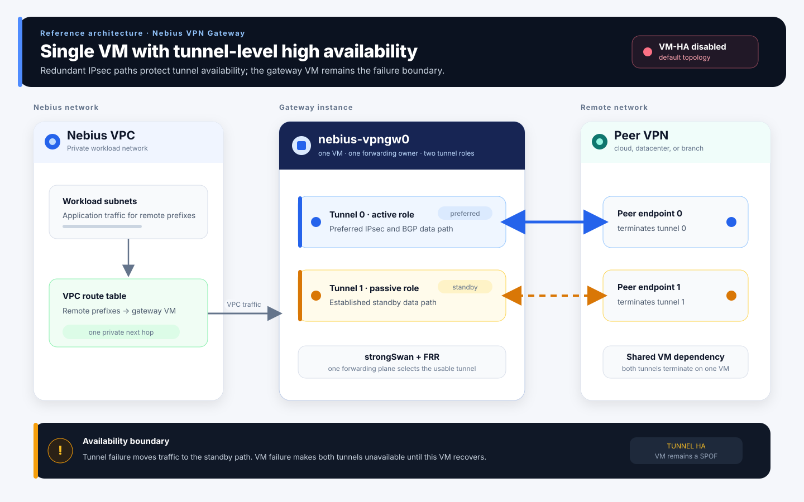
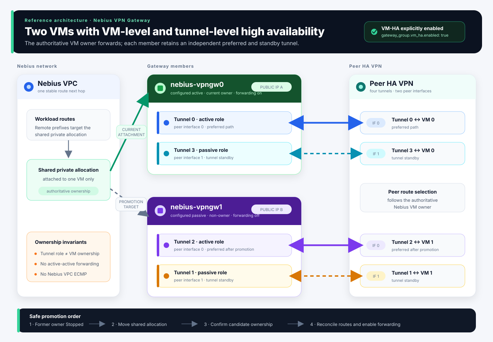

<!-- markdownlint-disable MD001 MD013 MD024 MD041 -->
<!-- maintain-project-specs:design:start schema=maintain-project-specs/design-v2 -->
<!-- FEATURE: FEAT-001 reqs=REQ-001 status=ready delivery=implemented priority=P1 version=1 -->
### FEAT-001: Conservative brownfield Python-project hardening

#### Requirements Covered

- REQ-001: Migrated Task requirement.

#### Context Evidence

Migrated from a validated Task Implementer design record.

#### Design Details

Retain the existing PEP 621/setuptools-scm `src`-layout project and its current runtime dependencies, entrypoints, test lanes, Makefile, and CI workflows. Harden only proven gaps: bind direct Git fallback time, load runtime SCM state through one environment-backed configuration built from `pyproject.toml`, use nested tag configuration instead of deprecated `tag_regex` inputs, codify existing public packaging and developer-workflow invariants in focused tests, and ignore standard local-only tool output.

#### Selected Option

Retain the existing PEP 621/setuptools-scm `src`-layout project and its current runtime dependencies, entrypoints, test lanes, Makefile, and CI workflows. Harden only proven gaps: bind direct Git fallback time, load runtime SCM state through one environment-backed configuration built from `pyproject.toml`, use nested tag configuration instead of deprecated `tag_regex` inputs, codify existing public packaging and developer-workflow invariants in focused tests, and ignore standard local-only tool output.

#### Alternatives Considered

- Replacing the established project with the generic scaffold was rejected because the current project already implements the required structure and a rewrite would risk user-facing regressions.
- Raising Python versions, changing dependency constraints, adding repository-local pre-commit ownership, or broadly hardening systemd/runtime subprocesses was deferred because those changes require separate compatibility and operational evidence.

#### Implementation Boundaries

`runtime_version.py` owns source-checkout version discovery and must return the same successful versions while treating a timed-out direct Git probe as unavailable. Runtime SCM lookup reads the canonical project configuration, performs no version-file writes, and falls through to the existing direct Git, metadata, generated-file, and unknown sequence when unavailable. Project-contract tests inspect `pyproject.toml` and `Makefile` without importing cloud clients or mutating external state. `.gitignore` changes affect only untracked local artifacts. Runtime cloud, networking, systemd, CLI, schema, persistence, and release interfaces remain unchanged.

#### Test-First Success Criteria

- The migrated validation contract passes after implementation.

#### Validation Plan

Warning-strict runtime-version and wheel-build regressions pass, focused project-contract assertions bind the supported configuration, and the complete `make all` workflow passes Ruff, mypy, all 1,284 unit tests, and wheel construction without warnings.

#### Test Plan

Warning-strict runtime-version and wheel-build regressions pass, focused project-contract assertions bind the supported configuration, and the complete `make all` workflow passes Ruff, mypy, all 1,284 unit tests, and wheel construction without warnings.

#### Evaluation Plan

Evaluate the mapped requirements and recorded validation evidence.

#### Rollout And Rollback

Revert the bounded fallback and additive tests/ignore entries; no data, configuration, dependency, or upgrade migration is required.

#### Done Definition

The mapped requirements, validation, and evaluation all pass.

#### Implementation Evidence

- `runtime_version.py` bounds the direct `git describe` fallback at five seconds, catches timeout as an unavailable source, and preserves the existing resolver order and successful version parsing.
- Runtime SCM lookup uses the environment-backed current configuration model, reads nested tag matching from `pyproject.toml`, and explicitly suppresses version-file writes instead of passing deprecated programmatic fields. Build configuration explicitly retains the established source `_version.py` generation behavior.
- `test_python_project_contract.py` binds the supported Python range, public console scripts, `src` package discovery, systemd package data, SCM dependency/configuration/version-file/tag contract, and canonical Makefile targets. Runtime-version coverage proves the timeout path and rejects dependency deprecations.
- `.gitignore` excludes standard local coverage, tox, and nox output while preserving tracked source and public examples.

#### Verification Evidence

No independent verification evidence was recorded before migration.

<!-- /FEATURE: FEAT-001 -->

<!-- FEATURE: FEAT-002 reqs=REQ-002 status=ready delivery=verified priority=P1 version=3 -->
### FEAT-002: Evidence-driven pytest feedback optimization

#### Requirements Covered

- REQ-002: Migrated Task requirement.

#### Context Evidence

Migrated from a validated Task Implementer design record.

#### Design Details

Freeze the current dirty non-candidate source identity, measure the isolated unit lane with task-owned cold caches and hard timeouts, and use pytest duration reporting to identify cumulative call cost. The seven-case VM-HA crash-replay test replaces its injected runtime sleeper with a no-op because the fixture's peer sends do not fail and listener-startup pacing is outside its contract; the existing dedicated retry test continues to assert the production delay schedule exactly. A later current-suite diagnostic identified a separate SDK-operation unit test that spent two seconds in real polling only while verifying bounded SDK keyword routing; that test now sets the injected production poll-interval constant to a minimal positive value locally, as required by the current SDK, while retaining the real SDK wait path and all assertions.

For the current 2,256-test suite, retain the same test-local pattern for four
newly measured cases: record rather than wait through SSH retry pacing in two
asset-selection tests while asserting the exact delay schedule; record rather
than wait through allocation-release pacing while preserving the second read,
failure, and zero-create proof; and stub only the unrelated public-IP lookup in
the private-allocation identity test while asserting that lookup still occurs.

#### Selected Option

Freeze the current dirty non-candidate source identity, measure the isolated unit lane with task-owned cold caches and hard timeouts, and use pytest duration reporting to identify cumulative call cost. The seven-case VM-HA crash-replay test replaces its injected runtime sleeper with a no-op because the fixture's peer sends do not fail and listener-startup pacing is outside its contract; the existing dedicated retry test continues to assert the production delay schedule exactly. A later current-suite diagnostic identified a separate SDK-operation unit test that spent two seconds in real polling only while verifying bounded SDK keyword routing; that test now sets the injected production poll-interval constant to a minimal positive value locally, as required by the current SDK, while retaining the real SDK wait path and all assertions.

Apply only those four test-local substitutions. Preserve the production SSH,
allocation-release, and SDK behavior, every remote command and cloud-read
attempt, the exact retry schedule as an assertion, and all existing behavioral
assertions.

#### Alternatives Considered

- Removing tests, weakening assertions, permanent reruns, marker-based under-selection, global plugin-autoload disabling, and unbounded `-n auto` adoption are rejected as displayed-runtime optimizations that can weaken correctness or predictability.
- New affected-test, sharding, or build-system dependencies are deferred unless the measured serial suite and existing xdist execution cannot meet the feedback objective.

#### Implementation Boundaries

Only `tests/unit/test_vm_ha_agent_runtime.py`,
`tests/unit/test_vm_manager_allocations.py`, and
`tests/unit/test_ssh_push.py` change. Production source, pytest
configuration, dependencies, public CLI/configuration/persistence behavior,
test selection, effect/restart execution, integration classification, network
blocking, serial debugging, coverage, CI, and full correctness lanes remain
unchanged. Listener, SDK waiter, SSH retry, allocation-release retry, remote
command, and cloud-read paths remain exercised; tests skip only real waiting
or unrelated SDK initialization and assert those interactions explicitly.

#### Test-First Success Criteria

- The exact four-test selection preserves four passes across at least five
  baseline and five candidate samples with the same interpreter, pytest
  plugins, configuration, cold-cache policy, and process timing method.
- The candidate asserts the SSH and allocation-release sleeper calls and the
  public-IP lookup count rather than bypassing those production branches.
- Full unit and integration selections, Ruff, mypy, diff integrity, canonical
  spec validation, and independent risk review pass.

#### Validation Plan

The original five cold-cache collection samples retained 682 unit tests with a 0.48-second median. Five like-for-like serial samples improved from a 4.07-second median (3.90-4.54 seconds) to 2.80 seconds (2.68-2.85 seconds), while every sample passed the same 682 tests; the focused seven-case median improved from 1.91 to 0.58 seconds. On the later 1,284-test suite, five process-level serial samples improved from a median of 8.98 seconds (8.89-9.24 seconds) to 7.03 seconds (6.83-7.30 seconds), and the focused SDK-operation test improved from 2.42 seconds (2.37-2.42 seconds) to 0.38 seconds (0.37-0.40 seconds).

On the current 2,256-test suite, startup and collection took 0.89 seconds of
wall time and were not the bottleneck. Five like-for-like samples of the exact
four-test lane improved from a 28.59-second median (28.42-29.23 seconds) to
0.46 seconds (0.45-0.48 seconds), with all four tests passing in every sample.
One complete instrumented unit run improved from 51.48 to 23.51 seconds with
all 2,256 tests passing; this single full-suite comparison is corroborative,
not a stable full-suite benchmark. Duration diagnostics, focused contracts,
Ruff, mypy, full project gates, and diff checks pass.

#### Test Plan

The original five cold-cache collection samples retained 682 unit tests with a 0.48-second median. Five like-for-like serial samples improved from a 4.07-second median (3.90-4.54 seconds) to 2.80 seconds (2.68-2.85 seconds), while every sample passed the same 682 tests; the focused seven-case median improved from 1.91 to 0.58 seconds. On the later 1,284-test suite, five process-level serial samples improved from a median of 8.98 seconds (8.89-9.24 seconds) to 7.03 seconds (6.83-7.30 seconds), and the focused SDK-operation test improved from 2.42 seconds (2.37-2.42 seconds) to 0.38 seconds (0.37-0.40 seconds).

For the current 2,256-test suite, collect the exact four node IDs from the two
changed files and run five baseline and five candidate process-level samples
with fresh task-owned caches. Then run duration diagnostics, the complete unit
and integration selections, Ruff, mypy, lock integrity, canonical spec
validation, Markdown lint, diff integrity, and independent changed-scope
review.

#### Evaluation Plan

Evaluate the mapped requirements and recorded validation evidence.

#### Rollout And Rollback

Revert only the focused test/configuration optimization if timing evidence is inconclusive or any selection, outcome, isolation, debugging, or compatibility invariant changes; no production or data migration is involved.

#### Done Definition

The mapped requirements, validation, and evaluation all pass.

#### Implementation Evidence

- The frozen non-candidate `test_vm_ha_agent_runtime.py` state was SHA-256 `9dd243b60fea4af7b8744715507eb1e67af5f5c4065500d9f47ff25ba718bbdc`; the measured candidate state, differing only by the focused sleeper patch and its explanatory comments, was SHA-256 `5ae0723ada32500fe41a17bdcd1cb0101daa1af9334357fa7c089e124400ff83`.
- The crash-replay test still constructs production-composed runtimes, starts and stops the peer listener, crashes after each effect, reconstructs runtime state, and proves ordered convergence; it skips only the real listener-startup pacing delay through the runtime's existing sleeper injection point.
- `test_default_service_runtime_retries_bounded_peer_send` remains the focused contract for three bounded send attempts and the exact `0.05`-second retry schedule.
- The frozen non-candidate `test_vm_manager_allocations.py` state was SHA-256 `5cc21ce1d32789cc55b296ce3476bf57dd80f9db82bb0645e390453c179c012c`; the current candidate state is SHA-256 `094a290b30d74491f1ef5e1165f294126f32b99953ef18ca6b46345b94332cf8`, with `vm_ha_cloud.py` unchanged at SHA-256 `f19f3b02c135bff8c6e56683a99060009cbd564f059db9fe68bbae2b2f66d66c`.
- The SDK-operation test still constructs a valid generated SDK operation wrapper, runs its real synchronous waiter, intercepts only the bounded internal update request, and asserts the exact request-keyword set; only its local poll interval is reduced to one microsecond.
- For the current optimization, the frozen non-candidate `test_ssh_push.py`
  state was SHA-256
  `8976815defb6d79de4e88b7ea6fbf2f83c2b8fb08db0144eebbca92e8497643b`;
  the candidate state is
  `717b031f6481ff3540392a230c72b031c476431eb1bffd215ce287d67d67fa1b`.
- The frozen non-candidate `test_vm_manager_allocations.py` state was
  SHA-256
  `33391d2c3b60a4a824e2e1feed63eb9fcef4847b54abb61323332558553e34ba`;
  the candidate state is
  `2e6600904f0c71e94c67bf64bb51bb3101c4783b77310f150bee9f26cf653d24`.
- The two SSH tests still execute every remote command and retry branch while
  recording and asserting their exact five-second sleep schedules. The
  allocation-release test preserves both inventory reads, the propagated
  failure, and zero-create proof while asserting its two-second sleep. The
  allocation-identity test skips only unrelated SDK initialization and asserts
  both public-IP lookup calls.
- No pytest configuration, fixture scope, marker, dependency, Makefile, CI, coverage, or production-code change was required.

#### Verification Evidence

- Five baseline samples of the exact four-test selection passed all four tests
  in 29.23, 28.75, 28.59, 28.42, and 28.58 seconds. Five candidate samples
  passed the same selection in 0.45, 0.48, 0.46, 0.46, and 0.47 seconds.
- A complete instrumented candidate unit run passed all 2,256 tests in 23.51
  seconds, and the normal complete unit lane passed all 2,256 tests in 22.80
  seconds. The isolated integration lane passed all 84 tests in 31.85 seconds.
- Ruff, mypy, lock integrity, canonical spec validation, Markdown lint, and
  diff-integrity checks passed.
- Independent changed-scope review found no correctness blocker and confirmed
  that the substitutions remain test-local, restore automatically, preserve
  production branches and effects, and strengthen timing-interaction
  assertions. The single full-suite comparison remains corroborative rather
  than a statistically stable benchmark.

<!-- /FEATURE: FEAT-002 -->

<!-- FEATURE: FEAT-003 reqs=REQ-003 status=ready delivery=unassessed priority=P1 version=1 -->
### FEAT-003: Compatibility-preserving configuration wizard

#### Requirements Covered

- REQ-003: Migrated Task requirement.

#### Context Evidence

Migrated from a validated Task Implementer design record.

#### Design Details

Route `create-config CONFIG_FILE` to a small Typer/Rich wizard only when both terminal streams are interactive or `--interactive` is explicit; keep the existing template generator as the sole noninteractive and `--no-interactive` path. Seed fresh interactive candidates without the template's provider example, guide common fields in dependency order, expose advanced settings and VM-HA only through explicit choices, validate through the existing Pydantic model, and atomically replace the target only after redacted review and confirmation. A single hidden PSK field maps uppercase environment names to `${NAME}` and otherwise accepts a schema-valid literal. After a valid write, offer network preparation behind a separate default-No effect summary.

#### Selected Option

Route `create-config CONFIG_FILE` to a small Typer/Rich wizard only when both terminal streams are interactive or `--interactive` is explicit; keep the existing template generator as the sole noninteractive and `--no-interactive` path. Seed fresh interactive candidates without the template's provider example, guide common fields in dependency order, expose advanced settings and VM-HA only through explicit choices, validate through the existing Pydantic model, and atomically replace the target only after redacted review and confirmation. A single hidden PSK field maps uppercase environment names to `${NAME}` and otherwise accepts a schema-valid literal. After a valid write, offer network preparation behind a separate default-No effect summary.

#### Alternatives Considered

- Removing `prep-network` was rejected because it is a supported public command and remains necessary for operators who reserve Nebius-side addresses before peer details are available.
- Always prompting in non-TTY contexts was rejected because it would hang or break existing automation; requiring a resumable schema-invalid draft was rejected because it adds a second persisted lifecycle and unsafe overwrite/comment-preservation problems.
- Importing the full cxcli component wizard or adding `questionary` was rejected because existing Typer/Rich primitives cover the bounded prompts without a new runtime dependency.

#### Implementation Boundaries

A focused `config_wizard.py` owns provider-neutral defaults, prompt state, typed coercion, help/back/quit navigation, hybrid PSK classification, input-free validation errors, redacted summaries, schema validation, and stable YAML serialization; `cli.py` owns TTY/flag routing, existing-file policy, atomic publication, allocation selection, public output, and the final preparation confirmation. The shared preparation path freezes the source fingerprint, authenticates, converges a strict network foundation, optionally selects exact allocation identities, ensures the complete allocation matrix, and conditionally publishes only `external_ips`. `VMManager` owns authoritative Nebius reads, exact resource-shape checks, accepted-create reconciliation, default-route semantics, and postcondition rereads. `schema.py`, configuration version 1, apply/runtime code, and VM/tunnel HA policy remain authoritative.

#### Test-First Success Criteria

- The migrated validation contract passes after implementation.

#### Validation Plan

Add pure wizard-state tests, forced-interactive CLI transcripts for static, BGP, and explicit VM-HA candidates, byte-compatible non-TTY template regressions, hybrid-PSK and leakage tests, cancellation/overwrite tests, allocation-selector tests, strict subnet/route/allocation reconciliation and retry tests, conditional YAML-publication tests, real schema/CLI validation of generated files, CLI help checks, and full project gates.

#### Test Plan

Add pure wizard-state tests, forced-interactive CLI transcripts for static, BGP, and explicit VM-HA candidates, byte-compatible non-TTY template regressions, hybrid-PSK and leakage tests, cancellation/overwrite tests, allocation-selector tests, strict subnet/route/allocation reconciliation and retry tests, conditional YAML-publication tests, real schema/CLI validation of generated files, CLI help checks, and full project gates.

#### Evaluation Plan

Evaluate the mapped requirements and recorded validation evidence.

#### Rollout And Rollback

Remove the wizard module and interactive flags, route `create-config` directly to the retained template generator, and leave the shared preparation behavior in the standalone wrapper. No configuration, state, or cloud migration is required.

#### Done Definition

The mapped requirements, validation, and evaluation all pass.

#### Implementation Evidence

- Implemented the focused `config_wizard.py` prompt/state owner, provider-neutral
  fresh defaults, routing-before-ASN flow, hidden hybrid PSK input, TTY and
  explicit-mode routing in `cli.py`, destination-fingerprint-guarded atomic
  publication, and one preparation service shared by the wizard handoff and
  public `prep-network` wrapper. Schema v1 and the noninteractive template remain
  unchanged; `prep-network` adds explicit interactive-mode overrides.
- Forced-interactive BGP, static, and explicit VM-HA transcripts produce
  schema-v1 candidates; non-TTY and `--no-interactive` output remains the exact
  embedded template. Focused tests cover typed reprompting, help/back/quit/EOF,
  overwrite and concurrent-writer preservation, hybrid-PSK redaction,
  separate preparation confirmation, existing-allocation selection,
  missing-project admission, convergent route/allocation behavior, and the
  cloud-success/YAML-failure boundary. Network preparation rejects malformed
  gateway/allocation shapes before authentication, binds automatic pool
  extension to the latest resource version while preserving observed CIDRs,
  and revalidates exact subnet/allocation identities after mutation.
- Final offline gates passed Ruff, mypy, 2,154 unit tests, 84 isolated
  integration tests, CLI help smoke, scoped secret-signature checks, and diff
  integrity. No live cloud preparation was invoked for this implementation.

#### Verification Evidence

No independent verification evidence was recorded before migration.

<!-- /FEATURE: FEAT-003 -->

<!-- FEATURE: FEAT-004 reqs=REQ-004 status=superseded delivery=unassessed priority=P1 version=1 -->
### FEAT-004: Two-phase ordinary-to-VM-HA configuration wizard

#### Requirements Covered

- REQ-004: Migrated Task requirement.

#### Context Evidence

Migrated from a validated Task Implementer design record.

#### Design Details

Add a dedicated `configure-vm-ha` command that reads one admitted ordinary raw YAML document, derives an allowlisted two-member transform in memory, and uses a two-phase peer handoff. Phase one derives deterministic member-one topology, collects and preflights the two local mode-`0600` credential bundles before authentication, and either accepts a preallocated passive IP or, after a separate default-No confirmation, invokes a selected-index allocation seam for instance one only. It prints the incremental peer parameters and exits without a candidate until the peer is ready. Phase two collects the peer's remote endpoints, validates the complete candidate, presents a redacted summary, and conditionally publishes a new owner-only file without clobbering a racing writer. Existing apply remains the only migration discovery, approval, provisioning, activation, fencing, and recovery engine.

**Supersession:** FEAT-015 and TI-DES-022 define the current `vm-ha` command and managed-credential behavior. The credential prompts and preflight below are retained only as historical rationale and are not an active contract.

#### Selected Option

Add a dedicated `configure-vm-ha` command that reads one admitted ordinary raw YAML document, derives an allowlisted two-member transform in memory, and uses a two-phase peer handoff. Phase one derives deterministic member-one topology, collects and preflights the two local mode-`0600` credential bundles before authentication, and either accepts a preallocated passive IP or, after a separate default-No confirmation, invokes a selected-index allocation seam for instance one only. It prints the incremental peer parameters and exits without a candidate until the peer is ready. Phase two collects the peer's remote endpoints, validates the complete candidate, presents a redacted summary, and conditionally publishes a new owner-only file without clobbering a racing writer. Existing apply remains the only migration discovery, approval, provisioning, activation, fencing, and recovery engine.

#### Alternatives Considered

- Reusing `create-config` was rejected because it starts from a template and cannot prove preservation of an existing gateway configuration.
- Converting in place was rejected because interruption, peer delay, and comment normalization would make the customer's only configuration an unsafe transaction boundary.
- Saving a schema-invalid intermediate file was rejected because it creates a second draft lifecycle and permits accidental deployment of incomplete topology.
- Running broad `prep-network` was rejected because migration must not require, recreate, validate, or rewrite the serving member's attached public allocation.
- Mutating peer-provider resources or embedding deployment in the wizard was rejected because provider workflows vary and apply already owns the exact approved migration state machine.

#### Implementation Boundaries

`vm_ha_config_wizard.py` owns raw-document admission, a resolved derivation-only view, deterministic defaults, prompt state, credential preflight, member-one tunnel derivation, structural-diff allowlist, redacted review, and complete-candidate validation; `config_wizard.py` remains focused on initial config creation. `cli.py` owns command registration, TTY admission, source/destination identity and fingerprint checks, exit semantics, passive-reservation confirmation and handoff, and mode-`0600` no-clobber conditional publication with explicit recovery state. `deploy/vm_manager.py` exposes a narrow selected-index public-allocation helper reused by ordinary `prepare_network`; the conversion path passes only index one and never evaluates member zero. `schema.py`, `config_loader.py`, VM-HA apply, lifecycle, route, SSH, and controller code remain authoritative and are not given a second migration path. Raw YAML remains the persistence source; an expanded semantic view drives validation and new identity derivation but is never serialized over existing fields.

#### Test-First Success Criteria

- The migrated validation contract passes after implementation.

#### Validation Plan

Exercise ordinary admission and rejection, static/BGP and multi-connection transformation, one instance-one counterpart per existing tunnel, APIPA/name/PSK-reference uniqueness, placeholder preservation with environment sentinels present, structural allowlist failure, bounded redaction, peer-not-ready and cancellation paths, source/destination same-file and concurrent-write defenses, mode `0600`, exact-output idempotency, passive-only allocation reuse and rejection, real schema/config-loader/peer-merge acceptance, existing migration dry-run handoff, and unchanged `create-config`, `prep-network`, `validate-config`, apply, and default-disabled VM-HA behavior.

#### Test Plan

Exercise ordinary admission and rejection, static/BGP and multi-connection transformation, one instance-one counterpart per existing tunnel, APIPA/name/PSK-reference uniqueness, placeholder preservation with environment sentinels present, structural allowlist failure, bounded redaction, peer-not-ready and cancellation paths, source/destination same-file and concurrent-write defenses, mode `0600`, exact-output idempotency, passive-only allocation reuse and rejection, real schema/config-loader/peer-merge acceptance, existing migration dry-run handoff, and unchanged `create-config`, `prep-network`, `validate-config`, apply, and default-disabled VM-HA behavior.

#### Evaluation Plan

Evaluate the mapped requirements and recorded validation evidence.

#### Rollout And Rollback

Remove the additive command and selected-index helper while retaining the existing create wizard, public `prep-network`, schema, and apply behavior. Source configurations and successfully published candidates are ordinary schema-v1 YAML files; no hidden wizard state or live deployment mutation requires rollback.

#### Done Definition

The mapped requirements, validation, and evaluation all pass.

#### Implementation Evidence

- `vm_ha_config_wizard.py` implements raw/semantic-view separation, ordinary-source admission, deterministic collision-resistant member identities, credential-bundle preflight, counterpart tunnel prompting, structural allowlisting, redacted review, and complete-candidate validation without serializing expanded environment values.
- `cli.py` implements TTY admission, source and destination identity/fingerprint checks, a default-No passive reservation phase, secret-free handoff, and mode-`0600` no-clobber conditional publication with explicit recovery state. `VMManager.prepare_public_allocations` provides the selected-index seam and ordinary `prepare_network` retains its public behavior through that same internal path.
- Focused tests cover file races and recovery artifacts, credential mode/inode/TLS checks, typed and identity placeholders, long-name collision resistance, partial cloud-operation reporting and retry reuse, structural mutation rejection, and a generated candidate passed through real loading, peer merge, and the existing CLI migration dry-run. Ruff, mypy, all 1,015 unit tests, and all 46 integration tests passed offline; no live cloud readiness claim is made.

#### Verification Evidence

No independent verification evidence was recorded before migration.

<!-- /FEATURE: FEAT-004 -->

<!-- FEATURE: FEAT-005 reqs=REQ-005 status=ready delivery=implemented priority=P1 version=1 -->
### FEAT-005: Canonical examples for the public CLI help surface

#### Requirements Covered

- REQ-005: Migrated Task requirement.

#### Context Evidence

Migrated from a validated Task Implementer design record.

#### Design Details

Define one immutable mapping from every public command name to one or more practical invocations, render those examples through Typer command epilogs, and add a concise quick-start epilog to the root application. Keep the existing callback docstrings as command descriptions and retain the stable workflow ordering. Declare `-c` beside `--local-config-file` on every operational command while keeping `create-config CONFIG_FILE` and `validate-config CONFIG_FILE` positional.

#### Selected Option

Define one immutable mapping from every public command name to one or more practical invocations, render those examples through Typer command epilogs, and add a concise quick-start epilog to the root application. Keep the existing callback docstrings as command descriptions and retain the stable workflow ordering. Declare `-c` beside `--local-config-file` on every operational command while keeping `create-config CONFIG_FILE` and `validate-config CONFIG_FILE` positional.

#### Alternatives Considered

- Duplicating example strings across 18 callback docstrings was rejected because it has no complete ownership check and makes drift or copy/paste errors harder to detect.
- Executing example commands in tests was rejected because several commands intentionally authenticate or mutate infrastructure; rendered syntax and existing behavioral tests provide the safe contract boundary.
- Adding a documentation generator or new runtime dependency was rejected because Typer already supports application and command epilogs.

#### Implementation Boundaries

`cli.py` owns the example registry, formatting helper, root epilog, command registration, and command-local option aliases. The examples retain the readable long spelling; both option names resolve to the same `local_config_file` callback value and do not alter default-path resolution, authentication, safety gates, or effects. No root configuration option or dual positional/option file syntax is registered. Unit tests introspect the rendered Click command tree, require exact parity with the registry, and verify each visible command's help contains its own invocation despite Rich line wrapping. README and CHANGELOG describe help discovery without duplicating the complete command reference.

#### Test-First Success Criteria

- The migrated validation contract passes after implementation.

#### Validation Plan

Render root help and all 18 public command help pages with a fixed terminal width; require `Usage`, `Examples`, command-specific invocation text, exact operational aliases, equivalent long/short parsing, and parse-time rejection of root or positional-command `-c`; retain focused option/help and command-order tests; then run Ruff, mypy, full unit and isolated integration suites, Markdown lint, security review, and diff checks.

#### Test Plan

Render root help and all 18 public command help pages with a fixed terminal width; require `Usage`, `Examples`, command-specific invocation text, exact operational aliases, equivalent long/short parsing, and parse-time rejection of root or positional-command `-c`; retain focused option/help and command-order tests; then run Ruff, mypy, full unit and isolated integration suites, Markdown lint, security review, and diff checks.

#### Evaluation Plan

Evaluate the mapped requirements and recorded validation evidence.

#### Rollout And Rollback

Remove the operational `-c` declarations and their focused contract coverage while preserving `--local-config-file`, then revert the aligned help and documentation wording. No configuration, data, cloud resource, or migration rollback is required.

#### Done Definition

The mapped requirements, validation, and evaluation all pass.

#### Implementation Evidence

- `cli.py` owns one immutable, workflow-ordered command-example mapping. The root application and every public command render examples through Typer epilogs, and the existing command order is derived from the same mapping.
- Unit coverage compares the mapping with both Typer registration order and the rendered visible Click command tree, then renders root help and every command help page with a fixed terminal width and verifies its exact normalized invocation text.
- Ruff and mypy passed, all 1,052 unit tests and 46 isolated integration tests passed, README and changelog Markdown lint passed, the canonical specifications validated, and changed-scope security and diff-integrity reviews found no execution or safety-gate change.

#### Verification Evidence

No independent verification evidence was recorded before migration.

<!-- /FEATURE: FEAT-005 -->

<!-- FEATURE: FEAT-006 reqs=REQ-005,REQ-006,TI-REQ-009,TI-REQ-011 status=ready delivery=implemented priority=P1 version=1 -->
### FEAT-006: Resource-scoped failover and failback command groups

#### Requirements Covered

- REQ-005: Migrated Task requirement.
- REQ-006: Migrated Task requirement.
- TI-REQ-009: Migrated Task requirement.
- TI-REQ-011: Migrated Task requirement.

#### Context Evidence

Migrated from a validated Task Implementer design record.

#### Design Details

Register dedicated Typer subapplications for `failover` and `failback`, each configured to show help when invoked without a resource. Move the existing VM and tunnel callbacks onto `vm` and `tunnel` leaves rather than registering wrappers or duplicate root commands. Replace the flat example mapping with an immutable path-aware registry that owns root order, child order, group epilogs, and leaf epilogs; use a root command class that interleaves Typer groups with ordinary commands in the declared workflow order.

#### Selected Option

Register dedicated Typer subapplications for `failover` and `failback`, each configured to show help when invoked without a resource. Move the existing VM and tunnel callbacks onto `vm` and `tunnel` leaves rather than registering wrappers or duplicate root commands. Replace the flat example mapping with an immutable path-aware registry that owns root order, child order, group epilogs, and leaf epilogs; use a root command class that interleaves Typer groups with ordinary commands in the declared workflow order.

#### Alternatives Considered

- Keeping the four flat commands was rejected because it leaves one operation family split across resource-specific naming conventions.
- Retaining aliases or deprecation wrappers was rejected because the approved project policy is one fail-fast canonical path and the user explicitly requested a reduced command surface.
- A single callback with a manually parsed resource argument was rejected because Typer subapplications provide native per-resource help, validation, and completion without duplicating dispatch logic.

#### Implementation Boundaries

`cli.py` changes only command registration, help metadata, ordering, examples, and diagnostics that print an invocation. Existing callback bodies remain the canonical owners of configuration loading, tunnel selection, VM-HA planning, SSH, cloud, agent requests, prompts, and effects. The public parser accepts only `failover vm`, `failback vm`, `failover tunnel [TUNNEL_NAME]`, and `failback tunnel [TUNNEL_NAME]`; it has no aliases for the removed flat paths. Unit and integration tests recursively inspect the rendered Click tree and exercise nested routing plus parse-time rejection before mocked effect boundaries. README and the Unreleased changelog own the migration guidance; released history remains unchanged.

#### Test-First Success Criteria

- The migrated validation contract passes after implementation.

#### Validation Plan

First bind the recursive command tree, deterministic root and child order, all group/leaf help pages, path-aware registry parity, nested VM/tunnel callback routing, and zero-effect rejection for bare and removed paths. Then run existing VM-HA preflight/fencing and tunnel behavior tests, Ruff, mypy, full unit and isolated integration suites, Markdown lint, security review, canonical-spec validation, and diff checks.

#### Test Plan

First bind the recursive command tree, deterministic root and child order, all group/leaf help pages, path-aware registry parity, nested VM/tunnel callback routing, and zero-effect rejection for bare and removed paths. Then run existing VM-HA preflight/fencing and tunnel behavior tests, Ruff, mypy, full unit and isolated integration suites, Markdown lint, security review, canonical-spec validation, and diff checks.

#### Evaluation Plan

Evaluate the mapped requirements and recorded validation evidence.

#### Rollout And Rollback

Restore the four former flat registrations and flat example registry as one breaking-contract rollback. Do not retain parallel old/new routes or aliases. No configuration, persisted state, cloud resource, agent protocol, or live migration is involved.

#### Done Definition

The mapped requirements, validation, and evaluation all pass.

#### Implementation Evidence

- `cli.py` registers `failover` and `failback` as Typer subapplications and moves the existing VM and tunnel callbacks directly to `vm` and `tunnel` leaves. A path-aware immutable example registry and the shared workflow-order group class own root, group, and leaf help without registering shadow root callbacks.
- Unit coverage recursively compares the rendered command tree with the registry, verifies root and child order, renders every help page, routes nested VM requests through the existing preparation and operator boundaries, preserves request-free same-owner behavior, and rejects bare and removed paths before configuration access. Integration coverage independently exercises all group and leaf help paths plus old-path rejection.
- Ruff and mypy passed, all 1,065 unit tests and 58 isolated integration tests passed, selected changed-document Markdown lint and diff-integrity checks passed, and changed-scope security review found no new trust, credential, network, or mutation boundary. No live cloud or gateway command was executed.

#### Verification Evidence

No independent verification evidence was recorded before migration.

<!-- /FEATURE: FEAT-006 -->

<!-- FEATURE: FEAT-007 reqs=REQ-005,REQ-007,TI-REQ-006,TI-REQ-011,TI-REQ-016 status=ready delivery=implemented priority=P1 version=1 -->
### FEAT-007: Authoritative integrated VM-HA status

#### Requirements Covered

- REQ-005: Migrated Task requirement.
- REQ-007: Migrated Task requirement.
- TI-REQ-006: Migrated Task requirement.
- TI-REQ-011: Migrated Task requirement.
- TI-REQ-016: Migrated Task requirement.

#### Context Evidence

Migrated from a validated Task Implementer design record.

#### Design Details

Remove the public `vm-ha-recover` callback and the duplicate private agent flag, retain private `--vm-ha-status` as the only agent read, and make ordinary `status` build one sanitized VM-HA projection from lifecycle state, structured cloud authority, two strictly validated member records, and the strict standby auto-healing policy. Cloud/lifecycle evidence chooses the owner; member reports corroborate it. A pure classifier produces `BLOCKED`, `UNKNOWN`, `TRANSITIONING`, `MAINTENANCE`, `DEGRADED`, or `HEALTHY` in that precedence. Render that aggregate in the title of one four-column member table and follow it with the closed identity-free `Redundancy`, `Identity`, `Auto-healing`, and `Action` values needed to distinguish enabled restoration, maintenance, expected transitions, and blocked or unavailable policy evidence. Rearm details remain internal classifier evidence. Project `Role` only from that authoritative current owner: `active` for the owner, `standby` for the other member, and `unknown` when no owner is proven; do not combine this runtime fact with configured preference.

**Gateway discovery:** Before SSH observation, `status` and the shared local-route preflight query each canonical configured Compute name directly instead of enumerating project instances. The first exact member permits observation to continue, including partial VM HA; only typed `NOT_FOUND` counts as absence, while provider failures and missing or inexact identities fail with a sanitized error. When every configured member is absent, each caller retains its existing guidance and exit contract.

#### Selected Option

Remove the public `vm-ha-recover` callback and the duplicate private agent flag, retain private `--vm-ha-status` as the only agent read, and make ordinary `status` build one sanitized VM-HA projection from lifecycle state, structured cloud authority, two strictly validated member records, and the strict standby auto-healing policy. Cloud/lifecycle evidence chooses the owner; member reports corroborate it. A pure classifier produces `BLOCKED`, `UNKNOWN`, `TRANSITIONING`, `MAINTENANCE`, `DEGRADED`, or `HEALTHY` in that precedence. Render that aggregate in the title of one four-column member table and follow it with the closed identity-free `Redundancy`, `Identity`, `Auto-healing`, and `Action` values needed to distinguish enabled restoration, maintenance, expected transitions, and blocked or unavailable policy evidence. Rearm details remain internal classifier evidence. Project `Role` only from that authoritative current owner: `active` for the owner, `standby` for the other member, and `unknown` when no owner is proven; do not combine this runtime fact with configured preference.

#### Alternatives Considered

- Renaming `vm-ha-recover` to `vm-ha-status` or `vm-ha-state` was rejected because it would preserve a second public status surface without adding authority or capability.
- Keeping a compatibility alias or focused `--vm-ha-only` view was rejected because the unpublished command has no migration requirement and the selected interface is one canonical status path.
- Trusting member-reported owner/readiness without cloud correlation was rejected because two mutually consistent stale members can still disagree with authoritative allocation ownership.

#### Implementation Boundaries

`cli.py` owns structured authority collection, complete display validation, conservative classification, and one `Gateway`/`Role`/`mTLS`/`Ready` renderer. The Role projection consumes only the already-proven authoritative owner identity; configured role remains validated internal evidence and is not a fallback label. One status SSH context carries the configured management username and private key into every subprocess. Product-managed trust is resolved once against the complete deployment member set and the resulting immutable policy is shared by the member probes; an explicit operator known-hosts override remains independently resolved per member so one missing override pin becomes only that member's sanitized unavailable evidence. No status path enrolls trust or permits a permissive fallback. Its status-only loader policy preserves exact unresolved tunnel-PSK environment references because no status branch consumes them, while `config_loader.py` continues to reject every unresolved non-PSK placeholder and leaves mutating callers on the strict path. With resolved PSKs, status retains full local generation comparison. With unresolved PSKs, the status validator instead requires each agent's generation to equal its configuration digest, requires exact generation/digest parity between both available members, and still compares the locally derivable static-route and BGP-policy digests; it never hashes placeholder text as if it were the deployed secret-bearing generation. It always materializes both configured members and converts missing transport or invalid status into sanitized availability evidence. Exact cloud route authority requires the same non-empty managed-prefix set once per route target, all through the shared allocation. Authenticated controller reasons remain behind a closed identity-free normalization boundary. Pending controller effects are transitional only when their generated identity names a configured member and their encoded action kind matches the reported state; this includes an authoritative owner entering passive mode. Starting rearm or an incomplete policy transaction is transitional, while a committed disabled policy with no accepted start is maintenance and terminal successful `running` rearm can participate in healthy evidence only when policy is enabled. The classifier derives the public Auto-healing value only from the already-validated two-member policy projection. For disabled maintenance, the existing shell-quoted config-bound rearm command becomes the exact enable Action; only that Action may disclose the current invocation's config path, while other config-bearing actions retain `<file>`. The renderer uses literal Rich text for all footer cells so path markup remains inert, neutral identity/role cells, green only for proven healthy aggregate/mTLS/readiness, yellow for maintenance and transitions, and red for blocked or unavailable semantic state. Raw payloads, exceptions, resource identities, revisions, generations, digests, locks, operations, epochs, fingerprints, timings, reasons, and recovery actions stay behind the projection boundary. Non-HA status and unrelated mutation paths remain unchanged.

#### Test-First Success Criteria

- The migrated validation contract passes after implementation.

#### Validation Plan

Unit-test the complete status-v1 validator and pure classifier across both ownership directions, including exact `active`/`standby` row reversal after ownership transfer and `unknown` roles without authority, plus expected and foreign locks, every controller/rearm state, cloud/member disagreement, missing or malformed evidence, standby-only unavailability, self-consistent unresolved-PSK generations, two-member generation parity, and non-secret digest mismatches. Exercise forced-color and no-color rendering to prove one aggregate title, exact four-column order, exactly two sanitized member rows, ordered `Redundancy`/`Identity`/`Auto-healing`/`Action` output, exact enabled/disabled policy values, the config-specific disabled-maintenance enable command, no configured-role suffixes, conservative readiness, identity/exception redaction, informational HA exits, fatal setup exits, no HA work for non-HA plans, and no mutation calls. Recursively prove the 17 executable operations plus two groups, parse-time rejection of removed public/private paths, and absence of replacement commands or focused flags, then run full project gates and changed-surface alignment.

#### Test Plan

Unit-test the complete status-v1 validator and pure classifier across both ownership directions, including exact `active`/`standby` row reversal after ownership transfer and `unknown` roles without authority, plus expected and foreign locks, every controller/rearm state, cloud/member disagreement, missing or malformed evidence, standby-only unavailability, self-consistent unresolved-PSK generations, two-member generation parity, and non-secret digest mismatches. Exercise forced-color and no-color rendering to prove one aggregate title, exact four-column order, exactly two sanitized member rows, ordered `Redundancy`/`Identity`/`Auto-healing`/`Action` output, exact enabled/disabled policy values, the config-specific disabled-maintenance enable command, no configured-role suffixes, conservative readiness, identity/exception redaction, informational HA exits, fatal setup exits, no HA work for non-HA plans, and no mutation calls. Recursively prove the 17 executable operations plus two groups, parse-time rejection of removed public/private paths, and absence of replacement commands or focused flags, then run full project gates and changed-surface alignment.

#### Evaluation Plan

Evaluate the mapped requirements and recorded validation evidence.

#### Rollout And Rollback

Restore the prior summary-plus-member renderer as one source change only if the approved concise layout is explicitly reversed. No configuration, persisted runtime record, cloud resource, or live deployment migration is involved.

#### Done Definition

The mapped requirements, validation, and evaluation all pass.

#### Implementation Evidence

- The 2026-08-28 Auto-healing footer refinement passed 44 focused status
  validator/classifier/renderer tests, all 16 standby auto-healing unit tests,
  Ruff, mypy across 54 source files, and all 1,876 unit tests. The isolated
  integration suite passed 83 of 84 tests; its sole failure is the pre-existing
  `vm-ha --help` assertion that expects `default-No`, outside this status
  presentation boundary. No live cloud or gateway command was run.
- The Role projection now maps only the authoritative owner identity to
  `active`, the other configured member to `standby`, and an absent owner to
  `unknown`. Configured role remains part of strict agent evidence validation
  but is not rendered as a suffix. Focused regressions proved both ownership
  directions, missing authority, missing standby evidence, and the exact
  failover table without changing classifier, readiness, mTLS, cloud, or
  mutation behavior. All focused, unit, integration, Ruff, and mypy gates
  passed offline.
- `cli.py` retains structured lifecycle/cloud authority, complete status-v1
  validation, two configured-member materialization, conservative overall
  classification, unresolved-PSK handling, and identity-safe normalization.
  Its public renderer now emits only one aggregate-titled
  `Gateway`/`Role`/`mTLS`/`Ready` table; neutral identity/role cells and explicit
  green/red semantic cells preserve readable no-color text without rendering
  controller details, certificate metadata, timings, reasons, or actions.
- Pure tests cover both owner directions, expected and foreign locks, every
  controller/rearm state, cloud/member conflict, missing standby evidence,
  complete multi-target route coverage, production-shaped pending repair and
  transfer states, terminal rearm, reason deduplication, timing rendering, and
  closed-allowlist identity redaction. Mocked ordinary-status tests prove the
  HA path uses only observation/status boundaries and that non-HA skips them. A
  real-loader regression proves exact unresolved PSK references, including a
  short `${PSK}` name, cross schema validation without weakening operational
  placeholders or literal-PSK length validation. Recursive
  command tests prove the 17 operations plus two groups and parse-time absence
  of the removed, replacement, and focused-view surfaces. Ruff and mypy
  passed, all 1,098 unit tests and 62 isolated integration tests passed, and no
  live cloud or gateway command was executed.
- Focused presentation tests prove exact headers, one row per configured
  member, healthy and non-good styles, conservative globally gated readiness,
  missing-member `unknown` values, no ANSI dependency in non-color output, and
  absence of the former summary/detail headers. Full validation passed 1,116
  unit and 69 isolated integration tests plus Ruff and mypy without live
  Nebius, SSH, service, route, or gateway access.
- The reconciled status projection now consumes strict standby auto-healing
  evidence, distinguishes peer-acknowledged disabled policy as yellow
  `MAINTENANCE`, keeps incomplete policy yellow `TRANSITIONING`, and blocks
  invalid or split evidence in red. The public summary exposes only
  `Redundancy`, `Identity`, and `Action`; the former `Rearm` row remains
  internal classifier evidence. Focused regressions cover maintenance both
  before and after the standby is stopped, split policy, exact action guidance,
  and semantic title colors without live gateway access.

#### Verification Evidence

No independent verification evidence was recorded before migration.

<!-- /FEATURE: FEAT-007 -->

<!-- FEATURE: FEAT-008 reqs=REQ-008,TI-REQ-001,TI-REQ-002,TI-REQ-006,TI-REQ-008,TI-REQ-011 status=ready delivery=implemented priority=P1 version=1 -->
### FEAT-008: VM-local direct-pinned mTLS identity lifecycle

#### Requirements Covered

- REQ-008: Migrated Task requirement.
- TI-REQ-001: Migrated Task requirement.
- TI-REQ-002: Migrated Task requirement.
- TI-REQ-006: Migrated Task requirement.
- TI-REQ-008: Migrated Task requirement.
- TI-REQ-011: Migrated Task requirement.

#### Context Evidence

Migrated from a validated Task Implementer design record.

#### Design Details

Replace operator-supplied VM-HA CA/leaf/key bundles with one self-signed CA-false leaf generated independently on each VM. Exact-pinned management SSH is the enrollment and recovery authority: it invokes idempotent root-only node actions, returns only public certificate receipts, and cross-installs the peer leaf as an exact trust anchor. Keep mTLS identity generation independent from the VPN configuration generation, bootstrap it automatically during initial apply, regenerate only a fenced replacement member during apply, and reserve whole-cluster rotation for the explicit `vm-ha --rotate-mtls` transaction. Use a clean protocol-v2 peer envelope that binds a monotonic mTLS epoch to the certificate presented on that TLS connection.

**State and crypto:** Store identities, peer leaves, `active.json`, and transaction journals under the existing root-owned VM-HA state root using no-follow/no-clobber file creation, single-link checks, mode `0600`, file and directory fsync, and atomic rename. Each identity uses an unencrypted PKCS#8 ECDSA P-256 private key, random positive serial, SHA-256 self-signature, CA-false and digital-signature-only constraints, client/server EKUs, canonical node DNS and URI SANs, fixed `2000-01-01T00:00:00Z` `notBefore`, and `9999-12-31T23:59:59Z` `notAfter`. A receipt binds cluster, node, Compute identity, epoch, certificate/SPKI fingerprints, and operation identity; two member SPKIs must differ. Private key bytes never leave the node or enter status, manifests, logs, errors, or receipts.

**Enrollment and replacement:** Initial apply stages both exact node configurations, proves generation parity, installs and verifies the current agent package plus its cryptography/CFFI runtime on both members non-owner-first, and only then installs exact-generation apply locks in that same order. It writes one lock-bound owner-adoption declaration on the independently observed current owner, asks both nodes to generate identities, validates public receipts, and cross-installs direct peer leaves. It then activates non-owner-first under those locks, proves fresh bidirectional heartbeats, commits active snapshots, and only afterward releases the locks and enables the exact owner. Healthy reapply is a cryptographic no-op. Replacement first proves the former Compute stopped/absent and network-fenced; the survivor temporarily accepts old/new replacement leaves, the replacement trusts only the survivor's active leaf, and fresh epoch-bound handshakes precede commit and immediate old-leaf pruning. The survivor key remains unchanged.

**Rotation transaction:** `vm-ha --rotate-mtls` dispatches before ordinary facade conversion or convergence. It accepts the required local config plus the existing dry-run and exact approval options, retains human text output, and rejects candidate output, force, standby-policy, explicit-region, and JSON combinations before external effects. Its dry-run binds a secret-free plan digest to the exact config, lifecycle, cluster, members, Compute identities, owner/allocation observation, current epochs/fingerprints, target epoch, and ordered phases. Each mutation-free inspection first queries both fixed installed-agent capability documents over exact-pinned SSH and requires `vm-ha-mtls-rotation-quiescence-v1`; it then requires that same fixed feature in the exact current-generation status persisted by each running controller process. An absent command, malformed document, missing feature, restart-skewed controller, timeout, or transport failure stops before the plan/approval boundary and directs the operator to deploy this CLI's agent through `apply`. The command announces that passive-first overlap trust is designed to preserve VPN availability, renders only the operation kind, target epoch, member count, and exact plan digest, and uses the shared best-effort stderr progress reporter so a TTY sees an animated identity-free rotation row while noninteractive streams receive only its terminal row. After interactive confirmation or exact noninteractive approval, acquire the shared writer lock, install inhibition on the passive, and wait until that exact operation has passed through a controller observation with no pending controller, accepted cloud, or rearm effect and the former owner still Running. Install and prove the owner inhibition only after the passive barrier succeeds. Node-local controller transfer dispatch, rearm, apply locking, and inhibition installation serialize through `rearm.lock`; transfer dispatch re-reads both apply and mTLS inhibition while holding that lock and skips a stale decision without writing an effect receipt. Prepare both pending identities only after both barriers, expand trust to old/new, switch the passive local identity, switch the owner, independently reread active slots and served fingerprints, and require three consecutive fresh bidirectional epoch-bound heartbeats after connection draining before commit/prune. Before any new served leaf is observed the exact transaction may roll back; afterward it can only roll forward. Remote journals, not the CLI's last acknowledgement, decide recovery after any lost response or restart.

**Failure handling:** A pending exact transaction is resumed rather than replaced. An inhibition-only interruption is also rendered as resumable rotation. Installed-agent or running-controller skew fails at capability admission before any rotation write and has one canonical recovery: complete `apply` with the same local configuration and CLI version, verify both members and controller services, then retry; the CLI never interprets an older apply-lock projection as rotation inhibition. If topology or controller evidence drifts before any prepare may have begun, the CLI releases every exact inhibition it attempted and exits with retry guidance, so an already-authorized transfer can finish and rearm rather than being stranded. After prepare may have begun, failures retain inhibition for journal-based recovery. Fresh contexts disable session tickets/resumption and old connections are drained before pruning. The controller continues to enforce cloud-ownership fencing while rotation inhibition makes transfer gates fail closed without changing a healthy owner's active dataplane or the non-owner's passive dataplane; rearm reads the same inhibition directly. Both exact members may rebuild an unusable old mTLS pair entirely over strict SSH when both are Running and cloud ownership is unambiguous. Missing SSH trust, a stopped member, identity/topology drift, an unfenced former member, conflicting writer state, corrupt cross-node receipts, or inability to prove inhibition blocks with a closed status reason. `status` is observation-only; bare `vm-ha` delegates restoration to the internal sole Compute-start writer and only explicit `--rotate-mtls` grants the facade rotation authority.

#### Selected Option

Replace operator-supplied VM-HA CA/leaf/key bundles with one self-signed CA-false leaf generated independently on each VM. Exact-pinned management SSH is the enrollment and recovery authority: it invokes idempotent root-only node actions, returns only public certificate receipts, and cross-installs the peer leaf as an exact trust anchor. Keep mTLS identity generation independent from the VPN configuration generation, bootstrap it automatically during initial apply, regenerate only a fenced replacement member during apply, and reserve whole-cluster rotation for the explicit `vm-ha --rotate-mtls` transaction. Use a clean protocol-v2 peer envelope that binds a monotonic mTLS epoch to the certificate presented on that TLS connection.

#### Alternatives Considered

- An operator-managed CA, cloud CA, Vault, KMS, or shared CA key on either VM was rejected because the product must remain self-contained and a shared signer would let one compromised member mint the peer identity.
- Trust-on-first-use, permissive key scanning, or accepting the certificate presented on an unauthenticated channel was rejected because it creates a circular bootstrap and permits interception.
- A literal certificate without validity dates was rejected because X.509 requires them; the year-9999 sentinel expresses the selected no-maintenance policy.
- Physical simultaneous rotation was rejected because two independent machines cannot atomically switch together; pre-expanded overlap trust plus a journaled logical commit preserves authenticated compatibility across each phase.
- Automatic timed rotation was rejected because the requested default is set-and-forget operation and every rotation adds a distributed availability-sensitive transaction.

#### Implementation Boundaries

`schema.py`, loaders, and both wizards remove `credential_sources` and every public runtime-credential path; stale HA-only shapes fail fast without a compatibility reader. Apply alone derives and installs internal node-scoped runtime credential references. A new strict node-local mTLS state module owns ECDSA P-256 generation, X.509 profile validation, immutable object storage, atomic active snapshots, operation journals, and root-only internal actions. `agent/vm_ha/runtime.py` supplies a managed immutable credential snapshot for each fresh connection; the transport retains standard TLS certificate verification and additionally requires exact allowed DER fingerprints, DNS/URI identity, and epoch-to-fingerprint agreement. `ssh_push.py` owns public-receipt exchange and staged peer-pin installation without reading a private key. `agent/main.py` projects the strict apply lock and mTLS transfer inhibition as distinct controller inputs: only the apply lock can request dataplane fencing, while rotation inhibition blocks transfer/rearm admission and remains visible in the existing nested mTLS status; its fixed read-only capability document advertises the corresponding quiescence contract without loading configuration. `cli.py` owns exact cloud/SSH admission, including two-member installed-capability parity before approval, dry-run approval identity, passive-first orchestration, concise text presentation, progress rendering, status projection, and recovery/resume; it receives no route, allocation, forwarding, Compute-start, or SSH-enrollment authority.

#### Test-First Success Criteria

- The migrated validation contract passes after implementation.

#### Validation Plan

Direct-leaf/profile tests cover exact self-signature, CA-false usage, the year-9999 sentinel, distinct SPKIs, direct-pinned handshakes, and wrong-leaf rejection. State, SSH, apply, replacement, rotation, heartbeat-v2, status, CLI, schema, wizard, runtime, rearm, and package tests cover the product workflow and private-key non-export boundary. Controller regressions separately prove that rotation inhibition blocks new transfer effects while preserving active/passive dataplane modes and that true apply locks retain their existing fencing behavior. Presentation regressions prove concise non-JSON preview/completion text and best-effort interactive spinner cleanup. Offline on 2026-08-19, Ruff and mypy passed, all 1,094 unit tests and 63 isolated integration tests passed, 14 focused build/release tests passed, and README/changelog Markdown lint passed. Supported Python/OpenSSL CI lanes remain the portability gate; a live two-VM trial remains separately authorized and cannot be inferred from offline proof. On 2026-08-25 the availability/output refinement passed full Ruff, mypy across 52 source files, 1,627 unit tests, 79 isolated integration tests, changed-document lint, diff integrity, and a final independent no-blocker risk review. The composed regressions prove that inhibition and controller dispatch cannot cross, pre-prepare drift releases exact inhibition, and an inhibition-only interruption remains a visible resumable rotation. No live cloud, SSH, service, route, or gateway operation was performed. On 2026-08-29 the public-command consolidation retained the private rotation engine and placed only an early exclusive dispatcher in the `vm-ha` facade. Parser, option-manifest, applicability, bare-facade, digest-approval, interactive-confirmation, status-guidance, progress, release-build, and controller/rearm regressions passed alongside Ruff, mypy, all 1,925 unit tests, and all 84 isolated integration tests. Changed-scope documentation, security, alignment, and diff-integrity checks found no introduced blocker; no live target was contacted or mutated.

#### Test Plan

Direct-leaf/profile tests cover exact self-signature, CA-false usage, the year-9999 sentinel, distinct SPKIs, direct-pinned handshakes, and wrong-leaf rejection. State, SSH, apply, replacement, rotation, heartbeat-v2, status, CLI, schema, wizard, runtime, rearm, and package tests cover the product workflow and private-key non-export boundary. Controller regressions separately prove that rotation inhibition blocks new transfer effects while preserving active/passive dataplane modes and that true apply locks retain their existing fencing behavior. Presentation regressions prove concise non-JSON preview/completion text and best-effort interactive spinner cleanup. Offline on 2026-08-19, Ruff and mypy passed, all 1,094 unit tests and 63 isolated integration tests passed, 14 focused build/release tests passed, and README/changelog Markdown lint passed. Supported Python/OpenSSL CI lanes remain the portability gate; a live two-VM trial remains separately authorized and cannot be inferred from offline proof. On 2026-08-25 the availability/output refinement passed full Ruff, mypy across 52 source files, 1,627 unit tests, 79 isolated integration tests, changed-document lint, diff integrity, and a final independent no-blocker risk review. The composed regressions prove that inhibition and controller dispatch cannot cross, pre-prepare drift releases exact inhibition, and an inhibition-only interruption remains a visible resumable rotation. No live cloud, SSH, service, route, or gateway operation was performed. On 2026-08-29 the public-command consolidation retained the private rotation engine and placed only an early exclusive dispatcher in the `vm-ha` facade. Parser, option-manifest, applicability, bare-facade, digest-approval, interactive-confirmation, status-guidance, progress, release-build, and controller/rearm regressions passed alongside Ruff, mypy, all 1,925 unit tests, and all 84 isolated integration tests. Changed-scope documentation, security, alignment, and diff-integrity checks found no introduced blocker; no live target was contacted or mutated.

#### Evaluation Plan

Evaluate the mapped requirements and recorded validation evidence.

#### Rollout And Rollback

Before release, rollback is source-only: remove the clean-slate managed mTLS path and restore the prior unreleased VM-HA implementation as one coherent change. Do not ship both trust models or a format adapter. After an mTLS transaction begins, operational recovery uses only its recorded rollback-before-switch or roll-forward-after-switch rule; it never restores private keys from the operator laptop.

#### Done Definition

The mapped requirements, validation, and evaluation all pass.

#### Implementation Evidence

No implementation evidence was recorded in the canonical v1 record.

#### Verification Evidence

No independent verification evidence was recorded before migration.

<!-- /FEATURE: FEAT-008 -->

<!-- FEATURE: FEAT-009 reqs=REQ-009 status=ready delivery=implemented priority=P1 version=1 -->
### FEAT-009: Once-per-apply network selection progress

#### Requirements Covered

- REQ-009: Migrated Task requirement.

#### Context Evidence

Migrated from a validated Task Implementer design record.

#### Design Details

Keep `_resolve_gateway_network` as the authoritative SDK-backed resolver on every call, but separate its user-facing selection notice from the read itself. VM-HA safety observations perform the same SDK lookups and validate the returned identity without rendering progress; the command's provisioning path requests presentation and the current `VMManager` emits each successful selection message only once. Render existing-instance discovery from the actual `recreate` mode instead of using unconditional recreation wording.

#### Selected Option

Keep `_resolve_gateway_network` as the authoritative SDK-backed resolver on every call, but separate its user-facing selection notice from the read itself. VM-HA safety observations perform the same SDK lookups and validate the returned identity without rendering progress; the command's provisioning path requests presentation and the current `VMManager` emits each successful selection message only once. Render existing-instance discovery from the actual `recreate` mode instead of using unconditional recreation wording.

#### Alternatives Considered

- Requiring `gateway_group.network_id` was rejected because omission is an intentional supported schema-v1 contract.
- Caching the resolved SDK objects or network identity was rejected because it could weaken the authoritative rereads used by VM-HA lifecycle validation.
- Removing all network-selection output was rejected because one concise decision remains useful when reviewing an apply.

#### Implementation Boundaries

`deploy/vm_manager.py` owns network discovery, per-manager informational-message deduplication, and existing-instance progress text. `schema.py` and `config_loader.py` retain the optional `gateway_group.network_id` contract and existing discovery precedence. The change affects human-readable progress only; configuration parsing, SDK read cardinality, cloud selection, mutation authority, and exit behavior remain unchanged.

#### Test-First Success Criteria

- The migrated validation contract passes after implementation.

#### Validation Plan

Direct resolver tests call implicit and explicit selection twice, assert the SDK is still read twice, and assert each successful decision message is emitted once. Existing-instance tests cover both `recreate=false` and `recreate=true`; schema and loader regressions prove omission remains valid.

#### Test Plan

Direct resolver tests call implicit and explicit selection twice, assert the SDK is still read twice, and assert each successful decision message is emitted once. Existing-instance tests cover both `recreate=false` and `recreate=true`; schema and loader regressions prove omission remains valid.

#### Evaluation Plan

Evaluate the mapped requirements and recorded validation evidence.

#### Rollout And Rollback

Remove the per-manager notice set and conditional wording; no configuration, cloud, persistence, or upgrade migration is involved.

#### Done Definition

The mapped requirements, validation, and evaluation all pass.

#### Implementation Evidence

- `_resolve_gateway_network` retains its SDK-backed read on every invocation but renders successful selection progress only when the provisioning caller requests it; per-manager message deduplication limits that requested output to one copy.
- Focused tests prove the safety caller remains silent, the provisioning caller requests progress, implicit and explicit selection output is once-only, SDK call cardinality is unchanged, schema placement remains current, optional placeholders still work, and existing-instance wording follows recreate mode.
- Offline validation passed all 1,115 unit tests, Ruff, mypy across 48 source files, diff integrity, and Markdown lint for the changed README and changelog. No live cloud, SSH, service, route, or gateway mutation was performed.

#### Verification Evidence

No independent verification evidence was recorded before migration.

<!-- /FEATURE: FEAT-009 -->

<!-- FEATURE: FEAT-010 reqs=REQ-010 status=ready delivery=implemented priority=P1 version=1 -->
### FEAT-010: Complete tunnel names in a compact VPN status table

#### Requirements Covered

- REQ-010: Migrated Task requirement.

#### Context Evidence

Migrated from a validated Task Implementer design record.

#### Design Details

Keep the compact eight-column primary VPN status table and rename its last header from `BGP Uptime` to the mode-neutral `Uptime`. For BGP tunnels, prefer the established BGP-neighbor session uptime and retain the existing IPsec-SA fallback when BGP uptime is unavailable; for Static tunnels, render only the established IPsec-SA uptime. The value is never VM boot uptime. Buffer primary tunnel observations until later VM-HA evidence is available; when that evidence proves a member recovered during the same invocation, rerun the exact failed tunnel or service probe once. Replace a tunnel error only after the identical retry returns recognizable established-SA evidence, and replace a service error only after its expected active result.

#### Selected Option

Keep the compact eight-column primary VPN status table and rename its last header from `BGP Uptime` to the mode-neutral `Uptime`. For BGP tunnels, prefer the established BGP-neighbor session uptime and retain the existing IPsec-SA fallback when BGP uptime is unavailable; for Static tunnels, render only the established IPsec-SA uptime. The value is never VM boot uptime. Buffer primary tunnel observations until later VM-HA evidence is available; when that evidence proves a member recovered during the same invocation, rerun the exact failed tunnel or service probe once. Replace a tunnel error only after the identical retry returns recognizable established-SA evidence, and replace a service error only after its expected active result.

#### Alternatives Considered

- Removing the column without changing overflow was rejected because valid long names would still ellipsize on narrower terminals.
- A fixed Tunnel width or `no_wrap` was rejected because it would compress or truncate other operational fields and would not adapt to terminal width.
- Removing runtime override detection was rejected because it carries distinct operator information even when the redundant per-row value is absent.

#### Implementation Boundaries

`cli.py` retains configured-role, IPsec, BGP, peer, encryption, mode-aware uptime, service, routing, ECMP, and Traffic Override collection. Every preferred and fallback/error row emits the same eight-cell contract. Error rows render `-` in `Uptime`, keep sanitized diagnostic detail outside the cell, and cannot be cleared by a different health surface or by a zero-exit tunnel command whose output is empty, no-SA, connecting-only, or malformed. Only the Tunnel column uses folded overflow. The status command preserves section order and read-only exit behavior while reconciling observations from the same invocation.

#### Test-First Success Criteria

- The migrated validation contract passes after implementation.

#### Validation Plan

Render the pure table configuration with representative and 64-character names at wide and constrained console widths, assert exact headers and no ellipsis, exercise BGP-primary, BGP-fallback, Static-IPsec, and every error-row arity, and prove that only exact failed-probe success replaces stale evidence with one recovery note. Retain Traffic Override regressions and prove no cross-probe inference from VM-HA agent, routing, or cloud health. Run focused CLI tests followed by the full static, unit, integration, documentation, security, and alignment gates.

#### Test Plan

Render the pure table configuration with representative and 64-character names at wide and constrained console widths, assert exact headers and no ellipsis, exercise BGP-primary, BGP-fallback, Static-IPsec, and every error-row arity, and prove that only exact failed-probe success replaces stale evidence with one recovery note. Retain Traffic Override regressions and prove no cross-probe inference from VM-HA agent, routing, or cloud health. Run focused CLI tests followed by the full static, unit, integration, documentation, security, and alignment gates.

#### Evaluation Plan

Evaluate the mapped requirements and recorded validation evidence.

#### Rollout And Rollback

Restore the ninth column and matching row cells as one presentation-only source change; no configuration, state, cloud, or deployment migration is involved.

#### Done Definition

The mapped requirements, validation, and evaluation all pass.

#### Implementation Evidence

- `_vpn_gateway_status_table` owns the exact eight-column Rich table and gives
  only Tunnel folded overflow. Both StrongSwan parsers and every empty, timeout,
  parse-error, command-error, and exception branch now emit eight cells, while
  `_detect_connection_role_overrides` retains the existing runtime warning.
- Focused tests prove exact headers, lossless constrained-width rendering of a
  schema-valid 64-character name, no ellipsis, and retained Traffic Override
  behavior. An AST check proves all seven primary-table row sites have eight
  positional cells. Full Ruff, mypy, 1,116-unit, and 69-integration gates pass;
  no live cloud or gateway execution was required.
- The table's final header is now `Uptime`. A pure selector proves Static uses
  IPsec SA uptime, BGP prefers its session uptime, and unavailable BGP evidence
  falls back to the SA. Error rows retain eight cells and `-` uptime. Tunnel
  and service collection retain the exact failed command, admit one retry only
  after later same-invocation ready VM-HA evidence, and replace only the stale
  result produced by that identical successful probe with one recovery note.

#### Verification Evidence

No independent verification evidence was recorded before migration.

<!-- /FEATURE: FEAT-010 -->

<!-- FEATURE: FEAT-011 reqs=REQ-011,TI-REQ-001,TI-REQ-002,TI-REQ-004,TI-REQ-005,TI-REQ-007 status=ready delivery=implemented priority=P1 version=1 -->
### FEAT-011: Owner-aware BGP export policy and observational route audit

#### Requirements Covered

- REQ-011: Migrated Task requirement.
- TI-REQ-001: Migrated Task requirement.
- TI-REQ-002: Migrated Task requirement.
- TI-REQ-004: Migrated Task requirement.
- TI-REQ-005: Migrated Task requirement.
- TI-REQ-007: Migrated Task requirement.

#### Context Evidence

Migrated from a validated Task Implementer design record.

#### Design Details

Compile one explicit export decision per enabled BGP neighbor from connection policy plus runtime origination authority. Allowed peers share the normalized local-prefix list and retain their active/passive MED route-map; denied peers receive a common explicit deny-all route-map. Project both top-level `gateway` policy and resolved `connections` into the VM-HA controller view, then derive a peer-to-expected-prefix map from that same resolved node configuration and compare bounded Adj-RIB-Out evidence with a tri-state result so incomplete observation can never trigger repair. Passive and blocked transitions avoid a startup dependency on established sessions by accepting only the conjunction of an exact live peer set, empty Adj-RIB-Out for every already-established peer, and running FRR configuration that binds every expected peer exclusively to the exact deny-all map; ordinary readiness and audit remain `UNKNOWN` until all expected peers establish. A BGP policy with zero enabled peers still requires an empty live FRR peer set. Current VM-HA ownership remains a normalized projection of lifecycle, common owner/allocation/generation, each member's local Compute ownership epoch, forwarding, fencing, writer inhibition, pending-operation evidence, and local routing hygiene rather than configured role. Reuse the existing five-minute route-maintenance timer as the single periodic owner, but make its private admission and execution role-aware so a fenced passive receives only the narrow passive cleanup instead of the active route/sysctl reconciler. Preserve the advertisement audit's exact authority result through its post-read recheck and use only that stable snapshot to label route-listing gateway headings as active, standby, or unknown.

**Failure handling:** Missing peer output, malformed JSON, non-established expected sessions, an unexpected live peer, ambiguous ownership, lifecycle or member-local ownership-epoch transition, generation disagreement, forwarding/fencing disagreement, unavailable or inhibited writers, routing-lock failure, or unexpected operations produce `UNKNOWN`, proven `DRIFT`, or fail closed before an effect according to the evidence boundary. Listing reports but never repairs and downgrades mixed-time VM-HA observations and every corresponding gateway role to `UNKNOWN`. Explicit repair proceeds only from proven `DRIFT` under exact stable authority, refuses an absent, incomplete, stale, or concurrently inhibited on-node authority tuple, bypasses the unchanged-config short circuit without uploading configuration, and reports convergence only after every expected peer is re-observed exactly. Passive render, firewall, hygiene, export verification, or active pre-forward verification failure remains fenced and restores `BLOCKED` authority after re-proving deny-all; if that render cannot be proved, FRR is stopped until a required reload-or-restart reconcile succeeds.

#### Selected Option

Compile one explicit export decision per enabled BGP neighbor from connection policy plus runtime origination authority. Allowed peers share the normalized local-prefix list and retain their active/passive MED route-map; denied peers receive a common explicit deny-all route-map. Project both top-level `gateway` policy and resolved `connections` into the VM-HA controller view, then derive a peer-to-expected-prefix map from that same resolved node configuration and compare bounded Adj-RIB-Out evidence with a tri-state result so incomplete observation can never trigger repair. Passive and blocked transitions avoid a startup dependency on established sessions by accepting only the conjunction of an exact live peer set, empty Adj-RIB-Out for every already-established peer, and running FRR configuration that binds every expected peer exclusively to the exact deny-all map; ordinary readiness and audit remain `UNKNOWN` until all expected peers establish. A BGP policy with zero enabled peers still requires an empty live FRR peer set. Current VM-HA ownership remains a normalized projection of lifecycle, common owner/allocation/generation, each member's local Compute ownership epoch, forwarding, fencing, writer inhibition, pending-operation evidence, and local routing hygiene rather than configured role. Reuse the existing five-minute route-maintenance timer as the single periodic owner, but make its private admission and execution role-aware so a fenced passive receives only the narrow passive cleanup instead of the active route/sysctl reconciler. Preserve the advertisement audit's exact authority result through its post-read recheck and use only that stable snapshot to label route-listing gateway headings as active, standby, or unknown.

#### Alternatives Considered

- Omitting the outbound route-map when local origination is disabled was rejected because FRR can then export learned routes when `ebgp-requires-policy` is disabled.
- A single global allow/deny switch was rejected because mixed connections require different policies for different peers while BGP `network` statements remain process-wide.
- Treating missing advertised-route output as a match was rejected because absence of evidence cannot authorize a reload or a healthy status.
- Adding `--repair` to `list-routes-local` was rejected in favor of one observational list path and existing explicit mutating workflows.

#### Implementation Boundaries

`agent/frr_renderer.py` owns deterministic per-neighbor allow/deny rendering and no cloud authority. `agent/state_store.py` advances the render contract so an installed upgrade reapplies the policy, and a failed FRR activation prevents that render version from being persisted. `agent/main.py` projects the resolved top-level `gateway` and `connections` policy into the controller runtime without mutating the persisted or public format. `agent/vm_ha/runtime.py` derives expected exports from that complete resolved projection, omits disabled tunnels without skipping live peer observation, observes exact table-220 rule/route and broad-APIPA postconditions, incorporates mode-appropriate export and routing-hygiene parity into readiness, holds the routing lock across active preparation, exact verification, and forwarding, and durably invalidates an earlier same-boot materialization receipt before requesting a new agent reload so controller observation begins only after a fresh receipt and routing-lock handoff. `agent/routing_guard.py` owns role-aware periodic admission, rechecks the selected active or passive authority inside the existing routing lock, and keeps passive maintenance limited to table-220/broad-APIPA removal and conditional cache flush. `agent/fix_routes.py` selects that role-aware path for VM HA while preserving the ordinary reconciler. `agent/main.py` also exposes the matching private systemd condition and the existing forced reconcile; `nebius-vpngw-fix-routes.service` invokes only that condition before the periodic entrypoint. With `agent/routing_guard.py`, materialization remains one lock-held transaction whose firewall, FRR, table-220, and routing postconditions precede the receipt. `deploy/route_manager.py` owns pure advertisement inspection/comparison, the private stable audit result used by gateway headings, semantic role rendering, and explicit installed-config repair; `cli.py` detects rule-backed and route-only table-220 drift while keeping status and `list-routes-local` observational. Configuration deployment remains exclusively owned by `apply`. No YAML, public CLI, logical-manifest, status-table, heartbeat, or persisted-state schema changes.

#### Test-First Success Criteria

- The migrated validation contract passes after implementation.

#### Validation Plan

Cover active allow-only and passive deny-all rendering, mixed connection policies, enabled and disabled-only tunnel sets, MED preservation, exact/extra/missing Adj-RIB-Out and unexpected live peers, both ownership directions, distinct valid member-local epochs, epoch transitions, incomplete or changing authority, active green and standby/unknown literal gateway headings, unchanged non-HA headings, apply/mTLS writer contention, non-mutating listing, installed-config-only drift repair, failed FRR activation persistence, receipt-last materialization, routing-lock contention, periodic passive recurrence after initial success, route-only table-220 and broad-APIPA cleanup, active/passive/blocked condition admission, no unrelated passive mutation, peer-route preservation, routing-hygiene readiness degradation/recovery, active pre-forward verification, four-column status classification/redaction, non-HA compatibility, and composed failover paths before full static, unit, integration, documentation, security, packaging, and alignment gates.

#### Test Plan

Cover active allow-only and passive deny-all rendering, mixed connection policies, enabled and disabled-only tunnel sets, MED preservation, exact/extra/missing Adj-RIB-Out and unexpected live peers, both ownership directions, distinct valid member-local epochs, epoch transitions, incomplete or changing authority, active green and standby/unknown literal gateway headings, unchanged non-HA headings, apply/mTLS writer contention, non-mutating listing, installed-config-only drift repair, failed FRR activation persistence, receipt-last materialization, routing-lock contention, periodic passive recurrence after initial success, route-only table-220 and broad-APIPA cleanup, active/passive/blocked condition admission, no unrelated passive mutation, peer-route preservation, routing-hygiene readiness degradation/recovery, active pre-forward verification, four-column status classification/redaction, non-HA compatibility, and composed failover paths before full static, unit, integration, documentation, security, packaging, and alignment gates.

#### Evaluation Plan

Evaluate the mapped requirements and recorded validation evidence.

#### Rollout And Rollback

Restore the previous artifact through the supported deployment workflow only if the owner loses its exact local advertisement, established/imported routes regress, forwarding/fencing changes, or VPC route/allocation state changes. Do not hand-edit FRR or restore the unsafe filterless passive behavior; keep the live target unchanged until a separately authorized non-production trial freezes owner and generation expectations.

#### Done Definition

The mapped requirements, validation, and evaluation all pass.

#### Implementation Evidence

- Every enabled peer now has one exact outbound allow or deny route-map, and
  the runtime compares normalized per-peer Adj-RIB-Out with mode-specific
  expectations. The shared routing lock spans active preparation through
  forwarding enablement; passive and blocked transitions prove empty exports,
  with stopped FRR as the retry-safe failure fallback.
- Renderer version 4 forces policy adoption after upgrade. Proven explicit
  repair uses the private authority-bound force-reconcile entrypoint against
  the installed configuration and holds the apply/rearm, mTLS-writer, and
  routing locks through the exact render, while `list-routes-local` calls only
  the tri-state audit. Focused safety tests,
  Ruff, mypy, full serial unit and isolated integration suites, changed-scope
  Markdown lint, CLI help, wheel build, security review, and a final no-blocker
  risk review passed without a live deployment.
- The existing route timer now uses one private role-aware condition and one
  lock-held dispatcher. Exact active and ordinary modes retain the full
  reconciler; exact current-boot passive mode with forwarding disabled invokes
  only table-220 and broad-APIPA cleanup; all ambiguous authority fails closed.
  Runtime and operator status observe both rules and route-only table-220 state,
  parse the selected table as an exact token without treating priority 220 or
  table 2200 as drift, reject failed reads, and degrade passive, cold-standby,
  transfer, promotion, heartbeat, and redundancy readiness until hygiene is
  restored. Status recommends the periodic owner and supported apply path, not
  the non-repairing rearm workflow. Focused
  safety regressions, Ruff, mypy, 1,335 unit tests, 69 isolated integration
  tests, wheel packaging, changed-scope documentation checks, security and
  alignment review, repaired final risk review, and diff integrity passed
  offline on 2026-08-21. No live deployment or gateway mutation was performed.
- Route listing now keeps a private structured audit result whose authority is
  present only when the same exact owner, generation, allocation, and member
  epochs survive the post-read recheck. Gateway headings consume that result
  directly: the owner is green `ACTIVE`, the other member is `STANDBY`, and an
  unavailable or changing result is `UNKNOWN`. The existing public audit method
  still returns its original hostname-to-state mapping, and non-VM-HA headings
  retain their prior markup. Focused ownership-direction, mixed-epoch,
  configured-tunnel-role, forced-color, compatibility, selection, and CLI
  route tests passed with Ruff, mypy, documentation, security, and diff checks;
  no live command, gateway, SSH, route, or cloud action was performed.

#### Verification Evidence

No independent verification evidence was recorded before migration.

<!-- /FEATURE: FEAT-011 -->

<!-- FEATURE: FEAT-012 reqs=REQ-012,REQ-011,REQ-006,TI-REQ-001,TI-REQ-004,TI-REQ-005 status=ready delivery=implemented priority=P1 version=1 -->
### FEAT-012: Topology- and mode-aware CLI execution policy

#### Requirements Covered

- REQ-012: Migrated Task requirement.
- REQ-011: Migrated Task requirement.
- REQ-006: Migrated Task requirement.
- TI-REQ-001: Migrated Task requirement.
- TI-REQ-004: Migrated Task requirement.
- TI-REQ-005: Migrated Task requirement.

#### Context Evidence

Migrated from a validated Task Implementer design record.

#### Design Details

Classify the resolved plan as ordinary or explicit VM HA and as static, BGP, or mixed, then evaluate one command applicability registry before any prompt, authentication, SSH, SDK mutation, or agent request. Keep public syntax unchanged. Tunnel restart/failover/failback callbacks translate only their applicability rejection into one plain action-specific stderr line and exit `1`; all supported execution and unrelated failures keep their existing boundaries. Their rendered help uses the operator-facing term regular gateway (non-HA), while retaining the distinct routing contract: restart supports Static and BGP, and tunnel transfer supports BGP only. Route operations use a typed failure boundary and a canonical remote-prefix resolver. Ordinary `add-routes-local` retains direct VPC route ownership. VM-HA static-only uses a bounded installed-generation convergence waiter around the existing autonomous controller, without a route request or second writer. VM-HA BGP-only skips legacy VPC mutation and may force only exact proven Adj-RIB-Out drift after a read-only installed-agent capability handshake succeeds on every affected member; mixed VM-HA remains rejected.

**Control flow:** Static VM-HA admission proves `ACTIVE` lifecycle state without pending effects, exact local and two-node installed generation/digest parity, fixed route-runtime identity, pinned SSH trust, one stable owner/shared allocation/ownership epoch, and no writer inhibition. Initial route drift is admissible but freezes that authority. The waiter polls every two seconds for at most 120 seconds and accepts only the existing disable-active, enter-passive, reconcile-routes, and enable-active repair chain. Completion requires an exact owner receipt plus a fresh cloud reread showing every compiled static prefix exactly once per route target through the shared allocation and no extra current-cluster static routes. Exact foreign occupancy blocks; unequal foreign prefixes are preserved.

**Failure handling:** Unsupported topology/mode/flag combinations normally raise one Typer-native sanitized usage failure before effects. The tunnel restart/failover/failback leaves catch only their centralized applicability rejection, emit exactly one plain stderr guidance line, and exit `1` without a Typer usage panel, loading banner, generic error prefix, traceback, or success output. Every explicit VM-HA routing mode receives topology-first guidance. Restart states that tunnel recovery is controller-owned, points to `status` for health inspection, and identifies `apply` only as configuration convergence; it does not imply a manual restart equivalent. Failover/failback retain their matching ownership-only VM alternative. These checks precede tunnel lookup, so a supplied tunnel name, configured tunnel role, and current VM owner cannot change the result. Ordinary Static remains a separate transfer rejection while ordinary Static restart remains supported. Missing or changed VM-HA SSH trust, lifecycle drift, transport failure, capability absence, malformed JSON, installed-generation mismatch, writer inhibition, unrelated pending action, controller blockage, exact-prefix conflict, ambiguous cloud state, authority change, timeout, incomplete mutation, force-reconcile failure, or post-repair drift raises a typed route-management failure and prevents the completion banner. Local-only configuration changes direct the operator to `apply`. The capability probe discloses only a schema and fixed feature names; it does not load config or mutate state.

#### Selected Option

Classify the resolved plan as ordinary or explicit VM HA and as static, BGP, or mixed, then evaluate one command applicability registry before any prompt, authentication, SSH, SDK mutation, or agent request. Keep public syntax unchanged. Tunnel restart/failover/failback callbacks translate only their applicability rejection into one plain action-specific stderr line and exit `1`; all supported execution and unrelated failures keep their existing boundaries. Their rendered help uses the operator-facing term regular gateway (non-HA), while retaining the distinct routing contract: restart supports Static and BGP, and tunnel transfer supports BGP only. Route operations use a typed failure boundary and a canonical remote-prefix resolver. Ordinary `add-routes-local` retains direct VPC route ownership. VM-HA static-only uses a bounded installed-generation convergence waiter around the existing autonomous controller, without a route request or second writer. VM-HA BGP-only skips legacy VPC mutation and may force only exact proven Adj-RIB-Out drift after a read-only installed-agent capability handshake succeeds on every affected member; mixed VM-HA remains rejected.

#### Alternatives Considered

- Teaching the legacy route target collector to pick one VM-HA member was rejected because member primary allocations are not the stable shared route next hop and laptop-side mutation would race the controller.
- Treating VM-HA static `add-routes-local` as a silent no-op was rejected because a successful exit would misrepresent route reconciliation.
- Adding a durable static-route repair request or invoking the controller route effect directly was rejected because the controller already reobserves and reconciles continuously; another request state or writer would add authority and replay complexity without improving convergence.
- Reusing the BGP advertisement authority projection unchanged was rejected because it requires an already-current route receipt and cannot represent the exact repair-in-progress state needed by a static convergence waiter.
- Attempting private agent flags and interpreting argparse failure afterward was rejected because route mutation may already have occurred and partial fleet skew would produce mixed state.
- Keeping print-and-return failures was rejected because callers and automation cannot distinguish convergence from partial or absent effects.

#### Implementation Boundaries

`cli.py` owns public command identity, flag legality, pre-effect applicability evaluation, success rendering, immutable VM-HA SSH trust, and dispatch before ordinary route mutation. `config_loader.py` owns normalized connection/tunnel remote-prefix resolution and the compiled logical static manifest. `deploy/route_manager.py` owns typed route outcomes, installed-agent capability observation, the read-only static repair-authority projection, bounded convergence polling, exact agent receipt validation, and independent cloud postconditions. `agent/main.py` advertises a fixed private controller-route-convergence capability without adding a mutating subcommand or request schema. VM-HA VPC route and shared-allocation mutation remain exclusively in the existing controller runtime and durable route ledger; ordinary route tables remain in the direct manager.

#### Test-First Success Criteria

- The migrated validation contract passes after implementation.

#### Validation Plan

Enumerate all executable leaves and relevant flags across the four configuration modes; assert zero external calls for rejected combinations; bind exact topology-first one-line stderr, empty stdout, and exit `1` for tunnel restart across VM-HA Static and VM-HA BGP with `all` and a named tunnel, and for both transfer verbs with and without a tunnel name; bind the distinct exact ordinary-Static transfer message; assert the absence of loading, usage, generic-error, and traceback noise; prove ordinary-Static restart executes IPsec reset without `vtysh`; bind public option/alias manifests and help exclusions; cover tunnel-only static prefixes and member-scoped listing; prove static no-op and controller convergence without legacy mutation; preserve unequal foreign overlap while blocking exact-prefix conflicts; verify capability, generation, lifecycle, lock, owner, allocation, epoch, receipt, and cloud-postcondition failures; and prove nonzero results without false completion. Run focused and complete static, unit, integration, documentation, packaging, security, and alignment gates.

#### Test Plan

Enumerate all executable leaves and relevant flags across the four configuration modes; assert zero external calls for rejected combinations; bind exact topology-first one-line stderr, empty stdout, and exit `1` for tunnel restart across VM-HA Static and VM-HA BGP with `all` and a named tunnel, and for both transfer verbs with and without a tunnel name; bind the distinct exact ordinary-Static transfer message; assert the absence of loading, usage, generic-error, and traceback noise; prove ordinary-Static restart executes IPsec reset without `vtysh`; bind public option/alias manifests and help exclusions; cover tunnel-only static prefixes and member-scoped listing; prove static no-op and controller convergence without legacy mutation; preserve unequal foreign overlap while blocking exact-prefix conflicts; verify capability, generation, lifecycle, lock, owner, allocation, epoch, receipt, and cloud-postcondition failures; and prove nonzero results without false completion. Run focused and complete static, unit, integration, documentation, packaging, security, and alignment gates.

#### Evaluation Plan

Evaluate the mapped requirements and recorded validation evidence.

#### Rollout And Rollback

Revert the applicability registry, capability document, strict route outcomes, and shared prefix resolver as one coherent source change. Do not restore VM-HA direct member-primary route writes or success-on-failure behavior; if the installed agent is older, leave the target unchanged and redeploy the previous complete supported artifact through `apply`.

#### Done Definition

The mapped requirements, validation, and evaluation all pass.

#### Implementation Evidence

- `cli.py` owns an exact 18-leaf applicability registry, rejects VM-HA use of ordinary tunnel/destructive operations and static tunnel failover before effects, translates only tunnel-transfer applicability failures into one plain stderr line with exit `1`, preserves the public command/flag tree, and routes `add-routes-local` through topology-aware ordinary or controller-owned VM-HA behavior.
- `config_loader.py` supplies the canonical enabled/member-scoped static-prefix union; `route_manager.py` supplies typed route failures, read-only installed-agent capability preflight, exact authority-bound advertisement repair, and route postcondition enforcement; `agent/main.py` supplies the fixed private capability document without loading configuration.
- Static-only explicit VM-HA now proves the installed lifecycle, both member
  capabilities and statuses, stable owner/allocation/epoch authority, exact
  route receipt, and an independently reread cloud postcondition. The waiter
  freezes that authority, permits only the autonomous route-repair chain, and
  never exposes a repair request or direct route writer.
- Offline validation on 2026-08-23 passed Ruff, mypy, 1,451 unit tests, 70
  isolated integration tests, focused concurrency/receipt/overlap regressions,
  wheel construction, CLI help rendering, changed-scope Markdown and diff
  checks, and changed-scope code-quality and security review. No live cloud,
  SSH, gateway, or route mutation was performed.
- Offline tunnel-transfer UX validation on 2026-08-26 passed exact one-line
  stderr, empty-stdout, exit-1, and zero-effect regressions for both verbs
  across VM-HA Static and VM-HA BGP, with and without a tunnel name, plus the
  distinct ordinary-Static rejection; supported ordinary-BGP execution; both
  source-rendered help pages; Ruff; full mypy; 1,641 unit and 79 isolated
  integration tests; canonical-spec validation; changed-document Markdown
  lint; security and code-quality review; and diff integrity. The pre-existing
  design Markdown baseline remains non-green. No live cloud, SSH, gateway,
  route, or failover operation ran, and installed-artifact parity was not
  separately claimed.
- `restart-tunnel` now translates its centralized explicit-VM-HA rejection
  before the loading banner and all external-effect setup. Focused regressions
  bind the exact message across Static/BGP and `all`/named inputs, and preserve
  ordinary Static as an IPsec-only restart without FRR commands. Operator and
  design documentation now distinguish the inline scoped IPsec helper from a
  whole-agent restart and describe the BGP-only FRR reset accurately. The
  107-test focused matrix, 1,645 unit tests, 79 isolated integration tests,
  targeted Ruff, mypy across 49 source files, source CLI help,
  changed-document Markdown lint, changed-scope security/code review, and diff
  integrity passed. The pre-existing design Markdown baseline remains
  non-green. No live cloud, SSH, gateway, route, tunnel, or failover operation
  ran, and installed-artifact parity was not separately claimed.
- Source help metadata now identifies all three tunnel operator commands as
  supported only on regular gateways (non-HA). Failover and failback retain
  their BGP-only, non-Static contract, while restart retains both Static and
  BGP behavior. Unit command-tree assertions and integration help rendering
  bind the exact topology wording without changing execution paths.
- Offline validation on 2026-08-20 passed the complete four-mode command matrix, zero-effect rejection sentinels, public option/alias manifest, focused route, mixed-mode, SSH-trust, and agent tests, Ruff, mypy, 1,283 unit tests, 69 isolated integration tests, changed-scope Markdown lint, security and code-quality review, wheel build/inspection, CLI help smoke, and diff-integrity checks. Live installed-package parity and route convergence remain deployment acceptance work.

#### Verification Evidence

No independent verification evidence was recorded before migration.

<!-- /FEATURE: FEAT-012 -->

<!-- FEATURE: FEAT-013 reqs=REQ-013,REQ-008,REQ-012,TI-REQ-006 status=ready delivery=implemented priority=P1 version=1 -->
### FEAT-013: Per-deployment managed gateway SSH trust

#### Requirements Covered

- REQ-013: Migrated Task requirement.
- REQ-008: Migrated Task requirement.
- REQ-012: Migrated Task requirement.
- TI-REQ-006: Migrated Task requirement.

#### Context Evidence

Migrated from a validated Task Implementer design record.

#### Design Details

Keep one operator trust-store engine under `~/.ssh/nebius-vpngw/<scope-sha256>/` for ordinary and VM-HA deployments. Bind the scope digest to canonical tenant, project, region, gateway-group, and either the fixed ordinary topology discriminator or the VM-HA cluster identity. Store one v2 stable-hostname receipt with closed per-member authority plus one derived exact-address OpenSSH projection; VM-HA is pre-adoption, so v1 has no reader. Keep `VPNGW_SSH_KNOWN_HOSTS_FILE` as the strict highest-precedence import/override. When it is unset and scoped public authority is missing for a retained member, let actual `apply` consult literal `~/.ssh/known_hosts` as a read-only one-time migration candidate, then authenticated product cloud-init. If neither source exists for one exact unchanged pre-branch ordinary VM, admit only the named `legacy-ordinary-network-enrollment-v1` transaction. It observes stable H1/cloud/H2, authenticates with H1 pinned and only the configured client identity, correlates guest and Compute identity, reproves cloud state, and publishes once. The accepted limitation is an active transparent attacker during that first observation; no retry may relearn a published member. When `VPNGW_SSH_HOST_KEYS_DIR` is absent, keep the private namespace at `~/.ssh/nebius-vpngw/host-keys/<gateway-group>/<scope-sha256>`; an explicit value still wins. Prepare a missing key only for a genuinely fresh member, install it through product cloud-init before first SSH, and use the stable member hostname as `HostKeyAlias` for every transport. The rotation exception remains limited to an approved, authoritatively absent current non-owner whose trust receipt and private-key namespace are both product-managed.

**Ordinary-to-HA refinement:** The ordinary source must first complete ordinary `apply`; `vm-ha` checks for its authority-bearing receipt before any prompt, candidate publication, or passive allocation reservation. Migration imports the retained active's exact pin into the HA receipt with the ordinary predecessor digest and a freshly proved Compute binding, and the desired receipt digest enters the public approval. After shared-alias attachment and passive creation, `cli.py` performs fresh exact member discovery and rebuilds the immutable policy with the same managed pins before any staging SSH; only the Compute revision closure changes. An explicit candidate cannot reconstruct its source path, so a missing predecessor returns generic `<ordinary-source>` guidance without effects.

**State and recovery:** The receipt binds schema, scope fields/digest, and exact raw public records for each stable member; private keys and credentials never enter it. The projection remains a reproducible compatibility cache. A general-known-hosts candidate is opened without symlink following, must be a current-user-owned single-link regular file without group or other write access, and is retained as an fd-derived content and identity snapshot. Only exact stable-hostname or exact configured/discovered-address records, including hashed forms, are considered; requested revoked records block, and unrelated records grant nothing. One raw Ed25519 candidate is bound to the exact Compute member plus independently validated lifecycle or provisioning evidence, proved through strict SSH, and re-read unchanged before import. Cloud recovery uses a bounded duplicate-rejecting YAML parser, accepts only the exact current product marker/path or the exact legacy path with a hardened active lifecycle binding, and requires the derived public key to match any existing pin. Fresh or recovered default private keys are installed create-exclusively, owner-only, single-link, and fsynced; explicit directories are never populated. Publication rechecks every authority source, commits the receipt before the projection, and never modifies the general or explicit files.

**Apply and migration flow:** Dry-run resolves a complete ephemeral policy for fresh members without creating directories and reports secret-free trust intent. If legacy network enrollment is required, it exits nonzero before observing a key. Actual apply discovers immutable members and tries explicit override, scoped receipt, safe default-known-hosts candidate, then authenticated cloud evidence. Only an unchanged non-destructive ordinary plan may enter legacy enrollment; afterward apply rebuilds strict policy, repeats the infrastructure diff, and atomically publishes receipt then projection before any cloud or host mutation. Every configured client public key is matched to exactly one explicit private key, agent key, or supported default private key; zero, ambiguous, insecure, encrypted, or mismatched identities fail. A fresh ordinary member receives its already-pinned product identity in cloud-init. Conversion imports the ordinary receipt rather than rescanning the retained active and uses the same strict-policy rebuild after Compute changes. Approved absent-non-owner rotation keeps its existing journaled publication order. Static and BGP modes share the flow; read-only consumers never import, enroll, repair, or persist.

**Failure handling and observability:** `status` retains member-isolated sanitized unavailability. A normal SSH transport refusal remains retryable inside the existing bounded bootstrap loop; host-key rejection is an identity failure and exits immediately. Plain `apply` never grants active-standby replacement authority and directs that state to `vm-ha`; `vm-ha --approve` enters the internal apply engine with the exact rotation-bound replacement digest. Explicit-source and client-key failures never fall back. A changed H1/H2 key, Compute signature, guest correlation, configuration diff, trust scope, authority, predecessor, or desired receipt digest fails before cloud creation. The enrollment warning names its active-MITM limitation without printing keys, fingerprints, addresses, local paths, cloud identities, or parser payloads. No path uses `ssh-keyscan`, global-file mutation, disabled verification, or network enrollment outside the named one-time ordinary exception.

#### Selected Option

Keep one operator trust-store engine under `~/.ssh/nebius-vpngw/<scope-sha256>/` for ordinary and VM-HA deployments. Bind the scope digest to canonical tenant, project, region, gateway-group, and either the fixed ordinary topology discriminator or the VM-HA cluster identity. Store one v2 stable-hostname receipt with closed per-member authority plus one derived exact-address OpenSSH projection; VM-HA is pre-adoption, so v1 has no reader. Keep `VPNGW_SSH_KNOWN_HOSTS_FILE` as the strict highest-precedence import/override. When it is unset and scoped public authority is missing for a retained member, let actual `apply` consult literal `~/.ssh/known_hosts` as a read-only one-time migration candidate, then authenticated product cloud-init. If neither source exists for one exact unchanged pre-branch ordinary VM, admit only the named `legacy-ordinary-network-enrollment-v1` transaction. It observes stable H1/cloud/H2, authenticates with H1 pinned and only the configured client identity, correlates guest and Compute identity, reproves cloud state, and publishes once. The accepted limitation is an active transparent attacker during that first observation; no retry may relearn a published member. When `VPNGW_SSH_HOST_KEYS_DIR` is absent, keep the private namespace at `~/.ssh/nebius-vpngw/host-keys/<gateway-group>/<scope-sha256>`; an explicit value still wins. Prepare a missing key only for a genuinely fresh member, install it through product cloud-init before first SSH, and use the stable member hostname as `HostKeyAlias` for every transport. The rotation exception remains limited to an approved, authoritatively absent current non-owner whose trust receipt and private-key namespace are both product-managed.

#### Alternatives Considered

- Defaulting directly to `~/.ssh/known_hosts` remains rejected because it shares ownership with unrelated SSH clients, follows recyclable addresses, and cannot safely own product repair or private identity. A bounded read-only one-time importer was selected instead so existing exact operator pins can migrate into the stable scoped authority without making the shared file canonical.
- One global product known-hosts file was rejected because address reuse and multiple deployments would share one collision and recovery domain.
- General network scanning, `ssh-keyscan`, and automatic key replacement remain rejected because they cannot prove gateway identity. The narrower named legacy ordinary exception was accepted only to preserve one exact unchanged pre-branch customer VM: it requires stable H1/cloud/H2 observations, strict configured-client authentication, guest-to-Compute correlation, a final cloud reproof, an explicit risk warning, and permanent one-time receipt authority.
- Making status repair the store was rejected because observation must remain non-intervening and member-isolated.

#### Implementation Boundaries

`deploy/ssh_policy.py` owns scope identity, v2 authority, deterministic default paths, selective default-known-hosts extraction, fresh-member key preparation, safe local path validation, immutable policy material, rotation staging, locking, compare-and-swap publication, and shared OpenSSH/Paramiko enforcement. `deploy/ssh_client_auth.py` resolves the configured public key to exactly one noninteractive explicit, agent, or supported default client identity and disables unrelated-key and password fallback. `deploy/ordinary_ssh_enrollment.py` owns the bounded H1/cloud/H2/guest/cloud observation protocol. `deploy/vm_manager.py` owns strict ordinary and VM-HA Compute discovery, immutable retained-member bindings, guest target construction, retained-member pin verification, product-key recovery, and ordinary-receipt rebinding for migration. `cli.py` supplies deployment scope and aliases, keeps dry-run and status free of persistent repair, serializes every actual apply by project/gateway, rejects recreation during enrollment, repeats change analysis and strict policy construction after enrollment, gates conversion, and carries the desired receipt digest into approval. The lifecycle journal retains absent-non-owner rotation authority. No YAML, public CLI flag, agent protocol, cloud resource, gateway filesystem path, or mTLS wire-format change is introduced.

#### Test-First Success Criteria

- The migrated validation contract passes after implementation.

#### Validation Plan

Unit-test ordinary and VM-HA scope derivation, explicit/default precedence, exact and hashed default-file lookup, selective malformed-line handling, revoked/conflicting/unsafe/changing candidates, receipt redaction, lifecycle and cloud-init parsing, private/public need separation, immutable snapshots, atomic crash and concurrency, stable hostname aliases, address changes, dry-run/status no-write semantics, retained/fresh/recreated recovery, fresh ordinary cloud-init injection, approved absent-non-owner rotation and retry, journal and trust-publication ordering before cloud creation, explicit override refusal, automatic and explicit migration, Static/BGP parity, identity-failure versus readiness-retry behavior, legacy ordinary fallback, and no-evidence rejection. Exercise apply ordering and every route/status/restart/failover/failback/mTLS/transfer consumer, then run Ruff, mypy, full unit/integration, Markdown, canonical-spec, security, alignment, packaging, and diff-integrity gates. Live use remains a separately approved non-production trial.

#### Test Plan

Unit-test ordinary and VM-HA scope derivation, explicit/default precedence, exact and hashed default-file lookup, selective malformed-line handling, revoked/conflicting/unsafe/changing candidates, receipt redaction, lifecycle and cloud-init parsing, private/public need separation, immutable snapshots, atomic crash and concurrency, stable hostname aliases, address changes, dry-run/status no-write semantics, retained/fresh/recreated recovery, fresh ordinary cloud-init injection, approved absent-non-owner rotation and retry, journal and trust-publication ordering before cloud creation, explicit override refusal, automatic and explicit migration, Static/BGP parity, identity-failure versus readiness-retry behavior, legacy ordinary fallback, and no-evidence rejection. Exercise apply ordering and every route/status/restart/failover/failback/mTLS/transfer consumer, then run Ruff, mypy, full unit/integration, Markdown, canonical-spec, security, alignment, packaging, and diff-integrity gates. Live use remains a separately approved non-production trial.

#### Evaluation Plan

Evaluate the mapped requirements and recorded validation evidence.

#### Rollout And Rollback

Older releases ignore the managed receipt and remain usable by pointing `VPNGW_SSH_KNOWN_HOSTS_FILE` at the generated projection, whose current address aliases are regression-tested with the former address-based lookup contract. Reverting the resolver/store does not mutate gateway, cloud, configuration, or mTLS state; retain the public-key-only local files for forward recovery rather than deleting them automatically.

#### Done Definition

The mapped requirements, validation, and evaluation all pass.

#### Implementation Evidence

- Offline validation on 2026-08-22 covers literal and hashed exact-pin import,
  immutable default-file rereads, current and lifecycle-bound legacy
  Compute/cloud-init recovery, bounded secret parsing, deferred private-key
  persistence, retained/fresh separation, Static/BGP shared-path behavior,
  fail-before-mutation ordering, and exact CI selection. The final `make check`
  passed Ruff, mypy across 48 source files, and all 1,397 unit tests; all 70
  isolated integration tests and the final wheel build/inspection also passed.
  Task-owned documentation changes have no Markdown diagnostics; unrelated
  existing `docs/design.md` diagnostics keep the repository-wide Markdown gate
  non-green. Focused security and code-quality review findings were corrected
  and revalidated. Installed-command and live gateway, SSH, or cloud validation
  remain separate acceptance work.
- On 2026-08-30 the absent-non-owner exception passed focused write-free plan,
  digest binding, explicit-override, unsafe-intent, stale-predecessor,
  interruption/retry, trust publication, and lifecycle ordering regressions.
  All 1,987 unit tests and 84 isolated integration tests passed with Ruff,
  mypy across 57 source files, VM-HA help rendering, changed-scope Markdown
  lint, and diff-integrity checks. No live gateway, trust-store, or cloud effect
  was executed.

#### Verification Evidence

No independent verification evidence was recorded before migration.

<!-- /FEATURE: FEAT-013 -->

<!-- FEATURE: FEAT-014 reqs=REQ-014,REQ-012,TI-REQ-002,TI-REQ-003,TI-REQ-006 status=ready delivery=implemented priority=P1 version=1 -->
### FEAT-014: Provider-neutral fenced peer-credential rotation workflow

#### Requirements Covered

- REQ-014: Migrated Task requirement.
- REQ-012: Migrated Task requirement.
- TI-REQ-002: Migrated Task requirement.
- TI-REQ-003: Migrated Task requirement.
- TI-REQ-006: Migrated Task requirement.

#### Context Evidence

Migrated from a validated Task Implementer design record.

#### Design Details

Keep one additive `apply --prepare-vm-ha-peer-rotation` checkpoint inside the existing VM-HA apply transaction and remove routing mode from its admission policy. Treat the configured secret and enabled connection/tunnel graph as canonical regardless of `vendor`; stage and activate the exact generation under both apply locks, verify both members passively fenced, then return before the ordinary owner-unlock boundary. Let operators or optional provider adapters perform the external peer change, and require ordinary apply for the only supported unlock and mode-appropriate convergence path.

**Control and failure flow:** Preparation performs the same bootstrap, passive-first staging, exact locks, current-owner declaration, activation, locked-passive status proof, and mTLS finalization for static, BGP, or mixed VM-HA input. Any failure preserves the exact locks and exits nonzero. Success intentionally leaves both data planes passive until peer mutation finishes. Ordinary apply then recreates the lock transaction, unlocks only the cloud-selected owner, accepts only the existing complete active route receipt and mode-specific readiness, unlocks the passive last, and persists the existing terminal lifecycle state.

**Security and operations:** The core receives no peer-cloud credentials and never prints or transports peer secrets outside its existing protected configuration path. Provider documentation determines whether the peer update is in-place, per-tunnel disruptive, credential-reload based, or delete/recreate. Operators must plan the resulting outage and verify peer identity/topology before mutation. Non-VM-HA gateways remain outside this checkpoint because they do not have the two-member passive-lock invariant.

#### Selected Option

Keep one additive `apply --prepare-vm-ha-peer-rotation` checkpoint inside the existing VM-HA apply transaction and remove routing mode from its admission policy. Treat the configured secret and enabled connection/tunnel graph as canonical regardless of `vendor`; stage and activate the exact generation under both apply locks, verify both members passively fenced, then return before the ordinary owner-unlock boundary. Let operators or optional provider adapters perform the external peer change, and require ordinary apply for the only supported unlock and mode-appropriate convergence path.

#### Alternatives Considered

- Adding AWS, Azure, Cisco, and generic-device credentials or SDKs to the core was rejected because peer products expose incompatible mutation and outage semantics, expanding authority and secret-handling risk without improving the portable fence.
- Creating one provider plug-in interface that claims a universal rotate operation was rejected because in-place update, per-tunnel replacement, connection-wide update, and local credential reload do not share one trustworthy postcondition.
- Extending the checkpoint to ordinary single-VM gateways was rejected because they lack a second member and exact dual-lock passive state; a similarly named success would not provide the same safety invariant.

#### Implementation Boundaries

`cli.py` owns explicit-local-config admission, incompatible-flag rejection, the common fenced checkpoint, secret-free output, and ordinary continuation. The existing schema, renderers, VM-HA lifecycle, agent, strongSwan/FRR runtime, route receipts, and owner fencing remain authoritative and unchanged. Peer systems own their credential mutation semantics: an operator may use a cloud API, appliance CLI, credential reload, or tunnel replacement outside this process. `misc/gcp_vpngw_classic_vm_ha.py` remains a GCP/static fixture adapter with its existing narrow topology and mutation safeguards; it is not the appliance's provider abstraction.

#### Test-First Success Criteria

- The migrated validation contract passes after implementation.

#### Validation Plan

Parameterize admission over every supported vendor and static, BGP, and mixed routing; execute the full checkpoint trace for each routing shape; prove no lock clear or terminal active wait in preparation; prove ordinary apply clears owner then passive and reaches the existing route/forwarding postconditions; retain rejected implicit/non-HA/incompatible-flag tests and all GCP adapter tests; verify provider-neutral help and operator docs.

#### Test Plan

Parameterize admission over every supported vendor and static, BGP, and mixed routing; execute the full checkpoint trace for each routing shape; prove no lock clear or terminal active wait in preparation; prove ordinary apply clears owner then passive and reaches the existing route/forwarding postconditions; retain rejected implicit/non-HA/incompatible-flag tests and all GCP adapter tests; verify provider-neutral help and operator docs.

#### Evaluation Plan

Evaluate the mapped requirements and recorded validation evidence.

#### Rollout And Rollback

Stop using the additive flag and use ordinary apply. Reverting the widened admission restores the former static-only restriction without changing configuration, persistent formats, peer resources, default apply, VM-HA lifecycle state, or any provider adapter.

#### Done Definition

The mapped requirements, validation, and evaluation all pass.

#### Implementation Evidence

- Implemented by deleting routing-mode admission from the common VM-HA checkpoint while retaining explicit-local-config, two-member VM-HA, and incompatible-approval gates. No vendor branch, provider SDK, provider credential, schema change, persisted-format change, or alternate activation path was added.
- On 2026-08-23 the focused checkpoint oracle passed 21 tests across all supported vendor labels and static, BGP, and mixed routing, including idempotent repeated preparation, ordinary owner-first continuation, and direct fail-before-effects coverage for every incompatible approval flag. All 67 GCP adapter tests, 1,433 unit tests, and 70 isolated integration tests passed. Ruff, mypy across 48 source files, diff integrity, wheel construction, and exact source-to-wheel `cli.py` SHA-256 parity also passed.
- Changed-scope security and code-quality review found no blocking issue: external peer credentials remain operator- or adapter-owned, preparation still releases no lock, and ordinary apply remains the only owner-unlock and convergence path. Task-owned README, requirements, and changelog additions have no Markdown diagnostics; unrelated existing diagnostics elsewhere in this design document keep the repository-wide Markdown command non-green. Installed-command and live cross-vendor gateway trials remain separate acceptance evidence.

#### Verification Evidence

No independent verification evidence was recorded before migration.

<!-- /FEATURE: FEAT-014 -->

<!-- FEATURE: FEAT-015 reqs=REQ-015,REQ-003,REQ-005,REQ-007,REQ-008,REQ-012,TI-REQ-011,TI-REQ-015 status=ready delivery=implemented priority=P1 version=1 -->
### FEAT-015: Canonical VM-HA facade and region-only CLI

#### Requirements Covered

- REQ-015: Migrated Task requirement.
- REQ-003: Migrated Task requirement.
- REQ-005: Migrated Task requirement.
- REQ-007: Migrated Task requirement.
- REQ-008: Migrated Task requirement.
- REQ-012: Migrated Task requirement.
- TI-REQ-011: Migrated Task requirement.
- TI-REQ-015: Migrated Task requirement.

#### Context Evidence

Migrated from a validated Task Implementer design record.

#### Design Details

Delete the three pre-adoption VM-HA Typer wrappers and make the existing `vm-ha` façade the only public entrypoint for conversion, convergence, verification, standby restoration, and explicit managed-mTLS rotation. Move the conversion wrapper's passive-only allocation callback and partial-effect reporting into the façade. Replace every public `--zone` option with `--region`, remove the internal zone abstraction, and resolve one effective Nebius region at the CLI boundary.

**Control and failure flow:** The effective region is explicit `--region`, then optional `gateway_group.region`, then top-level `region_id`; unresolved input at the selected authority fails before authentication without falling back to a lower-priority source. Interactive ordinary conversion keeps a separate default-No reservation prompt and fingerprints the source before reservation and publication. Reservation or publication failure reports that the deterministic passive allocation remains or may exist and can be reused; JSON and noninteractive paths never prompt or authenticate for missing conversion input. Existing HA input follows the façade's lock, approval, convergence, observation, rearm, and two-sample health paths.

**Documentation and compatibility:** README, help, canonical specs, and the Unreleased changelog present only `vm-ha`, `vm-ha --rotate-mtls`, and region examples such as `eu-north1`. No command or flag aliases, deprecation window, or public migration mapping are added. Existing persisted field names and schema version remain unchanged; the explicitly approved non-HA surface break is limited to the `--region` spelling.

#### Selected Option

Delete the three pre-adoption VM-HA Typer wrappers and make the existing `vm-ha` façade the only public entrypoint for conversion, convergence, verification, standby restoration, and explicit managed-mTLS rotation. Move the conversion wrapper's passive-only allocation callback and partial-effect reporting into the façade. Replace every public `--zone` option with `--region`, remove the internal zone abstraction, and resolve one effective Nebius region at the CLI boundary.

#### Alternatives Considered

- Keeping hidden or deprecated aliases was rejected because the VM-HA surface
  is pre-adoption and the approved contract requires one canonical path.
- Retaining an internal zone override while only renaming help was rejected
  because it would keep conflicting client and configuration authorities.
- Removing the internal rearm service was rejected because `vm-ha` must
  delegate to, rather than duplicate, the sole Compute-start writer.

#### Implementation Boundaries

`cli.py` owns the 16-leaf command tree, effective region resolution, conversion publication, passive reservation, apply/rearm delegation, exclusive rotation-mode validation, and sanitized results. The rotation handler dispatches before candidate resolution and reuses only `--local-config-file`, `--dry-run`, `--approve`, and text output; it does not enter ordinary convergence. `vm_ha_config_wizard.py` remains the conversion engine. `VMManager` consumes one resolved region and current project-scoped SDK requests; the obsolete legacy disk-zone argument is removed. `config_wizard.py`, `config_loader.py`, and `schema.py` retain the existing YAML keys but use region-only prompts, descriptions, and defaults. An explicit override replaces both raw region keys before environment expansion and validation; plan construction then materializes the resolved region into both in-memory keys so downstream identity consumers cannot diverge. The internal rearm module, service, records, locks, and sole-start-writer authority remain unchanged.

#### Test-First Success Criteria

- The migrated validation contract passes after implementation.

#### Validation Plan

Update exact command and flag manifests, zero-effect parser rejection, conversion/reservation/publication tests, rearm guidance, effective-region propagation, wizard transcripts, SDK construction, README examples, and stale-reference scans. Retain internal rearm/systemd/package suites, then run Ruff, mypy, full unit and integration suites, wheel inspection, Markdown lint, security/risk review, and alignment.

#### Test Plan

Update exact command and flag manifests, zero-effect parser rejection, conversion/reservation/publication tests, rearm guidance, effective-region propagation, wizard transcripts, SDK construction, README examples, and stale-reference scans. Retain internal rearm/systemd/package suites, then run Ruff, mypy, full unit and integration suites, wheel inspection, Markdown lint, security/risk review, and alignment.

#### Evaluation Plan

Evaluate the mapped requirements and recorded validation evidence.

#### Rollout And Rollback

Before live use, revert the source and documentation change as one coherent unit. After a material VM-HA effect, use the existing forward recovery authorities and never edit private lifecycle or rearm records.

#### Done Definition

The mapped requirements, validation, and evaluation all pass.

#### Implementation Evidence

- Removed the public Typer registrations, examples, applicability entries, and
  callbacks for the two pre-adoption commands. `vm-ha` now calls the existing
  passive-only reservation seam after its independent default-No confirmation,
  retains source and destination fingerprints, and returns closed partial-
  effect actions that guide deterministic reuse without resource identities.
- Renamed the five public location options to `--region`, added explicit/group/
  top-level precedence with unresolved-input failure, removed synthetic zone
  defaults and the wizard's second location prompt, renamed the manager's
  location input, and removed the obsolete legacy disk location argument.
  Explicit overrides are applied before placeholder accounting, and the
  resolved plan region is materialized into both retained in-memory fields for
  SDK, service-account, lifecycle, and SSH-trust consumers. Persisted
  `region_id` and `gateway_group.region` fields remain unchanged except when a
  new derived VM-HA candidate is published. The five public option help pages
  render one shared precedence statement, and `prep-network` uses the same
  loader-owned raw override as the other command paths.
- On 2026-08-26 the exact command/help/flag and conversion-region suites passed,
  including 28 focused region and network-preparation tests. All 1,657 unit
  tests and 80 isolated integration tests passed, as did Ruff, mypy across 52
  source files, and wheel construction. README, changelog, and requirements
  Markdown passed; pre-existing design-file first-heading and long-line
  diagnostics remain. No live cloud or gateway operation was performed.

#### Verification Evidence

No independent verification evidence was recorded before migration.

<!-- /FEATURE: FEAT-015 -->

<!-- FEATURE: TI-DES-001 reqs=TI-REQ-001,TI-REQ-002 status=ready delivery=implemented priority=P1 version=1 -->
### TI-DES-001: Separate VM-HA domain and configuration contract

#### Requirements Covered

- TI-REQ-001: Migrated Task requirement.
- TI-REQ-002: Migrated Task requirement.

#### Context Evidence

Migrated from a validated Task Implementer design record.

#### Design Details

Add a default-disabled VM-HA block under the gateway-group contract, compile stable pre-provision cluster intent, then bind the provisioned shared allocation and authoritative node identities into secret-free node runtime manifests without changing the existing path when omitted.

#### Selected Option

Add a default-disabled VM-HA block under the gateway-group contract, compile stable pre-provision cluster intent, then bind the provisioned shared allocation and authoritative node identities into secret-free node runtime manifests without changing the existing path when omitted.

#### Alternatives Considered

- Reusing tunnel `ha_role` for VM ownership was rejected because tunnel selection is local to each VM and cannot express cloud fencing or shared allocation ownership.
- Inferring HA from `instance_count: 2` was rejected because existing multi-VM configurations are independent gateways and must remain unchanged.
- Supporting an arbitrary passive set was deferred because deterministic election and quorum semantics are not designed.

#### Implementation Boundaries

`schema.py`, `config_loader.py`, `config_template.py`, examples, and their focused tests own configuration validation and pre-provision intent; `config_loader.py` also owns the typed post-provision binding for the shared allocation ID, both Compute instance and NIC identities, peer endpoint and absolute credential references, route-runtime identity, generation, and digests. VM role remains distinct from tunnel `ha_role`, and credential bytes never enter the manifest.

#### Test-First Success Criteria

- The migrated validation contract passes after implementation.

#### Validation Plan

Compare existing configuration golden outputs byte-for-behavior, validate exactly two stable members, and reject ambiguous or unsupported topologies before side effects.

#### Test Plan

Compare existing configuration golden outputs byte-for-behavior, validate exactly two stable members, and reject ambiguous or unsupported topologies before side effects.

#### Evaluation Plan

Evaluate the mapped requirements and recorded validation evidence.

#### Rollout And Rollback

Revert the additive schema and resolved-plan records; no persisted migration or compatibility wrapper is introduced.

#### Done Definition

The mapped requirements, validation, and evaluation all pass.

#### Implementation Evidence

- `VPNGatewayConfig` keeps VM-level HA independent from tunnel `ha_role`, requires an explicit two-member topology, and preserves the existing per-instance plan when `vm_ha` is omitted or disabled.
- The resolved plan and post-provision binding carry stable cluster/node identities, the shared allocation and exact Compute/NIC identities, canonical route-table targets, generation and policy digests, peer endpoint, and absolute credential references without embedding credential bytes.
- Focused schema, loader, planning, template, and compatibility tests cover invalid topology, deterministic binding, and default-disabled behavior.

#### Verification Evidence

No independent verification evidence was recorded before migration.

<!-- /FEATURE: TI-DES-001 -->

<!-- FEATURE: TI-DES-002 reqs=TI-REQ-002,TI-REQ-005 status=ready delivery=implemented priority=P1 version=1 -->
### TI-DES-002: Atomic generation store and authenticated peer state

#### Requirements Covered

- TI-REQ-002: Migrated Task requirement.
- TI-REQ-005: Migrated Task requirement.

#### Context Evidence

Migrated from a validated Task Implementer design record.

#### Design Details

Add a narrow VM-HA state package that writes immutable revision directories, validates canonical JSON and checksums, fsyncs files and directories, atomically advances committed pointers, and exchanges authenticated monotonic peer observations through a concrete mutually authenticated transport.

#### Selected Option

Add a narrow VM-HA state package that writes immutable revision directories, validates canonical JSON and checksums, fsyncs files and directories, atomically advances committed pointers, and exchanges authenticated monotonic peer observations through a concrete mutually authenticated transport.

#### Alternatives Considered

- Copying active-node files or runtime state was rejected because it creates a second configuration authority and cannot prove promotion compatibility.
- Using Object Storage or a new consensus service was rejected as unnecessary for the first fail-closed two-node design.
- Treating the append-only journal as consensus was rejected; it is recovery and audit evidence only.

#### Implementation Boundaries

The state package and `agent/state_store.py` own local durability; `agent/vm_ha/transport.py` owns bounded mTLS I/O, connects to the authoritative runtime private-IP endpoint, authenticates the TLS server against the stable configured node ID, and derives the peer node identity from the verified certificate URI SAN. A durable operation-and-generation apply lock is written and independently verified on both members before activation, blocks automatic failover through migration or update, survives crash and retry, and clears only after exact postconditions. Manifests carry only endpoint and credential-file references, and neither persistence nor transport may claim cloud ownership or decide promotion.

#### Test-First Success Criteria

- The migrated validation contract passes after implementation.

#### Validation Plan

Inject write, fsync, rename, truncation, restart, stale sequence, boot identity, authentication, and peer timeout failures.

#### Test Plan

Inject write, fsync, rename, truncation, restart, stale sequence, boot identity, authentication, and peer timeout failures.

#### Evaluation Plan

Evaluate the mapped requirements and recorded validation evidence.

#### Rollout And Rollback

Remove the additive state package and restore the prior state-store path before controller integration.

#### Done Definition

The mapped requirements, validation, and evaluation all pass.

#### Implementation Evidence

- The canonical operator configuration remains the only configuration source; the runtime persists immutable generations, atomic committed pointers, controller checkpoints, transition journals, and effect receipts.
- The concrete bounded mTLS transport separates the dynamic private-IP connect address from the stable node-ID TLS server identity, verifies the exact node URI identity, rejects stale boot identities and replayed heartbeat sequences, and never treats peer state as cloud authority.
- Credential bundles are staged as immutable generations and revalidated close to use for canonical path, restrictive ownership and permissions, no-follow inode identity, certificate/key/CA validity, peer identity, and renewable Nebius credentials-file content.

#### Verification Evidence

No independent verification evidence was recorded before migration.

<!-- /FEATURE: TI-DES-002 -->

<!-- FEATURE: TI-DES-003 reqs=TI-REQ-003,TI-REQ-005 status=ready delivery=implemented priority=P1 version=1 -->
### TI-DES-003: Strict cloud fencing and shared-allocation ownership adapter

#### Requirements Covered

- TI-REQ-003: Migrated Task requirement.
- TI-REQ-005: Migrated Task requirement.

#### Context Evidence

Migrated from a validated Task Implementer design record.

#### Design Details

Give both members independent immutable primary private allocations and provision exactly one deterministic shared secondary private-alias allocation for an explicit VM-HA pair. Create the passive without changing the serving path, attach the alias additively only to the retained/configured active, and then stage and lock both members. Isolate Compute status plus exact alias detach, attach, and verification behind a strict adapter. Checkpoint before and after each idempotent side effect, bind every effect to an exhaustive normalized observation-path contract, persist accepted cloud-operation identities before bounded waits, and permit promotion success only after an authoritative stopped former owner and exact candidate ownership re-read.

#### Selected Option

Give both members independent immutable primary private allocations and provision exactly one deterministic shared secondary private-alias allocation for an explicit VM-HA pair. Create the passive without changing the serving path, attach the alias additively only to the retained/configured active, and then stage and lock both members. Isolate Compute status plus exact alias detach, attach, and verification behind a strict adapter. Checkpoint before and after each idempotent side effect, bind every effect to an exhaustive normalized observation-path contract, persist accepted cloud-operation identities before bounded waits, and permit promotion success only after an authoritative stopped former owner and exact candidate ownership re-read.

#### Alternatives Considered

- Promoting after missed heartbeats was rejected because a network partition cannot prove the former owner is unable to forward.
- Treating `Stopping`, `Error`, or an unavailable API as fenced was rejected because those observations do not prove the old data plane is inactive.
- Reusing broad SDK scaffold-mode fallback was rejected for fencing-critical calls because ambiguity must stop promotion.

#### Implementation Boundaries

`deploy/vm_manager.py` owns strict HA provisioning, stable double observations, the exhaustive effect registry, and the authoritative post-provision member/alias aggregate while preserving the retained active's Compute, disk, NIC, primary private, and public identities; its broad scaffold fallback remains available only to the ordinary non-HA path. `deploy/vm_ha_cloud.py` updates only `network_interfaces[].aliases`, preserves unrelated NIC state, journals the controller action and accepted SDK operation identities atomically, applies finite request/auth/retry/poll/overall deadlines, clears an accepted receipt only after explicit terminal success, and exposes typed stopped-state and alias operations plus a strict observation whose ownership revision is the exact attached candidate Compute `metadata.resource_version` read with the matching NIC alias. Allocation `resource_version` is not sufficient because assignment is status. Policy never imports SDK objects, and ordinary non-HA SDK calls retain their existing behavior.

#### Test-First Success Criteria

- The migrated validation contract passes after implementation.

#### Validation Plan

Use deterministic Compute and allocation fakes for every status, owner, API error, stale read, partial update, retry, and crash boundary.

#### Test Plan

Use deterministic Compute and allocation fakes for every status, owner, API error, stale read, partial update, retry, and crash boundary.

#### Evaluation Plan

Evaluate the mapped requirements and recorded validation evidence.

#### Rollout And Rollback

Revert the dedicated adapter before controller wiring; existing non-HA provisioning remains the canonical fallback only for non-fencing operations.

#### Done Definition

The mapped requirements, validation, and evaluation all pass.

#### Implementation Evidence

- Explicit VM HA provisions one deterministic shared secondary alias and binds both member instances, NICs, and the initial owner while every member retains its own immutable primary address; ordinary non-HA provisioning retains its existing independent allocations and fallback behavior.
- The runtime uses bounded SDK calls, re-proves exact project/network/subnet/route-table membership, and rejects unavailable, transitional, error, foreign, stale, or changing ownership observations.
- Lifecycle v4 stores the trusted normalized cloud observation, pending effect's complete permitted path set, and accepted SDK operation identity. Quiescent v2/v3/v4 reads remain byte-preserving; a pending legacy effect is not guessed or rewritten, and older binaries cannot operate after the first v4 mutation.
- Promotion checkpoints typed transfer continuity across stop, detach, attach, confirm, routes, and enable: attach action, allocation, former/candidate nodes, generation/digests, ownership incarnation, and strictly advancing pre/post candidate revisions. Forwarding remains blocked until the former owner is authoritatively `Stopped`, its attachment is absent, the allocation is attached exactly to the candidate, and the candidate revision advances and is independently re-read.

#### Verification Evidence

No independent verification evidence was recorded before migration.

<!-- /FEATURE: TI-DES-003 -->

<!-- FEATURE: TI-DES-004 reqs=TI-REQ-004,TI-REQ-005 status=ready delivery=implemented priority=P1 version=1 -->
### TI-DES-004: Owner-gated static and BGP route reconciliation

#### Requirements Covered

- TI-REQ-004: Migrated Task requirement.
- TI-REQ-005: Migrated Task requirement.

#### Context Evidence

Migrated from a validated Task Implementer design record.

#### Design Details

Add a route-transition adapter that accepts already verified allocation ownership, renders static routes from the committed logical manifest, derives BGP readiness from the candidate's local FRR RIB, applies bounded takeover preservation and withdrawal rules, and persists a success receipt for the exact scheduled controller operation and complete reconciliation context.

#### Selected Option

Add a route-transition adapter that accepts already verified allocation ownership, renders static routes from the committed logical manifest, derives BGP readiness from the candidate's local FRR RIB, applies bounded takeover preservation and withdrawal rules, and persists a success receipt for the exact scheduled controller operation and complete reconciliation context.

#### Alternatives Considered

- Copying `ip route` or FRR RIB state from the active node was rejected because interface identities and learned reachability are node-local.
- Deleting all missing BGP routes immediately on promotion was rejected because normal convergence can transiently hide valid prefixes.
- Storing complete VPC route history locally was rejected because current VPC state plus committed static intent and local FRR truth are sufficient reconciliation inputs.

#### Implementation Boundaries

`deploy/route_manager.py` continues to own VPC route operations, leaves the existing serving routes unchanged until active authority is proven, and compensates a failed managed-route replacement by restoring the exact removed route before reporting failure. `deploy/vm_ha_routes.py` owns transition policy and the managed-route ledger but never fences or infers ownership. `deploy/vm_manager.py` carries exact approval-bound route IDs, canonical managed names, revisions, prefixes, parents, and shared-alias next hops in both members' runtime bindings. `agent/vm_ha/runtime.py` may materialize an absent local ledger from that binding only after an exact independent cloud reread; it also owns the private route-mutation journal: v1 remains byte-preserving on read, while v2 stores the normalized rollback snapshot, mutation phase, and accepted delete/create/restore operation before the bounded wait. Restart follows the persisted phase, resumes only the same cloud operation, and clears the journal only after an exact postcondition plus durable ledger update. The agent runtime may re-observe route completion only when the receipt matches the exact operation ID, owner, alias allocation, attached-candidate ownership revision, generation, policy digests, route-runtime identity, and controller ownership incarnation. A durable receipt remains valid after the former owner rejoins as a guarded passive only when current alias ownership and every other bound identity still match. FRR and XFRM remain node-local authorities.

#### Test-First Success Criteria

- The migrated validation contract passes after implementation.

#### Validation Plan

Exercise wrong-owner denial, static and BGP readiness, allocation next-hop preservation, hold-down, stability observations, withdrawals, retries, partial failures, and non-HA regressions.

#### Test Plan

Exercise wrong-owner denial, static and BGP readiness, allocation next-hop preservation, hold-down, stability observations, withdrawals, retries, partial failures, and non-HA regressions.

#### Evaluation Plan

Evaluate the mapped requirements and recorded validation evidence.

#### Rollout And Rollback

Revert the HA adapter and extensions; retain current conflicting-next-hop rejection for all non-HA configurations.

#### Done Definition

The mapped requirements, validation, and evaluation all pass.

#### Implementation Evidence

- Non-HA `_collect_remote_prefix_targets` retains its existing single-owner conflict checks.
- VM-HA planning expands committed logical intent across canonical exact route-table targets and fails the whole batch closed on foreign, undeclared, ambiguous, or changing targets before mutation.
- The concrete route runtime revalidates current cloud ownership and target membership, derives BGP readiness from current FRR/XFRM truth, applies bounded takeover preservation, and accepts only a freshly observed durable receipt bound to the complete controller operation and ownership context.

#### Verification Evidence

No independent verification evidence was recorded before migration.

<!-- /FEATURE: TI-DES-004 -->

<!-- FEATURE: TI-DES-005 reqs=TI-REQ-003,TI-REQ-004,TI-REQ-005 status=ready delivery=implemented priority=P1 version=1 -->
### TI-DES-005: Pure fail-closed VM-HA controller

#### Requirements Covered

- TI-REQ-003: Migrated Task requirement.
- TI-REQ-004: Migrated Task requirement.
- TI-REQ-005: Migrated Task requirement.

#### Context Evidence

Migrated from a validated Task Implementer design record.

#### Design Details

Implement one deterministic controller over injected clock, versioned checkpoint persistence, peer, cloud, route, forwarding, and service-health ports, with an unconditional cold-start gate, a separate blocked-mode local-render authority, durable transfer continuity, and explicit normal, suspect, fencing, transfer, detach/reattach reproof, promotion, active, degraded, and blocked transitions. Local rendering establishes current-generation readiness but never grants active effects.

#### Selected Option

Implement one deterministic controller over injected clock, versioned checkpoint persistence, peer, cloud, route, forwarding, and service-health ports, with an unconditional cold-start gate, a separate blocked-mode local-render authority, durable transfer continuity, and explicit normal, suspect, fencing, transfer, detach/reattach reproof, promotion, active, degraded, and blocked transitions. Local rendering establishes current-generation readiness but never grants active effects.

#### Alternatives Considered

- Distributing policy across heartbeat, VM, route, and CLI callbacks was rejected because hidden temporal coupling would make recovery and split-brain reasoning unreliable.
- Requiring active or promotion readiness before materializing the local configuration needed to measure readiness was rejected because it creates a clean-bootstrap dependency cycle.
- Automatic failback was rejected because it adds an avoidable second ownership transfer during recovery.
- Allowing promotion with partial readiness was rejected; the safer outcome is a visible outage with an explicit blocked reason.

#### Implementation Boundaries

The boot guard blocks forwarding, cluster tunnel initiation, firewall mutation, route reconciliation, allocation transfer, and VPC effects before fresh authority exists. A narrow renderer may materialize and syntactically validate generation-owned strongSwan, FRR, and XFRM configuration while the guard remains blocked; the controller alone may enable a freshly proven passive or active data-plane mode, and adapters own typed observations and gated effects. After passive authority is durable and forwarding is fenced, passive preparation rebuilds UFW from the exact resolved peer set before routing hygiene, so bootstrap-wide IPsec rules cannot persist on the standby. Active preparation performs the same exact firewall rebuild before owner-only BGP origination and forwarding. The StrongSwan renderer owns only product-generated plugin settings: it removes the exact obsolete managed `xfrm_if.conf`, preserves a caller-owned file at that path, and disables StrongSwan's unrelated ClusterIP HA plugin while continuing to bind kernel XFRM interfaces through `if_id_in` and `if_id_out`.

#### Test-First Success Criteria

- The migrated validation contract passes after implementation.

#### Validation Plan

Use table-driven traces for healthy operation, clean two-node bootstrap, passive non-forwarding rendering, cold boot, process restart, automatic Compute recovery, stale passive, generation drift, heartbeat loss, dual suspicion, fencing failure, API outage, allocation races, route failure, and restart at every checkpoint. Negative controls must prove blocked rendering cannot enable forwarding or any cloud, firewall, tunnel-initiation, or route effect.

#### Test Plan

Use table-driven traces for healthy operation, clean two-node bootstrap, passive non-forwarding rendering, cold boot, process restart, automatic Compute recovery, stale passive, generation drift, heartbeat loss, dual suspicion, fencing failure, API outage, allocation races, route failure, and restart at every checkpoint. Negative controls must prove blocked rendering cannot enable forwarding or any cloud, firewall, tunnel-initiation, or route effect.

#### Evaluation Plan

Evaluate the mapped requirements and recorded validation evidence.

#### Rollout And Rollback

Remove the controller before CLI and service integration; additive lower-level ports remain inert while VM HA is disabled.

#### Done Definition

The mapped requirements, validation, and evaluation all pass.

#### Implementation Evidence

- `RecoverableController` implements deterministic suspicion, fencing, transfer, promotion, active, degraded, blocked, recovery, and manual-failback transitions over typed ports and durable checkpoints.
- Controller checkpoint v2 reads v1 without rewrite. Pending legacy attach can recover its starting revision, later legacy transfer states without durable continuity stay passive and re-enter through exact candidate detach/reattach, and stable pre-existing active state is retained without inventing transfer history.
- The VM-HA systemd unit establishes a current-boot blocked guard before releasing strongSwan, FRR, or the ordinary agent; failure, shutdown, stale readiness, or a durable active-state write failure restores the guard and rolls forwarding back.
- The production default factory composes the real cloud, peer, readiness, route, state, and effect ports only for an explicit VM-HA manifest. Omitted or disabled VM HA retains the existing non-HA service path.
- Focused preparation tests prove exact firewall reload precedes passive routing hygiene while forwarding is off. Renderer tests prove upgrade cleanup removes only the obsolete generated `xfrm_if` request, preserves caller-owned configuration, and emits the explicit unused-HA-plugin disablement; live startup had previously shown both warnings despite healthy kernel XFRM policies and established SAs.
- Live standby reboot exposed a bounded startup race in which systemd reported
  StrongSwan active before VICI accepted requests. The blocked guard now stops
  only the exact active StrongSwan unit when connection unloading is not yet
  observable, proves it inactive, and lets passive materialization restart it
  from the current generation. Renderer readiness now connects to the Unix
  socket instead of accepting a stale socket pathname.

#### Verification Evidence

No independent verification evidence was recorded before migration.

<!-- /FEATURE: TI-DES-005 -->

<!-- FEATURE: TI-DES-006 reqs=TI-REQ-001,TI-REQ-002,TI-REQ-003,TI-REQ-004,TI-REQ-005,TI-REQ-006 status=ready delivery=implemented priority=P1 version=1 -->
### TI-DES-006: Passive-first apply and operator integration

#### Requirements Covered

- TI-REQ-001: Migrated Task requirement.
- TI-REQ-002: Migrated Task requirement.
- TI-REQ-003: Migrated Task requirement.
- TI-REQ-004: Migrated Task requirement.
- TI-REQ-005: Migrated Task requirement.
- TI-REQ-006: Migrated Task requirement.

#### Context Evidence

Migrated from a validated Task Implementer design record.

#### Design Details

Select a cluster-aware apply path only for explicit VM-HA configuration. First classify topology and render an exact desired/current-state mutation and rollback document; ordinary-to-HA conversion requires interactive confirmation or its exact `--approve-vm-ha-migration DIGEST`, interrupted recovery requires a non-interchangeable `--recover-vm-ha-migration DIGEST`, and `--dry-run` is read-only. Reobserve immediately before mutation, persist and reread `PROVISIONING`, retain the active and its immutable addresses, create the passive with its own primary plus one shared secondary alias, and validate each Compute create against the submitted disk, single NIC, project, subnet, primary/public allocations, and pre-existing aliases. If that newly created passive cannot pass the SSH/bootstrap gate before staging begins, render one domain-separated replacement digest over the lifecycle predecessor, original migration approval, desired generation, exact active/passive resource observations, preserved allocations, shared-alias owner, routes, and passive-only action list. The explicitly approved replacement appends intent and accepted-operation receipts, retires only the exact failed passive Compute and task-created disk, keeps historical bindings immutable, appends replacement bindings, and then resumes normal provisioning with the same allocations and corrected enrollment cloud-init. An interrupted `ACTIVATING` transaction that was externally restored to the exact configured-active owner uses a separate approval document binding the lifecycle predecessor and normalized current cloud observation; only an exact identity-preserving, host-effects-only case may append a replacement `PROVISIONING` successor and re-enter the canonical passive-first workflow. Stage passive then active, install and verify the current agent package on both members in that order before any lock-time private command can run, install both exact-generation apply locks, install one current-owner adoption declaration bound to the owner lock and authoritative runtime binding, and activate both behind the guard. When a same-observation retry inherits a later host-only activation effect from a pre-adoption apply, durably rewind only that incomplete host effect, preserve every cloud binding, lock, and completed effect, journal adoption, and then replay the interrupted verification; never rewind a cloud effect or accepted cloud operation. The agent combines that declaration with an independent exact cloud-owner read to discard only a redundant current-generation takeover lineage, establish controller ownership continuity while forwarding remains fenced, and later write an `apply-owner-adoption` terminal promotion receipt after current-generation route and forwarding proof. Before replacing a prior receipt, apply-owner adoption durably retires only an exact completed or blocked standby-restoration authorization proven against that prior receipt; an active, unreadable, or mismatched authorization fails closed and leaves the old receipt intact. The declaration cannot move the allocation, reconcile routes, or enable forwarding by itself. Keep `ACTIVATING` while releasing and proving the active's exact alias ownership and route receipt, then release and prove the passive unlocked and non-forwarding; write `ACTIVE` last. If that final write reports failure, accept only the exact `ACTIVE` successor after fresh node proof, or the exact `ACTIVATING` predecessor after passive-first then active relocking and verification; the passive must be non-forwarding while an already-active exact owner may continue forwarding only with the exact current route receipt. Unknown state is unsafe. Route timeouts resolve by exact reread and stable-key replay, and compensation restores the original only after terminal desired-create failure plus proof that the desired route is absent. Before reconciliation, the route runtime may retire a local ledger entry only when target-reverified, identical consecutive cloud listings prove the exact route identity absent; this changes local authority state only and never deletes a cloud route.

**Migration checkpoint refinement:** A `PROVISIONING` checkpoint is not passive-failure evidence. Only a cycle-specific completed bootstrap-timeout effect, written after final health reads prove the active ready and only the passive unready, unlocks the replacement preview. The route backend may also defer HA label synchronization only for the exact approval-bound ordinary predecessor whose current next hop is the recorded ordinary allocation. Planning durably adopts that predecessor, and reconciliation rereads the resulting ledger before its mutation closure so the first clean controller cycle has the same authority that produced the plan. After the verified reconciliation plan creates the shared-allocation successor, the runtime synchronizes the full authority labels before committing route state. Any other next-hop or identity mismatch remains blocking.

**Operator SDK authentication:** `cli.py` preserves an explicit `NEBIUS_IAM_TOKEN` as the selected static credential and otherwise leaves the token unset. IAM preflight and `VMManager` share one internal SDK factory for change analysis, provisioning, and strict postcondition observations: it passes an explicit token through `SDK(credentials=...)`, or passes an SDK-native bearer that obtains a short-lived token from the supported current-profile `nebius iam get-access-token` command, and identifies every channel with the stable `nebius-vpngw` user-agent prefix. An explicit endpoint is passed directly as the SDK domain. A selected profile is loaded only when its endpoint context is needed, so an explicit token with neither profile nor endpoint does not depend on a local CLI configuration file. Tokenless default-profile operation retains CLI endpoint discovery. The bearer runs without browser login, removes `NEBIUS_IAM_TOKEN` from the child environment, bounds acquisition, shares its cached token through a thread-safe event-loop-neutral refresh boundary, and allows one forced token refresh after a request-level `UNAUTHENTICATED`. No acquired token is exported or logged. `VMManager` reuses one SDK instance, and member discovery treats only typed `NOT_FOUND` as absence. `VMManager` is also the deterministic lifecycle owner for that cached SDK. The nine production command owners enter every manager through a command-local context stack; apply keeps its separate discovery and mutation managers nested so discovery remains available through the final deferred SSH-trust assertion. Exit marks a manager closed before calling `sync_close()` at most once. Closing without an SDK is inert, use after close is rejected, and a cleanup failure emits one fixed sanitized warning without changing a successful command result or masking a body exception.

**Direct SDK failure presentation:** The serialized VM-HA apply boundary installs the existing exact Nebius SDK retry-diagnostic filter only while the apply body executes and removes it on every exit. It walks the final exception chain for typed `DEADLINE_EXCEEDED` and `UNAUTHENTICATED`; those exact cases become sanitized fail-closed CLI exits with recovery or credential-refresh guidance. It neither restarts the SDK request budget nor catches unrelated provider, product, or ordinary non-HA failures.

#### Selected Option

Select a cluster-aware apply path only for explicit VM-HA configuration. First classify topology and render an exact desired/current-state mutation and rollback document; ordinary-to-HA conversion requires interactive confirmation or its exact `--approve-vm-ha-migration DIGEST`, interrupted recovery requires a non-interchangeable `--recover-vm-ha-migration DIGEST`, and `--dry-run` is read-only. Reobserve immediately before mutation, persist and reread `PROVISIONING`, retain the active and its immutable addresses, create the passive with its own primary plus one shared secondary alias, and validate each Compute create against the submitted disk, single NIC, project, subnet, primary/public allocations, and pre-existing aliases. If that newly created passive cannot pass the SSH/bootstrap gate before staging begins, render one domain-separated replacement digest over the lifecycle predecessor, original migration approval, desired generation, exact active/passive resource observations, preserved allocations, shared-alias owner, routes, and passive-only action list. The explicitly approved replacement appends intent and accepted-operation receipts, retires only the exact failed passive Compute and task-created disk, keeps historical bindings immutable, appends replacement bindings, and then resumes normal provisioning with the same allocations and corrected enrollment cloud-init. An interrupted `ACTIVATING` transaction that was externally restored to the exact configured-active owner uses a separate approval document binding the lifecycle predecessor and normalized current cloud observation; only an exact identity-preserving, host-effects-only case may append a replacement `PROVISIONING` successor and re-enter the canonical passive-first workflow. Stage passive then active, install and verify the current agent package on both members in that order before any lock-time private command can run, install both exact-generation apply locks, install one current-owner adoption declaration bound to the owner lock and authoritative runtime binding, and activate both behind the guard. When a same-observation retry inherits a later host-only activation effect from a pre-adoption apply, durably rewind only that incomplete host effect, preserve every cloud binding, lock, and completed effect, journal adoption, and then replay the interrupted verification; never rewind a cloud effect or accepted cloud operation. The agent combines that declaration with an independent exact cloud-owner read to discard only a redundant current-generation takeover lineage, establish controller ownership continuity while forwarding remains fenced, and later write an `apply-owner-adoption` terminal promotion receipt after current-generation route and forwarding proof. Before replacing a prior receipt, apply-owner adoption durably retires only an exact completed or blocked standby-restoration authorization proven against that prior receipt; an active, unreadable, or mismatched authorization fails closed and leaves the old receipt intact. The declaration cannot move the allocation, reconcile routes, or enable forwarding by itself. Keep `ACTIVATING` while releasing and proving the active's exact alias ownership and route receipt, then release and prove the passive unlocked and non-forwarding; write `ACTIVE` last. If that final write reports failure, accept only the exact `ACTIVE` successor after fresh node proof, or the exact `ACTIVATING` predecessor after passive-first then active relocking and verification; the passive must be non-forwarding while an already-active exact owner may continue forwarding only with the exact current route receipt. Unknown state is unsafe. Route timeouts resolve by exact reread and stable-key replay, and compensation restores the original only after terminal desired-create failure plus proof that the desired route is absent. Before reconciliation, the route runtime may retire a local ledger entry only when target-reverified, identical consecutive cloud listings prove the exact route identity absent; this changes local authority state only and never deletes a cloud route.

#### Alternatives Considered

- Active-first apply was rejected because a failed second-node stage would leave the serving node ahead and silently remove failover readiness.
- Trust-on-first-use, disabled host verification, and separate OpenSSH/Paramiko trust defaults were rejected because they make first deployment vulnerable to host substitution and produce path-dependent identity checks.
- Replacing existing commands or defaults was rejected because VM HA is additive and current users require supported behavior to remain stable.
- Unverified broad IAM grants were rejected; exact actions and role mappings must be documented before a live trial.

#### Implementation Boundaries

`cli.py` parses digest-bound migration, interrupted-migration recovery, externally fenced activation recovery, and failed-passive replacement approvals; performs topology classification and no-mutation previews; serializes explicit HA apply by canonical project and gateway; verifies only the retained active over SSH for the exact replacement lane while treating the passive as a new enrollment target; routes an unchanged exact v4 `ACTIVATING` retry to a dedicated non-provisioning recovery path; and admits the replacement recovery transaction only after exact desired-state, resource-binding, cloud-owner, alias, revision, pending-effect, and host-only-effect validation. Its approval envelope binds the lifecycle predecessor and embeds the trusted normalized cloud observation used by `VMManager` as the mutation precondition; legacy approvals without that observation retain their existing raw-digest check. For manual failback, `cli.py` reads the exact `ACTIVE` lifecycle and two-sided cloud state; when the configured-passive member is the running owner and the configured-active member is stopped and alias-free, it starts only that exact request target through `NebiusSDKCloudClient.start_instance` with a resource-revision-bound idempotency key, continuously reproves unchanged ownership, and waits for pinned SSH before issuing the existing on-node request. It performs no alias, route, or forwarding effect. Status convergence remains separate from malformed or foreign state, and one strict pinned-SSH policy covers staging, status, recovery, failback, locks, and deactivation. Ordinary apply with no valid lifecycle record never probes HA Compute, VPC, allocation, SSH, or runtime state. `deploy/vm_ha_lifecycle.py` owns the single fsynced v4 transaction, monotonic revision/predecessor CAS, fill-once historical and replacement bindings, path-level observation guards, accepted operation identity, strict byte-preserving v2/v3 reads with safe mutation-time successors, and the one structural `ACTIVATING`-to-`PROVISIONING` recovery successor. `deploy/vm_manager.py` owns exact retained-member preservation, cloud resource-version preconditions, shared-allocation shape/provenance validation, bounded stable HA rereads, exact Compute-create footprints, alias-only NIC mutation, and the dedicated failed-passive replacement method. It also emits only the exact route-authority label subset needed by status; complete foreign-cluster authority is ignored while partial or current-cluster drift remains blocking. The replacement method never calls the all-member recreation helper: it proves active/allocation/route invariance, deletes only the exact receipt-bound passive Compute and task-created disk, proves preserved allocations detached, recreates the passive with the same allocations and corrected enrollment cloud-init, and returns the normal runtime binding. The effective passive identity resolves to replacement bindings only after the matching retirement and replacement effects are complete. Unchanged activation-resume reconstruction still uses two stable observations plus the persisted allocation, members, route targets, and runtime binding and never calls `ensure_group`, provisioning finalization, or a second `ACTIVATING` transition. `deploy/route_manager.py` owns owner-gated reconciliation, stable idempotency identities, target-reverified stable absent-ledger retirement, outcome resolution, and separately keyed compensation. `deploy/ssh_push.py` owns atomic root-only apply locks and exact receipts; exact VM-HA package preparation installs verified service assets directly to final destinations, and activation consumes only those final assets while materializing the final tmpfiles policy. `agent/main.py` validates lock identity, strictly parses checkpoint types, migrates controller checkpoint v1 to v2 conservatively, persists a secret-free blocked projection after an effect failure when possible, and overlays the live writer inhibition and guard mode on status reads. Supported ordinary customer contracts remain unchanged.

#### Test-First Success Criteria

- The migrated validation contract passes after implementation.

#### Validation Plan

Run lifecycle record integrity and transition-tamper tests; replacement approval, stale-digest, exact-resource, active/allocation/alias/route-preservation, crash-replay, and foreign-resource tests at every passive retirement and recreation boundary; default-disabled operator-permission and service-account ordering tests; current-marker, pre-marker, retained-member, ordinary, mixed, denied, and incoherent discovery tests; exact allocation and repeated identity revalidation tests; two-consecutive ordinary-apply idempotency tests; nested typed deadline, SDK retry-filter restoration, and ordinary-exception propagation tests; CLI, exact-pin SSH, deactivation, IAM, systemd, packaging, build, and release tests; and the non-HA golden plus offline two-node apply/status/recovery traces.

#### Test Plan

Run lifecycle record integrity and transition-tamper tests; replacement approval, stale-digest, exact-resource, active/allocation/alias/route-preservation, crash-replay, and foreign-resource tests at every passive retirement and recreation boundary; default-disabled operator-permission and service-account ordering tests; current-marker, pre-marker, retained-member, ordinary, mixed, denied, and incoherent discovery tests; exact allocation and repeated identity revalidation tests; two-consecutive ordinary-apply idempotency tests; nested typed deadline, SDK retry-filter restoration, and ordinary-exception propagation tests; CLI, exact-pin SSH, deactivation, IAM, systemd, packaging, build, and release tests; and the non-HA golden plus offline two-node apply/status/recovery traces.

#### Evaluation Plan

Evaluate the mapped requirements and recorded validation evidence.

#### Rollout And Rollback

Revert the integration layer; the schema remains inert when VM HA is omitted and no migration is required.

#### Done Definition

The mapped requirements, validation, and evaluation all pass.

#### Implementation Evidence

- Explicit VM HA now follows the provision-bind-stage-activate path, installs immutable credential bundles separately from secret-free manifests, verifies the current remote generation and guard/controller readiness, and aborts on the first critical remote failure.
- `status` and `failback vm` expose or use the same durable controller authority; manual failback is a fenced request, not a direct role or route rewrite.
- Live static failover exposed that the configured-active request target is
  normally stopped after promotion. The operator now starts only that exact
  alias-free Compute after proving the configured-passive member remains the
  running owner, rereads the same invariants throughout startup, and waits for
  pinned SSH before submitting the unchanged fenced failback intent.
- Removing VM HA chooses the requested service-account credential before lifecycle-bound discovery and performs no HA-specific discovery when no valid lifecycle exists. Exact recorded allocation, Compute, NIC, owner, route, and repeated identity proof precede deactivation.
- Whole-record lifecycle integrity binds status and identity, forbids cached reversal, checkpoints removal before mutation, and writes a terminal `REMOVED` tombstone only after both members verify non-HA. Rejected confirmation and partial evidence leave the pair untouched, while a second ordinary apply performs no teardown.
- The migration lifecycle is one v4 CAS transaction spanning `PROVISIONING`, `ACTIVATING`, `ACTIVE`, removal, and the `REMOVED` tombstone. It checkpoints service-account preparation, allocation and member provisioning, alias attachment, route/runtime binding, staging, locks, activation, and both unlock proofs; legacy v2/v3 records are read without mutation and only quiescent approved state receives a guarded v4 successor at the next effect.
- Live replay proved that creation of an unattached shared allocation adds an
  explicit `owner: null` observation leaf. The shared-allocation effect guard
  now permits that exact leaf while the existing allocation-shape validator
  still requires no owner; unrelated changes remain blocked. Guard failures
  report only unapproved observation path names, never cloud values, so an
  interrupted v4 checkpoint can be diagnosed and resumed without reset. A
  checkpoint written by the defective guard receives the same exact scalar-leaf
  allowance during read; an attached-owner object still normalizes to forbidden
  child paths and fails closed.
- The current Nebius operation service may return typed `UNIMPLEMENTED` for an
  accepted operation lookup. VM-HA cloud and route effects treat only that
  exact code as a lookup-capability boundary: they resubmit the same mutation
  with the persisted idempotency key, require the same operation ID, and still
  prove the exact resource postcondition before completing the journaled
  effect. Other lookup failures remain fatal.
- Exact typed `ALREADY_EXISTS` responses for deterministic private or public
  allocations are recoverable only through an exact-name reread and complete
  project, subnet, address, shape, state, and unattached-owner validation.
  SDK enum observations use their symbolic names, and a standalone allocation
  binding may be temporarily unobservable through the aggregate member view
  only before that member Compute exists; the following resource-specific SDK
  reread remains mandatory.
- Crash replay of an already completed lifecycle effect accepts only an exact
  persisted resource-binding match and closes the matching journal entry
  without reopening its consumed observation guard.
- Provisioning replay accepts only strictly advancing numeric Compute revisions
  when the exact Compute, NIC, allocation, address, and alias identities remain
  unchanged; rollback, nonnumeric revision, or identity drift still fails
  closed. SDK message cloning preserves nested and repeated fields for both
  supported generated-message representations and rejects unknown layouts.
- Fresh-member SSH enrollment now proves that the selected mode-`0600`
  management private key derives the configured public key before any cloud
  mutation. The rendered cloud-init validates `sshd`, resets failed SSH units,
  activates the image's socket- or service-based SSH model, and requires a
  live port-22 listener before bootstrap can complete.
- An interrupted `ACTIVATING` retry rebuilds its runtime view only after two identical authoritative observations and exact lifecycle/resource-binding checks, then re-enters host staging and verification without replaying any cloud provisioning effect.
- A separately approved, externally fenced activation recovery appends one digest-linked `PROVISIONING` successor only when both member identities and all cloud/runtime/route bindings remain exact, revisions only advance, the configured active alone owns the shared alias, no cloud operation is pending, and every incomplete activation effect is host-only. The supported retry then reused both Compute instances and allocations, staged and locked the standby first, released the exact configured active only after route reconciliation, released the passive last, and wrote `ACTIVE` after independent proof.
- Activation polling retries only well-formed same-node generation, apply-lock, and predicate staleness. Malformed/foreign status and foreign operation identities abort immediately, while final lifecycle-write ambiguity is resolved from exact record hashes and independent node proof.
- Live replay of an interrupted activation proved the owner lock was removed before route reconciliation failed on a cloud-absent local ledger identity. Stable absent-ledger retirement let the ordinary strict-pinned apply resume without a cloud route deletion; both lock releases, exact route authority, managed mTLS, owner forwarding, and standby readiness then converged. Live status projected the current writer state rather than the earlier successful snapshot and ignored a fully labeled route owned by another cluster.
- The deactivation path disables the agent, health monitor, route-fix timer/service, IPsec, and FRR on a retired member. The reviewed IAM mapping remains action-derived rather than accepting caller-selected broad roles.
- The composed production factory has offline restart coverage across every controller effect boundary; final cross-component acceptance and legacy golden coverage remain owned by TI-DES-007.

#### Verification Evidence

No independent verification evidence was recorded before migration.

<!-- /FEATURE: TI-DES-006 -->

<!-- FEATURE: TI-DES-007 reqs=TI-REQ-001,TI-REQ-002,TI-REQ-003,TI-REQ-004,TI-REQ-005,TI-REQ-006 status=ready delivery=implemented priority=P1 version=1 -->
### TI-DES-007: Deterministic two-node safety and compatibility proof

#### Requirements Covered

- TI-REQ-001: Migrated Task requirement.
- TI-REQ-002: Migrated Task requirement.
- TI-REQ-003: Migrated Task requirement.
- TI-REQ-004: Migrated Task requirement.
- TI-REQ-005: Migrated Task requirement.
- TI-REQ-006: Migrated Task requirement.

#### Context Evidence

Migrated from a validated Task Implementer design record.

#### Design Details

Build composed offline tests with fake time, two agents, peer transport, filesystem faults, Compute, allocations, routes, FRR, XFRM, and forwarding, and retain a golden non-HA execution trace.

#### Selected Option

Build composed offline tests with fake time, two agents, peer transport, filesystem faults, Compute, allocations, routes, FRR, XFRM, and forwarding, and retain a golden non-HA execution trace.

#### Alternatives Considered

- Adapter unit tests alone were rejected because they cannot prove absence of forwarding or route cutover before fencing and ownership confirmation.
- Wall-clock and live-cloud tests were rejected for the implementation gate because they are non-deterministic and no environment mutation is authorized.
- Reporting offline proof as live readiness was rejected; a later trial must independently observe cloud and data-plane postconditions.

#### Implementation Boundaries

New integration tests own cross-component sequencing evidence; focused unit suites retain adapter and policy coverage; live validation remains a separately authorized product trial.

#### Test-First Success Criteria

- The migrated validation contract passes after implementation.

#### Validation Plan

Assert ordered traces and final state for retained-active ordinary-to-HA migration, alias-only NIC updates, clean two-node bootstrap, passive blocked rendering, both-member apply locks, route-replacement compensation, normal failover, stale passive, cloud ambiguity, path-level unrelated drift, accepted-operation restart, crash before/after attach confirmation, conservative legacy checkpoint reproof, typed stale/foreign status, final `ACTIVE` write ambiguity and passive-first relocking, hold-down, resynchronization, manual failback, lifecycle-bound removal, SSH trust and identity mismatch handling, and omitted VM-HA behavior. Keep these safety-critical composed cases and the canonical all-source mypy gate selected by the ordinary automated CI path; keep build jobs mutually exclusive so each lane builds once.

#### Test Plan

Assert ordered traces and final state for retained-active ordinary-to-HA migration, alias-only NIC updates, clean two-node bootstrap, passive blocked rendering, both-member apply locks, route-replacement compensation, normal failover, stale passive, cloud ambiguity, path-level unrelated drift, accepted-operation restart, crash before/after attach confirmation, conservative legacy checkpoint reproof, typed stale/foreign status, final `ACTIVE` write ambiguity and passive-first relocking, hold-down, resynchronization, manual failback, lifecycle-bound removal, SSH trust and identity mismatch handling, and omitted VM-HA behavior. Keep these safety-critical composed cases and the canonical all-source mypy gate selected by the ordinary automated CI path; keep build jobs mutually exclusive so each lane builds once.

#### Evaluation Plan

Evaluate the mapped requirements and recorded validation evidence.

#### Rollout And Rollback

Remove only new test fixtures when all dependent implementation is reverted; never weaken negative safety expectations to retain a feature path.

#### Done Definition

The mapped requirements, validation, and evaluation all pass.

#### Implementation Evidence

- Deterministic two-node tests cover normal operation, heartbeat loss, stale generation parity, fencing failure, cloud outage, route hold-down, resynchronization, and manual failback using fake time and shared cloud truth.
- Crash injection after each takeover effect plus checkpoint persistence failure proves restart resumes the same operation without duplicating effects or enabling forwarding before exact ownership and route completion.
- Omitted and explicitly disabled VM HA retain the ordinary plan, while instance count and public-allocation shape do not infer VM HA. This completes the offline acceptance gate only; live readiness still requires a separately authorized non-production trial.

#### Verification Evidence

No independent verification evidence was recorded before migration.

<!-- /FEATURE: TI-DES-007 -->

<!-- FEATURE: TI-DES-008 reqs=TI-REQ-007 status=ready delivery=implemented priority=P1 version=1 -->
### TI-DES-008: Isolated GCP fixture and live VM-HA acceptance workflow

#### Requirements Covered

- TI-REQ-007: Migrated Task requirement.

#### Context Evidence

Migrated from a validated Task Implementer design record.

#### Design Details

Extend the existing GCP helper with an explicit, additive VM-HA mode that plans one regional HA VPN gateway, one Cloud Router, two Nebius peer public IPs, and four tunnel/BGP sessions. Keep the existing mode byte-for-byte compatible at its public boundary. Freeze and validate the fixture before declaring a product trial, run the source candidate through its digest-approved HA migration path, and use cloud and host reads independent of the product status renderer for acceptance.

#### Selected Option

Extend the existing GCP helper with an explicit, additive VM-HA mode that plans one regional HA VPN gateway, one Cloud Router, two Nebius peer public IPs, and four tunnel/BGP sessions. Keep the existing mode byte-for-byte compatible at its public boundary. Freeze and validate the fixture before declaring a product trial, run the source candidate through its digest-approved HA migration path, and use cloud and host reads independent of the product status renderer for acceptance.

#### Alternatives Considered

- Keeping two regional GCP HA VPN gateways was rejected because the selected multi-VM topology requires one regional HA gateway and four tunnels to the two Nebius peers.
- Using only two total tunnels was rejected because it does not exercise both GCP HA interfaces against both Nebius members or the requested member-level preference groups.
- Treating one GCP advertised-route priority as a bidirectional active/passive control was rejected because Cloud Router advertised priority affects routes sent toward Nebius; routes learned by GCP use their received BGP attributes.
- Externally stopping the active Compute instance as the failover stimulus was rejected for the clean product trial because it pre-satisfies the controller's required fencing transition. Stopping the active product controller service preserves the guarded data plane while allowing the peer to own the stop, transfer, and promotion chain.

#### Implementation Boundaries

`misc/gcp-vpngw.sh` owns idempotent GCP fixture planning/apply/status and emits product configuration fragments without secrets; deterministic fake-`gcloud` tests own its API-call contract. GCP external VPN gateway resources are peer representations and do not alter the one-regional-HA-gateway invariant. `cli.py status` owns an additive VM-HA authority panel while retaining ordinary output. `agent/main.py` emits one structured secret-free start/completion/failure event around each controller effect, using monotonic duration and durable operation identity without exception text or cloud payloads. The existing lifecycle, cloud adapter, controller, route manager, and SSH staging boundaries remain authoritative for product-owned migration, fencing, alias transfer, route reconciliation, and failback. An opt-in runbook owns declarations, fixture checkpoints, independent observations, recovery classification, concurrent component journals, workload-VM ping sequence accounting, and rollback steps.

#### Test-First Success Criteria

- The migrated validation contract passes after implementation.

#### Validation Plan

Prove the legacy two-tunnel helper trace, the explicit four-tunnel plan, reversed peer-interface mappings required by the current GCP API shape, unique link-local ranges, active/passive advertised priorities, idempotent reruns, incompatible-resource rejection, and read-only status behavior. After offline gates, inventory the live resource graph, create the fixture additively, run a clean steady-state trial, trigger automatic failover through the product service boundary, and run manual failback separately. Verify former-owner `Stopped`, exact candidate alias ownership and Compute revision, owner-only forwarding, stable Nebius route next hops, GCP route preference, and bidirectional traffic at each terminal state.

#### Test Plan

Prove the legacy two-tunnel helper trace, the explicit four-tunnel plan, reversed peer-interface mappings required by the current GCP API shape, unique link-local ranges, active/passive advertised priorities, idempotent reruns, incompatible-resource rejection, and read-only status behavior. After offline gates, inventory the live resource graph, create the fixture additively, run a clean steady-state trial, trigger automatic failover through the product service boundary, and run manual failback separately. Verify former-owner `Stopped`, exact candidate alias ownership and Compute revision, owner-only forwarding, stable Nebius route next hops, GCP route preference, and bidirectional traffic at each terminal state.

#### Evaluation Plan

Evaluate the mapped requirements and recorded validation evidence.

#### Rollout And Rollback

Preserve the pre-trial resource inventory and config, stop at any ambiguous ownership or resource-shape observation, restore the last independently proven active owner through the supported fenced workflow, and remove only exact task-created GCP peer/tunnel/router-interface/BGP resources after dependency checks. Do not delete a second named resource until its regional-gateway versus external-peer type and dependents are known.

#### Done Definition

The mapped requirements, validation, and evaluation all pass.

#### Implementation Evidence

- The GCP helper now delegates explicit VM-HA planning to a typed planner that
  preserves the legacy two-tunnel mode while adding exact four-tunnel topology,
  member-grouped advertised priorities, distinct link-local ranges, strict
  existing-resource validation, non-mutating status and dry-run behavior, and
  anonymous inherited-file-descriptor transport for environment-backed PSKs.
- VM-HA apply preflights all four PSKs before the first GCP mutation. For an
  explicit migration, `--psk-source-config` can reuse exactly four secrets from
  one private, regular, non-symlink VPNGW YAML file, selects the exact named
  connection and tunnels independent of YAML order, and removes the complete
  secret set from every `gcloud` child environment. Secret values never enter
  the process argument list or output; the helper fails on unsafe permissions,
  environment/source ambiguity, malformed topology, or identity drift.
- Generated GCP resource names preserve their distinguishing suffixes at the
  63-character limit. Existing regional gateways, tunnels, router interfaces,
  and BGP peers are adopted only after exact interface, IKEv2, ASN, priority,
  address, and binding validation; malformed observations fail as bounded
  helper errors rather than tracebacks or partial adoption.
- Ordinary status preserves its non-HA path and adds persisted lifecycle plus
  independently read Compute, NIC, shared-alias, and route authority for managed
  VM-HA gateways. Missing shared-alias routes block route-authority proof.
- Automatic and manual transfer effects now emit bounded structured lifecycle
  events for start, completion, and failure. Successful events record
  monotonic elapsed time; failure events expose only the error type so
  credentials, cloud values, and tunnel secrets cannot enter the journal.
- Deterministic fake-`gcloud` and focused status tests pass together with 812
  unit tests, 29 integration tests, Ruff, mypy, Bash syntax, ShellCheck, workflow
  parsing, wheel build, and diff-integrity checks.
- The authorized non-production fixture converged with one GCP regional HA VPN
  gateway, one Cloud Router, four established dynamic tunnels, four established
  BGP sessions with member-grouped priorities `0,100,100,0`, and one retained
  Classic gateway with two established static tunnels. The exact obsolete
  second regional gateway dependency set was removed only after inventory and
  dependency checks.
- A supported two-node apply produced one generation-identical active owner and
  one non-forwarding passive member. Independent cloud reads proved the shared
  alias and both managed Nebius VPC routes belonged only to the active Compute;
  host reads proved forwarding `1/0`, exact peer-only mTLS firewall rules, and
  established IPsec/BGP state on both members.
- The clean BGP automatic-failover trial restored five sustained workload-VM
  replies after 177.020 seconds GCP-to-Nebius and 176.890 seconds
  Nebius-to-GCP, losing 833 and 817 probes respectively at 5 Hz. The separate
  supported manual-failback trial restored five sustained replies after about
  181 seconds in each direction, losing 852 and 836 probes. Both trials proved
  the former Compute `Stopped`, exact alias transfer and re-read, route receipt,
  then forwarding in that order; intervened recovery attempts were excluded.
- The clean static automatic-failover trial used real workload VMs and the
  retained Classic fixture. It restored five sustained replies after 171.914
  seconds GCP-to-Nebius and 171.884 seconds Nebius-to-GCP, losing 815 and 799
  probes respectively at 5 Hz, then delivered 959 further replies in each
  direction without another loss. Independent route reads proved the exact
  Classic XFRM path and shared-alias Nebius route authority.
- Final failback left the configured-active member as the exact running owner
  and the configured-passive member running in passive mode. A controlled
  passive reboot under the VICI readiness fix produced no stale-socket guarded
  error and two simultaneous 400-packet workload probes completed with zero
  loss. The retained 0600 operator YAML contains only environment-backed PSK
  references backed by a separate private 0600 credential bundle.

#### Verification Evidence

No independent verification evidence was recorded before migration.

<!-- /FEATURE: TI-DES-008 -->

<!-- FEATURE: TI-DES-009 reqs=TI-REQ-006,TI-REQ-007 status=ready delivery=implemented priority=P1 version=1 -->
### TI-DES-009: Current Nebius runtime identity enrollment

#### Requirements Covered

- TI-REQ-006: Migrated Task requirement.
- TI-REQ-007: Migrated Task requirement.

#### Context Evidence

Migrated from a validated Task Implementer design record.

#### Design Details

Keep `apply --sa NAME` as the explicit ordinary-gateway identity-selection boundary and use the pinned SDK's generated service clients. VM-HA rejects `--sa` and delegates deterministic account, group, permit, and authorized-key enrollment to its managed-credential design. Both paths require the service account to be the dedicated group's only member and the group to have exactly one project `editor` permit. A short-lived token is obtained through supported Nebius CLI service-account impersonation with captured output, a finite timeout, and no token logging or persistence.

#### Selected Option

Keep `apply --sa NAME` as the explicit ordinary-gateway identity-selection boundary and use the pinned SDK's generated service clients. VM-HA rejects `--sa` and delegates deterministic account, group, permit, and authorized-key enrollment to its managed-credential design. Both paths require the service account to be the dedicated group's only member and the group to have exactly one project `editor` permit. A short-lived token is obtained through supported Nebius CLI service-account impersonation with captured output, a finite timeout, and no token logging or persistence.

#### Alternatives Considered

- Renaming only the role allowlist was rejected because the existing implementation also calls a legacy `client.iam()` facade and token-creation method absent from the pinned SDK.
- Keeping permissive non-HA fallback was rejected because an explicit `--sa` would claim one identity while silently performing the operation with broader ambient credentials.
- Creating an authorized key from ordinary `--sa` was rejected because that option needs only a short-lived impersonated operator token. VM-HA authorized-key creation belongs exclusively to its separately approved managed-credential plan.
- Automatically deleting foreign group members or extra permits was rejected because normalization must not turn an ordinary apply into an unapproved IAM revocation workflow.

#### Implementation Boundaries

`vpngw_sa.py` owns exact IAM discovery, idempotent creation, operation waits, complete paginated membership/permit rereads, ownership-label validation when requested, closed role validation, and token capture. `cli.py` treats an explicit `--sa` as authoritative only for ordinary apply and rejects it for VM-HA before managed-credential inspection or mutation. Generated `ServiceAccountServiceClient`, `GroupServiceClient`, `GroupMembershipServiceClient`, and `AccessPermitServiceClient` calls are the only account/group/permit mutation path. The current Nebius permission model, not caller input, fixes the reviewed role to plain project-scoped `editor`; nonexistent `compute.editor`, `vpc.editor`, and `roles/editor` spellings are invalid.

#### Test-First Success Criteria

- The migrated validation contract passes after implementation.

#### Validation Plan

Unit-test existing and create paths with SDK-shaped fakes, paginated exact rereads, idempotent operation waits, role/resource/member drift, ambiguous or unavailable lookup, CLI timeout/nonzero/empty-token handling, token secrecy, and ordinary plus VM-HA no-fallback behavior. Independently inventory the authorized non-production project before and after normalization, prove exactly one project permit and one authorized key, then use the runtime identity in the clean live trials.

#### Test Plan

Unit-test existing and create paths with SDK-shaped fakes, paginated exact rereads, idempotent operation waits, role/resource/member drift, ambiguous or unavailable lookup, CLI timeout/nonzero/empty-token handling, token secrecy, and ordinary plus VM-HA no-fallback behavior. Independently inventory the authorized non-production project before and after normalization, prove exactly one project permit and one authorized key, then use the runtime identity in the clean live trials.

#### Evaluation Plan

Evaluate the mapped requirements and recorded validation evidence.

#### Rollout And Rollback

Stop before cloud mutation on any enrollment ambiguity. For the authorized fixture, restore only the previously inventoried exact permits if rollback is required; never delete a service account, group, membership, key, or unrelated permit as an implicit application rollback.

#### Done Definition

The mapped requirements, validation, and evaluation all pass.

#### Implementation Evidence

- Live role and access-permit probes in the authorized non-production project proved that project-level `editor` covers the required Compute and VPC mutations, while permits scoped directly to the route table and VPC network are unsupported.
- The pinned `nebius` Python SDK exposes generated IAM service clients and service-account credential readers but no `client.iam()` facade or `create_for_service_account` token method. The installed Nebius CLI exposes service-account impersonation as the supported short-lived operator-token boundary.
- The dedicated runtime service account, same-name group, sole membership, and
  exactly one authorized key exist in the fixture. Its permissions were
  normalized to one project-scoped `editor` permit, and read-only CLI
  impersonation successfully listed project instances. The source now uses the
  current generated SDK clients, exact paginated rereads, current role spelling,
  supported CLI impersonation, and fail-closed explicit `--sa`; 83 focused IAM
  and CLI tests plus targeted Ruff and mypy pass. The authorized live apply,
  failover, failback, and final status reads used this runtime identity without
  an ambient-credential fallback.

#### Verification Evidence

No independent verification evidence was recorded before migration.

<!-- /FEATURE: TI-DES-009 -->

<!-- FEATURE: TI-DES-010 reqs=TI-REQ-005,TI-REQ-006,TI-REQ-008 status=ready delivery=implemented priority=P1 version=1 -->
### TI-DES-010: Owner-bound repair-before-promote controller lane

#### Requirements Covered

- TI-REQ-005: Migrated Task requirement.
- TI-REQ-006: Migrated Task requirement.
- TI-REQ-008: Migrated Task requirement.

#### Context Evidence

Migrated from a validated Task Implementer design record.

#### Design Details

Extend the pure VM-HA policy with explicit `DEGRADED_PATH`, `REPAIRING`, `REPAIR_EXHAUSTED`, and unsafe-local-authority outcomes. A fresh unhealthy owner receives one persisted monotonic five-second repair attempt only while fresh local and cloud observations bind the same cluster, allocation, owner revision, generation, boot, route authority, and initial failure fingerprint. Reserve the final second for a verified forwarding fence, require two complete healthy observations for success, and retain the consumed attempt until sixty seconds of continuous health or a new authoritative ownership incarnation. Repair exhaustion does not authorize promotion: the passive still performs the existing strict Compute-stop and allocation-transfer sequence.

#### Selected Option

Extend the pure VM-HA policy with explicit `DEGRADED_PATH`, `REPAIRING`, `REPAIR_EXHAUSTED`, and unsafe-local-authority outcomes. A fresh unhealthy owner receives one persisted monotonic five-second repair attempt only while fresh local and cloud observations bind the same cluster, allocation, owner revision, generation, boot, route authority, and initial failure fingerprint. Reserve the final second for a verified forwarding fence, require two complete healthy observations for success, and retain the consumed attempt until sixty seconds of continuous health or a new authoritative ownership incarnation. Repair exhaustion does not authorize promotion: the passive still performs the existing strict Compute-stop and allocation-transfer sequence.

#### Alternatives Considered

- Immediate VM promotion for every unhealthy service was rejected because a local FRR, StrongSwan, XFRM, or forwarding repair can finish well before the existing cloud fencing and allocation-transfer path and because a common remote-side failure may leave the candidate equally unready.
- Repeated or component-specific long repair loops were rejected because they can mask flapping, race fencing, and indefinitely postpone a required transfer.
- Extending heartbeat v1 or adding a second repair report was rejected because local repair does not need remote authority; the existing authenticated health flags let a recovered owner cancel suspicion while mixed-version peers retain conservative fencing.
- Keeping the legacy tunnel monitor as an independent VM-HA repair writer was rejected because concurrent restarts defeat one-attempt accounting and can mutate tunnel state after the controller has fenced.
- Adding a three- or four-second systemd watchdog was rejected because it cannot distinguish a wedged local repair from a legitimate longer cloud fencing or allocation operation owned by the same process. Emergency local fencing remains direct and bounded; controller-hang watchdog separation requires a dedicated process boundary.

#### Implementation Boundaries

`agent/vm_ha_controller.py` owns pure classification, repair admission, the immutable five-second deadline, flapping, candidate-readiness, and transition policy. `agent/vm_ha/runtime.py` owns the single bounded node-local repair port, canonical owner re-enable path, and an emergency forwarding fence that deliberately bypasses the ordinary routing lock; it never performs cloud or VPC-route effects. Heartbeat v1 remains unchanged: its existing service, route, and promotion-readiness flags distinguish a fresh unhealthy peer from a missing heartbeat without making repair state remote authority. `agent/main.py` owns checkpoint-v4 persistence with strict v1-v3 migration, remaining-budget command bounds, state-sensitive evaluation cadence, status, and structured effect timing. In VM-HA mode the tunnel monitor is observer-only; non-HA monitoring and explicit manual restart behavior are unchanged. The existing systemd stop and `ExecStopPost` guard remains authoritative for process shutdown. A short systemd watchdog is intentionally absent because the same controller also executes legitimate cloud operations that can exceed the local repair deadline.

#### Test-First Success Criteria

- The migrated validation contract passes after implementation.

#### Validation Plan

Injected monotonic clocks and bounded command runners prove one-attempt persistence, the four-second repair cutoff plus one-second fence reserve, a final deadline check after nominal command success, two-sample recovery, sixty seconds of continuous-health reset, fingerprint-churn/flapping behavior, direct emergency fencing without the routing lock, XFRM-before-BGP repair selection, and checkpoint-v1 through v4 migration. Prefix-aware readiness proves that one missing redundant BGP session remains forwarding only when all required prefixes retain learned and usable-XFRM coverage; loss of the sole usable path blocks readiness. Controller and composed two-node tests retain the strict stopped-former-owner transfer chain and prove that repair effects have no cloud or VPC-route authority. The focused controller, runtime, route, checkpoint, monitor, CLI, and composed failover matrix passes offline; the repair fault matrix has not yet been remeasured live.

#### Test Plan

Injected monotonic clocks and bounded command runners prove one-attempt persistence, the four-second repair cutoff plus one-second fence reserve, a final deadline check after nominal command success, two-sample recovery, sixty seconds of continuous-health reset, fingerprint-churn/flapping behavior, direct emergency fencing without the routing lock, XFRM-before-BGP repair selection, and checkpoint-v1 through v4 migration. Prefix-aware readiness proves that one missing redundant BGP session remains forwarding only when all required prefixes retain learned and usable-XFRM coverage; loss of the sole usable path blocks readiness. Controller and composed two-node tests retain the strict stopped-former-owner transfer chain and prove that repair effects have no cloud or VPC-route authority. The focused controller, runtime, route, checkpoint, monitor, CLI, and composed failover matrix passes offline; the repair fault matrix has not yet been remeasured live.

#### Evaluation Plan

Evaluate the mapped requirements and recorded validation evidence.

#### Rollout And Rollback

Disable the repair branch and restore the former controller cadence without changing heartbeat v1, the strict Compute-stop transfer chain, allocation identity, route receipts, or forwarding guards. Checkpoint readers retain v1-v3 migration; a consumed v4 repair attempt remains fail-closed until the current owner is re-observed. Non-HA monitoring and public commands require no rollback.

#### Done Definition

The mapped requirements, validation, and evaluation all pass.

#### Implementation Evidence

- The controller persists `RepairAttempt` and the repair action before execution, consumes an exact effect receipt, and never renews its original deadline. The runtime bounds each repair command to the remaining pre-fence budget, rejects nominal success observed after the cutoff, and directly disables and verifies forwarding on failure or timeout. Structured effect events retain the secret-free attempt identity, failure fingerprint, healthy-observation count, and remaining time, while public status reduces that evidence to aggregate and member readiness semantics. BGP readiness now uses required-prefix and usable-XFRM coverage rather than demanding every configured neighbor, and the VM-HA tunnel monitor is observer-only for both resolved and operator-facing config shapes. The final offline gates pass with 826 unit and 29 integration tests plus Ruff, mypy, changed-document Markdown, diff, and secret-signature checks; no new live latency or packet-loss claim is made for this optimization.

#### Verification Evidence

No independent verification evidence was recorded before migration.

<!-- /FEATURE: TI-DES-010 -->

<!-- FEATURE: TI-DES-011 reqs=TI-REQ-007,TI-REQ-009 status=superseded delivery=unassessed priority=P1 version=1 -->
### TI-DES-011: Role-bound planned VM ownership transfer

#### Requirements Covered

- TI-REQ-007: Migrated Task requirement.
- TI-REQ-009: Migrated Task requirement.

#### Context Evidence

Migrated from a validated Task Implementer design record.

#### Design Details

Add a distinct `vm-ha-failover` command whose operator-side preflight proves the exact configured-active owner and running alias-free configured passive, then writes a private planned-transfer request only on the configured passive. Feed that request into the existing pure controller transfer intent so it bypasses only fresh-peer suppression and suspicion timing while reusing the complete automatic failover effect chain.

#### Selected Option

Add a distinct `vm-ha-failover` command whose operator-side preflight proves the exact configured-active owner and running alias-free configured passive, then writes a private planned-transfer request only on the configured passive. Feed that request into the existing pure controller transfer intent so it bypasses only fresh-peer suppression and suspicion timing while reusing the complete automatic failover effect chain.

#### Alternatives Considered

- Reusing tunnel-level `failover` was rejected because it does not transfer VM ownership and would conflate two supported public contracts.
- Stopping the active Compute directly from the CLI was rejected because it would bypass the controller-owned fenced transition and contaminate the product proof.
- Reusing the failback request on the opposite role was rejected because distinct role-bound schemas make stale or confused operator intent fail closed.

#### Implementation Boundaries

`cli.py` owns exact lifecycle/member/cloud preflight, pinned SSH targeting, response schema and identity checks, and passive-only command routing. `agent/main.py` owns strict request persistence, role/generation validation, conflict rejection, runtime snapshot wiring, and request consumption only after exact local ownership. `agent/vm_ha_controller.py` owns role-confusion rejection and the single manual-transfer policy input; all former-owner Compute stop, allocation transfer, ownership confirmation, route reconciliation, and forwarding actions remain in their existing authoritative adapters.

#### Test-First Success Criteria

- The migrated validation contract passes after implementation.

#### Validation Plan

Unit tests cover accepted and rejected preflight shapes, exact request identity, conflicting intents, role confusion, post-promotion consumption, and healthy-peer bypass. A composed two-node test requires the exact canonical takeover effect order. Full unit/integration, Ruff, mypy, CLI-help, diff-integrity, and changed-scope security gates complete the offline proof; the live trial supplies independent workload and cloud postconditions.

#### Test Plan

Unit tests cover accepted and rejected preflight shapes, exact request identity, conflicting intents, role confusion, post-promotion consumption, and healthy-peer bypass. A composed two-node test requires the exact canonical takeover effect order. Full unit/integration, Ruff, mypy, CLI-help, diff-integrity, and changed-scope security gates complete the offline proof; the live trial supplies independent workload and cloud postconditions.

#### Evaluation Plan

Evaluate the mapped requirements and recorded validation evidence.

#### Rollout And Rollback

Remove the additive public command, request file, and manual-failover snapshot input. The unchanged automatic failover and manual failback paths continue to use the canonical controller and no persisted configuration or lifecycle format changes.

#### Done Definition

The mapped requirements, validation, and evaluation all pass.

#### Implementation Evidence

- The additive command and private request were deployed through the supported VM-HA apply workflow. A clean planned failover restored five sustained replies after 21.864 seconds GCP-to-Nebius and 22.052 seconds Nebius-to-GCP, losing 67 probes in each direction at 5 Hz. Independent postconditions proved the former Compute stopped, exact candidate attachment and ownership re-read, reconciled routes, owner-only forwarding, and no apply lock.
- The separate existing `vm-ha-failback` workflow restored five sustained replies after 242.218 and 242.275 seconds, losing 860 and 844 probes respectively. Those times include safe startup and pinned SSH readiness of the stopped configured-active request target before the controller transfer.
- A separate automatic-failover trial stopped only the active product controller service. It restored five sustained replies after 155.992 and 156.125 seconds, losing 751 and 737 probes respectively, while independently proving the same stopped-former-owner and exact ownership chain.

#### Verification Evidence

No independent verification evidence was recorded before migration.

<!-- /FEATURE: TI-DES-011 -->

<!-- FEATURE: TI-DES-012 reqs=TI-REQ-007,TI-REQ-010 status=superseded delivery=unassessed priority=P1 version=1 -->
### TI-DES-012: Exact configured-passive standby rearm

#### Requirements Covered

- TI-REQ-007: Migrated Task requirement.
- TI-REQ-010: Migrated Task requirement.

#### Context Evidence

Migrated from a validated Task Implementer design record.

#### Design Details

Add a separate `vm-ha-rearm` command that starts only the exact stopped, alias-free configured passive while continuously proving the configured active remains the running exact shared-allocation owner. After pinned SSH readiness, poll the existing non-bypassing recovery/status path until the configured passive is a normal non-owner with passive data plane and no apply lock.

#### Selected Option

Add a separate `vm-ha-rearm` command that starts only the exact stopped, alias-free configured passive while continuously proving the configured active remains the running exact shared-allocation owner. After pinned SSH readiness, poll the existing non-bypassing recovery/status path until the configured passive is a normal non-owner with passive data plane and no apply lock.

#### Alternatives Considered

- Using ordinary `apply` was rejected because its pre-mutation pinned-SSH trust check correctly fails when an existing managed member is stopped, so it cannot safely serve as the standby-start owner.
- Automatically starting the former owner as part of failback completion was rejected because failback's safety contract terminally proves the former owner stopped; re-arming is a separate, explicit availability action.
- Starting a passive without exact active-owner and alias-free observations was rejected because it could revive an ambiguous or dual-authority topology.

#### Implementation Boundaries

`cli.py` owns lifecycle/member binding, allocation/attachment/Compute observations, revision-bound start idempotency, owner continuity checks, pinned SSH, passive-only status polling, and terminal classification. `NebiusSDKCloudClient.start_instance` is the only permitted mutation. The controller, cloud transfer adapter, route manager, and forwarding port are observers only for rearm and receive no new authority.

#### Test-First Success Criteria

- The migrated validation contract passes after implementation.

#### Validation Plan

Unit tests prove exact stopped-passive startup, stable operation identity, pinned SSH, and rejection of a foreign owner before start. CLI help and the full changed-scope gates cover registration and wiring. The live command restored the stopped configured passive after final failback, after which authoritative status showed configured-active ownership, the passive reported `normal`/`passive`, and both workload directions completed 10 of 10 probes with zero loss.

#### Test Plan

Unit tests prove exact stopped-passive startup, stable operation identity, pinned SSH, and rejection of a foreign owner before start. CLI help and the full changed-scope gates cover registration and wiring. The live command restored the stopped configured passive after final failback, after which authoritative status showed configured-active ownership, the passive reported `normal`/`passive`, and both workload directions completed 10 of 10 probes with zero loss.

#### Evaluation Plan

Evaluate the mapped requirements and recorded validation evidence.

#### Rollout And Rollback

Remove the additive command and helper. Existing transfer behavior is unchanged; operators would again need a separately supported standby-start workflow before automatic failover readiness can be claimed.

#### Done Definition

The mapped requirements, validation, and evaluation all pass.

#### Implementation Evidence

- The live `vm-ha-rearm` command started only the stopped configured passive, preserved the configured active as the exact allocation owner throughout startup, and converged to `normal` controller state with passive data-plane mode, no local ownership, and no apply lock. Final independent traffic probes completed 10 of 10 packets in both directions with zero loss.

#### Verification Evidence

No independent verification evidence was recorded before migration.

<!-- /FEATURE: TI-DES-012 -->

<!-- FEATURE: TI-DES-013 reqs=TI-REQ-003,TI-REQ-004,TI-REQ-005,TI-REQ-006,TI-REQ-007,TI-REQ-009,TI-REQ-011 status=ready delivery=implemented priority=P1 version=1 -->
### TI-DES-013: Typed transfer lineage and independent warm-standby restoration

#### Requirements Covered

- TI-REQ-003: Migrated Task requirement.
- TI-REQ-004: Migrated Task requirement.
- TI-REQ-005: Migrated Task requirement.
- TI-REQ-006: Migrated Task requirement.
- TI-REQ-007: Migrated Task requirement.
- TI-REQ-009: Migrated Task requirement.
- TI-REQ-011: Migrated Task requirement.

#### Context Evidence

Migrated from a validated Task Implementer design record.

#### Design Details

Replace controller request booleans with a typed `TransferIntent` for planned failover, planned failback, or automatic failover. Keep planned intents role-bound, but make automatic owner-loss admission role-neutral: the exact non-owner survivor is the candidate and the observed exact owner is the former owner regardless of their configured preference. Keep automatic suspicion cancellable until the first accepted external effect, then persist that exact identity lineage through terminal recovery while the existing checkpoint, pending action, and transfer continuity continue to drive the canonical stop/detach/attach/confirm/routes/forwarding engine. Persist the last accepted mTLS heartbeat behind its monotonic anti-replay boundary and reload it after controller-process restart with no receive timestamp, making it parity evidence but never fresh peer evidence. Persist a separate terminal promotion receipt only after every ownership, route, forwarding, request-consumption, pending-effect, and apply-lock postcondition is durable. Run a separate systemd rearm reconciler on both members; the exact stable owner uses the matching receipt to start only the stopped non-owner and establish one revision-bound, replayable logical operation. Make repeated transfers to an already-owning healthy role explicit no-ops; finalize retained accepted-start journals from exact operation status; consume each retry before its one logical attempt; serialize rearm, apply, and removal inhibition on one lock; poll standby convergence under one deadline; and make heartbeat-v1 promotion readiness valid for exact passive standby as well as the active owner.

**Provider idempotency boundary:** `deploy/vm_ha_cloud.py` retains the complete action operation ID in checkpoints and accepted-operation records. Its common request-metadata helper passes `[A-Za-z0-9-]+` action IDs unchanged and maps every other complete UTF-8 ID to deterministic lowercase SHA-256 hex before setting `x-idempotency-key`. Stop, start, alias attach, alias detach, and the accepted-operation replay fallback therefore share one provider-valid key without changing controller identity or any persisted schema.

**Provider-key validation:** Prove valid-key byte identity, deterministic and distinct invalid-key encoding, omitted metadata without an action ID, every cloud-mutation caller, and replay fallback with the original journal identity.

#### Selected Option

Replace controller request booleans with a typed `TransferIntent` for planned failover, planned failback, or automatic failover. Keep planned intents role-bound, but make automatic owner-loss admission role-neutral: the exact non-owner survivor is the candidate and the observed exact owner is the former owner regardless of their configured preference. Keep automatic suspicion cancellable until the first accepted external effect, then persist that exact identity lineage through terminal recovery while the existing checkpoint, pending action, and transfer continuity continue to drive the canonical stop/detach/attach/confirm/routes/forwarding engine. Persist the last accepted mTLS heartbeat behind its monotonic anti-replay boundary and reload it after controller-process restart with no receive timestamp, making it parity evidence but never fresh peer evidence. Persist a separate terminal promotion receipt only after every ownership, route, forwarding, request-consumption, pending-effect, and apply-lock postcondition is durable. Run a separate systemd rearm reconciler on both members; the exact stable owner uses the matching receipt to start only the stopped non-owner and establish one revision-bound, replayable logical operation. Make repeated transfers to an already-owning healthy role explicit no-ops; finalize retained accepted-start journals from exact operation status; consume each retry before its one logical attempt; serialize rearm, apply, and removal inhibition on one lock; poll standby convergence under one deadline; and make heartbeat-v1 promotion readiness valid for exact passive standby as well as the active owner.

#### Alternatives Considered

- Starting Compute directly from CLI-side `vm-ha` orchestration or planned-failback preparation was rejected because multiple start writers cannot provide one replayable operation journal or safe automatic restoration.
- Making rearm a controller dependency was rejected because standby availability must not reduce the safety controller's ability to fence, remain guarded, or report failure.
- Inferring promotion completion from current cloud topology was rejected because topology cannot prove route completion, forwarding durability, request consumption, or absence of pending effects and locks.
- Proactively moving ownership back to the configured active merely to restore preference was rejected because it adds a second failure-sensitive transfer and violates the explicit planned-failback contract. This does not prevent the configured-active survivor from taking over when the configured-passive current owner itself fails.

#### Implementation Boundaries

`agent/vm_ha_controller.py` owns typed intent validation, role-neutral automatic admission, pre-effect cancellation, post-effect stickiness, and cutover policy without changing action order. `agent/main.py` and strict private state modules own exact former-owner/candidate transfer-lineage validation, promotion, rearm request/checkpoint/journal/status, passive-ready serialization, and production wiring of one generation store for both anti-replay and accepted-heartbeat evidence while retaining the existing automatic intent value, heartbeat v1, lifecycle v4, checkpoint-v4 readers, and private record versions. `agent/vm_ha/store.py` checksum-wraps the last accepted heartbeat and rejects it unless its exact peer boot and sequence remain covered by replay state; `agent/vm_ha/runtime.py` reloads that record with `received_at=None`, so liveness and health gates remain stale after restart. Manual request parsing remains configured-role-bound. The rearm cloud port exposes exact journal inspection and read-only terminal finalization separately from Compute start. A shared standard-library `fcntl` helper delivered through pinned SSH owns apply/removal inhibition transitions without depending on target `flock` availability or the newly installed package version. Removal phases every member through exact-operation inhibition, controller acknowledgement with no pending journal, and stopped rearm/controller services before the first deactivation; the lifecycle then checkpoints this global barrier so a partial retry skips unavailable agents and resumes idempotent deactivation. Deactivation preserves its root-only state directory and lock inode while clearing every sibling state entry under that same lock. `cli.py` returns a typed preparation result, emits an identity-free already-owner outcome without writing a request, strictly validates each planned-status identity and runtime binding, and applies one wall-clock deadline to Compute polling, bounded pinned-SSH probes and sleeps, and every repeated readiness read before rendering the existing redundancy panel. Its planned-transfer command boundary catches preparation and observation failures before they reach Typer, emits one fixed journal-guidance diagnostic without formatting exception text, and replaces remote agent stdout/stderr with the same closed guidance; JSON stdout remains request-record-only. The internal rearm service remains the only Compute-start writer; `vm-ha` delegates to it without granting stop, allocation, route, firewall, or forwarding authority.

#### Test-First Success Criteria

- The migrated validation contract passes after implementation.

#### Validation Plan

Parameterize transfer policy and composed crash tests over both configured-role ownership directions and all intent kinds; prove automatic admission when either exact owner is stale or stopped, cancellation before effects, exact former/candidate lineage, stickiness after effects, request consumption, and that no rearm start can precede promotion commitment. Include an already-stopped former owner whose exact shared attachment remains present, and prove the trace skips only the redundant stop before detach/attach/confirm/routes/forwarding. Restart the survivor after its peer becomes unavailable and prove the replay-covered cached heartbeat preserves parity without becoming fresh; missing, malformed, wrong-lineage, or retired-boot cache state must block. Inject rearm crashes and concurrency around request intake, owner checks, Compute states, accepted operation persistence/replay, revision changes, apply/removal locks, service inhibition, corrupt files, running-target adoption, and standby evidence. Retain v1-v4 checkpoint readers, mixed-version fail-closed behavior, disabled/non-HA goldens, package and systemd isolation, CLI/help, Ruff, mypy, full unit/integration, wheel, security, and changed-scope alignment gates. A clean live reverse-direction external-stop trial must independently prove exact allocation movement, owner-only forwarding and tunnel state, route convergence, workload recovery, and guarded standby restoration; incident recovery is not acceptance evidence.

#### Test Plan

Parameterize transfer policy and composed crash tests over both configured-role ownership directions and all intent kinds; prove automatic admission when either exact owner is stale or stopped, cancellation before effects, exact former/candidate lineage, stickiness after effects, request consumption, and that no rearm start can precede promotion commitment. Include an already-stopped former owner whose exact shared attachment remains present, and prove the trace skips only the redundant stop before detach/attach/confirm/routes/forwarding. Restart the survivor after its peer becomes unavailable and prove the replay-covered cached heartbeat preserves parity without becoming fresh; missing, malformed, wrong-lineage, or retired-boot cache state must block. Inject rearm crashes and concurrency around request intake, owner checks, Compute states, accepted operation persistence/replay, revision changes, apply/removal locks, service inhibition, corrupt files, running-target adoption, and standby evidence. Retain v1-v4 checkpoint readers, mixed-version fail-closed behavior, disabled/non-HA goldens, package and systemd isolation, CLI/help, Ruff, mypy, full unit/integration, wheel, security, and changed-scope alignment gates. A clean live reverse-direction external-stop trial must independently prove exact allocation movement, owner-only forwarding and tunnel state, route convergence, workload recovery, and guarded standby restoration; incident recovery is not acceptance evidence.

#### Evaluation Plan

Evaluate the mapped requirements and recorded validation evidence.

#### Rollout And Rollback

Stop and disable the independent rearm unit before rolling back the package. The safety controller remains independent and retains its existing strict transfer chain; older binaries ignore no changed public schema because new lineage, promotion, rearm, and standby files are private versioned records. Planned transfers then require the formerly supported explicit configured-role preparation path until the new package is restored.

#### Done Definition

The mapped requirements, validation, and evaluation all pass.

#### Implementation Evidence

- `agent/vm_ha_controller.py` now admits one typed transfer intent and preserves cancellable pre-effect automatic suspicion while a durable lineage makes every post-effect replay sticky. The existing checkpoint, pending action, transfer-continuity, and ordered stop/detach/attach/confirm/routes/forwarding engine remain the execution authority.
- Automatic admission and lineage are current-owner-directed rather than
  configured-passive-only. Planned failover and failback remain role-bound,
  while either exact non-owner may enter the unchanged automatic engine after
  suspicion and safety admission. `AtomicGenerationStore` checksum-persists
  the last mTLS-authenticated heartbeat behind its replay boundary, and the
  runtime reloads it without a receive timestamp so controller restart retains
  parity but never fresh peer evidence.
- `agent/main.py` records strict transfer lineage before the first accepted cutover effect and replaces the local terminal promotion receipt only after request consumption, exact stopped-former/owner/route/forwarding proof, no pending effect, and no apply lock. A separate strict current-boot standby record is invalidated by the cold-start guard and binds passive data plane, exact generation and digests, non-ownership, route/XFRM readiness, and clear locks.
- Operator reads of that standby record use the controller monotonic clock and fail closed when its evidence is from the future or is at least 10 seconds old, so a stopped controller cannot leave same-boot readiness valid indefinitely.
- `agent/vm_ha_rearm.py` and `nebius-vpngw-vm-ha-rearm.service` form the independent sole-start-writer bulkhead. The stable owner must match both the receipt and its current ownership revision; stopped revisions receive one deterministic operation identity, accepted operations resume, running alias-free targets are adopted, and drift, ambiguous states, corrupt records, writer contention, apply/removal activity, or explicit inhibition report a safe blocked state. The safety controller has no dependency on this unit.
- Exact terminal OperationService lookup now compare-clears a retained accepted-start journal even for a matching earlier promotion or an already-adopted `running` checkpoint; unavailable, failed, unbound, or changed journals never resubmit or clear. Explicit retry requests are durably consumed before their one logical attempt, so a service restart cannot replay definite failure authority.
- Final verification passed 1,513 unit tests, 77 integration tests, 362 focused
  VM-HA tests, full-source mypy, targeted Ruff, wheel packaging, and
  diff-integrity checks. The supported apply workflow deployed the exact
  generation to both static test members. A live automatic reverse-direction
  transfer then moved ownership from the configured-passive owner to the
  configured-active survivor through exact stopped-owner fencing, detach,
  attach, confirmation, tunnel, route, and forwarding effects; the first
  accepted automatic effect through active forwarding took 171.8 seconds.
  Automatic rearm returned the former owner, and final status proved a healthy
  active/standby pair with ready redundancy. Workload traffic was not accepted
  because the optional observer VM was unavailable to the pinned test
  identities.
- `cli.py` contains one role-neutral preparation path for both planned directions and explicit rearm. It submits owner-side retry intent instead of starting Compute, waits for Running, pinned SSH, and fresh strict standby evidence, then rereads exact owner and target state before the unchanged role-bound transfer request. It deliberately does not enroll SSH trust, deploy a generation, clean local route hygiene, reconcile cloud routes, move the allocation, alter firewall state, or enable forwarding. Operator status composes exact member records into one identity-free VM-HA section and directs those failures to their owning setup or apply workflow.
- Live parity validation repaired two contract-restoring edge cases:
  current-owner `ENABLE_ACTIVE` reconciliation with no transfer intent now
  returns without manufacturing lineage, while a planned passive standby
  requires a fresh passive guard and intentionally absent active-owner
  `controller_ready_boot_id`. Both configured roles have focused regression
  coverage.
- A current live trial against a hybrid peer fixture proved the strict transfer
  and traffic-recovery chain, then failed steady-state acceptance after
  automatic rearm. Packet capture and independent GCP route inspection showed
  a configured-role Classic VPN static route sending both requests and replies
  to the non-forwarding standby even though the HA VPN and Cloud Router BGP
  view correctly followed the current owner. The configured-active owner was
  restored with zero-loss bidirectional probes. This hybrid static-route
  topology is not accepted as the role-neutral GCP warm-standby target; the
  supported target remains the four-tunnel HA VPN and Cloud Router topology.
- `ssh_push.py` serializes apply, retry, rearm, and removal through the same `fcntl` lock and retains that exact inode across deactivation. Ordinary HA removal now gates and drains both members before either is deactivated, persists the completed barrier, and resumes partial teardown without replaying agent commands on a member whose HA runtime is already gone. Package data, systemd contract tests, and wheel tests install, enable, independently verify, remove, and package the rearm unit. Focused controller, agent-runtime, rearm, CLI, deployment, systemd, and wheel tests plus Ruff and mypy pass offline. No new live failover timing or packet-loss claim is made; the clean-trial acceptance matrix remains separately authorized.

#### Verification Evidence

No independent verification evidence was recorded before migration.

<!-- /FEATURE: TI-DES-013 -->

<!-- FEATURE: TI-DES-014 reqs=TI-REQ-003,TI-REQ-004,TI-REQ-005,TI-REQ-006,TI-REQ-009,TI-REQ-011,TI-REQ-012 status=ready delivery=implemented priority=P1 version=1 -->
### TI-DES-014: Owner-only Classic tunnel lifecycle for isolated static VM HA

#### Requirements Covered

- TI-REQ-003: Migrated Task requirement.
- TI-REQ-004: Migrated Task requirement.
- TI-REQ-005: Migrated Task requirement.
- TI-REQ-006: Migrated Task requirement.
- TI-REQ-009: Migrated Task requirement.
- TI-REQ-011: Migrated Task requirement.
- TI-REQ-012: Migrated Task requirement.

#### Context Evidence

Migrated from a validated Task Implementer design record.

#### Design Details

Keep BGP VM HA on the existing warm-tunnel path. Detect the exact static-only runtime from its committed non-empty static manifest and empty BGP-policy manifest, without adding a YAML flag or changing mixed-mode validation. In static-only passive mode, retain the running Compute, committed generation, services, firewall, passive route hygiene, and forwarding fence while unloading and terminating every IKE SA. Add one durable candidate-data-plane preparation action after candidate ownership confirmation and before route reconciliation; it reloads the exact committed strongSwan configuration while forwarding remains disabled. Final route and forwarding gates continue to require fresh established-IKE, usable XFRM/static prefixes, exact ownership, current route receipt, and no apply lock.

#### Selected Option

Keep BGP VM HA on the existing warm-tunnel path. Detect the exact static-only runtime from its committed non-empty static manifest and empty BGP-policy manifest, without adding a YAML flag or changing mixed-mode validation. In static-only passive mode, retain the running Compute, committed generation, services, firewall, passive route hygiene, and forwarding fence while unloading and terminating every IKE SA. Add one durable candidate-data-plane preparation action after candidate ownership confirmation and before route reconciliation; it reloads the exact committed strongSwan configuration while forwarding remains disabled. Final route and forwarding gates continue to require fresh established-IKE, usable XFRM/static prefixes, exact ownership, current route receipt, and no apply lock.

#### Alternatives Considered

- Keeping both Classic tunnels established with different priorities was rejected because GCP resumes the lower-numbered configured-role route when that tunnel returns, even if its VM is the non-forwarding standby.
- Keeping both Classic tunnels established with equal priorities was rejected because GCP uses ECMP across established same-destination, same-priority tunnel routes.
- Updating GCP routes from a gateway VM was rejected because it adds cross-cloud credentials, permissions, and an external route writer to the safety-critical ownership boundary.
- Leaving the former owner stopped permanently was rejected because it does not satisfy guarded role-neutral Compute redundancy or clean failback preparation.

#### Implementation Boundaries

`agent/vm_ha/runtime.py` owns static-only classification, tunnel suspension, cold-standby readiness, bounded tunnel activation, and post-activation observation. `agent/vm_ha_controller.py` owns the new checkpointed action order and separates transfer admission from final route readiness without weakening the stop/detach/attach/confirm/routes/forwarding sequence. `agent/main.py` and status evidence distinguish a static cold tunnel from BGP warm readiness while retaining public commands and private record compatibility. A dedicated `misc` Classic helper owns GCP target gateways, addresses, forwarding rules, tunnels, and explicit routes; it does not enter the product runtime. The two ignored operator configs own distinct live resource identities and environment-backed PSK references.

#### Test-First Success Criteria

- The migrated validation contract passes after implementation.

#### Validation Plan

Controller and composed crash tests prove no static tunnel activation before the former owner is stopped and candidate ownership is confirmed, and no route or forwarding effect before fresh local tunnel readiness. Runtime tests cover passive unload/termination, idempotent cold rearm, bounded and failed activation, BGP unchanged behavior, and exact static-only classification. Fake-`gcloud` tests cover two Classic paths, explicit routes, secret-safe transport, idempotency, and incompatible-resource rejection. Clean non-production steady-state, planned failover/rearm, planned failback/rearm, and automatic failover/rearm trials independently proved the same ownership and effect order, one owner-aligned IKE SA, retained GCP graph completeness, successful workload request/reply traffic, and BGP-fixture non-interference.

#### Test Plan

Controller and composed crash tests prove no static tunnel activation before the former owner is stopped and candidate ownership is confirmed, and no route or forwarding effect before fresh local tunnel readiness. Runtime tests cover passive unload/termination, idempotent cold rearm, bounded and failed activation, BGP unchanged behavior, and exact static-only classification. Fake-`gcloud` tests cover two Classic paths, explicit routes, secret-safe transport, idempotency, and incompatible-resource rejection. Clean non-production steady-state, planned failover/rearm, planned failback/rearm, and automatic failover/rearm trials independently proved the same ownership and effect order, one owner-aligned IKE SA, retained GCP graph completeness, successful workload request/reply traffic, and BGP-fixture non-interference.

#### Evaluation Plan

Evaluate the mapped requirements and recorded validation evidence.

#### Rollout And Rollback

Stop before live mutation if the Classic helper cannot prove a fully isolated resource graph. A source rollback removes the static-only preparation action and tunnel-cold classification while preserving the existing BGP path and public record readers; such a rollback restores static VM HA to explicitly unsupported warm-standby status. Live recovery uses only the supported fenced transfer back to the last independently proven owner and never deletes the retained review fixtures.

#### Done Definition

The mapped requirements, validation, and evaluation all pass.

#### Implementation Evidence

- The retained hybrid live trial localized the static failure to GCP Classic
  route selection after automatic rearm: both Classic IKE SAs were established,
  so the configured-role route returned to the non-forwarding standby while the
  independent HA VPN/BGP path continued to follow the current owner.
- Existing runtime inspection confirms that blocked mode already unloads
  strongSwan connections, while the current passive path reloads all
  connections. The selected change therefore extends the existing guarded
  data-plane boundary rather than introducing a second tunnel manager.
- `runtime.py` now classifies only a non-empty static manifest with an empty BGP
  manifest as tunnel-cold, terminates passive IKE state, observes zero standby
  SAs, and prepares the candidate while forwarding remains disabled.
  `vm_ha_controller.py` checkpoints that preparation only after exact stopped
  former-owner and shared-allocation confirmation and still gates routes and
  forwarding on full local readiness and the current route receipt.
- Agent and CLI status distinguish cold from warm standby evidence without
  changing the heartbeat-v1 or planned-status record schema. BGP and mixed-mode
  runtimes remain on their prior warm path.
- The dedicated Classic helper plans two target gateways, addresses, forwarding
  rule sets, tunnels, and explicit routes without Cloud Router or BGP resources;
  focused tests cover graph isolation, idempotency, incompatible resource
  rejection, preflighted secrets, anonymous-descriptor transport, and entrypoint
  delegation.
- The private BGP config resolves to one BGP-only connection with four tunnels;
  the separate private Classic config resolves to one static-only connection
  with two tunnels and distinct gateway, subnet, cluster, member, allocation,
  and peer identities. The retained Classic helper reports both paths and all
  explicit routes present without creating Cloud Router or BGP resources.
- Initial steady state and clean planned failover, planned failback, and
  automatic failover trials each observed the former Compute owner `Stopped`
  before detach, exact candidate ownership before tunnel preparation, a fresh
  route receipt before forwarding, exactly one owner-aligned Classic IKE SA,
  and a running tunnel-cold standby after rearm. The final workload probe
  completed five request/reply exchanges with zero loss.
- Live deployment also exposed and repaired exact-source defects: certificate
  URI identity is preflighted before mutation; baseline owner reconciliation
  does not manufacture transfer lineage; a promoted current owner recovers
  only from a terminal receipt for the unchanged ownership epoch; stale
  pre-reboot status fails closed against the actual current boot; and a cold
  standby's zero-SA status is rendered intentionally. The obsolete hybrid
  static route was withdrawn through supported BGP-only apply before the
  isolated static route was admitted.
- Final independent status showed the static pair with exact cloud/route
  authority, one active owner, one cold standby, and clear apply locks. The
  separate BGP fixture retained four established IPsec/BGP tunnels, exact
  owner/standby authority, and healthy routing. Both fixtures and all private
  operator configuration remain in place for review.

#### Verification Evidence

No independent verification evidence was recorded before migration.

<!-- /FEATURE: TI-DES-014 -->

<!-- FEATURE: TI-DES-015 reqs=TI-REQ-012 status=ready delivery=implemented priority=P1 version=1 -->
### TI-DES-015: Explicit Classic tunnel credential rotation

#### Requirements Covered

- TI-REQ-012: Migrated Task requirement.

#### Context Evidence

Migrated from a validated Task Implementer design record.

#### Design Details

Keep BGP VM HA and the static runtime ownership path unchanged. Extend only the isolated Classic fixture helper with two explicit operator inputs: `--psk-source-config` reuses the existing private-config loader contract for exactly two named Classic tunnels, and `--rotate-existing-tunnels` converts compatible present tunnel and route records into an intentional recreate plan. Before mutation, require the retained address/gateway/forwarding graph, bind the private config to an enabled two-member GCP/static topology, and resolve both secrets. Immediately after approval, re-read the complete planned graph and compare immutable resource identity plus contract-relevant bindings. During rotation, remove all planned routes, remove only present planned tunnels, recreate both tunnels through anonymous descriptor-backed secret flags, and restore routes only after both tunnel creates succeed.

#### Selected Option

Keep BGP VM HA and the static runtime ownership path unchanged. Extend only the isolated Classic fixture helper with two explicit operator inputs: `--psk-source-config` reuses the existing private-config loader contract for exactly two named Classic tunnels, and `--rotate-existing-tunnels` converts compatible present tunnel and route records into an intentional recreate plan. Before mutation, require the retained address/gateway/forwarding graph, bind the private config to an enabled two-member GCP/static topology, and resolve both secrets. Immediately after approval, re-read the complete planned graph and compare immutable resource identity plus contract-relevant bindings. During rotation, remove all planned routes, remove only present planned tunnels, recreate both tunnels through anonymous descriptor-backed secret flags, and restore routes only after both tunnel creates succeed.

#### Alternatives Considered

- Keeping environment variables as the only PSK input was rejected because the
  retained ignored operator config already provides a stricter named,
  mode-`0600` secret boundary and avoids shell-session secret setup.
- Replacing the entire Classic fixture was rejected because rotation requires
  only tunnel and route recreation; preserving addresses, target gateways, and
  forwarding rules limits scope and keeps peer identities stable.
- Implicit recreation during ordinary apply was rejected because destructive
  credential rotation requires an explicit operator action and confirmation.

#### Implementation Boundaries

`agent/vm_ha/runtime.py`, `agent/vm_ha_controller.py`, public `nebius-vpngw` commands, schemas, and records remain unchanged. `misc/gcp_vpngw_classic_vm_ha.py` owns private YAML validation, VM-HA/topology and secret resolution, retained-resource admission, confirmation-time identity binding, explicit delete/recreate ordering, redacted errors, retry semantics, and final graph verification; `misc/gcp-vpngw.sh --classic-vm-ha-peer` remains the delegating entrypoint. The ignored mode-`0600` Classic config owns the literal peer secrets and the authoritative VM-HA declaration, static prefixes, member endpoints, tunnel bindings, and inner links checked before rotation, while committed documentation and tests use placeholders only.

#### Test-First Success Criteria

- The migrated validation contract passes after implementation.

#### Validation Plan

Existing controller/runtime and Classic graph tests remain green. New fake-`gcloud` tests prove strict private-file topology and permissions, enabled two-member GCP/static identity, environment/source mutual exclusion, no secret in argv/output/child environment, ordinary apply non-deletion, read-only preview/status behavior, retained-graph preflight, post-confirmation identity-drift rejection, route-before-tunnel deletion, both-tunnels-before-any-route creation, cleanup after delete/create/final-verification failures, and retry convergence without a routed partial graph. Live execution requires a frozen non-production target, explicit credential/deletion authorization, a redacted dry-run, peer configuration update, and independent postconditions for exact resource bindings, current-owner IKE, route selection, and traffic.

#### Test Plan

Existing controller/runtime and Classic graph tests remain green. New fake-`gcloud` tests prove strict private-file topology and permissions, enabled two-member GCP/static identity, environment/source mutual exclusion, no secret in argv/output/child environment, ordinary apply non-deletion, read-only preview/status behavior, retained-graph preflight, post-confirmation identity-drift rejection, route-before-tunnel deletion, both-tunnels-before-any-route creation, cleanup after delete/create/final-verification failures, and retry convergence without a routed partial graph. Live execution requires a frozen non-production target, explicit credential/deletion authorization, a redacted dry-run, peer configuration update, and independent postconditions for exact resource bindings, current-owner IKE, route selection, and traffic.

#### Evaluation Plan

Evaluate the mapped requirements and recorded validation evidence.

#### Rollout And Rollback

Omit the rotation flag to retain the prior idempotent create-only behavior. If rotation stops after deletion, rerun the same explicit command with the unchanged private config to reconstruct missing tunnels and routes; addresses, target gateways, and forwarding rules remain untouched. Source rollback removes the two additive helper flags and rotation branch without changing the runtime or configuration schema.

#### Done Definition

The mapped requirements, validation, and evaluation all pass.

#### Implementation Evidence

- `misc/gcp_vpngw_classic_vm_ha.py` now accepts a regular, non-symlink,
  mode-`0600` private VPNGW config containing literal PSKs for exactly the two
  planned tunnel names. The reader opens with no-follow semantics and compares
  inspected and opened inode identity before consuming secrets, closing the
  path-swap window. It rejects PSK environment references and ambiguous
  source selection, rejects helper arguments that drift from the config's
  static prefixes, member endpoints, tunnel bindings, inner links, or observed
  GCP peer addresses, scrubs planned secret variables from child processes,
  and passes secrets to `gcloud` through anonymous descriptors.
- Explicit rotation preflights the complete graph and both secrets, deletes
  planned routes before planned tunnels, recreates both tunnels before restoring
  routes, and leaves ordinary apply create-only. It requires every retained
  address, target gateway, and forwarding rule to exist, rechecks resource
  identity after confirmation, and accepts missing planned tunnels or routes
  only as retry state. If any later delete, reconstruction, or final verification
  step fails, fail-closed cleanup removes every observed planned route and
  refuses to report a retryable state unless all planned routes are proven
  absent. Its dry-run renders the same mutation order without reading secrets or
  changing resources.
- Focused Classic and BGP helper tests, Ruff, mypy, Bash, ShellCheck,
  changed-document Markdown, canonical spec, and diff-integrity checks pass.
  An authorized isolated recovery completed preparation, peer recreation, and
  ordinary apply, then independently proved owner-only XFRM traffic and a
  tunnel-cold standby. The later confirmation-drift and failure-injection
  hardening is offline-proven only. Independent inventory found older route
  records outside the helper's planned names; cleanup of those retained records
  was outside the authorization and remains separate from the converged planned
  graph.

#### Verification Evidence

No independent verification evidence was recorded before migration.

<!-- /FEATURE: TI-DES-015 -->

<!-- FEATURE: TI-DES-016 reqs=TI-REQ-012 status=ready delivery=implemented priority=P1 version=1 -->
### TI-DES-016: GCP Classic use of the fenced peer-rotation checkpoint

#### Requirements Covered

- TI-REQ-012: Migrated Task requirement.

#### Context Evidence

Migrated from a validated Task Implementer design record.

#### Design Details

Add `--prepare-vm-ha-peer-rotation` to the existing public `apply` command. Reuse the canonical VM-HA apply sequence through bootstrap, config staging, exact-generation apply-lock installation, declared-owner adoption, package/config activation, and passive locked-state verification. In preparation mode, return success at that checkpoint without clearing the owner lock or asking the controller to establish IKE, reconcile routes, or enable forwarding. After the separately authorized GCP Classic helper recreates the planned tunnels with the same private config, an ordinary `apply` repeats the canonical exact-generation fencing and performs the existing owner-only release and readiness chain.

**Failure and recovery:** Any failure before the checkpoint follows the existing fail-closed apply behavior and leaves exact locks in place when they were installed. Successful preparation intentionally leaves both nodes passive and locked; rerunning preparation is idempotent for the same config, and ordinary apply is the sole supported continuation after peer recreation. A failed GCP recreation is retried with the unchanged private config while Nebius remains fenced. No timeout or authentication failure is reclassified as success.

#### Selected Option

Add `--prepare-vm-ha-peer-rotation` to the existing public `apply` command. Reuse the canonical VM-HA apply sequence through bootstrap, config staging, exact-generation apply-lock installation, declared-owner adoption, package/config activation, and passive locked-state verification. In preparation mode, return success at that checkpoint without clearing the owner lock or asking the controller to establish IKE, reconcile routes, or enable forwarding. After the separately authorized GCP Classic helper recreates the planned tunnels with the same private config, an ordinary `apply` repeats the canonical exact-generation fencing and performs the existing owner-only release and readiness chain.

#### Alternatives Considered

- Treating the existing IKE-authentication timeout as a successful checkpoint
  was rejected because it makes an unrelated failure indistinguishable from a
  deliberate workflow transition.
- Rotating GCP first was rejected because the Nebius replacement configuration
  would not yet have a successful fenced staging checkpoint, increasing outage
  risk if a separate bootstrap or activation failure followed.
- Giving the CLI GCP credentials, or having the GCP helper invoke the CLI, was
  rejected because it couples cloud authorities and creates a larger crash and
  secret-handling boundary.

#### Implementation Boundaries

The GCP Classic adapter requires an explicit local config resolving to its static-only two-member VM-HA deployment, while the core additive option follows FEAT-014 and does not inspect vendor or routing mode. The CLI remains the Nebius staging and fencing owner. The Classic helper remains the only GCP credential and mutation owner, and does not invoke `nebius-vpngw`; gateway VMs never receive GCP credentials. No config schema, persisted record, agent, controller, status, or default apply behavior changes.

#### Test-First Success Criteria

- The migrated validation contract passes after implementation.

#### Validation Plan

Unit tests prove pre-effect admission, ordinary apply compatibility, zero owner-lock clears and zero terminal status wait in preparation mode, exact locked-passive verification, failure lock retention, secret-free output, and ordinary-apply continuation. Existing helper tests retain complete-graph, route-first deletion, both-tunnels-before-route, secret transport, and retry oracles. Live recovery and a clean product trial remain separate evidence lineages.

#### Test Plan

Unit tests prove pre-effect admission, ordinary apply compatibility, zero owner-lock clears and zero terminal status wait in preparation mode, exact locked-passive verification, failure lock retention, secret-free output, and ordinary-apply continuation. Existing helper tests retain complete-graph, route-first deletion, both-tunnels-before-route, secret transport, and retry oracles. Live recovery and a clean product trial remain separate evidence lineages.

#### Evaluation Plan

Evaluate the mapped requirements and recorded validation evidence.

#### Rollout And Rollback

Stop using the additive option and run ordinary apply. Source rollback removes only its admission and checkpoint branch; default apply, private config, GCP helper, records, and runtime behavior are unchanged.

#### Done Definition

The mapped requirements, validation, and evaluation all pass.

#### Implementation Evidence

- `src/nebius_vpngw/cli.py` admits the additive option only for an explicitly
  supplied two-member VM-HA config, independently of its vendor and routing
  mode, rejects incompatible recovery and migration approvals before effects, and returns only after both exact
  apply locks and passive-state observations are verified. Repeated preparation
  resumes the same lifecycle without clearing either lock; ordinary apply keeps
  the existing unlock and convergence path.
- Focused CLI tests prove admission, idempotent preparation, zero lock clears,
  exact passive fencing, and unchanged ordinary apply behavior. The full unit,
  integration-command, Ruff, mypy, help, security, documentation, and
  diff-integrity gates pass.
- An authorized isolated recovery ran preparation against both members, rebuilt
  and installed the current wheel, recreated the peer tunnels, and completed
  ordinary apply. Independent status, installed-source hashes, service logs,
  routing observations, and packet counters proved one healthy forwarding
  owner and one unlocked tunnel-cold standby. This recovery evidence does not
  replace the separate clean failover and failback trials required by
  TI-REQ-012.

#### Verification Evidence

No independent verification evidence was recorded before migration.

<!-- /FEATURE: TI-DES-016 -->

<!-- FEATURE: TI-DES-017 reqs=TI-REQ-009,TI-REQ-011 status=ready delivery=implemented priority=P1 version=1 -->
### TI-DES-017: Terminal planned-transfer completion and operator progress

#### Requirements Covered

- TI-REQ-009: Migrated Task requirement.
- TI-REQ-011: Migrated Task requirement.

#### Context Evidence

Migrated from a validated Task Implementer design record.

#### Design Details

Replace the two request-and-return public callbacks with one role-neutral planned-transfer runner. Preserve the existing preparation and exact request writers, then wait within the same bounded command deadline for a newly committed target promotion and independently stable cloud ownership. Measure command duration with the monotonic clock. Render the exact role-specific start, bounded elapsed-time progress, and terminal success messages to stderr; preserve the existing request or already-owner JSON exactly on stdout.

**Control and failure flow:** Preparation still proves one exact owner and fresh target standby before the role-bound request is written. The target command then polls validated status until the new promotion receipt matches the current owner, ownership epoch, generation, route operation, request intent, stopped former owner, exclusive candidate attachment, active data plane, and clear lock/effect state. A fresh cloud read must independently prove the same target owner, former owner `Stopped` and alias-free, and exclusive candidate attachment; a final status read must remain exact. Private reader wrappers translate only read-safe agent timeouts/transport loss and typed retryable or ambiguous cloud-read failures into a closed observation-source category. The shared wait treats that category as no proof yet, remembers it only while it is the latest blocking observation, and retries through its existing phase loop without a second request or effect. Permanent or malformed evidence and well-formed drift bypass that retry path and fail immediately. Exhaustion before cutover raises a typed unverified-outcome result; exhaustion after cutover raises a typed unverified-restoration result with the frozen cutover and elapsed durations. Both render sanitized nonzero guidance instead of claiming product failure. The monotonic clock is checked again after every terminal read sequence so a late successful read cannot cross its phase deadline and authorize cutover or terminal success.

**Compatibility and operations:** Existing stdout JSON, request schemas, command names, exit-zero already-owner behavior, configuration, lifecycle, controller checkpoints, and effect records remain unchanged. Human progress moves to stderr so the request and already-owner JSON bytes remain unchanged; longstanding authentication progress is outside this new output surface. The synchronous wait observes the controller-owned transition and gains no direct stop, allocation, route, firewall, or forwarding authority.

#### Selected Option

Replace the two request-and-return public callbacks with one role-neutral planned-transfer runner. Preserve the existing preparation and exact request writers, then wait within the same bounded command deadline for a newly committed target promotion and independently stable cloud ownership. Measure command duration with the monotonic clock. Render the exact role-specific start, bounded elapsed-time progress, and terminal success messages to stderr; preserve the existing request or already-owner JSON exactly on stdout.

#### Alternatives Considered

- Printing human progress on stdout was rejected because it would break
  consumers that decode the current request and already-owner records as one
  JSON object.
- Declaring success from active status alone was rejected because the durable
  promotion receipt is committed only after request consumption and every
  terminal ownership, route, forwarding, lock, and pending-effect gate.
- Moving the allocation or polling only the cloud from the CLI was rejected
  because it would bypass or under-prove the controller-owned fenced workflow.

#### Implementation Boundaries

`cli.py` owns the shared public workflow, deadline, polling, output channels, and final cloud re-read. The private `--vm-ha-status` response adds only a strict identity-free `promotion_committed` projection derived from the existing durable promotion receipt and the same current status snapshot; it does not expose resource identities or create a new request, status, or persisted schema. The agent, controller, cloud adapter, route reconciler, forwarding port, and automatic rearm retain their existing ownership and effect order.

#### Test-First Success Criteria

- The migrated validation contract passes after implementation.

#### Validation Plan

Parameterize failover and failback over exact start/progress/ success text, injected monotonic duration, unchanged stdout JSON, committed receipt ordering, one-shot and persistent observation loss at every status and cloud read, post-read deadline crossing, sanitized unverified-outcome and unverified-restoration diagnostics, transitional status, timeout, permanent foreign receipt/cloud evidence, well-formed drift, and already-owner no-op. Retain the composed stop/detach/attach/ confirm/routes/forwarding tests and promotion-receipt terminal-gate matrix. A clean live replay requires an upgraded installed package, the supported public command as the only transition writer, and independent cloud, route, forwarding, and former-owner postconditions.

#### Test Plan

Parameterize failover and failback over exact start/progress/ success text, injected monotonic duration, unchanged stdout JSON, committed receipt ordering, one-shot and persistent observation loss at every status and cloud read, post-read deadline crossing, sanitized unverified-outcome and unverified-restoration diagnostics, transitional status, timeout, permanent foreign receipt/cloud evidence, well-formed drift, and already-owner no-op. Retain the composed stop/detach/attach/ confirm/routes/forwarding tests and promotion-receipt terminal-gate matrix. A clean live replay requires an upgraded installed package, the supported public command as the only transition writer, and independent cloud, route, forwarding, and former-owner postconditions.

#### Evaluation Plan

Evaluate the mapped requirements and recorded validation evidence.

#### Rollout And Rollback

Revert the shared runner, status projection, and tests together. The durable requests and controller transition remain valid, but the CLI returns to request-acceptance-only behavior; no persisted-state migration or live rollback is required.

#### Done Definition

The mapped requirements, validation, and evaluation all pass.

#### Implementation Evidence

- `agent/main.py` now projects `promotion_committed` only when the exact
  current-generation receipt, ownership epoch, route operation, current local
  owner, active forwarding readiness, clear apply lock, and clear controller
  effect agree. The same module repairs generation rollover by retiring an
  exact local prior-generation receipt only at the first explicit transfer
  effect while cloud truth still proves the peer is the running exclusive
  owner and no lineage or effect exists; every neighboring case remains
  fail-closed.
- `cli.py` now routes both public VM transfer callbacks through one terminal
  runner. It retains the preparation deadline, validates the committed target
  status and route receipt, independently rereads exclusive cloud ownership and
  the stopped former owner, rereads final status, and emits exact start,
  five-second elapsed progress, failure, and success text on stderr while
  retaining the request or no-op JSON bytes and existing authentication output.
- Focused runtime and CLI suites cover prior-generation retirement and its
  fail-closed neighbors, receipt projection, both role directions, exact
  stdout/stderr, progress duration, blocked-controller failure, timeout, and
  independent terminal cloud proof. All 1,471 unit tests and all 70 isolated
  integration tests pass, as do repository-wide Ruff, mypy, both public CLI
  help paths, and changed-scope diff hygiene. Live replay remains separately
  authorized because the observed deployment is an unconfirmed live target.

#### Verification Evidence

No independent verification evidence was recorded before migration.

<!-- /FEATURE: TI-DES-017 -->

<!-- FEATURE: TI-DES-018 reqs=TI-REQ-009,TI-REQ-011,TI-REQ-012 status=superseded delivery=unassessed priority=P1 version=1 -->
### TI-DES-018: Terminal redundancy restoration and observable rearm progress

#### Requirements Covered

- TI-REQ-009: Migrated Task requirement.
- TI-REQ-011: Migrated Task requirement.
- TI-REQ-012: Migrated Task requirement.

#### Context Evidence

Migrated from a validated Task Implementer design record.

#### Design Details

Preserve the canonical stopped-former cutover and the owner-side rearm service as the sole Compute-start writer, but treat them as two explicit milestones of one planned transfer. The CLI first proves and reports committed service cutover, then observes automatic rearm until the former owner is again a running, alias-free, guarded standby. Terminal failover or failback success therefore means both service ownership and VM redundancy are restored, while a post-cutover rearm problem is reported as safe partial completion rather than an ambiguous transfer failure.

**Control and failure flow:** Preparation first distinguishes an exact healthy already-owner no-op from a real transfer. For a real transfer, the start line is emitted immediately before request submission; subsequent progress names `cutting over` or `restoring standby` and uses total monotonic elapsed time beginning at command execution. Cutover is accepted only through TI-DES-017's promotion receipt, which proves the former owner was stopped before attachment transfer, plus active controller, route, forwarding, exclusive-allocation, and final reread gates that tolerate automatic rearm already progressing. Restoration begins from that frozen result and accepts only terminal owner rearm, both Computes `Running`, exact owner attachment, alias-free standby, fresh standby readiness, and stable final rereads. A restoration timeout or closed rearm failure preserves the serving owner, exits nonzero, states that cutover succeeded, and directs the operator to the existing role-neutral `vm-ha` retry. It never moves the allocation, starts a VM, changes routes, enables forwarding, or performs automatic failback from the CLI.

#### Selected Option

Preserve the canonical stopped-former cutover and the owner-side rearm service as the sole Compute-start writer, but treat them as two explicit milestones of one planned transfer. The CLI first proves and reports committed service cutover, then observes automatic rearm until the former owner is again a running, alias-free, guarded standby. Terminal failover or failback success therefore means both service ownership and VM redundancy are restored, while a post-cutover rearm problem is reported as safe partial completion rather than an ambiguous transfer failure.

#### Alternatives Considered

- Starting the former owner from the CLI was rejected because it would create
  a second Compute-start writer and split replay authority from the durable
  owner-side rearm checkpoint and cloud-operation journal.
- Keeping cutover-only success and documenting a later status check was
  rejected because it reproduces the observed false-terminal workflow and
  leaves automation unable to distinguish service restoration from full HA
  restoration.
- Keeping rearm diagnostics computed but hidden was rejected because a safely
  serving owner with a stopped standby otherwise looks like an unexplained SSH
  or controller failure during the expected restoration window.

#### Implementation Boundaries

`cli.py` owns phase-labelled monotonic progress, one bounded total command deadline across preparation, cutover, and restoration, independent final cloud and agent reads, exact human stderr text, and unchanged request/no-op record construction for the presentation policy now owned by TI-DES-019. Existing private status fields `promotion_committed`, `rearm_phase`, `redundancy_ready`, standby readiness, and phase durations supply observation only; no public or persisted schema changes. `agent/vm_ha_rearm.py` remains the sole start writer and keeps a definite start failure durably blocked for explicit retry without terminating its long-running reconciler. The public status renderer keeps the existing four-column member table and adds only the already-computed identity-free `Redundancy`, `Rearm`, and `Action` projection.

#### Test-First Success Criteria

- The migrated validation contract passes after implementation.

#### Validation Plan

Parameterize both ownership directions over both progress phases, exact requested start/success text and selected output stream, cutover success followed by running/adopted rearm, transitional polling, blocked rearm, restoration timeout, cloud drift, and final status drift. Maintain focused sole-writer rearm coverage in both ownership directions and terminal observer coverage that requires both members Running, plus renderer coverage for restoring, blocked, and healthy rearm summaries. Run focused and full unit/integration, Ruff, mypy, systemd, package, documentation, security, alignment, and clean test-environment live failover/failback trials without manual VM starts.

#### Test Plan

Parameterize both ownership directions over both progress phases, exact requested start/success text and selected output stream, cutover success followed by running/adopted rearm, transitional polling, blocked rearm, restoration timeout, cloud drift, and final status drift. Maintain focused sole-writer rearm coverage in both ownership directions and terminal observer coverage that requires both members Running, plus renderer coverage for restoring, blocked, and healthy rearm summaries. Run focused and full unit/integration, Ruff, mypy, systemd, package, documentation, security, alignment, and clean test-environment live failover/failback trials without manual VM starts.

#### Evaluation Plan

Evaluate the mapped requirements and recorded validation evidence.

#### Rollout And Rollback

Revert the observer, compact status summary, and rearm loop hardening together. The canonical controller cutover and private records remain valid, but the CLI returns to cutover-only success and operators lose terminal redundancy proof; no cloud or persisted-state migration is needed.

#### Done Definition

The mapped requirements, validation, and evaluation all pass.

#### Implementation Evidence

- `cli.py` now observes separate cutover and redundancy-restoration milestones,
  preserves request and no-op record construction, emits exact role-specific
  elapsed
  progress on stderr, sanitizes retry guidance, and requires stable owner,
  cloud, and returned-standby rereads before success. It also renders the
  identity-free redundancy/rearm/action summary and admits every canonical
  controller state. `agent/main.py` prevents a prior receipt's structurally
  valid rearm status from blocking observation of a new promotion, while
  `agent/vm_ha_rearm.py` keeps a definite start failure durably blocked without
  terminating the independent reconciler.
- Focused terminal-observer, renderer, status-binding, rearm, and no-op
  regressions passed with Ruff, mypy, the full 1,474-test unit suite, the
  70-test integration suite, CLI help, wheel build, changed-scope documentation,
  security, alignment, and diff-integrity gates.
- The first candidate replay exposed a legitimate `ownership-transfer` state
  missing from the observer's closed state set. A second replay exposed missing
  generation digests in terminal route-receipt validation. Both controller
  transfers remained safely fenced and autonomously restored redundancy, but
  those observer-invalid trials are not acceptance evidence. After both fixes,
  a clean planned static failover completed cutover in 216.5 seconds and full
  redundancy in 271.9 seconds, and a clean planned static failback completed
  them in 207.1 and 261.4 seconds. Independent postconditions after each proved
  both Computes and services running, exact single allocation ownership,
  owner-only tunnel/forwarding, healthy routes, one guarded alias-free
  tunnel-cold standby, terminal rearm, and ready redundancy. No manual VM start,
  restart, or recovery occurred. The broader repeated live acceptance matrix
  remains outstanding.

#### Verification Evidence

No independent verification evidence was recorded before migration.

<!-- /FEATURE: TI-DES-018 -->

<!-- FEATURE: TI-DES-019 reqs=TI-REQ-011 status=ready delivery=implemented priority=P1 version=1 -->
### TI-DES-019: Human-first planned-transfer output

#### Requirements Covered

- TI-REQ-011: Migrated Task requirement.

#### Context Evidence

Migrated from a validated Task Implementer design record.

#### Design Details

Add one typed `--output-format text|json` option to both `failover vm` and `failback vm`, default it to `text`, and pass the parsed value into their existing shared planned-transfer runner. Text mode emits only the established human workflow on stderr, with a role-specific sentence for an already-owner no-op. Explicit JSON mode writes the exact former sorted request or no-op record to stdout so automation has one deliberate migration path. The existing progress formatter changes only its presentation grammar from a parenthesized phase to `, <phase>...`.

**Control and failure flow:** The shared runner determines whether the target is already the exact healthy owner before request submission. In text mode that no-op reports `Failover not needed: the passive VM already owns the gateway.` or `Failback not needed: the active VM already owns the gateway.` and returns without a request. In JSON mode it emits the prior no-op record unchanged. A real transfer still emits its start line immediately before request submission; only JSON mode then writes the validated request record to stdout. Observation continues through cutover and standby restoration with exact `<Operation> in progress: <elapsed>s elapsed, <phase>...` lines. If observation later fails, JSON mode retains the already-emitted request record and both modes retain the existing nonzero exit and stderr diagnostics.

#### Selected Option

Add one typed `--output-format text|json` option to both `failover vm` and `failback vm`, default it to `text`, and pass the parsed value into their existing shared planned-transfer runner. Text mode emits only the established human workflow on stderr, with a role-specific sentence for an already-owner no-op. Explicit JSON mode writes the exact former sorted request or no-op record to stdout so automation has one deliberate migration path. The existing progress formatter changes only its presentation grammar from a parenthesized phase to `, <phase>...`.

#### Alternatives Considered

- Removing JSON output entirely was rejected because it would strand existing
  automation without an explicit machine-readable migration path.
- Selecting output from TTY detection was rejected because redirected and
  orchestrated executions would have context-dependent contracts.
- Moving request JSON to stderr was rejected because it would mix structured
  records with human progress and break the established machine stream.

#### Implementation Boundaries

`cli.py` owns option parsing and stream presentation. Request construction and validation, controller and agent behavior, schemas and persisted records, transfer fencing, ownership and forwarding gates, the sole rearm start writer, timeout and partial-completion semantics, and exit status remain unchanged. Invalid format values are rejected by the CLI parser before configuration loading, authentication, or request preparation. Human output remains on stderr in both formats; stdout is empty in text mode and contains only the legacy-compatible record in JSON mode.

#### Test-First Success Criteria

- The migrated validation contract passes after implementation.

#### Validation Plan

Cover both operations in default text and explicit JSON modes, real-transfer success and post-submission failure, already-owner no-op, cutting-over and restoring-standby progress, exact stdout/stderr separation, help rendering, and invalid-format rejection before effects. Run focused CLI tests, Ruff, mypy, full unit/integration, package, documentation, security, alignment, and one authorized clean test-environment failover/failback replay.

#### Test Plan

Cover both operations in default text and explicit JSON modes, real-transfer success and post-submission failure, already-owner no-op, cutting-over and restoring-standby progress, exact stdout/stderr separation, help rendering, and invalid-format rejection before effects. Run focused CLI tests, Ruff, mypy, full unit/integration, package, documentation, security, alignment, and one authorized clean test-environment failover/failback replay.

#### Evaluation Plan

Evaluate the mapped requirements and recorded validation evidence.

#### Rollout And Rollback

Revert the option and presentation branch to make the validated request/no-op record unconditional on stdout, and restore the parenthesized phase grammar. No config, request schema, persisted state, cloud resource, or controller migration is required.

#### Done Definition

The mapped requirements, validation, and evaluation all pass.

#### Implementation Evidence

- `cli.py` now parses one enum-backed option on both VM transfer commands and
  keeps one shared emission branch. Default text suppresses request/no-op JSON,
  explicit JSON preserves the prior sorted record path, and the progress
  formatter emits the comma-separated ellipsis grammar without touching the
  controller, cloud, route, forwarding, or rearm paths. Focused tests cover
  both directions, both formats, no-op, success, post-submission and partial
  failure, both progress phases, help, and invalid pre-effect parsing.
- Ruff and mypy passed, all 1,485 unit tests and 70 integration tests passed,
  both public help paths rendered the optional enum with default text, changed
  Markdown passed, and the source distribution and wheel built successfully.
  Changed-scope code, security, and alignment review found no blocking issue.
  On the retained non-production static fixture, the deployed candidate
  completed a clean default-text failback with cutover at 217.9 seconds and
  full redundancy at 294.3 seconds, then a clean default-text failover with
  cutover at 224.0 seconds and full redundancy at 286.7 seconds. Neither
  command emitted raw JSON; independent status after each proved both Computes
  and services running, healthy routes, exact configured-role ownership, a
  guarded standby, terminal rearm, and ready redundancy.

#### Verification Evidence

No independent verification evidence was recorded before migration.

<!-- /FEATURE: TI-DES-019 -->

<!-- FEATURE: TI-DES-020 reqs=TI-REQ-011,TI-REQ-012,TI-REQ-013 status=ready delivery=implemented priority=P1 version=1 -->
### TI-DES-020: Lineage-bound transfer progress and observer-only traffic timing

#### Requirements Covered

- TI-REQ-011: Migrated Task requirement.
- TI-REQ-012: Migrated Task requirement.
- TI-REQ-013: Migrated Task requirement.

#### Context Evidence

Migrated from a validated Task Implementer design record.

#### Design Details

Keep the controller's existing checkpoint and postcondition engine as the only transfer authority, and add a separate strict `transfer-progress-v1` presentation record around each accepted transfer effect. The effect adapter writes an attempting transition only after the pending action is durable, then writes completion only after the next authoritative snapshot proves that exact action's postcondition. The agent composes a validated, sanitized, optional progress projection into private status. The CLI renders every unseen transition immediately and repeats the current phase every five seconds, while missing or invalid progress uses the existing coarse `cutting over` or `restoring standby` text. For an exact current request whose latest transition is `effect-failed`, the CLI waits through the controller's already-owned retry only when the status checkpoint still publishes the identical operation as pending; it reports the fenced retry and remains bounded by the unchanged cutover deadline. A generic opt-in `misc` helper drives only a declared one-way workload probe while the operator runs the existing public transfer command separately; its traffic evidence never enters agent or CLI authority.

**Control and failure flow:** Progress records bind cluster, generation/digests, candidate/former identities, allocation, boot, ownership incarnation, request fingerprint, lineage first operation, action operation, sequence, closed phase/state, and timing. A bounded history preserves fast phases across polling. A stale same-generation request, opposite intent, boot change, ownership reproof, generation change, apply/removal boundary, or terminal promotion invalidates the prior projection. Invalid presentation evidence is omitted and logged without changing controller evaluation. The CLI accepts only exact current-transfer progress; otherwise it remains truthful at the coarse phase. A coarse `controller-step-failed` block remains terminal to the CLI unless the latest exact progress transition is `effect-failed` and its operation ID exactly equals the controller's current pending-operation ID. That conjunction proves only that the long-running guarded controller retains retry ownership, so the CLI continues observing until retry progress, terminal proof, or deadline; it never turns presentation data into effect authority. Every other block fails immediately and directs the operator to run public status with the same SSH trust configuration and inspect the controller unit journal. Forwarding is described as `enabling` only after former-owner `Stopped`, detach/attach, exact ownership confirmation, VPN/XFRM readiness, and route receipt have already been authoritatively proved. Promotion and terminal redundancy still require their existing stable rereads.

**Traffic evidence:** The standalone helper requires one current-user-owned private identity with no group or other permissions, uses fixed fail-closed SSH options with ambient identities disabled, and runs a fixed remote 5 Hz Linux ping command. Source timestamps plus a complete terminal summary define the transmitted sequence domain; unique replies, exact missing sequences, and the first five-consecutive-reply recovery after final loss are emitted as endpoint-free JSONL. Interrupted SSH, any remote stderr, timeout, ping send/runtime errors, a missing or inconsistent summary, or malformed/localized output invalidates the run and emits no partial JSONL. The helper does not invoke or observe the public command, so trial analysis correlates its timestamps with separately captured product output only after a recorded clock-offset/uncertainty gate. A one-way result is labelled diagnostic and cannot satisfy TI-REQ-011 or TI-REQ-012 bidirectional acceptance.

**Performance policy:** Collect at least five comparable clean samples before changing latency behavior. Optimize only a dominant proven local delay, such as a redundant local sleep or duplicate post-operation observation, while retaining the same bounded deadline and fresh authoritative reread. Do not parallelize or skip Compute stop, allocation detach/attach, ownership confirmation, tunnel/XFRM readiness, route receipt, or forwarding gates. If provider operation or genuine IKE time dominates, retain it and report the measured boundary instead of weakening the product.

#### Selected Option

Keep the controller's existing checkpoint and postcondition engine as the only transfer authority, and add a separate strict `transfer-progress-v1` presentation record around each accepted transfer effect. The effect adapter writes an attempting transition only after the pending action is durable, then writes completion only after the next authoritative snapshot proves that exact action's postcondition. The agent composes a validated, sanitized, optional progress projection into private status. The CLI renders every unseen transition immediately and repeats the current phase every five seconds, while missing or invalid progress uses the existing coarse `cutting over` or `restoring standby` text. For an exact current request whose latest transition is `effect-failed`, the CLI waits through the controller's already-owned retry only when the status checkpoint still publishes the identical operation as pending; it reports the fenced retry and remains bounded by the unchanged cutover deadline. A generic opt-in `misc` helper drives only a declared one-way workload probe while the operator runs the existing public transfer command separately; its traffic evidence never enters agent or CLI authority.

#### Alternatives Considered

- Using workload ping as the forwarding gate was rejected because traffic cannot prove pre-forwarding safety and an external test VM must not become gateway authority or a product dependency.
- Deriving an in-flight phase only from the ordinary status file was rejected because the controller currently publishes status after a synchronous effect returns and would therefore label long cloud operations late.
- Letting the controller and rearm service update one shared progress file was rejected because it would create multiple writers; rearm retains its separate strict status and the CLI performs a read-only merge.
- Optimizing the static tunnel by preloading the non-owner was rejected because GCP Classic can select any established configured tunnel and the supported topology requires owner-only IKE.

#### Implementation Boundaries

`agent/main.py` owns the atomic progress store, strict identity validation, bounded transition history, effect start/failure recording, postcondition completion, and additive private-status projection. It binds planned requests by a domain-separated digest of the unchanged strict request record and binds automatic transfer to existing lineage without changing request, lineage, checkpoint, promotion, or rearm schemas. `cli.py` owns the closed action-to-human-phase mapping, exact target-role wording, phase deduplication, periodic repetition, coarse fallback, exact retry observation, bounded wait, and identity-free operator guidance. The CLI does not retry an effect, restart the controller, invoke rearm, or change controller/checkpoint/progress schemas. The rearm status remains separately owned and supplies only the starting-standby and waiting-for-readiness presentation phases. The `misc` helper owns exact-identity strict SSH, probe parsing, and private evidence output; it launches only the declared probe and never invokes or reads the product command. No environment-specific endpoint or credential is committed.

#### Test-First Success Criteria

- The migrated validation contract passes after implementation.

#### Validation Plan

Focused tests cover exact request fingerprinting, strict transition ordering and effect-failure recovery, pending-checkpoint status projection, terminal/apply suppression, checkpoint/observer/effect order, sanitized effect failure, immediate role-specific phase changes, exact same-operation retry through terminal cutover and restoration, foreign-request and pending-operation mismatch rejection, coarse mixed-version fallback after previously valid fine evidence, text/JSON behavior, timeout and partial completion. Deterministic helper tests cover complete summary parsing, exact loss and five-reply recovery, fixed exact-identity SSH arguments, literal-address and bounded-count admission, private-key permissions, ping send/runtime error rejection, and no partial JSONL on SSH or remote-stderr failure. Run broader offline gates before any separately authorized live replay.

#### Test Plan

Focused tests cover exact request fingerprinting, strict transition ordering and effect-failure recovery, pending-checkpoint status projection, terminal/apply suppression, checkpoint/observer/effect order, sanitized effect failure, immediate role-specific phase changes, exact same-operation retry through terminal cutover and restoration, foreign-request and pending-operation mismatch rejection, coarse mixed-version fallback after previously valid fine evidence, text/JSON behavior, timeout and partial completion. Deterministic helper tests cover complete summary parsing, exact loss and five-reply recovery, fixed exact-identity SSH arguments, literal-address and bounded-count admission, private-key permissions, ping send/runtime error rejection, and no partial JSONL on SSH or remote-stderr failure. Run broader offline gates before any separately authorized live replay.

#### Evaluation Plan

Evaluate the mapped requirements and recorded validation evidence.

#### Rollout And Rollback

Remove the optional private projection, fine-phase renderer, and diagnostic helper together. The unchanged controller, request, checkpoint, promotion, rearm, CLI terminal observer, and coarse progress path continue safely without persisted-state migration.

#### Done Definition

The mapped requirements, validation, and evaluation all pass.

#### Implementation Evidence

- `agent/vm_ha/progress.py` now owns the strict v1 record, domain-separated
  planned-request fingerprint, bounded history, and transition validation.
  `RecoverableController` exposes a checkpointed decision observation seam;
  `agent/main.py` uses it to close a phase only from the existing exact
  postcondition, projects only current-boot/checkpoint-bound evidence, and
  treats every progress failure as presentation-only. `cli.py` validates the
  exact request lineage, renders the closed phase vocabulary immediately,
  drops stale fine evidence back to coarse output, and preserves terminal
  authority. Terminal/apply status suppresses stale progress projection. The
  standalone `misc` helper requires an exact private identity and rejects SSH
  stderr and ping runtime errors without partial output. Focused VM-HA tests,
  Ruff, and mypy passed offline; live cloud and traffic evidence remains
  pending.
- On 2026-08-25, `cli.py` was aligned with the controller's existing durable
  retry boundary. It consumes strict progress before a coarse blocked decision
  and continues only when request/runtime identity, latest `effect-failed`
  action, encoded boot/action, and current pending operation all agree. One
  composed CLI regression proves failure, same-operation retry, terminal
  cutover, and standby restoration; negative cases cover foreign, unowned, and
  mislabeled evidence plus the bounded deadline. Ruff, full mypy, 1,548 unit
  tests, 78 integration tests, and exact-wheel packaging passed offline. No
  installed or live failover claim is made.

#### Verification Evidence

No independent verification evidence was recorded before migration.

<!-- /FEATURE: TI-DES-020 -->

<!-- FEATURE: TI-DES-021 reqs=TI-REQ-011,TI-REQ-013 status=ready delivery=implemented priority=P1 version=1 -->
### TI-DES-021: Independent transfer phase budgets and shutdown-safe rearm

#### Requirements Covered

- TI-REQ-011: Migrated Task requirement.
- TI-REQ-013: Migrated Task requirement.

#### Context Evidence

Migrated from a validated Task Implementer design record.

#### Design Details

Keep the existing canonical transfer and terminal postconditions, but replace the one shared wall-clock deadline with three fixed budgets owned by their actual phases: preparation, request-to-cutover, and committed-cutover-to-restored-redundancy. Continue to render total monotonic elapsed time for the operator. Merge restoration presentation from the independent rearm status even when strict cutover progress is absent, and publish receipt-bound `starting` state before the sole rearm writer enters its synchronous idempotent Compute-start call. Make controller runtime state live for the complete controller service lifetime and remove the FRR/network ordering cycle without letting FRR start before the cold-start guard and controller.

**Control and failure flow:** Preparation may consume its full bounded interval without reducing the cutover interval. A fresh cutover deadline begins only after exact request submission succeeds. The public transfer command owns one authenticated manager lifetime across preparation and every terminal cloud reread; nested helpers join that outer lifetime instead of returning an observer backed by a closed SDK. When the promotion receipt and stable cutover rereads succeed, a fresh restoration deadline begins and the CLI immediately selects `starting former owner as standby`, `waiting for standby readiness`, or the coarse restoration fallback from current safe evidence. Transient terminal reader loss never resets either phase deadline; if it remains the latest blocker at expiry, the CLI reports the corresponding milestone as not yet verified while preserving exit `1`, frozen cutover timing when available, and background-continuation guidance. A restoration timeout with valid nonterminal evidence reports cutover, restoration, and total elapsed values separately. Rearm durably records `starting`, then submits or resumes the same idempotent operation; a crash can replay that operation, and a definite provider failure still becomes the existing durable blocked state. Controller-owned runtime state remains writable through shutdown, and moving the controller's guarded readiness boundary before the network target removes the observed network/FRR ordering cycle while retaining cold-start forwarding and advertisement gates.

**Reliability, security, and observability:** No later budget can authorize an earlier phase or extend a controller/cloud operation. Progress remains presentation-only and identity-free. No new secret, credential, public schema, cloud permission, start/stop writer, route writer, or forwarding writer is introduced. Existing structured effect duration events remain the source for cutover attribution; closed rearm phase/reason and service state remain the restoration evidence. Apply must deploy the exact wheel and new unit assets to both members before fine cutover progress is expected.

**Rollout:** Ordinary `apply` upgrades both test members with the exact wheel and systemd assets, then the retained non-production fixture runs one clean transfer in each direction. Stop if either safety ordering or terminal evidence regresses.

#### Selected Option

Keep the existing canonical transfer and terminal postconditions, but replace the one shared wall-clock deadline with three fixed budgets owned by their actual phases: preparation, request-to-cutover, and committed-cutover-to-restored-redundancy. Continue to render total monotonic elapsed time for the operator. Merge restoration presentation from the independent rearm status even when strict cutover progress is absent, and publish receipt-bound `starting` state before the sole rearm writer enters its synchronous idempotent Compute-start call. Make controller runtime state live for the complete controller service lifetime and remove the FRR/network ordering cycle without letting FRR start before the cold-start guard and controller.

#### Alternatives Considered

- Raising the one command-wide timeout was rejected because preparation and
  cutover could still consume restoration time and the reported restoration
  duration would remain false.
- Starting the former owner from the CLI or controller was rejected because it
  would violate the independent sole-start-writer and operation-journal
  boundary.
- Removing controller-before-FRR ordering was rejected because a stale active
  FRR configuration could advertise before current-boot authority. Replacing
  the vendor FRR unit was rejected as distribution-coupled. Live verification
  also proved that an empty dependency assignment in a drop-in does not remove
  the vendor `Before=network.target` edge. Moving the controller's already
  guarded, retry-capable readiness boundary before the network target preserves
  the safety dependency and removes the cycle without replacing FRR packaging.

#### Implementation Boundaries

`cli.py` owns distinct preparation, cutover, and restoration deadlines, total-elapsed rendering, restoration-elapsed error accounting, and a pure restoration-phase mapper that does not depend on `transfer-progress-v1`. The public commands, options, stdout JSON, request records, exit codes, controller actions, and terminal predicates remain unchanged. `agent/vm_ha_rearm.py` remains the only Compute-start writer and writes the existing `starting` checkpoint/status before the provider call; the accepted-operation journal and stable operation identity remain replay authority. `nebius-vpngw-vm-ha.service` declares the same `RuntimeDirectory=nebius-vpngw` used by its guard so `ExecStopPost` never depends on another unit's directory lifetime. The controller starts after the cold-start guard but no longer orders itself after `network-online.target`: its existing `Type=notify` boundary is reached only after local guard/runtime composition, while unavailable cloud or peer observations continue retrying with forwarding fenced. The generic VM-HA drop-in therefore keeps FRR after the ready controller and guard, while the vendor FRR-before-network ordering remains intact in an acyclic graph.

#### Test-First Success Criteria

- The migrated validation contract passes after implementation.

#### Validation Plan

Add injected-clock tests proving a long preparation still gets a full cutover budget and a 242-second cutover still gets a full restoration budget. Parameterize failover/failback, exact/missing progress, and rearm phases so mixed-version cutover fallback cannot suppress detailed restoration. Add rearm tests proving `starting` is durable before a blocking provider call and crash replay keeps one operation identity. Add package and systemd contract tests for controller runtime-directory ownership, its early guarded readiness boundary, removal cleanup, and an acyclic effective ordering graph. Run focused tests, Ruff, mypy, full unit/integration, wheel checks, and separately authorized clean static failover/failback replays with exact deployed-capability, service, journal, cloud, route, forwarding, and final redundancy verification.

#### Test Plan

Add injected-clock tests proving a long preparation still gets a full cutover budget and a 242-second cutover still gets a full restoration budget. Parameterize failover/failback, exact/missing progress, and rearm phases so mixed-version cutover fallback cannot suppress detailed restoration. Add rearm tests proving `starting` is durable before a blocking provider call and crash replay keeps one operation identity. Add package and systemd contract tests for controller runtime-directory ownership, its early guarded readiness boundary, removal cleanup, and an acyclic effective ordering graph. Run focused tests, Ruff, mypy, full unit/integration, wheel checks, and separately authorized clean static failover/failback replays with exact deployed-capability, service, journal, cloud, route, forwarding, and final redundancy verification.

#### Evaluation Plan

Evaluate the mapped requirements and recorded validation evidence.

#### Rollout And Rollback

Restore the prior CLI/rearm/unit assets together. Private record schemas and cloud state require no migration, but the prior shared deadline and coarse restoration behavior return.

#### Done Definition

The mapped requirements, validation, and evaluation all pass.

#### Implementation Evidence

- Pre-implementation live evidence on the retained non-production static
  fixture proved that cutover used 242.2 seconds of the shared 300.7-second
  command window, while owner-side rearm completed its Compute start about 41
  seconds after promotion and the returned controller reached guarded passive
  readiness about 33 seconds later. Both members then converged to healthy
  redundancy without manual intervention. Exact pinned SSH also proved both
  deployed members lacked the new progress module despite carrying the same
  development version string, so coarse cutover output was the expected
  mixed-version fallback. Journals independently showed controller shutdown
  losing `/run/nebius-vpngw` and the FRR/network ordering cycle.
- Implementation added independent phase budgets and elapsed accounting in the
  CLI, restoration phases independent of cutover-progress support, durable
  pre-call `starting` rearm status, controller-owned runtime state, and the
  early guarded controller readiness boundary. A first live deployment proved
  that an empty dependency assignment in a drop-in could not remove the vendor
  FRR-before-network edge; that invalid design attempt was rejected before a
  transfer trial and replaced with the implemented controller-ordering repair.
  The final candidate passed 1,507 unit tests, 70 integration tests, full mypy,
  Ruff, and wheel packaging. Exact deployment plus `systemd-analyze verify`
  passed on both members. A clean failover displayed every cutover phase,
  committed at 213.8 seconds, displayed both restoration phases, and restored
  redundancy at 270.1 seconds. Clean failback did the same at 210.7 and 261.2
  seconds. Independent status after each trial proved both Computes and
  services running, exact owner/standby readiness, healthy routes, and ready
  redundancy; current-boot controller/FRR journals remained free of the prior
  ordering-cycle and runtime-directory failures.

#### Verification Evidence

No independent verification evidence was recorded before migration.

<!-- /FEATURE: TI-DES-021 -->

<!-- FEATURE: TI-DES-022 reqs=TI-REQ-006,TI-REQ-014 status=ready delivery=implemented priority=P1 version=1 -->
### TI-DES-022: Attested VM-HA runtime credential binding

#### Requirements Covered

- TI-REQ-006: Migrated Task requirement.
- TI-REQ-014: Migrated Task requirement.

#### Context Evidence

Migrated from a validated Task Implementer design record.

#### Design Details

Remove operator credential paths from public VM-HA YAML and derive one source at `~/.config/nebius-vpngw/credentials/<project>/<gateway>/nebius-credentials.json`. Wizards display that literal shorthand but do not resolve it, create directories, or provision IAM. Apply resolves `Path.home()`, rejects `--sa`, and includes secret-free resource-by-resource `create`, `reuse`, or crash-resume intent and reused resource identities in the exact VM-HA plan. Only after approval does it reconcile the deterministic `<gateway>-vm-ha` account/group and `<gateway>-vm-ha-runtime-key`, publish the operator source, and install separate protected copies on the two members.

**Enrollment:** `vm_ha_managed_credentials.py` owns deterministic bounded names, product ownership labels, read-only local/IAM inspection, RSA-4096/RS256 key generation, generated-SDK authorized-key reconciliation, and atomic private publication. The dedicated group must contain only the managed service account and exactly one project `editor` permit; the account must contain exactly one matching non-expiring authorized key. Collisions, foreign labels/data, extra members, permits, or keys fail closed and are never deleted. An owner-only pending private key plus secret-free journal survives interruption; exact matching cloud state resumes. Unpaired state without a final credential blocks; after final publication, either one-file cleanup residue may be validated and removed on retry.

**Startup and status:** The systemd preflight runs after the current-boot guard, performs the bounded identity proof, and atomically records a root-owned secret-free attestation bound to boot ID, cluster, node, generation, manifest and binding digests, canonical credential path, file digest, service-account ID, and authorized-key ID. The controller may consume that proof exactly once only when it is no more than 60 seconds old and carries the same systemd `INVOCATION_ID`; consumption replaces its private scope so a repeated call, service restart, direct controller launch, or rearm process performs a fresh online proof. Production startup first replaces any older identity record with a closed pending state, converts an explicit legacy binding to migration-required before installed-bundle validation, and bounds the installed credential read to the same 1 MiB limit as source preflight. A failure therefore cannot leave stale verified status, returns nonzero, and leaves forwarding fenced; systemd owns retry. Ordinary runtime SDK calls retain automatic token renewal, so no periodic `whoami()` loop is added. Status exposes only the additive closed state and reason, never identifiers, paths, digests, SDK payloads, or exception text.

**Lifecycle and rotation:** A fresh apply creates an identity-bound transaction and stages non-owner-first. Provisioning, activating, or active lifecycle state must carry the complete exact account, key, and two-node digest binding. Missing operator credentials, a different account/key, source drift, partial bindings, pending effects, or ambiguous ownership stop before product cloud mutation. There is no compatibility adoption, automatic rotation, account rebinding, or VM-HA `--sa` escape hatch. Destroy retains both the operator source and managed IAM resources.

**Security and failure handling:** Validate no-follow regular single-link files, current-user ownership, exact permissions, protected parent directories, stable bytes, nonempty JSON, canonical paths, and digests before parsing identity. Revalidate the approved source before any IAM effect and reconcile reuse without mutation. Never overwrite a racing final credential. Bind request/auth/retry and operation timeouts, wait for terminal SDK operations, and force synchronous renewal. Always close SDK clients. Collapse failures to a closed vocabulary and never emit key material or provider exception text. Identity proof authorizes neither promotion nor permissions by itself; every stopped-owner, allocation, route-receipt, and forwarding gate remains unchanged.

#### Selected Option

Remove operator credential paths from public VM-HA YAML and derive one source at `~/.config/nebius-vpngw/credentials/<project>/<gateway>/nebius-credentials.json`. Wizards display that literal shorthand but do not resolve it, create directories, or provision IAM. Apply resolves `Path.home()`, rejects `--sa`, and includes secret-free resource-by-resource `create`, `reuse`, or crash-resume intent and reused resource identities in the exact VM-HA plan. Only after approval does it reconcile the deterministic `<gateway>-vm-ha` account/group and `<gateway>-vm-ha-runtime-key`, publish the operator source, and install separate protected copies on the two members.

#### Alternatives Considered

- Instance-attached service-account identity was deferred because it requires a
  separate Compute/IAM contract and live capability proof.
- Per-member public credential paths were rejected because both controllers use
  one IAM identity and per-member inputs invite accidental account/key drift.
- A wizard credential-preparation prompt was rejected because wizard execution
  is configuration authoring only; all credential effects belong to approved
  apply.
- Trusting credential JSON identifiers without `whoami()` was rejected because
  it cannot prove the key is accepted, current, or bound to the authenticated
  profile.
- Periodic `whoami()` was rejected because immutable bundle verification plus
  ordinary renewable SDK calls already fail closed, while an extra loop adds
  control-plane load and a second runtime health signal.
- Allowing one authorized key per member was rejected because one renewable key
  and shared digest make staged generation identity deterministic.

#### Implementation Boundaries

`vm_ha_credentials.py` owns strict source inspection, SDK authentication, closed error classification, and immutable two-node projections that require one path and digest. `cli.py` performs read-only inspection before approval, binds every IAM create/reuse action and reused identity into approval, refuses missing credentials for an active lifecycle, executes enrollment after approval, and passes the resulting short-lived token to the cloud manager. `vm_manager.py` builds the final runtime binding with distinct canonical generation/node install paths and one shared credential digest. `ssh_push.py` rereads the single source for each member and stages exact identity-bound receipts. `vm_ha_lifecycle.py` and the apply operation ID bind only the secret-free account, key, and digest identities. `agent/vm_ha/runtime.py` verifies each installed copy before creating cloud, route, or dataplane ports.

#### Test-First Success Criteria

- The migrated validation contract passes after implementation.

#### Validation Plan

Unit-test credential parsing and secure-file rejection, all whoami profile variants and timeout/failure classes, deterministic names and display paths, wizard non-effects, dry-run/decline non-effects, exact IAM/key per-resource create/reuse, terminal SDK operation waits, source-drift pre-effect rejection, cleanup crash resumption, atomic no-clobber publication, protected directories, shared-source parity, `--sa` rejection, pre-effect ordering, operation/lifecycle binding, staging TOCTOU, startup/direct-start attestation, and additive safe status. Run focused integration, Ruff, mypy, packaging, full project gates, and changed-scope security review before a positive-path live enrollment/apply.

#### Test Plan

Unit-test credential parsing and secure-file rejection, all whoami profile variants and timeout/failure classes, deterministic names and display paths, wizard non-effects, dry-run/decline non-effects, exact IAM/key per-resource create/reuse, terminal SDK operation waits, source-drift pre-effect rejection, cleanup crash resumption, atomic no-clobber publication, protected directories, shared-source parity, `--sa` rejection, pre-effect ordering, operation/lifecycle binding, staging TOCTOU, startup/direct-start attestation, and additive safe status. Run focused integration, Ruff, mypy, packaging, full project gates, and changed-scope security review before a positive-path live enrollment/apply.

#### Evaluation Plan

Evaluate the mapped requirements and recorded validation evidence.

#### Rollout And Rollback

Before an identity-bound apply, source rollback is coherent and requires reverting the verifier, binding fields, staging receipts, startup gate, status projection, and tests together. After deployment, rollback uses the prior complete supported wheel through ordinary apply; never hand-edit installed credentials, lifecycle bindings, or attestations.

#### Done Definition

The mapped requirements, validation, and evaluation all pass.

#### Implementation Evidence

- `vm_ha_managed_credentials.py` and `vm_ha_credentials.py` own managed
  enrollment, bounded no-follow private-file reads, credential parsing,
  forced-renewal `whoami`, exact shared-source two-node identity proof, and
  lifecycle resource bindings. Public schema and both wizards contain no
  credential path; runtime bindings retain only internal installed paths.
- Apply binds read-only resource actions and reused identities before approval,
  performs only those actions afterward, waits for terminal IAM operations, and
  passes the verified source through passive-first staging. Staging rechecks
  file metadata, bytes, digest, and declared identity before each installation.
  Focused regressions cover delayed and failed operations, reuse without
  privilege mutation, source replacement between planning and execution,
  final-publication races, and recovery from interrupted residue cleanup.
- Runtime startup now rejects legacy or partial production bindings before SDK
  or cloud construction, verifies exact bounded installed credential identity,
  and consumes only one recent exact same-systemd-invocation preflight. New
  service starts, direct controller launches, and rearm prove `whoami()` again;
  every startup replaces stale identity status with a closed pending state
  before parsing. Main controller and rearm share the same identity-gated SDK,
  while status emits only the closed identity summary.
- On 2026-09-02, all 2,193 unit tests and all 84 integration tests passed,
  together with repository-wide Ruff, mypy across 59 source files, source
  compilation, Markdown validation, and a wheel build that includes the
  managed-credential module. This evidence is offline only: no live cloud/IAM
  enrollment or two-member activation was executed for this revised contract;
  earlier VM-HA trials do not prove it.

#### Verification Evidence

No independent verification evidence was recorded before migration.

<!-- /FEATURE: TI-DES-022 -->

<!-- FEATURE: TI-DES-023 reqs=TI-REQ-003,TI-REQ-004,TI-REQ-005,TI-REQ-006,TI-REQ-008,TI-REQ-011,TI-REQ-014,TI-REQ-015 status=ready delivery=implemented priority=P1 version=1 -->
### TI-DES-023: Idempotent VM-HA convergence facade

#### Requirements Covered

- TI-REQ-003: Migrated Task requirement.
- TI-REQ-004: Migrated Task requirement.
- TI-REQ-005: Migrated Task requirement.
- TI-REQ-006: Migrated Task requirement.
- TI-REQ-008: Migrated Task requirement.
- TI-REQ-011: Migrated Task requirement.
- TI-REQ-014: Migrated Task requirement.
- TI-REQ-015: Migrated Task requirement.

#### Context Evidence

Migrated from a validated Task Implementer design record.

#### Design Details

Add one top-level `vm-ha` façade with a pure typed planner and stable result model. The façade normalizes ordinary input through the existing allowlisted conversion engine, obtains a strict authoritative snapshot, classifies exactly one next action, delegates effects to the canonical conversion/apply/controller/rearm owner, and reinspects. It never invokes Typer handlers, scrapes presentation output, starts a second writer, or runs a latent failover drill.

**Planning and execution:** Each invocation computes a sanitized authority digest from the effective config, lifecycle snapshot, exact cloud revisions, locks, controller/rearm state, proposed effects, and a closed typed impact record. That record independently classifies destructive action, possible VPN interruption, and cloud-resource creation and supplies one concise public sentence; safety is never inferred from effect-name strings or from the existing gateway-recreation boolean. Read-only planning and prompts hold no writer lock. Immediately before the selected effect, the façade acquires the canonical gateway/project mutation lock once, rereads and reclassifies, validates the approval domain and digest, invokes the lock-aware typed engine that owns the complete classified repair, releases the lock, and reinspects. It performs at most one writer-owned mutation per invocation. Unchanged retries resume from durable owner checkpoints without duplicating work, and health is reported only after the selected engine's postconditions are independently re-observed. Controller-owned transition observation is capped at three samples and rejects a repeated `(overall, action, authority_digest)` as no progress.

**Classification:** Ordinary input without an exact candidate is either a conversion plan or `needs-input`; an exact candidate is reused. Explicit HA state classifies as provisioning/resume, healthy no-op, stopped exact non-owner rearm, controller-owned repair/routing observation, apply-owned drift, approval-required replacement, external-prerequisite guidance, or a fail-closed ambiguous/foreign/writer-conflict state. Rearm remains the sole Compute-start writer and controller repair retains its consumed attempt. Typed planner, controller, apply, and rearm stops are projected to their closed sanitized reason and owner-correct action; only an actually unknown defect uses the generic safe-failure result. Exact-cloud replacement planning distinguishes an unavailable original private SSH identity from operator or provider authentication. Product-managed trust and default key storage add a rotation action to the exact replacement approval; explicit operator-owned sources still emit `replacement-ssh-identity-unavailable`, tell the operator to restore the key matching the retained pin, and stop before approval or effects. Exact-cloud evidence that a non-owner still reports active forwarding is projected as controller-owned safety fencing, including the controller's exact `blocked:disable-active` pending operation targeting the reporting non-owner. The facade only observes the existing controller under the bounded progress/repeated-state guard; it never runs apply, rearm, route, allocation, promotion, or direct data-plane effects for this state. If the controller does not fence the non-owner within the observation budget, the result remains blocked and points to both controller service journals.

**Approval model:** One public `--approve` option carries a digest, but the planner retains closed noninterchangeable approval kinds and one typed impact record per plan. The record owns a concise sentence plus independent destructive, VPN-interruption, and resource-creation booleans; any true or unknown risk requires approval, while only an explicitly false/false/false plan is safe to execute automatically. Each apply-plan digest binds the exact effect list, impact record, and current authorities. The safe standby-policy impact is invariant for its closed policy kind and is revalidated with the exact transaction under the mutation lock. A state, effect, or apply-plan impact change invalidates the digest. Existing apply migration, recovery, and failed-provisioning passive- replacement approval domains are reused without translation. A distinct `active-standby-replacement` domain admits one quiescent ACTIVE lifecycle only when shared-allocation ownership proves the missing member is the current non-owner, independent of configured role. Cloud normalization records that exact absent node before member inspection; collection ignores a stale configured public IP and performs no SSH status probe for that node. Its exact-digest transaction preserves owner, allocation, routes, forwarding, roles, node IDs, and retained member allocations; freshly re-proves those authorities before installing a dedicated capability-gated, operation-bound transfer inhibition on the owner; and creates the configured-name Compute on a deterministic cycle-qualified fresh disk. A capable owner consumes the replacement peer Compute identity live from the highest exact managed-mTLS peer epoch, while the transaction atomically commits the same identity into the staged owner runtime binding without reloading owner services. The regular path therefore installs and activates only the new standby and declares no expected VPN interruption. An owner that lacks either the live-peer replacement capability or current replacement-inhibition capability selects a distinct digest-bound plan that first upgrades and restarts its control services; only that combined fallback declares a possible brief VPN interruption. Once installed, the inhibition blocks transfer/rearm writers without applying the dataplane-fencing semantics of `apply.lock`, so the serving owner remains active during cloud replacement effects. The canonical v4 capability additionally proves that the exact authoritative owner's `PREPARE_CANDIDATE_DATAPLANE`, `RECONCILE_ROUTES`, and `ENABLE_ACTIVE` recovery chain remains admissible under standby-replacement inhibition while all ownership-changing effects stay fenced. Generic mTLS inhibition still cannot admit candidate preparation or route mutation. A guarded owner already paused at the inhibition checkpoint is admitted only when the operation-bound lifecycle, absent-target cloud frontier, exact owner/route receipt, unlocked writers, and absence of any accepted replacement cloud effect all agree. The transaction journals a distinct v5 owner refresh, installs the approved artifact, and replays the same inhibition before cloud creation. Under the existing rearm writer lock, that v2 inhibitor may retire only a strictly parsed completed or blocked restoration authorization whose immutable authority matches a current apply-owner-adoption receipt; active, malformed, foreign, and differently owned records remain blocking. If the absent target's managed private key is missing, the approval also binds its hostname, old fingerprint, trust scope, storage ownership, and predecessor trust digests. After durable authorization and before cloud creation, lifecycle effects stage a retry-stable key, bind its new fingerprint and successor public-trust digests, publish managed trust, and rebuild strict SSH policy. Accepted cloud-operation result IDs are the only authority for adopting a same-name disk or Compute after a lost acknowledgement. Retired Compute and disk IDs are append-only private audit bindings. Old disks are never queried for contents, selected, adopted, reused, or deleted. After durable authorization, retries resume the same operation without another approval; a durable release receipt makes owner-inhibition release idempotent.

**Interactive approval:** In text mode only, when stdin/stdout are terminals and a risk-classified plan requires approval without `--approve` or `--dry-run`, the facade renders a sanitized review block with the digest-bound concise impact and prompts once with default No. An active-standby replacement uses the simpler `Create the missing non-owner VM now? [y/N]` prompt and hides its digest and artifact identity; explicit `y` continues the same invocation. The fallback prompt names the combined serving-owner upgrade/restart and its traffic risk. For artifact standby recovery the message warns that upgrading the serving owner may briefly interrupt VPN traffic and states that no gateway VM or disk is deleted. Explicit acceptance supplies the already-rendered digest to the same lock, replan, equality check, and engine gate used by `--approve`; it is not a second execution path. Refusal performs no effect, retains the plan for recovery, adds `operator-declined-approval`, and exits `3`. An explicitly safe plan skips confirmation in interactive, JSON, and noninteractive modes but still uses the same lock-bound replan, artifact identity check, engine, and terminal health proof. Dry-run never executes. JSON and noninteractive calls never read confirmation input and return action-required for every risky or unknown-impact plan without an exact digest.

**Failure and resume:** Owner-inhibition acknowledgement polls only the agent's typed temporary-not-ready exit for 60 seconds at one-second intervals, which spans one complete 30-second cloud-read deadline and controller retry. Permanent identity, capability, or evidence failures are not retried. A timeout remains on the durable inhibition checkpoint and projects the exact `standby-replacement-inhibition-not-ready` reason, so a later `vm-ha` rerun resumes without replaying accepted cloud effects.

**Persistence:** The façade adds no public persisted state or schema. It reuses the current lifecycle, target apply lock, controller state, and rearm request owners. Active-standby replacement adds append-only private lifecycle audit bindings, the existing v4 transaction/effect journal, and strict root-only owner transfer-inhibition and release-receipt records. Those records bind the exact cluster, node, generation, and approved operation and are not an apply lock or a second public workflow. The approved private-state clean-break permission is not exercised because command consolidation and region terminology require no persisted-format change. Existing strict private readers and the sole-start-writer rearm service remain canonical.

**Health and presentation:** Strict inspection is separate from the existing display-oriented `status` path. Terminal health requires two complete fresh samples one second apart that agree across config, lifecycle, cloud, generation, identity, mTLS, controller, routes, forwarding, tunnel/routing mode, and standby readiness. The result says `passive-current-state-v1`/`failover_tested=false`; it never converts passive evidence into a failover-tested claim. Those explicit fields remain in the stable JSON result; the healthy text headline makes no failover-test claim and omits the redundant classification, health, config, and verification rows. Public reasons use a closed sanitized vocabulary and never expose identifiers, digests, paths other than the operator-supplied/effective config, provider payloads, or raw exceptions.

**Progress presentation:** A private typed reporter emits fixed phase/status events to stderr around authoritative inspection, planning, lock and approval checks, transaction/provisioning work, each configuration or managed-service action, owner/non-owner verification, controller observation, rearm, and terminal health proof. The existing raw apply/provider capture remains in place. Event semantics remain truthful: `started` precedes the actual call, `waiting` carries only bounded elapsed time, and `completed` follows its successful checkpoint. The reporter owns presentation cardinality. On an interactive terminal it owns one Rich status spinner for the current started/waiting phase, updates its elapsed label in place, stops it before terminal output, and resumes an unfinished outer phase after a nested phase ends. On a noninteractive stream it suppresses nonterminal events. Each phase then leaves exactly one terminal row: a green `✓` for success or a fully red `✗` row for failure, including one failure closure for every interrupted nested phase. Poll payloads are never streamed, and progress never becomes an authority source or a field in the stable result schema. The reporter's Rich live display does not proxy process stdout or stderr: the VM-HA façade's existing raw-output capture remains the sole presentation boundary even when a nested phase stops and the unfinished outer spinner is resumed. State-specific completion labels replace active gerunds with concise completed outcomes. Config-push readiness emits one terminal success only after both members pass the existing cloud-init and ESP4 gate; it does not claim that the optional pre-push package verification was complete. A dedicated exact-package phase replaces per-member package-preparation chatter. Shared VM-manager, SSH-push, and ordinary `apply` writers are not changed; typed exceptions still reach the existing sanitized VM-HA failure projection.

**Provider retry presentation:** While the managed progress reporter is active, it installs and later removes one exact logger filter for `nebius.aio.request`. The filter drops only diagnostic records that explicitly say a failed request attempt will be retried, covering the installed and current SDK wordings. All other records propagate normally, and the final request exception still reaches the command classifier. This keeps transient retry tracebacks out of the spinner without changing SDK retries, deadlines, logging configuration, or cloud authority.

**Failure projection:** The canonical apply engine retains effect ownership and fail-fast behavior. Its SSH adapter captures the PTY command channel once, preserves a bounded sanitized command class and exit result, and does not catch and erase its own detailed activation failure. The façade distinguishes a `typer.Exit` caused by that apply-owned failure from an exit originating at authentication, so the former reports safe convergence and status/journal guidance rather than instructing the operator to repair credentials.

**Runtime recovery:** Manual failover/failback request entrypoints serialize the final no-lineage recheck and request publication with the existing VM-HA writer lock. Transfer-effect dispatch holds the same lock while rereading the current typed intent and effect-started state; if either differs from the snapshot that produced the action, dispatch skips the stale action so the controller must observe again before checkpoint replay. A started planned transfer may return only its unchanged exact identity-valid request when that request has the same direction and predates the matching durable lineage, allowing the CLI to reuse its original progress fingerprint and observe controller-owned recovery without publishing again. Missing requests, later requests, opposite or automatic intents, and invalid, stale, or foreign evidence still reject. The controller keeps the earlier durable lineage authoritative and durably removes only a contradictory, identity-valid request whose timestamp proves it was admitted later by an older runtime; earlier or invalid conflicts still stop the controller. The guard, controller, and health monitor share `/run/nebius-vpngw`, so all three systemd units use `RuntimeDirectoryPreserve=yes`; one unit stopping or auto-restarting cannot remove the routing lock from another unit's hardened mount namespace.

#### Selected Option

Add one top-level `vm-ha` façade with a pure typed planner and stable result model. The façade normalizes ordinary input through the existing allowlisted conversion engine, obtains a strict authoritative snapshot, classifies exactly one next action, delegates effects to the canonical conversion/apply/controller/rearm owner, and reinspects. It never invokes Typer handlers, scrapes presentation output, starts a second writer, or runs a latent failover drill.

#### Alternatives Considered

- An `ensure` subcommand was rejected because the desired public surface is one
  idempotent operation rather than a command group.
- Calling another public CLI handler from `vm-ha` was rejected because it
  would duplicate parsing, output, locks, and failure semantics instead of
  preserving one effect owner.
- Automatically running failover as verification was rejected because it is a
  material availability action and passive health cannot prove the transfer
  path was exercised.
- Treating `has_destructive_changes=false` or parsing effect strings as a safe
  auto-execution signal was rejected because gateway recreation and VPN traffic
  interruption are independent risks. Keeping blanket confirmation for every
  material effect was also rejected because it adds no safety once a typed plan
  positively proves non-destructive, traffic-neutral execution.
- A private lifecycle clean break was authorized but not used: this façade
  persists no new state, and deleting strict private readers would create an
  unrelated recovery risk.

#### Implementation Boundaries

`vm-ha` requires `--local-config-file` and accepts `--output`, `--force`, `--region`, `--dry-run`, `--approve DIGEST`, and `--output-format text|json`. JSON emits one versioned result document on stdout. Text retains concise progress and an actionable terminal summary; a healthy result is only `VM-HA is healthy now.`, while non-healthy results keep the context required for recovery. Interactive ordinary conversion closes configuration-resolution progress before transferring terminal ownership to the blocking wizard; the separately confirmed passive-IP preparation opens and closes a dedicated progress phase while the wizard remains effect owner. Closed outcome and classification enums own the documented exit mapping. FEAT-015 makes this facade the only public setup and rearm entrypoint while preserving the internal conversion and rearm effect owners.

#### Test-First Success Criteria

- The migrated validation contract passes after implementation.

#### Validation Plan

Runtime regressions cover unchanged exact-request reuse without republication, later or conflicting evidence rejection, lineage appearing while a request writer waits, and planned failback/failover intent appearing after a controller decision but before effect dispatch. Focused planner/model/CLI tests cover ordinary conversion, passive-only reservation, candidate reuse and publication safety, region propagation, healthy no-op, dry-run, controller observation, rearm, typed apply planning/execution, approval mismatch, interactive approval acceptance/refusal/interruption, noninteractive and JSON no-prompt behavior, ordered progress, redaction, interruption, result stability, JSON stdout purity, no-follow file reads, and lifecycle/cloud digest changes. Command matrices, examples, and integration smoke coverage are updated. Reuse conversion, apply, status, controller, and rearm regressions to prove no duplicate writer or weakened gate. Then run Ruff, mypy, full tests, packaging, security review, and changed-scope alignment. Installed parity and live convergence remain separate authorization and evidence boundaries.

#### Test Plan

Runtime regressions cover unchanged exact-request reuse without republication, later or conflicting evidence rejection, lineage appearing while a request writer waits, and planned failback/failover intent appearing after a controller decision but before effect dispatch. Focused planner/model/CLI tests cover ordinary conversion, passive-only reservation, candidate reuse and publication safety, region propagation, healthy no-op, dry-run, controller observation, rearm, typed apply planning/execution, approval mismatch, interactive approval acceptance/refusal/interruption, noninteractive and JSON no-prompt behavior, ordered progress, redaction, interruption, result stability, JSON stdout purity, no-follow file reads, and lifecycle/cloud digest changes. Command matrices, examples, and integration smoke coverage are updated. Reuse conversion, apply, status, controller, and rearm regressions to prove no duplicate writer or weakened gate. Then run Ruff, mypy, full tests, packaging, security review, and changed-scope alignment. Installed parity and live convergence remain separate authorization and evidence boundaries.

#### Evaluation Plan

Evaluate the mapped requirements and recorded validation evidence.

#### Rollout And Rollback

Before live use, rollback is a coherent source and documentation reversion. After a material VM-HA effect, rollback uses the canonical forward recovery transaction and never edits lifecycle journals manually.

#### Done Definition

The mapped requirements, validation, and evaluation all pass.

#### Implementation Evidence

- `src/nebius_vpngw/vm_ha_command.py` owns the closed result schema and exit
  mapping. `src/nebius_vpngw/cli.py` owns the command, strict status
  snapshot, deterministic candidate handling, typed stop-before-mutation apply
  boundary, lock-bound exact rearm, bounded controller observation, and
  two-sample terminal proof. FEAT-015 owns the final public-command cleanup.
- Agent-wheel selection and validation now raise one closed artifact problem
  type. The façade maps missing, ambiguous, incompatible, and changed artifacts
  to an `external-prerequisite` result with an exact rebuild or selection
  action, while retaining redaction and zero effects during planning. The
  validator opens one no-follow regular-file identity, verifies the project
  wheel metadata, `RECORD` hashes, and the actual capability-reporting entry
  point, then binds that identity and digest into approval. Execution rechecks
  before the first convergence effect and every upload. A later artifact change
  is phase-aware: it reports that effects may have started and directs an
  idempotent checkpoint resume. Apply-owned exits are not relabeled as
  authentication failures. Unknown failures remain on the generic safe-failure
  boundary.
- The healthy text renderer now returns only `VM-HA is healthy now.` after
  progress. Its exact regression keeps actions and all passive verification
  fields in JSON, while the shared non-healthy renderer remains unchanged.
- Ruff, mypy across 52 source files, 1,604 unit tests, 79 integration tests,
  focused command/status/apply regressions, CLI/help smoke checks, and a wheel
  build with content inspection passed on 2026-08-25. Alignment regressions
  additionally proved exact-candidate-only force, same-invocation apply-plan
  binding, raw engine-output suppression, and canonical provisioning from a
  verified removed tombstone. Interactive matrix coverage proved acceptance,
  refusal, interruption, explicit-approval and dry-run no-prompt behavior, and
  JSON stdout purity. Presentation-only callbacks on the existing reachability,
  pinned-SSH, bootstrap, rearm, and agent-status loops proved bounded elapsed
  output without making progress authoritative. Security review verified
  fail-closed SSH/file handling, redacted errors, existing mutation owners, and
  no new secret, IAM, route, forwarding, or dependency boundary. Installed
  parity and live cloud/gateway convergence were not exercised.
  Follow-up regressions proved terminal-only noninteractive progress,
  in-place terminal rendering with fully colored success and failure rows,
  bounded secret-free PTY failure classification, and typed separation of
  apply-owned activation exits from authentication exits.
  A separately authorized live static VM-HA recovery captured the first
  controller and guard failures before restart, deployed the repaired wheel and
  systemd units to both members, completed the exact `vm-ha` resume transaction,
  and completed a second direct `apply`. Independent current-boot status and
  systemd checks proved a healthy exact owner, passive standby, preserved
  runtime directories, and zero controller restarts after activation. No
  failover drill was run.
  The presentation refinement then passed 50 focused VM-HA command tests,
  Ruff, mypy across 52 source files, 1,612 unit tests, 79 integration tests,
  wheel construction, and a read-only interactive `vm-ha --dry-run` against
  the retained healthy deployment. The live TTY proved the Rich spinner-to-
  green-row path, while deterministic ERROR-plus-exception tests covered both
  installed and current SDK retry messages, logger-filter restoration, and the
  preserved red/nonzero terminal-error path. No gateway mutation or failover
  occurred in that presentation trial.
  The 2026-08-28 capture repair used a failing stream-identity regression to
  prove that the prior Rich status could replace process streams, then passed
  after moving the spinner to a non-proxying Rich live display. Nested-phase
  coverage proved the facade capture remains authoritative and emits one
  completed row each for two-member config-push readiness, exact package
  preparation, and the approved transaction. The 703-test affected VM-HA
  matrix, Ruff format/check, mypy, CLI help, and an isolated wheel build passed.
  Existing
  Markdown heading and long-line debt remains outside this refinement;
  installed-package parity, live convergence, and failover remain unverified.

#### Verification Evidence

No independent verification evidence was recorded before migration.

<!-- /FEATURE: TI-DES-023 -->

<!-- FEATURE: TI-DES-024 reqs=TI-REQ-003,TI-REQ-008,TI-REQ-011,TI-REQ-016 status=ready delivery=implemented priority=P1 version=1 -->
### TI-DES-024: Transactional standby auto-healing maintenance policy

#### Requirements Covered

- TI-REQ-003: Migrated Task requirement.
- TI-REQ-008: Migrated Task requirement.
- TI-REQ-011: Migrated Task requirement.
- TI-REQ-016: Migrated Task requirement.

#### Context Evidence

Migrated from a validated Task Implementer design record.

#### Design Details

Replace the unreleased private v1 policy with one strict `standby-auto-healing-policy-v2` record in the existing VM-HA runtime authority. The public `vm-ha` façade accepts only `--standby-auto-healing enabled|disabled`; omission leaves policy unchanged, and the first successful VM-HA activation writes an explicit enabled policy. The managed rearm service remains installed and running, but the policy gate prevents it from accepting an ordinary stopped-standby start while maintenance is committed. A separate single-use owner-local recovery intent may authorize only the exact start needed to complete an approved policy transaction; rearm remains the only Compute-start writer.

**Control flow:** The CLI validates capability, lifecycle, cloud authority, exact member set, generation, apply/removal writers, mTLS, rearm/controller effects, and current policy before planning. A digest-bound approval covers the exact next effects. The deterministic member coordinator prepares first, the peer prepares second and commits first, and the coordinator commits last. Prepare compares the exact mutually acknowledged committed predecessor; an incomplete transaction can resume only its own desired state and operation. Missing-non-owner replacement has one additional apply-owned path: after reading the retained owner's exact acknowledged committed-enabled record, or its exact deterministic initial committed-enabled record whose acknowledgement was lost with the absent member, the CLI binds that record to the replacement's exact apply lock, the exact pending apply-owned managed-mTLS transaction when one exists, and the separately absent or matching rotation inhibition. The fresh member may adopt it only while its local record is still the deterministic default initializer. Adoption runs after config installation and before guard, controller, or rearm service restart, is idempotent after a lost response, and is re-proved on both members before replacement inhibition release or ACTIVE lifecycle completion. When the adopted owner decision was the unacknowledged deterministic initializer, the CLI immediately runs the ordinary two-member enabled-policy transaction with that decision as predecessor, so both members reach a fresh mutually acknowledged terminal decision. Its deterministic prepare and commit phases are the only additional lineage admitted after interruption. An arbitrary split, disabled owner, active recovery, missing or mismatched lock, non-default unacknowledged record, non-default local record, or changed peer decision remains blocked. The CLI rereads complete authority after its local lock and before every cross-node mutation, while each remote mutation repeats writer and predecessor checks under `rearm.lock`. Every reader requires exact committed agreement before allowing an ordinary standby start or planned ownership transfer.

**Offline maintenance exit:** When the exact non-owner is alias-free, `Stopped`, and unreachable, the CLI plans from cloud/lifecycle authority plus either the reachable owner's jointly acknowledged disabled decision or a strictly missing generation-bound owner record. For the missing-record case it predicts the canonical initialization operation from exact cluster, generation, and member identities; approval explicitly covers idempotent owner initialization before recovery and restored-peer initialization after readiness. The owner receipt must reproduce the predicted operation before the CLI can arm recovery, and the restored peer must reproduce it before terminal agreement. Corrupt, stale, foreign, prepared, or conflicting state has no bootstrap path. Approval arms the owner-local recovery intent under `rearm.lock`; rearm atomically binds it to its existing checkpoint/journal, marks it consumed before the provider call, and starts only the exact target. CLI then waits for Running, pinned SSH, current-boot identity, passive dataplane readiness, and accepted-operation quiescence before beginning or resuming the normal two-member transaction. A failed explicit rearm-request RPC is treated only as an ambiguous dispatch, never as success: the CLI may continue its bounded Compute wait solely when the same approval-bound recovery is already `CONSUMED` or `COMPLETED` and the exact current owner independently reports rearm `starting` or `running` with no failure reason. While Compute still reads `Stopped`, both proofs are refreshed; missing, stale, blocked, or contradictory evidence fails closed. Recovery clears only after enabled terminal agreement. If the post-arm authority observation aborts before rearm accepts the work, the owner removes only the exact approval-bound `ARMED` intent; a consumed intent is never cancelled. Authority or target drift before start performs no effect and requires a new plan; an already accepted provider operation is finalized but never repeated or compensated.

**Accepted-start barrier:** Rearm remains the sole Compute-start writer. It reads policy immediately before accepting work while holding `rearm.lock`, records the accepted operation, and rechecks policy before the cloud start call. Disable reports `maintenance-ready` only when both members have committed and no accepted start remains. It does not cancel or misreport an already accepted start; the transaction waits for that operation to reach a terminal state.

**Writer exclusion and availability:** Policy and recovery mutations reject an apply/removal lock, mTLS inhibition, foreign accepted rearm work, pending or accepted controller effect, lifecycle or ownership drift, and conflicting policy/recovery state while holding the shared node-local writer lock. Apply, replacement, removal, and mTLS admission symmetrically reject a prepared policy or active recovery intent. The CLI-local apply lock remains an optimization only; remote compare-and-swap state serializes operators on different hosts. No long-lived policy inhibition is added to automatic controller dispatch. Automatic owner-loss transfer remains safety-authoritative; if it races with a policy step, the next authority check halts policy convergence in a safe resumable state and a fresh approval is required under the new authority.

**Lifecycle and failure policy:** Apply initializes enabled and preserves the current committed choice across idempotent reapply. Member replacement rebinds the policy only inside the canonical replacement transaction. Removal clears policy and recovery only after the existing removal barrier. Pending or split policy state blocks apply-owned drift repair, replacement, ordinary rearm, and planned failover/failback. Automatic owner-loss failover remains safety-authoritative and is not disabled by standby maintenance policy. Before that local initialization, activation durably requests an exact generation-bound reset and eagerly discards only the last accepted advisory peer heartbeat while retaining its monotonic replay boundary. The new service process consumes that request at the shared systemd preflight or controller runtime-construction boundary, after systemd has stopped the old writer and before strict peer-state loading, deleting any older-schema cache recreated in the intervening window. This clean-breaks an older private heartbeat schema without reading or migrating it and forces fresh authenticated peer evidence. Initialization returns an action-specific local commit receipt and never converts that successful mutation into failure by projecting unrelated peer-heartbeat, recovery, or promotion evidence; the full status action keeps its strict fail-closed projection. Recovery uses only another canonical policy command and an exact new approval when authority changed; operators never edit records directly.

**CLI and presentation:** Enum parsing occurs before authentication and effects. The flag composes with existing `--dry-run`, `--approve`, and output modes, and rejects conflicting force/output combinations using existing result and approval boundaries. Ordinary `vm-ha` without the flag cannot start a stopped standby while disabled and returns maintenance guidance. Public status classifies a proven committed disabled state as yellow `MAINTENANCE`, an incomplete transaction as yellow `TRANSITIONING`, and missing, corrupt, stale, or split policy as red `BLOCKED`. The public summary rows are `Redundancy`, `Identity`, and `Action`; no public `Rearm` row remains.

#### Selected Option

Replace the unreleased private v1 policy with one strict `standby-auto-healing-policy-v2` record in the existing VM-HA runtime authority. The public `vm-ha` façade accepts only `--standby-auto-healing enabled|disabled`; omission leaves policy unchanged, and the first successful VM-HA activation writes an explicit enabled policy. The managed rearm service remains installed and running, but the policy gate prevents it from accepting an ordinary stopped-standby start while maintenance is committed. A separate single-use owner-local recovery intent may authorize only the exact start needed to complete an approved policy transaction; rearm remains the only Compute-start writer.

#### Alternatives Considered

- Stopping or disabling the rearm systemd service was rejected because it
  creates member-local split state, weakens monitoring, and bypasses the sole
  writer's accepted-start barrier.
- A YAML or environment setting was rejected because maintenance is a runtime
  cluster decision that requires two-member agreement rather than deployment
  configuration drift.
- An owner-local boolean was rejected because a failover or restart could make
  stale local state authoritative and boot the standby unexpectedly.

#### Implementation Boundaries

Each member persists an atomic policy projection bound to cluster identity, lifecycle generation, configured member identities, desired value, transaction identifier, deterministic coordinator, committed predecessor digest, phase, peer acknowledgement, and bounded timestamps. The transaction identifier is durable across retries; the public approval digest separately binds the current lifecycle, owner, allocation, Compute revisions, writer/effect evidence, and ordered material actions. The owner-local recovery intent additionally binds that approval, the exact promotion receipt and ownership epoch, stopped target identity and revision, policy transaction and predecessor, and the rearm operation that consumes it. Private mutations use the v3 request contract and require the installed `vm-ha-standby-auto-healing-policy-v4` capability. The persisted policy and private status projections remain v2; older installed agents fail admission without a mixed-version fallback. The same sanitized projection is included in private status and heartbeat evidence. Missing, malformed, stale, split, consumed, or mixed-version evidence is never interpreted as enabled. There is no v1 reader, migration, YAML option, environment override, compatibility alias, or systemd enable/disable path.

#### Test-First Success Criteria

- The migrated validation contract passes after implementation.

#### Validation Plan

Offline coverage proves the strict v2 policy and recovery stores, authority-independent transaction identity, deterministic coordinator-first prepare and coordinator-last commit order, predecessor conflict rejection, single-use recovery consumption, stale stopped-revision rejection, rearm retry/crash resume, accepted-start finalization, planned-transfer rejection, symmetric mTLS/apply/removal exclusion, capability shape, status classification, exact failed-probe reconciliation, mode-neutral uptime, and the unchanged automatic owner-loss path. Ruff, mypy, complete unit and integration suites, wheel packaging, help, security, documentation, and diff-integrity checks are the terminal offline gates. Installed parity, service restart behavior, and live maintenance trials remain separate authorization and evidence boundaries.

#### Test Plan

Offline coverage proves the strict v2 policy and recovery stores, authority-independent transaction identity, deterministic coordinator-first prepare and coordinator-last commit order, predecessor conflict rejection, single-use recovery consumption, stale stopped-revision rejection, rearm retry/crash resume, accepted-start finalization, planned-transfer rejection, symmetric mTLS/apply/removal exclusion, capability shape, status classification, exact failed-probe reconciliation, mode-neutral uptime, and the unchanged automatic owner-loss path. Ruff, mypy, complete unit and integration suites, wheel packaging, help, security, documentation, and diff-integrity checks are the terminal offline gates. Installed parity, service restart behavior, and live maintenance trials remain separate authorization and evidence boundaries.

#### Evaluation Plan

Evaluate the mapped requirements and recorded validation evidence.

#### Rollout And Rollback

Before adoption, rollback is a coherent source, unit, and private v2 state-format reversion; no v1 compatibility reader is retained. After a policy has been written, recovery is a forward `--standby-auto-healing enabled` transaction followed by canonical `vm-ha`; never remove the service or hand-edit policy records.

#### Done Definition

The mapped requirements, validation, and evaluation all pass.

#### Implementation Evidence

- `agent/vm_ha/auto_healing.py` owns the strict atomic policy schema,
  generation/member/operation/predecessor-bound decision digest, deterministic
  explicit enabled initialization, coordinator-ordered prepare/commit
  validation, the single-use recovery record, heartbeat agreement, and
  fail-closed projection. `agent/main.py` exposes only the private v3 mutation
  capability-gated status/mutation protocol under `rearm.lock`, binds recovery
  to the exact promotion receipt and target revision, includes only sanitized
  policy state in ordinary agent status, and rejects planned failover/failback
  unless enabled peer agreement is fresh.
- `agent/vm_ha_rearm.py` keeps the sole-start-writer boundary, finishes an
  already accepted start without cancellation, and rechecks local plus fresh
  authenticated peer policy under the writer lock immediately before any
  ordinary cloud start. For an approved maintenance exit it consumes the exact
  owner-local recovery before the provider call, binds it to the stable rearm
  operation, and completes it only after Running evidence. Runtime heartbeat v3
  carries only closed policy state and its digest. Deployment
  initializes/rebinds policy before starting rearm services; the existing
  removal barrier still owns state cleanup.
- `cli.py` adds only the canonical `--standby-auto-healing enabled|disabled`
  option, installed v3 capability admission, stable transaction identity,
  separately authority-bound approval, deterministic coordinator CAS,
  accepted-start quiescence, terminal two-member agreement, and a fresh
  authority guard before every remote CAS write. When only the exact disabled
  owner is reachable, or when that exact owner has no generation-bound record,
  it plans the corresponding recovery without interpreting missing state as
  enabled. The missing-state branch validates the private initialization
  receipt against its predicted transaction, then initializes the restored
  peer idempotently before agreement. Both branches arm recovery before
  invoking the canonical
  target-preparation path, cancels only an exact unconsumed intent if the
  post-arm observation aborts, waits for fresh standby readiness, resumes the
  same transaction, and clears only a completed recovery after enabled
  agreement. A later explicit non-dry-run enabled or disabled request first
  revalidates every present exact member-local completed recovery if final
  cleanup was interrupted, rereads both members after cleanup, and only then
  classifies the requested state or derives a new transaction. Repeated
  restorations may leave one completed local record on each member. The
  validator therefore requires both committed enabled policy records to agree
  exactly, then accepts each recovery only when its policy digest matches
  either the current committed decision used by a same-operation arm or that
  decision's predecessor used by a maintenance-exit arm. Cleanup accepts either
  current fresh agreement or both committed records' durable mutual
  acknowledgement and sends one full observed recovery-record digest to each
  member that owns a completed record. Each agent compare-and-clears only that
  exact record under `rearm.lock`, and the CLI requires every requested record
  to be absent on the authoritative reread, so a changed same-operation
  replacement remains untouched. Cleanup failure leaves the requested policy
  transition unstarted and reports a bounded maintenance-policy blocker; it
  never tells the operator to enable first merely to expose housekeeping.
  Dry-run performs no cleanup and renders one ordered plan containing the exact
  cleanup prerequisite and requested same-state or opposite-state outcome. Its
  approval digest additionally binds the pre-cleanup authority, sorted exact
  recovery digests, and ordered prerequisite effects. An explicit stale or
  clean-state `--approve` value is rejected before cleanup. The normal
  post-recovery transaction uses the same per-record cleanup path.
  After the direct mutation path returns exact terminal two-member agreement,
  the CLI performs a bounded read-only public-status observation only when the
  first projection is blocked solely by
  `standby-auto-healing-policy-invalid`, cloud authority remains exact, the
  owner is unchanged, and the cloud observation digest equals the value frozen
  before the policy transaction. The observer validates that owner and digest
  before accepting every sample, including an otherwise terminal projection.
  This permits the authenticated peer heartbeat carrying the new enabled
  decision to reach both public projections without replaying prepare or
  commit. Any additional reason, authority drift, or observation exhaustion
  returns the ordinary fail-closed result.
  `vm_ha_command.py` maps the four terminal policy action codes to concise
  human headlines: already enabled, already disabled, enabled successfully, or
  disabled successfully. Generic healthy convergence output and the structured
  v1 result schema remain unchanged; internal cleanup action codes stay out of
  the human headline. Omission preserves policy,
  conversion output/force combinations are rejected, and invalid enum values
  fail during parsing.
- `_render_vm_ha_status` keeps Redundancy, Identity, and Auto-healing in the
  compact summary table but emits Action as a standalone `soft_wrap` line. The
  Value column deliberately has no column-level style: the renderer constructs
  each second-column value as literal Rich text with an explicit cell style and
  uses red only for the exact `Redundancy=maintenance` and
  `Auto-healing=disabled` pairs; Identity, other summary values, and all detail
  cells retain their neutral presentation. The
  disabled-maintenance enable command therefore remains byte-complete and
  copy/pasteable even when its shell-quoted config path exceeds terminal width;
  non-maintenance actions are parsed with shell semantics and reconstruct the
  command after replacing the complete config argument with `<file>`, so
  spaces, apostrophes, brackets, and narrow output cannot disclose path
  fragments.
- Apply lock installation, removal inhibition, and mTLS inhibition call the
  same fail-closed policy/recovery quiescence check while holding `rearm.lock`.
  Apply first installs and verifies the current package on both members
  non-owner-first, before either lock invokes that current private check; a
  partial package failure therefore leaves both locks absent and activation
  untouched.
  Automatic controller dispatch has no corresponding persistent policy gate,
  so owner-loss safety remains authoritative and a racing policy command must
  re-plan after authority changes.
- Offline unit and composed-integration coverage exercises default and rebound
  policy, corrupt state, foreign peer acknowledgement, exact CAS order,
  operation replay, owner-local recovery consumption and revision drift,
  rearm's immediate policy recheck, accepted-start finalization,
  planned-transfer rejection, writer exclusion, maintenance/split rendering,
  uptime selection, private v3 capability shape, and unchanged automatic
  failover/fencing paths. Status buffers transient service diagnostics through
  the exact-probe reconciliation pass, so a successful same-service retry
  suppresses stale startup detail while a genuine failure retains its
  diagnostic; a tunnel retry additionally requires recognizable established-SA
  evidence. Terminal offline validation passed 229 focused tests, 1,688 unit
  tests, 83 integration tests, Ruff, mypy across 50 source files, wheel
  construction, CLI/agent help checks, scoped diff integrity, and changed-line
  security review. Follow-up alignment added public policy-command coverage,
  exact completed-recovery cleanup retry and no-effect/transition guards, then
  passed `make check` with 1,701 unit tests and mypy across 53 source files,
  all 83 integration tests, and fresh wheel/help, spec, diff, and security
  checks. Repository-wide Markdown format checking still reports the
  pre-existing first-heading and long-line baseline outside this task-owned
  section. At that checkpoint, installed parity, service restart behavior, and
  a live maintenance cycle remained unverified.
  Follow-up completed-recovery cleanup hardening passed 165 focused tests, all
  1,880 unit tests, and the 83 composed integration tests outside the known
  unrelated `default-No` help-fixture mismatch. At that checkpoint, installed
  v3 parity and a live cleanup/disable cycle remained unverified.
  Final remediation coverage proved multi-member cleanup, combined-plan digest
  separation, stale-approval rejection before cleanup, terminal-only policy
  headlines, bounded authority-frozen stale-projection observation, and
  narrow-terminal structural Action redaction. Ruff, mypy, all 1,915 unit
  tests, and all 84 integration tests passed. A live reachable HA cycle
  verified successful disable and enable,
  both same-state messages, the complete disabled-status enable command, and a
  final healthy enabled status. The other supplied configuration remained
  read-only on its existing exact-SSH-trust prerequisite; failover was not
  exercised.

#### Verification Evidence

No independent verification evidence was recorded before migration.

<!-- /FEATURE: TI-DES-024 -->

<!-- FEATURE: TI-DES-025 reqs=TI-REQ-011,TI-REQ-015,TI-REQ-016,TI-REQ-017 status=ready delivery=implemented priority=P1 version=1 -->
### TI-DES-025: Transfer-bound automatic standby restoration authorization

#### Requirements Covered

- TI-REQ-011: Migrated Task requirement.
- TI-REQ-015: Migrated Task requirement.
- TI-REQ-016: Migrated Task requirement.
- TI-REQ-017: Migrated Task requirement.

#### Context Evidence

Migrated from a validated Task Implementer design record.

#### Design Details

Add a separate strict `standby-restoration-authorization-v1` authority rather than extending the heartbeat TTL or overloading the maintenance-only auto-healing recovery record. A replay-bound enabled-policy agreement certificate is captured while both members still agree. Planned transfer request admission records that certificate under `rearm.lock`; automatic transfer dispatch captures it and arms authorization immediately before the first effect. The existing rearm service consumes only the exact committed authorization and remains the sole Compute-start writer. The mutable latest-agreement file is admission evidence only: after authorization is armed, a later fresh heartbeat may update that cache but cannot revoke or replace the exact accepted transfer authority.

**Artifact approval and recovery boundary:** `cli.py` adds one private `artifact-standby-recovery` apply-plan kind and one immutable local artifact descriptor carrying a regular-file path, SHA-256, source class, and verified capability set. The public result remains `nebius-vpngw/vm-ha-result-v1`; artifact-changing approval objects add `artifact_sha256`, and the internal command-approval domain advances to v2. Read-only planning selects only an explicit override or one unambiguous existing non-fallback local wheel and never builds or deletes artifacts. Replanning under `VMHAApplyLock` rehashes the same file, and the apply engine receives that descriptor rather than selecting or rebuilding a wheel. The private remote staging directory preserves the validated wheel basename so pip receives a valid wheel filename; exact-byte hashing and shell quoting remain independent of that name. Package preparation also installs service assets directly from the remotely rehashed wheel. Staged activation requires the same immutable descriptor, rechecks it locally, and performs no second build, selection, package upload, or local-source asset copy.

**Artifact-first control flow:** a recovery-only inspector may accept one raw owner status that satisfies every ordinary identity, generation, lifecycle, allocation, route, forwarding, policy, lock, and pending-operation invariant except the required restoration capability. That evidence never becomes healthy or transfer authority. The pre-upgrade owner's exact blocked-policy projection is accepted only when rearm is inhibited specifically for either unavailable stopped-peer policy evidence or the known v1 latest-certificate replacement defect, peer agreement and accepted-start are both false, and the runtime evidence proves a bound committed-enabled local policy. The stopped-peer case requires blocked policy status; the certificate-replacement case requires transitional policy status, which distinguishes it from a real current-policy change. When cloud authority simultaneously proves the owner Running and the alias-free non-owner Stopped, the executor installs and proves the approved artifact on the owner, refreshes the guard, controller, and rearm services without configuration, allocation, route, or forwarding effects, then strictly reproves the owner. It reuses the existing owner-side rearm request and cloud/SSH wait only through exact-pinned SSH readiness; the stale peer is not required to advertise the new capability before installation. With both members reachable, canonical apply resumes after accepting transitional policy state only when the sole rearm writer owns the accepted start. All other policy or transition states fail closed. Canonical apply receives the same descriptor and retains its ordinary non-owner-first staging, package, lock, activation, and terminal two-sample verification order. Additional drift or a crash requires a fresh plan from current journals and authority; recovery is forward-only and never downgrades the serving owner.

**Transfer ordering:** `agent/main.py` verifies planned ARMED evidence or late-arms automatic evidence in the existing transfer-effect callback before the handler. It never uses transfer-progress state. The terminal promotion path writes and rereads the promotion receipt first, then advances the exact authorization to `COMMITTED` before leaving the shared writer boundary; a restart may repair only an exact receipt-plus-`ARMED` pair. Apply-owner adoption is explicitly excluded. Manual request, effect dispatch, receipt commit, rearm, apply/removal, mTLS, policy, and replacement admission retain the existing stable-inode writer lock.

**Rearm ordering and retries:** `agent/vm_ha_rearm.py`, controller status, and explicit retry use one shared local-policy-to-authorization predicate. Every source accepts exact committed-enabled operation and decision identity. Only a committed automatic-failover authorization may additionally survive an exact prepared-disable race whose predecessor is the accepted enabled-policy digest; prepared enable, committed disabled, another predecessor, and planned transfer variants fail closed. Rearm validates the exact active authorization without rereading the mutable latest-agreement cache, then bypasses only peer-heartbeat age. It writes the existing `start-requested` checkpoint, advances authorization to `START_ACCEPTED`, writes `starting`, and then calls the existing journaled SDK start with the same logical operation. Retryable and ambiguous failures retain that operation and schedule five total submissions at 5, 15, 30, and 60-second gaps; permanent failure blocks immediately and final transient exhaustion records `automatic-retry-exhausted`. Accepted cloud operations are finalized before any resubmission. Running Compute advances through `RUNNING` to `AWAITING_STANDBY`; the owner controller advances to `COMPLETED` only from current promotion receipt plus fresh exact redundancy evidence, or to `BLOCKED` after the independent 300-second readiness deadline.

**Operator workflow:** The existing planned CLI restoration deadline is an observation budget and never cancellation authority. Timeout remains nonzero but says durable background retries continue. `vm-ha` joins an active authorization and, only for an exact inert `BLOCKED` record under committed enabled policy, renders and executes the existing approval-bound recovery path as a new `operator-restoration` authorization. Missing, corrupt, disabled, or split policy continues through the explicit `--standby-auto-healing enabled` transaction. Conversion, JSON result, public status rows, default-No confirmation, and exit classes remain unchanged.

**Capability admission:** `agent/main.py` advertises `vm-ha-standby-restoration-v2` in both its configuration-independent private capability document and every current controller status, including blocked status. `cli.py` requires that controller capability whenever an active lifecycle runtime binding is validated, so ordinary status projection marks an older installed runtime as `agent-status-stale`; `vm-ha` consequently plans apply-owned convergence instead of reporting healthy. The private standby-policy action probe requires the fixed feature as well as the v2 policy capability. Planned preparation reuses the same status validator and therefore stops before publishing a failover/failback request or admitting any external transfer effect. Version strings and configuration-generation parity are deliberately insufficient because editable and previously built artifacts may share them. Package preparation resolves only a current build, explicit override, or other non-fallback local artifact, binds its SHA-256, uploads it below a fresh mode-0700 temporary directory, verifies the remote bytes before installation, and runs the configuration-independent capability document in a fresh process before emitting its package receipt. An artifact recorded by the existing installation is not eligible as a VM-HA convergence fallback. One canonical exported capability constant is shared by runtime advertisement, CLI status admission, local wheel inspection, upload receipt, and fresh remote proof, so a v1-only wheel is rejected before approval.

**Concurrency and failure policy:** Active phases inhibit competing writers. `COMPLETED` is inert; `BLOCKED` carries no automatic effect authority and is disposable only through exact current-authority recovery. A partially prepared disable does not revoke an already armed automatic restoration when promotion wins; the policy operation replans after redundancy is restored. If a terminal automatic promotion cannot commit its exact restoration authority, the same writer lock durably discards that unusable authorization so the terminal receipt remains authoritative and restoration is disabled. The equivalent planned-transfer failure propagates and retains lineage. Restoration and policy failures cross the durable status boundary only as a closed identity-free reason code shared with the CLI allowlist; exception messages remain internal and never become `rearm_reason`. The generic `controller-reported-condition` projection is reserved for malformed, foreign, or unknown evidence. Transition-only structured logs publish phase, attempt, and closed reason without resource identities, raw exceptions, or loop spam.

#### Selected Option

Add a separate strict `standby-restoration-authorization-v1` authority rather than extending the heartbeat TTL or overloading the maintenance-only auto-healing recovery record. A replay-bound enabled-policy agreement certificate is captured while both members still agree. Planned transfer request admission records that certificate under `rearm.lock`; automatic transfer dispatch captures it and arms authorization immediately before the first effect. The existing rearm service consumes only the exact committed authorization and remains the sole Compute-start writer. The mutable latest-agreement file is admission evidence only: after authorization is armed, a later fresh heartbeat may update that cache but cannot revoke or replace the exact accepted transfer authority.

#### Alternatives Considered

- Extending the heartbeat TTL was rejected because it would turn stale peer
  liveness into general authority and would still fail on longer cutovers.
- Reusing `AutoHealingRecoveryRecord` was rejected because that record is an
  operator-approved maintenance-policy exception, not transfer authority.
- Having the planned CLI invoke a fresh retry after cutover was rejected because
  CLI lifetime is not durable and would duplicate the sole-start-writer path.

#### Implementation Boundaries

`agent/vm_ha/restoration.py` owns strict atomic certificate and authorization records. The certificate binds cluster, members, generation, policy decision, accepted peer boot/sequence, mTLS epoch and fingerprint, and replay-covered heartbeat digest. The authorization binds source (`planned-failover`, `planned-failback`, `automatic-failover`, or `operator-restoration`), optional request fingerprint, candidate/former-owner identities, first operation, allocation, generation and required digests, policy and certificate digests, promotion receipt when committed, rearm operation and stopped revision when accepted, durable attempt count/next-attempt time, standby deadline, terminal reason, and timestamps. Exact-key parsing rejects any partial, foreign, mixed, or corrupt record. The existing authorization schema and identity payload remain unchanged because their immutable policy operation, decision, certificate, transfer, and promotion bindings are sufficient after admission; no reader, migration, or parallel persisted format is added. `agent/vm_ha/promotion_receipt.py` owns the existing v1 receipt identity: SHA-256 over the unchanged canonical JSON encoding of allocation, first operation, generation, intent, owner, ownership epoch, and route operation. The promotion writer uses that one helper for planned and automatic transfer plus apply-owner adoption, preserving existing receipt IDs byte-for-byte. At authorization commit, the restoration store rereads the durable receipt, recomputes its ID from the authorization's first operation and the receipt's immutable original intent, and compares every duplicated cluster, member, ownership, generation, digest, allocation, epoch, and route field before leaving `ARMED`. Every load after `ARMED` repeats the same durable proof; missing, unreadable, malformed, foreign, or mismatched receipt evidence fails closed. Operator restart may change authorization source to `operator-restoration`, so proof never compares that mutable source to receipt intent. Apply-owner adoption remains ineligible for restoration.

#### Test-First Success Criteria

- The migrated validation contract passes after implementation.

#### Validation Plan

Add focused strict-store and transition tests, production-wired rearm tests with heartbeat age greater than 30 seconds, both planned directions, latest-certificate replacement after arming, automatic policy matrices including the exact prepared-disable race, receipt/auth crash ordering, typed provider retry and idempotency, CLI timeout/background continuation, `vm-ha` recovery, status projection, systemd packaging, Ruff, mypy, complete unit/integration suites, wheel/help, security, and diff checks. A repaired wheel must be deployed through supported non-owner-first `apply` before separately authorized clean live planned and automatic trials.

#### Test Plan

Add focused strict-store and transition tests, production-wired rearm tests with heartbeat age greater than 30 seconds, both planned directions, latest-certificate replacement after arming, automatic policy matrices including the exact prepared-disable race, receipt/auth crash ordering, typed provider retry and idempotency, CLI timeout/background continuation, `vm-ha` recovery, status projection, systemd packaging, Ruff, mypy, complete unit/integration suites, wheel/help, security, and diff checks. A repaired wheel must be deployed through supported non-owner-first `apply` before separately authorized clean live planned and automatic trials.

#### Evaluation Plan

Evaluate the mapped requirements and recorded validation evidence.

#### Rollout And Rollback

Before adoption, revert the new source, private records, tests, and documentation together. Do not hand-edit an authorization or widen heartbeat freshness. After a record exists, recover forward with the matching current `vm-ha` workflow or a coherent package rollback while the serving owner stays fenced and authoritative.

#### Done Definition

The mapped requirements, validation, and evaluation all pass.

#### Implementation Evidence

- `agent/vm_ha/restoration.py` implements the exact-key agreement and
  authorization stores, monotonic transfer/start/readiness transitions, bounded
  retry schedule, terminal blocking, operator-owned restart, and shared-writer
  quiescence. `agent/main.py` refreshes authenticated agreement while both
  members are available, arms planned/automatic transfer authority before the
  first effect, commits it after the terminal promotion receipt under
  `rearm.lock`, and completes or blocks it only from exact current redundancy
  evidence while holding that same writer lock.
  `agent/vm_ha_rearm.py` revalidates the receipt, durable authorization and
  current policy through the shared predicate, allocation owner, alias
  absence, stopped revision, and competing writers; it no longer rereads the
  mutable latest-agreement cache after arming, bypasses only heartbeat age,
  persists attempts before provider calls, classifies typed failures, and
  retains one logical start operation. An exact already-running alias-free
  target adopts committed authorization through the accepted and running
  phases without issuing a Compute start, but only after revalidating any
  same-receipt checkpoint's peer and derived operation identity.
  Maintenance-policy recovery admission
  maps invalid, stale/foreign, unavailable-policy, and changed-policy failures
  to one canonical closed reason enum shared with CLI status normalization;
  raw policy exceptions remain internal. Status projection and explicit retry
  call the same restoration predicate.
- Focused offline verification covers strict persistence and corrupt state,
  receipt commit, five-attempt timing/exhaustion, independent standby
  readiness, expired-heartbeat restoration, and latest-agreement replacement
  in both planned directions through the production sole-writer Compute start
  and exact restoration completion. They also cover automatic-only
  prepared-disable admission, exact operator recovery, existing rearm behavior,
  observation-only transitional Compute state, automatic
  promotion with unusable restoration evidence, controller
  request/lineage/receipt behavior, and CLI partial-completion guidance. The
  focused gates passed 630 tests, including artifact v1 rejection, exact
  readiness completion/mismatch/timeout, and a controller
  failover-then-failback cycle whose fixture restoration is explicitly named
  rather than presented as the production rearm path. Final offline gates
  passed Ruff,
  mypy across 54 source files, all 1,798 unit tests, and all 84 integration
  tests including release-wheel capability proof. Installed-wheel parity and a
  clean live gateway transfer trial remain separately authorized and are not
  claimed by this implementation evidence.
- A live stale-runtime negative control proved that both the local CLI and the
  installed VM reported `0.5.10.dev123` while the VM lacked the restoration
  module, durable authorization file, and exact bypass. Capability regressions
  bind that missing feature to stale/apply-owned status before transfer, while
  current controller and fixed-agent documents advertise the feature. A fresh
  deployment and clean failover replay remain separate live proof.

#### Verification Evidence

No independent verification evidence was recorded before migration.

<!-- /FEATURE: TI-DES-025 -->

<!-- FEATURE: TI-DES-026 reqs=TI-REQ-011,TI-REQ-013 status=ready delivery=implemented priority=P1 version=1 -->
### TI-DES-026: Reproof-aware planned-transfer terminal observation

#### Requirements Covered

- TI-REQ-011: Migrated Task requirement.
- TI-REQ-013: Migrated Task requirement.

#### Context Evidence

Migrated from a validated Task Implementer design record.

#### Design Details

Keep the controller's existing self-fencing and canonical ownership-reproof engine unchanged. Refine only the planned-command terminal observer so one exact current-request reproof is continued as bounded convergence rather than collapsed into a generic operation failure. Replace the terminal context's shared timeout with fixed 600-second cutover and 300-second restoration budgets; preparation retains its independent 300-second budget. Fine progress may corroborate the current request and runtime lineage, but never resets or extends a deadline.

**Control and failure flow:** Before rejecting a blocked target, the CLI admits only the two exact ownership-proof-loss reasons with the candidate-local disable/passive bridge or subsequent exact reproof action. After a terminal-looking status followed by independent cloud disagreement, it takes one fresh validated target read and continues only when that read proves the same closed reproof. The final status reread uses the same rule. Every unrelated blocked reason, wrong action, missing or foreign fingerprint, boot/runtime/member mismatch, apply lock, malformed record, permanent reader failure, or unexplained well-formed drift remains immediate. Exact status/cloud/status proof is still the sole cutover milestone. If validated reproof remains the latest blocker at the fixed cutover deadline, the CLI exits nonzero with identity-free not-yet-verified guidance; a late read can never authorize success, and restoration starts a fresh fixed deadline only after cutover is frozen.

#### Selected Option

Keep the controller's existing self-fencing and canonical ownership-reproof engine unchanged. Refine only the planned-command terminal observer so one exact current-request reproof is continued as bounded convergence rather than collapsed into a generic operation failure. Replace the terminal context's shared timeout with fixed 600-second cutover and 300-second restoration budgets; preparation retains its independent 300-second budget. Fine progress may corroborate the current request and runtime lineage, but never resets or extends a deadline.

#### Alternatives Considered

- Retrying every well-formed drift was rejected because unrelated permanent or
  foreign states must remain fail-fast.
- Extending the deadline from fine progress was rejected because optional
  presentation evidence must not grow operational lifetime.
- Changing the controller was rejected because live evidence proved its
  self-fencing and ownership reproof completed safely.

#### Implementation Boundaries

`cli.py` owns a private reproof predicate, the three terminal-race decisions, fixed deadlines, and one sanitized cutover-not-yet-verified result. The predicate accepts only already-validated current-runtime status with the submitted request fingerprint, `promotion_committed=false`, no apply lock, and the closed candidate-local sequence of proof-loss self-fencing, passive re-entry, `detach-candidate-for-reproof`, attach, ownership confirmation, optional tunnel preparation, route reconciliation, and forwarding enablement. It authorizes continued observation only. Public commands, flags, JSON bytes, exit codes, request/progress/checkpoint schemas, controller, rearm, cloud, route, forwarding, and persisted-state ownership remain unchanged.

#### Test-First Success Criteria

- The migrated validation contract passes after implementation.

#### Validation Plan

Reproduce the live apparent-activation, self-fence, passive, detach-for-reproof, attach, confirm, route, enable, terminal promotion, and restored-standby sequence with an injected monotonic clock. Cover the blocked, cloud-mismatch, and final-agent-reread races; both role directions; text and JSON output; the 600-second absolute deadline; the independent restoration deadline; late proof; repeated progress; and permanent, malformed, foreign, wrong-action, apply-lock, and unrelated-block controls. Run focused CLI/controller tests, composed integration, Ruff, mypy, complete offline gates, packaging/help, security, alignment, and diff integrity.

#### Test Plan

Reproduce the live apparent-activation, self-fence, passive, detach-for-reproof, attach, confirm, route, enable, terminal promotion, and restored-standby sequence with an injected monotonic clock. Cover the blocked, cloud-mismatch, and final-agent-reread races; both role directions; text and JSON output; the 600-second absolute deadline; the independent restoration deadline; late proof; repeated progress; and permanent, malformed, foreign, wrong-action, apply-lock, and unrelated-block controls. Run focused CLI/controller tests, composed integration, Ruff, mypy, complete offline gates, packaging/help, security, alignment, and diff integrity.

#### Evaluation Plan

Evaluate the mapped requirements and recorded validation evidence.

#### Rollout And Rollback

Revert the private observer predicate, split terminal budgets, typed incomplete result, and matching tests/docs together. The unchanged controller continues to fail closed; never compensate by weakening ownership, route, or forwarding proof.

#### Done Definition

The mapped requirements, validation, and evaluation all pass.

#### Implementation Evidence

- `src/nebius_vpngw/cli.py` now owns the private exact-reproof predicate,
  distinct request/cutover/restoration budgets, fixed-deadline observer loop,
  and sanitized cutover-not-yet-verified result. Controller, rearm, progress,
  request, checkpoint, cloud-effect, route, and forwarding owners are
  unchanged.
- Focused unit coverage reproduces the cloud-reread and final-agent-reread races
  in both configured-role directions, proves foreign and unsafe evidence stays
  closed, proves fine progress cannot extend the deadline, and preserves text
  and JSON output semantics. Offline quality gates and a clean live replay are
  recorded separately; no live replay is claimed by this implementation.

#### Verification Evidence

No independent verification evidence was recorded before migration.

<!-- /FEATURE: TI-DES-026 -->

<!-- FEATURE: TI-DES-027 reqs=REQ-012,REQ-016,TI-REQ-006 status=ready delivery=implemented priority=P1 version=1 -->
### TI-DES-027: Identity-bound topology-aware destruction

#### Requirements Covered

- REQ-012: Migrated Task requirement.
- REQ-016: Migrated Task requirement.
- TI-REQ-006: Migrated Task requirement.

#### Context Evidence

Migrated from a validated Task Implementer design record.

#### Design Details

Replace the ordinary-only best-effort loop with one immutable `DestroyPlan` and ordered coordinator shared by ordinary and explicit VM-HA gateways. Every invocation holds the canonical project/gateway writer lock. Ordinary gateways persist an owner-controlled config-adjacent receipt; VM-HA gateways start a v4 `destruction` transaction and finish in the explicit `DESTROYED` state.

**Authority and scope:** Resolve only configured Compute and allocation names and bind every selected cloud ID and revision before effects. VM-HA additionally requires current lifecycle bindings. Routes with HA authority labels require the complete exact label set. An unlabeled route is eligible only when its name exactly matches the canonical ordinary `vpngw-<destination>` product name and its next hop is an exact lifecycle-bound private allocation. This admits product routes surviving an ordinary-to-HA lifecycle without treating an arbitrary `vpngw-` prefix as authority. Partial/conflicting labels, noncanonical names, foreign allocations, public allocations, foreign routes, VPC/subnet/route-table containers, peer/IAM resources, local configuration, trust material, and receipts remain outside delete authority.

**Control and failure flow:** Resolve any predecessor accepted cloud operation first. A terminal failure releases the predecessor checkpoint just like terminal success, without pretending it created or deleted a resource; an exact returned resource ID is admitted into the fresh inventory in either case, while an unreadable or nonterminal operation remains blocked. Fail closed on an unrecorded guarded effect, resource drift, same-name replacement, or new unplanned route reference. Teardown uses the immutable destroy plan itself as its approval observation and never depends on a member public address, SSH, guest service, or controller response. Current, replacement, and retired lifecycle-bound Compute IDs are independently read, name-bound, and added to the immutable plan. Already-stopped Compute is fenced; every other exact member is deleted and proved absent as the fence before managed routes are removed. Any remaining stopped Compute, boot disks, and private allocations then follow dependency order, checkpointing each accepted operation before waiting. If generic operation lookup is unsupported, the coordinator replays the same durable effect idempotency key and accepts only the same operation identity. A submit, wait, or resume exception is accepted only when a fresh exact read proves the effect postcondition. A destroy-owned operation proven terminally failed while that postcondition remains false is durably appended to the ordinary v2 receipt or to sequence-qualified VM-HA lifecycle audit bindings. The still-pending effect then derives a new deterministic attempt key; an ambiguous or in-flight operation cannot take this path. Reprove every private allocation is authoritatively detached immediately before delete submission; a foreign Compute assignment is never adopted. Typed `NOT_FOUND` is idempotent only for the exact bound identity. Closed phase-specific destroy reason codes distinguish predecessor resume, Compute fence/delete, route/disk/allocation deletion, terminal verification, authority conflict, and unexpected operation failure without rendering provider details. Two fresh agreeing absence reads precede the terminal receipt; each read also requires every retained public allocation to retain its exact identity and report stable detached ownership. A completed ordinary receipt may begin a new operation only for newly bound identities; a terminal VM-HA lifecycle may begin only a clean resource-empty provisioning successor. That successor carries the exact retained public allocation IDs as the only predecessor cloud-resource bindings, so provisioning can reprove and reuse them even when `external_ips` was omitted; every deleted cloud identity remains excluded.

**Interfaces:** `cli.py` keeps the existing `destroy` options, default-No prompt, and `--yes/-y`, but admits both topologies and prints success only after the coordinator returns verified. `deploy/destroy.py` owns plans, receipts, SDK classification, ordering, replay, and verification. `deploy/vm_ha_lifecycle.py` owns the `destruction` approval kind, `DESTROYED` terminal state, exact destruction successor, and clean terminal reprovision successor. No alias, compatibility reader, dry-run, or approval digest mode is added.

#### Selected Option

Replace the ordinary-only best-effort loop with one immutable `DestroyPlan` and ordered coordinator shared by ordinary and explicit VM-HA gateways. Every invocation holds the canonical project/gateway writer lock. Ordinary gateways persist an owner-controlled config-adjacent receipt; VM-HA gateways start a v4 `destruction` transaction and finish in the explicit `DESTROYED` state.

#### Alternatives Considered

- No alternative was recorded in the canonical v1 record.

#### Implementation Boundaries

The canonical v1 record's authority, control, and interface boundaries are preserved in Design Details.

#### Test-First Success Criteria

- The migrated validation contract passes after implementation.

#### Validation Plan

Cover plan serialization, ordered effects, foreign-route and identity blockers, accepted-operation resume, receipt hardening, terminal rerun and recreation, retained-public-allocation detachment, every authoritative VM-HA source state, `DESTROYED` reprovision without config mutation or deleted cloud bindings, explicit and implicit public-IP reuse, static/BGP command admission, prompt/help contracts, Ruff, mypy, unit/integration gates, packaging, alignment, and security review. Live cloud destruction remains separately authorization-gated.

#### Test Plan

Cover plan serialization, ordered effects, foreign-route and identity blockers, accepted-operation resume, receipt hardening, terminal rerun and recreation, retained-public-allocation detachment, every authoritative VM-HA source state, `DESTROYED` reprovision without config mutation or deleted cloud bindings, explicit and implicit public-IP reuse, static/BGP command admission, prompt/help contracts, Ruff, mypy, unit/integration gates, packaging, alignment, and security review. Live cloud destruction remains separately authorization-gated.

#### Evaluation Plan

Evaluate the mapped requirements and recorded validation evidence.

#### Rollout And Rollback

Before an accepted delete, preserve the checkpoint and rerun after correcting the blocker. Once effects begin, rollback never recreates or re-adopts resources automatically; the same command completes exact teardown, and a later `apply` starts a fresh provisioning transaction.  ## Task Implementer Design Change Log  - 2026-09-01: Tightened TI-DES-027 terminal proof so retained public allocations must be stably detached before success. Clean reprovision now carries and reproves only those retained public IDs, including when `external_ips` is omitted, with direct `DESTROYED`-to-apply convergence coverage. - 2026-09-01: Removed guest/controller readiness and STOPPED-only admission from TI-DES-027. Exact non-stopped Compute deletion is now the fence, and canonical unlabeled product routes to lifecycle-bound private allocations join exact HA-labeled routes in the delete plan; partial/conflicting labels and foreign identities remain blocking. Destroy failures now expose only closed safe reason codes. Current, replacement, and retired lifecycle Compute identities are all exact teardown targets; terminal failed predecessor operations release their checkpoint, unsupported operation lookup replays the bound idempotency key, errors after an effect complete only from the exact postcondition, and a destroy-owned terminal failure advances through durable sequence-qualified attempt history instead of deadlocking its accepted-operation checkpoint. - 2026-08-31: Implemented TI-DES-027 as the single identity-bound ordinary and VM-HA destroy path with durable operation replay, dependency-ordered deletion, retained public/VPC authority, stable terminal absence proof, and clean post-destroy reprovisioning. - 2026-08-30: Hardened TI-DES-025 by extracting the byte-stable v1 promotion receipt identity and requiring every committed-or-later restoration authorization to reprove its exact durable receipt. Reconciled TI-DES-006 so every production `VMManager` owner deterministically closes its single reused SDK, while nested apply keeps discovery authority alive through deferred SSH trust proof. Ruff source roots are aligned across local, pull-request, and release gates without changing mypy or shell-check scope. - 2026-08-29: Refined FEAT-008 and FEAT-015 so the canonical `vm-ha` facade dispatches the existing managed-mTLS transaction only when `--rotate-mtls` is explicit. Rotation is validated as an exclusive text-mode action before conversion or convergence, the old Typer command is deleted without an alias, and all cryptographic, inhibition, approval, and recovery owners stay unchanged. - 2026-08-29: Refined TI-DES-024 after live commands proved the explicit enable-first cleanup workflow remained user-visible. Exact completed-recovery cleanup now precedes either requested policy state, is followed by a fresh two-member read before classification or planning, and remains fail-closed on changed evidence. The text renderer maps same-state and completed opposite-state action codes to clear outcomes without changing JSON v1. - 2026-08-29: Refined TI-DES-024 after bounded live inspection found a valid completed local recovery on each member, using both writer-valid policy bindings. Cleanup now validates the agreeing committed policy once, clears every present record through its own digest CAS, and binds combined-plan approval to pre-cleanup authority, sorted recovery digests, and ordered prerequisite effects before any record can be cleared. - 2026-08-29: Refined TI-DES-024 after live disable/enable verification found the public enabled projection could lag an exact terminal direct transaction and the disabled Action table cell ellipsized its command. The CLI now waits read-only only for that exact stale-policy projection under stable authority, and status renders the complete maintenance command on a standalone soft-wrapped line. - 2026-08-29: Hardened TI-DES-024 after final risk review. The stale-projection observer now freezes and validates both exact owner and cloud observation digest before accepting even a terminal sample, and non-maintenance Action redaction structurally replaces the shell-parsed config token without exposing suffixes from complex quoted paths. - 2026-08-29: Refined TI-DES-024's summary rendering so only the exact `Redundancy=maintenance` and `Auto-healing=disabled` second-column values become red; the status model, details, Action, and structured output are unaffected. - 2026-08-29: Reconciled TI-DES-006 around one operator SDK factory. Explicit tokens are passed directly as credentials; tokenless apply uses an SDK-native bearer backed by bounded, non-interactive current-profile CLI token acquisition and one forced refresh after `UNAUTHENTICATED`; and CLI config is retained only for endpoint context. Strict member discovery treats only typed `NOT_FOUND` as absence while preserving typed authentication failure for sanitized CLI presentation. - 2026-08-28: Implemented TI-DES-026 at the private CLI observer boundary. Exact current-request ownership reproof can now converge inside a fixed 600-second cutover budget, preparation and restoration retain independent 300-second budgets, and exhausted exact reproof reports an unverified cutover without weakening the strict status/cloud/status milestone or changing any controller-owned effect. - 2026-08-28: Added planned TI-DES-026 after live journals proved that the controller safely re-entered the exact planned transfer through ownership reproof while the CLI aborted the observer. The selected repair is CLI-only, uses fixed 300/600/300-second phase budgets, retains strict terminal proof, and keeps all controller/effect authority unchanged. - 2026-08-28: Implemented the TI-DES-017 and TI-DES-021 terminal-observer boundary after durable live state disproved the CLI's generic failback-failed classification. Read-safe agent/cloud observation loss now retries within the unchanged phase deadline and terminates as sanitized unverified evidence; permanent drift remains immediate, late reads cannot authorize success, and the controller, rearm, cloud-effect, route, and forwarding owners are unchanged. Focused every-read transient and persistent coverage, stable text/JSON diagnostics, full unit, Ruff, and mypy gates passed offline; the integration suite passed 83 tests and retained one unrelated dirty-worktree `vm-ha --help` assertion failure. Installed and live replay proof remains a separate boundary. - 2026-08-28: Refined TI-DES-023 at the presentation boundary. Rich live rendering no longer proxies stdout/stderr around the façade's raw-output capture, completion rows use completed-state wording, and two-member config-push readiness plus exact agent-package preparation each produce one managed success row without changing shared apply/provider writers. - 2026-08-28: Refined TI-DES-023 with an apply-plan digest-bound typed impact record and a closed-kind safe policy impact that separates destructive action from possible VPN interruption. Risky or unknown plans retain exact approval and default-No interaction; only an explicitly non-destructive, traffic-neutral plan auto-executes through the unchanged lock, replan, artifact, engine, and health-proof path. The artifact standby recovery impact now warns concisely about possible VPN interruption while stating that no gateway VM or disk is deleted. Exact active-non-owner evidence now enters bounded observation of the controller-owned forwarding fence instead of the ambiguous-state dead end; the CLI gains no mutation authority and stops with journal guidance on repeated state. - 2026-08-28: Implemented the TI-DES-025 reopened repair. Post-arm rearm no longer compares against the mutable latest agreement, rearm/status/retry use one authorization-policy predicate, only automatic failover admits the exact prepared-disable predecessor, capability proof is canonicalized at v2, and closed restoration reason codes replace raw status exception text. Focused regressions cover certificate replacement in both transfer directions and a complete planned failover-then-failback redundancy cycle. Operator retry additionally requires the current committed-enabled policy before it changes the blocked authorization source, preventing a prepared-disable automatic exception from becoming a self-invalidating operator retry. - 2026-08-28: Aligned TI-DES-025 verification and status evidence. The both-direction agreement-refresh regression now runs through the production rearm start and exact terminal completion writer, and maintenance-policy recovery admission projects only canonical closed reason codes. TI-REQ-017 now states the automatic-only prepared-disable predecessor exception already implemented by the shared predicate. - 2026-08-28: Reopened TI-DES-025 after a live failback committed cutover but immediately blocked standby restoration. Source sequencing showed that the controller could replace the singleton latest-agreement certificate after an authorization had bound the preceding certificate, while rearm incorrectly treated that cache movement as authority drift. The selected repair makes the committed authorization self-contained, shares exact policy admission across rearm/status/retry, advances the installed capability to v2, and replaces raw restoration exception projection with closed reason codes. - 2026-08-28: Refined TI-DES-025 with a v2 artifact-bound approval envelope and one exact artifact-first recovery transaction before canonical apply. The recovery-only validator skips only the missing restoration capability; owner package/service proof precedes sole-writer rearm, the stopped peer is waited only through pinned SSH, and the unchanged apply engine then deploys the same bytes non-owner-first and proves two fresh healthy samples. - 2026-08-27: Added planned TI-DES-025 for replay-bound enabled-policy agreement, transfer-bound single-use restoration authority, receipt-first commit ordering, typed durable rearm retries, background continuation, and canonical `vm-ha` operator recovery. - 2026-08-27: Implemented TI-DES-025 with strict private agreement and authorization records, receipt-bound sole-writer rearm, bounded typed retry, terminal redundancy evidence, background continuation, and exact `vm-ha` blocked recovery; offline verification remains distinct from installed and live gateway proof. - 2026-08-27: Added installed-runtime capability admission to TI-DES-025 after the live gateway exposed same-version artifact skew. Missing standby restoration support now becomes apply-owned drift before a healthy `vm-ha` result or planned transfer request. - 2026-08-27: Reconciled TI-DES-013 after bounded live status and controller journals proved an automatic transfer was durably fenced at `stop-former-owner`: the internal colon-delimited controller operation ID was passed unchanged as a Nebius idempotency key, and the API rejected its character set on every retry. The SDK boundary now deterministically encodes only provider-invalid keys while retaining the original durable action identity. All 1,722 unit tests, 83 integration tests, Ruff, and mypy passed; deployment and a clean live recovery replay remain separately unverified. - 2026-08-27: Reconciled TI-DES-023 runtime recovery after the supplied failback retry exposed unconditional started-lineage rejection. Exact same-direction retries now reuse only the unchanged identity-valid initiating request and original fingerprint. Request publication and effect dispatch use the existing writer lock, and dispatch revalidates the typed intent so a post-decision request forces a fresh observation instead of contradictory lineage. A negative control reproduced that race before the fix; 1,715 unit tests, 83 integration tests, Ruff, mypy, CLI help, and diff integrity passed. Installed parity and a clean live failback remain unverified. - 2026-08-27: Refined and implemented TI-DES-023's presentation boundary so healthy text mode ends with one headline after progress, while JSON remains the complete stable passive-current-state result and non-healthy text retains recovery context. Focused command, Ruff, and mypy validation passed. - 2026-08-27: Reconciled VM-HA activation after reproducing a checksum-valid heartbeat-v2 cache failing the new heartbeat-v3 reader only after local policy initialization had committed. Activation now records an exact generation-bound reset under the existing writer lock; the new service process consumes it during systemd preflight/controller runtime construction after the old writer stops and before strict peer-state loading, removing even a cache recreated in that window while preserving anti-replay state. Initialization returns a local receipt and strict status parsing remains unchanged. Focused policy, store, activation, controller-start, and runtime regressions passed; live gateway inspection remains blocked by the current session's explicit incomplete known-hosts override. - 2026-08-27: Reconciled TI-DES-006, FEAT-008, and TI-DES-024 after proving that lock admission called a new installed-agent flag before apply deployed the package that supplied it. Apply now proves both current packages non-owner-first before the first exact-generation lock; a partial package failure attempts no new lock, preserves any pre-existing lock, and activates neither staged configuration. - 2026-08-27: Refined TI-DES-006 so the serialized direct VM-HA apply boundary reuses the exact scoped SDK retry-record filter and maps only a typed exhausted deadline to one sanitized nonzero exit. The finite SDK policy, cloud authority, and ordinary non-HA exception path remain unchanged. - 2026-08-27: Implemented the TI-DES-006 direct-apply boundary with explicit typed-cause traversal, guaranteed logger-filter removal, and negative coverage that preserves implicit unrelated failures. Focused CLI, route-observation, lifecycle, Ruff, and mypy checks passed; no live apply was replayed. - 2026-08-27: Implemented and offline-aligned TI-DES-024's private v2 predecessor CAS, deterministic coordinator ordering, per-write authority guards, exact cancellation of unconsumed pre-start recovery, owner-local single-use maintenance-exit recovery, rearm-only Compute start, and symmetric apply/removal/mTLS writer fencing. Terminal offline gates passed; installed parity and live maintenance proof remain separate authorization boundaries. - 2026-08-27: Selected the owner-mediated single-use recovery intent and deterministic predecessor-bound v2 policy transaction. The design now makes remote writer admission authoritative across concurrent clients, preserves rearm as the sole Compute-start writer, and lets automatic owner-loss transfer win races without a persistent policy inhibition. - 2026-08-26: Alignment reopened TI-DES-024 after proving that stopped-member re-enable has no executable two-member path and policy mutation is not yet excluded from concurrent apply/removal/mTLS/controller authority changes. The verification record now distinguishes current offline coverage from the required transaction, concurrency, deployment, and exact-probe regressions. - 2026-08-26: Implemented TI-DES-024 and reconciled FEAT-007/FEAT-010 with the strict two-member policy, sole-writer start inhibition, planned-transfer gate, maintenance/transition/blocked presentation, mode-neutral uptime, and exact failed-probe retry boundary. Validation remained offline; no live cloud, SSH, service, or gateway effect was performed. - 2026-08-26: Added planned TI-DES-024 for the strict two-member standby auto-healing maintenance policy, accepted-start barrier, lifecycle preservation, fail-closed status projection, and mode-neutral reconciled `Uptime` presentation.  - 2026-08-25: Added planned TI-DES-023 for the additive `vm-ha` convergence façade, strict typed inspection/planning, bounded owner-delegated healing, domain-bound approval, passive two-sample terminal proof, and one canonical private lifecycle format while preserving the existing public setup and rearm commands for this tranche. - 2026-08-25: Implemented and reconciled TI-DES-023. The façade performs one writer-owned action per invocation, observes controller work for at most three samples, and reuses existing conversion, apply, rearm, and persistence owners. It intentionally leaves active-lifecycle member replacement action-required because the durable replacement engine is scoped to failed provisioning; the authorized private-schema clean break was not needed. - 2026-08-25: Aligned TI-DES-023 so the exact public apply plan is rederived and checked inside the executing engine before effects, raw engine diagnostics stay behind the typed presentation boundary, conflicting candidates remain immutable under `--force`, and a verified `REMOVED` tombstone re-enters the canonical provisioning transaction. - 2026-08-25: Reconciled TI-DES-023 progress and failure projection so each phase leaves one terminal row, failed rows render fully red, PTY activation errors retain only a bounded safe class and exit result, and apply-owned activation exits no longer produce authentication recovery guidance. - 2026-08-25: Refined TI-DES-023 before implementation with one default-No interactive approval adapter over the existing digest-bound execution gate and one private typed stderr progress channel covering action-level healing, managed-service work, bounded waits, and verification without exposing raw engine output or changing the stable result schema. - 2026-08-25: Implemented and aligned the TI-DES-023 interaction adapter and progress channel. The single accept path retains the lock/replan/engine equality gate; refusal remains effect-free. Fixed phase labels and presentation-only poll callbacks now report service, apply, rearm, and verification work with bounded elapsed updates while raw execution output and the stable result schema remain unchanged. - 2026-08-25: Reconciled TI-DES-023 after live activation evidence. The manual request boundary now rejects a started durable lineage and the controller recovers only a provably later exact conflict. All systemd units sharing the VM-HA runtime directory preserve it across stop/restart cycles, closing the controller-crash/guard-start race without changing promotion authority. - 2026-08-25: Refined TI-DES-023 so interactive progress uses a real Rich status spinner and an exact, restored SDK logger filter removes only retriable request tracebacks from that managed row. Terminal provider exceptions, SDK retry/deadline policy, and authoritative health checks remain unchanged. - 2026-08-25: Implemented and reconciled the TI-DES-023 spinner and retry-log adapter. Deterministic lifecycle and command regressions plus the full static, unit, integration, and packaging gates passed, and one read-only interactive healthy replay proved the live spinner-to-check transition without changing cloud or gateway state. - 2026-08-25: Refined and implemented TI-DES-020 so the CLI observes the controller's existing guarded durable retry instead of treating every coarse `controller-step-failed` projection as terminal. Exact request/runtime, operation, boot, and action agreement permits only a bounded observer wait; missing or mismatched presentation evidence stays fail-fast. The controller, checkpoint, progress schema, fencing chain, rearm owner, and terminal proof are unchanged. - 2026-08-24: Added planned TI-DES-022 for bounded apply/startup `whoami`, exact service-account/key and per-node digest binding, staging TOCTOU rejection, additive identity-safe status, and ordinary-apply upgrade/key rotation without changing the public YAML or creating a second auth path. - 2026-08-24: Implemented TI-DES-022 across pre-effect apply verification, immutable lifecycle/runtime binding, staging reproof, current-boot startup attestation, shared controller/rearm SDK construction, and identity-safe status. Full offline gates and one ordinary live apply passed on the retained non-production static HA pair with healthy two-node redundancy afterward. - 2026-08-24: Alignment closed boot-wide attestation reuse by binding one-time reuse to a recent exact systemd invocation, forcing new starts, direct launches, and rearm online again, bounding installed credential reads, and replacing stale identity status before any production startup parse.  - 2026-08-24: Reopened TI-DES-013 after live evidence proved automatic admission and durable lineage were still configured-passive-only. The selected design makes owner-loss takeover and automatic lineage role-neutral while retaining role-bound manual requests, the existing private intent/schema versions, strict stopped-owner and exact-attachment gates, the canonical action engine, and post-promotion rearm. Incident recovery also proved controller restart erased in-memory parity evidence; the selected design now persists the last accepted heartbeat behind its anti-replay boundary and reloads it as stale parity evidence only.  - 2026-08-24: Implemented TI-DES-021 with independent phase budgets, truthful restoration phases, durable pre-call rearm status, controller-owned runtime state, and an acyclic early guarded controller readiness boundary. Exact deployment, systemd verification, one clean failover, and one clean failback passed on the retained static test fixture. - 2026-08-24: Added planned TI-DES-021 after live service/journal evidence proved shared deadline depletion, restoration-phase coupling, late rearm status publication, and controller shutdown/runtime-directory failures. The selected repair preserves every fencing and sole-writer boundary while separating phase budgets and fixing VM-HA service lifetime and FRR ordering.  - 2026-08-24: Added planned TI-DES-020 for strict lineage-bound transfer phase projection, role-specific CLI progress, and an external observer-only traffic timing helper that cannot influence promotion or forwarding authority. - 2026-08-24: Implemented TI-DES-020 with postcondition-closed private progress, exact additive status projection, immediate/five-second CLI phase rendering with coarse fallback, and a standalone strict-SSH diagnostic probe.  - 2026-08-24: Implemented TI-DES-019 with one enum-backed optional format, default human stderr output, exact explicit-JSON compatibility, role-specific no-op text, and comma-separated ellipsis progress. Full offline gates and one clean live static transfer in each direction passed with terminal redundancy.  - 2026-08-24: Added planned TI-DES-019 for optional human-first transfer output, exact explicit-JSON compatibility, pre-effect format validation, and the comma-separated ellipsis progress grammar without changing VM-HA control or safety behavior.  - 2026-08-24: Implemented TI-DES-018 with two-milestone terminal observation, exact phase-aware elapsed output, stable both-running postconditions, visible identity-free rearm status, stale-receipt projection, and non-terminating blocked rearm. One clean static failover and failback proved the final candidate live; the full repeated acceptance matrix remains open.  - 2026-08-24: Added planned TI-DES-018 after live owner-side state proved that failback cutover committed before automatic rearm started the stopped former owner and restored it about 32 seconds later. The selected workflow preserves the sole-start-writer boundary, waits for full redundancy, reports phase-specific partial completion, and renders only the closed rearm summary.  - 2026-08-24: Implemented TI-DES-017 with exact prior-generation receipt retirement at fresh planned-transfer admission, identity-free committed promotion status, a shared synchronous failover/failback runner, independent cloud and final-status proof, and exact stderr elapsed-time messages while preserving stdout JSON. - 2026-08-24: Added planned TI-DES-017 for compatibility-safe terminal failover/failback waits, monotonic progress on stderr, exact stdout JSON, and success gated by a committed promotion receipt plus independent cloud ownership proof.  - 2026-08-22: Implemented TI-DES-016, an explicit static-only apply preparation checkpoint that leaves both members exact-generation locked and passive before operator-owned GCP Classic tunnel recreation. Ordinary apply retains the only route and forwarding convergence path. TI-DES-015 now also requires retained infrastructure, enabled VM-HA/GCP topology binding, confirmation-time identity revalidation, and fail-closed route cleanup across the whole mutation transaction.  - 2026-08-21: Implemented TI-DES-015 explicit Classic credential rotation. The isolated helper now preflights a private mode-`0600` two-secret config, deletes only planned routes and tunnels, recreates both tunnels before restoring routes, and retains ordinary create-only behavior plus the rest of the review fixture. The explicit preparation, peer recreation, and ordinary apply recovery sequence has since completed in the isolated non-production fixture.  - 2026-08-17: Live-validated TI-DES-014 in the isolated non-production fixture. Steady state, both planned ownership directions, automatic failover, and all rearm paths passed the frozen stop/ownership/tunnel/route/forwarding order; traffic and BGP non-interference checks passed, causal live defects were repaired at their source boundaries, and review resources were retained.  - 2026-08-17: Implemented TI-DES-014 offline. Static-only passive runtimes now prove a tunnel-cold state and the controller performs one checkpointed, ownership-fenced candidate preparation before routes. Added the isolated Classic helper and focused regression coverage; live fixture and acceptance evidence remain pending.  - 2026-08-17: Added planned TI-DES-014 for an isolated static-only GCP Classic fixture and owner-only IKE lifecycle. The passive remains Compute-warm but tunnel-cold; a new checkpointed preparation effect runs only after ownership confirmation and before routes or forwarding, while BGP behavior remains unchanged.  - 2026-08-17: Reconciled TI-DES-013 after live parity validation repaired current-owner activation lineage and passive planned-status admission, then localized a rejected hybrid Classic static-route rearm trial and restored the configured-active steady state. - 2026-08-17: Reconciled TI-DES-013 after removal-safety alignment added a two-member inhibition and quiescence barrier, stopped both mutation writers everywhere before deactivation, checkpointed that barrier for partial teardown replay, and made planned status reads enforce the complete runtime binding before request admission. - 2026-08-17: Reconciled TI-DES-013 after final alignment: deactivation now retains the stable writer-lock inode while clearing sibling state, and one deadline bounds Compute observation, pinned-SSH probes and sleeps, and every planned-readiness subprocess call. - 2026-08-17: Reopened TI-DES-013 to repair same-owner request admission, accepted-start journal finalization, one-shot retries, shared apply/removal exclusion, bounded readiness polling, and passive heartbeat redundancy semantics while preserving the public and persisted-version boundaries. - 2026-08-17: Marked TI-DES-013 implemented after typed sticky lineage, terminal receipt replacement, ownership-revision-bound automatic rearm, strict current-boot standby evidence, shared planned preparation, independent systemd/package lifecycle, and additive redundancy reporting passed focused offline tests. Live symmetry and packet-loss acceptance remains separate. - 2026-08-17: Superseded TI-DES-011 and TI-DES-012 with planned TI-DES-013, separating typed sticky transfer lineage and terminal promotion commitment from an independent role-neutral sole-start-writer rearm service, shared planned preparation, fresh standby evidence, and additive redundancy status. - 2026-08-17: Added implemented TI-DES-011 and TI-DES-012 for the planned passive-targeted VM ownership request and exact standby rearm paths. Live planned failover, failback, automatic failover, final recovery, and bidirectional traffic evidence all preserved the strict ownership chain. - 2026-08-17: Added planned TI-DES-010 for deterministic repair-before-promote: one owner-bound five-second attempt, prefix-aware classification, sole repair writer, and unchanged authoritative Compute-stop transfer safety. Marked it implemented after checkpoint, runtime, routing, monitor, CLI, and composed failover tests passed; retained heartbeat v1 and the existing systemd stop guard, and rejected a short watchdog on the combined local/cloud process. - 2026-08-17: Marked TI-DES-008 and TI-DES-009 implemented after clean BGP and static workload trials, supported manual failback, independent cloud/route postconditions, passive cold-reboot validation, exact runtime-identity use, and retained secret-reference-only configuration all passed. - 2026-08-17: Reconciled TI-DES-006 so manual-failback request preparation re-reads exact allocation and attachment ownership after pinned SSH readiness before it can submit the controller request. - 2026-08-17: Reconciled TI-DES-005 with the live-proven StrongSwan/VICI boot race fix: exact blocked-mode service stop and connected-socket readiness preserve the cold-start fence without transient guarded failures. - 2026-08-17: Reconciled TI-DES-006 with the live-proven manual-failback request-target startup boundary and its exact ownership, alias, idempotency, and pinned-SSH guards. - 2026-08-17: Reconciled TI-DES-005 and TI-DES-006 with exact post-authority standby firewall preparation, StrongSwan plugin-warning cleanup, the implemented externally fenced activation-recovery successor, approval-bound normalized cloud observation, and canonical passive-first replay without weakening the unchanged `ACTIVATING` retry path. - 2026-08-16: Added planned TI-DES-009 after live diagnosis proved that the former role allowlist and `client.iam()` scaffold do not match the current Nebius IAM or pinned SDK. The selected boundary uses exact generated-service enrollment, one project `editor` permit, separate one-key runtime credentials, supported CLI impersonation, and fail-closed explicit `--sa` semantics. - 2026-08-16: Reconciled TI-DES-008 after implementing and validating the additive four-tunnel helper, secret-safe GCP invocation, fail-closed resource inspection, and authoritative VM-HA status. Live fixture migration, second-node creation, failover, and failback remain pending clean trials. - 2026-08-16: Added planned TI-DES-008 for an additive four-tunnel GCP multi-VM fixture, authoritative VM-HA status, isolated clean product trials, and independent steady-state, failover, and failback evidence. - 2026-08-16: Reconciled the post-implementation safety review into lifecycle v4 path guards and accepted-operation recovery, checkpoint-v2 transfer continuity and v1 reproof, typed status convergence, exact final-activation recovery with passive-first compensation, bounded HA-only SDK operations, exact Compute-create footprint validation, strict checkpoint parsing, and canonical CI type/build gates without changing the opt-in public surface. - 2026-08-15: Closed the migration transaction-ordering review by replacing lifecycle rebinding with one revisioned v3 CAS transaction, exact desired/current approval plus isolated recovery digests, fill-once cloud identity checkpoints, stable-key route outcome resolution, and `ACTIVE`-last passive proof while retaining v2 reads and the ordinary path. - 2026-08-15: Reopened TI-DES-002, TI-DES-003, TI-DES-004, TI-DES-006, and TI-DES-007 for the customer migration correction: replace primary-IP mutation with a movable secondary alias, add verified apply locks and digest-bound approval, preserve the retained gateway, require exact route completion with compensating replacement rollback, and remove HA probes from ordinary apply. - 2026-08-14: Reconciled TI-DES-006 after the final compatibility correction: added the status-bound lifecycle record, service-account-first ordinary discovery, exact-pinned pre-sidecar runtime adoption, repeated cloud and identity proof, removal checkpoint, and verified idempotent tombstone. - 2026-08-14: Reconciled TI-DES-006 after HA-removal review: durable two-member discovery and strict identity recheck now precede complete deactivation, abort paths leave the cluster untouched, retired product mutation services are disabled and verified, and ordinary mutation starts only after terminal non-HA proof. - 2026-08-14: Marked TI-DES-005 through TI-DES-007 implemented after the retained serial correction passed 557 offline unit and integration tests, Ruff, mypy, diff integrity, and combined correctness and security review. - 2026-08-14: Reopened TI-DES-005 through TI-DES-007 after integration review to separate blocked local rendering from active data-plane effects, establish one fail-fast pinned SSH trust policy shared by OpenSSH and Paramiko before provisioning, and select the composed bootstrap/trust proof in ordinary CI. - 2026-08-13: Marked TI-DES-001 through TI-DES-006 implemented after the retained correction chain closed authoritative runtime binding, immutable credential installation, exact route targets, strict cloud fencing, current-truth route receipts, cold-start guard closure, production factory composition, guarded operator actions, and default-disabled compatibility. TI-DES-007 remains planned until the final composed acceptance wave completes. - 2026-08-12: Reconciled TI-DES-001 through TI-DES-006 after retained integration review: added the post-provision runtime-binding phase, strict shared allocation provisioning, Compute resource revision as ownership epoch, concrete mTLS and route-receipt ownership, complete controller composition, guard closure across all forwarding writers, verified activation/deactivation, and IAM allowlist boundaries. - 2026-08-11: Added TI-DES-001 through TI-DES-007 for additive two-node VM-level active/passive HA.  ## Core Design Change Log  - 2026-08-28: Refined FEAT-007 at the public status projection boundary. The footer now carries the validated standby auto-healing state after Identity, and committed disabled maintenance exposes the existing shell-quoted config-bound enable action without widening agent, policy, cloud, or mutation authority.  - 2026-08-26: Refined FEAT-012's help metadata and rendered-help coverage so restart, tunnel failover, and tunnel failback explicitly identify regular gateways (non-HA), while retaining restart's Static/BGP support and the transfer commands' BGP-only contract.  - 2026-08-25: Refined FEAT-008 to separate mTLS transfer inhibition from the dataplane-fencing apply lock, require exact controller-processed inhibition, serialize transfer dispatch against inhibition, clean up pre-prepare drift, preserve the healthy active/passive dataplanes during rotation, and replace raw preview/result JSON with concise text plus shared spinner progress.  - 2026-08-23: Implemented FEAT-014: the core VM-HA preparation checkpoint is provider- and routing-neutral, peer mutation remains operator or adapter owned, and ordinary apply remains the sole owner-unlock and convergence path.  - 2026-08-22: Implemented FEAT-013's hybrid retained-member recovery path: actual apply selectively imports an exact verified default-known-hosts Ed25519 pin, falls back to exact product cloud-init when public or private authority requires it, binds all evidence to the current Compute/lifecycle identity, and publishes only after strict SSH plus bounded unchanged-source rereads. A lifecycle-recorded Compute identity remains retained even when that member is temporarily absent from discovery, preventing implicit key rotation during interrupted replacement.  - 2026-08-21: Refined FEAT-013 so the SSH policy resolver uses the validated deployment scope to select a deployment-scoped private host-key directory under the SSH product root when the explicit environment value is absent, without mutating process state or weakening exact-key validation.  - 2026-08-21: Corrected FEAT-013's default private-key lifecycle: actual apply owns a namespaced `~/.ssh/nebius-vpngw/host-keys/<gateway-group>/<scope-sha256>` hierarchy and may prepare missing keys only for fresh members; retained identity recovery stays authoritative and fail-closed, explicit directories remain operator-owned, and dry-run remains write-free.  - 2026-08-21: Implemented FEAT-011 presentation behavior so one private stable audit result supplies both advertisement parity and authoritative gateway role headings; active is green, standby and unknown remain explicit, and non-VM-HA output and the public audit return contract are unchanged.  - 2026-08-21: Completed FEAT-011's periodic passive routing-hygiene path with role-aware systemd admission, lock-held authority rechecks, exact passive mutation bounds, recurring enforcement, exact table-token parsing that preserves unrelated rules, and fail-closed readiness/status observation with owning-workflow remediation without changing public CLI, configuration, heartbeat, or persisted-state schemas.  - 2026-08-21: Revalidated FEAT-002 on the current 1,284-test suite and removed a test-only two-second SDK polling delay while preserving the real SDK wait/update path, exact assertions, selection, outcomes, configuration, and production behavior.  - 2026-08-21: Reconciled FEAT-001 after the warning-free setuptools-scm migration centralized runtime configuration, nested tag matching, explicit build-time source version-file behavior, dependency/lock bounds, and focused warning-strict regressions; the full `make all` workflow passed.  - 2026-08-23: Completed FEAT-012's static-only explicit VM-HA convergence waiter with exact installed-generation authority, both-member controller capability, autonomous repair-chain observation, receipt-plus-cloud postconditions, bounded polling, and unequal-overlap preservation without a second route writer or request. - 2026-08-20: Implemented FEAT-012 with centralized command applicability, canonical static-prefix resolution, read-only installed-agent capability preflight, controller-owned VM-HA route handling, typed fail-before-success route operations, and complete offline matrix validation.  - 2026-08-20: Added planned FEAT-011 for per-neighbor allow/deny export rendering, mode-aware Adj-RIB-Out readiness, receipt-last passive cleanup, exact-authority tri-state audit, and separation of route inspection from repair. - 2026-08-20: Marked the FEAT-007 Role correction implemented after the authoritative `active`/`standby`/`unknown` projection passed negative-control, focused, full-suite, static, documentation, security, and alignment checks. - 2026-08-20: Reopened FEAT-007 to derive the public Role cell only from authoritative current ownership and remove the misleading configured-role suffix. - 2026-08-20: Reopened FEAT-007 to replace summary-plus-member VM-HA rendering with one conservative four-column table while retaining authoritative classification and redaction. - 2026-08-20: Added planned FEAT-010 for a compact primary VPN status table with complete folded tunnel names and preserved Traffic Override detection. - 2026-08-20: Marked the FEAT-007 presentation revision and FEAT-010 implemented after exact table-shape, semantic color, unavailable-member, long-name, row-arity, full static, unit, integration, documentation, security, alignment, and diff-integrity checks passed without live execution. - 2026-08-20: Marked FEAT-009 implemented after separating provisioning progress from authoritative VM-HA network rereads, adding recreate-aware VM discovery text, and passing focused and complete offline validation without a live gateway trial. - 2026-08-19: Added planned FEAT-008 for clean-slate VM-local self-signed identities, exact peer-leaf enrollment over pinned SSH, automatic bootstrap and replacement, explicit crash-safe dual rotation, and epoch-bound peer protocol v2 without an external CA or HA compatibility path. - 2026-08-19: Marked FEAT-008 implemented after direct-pinned managed identities, apply bootstrap/replacement, passive-first explicit rotation, heartbeat v2, secret-free status, complete offline suites, static checks, and package tests passed without a live gateway trial.  - 2026-08-19: Marked FEAT-007 implemented after structured authority, complete display validation, conservative classification, identity-safe rendering, hard parser removal, and complete offline test suites passed. - 2026-08-19: Added planned FEAT-007 for hard removal of the unpublished recovery read, structured cloud/member correlation, strict status-v1 display validation, conservative HA classification, sanitized summary-plus-member rendering, and unchanged read-only/non-HA boundaries.  - 2026-08-18: Marked FEAT-006 implemented after the path-aware Typer groups, unchanged leaf routing, zero-effect old-path rejection, migration guidance, and complete offline validation passed. - 2026-08-18: Added planned FEAT-006 for native `failover` and `failback` subapplications, VM/tunnel leaves, path-aware help ordering, no-alias parser rejection, unchanged callback bodies, and explicit migration guidance. - 2026-08-18: Marked FEAT-005 implemented after all 18 public commands and the root help rendered canonical tested examples with no execution-path or safety-gate change. - 2026-08-18: Added FEAT-005 for a canonical example registry, Typer root and command epilogs, complete rendered-help coverage, and aligned user documentation without changing execution behavior. - 2026-08-18: Marked FEAT-004 implemented after offline verification of the dedicated conversion module, credential preflight, semantic placeholder handling, passive-only allocation seam, no-clobber publication and recovery boundary, and real migration dry-run handoff. - 2026-08-18: Added FEAT-004 for an additive two-phase `configure-vm-ha` wizard, raw-YAML allowlisted conversion, safe candidate publication, passive-only allocation preparation, and handoff to the existing approved apply engine. - 2026-08-18: Added FEAT-003 for the TTY-default wizard, exact noninteractive compatibility path, in-memory validation and atomic write, secret-reference/redaction policy, explicit VM-HA gating, and optional confirmed reuse of standalone network preparation. - 2026-08-16: Marked FEAT-002 implemented after a test-only sleeper injection removed unrelated real retry delays from the seven-case crash-replay matrix, reducing the five-sample serial unit median by about 31% with all 682 outcomes preserved. - 2026-08-16: Added FEAT-002 for measured, like-for-like pytest optimization with preserved selection, isolation, diagnostics, and correctness gates. - 2026-08-16: Marked FEAT-001 implemented after adding the bounded direct Git version probe, focused Python-project contract tests, and local artifact hygiene without changing runtime or public interfaces. - 2026-08-16: Added FEAT-001 for an additive, compatibility-preserving Python-project hardening pass over version discovery, regression contracts, and local artifact hygiene.

#### Done Definition

The mapped requirements, validation, and evaluation all pass.

#### Implementation Evidence

No implementation evidence was recorded in the canonical v1 record.

#### Verification Evidence

No independent verification evidence was recorded before migration.

<!-- /FEATURE: TI-DES-027 -->
<!-- FEATURE: FEAT-016 reqs=REQ-017 status=ready delivery=implemented priority=P0 version=2 -->
### FEAT-016: One bounded pagination boundary for every command

#### Requirements Covered

- REQ-017: Complete fail-closed Nebius collection discovery.

#### Context Evidence

The command audit found a mix of first-page-only reads, locally duplicated
pagination loops, and exact-name discovery. In particular, the ordinary route
writer could interpret a failed inventory as empty and mutate from incomplete
evidence, while status and several VM-HA preparation paths could miss resources
located on later pages.

#### Design Details

Add one internal synchronous pagination module that accepts a page callback,
waits either SDK waitables or immediate raw-stub responses, requires a present
iterable item field and a string continuation token, retains items only in a
private buffer, rejects token cycles and stable-identity duplication, and
returns only after the terminal empty token. Bound collection traversal to
1,000 pages and use fixed internal context labels for sanitized failures.

Callers construct every request from the supplied page token so existing
parent IDs, network IDs, filters, page sizes, and VM-HA retry parameters remain
identical on every page. Known configured instances and other resources use
the current generated exact-name or exact-ID APIs and validate the returned
identity instead of scanning an account-wide collection.

Read-only rendering receives only complete tuples. Mutation workflows separate
inventory from execution: every collection that can influence a plan is read
before the first provider effect, and a read failure after a previously
accepted effect aborts later effects without claiming completion. The command
contract and persisted data formats remain unchanged.

#### Selected Option

Centralize pagination mechanics and error taxonomy in one internal module,
then migrate every production collection consumer to it while keeping resource
selection and authorization at their current domain owners.

#### Alternatives Considered

- Keep independent loops in each manager. Rejected because bounds, malformed
  response checks, duplicate handling, and error behavior would continue to
  diverge.
- Depend on larger page sizes. Rejected because page size is only a request and
  never proves that the provider returned a complete collection.
- Convert all exact-name lookups to list scans. Rejected because it broadens
  reads and weakens identity validation for configured resources.

#### Implementation Boundaries

The helper owns only synchronous page traversal, response-shape validation,
cycle and duplicate detection, and sanitized pagination errors. VM, VPC, IAM,
route, destroy, and VM-HA modules retain their selection, authority, locking,
retry, and effect semantics. No low-level SDK replacement or public interface
change is included.

#### Test-First Success Criteria

- TDD-001: The helper returns ordered items across multiple pages and preserves
  caller request arguments on every invocation.
- TDD-002: Cycle, page-bound, malformed items, malformed token, duplicate
  identity, and second-page provider failure tests return no inventory and only
  a fixed safe-context error.
- TDD-003: A later-page resource or conflict changes the affected command's
  classification before any effect, and exact-name mismatches fail closed.
- TDD-004: Status never renders unavailable route evidence as an empty table,
  and an ordinary route mutation never converts a list failure into an empty
  route set.
- TDD-005: A command-to-collection audit accounts for every public leaf and all
  focused, full-suite, static, documentation, and packaging gates pass.

#### Validation Plan

Run the helper tests first, then focused tests for CLI status and preflight,
ordinary route selection and mutation ordering, network preparation, apply,
destroy, IAM, VM-HA identity and route backends, and VM failover/failback.
Finally run complete unit and integration suites, Ruff, mypy, help and package
checks, Markdown validation, changed-scope review, and alignment.

#### Test Plan

Use fake SDK clients with token-indexed pages and explicit effect spies. Include
empty first pages followed by matches, duplicate stable IDs on different pages,
cycles that do not immediately repeat the current token, missing and scalar
item fields, non-string tokens, and an exception after a successful first page.
Exercise both SDK waitables and immediate raw-stub responses.

#### Evaluation Plan

Review the final call-site inventory and require each collection consumer to
use the shared helper or an exact lookup. Correlate tests with REQ-017's
acceptance and negative criteria and keep offline, installed-package, and live
cloud evidence as separate proof levels.

#### Rollout And Rollback

This is an internal fail-closed correction with no migration. Roll back the
focused code and documentation changes together if validation finds a command
regression; do not restore any first-page-only or best-effort mutation path.

#### Done Definition

All reachable Nebius collection reads are complete or exact, every public
command leaf is accounted for, no partial inventory can authorize an effect or
false status, and the focused and repository quality gates pass.

#### Implementation Evidence

- `nebius_pagination.py` owns one bounded synchronous collector for SDK
  waitables and immediate responses. It validates item and token shape,
  buffers complete tuples, rejects token cycles, page-bound exhaustion, and
  duplicate stable identities, and exposes only a fixed safe-context error.
- Every production Nebius list call in the CLI, IAM, VM, route, destroy,
  managed-credential, and former-VM-HA allocation paths now executes through
  that collector. Known configured names use exact reads with typed
  `NOT_FOUND` classification and returned ID, name, parent, and relevant
  network validation.
- Read-only status and local-route rendering wait for complete inventories.
  Ordinary route mutation preflights all decision-relevant collections before
  its first effect, and a failed post-write refresh stops later effects and
  prevents completion.
- A source-level AST guard rejects collection calls outside the collector, and
  a command-tree assertion binds all 16 public command leaves covered by the
  pagination audit.

#### Verification Evidence

- Offline validation on 2026-09-03 passed 2,247 unit tests, 84 isolated
  integration tests, Ruff across `src`, `tests`, and `misc`, mypy across 59
  source files, `uv lock --check`, the 26-test canonical-spec skill suite,
  changed-scope Markdown lint, diff integrity, and focused package/help tests
  included by the integration suite.
- An independent read-only final risk review found no remaining code-level
  pagination blocker after confirming typed IAM absence, atomic read-only
  route rendering, destroy parent binding, sanitized malformed-response
  failures, mutation ordering, VM-HA retry parameters, the list-call guard,
  and the 16-leaf command inventory.
- These checks prove source behavior only. No installed-gateway parity, live
  cloud inventory, SSH, route mutation, credential mutation, failover, or
  failback operation was performed.

<!-- /FEATURE: FEAT-016 -->
<!-- maintain-project-specs:design:end -->
<!-- markdownlint-enable MD001 MD024 -->

# Nebius VPN Gateway (VM-Based) — Design Document

> Version: v0.5.1
> Designed by: Reza Bahmanzadeh, Nebius Professional Services, CX Org.
> Copyright 2025 Nebius B.V.
> Licensed under the Apache License, Version 2.0

## Table of Contents

- [XFRM Mode Summary (current, required)](#xfrm-mode-summary-current-required)
- [Purpose & Scope](#purpose--scope)
- [Goals & Non-Goals](#goals--non-goals)
- [Architecture Overview](#architecture-overview)
- [Nebius Networking Model](#nebius-networking-model)
- [Configuration Model](#configuration-model)
- [Workflows & CLI](#workflows--cli)
- [Routing Modes & Local Prefixes](#routing-modes--local-prefixes)
- [IPsec Configuration](#ipsec-configuration)
- [BGP Configuration](#bgp-configuration)
- [Failover](#failover)
- [Static Routes Configuration](#static-routes-configuration)
- [XFRM Routing Stack](#xfrm-routing-stack)
- [Security Hardening](#security-hardening)
- [Agent State Management](#agent-state-management)
- [Monitoring & Status](#monitoring--status)
- [Peer Config Import](#peer-config-import)
- [VM Management](#vm-management)
- [Development Workflow](#development-workflow)
- [Project Structure](#project-structure)
- [Tips & Troubleshooting](#tips--troubleshooting)

> Note: Legacy VTI support has been removed. XFRM interfaces are the only supported mode going forward.

## XFRM Mode Summary (current, required)

- XFRM netdevices (`xfrm0`, `xfrm1`, …) bound via `if_id` in strongSwan; no marks or updown scripts.
- strongSwan connections are loaded via `swanctl` (VICI). `ipsec.conf` is a minimal starter-only config; tunnel CHILD_SAs include `if_id_in/if_id_out` for deterministic XFRM binding.
- Traffic selectors: local side is scoped to the tunnel’s inner /30 plus `gateway.local_prefixes`; remote stays `0.0.0.0/0`. This keeps SSH/ping to the public IP off the tunnel while allowing any remote prefixes to traverse.
- Routing hygiene: table 220 is removed; the broad `169.254.0.0/16` DHCP route is removed while preserving metadata routes (`169.254.169.x`). Prevents policy routing and APIPA from stealing tunnel/management traffic.
- Sysctl: `rp_filter=0` on all/default/eth0 (required for XFRM), IP forwarding enabled, redirects off, ARP hardened.
- Firewall: UFW allows SSH from management CIDRs (or anywhere if not configured), IPsec (UDP 500/4500, ESP) from peer IPs, traffic from local VPC subnets for forwarding, ICMP for troubleshooting, and permits all traffic on tunnel interfaces (xfrm*). BGP (TCP 179) is reachable only over xfrm* between APIPA peers (169.254.x.x), which only exist after IPsec decryption; no TCP/179 on eth0. Everything else inbound on eth0 is denied.

> Public (eth0):   IKE / ESP only, SSH, ICMP
> Tunnel (xfrm*):  BGP (tcp/179), ICMP, routed traffic

- Interfaces must exist before IPsec brings up CHILD_SAs; agent creates XFRM devices and assigns inner IPs/routes before FRR reload.

## Purpose & Scope

Deliver a VM-based site-to-site VPN gateway for Nebius AI Cloud using IPsec (strongSwan) and routing (FRR for BGP, static as fallback). Provide a CLI orchestrator plus per-VM agent with idempotent configuration from a single YAML file, with optional peer-config import to generate that YAML. Support common cloud and on-premises peers (GCP HA VPN, AWS Site-to-Site VPN, Azure VPN Gateway, Cisco IOS).

This project is an open source, self-service, VM-based VPN gateway. It is not a managed Nebius VPN service.

## Goals & Non-Goals

**Goals:**

- IKEv2 default; IKEv1 optional (disabled by default), PSK authentication
- Strong cryptography: AES-256, SHA-256/384/512, DH groups 14/20/24
- BGP routing (preferred) with static routing fallback
- Repeatable, idempotent deployments with minimal operator state
- Stable public IP preservation across VM recreation
- Explicit, default-disabled two-node VM-level active/passive HA with
  authoritative cloud fencing and owner-only route reconciliation

**Non-goals:**

These features are not currently implemented but may be considered for future enhancements:

- **ECMP (Equal-Cost Multi-Path) in VPC route tables:**
  - *What it does:* Allows load balancing traffic across multiple gateway VMs for the same destination prefix
  - *Current limitation:* VPC routes point to a single next-hop (one gateway VM per route)
  - *Benefit:* Would enable automatic traffic distribution and higher aggregate throughput for high-bandwidth workloads
  - *Status:* Nebius VPC platform does not currently support ECMP routing

- **External NAT/Load balancing:**
  - *What it does:* Single public IP distributed across multiple gateway VMs for incoming VPN connections
  - *Current limitation:* Each gateway has its own public IP; peers must configure multiple tunnels
  - *Benefit:* Would simplify peer configuration and enable transparent gateway VM scaling
  - *Status:* Requires platform-level load balancer integration for IPsec traffic

- **Multi-NIC support:**
  - *What it does:* Multiple network interfaces per gateway VM for traffic separation (management, tunnel, internal)
  - *Current limitation:* Nebius platform currently limits VMs to 1 NIC with 1 public IP
  - *Benefit:* Would improve security isolation and enable dedicated high-throughput tunnel interfaces
  - *Status:* Configuration is future-ready (accepts `num_nics > 1`), awaiting platform support

## Architecture Overview

### Components

**Orchestrator CLI (`nebius-vpngw`):**

- Runs on operator laptop or CI/CD pipeline
- Reads YAML configuration; peer configs can be imported to generate YAML
- Manages VM lifecycle and IP allocations via Nebius SDK
- Pushes configuration to VMs over SSH
- Triggers agent reloads

**Gateway VM:**

- Ubuntu LTS with strongSwan, FRR, and Python
- Runs `nebius-vpngw-agent` systemd service
- Dedicated gateway subnet (default name: `vpngw-subnet`) for isolation

**Agent:**

- Single daemon per VM
- Renders strongSwan and FRR configurations
- Applies changes idempotently
- Persists state in `/etc/nebius-vpngw/last-applied.json`
- Reloads via SIGHUP

**Deployment Modes:**

- Single VM with multiple tunnels and multiple peer `connections` (current releases use active/passive per connection; the VM remains a SPOF)
- Gateway group without `vm_ha`: N independent VMs with per-tunnel pinning
- Gateway group with explicit `vm_ha.enabled: true`: exactly two stable members
  with one shared private allocation and controller-owned data-plane authority

**Current HA Boundary:**

- Tunnel `ha_role` remains per connection and VM; it never grants VM ownership.
- VM-level HA is selected only by the explicit two-member `gateway_group.vm_ha`
  contract. It is not inferred from instance count, tunnel roles, or public IPs.
- Promotion requires an authoritatively stopped former Compute owner, absent
  former attachment, exact shared-allocation attachment to the candidate, and a
  fresh candidate Compute revision before forwarding or route reconciliation.
- Active-active forwarding, ECMP, and more than two HA members are unsupported.

### Architecture Diagrams

#### Single VM with tunnel-level HA



Both tunnel roles terminate on one gateway VM. Tunnel failover protects the
IPsec path, not the VM, so this topology retains a VM single point of failure.

#### Explicit two-VM VM-level HA



The four-tunnel BGP topology assigns tunnels 0 and 3 to `nebius-vpngw0` and
tunnels 1 and 2 to `nebius-vpngw1`. Tunnel `ha_role` remains local to each VM;
it never grants VM ownership. Only the authoritative shared-private-allocation
owner forwards and reconciles routes. Promotion still requires the former
Compute owner to be `Stopped` and candidate allocation ownership to be
confirmed first. Static-only GCP Classic VM-HA instead keeps the passive member
tunnel-cold.

## Nebius Networking Model

### VPC and Subnets

- One VPC network selected via `gateway_group.network_id` (optional; see resolution logic below)
- Dedicated gateway subnet created automatically if missing
- Dedicated route table (`<gateway-subnet-name>-routing-table`) with default egress route
- Workload subnets remain separate for security isolation

**Network Resolution Logic:**

When `gateway_group.network_id` is not specified in the YAML config, the system auto-discovers the network using this priority order:

1. **Default network:** Looks for a network named `default-network` in the project
2. **Single custom network:** If no default network exists and exactly ONE custom network is found, uses that network
3. **Multiple networks:** If multiple custom networks exist (rare scenario), the deployment **fails** with an error asking the user to explicitly specify `gateway_group.network_id` in the YAML

This intelligent resolution handles the common case (default network or single VPC) while preventing ambiguity when multiple networks exist.

**Platform Constraint:** Currently 1 NIC per VM with 1 public IP. All tunnels share the same IP, differentiated by IKE/IPsec identifiers.

**Future-ready:** Configuration accepts `num_nics > 1` for when platform supports multi-NIC.

### Dedicated Subnet Rationale

- **Security isolation:** Limits blast radius of firewall misconfigurations
- **Routing clarity:** Simplifies HA failover and prevents asymmetric routing
- **IP hygiene:** Controlled CIDR for gateway infrastructure, separate from workloads
- **Policy separation:** Distinct egress controls without affecting application subnets
- **Operational safety:** Safer VM recreations with reduced ARP/ND noise
- **Capacity:** The gateway subnet can be pinned to an explicit private CIDR or auto-carved from the target VPC’s private pool. An explicit CIDR's embedded prefix is authoritative. When CIDR is omitted, an existing exact-name subnet keeps its current CIDR; only an absent subnet is auto-carved using `gateway_group.subnet.prefix_length` (default `/24`). Explicit CIDRs can come from extended RFC1918 ranges after the network pool is updated.
- **Control-plane safety:** `add-routes-local` and `list-routes-local` target workload subnets whose effective CIDRs overlap `gateway.local_prefixes`. For explicit-pool subnets this comes from `spec.ipv4_private_pools`. For inherited-pool subnets (`use_network_pools=true`), the CLI uses `status.ipv4_private_cidrs` only after subtracting CIDRs explicitly owned by other subnets in the same network. This is a defensive workaround for a Nebius console/API status bug where inherited subnets can appear to own CIDRs that were actually carved out for explicit-pool subnets.

### Public IP Allocations

Configuration shape: `external_ips[instance_index][nic_index]` → IP string (flat lists are not supported)

**Behavior:**

- Omitted/empty: Auto-create IP allocations
- Provided: Use existing allocations
- Insufficient: Create missing allocations
- Auto naming: `{instance}-eth{N}-ip`

**Pre-allocation workflow:** `nebius-vpngw prep-network` converges the configured exact-name gateway subnet, its usable default-egress route, and one public allocation per VM/NIC before peer setup. It is safe to rerun from partial completion. On a TTY, eligible stable allocations in the exact subnet are offered before automatic reservation; HA prompts identify the initial active and passive VMs. `--interactive` and `--no-interactive` override TTY detection. Configured and selected allocations are reread by identity and may already be attached only to the intended gateway VM/NIC. Missing matrix entries are created with canonical names, and the complete matrix is published through a no-follow fingerprint guard. Shared/conflicting route tables, foreign allocation attachments, read ambiguity, and YAML races fail closed.

**Preservation:** Allocations are kept and reattached during VM recreation. No downtime for IP addresses, only for tunnel establishment.

**Subnet constraint:** Nebius does not allow changing an existing public allocation onto a different gateway subnet. In the generated SDK/proto contract, `IPv4PublicAllocationSpec.subnet_id`, `cidr`, and `pool_id` are marked immutable, and live same-project update probes reject rebinding across subnets. If you supply `external_ips` and the found allocation belongs to a different subnet than the target gateway subnet, `vpngw` fails fast without attempting a migration:

- Deploy in the original subnet/network so the allocation matches, **or**
- Remove the IP from `external_ips` to get a new allocation in the gateway subnet, **or**
- (Best effort) Manually release the old allocation and let the deployer request the same IP in the new subnet. If the pool allows it and the address is still free, it is reclaimed; otherwise the request fails or yields a different IP.

**Explicit-IP safety:** when `external_ips` contains a literal IP, stale CLI-owned allocation names do not override that request. The deployer only reuses a named allocation when it resolves to the same IP; otherwise it fails and asks the operator to fix the mismatch.

**Examples:**

```yaml
# Single VM, single NIC (auto-allocate)
external_ips: []

# Single VM, existing IP
external_ips: [["203.0.113.10"]]

# Two VMs, existing IPs
external_ips: [["203.0.113.10"], ["203.0.113.20"]]

# Two VMs, two NICs each (future multi-NIC example)
external_ips:
  - ["66.201.0.131", "66.201.0.132"]  # VM 0: NIC0, NIC1
  - ["66.201.0.133", "66.201.0.134"]  # VM 1: NIC0, NIC1
```

## Configuration Model

### YAML Structure

Single file `*.config.yaml` with four main sections:

1. **gateway_group:** VM infrastructure (instance count, specs, gateway subnet, IPs)
2. **gateway:** Routing identity (ASN, local prefixes, quotas)
3. **defaults:** Global VPN behavior (crypto, DPD, BGP settings)
4. **connections:** Peer gateways with tunnel definitions

### Merge Precedence

Tunnel settings override connection settings, which override peer-config, which override defaults.

### Environment Variables

Use `${VAR}` placeholders for secrets and environment-specific values. Missing variables are reported together before deployment.

### Guided and Template Generation

**Embedded template** in `config_template.py` is the source of truth, always aligned with schema:

```bash
# Guided configuration on a terminal
nebius-vpngw create-config my-vpn.config.yaml

# Explicit embedded-template compatibility path
nebius-vpngw create-config my-vpn.config.yaml --no-interactive
```

The interactive path builds and validates a complete candidate in memory before
atomic publication. Fresh defaults use `site-1`, `generic`, and provider-neutral
tunnel and PSK-variable names. Hidden PSK input accepts an uppercase environment
name, a literal value of at least eight characters, or blank to retain the shown
placeholder for later editing. Non-TTY calls and `--no-interactive` write the exact
embedded template with comprehensive comments and examples. Files with
`.config.yaml` extension are automatically git-ignored for security.

### Schema Validation

**Strict Pydantic-based validation** enforces configuration correctness:

**Features:**

- Rejects unknown fields (catches typos like `inner_ciddr`)
- Validates types (IPs, CIDRs, numbers, booleans)
- Enforces constraints (ASN ranges 64512-65534, /30 subnets, APIPA ranges)
- Checks logical consistency (BGP mode requires `bgp.remote_asn`)
- Verifies resource quotas

**API Versioning:**

- `version: 1` field required in all configs
- Future schema changes increment version number
- Backwards compatibility maintained

**CLI Integration:**

```bash
# Validate before deployment
nebius-vpngw validate-config my-vpn.config.yaml

# Validation runs automatically during apply
nebius-vpngw apply --local-config-file my-vpn.config.yaml
```

**Note:** Operational commands accept `--local-config-file` or `-c`. The `validate-config` command instead takes the config file as its required positional argument and does not accept either option spelling.

**Implementation:**

- Schema: `src/nebius_vpngw/schema.py` (Pydantic models)
- Validation: `src/nebius_vpngw/config_loader.py` (after env expansion)
- CLI command: `src/nebius_vpngw/cli.py` (`validate_config()`)

## Workflows & CLI

### Commands

**Configuration Creation:**

```bash
nebius-vpngw create-config <config-file>
```

Uses the guided schema-backed wizard on interactive terminals, or the exact
embedded template for non-TTY and `--no-interactive` calls. `--interactive`
forces the wizard. It warns when the filename does not end with `.config.yaml`
and requires `--force` to replace an existing file. An exact current template
remains a successful no-op. Wizard publication is validation-gated and atomic;
network preparation is a separate default-No confirmation after the file is
saved.

**Configuration Validation:**

```bash
nebius-vpngw validate-config <config-file>
```

Validates configuration against schema without deployment. Performs full validation including types, constraints, and logical consistency. Returns exit code 0 (valid) or 1 (invalid). Use before deployment to catch errors early.

**Network Preparation (pre-allocate public IPs):**

```bash
nebius-vpngw prep-network --local-config-file <file>
```

Ensures the configured gateway subnet and route table exist. If `gateway_group.external_ips` is empty or partial, it selects or reserves the missing public IPs, prints the complete matrix, and conditionally writes it into the YAML.
If `gateway_group.network_id` is set, the command targets that existing Nebius VPC; otherwise it uses the same auto-discovery logic as `apply`. Interactive terminals default to offering eligible existing allocations; use `--no-interactive` for deterministic prompt-free automation. The command verifies every required postcondition and is safe to rerun from partial completion.

**Deployment:**

```bash
nebius-vpngw apply --local-config-file <file>
```

Deploy or update gateway. Automatically validates schema before deployment. Typical flow: parse args → load YAML → validate schema → ensure network/subnet → ensure VMs + allocations → push config via SSH → reload agent → reconcile routes (static mode).
The command is safe to rerun and reuses matching infrastructure state.

Flags: `--recreate-gw`, `--project-id`, `--region`

**Peer Config Import (generate YAML only):**

```bash
nebius-vpngw create-from-peer-config <output-config-file> \
  --peer-config-file ./gcp-ha-vpn.txt \
  --peer-config-file ./aws-vpn.xml
```

Creates a new YAML config by merging vendor peer configs into the embedded template.
No deployment is performed; review and validate before running `apply`.
If the generated output already matches the target file, rerunning the command is a no-op and exits successfully.

**Status & Monitoring:**

```bash
nebius-vpngw status --local-config-file <file>
nebius-vpngw list-routes-local --local-config-file <file>
nebius-vpngw list-routes-remote --local-config-file <file>
nebius-vpngw add-routes-local --local-config-file <file>
```

For explicit VM HA, `status` appends exactly one concise table titled
`VM-HA Status — <OVERALL>`. Its `Gateway`, `Role`, `mTLS`, and `Ready` columns
report exactly the two configured gateways without cloud resource identities
or controller diagnostics. The title, mTLS, and readiness values use green for
good and red for non-good states while keeping literal text; the section is
informational and performs no recovery or ownership mutation.

**Default Behavior:**

- With config present: shows status
- No config: creates template from embedded source

### Peer Import & Merging

Vendor parsers (GCP/AWS/Azure/Cisco) normalize peer templates. Peer import overlays parsed values onto the template while keeping topology intact. Peer values replace template defaults when present; missing fields remain for manual review.

## Routing Modes & Local Prefixes

### Modes

- **BGP (preferred):** Dynamic routing with FRR, automatic route learning
- **Static:** Manual route configuration, simpler but less flexible

Global default under `defaults.routing.mode`; override per connection/tunnel.

### Local Prefixes

`gateway.local_prefixes` is the **single source of truth** for Nebius-side networks.

**BGP mode:** Advertised to peers when `advertise_local_prefixes: true`

**Static mode:** Used for VPC route management and included in leftsubnet selectors

### Nebius Managed Kubernetes Notes

For a typical Nebius Managed Kubernetes deployment, use the stable worker-subnet CIDR in `gateway.local_prefixes`, not the current per-node Pod CIDRs.

- Worker nodes and Pod IPs commonly share the same Nebius VPC subnet CIDR; the per-node Pod `/24`s are dynamic allocator artifacts, not a stable routing contract.
- `add-routes-local` operates at the subnet route-table layer. Pods do not need custom routes if the worker subnet is selected by overlap with `gateway.local_prefixes`.
- `ClusterIP` remains a cluster-internal virtual IP. Even if service VIPs fall inside the same advertised subnet, remote networks should not use `ClusterIP` over VPN.
- Current Nebius MK8s clusters commonly use Cilium with `routing-mode: native`, `enable-endpoint-routes: true`, and `kube-proxy-replacement: true`.
- Cilium commonly exempts private destinations in `10.0.0.0/8`, `172.16.0.0/12`, `192.168.0.0/16`, and `169.254.0.0/16` from masquerading. For those destinations, remote peers may see Pod IPs as the source and must route/allow the cluster subnet accordingly.
- For stable remote consumption, use Pod IPs directly or expose services through a routable frontend (`NodePort`, `LoadBalancer`, or Ingress/Gateway), not `ClusterIP`.

### Remote Prefixes

`connection.remote_prefixes` has different semantics depending on routing mode:

| Routing Mode | remote_prefixes Usage |
| ------------ | --------------------- |
| **BGP** | Optional - acts as inbound filter/whitelist. If omitted, accepts all BGP routes. |
| **Static** | Required - used for kernel route installation via XFRM interfaces. |

**BGP mode:**

- **Optional** - BGP learns routes dynamically from peer
- If specified: Acts as **inbound filter** (prefix-list) - only listed prefixes accepted
- If omitted: All routes advertised by peer are accepted
- Routes installed automatically by FRR BGP daemon
- No manual enumeration needed for 100+ remote networks

**Static mode:**

- **Required** (or in `tunnel.static_routes.remote_prefixes`)
- Used for kernel route installation via XFRM interfaces (rightsubnet stays 0.0.0.0/0)
- Each remote network must be explicitly listed
- No dynamic learning

## IPsec Configuration

### strongSwan

- Route-based VPN using XFRM interfaces (default)
- IKEv2 default, IKEv1 optional (disabled by default)
- PSK authentication
- DPD (Dead Peer Detection) for tunnel liveness

### IPsec Interface Modes

The gateway supports two interface modes for IPsec tunnels:

#### XFRM Interface Mode (Default, Recommended)

Modern kernel XFRM netdevs bound to strongSwan CHILD_SAs via `if_id`:

- Creates `xfrm0`, `xfrm1`, etc. interfaces
- Each tunnel bound via `if_id_in/if_id_out` parameters (e.g., 100, 101)
- No marks or updown scripts required
- **Eliminates packet duplication** issue with 0.0.0.0/0 traffic selectors
- BGP sessions run over XFRM interfaces using APIPA inner IPs
- Cleaner architecture, better performance

**Configuration:**

```yaml
gateway:
  local_asn: 65010
  local_prefixes:
    - "10.0.0.0/16"
  ipsec_mode: xfrm-interface  # Default
```

**XFRM Setup:**

- strongSwan config uses `if_id_in=100, if_id_out=100` (no marks)
- Agent creates XFRM devices: `ip link add xfrm0 type xfrm dev eth0 if_id 100`
- Inner APIPA addresses assigned to XFRM interfaces for BGP peering
- MTU set on XFRM interfaces to parent MTU minus IPsec/NAT-T overhead (default 64 bytes)
  (e.g., 1450 -> 1386; can be rounded down to 1380 for extra headroom)

**MTU and PMTU Validation (Operational Guidance):**

- Effective tunnel MTU is the largest IP packet that can traverse the XFRM interface without fragmentation.
- Example: `eth0 MTU = 1450`, `xfrm MTU = 1386` (1450 - 64).
- ICMP overhead is 28 bytes (20 IP + 8 ICMP), so the maximum safe `ping -s` payload is:
  `1386 - 28 = 1358`.

```bash
# PMTU sanity check (should succeed)
ping -M do -s 1358 <remote-ip>

# If you round xfrm MTU down to 1380, use:
# ping -M do -s 1352 <remote-ip>
```

**Best practice before bulk transfers:**

- Keep TCP MSS clamping enabled on the gateway so forwarded TCP traffic never exceeds the route MTU.
- This is the production-safe way to avoid fragmentation for workload traffic.

```bash
iptables -t mangle -A FORWARD -p tcp --tcp-flags SYN,RST SYN -j TCPMSS --clamp-mss-to-pmtu
```

### Permanent MTU Strategy (XFRM)

The gateway enforces a conservative MTU policy so workloads don't rely on PMTUD alone:

- Always enable TCP MSS clamping on the gateway
- Enable TCP MTU probing
- Set XFRM MTU to parent MTU minus IPsec/NAT-T overhead (default 64 bytes)
- Keep eth0 MTU unchanged
- Expect PMTU ~1380-1386 for GCP HA VPN with NAT-T

**Rules applied by the agent:**

```bash
iptables -t mangle -A FORWARD -p tcp --tcp-flags SYN,RST SYN -j TCPMSS --clamp-mss-to-pmtu
# nftables equivalent:
nft add rule ip mangle forward tcp flags syn tcp option maxseg size set rt mtu
```

**Sysctl (persistent):**

```bash
net.ipv4.tcp_mtu_probing = 1
```

**Why XFRM:**

- Modern Linux kernel interface (5.4+)
- No packet duplication with 0.0.0.0/0 traffic selectors
- Cleaner separation: if_id binding vs mark-based routing
- Better performance and maintainability

#### VTI Mode (Removed)

Legacy Virtual Tunnel Interface support has been removed due to packet duplication issues and operational complexity. All deployments must use XFRM interfaces.

### Route-Based VPN Architecture

#### IPsec Traffic Selectors vs Routing

`leftsubnet` and `rightsubnet` in strongSwan define **only the IPsec Traffic Selectors (TS)** exchanged during IKE negotiation. They do **NOT install routes** and do **NOT control which networks are routed through the tunnel**.

**For route-based VPN (XFRM), use:**

```text
leftsubnet=<inner /30 + gateway.local_prefixes>
rightsubnet=0.0.0.0/0
```

leftsubnet is a comma-separated list of the tunnel inner /30 plus `gateway.local_prefixes`.

This configuration:

- Allows any remote prefix for the configured local selectors (inner /30 + `gateway.local_prefixes`)
- Permits the tunnel to carry:
  - BGP APIPA traffic (169.254.x.x)
  - All dynamically learned remote prefixes
  - All local prefixes advertised through BGP
  - Any number of enterprise networks (scalable)
- Does NOT create policy-based routing restrictions
- Eliminates the need for hundreds of traffic selectors

**Routing is controlled exclusively by:**

1. **Linux routing table:** `ip route add <prefix> dev xfrm0`
2. **BGP daemon (FRR):** Learned routes installed dynamically
3. **Static routes:** Manual kernel routes (in static mode)
4. **XFRM interfaces:** Bound via `if_id` from strongSwan

**What determines which traffic enters the tunnel:**

- **The routing table** → what prefixes point to the XFRM interface
- **BGP daemon** → which routes FRR installs dynamically
- **NOT** leftsubnet/rightsubnet → these are IPsec selector allow-lists, not route selection

**Why this matters:**

- **BGP scalability:** No need to reconfigure IPsec when remote networks change
- **Dynamic routing:** BGP can learn/install 100+ prefixes without IPsec restarts
- **APIPA support:** BGP peering IPs (169.254.x.x) work seamlessly
- **Simplified config:** No tunnel-level prefix enumeration required
- **Peer compatibility:** GCP HA VPN and AWS VPN require 0.0.0.0/0 selectors

**Encryption decision:**

- strongSwan binds CHILD_SAs to XFRM interfaces via `if_id`
- `ip link add xfrm0 type xfrm dev eth0 if_id <id>`
- Any packet routed through xfrmX gets encrypted by strongSwan
- No policy database (SPD) restrictions on prefixes

### local_prefixes vs remote_prefixes

The configuration fields `local_prefixes` and `remote_prefixes` have different meanings depending on the VPN mode:

| Mode   | local_prefixes → Remote Peer                               | remote_prefixes → Nebius VM                             |
|--------|------------------------------------------------------------|---------------------------------------------------------|
| BGP    | Advertised by FRR to peer via `network` statements         | Learned dynamically from peer BGP; no YAML required     |
| Static | Installed as static routes to XFRM interfaces + VPC routes | Installed as static kernel routes to XFRM interfaces    |

**BGP Mode:**

- `local_prefixes`: Networks advertised to the remote peer via BGP `network` statements in FRR
- `remote_prefixes`: Optional filter list; actual routes learned dynamically from BGP peer
- FRR installs all learned routes automatically

**Static Mode:**

- `local_prefixes`: Networks reachable via Nebius VPC; installed as kernel routes and VPC routes
- `remote_prefixes`: Networks behind the remote peer; installed as kernel routes to XFRM interfaces
- Agent installs routes explicitly: `ip route replace <prefix> dev xfrm0`

**Key Differences:**

- BGP: Remote prefixes are **dynamic** (no YAML config needed)
- Static: Remote prefixes must be **explicitly configured** in YAML
- Both modes: rightsubnet is 0.0.0.0/0; leftsubnet includes the inner /30 plus `gateway.local_prefixes`

### Crypto Proposals

**IKE (Phase 1):**

- `aes256gcm16-prfsha256-modp2048` (modern AEAD)
- `aes256-sha256-modp2048` (compatible)

**ESP (Phase 2):**

- `aes256gcm16-modp2048` (modern AEAD)
- `aes256-sha256-modp2048` (compatible)

## BGP Configuration

### FRR Setup

- `bgpd` daemon for BGP routing
- Runs over XFRM interfaces using APIPA inner IPs
- Configurable timers with a baseline 3:1 ratio (hold time = 3 × keepalive)
- Optional BFD for sub-second failure detection (disabled by default; peer support is vendor/platform specific)
- Graceful restart is optional; disable for faster withdrawal if needed
- Install policy: use FRR 10.x from the official repo without pinning a single build (repo rotations can remove older builds). Apply performs a fallback install if FRR is missing.

### Timer Best Practices (BGP + DPD)

- **3:1 baseline:** `hold_time = 3 × keepalive`, `dpd_timeout = 3 × dpd_interval`
- **Faster convergence:** Enable BFD instead of pushing BGP timers too low
- **Vendor check first:** BFD support and timer floors vary by peer; verify the peer docs before enabling it
- **Routing-first failover:** Keep BGP hold shorter than DPD timeout so routes withdraw before IPsec cleanup
- **Noisy links:** Increase timers if you see route flapping from transient loss

### APIPA Inner IPs

- Must use /30 subnet in 169.254.0.0/16 range
- Example: `169.254.10.0/30` → usable IPs are `.1` and `.2`
- `.0` is network address, `.3` is broadcast (unusable)
- Each tunnel requires unique /30 subnet

### BGP Session Requirements

1. IPsec tunnels must be ESTABLISHED first
2. XFRM interfaces must be up with assigned inner IPs
3. BGP peer must be reachable via inner_remote_ip
4. ASN configuration must match on both sides
5. FRR 10.x recommended (8.4.4 has route installation bugs)

### Common BGP Issues

- **No OPEN messages:** IPsec tunnel not established or XFRM interface down
- **OPEN errors:** ASN mismatch between peers
- **Routes not installed:** FRR 8.4.4 bug, upgrade to 10.x
- **Policy errors:** Add `no bgp ebgp-requires-policy` to config

### Active/Passive HA Mode

**Design Philosophy:**

The Nebius VPN Gateway operates in **Active/Passive mode** by default to guarantee symmetric routing for customer workloads. This ensures compatibility with default Linux and Windows networking stacks without requiring any workload-side configuration changes.

**Problem with ECMP (Equal-Cost Multi-Path):**

When both tunnels have equal BGP preference, the kernel uses ECMP load balancing:

- Parallel TCP flows (`iperf3 -P 4`) get distributed across tunnels
- Return packets may arrive via a different tunnel than outbound packets went
- Workload VMs with default `rp_filter` settings drop asymmetric return packets
- Result: Connection hangs, packet loss, intermittent failures

**Active/Passive Solution:**

| Tunnel Role | BGP local-preference | IPsec Status | BGP Status | Traffic Handling |
| ----------- | ------------------- | ------------ | ---------- | ---------------- |
| **Active** | 200 (higher = preferred) | UP | ESTABLISHED | Carries all data traffic |
| **Passive** | 100 (lower = standby) | UP | ESTABLISHED | Hot standby for failover |

**How It Works:**

1. **Both tunnels are UP** (IPsec CHILD_SA established, BGP sessions active)
2. **FRR applies route-map** with `local-preference` based on `ha_role` config:

   ```text
   route-map SET-LOCAL-PREF-200 permit 10
    set local-preference 200

   route-map SET-LOCAL-PREF-100 permit 10
    set local-preference 100
   ```

3. **Kernel routing table** installs only the higher-preference route (active tunnel)
4. **All flows** use the same tunnel → symmetric return paths → no rp_filter drops
5. **Automatic failover:** BGP switches to passive within the hold timer; with BFD enabled this can be sub-second
6. **Traffic selectors** include the tunnel inner /30 plus `gateway.local_prefixes` on **both** active and passive tunnels so the passive tunnel can carry data immediately after failover.

**Configuration Example:**

```yaml
defaults:
  # Optional; defaults to active-passive if omitted
  ha_mode: "active-passive"

connections:
  - name: "gcp-ha-vpn"
    routing_mode: bgp
    tunnels:
      - name: "gcp-ha-tunnel-1"
        ha_role: "active"   # Primary tunnel (local-pref 200)
        # ... tunnel config ...
      - name: "gcp-ha-tunnel-2"
        ha_role: "passive"  # Standby tunnel (local-pref 100)
        # ... tunnel config ...
```

**Tunnel Mode Configuration Reference:**

| Desired Mode | Config Required | Description |
| ------------ | --------------- | ----------- |
| **active** | `ha_role: "active"` **OR** omit the field (default) | Primary tunnel with BGP local-preference 200. **Keep only one tunnel active at a time** to ensure symmetric routing. |
| **passive** | `ha_role: "passive"` (**must be explicit**) | Standby tunnel with BGP local-preference 100. Provides hot standby for automatic failover. |
| **disable** | `ha_role: "disable"` (**must be explicit**) | Tunnel is completely skipped (no IPsec, no BGP). Use for maintenance or cost optimization. |

**Important:** The Active/Passive design requires **exactly one active tunnel** per connection **per gateway instance** to guarantee symmetric routing. Schema validation enforces this, and `defaults.ha_mode` is **required** and locked to `"active-passive"` (the only supported mode in current releases). If you omit `ha_role` on multiple tunnels, they will all default to `"active"` and create ECMP routing, which defeats the purpose of this design.

**Gateway-group boundary:** This tunnel rule stops at the gateway-VM boundary.
Two independent VMs with the same active prefixes still create the same
multipath/asymmetric-routing risk. `gateway_group` alone remains an orchestration
grouping; only the explicit two-member `gateway_group.vm_ha` contract adds shared
allocation ownership, fencing, guarded forwarding, and owner-only route
reconciliation. VM HA remains independent from tunnel `ha_role`.

**Multi-connection note:** The Active/Passive rule is scoped per connection, not globally across the gateway VM. This is intentional for multi-site topologies where each connection usually represents a different remote site and a different set of prefixes. If two different active connections learn the same prefix, FRR can still install live multipath for that overlapping prefix. Current releases surface that condition as a warning in `nebius-vpngw status`; operators should treat it as a routing-domain overlap to fix, not as the intended steady state.

**Implementation note:** To allow the passive tunnel to carry data immediately after failover, **both tunnels** include `gateway.local_prefixes` in traffic selectors. This requires `if_id_in/if_id_out` binding via `swanctl` (VICI). The legacy `ipsec.conf` parser does **not** support `if_id_*`, so `swanctl` is mandatory for deterministic XFRM selection.

**Benefits:**

- ✅ **No workload VM changes required** (rp_filter stays at default)
- ✅ **Works with any OS** (Linux, Windows, RHEL, Ubuntu)
- ✅ **Fast failover** (BGP detects failure and switches routes)
- ✅ **Scalable** (handles `iperf3 -P 100` without packet loss)
- ✅ **Production-proven** (same design as AWS VGW, Azure VPN Gateway, Cisco/Juniper)

**Verification:**

After deployment, check that only one route is active:

```bash
# On VPN gateway:
ip route show 10.10.0.0/24
# Expected: Single nexthop via active tunnel
10.10.0.0/24 via 169.254.18.225 dev xfrm0 proto bgp metric 20

# On workload VM:
iperf3 -c 10.10.0.2 -t 10 -i 1 -P 4
# Expected: No packet loss, stable throughput
```

**Migration from ECMP:**

If you have existing ECMP configuration (both tunnels set to `ha_role: "active"`):

1. Change one tunnel to `ha_role: "passive"` in your YAML config
2. Deploy the updated configuration
3. BGP will converge within one hold-time period (default 6 seconds, or faster with BFD)
4. Verify with `ip route show` and test with `iperf3 -P 4`

### BGP MED (Multi-Exit Discriminator) for Peer-Side Path Selection

**What is MED?**

BGP MED (Multi-Exit Discriminator) is a BGP attribute that influences which path a remote peer chooses when multiple paths exist to the same destination. Unlike `local-preference` (which affects LOCAL routing decisions), MED is transmitted TO the peer and affects THEIR routing decisions.

- **Lower MED = preferred path** (opposite of local-preference where higher = preferred)
- **MED is non-transitive**: Not passed between AS boundaries (only visible to immediate peer)
- **Default MED = 0** if not set explicitly

**Active/Passive Design - Two Mechanisms Working Together:**

The Nebius VPN Gateway uses **both** local-preference and MED to enforce Active/Passive routing in **both directions**:

1. **Local-preference (inbound)**: Controls Nebius → GCP routing (Nebius egress traffic)
   - Applied to routes **received FROM** GCP
   - Active tunnel: local-pref 200 (Nebius prefers this path for outbound)
   - Passive tunnel: local-pref 100 (Nebius uses as backup)

2. **MED (outbound)**: Controls GCP → Nebius routing (GCP's return traffic)
   - Applied to routes **sent TO** GCP (Nebius local prefixes)
   - Active tunnel: MED=0 (GCP prefers this path for return traffic)
   - Passive tunnel: MED=100 (GCP uses as backup)

| Tunnel Role | Local-Pref (Inbound) | MED (Outbound) | Nebius Routing Decision | GCP Routing Decision |
| ----------- | -------------------- | -------------- | ----------------------- | -------------------- |
| **active** | 200 (prefer routes from GCP) | 0 (GCP prefers routes to Nebius) | Uses active tunnel for **egress** | Uses active tunnel for **return traffic** |
| **passive** | 100 (deprioritize routes from GCP) | 100 (GCP deprioritizes routes to Nebius) | Uses as backup | Uses as backup |

**Result**: **Symmetric routing** - both directions use the same tunnel, no ECMP, no asymmetric routing, no `rp_filter` issues.

**How It Works:**

1. **Inbound route-maps (local-preference)**: Control Nebius → GCP path selection

   ```text
   route-map SET-LOCAL-PREF-200 permit 10
    set local-preference 200  # Prefer routes learned from active tunnel

   route-map SET-LOCAL-PREF-100 permit 10
    set local-preference 100  # Deprioritize routes learned from passive tunnel

   neighbor 169.254.18.225 route-map SET-LOCAL-PREF-200 in   # Active tunnel
   neighbor 169.254.5.153 route-map SET-LOCAL-PREF-100 in    # Passive tunnel
   ```

2. **Outbound route-maps (MED)**: Control GCP → Nebius path selection

   ```text
   route-map ADVERTISE-ACTIVE permit 10
    match ip address prefix-list ADVERTISE-LOCAL
    set metric 0  # MED=0 sent to GCP (GCP prefers this path)

   route-map ADVERTISE-PASSIVE permit 10
    match ip address prefix-list ADVERTISE-LOCAL
    set metric 100  # MED=100 sent to GCP (GCP deprioritizes this path)

   neighbor 169.254.18.225 route-map ADVERTISE-ACTIVE out   # Active tunnel
   neighbor 169.254.5.153 route-map ADVERTISE-PASSIVE out   # Passive tunnel
   ```

3. **Peer behavior**: GCP Cloud Router receives Nebius routes with different MED values:
   - Route via active tunnel: `10.49.0.0/16` with MED=0 → **GCP prefers this path**
   - Route via passive tunnel: `10.49.0.0/16` with MED=100 → **GCP uses as backup**

4. **No GCP configuration needed**: GCP automatically uses MED for path selection - no manual configuration required on GCP side

**GCP Cloud Router Verification:**

GCP Cloud Router displays learned routes with their MED values converted to "priority" (lower = better):

```bash
gcloud compute routers get-status ROUTER_NAME --region=REGION --project=PROJECT_ID

# Example output:
bestRoutes:
- destRange: 10.49.0.0/16
  nextHopIp: 169.254.18.226  # Active tunnel
  priority: 0                 # MED=0 from Nebius

- destRange: 10.49.0.0/16
  nextHopIp: 169.254.5.154    # Passive tunnel
  priority: 100               # MED=100 from Nebius
```

**Verification Commands:**

**On Nebius Gateway - Check Outbound Advertisements (MED):**

```bash
# Verify MED values being sent TO GCP:
sudo vtysh -c "show bgp ipv4 unicast neighbors 169.254.18.225 advertised-routes"
sudo vtysh -c "show bgp ipv4 unicast neighbors 169.254.5.153 advertised-routes"

# Look for "metric" field - should see 0 for active, 100 for passive:
# *> 10.49.0.0/16     0.0.0.0                            0         32768 ?
#    Advertised to: 169.254.18.225
#    metric 0  <-- Active tunnel
```

**On Nebius Gateway - Check Inbound Routes (Local-Preference):**

```bash
# Verify local-preference for routes received FROM GCP:
sudo vtysh -c "show bgp ipv4 unicast"

# Look for routes with different LocPrf values:
# *>  10.10.0.0/24     169.254.18.225         100    200      0 65014 ?  # Active (LocPrf 200)
# *   10.10.0.0/24     169.254.5.153          100    100      0 65014 ?  # Passive (LocPrf 100)
```

**On GCP Cloud Router - Check Learned Routes (MED):**

```bash
# Verify GCP is receiving and using MED values from Nebius:
gcloud compute routers get-status ROUTER_NAME --region=REGION --project=PROJECT_ID

# Look for your Nebius prefixes with different priorities:
# Routes learned FROM Nebius (GCP's perspective):
# - destRange: 10.49.0.0/16
#   nextHopIp: 169.254.18.226  # Active tunnel
#   priority: 0                 # Best route (MED=0)
#
# - destRange: 10.49.0.0/16
#   nextHopIp: 169.254.5.154    # Passive tunnel
#   priority: 100               # Backup (MED=100)
```

**On GCP Console:**

Navigate to: **Hybrid Connectivity → VPN → Cloud Routers → [Your Router] → Details Tab → Learned Routes**

You should see your Nebius prefix (e.g., `10.49.0.0/16`) with:

- One route with **priority 0** or **MED 0** (active tunnel)
- One route with **priority 100** or **MED 100** (passive tunnel)

**Important Notes:**

- **No GCP configuration required**: Nebius sets MED outbound, GCP automatically uses it for path selection
- **Symmetric routing guaranteed**: Both directions use the same tunnel (active)
- **Automatic configuration**: MED and local-preference automatically derived from `ha_role`
- **BGP import-check disabled**: Uses `no bgp network import-check` to allow advertising `local_prefixes` without kernel routes

**Troubleshooting:**

If GCP still shows both routes with same priority:

1. **Verify MED is being sent**:

   ```bash
   sudo vtysh -c "show bgp ipv4 unicast neighbors <peer-ip> advertised-routes"
   ```

   Look for "metric" field in output

2. **Check BGP sessions are established**:

   ```bash
   sudo vtysh -c "show bgp summary"
   ```

   Both neighbors should show "Established" state

3. **Verify route-maps are applied**:

   ```bash
   sudo vtysh -c "show running-config" | grep -A 5 "route-map"
   ```

   Should see ADVERTISE-ACTIVE and ADVERTISE-PASSIVE with different metric values

4. **Check GCP learned routes**:

   ```bash
   gcloud compute routers get-status ROUTER_NAME --region=REGION
   ```

   Should show different priority values (0 vs 100)

5. **Test with tcpdump**: Confirm packets enter/exit via the same tunnel interface:

   ```bash
   sudo tcpdump -i xfrm0 -n icmp  # Should see both directions
   sudo tcpdump -i xfrm1 -n icmp  # Should see nothing or minimal backup traffic
   ```

## Failover

### Automatic Failover (Active/Passive)

- Both tunnels stay UP (IPsec + BGP), but only the **active** path is used for data.
- **Local selection:** FRR applies `local-preference` (active 200, passive 100) to pick the active path.
- **Peer selection:** MED (active 0, passive 100) nudges the peer to return on the same active tunnel.
- **Failure detection order (fastest → slowest):**
  - **BFD (optional):** sub-second detection when supported by the peer.
  - **BGP hold timer:** default 6s (keepalive 2s) when BFD is not active.
  - **DPD:** default 5s/15s (control-plane cleanup).

**Design rule:** Keep `BGP hold < DPD timeout` so routes withdraw before IPsec cleanup.

**BFD compatibility:** Treat BFD as an explicit peer capability, not a generic BGP feature. Enable it only when the peer vendor/platform docs say BFD is supported for that specific VPN/BGP workflow and the negotiated timers are compatible.

### Manual Failover (CLI)

Use the CLI to force traffic onto the passive tunnel by shutting down the active BGP neighbor (IPsec stays up):

```bash
# If exactly two tunnels exist, auto-select the passive tunnel
nebius-vpngw failover tunnel --local-config-file <file>

# If more than two tunnels exist, pass the passive tunnel name explicitly
# Multi-connection topologies normally fall into this explicit-selection path.
nebius-vpngw failover tunnel <passive-tunnel-name> --local-config-file <file>
```

The CLI resolves the selected tunnel back to its owning connection and
`gateway_instance_index`, then applies the BGP neighbor change only on that
gateway VM.

Tunnel names are required to be globally unique across the full config, so the
operator commands can safely target a tunnel by name without also requiring the
connection name.

The CLI help text is expected to mirror this model: operator commands should
describe tunnel-name selection in terms of the owning connection/instance, and
route-listing help should describe BGP output as scoped to the selected
connection on the owning gateway VM.

Configured active/passive roles remain declarative. `failover tunnel` is an
operational override that preserves the configured roles and lets
`failback tunnel` restore the configured steady state without rewriting YAML.

```bash
nebius-vpngw failback tunnel <active-tunnel-name> --local-config-file <file>
```

**Restore active tunnel:**

```bash
sudo vtysh -c "configure terminal" -c "router bgp <ASN>" -c "no neighbor <peer-ip> shutdown"
```

Or reapply config / restart FRR to reset running state.

## Static Routes Configuration

### VPC Route Management

Three route management commands with distinct purposes:

**1. Add local routes (Nebius VPC → Remote):**

```bash
nebius-vpngw add-routes-local --local-config-file <file>
```

Creates VPC route table entries for remote networks and selects the next-hop
from the gateway VM that owns each connection.

**Implementation Details:**

- **BGP mode**: Queries BGP-learned routes from the gateway VM(s) that own the target connection via SSH (`vtysh -c 'show bgp ipv4 unicast json'`)
  - Filters by `remote_prefixes` whitelist if configured
  - Filters out locally originated routes (next-hop 0.0.0.0)
  - Filters out overlapping local networks (from `gateway.local_prefixes`)
- **Static mode**: Uses `remote_prefixes` from YAML configuration
- Skips remote prefixes that overlap the target network's private pools before calling the VPC API
- Sanitizes inherited subnet status CIDRs against explicit CIDRs owned by other subnets before matching `gateway.local_prefixes`
- If the destination CIDR already exists in the route table with a different next-hop, warns and leaves that route unchanged
- `--summarize` only merges routes when they already form an exact larger CIDR
  block and use the same gateway next-hop allocation
  - Example: `10.0.0.0/24` + `10.0.1.0/24` -> `10.0.0.0/23`
  - It does not invent broader supernets when prefixes have gaps or different next-hops
- A later `add-routes-local` run without `--summarize` reconciles back to exact
  managed routes and prunes broader `vpngw-*` summaries only after the exact
  routes under them are confirmed installed
- `--swap-route-table` is an explicit blue/green mode:
  - creates a fresh custom route table for each selected subnet
  - copies only non-`vpngw-*` routes from the currently attached table
  - rebuilds managed VPN routes from the current YAML on the fresh table
  - validates preserved/manual routes and desired managed routes before cutover
  - reattaches the subnet only after the replacement table passes validation
  - writes a rollback spec file and prints a `nebius vpc subnet update --file ...`
    command that restores the previously attached route table
  - the live CLI `--help` text explicitly calls out the validation-before-cutover
    and rollback-command behavior for operators
- Finds workload subnets whose effective CIDRs match `gateway.local_prefixes`
- Resolves private IP allocations per gateway VM via Compute API
- Creates/reuses custom route tables for matching subnets
  - If subnet uses default route table: Creates custom RT and copies existing routes
  - Warns user about route table separation
- Large learned route sets can still hit Nebius per-route-table limits even
  when the tenant-wide `vpc.route.count` visible in the console is below quota. The API error
  `vpc.routetable.max-route-count` means the target subnet route table is full.
- Includes inherited parent-network subnets (`use_network_pools=true`) only after sanitizing status CIDRs against explicit CIDRs owned by other subnets
- Creates route entries: destination = remote prefix, next-hop = the owning gateway VM's private IP
- Implements idempotency (skips existing exact routes and cleans up prior
  broader `vpngw-*` summaries when plain exact-route reconciliation is requested)
- Requires explicit operator confirmation before `--swap-route-table` mutates any
  subnet attachments, and warns about brief traffic impact if the replacement
  table is incomplete or subnet reassignment converges slowly
- Keeps `list-routes-local` observational while `add-routes-local` may repair
  proven FRR/BGP advertisement drift against the already-installed config under
  exact stable owner, allocation, generation, and ownership-epoch authority

**2. List local routes (Nebius VPC → Remote):**

```bash
nebius-vpngw list-routes-local --local-config-file <file>
```

Lists VPC route table entries for workload subnets whose effective CIDRs match `gateway.local_prefixes`.

**Implementation Details:**

- Queries VPC API for workload subnets whose explicit or inherited effective CIDRs match `gateway.local_prefixes`
- Displays route table ID and routes for each subnet
- Shows destination CIDR and next-hop (resolves allocation IDs to IP addresses)
- Uses Rich tables for formatted output
- Compares bounded per-peer advertised-route evidence with the owner-aware
  expectation and reports `MATCH`, `DRIFT`, or `UNKNOWN`
- Performs no remote write, upload, service start/reload, or reconciliation wait;
  incomplete peer or VM-HA authority evidence remains `UNKNOWN`

**3. List remote routes (Remote → Nebius):**

```bash
nebius-vpngw list-routes-remote --local-config-file <file>
```

Lists routes on gateway VMs that direct traffic from remote sites to Nebius networks.

**Implementation Details:**

- **BGP mode**:
  - SSHs to gateway VMs and queries FRR: `vtysh -c 'show bgp ipv4 unicast json'`
  - Scopes displayed/imported paths to the selected connection's tunnel peer IPs on the owning gateway VM
  - When showing locally advertised routes, matches peer IPs against the owning gateway VM as well so repeated APIPA ranges on other instances do not mislabel connection/tunnel output
  - Extracts routes with next-hop IPs, AS paths, and status
  - Queries `ip route get <next-hop>` to determine outgoing XFRM interface
  - Filters out locally originated routes (next-hop 0.0.0.0)
  - Checks against `remote_prefixes` whitelist (shows allowed/not-allowed status)
  - Displays: Prefix, Next-Hop, Via (XFRM interface), AS Path, Status
- **Static mode**:
  - Agent installs kernel routes: `ip route replace <prefix> dev xfrmX` for each `remote_prefixes`
  - Compares YAML `remote_prefixes` with kernel routing table via `ip route show`
  - Shows installation status (installed/missing)
  - Routes installed automatically by strongSwan renderer after tunnel establishment

**Static Mode Route Installation:**

In static mode, the agent automatically installs kernel routes for all `remote_prefixes`:

```bash
# Example: For remote_prefixes: ["10.10.0.0/24", "10.11.0.0/16"]
ip route replace 10.10.0.0/24 dev xfrm0
ip route replace 10.11.0.0/16 dev xfrm0
```

This happens in `strongswan_renderer.py` after tunnel establishment.

**BGP vs Static Routing:**

| Aspect | BGP Mode | Static Mode |
| ------ | -------- | ----------- |
| **Traffic Selectors** | `0.0.0.0/0` (both sides) | `0.0.0.0/0` (both sides) |
| **Kernel Routes** | Installed by FRR BGP | Installed by agent from YAML |
| **remote_prefixes** | Optional filter/whitelist | Required, installed as routes |
| **Dynamic Learning** | Yes (via BGP) | No (manual YAML updates) |
| **Scalability** | 100+ networks, no config changes | Must enumerate each network |

## XFRM Routing Stack

### Architecture Overview

The VPN gateway uses a **multi-layer defense** strategy to ensure routing stability for XFRM (IPsec) tunnels:

1. **Dedicated Sysctl Configuration** (`/etc/sysctl.d/99-zzz-vpngw.conf`)
2. **Systemd Service Ordering** (UFW → strongSwan → FRR → agent)
3. **Self-Healing Routing Guard** (automatic sysctl enforcement)

This design **decouples routing correctness from UFW status**, making the gateway resilient to service failures and configuration changes.

### Critical Sysctl Settings

File: `/etc/sysctl.d/99-zzz-vpngw.conf`

```bash
# 1. IP Forwarding - Gateway must route packets
net.ipv4.ip_forward = 1

# 1.1 TCP MTU probing - recover when PMTUD is blocked
net.ipv4.tcp_mtu_probing = 1

# 2. Reverse Path Filtering - MUST BE DISABLED
# XFRM tunnels create asymmetric routing that strict rp_filter blocks
net.ipv4.conf.all.rp_filter = 0
net.ipv4.conf.default.rp_filter = 0
net.ipv4.conf.eth0.rp_filter = 0
net.ipv4.conf.lo.rp_filter = 0

# 3. ICMP Redirects - Disabled (cloud fabric shouldn't redirect)
net.ipv4.conf.all.accept_redirects = 0
net.ipv4.conf.default.accept_redirects = 0
net.ipv4.conf.all.send_redirects = 0
net.ipv4.conf.default.send_redirects = 0

# 4. Source Routing - Disabled for security
net.ipv4.conf.all.accept_source_route = 0
net.ipv4.conf.default.accept_source_route = 0

# 5. Martian Logging - Enabled for debugging
net.ipv4.conf.all.log_martians = 1
net.ipv4.conf.default.log_martians = 1

# 6. IPv6 Hygiene
net.ipv6.conf.all.accept_redirects = 0
net.ipv6.conf.default.accept_redirects = 0
net.ipv6.conf.all.accept_ra = 0
net.ipv6.conf.default.accept_ra = 0
```

**Why `99-zzz-vpngw.conf`?**

- The `zzz` prefix ensures it loads **after** `/etc/sysctl.conf` (via `99-sysctl.conf` symlink)
- This prevents the default Ubuntu sysctl settings from overriding our XFRM-specific values
- Cloud-init also comments out conflicting lines in `/etc/sysctl.conf`

### Systemd Service Ordering

**Boot Sequence:**

```text
network-online.target
    ↓
cloud-init.service
    ↓
sysctl --system (loads 99-zzz-vpngw.conf)
    ↓
ufw.service (firewall)
    ↓
nebius-vpngw-esp4-preflight.service
    ↓
strongswan-starter.service (IPsec)
    ↓
frr.service (BGP)
    ↓
nebius-vpngw-agent.service (routing guard + agent)
```

**Configuration Files:**

Each service has a systemd override in `/etc/systemd/system/<service>.d/override.conf`:

```ini
# /etc/systemd/system/ufw.service.d/override.conf
[Unit]
After=network-online.target cloud-init.service
Wants=network-online.target

# /etc/systemd/system/strongswan-starter.service.d/override.conf
[Unit]
After=nebius-vpngw-esp4-preflight.service ufw.service network-online.target
Wants=ufw.service
Requires=nebius-vpngw-esp4-preflight.service

# /etc/systemd/system/frr.service.d/override.conf
[Unit]
After=strongswan.service
Wants=strongswan.service

# /etc/systemd/system/nebius-vpngw-agent.service.d/override.conf
[Unit]
After=strongswan.service frr.service
Wants=strongswan.service frr.service
```

**Why This Ordering Matters:**

- **UFW after cloud-init**: Prevents cloud-init network changes from racing with UFW
- **ESP4 preflight before strongSwan**: Ensures the IPv4 ESP kernel module is
  loadable before strongSwan tries to install CHILD_SAs into XFRM
- **strongSwan after UFW**: Ensures netfilter framework is initialized before IPsec tunnels
- **FRR after strongSwan**: BGP needs XFRM interfaces created by strongSwan
- **Agent after FRR**: Routing guard validates routes installed by FRR

### Self-Healing Routing Guard

The `routing_guard.py` module enforces routing invariants on **every agent startup/reload**:

#### INVARIANT 0: Sysctl Enforcement

```python
# Automatically fixes sysctls if they get reset
net.ipv4.ip_forward = 1 (if currently 0)
net.ipv4.conf.all.rp_filter = 0 (if currently 1 or 2)
net.ipv4.conf.xfrm*.rp_filter = 0 (all XFRM interfaces)
```

#### INVARIANT 1: No Policy Routing

- Removes table 220 rules (cloud platforms sometimes add these)
- Flushes table 220 routes

#### INVARIANT 2: No Broad APIPA Routes

- Removes `169.254.0.0/16` route if present
- Keeps metadata-specific routes (`169.254.169.0/24`)

#### INVARIANT 3: No Scope Link Routes

- Removes `scope link` routes for local prefixes
- These mark prefixes as "directly connected" which breaks forwarding

#### INVARIANT 4: Clean Orphaned Routes

- Removes APIPA routes not defined in config
- Prevents leftover routes from old tunnels

#### INVARIANT 5: BGP Peer Routes

- Ensures `/32` routes for BGP peers via XFRM interfaces
- Required for correct source IP selection

**Logs Example:**

```text
[RoutingGuard] ✓ All invariants OK. BGP peer routes: 2
[RoutingGuard] Fixed 2 sysctls: net.ipv4.ip_forward, net.ipv4.conf.all.rp_filter
```

### Verification Commands

**Check Sysctl Settings:**

```bash
sysctl net.ipv4.ip_forward  # Must be 1
sysctl net.ipv4.conf.all.rp_filter  # Must be 0
sysctl net.ipv4.conf.eth0.rp_filter  # Must be 0
```

**Check Service Order:**

```bash
systemctl list-dependencies nebius-vpngw-agent.service | grep -E "ufw|strongswan|frr"
```

**Check Routing Guard Logs:**

```bash
sudo journalctl -u nebius-vpngw-agent -n 50 | grep RoutingGuard
```

**Check for Problematic Routes:**

```bash
# Should NOT exist:
ip route show table 220  # Empty
ip route show 169.254.0.0/16  # Empty or metadata-specific
ip rule show | grep 220  # Empty

# Should exist:
ip route show 169.254.169.0/24  # Metadata service OK
```

### Troubleshooting

#### Symptom: VMs can't reach remote networks

1. Check sysctl settings:

   ```bash
   sysctl net.ipv4.ip_forward net.ipv4.conf.all.rp_filter
   ```

   - If `ip_forward=0` or `rp_filter≠0`, routing won't work

2. Check UFW status:

   ```bash
   sudo ufw status
   ```

   - Must show `Status: active`

3. Check service ordering:

   ```bash
   systemctl status ufw strongswan frr nebius-vpngw-agent
   ```

   - All should be `active (running)` or `active (exited)` for UFW

4. Restart agent to enforce invariants:

   ```bash
   sudo systemctl restart nebius-vpngw-agent
   sudo journalctl -u nebius-vpngw-agent -n 30 | grep -E "RoutingGuard|sysctl"
   ```

#### Symptom: Sysctls reset after reboot

- Check `/etc/sysctl.d/99-zzz-vpngw.conf` exists and has correct settings
- Check `/etc/sysctl.conf` doesn't have conflicting `ip_forward` or `rp_filter` (should be commented)
- Run `sudo sysctl --system` to reload all sysctl files

#### Symptom: Services start in wrong order

- Check systemd overrides exist:

  ```bash
  ls -la /etc/systemd/system/{ufw,strongswan,frr,nebius-vpngw-agent}.service.d/
  ```

- Run `sudo systemctl daemon-reload` after creating overrides

## Security Hardening

### Applied via cloud-init at VM Creation

- SSH key-only authentication, root login disabled
- Fail2ban for SSH intrusion prevention
- UFW firewall (allows IPsec UDP 500/4500, ESP)
- auditd for command and config file monitoring
- Automated security updates (unattended-upgrades)
- ESP4 module preflight that removes only temporary `esp4` deny rules, leaves
  `esp6`/`rxrpc` policy untouched, and gates VPN services until `esp4` is
  loadable after any required reboot
- IP forwarding enabled, ICMP redirects disabled

### CRITICAL: UFW Must Be Active

**UFW (Uncomplicated Firewall) MUST be active and enabled for the VPN gateway to function correctly.**

**Why UFW is Required:**

1. **Netfilter Framework Initialization**: UFW activates the Linux netfilter framework, which is essential for proper packet forwarding through XFRM (IPsec) tunnels.

2. **VPC Fabric Integration**: Without UFW active, packets from the Nebius VPC fabric may not be correctly routed through the VPN gateway to remote networks, even with `net.ipv4.ip_forward=1` enabled.

3. **XFRM Tunnel Forwarding**: UFW's FORWARD chain rules are necessary for the kernel to properly handle packets destined for XFRM interfaces (xfrm0, xfrm1, etc.).

**Verification After Deployment:**

```bash
# Check UFW is active (REQUIRED)
sudo ufw status verbose

# Should show: Status: active
# If inactive, the VPN gateway will NOT forward traffic correctly
```

**Symptoms of Inactive UFW:**

- VMs in local subnets cannot reach remote networks via VPN
- Packets never reach the gateway VM (zero iptables counters)
- XFRM encryption counters don't increment
- BGP and IPsec tunnels work, but data plane fails

**Recovery if UFW is Inactive:**

```bash
# Re-apply firewall config via agent (preferred)
sudo systemctl restart nebius-vpngw-agent

# If UFW was disabled manually:
sudo ufw enable
```

### Firewall Management

**Default Firewall:** UFW (Uncomplicated Firewall) is the default and required firewall solution.

**Automatic Configuration:** The gateway VM automatically configures and enables UFW during deployment via cloud-init with the following rules:

**Required Ports:**

- **UDP 500** - IKE (Internet Key Exchange) for IPsec tunnel establishment
- **UDP 4500** - IPsec NAT-T (NAT Traversal) for ESP over UDP when behind NAT
- **ESP (IP Protocol 50)** - Encapsulating Security Payload for encrypted VPN data
- **TCP 179** - BGP for dynamic routing only (over xfrm* only; not exposed on public interface)
- **TCP 22** - SSH for management access (can be restricted to management CIDRs)
- **ICMP** - For path MTU discovery and troubleshooting

**TCP MSS Clamping (mandatory for XFRM):**

The gateway clamps MSS for forwarded TCP traffic to avoid oversized packets:

```bash
iptables -t mangle -A FORWARD -p tcp --tcp-flags SYN,RST SYN -j TCPMSS --clamp-mss-to-pmtu
# nftables equivalent:
nft add rule ip mangle forward tcp flags syn tcp option maxseg size set rt mtu
```

**Traffic Rules:**

- **Default policy:** Deny incoming, allow outgoing
- **Loopback:** Unrestricted (localhost communication)
- **SSH access:** Restricted to management CIDRs when configured, otherwise from anywhere (protected by fail2ban)
- **IPsec protocols:** Allowed from peer gateway public IPs (UDP 500, 4500, ESP)
- **BGP:** Allowed only on tunnel interfaces (xfrm*); no TCP/179 on public interface
- **Local VPC subnets:** Traffic from `gateway.local_prefixes` allowed for forwarding through the gateway
- **Tunnel interfaces (xfrm*):** Unrestricted traffic allowed (BGP runs over these encrypted channels)
- **ICMP:** Allowed on public interface for troubleshooting
- **ICMP frag-needed:** Explicitly allowed (input/output) to support PMTUD when available

**BGP (TCP/179) scope:**

- BGP peers use APIPA inner IPs (e.g., `169.254.18.226 ↔ 169.254.18.225`)
- These APIPA addresses are assigned to xfrm interfaces (xfrm0, xfrm1, ...)
- They are reachable only after IPsec decryption; TCP/179 is never opened on eth0

**Interface-specific rules (conceptual):**

```text
eth0 (public):
  allow udp/500 from <peer_public_ips>
  allow udp/4500 from <peer_public_ips>
  allow esp from <peer_public_ips>
  allow tcp/22 from <management_cidrs> (or anywhere if unset)
  allow icmp

xfrm*:
  allow all (includes tcp/179 between APIPA peers)
```

**Peer Gateway Expectations:**

- **IPsec/IKE:** Allow UDP 500 and UDP 4500 plus ESP (IP protocol 50) between the peer gateway public IP(s) and Nebius gateway public IP(s)
- **Dynamic routing (BGP only):** Allow TCP 179 only on the tunnel interface between inner tunnel IPs (APIPA `169.254.x.x/30`)
- **Static routing:** No BGP/TCP 179 required; IPsec/IKE + workload rules are sufficient
- **ICMP (optional):** Allow ICMP between inner tunnel IPs if using ping-based tunnel health checks
- **Workload/application traffic:** Allow required application ports between private subnets on both sides (managed cloud VPNs typically only need these VPC firewall rules; e.g., GCP HA VPN/Cloud Router handles IKE/IPsec and BGP on the managed gateway when using dynamic routing)

**Routing note (shared routing domain):** If multiple Nebius gateways connect to the same routing domain (e.g., a single Cloud Router/VPC), ensure each gateway advertises distinct `gateway.local_prefixes`. Overlapping prefixes will conflict and only one path will be selected.

**Dynamic Updates:** The agent (`firewall_manager.py`) synchronizes UFW rules with active tunnels:

- Adds peer IPs dynamically as tunnels are configured
- Removes stale peer IPs when tunnels are removed
- Updates local prefix rules when configuration changes
- Maintains firewall state in `/etc/vpngw_peer_ips`, `/etc/vpngw_mgmt_cidrs`, and `/etc/vpngw_local_prefixes`

**Security Benefits:**

- Limits attack surface by denying all non-essential inbound traffic
- Protects against unauthorized access while allowing legitimate VPN traffic
- Prevents accidental exposure of management interfaces
- Enables traffic forwarding for VPC workloads without compromising security

### Routing Guard

Production-grade validation:

- Removes table 220 policy routes (causes asymmetric routing)
- Detects broad APIPA routes (169.254.0.0/16)
- Identifies orphaned routes (routes without active tunnels)
- Structured logging with metrics

## Agent State Management

### Idempotent Applies

Agent compares desired state with `/etc/nebius-vpngw/last-applied.json`:

- Only renders configs if state changed
- Only reloads services if configs changed
- Atomic file updates with temp files

### Service Management

- `nebius-vpngw-agent.service`: Main agent daemon
- `strongswan-starter.service`: IPsec daemon
- `frr.service`: Routing daemon

Reload triggers: `systemctl reload` (SIGHUP)

## Monitoring & Status

### Status Command

```bash
nebius-vpngw status --local-config-file <file>
```

**Reports:**

- Tunnel status (ESTABLISHED, CONNECTING, etc.)
- BGP session state and prefix counts
- Service health (agent, strongSwan, FRR)
- Routing table health (table 220, APIPA routes over XFRM interfaces, orphaned routes)

For multi-connection configs, `status` keeps configured role in the compact
primary table and prints a `Traffic Override` section when runtime behavior
differs from the configured active/passive preference. Tunnel names fold
instead of ellipsizing when the terminal is narrow. When FRR reports live
multipath for the same prefix across different active connections, `status`
also prints an `ECMP Warning` section that names the overlapping prefix and the
active tunnel names carrying it.

### Tunnel Status

Per-tunnel information:

- Gateway VM name
- Peer IP address
- Encryption algorithm
- Uptime
- BGP state (for BGP tunnels)

### System Health

Service status for each gateway VM:

- `nebius-vpngw-agent`: active/failed
- `strongswan-starter`: active/failed
- `frr`: active/failed

### Routing Health

Per-VM routing validation:

- Table 220 check: OK/WARNING (policy routes cause asymmetric routing)
- Broad APIPA detection: OK/WARNING (should be /30 subnets only)
- BGP peer routes: Shows APIPA routes over XFRM interfaces
- Orphaned routes count
- Overall health: Healthy/Degraded

### Tunnel Keepalive & Health Monitoring

**Purpose:** Detect and automatically recover from IPsec tunnel state desynchronization issues where tunnels appear ESTABLISHED in strongSwan but the XFRM interface drops all packets.

**Problem:** In rare cases (observed during load testing), IPsec CHILD_SAs enter a stale state where:

- `ipsec statusall` shows ESTABLISHED
- `xfrmX` interface exists with correct IPs
- BGP session remains up
- **All packets sent through the tunnel are dropped** (visible in `ip -s link show xfrmX` RX/TX errors)
- Connectivity is completely broken until tunnel restart

#### Multi-Layer Keepalive Strategy

The gateway uses a **defense-in-depth** approach with three keepalive mechanisms:

##### 1. NAT-T Keepalives (20-second interval)

File: `strongswan_renderer.py`

```python
# Per-tunnel configuration
keep_alive = 20s  # Send UDP keepalive every 20 seconds
```

- **Purpose:** Keep NAT mappings alive for tunnels behind NAT
- **Mechanism:** strongSwan sends UDP packets over the tunnel every 20s
- **Benefit:** Prevents NAT session timeouts
- **Limitation:** Does not detect data plane failures (keepalive packets may succeed while actual traffic fails)

##### 2. DPD (Dead Peer Detection) - 3:1 ratio (example: 5s / 15s)

File: `strongswan_renderer.py`

```python
# IKE SA configuration
dpd_action = restart
dpd_delay = 5s     # Check every 5 seconds
dpd_timeout = 15s  # Consider peer dead after 15s without response
```

- **Purpose:** Detect IKE SA failures and control plane issues
- **Mechanism:** strongSwan exchanges DPD messages with peer
- **Benefit:** Restarts tunnels if IKE SA becomes unresponsive
- **Limitation:** DPD operates at control plane; may not detect data plane failures where IKE still works but XFRM packet processing fails

##### 3. Automated Health Monitoring (10s checks, ~15s detection)

File: `tunnel_health_monitor.py`, systemd service: `nebius-vpngw-health-monitor.service`

- **Purpose:** Detect data plane failures by actively probing tunnel connectivity
- **Mechanism:** Periodic health checks using IPsec status, BGP state, XFRM error deltas, and optional ICMP ping to the BGP peer (controlled by `ping_enabled`)
- **Detection time:** ~15 seconds (10s initial check + 5s immediate re-check after first failure)
- **Recovery:** Automatic tunnel restart after 2 consecutive failures

**Why Three Layers?**

| Layer           | Detects             | Response Time    | Recovery Action   |
|-----------------|---------------------|------------------|-------------------|
| NAT-T Keepalive | NAT timeout         | N/A (preventive) | Keep NAT mappings |
| DPD             | IKE failures        | 5-15s            | Restart tunnel    |
| Health Monitor  | Data plane failures | ~15s             | Restart tunnel    |

- **NAT-T:** Prevents the problem (NAT timeouts)
- **DPD:** Catches IKE layer failures
- **Health Monitor:** Catches data plane failures that NAT-T and DPD miss

#### Health Monitoring Configuration

File: `nebius-gcp-ha-vpngw.config.yaml`

```yaml
defaults:
  health_monitoring:
    enabled: true                          # Enable automated monitoring
    check_interval_seconds: 10             # Check every 10 seconds
    max_failures_before_restart: 2         # Restart after 2 consecutive failures
    proactive_refresh_enabled: false       # Reactive mode (detect & fix)
    proactive_refresh_hours: 8             # Unused (proactive mode disabled)
    ping_enabled: false                    # Enable only if peer allows ICMP to APIPA
```

**Why `ping_enabled` may be disabled:** Some peers (notably GCP HA VPN) do not respond to ICMP on APIPA unless explicitly allowed by firewall rules. When ICMP is blocked, the monitor would falsely mark tunnels unhealthy and trigger restarts. In those environments, set `ping_enabled: false` and rely on IPsec/BGP state plus XFRM error counters.

**XFRM stale detection without ICMP:** The monitor compares `ip -s link show xfrmX` counters between checks and treats increases in `tx_dropped`, `tx_errors`, or `rx_errors` as a data-plane failure even if BGP stays up.

**Single-instance guard:** The monitor acquires a lock at `/run/nebius-vpngw/health-monitor.lock` to prevent accidental duplicate monitors (e.g., a manual `python -m ...` left running). systemd creates `/run/nebius-vpngw` via `RuntimeDirectory=nebius-vpngw` even with `ProtectSystem=strict`.

**Reactive vs Proactive Modes:**

| Mode                   | Behavior                                      | Downtime                  | Use Case                    |
|------------------------|-----------------------------------------------|---------------------------|-----------------------------|
| **Reactive (default)** | Detect failures, restart only when broken     | ~35s during failures      | 100% uptime priority        |
| **Proactive**          | Periodic restart every N hours (preventive)   | ~10-15s every N hours     | Prevent stale state buildup |

**Default: Reactive mode** (`proactive_refresh_enabled: false`) prioritizes zero planned downtime.

#### Failure Detection Timing

**Question:** With `max_failures_before_restart: 2` and `check_interval_seconds: 10`, does this mean 20 seconds of downtime (10s + 10s)?

**Answer:** No. The monitor uses **immediate re-check** after the first failure:

1. **t=0s:** Tunnel healthy (normal operation)
2. **t=10s:** First health check fails
   - Monitor logs failure
   - **Immediately waits only 5 seconds** (not 10s)
   - Runs second health check at t=15s
3. **t=15s:** Second health check
   - If **still failing:** Restart tunnel immediately
   - If **recovered:** Reset counter, continue monitoring
4. **t=25s:** Tunnel restarted, IKE/BGP negotiation begins
5. **t=35s:** Tunnel ESTABLISHED, traffic flows

**Total detection time: ~15 seconds** (10s initial + 5s re-check)
**Total recovery time: ~35 seconds** (15s detection + 20s restart)

This is **significantly faster** than waiting 20 seconds (10s × 2 failures).

**Code Implementation:**

File: `tunnel_health_monitor.py`, lines 397-465

```python
# After first failure, immediately re-check instead of waiting full interval
if not health.is_healthy:
    if consecutive_failures < max_failures_before_restart:
        print(f"[TunnelMonitor] 🔄 Immediate re-check in 5 seconds...")
        time.sleep(5)  # Immediate re-check, not full check_interval
        health_recheck = self.check_tunnel_health(...)
        if not health_recheck.is_healthy:
            consecutive_failures += 1  # Second failure confirmed
            # Check threshold and restart if max_failures reached
```

#### Manual Tunnel Restart

**Command:**

```bash
# Restart specific tunnel
nebius-vpngw restart-tunnel gcp-ha-tunnel-1

# Restart all tunnels (for all gateways)
nebius-vpngw restart-tunnel all

# With custom config file
nebius-vpngw restart-tunnel all --local-config-file my-config.yaml
```

For multi-VM topologies, `restart-tunnel <name>` targets only the gateway VM(s)
that own the named tunnel. `restart-tunnel all` still iterates over every
gateway VM that has at least one enabled tunnel.

This manual command is supported only for ordinary gateways. Explicit VM HA
keeps tunnel recovery controller-owned: the CLI rejects either `all` or a named
tunnel before authentication or SSH, directs health inspection to `status`,
and identifies `apply` only as configuration convergence rather than a manual
restart equivalent. Ordinary Static performs only the IPsec restart; ordinary
BGP additionally resets the matching neighbor.

**What it does:**

1. Loads the deployment plan and selects only the ordinary gateway VM(s) that
   own the requested enabled tunnel, or every owning VM for `all`.
2. Sends a self-contained Python helper over SSH rather than depending on the
   gateway's installed CLI version.
3. With `swanctl`, reloads the current configuration, terminates the matching
   child or IKE SA, re-initiates that child, and waits for establishment. On a
   legacy `ipsec` installation, it performs the matching `down` and `up` pair.
4. For BGP only, administratively shuts and re-enables each matching FRR
   neighbor after the IPsec restart. Static mode emits no FRR command.

**Use cases:**

- Manual recovery after detecting connectivity issues
- Testing tunnel failover behavior
- Maintenance window operations

**Recovery time:** 10-15 seconds (tunnel establishment + BGP convergence)

#### Systemd Service Integration

The health monitor runs as a systemd service on each gateway VM:

**Service file:** `nebius-vpngw-health-monitor.service`

```ini
[Unit]
Description=Nebius VPN Gateway Health Monitor
After=network.target strongswan-starter.service frr.service
Wants=strongswan-starter.service frr.service

[Service]
Type=simple
ExecStart=/usr/bin/python3 -m nebius_vpngw.agent.tunnel_health_monitor --config /etc/nebius-vpngw/config-resolved.yaml
Restart=on-failure
RestartSec=10
RuntimeDirectory=nebius-vpngw
RuntimeDirectoryMode=0755
ReadWritePaths=/var/log /run/nebius-vpngw

[Install]
WantedBy=multi-user.target
```

**Config source:** `/etc/nebius-vpngw/config-resolved.yaml` (per-VM resolved config deployed during `nebius-vpngw apply`).

**Management commands:**

```bash
# Check monitor status
sudo systemctl status nebius-vpngw-health-monitor

# View monitor logs
sudo journalctl -u nebius-vpngw-health-monitor -f

# Restart monitor
sudo systemctl restart nebius-vpngw-health-monitor
```

**Automatic deployment:** The monitor service is installed and enabled during `nebius-vpngw apply`.

## Peer Config Import

### Supported Vendors

- **GCP HA VPN:** Parses Cloud Router config exports
- **AWS Site-to-Site VPN:** Parses downloadable config files
- **Azure VPN Gateway:** Parses exported configurations
- **Cisco IOS:** Parses IOS config snippets

### Usage

```bash
nebius-vpngw create-from-peer-config ./nebius-vpngw.config.yaml \
  --peer-config-file ./gcp-ha-vpn.txt \
  --peer-config-file ./aws-vpn.xml
```

### Merge Behavior

Peer configs populate the template where values are available:

- PSKs (pre-shared keys)
- Remote public IPs
- Crypto proposals
- ASNs
- Inner IPs (for BGP)

Any fields not present in the peer export remain for manual review and editing.
Note: Cloud Router exports do not include PSKs or public IPs; those must be set manually.

## VM Management

### VM Lifecycle

- **Create:** Full provisioning with cloud-init
- **Update:** Config push + agent reload (no recreation)
- **Recreate:** Explicit `--recreate-gw` flag required

### VM Diff Detection

Agent compares desired vs actual VM specs:

- Platform, preset, disk size/type
- NIC count
- Public IPs (preserved across recreation)

### Public IP Preservation

During recreation:

1. Detach allocations from old VM
2. Delete old VM
3. Create new VM
4. Reattach allocations to new VM

**Downtime:** Tunnel establishment time only, IPs never change.

## Development Workflow

### Agent Development

1. Modify agent code in `src/nebius_vpngw/agent/`
2. Rebuild wheel: `python -m build --wheel --no-isolation`
3. Deploy: `nebius-vpngw apply` (uploads new wheel automatically)

Agent is installed on remote VMs, not in local virtualenv.
For pipx/release installs, `apply` first uses `VPNGW_AGENT_WHEEL` or a local wheel
(`./dist` or current directory), then falls back to the original wheel URL/file
recorded in `direct_url.json`; it does not require a source checkout or
`python -m build`.

### Testing Changes

```bash
# Validate schema
nebius-vpngw validate-config test.config.yaml

# Dry-run (hidden flag)
nebius-vpngw apply --local-config-file test.config.yaml --dry-run

# Deploy to test environment
nebius-vpngw apply --local-config-file test.config.yaml
```

### Dependency Upgrades

```bash
# Update pyproject.toml version constraints
# For transitive security advisories, add an explicit floor in [project].dependencies
uv lock
# Rebuild wheel (cleans old ones automatically)
python -m build --wheel --no-isolation

# Deploy with new dependencies
nebius-vpngw apply --local-config-file test.config.yaml
```

### Release Workflow

- `publish-release.sh` is the local helper for this service.
- `vpngw-ci.yml` is reserved for pull requests and manual CI runs.
- `vpngw-release.yml` is the dedicated tag-driven release workflow for `nebius-vpngw-v*`.
- Source/editable checkouts resolve runtime version from live SCM state instead
  of trusting a generated `_version.py` cache. They load the canonical
  `pyproject.toml` configuration through `setuptools-scm` without writing a
  runtime version file and fall back to bounded `git describe` when the
  dependency is unavailable. Wheel builds keep the package-local `_version.py`
  fallback used outside live SCM contexts.
- The service uses the current `setuptools-scm` `semver-pep440` scheme, nested
  tag matching, and an explicit build-time source-version-file policy so
  developer test/build flows do not emit deprecated scheme, tag, or
  implicit-write warnings.
- CI validates both `vpngw` workflow YAML files and runs the wheel-build regression test path before publication so workflow edits and packaging metadata regressions are caught before a tag-driven release runs.

Release sequence:

1. Run `./publish-release.sh --prep X.Y.Z` on your working branch to update `CHANGELOG.md`, commit it, and push the branch. If the branch has no upstream yet, the script sets `origin/<current-branch>` automatically on that first push. It also fails before editing anything if the target tag already exists locally or on `origin`, preserves markdownlint-safe blank lines between dated release sections, and is otherwise idempotent while the tag remains unreleased.
2. Merge the release preparation PR into `main`.
3. Run `./publish-release.sh --publish X.Y.Z` from a clean, synced `main`; the script verifies that the tagged source checkout resolves `nebius_vpngw.__version__ == X.Y.Z` before it pushes the tag. That verification works even when `setuptools-scm` is not installed in the current interpreter because the source checkout can derive the tagged version directly from Git metadata. Its clean-worktree check includes untracked files, and it fails locally if the target changelog section is empty.
4. The pushed tag triggers `vpngw-release.yml`, which checks out the tagged commit from `services/vpngw`, runs lint/tests, builds the wheel, verifies the artifact version, and creates the GitHub Release.

The local publish script does not build or upload release artifacts itself. Its job is only to create and push the annotated service tag.

## Project Structure

```text
├── nebius-vpngw.config.yaml              # User configuration (git-ignored)
├── publish-release.sh                    # Release helper (prep changelog commit, then create/push tag)
├── .github/workflows/
│   ├── vpngw-ci.yml                      # PR/manual CI workflow
│   └── vpngw-release.yml                 # Tag-driven GitHub Release workflow
├── src/nebius_vpngw/
│   ├── __main__.py                       # Python module entry point
│   ├── cli.py                            # CLI orchestrator (nebius-vpngw command)
│   ├── config_loader.py                  # YAML parser and peer config merger
│   ├── schema.py                         # Pydantic schema for YAML validation
│   ├── config_template.py                # Embedded YAML template (source of truth)
│   ├── build.py                          # Binary build utilities
│   ├── vpngw_sa.py                       # Service account management
│   ├── agent/
│   │   ├── main.py                       # On-VM agent daemon
│   │   ├── frr_renderer.py               # FRR/BGP config renderer
│   │   ├── strongswan_renderer.py        # strongSwan/IPsec config renderer
│   │   ├── xfrm_manager.py               # XFRM interface lifecycle (create, address, route)
│   │   ├── routing_guard.py              # Declarative route management & cleanup
│   │   ├── fix_routes.py                 # Standalone route cleanup utility (called by systemd timer)
│   │   ├── firewall_manager.py           # UFW firewall rule synchronization
│   │   ├── tunnel_iterator.py            # Centralized tunnel enumeration
│   │   ├── state_store.py                # Agent state persistence
│   │   ├── status_check.py               # Tunnel/BGP/service health checks
│   │   ├── sanity_check.py               # Routing invariant validation tool
│   │   └── tunnel_health_monitor.py      # Automated tunnel health monitoring with immediate re-check
│   ├── deploy/
│   │   ├── vm_manager.py                 # VM lifecycle (create/delete/recreate)
│   │   ├── vm_diff.py                    # VM configuration change detection
│   │   ├── route_manager.py              # VPC route management (static mode)
│   │   └── ssh_push.py                   # Package/config deployment over SSH
│   ├── peer_parsers/
│   │   ├── gcp.py                        # GCP HA VPN config parser
│   │   ├── aws.py                        # AWS Site-to-Site VPN config parser
│   │   ├── azure.py                      # Azure VPN Gateway config parser
│   │   └── cisco.py                      # Cisco IOS config parser
│   └── systemd/
│       ├── nebius-vpngw-agent.service          # Agent systemd unit
│       ├── nebius-vpngw-health-monitor.service # Tunnel health monitor systemd unit
│       ├── nebius-vpngw-fix-routes.service     # Service wrapper for route cleanup
│       ├── nebius-vpngw-fix-routes.timer       # Timer to enforce route cleanup periodically
│       └── setup-vpngw-firewall.sh             # UFW firewall initialization script
```

### Module Descriptions

**Orchestrator (runs on operator machine):**

- `cli.py`: Main CLI entry point, orchestrates VM provisioning and config deployment
- `config_loader.py`: Parses YAML, merges peer configs for generated configs, expands env vars, validates schema
- `schema.py`: Pydantic models for strict validation with type checking and constraints
- `config_template.py`: Embedded YAML template, source of truth, always aligned with schema
- `vpngw_sa.py`: Service account lifecycle for API authentication
- `build.py`: Utilities for building standalone binaries (PyInstaller)

**Agent (runs on gateway VM):**

- `main.py`: Agent daemon, renders configs, applies idempotently, handles SIGHUP reload
- `frr_renderer.py`: Generates FRR BGP configuration with Active/Passive HA support (local-preference and MED route-maps), advertises local prefixes, applies inbound/outbound filters
- `strongswan_renderer.py`: Generates strongSwan IPsec configuration with XFRM interfaces
- `routing_guard.py`: Enforces routing invariants, prevents problematic local_prefix routes that break packet forwarding, removes table 220, cleans APIPA routes
- `fix_routes.py`: Standalone utility invoked by systemd timer to periodically enforce routing invariants (calls routing_guard)
- `firewall_manager.py`: Synchronizes UFW rules with active tunnels
- `xfrm_manager.py`: Manages XFRM tunnel interfaces lifecycle (create, configure IP addresses, MTU, bring up/down)
- `tunnel_iterator.py`: Centralized tunnel enumeration for consistent indexing across all agent modules
- `state_store.py`: Persists last-applied state for idempotency checks
- `status_check.py`: Collects health metrics for status command (tunnel status, BGP sessions, routes)
- `sanity_check.py`: Standalone routing validation tool for troubleshooting
- `tunnel_health_monitor.py`: Automated tunnel health monitoring daemon with immediate re-check after first failure (~15s detection time), supports reactive and proactive modes, integrates with systemd for continuous monitoring

**Deployment:**

- `vm_manager.py`: VM lifecycle using Nebius SDK
- `vm_diff.py`: Detects VM changes requiring recreation
- `route_manager.py`: Manages VPC static routes (static mode only)
- `ssh_push.py`: Deploys agent package and config via SSH/SFTP

**Peer Config Parsers:**

- `gcp.py`, `aws.py`, `azure.py`, `cisco.py`: Parse vendor-specific configs

## Tips & Troubleshooting

### UFW Must Be Active for VPN to Work

**Problem:** VMs in local subnets cannot reach remote networks via VPN, even though IPsec tunnels are ESTABLISHED and BGP sessions are UP.

**Symptoms:**

- Tunnels show ESTABLISHED status
- BGP peers are connected and exchanging routes
- Routes appear in routing tables
- But: VMs cannot ping or connect to remote networks
- tcpdump on gateway shows zero packets from local VMs
- XFRM encryption counters don't increment for data traffic

**Root Cause:** UFW (firewall) is inactive. **UFW MUST be active for the VPN gateway to forward traffic correctly.**

**Why This Happens:**

- UFW activates the Linux netfilter framework
- Without netfilter active, the kernel doesn't properly integrate with XFRM (IPsec) tunnels for packet forwarding
- Even with `net.ipv4.ip_forward=1` set, packets from the VPC fabric won't be forwarded through XFRM without netfilter
- This is not about blocking traffic - it's about netfilter initialization being required for XFRM forwarding

**Diagnosis:**

```bash
# Check UFW status
sudo ufw status

# If it shows "Status: inactive", that's the problem!
```

**Solution:**

```bash
# Re-apply firewall config via agent (preferred)
sudo systemctl restart nebius-vpngw-agent

# If UFW was disabled manually:
sudo ufw enable

# Verify it's active
sudo ufw status verbose
# Should show: Status: active
```

**After Fix:**

- Test connectivity from VMs immediately - it should work instantly
- UFW is now enabled on boot, so this won't happen again after reboots

**Prevention:**

- Firewall setup runs automatically during VM creation (cloud-init) and is re-applied by the agent
- Always verify UFW is active after deploying a new gateway
- Include UFW check in monitoring/health checks

### Subnet CIDR Issues

**Problem:** When creating the dedicated gateway subnet, Nebius may show the network's parent CIDR (for example, `/13`) instead of the intended explicit subnet CIDR in the console, even though the code calculates and requests the correct CIDR.

**Root Cause:** The Nebius VPC API field `use_network_pools` defaults to `true`. When `true`, the subnet inherits the network's address pool instead of using the explicitly specified CIDR. The issue was caused by a subtle bug in subnet creation:

1. **Initial Creation:** Subnet is created correctly with `IPv4PrivateSubnetPools` containing the pools array and `use_network_pools=False`
2. **Route Table Attachment:** When attaching a route table via `UpdateSubnetRequest`, the code was creating a new `SubnetSpec` with only `network_id` and `route_table_id`
3. **Field Reset:** The missing `ipv4_private_pools` field in the update request caused the API to reset the subnet to default settings (`use_network_pools=true`)

**Solution:** When updating a subnet (e.g., to attach a route table), always preserve the existing `ipv4_private_pools` and `ipv4_public_pools` fields from the original subnet spec:

```python
# Get existing pool configuration
existing_ipv4_private_pools = getattr(subnet_spec, "ipv4_private_pools", None)
existing_ipv4_public_pools = getattr(subnet_spec, "ipv4_public_pools", None)

# Include in update request
update_req = UpdateSubnetRequest(
    metadata=ResourceMetadata(...),
    spec=SubnetSpec(
        network_id=subnet_network_id,
        route_table_id=rt_id,
        ipv4_private_pools=existing_ipv4_private_pools,  # Preserve!
        ipv4_public_pools=existing_ipv4_public_pools,    # Preserve!
    ),
)
```

**Verification:** After subnet creation, check that:

- `spec.ipv4_private_pools.use_network_pools` is `false` (or field is absent)
- `spec.ipv4_private_pools.pools[0].cidrs[0].cidr` shows the expected `/24` CIDR
- `status.ipv4_private_cidrs` contains the expected `/24` CIDR (what the console displays)

### Inherited Pool Status Bug

**Problem:** For subnets with `use_network_pools=true`, the Nebius console and API `status.ipv4_private_cidrs` can make an inherited subnet look like it owns CIDRs that were explicitly carved out for other subnets.

**Observed impact:** If tooling trusts those raw status CIDRs, it can target the wrong workload subnet route table when matching `gateway.local_prefixes`.

**Current mitigation in this project:** `add-routes-local` and `list-routes-local` sanitize inherited subnet status CIDRs by subtracting all explicit subnet CIDRs from other subnets in the same network before they match subnets to `gateway.local_prefixes`. This keeps shared-pool subnets usable while avoiding false positives from leaked explicit CIDRs in inherited subnet status.

**Operational note:** Treat raw inherited `status.ipv4_private_cidrs` as advisory, not authoritative, when debugging routing decisions.

### Packet Duplication Issue (Historical - Resolved)

**Problem (VTI mode only - now removed):** When using legacy VTI (Virtual Tunnel Interface) mode, pinging the VPN gateway from VMs in other subnets would show 60+ duplicate ICMP packets (marked as `DUP!` in ping output).

**Root Cause:** strongSwan with VTI mode intercepted all packets for IPsec policy evaluation. When packets were destined for the gateway's own IP (not through the tunnels), VTI processing would duplicate packets during policy lookups or tunnel path evaluation. With 2 active tunnels to GCP, each packet was evaluated against multiple tunnel policies, creating duplicates.

**Resolution:**
**Switching to XFRM interfaces completely eliminated this issue.** XFRM's `if_id` binding mechanism provides clean separation between tunnel interfaces and avoids the packet duplication problem that occurred with VTI mode. The current implementation uses XFRM interfaces exclusively and does not experience packet duplication.
